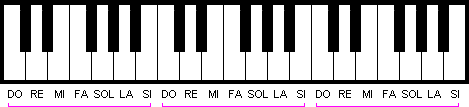
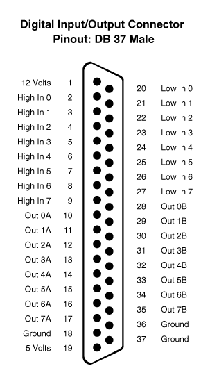
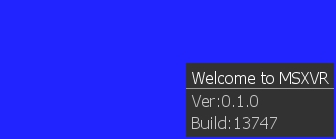
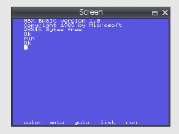
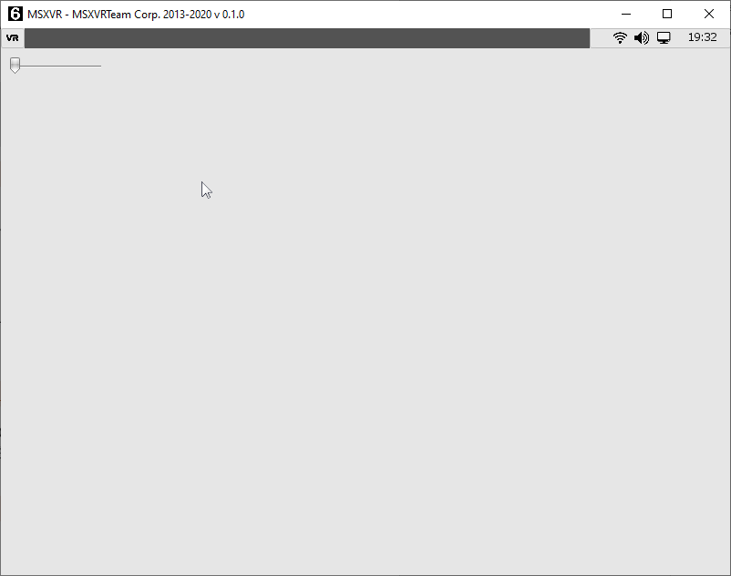
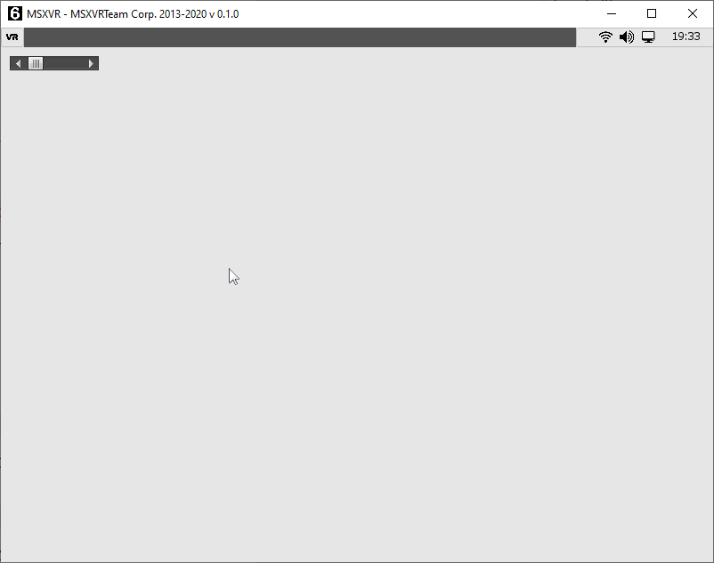
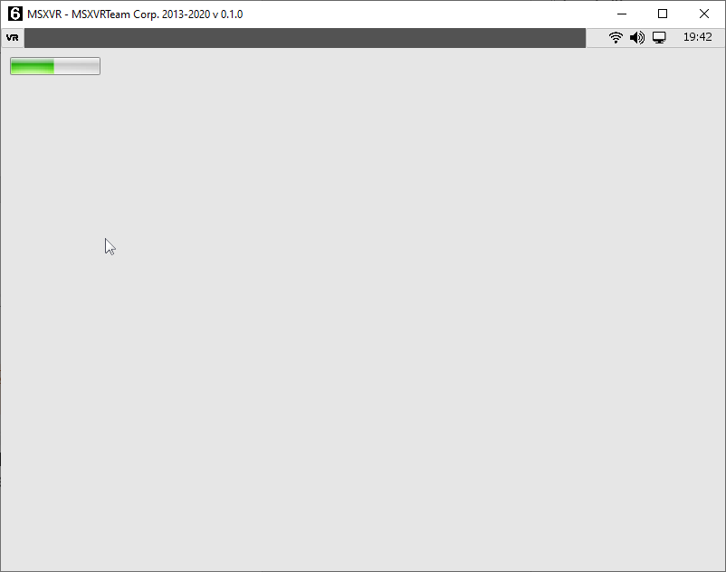
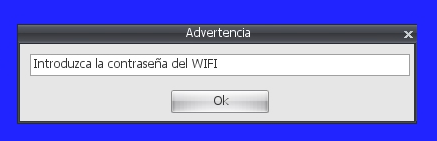
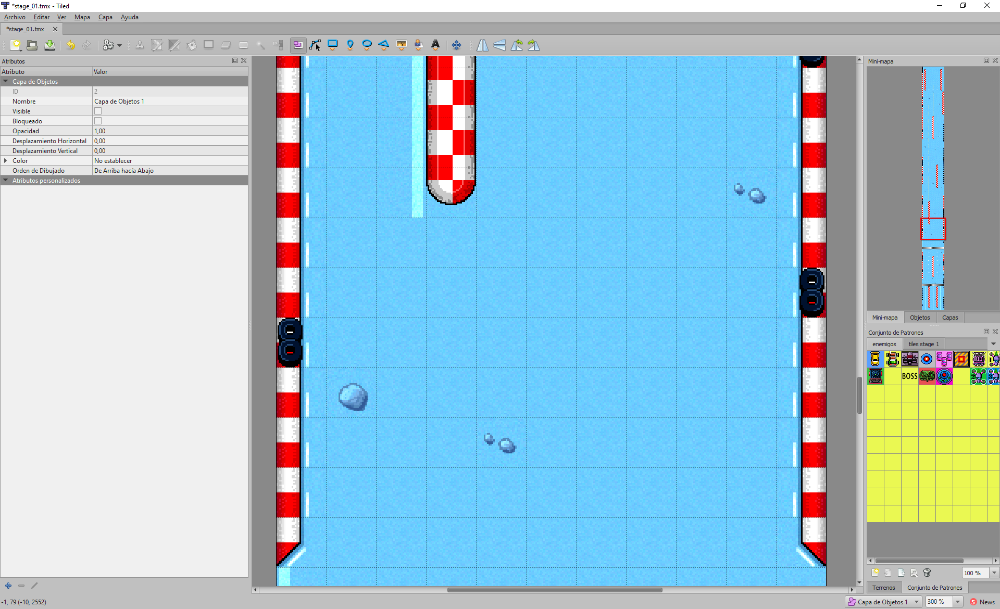

MANUAL DE PROGRAMACIÓN

**MSXVR**

# Editorial

MSX, MSX2, MSX2+, MSXturboR y MSX-DOS son marcas registradas de MSX Association
/ MSX Licensing Corporation.

MSX-BASIC es una marca registrada de Microsoft Corporation.

MSXVR es una marca registrada de VIKALB PROGRAMMING S.L.

© 2020 VIKALB PROGRAMMING S.L.

Autor: Alberto De Hoyo Nebot

1ª Edición: 2020 - Revisión 8

Derechos de edición reservados.

A pesar del cuidado con que ha sido compuesto el texto, ni la redacción ni el
editor aceptarán responsabilidad alguna por los daños que eventualmente pudieran
derivarse de algún error que pudiese contener esta edición.

Ninguna parte de este libro podrá ser reproducida, ni impresa, ni fotografiada,
ni microfilmada, ni copiada digitalmente, ni analógicamente ni con cualquier
otro método existente, sin el permiso del editor.

# Prólogo 

Detrás de un MSXVR se encuentra escondido todo un mundo, un mundo que está
determinado por una gran cantidad de marcas diferentes de ordenadores de 8 bits
que, curiosamente, comparten más similitudes que diferencias. En este caso,
MSXVR es una máquina compatible con la norma MSX y su intención es la de querer
preservarla en el tiempo.

El proyecto MSXVR pretende dar a conocer la informática clásica de los años
80-90, ampliando su potencial, pero conservando su esencia básica, la de
disponer de todo un sistema computacional con el que comunicarte, aprender,
desarrollar y jugar desde el primer momento en el que el sistema se inicia.

MSXVR anhela acercar a los nuevos usuarios y a los nostálgicos toda una nueva
forma de entender la informática. Forma que se ha ido perdiendo con los años
debido en parte a la gran evolución de la tecnología en tan poco tiempo y a la
potencia de los nuevos ordenadores. Querer simplificar la manera de comunicarse
con el ordenador reduce finalmente nuestro propio potencial y nos hace perder la
verdadera esencia de la informática. Querer simplificar nos hace querer ir
deprisa, querer llegar antes de tiempo, no abordar los detalles y, al final, no
aprender y disfrutar.

Toda esta problemática ha llevado a que la calidad de la programación baje
drásticamente en los últimos años. La programación, como tal, apenas existe, ya
que todo deriva en procesos automáticos, en aplicaciones drag & drop[^1] y otra
serie de herramientas que, sugieren que "programar" es simple y fácil.
Cualquiera puede hacerlo. Sin embargo, ese concepto de "programación" incurre en
precisamente lo contrario.

[^1]: Drag & drop hace referencia a la acción de arrastrar y soltar.

Programar requiere paciencia, ir poco a poco y subir de nivel a medida que se
consiguen los objetivos, para lo cual hay que dedicar tiempo. Cuanto más tiempo
dediques más rápido progresarás. Para aprender a programar se debe comenzar por
el principio. Así como a un niño cuando aprende a leer, no le das El Quijote,
del mismo modo hay que acercarse a la programación desde un modelo más sencillo.
El mismo que desarrollaron los primeros informáticos que quisieron acercar la
programación y la computación a los hogares de la gente.

Con este manual, pretendemos que viva de nuevo la informática clásica y que, si
un usuario que no la conoce, pueda conocerla y disfrutarla. Desde el primer
momento en el que enciende su ordenador MSXVR, arranca el DOS. Y el DOS ya
escucha sus comandos, espera que hable con el ordenador a través de su teclado.
A través del DOS podrá ir conociendo todas las sorpresas que aguardan en su
máquina y le podemos asegurar ¡¡que no son pocas!!

Esperamos que disfrute de la experiencia y le merezca la pena.

*A todos los "PRIMEROS", los que habéis participado en el primer lote de
unidades con vuestras reservas, los que habéis permitido que este proyecto pueda
salir a la luz. El mayor de los agradecimientos por nuestra parte, y que aquí
quede por escrito.*

*¡MUCHAS GRACIAS!*

# ¿Qué es un MSXVR?

Es un ordenador de aspecto retro que intenta recrear el espíritu de los
ordenadores clásicos de las décadas de los 80 y 90.

En este caso, no solo intenta asemejarse en aspecto, sino también en filosofía
de trabajo e interacción con la máquina.

MSXVR es una máquina compatible MSX[^2] a todos los niveles, pero también lo es
con otras máquinas que compartieron época con el mismo ordenador: ZX Spectrum,
Amstrad CPC, Commodore 64 y otras tantas que van sumándose a la lista de
posibles personalizaciones.

[^2]: MSX es el nombre de un estándar de microordenador doméstico de 8 bits
comercializado durante los años 80 y principios de los 90. Fue definido por
Kazuhiko Nishi y presentado el 27 de junio de 1983 en Japón.

Este ordenador, además, dispone de una serie de conexiones que le van a permitir
inventar y crear más allá de lo que sus conocimientos de programación le
permitan. No solo va a poder conectar sus propios dispositivos MSX, sino que
podrá conectar otros diseñados por usted mismo o por terceros para controlar
robots, juguetes electrónicos, estaciones meteorológicas, sensores para el
cuidado de la salud, teclados musicales, unidades de disco, impresoras, etc.

El ordenador viene acompañado de un sistema operativo y un conjunto de
herramientas para poder desarrollar juegos y aplicaciones en diferentes
lenguajes y para distintos sistemas. Incorpora herramientas para navegar por
Internet, dibujar, crear música, etc. En definitiva, pretende ofrecer una
estación de trabajo completa para poder no solo disfrutar de desarrollos
terceros, sino también de los suyos propios.

# Concepto y Términos

El concepto del MSXVR se basa en su independencia con el huésped donde se
encuentra. El planteamiento es que el mismo software pueda evolucionar/adaptarse
en diferentes entornos. De este modo se puede garantizar la supervivencia del
software a través del tiempo mediante posteriores revisiones del hardware que
mejoren la potencia y características de la máquina.

*Términos:*

| SISTEMA OPERATIVO BASE | Es el sistema operativo que inicia el ordenador. Por ejemplo: Un Linux, Android, Windows o uno creado ad hoc para un FPGA.                  |
|------------------------|---------------------------------------------------------------------------------------------------------------------------------------------|
| APLICACIÓN MSXVR       | Es una aplicación nativa creada para el Sistema Operativo Base.                                                                             |
| NATIVE ENGINE          | Hace referencia al conjunto de librerías nativas, compatibles con el Sistema Operativo Base y con un interfaz accesible mediante VR‑SCRIPT. |
| APLICACIÓN VR-SCRIPT   | Es una aplicación programada íntegramente en VR‑SCRIPT.                                                                                     |
| VR-OS                  | Hace referencia al sistema operativo creado en VR-SCRIPT y que define la interfaz entre el usuario y el ordenador.                          |
| VR-ENGINE              | Espina dorsal desde la cual las aplicaciones pueden acceder a todas las partes de VR-OS.                                                    |
| VR-BASIC               | Aplicación VR-SCRIPT que simula diferentes implementaciones del MSX-BASIC.                                                                  |
| VR-DOS                 | Aplicación VR-SCRIPT con apariencia similar al MSX-DOS y que permite interactuar mediante comandos.                                         |

## VR-BASIC

## ¿Qué es VR-BASIC?

VR-BASIC es un intérprete de comandos compatible con MSX-BASIC. Aporta nuevas
funcionalidades, pero sigue manteniendo la sencillez del BASIC original que
poseían las máquinas de los años 80-90.

#### La consola

~~~~~~~~~~~~~~~~~~~~~~~~~~~~~~~~~~~~~~~~~~~~~~~~~~~~~~~~~~~~~~~~~~~~~~~~~~~~~~~~
VR-BASIC version 1.0
Copyright MSXVR Team 2013-2017
3674453345 bytes free
Ok
~~~~~~~~~~~~~~~~~~~~~~~~~~~~~~~~~~~~~~~~~~~~~~~~~~~~~~~~~~~~~~~~~~~~~~~~~~~~~~~~

El VR-BASIC se presenta de esta forma, indicando su versión y esperando a que el
usuario introduzca instrucciones desde la posición del cursor intermitente. Para
introducir comandos hemos de escribir cosas que el VR-BASIC entienda: si las
entiende nos dirá que todo ha ido OK, pero si no es así nos dará un mensaje de
error.

Para introducir comandos usaremos la tecla retorno (ENTER). Primero escribiremos
el comando o la instrucción y seguidamente esta tecla.

Por ejemplo, escriba CLS y pulse la tecla ENTER: verá que la pantalla se limpia
y posteriormente aparecerá OK en la parte superior. Efectivamente, CLS (*clear
screen* en inglés) es un comando que sirve para borrar el contenido completo de
la pantalla, situando el cursor en la posición más arriba y a la izquierda.

Le instamos a que teclee otra instrucción; por ejemplo, un nombre:

~~~~~~~~~~~~~~~~~~~~~~~~~~~~~~~~~~~~~~~~~~~~~~~~~~~~~~~~~~~~~~~~~~~~~~~~~~~~~~~~
DANIEL
Syntax Error
Ok
~~~~~~~~~~~~~~~~~~~~~~~~~~~~~~~~~~~~~~~~~~~~~~~~~~~~~~~~~~~~~~~~~~~~~~~~~~~~~~~~

En este caso, no se reconoce DANIEL como ninguna instrucción válida, y se nos
avisa con un error de sintaxis por pantalla.

##### Teclas de función

Puede observar que en la parte de abajo de la pantalla hay 5 palabras, ¿Qué son?
Pues bien, es texto asociado a cada tecla de función (F1 al F5).

En este caso, el texto son instrucciones VR-BASIC más o menos comunes. Si pulsa
la tecla Mayúsculas (SHIFT) verá que salen otros textos: eso es porque esta
tecla se puede combinar al mismo tiempo con las de función.

## Texto

Existen dos comandos muy importantes y posiblemente, sean de los más utilizados
en este lenguaje. Estos comandos son PRINT e INPUT. Una pequeña descripción:

**PRINT**: Visualiza datos numéricos o alfanuméricos en la pantalla en modo
texto.

**INPUT**: Acepta datos introducidos desde el teclado y los asigna a una
variable.

Estos comandos están ampliamente documentados en el apartado de “*Lista de
comandos y funciones*”.

Estos dos comandos se pueden usar de modo directo en VR-BASIC, es decir, que los
podemos escribir directamente y pulsar ENTER para ejecutarlos:

| PRINT “Esto es un ejemplo”                     |   | Muestra en pantalla el texto introducido entre comillas.        |
| Esto es un ejemplo                             |   |                                                                 |
| Ok                                             |   |                                                                 |
|------------------------------------------------|---|-----------------------------------------------------------------|
| INPUT A                                        |   | Introducimos un valor numérico para la variable A.              |
| ? 4                                            |   |                                                                 |
| Ok                                             |   |                                                                 |
| PRINT A                                        |   | Muestra el contenido de la variable A.                          |
| 4                                              |   |                                                                 |
| Ok                                             |   |                                                                 |
| INPUT A\$                                      |   | Introducimos un valor alfanumérico para la variable A\$.        |
| ? Hola                                         |   |                                                                 |
| Ok                                             |   |                                                                 |
| PRINT A\$                                      |   | Muestra el contenido de la variable A\$.                        |
| Hola                                           |   |                                                                 |
| Ok                                             |   |                                                                 |
| INPUT                                          |   | Si no indicamos una variable, obtendremos un error de sintaxis. |
| ? Hola                                         |   |                                                                 |
| Syntax error                                   |   |                                                                 |

~~~~~~~~~~~~~~~~~~~~~~~~~~~~~~~~~~~~~~~~~~~~~~~~~~~~~~~~~~~~~~~~~~~~~~~~~~~~~~~~

~~~~~~~~~~~~~~~~~~~~~~~~~~~~~~~~~~~~~~~~~~~~~~~~~~~~~~~~~~~~~~~~~~~~~~~~~~~~~~~~

~~~~~~~~~~~~~~~~~~~~~~~~~~~~~~~~~~~~~~~~~~~~~~~~~~~~~~~~~~~~~~~~~~~~~~~~~~~~~~~~

~~~~~~~~~~~~~~~~~~~~~~~~~~~~~~~~~~~~~~~~~~~~~~~~~~~~~~~~~~~~~~~~~~~~~~~~~~~~~~~~

## Constantes y Variables

Conviene entender los conceptos de constante y variable. Una constante hace
referencia a un valor que nunca va a cambiar: por ejemplo, el número 5. Siempre
será el número 5, esto no va a cambiar. Es algo constante en el tiempo.

Sin embargo, una variable es como un cajón donde almacenamos constantes. O sea,
valores concretos. Por tanto, una variable sí puede contener distintos valores a
lo largo del tiempo.

Las variables en VR-BASIC se identifican con un nombre. Para el ordenador, esto
supone reservar un espacio en su memoria. Quiere decirse con esto que el número
de variables en un ordenador es finito y se termina. Todo dependerá de la
cantidad de memoria que tenga. Para su tranquilidad, son bastantes las que puede
usar.

Veamos cómo se define una variable: para ello utilizaremos la función **LET**.

~~~~~~~~~~~~~~~~~~~~~~~~~~~~~~~~~~~~~~~~~~~~~~~~~~~~~~~~~~~~~~~~~~~~~~~~~~~~~~~~
LET A = 5
~~~~~~~~~~~~~~~~~~~~~~~~~~~~~~~~~~~~~~~~~~~~~~~~~~~~~~~~~~~~~~~~~~~~~~~~~~~~~~~~

Así creamos nuestra variable A y le asignamos el número 5.

Si ahora hacemos:

~~~~~~~~~~~~~~~~~~~~~~~~~~~~~~~~~~~~~~~~~~~~~~~~~~~~~~~~~~~~~~~~~~~~~~~~~~~~~~~~
PRINT A
 5
~~~~~~~~~~~~~~~~~~~~~~~~~~~~~~~~~~~~~~~~~~~~~~~~~~~~~~~~~~~~~~~~~~~~~~~~~~~~~~~~

Efectivamente, vemos que se muestra su contenido. Por supuesto, podemos volver a
cambiar el valor tantas veces como queramos. Pruebe a darle otro valor y lo
verá:

~~~~~~~~~~~~~~~~~~~~~~~~~~~~~~~~~~~~~~~~~~~~~~~~~~~~~~~~~~~~~~~~~~~~~~~~~~~~~~~~
LET A = 12
PRINT A
 12
~~~~~~~~~~~~~~~~~~~~~~~~~~~~~~~~~~~~~~~~~~~~~~~~~~~~~~~~~~~~~~~~~~~~~~~~~~~~~~~~

Atención: en VR-BASIC las variables pueden tener el nombre que queramos, pero
internamente solo se hace caso a las dos primeras letras. Quiere decirse que, si
usamos la variable CONTADOR, es lo mismo que usar CO (el resto de letras se
ignoran).

Otra curiosidad es que se puede omitir el uso de LET. Por tanto, podemos hacer:

~~~~~~~~~~~~~~~~~~~~~~~~~~~~~~~~~~~~~~~~~~~~~~~~~~~~~~~~~~~~~~~~~~~~~~~~~~~~~~~~
A = 12
PRINT A
 12
~~~~~~~~~~~~~~~~~~~~~~~~~~~~~~~~~~~~~~~~~~~~~~~~~~~~~~~~~~~~~~~~~~~~~~~~~~~~~~~~

Hasta ahora hemos asignado números enteros a las variables, pero también podemos
asignar cadenas de texto (*strings* en su término inglés). Sin embargo, hay que
distinguir estas variables mediante un símbolo.

~~~~~~~~~~~~~~~~~~~~~~~~~~~~~~~~~~~~~~~~~~~~~~~~~~~~~~~~~~~~~~~~~~~~~~~~~~~~~~~~
A$ = "Hola"
PRINT A$
Hola
~~~~~~~~~~~~~~~~~~~~~~~~~~~~~~~~~~~~~~~~~~~~~~~~~~~~~~~~~~~~~~~~~~~~~~~~~~~~~~~~

Efectivamente, el símbolo es el \$ y sirve para diferenciar la variable como
numérica o como cadena de texto. Para el VR-BASIC, A y A\$ son dos variables
distintas:

~~~~~~~~~~~~~~~~~~~~~~~~~~~~~~~~~~~~~~~~~~~~~~~~~~~~~~~~~~~~~~~~~~~~~~~~~~~~~~~~
A = 10
A$ = "Casa"
PRINT A
 10
PRINT A$
Casa
~~~~~~~~~~~~~~~~~~~~~~~~~~~~~~~~~~~~~~~~~~~~~~~~~~~~~~~~~~~~~~~~~~~~~~~~~~~~~~~~

Por defecto, en VR-BASIC, cuando trabajamos con números, estos usan un formato
interno de doble precisión. Quiere decirse con esto que es un formato que usa
más memoria para almacenar el número, además de que su manipulación le cuesta
más tiempo al ordenador. Cierto es que al ser de doble precisión nos permite
almacenar números con más dígitos y más grandes.

Sin embargo, como bien sabemos, el ordenador tiene limitaciones de memoria y de
velocidad y a veces, como programadores, conviene ayudar al ordenador para
conseguir que este pueda hacer funcionar mejor los programas. A esta tarea se la
denomina **Optimizar**.

En VR-BASIC podemos indicar que queremos variables que almacenen números con
formatos más pequeños y rápidos de gestionar. Estos formatos son los números de
precisión simple y los números enteros.

Los más rápidos son los números enteros: no permiten usar decimales, pero son
los más comunes a la hora de programar. Para indicar al VR-BASIC que queremos
tener una variable de tipo entero y que use este tipo de número, aplicaremos el
símbolo (%). Al igual que hacemos con las cadenas de caracteres, podemos indicar
que una variable es entera así:

~~~~~~~~~~~~~~~~~~~~~~~~~~~~~~~~~~~~~~~~~~~~~~~~~~~~~~~~~~~~~~~~~~~~~~~~~~~~~~~~
A% = 5
~~~~~~~~~~~~~~~~~~~~~~~~~~~~~~~~~~~~~~~~~~~~~~~~~~~~~~~~~~~~~~~~~~~~~~~~~~~~~~~~

Del mismo modo, podemos indicar que una variable es de precisión simple con el
símbolo (!):

~~~~~~~~~~~~~~~~~~~~~~~~~~~~~~~~~~~~~~~~~~~~~~~~~~~~~~~~~~~~~~~~~~~~~~~~~~~~~~~~
A! = 3.33
~~~~~~~~~~~~~~~~~~~~~~~~~~~~~~~~~~~~~~~~~~~~~~~~~~~~~~~~~~~~~~~~~~~~~~~~~~~~~~~~

NOTA: Aunque no sea necesario hacerlo, podemos indicar explícitamente que
queremos usar valores de precisión doble usando el símbolo (\#). Por ejemplo:
A\# = 10\# / 3\# vendría a ser lo mismo que A = 10 / 3

Ya que ahora sabemos que tenemos diferentes formatos de números, también
conviene saber que los números enteros se pueden expresar de diferentes formas,
refiriéndose todas ellas al mismo valor numérico. En VR-BASIC podemos expresar
números enteros en formato **Binario**, **Octal**, **Decimal** y
**Hexadecimal**.

Por ejemplo, el valor 32 en decimal corresponde al mismo número en:

-   **&B**00100000 en binario

-   **&O**40 en octal

-   **&H**20 en hexadecimal

Observe cómo utilizamos ciertos prefijos (&B, &O, &H) para indicar si el número
está siendo expresado en un formato u otro.

Un número decimal (BASE 10) es aquel que utiliza 10 dígitos (del 0 al 9) para
representarse. Pues bien, un número binario (BASE 2) utiliza 2 dígitos (el 0 y
el 1), uno en octal (BASE 8) utiliza 8 dígitos (del 0 al 7) y en hexadecimal
(BASE 16) utiliza 16 dígitos (del 0 al 15).

NOTA: El binario es el formato más usado en informática debido a la forma de
operar de los ordenadores. Los ordenadores trabajan internamente con ceros y
unos. Según la corriente eléctrica que circula por los circuitos del ordenador,
este entiende que le llegan unos o ceros.

Veamos cómo funciona esto de las bases, imagine el número 4736 en decimal:

| 4 | 103 = 1000 | 4 x 1000 = 4000 | 4000     |
|---|------------|-----------------|----------|
| 7 | 102 = 100  | 7 x 100 = 700   | 700      |
| 3 | 101 = 10   | 3 x 10 = 30     | 30       |
| 6 | 100 = 1    | 6 x 1 = 6       | 6        |
|   |            | SUMA            | **4736** |

Ahora veamos cómo convertir &B10101101 a decimal:

| 1 | 27 = 128 | 1 x 128 | 128     |
|---|----------|---------|---------|
| 0 | 26 = 64  | 0 x 64  | 0       |
| 1 | 25 = 32  | 1 x 32  | 32      |
| 0 | 24 = 16  | 0 x 16  | 0       |
| 1 | 23 = 8   | 1 x 8   | 8       |
| 1 | 22 = 4   | 1 x 4   | 4       |
| 0 | 21 = 2   | 0 x 2   | 0       |
| 1 | 20 = 1   | 1 x 1   | 1       |
|   |          | SUMA    | **173** |

Con la misma lógica podemos convertir números de octal y hexadecimal a decimal.
Eso sí, debe saber que, en hexadecimal, los dígitos correspondientes a los
valores decimales del 10 al 15 se escriben con las letras A, B, C, D, E, F
respectivamente.

&HFF es igual al número decimal 255 y al &B11111111 en binario.

&H0F es igual al número decimal 15 y al &B00001111 en binario.

## Expresiones

Como parte de las expresiones consideraremos: constantes, variables, funciones y
operadores.

#### OPERADORES ARITMÉTICOS

| Operador | Semántica             | Ejemplo  | Prioridad |
|----------|-----------------------|----------|-----------|
| \+       | Suma                  | X + Y    | 6         |
| \-       | Resta                 | X - Y    | 6         |
| \*       | Multiplicación        | X \* Y   | 3         |
| /        | División              | X / Y    | 3         |
| \^       | Potencia              | X \^ Y   | 1         |
| \-       | Negación              | \-X      | 2         |
| \\       | División Entera       | X \\ Y   | 4         |
| MOD      | Resto de una división | X MOD 10 | 5         |

La prioridad indica qué operadores se aplicarán antes que otros. A menor
prioridad, antes se calculará la expresión.

#### OPERADORES CONDICIONALES

| Operador   | Semántica     | Ejemplo            |
|------------|---------------|--------------------|
| =          | Igual         | X = Y              |
| \<         | Menor         | X \< Y             |
| \>         | Mayor         | X \> Y             |
| \>\<, \<\> | Distinto      | X \>\< Y, X \<\> Y |
| \<=, =\<   | Menor o igual | X \<= Y, X =\< Y   |
| \>=, =\>   | Mayor o igual | X \>= Y, X =\> Y   |

El resultado de una expresión condicional siempre tendrá o bien el valor -1
(VERDADERO) o bien el valor 0 (FALSO).

#### PARÉNTESIS

Puede usar paréntesis para forzar que se evalúen algunas partes de una expresión
antes que otras. Esto puede invalidar el orden de prioridad y la asociatividad
de izquierda a derecha. VR-BASIC siempre realiza las operaciones que se incluyen
entre paréntesis antes de las externas. Sin embargo, dentro del paréntesis se
mantiene la prioridad y la asociatividad ordinarias, a menos que use paréntesis
dentro de los paréntesis.

Un ejemplo:

~~~~~~~~~~~~~~~~~~~~~~~~~~~~~~~~~~~~~~~~~~~~~~~~~~~~~~~~~~~~~~~~~~~~~~~~~~~~~~~~
PRINT 15 + (7 + 3) * (100 - 3)
 985
Ok
~~~~~~~~~~~~~~~~~~~~~~~~~~~~~~~~~~~~~~~~~~~~~~~~~~~~~~~~~~~~~~~~~~~~~~~~~~~~~~~~

#### OPERADORES LÓGICOS

| Operador | Semántica       | Tabla de verdad |       |         |   |   |   |   |   |   |   |   |   |   |   |   |
|----------|-----------------|-----------------|-------|---------|---|---|---|---|---|---|---|---|---|---|---|---|
| NOT      | Negación Lógica | X               | NOT X |         |   |   |   |   |   |   |   |   |   |   |   |   |
| 0        | 1               |                 |       |         |   |   |   |   |   |   |   |   |   |   |   |   |
| 1        | 0               |                 |       |         |   |   |   |   |   |   |   |   |   |   |   |   |
| AND      | Producto Lógico | X               | Y     | X AND Y |   |   |   |   |   |   |   |   |   |   |   |   |
| 0        | 0               | 0               |       |         |   |   |   |   |   |   |   |   |   |   |   |   |
| 0        | 1               | 0               |       |         |   |   |   |   |   |   |   |   |   |   |   |   |
| 1        | 0               | 0               |       |         |   |   |   |   |   |   |   |   |   |   |   |   |
| 1        | 1               | 1               |       |         |   |   |   |   |   |   |   |   |   |   |   |   |
| OR       | Suma Lógica     | X               | Y     | X OR Y  |   |   |   |   |   |   |   |   |   |   |   |   |
| 0        | 0               | 0               |       |         |   |   |   |   |   |   |   |   |   |   |   |   |
| 0        | 1               | 1               |       |         |   |   |   |   |   |   |   |   |   |   |   |   |
| 1        | 0               | 1               |       |         |   |   |   |   |   |   |   |   |   |   |   |   |
| 1        | 1               | 1               |       |         |   |   |   |   |   |   |   |   |   |   |   |   |
| XOR      | OR Exclusivo    | X               | Y     | X XOR Y |   |   |   |   |   |   |   |   |   |   |   |   |
| 0        | 0               | 0               |       |         |   |   |   |   |   |   |   |   |   |   |   |   |
| 0        | 1               | 1               |       |         |   |   |   |   |   |   |   |   |   |   |   |   |
| 1        | 0               | 1               |       |         |   |   |   |   |   |   |   |   |   |   |   |   |
| 1        | 1               | 0               |       |         |   |   |   |   |   |   |   |   |   |   |   |   |
| EQV      | XOR Negado      | X               | Y     | X EQV Y |   |   |   |   |   |   |   |   |   |   |   |   |
| 0        | 0               | 1               |       |         |   |   |   |   |   |   |   |   |   |   |   |   |
| 0        | 1               | 0               |       |         |   |   |   |   |   |   |   |   |   |   |   |   |
| 1        | 0               | 0               |       |         |   |   |   |   |   |   |   |   |   |   |   |   |
| 1        | 1               | 1               |       |         |   |   |   |   |   |   |   |   |   |   |   |   |
| IMP      | Implicación     | X               | Y     | X IMP Y |   |   |   |   |   |   |   |   |   |   |   |   |
| 0        | 0               | 1               |       |         |   |   |   |   |   |   |   |   |   |   |   |   |
| 0        | 1               | 1               |       |         |   |   |   |   |   |   |   |   |   |   |   |   |
| 1        | 0               | 0               |       |         |   |   |   |   |   |   |   |   |   |   |   |   |
| 1        | 1               | 1               |       |         |   |   |   |   |   |   |   |   |   |   |   |   |

## Matemáticas

En este apartado veremos el conjunto de instrucciones y operadores del que
dispone VR‑BASIC para hacer cálculos matemáticos, desde los más sencillos hasta
los más complejos.

#### Funciones 

**ABS** - Devuelve el valor absoluto de un número (el valor sin signo).

**ATN** - Devuelve el arco tangente. Valor entre –pi/2 y pi/2.

**TAN** - Devuelve la tangente del número (medido en radianes).

**COS** - Devuelve el coseno de un ángulo (medido en radianes).

**SIN** - Devuelve el seno de un ángulo (medido en radianes). 

**LOG** - Devuelve el logaritmo natural o neperiano (base e). 

**EXP** - Devuelve la exponencial (e elevado al número). 

**RND** - Devuelve un número aleatorio entre 0 y 1.

**SQR** - Devuelve la raíz cuadrada de un número. 

**INT** - Devuelve el mayor número entero que es menor o igual que el número
dado.

**SNG** - Da el valor -1, 0 o 1, dependiendo del signo del número o de si vale
cero.

#### Operadores

| Suma                     | \+  | 5 + 3   |
|--------------------------|-----|---------|
| Diferencia               | \-  | 5 – 3   |
| Producto/Multiplicación  | \*  | 5 \* 3  |
| División                 | /   | 5 / 3   |
| Potencia                 | \^  | 2 \^ 3  |
| Negar o cambiar el signo | \-X | \-5     |
| Módulo                   | MOD | 5 MOD 3 |
|                          |     |         |

#### Prioridad de operadores

Las expresiones se evalúan de izquierda a derecha. Dentro de la misma prioridad,
se ejecutan primero los operadores de más a la izquierda.

Dentro de una expresión se efectúan en este orden de prioridad:

1.  Los paréntesis

2.  La potencia

3.  La multiplicación y la división

4.  Cambiar el signo

5.  El módulo

6.  La suma y la resta

## Crear programas

En esta sección introduciremos todo lo necesario para crear y manipular nuestros
programas VR-BASIC. Pero antes, ¿qué es un **programa**? Pues se trata de una
secuencia de instrucciones que podemos almacenar, modificar y ejecutar tantas
veces como queramos. En VR-BASIC las instrucciones de los programas se asocian a
números de línea. Cada número de línea puede almacenar una o varias
instrucciones.

~~~~~~~~~~~~~~~~~~~~~~~~~~~~~~~~~~~~~~~~~~~~~~~~~~~~~~~~~~~~~~~~~~~~~~~~~~~~~~~~
10 REM Este es mi primer programa
20 CLS
30 PRINT "Hola mundo"
40 END
~~~~~~~~~~~~~~~~~~~~~~~~~~~~~~~~~~~~~~~~~~~~~~~~~~~~~~~~~~~~~~~~~~~~~~~~~~~~~~~~

Desde la consola VR-BASIC podemos crear un programa simplemente precediendo de
un número el texto que escribamos. Por ejemplo:

~~~~~~~~~~~~~~~~~~~~~~~~~~~~~~~~~~~~~~~~~~~~~~~~~~~~~~~~~~~~~~~~~~~~~~~~~~~~~~~~
10 PRINT "Hola Mundo"
~~~~~~~~~~~~~~~~~~~~~~~~~~~~~~~~~~~~~~~~~~~~~~~~~~~~~~~~~~~~~~~~~~~~~~~~~~~~~~~~

Observamos que el PRINT no se realiza, no se ejecuta. Eso es porque el
intérprete VR‑BASIC ha creado y almacenado nuestra primera línea de programa.

Vamos a ejecutar nuestro programa. Para ello está la instrucción **RUN**. Verá
que al ejecutarla se muestra el texto "Hola Mundo" en pantalla. Podemos ejecutar
RUN tantas veces como queramos y siempre saldrá el mismo texto en pantalla.

Para mostrar el listado de instrucciones de nuestro programa usaremos la
instrucción **LIST**.

Habitualmente se suelen usar los números de línea de 10 en 10. Esto es así para
tener huecos donde poder crear nuevos números de línea, tanto antes como después
de una en particular. ¿Qué pasa si después de crear nuevos números de línea nos
quedamos sin huecos libres? Para ello existe la instrucción **RENUM**. Esta
instrucción permite renumerar las líneas otra vez para volver a tener huecos de
nuevo.

Por ejemplo, agregue este número de línea:

~~~~~~~~~~~~~~~~~~~~~~~~~~~~~~~~~~~~~~~~~~~~~~~~~~~~~~~~~~~~~~~~~~~~~~~~~~~~~~~~
5 CLS
~~~~~~~~~~~~~~~~~~~~~~~~~~~~~~~~~~~~~~~~~~~~~~~~~~~~~~~~~~~~~~~~~~~~~~~~~~~~~~~~

Ahora haga AUTO y a continuación un LIST. Verá que sale lo siguiente:

~~~~~~~~~~~~~~~~~~~~~~~~~~~~~~~~~~~~~~~~~~~~~~~~~~~~~~~~~~~~~~~~~~~~~~~~~~~~~~~~
10 CLS
20 PRINT "Hola Mundo"
~~~~~~~~~~~~~~~~~~~~~~~~~~~~~~~~~~~~~~~~~~~~~~~~~~~~~~~~~~~~~~~~~~~~~~~~~~~~~~~~

Recuerde que CLS es una instrucción que le permite limpiar toda la pantalla,
colocando el cursor en la posición superior-izquierda de la pantalla.

Ahora ya tenemos nuestro programa y resulta que hemos de dejarlo para continuar
en otro momento. Si apagamos el ordenador lo perderemos todo. Así que es
necesario saber cómo guardar y recuperar nuestros programas. Para ello se
utilizan las instrucciones SAVE y LOAD.

Por ejemplo:

~~~~~~~~~~~~~~~~~~~~~~~~~~~~~~~~~~~~~~~~~~~~~~~~~~~~~~~~~~~~~~~~~~~~~~~~~~~~~~~~
SAVE "miprograma.bas"
~~~~~~~~~~~~~~~~~~~~~~~~~~~~~~~~~~~~~~~~~~~~~~~~~~~~~~~~~~~~~~~~~~~~~~~~~~~~~~~~

Permite guardar nuestro programa VR-BASIC en un archivo de la unidad de
almacenamiento por defecto. El nombre del archivo utilizado será
"miprograma.bas". Si tras el guardado usamos la instrucción **FILES**, veremos
que efectivamente nuestro archivo está entre la lista de los que ya tenemos.

Para recuperar nuestro programa en otro momento haremos:

~~~~~~~~~~~~~~~~~~~~~~~~~~~~~~~~~~~~~~~~~~~~~~~~~~~~~~~~~~~~~~~~~~~~~~~~~~~~~~~~
LOAD "miprograma.bas"
~~~~~~~~~~~~~~~~~~~~~~~~~~~~~~~~~~~~~~~~~~~~~~~~~~~~~~~~~~~~~~~~~~~~~~~~~~~~~~~~

NOTA: Cuidado con esto, porque si tenemos un programa ya en memoria y hacemos la
carga de otro, lo perderemos.

Otra cosa que debemos saber sobre la gestión de los programas en VR-BASIC es ¿y
cómo hacer para borrar un programa que ya tenga en memoria? Porque claro, puede
que tenga uno y necesite comenzar otro. Esto se haría con la instrucción
**NEW**. Ejecutamos este comando y el programa que tengamos se borrará: puede
comprobarlo y verificar que no hay nada usando LIST.

Otra acción bastante requerida a la hora de escribir un programa es borrar
números de línea o escribir código nuevo en una línea en concreto. Si ya tenemos
un número de línea usado (con instrucciones y que se puede ver haciendo LIST) y
queremos sustituirla por un nuevo código, simplemente hemos de reescribir ese
número de línea. Si lo que queremos es borrar la línea, podemos simplemente
escribir el número y pulsar retorno (tecla ENTER) o bien podemos usar la
instrucción **DELETE**. Por ejemplo:

~~~~~~~~~~~~~~~~~~~~~~~~~~~~~~~~~~~~~~~~~~~~~~~~~~~~~~~~~~~~~~~~~~~~~~~~~~~~~~~~
DELETE 10
~~~~~~~~~~~~~~~~~~~~~~~~~~~~~~~~~~~~~~~~~~~~~~~~~~~~~~~~~~~~~~~~~~~~~~~~~~~~~~~~

Es interesante conocer y saber utilizar toda esta forma de interactuar con los
programas. Sin embargo, en VR-BASIC existe un editor de texto pensado para la
programación y que se invoca desde el intérprete con la instrucción **CALL
EDIT** o bien con la versión abreviada **\_EDIT**. Este editor facilita algunas
cosas de las vistas anteriormente, además de que tiene resaltado de sintaxis
para ver mejor el código, entre otras funcionalidades muy interesantes.

#### Uso de etiquetas

Otra de las ventajas incluidas en el VR-BASIC es la capacidad de usar etiquetas
o identificadores en formato texto para poder hacer referencia a ellas en el
momento que se requiera e identificar alguna zona del código.

~~~~~~~~~~~~~~~~~~~~~~~~~~~~~~~~~~~~~~~~~~~~~~~~~~~~~~~~~~~~~~~~~~~~~~~~~~~~~~~~
1 @main:
2 print "Hola!"
3 gosub @subrutina1
4 end
5 @subrutina1:
6 print "yeira!"
7 return
~~~~~~~~~~~~~~~~~~~~~~~~~~~~~~~~~~~~~~~~~~~~~~~~~~~~~~~~~~~~~~~~~~~~~~~~~~~~~~~~

Desde el editor es posible agregar código sin números de línea. Cuando se
ejecuta este código, el editor se encarga de agregarlos para ser compatible con
la edición desde la consola VR-BASIC. Nótese que el archivo de texto que se
guarda desde el editor no contendrá los números de línea.

## Comentar código

Llega un momento en el que las dimensiones de nuestro programa serán
considerables y su número de líneas elevado. Habrá multitud de rutinas y zonas
de código, por lo que será necesario ayudar a la vista y memoria del
programador. Afortunadamente, el lenguaje de programación VR-BASIC dispone de la
opción de agregar comentarios. La instrucción se denomina **REM** y la forma de
usarla es como la del siguiente ejemplo:

~~~~~~~~~~~~~~~~~~~~~~~~~~~~~~~~~~~~~~~~~~~~~~~~~~~~~~~~~~~~~~~~~~~~~~~~~~~~~~~~
10 REM Esto es un comentario
~~~~~~~~~~~~~~~~~~~~~~~~~~~~~~~~~~~~~~~~~~~~~~~~~~~~~~~~~~~~~~~~~~~~~~~~~~~~~~~~

También se puede usar el símbolo ‘ de la forma:

~~~~~~~~~~~~~~~~~~~~~~~~~~~~~~~~~~~~~~~~~~~~~~~~~~~~~~~~~~~~~~~~~~~~~~~~~~~~~~~~
10 ‘ Esto es un comentario
~~~~~~~~~~~~~~~~~~~~~~~~~~~~~~~~~~~~~~~~~~~~~~~~~~~~~~~~~~~~~~~~~~~~~~~~~~~~~~~~

Consejos a la hora de documentar nuestro programa.

-   Agregar, al comienzo del todo, información sobre el título, fecha de
    creación, lo que hace vuestro programa, el nombre del programador, cualquier
    consideración genérica o importante que convenga señalar.

-   Antes de cualquier subrutina, indicar su nombre, parámetros de entrada y de
    salida, comentario respecto a lo que hace o datos importantes que se deben
    conocer sobre su uso.

-   Intentar comentar aquellas zonas de código complejas o que asumamos como
    complejas o difíciles de entender. Hay que pensar siempre que el código
    puede acabar en manos de otro programador. Incluso a nosotros mismos, tras
    mucho tiempo después de haberlo hecho, se nos pueden olvidar ciertos
    detalles que ayuden a su comprensión.

## Bucles

Una de las ventajas de los programas es su capacidad de repetir acciones
indefinidamente y siempre de la misma forma. Pues bien, una de las cosas que a
su vez hacen todos los programas es ejecutar una y otra vez los mismos trozos de
código (secuencia de instrucciones)

Los Bucles son una forma de indicar que algo se repite una y otra vez, bien de
forma indefinida o bien un determinado número de veces. En VR-BASIC existen
varias formas de realizar esto, y cada una de ellas se utiliza con un fin.

#### GOTO

Con GOTO podemos cambiar la instrucción siguiente a ejecutar. La forma de
ejecutar un programa es ir línea a línea, en orden, una detrás de otra,
ejecutando todas las instrucciones a su paso. Sin embargo, usando GOTO
permitimos romper esta situación y hacer que la siguiente instrucción a ejecutar
esté antes o después de la línea en la que estamos.

~~~~~~~~~~~~~~~~~~~~~~~~~~~~~~~~~~~~~~~~~~~~~~~~~~~~~~~~~~~~~~~~~~~~~~~~~~~~~~~~
10 I = 1
20 PRINT I
30 I = I + 1
40 IF I < 10 THEN GOTO 20
50 END
~~~~~~~~~~~~~~~~~~~~~~~~~~~~~~~~~~~~~~~~~~~~~~~~~~~~~~~~~~~~~~~~~~~~~~~~~~~~~~~~

~~~~~~~~~~~~~~~~~~~~~~~~~~~~~~~~~~~~~~~~~~~~~~~~~~~~~~~~~~~~~~~~~~~~~~~~~~~~~~~~

~~~~~~~~~~~~~~~~~~~~~~~~~~~~~~~~~~~~~~~~~~~~~~~~~~~~~~~~~~~~~~~~~~~~~~~~~~~~~~~~

#### FOR / NEXT

Permite definir, entre un FOR y un NEXT, una serie de instrucciones para que se
repitan, generalmente un número de veces determinado. En el siguiente ejemplo,
imprimiremos por pantalla los números del 1 al 10.

~~~~~~~~~~~~~~~~~~~~~~~~~~~~~~~~~~~~~~~~~~~~~~~~~~~~~~~~~~~~~~~~~~~~~~~~~~~~~~~~
10 FOR I = 1 TO 10
20 PRINT I
30 NEXT I
~~~~~~~~~~~~~~~~~~~~~~~~~~~~~~~~~~~~~~~~~~~~~~~~~~~~~~~~~~~~~~~~~~~~~~~~~~~~~~~~

~~~~~~~~~~~~~~~~~~~~~~~~~~~~~~~~~~~~~~~~~~~~~~~~~~~~~~~~~~~~~~~~~~~~~~~~~~~~~~~~

~~~~~~~~~~~~~~~~~~~~~~~~~~~~~~~~~~~~~~~~~~~~~~~~~~~~~~~~~~~~~~~~~~~~~~~~~~~~~~~~

#### GOSUB / RETURN

Permite gestionar la llamada a ciertas zonas de código genéricas funcionando
como subrutinas. Se usa para hacer una operación en concreto (algo que repetimos
muchas veces y se ubica en otro número de línea) y volver justo donde estábamos,
sin tener que escribir varias veces las instrucciones de la operación que se
repite.

~~~~~~~~~~~~~~~~~~~~~~~~~~~~~~~~~~~~~~~~~~~~~~~~~~~~~~~~~~~~~~~~~~~~~~~~~~~~~~~~
10 CLS
20 A = 5 : GOSUB 100
30 A = 6 : GOSUB 100
40 A = 7 : GOSUB 100
50 END
100 ‘ Mi subrutina
110 PRINT "Aqui imprimo A:";A
120 RETURN
~~~~~~~~~~~~~~~~~~~~~~~~~~~~~~~~~~~~~~~~~~~~~~~~~~~~~~~~~~~~~~~~~~~~~~~~~~~~~~~~

~~~~~~~~~~~~~~~~~~~~~~~~~~~~~~~~~~~~~~~~~~~~~~~~~~~~~~~~~~~~~~~~~~~~~~~~~~~~~~~~

~~~~~~~~~~~~~~~~~~~~~~~~~~~~~~~~~~~~~~~~~~~~~~~~~~~~~~~~~~~~~~~~~~~~~~~~~~~~~~~~

#### ON / GOTO

Permite usar condiciones al mismo tiempo que la instrucción GOTO. O sea, según
el valor de una variable podemos decidir a dónde saltar. Veamos un ejemplo:

~~~~~~~~~~~~~~~~~~~~~~~~~~~~~~~~~~~~~~~~~~~~~~~~~~~~~~~~~~~~~~~~~~~~~~~~~~~~~~~~
10 INPUT K
20 ON K GOTO 30, 50
30 PRINT "K ES 1"
40 GOTO 70
50 PRINT "K ES 2"
60 GOTO 70
70 END
~~~~~~~~~~~~~~~~~~~~~~~~~~~~~~~~~~~~~~~~~~~~~~~~~~~~~~~~~~~~~~~~~~~~~~~~~~~~~~~~

~~~~~~~~~~~~~~~~~~~~~~~~~~~~~~~~~~~~~~~~~~~~~~~~~~~~~~~~~~~~~~~~~~~~~~~~~~~~~~~~

~~~~~~~~~~~~~~~~~~~~~~~~~~~~~~~~~~~~~~~~~~~~~~~~~~~~~~~~~~~~~~~~~~~~~~~~~~~~~~~~

Otro ejemplo:

~~~~~~~~~~~~~~~~~~~~~~~~~~~~~~~~~~~~~~~~~~~~~~~~~~~~~~~~~~~~~~~~~~~~~~~~~~~~~~~~
10 CLS
20 PRINT "MENU DE OPCIONES"
30 PRINT "1.- PREGUNTAR NOMBRE"
40 PRINT "2.- MOSTRAR NOMBRE"
50 PRINT "3.- SALIR"
60 INPUT "Opción";OP
70 ON OP GOTO 80, 100, 120
80 INPUT "Dime un nombre";N$
90 GOTO 60
100 PRINT "Nombre actual:";N$
110 GOTO 60
120 END
~~~~~~~~~~~~~~~~~~~~~~~~~~~~~~~~~~~~~~~~~~~~~~~~~~~~~~~~~~~~~~~~~~~~~~~~~~~~~~~~

## Condiciones

En VR-BASIC contamos con las sentencias IF, THEN, ELSE para poder controlar el
flujo de ejecución de nuestros programas mediante la evaluación de expresiones
condicionales.

~~~~~~~~~~~~~~~~~~~~~~~~~~~~~~~~~~~~~~~~~~~~~~~~~~~~~~~~~~~~~~~~~~~~~~~~~~~~~~~~
IF expresión_condicional THEN sentencias
IF expresión_condicional THEN sentencias ELSE sentencias
IF expresión_condicional GOTO <número> [ELSE <número>]
~~~~~~~~~~~~~~~~~~~~~~~~~~~~~~~~~~~~~~~~~~~~~~~~~~~~~~~~~~~~~~~~~~~~~~~~~~~~~~~~

~~~~~~~~~~~~~~~~~~~~~~~~~~~~~~~~~~~~~~~~~~~~~~~~~~~~~~~~~~~~~~~~~~~~~~~~~~~~~~~~

~~~~~~~~~~~~~~~~~~~~~~~~~~~~~~~~~~~~~~~~~~~~~~~~~~~~~~~~~~~~~~~~~~~~~~~~~~~~~~~~

Las expresiones condicionales utilizan operadores condicionales, como se
comentan en el apartado de la página 28.

Las expresiones condicionales devuelven un valor VERDADERO o FALSO. A este tipo
de valores se les denomina Booleanos. Numéricamente, el 0 correspondería a FALSO
y otro valor distinto de cero correspondería a VERDADERO.

Cuando la expresión condicional devuelve VERDADERO, se ejecutan las sentencias
del THEN. Si la expresión devuelve FALSO, se ejecutarán las sentencias del ELSE
(siempre que se estén usando).

Ejemplo:

~~~~~~~~~~~~~~~~~~~~~~~~~~~~~~~~~~~~~~~~~~~~~~~~~~~~~~~~~~~~~~~~~~~~~~~~~~~~~~~~
10 INPUT "Que edad tienes";A
20 IF A < 18 THEN PRINT "Eres joven":END ELSE PRINT "Eres adulto"
~~~~~~~~~~~~~~~~~~~~~~~~~~~~~~~~~~~~~~~~~~~~~~~~~~~~~~~~~~~~~~~~~~~~~~~~~~~~~~~~

~~~~~~~~~~~~~~~~~~~~~~~~~~~~~~~~~~~~~~~~~~~~~~~~~~~~~~~~~~~~~~~~~~~~~~~~~~~~~~~~

~~~~~~~~~~~~~~~~~~~~~~~~~~~~~~~~~~~~~~~~~~~~~~~~~~~~~~~~~~~~~~~~~~~~~~~~~~~~~~~~

Otro ejemplo:

~~~~~~~~~~~~~~~~~~~~~~~~~~~~~~~~~~~~~~~~~~~~~~~~~~~~~~~~~~~~~~~~~~~~~~~~~~~~~~~~
10 INPUT "Área del cuadrado o del triangulo (C o T) ";A$
20 IF A$ = "C" GOTO 40 ELSE IF A$ = "T" GOTO 70 ELSE 10
30 REM ---
40 INPUT "Dime cuanto mide el lado";S
50 PRINT "El área del cuadrado es: "; S*S
60 END
70 INPUT "Dime cuanto mide la altura";H
80 INPUT "Dime cuanto mide la base";B
90 PRINT "El área del triangulo es"; B*H/2
100 END
~~~~~~~~~~~~~~~~~~~~~~~~~~~~~~~~~~~~~~~~~~~~~~~~~~~~~~~~~~~~~~~~~~~~~~~~~~~~~~~~

## Tablas (Arrays)

En muchos programas hay necesidad de disponer de gran número de variables.
Podríamos pensar, por ejemplo, en un programa para la administración de
existencias en un almacén. Si para cada artículo almacenado tenemos que reflejar
en el programa una variable diferente, el programa sería enorme y poco usable,
además de que gestionar el agregado y borrado de estos artículos se convertiría
en una tarea irremediablemente tediosa.

Por suerte, en el VR-BASIC tenemos la instrucción DIM. Esta permite reservar
espacio de acceso indexado utilizando para ello un único nombre de variable.

Por ejemplo:

~~~~~~~~~~~~~~~~~~~~~~~~~~~~~~~~~~~~~~~~~~~~~~~~~~~~~~~~~~~~~~~~~~~~~~~~~~~~~~~~
DIM A(100)
~~~~~~~~~~~~~~~~~~~~~~~~~~~~~~~~~~~~~~~~~~~~~~~~~~~~~~~~~~~~~~~~~~~~~~~~~~~~~~~~

Con esta instrucción reservamos 101 variables realmente. Para acceder a cada una
de ellas usaremos la forma:

~~~~~~~~~~~~~~~~~~~~~~~~~~~~~~~~~~~~~~~~~~~~~~~~~~~~~~~~~~~~~~~~~~~~~~~~~~~~~~~~
A(0), A(1), A(2) … A(100)
~~~~~~~~~~~~~~~~~~~~~~~~~~~~~~~~~~~~~~~~~~~~~~~~~~~~~~~~~~~~~~~~~~~~~~~~~~~~~~~~

Otro ejemplo:

~~~~~~~~~~~~~~~~~~~~~~~~~~~~~~~~~~~~~~~~~~~~~~~~~~~~~~~~~~~~~~~~~~~~~~~~~~~~~~~~
10 DIM A(100)
20 A(3) = 6
30 A(27) = 5
40 A(98) = A(3) + A(27)
50 PRINT A(98)
~~~~~~~~~~~~~~~~~~~~~~~~~~~~~~~~~~~~~~~~~~~~~~~~~~~~~~~~~~~~~~~~~~~~~~~~~~~~~~~~

Si ejecutamos el programa obtendremos:

~~~~~~~~~~~~~~~~~~~~~~~~~~~~~~~~~~~~~~~~~~~~~~~~~~~~~~~~~~~~~~~~~~~~~~~~~~~~~~~~
RUN
 11
Ok
~~~~~~~~~~~~~~~~~~~~~~~~~~~~~~~~~~~~~~~~~~~~~~~~~~~~~~~~~~~~~~~~~~~~~~~~~~~~~~~~

Lo interesante de esta funcionalidad es que también es posible acceder a los
arrays usando una expresión. Por ejemplo:

~~~~~~~~~~~~~~~~~~~~~~~~~~~~~~~~~~~~~~~~~~~~~~~~~~~~~~~~~~~~~~~~~~~~~~~~~~~~~~~~
10 DIM B(10)
20 FOR K=1 to 10 
30 B(K) = K
40 NEXT K
50 FOR K=10 TO 1 STEP -1
60 PRINT B(K);
70 NEXT K
~~~~~~~~~~~~~~~~~~~~~~~~~~~~~~~~~~~~~~~~~~~~~~~~~~~~~~~~~~~~~~~~~~~~~~~~~~~~~~~~

Resultado:

~~~~~~~~~~~~~~~~~~~~~~~~~~~~~~~~~~~~~~~~~~~~~~~~~~~~~~~~~~~~~~~~~~~~~~~~~~~~~~~~
RUN
 10 9 8 7 6 5 4 3 2 1
Ok
~~~~~~~~~~~~~~~~~~~~~~~~~~~~~~~~~~~~~~~~~~~~~~~~~~~~~~~~~~~~~~~~~~~~~~~~~~~~~~~~

#### MATRICES

Otro aspecto interesante de los arrays es que permite definirlos con varias
dimensiones.

*Cuando un array tiene más de una dimensión se le suele denominar matriz.*

La forma de definir un matriz de dos dimensiones sería:

~~~~~~~~~~~~~~~~~~~~~~~~~~~~~~~~~~~~~~~~~~~~~~~~~~~~~~~~~~~~~~~~~~~~~~~~~~~~~~~~
DIM A(4, 4)
~~~~~~~~~~~~~~~~~~~~~~~~~~~~~~~~~~~~~~~~~~~~~~~~~~~~~~~~~~~~~~~~~~~~~~~~~~~~~~~~

Y si fuese de tres dimensiones:

~~~~~~~~~~~~~~~~~~~~~~~~~~~~~~~~~~~~~~~~~~~~~~~~~~~~~~~~~~~~~~~~~~~~~~~~~~~~~~~~
DIM A(4, 5, 3)
~~~~~~~~~~~~~~~~~~~~~~~~~~~~~~~~~~~~~~~~~~~~~~~~~~~~~~~~~~~~~~~~~~~~~~~~~~~~~~~~

De esta forma, podemos definir tantas dimensiones como requiramos y la memoria
del sistema nos permita.

Ejemplo:

~~~~~~~~~~~~~~~~~~~~~~~~~~~~~~~~~~~~~~~~~~~~~~~~~~~~~~~~~~~~~~~~~~~~~~~~~~~~~~~~
5 REM ORDENAR NOMBRES
10 READ N
15 DIM A$(N)
20 FOR J = 1 TO N
30 READ A$(J)
40 NEXT J
50 DATA 5, PRIMERO, SEGUNDO, TERCERO, CUARTO, QUINTO
100 FOR J = 1 TO N -1
110 FOR K = J + 1 TO N
120 IF A$(J) < A$(K) THEN 160
130 X$ = A$(J)
140 A$(J) = A$(K)
150 A$(K) = X$
160 NEXT K
170 NEXT J
200 FOR I = 1 TO N
210 PRINT A$(I)
220 NEXT I
230 END
~~~~~~~~~~~~~~~~~~~~~~~~~~~~~~~~~~~~~~~~~~~~~~~~~~~~~~~~~~~~~~~~~~~~~~~~~~~~~~~~

## Algunos ejemplos en VR-BASIC

Estos ejemplos servirán de ayuda para comprender todo lo descrito hasta ahora.
Todos los ejemplos son en modo de texto. En el siguiente punto, trataremos el
tema gráfico.

## Tabla de multiplicar

~~~~~~~~~~~~~~~~~~~~~~~~~~~~~~~~~~~~~~~~~~~~~~~~~~~~~~~~~~~~~~~~~~~~~~~~~~~~~~~~
10 CLS
20 INPUT "Dime el multiplicador";M
30 PRINT M;"X 1";" = ";1*M
40 PRINT M;"X 2";" = ";2*M
50 PRINT M;"X 3";" = ";3*M
60 PRINT M;"X 4";" = ";4*M
70 PRINT M;"X 5";" = ";5*M
80 PRINT M;"X 6";" = ";6*M
90 PRINT M;"X 7";" = ";7*M
100 PRINT M;"X 8";" = ";8*M
110 PRINT M;"X 9";" = ";9*M
120 PRINT M;"X 10";" = ";10*M
~~~~~~~~~~~~~~~~~~~~~~~~~~~~~~~~~~~~~~~~~~~~~~~~~~~~~~~~~~~~~~~~~~~~~~~~~~~~~~~~

En este ejemplo, pedimos por teclado que se introduzca un número que usaremos
como multiplicador y el multiplicando, serán los números comprendidos del 1 al
10.

Cada línea PRINT hace el cálculo y lo muestra formateado.

## Tabla de multiplicar optimizada con un bucle

~~~~~~~~~~~~~~~~~~~~~~~~~~~~~~~~~~~~~~~~~~~~~~~~~~~~~~~~~~~~~~~~~~~~~~~~~~~~~~~~
10 CLS
20 INPUT "Dime el multiplicador";M
30 FOR C=1 TO 10
40 PRINT C;"X ";M;" = ";C*M
50 NEXT C
~~~~~~~~~~~~~~~~~~~~~~~~~~~~~~~~~~~~~~~~~~~~~~~~~~~~~~~~~~~~~~~~~~~~~~~~~~~~~~~~

Hemos cambiado todas las líneas PRINT por una sola que se encuentra dentro de un
bucle FOR / NEXT. De este modo, mientras se recorre el bucle del 1 al 10, se van
pintando los resultados.

## Adivina mi número

~~~~~~~~~~~~~~~~~~~~~~~~~~~~~~~~~~~~~~~~~~~~~~~~~~~~~~~~~~~~~~~~~~~~~~~~~~~~~~~~
10 Y=INT(RND(1)*10)
20 CLS
30 PRINT "ADIVINA MI NUMERO"
40 PRINT "-----------------":PRINT
50 INPUT "DAME UN NUMERO (0-9)";X
60 IF X < Y THEN PRINT:PRINT "DEBE SER MAYOR":FOR I=1 TO 300:NEXT I:GOTO 20
65 IF X > Y THEN PRINT:PRINT "DEBE SER MENOR":FOR I=1 TO 300:NEXT I:GOTO 20
~~~~~~~~~~~~~~~~~~~~~~~~~~~~~~~~~~~~~~~~~~~~~~~~~~~~~~~~~~~~~~~~~~~~~~~~~~~~~~~~

~~~~~~~~~~~~~~~~~~~~~~~~~~~~~~~~~~~~~~~~~~~~~~~~~~~~~~~~~~~~~~~~~~~~~~~~~~~~~~~~
70 IF Y = X THEN PRINT:PRINT "ACERTASTE MI NUMERO!!"
80 PRINT:PRINT "Mi numero era:";Y
~~~~~~~~~~~~~~~~~~~~~~~~~~~~~~~~~~~~~~~~~~~~~~~~~~~~~~~~~~~~~~~~~~~~~~~~~~~~~~~~

Este sencillo programa, genera un número aleatorio del 1 al 10 y lo que hace es
ir comparando el número introducido por teclado, variable X, con el generado de
modo aleatorio, variable Y. Cuando son iguales, finaliza el programa. Observa
que usamos la función INT para obtener el número entero sin decimales.

## Jugando con bucles

~~~~~~~~~~~~~~~~~~~~~~~~~~~~~~~~~~~~~~~~~~~~~~~~~~~~~~~~~~~~~~~~~~~~~~~~~~~~~~~~
10 CLS
15 PRINT "*"
20 FOR I=1 TO 9
30 FOR J=1 TO I
40 PRINT "*";
50 NEXT J
55 PRINT "*"
60 NEXT I
~~~~~~~~~~~~~~~~~~~~~~~~~~~~~~~~~~~~~~~~~~~~~~~~~~~~~~~~~~~~~~~~~~~~~~~~~~~~~~~~

Este ejemplo pinta una media pirámide hecha a base de asteriscos. El “;” (punto
y coma) después del PRINT sirve para que se pinte el siguiente PRINT seguido,
sin saltos de línea.

## Jugando a tabular la salida de datos

~~~~~~~~~~~~~~~~~~~~~~~~~~~~~~~~~~~~~~~~~~~~~~~~~~~~~~~~~~~~~~~~~~~~~~~~~~~~~~~~
10 CLS
20 DIM ano$(12)
30 FOR I=1 TO 12
40 READ ano$(I)
100 PRINT ano$(I);TAB(15);I
110 NEXT I
120 END
130 DATA Enero,Febrero,Marzo,Abril,Mayo
140 DATA Junio,Julio,Agosto,Septiembre
150 DATA Octubre,Noviembre,Diciembre
~~~~~~~~~~~~~~~~~~~~~~~~~~~~~~~~~~~~~~~~~~~~~~~~~~~~~~~~~~~~~~~~~~~~~~~~~~~~~~~~

Este otro ejemplo, muestra la lista de meses con sus nombres y el número de mes
al que corresponde. Usamos la función TAB para formatear la salida del número de
mes.

~~~~~~~~~~~~~~~~~~~~~~~~~~~~~~~~~~~~~~~~~~~~~~~~~~~~~~~~~~~~~~~~~~~~~~~~~~~~~~~~

~~~~~~~~~~~~~~~~~~~~~~~~~~~~~~~~~~~~~~~~~~~~~~~~~~~~~~~~~~~~~~~~~~~~~~~~~~~~~~~~

## Textos que se mueven

~~~~~~~~~~~~~~~~~~~~~~~~~~~~~~~~~~~~~~~~~~~~~~~~~~~~~~~~~~~~~~~~~~~~~~~~~~~~~~~~
10 CLS
20 FOR X=1 TO 6
30 LOCATE X,2
40 PRINT"NOMBRE"
50 FOR T=1 TO 100:NEXT T                                                      
~~~~~~~~~~~~~~~~~~~~~~~~~~~~~~~~~~~~~~~~~~~~~~~~~~~~~~~~~~~~~~~~~~~~~~~~~~~~~~~~

~~~~~~~~~~~~~~~~~~~~~~~~~~~~~~~~~~~~~~~~~~~~~~~~~~~~~~~~~~~~~~~~~~~~~~~~~~~~~~~~
60 LOCATE X,2                                                                 
~~~~~~~~~~~~~~~~~~~~~~~~~~~~~~~~~~~~~~~~~~~~~~~~~~~~~~~~~~~~~~~~~~~~~~~~~~~~~~~~

~~~~~~~~~~~~~~~~~~~~~~~~~~~~~~~~~~~~~~~~~~~~~~~~~~~~~~~~~~~~~~~~~~~~~~~~~~~~~~~~
70 IF X<6 THEN PRINT " "                                                    
~~~~~~~~~~~~~~~~~~~~~~~~~~~~~~~~~~~~~~~~~~~~~~~~~~~~~~~~~~~~~~~~~~~~~~~~~~~~~~~~

~~~~~~~~~~~~~~~~~~~~~~~~~~~~~~~~~~~~~~~~~~~~~~~~~~~~~~~~~~~~~~~~~~~~~~~~~~~~~~~~
80 NEXT X
~~~~~~~~~~~~~~~~~~~~~~~~~~~~~~~~~~~~~~~~~~~~~~~~~~~~~~~~~~~~~~~~~~~~~~~~~~~~~~~~

~~~~~~~~~~~~~~~~~~~~~~~~~~~~~~~~~~~~~~~~~~~~~~~~~~~~~~~~~~~~~~~~~~~~~~~~~~~~~~~~
90 FOR X=30 TO 20 STEP -1                                                     
~~~~~~~~~~~~~~~~~~~~~~~~~~~~~~~~~~~~~~~~~~~~~~~~~~~~~~~~~~~~~~~~~~~~~~~~~~~~~~~~

~~~~~~~~~~~~~~~~~~~~~~~~~~~~~~~~~~~~~~~~~~~~~~~~~~~~~~~~~~~~~~~~~~~~~~~~~~~~~~~~
100 LOCATE X,2                                                                 
~~~~~~~~~~~~~~~~~~~~~~~~~~~~~~~~~~~~~~~~~~~~~~~~~~~~~~~~~~~~~~~~~~~~~~~~~~~~~~~~

~~~~~~~~~~~~~~~~~~~~~~~~~~~~~~~~~~~~~~~~~~~~~~~~~~~~~~~~~~~~~~~~~~~~~~~~~~~~~~~~
110 PRINT "APELLIDO"                                                           
~~~~~~~~~~~~~~~~~~~~~~~~~~~~~~~~~~~~~~~~~~~~~~~~~~~~~~~~~~~~~~~~~~~~~~~~~~~~~~~~

~~~~~~~~~~~~~~~~~~~~~~~~~~~~~~~~~~~~~~~~~~~~~~~~~~~~~~~~~~~~~~~~~~~~~~~~~~~~~~~~
120 FOR T=1 TO 100:NEXT T                                                      
~~~~~~~~~~~~~~~~~~~~~~~~~~~~~~~~~~~~~~~~~~~~~~~~~~~~~~~~~~~~~~~~~~~~~~~~~~~~~~~~

~~~~~~~~~~~~~~~~~~~~~~~~~~~~~~~~~~~~~~~~~~~~~~~~~~~~~~~~~~~~~~~~~~~~~~~~~~~~~~~~
130 LOCATE X+7,2                                                              
~~~~~~~~~~~~~~~~~~~~~~~~~~~~~~~~~~~~~~~~~~~~~~~~~~~~~~~~~~~~~~~~~~~~~~~~~~~~~~~~

~~~~~~~~~~~~~~~~~~~~~~~~~~~~~~~~~~~~~~~~~~~~~~~~~~~~~~~~~~~~~~~~~~~~~~~~~~~~~~~~
140 IF X>20 THEN PRINT " "                                                    
~~~~~~~~~~~~~~~~~~~~~~~~~~~~~~~~~~~~~~~~~~~~~~~~~~~~~~~~~~~~~~~~~~~~~~~~~~~~~~~~

~~~~~~~~~~~~~~~~~~~~~~~~~~~~~~~~~~~~~~~~~~~~~~~~~~~~~~~~~~~~~~~~~~~~~~~~~~~~~~~~
150 NEXT X
~~~~~~~~~~~~~~~~~~~~~~~~~~~~~~~~~~~~~~~~~~~~~~~~~~~~~~~~~~~~~~~~~~~~~~~~~~~~~~~~

En este ejemplo, podremos observar cómo se mueven dos cadenas de texto. NOMBRE
se desplaza hacia la derecha y APELLIDO se desplaza hacia la izquierda.
Utilizamos el comando LOCATE para posicionar el texto en los ejes X,Y de la
pantalla. En este caso para ambos textos, el eje Y es 2. Los FOR.. NEXT con la
variable X son los que manejan el movimiento del eje X, y al usar LOCATE X,2 y
LOCATE X+7 junto con los FOR.. NEXT X, provocamos el movimiento en dicho eje.
Los IF THE ELSE, controlan el borrado del carácter que vamos arrastrando. En el
caso de NOMBRE es la letra N y en APELLIDO en la O. Prueba a quitar dichos IF
THEN ELSE y comprobarás para que se usan. Los FOR..NEXT con la variable T actúa
como temporizador, es decir, el tiempo que tarda el desplazar el texto carácter
a carácter. Si cambiamos su valor, 100 por otro menor, los textos se desplazarán
más rápido y por supuesto, si ponemos un valor superior a 100, se desplazarán
más lentos.

## Atrapa el número

~~~~~~~~~~~~~~~~~~~~~~~~~~~~~~~~~~~~~~~~~~~~~~~~~~~~~~~~~~~~~~~~~~~~~~~~~~~~~~~~
10 KEY OFF:SCREEN 0:WIDTH 80
~~~~~~~~~~~~~~~~~~~~~~~~~~~~~~~~~~~~~~~~~~~~~~~~~~~~~~~~~~~~~~~~~~~~~~~~~~~~~~~~

~~~~~~~~~~~~~~~~~~~~~~~~~~~~~~~~~~~~~~~~~~~~~~~~~~~~~~~~~~~~~~~~~~~~~~~~~~~~~~~~
20 CLS
~~~~~~~~~~~~~~~~~~~~~~~~~~~~~~~~~~~~~~~~~~~~~~~~~~~~~~~~~~~~~~~~~~~~~~~~~~~~~~~~

~~~~~~~~~~~~~~~~~~~~~~~~~~~~~~~~~~~~~~~~~~~~~~~~~~~~~~~~~~~~~~~~~~~~~~~~~~~~~~~~
30 PRINT "ATRAPA EL NUMERO" TAB(30) "NUMERO ALEATORIO"
~~~~~~~~~~~~~~~~~~~~~~~~~~~~~~~~~~~~~~~~~~~~~~~~~~~~~~~~~~~~~~~~~~~~~~~~~~~~~~~~

~~~~~~~~~~~~~~~~~~~~~~~~~~~~~~~~~~~~~~~~~~~~~~~~~~~~~~~~~~~~~~~~~~~~~~~~~~~~~~~~
40 I=INT(9*RND(-1*TIME))
~~~~~~~~~~~~~~~~~~~~~~~~~~~~~~~~~~~~~~~~~~~~~~~~~~~~~~~~~~~~~~~~~~~~~~~~~~~~~~~~

~~~~~~~~~~~~~~~~~~~~~~~~~~~~~~~~~~~~~~~~~~~~~~~~~~~~~~~~~~~~~~~~~~~~~~~~~~~~~~~~
50 LOCATE 5,2:PRINT I
~~~~~~~~~~~~~~~~~~~~~~~~~~~~~~~~~~~~~~~~~~~~~~~~~~~~~~~~~~~~~~~~~~~~~~~~~~~~~~~~

~~~~~~~~~~~~~~~~~~~~~~~~~~~~~~~~~~~~~~~~~~~~~~~~~~~~~~~~~~~~~~~~~~~~~~~~~~~~~~~~
60 A=INT(9*RND(-1*TIME))
~~~~~~~~~~~~~~~~~~~~~~~~~~~~~~~~~~~~~~~~~~~~~~~~~~~~~~~~~~~~~~~~~~~~~~~~~~~~~~~~

~~~~~~~~~~~~~~~~~~~~~~~~~~~~~~~~~~~~~~~~~~~~~~~~~~~~~~~~~~~~~~~~~~~~~~~~~~~~~~~~
65 LOCATE 35,2:PRINT A
~~~~~~~~~~~~~~~~~~~~~~~~~~~~~~~~~~~~~~~~~~~~~~~~~~~~~~~~~~~~~~~~~~~~~~~~~~~~~~~~

~~~~~~~~~~~~~~~~~~~~~~~~~~~~~~~~~~~~~~~~~~~~~~~~~~~~~~~~~~~~~~~~~~~~~~~~~~~~~~~~
70 LOCATE 5,6: PRINT "Pulsa la barra espaciadora para congelar un numero"
~~~~~~~~~~~~~~~~~~~~~~~~~~~~~~~~~~~~~~~~~~~~~~~~~~~~~~~~~~~~~~~~~~~~~~~~~~~~~~~~

~~~~~~~~~~~~~~~~~~~~~~~~~~~~~~~~~~~~~~~~~~~~~~~~~~~~~~~~~~~~~~~~~~~~~~~~~~~~~~~~
80 K$=INKEY$
~~~~~~~~~~~~~~~~~~~~~~~~~~~~~~~~~~~~~~~~~~~~~~~~~~~~~~~~~~~~~~~~~~~~~~~~~~~~~~~~

~~~~~~~~~~~~~~~~~~~~~~~~~~~~~~~~~~~~~~~~~~~~~~~~~~~~~~~~~~~~~~~~~~~~~~~~~~~~~~~~
90 IF K$=" " THEN 140
~~~~~~~~~~~~~~~~~~~~~~~~~~~~~~~~~~~~~~~~~~~~~~~~~~~~~~~~~~~~~~~~~~~~~~~~~~~~~~~~

~~~~~~~~~~~~~~~~~~~~~~~~~~~~~~~~~~~~~~~~~~~~~~~~~~~~~~~~~~~~~~~~~~~~~~~~~~~~~~~~
100 GOTO 60
~~~~~~~~~~~~~~~~~~~~~~~~~~~~~~~~~~~~~~~~~~~~~~~~~~~~~~~~~~~~~~~~~~~~~~~~~~~~~~~~

~~~~~~~~~~~~~~~~~~~~~~~~~~~~~~~~~~~~~~~~~~~~~~~~~~~~~~~~~~~~~~~~~~~~~~~~~~~~~~~~
140 IF I=A THEN LOCATE 10,9:PRINT "ERES UN GENIO!"
~~~~~~~~~~~~~~~~~~~~~~~~~~~~~~~~~~~~~~~~~~~~~~~~~~~~~~~~~~~~~~~~~~~~~~~~~~~~~~~~

~~~~~~~~~~~~~~~~~~~~~~~~~~~~~~~~~~~~~~~~~~~~~~~~~~~~~~~~~~~~~~~~~~~~~~~~~~~~~~~~
150 IF I<>A THEN LOCATE 10,9:PRINT "HAS FALLADO"
~~~~~~~~~~~~~~~~~~~~~~~~~~~~~~~~~~~~~~~~~~~~~~~~~~~~~~~~~~~~~~~~~~~~~~~~~~~~~~~~

~~~~~~~~~~~~~~~~~~~~~~~~~~~~~~~~~~~~~~~~~~~~~~~~~~~~~~~~~~~~~~~~~~~~~~~~~~~~~~~~
230 LOCATE 1,12:PRINT "QUIERES JUGAR DE NUEVO?(S/N)";
~~~~~~~~~~~~~~~~~~~~~~~~~~~~~~~~~~~~~~~~~~~~~~~~~~~~~~~~~~~~~~~~~~~~~~~~~~~~~~~~

~~~~~~~~~~~~~~~~~~~~~~~~~~~~~~~~~~~~~~~~~~~~~~~~~~~~~~~~~~~~~~~~~~~~~~~~~~~~~~~~
240 A$=INKEY$
~~~~~~~~~~~~~~~~~~~~~~~~~~~~~~~~~~~~~~~~~~~~~~~~~~~~~~~~~~~~~~~~~~~~~~~~~~~~~~~~

~~~~~~~~~~~~~~~~~~~~~~~~~~~~~~~~~~~~~~~~~~~~~~~~~~~~~~~~~~~~~~~~~~~~~~~~~~~~~~~~
250 IF A$="S" OR A$="s" THEN GOTO 20 ELSE IF A$="N" OR A$="n" THEN END ELSE GOTO 240
~~~~~~~~~~~~~~~~~~~~~~~~~~~~~~~~~~~~~~~~~~~~~~~~~~~~~~~~~~~~~~~~~~~~~~~~~~~~~~~~

Este programa hace uso de dos números aleatorios contenidos en dos variables; I,
A. El número I se nos muestra bajo el texto ATRAPA ESTE NUMERO y bajo el texto
NUMERO ALEATORIO vemos un número que va cambiando con rapidez del 1 al 9 de
forma aleatoria, esa es la variable A.

El programa espera la pulsación de la barra espaciadora para parar el número que
se autogenera rápidamente y el objetivo es pararlo en el mismo número que nos
muestra a la izquierda. Si fallamos o acertamos, el programa mostrará el texto
de ERES UN GENIO o HAS FALLADO, según el caso. Podremos continuar la partida
pulsando S/s o parar pulsando N/n. La clave de este código es que genera dos
códigos aleatorios y los comparamos para ver si son iguales o no.

## Slot machine

~~~~~~~~~~~~~~~~~~~~~~~~~~~~~~~~~~~~~~~~~~~~~~~~~~~~~~~~~~~~~~~~~~~~~~~~~~~~~~~~
10 REM SLOT MACHINE
~~~~~~~~~~~~~~~~~~~~~~~~~~~~~~~~~~~~~~~~~~~~~~~~~~~~~~~~~~~~~~~~~~~~~~~~~~~~~~~~

~~~~~~~~~~~~~~~~~~~~~~~~~~~~~~~~~~~~~~~~~~~~~~~~~~~~~~~~~~~~~~~~~~~~~~~~~~~~~~~~
20 KEY OFF:SCREEN 0,,0
~~~~~~~~~~~~~~~~~~~~~~~~~~~~~~~~~~~~~~~~~~~~~~~~~~~~~~~~~~~~~~~~~~~~~~~~~~~~~~~~

~~~~~~~~~~~~~~~~~~~~~~~~~~~~~~~~~~~~~~~~~~~~~~~~~~~~~~~~~~~~~~~~~~~~~~~~~~~~~~~~
30 DIM DADO(3)
~~~~~~~~~~~~~~~~~~~~~~~~~~~~~~~~~~~~~~~~~~~~~~~~~~~~~~~~~~~~~~~~~~~~~~~~~~~~~~~~

~~~~~~~~~~~~~~~~~~~~~~~~~~~~~~~~~~~~~~~~~~~~~~~~~~~~~~~~~~~~~~~~~~~~~~~~~~~~~~~~
40 M=100
~~~~~~~~~~~~~~~~~~~~~~~~~~~~~~~~~~~~~~~~~~~~~~~~~~~~~~~~~~~~~~~~~~~~~~~~~~~~~~~~

~~~~~~~~~~~~~~~~~~~~~~~~~~~~~~~~~~~~~~~~~~~~~~~~~~~~~~~~~~~~~~~~~~~~~~~~~~~~~~~~
50 APUESTA=5:I=1:CO=0:DI=0:TR=0:PI=0
~~~~~~~~~~~~~~~~~~~~~~~~~~~~~~~~~~~~~~~~~~~~~~~~~~~~~~~~~~~~~~~~~~~~~~~~~~~~~~~~

~~~~~~~~~~~~~~~~~~~~~~~~~~~~~~~~~~~~~~~~~~~~~~~~~~~~~~~~~~~~~~~~~~~~~~~~~~~~~~~~
55 DADO(0)=0:DADO(1)=0:DADO(2)=0:DADO(3)=0
~~~~~~~~~~~~~~~~~~~~~~~~~~~~~~~~~~~~~~~~~~~~~~~~~~~~~~~~~~~~~~~~~~~~~~~~~~~~~~~~

~~~~~~~~~~~~~~~~~~~~~~~~~~~~~~~~~~~~~~~~~~~~~~~~~~~~~~~~~~~~~~~~~~~~~~~~~~~~~~~~
60 CLS
~~~~~~~~~~~~~~~~~~~~~~~~~~~~~~~~~~~~~~~~~~~~~~~~~~~~~~~~~~~~~~~~~~~~~~~~~~~~~~~~

~~~~~~~~~~~~~~~~~~~~~~~~~~~~~~~~~~~~~~~~~~~~~~~~~~~~~~~~~~~~~~~~~~~~~~~~~~~~~~~~
70 PRINT "SLOT MACHINE"
~~~~~~~~~~~~~~~~~~~~~~~~~~~~~~~~~~~~~~~~~~~~~~~~~~~~~~~~~~~~~~~~~~~~~~~~~~~~~~~~

~~~~~~~~~~~~~~~~~~~~~~~~~~~~~~~~~~~~~~~~~~~~~~~~~~~~~~~~~~~~~~~~~~~~~~~~~~~~~~~~
80 DADO(I)=INT(4*RND(-1*TIME))
~~~~~~~~~~~~~~~~~~~~~~~~~~~~~~~~~~~~~~~~~~~~~~~~~~~~~~~~~~~~~~~~~~~~~~~~~~~~~~~~

~~~~~~~~~~~~~~~~~~~~~~~~~~~~~~~~~~~~~~~~~~~~~~~~~~~~~~~~~~~~~~~~~~~~~~~~~~~~~~~~
90 IF DADO(I)=0 THEN DADO(I)=67
~~~~~~~~~~~~~~~~~~~~~~~~~~~~~~~~~~~~~~~~~~~~~~~~~~~~~~~~~~~~~~~~~~~~~~~~~~~~~~~~

~~~~~~~~~~~~~~~~~~~~~~~~~~~~~~~~~~~~~~~~~~~~~~~~~~~~~~~~~~~~~~~~~~~~~~~~~~~~~~~~
100 IF DADO(I)=1 THEN DADO(I)=68
~~~~~~~~~~~~~~~~~~~~~~~~~~~~~~~~~~~~~~~~~~~~~~~~~~~~~~~~~~~~~~~~~~~~~~~~~~~~~~~~

~~~~~~~~~~~~~~~~~~~~~~~~~~~~~~~~~~~~~~~~~~~~~~~~~~~~~~~~~~~~~~~~~~~~~~~~~~~~~~~~
110 IF DADO(I)=2 THEN DADO(I)=69
~~~~~~~~~~~~~~~~~~~~~~~~~~~~~~~~~~~~~~~~~~~~~~~~~~~~~~~~~~~~~~~~~~~~~~~~~~~~~~~~

~~~~~~~~~~~~~~~~~~~~~~~~~~~~~~~~~~~~~~~~~~~~~~~~~~~~~~~~~~~~~~~~~~~~~~~~~~~~~~~~
120 IF DADO(I)=3 THEN DADO(I)=70
~~~~~~~~~~~~~~~~~~~~~~~~~~~~~~~~~~~~~~~~~~~~~~~~~~~~~~~~~~~~~~~~~~~~~~~~~~~~~~~~

~~~~~~~~~~~~~~~~~~~~~~~~~~~~~~~~~~~~~~~~~~~~~~~~~~~~~~~~~~~~~~~~~~~~~~~~~~~~~~~~
130 LOCATE 5+I,2:PRINT CHR$(1)+CHR$(DADO(I))
~~~~~~~~~~~~~~~~~~~~~~~~~~~~~~~~~~~~~~~~~~~~~~~~~~~~~~~~~~~~~~~~~~~~~~~~~~~~~~~~

~~~~~~~~~~~~~~~~~~~~~~~~~~~~~~~~~~~~~~~~~~~~~~~~~~~~~~~~~~~~~~~~~~~~~~~~~~~~~~~~
140 K$=INKEY$
~~~~~~~~~~~~~~~~~~~~~~~~~~~~~~~~~~~~~~~~~~~~~~~~~~~~~~~~~~~~~~~~~~~~~~~~~~~~~~~~

~~~~~~~~~~~~~~~~~~~~~~~~~~~~~~~~~~~~~~~~~~~~~~~~~~~~~~~~~~~~~~~~~~~~~~~~~~~~~~~~
150 IF K$=" " THEN 180
~~~~~~~~~~~~~~~~~~~~~~~~~~~~~~~~~~~~~~~~~~~~~~~~~~~~~~~~~~~~~~~~~~~~~~~~~~~~~~~~

~~~~~~~~~~~~~~~~~~~~~~~~~~~~~~~~~~~~~~~~~~~~~~~~~~~~~~~~~~~~~~~~~~~~~~~~~~~~~~~~
160 GOTO 80
~~~~~~~~~~~~~~~~~~~~~~~~~~~~~~~~~~~~~~~~~~~~~~~~~~~~~~~~~~~~~~~~~~~~~~~~~~~~~~~~

~~~~~~~~~~~~~~~~~~~~~~~~~~~~~~~~~~~~~~~~~~~~~~~~~~~~~~~~~~~~~~~~~~~~~~~~~~~~~~~~
180 IF DADO(I)=67 THEN CO=CO+1
~~~~~~~~~~~~~~~~~~~~~~~~~~~~~~~~~~~~~~~~~~~~~~~~~~~~~~~~~~~~~~~~~~~~~~~~~~~~~~~~

~~~~~~~~~~~~~~~~~~~~~~~~~~~~~~~~~~~~~~~~~~~~~~~~~~~~~~~~~~~~~~~~~~~~~~~~~~~~~~~~
190 IF DADO(I)=68 THEN DI=DI+1
~~~~~~~~~~~~~~~~~~~~~~~~~~~~~~~~~~~~~~~~~~~~~~~~~~~~~~~~~~~~~~~~~~~~~~~~~~~~~~~~

~~~~~~~~~~~~~~~~~~~~~~~~~~~~~~~~~~~~~~~~~~~~~~~~~~~~~~~~~~~~~~~~~~~~~~~~~~~~~~~~
200 IF DADO(I)=69 THEN TR=TR+1
~~~~~~~~~~~~~~~~~~~~~~~~~~~~~~~~~~~~~~~~~~~~~~~~~~~~~~~~~~~~~~~~~~~~~~~~~~~~~~~~

~~~~~~~~~~~~~~~~~~~~~~~~~~~~~~~~~~~~~~~~~~~~~~~~~~~~~~~~~~~~~~~~~~~~~~~~~~~~~~~~
210 IF DADO(I)=70 THEN PI=PI+1
~~~~~~~~~~~~~~~~~~~~~~~~~~~~~~~~~~~~~~~~~~~~~~~~~~~~~~~~~~~~~~~~~~~~~~~~~~~~~~~~

~~~~~~~~~~~~~~~~~~~~~~~~~~~~~~~~~~~~~~~~~~~~~~~~~~~~~~~~~~~~~~~~~~~~~~~~~~~~~~~~
215 IF I<3 THEN I=I+1:GOTO 80
~~~~~~~~~~~~~~~~~~~~~~~~~~~~~~~~~~~~~~~~~~~~~~~~~~~~~~~~~~~~~~~~~~~~~~~~~~~~~~~~

~~~~~~~~~~~~~~~~~~~~~~~~~~~~~~~~~~~~~~~~~~~~~~~~~~~~~~~~~~~~~~~~~~~~~~~~~~~~~~~~
220 IF CO>1 THEN APUESTA=APUESTA*CO
~~~~~~~~~~~~~~~~~~~~~~~~~~~~~~~~~~~~~~~~~~~~~~~~~~~~~~~~~~~~~~~~~~~~~~~~~~~~~~~~

~~~~~~~~~~~~~~~~~~~~~~~~~~~~~~~~~~~~~~~~~~~~~~~~~~~~~~~~~~~~~~~~~~~~~~~~~~~~~~~~
230 IF DI>1 THEN APUESTA=APUESTA*DI
~~~~~~~~~~~~~~~~~~~~~~~~~~~~~~~~~~~~~~~~~~~~~~~~~~~~~~~~~~~~~~~~~~~~~~~~~~~~~~~~

~~~~~~~~~~~~~~~~~~~~~~~~~~~~~~~~~~~~~~~~~~~~~~~~~~~~~~~~~~~~~~~~~~~~~~~~~~~~~~~~
240 IF TR>1 THEN APUESTA=APUESTA*TR
~~~~~~~~~~~~~~~~~~~~~~~~~~~~~~~~~~~~~~~~~~~~~~~~~~~~~~~~~~~~~~~~~~~~~~~~~~~~~~~~

~~~~~~~~~~~~~~~~~~~~~~~~~~~~~~~~~~~~~~~~~~~~~~~~~~~~~~~~~~~~~~~~~~~~~~~~~~~~~~~~
250 IF PI>1 THEN APUESTA=APUESTA*PI
~~~~~~~~~~~~~~~~~~~~~~~~~~~~~~~~~~~~~~~~~~~~~~~~~~~~~~~~~~~~~~~~~~~~~~~~~~~~~~~~

~~~~~~~~~~~~~~~~~~~~~~~~~~~~~~~~~~~~~~~~~~~~~~~~~~~~~~~~~~~~~~~~~~~~~~~~~~~~~~~~
260 IF APUESTA=5 THEN M=M-APUESTA:LOCATE 10,8:PRINT "HAS PERDIDO:";APUESTA
~~~~~~~~~~~~~~~~~~~~~~~~~~~~~~~~~~~~~~~~~~~~~~~~~~~~~~~~~~~~~~~~~~~~~~~~~~~~~~~~

~~~~~~~~~~~~~~~~~~~~~~~~~~~~~~~~~~~~~~~~~~~~~~~~~~~~~~~~~~~~~~~~~~~~~~~~~~~~~~~~
270 IF APUESTA>5 THEN M=M+APUESTA:LOCATE 10,8:PRINT "HAS GANADO:";APUESTA
~~~~~~~~~~~~~~~~~~~~~~~~~~~~~~~~~~~~~~~~~~~~~~~~~~~~~~~~~~~~~~~~~~~~~~~~~~~~~~~~

~~~~~~~~~~~~~~~~~~~~~~~~~~~~~~~~~~~~~~~~~~~~~~~~~~~~~~~~~~~~~~~~~~~~~~~~~~~~~~~~
280 LOCATE 10,10:PRINT "TU MONEDERO:";M
~~~~~~~~~~~~~~~~~~~~~~~~~~~~~~~~~~~~~~~~~~~~~~~~~~~~~~~~~~~~~~~~~~~~~~~~~~~~~~~~

~~~~~~~~~~~~~~~~~~~~~~~~~~~~~~~~~~~~~~~~~~~~~~~~~~~~~~~~~~~~~~~~~~~~~~~~~~~~~~~~
290 LOCATE 1,12:PRINT "QUIERES JUGAR DE NUEVO?(S/N)";
~~~~~~~~~~~~~~~~~~~~~~~~~~~~~~~~~~~~~~~~~~~~~~~~~~~~~~~~~~~~~~~~~~~~~~~~~~~~~~~~

~~~~~~~~~~~~~~~~~~~~~~~~~~~~~~~~~~~~~~~~~~~~~~~~~~~~~~~~~~~~~~~~~~~~~~~~~~~~~~~~
300 A$=INKEY$
~~~~~~~~~~~~~~~~~~~~~~~~~~~~~~~~~~~~~~~~~~~~~~~~~~~~~~~~~~~~~~~~~~~~~~~~~~~~~~~~

~~~~~~~~~~~~~~~~~~~~~~~~~~~~~~~~~~~~~~~~~~~~~~~~~~~~~~~~~~~~~~~~~~~~~~~~~~~~~~~~
310 IF A$="S" OR A$="s" THEN GOTO 50 ELSE IF A$="N" OR A$="n" THEN END ELSE GOTO 300
~~~~~~~~~~~~~~~~~~~~~~~~~~~~~~~~~~~~~~~~~~~~~~~~~~~~~~~~~~~~~~~~~~~~~~~~~~~~~~~~

Ya comenzamos a ver código más complejo. El corazón de este programa está basado
en el código anterior: Atrapa el número.

En este caso generamos un número aleatorio del 0 a 3 y dependiendo del número le
asignamos otro número que usaremos más tarde para mostrar su código ASCII. Esos
códigos ASCII son los símbolos de la baraja de cartas francesa: corazones,
diamantes, tréboles y picas. El programa contabiliza cuantas figuras iguales han
aparecido en las tiradas, de modo que, si han salido al menos dos símbolos
iguales, suma puntos, si no, los resta.

~~~~~~~~~~~~~~~~~~~~~~~~~~~~~~~~~~~~~~~~~~~~~~~~~~~~~~~~~~~~~~~~~~~~~~~~~~~~~~~~

~~~~~~~~~~~~~~~~~~~~~~~~~~~~~~~~~~~~~~~~~~~~~~~~~~~~~~~~~~~~~~~~~~~~~~~~~~~~~~~~

## Moviendo un carácter con el teclado

~~~~~~~~~~~~~~~~~~~~~~~~~~~~~~~~~~~~~~~~~~~~~~~~~~~~~~~~~~~~~~~~~~~~~~~~~~~~~~~~
10 X=10:Y=10:CLS:KEY OFF
~~~~~~~~~~~~~~~~~~~~~~~~~~~~~~~~~~~~~~~~~~~~~~~~~~~~~~~~~~~~~~~~~~~~~~~~~~~~~~~~

~~~~~~~~~~~~~~~~~~~~~~~~~~~~~~~~~~~~~~~~~~~~~~~~~~~~~~~~~~~~~~~~~~~~~~~~~~~~~~~~
20 A$=INKEY$
~~~~~~~~~~~~~~~~~~~~~~~~~~~~~~~~~~~~~~~~~~~~~~~~~~~~~~~~~~~~~~~~~~~~~~~~~~~~~~~~

~~~~~~~~~~~~~~~~~~~~~~~~~~~~~~~~~~~~~~~~~~~~~~~~~~~~~~~~~~~~~~~~~~~~~~~~~~~~~~~~
30 IF A$="S" THEN X=X-1:GOTO 70
~~~~~~~~~~~~~~~~~~~~~~~~~~~~~~~~~~~~~~~~~~~~~~~~~~~~~~~~~~~~~~~~~~~~~~~~~~~~~~~~

~~~~~~~~~~~~~~~~~~~~~~~~~~~~~~~~~~~~~~~~~~~~~~~~~~~~~~~~~~~~~~~~~~~~~~~~~~~~~~~~
40 IF A$="D" THEN X=X+1:GOTO 70
~~~~~~~~~~~~~~~~~~~~~~~~~~~~~~~~~~~~~~~~~~~~~~~~~~~~~~~~~~~~~~~~~~~~~~~~~~~~~~~~

~~~~~~~~~~~~~~~~~~~~~~~~~~~~~~~~~~~~~~~~~~~~~~~~~~~~~~~~~~~~~~~~~~~~~~~~~~~~~~~~
50 IF A$="E" THEN Y=Y-1:GOTO 90
~~~~~~~~~~~~~~~~~~~~~~~~~~~~~~~~~~~~~~~~~~~~~~~~~~~~~~~~~~~~~~~~~~~~~~~~~~~~~~~~

~~~~~~~~~~~~~~~~~~~~~~~~~~~~~~~~~~~~~~~~~~~~~~~~~~~~~~~~~~~~~~~~~~~~~~~~~~~~~~~~
60 IF A$="X" THEN Y=Y+1:GOTO 90
~~~~~~~~~~~~~~~~~~~~~~~~~~~~~~~~~~~~~~~~~~~~~~~~~~~~~~~~~~~~~~~~~~~~~~~~~~~~~~~~

~~~~~~~~~~~~~~~~~~~~~~~~~~~~~~~~~~~~~~~~~~~~~~~~~~~~~~~~~~~~~~~~~~~~~~~~~~~~~~~~
70 IF X<0 THEN X=0
~~~~~~~~~~~~~~~~~~~~~~~~~~~~~~~~~~~~~~~~~~~~~~~~~~~~~~~~~~~~~~~~~~~~~~~~~~~~~~~~

~~~~~~~~~~~~~~~~~~~~~~~~~~~~~~~~~~~~~~~~~~~~~~~~~~~~~~~~~~~~~~~~~~~~~~~~~~~~~~~~
80 IF X>28 THEN X=28
~~~~~~~~~~~~~~~~~~~~~~~~~~~~~~~~~~~~~~~~~~~~~~~~~~~~~~~~~~~~~~~~~~~~~~~~~~~~~~~~

~~~~~~~~~~~~~~~~~~~~~~~~~~~~~~~~~~~~~~~~~~~~~~~~~~~~~~~~~~~~~~~~~~~~~~~~~~~~~~~~
90 IF Y<0 THEN Y=0
~~~~~~~~~~~~~~~~~~~~~~~~~~~~~~~~~~~~~~~~~~~~~~~~~~~~~~~~~~~~~~~~~~~~~~~~~~~~~~~~

~~~~~~~~~~~~~~~~~~~~~~~~~~~~~~~~~~~~~~~~~~~~~~~~~~~~~~~~~~~~~~~~~~~~~~~~~~~~~~~~
100 IF Y>20 THEN Y=20
~~~~~~~~~~~~~~~~~~~~~~~~~~~~~~~~~~~~~~~~~~~~~~~~~~~~~~~~~~~~~~~~~~~~~~~~~~~~~~~~

~~~~~~~~~~~~~~~~~~~~~~~~~~~~~~~~~~~~~~~~~~~~~~~~~~~~~~~~~~~~~~~~~~~~~~~~~~~~~~~~
110 LOCATE X,Y:PRINT " O "
~~~~~~~~~~~~~~~~~~~~~~~~~~~~~~~~~~~~~~~~~~~~~~~~~~~~~~~~~~~~~~~~~~~~~~~~~~~~~~~~

~~~~~~~~~~~~~~~~~~~~~~~~~~~~~~~~~~~~~~~~~~~~~~~~~~~~~~~~~~~~~~~~~~~~~~~~~~~~~~~~
120 GOTO 20
~~~~~~~~~~~~~~~~~~~~~~~~~~~~~~~~~~~~~~~~~~~~~~~~~~~~~~~~~~~~~~~~~~~~~~~~~~~~~~~~

~~~~~~~~~~~~~~~~~~~~~~~~~~~~~~~~~~~~~~~~~~~~~~~~~~~~~~~~~~~~~~~~~~~~~~~~~~~~~~~~
130 END
~~~~~~~~~~~~~~~~~~~~~~~~~~~~~~~~~~~~~~~~~~~~~~~~~~~~~~~~~~~~~~~~~~~~~~~~~~~~~~~~

Este programa muestra esto “ O “ en la pantalla. Lo podemos mover pulsando las
teclas:

S: izquierda, D: derecha, E:arriba, X: abajo

## Creando un menú de acciones

10 REM SIMPLE MENU SYSTEM

20 REM PRINT OUT LIST OF OPTIONS

25 KEY OFF

30 CLS

35 PRINT "1. MOSTRAR UN MENSAJE"

40 PRINT "2. ESCUCHAR NOTAS MUSICALES"

50 PRINT "3. PINTAR UN CIRCULO"

60 PRINT "4. EXIT"

70 LOCATE 1,20

80 PRINT "ELIGE UNA OPCION ";

90 A\$=INKEY\$:IF A\$="" THEN 90 ELSE PRINT A\$

100 OPT%=ASC(A\$)-48

110 IF (OPT%\<1) OR (OPT%\>4) THEN BEEP:LOCATE 22,20:GOTO 90

120 REM SELECT ACTION TO BE TAKEN

130 ON OPT% GOSUB 500,600,700,800

500 CLS:PRINT "HOLA. SOY UN MSXVR!"

510 FOR I=1 TO 800:NEXT I

520 RETURN 30

600 REM ALGO DE MUSICA

610 PLAY "CDEFG"

620 FOR I=1 TO 800:NEXT I

630 RETURN 30

700 REM PINTAR UN CIRCULO

710 SCREEN 2

720 CIRCLE(128,92),70,1

730 PAINT(128,92),1

740 FOR I=1 TO 800:NEXT I

750 SCREEN 1:RETURN 30

800 CLS:END:REM FIN DEL PROGRAMA

Un ejemplo sencillo de cómo crear un menú interactivo, de modo que, dependiendo
de la opción que se elija, el programa salta a las líneas adecuadas para
ejecutar esa parte de código. Todo se controla con GOSUB y RETURN. Este último
para volver siempre al menú principal.

## Gráficos 

### Comandos VR-BASIC

Los comandos relacionados con los gráficos en VR-BASIC son:

| SCREEN         | Permite establecer el modo de pantalla. Resolución, colores y modos para los sprites. |
|----------------|---------------------------------------------------------------------------------------|
| COLOR          | Aplica colores a la pantalla, a los gráficos y a la paleta de colores.                |
| DRAW           | Dibuja patrones a partir de un lenguaje de comandos.                                  |
| LINE           | Dibuja líneas y cajas.                                                                |
| CIRCLE         | Dibuja círculos, arcos y elipses.                                                     |
| PAINT          | Rellena con color figuras dibujadas en pantalla.                                      |
| PSET           | Dibuja puntos.                                                                        |
| PRESET         | Borra puntos.                                                                         |
| POINT          | Obtiene el valor del color de un punto en pantalla.                                   |
| COPY           | Permite hacer operaciones con bloques de gráficos en VRAM, RAM y/o disco.             |
| COPY SCREEN    | Captura de imágenes desde un digitalizador.                                           |
| SPRITE\$       | Define la apariencia de sprites.                                                      |
| PUT SPRITE     | Asigna atributos en sprites y mostrar/ocultar en pantalla.                            |
| COLOR SPRITE\$ | Asigna colores en sprites.                                                            |

### VDP en los distintos MSX

El VDP hace referencia al procesador de pantalla de vídeo (*Video Display
Processor*) o chip encargado de representar gráficos en la pantalla, bien sea a
través de un monitor o de una televisión.

| **Modelo** | **Fabricante**    | **Chip** |
|------------|-------------------|----------|
| MSX\*      | Texas Instruments | TMS9918  |
| MSX2       | Yamaha            | VDP9938  |
| MSX2+      | Yamaha            | VDP9958  |
| MSXturboR  | Yamaha            | VDP9958  |
| MSXVR      | \--               | VDP9968  |

\* En algunos modelos MSX podemos encontrar variantes del VDP, incluso de otros
fabricantes, compatibles con el estándar, pero con sutiles diferencias, como por
ejemplo los TMS9929, TMS9129, T9737 y T6950 de (Toshiba).

### VRAM

La memoria de vídeo o VRAM es la memoria utilizada por el procesador de vídeo
(VDP) para representar la información que vemos en pantalla. La cantidad máxima
de memoria del procesador de vídeo determinará el espacio de direccionamiento
disponible.

### Modos de Pantalla

Según se configure el procesador de vídeo, se podrán determinar diferentes modos
de pantalla. Cada modo de pantalla permite una resolución horizontal y vertical,
además del número máximo de colores y su formato. En VR-BASIC los modos de
pantalla se establecen con la sentencia SCREEN. Véase SCREEN para más
información sobre los modos de pantalla disponibles.

### Páginas de vídeo

Una página de vídeo es una zona de la VRAM donde se almacena la información de
una pantalla, tal y como la veríamos en un televisor o monitor. Según el formato
del pixel (bits codificados o no, con los que obtener el color a representar) y
la resolución del modo de pantalla, una página ocupará más o menos bytes en la
VRAM. De esta forma, y según la VRAM disponible, podremos llegar a tener más o
menos páginas accesibles para almacenar una o varias pantallas.

### Página visible

Aunque podamos tener una o varias páginas de vídeo disponibles, solo podrá ser
visible una a la vez (exceptuando cuando usamos el modo entrelazado).

### Entrelazado

Para conseguir resoluciones verticales mayores, es posible activar el modo
entrelazado. Este modo permite combinar 2 páginas en VRAM como una sola, de
manera que, si la resolución vertical usual es de 212 pixeles, podemos conseguir
424.

### Pixeles y puntos

Un pixel hace referencia a una unidad de color representable en una pantalla
(monitor o televisor). Una pantalla permite una cantidad máxima de pixeles en
horizontal y en vertical (resolución).

Un punto hace referencia a la unidad que, tras aplicar una expresión de
conversión, nos devuelve la cantidad de pixeles necesarios para cumplir la
relación. Por ejemplo: Pixeles por pulgada o Pixeles por centímetro.

### Paleta de colores

Para determinar el color final de un pixel, el procesador de vídeo interpreta la
distinta información de su memoria de vídeo para obtener el color resultante.
Este color se codificará finalmente en un formato digital o analógico que será
transmitido a la pantalla. A la hora de determinar ese color, se podrá usar una
conversión directa, leyendo el color directamente (*Direct Color*) de los datos
guardados en la VRAM, o bien ese valor será un índice que permitirá extraer el
color de una paleta de colores.

### Sprites

Son gráficos que se pintan por encima de la página activa y funcionan de forma
independiente a las páginas de vídeo; por tanto, la información que se utiliza
se almacena en otras áreas de la VRAM. Estas áreas son:

-   **Tabla de atributos:** En ella se encuentran las posiciones en pantalla de
    los distintos sprites, su color, el patrón utilizado e información
    adicional.

-   **Tabla de patrones:** Aquí se organiza la información que describe
    gráficamente a los sprites. Esta información se distribuye en patrones de
    tamaño 8x8 pixeles, aunque en VRAM se almacena en grupos de 8 bytes. Cada
    bit de un byte representa un pixel, por lo que un byte representa una línea
    de 8 pixeles. El valor 0 indica transparente (deja ver el pixel de la página
    activa) y el valor 1 indica que se pintará el pixel con el color
    correspondiente del sprite.

**Tamaño**

Un Sprite puede tener dos tamaños posibles, o bien de 8x8 o de 16x16. A su vez,
es posible indicar si se quiere magnificar su tamaño. En ese caso, el tamaño
final del sprite podrá ser o bien 16x16 o 32x32; eso sí, el grosor de sus
pixeles será del doble de su tamaño normal.

**Prioridad y cantidad**

Pueden haber 32 sprites a la vez en pantalla. Cada sprite usa un plano
independiente de manera que el sprite que usa el plano 0 se pinta por delante de
todos los demás. Por tanto, a menor número de plano, mayor prioridad tendrá
cuando se dibuje en pantalla.

**Colores**

Los sprites pueden trabajar en modo monocromático en Screen 1, 2 y 3. En este
modo, el color del sprite se obtiene de su tabla de atributos y lo aplica al
dibujar los patrones en pantalla. Sin embargo, en Screen 4 hasta Screen 13 se
utiliza el modo multicolor. Este modo permite asociar 2 colores por línea de
patrón de sprite y para establecer esta información se utiliza la *Tabla de
colores de sprites* que se ubica en la VRAM.

NOTA: Las direcciones de VRAM donde se encuentran las diferentes tablas de los
sprites son accesibles a través de la sentencia BASE del VR-BASIC.

## Música y Sonido

Las instrucciones relacionadas con la música y el sonido en VR-BASIC son:

| PLAY                     | Permite reproducir música PSG, OPLL y de otros chips de sonido utilizando el lenguaje de texto MML. |
|--------------------------|-----------------------------------------------------------------------------------------------------|
| SOUND                    | Reproduce sonidos directamente desde el PSG.                                                        |
| SET BEEP                 | Configura el tipo de pitido.                                                                        |
| BEEP                     | Hace sonar un pitido.                                                                               |
| CALL MUSIC               | Establece la configuración de voces para los chips de sonido.                                       |
| CALL AUDIO               |                                                                                                     |
| CALL AUDREG              | Escribe directamente a un registro de un chip de sonido.                                            |
| CALL MDR                 | Asocia notas MIDI con los instrumentos usados como percusión.                                       |
| CALL BGM                 | Establece el modo de reproducción.                                                                  |
| CALL PITCH               | Establece el ajuste de tono a utilizar.                                                             |
| CALL PLAY                | Averigua qué canales están reproduciendo sonido.                                                    |
| CALL STOPM               | Detiene la reproducción.                                                                            |
| CALL TEMPER              | Ajusta el temperamento de los sonidos.                                                              |
| CALL TRANSPOSE           | Altera al tono en la reproducción del sonido.                                                       |
| CALL VOICE               | Establece la configuración de cada voz.                                                             |
| CALL VOICE COPY          | Copia la configuración de las voces entre diferentes ubicaciones.                                   |
| CALL AUDIODRIVERBASEPORT | Configura los puertos a utilizar para los drivers de sonido disponibles.                            |

### Lenguaje MML

Es el lenguaje utilizado por VR-BASIC para escribir música. Sus siglas vienen de
*Music Macro Language*. La codificación permite almacenar la música en cadenas
de texto visualmente legibles, donde diferentes letras indican órdenes a
procesar: tocar nota, cambiar de octava, cambiar de volumen, etc.

### Chips de audio

| **NOMBRE**   | **Máximo número de CANALES** | **SÍNTESIS**                           | **PLATAFORMAS**    |
|--------------|------------------------------|----------------------------------------|--------------------|
| AY8910       | 3                            | Oscilador + Ondas + Ruido              | MSX, SPECTRUM, CPC |
| SID          | 3                            | Osciladores + Ondas + DSP              | C64                |
| SN76489      | 3                            | Oscilador + Ondas + Ruido              | Master System      |
| SCC          | 5 (4 + 1)                    | Wavetable                              | MSX                |
| SCC+         | 5                            | Wavetable                              | MSX                |
| OPLL         | 9                            | FM (2 ops) + Percusión                 | MSX-MUSIC          |
| OPL1 + ADPCM | 9                            | FM (2 ops) + Percusión                 | MSX-AUDIO          |
| OPL4         | 18 FM + 24 PCM               | FM (2 o 4 ops) + Percusión + Wavetable | MSX                |

### Instrumentos o voces FM (MSX-MUSIC y MSX-AUDIO)

| **Número de voz** | **Nombre**        | **Número de voz** | **Nombre**          |
|-------------------|-------------------|-------------------|---------------------|
| 0                 | Piano 1           | 32                | Piano 3             |
| 1                 | Piano 2           | 33                | Contrabajo          |
| 2                 | Violín            | 34                | Santur 2            |
| 3                 | Flauta 1          | 35                | Trombón             |
| 4                 | Clarinete         | 36                | Flauta 2            |
| 5                 | Oboe              | 37                | Clavicordio 2       |
| 6                 | Trompeta          | 38                | Clavicordio 3       |
| 7                 | Órgano de tubo 1  | 39                | Koto 2              |
| 8                 | Xilófono          | 40                | Órgano de tubo 2    |
| 9                 | Órgano            | 41                | P0hdsPLA            |
| 10                | Guitarra          | 42                | P0hdsPRA            |
| 11                | Santur 1          | 43                | Órgano de iglesia L |
| 12                | Bajo eléctrico    | 44                | Órgano de iglesia R |
| 13                | Clavicordio 1     | 45                | Violín sintético    |
| 14                | Clavecín 1        | 46                | Órgano sintético    |
| 15                | Clavecín 2        | 47                | Trombón sintético   |
| 16                | Vibráfono         | 48                | Trompa              |
| 17                | Koto 1            | 49                | Shamisen            |
| 18                | Taiko             | 50                | Mágico              |
| 19                | Motor 1           | 51                | Fuwawa              |
| 20                | UFO               | 52                | Wonderflat          |
| 21                | Campana sintética | 53                | Hard Rock           |
| 22                | Chimes            | 54                | Máquina             |
| 23                | Bajo sintético    | 55                | Máquina V           |
| 24                | Sintetizador      | 56                | Cómico              |
| 25                | Batería sintética | 57                | FX cómico           |
| 26                | Ritmo sintético   | 58                | FX láser            |
| 27                | Harmo drum        | 59                | FX ruido            |
| 28                | Cencerro          | 60                | FX estrella 1       |
| 29                | Charles           | 61                | FX estrella 2       |
| 30                | Caja              | 62                | Motor 2             |
| 31                | Bombo             | 63                | Voz de usuario      |

Esta tabla es de utilidad en comandos que se explican más adelante como CALL
VOICE, CALL VOICECOPY y en general para todas las funciones usadas por MSX-MUSIC
y MSX-AUDIO. Las entradas marcadas con un color gris hacen referencia a
instrumentos preconfigurados en el chip, el resto son instrumentos gestionados
por VR-BASIC.

### Instrumentos de percusión 

Para definir la percusión en MSX-AUDIO y MSX-MUSIC se utilizan 5 códigos MML: B,
S, M, C, H. La percusión no tiene diferentes notas: simplemente aplica el sonido
de cada instrumento en el tiempo y momento establecidos.

| **MML** | **Instrumento** |
|---------|-----------------|
| B       | Bombo           |
| S       | Caja            |
| M       | TomTom          |
| C       | Platillos       |
| H       | Charles         |

### Formato del array de voz

| **Índice** | **Contenido**                                                                                                                                                                             |
|------------|-------------------------------------------------------------------------------------------------------------------------------------------------------------------------------------------|
| Cabecera   |                                                                                                                                                                                           |
| 0\~7       | Nombre de la voz                                                                                                                                                                          |
| 8          | Transposición de la voz (LSB)                                                                                                                                                             |
| 8          | Transposición de la voz (MSB)                                                                                                                                                             |
| 10         | Bit 0= Algorithm (solo MSX-AUDIO)                                                                                                                                                         |
|            | Bit 1\~3= Feedback                                                                                                                                                                        |
|            | Bit 4= Fixed pitch (solo MSX-AUDIO)                                                                                                                                                       |
|            | Bit 5= AMD/PMD load function (solo MSX-AUDIO)                                                                                                                                             |
|            | Bit 6= PMD (solo MSX-AUDIO)                                                                                                                                                               |
|            | Bit 7= AMD (solo MSX-AUDIO)                                                                                                                                                               |
| 11\~15     | Reservado                                                                                                                                                                                 |
| Operador 0 |                                                                                                                                                                                           |
| 16         | Bit 0\~3= Multiple                                                                                                                                                                        |
|            | Bit 4= Key Scale Rate                                                                                                                                                                     |
|            | Bit 5= EG-Type (Sustained/Percussive tone switch)                                                                                                                                         |
|            | Bit 6= Vibrato switch                                                                                                                                                                     |
|            | Bit 7= Amplitude Modulation                                                                                                                                                               |
| 17         | Bit 0\~5= Total Level                                                                                                                                                                     |
|            | Bit 6\~7= Key Scale Level                                                                                                                                                                 |
| 18         | Bit 0\~3= Decay rate                                                                                                                                                                      |
|            | Bit 4\~7= Attack rate                                                                                                                                                                     |
| 19         | Bit 0\~3= Release rate                                                                                                                                                                    |
|            | Bit 4\~7= Sustain level                                                                                                                                                                   |
| 20         | Bit 0\~3= Unused                                                                                                                                                                          |
|            | Bit 4\~7= Velocity sensibility (0\~8) (solo MSX-AUDIO)                                                                                                                                    |
| 21\~23     | Reservado                                                                                                                                                                                 |
| Operador 1 |                                                                                                                                                                                           |
| 24         | Bit 0\~3= Multiple                                                                                                                                                                        |
|            | Bit 4= Key Scale Rate                                                                                                                                                                     |
|            | Bit 5= EG-Type (Sustained/Percussive tone switch)                                                                                                                                         |
|            | Bit 6= Vibrato switch                                                                                                                                                                     |
|            | Bit 7= Amplitude Modulation                                                                                                                                                               |
| 25         | Bit 0\~5= Total Level (solo MSX-AUDIO)                                                                                                                                                    |
|            | Bit 6\~7= Key Scale Level                                                                                                                                                                 |
| 26         | Bit 0\~3= Decay rate                                                                                                                                                                      |
|            | Bit 4\~7= Attack rate                                                                                                                                                                     |
| 27         | Bit 0\~3= Release rate                                                                                                                                                                    |
|            | Bit 4\~7= Sustain level                                                                                                                                                                   |
| 28         | Bit 0\~3= Unused                                                                                                                                                                          |
|            | Bit 4\~7= Velocity sensibility (0\~8) (solo MSX-AUDIO)                                                                                                                                    |
| 29\~31     | Reservado                                                                                                                                                                                 |

### MIDI

MIDI (Musical Instrument Digital Interface) es un [estándar
tecnológico](https://es.wikipedia.org/wiki/Norma_(tecnolog%C3%ADa)) que describe
un [protocolo](https://es.wikipedia.org/wiki/Protocolo_de_comunicaciones),
una [interfaz
digital](https://es.wikipedia.org/wiki/Electr%C3%B3nica_digital) y [conectores](https://es.wikipedia.org/wiki/Conector_el%C3%A9ctrico) que
permiten que varios [instrumentos musicales
electrónicos](https://es.wikipedia.org/wiki/Instrumento_musical_electr%C3%B3nico), [ordenadores](https://es.wikipedia.org/wiki/Computadora) y
otros dispositivos relacionados se conecten y comuniquen entre sí.

## Puertos de entrada y salida

Los puertos de entrada y salida para los MSX se codifican en un número entero
que va del 0 al 255. A continuación, se muestra una tabla[^3] con los distintos
dispositivos a los que se puede acceder según sea el número de puerto utilizado.
Nótese que, en algunos casos, distintos fabricantes pueden llegar a usar el
mismo puerto.

[^3]: Tabla extraída de la Wikipedia de la página web msx.org. Para más
detalles, consulte en internet o en la documentación de los distintos
fabricantes.

| **Puerto &H** | **Dispositivo**                                          |
|---------------|----------------------------------------------------------|
| 00-01         | Salida MIDI del Music Module                             |
| 00-01         | Cartucho Sony Sensor Kid                                 |
| 02-03         | Interfaz MIDI FAC                                        |
| 04-05         | Entrada MIDI del Music Module                            |
| 0A            | DAC del Music Module                                     |
| 0F            | MegaRAMs de Zemina                                       |
| 10-11         | MegaFlashROM PSG                                         |
| 14-17         | Cartucho YM2608 OPNA                                     |
| 18-19         | Lector de código de barras Philips NMS-1170/20           |
| 20-28         | Modem Philips NMS1251                                    |
| 20-28         | Modem Miniware M4000                                     |
| 21-27         | Reproductor MP3 de Sunrise                               |
| 27-2F         | Interfaz serie Philips NMS 1210/1211/1212                |
| 28-29         | Interfaz Ethernet DenYoNet                               |
| 2A-2B         | Cartucho PlaySoniq                                       |
| 30-38         | Modem Philips NMS-1251                                   |
| 30-38         | Modem Miniware M4000                                     |
| 30-38         | Interfaz SCSI GREEN/MAK                                  |
| 30-38         | Interfaz CD-ROM Philips NMS-0210                         |
| 37-3F         | Modem Philips NMS-1250/1255                              |
| 37-3F         | Interfaz serie Philips NMS-1210/1211/1212)               |
| 3C            | Musical Memory Mapper - registro de control              |
| 3F            | Musical Memory Mapper - SN76489 registro de control      |
| 40-4F         | Permite intercambiar puertos E/S                         |
| 48-49         | Cartucho Franky (SN76489 y VDP)                          |
| 50-6F         | Puertos reservados para el sistema                       |
| 50-53         | Pack de fuente Hangul                                    |
| 5E-5F         | Interfaz Ethernet GR8NET                                 |
| 60-6F         | Graphics9000 / V9990                                     |
| 70-73         | Cartucho Midi Saurus (Bit2)                              |
| 74-7B         | Puertos reservados para el sistema                       |
| 77            | Super Game 90                                            |
| 7C-7D         | MSX-Music (OPLL)                                         |
| 7E-7F         | Cartucho MoonSound (OPL4)                                |
| 80-83         | RS-232C UART (8251)                                      |
| 84-87         | RS-232C Temporizador programable (8253)                  |
| 88-8B         | Acceso a los puertos VDP externos                        |
| 8C-8D         | Modem MSX                                                |
| 8E-8F         | MegaRam DDX                                              |
| 8E-8F         | Puertos reservados para el sistema                       |
| 90-91         | Puerto de impresora                                      |
| 94            | Puerto de control de dirección para impresora            |
| 92-97         | Puertos reservados para el sistema                       |
| 98-9B         | Acceso a los puertos VDP                                 |
| 9C-9F         | Puertos reservados para el sistema                       |
| A0-A2         | PSG (AY-3-8910/YM2149)                                   |
| A4-A5         | MSX turbo R PCM                                          |
| A6            | Puertos reservados para el sistema                       |
| A7            | MSX turbo R - Leds de Pausa y R800. Registro de control  |
| A8-AB         | PPI (8255/ULA9RA041)                                     |
| AC-AF         | Control 1chipMSX                                         |
| B0-B3         | Cartuchos Sony HBI-55 y Yamaha UDC-01 (PPI 8255 externo) |
| B4-B5         | Real Time Clock (RP-5C01)                                |
| B6-B7         | Puertos reservados para el sistema                       |
| B8-BB         | Lápiz óptico Sanyo                                       |
| BC-BF         | Controlador VHD                                          |
| C0-C1         | MSX Audio/Music Module (principal)                       |
| C2-C3         | MSX Audio/Music Module (secundario)                      |
| C0-C3         | Moonsound / OPL4 (alternativos)                          |
| C4-C7         | Moonsound / OPL4                                         |
| C8-CC         | Interfaz serie asíncrono                                 |
| D0-D7         | Controlador disco flexible Microsol (WD2793)             |
| D8-D9         | Kanji Rom nivel 1                                        |
| DA-DB         | Kanji Rom nivel 2                                        |
| DC            | Reservado para extensión Kanji ROM                       |
| DC-DD         | Cartucho PlaySoniq (mando de juegos Sega)                |
| E4-E5         | MSX turbo R - S1990                                      |
| E6-E7         | MSX turbo R - S1990 (temporizador)                       |
| F3            | MSX2+ registro modo de pantalla                          |
| F4            | MSX2+ o superior. Registro de estado                     |
| F5            | Registros de control internos                            |
| F6            | Colors bus                                               |
| F7            | NTSC A/V registro de control                             |
| F8            | PAL A/V registro de control                              |
| F9-FB         | Puertos reservados para el sistema                       |
| F8-FB         | Cartucho PlaySoniq                                       |
| FC-FF         | Mapper de memoria                                        |

## Dispositivos de archivo

En el acceso a archivos mediante ordenes VR-BASIC, el elemento a utilizar se
especifica mediante el nombre del dispositivo. Se pueden utilizar los
siguientes:

| CAS:        | Grabador/Reproductor de casetes                            |
|-------------|------------------------------------------------------------|
| CRT:        | Pantalla modo texto                                        |
| GRP:        | Pantalla modo gráfico                                      |
| LPT:        | Impresora                                                  |
| MEM:        | RAM-Disk                                                   |
| A: \~ H:    | Nombre de unidad de discos compatible con versiones MSX    |
| \<nombre\>: | Cualquier nombre seguido de dos puntos para unidades MSXVR |

#### RAM-DISK

Para guardar ficheros de programa y de datos se utilizan discos flexibles FDD y
cintas de casete, además de otros dispositivos USB que puedan actuar como
unidades de almacenamiento. Junto a estas opciones, el VR-BASIC tiene una
función que ofrece la posibilidad de utilizar una parte de la memoria interna
como dispositivo de memoria a efectos de almacenamiento de ficheros. Este tipo
de dispositivo recibe el nombre de RAM-Disk.

La RAM-Disk es volátil y toda la información que contenga desaparecerá tras
apagar el ordenador o cerrar la aplicación VR-BASIC.

## Función de las teclas y su utilización

La consola VR-BASIC permite efectuar la modificación y adición de caracteres
mediante el desplazamiento del cursor a una posición cualquiera de la pantalla.
Con esta función podrá realizar con suma facilidad la edición o la corrección de
los programas.

El editor de pantalla permite modificar cualquier carácter presente en la
pantalla, y al pulsar la tecla ENTER se introduce en la memoria del ordenador la
línea donde esté situado el cursor en ese momento. Cuando el principio de una
línea es un número, la línea resulta almacenada en memoria como línea de
programa, y cuando no es un número, la línea es ejecutada directamente.

#### TECLAS DE EDICIÓN

| Tecla        | Función                                                                                                                                                                                                                                                                                                               |
|--------------|-----------------------------------------------------------------------------------------------------------------------------------------------------------------------------------------------------------------------------------------------------------------------------------------------------------------------|
| Cursores     | Mueven el cursor un carácter, hacia arriba, hacia abajo, a la izquierda o a la derecha.                                                                                                                                                                                                                               |
| HOME         | Mueve el cursor a la esquina superior izquierda de la pantalla.                                                                                                                                                                                                                                                       |
| SHIFT + HOME | Borra todos los caracteres de la pantalla y mueve el cursor a la esquina superior izquierda de la pantalla.                                                                                                                                                                                                           |
| INS          | Permite entrar al modo de inserción (el cursor disminuye su tamaño). Todos los caracteres introducidos por el teclado tras la pulsación de esa tecla quedan insertados en la posición del cursor. Para volver al modo normal, pulsar otra vez la tecla INS y la tecla ENTER o una tecla de desplazamiento del cursor. |
| DEL          | Borra el carácter que coincide con la posición del cursor. Los caracteres siguientes se desplazan un espacio a la izquierda.                                                                                                                                                                                          |
| BS           | Borra el carácter situado delante del cursor. Los caracteres se desplazan un espacio a la izquierda.                                                                                                                                                                                                                  |
| TAB          | Adelanta el cursor a la siguiente posición de tabulador, y si hay caracteres en medio, deja un espacio.                                                                                                                                                                                                               |
| CTRL + B     | Desplaza el cursor al principio de una palabra (grupo de caracteres separados por un espacio). Cuando el cursor ya está en el principio de una palabra, pasa al principio de la palabra inmediatamente anterior.                                                                                                      |
| CTRL + C     | Activa el estado de espera de entrada o la generación automática de número de línea por la orden AUTO para volver al estado de espera de orden.                                                                                                                                                                       |
| CTRL + E     | Borra todo lo escrito desde la posición del cursor hasta la última línea.                                                                                                                                                                                                                                             |
| CTRL + F     | Desplaza el cursor al principio de la palabra siguiente.                                                                                                                                                                                                                                                              |
| CTRL + G     | Genera un pitido (bip).                                                                                                                                                                                                                                                                                               |
| CTRL + H     | Igual que la tecla BS.                                                                                                                                                                                                                                                                                                |
| CTRL + I     | Igual que la tecla TAB.                                                                                                                                                                                                                                                                                               |
| CTRL + J     | Desplaza el cursor una línea hacia abajo.                                                                                                                                                                                                                                                                             |
| CTRL + K     | Igual que HOME.                                                                                                                                                                                                                                                                                                       |
| CTRL + L     | Igual que SHIFT + HOME.                                                                                                                                                                                                                                                                                               |
| CTRL + M     | Igual que ENTER.                                                                                                                                                                                                                                                                                                      |
| CTRL + N     | Desplaza el cursor a la posición siguiente al último carácter de la línea.                                                                                                                                                                                                                                            |
| CTRL + R     | Igual que INS.                                                                                                                                                                                                                                                                                                        |
| CTRL + U     | Borra todos los caracteres de una línea.                                                                                                                                                                                                                                                                              |
| CTRL + X     | Igual que SELECT.                                                                                                                                                                                                                                                                                                     |

#### TECLAS DE FUNCIÓN

Las teclas F1 a F5 reciben el nombre de teclas de función. Para cada una de
estas teclas, se puede definir una cadena de caracteres de manera que su
pulsación surte los mismos efectos que introducir esa misma cadena en el editor.
Para definir el texto asociado a cada tecla se usa el comando KEY.

#### OTRAS TECLAS DE CONTROL

| STOP        | Detiene temporalmente la ejecución de un programa VR‑BASIC. Pulsar esta tecla otra vez para continuar con la ejecución del programa.                                                             |
|-------------|--------------------------------------------------------------------------------------------------------------------------------------------------------------------------------------------------|
| CTRL + STOP | Interrumpe la ejecución de un programa VR-BASIC. En el estado de generación automática de número de línea, consecuencia de una instrucción AUTO, produce el paso al estado de espera de órdenes. |

## Funcionalidades adicionales

Convendría comentar características que encontrará en el VR-BASIC y no en los
MSX-BASIC:

| Máximo número de línea | En los MSX-BASIC el límite para el número de línea usado en los programas es de 65529, mientras que en MSXVR el límite es de más de 2 millones de líneas.                                                |
|------------------------|----------------------------------------------------------------------------------------------------------------------------------------------------------------------------------------------------------|
| Etiquetas              | En MSX-BASIC no existe la funcionalidad para agregar etiquetas en el código. En MSXVR sí es posible.                                                                                                     |
| Editor                 | En MSX-BASIC solo se dispone de la consola estándar. En MSXVR, además, se tiene el comando CALL EDIT que permite el uso de un editor más avanzado con resaltado de sintaxis entre otras funcionalidades. |
| Depurador              | En MSX-BASIC no se puede depurar el código. En MSXVR es posible iniciar el depurador mediante CALL DEBUG o mediante el atajo de teclado CTRL + D.                                                        |
| Unidades de disco      | En DISK-BASIC el límite de unidades es de 9 (A: hasta H:) mientras que en un MSXVR no existe límite de unidades y se les puede poner nombres de más de un carácter.                                      |
| Screen 13              | En MSXVR existe un modo gráfico nuevo que permite una paleta de colores de 24 bits de resolución y 256 colores simultáneos por pantalla.                                                                 |
| VRAM                   | El MSXVR usa el chip VDP9968 que incorpora hasta 4Mb de memoria, lo cual permite mayor número de páginas para los distintos modos gráficos bitmap existentes.                                            |

## Lista de comandos y funciones 

A continuación, se irán detallando los diferentes comandos y funciones
disponibles en VR‑BASIC. En todos ellos veremos:

| NOMBRE     | La cadena de texto que hace referencia al comando que los invoca.                              |
|------------|------------------------------------------------------------------------------------------------|
| COMENTARIO | Breve explicación del comportamiento del comando y qué es lo que hace.                         |
| VERSIÓN    | En qué versiones de MSX-BASIC está disponible.                                                 |
| FORMATO    | El formato de la llamada, qué parámetros requiere y cuáles son opcionales.                     |
| PARÁMETROS | La explicación de cada uno de los parámetros y qué valores se les puede pasar.                 |
| RETORNO    | En caso de devolver algún valor, de qué tipo se trata y si hay que considerar alguna cosa.     |
| EJEMPLOS   | Uno o varios ejemplos donde se muestran el uso del comando o aspectos excepcionales de su uso. |

## ABS 

Ofrece el valor absoluto de un dato numérico.

Devuelve X cuando X \>= 0 y cuando X \< 0.

### Versión

MSX, MSX2, MSX2+, MSXturboR, MSXVR

### Formato

~~~~~~~~~~~~~~~~~~~~~~~~~~~~~~~~~~~~~~~~~~~~~~~~~~~~~~~~~~~~~~~~~~~~~~~~~~~~~~~~
ABS(X)
~~~~~~~~~~~~~~~~~~~~~~~~~~~~~~~~~~~~~~~~~~~~~~~~~~~~~~~~~~~~~~~~~~~~~~~~~~~~~~~~

### Parámetros

| X | **Cond.** Constantes, variables, variables de matriz o sus expresiones (numéricas) |
|---|------------------------------------------------------------------------------------|

### Retorno

Tipo numérico

### Ejemplos

~~~~~~~~~~~~~~~~~~~~~~~~~~~~~~~~~~~~~~~~~~~~~~~~~~~~~~~~~~~~~~~~~~~~~~~~~~~~~~~~
PRINT ABS(2)
 2
~~~~~~~~~~~~~~~~~~~~~~~~~~~~~~~~~~~~~~~~~~~~~~~~~~~~~~~~~~~~~~~~~~~~~~~~~~~~~~~~

~~~~~~~~~~~~~~~~~~~~~~~~~~~~~~~~~~~~~~~~~~~~~~~~~~~~~~~~~~~~~~~~~~~~~~~~~~~~~~~~
PRINT ABS(3-10)
 7
~~~~~~~~~~~~~~~~~~~~~~~~~~~~~~~~~~~~~~~~~~~~~~~~~~~~~~~~~~~~~~~~~~~~~~~~~~~~~~~~

## ASC

Ofrece el código ASCII correspondiente al primer carácter del dato de cadena.

### Versión

MSX, MSX2, MSX2+, MSXturboR, MSXVR

### Formato

~~~~~~~~~~~~~~~~~~~~~~~~~~~~~~~~~~~~~~~~~~~~~~~~~~~~~~~~~~~~~~~~~~~~~~~~~~~~~~~~
ASC(X$)
~~~~~~~~~~~~~~~~~~~~~~~~~~~~~~~~~~~~~~~~~~~~~~~~~~~~~~~~~~~~~~~~~~~~~~~~~~~~~~~~

### Parámetros

| X\$ | **Cond.** Constantes variables, variables de matriz, sus expresiones (de cadena) |
|-----|----------------------------------------------------------------------------------|

### Retorno

Expresiones decimales, de tipo entero.

### Ejemplos

~~~~~~~~~~~~~~~~~~~~~~~~~~~~~~~~~~~~~~~~~~~~~~~~~~~~~~~~~~~~~~~~~~~~~~~~~~~~~~~~
PRINT ASC("d")
 100	Código de carácter correspondiente a "d"
~~~~~~~~~~~~~~~~~~~~~~~~~~~~~~~~~~~~~~~~~~~~~~~~~~~~~~~~~~~~~~~~~~~~~~~~~~~~~~~~

~~~~~~~~~~~~~~~~~~~~~~~~~~~~~~~~~~~~~~~~~~~~~~~~~~~~~~~~~~~~~~~~~~~~~~~~~~~~~~~~
PRINT ASC("data")
 100	Código de carácter correspondiente a "d"
~~~~~~~~~~~~~~~~~~~~~~~~~~~~~~~~~~~~~~~~~~~~~~~~~~~~~~~~~~~~~~~~~~~~~~~~~~~~~~~~

## ATN

Ofrece el valor del arcotangente correspondiente a un dato numérico.

La función ATN da un valor numérico de coma flotante que corresponde a un ángulo
cuya tangente es X. Su unidad es el radián.

Para obtener el resultado en grados, debe multiplicarse por 180/$$\pi$$.

### Versión

MSX, MSX2, MSX2+, MSXturboR, MSXVR

### Formato

~~~~~~~~~~~~~~~~~~~~~~~~~~~~~~~~~~~~~~~~~~~~~~~~~~~~~~~~~~~~~~~~~~~~~~~~~~~~~~~~
ATN(X)	
~~~~~~~~~~~~~~~~~~~~~~~~~~~~~~~~~~~~~~~~~~~~~~~~~~~~~~~~~~~~~~~~~~~~~~~~~~~~~~~~

### Parámetros

| X | **Cond.** Constantes, variables, variables de matriz, sus expresiones (numéricas). |
|---|------------------------------------------------------------------------------------|

### Retorno

Tipo numérico expresado en radianes.

### Ejemplos

~~~~~~~~~~~~~~~~~~~~~~~~~~~~~~~~~~~~~~~~~~~~~~~~~~~~~~~~~~~~~~~~~~~~~~~~~~~~~~~~
PRINT ATN(1)
 .78539816339745		resultado en radianes
~~~~~~~~~~~~~~~~~~~~~~~~~~~~~~~~~~~~~~~~~~~~~~~~~~~~~~~~~~~~~~~~~~~~~~~~~~~~~~~~

~~~~~~~~~~~~~~~~~~~~~~~~~~~~~~~~~~~~~~~~~~~~~~~~~~~~~~~~~~~~~~~~~~~~~~~~~~~~~~~~
PRINT ATN(1)*180/3.14149
 45.000038009905		resultado en grados
~~~~~~~~~~~~~~~~~~~~~~~~~~~~~~~~~~~~~~~~~~~~~~~~~~~~~~~~~~~~~~~~~~~~~~~~~~~~~~~~

## AUTO 

Produce la generación automática de números de línea a partir de un número de
línea especificado y con un incremento especificado.

Sirve para eliminar la necesidad de teclear los números de línea a la hora de
introducir un programa por el teclado.

Cuando un número de línea generado automáticamente tiene ya asociada una
instrucción de programa, sale un asterisco "\*" a la derecha del número de
línea. Para modificar esta instrucción de programa, se debe mover el cursor al
asterisco y luego introducir una nueva instrucción tras borrar el asterisco
pulsando la tecla DEL o espacio. Cuando no es preciso modificarla, basta con
pulsar ENTER.

Para poner fin a la generación automática de números de línea, se debe pulsar
STOP manteniendo pulsada CTRL al mismo tiempo, o pulsar C manteniendo pulsada
CTRL al mismo tiempo.

### Versión

MSX, MSX2, MSX2+, MSXturboR, MSXVR

### Formato

~~~~~~~~~~~~~~~~~~~~~~~~~~~~~~~~~~~~~~~~~~~~~~~~~~~~~~~~~~~~~~~~~~~~~~~~~~~~~~~~
AUTO (número de línea inicial) (,incremento)
~~~~~~~~~~~~~~~~~~~~~~~~~~~~~~~~~~~~~~~~~~~~~~~~~~~~~~~~~~~~~~~~~~~~~~~~~~~~~~~~

### Parámetros

| Número de línea inicial | **Cond.** Constantes tipo entero, 0≤número≤65529 **Omit**. 0. Pero si también se omite el incremento, es 10 |
|-------------------------|-------------------------------------------------------------------------------------------------------------|
| Incremento              | **Cond**. Constantes tipo entero, 1≤incremento≤65529 **Omit.** 10.                                          |

### Ejemplos

~~~~~~~~~~~~~~~~~~~~~~~~~~~~~~~~~~~~~~~~~~~~~~~~~~~~~~~~~~~~~~~~~~~~~~~~~~~~~~~~
AUTO 100,50
~~~~~~~~~~~~~~~~~~~~~~~~~~~~~~~~~~~~~~~~~~~~~~~~~~~~~~~~~~~~~~~~~~~~~~~~~~~~~~~~

~~~~~~~~~~~~~~~~~~~~~~~~~~~~~~~~~~~~~~~~~~~~~~~~~~~~~~~~~~~~~~~~~~~~~~~~~~~~~~~~
100 PRINT "12345"
150*
~~~~~~~~~~~~~~~~~~~~~~~~~~~~~~~~~~~~~~~~~~~~~~~~~~~~~~~~~~~~~~~~~~~~~~~~~~~~~~~~

>   indica que ya existe el número de línea 150

## BASE

Sirve para leer o escribir una dirección base de la tabla del VDP (*Video
Display Processor,* o lo que sería el Procesador de pantalla de vídeo).

Para asignar valores se pueden utilizar los modos SCREEN 0 a 3.

El comando admite un parámetro N que se calcula de la siguiente forma:

Modo SCREEN \* 5 + número de tabla

Por ejemplo, el valor N de la dirección de la tabla de atributos de los sprites
en SCREEN 2 (tabla nº3) se calcula así: N = 2 \* 5 + 3 = 13

| **Tabla Nº** | **Tabla**                               |
|--------------|-----------------------------------------|
| 0            | Tabla de nombres de configuraciones     |
| 1            | Tabla de colores                        |
| 2            | Tabla de generadores de configuraciones |
| 3            | Tabla de atributos de los sprites       |
| 4            | Tabla de configuraciones de los sprites |

Se deben utilizar las fórmulas siguientes para determinar la dirección o el modo
SCREEN cuando está incluido en el valor de N:

Modo SCREEN INT (N/5)

Nº de tabla (N MOD 5)

Por ejemplo, cuando N = 44, el modo de SCREEN sería 44 / 5 = 8 y el número de
tabla sería 44 MOD 5 = 4.

### Versión

MSX, MSX2, MSX2+, MSXturboR, MSXVR

### Formato

~~~~~~~~~~~~~~~~~~~~~~~~~~~~~~~~~~~~~~~~~~~~~~~~~~~~~~~~~~~~~~~~~~~~~~~~~~~~~~~~
BASE (N)
~~~~~~~~~~~~~~~~~~~~~~~~~~~~~~~~~~~~~~~~~~~~~~~~~~~~~~~~~~~~~~~~~~~~~~~~~~~~~~~~

### Parámetros

| N | **Cond.** Valores a leer: Constantes, variables, variables de matriz, sus expresiones (numéricas); 0≤valores\<45. Valores a asignar: Constantes, variables, variables de matriz, sus expresiones (numéricas); 0≤valores\<20. |
|---|------------------------------------------------------------------------------------------------------------------------------------------------------------------------------------------------------------------------------|

## BEEP

Genera un pitido.

### Versión

MSX, MSX2, MSX2+, MSXturboR, MSXVR

### Formato

~~~~~~~~~~~~~~~~~~~~~~~~~~~~~~~~~~~~~~~~~~~~~~~~~~~~~~~~~~~~~~~~~~~~~~~~~~~~~~~~
BEEP
~~~~~~~~~~~~~~~~~~~~~~~~~~~~~~~~~~~~~~~~~~~~~~~~~~~~~~~~~~~~~~~~~~~~~~~~~~~~~~~~

### Ejemplos

~~~~~~~~~~~~~~~~~~~~~~~~~~~~~~~~~~~~~~~~~~~~~~~~~~~~~~~~~~~~~~~~~~~~~~~~~~~~~~~~
10 FOR I=0 TO 9
20 BEEP
30 NEXT 1
~~~~~~~~~~~~~~~~~~~~~~~~~~~~~~~~~~~~~~~~~~~~~~~~~~~~~~~~~~~~~~~~~~~~~~~~~~~~~~~~

Este programa genera un pitido que se repite 10 veces consecutivamente.

## BIN\$

Ofrece, en formato alfanumérico, la expresión binaria de un dato numérico.

### Versión

MSX, MSX2, MSX2+, MSXturboR, MSXVR

### Formato

~~~~~~~~~~~~~~~~~~~~~~~~~~~~~~~~~~~~~~~~~~~~~~~~~~~~~~~~~~~~~~~~~~~~~~~~~~~~~~~~
BIN$(x)
~~~~~~~~~~~~~~~~~~~~~~~~~~~~~~~~~~~~~~~~~~~~~~~~~~~~~~~~~~~~~~~~~~~~~~~~~~~~~~~~

### Parámetros

| X | **Cond.** Constantes, variables, variables de matriz, sus expresiones (número); -32768≤X\<65536. En caso de un número negativo, tiene el mismo valor que si se sumara su valor a 65536. |
|---|-----------------------------------------------------------------------------------------------------------------------------------------------------------------------------------------|

### Retorno

Tipo alfanumérico.

### Ejemplos

~~~~~~~~~~~~~~~~~~~~~~~~~~~~~~~~~~~~~~~~~~~~~~~~~~~~~~~~~~~~~~~~~~~~~~~~~~~~~~~~
PRINT BIN$ (100)
1100100
~~~~~~~~~~~~~~~~~~~~~~~~~~~~~~~~~~~~~~~~~~~~~~~~~~~~~~~~~~~~~~~~~~~~~~~~~~~~~~~~

~~~~~~~~~~~~~~~~~~~~~~~~~~~~~~~~~~~~~~~~~~~~~~~~~~~~~~~~~~~~~~~~~~~~~~~~~~~~~~~~
PRINT BIN$ (-32768)
1000000000000000
~~~~~~~~~~~~~~~~~~~~~~~~~~~~~~~~~~~~~~~~~~~~~~~~~~~~~~~~~~~~~~~~~~~~~~~~~~~~~~~~

## BLOAD

Carga un programa en lenguaje máquina a la memoria del ordenador, o lo carga y
ejecuta.

Carga un fichero en la RAM de vídeo.

Carga un programa que había sido almacenado mediante la orden BSAVE en la zona
de memoria comprendida entre la dirección inicial y la dirección final que se
especificaron en la orden BSAVE. Si se ha especificado un desplazamiento, sumará
dicho valor a la dirección inicial y a la dirección final.

Si se ha especificado la opción R, el programa será ejecutado inmediatamente
después de ser cargado. La dirección de ejecución será la dirección especificada
en la orden BSAVE.

Si se ha especificado la opción S, cargará el contenido de la RAM de vídeo
almacenada mediante la orden BSAVE con la opción S. En el caso de SCREEN 5 a 13,
cargará el contenido en la página activa.

### Versión

MSX, MSX2, MSX2+, MSXturboR, MSXVR

### Formato

~~~~~~~~~~~~~~~~~~~~~~~~~~~~~~~~~~~~~~~~~~~~~~~~~~~~~~~~~~~~~~~~~~~~~~~~~~~~~~~~
BLOAD "[nombre del dispositivo]nombre del fichero[.extensión]" { [,R][,S] } [,desplazamiento]
~~~~~~~~~~~~~~~~~~~~~~~~~~~~~~~~~~~~~~~~~~~~~~~~~~~~~~~~~~~~~~~~~~~~~~~~~~~~~~~~

### Parámetros

| Nombre del dispositivo | **Cond.** CAS: **Cond.** A:, B:, C:, D:, E:, F:, G:, H: **Cond.** \<unidad\>: en el MSXVR. **Cond.** MEM: **Omit.** Unidad de disco actual.                                      |
|------------------------|----------------------------------------------------------------------------------------------------------------------------------------------------------------------------------|
| Nombre del fichero     | **Cond.** Una cadena de 6 caracteres o menos. Una cadena de 8 caracteres o menos. **Omit.** Carga el primer fichero encontrado en la cinta. (No se puede omitir con DISK-BASIC). |
| Extensión              | **Cond.** Una cadena de 3 caracteres o menos. **Omit** Cadena nula.                                                                                                              |
| Opción R               | **Omit.** Únicamente carga (no ejecuta el programa).                                                                                                                             |
| Opción S               | **Omit.** Carga el programa en la memoria principal.                                                                                                                             |
| Desplazamiento         | **Cond.** Un entero. **Omit.** 0.                                                                                                                                                |

### Ejemplos

~~~~~~~~~~~~~~~~~~~~~~~~~~~~~~~~~~~~~~~~~~~~~~~~~~~~~~~~~~~~~~~~~~~~~~~~~~~~~~~~
BLOAD "CAS:PROG4"
~~~~~~~~~~~~~~~~~~~~~~~~~~~~~~~~~~~~~~~~~~~~~~~~~~~~~~~~~~~~~~~~~~~~~~~~~~~~~~~~

Esta sentencia inicia la búsqueda de la cabecera de un programa con nombre PROG4
y en caso de encontrarlo, lo cargará en memoria.

~~~~~~~~~~~~~~~~~~~~~~~~~~~~~~~~~~~~~~~~~~~~~~~~~~~~~~~~~~~~~~~~~~~~~~~~~~~~~~~~
 BLOAD "A:PROG.BIN", R
~~~~~~~~~~~~~~~~~~~~~~~~~~~~~~~~~~~~~~~~~~~~~~~~~~~~~~~~~~~~~~~~~~~~~~~~~~~~~~~~

Carga un programa con nombre PROG.BIN que se encuentre en la unidad A: y lo
ejecuta.

~~~~~~~~~~~~~~~~~~~~~~~~~~~~~~~~~~~~~~~~~~~~~~~~~~~~~~~~~~~~~~~~~~~~~~~~~~~~~~~~
10 SCREEN 2
 20 BLOAD "a:box", S
30 GOTO 30
~~~~~~~~~~~~~~~~~~~~~~~~~~~~~~~~~~~~~~~~~~~~~~~~~~~~~~~~~~~~~~~~~~~~~~~~~~~~~~~~

La línea 20 carga el contenido de la RAM de vídeo que había sido guardado en el
ejemplo incluido en la sección BSAVE. En consecuencia, aparece en pantalla un
rectángulo.

## BSAVE 

Almacena el contenido, byte a byte, de la memoria principal especificada.

Almacena el contenido, byte a byte, especificado de la RAM de vídeo.

Almacena el contenido de la memoria principal comprendida entre la dirección
inicial y la dirección final. Sirve para almacenar tanto datos como programas en
lenguaje máquina que residan en ese rango de direcciones.

Si se especifica la dirección de inicio de ejecución, cuando se cargue el
programa mediante una instrucción BLOAD con opción R, la ejecución comenzará en
la dirección especificada. Si se omite, la dirección de inicio de la ejecución
es la dirección inicial.

Cuando se especifica la opción S, almacena, en forma de fichero, el contenido de
la RAM de vídeo especificada.

En el caso de SCREEN 5 a 13, almacenará el contenido de la página activa.

Direcciones de la VRAM utilizadas para visualizar la primera página:

| **SCREEN** | **DIRECCIÓN** | **Páginas con 128K VRAM** |
|------------|---------------|---------------------------|
| 2          | 0 - &H3C20    | 8                         |
| 3          | 0 - &H2040    | 32                        |
| 4          | 0 - &H3C20    | 8                         |
| 5          | 0 - &H76A0    | 4                         |
| 6          | 0 - &H76A0    | 4                         |
| 7          | 0 - &HFAA0    | 2                         |
| 8          | 0 - &HFAA0    | 2                         |
| 10         | 0 - &HFAA0    | 2                         |
| 11         | 0 - &HFAA0    | 2                         |
| 12         | 0 - &HFAA0    | 2                         |
| 13         | 0 - &HFAA0    | 2                         |

### Versión

MSX, MSX2, MSX2+, MSXturboR, MSXVR

### Formato

~~~~~~~~~~~~~~~~~~~~~~~~~~~~~~~~~~~~~~~~~~~~~~~~~~~~~~~~~~~~~~~~~~~~~~~~~~~~~~~~
BSAVE "[nombre del dispositivo] nombre del fichero[.extensión]", dirección inicial, dirección final { [,dirección de inicio de la ejecución] [,S] }
~~~~~~~~~~~~~~~~~~~~~~~~~~~~~~~~~~~~~~~~~~~~~~~~~~~~~~~~~~~~~~~~~~~~~~~~~~~~~~~~

### Parámetros

| Nombre del dispositivo              | **Cond.** CAS: **Cond.** A:, B:, C:, D:, E:, F:, G:, H: **Cond.** \<unidad\>: en el MSXVR. **Cond.** MEM: **Omit.** Unidad de disco actual.      |
|-------------------------------------|--------------------------------------------------------------------------------------------------------------------------------------------------|
| Nombre del fichero                  | **Cond.** Una cadena de 6 caracteres o menos. Una cadena de 8 caracteres o menos. **Omit.** Una cadena nula. (No se puede omitir en DISK-BASIC). |
| Extensión                           | **Cond**. Una cadena de 3 caracteres o menos. **Omit.** Cadena nula.                                                                             |
| Dirección inicial, dirección final  | **Cond.** Constantes de tipo entero; -32768≤dirección≤65535.                                                                                     |
| Dirección de inicio de la ejecución | **Cond.** Constantes de tipo entero; -32768≤dirección≤65535. **Omit.** La misma que la dirección inicial.                                        |
| Opción S                            | **Omit.** Almacena el programa que hay en la memoria RAM de vídeo.                                                                               |

### Ejemplo

~~~~~~~~~~~~~~~~~~~~~~~~~~~~~~~~~~~~~~~~~~~~~~~~~~~~~~~~~~~~~~~~~~~~~~~~~~~~~~~~
BSAVE "CAS:PROG4", &HE000, &HE800, &HE100
~~~~~~~~~~~~~~~~~~~~~~~~~~~~~~~~~~~~~~~~~~~~~~~~~~~~~~~~~~~~~~~~~~~~~~~~~~~~~~~~

Esta sentencia guarda en casete un programa con nombre PROG4 ubicado en memoria
entre la dirección &HE000 y la &HE800, especificando la dirección de ejecución
&HE100.

~~~~~~~~~~~~~~~~~~~~~~~~~~~~~~~~~~~~~~~~~~~~~~~~~~~~~~~~~~~~~~~~~~~~~~~~~~~~~~~~
 BSAVE "B:PROG.BIN", &HE000, &HE800
~~~~~~~~~~~~~~~~~~~~~~~~~~~~~~~~~~~~~~~~~~~~~~~~~~~~~~~~~~~~~~~~~~~~~~~~~~~~~~~~

Esta sentencia guarda en el disco B: un programa con nombre PROG.BIN que se
encuentra ubicado entre las direcciones &HE000 y &HE800.

~~~~~~~~~~~~~~~~~~~~~~~~~~~~~~~~~~~~~~~~~~~~~~~~~~~~~~~~~~~~~~~~~~~~~~~~~~~~~~~~
10 SCREEN 2
20 COLOR = (15, 2, 6, 7)
30 LINE (30, 30)-(130,100),, BF
 40 BSAVE "A:BOX", 0, &H3FFF, S
~~~~~~~~~~~~~~~~~~~~~~~~~~~~~~~~~~~~~~~~~~~~~~~~~~~~~~~~~~~~~~~~~~~~~~~~~~~~~~~~

Este programa, tras dibujar en la pantalla un recuadro rectangular (línea 30),
almacena todo el contenido de la RAM de vídeo (desde la dirección 0 a la
dirección &H3FFF) con el nombre de fichero "BOX" (línea 40, orden BSAVE con la
opción S).

## CALL 

Ejecuta una orden extendida.

Cuando hay órdenes extendidas, se pueden ejecutar mediante una instrucción CALL.

En lugar de escribir CALL, se puede escribir el símbolo de subrayado (_).

Órdenes extendidas de DISK-BASIC y RAM-Disk.

La instrucción CALL sirve para extender el VR-BASIC, por ejemplo cuando se
trabaja con un disco flexible o con RAM-Disk. Con la instrucción CALL se pueden
utilizar las siguientes órdenes extendidas: FORMAT, SYSTEM, MEMINI, MFILES,
MKILL, MNAME.

### Versión

MSX, MSX2, MSX2+, MSXturboR, MSXVR

### Formato

~~~~~~~~~~~~~~~~~~~~~~~~~~~~~~~~~~~~~~~~~~~~~~~~~~~~~~~~~~~~~~~~~~~~~~~~~~~~~~~~
CALL orden extendida [(argumento, argumento, ...)]
~~~~~~~~~~~~~~~~~~~~~~~~~~~~~~~~~~~~~~~~~~~~~~~~~~~~~~~~~~~~~~~~~~~~~~~~~~~~~~~~

~~~~~~~~~~~~~~~~~~~~~~~~~~~~~~~~~~~~~~~~~~~~~~~~~~~~~~~~~~~~~~~~~~~~~~~~~~~~~~~~
Orden extendida [(argumento, argumento, ...)]
~~~~~~~~~~~~~~~~~~~~~~~~~~~~~~~~~~~~~~~~~~~~~~~~~~~~~~~~~~~~~~~~~~~~~~~~~~~~~~~~

### Parámetros

| Argumento | **Cond.** Constantes, variables, variables de matriz, sus expresiones (de tipo entero). Constantes, variables, variables de matriz, sus expresiones (de cadena). |
|-----------|------------------------------------------------------------------------------------------------------------------------------------------------------------------|

## CALL AUDIO

Inicializa los modos de reproducción de música utilizados en VR-BASIC. Se pueden
utilizar los siguientes modos:

| **Modo**       | **Canales música FM** | **Canales ritmo FM** | **PCM** | **Tipo** |
|----------------|-----------------------|----------------------|---------|----------|
| 0              | 9                     | 0                    |         | Normal   |
| 1(por defecto) | 6                     | 3                    |         | Normal   |
| 2              | 9                     | 0                    | 1       | Normal   |
| 3              | 6                     | 3                    | 1       | Normal   |
| 4              | 9                     | 0                    |         | CSM      |
| 5              | 6                     | 3                    |         | CSM      |
| 6              | 9                     | 0                    | 1       | CSM      |
| 7              | 6                     | 3                    | 1       | CSM      |

En el tipo CSM (Modelado Sinusoidal Compuesto), el control de todos los sonidos
de FM (melodía y ritmo) deja de ser válido. Usando todos los operadores en
paralelo, este modo se puede usar para sintetizar voces. Las cadenas PLAY 5 a 7
eventualmente se usarán para los 3 canales PSG.

### Versión

MSX-AUDIO, MSXVR

### Formato

~~~~~~~~~~~~~~~~~~~~~~~~~~~~~~~~~~~~~~~~~~~~~~~~~~~~~~~~~~~~~~~~~~~~~~~~~~~~~~~~
CALL AUDIO (Modo, Canales Instrumento, Canales Cadena1, Canales Cadena2, ..., Canales Cadena9)
~~~~~~~~~~~~~~~~~~~~~~~~~~~~~~~~~~~~~~~~~~~~~~~~~~~~~~~~~~~~~~~~~~~~~~~~~~~~~~~~

### Parámetros

| Modo                | 0 - 7. **Omit**. 1.                                                                                    |
|---------------------|--------------------------------------------------------------------------------------------------------|
| Canales instrumento | Canales por instrumento.                                                                               |
| Canales cadena      | Permite especificar cuántos canales se utilizan para cada cadena de melodía FM en la instrucción PLAY. |

### Ejemplos

MSX-AUDIO en modo 0 con 1 canal para cada cadena PLAY (1 a 9), con todos los
canales asignados a un instrumento, no PCM, modo normal.

10 CALL AUDIO(0,9,1,1,1,1,1,1,1,1,1)

~~~~~~~~~~~~~~~~~~~~~~~~~~~~~~~~~~~~~~~~~~~~~~~~~~~~~~~~~~~~~~~~~~~~~~~~~~~~~~~~
MSX-AUDIO en modo 3 con 2 canales para la cadena PLAY 1, 1 canal para la cadena PLAY 2; y 3 canales para la cadena PLAY 3, canales no asignados a un instrumento, PCM, modo normal.
~~~~~~~~~~~~~~~~~~~~~~~~~~~~~~~~~~~~~~~~~~~~~~~~~~~~~~~~~~~~~~~~~~~~~~~~~~~~~~~~

~~~~~~~~~~~~~~~~~~~~~~~~~~~~~~~~~~~~~~~~~~~~~~~~~~~~~~~~~~~~~~~~~~~~~~~~~~~~~~~~
10 CALL AUDIO(3,0,2,1,3)
~~~~~~~~~~~~~~~~~~~~~~~~~~~~~~~~~~~~~~~~~~~~~~~~~~~~~~~~~~~~~~~~~~~~~~~~~~~~~~~~

## CALL AUDIODRIVERBASEPORT

Establece los puertos a usar para los distintos chips de sonido implementados en
el VR‑BASIC.

### Versión

MSXVR

### Formato

~~~~~~~~~~~~~~~~~~~~~~~~~~~~~~~~~~~~~~~~~~~~~~~~~~~~~~~~~~~~~~~~~~~~~~~~~~~~~~~~
CALL AUDIODRIVERBASEPORT (dispositivo, puerto)
~~~~~~~~~~~~~~~~~~~~~~~~~~~~~~~~~~~~~~~~~~~~~~~~~~~~~~~~~~~~~~~~~~~~~~~~~~~~~~~~

### Parámetros

| Dispositivo | 0 = PSG, 1 = OPLL, 2 = OPL1           |
|-------------|---------------------------------------|
| Puerto      | Puerto inicial al cual redireccionar. |

### Ejemplos

~~~~~~~~~~~~~~~~~~~~~~~~~~~~~~~~~~~~~~~~~~~~~~~~~~~~~~~~~~~~~~~~~~~~~~~~~~~~~~~~
10 CALL AUDIODRIVERBASEPORT(0,&hA0)
~~~~~~~~~~~~~~~~~~~~~~~~~~~~~~~~~~~~~~~~~~~~~~~~~~~~~~~~~~~~~~~~~~~~~~~~~~~~~~~~

~~~~~~~~~~~~~~~~~~~~~~~~~~~~~~~~~~~~~~~~~~~~~~~~~~~~~~~~~~~~~~~~~~~~~~~~~~~~~~~~

~~~~~~~~~~~~~~~~~~~~~~~~~~~~~~~~~~~~~~~~~~~~~~~~~~~~~~~~~~~~~~~~~~~~~~~~~~~~~~~~

~~~~~~~~~~~~~~~~~~~~~~~~~~~~~~~~~~~~~~~~~~~~~~~~~~~~~~~~~~~~~~~~~~~~~~~~~~~~~~~~

~~~~~~~~~~~~~~~~~~~~~~~~~~~~~~~~~~~~~~~~~~~~~~~~~~~~~~~~~~~~~~~~~~~~~~~~~~~~~~~~

## CALL AUDREG

Permite escribir directamente a un registro del chip de audio.

Notas:

-   Esta instrucción puede no ser efectiva para un registro frecuentemente
    escrito por el software del sistema, por ejemplo, interrupciones.

-   En algunos casos, puede ser necesario reiniciar el sistema para ejecutar
    esta instrucción.

-   Esta instrucción no se puede usar para MSX-MIDI.

### Versión

MSX-AUDIO, MSX-MUSIC, MSXVR

### Formato

~~~~~~~~~~~~~~~~~~~~~~~~~~~~~~~~~~~~~~~~~~~~~~~~~~~~~~~~~~~~~~~~~~~~~~~~~~~~~~~~
CALL AUDREG (registro, valor[, dispositivo])
~~~~~~~~~~~~~~~~~~~~~~~~~~~~~~~~~~~~~~~~~~~~~~~~~~~~~~~~~~~~~~~~~~~~~~~~~~~~~~~~

### Parámetros

| Registro    | Registro del chip. Se identificará por un número entero cuyo rango irá de 0 a un valor máximo determinado por las especificaciones del chip. |
|-------------|----------------------------------------------------------------------------------------------------------------------------------------------|
| Valor       | Valor que escribiremos en el registro.                                                                                                       |
| Dispositivo | Indica sobre qué chip de audio queremos escribir. 0 = OPLL (MSX-MUSIC) 1 = OPL1 (MSX-AUDIO) 2 = PSG 3 = SCC **Omit.** Por defecto OPLL.      |

~~~~~~~~~~~~~~~~~~~~~~~~~~~~~~~~~~~~~~~~~~~~~~~~~~~~~~~~~~~~~~~~~~~~~~~~~~~~~~~~

~~~~~~~~~~~~~~~~~~~~~~~~~~~~~~~~~~~~~~~~~~~~~~~~~~~~~~~~~~~~~~~~~~~~~~~~~~~~~~~~

## CALL BGM

Permite reproducir la música sin bloquear la ejecución de otras instrucciones
VR-BASIC.

### Versión

MSX-AUDIO, MSX-MUSIC, MSXVR

### Formato

~~~~~~~~~~~~~~~~~~~~~~~~~~~~~~~~~~~~~~~~~~~~~~~~~~~~~~~~~~~~~~~~~~~~~~~~~~~~~~~~
CALL BGM (modo)
~~~~~~~~~~~~~~~~~~~~~~~~~~~~~~~~~~~~~~~~~~~~~~~~~~~~~~~~~~~~~~~~~~~~~~~~~~~~~~~~

### Parámetros

| Modo | 0 = Mientras hay música sonando no se ejecutan más instrucciones. 1 = Se permite la ejecución de más instrucciones mientras la música suena en paralelo. |
|------|----------------------------------------------------------------------------------------------------------------------------------------------------------|

### Ejemplos

~~~~~~~~~~~~~~~~~~~~~~~~~~~~~~~~~~~~~~~~~~~~~~~~~~~~~~~~~~~~~~~~~~~~~~~~~~~~~~~~
CALL BGM(1)
~~~~~~~~~~~~~~~~~~~~~~~~~~~~~~~~~~~~~~~~~~~~~~~~~~~~~~~~~~~~~~~~~~~~~~~~~~~~~~~~

## CALL CHDIR

Permite establecer la unidad y directorio por defecto de trabajo con las
funciones de disco.

### Versión

MSX, MSX2, MSX2+, MSXturboR, MSXVR

### Formato

~~~~~~~~~~~~~~~~~~~~~~~~~~~~~~~~~~~~~~~~~~~~~~~~~~~~~~~~~~~~~~~~~~~~~~~~~~~~~~~~
CALL CHDIR ("[nombre de la unidad]nombre del directorio")
~~~~~~~~~~~~~~~~~~~~~~~~~~~~~~~~~~~~~~~~~~~~~~~~~~~~~~~~~~~~~~~~~~~~~~~~~~~~~~~~

### Parámetros

| Nombre de la unidad   | **Cond.** A:, B:, C:, D:, E:, F:, G:, H: **Cond.** \<unidad\>: en el MSXVR. **Cond.** MEM: **Omit.** Unidad de disco actual. |
|-----------------------|------------------------------------------------------------------------------------------------------------------------------|
| Nombre del directorio | Indica la ruta del directorio al que queremos cambiar.                                                                       |

## CALL CHDRV

Cambia la unidad por defecto.

### Versión

MSX, MSX2, MSX2+, MSXturboR, MSXVR

### Formato

~~~~~~~~~~~~~~~~~~~~~~~~~~~~~~~~~~~~~~~~~~~~~~~~~~~~~~~~~~~~~~~~~~~~~~~~~~~~~~~~
CALL CHDRV ("nombre de la unidad")
~~~~~~~~~~~~~~~~~~~~~~~~~~~~~~~~~~~~~~~~~~~~~~~~~~~~~~~~~~~~~~~~~~~~~~~~~~~~~~~~

### Parámetros

| Nombre de la unidad | **Cond.** A:, B:, C:, D:, E:, F:, G:, H: **Cond.** \<unidad\>: en el MSXVR. **Cond.** MEM: **Omit.** Unidad de disco actual. |
|---------------------|------------------------------------------------------------------------------------------------------------------------------|

## CALL DEBUG

Invoca el depurador. En el caso de que no haya un listado en memoria, el comando
no hará nada.

### Versión

MSX, MSX2, MSX2+, MSXturboR, MSXVR

### Formato

~~~~~~~~~~~~~~~~~~~~~~~~~~~~~~~~~~~~~~~~~~~~~~~~~~~~~~~~~~~~~~~~~~~~~~~~~~~~~~~~
CALL DEBUG
_DEBUG 
~~~~~~~~~~~~~~~~~~~~~~~~~~~~~~~~~~~~~~~~~~~~~~~~~~~~~~~~~~~~~~~~~~~~~~~~~~~~~~~~

## CALL EDIT

Invoca el editor con resaltado de sintaxis y otras funcionalidades extendidas.

### Versión

MSX, MSX2, MSX2+, MSXturboR, MSXVR

### Formato

~~~~~~~~~~~~~~~~~~~~~~~~~~~~~~~~~~~~~~~~~~~~~~~~~~~~~~~~~~~~~~~~~~~~~~~~~~~~~~~~
CALL EDIT
_EDIT 
~~~~~~~~~~~~~~~~~~~~~~~~~~~~~~~~~~~~~~~~~~~~~~~~~~~~~~~~~~~~~~~~~~~~~~~~~~~~~~~~

## CALL FORMAT

Formatea una unidad de disco que esté conectada a un puerto USB.

La operación de formateado escribe unos datos específicos en el disco, que el
MSX Disk BASIC utiliza como "postes indicadores" en la búsqueda de los nombres
de fichero y de los contenidos de los ficheros. Por lo tanto, es imprescindible
formatear un disco virgen antes de utilizarlo por primera vez.

**Formateado con dos o más unidades de disco**

Cuando se ejecuta CALL FORMAT o \_FORMAT, se visualiza en pantalla el mensaje:

~~~~~~~~~~~~~~~~~~~~~~~~~~~~~~~~~~~~~~~~~~~~~~~~~~~~~~~~~~~~~~~~~~~~~~~~~~~~~~~~
Drive name? (A, B)
~~~~~~~~~~~~~~~~~~~~~~~~~~~~~~~~~~~~~~~~~~~~~~~~~~~~~~~~~~~~~~~~~~~~~~~~~~~~~~~~

Especifique el nombre de la unidad (A o B) que contiene el disco a formatear
introduciendo por el teclado una A o una B. En caso de disponer de una unidad de
discos de una cara, se visualizará en pantalla el siguiente mensaje:

~~~~~~~~~~~~~~~~~~~~~~~~~~~~~~~~~~~~~~~~~~~~~~~~~~~~~~~~~~~~~~~~~~~~~~~~~~~~~~~~
Strike a key when ready
~~~~~~~~~~~~~~~~~~~~~~~~~~~~~~~~~~~~~~~~~~~~~~~~~~~~~~~~~~~~~~~~~~~~~~~~~~~~~~~~

Se debe comprobar que el disco a formatear está en la unidad de discos
especificada y luego pulsar cualquier tecla.

En caso de disponer de unidades de discos de dos caras, se visualizará en
pantalla el siguiente mensaje:

~~~~~~~~~~~~~~~~~~~~~~~~~~~~~~~~~~~~~~~~~~~~~~~~~~~~~~~~~~~~~~~~~~~~~~~~~~~~~~~~
1–Single sided, 9 sectors
2–Double sided, 9 sectors
~~~~~~~~~~~~~~~~~~~~~~~~~~~~~~~~~~~~~~~~~~~~~~~~~~~~~~~~~~~~~~~~~~~~~~~~~~~~~~~~

Para formatear un disco de una sola cara se debe especificar 1, y para formatear
un disco de dos caras se debe especificar 2. Una vez especificado el tipo de
disco, se visualizará en pantalla el siguiente mensaje:

~~~~~~~~~~~~~~~~~~~~~~~~~~~~~~~~~~~~~~~~~~~~~~~~~~~~~~~~~~~~~~~~~~~~~~~~~~~~~~~~
Strike a key when ready
~~~~~~~~~~~~~~~~~~~~~~~~~~~~~~~~~~~~~~~~~~~~~~~~~~~~~~~~~~~~~~~~~~~~~~~~~~~~~~~~

Se debe pulsar una tecla, exactamente igual que en el caso de disponer de una
sola unidad de discos. El disco será formateado y luego saldrá el mensaje:

~~~~~~~~~~~~~~~~~~~~~~~~~~~~~~~~~~~~~~~~~~~~~~~~~~~~~~~~~~~~~~~~~~~~~~~~~~~~~~~~
Format complete
OK
~~~~~~~~~~~~~~~~~~~~~~~~~~~~~~~~~~~~~~~~~~~~~~~~~~~~~~~~~~~~~~~~~~~~~~~~~~~~~~~~

Y el Disk BASIC volverá al estado de espera de comandos.

La operación de formateado se puede cancelar (con anterioridad al mensaje
"Strike a key when ready") pulsando CRTL+STOP.

**Formateado con una sola unidad de disco**

Se debe especificar unidad de discos A:. Si especifica B: el ordenador dará por
supuesto que la unidad de discos es la unidad B: y emitirá el siguiente mensaje:

~~~~~~~~~~~~~~~~~~~~~~~~~~~~~~~~~~~~~~~~~~~~~~~~~~~~~~~~~~~~~~~~~~~~~~~~~~~~~~~~
Insert diskette for drive B:
and strike a key when ready
~~~~~~~~~~~~~~~~~~~~~~~~~~~~~~~~~~~~~~~~~~~~~~~~~~~~~~~~~~~~~~~~~~~~~~~~~~~~~~~~

Aunque se haya indicado la unidad B:, se puede insertar un disco en la unidad de
que se dispone; quedará formateado según el proceso expuesto anteriormente.

### Versión

MSX, MSX2, MSX2+, MSXturboR, MSXVR

### Formato

~~~~~~~~~~~~~~~~~~~~~~~~~~~~~~~~~~~~~~~~~~~~~~~~~~~~~~~~~~~~~~~~~~~~~~~~~~~~~~~~
CALL FORMAT [nombre de la unidad]
_FORMAT [nombre de la unidad]
~~~~~~~~~~~~~~~~~~~~~~~~~~~~~~~~~~~~~~~~~~~~~~~~~~~~~~~~~~~~~~~~~~~~~~~~~~~~~~~~

### Parámetros:

| Nombre de la unidad | **Cond.** A:, B:, C:, D:, E:, F:, G:, H: **Cond.** \<unidad\>: en el MSXVR. **Cond.** MEM: **Omit.** Unidad de disco actual. |
|---------------------|------------------------------------------------------------------------------------------------------------------------------|

## CALL MDR

Establece la correspondencia entre los números de nota MIDI y los cinco
elementos de un sonido rítmico.

En los parámetros de la llamada, se especifican los números de nota MIDI
asignados a los elementos usados en la percusión FM. Son valores entre 0 y 127,
y todos los valores iniciales se establecen en 0.

Muchos generadores de sonido MIDI tienen una función (pista dedicada al ritmo)
que asigna el sonido de un instrumento de ritmo a una nota de un canal
específico. Cada cadena de la instrucción PLAY corresponde a un solo canal. Para
los sonidos rítmicos que reproducen múltiples sonidos al mismo tiempo, debe usar
esta pista dedicada al ritmo.

La asignación de este tono de ritmo difiere según cada dispositivo MIDI.
Consulte el manual de su dispositivo MIDI para saber qué valores se pueden
utilizar realmente.

### Versión

MSX-AUDIO, MSX-MUSIC, MSXVR

### Formato

~~~~~~~~~~~~~~~~~~~~~~~~~~~~~~~~~~~~~~~~~~~~~~~~~~~~~~~~~~~~~~~~~~~~~~~~~~~~~~~~
CALL MDR (midiB, midiS, midiM, midiC, midiH)
~~~~~~~~~~~~~~~~~~~~~~~~~~~~~~~~~~~~~~~~~~~~~~~~~~~~~~~~~~~~~~~~~~~~~~~~~~~~~~~~

### Parámetros

| MidiB | Nota MIDI para el Bombo. 0≤valor\<127.      |
|-------|---------------------------------------------|
| MidiS | Nota MIDI para la Caja. 0≤valor\<127.       |
| MidiM | Nota MIDI para el TomTom. 0≤valor\<127.     |
| MidiC | Nota MIDI para los Platillos. 0≤valor\<127. |
| MidiH | Nota MIDI para el Charles. 0≤valor\<127.    |

### Ejemplos

~~~~~~~~~~~~~~~~~~~~~~~~~~~~~~~~~~~~~~~~~~~~~~~~~~~~~~~~~~~~~~~~~~~~~~~~~~~~~~~~
CALL MDR (35,38,45,49,42)
~~~~~~~~~~~~~~~~~~~~~~~~~~~~~~~~~~~~~~~~~~~~~~~~~~~~~~~~~~~~~~~~~~~~~~~~~~~~~~~~

## CALL MEMINI

Asigna una zona de memoria a utilizar como RAM-Disk. Inicializa la RAM-Disk y
borra todos los ficheros de la RAM-Disk.

Se puede utilizar como RAM-Disk la parte de RAM comprendida entre las
direcciones 0000H y 7FFFH.

Esta orden ha de ser ejecutada antes de utilizar la funcionalidad de RAM-Disk.

El parámetro tamaño especifica la cantidad de memoria de la RAM-Disk en bytes.

Si se ejecuta CALL MEMINI (0), quedará cancelada la funcionalidad de la RAM-Disk
y esta dejará se ser utilizable.

### Versión

MSX, MSX2, MSX2+, MSXturboR, MSXVR

### Formato

~~~~~~~~~~~~~~~~~~~~~~~~~~~~~~~~~~~~~~~~~~~~~~~~~~~~~~~~~~~~~~~~~~~~~~~~~~~~~~~~
CALL MEMINI [(tamaño)]
_MEMINI [(tamaño)]
~~~~~~~~~~~~~~~~~~~~~~~~~~~~~~~~~~~~~~~~~~~~~~~~~~~~~~~~~~~~~~~~~~~~~~~~~~~~~~~~

### Parámetros

| Tamaño | **Cond.** Constantes, variables, variables de matriz, sus expresiones (numéricas); 1023≤tamaño\<32768. **Omit.** 32767. |
|--------|-------------------------------------------------------------------------------------------------------------------------|

### Ejemplos

Cuando se ejecuta:

~~~~~~~~~~~~~~~~~~~~~~~~~~~~~~~~~~~~~~~~~~~~~~~~~~~~~~~~~~~~~~~~~~~~~~~~~~~~~~~~
CALL MEMINI
~~~~~~~~~~~~~~~~~~~~~~~~~~~~~~~~~~~~~~~~~~~~~~~~~~~~~~~~~~~~~~~~~~~~~~~~~~~~~~~~

~~~~~~~~~~~~~~~~~~~~~~~~~~~~~~~~~~~~~~~~~~~~~~~~~~~~~~~~~~~~~~~~~~~~~~~~~~~~~~~~
or _MEMINI
~~~~~~~~~~~~~~~~~~~~~~~~~~~~~~~~~~~~~~~~~~~~~~~~~~~~~~~~~~~~~~~~~~~~~~~~~~~~~~~~

Se visualizará el siguiente mensaje en la pantalla:

~~~~~~~~~~~~~~~~~~~~~~~~~~~~~~~~~~~~~~~~~~~~~~~~~~~~~~~~~~~~~~~~~~~~~~~~~~~~~~~~
32767 bytes allocated
~~~~~~~~~~~~~~~~~~~~~~~~~~~~~~~~~~~~~~~~~~~~~~~~~~~~~~~~~~~~~~~~~~~~~~~~~~~~~~~~

## CALL MFILES

Visualiza en pantalla los nombres de todos los ficheros almacenados en la
RAM-Disk.

### Versión

MSX, MSX2, MSX2+, MSXturboR, MSXVR

### Formato

~~~~~~~~~~~~~~~~~~~~~~~~~~~~~~~~~~~~~~~~~~~~~~~~~~~~~~~~~~~~~~~~~~~~~~~~~~~~~~~~
CALL MFILES
_MFILES
~~~~~~~~~~~~~~~~~~~~~~~~~~~~~~~~~~~~~~~~~~~~~~~~~~~~~~~~~~~~~~~~~~~~~~~~~~~~~~~~

## CALL MKDIR

Crea un directorio en una unidad de disco.

### Versión

MSX, MSX2, MSX2+, MSXturboR, MSXVR

### Formato

~~~~~~~~~~~~~~~~~~~~~~~~~~~~~~~~~~~~~~~~~~~~~~~~~~~~~~~~~~~~~~~~~~~~~~~~~~~~~~~~
CALL MKDIR ("[nombre de la unidad]nombre del directorio")
~~~~~~~~~~~~~~~~~~~~~~~~~~~~~~~~~~~~~~~~~~~~~~~~~~~~~~~~~~~~~~~~~~~~~~~~~~~~~~~~

### Parámetros

| Nombre de la unidad   | **Cond.** A:, B:, C:, D:, E:, F:, G:, H: **Cond.** \<unidad\>: en el MSXVR. **Cond.** MEM: **Omit.** Unidad de disco actual. |
|-----------------------|------------------------------------------------------------------------------------------------------------------------------|
| Nombre del directorio | Indica la ruta al directorio que queremos crear.                                                                             |

## CALL MKILL

Borra un fichero especificado de la RAM-Disk.

### Versión

MSX, MSX2, MSX2+, MSXturboR, MSXVR

### Formato

~~~~~~~~~~~~~~~~~~~~~~~~~~~~~~~~~~~~~~~~~~~~~~~~~~~~~~~~~~~~~~~~~~~~~~~~~~~~~~~~
CALL MKILL ("nombre de fichero[.extensión]")
_MKILL ("nombre de fichero[.extensión]")
~~~~~~~~~~~~~~~~~~~~~~~~~~~~~~~~~~~~~~~~~~~~~~~~~~~~~~~~~~~~~~~~~~~~~~~~~~~~~~~~

### Parámetros

| Nombre de fichero | **Cond**. Una cadena de 8 o menos caracteres.                            |
|-------------------|--------------------------------------------------------------------------|
| Nombre del tipo   | **Cond.** Una cadena de 3 o menos caracteres. **Omit.** Una cadena nula. |

### Ejemplos

~~~~~~~~~~~~~~~~~~~~~~~~~~~~~~~~~~~~~~~~~~~~~~~~~~~~~~~~~~~~~~~~~~~~~~~~~~~~~~~~
CALL MKILL ("TEST.BAS")	
~~~~~~~~~~~~~~~~~~~~~~~~~~~~~~~~~~~~~~~~~~~~~~~~~~~~~~~~~~~~~~~~~~~~~~~~~~~~~~~~

o

~~~~~~~~~~~~~~~~~~~~~~~~~~~~~~~~~~~~~~~~~~~~~~~~~~~~~~~~~~~~~~~~~~~~~~~~~~~~~~~~
_MKILL ("TEST.BAS")
~~~~~~~~~~~~~~~~~~~~~~~~~~~~~~~~~~~~~~~~~~~~~~~~~~~~~~~~~~~~~~~~~~~~~~~~~~~~~~~~

## CALL MNAME

Cambia el nombre de un fichero de la RAM-Disk.

### Versión

MSX, MSX2, MSX2+, MSXturboR, MSXVR

### Formato

~~~~~~~~~~~~~~~~~~~~~~~~~~~~~~~~~~~~~~~~~~~~~~~~~~~~~~~~~~~~~~~~~~~~~~~~~~~~~~~~
CALL MNAME ("nombre de fichero anterior [.extensión anterior]" AS "nuevo nombre de fichero [.nueva extensión]")
~~~~~~~~~~~~~~~~~~~~~~~~~~~~~~~~~~~~~~~~~~~~~~~~~~~~~~~~~~~~~~~~~~~~~~~~~~~~~~~~

~~~~~~~~~~~~~~~~~~~~~~~~~~~~~~~~~~~~~~~~~~~~~~~~~~~~~~~~~~~~~~~~~~~~~~~~~~~~~~~~
_MNAME ("nombre de fichero anterior [.extensión anterior]" AS "nuevo nombre de fichero [.nueva extensión]")
~~~~~~~~~~~~~~~~~~~~~~~~~~~~~~~~~~~~~~~~~~~~~~~~~~~~~~~~~~~~~~~~~~~~~~~~~~~~~~~~

### Parámetros

| Nombre de fichero anterior, nuevo nombre de fichero | **Cond.** Una cadena de 8 o menos caracteres.                            |
|-----------------------------------------------------|--------------------------------------------------------------------------|
| Extensión anterior, nueva extensión                 | **Cond.** Una cadena de 3 o menos caracteres. **Omit.** Una cadena nula. |

## CALL MUSIC

Inicializa los modos de reproducción de música utilizados en VR-BASIC.

Se pueden utilizar los siguientes modos:

| **Modo** | **FM**                              | **MIDI**                            |
|----------|-------------------------------------|-------------------------------------|
| 0        | Canales melodía: 9 Canales ritmo: 0 | Canales melodía: 9 Canales ritmo: 0 |
| 1        | Canales melodía: 6 Canales ritmo: 3 | Canales melodía: 8 Canales ritmo: 1 |

Es obligatorio especificar un 0 como segundo parámetro.

El resto de parámetros \<Número de canales\> permite especificar cuántos canales
se utilizan para cada cadena PLAY relacionada con la melodía FM o MIDI. El
número de canales no puede ser cero, excepto en Turbo R con MSX-MIDI para las
cuerdas séptima y octava cuando se usa el modo 1: si se especifica cero para
estas cadenas, se ignorarán como sonidos FM, pero no como sonidos MIDI.

El número de canales de melodía FM usados ​​en una sentencia PLAY debe ser 9 o
menos cuando no se usa el ritmo, o bien 6 cuando se usa el ritmo. Cuando usa
MIDI, en realidad asigna un canal MIDI específico a cada cadena PLAY; incluso si
especifica un valor de 2 o más, el resultado será el mismo que con el valor 1.

El canal del generador de tonos FM se asigna automáticamente desde el canal más
pequeño. El canal MIDI se establece en 1, 2, 3, ... en orden desde la primera
cadena de caracteres; sin embargo, puede cambiar eso usando la instrucción
\@H\<canal\> MML de PLAY.

Si usa CALL MUSIC sin parámetro, MSX-MUSIC se inicializará como con:

CALL MUSIC (1, 0, 1, 1, 1), lo que significa entrar en el modo 1, y por tanto:

Cuando suena FM = máximo 6 canales de melodía + 3 canales de ritmo

1 canal para la cadena PLAY 1.

1 canal para la cadena PLAY 2.

1 canal para la cadena PLAY 3.

La cadena PLAY 4 se usará para ritmo FM.

Las cadenas PLAY 5 a 7, de existir, se usarán para los 3 canales PSG.

Cuando se reproducen sonidos MIDI = máximo 8 canales de melodía + 1 canal de
ritmo

1 canal para la cadena PLAY 1.

1 canal para la cadena PLAY 2.

1 canal para la cadena PLAY 3.

La cadena PLAY 4 se usará para ritmo MIDI.

Las cadenas PLAY 5 a 7, de existir, se usarán para los 3 canales PSG.

### Versión

MSX-MUSIC, MSXVR

### Formato

~~~~~~~~~~~~~~~~~~~~~~~~~~~~~~~~~~~~~~~~~~~~~~~~~~~~~~~~~~~~~~~~~~~~~~~~~~~~~~~~
CALL MUSIC (Modo, 0, Canales Cadena 1, Canales Cadena 2, ..., Canales Cadena 9)
~~~~~~~~~~~~~~~~~~~~~~~~~~~~~~~~~~~~~~~~~~~~~~~~~~~~~~~~~~~~~~~~~~~~~~~~~~~~~~~~

### Parámetros

| Modo            | 0 o 1. **Omit**. 1.                                                                                                                           |
|-----------------|-----------------------------------------------------------------------------------------------------------------------------------------------|
| Canales cadena  | Permite especificar cuántos canales se utilizan para cada cadena de melodía FM en la instrucción PLAY (no afecta en el caso de melodía MIDI). |

### Ejemplos

~~~~~~~~~~~~~~~~~~~~~~~~~~~~~~~~~~~~~~~~~~~~~~~~~~~~~~~~~~~~~~~~~~~~~~~~~~~~~~~~
MSX-MUSIC en modo 0 con 1 canal para cada cadena PLAY (1 a 9):
~~~~~~~~~~~~~~~~~~~~~~~~~~~~~~~~~~~~~~~~~~~~~~~~~~~~~~~~~~~~~~~~~~~~~~~~~~~~~~~~

~~~~~~~~~~~~~~~~~~~~~~~~~~~~~~~~~~~~~~~~~~~~~~~~~~~~~~~~~~~~~~~~~~~~~~~~~~~~~~~~
10 CALL MUSIC(0,0,1,1,1,1,1,1,1,1,1)
~~~~~~~~~~~~~~~~~~~~~~~~~~~~~~~~~~~~~~~~~~~~~~~~~~~~~~~~~~~~~~~~~~~~~~~~~~~~~~~~

~~~~~~~~~~~~~~~~~~~~~~~~~~~~~~~~~~~~~~~~~~~~~~~~~~~~~~~~~~~~~~~~~~~~~~~~~~~~~~~~
MSX-MUSIC en modo 1 con 2 canales para la cadena PLAY 1, 1 canal para la cadena PLAY 2; y 3 canales para la cadena PLAY 3:
~~~~~~~~~~~~~~~~~~~~~~~~~~~~~~~~~~~~~~~~~~~~~~~~~~~~~~~~~~~~~~~~~~~~~~~~~~~~~~~~

~~~~~~~~~~~~~~~~~~~~~~~~~~~~~~~~~~~~~~~~~~~~~~~~~~~~~~~~~~~~~~~~~~~~~~~~~~~~~~~~
10 CALL MUSIC(1,0,2,1,3)
~~~~~~~~~~~~~~~~~~~~~~~~~~~~~~~~~~~~~~~~~~~~~~~~~~~~~~~~~~~~~~~~~~~~~~~~~~~~~~~~

~~~~~~~~~~~~~~~~~~~~~~~~~~~~~~~~~~~~~~~~~~~~~~~~~~~~~~~~~~~~~~~~~~~~~~~~~~~~~~~~
MSX-MUSIC en modo 1 con canal cero para las cadenas PLAY séptima y octava. Las dos últimas cadenas PLAY se ignorarán si FM, no si MIDI:
~~~~~~~~~~~~~~~~~~~~~~~~~~~~~~~~~~~~~~~~~~~~~~~~~~~~~~~~~~~~~~~~~~~~~~~~~~~~~~~~

~~~~~~~~~~~~~~~~~~~~~~~~~~~~~~~~~~~~~~~~~~~~~~~~~~~~~~~~~~~~~~~~~~~~~~~~~~~~~~~~
10 CALL MUSIC (1,0,1,1,1,1,1,1,0,0)
~~~~~~~~~~~~~~~~~~~~~~~~~~~~~~~~~~~~~~~~~~~~~~~~~~~~~~~~~~~~~~~~~~~~~~~~~~~~~~~~

~~~~~~~~~~~~~~~~~~~~~~~~~~~~~~~~~~~~~~~~~~~~~~~~~~~~~~~~~~~~~~~~~~~~~~~~~~~~~~~~

~~~~~~~~~~~~~~~~~~~~~~~~~~~~~~~~~~~~~~~~~~~~~~~~~~~~~~~~~~~~~~~~~~~~~~~~~~~~~~~~

## CALL PCMPLAY

Reproduce un audio PCM ubicado en una zona de memoria o en un array de datos.

La ejecución de esta sentencia detiene el programa hasta que se pulsa la tecla
STOP o se ha completado la reproducción de un audio o la reproducción del audio
ha superado una duración establecida.

Los parámetros **comienzo** y **final** hacen referencia a una dirección de
memoria del ordenador, esta puede ser RAM o memoria de vídeo (VRAM).

El parámetro **muestreo** hace referencia a la frecuencia con la que se
reproducirá el audio. Podemos especificar los siguientes valores:

| 0 | 15.75 KHz  |
|---|------------|
| 1 | 7.875 KHz  |
| 2 | 5.25 KHz   |
| 3 | 3.9375 KHz |

El parámetro **S**, permite indicar si queremos reproducir desde memoria de
vídeo. Esto se puede establecer estando en cualquier tipo de modo de pantalla,
sin embargo, en modos de pantalla a partir del 5, solo se usará la página
activa.

### Versión

MSXturboR, MSXVR

### Formato

~~~~~~~~~~~~~~~~~~~~~~~~~~~~~~~~~~~~~~~~~~~~~~~~~~~~~~~~~~~~~~~~~~~~~~~~~~~~~~~~
CALL PCMPLAY(@comienzo, final, muestreo [,S])
~~~~~~~~~~~~~~~~~~~~~~~~~~~~~~~~~~~~~~~~~~~~~~~~~~~~~~~~~~~~~~~~~~~~~~~~~~~~~~~~

~~~~~~~~~~~~~~~~~~~~~~~~~~~~~~~~~~~~~~~~~~~~~~~~~~~~~~~~~~~~~~~~~~~~~~~~~~~~~~~~
CALL PCMPLAY(array [,duración], muestreo)
~~~~~~~~~~~~~~~~~~~~~~~~~~~~~~~~~~~~~~~~~~~~~~~~~~~~~~~~~~~~~~~~~~~~~~~~~~~~~~~~

### Parámetros

| Comienzo | Constantes de tipo entero; ‑32768≤dirección≤65535.       |
|----------|----------------------------------------------------------|
| Final    | Constantes de tipo entero;‑32768≤dirección≤65535.        |
| Muestreo | Constantes de tipo entero;0≤muestreo≤3.                  |
| Array    | Matriz variable de tipo numérico.                        |
| Duración | **Cond.** Constantes de tipo entero; 0≤dirección≤65535.  |
| Opción S | Almacena el programa que hay en la memoria RAM de vídeo. |

### Ejemplos

~~~~~~~~~~~~~~~~~~~~~~~~~~~~~~~~~~~~~~~~~~~~~~~~~~~~~~~~~~~~~~~~~~~~~~~~~~~~~~~~
10 CLEAR 300,&HB000
20 BLOAD"PCMTEST.BIN"
30 CALL PCMPLAY(@&HB000,&HDFFF,1)
~~~~~~~~~~~~~~~~~~~~~~~~~~~~~~~~~~~~~~~~~~~~~~~~~~~~~~~~~~~~~~~~~~~~~~~~~~~~~~~~

~~~~~~~~~~~~~~~~~~~~~~~~~~~~~~~~~~~~~~~~~~~~~~~~~~~~~~~~~~~~~~~~~~~~~~~~~~~~~~~~

~~~~~~~~~~~~~~~~~~~~~~~~~~~~~~~~~~~~~~~~~~~~~~~~~~~~~~~~~~~~~~~~~~~~~~~~~~~~~~~~

## CALL PCMREC

Captura un audio PCM y lo guarda en una zona de memoria o en un array de datos.

La ejecución de esta sentencia detiene el programa hasta que se pulsa la tecla
STOP o se ha superado el tamaño del array o se ha superado una duración
establecida.

Los parámetros **comienzo** y **final** hacen referencia a una dirección de
memoria del ordenador, esta puede ser RAM o memoria de vídeo (VRAM).

El parámetro **muestreo** hace referencia a la frecuencia con la que se
capturará el audio. Véase la tabla del comando *CALL PCMPLAY*.

El parámetro **nivel** establece el nivel mínimo de entrada de audio para
comenzar a guardar los datos. Si se usa el valor 0 (por defecto) se comienza a
guardar el audio de inmediato.

El parámetro **compresión** permite habilitar un método de compresión de datos
que reduce el tamaño en bytes cuando se dan muchos silencios. Siendo los valores
números entre 1 y 255; cuando la adquisición de datos registra que uno o más
valores consecutivos están entre 126 y 128, guarda un cero y a continuación el
número de veces que se da esta condición. Cuando este parámetro es 0 (valor por
defecto) no se utiliza este sistema de compresión.

El parámetro **S**, permite indicar si queremos guardar en memoria de vídeo.
Esto se puede establecer estando en cualquier tipo de modo de pantalla, sin
embargo, en modos de pantalla a partir del 5, solo se usará la página activa.

### Versión

MSXturboR, MSXVR

### Formato

~~~~~~~~~~~~~~~~~~~~~~~~~~~~~~~~~~~~~~~~~~~~~~~~~~~~~~~~~~~~~~~~~~~~~~~~~~~~~~~~
CALL PCMREC(@comienzo, final, muestreo [,nivel] [,compresión] [,S])
~~~~~~~~~~~~~~~~~~~~~~~~~~~~~~~~~~~~~~~~~~~~~~~~~~~~~~~~~~~~~~~~~~~~~~~~~~~~~~~~

~~~~~~~~~~~~~~~~~~~~~~~~~~~~~~~~~~~~~~~~~~~~~~~~~~~~~~~~~~~~~~~~~~~~~~~~~~~~~~~~
CALL PCMREC(array, duración, muestreo [,nivel] [,compresión])
~~~~~~~~~~~~~~~~~~~~~~~~~~~~~~~~~~~~~~~~~~~~~~~~~~~~~~~~~~~~~~~~~~~~~~~~~~~~~~~~

### Parámetros

| Comienzo   | Constantes de tipo entero;‑32768≤dirección≤65535.        |
|------------|----------------------------------------------------------|
| Final      | Constantes de tipo entero;‑32768≤dirección≤65535.        |
| Muestreo   | Constantes de tipo entero;0≤muestreo≤3.                  |
| Nivel      | Constantes de tipo entero;0≤muestreo≤127.                |
| Compresión | Constantes de tipo entero;0≤muestreo≤1.                  |
| Array      | Matriz variable de tipo numérico.                        |
| Duración   | **Cond.** Constantes de tipo entero; 0≤dirección≤65535.  |
| Opción S   | Almacena el programa que hay en la memoria RAM de vídeo. |

### Ejemplos

~~~~~~~~~~~~~~~~~~~~~~~~~~~~~~~~~~~~~~~~~~~~~~~~~~~~~~~~~~~~~~~~~~~~~~~~~~~~~~~~
10 CLEAR 300,&HB000
20 CALL PCMREC(@&HB000,&HDFFF,1,32,1)
30 BSAVE"PCMTEST.BIN",&HB000,&HDFFF
~~~~~~~~~~~~~~~~~~~~~~~~~~~~~~~~~~~~~~~~~~~~~~~~~~~~~~~~~~~~~~~~~~~~~~~~~~~~~~~~

## CALL PITCH

Especifica el tono base de los sonidos de melodía FM producidos por los
generadores FM. Se puede configurar independientemente del parámetro de
transposición.

Esta instrucción no tiene efecto en los sonidos de ritmo FM, MIDI, PCM, PSG y
SCC.

### Versión

MSX-AUDIO, MSX-MUSIC, MSXVR

### Formato

~~~~~~~~~~~~~~~~~~~~~~~~~~~~~~~~~~~~~~~~~~~~~~~~~~~~~~~~~~~~~~~~~~~~~~~~~~~~~~~~
CALL PITCH (gen1[, gen2])
~~~~~~~~~~~~~~~~~~~~~~~~~~~~~~~~~~~~~~~~~~~~~~~~~~~~~~~~~~~~~~~~~~~~~~~~~~~~~~~~

### Parámetros

| Gen1 | Especifica un valor entre 410 y 459 y la unidad es Hz. **Omit.** 440 Hz. |
|------|--------------------------------------------------------------------------|
| Gen2 | Especifica un valor entre 410 y 459 y la unidad es Hz. **Omit.** 440 Hz. |

### Ejemplos

~~~~~~~~~~~~~~~~~~~~~~~~~~~~~~~~~~~~~~~~~~~~~~~~~~~~~~~~~~~~~~~~~~~~~~~~~~~~~~~~
CALL PITCH(430)
~~~~~~~~~~~~~~~~~~~~~~~~~~~~~~~~~~~~~~~~~~~~~~~~~~~~~~~~~~~~~~~~~~~~~~~~~~~~~~~~

## CALL PLAY

Permite saber si se está reproduciendo música a través de algún canal.

### Versión

MSX-AUDIO, MSX-MUSIC, MSXVR

### Formato

~~~~~~~~~~~~~~~~~~~~~~~~~~~~~~~~~~~~~~~~~~~~~~~~~~~~~~~~~~~~~~~~~~~~~~~~~~~~~~~~
CALL PLAY (número, variable)
~~~~~~~~~~~~~~~~~~~~~~~~~~~~~~~~~~~~~~~~~~~~~~~~~~~~~~~~~~~~~~~~~~~~~~~~~~~~~~~~

### Parámetros

| Número   | Corresponde a una de las cadenas que pueden contener MML (véase PLAY): esta cadena es reproducida por un canal. Si especifica 0, entonces CALL PLAY verificará todos los canales.                                                                                |
|----------|------------------------------------------------------------------------------------------------------------------------------------------------------------------------------------------------------------------------------------------------------------------|
| Variable | Es una variable alfanumérica, que contendrá el valor devuelto por la función CALL PLAY. Devuelve -1 (verdadero) si se está reproduciendo el canal o canales seleccionados. Si la reproducción del canal o canales consultados ha finalizado, devuelve 0 (falso). |

### Ejemplos

~~~~~~~~~~~~~~~~~~~~~~~~~~~~~~~~~~~~~~~~~~~~~~~~~~~~~~~~~~~~~~~~~~~~~~~~~~~~~~~~
CALL PLAY(0,A):PRINT A
~~~~~~~~~~~~~~~~~~~~~~~~~~~~~~~~~~~~~~~~~~~~~~~~~~~~~~~~~~~~~~~~~~~~~~~~~~~~~~~~

~~~~~~~~~~~~~~~~~~~~~~~~~~~~~~~~~~~~~~~~~~~~~~~~~~~~~~~~~~~~~~~~~~~~~~~~~~~~~~~~

~~~~~~~~~~~~~~~~~~~~~~~~~~~~~~~~~~~~~~~~~~~~~~~~~~~~~~~~~~~~~~~~~~~~~~~~~~~~~~~~

## CALL RAMDISK

Crea una unidad de disco en memoria. Solo puede existir una unidad RAM.
Sucesivas llamadas sobrescriben las propiedades de la unidad.

### Versión

MSX, MSX2, MSX2+, MSXturboR, MSXVR

### Formato

~~~~~~~~~~~~~~~~~~~~~~~~~~~~~~~~~~~~~~~~~~~~~~~~~~~~~~~~~~~~~~~~~~~~~~~~~~~~~~~~
CALL RAMDISK[([tamaño][, nombre de variable])] 
~~~~~~~~~~~~~~~~~~~~~~~~~~~~~~~~~~~~~~~~~~~~~~~~~~~~~~~~~~~~~~~~~~~~~~~~~~~~~~~~

### Parámetros

| Tamaño             | Cantidad de bytes de memoria a reservar para la unidad.                                              |
|--------------------|------------------------------------------------------------------------------------------------------|
| Nombre de variable | Variable VR-BASIC donde se almacena el tamaño realmente reservado.                                   |
|                    | **Omit.** No se retorna el tamaño.                                                                   |

## CALL RMDIR

Elimina un directorio de una unidad de disco.

### Versión

MSX, MSX2, MSX2+, MSXturboR, MSXVR

### Formato

~~~~~~~~~~~~~~~~~~~~~~~~~~~~~~~~~~~~~~~~~~~~~~~~~~~~~~~~~~~~~~~~~~~~~~~~~~~~~~~~
CALL RMDIR ("[unidad de disco]nombre del directorio")
~~~~~~~~~~~~~~~~~~~~~~~~~~~~~~~~~~~~~~~~~~~~~~~~~~~~~~~~~~~~~~~~~~~~~~~~~~~~~~~~

### Parámetros

| Nombre de la unidad   | **Cond.** A:, B:, C:, D:, E:, F:, G:, H: **Cond.** \<unidad\>: en el MSXVR. **Cond.** MEM: **Omit.** Unidad de disco actual. |
|-----------------------|------------------------------------------------------------------------------------------------------------------------------|
| Nombre del directorio | Indica la ruta al directorio que queremos crear.                                                                             |

## CALL SLEEP

Pausa la ejecución del programa durante un número de milisegundos.

### Versión

MSXVR

### Formato

~~~~~~~~~~~~~~~~~~~~~~~~~~~~~~~~~~~~~~~~~~~~~~~~~~~~~~~~~~~~~~~~~~~~~~~~~~~~~~~~
CALL SLEEP(ms)
~~~~~~~~~~~~~~~~~~~~~~~~~~~~~~~~~~~~~~~~~~~~~~~~~~~~~~~~~~~~~~~~~~~~~~~~~~~~~~~~

### Parámetros

| Ms | Milisegundos en los que pausa el programa VR-BASIC. |
|----|-----------------------------------------------------|

## CALL SPEED

Modifica la velocidad de ejecución del programa VR-BASIC.

### Versión

MSXVR

### Formato

~~~~~~~~~~~~~~~~~~~~~~~~~~~~~~~~~~~~~~~~~~~~~~~~~~~~~~~~~~~~~~~~~~~~~~~~~~~~~~~~
CALL SPEED(factor)
~~~~~~~~~~~~~~~~~~~~~~~~~~~~~~~~~~~~~~~~~~~~~~~~~~~~~~~~~~~~~~~~~~~~~~~~~~~~~~~~

### Parámetros

| Factor | 1 sería velocidad normal, 2 el doble y así en adelante. Un valor menor que cero no se admite. Tampoco valores mayores a 100. |
|--------|------------------------------------------------------------------------------------------------------------------------------|

## CALL STOPM

Detiene los canales de música que estén sonando de fondo (véase el comando CALL
BGM).

### Versión

MSX-AUDIO, MSX-MUSIC, MSXVR

### Formato

~~~~~~~~~~~~~~~~~~~~~~~~~~~~~~~~~~~~~~~~~~~~~~~~~~~~~~~~~~~~~~~~~~~~~~~~~~~~~~~~
CALL STOPM
~~~~~~~~~~~~~~~~~~~~~~~~~~~~~~~~~~~~~~~~~~~~~~~~~~~~~~~~~~~~~~~~~~~~~~~~~~~~~~~~

### Ejemplos

~~~~~~~~~~~~~~~~~~~~~~~~~~~~~~~~~~~~~~~~~~~~~~~~~~~~~~~~~~~~~~~~~~~~~~~~~~~~~~~~
CALL STOPM
~~~~~~~~~~~~~~~~~~~~~~~~~~~~~~~~~~~~~~~~~~~~~~~~~~~~~~~~~~~~~~~~~~~~~~~~~~~~~~~~

## CALL SYSTEM

Devuelve el control al sistema operativo VR-DOS.

Devuelve el control al VR-DOS después de cerrar todos los ficheros y borrar los
programas y datos de la memoria.

### Versión

MSX, MSX2, MSX2+, MSXturboR, MSXVR

### Formato

~~~~~~~~~~~~~~~~~~~~~~~~~~~~~~~~~~~~~~~~~~~~~~~~~~~~~~~~~~~~~~~~~~~~~~~~~~~~~~~~
CALL SYSTEM
~~~~~~~~~~~~~~~~~~~~~~~~~~~~~~~~~~~~~~~~~~~~~~~~~~~~~~~~~~~~~~~~~~~~~~~~~~~~~~~~

~~~~~~~~~~~~~~~~~~~~~~~~~~~~~~~~~~~~~~~~~~~~~~~~~~~~~~~~~~~~~~~~~~~~~~~~~~~~~~~~
_SYSTEM
~~~~~~~~~~~~~~~~~~~~~~~~~~~~~~~~~~~~~~~~~~~~~~~~~~~~~~~~~~~~~~~~~~~~~~~~~~~~~~~~

## CALL TEMPER

Establece el temperamento para el sonido FM.

Este parámetro afecta al tono de los sonidos y determina la proporción utilizada
para dividir una octava en 12 sonidos. Los temperamentos clásicos provistos son
compatibles con la música clásica.

Esta función no es compatible con MSX-MIDI.

### Versión

MSX-AUDIO, MSX-MUSIC, MSXVR

### Formato

~~~~~~~~~~~~~~~~~~~~~~~~~~~~~~~~~~~~~~~~~~~~~~~~~~~~~~~~~~~~~~~~~~~~~~~~~~~~~~~~
CALL TEMPER (modo)
~~~~~~~~~~~~~~~~~~~~~~~~~~~~~~~~~~~~~~~~~~~~~~~~~~~~~~~~~~~~~~~~~~~~~~~~~~~~~~~~

### Parámetros

| Modo | Es un valor entre 0 y 21. **Omit.** 9. |
|------|----------------------------------------|

### Ejemplos

~~~~~~~~~~~~~~~~~~~~~~~~~~~~~~~~~~~~~~~~~~~~~~~~~~~~~~~~~~~~~~~~~~~~~~~~~~~~~~~~
CALL TEMPER(9)
~~~~~~~~~~~~~~~~~~~~~~~~~~~~~~~~~~~~~~~~~~~~~~~~~~~~~~~~~~~~~~~~~~~~~~~~~~~~~~~~

## CALL TRANSPOSE

Transpone en unidades de medios tonos los sonidos FM (melodía y ritmo)
producidos por los generadores FM. Se puede configurar independientemente del
parámetro de tono.

Esta instrucción no tiene efecto en los sonidos MIDI, PCM, PSG y SCC.

### Versión

MSX-AUDIO, MSX-MUSIC, MSXVR

### Formato

~~~~~~~~~~~~~~~~~~~~~~~~~~~~~~~~~~~~~~~~~~~~~~~~~~~~~~~~~~~~~~~~~~~~~~~~~~~~~~~~
CALL TRANSPOSE (gen1[, gen2])
~~~~~~~~~~~~~~~~~~~~~~~~~~~~~~~~~~~~~~~~~~~~~~~~~~~~~~~~~~~~~~~~~~~~~~~~~~~~~~~~

### Parámetros

| Gen1 | Valor entre -12799 y 12799. La unidad es 1/100. Los valores extremos son aproximados debido a limitaciones de hardware. **Omit.** 0. |
|------|--------------------------------------------------------------------------------------------------------------------------------------|
| Gen2 | Valor entre -12799 y 12799. La unidad es 1/100. Los valores extremos son aproximados debido a limitaciones de hardware. **Omit.** 0. |

### Ejemplos

~~~~~~~~~~~~~~~~~~~~~~~~~~~~~~~~~~~~~~~~~~~~~~~~~~~~~~~~~~~~~~~~~~~~~~~~~~~~~~~~
CALL TRANSPOSE(1200)
~~~~~~~~~~~~~~~~~~~~~~~~~~~~~~~~~~~~~~~~~~~~~~~~~~~~~~~~~~~~~~~~~~~~~~~~~~~~~~~~

## CALL VMACHINE

Permite cambiar el tipo de máquina virtual que ejecutará el intérprete VR-BASIC.

Dependiendo del tipo de máquina, habrá funcionalidades del VR-BASIC que dejarán
de funcionar o que se activarán. En el caso de una máquina MSXVR, se podrán usar
todas las funcionalidades, además de las nuevas incorporadas.

### Versión

MSXVR

### Formato

~~~~~~~~~~~~~~~~~~~~~~~~~~~~~~~~~~~~~~~~~~~~~~~~~~~~~~~~~~~~~~~~~~~~~~~~~~~~~~~~
CALL VMACHINE(M$)
~~~~~~~~~~~~~~~~~~~~~~~~~~~~~~~~~~~~~~~~~~~~~~~~~~~~~~~~~~~~~~~~~~~~~~~~~~~~~~~~

### Parámetros

| M\$ | **Cond.** Constantes, variables, variables de matriz, sus expresiones (de tipo cadena). Podrá ser una de estas: MSX1, MSX2, MSX2+, MSXTR, MSXVR. |
|-----|--------------------------------------------------------------------------------------------------------------------------------------------------|

### Ejemplos

~~~~~~~~~~~~~~~~~~~~~~~~~~~~~~~~~~~~~~~~~~~~~~~~~~~~~~~~~~~~~~~~~~~~~~~~~~~~~~~~
CALL VMACHINE("MSX2")
~~~~~~~~~~~~~~~~~~~~~~~~~~~~~~~~~~~~~~~~~~~~~~~~~~~~~~~~~~~~~~~~~~~~~~~~~~~~~~~~

## CALL VOICE

Establece directamente un timbre de sonido (voz) para cada canal del generador
de tonos FM. Los sonidos se pueden seleccionar entre 64 preajustes en ROM o por
el usuario utilizando una variable de matriz.

### Versión

MSX-AUDIO, MSX-MUSIC, MSXVR

### Formato

~~~~~~~~~~~~~~~~~~~~~~~~~~~~~~~~~~~~~~~~~~~~~~~~~~~~~~~~~~~~~~~~~~~~~~~~~~~~~~~~
CALL VOICE (@voz1, @voz2, ..., @voz9)
~~~~~~~~~~~~~~~~~~~~~~~~~~~~~~~~~~~~~~~~~~~~~~~~~~~~~~~~~~~~~~~~~~~~~~~~~~~~~~~~

~~~~~~~~~~~~~~~~~~~~~~~~~~~~~~~~~~~~~~~~~~~~~~~~~~~~~~~~~~~~~~~~~~~~~~~~~~~~~~~~
CALL VOICE (array1, array2, ..., array9)
~~~~~~~~~~~~~~~~~~~~~~~~~~~~~~~~~~~~~~~~~~~~~~~~~~~~~~~~~~~~~~~~~~~~~~~~~~~~~~~~

### Parámetros

| Voz   | Siempre está precedido por \@ (consulte la tabla de voces en la sección de Música y Sonido). Cada voz corresponde a un instrumento definido por los parámetros internos del chip de sonido FM (hardware) o generado a partir de parámetros externos (software).                                                                                                      |
|-------|----------------------------------------------------------------------------------------------------------------------------------------------------------------------------------------------------------------------------------------------------------------------------------------------------------------------------------------------------------------------|
| Array | Debe ser una matriz variable de tipo numérico que pueda contener un mínimo de 32 bytes de datos de bytes RAW (consulte el formato de la matriz de voz en la sección de Música y Sonido). El uso de matrices permite la creación de nuevos instrumentos (solo uno en MSX-MUSIC, 32 en MSX-AUDIO). El valor de la matriz también se puede definir con CALL VOICE COPY. |

### Ejemplos

Sonido definido para los canales 1, 2 y 3

~~~~~~~~~~~~~~~~~~~~~~~~~~~~~~~~~~~~~~~~~~~~~~~~~~~~~~~~~~~~~~~~~~~~~~~~~~~~~~~~
CALL VOICE (@16,@25,@40)
~~~~~~~~~~~~~~~~~~~~~~~~~~~~~~~~~~~~~~~~~~~~~~~~~~~~~~~~~~~~~~~~~~~~~~~~~~~~~~~~

Sonido definido para los canales 1 y 3 a partir de arrays.

~~~~~~~~~~~~~~~~~~~~~~~~~~~~~~~~~~~~~~~~~~~~~~~~~~~~~~~~~~~~~~~~~~~~~~~~~~~~~~~~
CALL VOICE(A,,B)  
~~~~~~~~~~~~~~~~~~~~~~~~~~~~~~~~~~~~~~~~~~~~~~~~~~~~~~~~~~~~~~~~~~~~~~~~~~~~~~~~

~~~~~~~~~~~~~~~~~~~~~~~~~~~~~~~~~~~~~~~~~~~~~~~~~~~~~~~~~~~~~~~~~~~~~~~~~~~~~~~~

~~~~~~~~~~~~~~~~~~~~~~~~~~~~~~~~~~~~~~~~~~~~~~~~~~~~~~~~~~~~~~~~~~~~~~~~~~~~~~~~

## CALL VOICE COPY

Copia la definición de una voz en la ubicación deseada. El primer parámetro es
el origen y el segundo parámetro es el destino.

### Versión

MSX-AUDIO, MSX-MUSIC, MSXVR

### Formato

~~~~~~~~~~~~~~~~~~~~~~~~~~~~~~~~~~~~~~~~~~~~~~~~~~~~~~~~~~~~~~~~~~~~~~~~~~~~~~~~
CALL VOICE COPY (@voz, array)
~~~~~~~~~~~~~~~~~~~~~~~~~~~~~~~~~~~~~~~~~~~~~~~~~~~~~~~~~~~~~~~~~~~~~~~~~~~~~~~~

~~~~~~~~~~~~~~~~~~~~~~~~~~~~~~~~~~~~~~~~~~~~~~~~~~~~~~~~~~~~~~~~~~~~~~~~~~~~~~~~
CALL VOICE COPY (array, @voz)
~~~~~~~~~~~~~~~~~~~~~~~~~~~~~~~~~~~~~~~~~~~~~~~~~~~~~~~~~~~~~~~~~~~~~~~~~~~~~~~~

~~~~~~~~~~~~~~~~~~~~~~~~~~~~~~~~~~~~~~~~~~~~~~~~~~~~~~~~~~~~~~~~~~~~~~~~~~~~~~~~
CALL VOICE COPY (@voz1, @voz2)
~~~~~~~~~~~~~~~~~~~~~~~~~~~~~~~~~~~~~~~~~~~~~~~~~~~~~~~~~~~~~~~~~~~~~~~~~~~~~~~~

### Parámetros

| Voz   | Siempre está precedido por \@ (consulte la tabla de voces en la sección de Música y Sonido). Cada voz corresponde a un instrumento definido por los parámetros internos del chip de sonido FM (hardware) o generado a partir de parámetros externos (software).                                  |
|-------|--------------------------------------------------------------------------------------------------------------------------------------------------------------------------------------------------------------------------------------------------------------------------------------------------|
| Array | Debe ser una matriz variable de tipo numérico que pueda contener un mínimo de 32 bytes de datos de bytes RAW (consulte el formato de la matriz de voz en la sección de Música y Sonido). El uso de matrices permite la creación de nuevos instrumentos (solo uno en MSX-MUSIC, 32 en MSX-AUDIO). |

### Ejemplos

~~~~~~~~~~~~~~~~~~~~~~~~~~~~~~~~~~~~~~~~~~~~~~~~~~~~~~~~~~~~~~~~~~~~~~~~~~~~~~~~
10 CALL MUSIC
20 DEFINT A-Z
30 DIM D(15)
40 CALL VOICE COPY (@1,D)
50 D(8)=0
60 CALL VOICE COPY (D,@63)
70 PLAY #2,"@63V15CDE"
~~~~~~~~~~~~~~~~~~~~~~~~~~~~~~~~~~~~~~~~~~~~~~~~~~~~~~~~~~~~~~~~~~~~~~~~~~~~~~~~

~~~~~~~~~~~~~~~~~~~~~~~~~~~~~~~~~~~~~~~~~~~~~~~~~~~~~~~~~~~~~~~~~~~~~~~~~~~~~~~~

~~~~~~~~~~~~~~~~~~~~~~~~~~~~~~~~~~~~~~~~~~~~~~~~~~~~~~~~~~~~~~~~~~~~~~~~~~~~~~~~

## CDBL

Convierte datos numéricos en datos de precisión doble.

Esta función trata internamente el dato numérico dado como dato de precisión
doble.

### Versión

MSX, MSX2, MSX2+, MSXturboR, MSXVR

### Formato

~~~~~~~~~~~~~~~~~~~~~~~~~~~~~~~~~~~~~~~~~~~~~~~~~~~~~~~~~~~~~~~~~~~~~~~~~~~~~~~~
CDBL (x)
~~~~~~~~~~~~~~~~~~~~~~~~~~~~~~~~~~~~~~~~~~~~~~~~~~~~~~~~~~~~~~~~~~~~~~~~~~~~~~~~

### Parámetros

| X | **Cond.** Constantes, variables, variables matriciales, sus expresiones (tipo numérico). |
|---|------------------------------------------------------------------------------------------|

### Retorno

Tipo numérico de doble precisión.

## CHR\$

Ofrece el símbolo ASCII correspondiente a un código de carácter especificado.

### Versión

MSX, MSX2, MSX2+, MSXturboR, MSXVR

### Formato

~~~~~~~~~~~~~~~~~~~~~~~~~~~~~~~~~~~~~~~~~~~~~~~~~~~~~~~~~~~~~~~~~~~~~~~~~~~~~~~~
CHR$(x)
~~~~~~~~~~~~~~~~~~~~~~~~~~~~~~~~~~~~~~~~~~~~~~~~~~~~~~~~~~~~~~~~~~~~~~~~~~~~~~~~

### Parámetros

| X | **Cond.** Constantes, variables, variables de matriz, sus expresiones (de tipo numérico); 0≤X\<256. |
|---|-----------------------------------------------------------------------------------------------------|

### Retorno

Tipo alfanumérico.

### Ejemplos

~~~~~~~~~~~~~~~~~~~~~~~~~~~~~~~~~~~~~~~~~~~~~~~~~~~~~~~~~~~~~~~~~~~~~~~~~~~~~~~~
PRINT CHR$ (100)
d
~~~~~~~~~~~~~~~~~~~~~~~~~~~~~~~~~~~~~~~~~~~~~~~~~~~~~~~~~~~~~~~~~~~~~~~~~~~~~~~~

~~~~~~~~~~~~~~~~~~~~~~~~~~~~~~~~~~~~~~~~~~~~~~~~~~~~~~~~~~~~~~~~~~~~~~~~~~~~~~~~

~~~~~~~~~~~~~~~~~~~~~~~~~~~~~~~~~~~~~~~~~~~~~~~~~~~~~~~~~~~~~~~~~~~~~~~~~~~~~~~~

~~~~~~~~~~~~~~~~~~~~~~~~~~~~~~~~~~~~~~~~~~~~~~~~~~~~~~~~~~~~~~~~~~~~~~~~~~~~~~~~
Para mostrar los caracteres gráficos extendidos:
~~~~~~~~~~~~~~~~~~~~~~~~~~~~~~~~~~~~~~~~~~~~~~~~~~~~~~~~~~~~~~~~~~~~~~~~~~~~~~~~

~~~~~~~~~~~~~~~~~~~~~~~~~~~~~~~~~~~~~~~~~~~~~~~~~~~~~~~~~~~~~~~~~~~~~~~~~~~~~~~~

~~~~~~~~~~~~~~~~~~~~~~~~~~~~~~~~~~~~~~~~~~~~~~~~~~~~~~~~~~~~~~~~~~~~~~~~~~~~~~~~

~~~~~~~~~~~~~~~~~~~~~~~~~~~~~~~~~~~~~~~~~~~~~~~~~~~~~~~~~~~~~~~~~~~~~~~~~~~~~~~~
PRINT CHR$ (1) ; CHR$ (67)
♥
~~~~~~~~~~~~~~~~~~~~~~~~~~~~~~~~~~~~~~~~~~~~~~~~~~~~~~~~~~~~~~~~~~~~~~~~~~~~~~~~

## International Codes

Códigos de control en azul. Son ignorados por la instrucción en los modos
gráficos.

Los caracteres desde el 20h al 7Fh (morados) están codificados en 7-bit ASCII.

Caracteres verdes son caracteres específicos de MSX occidental.

El ultimo carácter (FFh) es el cursor.

La tabla con caracteres naranjas, son. También son específicos para el MSX
occidental y el MSX ruso. Las formas de estos caracteres se encuentran en los
primeros 32 caracteres.

International Fonts

## CINT

Convierte un dato numérico en entero.

Cuando el dato numérico X es un valor entero, lo mantiene como está, pero cuando
es un valor del tipo coma flotante, lo convierte en un valor entero omitiendo
los valores que siguen a la coma. Se diferencia de la función INT en que esta
ofrece el número entero X, mientras que CINT convierte el número X en un entero
con un procesamiento distinto.

### Versión

MSX, MSX2, MSX2+, MSXturboR, MSXVR

### Formato

~~~~~~~~~~~~~~~~~~~~~~~~~~~~~~~~~~~~~~~~~~~~~~~~~~~~~~~~~~~~~~~~~~~~~~~~~~~~~~~~
CINT(X)
~~~~~~~~~~~~~~~~~~~~~~~~~~~~~~~~~~~~~~~~~~~~~~~~~~~~~~~~~~~~~~~~~~~~~~~~~~~~~~~~

### Parámetros

| X | **Cond.** Constantes, variables, variables de matriz, sus expresiones (de tipo numérico); -32768≤X\<32768. |
|---|------------------------------------------------------------------------------------------------------------|

### Retorno

Tipo entero.

### Ejemplos

~~~~~~~~~~~~~~~~~~~~~~~~~~~~~~~~~~~~~~~~~~~~~~~~~~~~~~~~~~~~~~~~~~~~~~~~~~~~~~~~
PRINT CINT (9/2)
 4
~~~~~~~~~~~~~~~~~~~~~~~~~~~~~~~~~~~~~~~~~~~~~~~~~~~~~~~~~~~~~~~~~~~~~~~~~~~~~~~~

~~~~~~~~~~~~~~~~~~~~~~~~~~~~~~~~~~~~~~~~~~~~~~~~~~~~~~~~~~~~~~~~~~~~~~~~~~~~~~~~
PRINT CINT (12*200*55)
Overflow
~~~~~~~~~~~~~~~~~~~~~~~~~~~~~~~~~~~~~~~~~~~~~~~~~~~~~~~~~~~~~~~~~~~~~~~~~~~~~~~~

## CIRCLE

Dibuja un círculo, un óvalo, un arco o una forma en abanico, en el modo gráfico
(véase SCREEN).

Dibuja un círculo con el radio especificado que tiene como centro las
coordenadas especificadas.

Cuando se especifica un ángulo inicial y un ángulo final, solo dibuja un arco
circular.

Se puede dibujar una forma en abanico especificando un ángulo inicial y un
ángulo final negativos (-). Se puede dibujar una elipse con una determinada
relación, especificando para el radio vertical un múltiplo del radio horizontal.

Cuando se especifica STEP, las coordenadas X, Y son relativas al último punto
especificado en la instrucción gráfica inmediatamente anterior.

### Versión

MSX, MSX2, MSX2+, MSXturboR, MSXVR

### Formato

~~~~~~~~~~~~~~~~~~~~~~~~~~~~~~~~~~~~~~~~~~~~~~~~~~~~~~~~~~~~~~~~~~~~~~~~~~~~~~~~
CIRCLE [STEP] (coordenadas de centro x, y),radio [,color] [,ángulo inicial] [,ángulo final] [,relación entre ejes]
~~~~~~~~~~~~~~~~~~~~~~~~~~~~~~~~~~~~~~~~~~~~~~~~~~~~~~~~~~~~~~~~~~~~~~~~~~~~~~~~

### Parámetros

| Coordenadas del centro X, Y | **Cond.** Constantes, variables, variables de matriz, sus expresiones (de tipo numérico); -32768≤X\<32768; 32768≤Y\<32768.                                                                                                                                           |
|-----------------------------|----------------------------------------------------------------------------------------------------------------------------------------------------------------------------------------------------------------------------------------------------------------------|
| Radio                       | **Cond.** Constantes, variables, variables de matriz, sus expresiones (de tipo numérico); -32768≤radio\<32768                                                                                                                                                        |
| Color                       | **Cond.** SCREEN 2 a 7: Constantes, variables, variables de matriz, sus expresiones (de tipo numérico); 0≤color\<16. SCREEN 8-13: Constantes, variables, variables de matriz, sus expresiones (de tipo numérico); 0≤color\<256. **Omit.** Color de escritura actual. |
| Ángulo inicial              | **Cond.** Constantes, variables, variables de matriz, sus expresiones (de tipo numérico); ‑2π≤ángulo\<2π (en radianes). **Omit.** 0                                                                                                                                  |
| Ángulo final                | **Cond.** Constantes, variables, variables de matriz, sus expresiones (de tipo numérico); ‑2π≤ángulo\<2π (en radianes). **Omit.** 2π                                                                                                                                 |
| Relación de ejes            | **Cond.** Constantes, variables, variables de matriz, sus expresiones (numérico positivo). **Omit.** 1                                                                                                                                                               |

### Ejemplos

~~~~~~~~~~~~~~~~~~~~~~~~~~~~~~~~~~~~~~~~~~~~~~~~~~~~~~~~~~~~~~~~~~~~~~~~~~~~~~~~
10 CLS
20 SCREEN 2
30 CIRCLE (50, 50), 30,,,,4
40 CIRCLE STEP (80,70), 30,,,,,25
50 GOTO 50 
~~~~~~~~~~~~~~~~~~~~~~~~~~~~~~~~~~~~~~~~~~~~~~~~~~~~~~~~~~~~~~~~~~~~~~~~~~~~~~~~

~~~~~~~~~~~~~~~~~~~~~~~~~~~~~~~~~~~~~~~~~~~~~~~~~~~~~~~~~~~~~~~~~~~~~~~~~~~~~~~~

~~~~~~~~~~~~~~~~~~~~~~~~~~~~~~~~~~~~~~~~~~~~~~~~~~~~~~~~~~~~~~~~~~~~~~~~~~~~~~~~

~~~~~~~~~~~~~~~~~~~~~~~~~~~~~~~~~~~~~~~~~~~~~~~~~~~~~~~~~~~~~~~~~~~~~~~~~~~~~~~~
10 SCREEN 2
~~~~~~~~~~~~~~~~~~~~~~~~~~~~~~~~~~~~~~~~~~~~~~~~~~~~~~~~~~~~~~~~~~~~~~~~~~~~~~~~

~~~~~~~~~~~~~~~~~~~~~~~~~~~~~~~~~~~~~~~~~~~~~~~~~~~~~~~~~~~~~~~~~~~~~~~~~~~~~~~~
20 CIRCLE(125,96),70
~~~~~~~~~~~~~~~~~~~~~~~~~~~~~~~~~~~~~~~~~~~~~~~~~~~~~~~~~~~~~~~~~~~~~~~~~~~~~~~~

~~~~~~~~~~~~~~~~~~~~~~~~~~~~~~~~~~~~~~~~~~~~~~~~~~~~~~~~~~~~~~~~~~~~~~~~~~~~~~~~
30 CIRCLE(100,30),30,1,,,1.2
~~~~~~~~~~~~~~~~~~~~~~~~~~~~~~~~~~~~~~~~~~~~~~~~~~~~~~~~~~~~~~~~~~~~~~~~~~~~~~~~

~~~~~~~~~~~~~~~~~~~~~~~~~~~~~~~~~~~~~~~~~~~~~~~~~~~~~~~~~~~~~~~~~~~~~~~~~~~~~~~~
40 CIRCLE(100,30),30,1,0,2*3.14,2
~~~~~~~~~~~~~~~~~~~~~~~~~~~~~~~~~~~~~~~~~~~~~~~~~~~~~~~~~~~~~~~~~~~~~~~~~~~~~~~~

~~~~~~~~~~~~~~~~~~~~~~~~~~~~~~~~~~~~~~~~~~~~~~~~~~~~~~~~~~~~~~~~~~~~~~~~~~~~~~~~
50 CIRCLE(100,30),30,1,0,2*3.14,5
~~~~~~~~~~~~~~~~~~~~~~~~~~~~~~~~~~~~~~~~~~~~~~~~~~~~~~~~~~~~~~~~~~~~~~~~~~~~~~~~

~~~~~~~~~~~~~~~~~~~~~~~~~~~~~~~~~~~~~~~~~~~~~~~~~~~~~~~~~~~~~~~~~~~~~~~~~~~~~~~~
90 GOTO 90
~~~~~~~~~~~~~~~~~~~~~~~~~~~~~~~~~~~~~~~~~~~~~~~~~~~~~~~~~~~~~~~~~~~~~~~~~~~~~~~~

~~~~~~~~~~~~~~~~~~~~~~~~~~~~~~~~~~~~~~~~~~~~~~~~~~~~~~~~~~~~~~~~~~~~~~~~~~~~~~~~
10 SCREEN 3
~~~~~~~~~~~~~~~~~~~~~~~~~~~~~~~~~~~~~~~~~~~~~~~~~~~~~~~~~~~~~~~~~~~~~~~~~~~~~~~~

~~~~~~~~~~~~~~~~~~~~~~~~~~~~~~~~~~~~~~~~~~~~~~~~~~~~~~~~~~~~~~~~~~~~~~~~~~~~~~~~
20 CIRCLE(125,96),50,1
~~~~~~~~~~~~~~~~~~~~~~~~~~~~~~~~~~~~~~~~~~~~~~~~~~~~~~~~~~~~~~~~~~~~~~~~~~~~~~~~

~~~~~~~~~~~~~~~~~~~~~~~~~~~~~~~~~~~~~~~~~~~~~~~~~~~~~~~~~~~~~~~~~~~~~~~~~~~~~~~~
30 PAINT(125,96),2,1
~~~~~~~~~~~~~~~~~~~~~~~~~~~~~~~~~~~~~~~~~~~~~~~~~~~~~~~~~~~~~~~~~~~~~~~~~~~~~~~~

~~~~~~~~~~~~~~~~~~~~~~~~~~~~~~~~~~~~~~~~~~~~~~~~~~~~~~~~~~~~~~~~~~~~~~~~~~~~~~~~
40 PAINT(10,10),10,1
~~~~~~~~~~~~~~~~~~~~~~~~~~~~~~~~~~~~~~~~~~~~~~~~~~~~~~~~~~~~~~~~~~~~~~~~~~~~~~~~

~~~~~~~~~~~~~~~~~~~~~~~~~~~~~~~~~~~~~~~~~~~~~~~~~~~~~~~~~~~~~~~~~~~~~~~~~~~~~~~~
50 GOTO 50
~~~~~~~~~~~~~~~~~~~~~~~~~~~~~~~~~~~~~~~~~~~~~~~~~~~~~~~~~~~~~~~~~~~~~~~~~~~~~~~~

~~~~~~~~~~~~~~~~~~~~~~~~~~~~~~~~~~~~~~~~~~~~~~~~~~~~~~~~~~~~~~~~~~~~~~~~~~~~~~~~

~~~~~~~~~~~~~~~~~~~~~~~~~~~~~~~~~~~~~~~~~~~~~~~~~~~~~~~~~~~~~~~~~~~~~~~~~~~~~~~~

~~~~~~~~~~~~~~~~~~~~~~~~~~~~~~~~~~~~~~~~~~~~~~~~~~~~~~~~~~~~~~~~~~~~~~~~~~~~~~~~
Este ejemplo dibuja figuras muy llamativas en pantalla
~~~~~~~~~~~~~~~~~~~~~~~~~~~~~~~~~~~~~~~~~~~~~~~~~~~~~~~~~~~~~~~~~~~~~~~~~~~~~~~~

~~~~~~~~~~~~~~~~~~~~~~~~~~~~~~~~~~~~~~~~~~~~~~~~~~~~~~~~~~~~~~~~~~~~~~~~~~~~~~~~

~~~~~~~~~~~~~~~~~~~~~~~~~~~~~~~~~~~~~~~~~~~~~~~~~~~~~~~~~~~~~~~~~~~~~~~~~~~~~~~~

~~~~~~~~~~~~~~~~~~~~~~~~~~~~~~~~~~~~~~~~~~~~~~~~~~~~~~~~~~~~~~~~~~~~~~~~~~~~~~~~
100 SCREEN 5
~~~~~~~~~~~~~~~~~~~~~~~~~~~~~~~~~~~~~~~~~~~~~~~~~~~~~~~~~~~~~~~~~~~~~~~~~~~~~~~~

~~~~~~~~~~~~~~~~~~~~~~~~~~~~~~~~~~~~~~~~~~~~~~~~~~~~~~~~~~~~~~~~~~~~~~~~~~~~~~~~
110 FOR I = 7 TO 0 STEP -1
~~~~~~~~~~~~~~~~~~~~~~~~~~~~~~~~~~~~~~~~~~~~~~~~~~~~~~~~~~~~~~~~~~~~~~~~~~~~~~~~

~~~~~~~~~~~~~~~~~~~~~~~~~~~~~~~~~~~~~~~~~~~~~~~~~~~~~~~~~~~~~~~~~~~~~~~~~~~~~~~~
120 CIRCLE (120,100), I*10+5, I
~~~~~~~~~~~~~~~~~~~~~~~~~~~~~~~~~~~~~~~~~~~~~~~~~~~~~~~~~~~~~~~~~~~~~~~~~~~~~~~~

~~~~~~~~~~~~~~~~~~~~~~~~~~~~~~~~~~~~~~~~~~~~~~~~~~~~~~~~~~~~~~~~~~~~~~~~~~~~~~~~
130 PAINT (120, 100), I, I
~~~~~~~~~~~~~~~~~~~~~~~~~~~~~~~~~~~~~~~~~~~~~~~~~~~~~~~~~~~~~~~~~~~~~~~~~~~~~~~~

~~~~~~~~~~~~~~~~~~~~~~~~~~~~~~~~~~~~~~~~~~~~~~~~~~~~~~~~~~~~~~~~~~~~~~~~~~~~~~~~
140 NEXT I
~~~~~~~~~~~~~~~~~~~~~~~~~~~~~~~~~~~~~~~~~~~~~~~~~~~~~~~~~~~~~~~~~~~~~~~~~~~~~~~~

~~~~~~~~~~~~~~~~~~~~~~~~~~~~~~~~~~~~~~~~~~~~~~~~~~~~~~~~~~~~~~~~~~~~~~~~~~~~~~~~
150 J = (J+I) MOD 8
~~~~~~~~~~~~~~~~~~~~~~~~~~~~~~~~~~~~~~~~~~~~~~~~~~~~~~~~~~~~~~~~~~~~~~~~~~~~~~~~

~~~~~~~~~~~~~~~~~~~~~~~~~~~~~~~~~~~~~~~~~~~~~~~~~~~~~~~~~~~~~~~~~~~~~~~~~~~~~~~~
160 FOR I = 0 TO 7
~~~~~~~~~~~~~~~~~~~~~~~~~~~~~~~~~~~~~~~~~~~~~~~~~~~~~~~~~~~~~~~~~~~~~~~~~~~~~~~~

~~~~~~~~~~~~~~~~~~~~~~~~~~~~~~~~~~~~~~~~~~~~~~~~~~~~~~~~~~~~~~~~~~~~~~~~~~~~~~~~
170 COLOR = (I, 0, J, 0)
~~~~~~~~~~~~~~~~~~~~~~~~~~~~~~~~~~~~~~~~~~~~~~~~~~~~~~~~~~~~~~~~~~~~~~~~~~~~~~~~

~~~~~~~~~~~~~~~~~~~~~~~~~~~~~~~~~~~~~~~~~~~~~~~~~~~~~~~~~~~~~~~~~~~~~~~~~~~~~~~~
180 J = (J+1) MOD 8
~~~~~~~~~~~~~~~~~~~~~~~~~~~~~~~~~~~~~~~~~~~~~~~~~~~~~~~~~~~~~~~~~~~~~~~~~~~~~~~~

~~~~~~~~~~~~~~~~~~~~~~~~~~~~~~~~~~~~~~~~~~~~~~~~~~~~~~~~~~~~~~~~~~~~~~~~~~~~~~~~
190 NEXT I
~~~~~~~~~~~~~~~~~~~~~~~~~~~~~~~~~~~~~~~~~~~~~~~~~~~~~~~~~~~~~~~~~~~~~~~~~~~~~~~~

~~~~~~~~~~~~~~~~~~~~~~~~~~~~~~~~~~~~~~~~~~~~~~~~~~~~~~~~~~~~~~~~~~~~~~~~~~~~~~~~
200 GOTO 150
~~~~~~~~~~~~~~~~~~~~~~~~~~~~~~~~~~~~~~~~~~~~~~~~~~~~~~~~~~~~~~~~~~~~~~~~~~~~~~~~

~~~~~~~~~~~~~~~~~~~~~~~~~~~~~~~~~~~~~~~~~~~~~~~~~~~~~~~~~~~~~~~~~~~~~~~~~~~~~~~~

~~~~~~~~~~~~~~~~~~~~~~~~~~~~~~~~~~~~~~~~~~~~~~~~~~~~~~~~~~~~~~~~~~~~~~~~~~~~~~~~

~~~~~~~~~~~~~~~~~~~~~~~~~~~~~~~~~~~~~~~~~~~~~~~~~~~~~~~~~~~~~~~~~~~~~~~~~~~~~~~~
asdasdasd
~~~~~~~~~~~~~~~~~~~~~~~~~~~~~~~~~~~~~~~~~~~~~~~~~~~~~~~~~~~~~~~~~~~~~~~~~~~~~~~~

## CLEAR

Inicializa todas las variables y selecciona el tamaño del área de caracteres y
la dirección de memoria más alta utilizada en VR-BASIC. Además, cierra todos los
ficheros abiertos, si hay alguno.

### Versión

MSX, MSX2, MSX2+, MSXturboR, MSXVR

### Formato

~~~~~~~~~~~~~~~~~~~~~~~~~~~~~~~~~~~~~~~~~~~~~~~~~~~~~~~~~~~~~~~~~~~~~~~~~~~~~~~~
CLEAR [tamaño del área de caracteres] [,dirección más alta]
~~~~~~~~~~~~~~~~~~~~~~~~~~~~~~~~~~~~~~~~~~~~~~~~~~~~~~~~~~~~~~~~~~~~~~~~~~~~~~~~

### Parámetros

| Tamaño del área de caracteres | **Cond.** Constantes, variables, variables matriciales, sus expresiones (de tipo numérico). **Omit.** Valor seleccionado actual (el valor inicial es 200). De todas formas no se puede omitir independientemente el tamaño del área de caracteres. |
|-------------------------------|----------------------------------------------------------------------------------------------------------------------------------------------------------------------------------------------------------------------------------------------------|
| Dirección más alta            | **Cond.** Constantes, variables, variables matriciales, sus expresiones (de tipo numérico). **Omit.** Valor actual                                                                                                                                 |

### Ejemplos

~~~~~~~~~~~~~~~~~~~~~~~~~~~~~~~~~~~~~~~~~~~~~~~~~~~~~~~~~~~~~~~~~~~~~~~~~~~~~~~~
CLEAR 400,55296
~~~~~~~~~~~~~~~~~~~~~~~~~~~~~~~~~~~~~~~~~~~~~~~~~~~~~~~~~~~~~~~~~~~~~~~~~~~~~~~~

Esta instrucción inicializa todas las variables. Además, pone el tamaño del área
de caracteres en 400 bytes y la dirección más alta del área del programa
VR-BASIC en 55296.

## CLOAD

Carga un programa VR-BASIC desde una cinta de casete.

Si durante la carga ocurre un error, rebobine la cinta y vuelva a cargar.

### Versión

MSX, MSX2, MSX2+, MSXturboR, MSXVR

### Formato

~~~~~~~~~~~~~~~~~~~~~~~~~~~~~~~~~~~~~~~~~~~~~~~~~~~~~~~~~~~~~~~~~~~~~~~~~~~~~~~~
CLOAD ["nombre del fichero"]
~~~~~~~~~~~~~~~~~~~~~~~~~~~~~~~~~~~~~~~~~~~~~~~~~~~~~~~~~~~~~~~~~~~~~~~~~~~~~~~~

### Parámetros

| Nombre de fichero | **Cond**. Cadena de 6 o menos caracteres. Si se especifican 7 o más caracteres, ignora todos los caracteres a partir del sexto. **Omit.** Carga el primer programa que encuentra. |
|-------------------|-----------------------------------------------------------------------------------------------------------------------------------------------------------------------------------|

### Ejemplos

| CLOAD "PROG1" | Carga de cinta casete a memoria el programa almacenado con el nombre de fichero PROG1. |
|---------------|----------------------------------------------------------------------------------------|

~~~~~~~~~~~~~~~~~~~~~~~~~~~~~~~~~~~~~~~~~~~~~~~~~~~~~~~~~~~~~~~~~~~~~~~~~~~~~~~~

~~~~~~~~~~~~~~~~~~~~~~~~~~~~~~~~~~~~~~~~~~~~~~~~~~~~~~~~~~~~~~~~~~~~~~~~~~~~~~~~

~~~~~~~~~~~~~~~~~~~~~~~~~~~~~~~~~~~~~~~~~~~~~~~~~~~~~~~~~~~~~~~~~~~~~~~~~~~~~~~~

~~~~~~~~~~~~~~~~~~~~~~~~~~~~~~~~~~~~~~~~~~~~~~~~~~~~~~~~~~~~~~~~~~~~~~~~~~~~~~~~

~~~~~~~~~~~~~~~~~~~~~~~~~~~~~~~~~~~~~~~~~~~~~~~~~~~~~~~~~~~~~~~~~~~~~~~~~~~~~~~~

~~~~~~~~~~~~~~~~~~~~~~~~~~~~~~~~~~~~~~~~~~~~~~~~~~~~~~~~~~~~~~~~~~~~~~~~~~~~~~~~

## CLOAD?

Compara un programa almacenado en cinta casete con uno almacenado en memoria.

Se trata de una orden que comprueba si un programa está bien almacenado o no.
Cuando se ejecuta, compara el programa guardado en memoria con el programa
almacenado en cinta casete bajo un nombre de fichero especificado.

Tras hacer la comparación, si el resultado es positivo indica la correspondencia
de los programas presentando en pantalla "OK". Cuando no hay correspondencia,
presenta en pantalla el mensaje "Device I/O error" (error dispositivo de
entrada/salida).

Si se omite el nombre de fichero o se introduce CLOAD? "_", compara el primer
programa que encuentre en la cinta con el programa de la memoria.

### Versión

MSX, MSX2, MSX2+, MSXturboR, MSXVR

### Formato

~~~~~~~~~~~~~~~~~~~~~~~~~~~~~~~~~~~~~~~~~~~~~~~~~~~~~~~~~~~~~~~~~~~~~~~~~~~~~~~~
CLOAD? ["nombre del fichero"]
~~~~~~~~~~~~~~~~~~~~~~~~~~~~~~~~~~~~~~~~~~~~~~~~~~~~~~~~~~~~~~~~~~~~~~~~~~~~~~~~

### Parámetros

| Nombre del fichero | **Cond.** Cadena de 6 caracteres o menos. Si se especifican 7 o más caracteres, ignora todos los caracteres a partir del sexto. **Omit.** Compara el primer programa encontrado con el residente en la memoria. |
|--------------------|-----------------------------------------------------------------------------------------------------------------------------------------------------------------------------------------------------------------|

### Ejemplos

~~~~~~~~~~~~~~~~~~~~~~~~~~~~~~~~~~~~~~~~~~~~~~~~~~~~~~~~~~~~~~~~~~~~~~~~~~~~~~~~
CLOAD? "PROG1"
~~~~~~~~~~~~~~~~~~~~~~~~~~~~~~~~~~~~~~~~~~~~~~~~~~~~~~~~~~~~~~~~~~~~~~~~~~~~~~~~

## CLOSE

Cierra un fichero abierto anteriormente por una instrucción OPEN.

### Versión

MSX, MSX2, MSX2+, MSXturboR, MSXVR

### Formato

~~~~~~~~~~~~~~~~~~~~~~~~~~~~~~~~~~~~~~~~~~~~~~~~~~~~~~~~~~~~~~~~~~~~~~~~~~~~~~~~
CLOSE [#] [número de fichero][,número de fichero]...
~~~~~~~~~~~~~~~~~~~~~~~~~~~~~~~~~~~~~~~~~~~~~~~~~~~~~~~~~~~~~~~~~~~~~~~~~~~~~~~~

### Parámetros

| Número de fichero | **Cond.** Constantes, variables, variables de matriz, sus expresiones (de tipo entero); 1≤número de fichero≤número especificado por la instrucción MAXFILES. **Omit.** Cierra todos los ficheros. |
|-------------------|---------------------------------------------------------------------------------------------------------------------------------------------------------------------------------------------------|

### Ejemplos

~~~~~~~~~~~~~~~~~~~~~~~~~~~~~~~~~~~~~~~~~~~~~~~~~~~~~~~~~~~~~~~~~~~~~~~~~~~~~~~~
10 MAXFILES = 3
20 SCREEN 2
30 OPEN "GRP:" FOR OUTPUT AS #1	abre el fichero 1
40 OPEN "GRP:" FOR OUTPUT AS #2	abre el fichero 2
50 OPEN "GRP:" FOR OUTPUT AS #3	abre el fichero 3
60 PRINT #1, "ABC"
70 PRINT #2, "DEF"
80 PRINT #3, "GHI"
100 CLOSE					cierra todos los ficheros
~~~~~~~~~~~~~~~~~~~~~~~~~~~~~~~~~~~~~~~~~~~~~~~~~~~~~~~~~~~~~~~~~~~~~~~~~~~~~~~~

## CLS

Limpia la pantalla. En el modo gráfico, el color del fondo cambia ejecutando CLS
después de la instrucción COLOR.

### Versión

MSX, MSX2, MSX2+, MSXturboR, MSXVR

### Formato

~~~~~~~~~~~~~~~~~~~~~~~~~~~~~~~~~~~~~~~~~~~~~~~~~~~~~~~~~~~~~~~~~~~~~~~~~~~~~~~~
CLS
~~~~~~~~~~~~~~~~~~~~~~~~~~~~~~~~~~~~~~~~~~~~~~~~~~~~~~~~~~~~~~~~~~~~~~~~~~~~~~~~

## COLOR 

Especifica los colores del primer plano, del fondo y de los bordes.

| **SCREEN** | **CÓDIGO DE COLOR**                                                                                                                                                                                         |
|------------|-------------------------------------------------------------------------------------------------------------------------------------------------------------------------------------------------------------|
| 0 - 7      | Índice Paleta - [0-15]                                                                                                                                                                                      |
| 8          | Código de color = 32 x (intensidad verde) + 4 x (intensidad rojo) + (intensidad azul) Intensidad verde: un entero del 0 al 7. Intensidad rojo: un entero del 0 al 7. Intensidad azul: un entero del 0 al 3. |
| 13         | Índice Paleta - [0 - 255]                                                                                                                                                                                   |

Para consultar la tabla de los códigos de color, ver *COLOR[=NEW].*

Para consultar la configuración de la pantalla en la página, ver *SCREEN*.

En el modo gráfico no se puede cambiar el color del fondo especificándolo
únicamente con una instrucción COLOR. Hay que ejecutar después la instrucción
CLS.

### Versión

MSX, MSX2, MSX2+, MSXturboR, MSXVR

### Formato

~~~~~~~~~~~~~~~~~~~~~~~~~~~~~~~~~~~~~~~~~~~~~~~~~~~~~~~~~~~~~~~~~~~~~~~~~~~~~~~~
COLOR[color del primer plano][,color del fondo][,color de los bordes]
~~~~~~~~~~~~~~~~~~~~~~~~~~~~~~~~~~~~~~~~~~~~~~~~~~~~~~~~~~~~~~~~~~~~~~~~~~~~~~~~

### Parámetros

| Color del primer plano, color del fondo, color de los bordes | **Cond.** SCREEN 0 a 7 Constantes, variables, variables matriciales, sus expresiones (de tipo numérico); 0≤color\<16. SCREEN 8, 10 a 13 Constantes, variables, variables matriciales, sus expresiones (de tipo numérico); 0≤color\<256. **Omit.** Color actual. |
|--------------------------------------------------------------|-----------------------------------------------------------------------------------------------------------------------------------------------------------------------------------------------------------------------------------------------------------------|

### Ejemplos

| COLOR 6        | Solo cambia el color del primer plano (el color de los caracteres en el modo texto y el color de los gráficos en el modo gráfico) |
|----------------|-----------------------------------------------------------------------------------------------------------------------------------|
| COLOR ,2       | Solo cambia el color del fondo                                                                                                    |
| COLOR ,,11     | Solo cambia el color de los bordes                                                                                                |
| COLOR 15, 4, 4 | Colores de inicialización                                                                                                         |

## COLOR = (pal, r, g, b)

Asigna colores a los números de la paleta de colores.

| **SCREEN** | **PALETA**                 |
|------------|----------------------------|
| 0-12       | 512 colores - RGB 9 bits.  |
| 13         | 16M colores - RGB 24 bits. |

Los colores de los números de la paleta para los que no se ejecuta esta
instrucción siguen teniendo los valores iniciales.

### Versión

MSX2, MSX2+, MSXturboR, MSXVR

### Formato

~~~~~~~~~~~~~~~~~~~~~~~~~~~~~~~~~~~~~~~~~~~~~~~~~~~~~~~~~~~~~~~~~~~~~~~~~~~~~~~~
Color = (nº de paleta[, intensidad de rojo[, intensidad de verde[, intensidad de azul]]])
~~~~~~~~~~~~~~~~~~~~~~~~~~~~~~~~~~~~~~~~~~~~~~~~~~~~~~~~~~~~~~~~~~~~~~~~~~~~~~~~

### Parámetros

| Nº de paleta                     | **Cond.** Constantes, variables, variables de matriz, sus expresiones (de tipo numérico); SCREEN 0 a 12 - 0≤número\<16. SCREEN 13 - 0≤número\<256. |
|----------------------------------|----------------------------------------------------------------------------------------------------------------------------------------------------|
| Intensidad de rojo, verde y azul | **Cond**. Constantes de tipo entero; 0≤intensidad≤7. **Omit.** 0                                                                                   |

### Ejemplos

~~~~~~~~~~~~~~~~~~~~~~~~~~~~~~~~~~~~~~~~~~~~~~~~~~~~~~~~~~~~~~~~~~~~~~~~~~~~~~~~
100 SCREEN 5
110 FOR I = 7 TO 0 STEP -1
120 CIRCLE (120,100), I*10+5, I
130 PAINT (120, 100), I, I
140 NEXT I
150 J = (J+I) MOD 8
160 FOR I = 0 TO 7
170 COLOR = (I, 0, J, 0)
180 J = (J+1) MOD 8
190 NEXT I
200 GOTO 150
~~~~~~~~~~~~~~~~~~~~~~~~~~~~~~~~~~~~~~~~~~~~~~~~~~~~~~~~~~~~~~~~~~~~~~~~~~~~~~~~

## COLOR [= NEW]

Devuelve la paleta de colores a sus valores iniciales por omisión.

| **Nº paleta** | **Color**       | **Intensidad rojo** | **Intensidad azul** | **Intensidad verde** |
|---------------|-----------------|---------------------|---------------------|----------------------|
| 0             | Transparente    | 0                   | 0                   | 0                    |
| 1             | Negro           | 0                   | 0                   | 0                    |
| 2             | Verde           | 1                   | 1                   | 6                    |
| 3             | Verde claro     | 3                   | 3                   | 7                    |
| 4             | Azul oscuro     | 1                   | 7                   | 1                    |
| 5             | Azul claro      | 2                   | 7                   | 3                    |
| 6             | Rojo oscuro     | 5                   | 1                   | 1                    |
| 7             | Azul cielo      | 2                   | 7                   | 6                    |
| 8             | Rojo            | 7                   | 1                   | 1                    |
| 9             | Rojo claro      | 7                   | 3                   | 3                    |
| 10            | Amarillo oscuro | 6                   | 1                   | 6                    |
| 11            | Amarillo claro  | 6                   | 4                   | 6                    |
| 12            | Verde oscuro    | 1                   | 1                   | 4                    |
| 13            | Magenta         | 6                   | 5                   | 2                    |
| 14            | Gris            | 5                   | 5                   | 5                    |
| 15            | Blanco          | 7                   | 7                   | 7                    |

### Versión

MSX2, MSX2+, MSXturboR, MSXVR

### Formato

~~~~~~~~~~~~~~~~~~~~~~~~~~~~~~~~~~~~~~~~~~~~~~~~~~~~~~~~~~~~~~~~~~~~~~~~~~~~~~~~
COLOR [= NEW]
~~~~~~~~~~~~~~~~~~~~~~~~~~~~~~~~~~~~~~~~~~~~~~~~~~~~~~~~~~~~~~~~~~~~~~~~~~~~~~~~

### Parámetros

| New | **Omit.** La misma acción. |
|-----|----------------------------|

## COLOR = RESTORE

Asigna el contenido de la tabla de colores de la RAM de vídeo al registro de la
paleta de colores de la VDP.

La ejecución de la instrucción BSAVE con la opción S almacena el contenido de la
RAM de vídeo en el disco junto con los datos de la paleta de colores. Estos
datos se cargan en la RAM de vídeo mediante la instrucción BLOAD con la opción
S. Pero los datos de la paleta de color solo están especificados en la tabla de
datos y el color presentado actualmente no cambia con respecto al color
presentado antes de la carga. La ejecución de COLOR = RESTORE asigna los datos
de la tabla a la paleta de color y se visualiza en pantalla el mismo color
presentado cuando se ejecutó el comando BSAVE, S.

### Versión

MSX2, MSX2+, MSXturboR, MSXVR

### Formato

~~~~~~~~~~~~~~~~~~~~~~~~~~~~~~~~~~~~~~~~~~~~~~~~~~~~~~~~~~~~~~~~~~~~~~~~~~~~~~~~
COLOR = RESTORE
~~~~~~~~~~~~~~~~~~~~~~~~~~~~~~~~~~~~~~~~~~~~~~~~~~~~~~~~~~~~~~~~~~~~~~~~~~~~~~~~

### Ejemplos

~~~~~~~~~~~~~~~~~~~~~~~~~~~~~~~~~~~~~~~~~~~~~~~~~~~~~~~~~~~~~~~~~~~~~~~~~~~~~~~~
10 SCREEN 2
20 BLOAD "BOX", S
30 COLOR = RESTORE
40 GOTO 40
~~~~~~~~~~~~~~~~~~~~~~~~~~~~~~~~~~~~~~~~~~~~~~~~~~~~~~~~~~~~~~~~~~~~~~~~~~~~~~~~

La línea 20 carga el contenido de la RAM de vídeo almacenado en el ejemplo dado
en la sección BSAVE, y la línea 30 cambia el color haciéndolo coincidir con el
color presente cuando se ejecutó la orden BSAVE.

## COLOR SPRITE

Asigna el color del número de paleta especificado a un plano de sprites.

Válido solo para SCREEN 4 a SCREEN 13.

### Versión

MSX2, MSX2+, MSXturboR, MSXVR

### Formato

~~~~~~~~~~~~~~~~~~~~~~~~~~~~~~~~~~~~~~~~~~~~~~~~~~~~~~~~~~~~~~~~~~~~~~~~~~~~~~~~
COLOR SPRITE(nº del plano de sprites) = nº de paleta
~~~~~~~~~~~~~~~~~~~~~~~~~~~~~~~~~~~~~~~~~~~~~~~~~~~~~~~~~~~~~~~~~~~~~~~~~~~~~~~~

### Parámetros

| Nº del plano de sprites | **Cond.** Constantes, variables de matriz, sus expresiones (de tipo numérico);                 |
|                         | 0≤nº plano\<32.                                                                                |
|-------------------------|------------------------------------------------------------------------------------------------|
| Nº de paleta            | **Cond.** Constantes, variables de matriz, sus expresiones (de tipo numérico);                 |
|                         | 0≤nº paleta\<16.                                                                               |

## COLOR SPRITE\$

Especifica los colores correspondientes a las líneas horizontales de un sprite.

Válido solo para SCREEN 4 a SCREEN 13.

Cada expresión de caracteres corresponde a una línea horizontal del sprite, y
cada bit de un carácter tiene el siguiente significado:

| b7    | Si es 1, desplaza el sprite 32 puntos a la izquierda.                                                                                          |
|-------|------------------------------------------------------------------------------------------------------------------------------------------------|
| b6    | Si es 1, ignora la posición de prioridad del sprite y presenta el color suma (función OR) en la posición donde se han solapado varios sprites. |
| b5    | Si es 1, ignora el choque (solape) de sprites.                                                                                                 |
| b4    | No utilizado.                                                                                                                                  |
| b3-b0 | Código de la paleta de colores.                                                                                                                |

Cuando la expresión de caracteres es menor de 15 caracteres, las partes no
especificadas conservarán sus valores previos.

### Versión

MSX2, MSX2+, MSXturboR, MSXVR

### Formato

~~~~~~~~~~~~~~~~~~~~~~~~~~~~~~~~~~~~~~~~~~~~~~~~~~~~~~~~~~~~~~~~~~~~~~~~~~~~~~~~
COLOR SPRITE$(nº del plano del sprite) = "expresión de caracteres"
~~~~~~~~~~~~~~~~~~~~~~~~~~~~~~~~~~~~~~~~~~~~~~~~~~~~~~~~~~~~~~~~~~~~~~~~~~~~~~~~

### Parámetros

| Nº del plano del sprite | **Cond**. Constantes, variables, variables de matriz, sus expresiones (de tipo numérico); 0≤nº plano\<32. |
|-------------------------|-----------------------------------------------------------------------------------------------------------|
| Expresión de caracteres | **Cond.** 16 caracteres o menos.                                                                          |

### Ejemplos

~~~~~~~~~~~~~~~~~~~~~~~~~~~~~~~~~~~~~~~~~~~~~~~~~~~~~~~~~~~~~~~~~~~~~~~~~~~~~~~~
110 SCREEN 5, 1
110 FOR I = 0 TO 7
120 A$ = A$+CHR$ (2^I-1)
130 B$ = B$+CHR$ (I*2+1)
140 NEXT I
150 SPRITE$ (0) = A$
160 COLOR SPRITE$ (2) = B$
170 FOR I =0 TO 255
180 PUT SPRITE 2, (I, 100),,0
190 NEXT I
200 GOTO 170
~~~~~~~~~~~~~~~~~~~~~~~~~~~~~~~~~~~~~~~~~~~~~~~~~~~~~~~~~~~~~~~~~~~~~~~~~~~~~~~~

## CONT

Reanuda la ejecución de un programa.

Reanuda un programa interrumpido anteriormente por una orden CTRL+STOP o por una
instrucción STOP en un programa. Tras la ejecución de la instrucción CONT, la
ejecución del programa vuelve a empezar a partir de la instrucción siguiente a
la instrucción interrumpida, con una excepción: si la interrupción ha sido
durante la ejecución de una instrucción INPUT, la ejecución se reanuda por el
principio de la instrucción en cuestión.

### Versión

MSX, MSX2, MSX2+, MSXturboR, MSXVR

### Formato

~~~~~~~~~~~~~~~~~~~~~~~~~~~~~~~~~~~~~~~~~~~~~~~~~~~~~~~~~~~~~~~~~~~~~~~~~~~~~~~~
CONT
~~~~~~~~~~~~~~~~~~~~~~~~~~~~~~~~~~~~~~~~~~~~~~~~~~~~~~~~~~~~~~~~~~~~~~~~~~~~~~~~

## COPY 

Copia un fichero del disco en el mismo disco o en otro.

Copia el contenido del disco de la unidad 1 en el disco de la unidad 2.

### Versión

MSX, MSX2, MSX2+, MSXturboR, MSXVR

### Formato

~~~~~~~~~~~~~~~~~~~~~~~~~~~~~~~~~~~~~~~~~~~~~~~~~~~~~~~~~~~~~~~~~~~~~~~~~~~~~~~~
COPY "[nombre de la unidad 1]nombre del fichero[.extensión]" TO "[nombre de la unidad 2]nombre del fichero[.extensión]"
~~~~~~~~~~~~~~~~~~~~~~~~~~~~~~~~~~~~~~~~~~~~~~~~~~~~~~~~~~~~~~~~~~~~~~~~~~~~~~~~

### Parámetros

| Nombre de la unidad 1,2 | **Cond.** A:, B:, C:, D:, E:, F:, G:, H: **Cond.** \<unidad\>: en el MSXVR. **Cond.** MEM: **Omit.** Unidad de disco actual. |
|-------------------------|------------------------------------------------------------------------------------------------------------------------------|
| Nombre del fichero      | **Cond.** Una cadena de hasta 8 caracteres.                                                                                  |
| Extensión               | **Cond.** Una cadena de hasta 3 caracteres. **Omit.** Una cadena nula.                                                       |

### Ejemplos

**COPIA DE UN FICHERO**

Para hacer la copia en el mismo disco:

~~~~~~~~~~~~~~~~~~~~~~~~~~~~~~~~~~~~~~~~~~~~~~~~~~~~~~~~~~~~~~~~~~~~~~~~~~~~~~~~
COPY "ABC.BAS" TO "XYZ.BAS"
~~~~~~~~~~~~~~~~~~~~~~~~~~~~~~~~~~~~~~~~~~~~~~~~~~~~~~~~~~~~~~~~~~~~~~~~~~~~~~~~

Omitiendo los nombres de la unidad 1 y 2, se puede hacer una copia en el mismo
disco bajo un nombre de fichero distinto. En este ejemplo, se ha grabado en el
mismo disco el fichero de nombre "XYZ.BAS" con el mismo contenido que el fichero
de nombre "ABC.BAS".

Si se introduce únicamente:

~~~~~~~~~~~~~~~~~~~~~~~~~~~~~~~~~~~~~~~~~~~~~~~~~~~~~~~~~~~~~~~~~~~~~~~~~~~~~~~~
COPY "ABC.BAS"
~~~~~~~~~~~~~~~~~~~~~~~~~~~~~~~~~~~~~~~~~~~~~~~~~~~~~~~~~~~~~~~~~~~~~~~~~~~~~~~~

y se omite todo lo que vendría a continuación de TO, con la intención de copiar
el fichero en el mismo disco y bajo el mismo nombre, saldrá un mensaje de error.

Para hacer la copia en otro disco:

Cuando solo se dispone de una unidad de discos (no MSXVR)

Cabe la posibilidad de copiar el contenido de un disco aun en el caso de tener
solo una unidad de discos. Al ejecutar:

~~~~~~~~~~~~~~~~~~~~~~~~~~~~~~~~~~~~~~~~~~~~~~~~~~~~~~~~~~~~~~~~~~~~~~~~~~~~~~~~
COPY "A:ABC.BAS" TO "B:"
~~~~~~~~~~~~~~~~~~~~~~~~~~~~~~~~~~~~~~~~~~~~~~~~~~~~~~~~~~~~~~~~~~~~~~~~~~~~~~~~

Saldrá en pantalla el siguiente mensaje (a):

~~~~~~~~~~~~~~~~~~~~~~~~~~~~~~~~~~~~~~~~~~~~~~~~~~~~~~~~~~~~~~~~~~~~~~~~~~~~~~~~
	Insert diskette for drive B:
	And strike a key when ready
~~~~~~~~~~~~~~~~~~~~~~~~~~~~~~~~~~~~~~~~~~~~~~~~~~~~~~~~~~~~~~~~~~~~~~~~~~~~~~~~

Cuando sale este mensaje, sacar el disco de la unidad de discos e insertar un
nuevo disco (que esté formateado) y pulsar una tecla.

Mensaje (b)

~~~~~~~~~~~~~~~~~~~~~~~~~~~~~~~~~~~~~~~~~~~~~~~~~~~~~~~~~~~~~~~~~~~~~~~~~~~~~~~~
	Insert diskette for drive A:
	And strike a key when ready
~~~~~~~~~~~~~~~~~~~~~~~~~~~~~~~~~~~~~~~~~~~~~~~~~~~~~~~~~~~~~~~~~~~~~~~~~~~~~~~~

Se debe sacar el disco nuevo, insertar el disco anterior y pulsar una tecla.
Cuando salga otra vez el mensaje (a), se debe insertar el disco nuevo, y cuando
salga el mensaje (b), insertar otra vez el disco anterior. Este proceso se
repite hasta que aparece "OK " en pantalla, indicando que el proceso ha
finalizado. El fichero "ABC.BAS" ha quedado copiado en el disco nuevo con el
mismo nombre de fichero.

El número de veces que hay que cambiar los discos depende de la longitud del
fichero a copiar.

Repitiendo el proceso anterior, pero utilizando la orden siguiente, se copia el
fichero "ABC:BAS" en el nuevo disco pero con el nombre de fichero "XYZ.BAS".

~~~~~~~~~~~~~~~~~~~~~~~~~~~~~~~~~~~~~~~~~~~~~~~~~~~~~~~~~~~~~~~~~~~~~~~~~~~~~~~~
COPY "A:ABC.BAS" TO "B:XYZ.BAS"
~~~~~~~~~~~~~~~~~~~~~~~~~~~~~~~~~~~~~~~~~~~~~~~~~~~~~~~~~~~~~~~~~~~~~~~~~~~~~~~~

Cuando se utilizan dos o más unidades de discos

Se puede especificar el disco fuente y el disco destino utilizando los nombres
de unidad 1 y 2 de la forma siguiente:

~~~~~~~~~~~~~~~~~~~~~~~~~~~~~~~~~~~~~~~~~~~~~~~~~~~~~~~~~~~~~~~~~~~~~~~~~~~~~~~~
COPY "A:ABC.BAS" TO "B:XYZ.BAS"
~~~~~~~~~~~~~~~~~~~~~~~~~~~~~~~~~~~~~~~~~~~~~~~~~~~~~~~~~~~~~~~~~~~~~~~~~~~~~~~~

Esta orden copia el fichero "ABC.BAS" del disco de la unidad A: en el disco de
la unidad B:, bajo el nombre "XYZ.BAS".

~~~~~~~~~~~~~~~~~~~~~~~~~~~~~~~~~~~~~~~~~~~~~~~~~~~~~~~~~~~~~~~~~~~~~~~~~~~~~~~~
COPY "A:ABC.BAS" TO "B:"
~~~~~~~~~~~~~~~~~~~~~~~~~~~~~~~~~~~~~~~~~~~~~~~~~~~~~~~~~~~~~~~~~~~~~~~~~~~~~~~~

Esta orden copia el fichero "ABC.BAS" del disco de la unidad A: en el disco de
la unidad B: utilizando el mismo nombre ("ABC.BAS").

Si se omite el nombre de unidad 2, de la forma siguiente:

~~~~~~~~~~~~~~~~~~~~~~~~~~~~~~~~~~~~~~~~~~~~~~~~~~~~~~~~~~~~~~~~~~~~~~~~~~~~~~~~
COPY "A:ABC.BAS" TO "XYZ.BAS"
~~~~~~~~~~~~~~~~~~~~~~~~~~~~~~~~~~~~~~~~~~~~~~~~~~~~~~~~~~~~~~~~~~~~~~~~~~~~~~~~

el fichero quedará copiado en el disco de la unidad A.

~~~~~~~~~~~~~~~~~~~~~~~~~~~~~~~~~~~~~~~~~~~~~~~~~~~~~~~~~~~~~~~~~~~~~~~~~~~~~~~~

~~~~~~~~~~~~~~~~~~~~~~~~~~~~~~~~~~~~~~~~~~~~~~~~~~~~~~~~~~~~~~~~~~~~~~~~~~~~~~~~

~~~~~~~~~~~~~~~~~~~~~~~~~~~~~~~~~~~~~~~~~~~~~~~~~~~~~~~~~~~~~~~~~~~~~~~~~~~~~~~~
COPY "A:ABC.BAS"
~~~~~~~~~~~~~~~~~~~~~~~~~~~~~~~~~~~~~~~~~~~~~~~~~~~~~~~~~~~~~~~~~~~~~~~~~~~~~~~~

Esta orden, omitiendo todo lo que vendría a continuación de TO, copia el fichero
"ABC.BAS" en el disco activo (A) y con el mismo nombre. En consecuencia, el
disco activo en el ejemplo anterior no puede ser el disco de la unidad A:; si lo
fuera se produciría un error.

**COPIA DE MÁS DE UN FICHERO A LA VEZ**

Se puede utilizar el signo de interrogación (?) para representar una letra
cualquiera del nombre de fichero o de la extensión, y el asterisco (\*) se puede
utilizar para representar bien un nombre de fichero entero o bien una extensión
entera. Utilizando el signo de interrogación o el asterisco, o una combinación
de los dos, se pueden copiar varios ficheros con una sola orden COPY.

Cuando solo se dispone de una unidad de discos (no MSXVR)

~~~~~~~~~~~~~~~~~~~~~~~~~~~~~~~~~~~~~~~~~~~~~~~~~~~~~~~~~~~~~~~~~~~~~~~~~~~~~~~~
COPY "A:*.BAS" TO "B:"
~~~~~~~~~~~~~~~~~~~~~~~~~~~~~~~~~~~~~~~~~~~~~~~~~~~~~~~~~~~~~~~~~~~~~~~~~~~~~~~~

Esta orden copia todos los ficheros de un disco que tengan la extensión "BAS" en
un disco diferente. Al hacerlo es necesario seguir intercambiando el primer
disco y el disco nuevo de acuerdo con los mensajes que aparezcan en pantalla,
exactamente igual que al copiar un fichero.

~~~~~~~~~~~~~~~~~~~~~~~~~~~~~~~~~~~~~~~~~~~~~~~~~~~~~~~~~~~~~~~~~~~~~~~~~~~~~~~~
COPY "A:ABC.*" TO "B:"
~~~~~~~~~~~~~~~~~~~~~~~~~~~~~~~~~~~~~~~~~~~~~~~~~~~~~~~~~~~~~~~~~~~~~~~~~~~~~~~~

Esta orden copia todos los ficheros de un disco que tengan el nombre "ABC" en
otro disco distinto.

~~~~~~~~~~~~~~~~~~~~~~~~~~~~~~~~~~~~~~~~~~~~~~~~~~~~~~~~~~~~~~~~~~~~~~~~~~~~~~~~
COPY "A:PROG??.BAS" TO "B:"
~~~~~~~~~~~~~~~~~~~~~~~~~~~~~~~~~~~~~~~~~~~~~~~~~~~~~~~~~~~~~~~~~~~~~~~~~~~~~~~~

La ejecución de esta orden copia en el disco destino todos los ficheros del
disco fuente que respondan al nombre PROG seguido de dos letras y con una
extensión "BAS" (por ejemplo, PROG01.BAS, PROG02.BAS, PROGAB.BAS, etc.).

~~~~~~~~~~~~~~~~~~~~~~~~~~~~~~~~~~~~~~~~~~~~~~~~~~~~~~~~~~~~~~~~~~~~~~~~~~~~~~~~
COPY "A:*.*" TO "B:"
~~~~~~~~~~~~~~~~~~~~~~~~~~~~~~~~~~~~~~~~~~~~~~~~~~~~~~~~~~~~~~~~~~~~~~~~~~~~~~~~

Esta orden es la que sirve para copiar todos los ficheros de un disco en otro
disco.

Si solo se trabaja con una unidad de discos, es preciso intercambiar el disco
fuente y el disco destino de acuerdo con los mensajes de pantalla hasta que
salga el OK.

Cuando se dispone de dos o más unidades de discos

La orden COPY se utiliza en este caso de la misma forma que en el caso de
trabajar con una sola unidad de discos. Se especifica como nombre de unidad 1 el
nombre de la unidad donde está el disco a copiar, y como nombre de unidad 2 el
nombre de la unidad que aloja al disco destino.

~~~~~~~~~~~~~~~~~~~~~~~~~~~~~~~~~~~~~~~~~~~~~~~~~~~~~~~~~~~~~~~~~~~~~~~~~~~~~~~~
COPY "A:*.*" TO "B:"
~~~~~~~~~~~~~~~~~~~~~~~~~~~~~~~~~~~~~~~~~~~~~~~~~~~~~~~~~~~~~~~~~~~~~~~~~~~~~~~~

Esta orden copia todos los ficheros del disco de la unidad A en el disco de la
unidad B.

## COPY

Transfiere datos de imágenes entre la RAM de vídeo, variables de matriz y
ficheros de disco.

Válido únicamente para SCREEN 5 a SCREEN 13.

Transfiere los datos desde la página fuente a la página destino usando como
parámetro de dirección los siguientes códigos:

| 0 | de arriba-izquierda a abajo-derecha |
|---|-------------------------------------|
| 1 | de arriba-derecha a abajo-izquierda |
| 2 | de abajo-izquierda a arriba-derecha |
| 3 | de abajo-derecha a arriba-izquierda |

Las variables de matriz deben ser suficientemente grandes para contener todos
los datos de la imagen a copiar. Se puede determinar el tamaño con la fórmula
siguiente:

INT (((((ABS(coordenada final X-coordenada inicial X) + 1)\*(ABS(coordenada
final Y-coordenada inicial Y) + 1)\*tamaño del pixel +7)/8)+4)/tamaño del
dato)+1

El tamaño del pixel (el número de bits de la RAM de vídeo correspondientes a un
punto de la pantalla) varía en función del modo SCREEN.

| **Modo SCREEN** | **Tamaño del pixel** |
|-----------------|----------------------|
| 5               | 4                    |
| 6               | 2                    |
| 7               | 4                    |
| 8               | 8                    |
| 10              | 8                    |
| 11              | 8                    |
| 12              | 8                    |
| 13              | 8                    |

El tamaño del dato está determinado por el tipo de variable matriz.

|                  | **Tamaño del dato** |
|------------------|---------------------|
| Entero           | 2                   |
| Precisión simple | 4                   |
| Precisión doble  | 8                   |

El tamaño predeterminado del dato es 8.

### Versión

MSX2, MSX2+, MSXturboR, MSXVR

### Formato

~~~~~~~~~~~~~~~~~~~~~~~~~~~~~~~~~~~~~~~~~~~~~~~~~~~~~~~~~~~~~~~~~~~~~~~~~~~~~~~~
COPY (coordenada de comienzo)-[STEP](coordenada final) [,página fuente] TO (coordenada de comienzo de la transferencia)[,página destino][,operación lógica]
~~~~~~~~~~~~~~~~~~~~~~~~~~~~~~~~~~~~~~~~~~~~~~~~~~~~~~~~~~~~~~~~~~~~~~~~~~~~~~~~

~~~~~~~~~~~~~~~~~~~~~~~~~~~~~~~~~~~~~~~~~~~~~~~~~~~~~~~~~~~~~~~~~~~~~~~~~~~~~~~~
 COPY (coordenada de comienzo)-[STEP](coordenada final) [,página fuente] TO "[nombre de la unidad]nombre de fichero variable de matriz[.extensión]"
~~~~~~~~~~~~~~~~~~~~~~~~~~~~~~~~~~~~~~~~~~~~~~~~~~~~~~~~~~~~~~~~~~~~~~~~~~~~~~~~

~~~~~~~~~~~~~~~~~~~~~~~~~~~~~~~~~~~~~~~~~~~~~~~~~~~~~~~~~~~~~~~~~~~~~~~~~~~~~~~~
 COPY variable de matriz TO "[nombre de la unidad] nombre del fichero[.extensión]"
~~~~~~~~~~~~~~~~~~~~~~~~~~~~~~~~~~~~~~~~~~~~~~~~~~~~~~~~~~~~~~~~~~~~~~~~~~~~~~~~

~~~~~~~~~~~~~~~~~~~~~~~~~~~~~~~~~~~~~~~~~~~~~~~~~~~~~~~~~~~~~~~~~~~~~~~~~~~~~~~~
 COPY "[nombre de la unidad]nombre del fichero[.extensión]" variable de matriz [,dirección] TO (coordenada de inicio de la transferencia)[,página de destino][,operación lógica]
~~~~~~~~~~~~~~~~~~~~~~~~~~~~~~~~~~~~~~~~~~~~~~~~~~~~~~~~~~~~~~~~~~~~~~~~~~~~~~~~

~~~~~~~~~~~~~~~~~~~~~~~~~~~~~~~~~~~~~~~~~~~~~~~~~~~~~~~~~~~~~~~~~~~~~~~~~~~~~~~~
 COPY "[nombre de la unidad] nombre del fichero [.extensión]" TO variable de matriz
~~~~~~~~~~~~~~~~~~~~~~~~~~~~~~~~~~~~~~~~~~~~~~~~~~~~~~~~~~~~~~~~~~~~~~~~~~~~~~~~

### Parámetros

| Coordenada de comienzo, coordenada final   | **Cond.** Constantes, variables de matriz, sus expresiones (de tipo numérico): -32768≤coordenada\<32768                                                                                                                                                                                                                                                                                         |
|--------------------------------------------|-------------------------------------------------------------------------------------------------------------------------------------------------------------------------------------------------------------------------------------------------------------------------------------------------------------------------------------------------------------------------------------------------|
| Página fuente, página destino              | **Cond.** SCREEN 5,6 (64 Kb) Constantes, variables, variables de matriz, sus expresiones (de tipo numérico); 0≤página\<2. SCREEN 5, 6 (128 Kb) Constantes, variables, variables de matriz, sus expresiones (de tipo numérico); 0≤página\<4. SCREEN 7, 8, 10 A 13 (128 Kb) Constantes, variables, variables de matriz, sus expresiones (de tipo numérico); 0≤página\<2. **Omit.** Página activa. |
| Operación lógica                           | **Cond.** PSET, PRESET, XOR, OR, AND, TPSET, TXOR, TOR, TAND. **Omit.** PSET.                                                                                                                                                                                                                                                                                                                   |
| Variable de matriz                         | **Cond**. Numérica.                                                                                                                                                                                                                                                                                                                                                                             |
| Dirección                                  | **Cond.** Constantes, variables, variables de matriz, sus expresiones (de tipo numérico); 0≤dirección\<4. **Omit.** 0.                                                                                                                                                                                                                                                                          |
| Coordenada de comienzo de la transferencia | **Cond.** Constantes, variables, variables de matriz, sus expresiones (de tipo numérico); ‑32768≤coordenada\<32768.                                                                                                                                                                                                                                                                             |
| Nombre de la unidad                        | **Cond.** A:, B:, C:, D:, E:, F:, G:, H: **Cond.** \<unidad\>: en el MSXVR. **Cond.** MEM: **Omit.** Unidad de disco actual.                                                                                                                                                                                                                                                                    |

### Ejemplos

~~~~~~~~~~~~~~~~~~~~~~~~~~~~~~~~~~~~~~~~~~~~~~~~~~~~~~~~~~~~~~~~~~~~~~~~~~~~~~~~
100 SCREEN 5
110 DIM A(89)
120 OPEN "GRP:" FOR OUTPUT AS #1
130 PRESET (10,10) : PRINT #1, "ABCDE"
140 PRESET (10, 18) : PRINT #1, "HIJKL"
150 COPY (10, 10) – (50, 26), 0 TO A
160 COPY A, 0 TO (80, 60), 0
170 COPY A, 1 TO (80, 100), 0
180 COPY A, 2 TO (80, 140), 0
190 COPY A, 3 TO (80, 180), 0
200 GOTO 200
~~~~~~~~~~~~~~~~~~~~~~~~~~~~~~~~~~~~~~~~~~~~~~~~~~~~~~~~~~~~~~~~~~~~~~~~~~~~~~~~

El valor 89 de la línea 110 DIM A(89) se ha calculado a partir de la siguiente
fórmula:

~~~~~~~~~~~~~~~~~~~~~~~~~~~~~~~~~~~~~~~~~~~~~~~~~~~~~~~~~~~~~~~~~~~~~~~~~~~~~~~~
INT((((((50-10)+1)*((26-10)+1)*4+7)/8)+4)/4)+1 = 89
~~~~~~~~~~~~~~~~~~~~~~~~~~~~~~~~~~~~~~~~~~~~~~~~~~~~~~~~~~~~~~~~~~~~~~~~~~~~~~~~

En la línea 150, copiamos el contenido de la VRAM a la matriz de memoria A.

En la línea 160, copiamos el contenido de la matriz de memoria A, empezando de
arriba-izquierda hacia abajo-derecha, hasta la coordenada (80, 60) de la página
0 en VRAM.

Del mismo modo, procedemos también a aplicar copias a VRAM, usando diferentes
direcciones en las líneas 170, 180 y 190.

## COPY SCREEN

Digitaliza una señal de vídeo externa y la escribe en el VDP. Válida solo para
SCREEN 5 a SCREEN 13. Esta orden sirve para dar entrada en el ordenador a
imágenes de una cámara o de una pantalla de televisión utilizando a tal efecto
un dispositivo digitalizador.

En el modo 0, digitaliza la señal de un campo y la escribe en la página-imagen.
En el modo 1, digitaliza las señales de dos campos; una se escribe en la página
cuyo número de página es inmediatamente inferior al de la página-imagen y la
otra se escribe en la página-imagen.

La máscara especifica el color en la entrada al ordenador; cuando los tres bits
más altos son 1, escribe R (rojo), cuando los tres bits siguientes son 1,
escribe G (verde), y cuando los dos bits más bajos son 1, escribe B (azul).

Con una máscara &B11111111, escribe R, G y B.

### Versión

MSX2, MSX2+, MSXturboR, MSXVR

### Formato 

~~~~~~~~~~~~~~~~~~~~~~~~~~~~~~~~~~~~~~~~~~~~~~~~~~~~~~~~~~~~~~~~~~~~~~~~~~~~~~~~
COPY SCREEN [modo],[máscara]
~~~~~~~~~~~~~~~~~~~~~~~~~~~~~~~~~~~~~~~~~~~~~~~~~~~~~~~~~~~~~~~~~~~~~~~~~~~~~~~~

### Parámetros

| Modo    | **Cond.** Constantes, variables, variables de matriz, sus expresiones (de tipo numérico); 0≤modo\<2. **Omit.** 0.        |
|---------|--------------------------------------------------------------------------------------------------------------------------|
| Máscara | **Cond.** Constantes, variables, variables de matriz, sus expresiones (de tipo numérico); 0≤máscara\<256. **Omit.** 255. |

### Ejemplo

~~~~~~~~~~~~~~~~~~~~~~~~~~~~~~~~~~~~~~~~~~~~~~~~~~~~~~~~~~~~~~~~~~~~~~~~~~~~~~~~
100 REM /--
110 VDP (7) = &HFF
120 SET VIDEO ,, 1
130 COPY SCREEN
140 SET VIDEO ,, 0
150 RETURN
160 REM /--digitize
170 VDP (7) = &HFF
180 SET VIDEO
190 COPY SCREEN
200 RETURN
~~~~~~~~~~~~~~~~~~~~~~~~~~~~~~~~~~~~~~~~~~~~~~~~~~~~~~~~~~~~~~~~~~~~~~~~~~~~~~~~

## COS

Devuelve el valor del coseno de un dato numérico. El dato debe expresarse en
radianes.

Para convertir X de grados a radianes, se debe utilizar la fórmula
COS(X\*3.14159/180).

### Versión

MSX, MSX2, MSX2+, MSXturboR, MSXVR

### Formato

~~~~~~~~~~~~~~~~~~~~~~~~~~~~~~~~~~~~~~~~~~~~~~~~~~~~~~~~~~~~~~~~~~~~~~~~~~~~~~~~
COS(x)
~~~~~~~~~~~~~~~~~~~~~~~~~~~~~~~~~~~~~~~~~~~~~~~~~~~~~~~~~~~~~~~~~~~~~~~~~~~~~~~~

### Parámetros

| X | **Cond.** Constantes, variables, variables de matriz, sus expresiones (de tipo numérico, en radianes). |
|---|--------------------------------------------------------------------------------------------------------|

### Retorno

Constantes de coma flotante; -1≤valor≤1.

### Ejemplos

~~~~~~~~~~~~~~~~~~~~~~~~~~~~~~~~~~~~~~~~~~~~~~~~~~~~~~~~~~~~~~~~~~~~~~~~~~~~~~~~
PRINT COS (3.14/3)
 .50045968900814
~~~~~~~~~~~~~~~~~~~~~~~~~~~~~~~~~~~~~~~~~~~~~~~~~~~~~~~~~~~~~~~~~~~~~~~~~~~~~~~~

~~~~~~~~~~~~~~~~~~~~~~~~~~~~~~~~~~~~~~~~~~~~~~~~~~~~~~~~~~~~~~~~~~~~~~~~~~~~~~~~
PRINT COS(60*3.14/180)
 .50045968900814
~~~~~~~~~~~~~~~~~~~~~~~~~~~~~~~~~~~~~~~~~~~~~~~~~~~~~~~~~~~~~~~~~~~~~~~~~~~~~~~~

## CSAVE

Almacena en una cinta de casete un programa VR-BASIC.

Respecto a la velocidad de transmisión (baudios), cabe decir que cuando se
especifica 1 la velocidad es 1200 baudios y cuando se especifica 2 es 2400.

### Versión

MSX, MSX2, MSX2+, MSXturboR, MSXVR

### Formato

~~~~~~~~~~~~~~~~~~~~~~~~~~~~~~~~~~~~~~~~~~~~~~~~~~~~~~~~~~~~~~~~~~~~~~~~~~~~~~~~
CSAVE "nombre del fichero" [,velocidad de transmisión]
~~~~~~~~~~~~~~~~~~~~~~~~~~~~~~~~~~~~~~~~~~~~~~~~~~~~~~~~~~~~~~~~~~~~~~~~~~~~~~~~

### Parámetros

| Nombre del fichero       | **Cond.** Una cadena de 6 o menos caracteres. Si se especifican 7 o más caracteres, ignora los caracteres siguientes al sexto.      |
|--------------------------|-------------------------------------------------------------------------------------------------------------------------------------|
| Velocidad de transmisión | **Cond.** Constantes, variables, variables matriciales, sus expresiones (de tipo numérico); 1≤velocidad en baudios\<3. **Omit.** 1. |

### Ejemplos

~~~~~~~~~~~~~~~~~~~~~~~~~~~~~~~~~~~~~~~~~~~~~~~~~~~~~~~~~~~~~~~~~~~~~~~~~~~~~~~~
CSAVE "PROG1"
~~~~~~~~~~~~~~~~~~~~~~~~~~~~~~~~~~~~~~~~~~~~~~~~~~~~~~~~~~~~~~~~~~~~~~~~~~~~~~~~

Almacena en cinta de casete un programa VR-BASIC en memoria, bajo el nombre de
"PROG1", y a una velocidad de 1200 baudios.

## CSNG

Convierte datos numéricos en datos de precisión simple.

### Versión

MSX, MSX2, MSX2+, MSXturboR, MSXVR

### Formato

~~~~~~~~~~~~~~~~~~~~~~~~~~~~~~~~~~~~~~~~~~~~~~~~~~~~~~~~~~~~~~~~~~~~~~~~~~~~~~~~
 CSNG (x)
~~~~~~~~~~~~~~~~~~~~~~~~~~~~~~~~~~~~~~~~~~~~~~~~~~~~~~~~~~~~~~~~~~~~~~~~~~~~~~~~

### Parámetros

| X | **Cond.** Constantes, variables, variables matriciales, sus expresiones (de tipo numérico). |
|---|---------------------------------------------------------------------------------------------|

### Retorno

Dato numérico de simple precisión.

### Ejemplos

~~~~~~~~~~~~~~~~~~~~~~~~~~~~~~~~~~~~~~~~~~~~~~~~~~~~~~~~~~~~~~~~~~~~~~~~~~~~~~~~
10 PRINT SQR (3)
20 PRINT CSNG (SQR(3))
RUN
 1.7320508075688
 1.73205
~~~~~~~~~~~~~~~~~~~~~~~~~~~~~~~~~~~~~~~~~~~~~~~~~~~~~~~~~~~~~~~~~~~~~~~~~~~~~~~~

## CSRLIN

Da la coordenada Y de la posición del cursor.

### Versión

MSX, MSX2, MSX2+, MSXturboR, MSXVR

### Formato

~~~~~~~~~~~~~~~~~~~~~~~~~~~~~~~~~~~~~~~~~~~~~~~~~~~~~~~~~~~~~~~~~~~~~~~~~~~~~~~~
CSRLIN
~~~~~~~~~~~~~~~~~~~~~~~~~~~~~~~~~~~~~~~~~~~~~~~~~~~~~~~~~~~~~~~~~~~~~~~~~~~~~~~~

### Ejemplos

~~~~~~~~~~~~~~~~~~~~~~~~~~~~~~~~~~~~~~~~~~~~~~~~~~~~~~~~~~~~~~~~~~~~~~~~~~~~~~~~
10 CLS
20 INPUT A$
30 PRINT A$
40 CL = CSRLIN
50 LOCATE 0, CL+3:PRINT "FIN"
~~~~~~~~~~~~~~~~~~~~~~~~~~~~~~~~~~~~~~~~~~~~~~~~~~~~~~~~~~~~~~~~~~~~~~~~~~~~~~~~

El texto que presenta en pantalla la línea 30 puede ocupar una sola línea o
varias líneas, en función de su longitud. Pero, en todo caso, la línea 40 guarda
en la variable CL la coordenada Y (posición vertical) del cursor tras la
presentación visual, y por lo tanto la palabra "FIN" se visualiza en una
posición vertical (coordenada Y) de un valor superior en 3 unidades al valor de
CL. La palabra " FIN" se visualiza por lo tanto 3 líneas más abajo, sea cual sea
la longitud del dato A\$.

## CVI/CVS/CVD

Convierten una cadena de caracteres en un dato numérico.

En los ficheros de acceso aleatorio de disco, los datos numéricos se convierten
en cadenas de caracteres y se almacenan así. Esta conversión está a cargo de las
funciones MKI\$, MKS\$ y MKD\$, y para hacer lo contrario están las funciones
CVI, CVS y CVD: convierten las cadenas de caracteres leídas de ficheros de
acceso aleatorio en los datos numéricos originales; CVI convierte una cadena de
2 caracteres (2 bytes) en un dato numérico entero; CVS convierte una cadena de 4
caracteres (4 bytes) en un dato numérico de coma flotantes de simple precisión;
y CVD convierte una cadena de 8 caracteres (8 bytes) en un dato numérico de coma
flotante y doble precisión.

### Versión

MSX, MSX2, MSX2+, MSXturboR, MSXVR

### Formato

~~~~~~~~~~~~~~~~~~~~~~~~~~~~~~~~~~~~~~~~~~~~~~~~~~~~~~~~~~~~~~~~~~~~~~~~~~~~~~~~
CVI (X$)
~~~~~~~~~~~~~~~~~~~~~~~~~~~~~~~~~~~~~~~~~~~~~~~~~~~~~~~~~~~~~~~~~~~~~~~~~~~~~~~~

~~~~~~~~~~~~~~~~~~~~~~~~~~~~~~~~~~~~~~~~~~~~~~~~~~~~~~~~~~~~~~~~~~~~~~~~~~~~~~~~
CVS (X$)
~~~~~~~~~~~~~~~~~~~~~~~~~~~~~~~~~~~~~~~~~~~~~~~~~~~~~~~~~~~~~~~~~~~~~~~~~~~~~~~~

~~~~~~~~~~~~~~~~~~~~~~~~~~~~~~~~~~~~~~~~~~~~~~~~~~~~~~~~~~~~~~~~~~~~~~~~~~~~~~~~
CVD (X$)
~~~~~~~~~~~~~~~~~~~~~~~~~~~~~~~~~~~~~~~~~~~~~~~~~~~~~~~~~~~~~~~~~~~~~~~~~~~~~~~~

### Parámetros

| CVI | X\$ | **Cond.** Dato de caracteres de 2 bytes. |
|-----|-----|------------------------------------------|
| CVS | X\$ | **Cond.** Dato de caracteres de 4 bytes. |
| CVD | X\$ | **Cond.** Dato de caracteres de 8 bytes. |

### Retorno

| CVI (X\$) | Tipo entero      |
|-----------|------------------|
| CVS (X\$) | Precisión simple |
| CVD (X\$) | Precisión doble  |

## DATA

Almacena los datos que serán leídos por una instrucción READ.

Cuando hay varios datos en una instrucción DATA, se separan mediante comas.

Si los datos de una instrucción DATA se corresponden secuencialmente con las
variables de una instrucción READ, la instrucción DATA se puede poner en
cualquier sitio en relación con la instrucción READ correspondiente.

Cuando un dato de tipo alfanumérico incluye una coma (,) o un signo de dos
puntos (:), o cuando hay un espacio delante o detrás, se pone entre dobles
comillas(").

### Versión

MSX, MSX2, MSX2+, MSXturboR, MSXVR

### Formato

~~~~~~~~~~~~~~~~~~~~~~~~~~~~~~~~~~~~~~~~~~~~~~~~~~~~~~~~~~~~~~~~~~~~~~~~~~~~~~~~
DATA constante[,constante][,constante][,constante]...
~~~~~~~~~~~~~~~~~~~~~~~~~~~~~~~~~~~~~~~~~~~~~~~~~~~~~~~~~~~~~~~~~~~~~~~~~~~~~~~~

### PARÁMETROS

| Constante | **Cond.** De tipo numérico o alfanumérico |
|-----------|-------------------------------------------|

### EJEMPLOS

Un ejemplo donde leemos datos números para usar como coordenadas:

~~~~~~~~~~~~~~~~~~~~~~~~~~~~~~~~~~~~~~~~~~~~~~~~~~~~~~~~~~~~~~~~~~~~~~~~~~~~~~~~
10 CLS
20 SCREEN 2
30 READ A, B, C, D,
40 LINE (A, B) - (C, D)
50 DATA 0, 0, 255, 191
60 GOTO 60
~~~~~~~~~~~~~~~~~~~~~~~~~~~~~~~~~~~~~~~~~~~~~~~~~~~~~~~~~~~~~~~~~~~~~~~~~~~~~~~~

Otro ejemplo donde manejamos datos alfanuméricos y sacamos por pantalla nombres
hasta encontrar una cadena de texto vacía:

~~~~~~~~~~~~~~~~~~~~~~~~~~~~~~~~~~~~~~~~~~~~~~~~~~~~~~~~~~~~~~~~~~~~~~~~~~~~~~~~
10 DATA "ANTONIO:", "JUAN:", "PERICO:", ""
20 READ A$
30 IF A$="" THEN 60
40 PRINT A$
50 GOTO 20
60 END
~~~~~~~~~~~~~~~~~~~~~~~~~~~~~~~~~~~~~~~~~~~~~~~~~~~~~~~~~~~~~~~~~~~~~~~~~~~~~~~~

## DEF FN

Define una función de usuario.

### Versión

MSX, MSX2, MSX2+, MSXturboR, MSXVR

### Formato

~~~~~~~~~~~~~~~~~~~~~~~~~~~~~~~~~~~~~~~~~~~~~~~~~~~~~~~~~~~~~~~~~~~~~~~~~~~~~~~~
DEF FN nombre de función [(parámetro [,parámetro]...)] = expresión
~~~~~~~~~~~~~~~~~~~~~~~~~~~~~~~~~~~~~~~~~~~~~~~~~~~~~~~~~~~~~~~~~~~~~~~~~~~~~~~~

### Parámetros

| Nombre de función | **Cond.** Variables numéricas, variables de cadena (en función de la expresión).                   |
|-------------------|----------------------------------------------------------------------------------------------------|
| Parámetro         | **Cond.** Hasta 9 variables.                                                                       |
| Expresión         | **Cond.** Constantes, variables, variables de matriz, sus expresiones (numéricas o alfanuméricas). |

### Ejemplos

~~~~~~~~~~~~~~~~~~~~~~~~~~~~~~~~~~~~~~~~~~~~~~~~~~~~~~~~~~~~~~~~~~~~~~~~~~~~~~~~
10 DEF FN A(X,Y) = (X*2+Y*3)/(X-Y)
20 B = FN A(4,2)
30 PRINT B
RUN
 7
~~~~~~~~~~~~~~~~~~~~~~~~~~~~~~~~~~~~~~~~~~~~~~~~~~~~~~~~~~~~~~~~~~~~~~~~~~~~~~~~

La línea 10 define la función FN A(X, Y) según la expresión del segundo término.
En la línea 20 se dan los valores 4 y 2 a los parámetros X e Y, y luego se hace
una llamada a la función definida. El resultado (7) se asigna a la variable B.

## DEFINT/ DEFSNG/DEFDBL/DEFSTR

Define la relación entre el primer carácter del nombre de variable y el tipo de
variable, donde INT define variables de tipo entero, SNG define variables de
tipo precisión simple, DBL define variables de tipo precisión doble y STR define
variables de tipo cadena de texto.

### Versión

MSX, MSX2, MSX2+, MSXturboR, MSXVR

### Formato

~~~~~~~~~~~~~~~~~~~~~~~~~~~~~~~~~~~~~~~~~~~~~~~~~~~~~~~~~~~~~~~~~~~~~~~~~~~~~~~~
DEFINT carácter [- carácter]
DEFSNG carácter [- carácter]
DEFDBL carácter [- carácter]
DEFSTR carácter [- carácter]
~~~~~~~~~~~~~~~~~~~~~~~~~~~~~~~~~~~~~~~~~~~~~~~~~~~~~~~~~~~~~~~~~~~~~~~~~~~~~~~~

### Parámetros

| Carácter | **Cond.** Un carácter alfabético. |
|----------|-----------------------------------|

### Ejemplos

~~~~~~~~~~~~~~~~~~~~~~~~~~~~~~~~~~~~~~~~~~~~~~~~~~~~~~~~~~~~~~~~~~~~~~~~~~~~~~~~
DEFINT A-C
~~~~~~~~~~~~~~~~~~~~~~~~~~~~~~~~~~~~~~~~~~~~~~~~~~~~~~~~~~~~~~~~~~~~~~~~~~~~~~~~

El resultado de esta instrucción es que todas las variables que comiencen por
los caracteres A, B y C son consideradas de tipo entero.

Sin embargo, los caracteres de declaración de tipo (%, !, \#, \$) tienen
prioridad.

Por ejemplo, aunque se haga DEFINT A y sea considerada una variable entera, A se
convertirá en una variable de precisión doble si después se la declara como A\#.

| 10 DEFINT A-C	                                  | las variables A a la C son de tipo entero                                         |
| 20 A = 1.23456789\#                            |                                                                                   |
|------------------------------------------------|-----------------------------------------------------------------------------------|
| 20 A = 1.23456789\#                            | A consecuencia de la línea 20, las variables A, ABC quedan convertidas en enteros |
| 30 ABC = 1.23456789\#                          |                                                                                   |
| 40 B\# = 1.23456789\#                          | de doble precisión poniendo \#                                                    |
| 50 C! = 1.23456789                             | de precisión simple poniendo !                                                    |
| 60 PRINT A;ABC;B\#;C!                          |                                                                                   |
| RUN                                            |                                                                                   |
| 1	1 1.23456789 1.23457                          |                                                                                   |

## DEFUSR

Especifica la dirección inicial de una subrutina en lenguaje máquina que se
ejecutará después con una función USR.

### Versión

MSX, MSX2, MSX2+, MSXturboR, MSXVR

### Formato

~~~~~~~~~~~~~~~~~~~~~~~~~~~~~~~~~~~~~~~~~~~~~~~~~~~~~~~~~~~~~~~~~~~~~~~~~~~~~~~~
DEFUSR[x] = dirección inicial
~~~~~~~~~~~~~~~~~~~~~~~~~~~~~~~~~~~~~~~~~~~~~~~~~~~~~~~~~~~~~~~~~~~~~~~~~~~~~~~~

### Parámetros

| X                 | **Cond.** Constantes enteras; 0≤X≤9. **Omit.** 0.                                                             |
|-------------------|---------------------------------------------------------------------------------------------------------------|
| Dirección inicial | **Cond.** Constantes, variables, variables de matriz, sus expresiones (de tipo numérico); 0≤dirección\<65536. |

### Ejemplos

~~~~~~~~~~~~~~~~~~~~~~~~~~~~~~~~~~~~~~~~~~~~~~~~~~~~~~~~~~~~~~~~~~~~~~~~~~~~~~~~
DEFUSR1 = &HE000
~~~~~~~~~~~~~~~~~~~~~~~~~~~~~~~~~~~~~~~~~~~~~~~~~~~~~~~~~~~~~~~~~~~~~~~~~~~~~~~~

El resultado de esta instrucción es la definición como USR1 de la subrutina en
lenguaje máquina que empieza en la dirección &HE000.

La dirección inicial se puede redefinir en un programa todas las veces que sea
necesario sin cambiar el valor del número (X).

## DELETE

Borra una línea específica de un programa.

### Versión

MSX, MSX2, MSX2+, MSXturboR, MSXVR

### Formato

~~~~~~~~~~~~~~~~~~~~~~~~~~~~~~~~~~~~~~~~~~~~~~~~~~~~~~~~~~~~~~~~~~~~~~~~~~~~~~~~
DELETE [número de línea] [-número de línea]
~~~~~~~~~~~~~~~~~~~~~~~~~~~~~~~~~~~~~~~~~~~~~~~~~~~~~~~~~~~~~~~~~~~~~~~~~~~~~~~~

### Parámetros

| Número de línea | **Cond.** Constantes enteras; 0≤número≤65529. |
|-----------------|-----------------------------------------------|

### Ejemplos

| DELETE 40    | Borra la línea 40                                                                                                        |
|--------------|--------------------------------------------------------------------------------------------------------------------------|
| DELETE 20-40 | Borra las líneas 20 a 40                                                                                                 |
| DELETE -50   | Borra todas las líneas hasta la 50                                                                                       |
| DELETE       | Borra una línea presentada en último lugar por una instrucción LIST o una línea interrumpida a consecuencia de un error. |

Cuando solo hay que borrar una línea, una alternativa es escribir el número de
línea y pulsar ENTER.

## DIM

Define la dimensión, el tamaño, el tipo de dato y el nombre de una variable de
matriz.

### Versión

MSX, MSX2, MSX2+, MSXturboR, MSXVR

### Formato

~~~~~~~~~~~~~~~~~~~~~~~~~~~~~~~~~~~~~~~~~~~~~~~~~~~~~~~~~~~~~~~~~~~~~~~~~~~~~~~~
DIM nombre de variable (valor máximo de un subíndice[,valor máximo de un subíndice]...)[,nombre de variable (valor máximo de un subíndice [,valor máximo de un subíndice]...)]...
~~~~~~~~~~~~~~~~~~~~~~~~~~~~~~~~~~~~~~~~~~~~~~~~~~~~~~~~~~~~~~~~~~~~~~~~~~~~~~~~

### Parámetros

| Variable                     | **Cond.** Variable numérica o de cadena                                                        |
|------------------------------|------------------------------------------------------------------------------------------------|
| Valor máximo de un subíndice | **Cond.** Constantes, variables, variables de matriz, sus expresiones (enteros mayores que 0). |

### Ejemplos

| DIM A(15)      | Reserva en memoria una zona de 16 variables de matriz numéricas desde A(0) a A(15). El valor inicial por defecto de las variables es 0.                  |          |          |
|----------------|----------------------------------------------------------------------------------------------------------------------------------------------------------|----------|----------|
| DIM B\$ (2, 3) | Reserva en memoria una zona de 12 variables de cadena, mostrada en la tabla siguiente. El valor inicial por defecto de las variables es una cadena nula. |          |          |
|                | B\$(0,0)                                                                                                                                                 | B\$(1,0) | B\$(2,0) |
|                | B\$(0,1)                                                                                                                                                 | B\$(1,1) | B\$(2,1) |
|                | B\$(0,2)                                                                                                                                                 | B\$(1,2) | B\$(2,2) |
|                | B\$(0,3)                                                                                                                                                 | B\$(1,3) | B\$(2,3) |

**Definición de múltiples variables de matriz mediante una instrucción DIM**

~~~~~~~~~~~~~~~~~~~~~~~~~~~~~~~~~~~~~~~~~~~~~~~~~~~~~~~~~~~~~~~~~~~~~~~~~~~~~~~~
DIM A(2), B$(4,2), C(3,3)
~~~~~~~~~~~~~~~~~~~~~~~~~~~~~~~~~~~~~~~~~~~~~~~~~~~~~~~~~~~~~~~~~~~~~~~~~~~~~~~~

Las variables están separadas por comas.

**Variables de matriz multi-dimensionales**

Las variables de matriz multi-dimensionales se generan especificando 2 o más
subíndices. (Se pueden especificar 255 dimensiones como máximo).

DIM X(3,4,5) *3 dimensiones*

**Omisión de la instrucción DIM**

Cuando se utiliza una variable de matriz sin declararla previamente con una
instrucción DIM, se considera que el valor máximo del subíndice es 10.

## DRAW

Dibuja gráficos en la pantalla en modo gráfico, siguiendo las especificaciones
de los submandatos gráficos.

La posición actual se almacena siempre con un mandato para dibujar una línea,
con excepción de Sn, An y Cn. Por ejemplo:

~~~~~~~~~~~~~~~~~~~~~~~~~~~~~~~~~~~~~~~~~~~~~~~~~~~~~~~~~~~~~~~~~~~~~~~~~~~~~~~~
DRAW "M100, 120"
~~~~~~~~~~~~~~~~~~~~~~~~~~~~~~~~~~~~~~~~~~~~~~~~~~~~~~~~~~~~~~~~~~~~~~~~~~~~~~~~

Cuando el comando anterior dibuja una línea desde un punto determinado hasta
otro punto (100, 120), este último punto pasa a ser el punto actual. Cuando
posteriormente se ejecute una orden de dibujo de una línea, esta empezará desde
este último punto actual.

Delante de un mandato de dibujo de una línea se pueden colocar uno de los
mandatos siguientes:

B...Aunque desplaza el punto actual, no dibuja línea alguna. (Ejemplo: BM0,0)

N...Aunque dibuja una línea, no desplaza el punto actual. (Ejemplo: NU30,
30NR30, 30)

**Expresión de un comando con una variable**

~~~~~~~~~~~~~~~~~~~~~~~~~~~~~~~~~~~~~~~~~~~~~~~~~~~~~~~~~~~~~~~~~~~~~~~~~~~~~~~~
A$ = "BM100, 150U50E50F50D50L100"
DRAW A$
~~~~~~~~~~~~~~~~~~~~~~~~~~~~~~~~~~~~~~~~~~~~~~~~~~~~~~~~~~~~~~~~~~~~~~~~~~~~~~~~

En este ejemplo se asigna primero un comando a la variable de cadena A\$, y
después se especifica que A\$ es un comando de una instrucción DRAW.

**Expresión de una parte de un comando con una variable (X variable;)**

~~~~~~~~~~~~~~~~~~~~~~~~~~~~~~~~~~~~~~~~~~~~~~~~~~~~~~~~~~~~~~~~~~~~~~~~~~~~~~~~
A$ = "U20R20D20L20"
DRAW "BM50, 50XA$;"
DRAW "BM150, 100XA$;"
~~~~~~~~~~~~~~~~~~~~~~~~~~~~~~~~~~~~~~~~~~~~~~~~~~~~~~~~~~~~~~~~~~~~~~~~~~~~~~~~

Cuando un comando asignado a una variable de cadena está puesto entre dobles
comillas en una instrucción DRAW, se debe añadir "X" antes de las comillas y ";"
después de tal variable. En este ejemplo, un comando asignado a A\$ se utiliza
en dos instrucciones DRAW.

**Expresión de n en un comando con una variable (=variable;)**

La n que expresa la distancia, el ángulo y el código de color con cada suborden
puede ser una constante o una variable en una instrucción DRAW. Cuando está
expresada mediante una variable, se debe añadir "=" delante y ";" detrás de
dicha variable.

~~~~~~~~~~~~~~~~~~~~~~~~~~~~~~~~~~~~~~~~~~~~~~~~~~~~~~~~~~~~~~~~~~~~~~~~~~~~~~~~
X = 40
DRAW "U = X;"
~~~~~~~~~~~~~~~~~~~~~~~~~~~~~~~~~~~~~~~~~~~~~~~~~~~~~~~~~~~~~~~~~~~~~~~~~~~~~~~~

es lo mismo que

~~~~~~~~~~~~~~~~~~~~~~~~~~~~~~~~~~~~~~~~~~~~~~~~~~~~~~~~~~~~~~~~~~~~~~~~~~~~~~~~
DRAW "U40"
~~~~~~~~~~~~~~~~~~~~~~~~~~~~~~~~~~~~~~~~~~~~~~~~~~~~~~~~~~~~~~~~~~~~~~~~~~~~~~~~

### Versión

MSX, MSX2, MSX2+, MSXturboR, MSXVR

### Formato

~~~~~~~~~~~~~~~~~~~~~~~~~~~~~~~~~~~~~~~~~~~~~~~~~~~~~~~~~~~~~~~~~~~~~~~~~~~~~~~~
DRAW comandos
~~~~~~~~~~~~~~~~~~~~~~~~~~~~~~~~~~~~~~~~~~~~~~~~~~~~~~~~~~~~~~~~~~~~~~~~~~~~~~~~

### Parámetros

| comandos            | **Cond.** Cadena de caracteres (constantes) encerradas entre comillas ("") o variables de cadena que tienen asignada una cadena de caracteres. Caracteres en mayúsculas o minúsculas. |                                                                                                                                                                                                                                                       |   |
|---------------------|---------------------------------------------------------------------------------------------------------------------------------------------------------------------------------------|-------------------------------------------------------------------------------------------------------------------------------------------------------------------------------------------------------------------------------------------------------|---|
| **Comando**         | **Condición**                                                                                                                                                                         | **Significado**                                                                                                                                                                                                                                       |   |
| Sn (escala)         | 0≤n≤255                                                                                                                                                                               | Especifica el número de puntos correspondiente a una unidad cuando se dibuja una línea. Con n = 1, ¼ de punto. El valor inicial es S4.                                                                                                                |   |
| An (ángulo)         | 0≤n≤3                                                                                                                                                                                 | Gira el sistema de coordenadas un paso de 90º a partir de un eje de coordenadas estándar (0º). El valor inicial es A0.                                                                                                                                |   |
| Cn (color)          | 0≤n≤15                                                                                                                                                                                | Especifica un color para una línea dibujada mediante un código de color. El valor inicial es C15.                                                                                                                                                     |   |
| Mx,y (movimiento)   | 0≤x≤255 0≤y≤191                                                                                                                                                                       | Traza una línea desde un punto actual hasta una posición absoluta (x,y).                                                                                                                                                                              |   |
| M±x,±y (movimiento) | 0≤x≤255 0≤y≤191                                                                                                                                                                       | Desplaza horizontalmente ±x y verticalmente ±y desde un punto actual. La unidad de x,y es el número de puntos especificado por el comando S.                                                                                                          |   |
| Un (arriba)         |                                                                                                                                                                                       | Dibuja una línea en dirección negativa del eje y, desde un punto actual hasta otro punto situado a una distancia n. Esta unidad se multiplicará por la escala (comando S) para obtener el número de puntos a dibujar. El valor de n es 1 por omisión. |   |
| Dn (abajo)          |                                                                                                                                                                                       | Dibuja una línea en dirección positiva del eje y, desde un punto actual hasta otro punto situado a una distancia n. Esta unidad se multiplicará por la escala (comando S) para obtener el número de puntos a dibujar. El valor de n es 1 por omisión. |   |
| Rn (derecha)        |                                                                                                                                                                                       | Dibuja una línea en dirección positiva del eje x, desde un punto actual hasta otro punto situado a una distancia n. Esta unidad se multiplicará por la escala (comando S) para obtener el número de puntos a dibujar. El valor de n es 1 por omisión. |   |
| Ln (izquierda)      |                                                                                                                                                                                       | Dibuja una línea en dirección negativa del eje x, desde un punto actual hasta otro punto situado a una distancia n. Esta unidad se multiplicará por la escala (comando S) para obtener el número de puntos a dibujar. El valor de n es 1 por omisión. |   |

~~~~~~~~~~~~~~~~~~~~~~~~~~~~~~~~~~~~~~~~~~~~~~~~~~~~~~~~~~~~~~~~~~~~~~~~~~~~~~~~

~~~~~~~~~~~~~~~~~~~~~~~~~~~~~~~~~~~~~~~~~~~~~~~~~~~~~~~~~~~~~~~~~~~~~~~~~~~~~~~~

| En |   | Dibuja una línea en la dirección positiva del eje X y en la dirección negativa del eje Y, desde el punto actual hasta otro punto situado a una distancia n. Esta unidad se multiplicará por la escala (comando S) para obtener el número de puntos a dibujar. El valor de n es 1 por omisión. |   |
|----|---|-----------------------------------------------------------------------------------------------------------------------------------------------------------------------------------------------------------------------------------------------------------------------------------------------|---|
| Fn |   | Dibuja una línea en la dirección positiva del eje X y en la dirección positiva del eje Y, desde el punto actual hasta otro punto situado a una distancia n. Esta unidad se multiplicará por la escala (comando S) para obtener el número de puntos a dibujar. El valor de n es 1 por omisión. |   |
| Gn |   | Dibuja una línea en la dirección negativa del eje X y en la dirección positiva del eje Y, desde el punto actual hasta otro punto situado a una distancia n. Esta unidad se multiplicará por la escala (comando S) para obtener el número de puntos a dibujar. El valor de n es 1 por omisión. |   |
| Hn |   | Dibuja una línea en la dirección negativa del eje X y en la dirección negativa del eje Y, desde el punto actual hasta otro punto situado a una distancia n. Esta unidad se multiplicará por la escala (comando S) para obtener el número de puntos a dibujar. El valor de n es 1 por omisión. |   |

### Ejemplo 1

~~~~~~~~~~~~~~~~~~~~~~~~~~~~~~~~~~~~~~~~~~~~~~~~~~~~~~~~~~~~~~~~~~~~~~~~~~~~~~~~
10 SCREEN 2
~~~~~~~~~~~~~~~~~~~~~~~~~~~~~~~~~~~~~~~~~~~~~~~~~~~~~~~~~~~~~~~~~~~~~~~~~~~~~~~~

~~~~~~~~~~~~~~~~~~~~~~~~~~~~~~~~~~~~~~~~~~~~~~~~~~~~~~~~~~~~~~~~~~~~~~~~~~~~~~~~
20 OPEN "GRP:" AS #1
~~~~~~~~~~~~~~~~~~~~~~~~~~~~~~~~~~~~~~~~~~~~~~~~~~~~~~~~~~~~~~~~~~~~~~~~~~~~~~~~

~~~~~~~~~~~~~~~~~~~~~~~~~~~~~~~~~~~~~~~~~~~~~~~~~~~~~~~~~~~~~~~~~~~~~~~~~~~~~~~~
30 DRAW "BM100,100"
~~~~~~~~~~~~~~~~~~~~~~~~~~~~~~~~~~~~~~~~~~~~~~~~~~~~~~~~~~~~~~~~~~~~~~~~~~~~~~~~

~~~~~~~~~~~~~~~~~~~~~~~~~~~~~~~~~~~~~~~~~~~~~~~~~~~~~~~~~~~~~~~~~~~~~~~~~~~~~~~~
40 PRINT#1,"HELP"
~~~~~~~~~~~~~~~~~~~~~~~~~~~~~~~~~~~~~~~~~~~~~~~~~~~~~~~~~~~~~~~~~~~~~~~~~~~~~~~~

~~~~~~~~~~~~~~~~~~~~~~~~~~~~~~~~~~~~~~~~~~~~~~~~~~~~~~~~~~~~~~~~~~~~~~~~~~~~~~~~
50 DRAW "BM102,102"
~~~~~~~~~~~~~~~~~~~~~~~~~~~~~~~~~~~~~~~~~~~~~~~~~~~~~~~~~~~~~~~~~~~~~~~~~~~~~~~~

~~~~~~~~~~~~~~~~~~~~~~~~~~~~~~~~~~~~~~~~~~~~~~~~~~~~~~~~~~~~~~~~~~~~~~~~~~~~~~~~
60 PRINT#1,"HELP"
~~~~~~~~~~~~~~~~~~~~~~~~~~~~~~~~~~~~~~~~~~~~~~~~~~~~~~~~~~~~~~~~~~~~~~~~~~~~~~~~

~~~~~~~~~~~~~~~~~~~~~~~~~~~~~~~~~~~~~~~~~~~~~~~~~~~~~~~~~~~~~~~~~~~~~~~~~~~~~~~~
70 DRAW "BM100,120"
~~~~~~~~~~~~~~~~~~~~~~~~~~~~~~~~~~~~~~~~~~~~~~~~~~~~~~~~~~~~~~~~~~~~~~~~~~~~~~~~

~~~~~~~~~~~~~~~~~~~~~~~~~~~~~~~~~~~~~~~~~~~~~~~~~~~~~~~~~~~~~~~~~~~~~~~~~~~~~~~~
80 PRINT#1, USING"###.######";ATN(1)*4
~~~~~~~~~~~~~~~~~~~~~~~~~~~~~~~~~~~~~~~~~~~~~~~~~~~~~~~~~~~~~~~~~~~~~~~~~~~~~~~~

~~~~~~~~~~~~~~~~~~~~~~~~~~~~~~~~~~~~~~~~~~~~~~~~~~~~~~~~~~~~~~~~~~~~~~~~~~~~~~~~
90 GOTO 90
~~~~~~~~~~~~~~~~~~~~~~~~~~~~~~~~~~~~~~~~~~~~~~~~~~~~~~~~~~~~~~~~~~~~~~~~~~~~~~~~

~~~~~~~~~~~~~~~~~~~~~~~~~~~~~~~~~~~~~~~~~~~~~~~~~~~~~~~~~~~~~~~~~~~~~~~~~~~~~~~~

~~~~~~~~~~~~~~~~~~~~~~~~~~~~~~~~~~~~~~~~~~~~~~~~~~~~~~~~~~~~~~~~~~~~~~~~~~~~~~~~

### Ejemplo 2

~~~~~~~~~~~~~~~~~~~~~~~~~~~~~~~~~~~~~~~~~~~~~~~~~~~~~~~~~~~~~~~~~~~~~~~~~~~~~~~~

~~~~~~~~~~~~~~~~~~~~~~~~~~~~~~~~~~~~~~~~~~~~~~~~~~~~~~~~~~~~~~~~~~~~~~~~~~~~~~~~

~~~~~~~~~~~~~~~~~~~~~~~~~~~~~~~~~~~~~~~~~~~~~~~~~~~~~~~~~~~~~~~~~~~~~~~~~~~~~~~~
10 COLOR 1,15,15
~~~~~~~~~~~~~~~~~~~~~~~~~~~~~~~~~~~~~~~~~~~~~~~~~~~~~~~~~~~~~~~~~~~~~~~~~~~~~~~~

~~~~~~~~~~~~~~~~~~~~~~~~~~~~~~~~~~~~~~~~~~~~~~~~~~~~~~~~~~~~~~~~~~~~~~~~~~~~~~~~
20 SCREEN 2
~~~~~~~~~~~~~~~~~~~~~~~~~~~~~~~~~~~~~~~~~~~~~~~~~~~~~~~~~~~~~~~~~~~~~~~~~~~~~~~~

~~~~~~~~~~~~~~~~~~~~~~~~~~~~~~~~~~~~~~~~~~~~~~~~~~~~~~~~~~~~~~~~~~~~~~~~~~~~~~~~
30 OPEN "GRP:" AS #1
~~~~~~~~~~~~~~~~~~~~~~~~~~~~~~~~~~~~~~~~~~~~~~~~~~~~~~~~~~~~~~~~~~~~~~~~~~~~~~~~

~~~~~~~~~~~~~~~~~~~~~~~~~~~~~~~~~~~~~~~~~~~~~~~~~~~~~~~~~~~~~~~~~~~~~~~~~~~~~~~~
40 FOR I=0 TO 15
~~~~~~~~~~~~~~~~~~~~~~~~~~~~~~~~~~~~~~~~~~~~~~~~~~~~~~~~~~~~~~~~~~~~~~~~~~~~~~~~

~~~~~~~~~~~~~~~~~~~~~~~~~~~~~~~~~~~~~~~~~~~~~~~~~~~~~~~~~~~~~~~~~~~~~~~~~~~~~~~~
50 COLOR I
~~~~~~~~~~~~~~~~~~~~~~~~~~~~~~~~~~~~~~~~~~~~~~~~~~~~~~~~~~~~~~~~~~~~~~~~~~~~~~~~

~~~~~~~~~~~~~~~~~~~~~~~~~~~~~~~~~~~~~~~~~~~~~~~~~~~~~~~~~~~~~~~~~~~~~~~~~~~~~~~~
60 DRAW "BM+8,0"
~~~~~~~~~~~~~~~~~~~~~~~~~~~~~~~~~~~~~~~~~~~~~~~~~~~~~~~~~~~~~~~~~~~~~~~~~~~~~~~~

~~~~~~~~~~~~~~~~~~~~~~~~~~~~~~~~~~~~~~~~~~~~~~~~~~~~~~~~~~~~~~~~~~~~~~~~~~~~~~~~
70 PRINT#1,"COLOUR CODE";I
~~~~~~~~~~~~~~~~~~~~~~~~~~~~~~~~~~~~~~~~~~~~~~~~~~~~~~~~~~~~~~~~~~~~~~~~~~~~~~~~

~~~~~~~~~~~~~~~~~~~~~~~~~~~~~~~~~~~~~~~~~~~~~~~~~~~~~~~~~~~~~~~~~~~~~~~~~~~~~~~~
80 NEXT I
~~~~~~~~~~~~~~~~~~~~~~~~~~~~~~~~~~~~~~~~~~~~~~~~~~~~~~~~~~~~~~~~~~~~~~~~~~~~~~~~

~~~~~~~~~~~~~~~~~~~~~~~~~~~~~~~~~~~~~~~~~~~~~~~~~~~~~~~~~~~~~~~~~~~~~~~~~~~~~~~~
90 GOTO 90
~~~~~~~~~~~~~~~~~~~~~~~~~~~~~~~~~~~~~~~~~~~~~~~~~~~~~~~~~~~~~~~~~~~~~~~~~~~~~~~~

~~~~~~~~~~~~~~~~~~~~~~~~~~~~~~~~~~~~~~~~~~~~~~~~~~~~~~~~~~~~~~~~~~~~~~~~~~~~~~~~

~~~~~~~~~~~~~~~~~~~~~~~~~~~~~~~~~~~~~~~~~~~~~~~~~~~~~~~~~~~~~~~~~~~~~~~~~~~~~~~~

### Ejemplo 3

~~~~~~~~~~~~~~~~~~~~~~~~~~~~~~~~~~~~~~~~~~~~~~~~~~~~~~~~~~~~~~~~~~~~~~~~~~~~~~~~

~~~~~~~~~~~~~~~~~~~~~~~~~~~~~~~~~~~~~~~~~~~~~~~~~~~~~~~~~~~~~~~~~~~~~~~~~~~~~~~~

~~~~~~~~~~~~~~~~~~~~~~~~~~~~~~~~~~~~~~~~~~~~~~~~~~~~~~~~~~~~~~~~~~~~~~~~~~~~~~~~
5 REM $MACRO LENGUAJE GRAFICO$
~~~~~~~~~~~~~~~~~~~~~~~~~~~~~~~~~~~~~~~~~~~~~~~~~~~~~~~~~~~~~~~~~~~~~~~~~~~~~~~~

~~~~~~~~~~~~~~~~~~~~~~~~~~~~~~~~~~~~~~~~~~~~~~~~~~~~~~~~~~~~~~~~~~~~~~~~~~~~~~~~
10 SCREEN2
~~~~~~~~~~~~~~~~~~~~~~~~~~~~~~~~~~~~~~~~~~~~~~~~~~~~~~~~~~~~~~~~~~~~~~~~~~~~~~~~

~~~~~~~~~~~~~~~~~~~~~~~~~~~~~~~~~~~~~~~~~~~~~~~~~~~~~~~~~~~~~~~~~~~~~~~~~~~~~~~~
20 REM :A$ = PERFIL CASA
~~~~~~~~~~~~~~~~~~~~~~~~~~~~~~~~~~~~~~~~~~~~~~~~~~~~~~~~~~~~~~~~~~~~~~~~~~~~~~~~

~~~~~~~~~~~~~~~~~~~~~~~~~~~~~~~~~~~~~~~~~~~~~~~~~~~~~~~~~~~~~~~~~~~~~~~~~~~~~~~~
30 A$ = "BM70,130U60BD60R60U60BL30BU40NF40NG40D2NF38NG38"
~~~~~~~~~~~~~~~~~~~~~~~~~~~~~~~~~~~~~~~~~~~~~~~~~~~~~~~~~~~~~~~~~~~~~~~~~~~~~~~~

~~~~~~~~~~~~~~~~~~~~~~~~~~~~~~~~~~~~~~~~~~~~~~~~~~~~~~~~~~~~~~~~~~~~~~~~~~~~~~~~
40 REM:B$ = PUERTAS/VENTANAS
~~~~~~~~~~~~~~~~~~~~~~~~~~~~~~~~~~~~~~~~~~~~~~~~~~~~~~~~~~~~~~~~~~~~~~~~~~~~~~~~

~~~~~~~~~~~~~~~~~~~~~~~~~~~~~~~~~~~~~~~~~~~~~~~~~~~~~~~~~~~~~~~~~~~~~~~~~~~~~~~~
50 B$ = "BM80,70R10D20L10U20BR30R10D20L10U20BM90,100R20D30BL20U30BM82,70D20BR2U20BR2D20BR2U20BM112,70D20BR2U20BR2D20BR2U20BM92,100D30BR2U30BR2D30BR2U30BR2D30BR2U30BR2D30BR2U30BR2D30"
~~~~~~~~~~~~~~~~~~~~~~~~~~~~~~~~~~~~~~~~~~~~~~~~~~~~~~~~~~~~~~~~~~~~~~~~~~~~~~~~

~~~~~~~~~~~~~~~~~~~~~~~~~~~~~~~~~~~~~~~~~~~~~~~~~~~~~~~~~~~~~~~~~~~~~~~~~~~~~~~~
55 REM:C$ = CHIMENEA/HUMO
~~~~~~~~~~~~~~~~~~~~~~~~~~~~~~~~~~~~~~~~~~~~~~~~~~~~~~~~~~~~~~~~~~~~~~~~~~~~~~~~

~~~~~~~~~~~~~~~~~~~~~~~~~~~~~~~~~~~~~~~~~~~~~~~~~~~~~~~~~~~~~~~~~~~~~~~~~~~~~~~~
58 C$ = "BM80,50U15R10D5BM90,30E10U10E10BD10R10D10L10U10DB10BR20U10F10U10BR10F5NE5D5"
~~~~~~~~~~~~~~~~~~~~~~~~~~~~~~~~~~~~~~~~~~~~~~~~~~~~~~~~~~~~~~~~~~~~~~~~~~~~~~~~

~~~~~~~~~~~~~~~~~~~~~~~~~~~~~~~~~~~~~~~~~~~~~~~~~~~~~~~~~~~~~~~~~~~~~~~~~~~~~~~~
60 REM:D$ = PAJAROS
~~~~~~~~~~~~~~~~~~~~~~~~~~~~~~~~~~~~~~~~~~~~~~~~~~~~~~~~~~~~~~~~~~~~~~~~~~~~~~~~

~~~~~~~~~~~~~~~~~~~~~~~~~~~~~~~~~~~~~~~~~~~~~~~~~~~~~~~~~~~~~~~~~~~~~~~~~~~~~~~~
70 D$ = "BM170,30F10E10BM190,40F10E10"
~~~~~~~~~~~~~~~~~~~~~~~~~~~~~~~~~~~~~~~~~~~~~~~~~~~~~~~~~~~~~~~~~~~~~~~~~~~~~~~~

~~~~~~~~~~~~~~~~~~~~~~~~~~~~~~~~~~~~~~~~~~~~~~~~~~~~~~~~~~~~~~~~~~~~~~~~~~~~~~~~
80 REM:E$ = CARTEL.HITBIT 55
~~~~~~~~~~~~~~~~~~~~~~~~~~~~~~~~~~~~~~~~~~~~~~~~~~~~~~~~~~~~~~~~~~~~~~~~~~~~~~~~

~~~~~~~~~~~~~~~~~~~~~~~~~~~~~~~~~~~~~~~~~~~~~~~~~~~~~~~~~~~~~~~~~~~~~~~~~~~~~~~~
90 E$ = "BM170,120R60D50L60U50 BM180,140U10D5R5D5BR5U5BU2U1 BM195,140U10NL2NR2BR10D10U5R5D5L5BR10U5BU2U1 BM220,140U10NL2NR2 BM190,160R5U5L5U5R5BD10BR10R5U5L5U5R5"
~~~~~~~~~~~~~~~~~~~~~~~~~~~~~~~~~~~~~~~~~~~~~~~~~~~~~~~~~~~~~~~~~~~~~~~~~~~~~~~~

~~~~~~~~~~~~~~~~~~~~~~~~~~~~~~~~~~~~~~~~~~~~~~~~~~~~~~~~~~~~~~~~~~~~~~~~~~~~~~~~
100 REM:F$ = CAMINO
~~~~~~~~~~~~~~~~~~~~~~~~~~~~~~~~~~~~~~~~~~~~~~~~~~~~~~~~~~~~~~~~~~~~~~~~~~~~~~~~

~~~~~~~~~~~~~~~~~~~~~~~~~~~~~~~~~~~~~~~~~~~~~~~~~~~~~~~~~~~~~~~~~~~~~~~~~~~~~~~~
110 F$ = "BM90,140F10G10F10BM110,140F10G10F10"
~~~~~~~~~~~~~~~~~~~~~~~~~~~~~~~~~~~~~~~~~~~~~~~~~~~~~~~~~~~~~~~~~~~~~~~~~~~~~~~~

~~~~~~~~~~~~~~~~~~~~~~~~~~~~~~~~~~~~~~~~~~~~~~~~~~~~~~~~~~~~~~~~~~~~~~~~~~~~~~~~
150 DRAW"XA$;"
~~~~~~~~~~~~~~~~~~~~~~~~~~~~~~~~~~~~~~~~~~~~~~~~~~~~~~~~~~~~~~~~~~~~~~~~~~~~~~~~

~~~~~~~~~~~~~~~~~~~~~~~~~~~~~~~~~~~~~~~~~~~~~~~~~~~~~~~~~~~~~~~~~~~~~~~~~~~~~~~~
160 DRAW"XB$;"
~~~~~~~~~~~~~~~~~~~~~~~~~~~~~~~~~~~~~~~~~~~~~~~~~~~~~~~~~~~~~~~~~~~~~~~~~~~~~~~~

~~~~~~~~~~~~~~~~~~~~~~~~~~~~~~~~~~~~~~~~~~~~~~~~~~~~~~~~~~~~~~~~~~~~~~~~~~~~~~~~
170 DRAW"XC$;"
~~~~~~~~~~~~~~~~~~~~~~~~~~~~~~~~~~~~~~~~~~~~~~~~~~~~~~~~~~~~~~~~~~~~~~~~~~~~~~~~

~~~~~~~~~~~~~~~~~~~~~~~~~~~~~~~~~~~~~~~~~~~~~~~~~~~~~~~~~~~~~~~~~~~~~~~~~~~~~~~~
180 DRAW"XD$;"
~~~~~~~~~~~~~~~~~~~~~~~~~~~~~~~~~~~~~~~~~~~~~~~~~~~~~~~~~~~~~~~~~~~~~~~~~~~~~~~~

~~~~~~~~~~~~~~~~~~~~~~~~~~~~~~~~~~~~~~~~~~~~~~~~~~~~~~~~~~~~~~~~~~~~~~~~~~~~~~~~
190 DRAW"XE$;"
~~~~~~~~~~~~~~~~~~~~~~~~~~~~~~~~~~~~~~~~~~~~~~~~~~~~~~~~~~~~~~~~~~~~~~~~~~~~~~~~

~~~~~~~~~~~~~~~~~~~~~~~~~~~~~~~~~~~~~~~~~~~~~~~~~~~~~~~~~~~~~~~~~~~~~~~~~~~~~~~~
200 DRAW"XF$;"
~~~~~~~~~~~~~~~~~~~~~~~~~~~~~~~~~~~~~~~~~~~~~~~~~~~~~~~~~~~~~~~~~~~~~~~~~~~~~~~~

~~~~~~~~~~~~~~~~~~~~~~~~~~~~~~~~~~~~~~~~~~~~~~~~~~~~~~~~~~~~~~~~~~~~~~~~~~~~~~~~
250 FOR I = 0 TO 5000
~~~~~~~~~~~~~~~~~~~~~~~~~~~~~~~~~~~~~~~~~~~~~~~~~~~~~~~~~~~~~~~~~~~~~~~~~~~~~~~~

~~~~~~~~~~~~~~~~~~~~~~~~~~~~~~~~~~~~~~~~~~~~~~~~~~~~~~~~~~~~~~~~~~~~~~~~~~~~~~~~
260 NEXT I
~~~~~~~~~~~~~~~~~~~~~~~~~~~~~~~~~~~~~~~~~~~~~~~~~~~~~~~~~~~~~~~~~~~~~~~~~~~~~~~~

~~~~~~~~~~~~~~~~~~~~~~~~~~~~~~~~~~~~~~~~~~~~~~~~~~~~~~~~~~~~~~~~~~~~~~~~~~~~~~~~
270 A = RND(1)*15
~~~~~~~~~~~~~~~~~~~~~~~~~~~~~~~~~~~~~~~~~~~~~~~~~~~~~~~~~~~~~~~~~~~~~~~~~~~~~~~~

~~~~~~~~~~~~~~~~~~~~~~~~~~~~~~~~~~~~~~~~~~~~~~~~~~~~~~~~~~~~~~~~~~~~~~~~~~~~~~~~
280 B = RND(1)*15:C = RND(1)*15
~~~~~~~~~~~~~~~~~~~~~~~~~~~~~~~~~~~~~~~~~~~~~~~~~~~~~~~~~~~~~~~~~~~~~~~~~~~~~~~~

~~~~~~~~~~~~~~~~~~~~~~~~~~~~~~~~~~~~~~~~~~~~~~~~~~~~~~~~~~~~~~~~~~~~~~~~~~~~~~~~
290 COLOR A,B,C
~~~~~~~~~~~~~~~~~~~~~~~~~~~~~~~~~~~~~~~~~~~~~~~~~~~~~~~~~~~~~~~~~~~~~~~~~~~~~~~~

~~~~~~~~~~~~~~~~~~~~~~~~~~~~~~~~~~~~~~~~~~~~~~~~~~~~~~~~~~~~~~~~~~~~~~~~~~~~~~~~
300 GOTO 300
~~~~~~~~~~~~~~~~~~~~~~~~~~~~~~~~~~~~~~~~~~~~~~~~~~~~~~~~~~~~~~~~~~~~~~~~~~~~~~~~

~~~~~~~~~~~~~~~~~~~~~~~~~~~~~~~~~~~~~~~~~~~~~~~~~~~~~~~~~~~~~~~~~~~~~~~~~~~~~~~~

~~~~~~~~~~~~~~~~~~~~~~~~~~~~~~~~~~~~~~~~~~~~~~~~~~~~~~~~~~~~~~~~~~~~~~~~~~~~~~~~

### Ejemplo 4

~~~~~~~~~~~~~~~~~~~~~~~~~~~~~~~~~~~~~~~~~~~~~~~~~~~~~~~~~~~~~~~~~~~~~~~~~~~~~~~~

~~~~~~~~~~~~~~~~~~~~~~~~~~~~~~~~~~~~~~~~~~~~~~~~~~~~~~~~~~~~~~~~~~~~~~~~~~~~~~~~

~~~~~~~~~~~~~~~~~~~~~~~~~~~~~~~~~~~~~~~~~~~~~~~~~~~~~~~~~~~~~~~~~~~~~~~~~~~~~~~~
1 REM ** COMANDOS GRAFICOS **
~~~~~~~~~~~~~~~~~~~~~~~~~~~~~~~~~~~~~~~~~~~~~~~~~~~~~~~~~~~~~~~~~~~~~~~~~~~~~~~~

~~~~~~~~~~~~~~~~~~~~~~~~~~~~~~~~~~~~~~~~~~~~~~~~~~~~~~~~~~~~~~~~~~~~~~~~~~~~~~~~
10 COLOR 15,1,1
~~~~~~~~~~~~~~~~~~~~~~~~~~~~~~~~~~~~~~~~~~~~~~~~~~~~~~~~~~~~~~~~~~~~~~~~~~~~~~~~

~~~~~~~~~~~~~~~~~~~~~~~~~~~~~~~~~~~~~~~~~~~~~~~~~~~~~~~~~~~~~~~~~~~~~~~~~~~~~~~~
15 '*** ALTA RESOLUCION -->SCREEN 2
~~~~~~~~~~~~~~~~~~~~~~~~~~~~~~~~~~~~~~~~~~~~~~~~~~~~~~~~~~~~~~~~~~~~~~~~~~~~~~~~

~~~~~~~~~~~~~~~~~~~~~~~~~~~~~~~~~~~~~~~~~~~~~~~~~~~~~~~~~~~~~~~~~~~~~~~~~~~~~~~~
20 SCREEN 2
~~~~~~~~~~~~~~~~~~~~~~~~~~~~~~~~~~~~~~~~~~~~~~~~~~~~~~~~~~~~~~~~~~~~~~~~~~~~~~~~

~~~~~~~~~~~~~~~~~~~~~~~~~~~~~~~~~~~~~~~~~~~~~~~~~~~~~~~~~~~~~~~~~~~~~~~~~~~~~~~~
25 '*** PUNTO ***
~~~~~~~~~~~~~~~~~~~~~~~~~~~~~~~~~~~~~~~~~~~~~~~~~~~~~~~~~~~~~~~~~~~~~~~~~~~~~~~~

~~~~~~~~~~~~~~~~~~~~~~~~~~~~~~~~~~~~~~~~~~~~~~~~~~~~~~~~~~~~~~~~~~~~~~~~~~~~~~~~
30 PSET(32,32),15
~~~~~~~~~~~~~~~~~~~~~~~~~~~~~~~~~~~~~~~~~~~~~~~~~~~~~~~~~~~~~~~~~~~~~~~~~~~~~~~~

~~~~~~~~~~~~~~~~~~~~~~~~~~~~~~~~~~~~~~~~~~~~~~~~~~~~~~~~~~~~~~~~~~~~~~~~~~~~~~~~
35 '*** LINEA ***
~~~~~~~~~~~~~~~~~~~~~~~~~~~~~~~~~~~~~~~~~~~~~~~~~~~~~~~~~~~~~~~~~~~~~~~~~~~~~~~~

~~~~~~~~~~~~~~~~~~~~~~~~~~~~~~~~~~~~~~~~~~~~~~~~~~~~~~~~~~~~~~~~~~~~~~~~~~~~~~~~
40 LINE(76,32)-(116,32),8 
~~~~~~~~~~~~~~~~~~~~~~~~~~~~~~~~~~~~~~~~~~~~~~~~~~~~~~~~~~~~~~~~~~~~~~~~~~~~~~~~

~~~~~~~~~~~~~~~~~~~~~~~~~~~~~~~~~~~~~~~~~~~~~~~~~~~~~~~~~~~~~~~~~~~~~~~~~~~~~~~~
45 '*** RECTANGULO ***
~~~~~~~~~~~~~~~~~~~~~~~~~~~~~~~~~~~~~~~~~~~~~~~~~~~~~~~~~~~~~~~~~~~~~~~~~~~~~~~~

~~~~~~~~~~~~~~~~~~~~~~~~~~~~~~~~~~~~~~~~~~~~~~~~~~~~~~~~~~~~~~~~~~~~~~~~~~~~~~~~
50 LINE(135,12)-(180,52),12,B
~~~~~~~~~~~~~~~~~~~~~~~~~~~~~~~~~~~~~~~~~~~~~~~~~~~~~~~~~~~~~~~~~~~~~~~~~~~~~~~~

~~~~~~~~~~~~~~~~~~~~~~~~~~~~~~~~~~~~~~~~~~~~~~~~~~~~~~~~~~~~~~~~~~~~~~~~~~~~~~~~
55 '*** PINTAR UN RECTANGULO *** 
~~~~~~~~~~~~~~~~~~~~~~~~~~~~~~~~~~~~~~~~~~~~~~~~~~~~~~~~~~~~~~~~~~~~~~~~~~~~~~~~

~~~~~~~~~~~~~~~~~~~~~~~~~~~~~~~~~~~~~~~~~~~~~~~~~~~~~~~~~~~~~~~~~~~~~~~~~~~~~~~~
60 LINE(204,12)-(244,52),8, BF
~~~~~~~~~~~~~~~~~~~~~~~~~~~~~~~~~~~~~~~~~~~~~~~~~~~~~~~~~~~~~~~~~~~~~~~~~~~~~~~~

~~~~~~~~~~~~~~~~~~~~~~~~~~~~~~~~~~~~~~~~~~~~~~~~~~~~~~~~~~~~~~~~~~~~~~~~~~~~~~~~
65 '*** CIRCULO *** 
~~~~~~~~~~~~~~~~~~~~~~~~~~~~~~~~~~~~~~~~~~~~~~~~~~~~~~~~~~~~~~~~~~~~~~~~~~~~~~~~

~~~~~~~~~~~~~~~~~~~~~~~~~~~~~~~~~~~~~~~~~~~~~~~~~~~~~~~~~~~~~~~~~~~~~~~~~~~~~~~~
70 CIRCLE(32,96),20,5
~~~~~~~~~~~~~~~~~~~~~~~~~~~~~~~~~~~~~~~~~~~~~~~~~~~~~~~~~~~~~~~~~~~~~~~~~~~~~~~~

~~~~~~~~~~~~~~~~~~~~~~~~~~~~~~~~~~~~~~~~~~~~~~~~~~~~~~~~~~~~~~~~~~~~~~~~~~~~~~~~
75 '*** PINTAR UN CIRCULO ***
~~~~~~~~~~~~~~~~~~~~~~~~~~~~~~~~~~~~~~~~~~~~~~~~~~~~~~~~~~~~~~~~~~~~~~~~~~~~~~~~

~~~~~~~~~~~~~~~~~~~~~~~~~~~~~~~~~~~~~~~~~~~~~~~~~~~~~~~~~~~~~~~~~~~~~~~~~~~~~~~~
80 CIRCLE(96,96),20,4
~~~~~~~~~~~~~~~~~~~~~~~~~~~~~~~~~~~~~~~~~~~~~~~~~~~~~~~~~~~~~~~~~~~~~~~~~~~~~~~~

~~~~~~~~~~~~~~~~~~~~~~~~~~~~~~~~~~~~~~~~~~~~~~~~~~~~~~~~~~~~~~~~~~~~~~~~~~~~~~~~
90 PAINT(96,96),4
~~~~~~~~~~~~~~~~~~~~~~~~~~~~~~~~~~~~~~~~~~~~~~~~~~~~~~~~~~~~~~~~~~~~~~~~~~~~~~~~

~~~~~~~~~~~~~~~~~~~~~~~~~~~~~~~~~~~~~~~~~~~~~~~~~~~~~~~~~~~~~~~~~~~~~~~~~~~~~~~~
95 '*** ELIPSE HORIZONTAL ***
~~~~~~~~~~~~~~~~~~~~~~~~~~~~~~~~~~~~~~~~~~~~~~~~~~~~~~~~~~~~~~~~~~~~~~~~~~~~~~~~

~~~~~~~~~~~~~~~~~~~~~~~~~~~~~~~~~~~~~~~~~~~~~~~~~~~~~~~~~~~~~~~~~~~~~~~~~~~~~~~~
100 CIRCLE(160,96),20,15,,,.5
~~~~~~~~~~~~~~~~~~~~~~~~~~~~~~~~~~~~~~~~~~~~~~~~~~~~~~~~~~~~~~~~~~~~~~~~~~~~~~~~

~~~~~~~~~~~~~~~~~~~~~~~~~~~~~~~~~~~~~~~~~~~~~~~~~~~~~~~~~~~~~~~~~~~~~~~~~~~~~~~~
105 '** PINTAR UNA ELIPSE HORIZONTAL ***
~~~~~~~~~~~~~~~~~~~~~~~~~~~~~~~~~~~~~~~~~~~~~~~~~~~~~~~~~~~~~~~~~~~~~~~~~~~~~~~~

~~~~~~~~~~~~~~~~~~~~~~~~~~~~~~~~~~~~~~~~~~~~~~~~~~~~~~~~~~~~~~~~~~~~~~~~~~~~~~~~
110 CIRCLE(224,96),20,13,,,.5
~~~~~~~~~~~~~~~~~~~~~~~~~~~~~~~~~~~~~~~~~~~~~~~~~~~~~~~~~~~~~~~~~~~~~~~~~~~~~~~~

~~~~~~~~~~~~~~~~~~~~~~~~~~~~~~~~~~~~~~~~~~~~~~~~~~~~~~~~~~~~~~~~~~~~~~~~~~~~~~~~
120 'PAINT(224,96),13
~~~~~~~~~~~~~~~~~~~~~~~~~~~~~~~~~~~~~~~~~~~~~~~~~~~~~~~~~~~~~~~~~~~~~~~~~~~~~~~~

~~~~~~~~~~~~~~~~~~~~~~~~~~~~~~~~~~~~~~~~~~~~~~~~~~~~~~~~~~~~~~~~~~~~~~~~~~~~~~~~
125 '*** ELIPSE VERTICAL ***
~~~~~~~~~~~~~~~~~~~~~~~~~~~~~~~~~~~~~~~~~~~~~~~~~~~~~~~~~~~~~~~~~~~~~~~~~~~~~~~~

~~~~~~~~~~~~~~~~~~~~~~~~~~~~~~~~~~~~~~~~~~~~~~~~~~~~~~~~~~~~~~~~~~~~~~~~~~~~~~~~
130 CIRCLE(32,160),20,2,,,2
~~~~~~~~~~~~~~~~~~~~~~~~~~~~~~~~~~~~~~~~~~~~~~~~~~~~~~~~~~~~~~~~~~~~~~~~~~~~~~~~

~~~~~~~~~~~~~~~~~~~~~~~~~~~~~~~~~~~~~~~~~~~~~~~~~~~~~~~~~~~~~~~~~~~~~~~~~~~~~~~~
135 '*** PINTAR UNA ELIPSE VERTICAL	***
~~~~~~~~~~~~~~~~~~~~~~~~~~~~~~~~~~~~~~~~~~~~~~~~~~~~~~~~~~~~~~~~~~~~~~~~~~~~~~~~

~~~~~~~~~~~~~~~~~~~~~~~~~~~~~~~~~~~~~~~~~~~~~~~~~~~~~~~~~~~~~~~~~~~~~~~~~~~~~~~~
140 CIRCLE(96,160),20,11,,,2
~~~~~~~~~~~~~~~~~~~~~~~~~~~~~~~~~~~~~~~~~~~~~~~~~~~~~~~~~~~~~~~~~~~~~~~~~~~~~~~~

~~~~~~~~~~~~~~~~~~~~~~~~~~~~~~~~~~~~~~~~~~~~~~~~~~~~~~~~~~~~~~~~~~~~~~~~~~~~~~~~
150 DRAW "c2bm140,160 rl0e20f5r10e10f5e10r5e5f10r5f10"
~~~~~~~~~~~~~~~~~~~~~~~~~~~~~~~~~~~~~~~~~~~~~~~~~~~~~~~~~~~~~~~~~~~~~~~~~~~~~~~~

~~~~~~~~~~~~~~~~~~~~~~~~~~~~~~~~~~~~~~~~~~~~~~~~~~~~~~~~~~~~~~~~~~~~~~~~~~~~~~~~
155 '*** MACROLENGUAJE GRAFICO ***
~~~~~~~~~~~~~~~~~~~~~~~~~~~~~~~~~~~~~~~~~~~~~~~~~~~~~~~~~~~~~~~~~~~~~~~~~~~~~~~~

~~~~~~~~~~~~~~~~~~~~~~~~~~~~~~~~~~~~~~~~~~~~~~~~~~~~~~~~~~~~~~~~~~~~~~~~~~~~~~~~
170 GOTO 170
~~~~~~~~~~~~~~~~~~~~~~~~~~~~~~~~~~~~~~~~~~~~~~~~~~~~~~~~~~~~~~~~~~~~~~~~~~~~~~~~

## DSKF

Devuelve el espacio libre que queda en el disco en unidades de clusters.

El número de unidad 1 corresponde a la unidad A, el número 2 a la unidad B, el 3
a la unidad C y así sucesivamente.

El número de unidad 0 corresponde a la unidad en activo.

Da el espacio libre que queda en el disco alojado en la unidad de discos
especificada por el número de la unidad.

1 cluster equivale a 2 sectores de un disco flexible de 3,5 pulgadas (en caso de
tratarse de una unidad MSXVR, 1 cluster equivaldrá a 256 bytes). Una unidad de
una sola cara tiene como máximo 355 clusters.

### Versión

MSX, MSX2, MSX2+, MSXturboR, MSXVR

### Formato

~~~~~~~~~~~~~~~~~~~~~~~~~~~~~~~~~~~~~~~~~~~~~~~~~~~~~~~~~~~~~~~~~~~~~~~~~~~~~~~~
DSKF (número de unidad)
~~~~~~~~~~~~~~~~~~~~~~~~~~~~~~~~~~~~~~~~~~~~~~~~~~~~~~~~~~~~~~~~~~~~~~~~~~~~~~~~

### Parámetros

| Número de unidad | **Cond.** Constantes, variables, variables matriciales, sus expresiones de tipo numérico), 0≤número\<9. |
|------------------|---------------------------------------------------------------------------------------------------------|

### Retorno

Tipo entero.

## END

Da por terminada la ejecución de un programa y establece el estado de espera de
mandatos.

Cuando hay un fichero abierto, lo cierra.

La instrucción END se pone en la última línea de un programa cuando a
continuación hay una subrutina, con el objeto de evitar que la subrutina sea
ejecutada otra vez tras la finalización del programa principal. Se puede poner
en un programa las veces que se quiera. Por ejemplo, cuando el resultado de la
ejecución de un programa tiene efectos en alguna bifurcación, se puede poner al
final de cada bifurcación.

Una vez un programa ha terminado mediante END, para ejecutarlo otra vez se
utiliza una instrucción RUN o GOTO. No se puede continuar con una instrucción
CONT.

### Versión

MSX, MSX2, MSX2+, MSXturboR, MSXVR

### Formato

~~~~~~~~~~~~~~~~~~~~~~~~~~~~~~~~~~~~~~~~~~~~~~~~~~~~~~~~~~~~~~~~~~~~~~~~~~~~~~~~
END
~~~~~~~~~~~~~~~~~~~~~~~~~~~~~~~~~~~~~~~~~~~~~~~~~~~~~~~~~~~~~~~~~~~~~~~~~~~~~~~~

### Ejemplos

~~~~~~~~~~~~~~~~~~~~~~~~~~~~~~~~~~~~~~~~~~~~~~~~~~~~~~~~~~~~~~~~~~~~~~~~~~~~~~~~
	.
	.
100 GOSUB 1000
	.
	.
190
200 END
1000 SUBROUTINE
	.
	.
1100 RETURN
~~~~~~~~~~~~~~~~~~~~~~~~~~~~~~~~~~~~~~~~~~~~~~~~~~~~~~~~~~~~~~~~~~~~~~~~~~~~~~~~

En este programa, si no estuviera la instrucción END de la línea 200, al llegar
a ese punto del programa se ejecutaría la subrutina de la línea 1000. Al no
haberse lanzado el comando de la instrucción GOSUB, una vez lleguemos a la línea
110, el RETURN ejecutado produciría un error del tipo: RETURN WITHOUT GOSUB.

## EOF

Cuando ha sido leído el último dato de un fichero da un -1; en los demás casos
da un 0.

### Versión

MSX, MSX2, MSX2+, MSXturboR, MSXVR

### Formato

~~~~~~~~~~~~~~~~~~~~~~~~~~~~~~~~~~~~~~~~~~~~~~~~~~~~~~~~~~~~~~~~~~~~~~~~~~~~~~~~
EOF (número de fichero)
~~~~~~~~~~~~~~~~~~~~~~~~~~~~~~~~~~~~~~~~~~~~~~~~~~~~~~~~~~~~~~~~~~~~~~~~~~~~~~~~

### Parámetros

| Número de fichero | **Cond.** Constantes, variables, variables de matriz, sus expresiones (de tipo entero); 1≤número de fichero\< número especificado por MAXFILE. |
|-------------------|------------------------------------------------------------------------------------------------------------------------------------------------|

### Retorno

Tipo entero (-1 o 0).

### Ejemplos

~~~~~~~~~~~~~~~~~~~~~~~~~~~~~~~~~~~~~~~~~~~~~~~~~~~~~~~~~~~~~~~~~~~~~~~~~~~~~~~~
IF EOF(1) THEN CLOSE #1
~~~~~~~~~~~~~~~~~~~~~~~~~~~~~~~~~~~~~~~~~~~~~~~~~~~~~~~~~~~~~~~~~~~~~~~~~~~~~~~~

Esta sentencia mira si hemos alcanzado el final del fichero con número 1. En
caso afirmativo, se cerrará.

## ERASE

Borra variables de matriz.

### Versión

MSX, MSX2, MSX2+, MSXturboR, MSXVR

### Formato

~~~~~~~~~~~~~~~~~~~~~~~~~~~~~~~~~~~~~~~~~~~~~~~~~~~~~~~~~~~~~~~~~~~~~~~~~~~~~~~~
ERASE nombre de variable de matriz[,nombre de variable de matriz]...
~~~~~~~~~~~~~~~~~~~~~~~~~~~~~~~~~~~~~~~~~~~~~~~~~~~~~~~~~~~~~~~~~~~~~~~~~~~~~~~~

### Parámetros

| nombre de variable de matriz | Una o varias etiquetas que hagan referencia a variables matriz. |
|------------------------------|-----------------------------------------------------------------|

### Ejemplos

~~~~~~~~~~~~~~~~~~~~~~~~~~~~~~~~~~~~~~~~~~~~~~~~~~~~~~~~~~~~~~~~~~~~~~~~~~~~~~~~
10 DIM A(100), B$(4,3)
	.
	.
100 ERASE A, B$
~~~~~~~~~~~~~~~~~~~~~~~~~~~~~~~~~~~~~~~~~~~~~~~~~~~~~~~~~~~~~~~~~~~~~~~~~~~~~~~~

En este ejemplo, la línea 100 borra las variables de matriz A y B\$ declaradas
en la línea 10. De esta forma se puede utilizar esa zona de la memoria para
otros fines. Además, mediante una instrucción DIM se puede volver a definir una
variable de matriz con el mismo nombre.

## ERL

Ofrece el número de línea donde se ha producido un error.

Cuando no hay ningún error devuelve cero, y cuando hay un error que es
consecuencia de un mandato directo, retorna un número comprendido entre 1 y
65529.

Se utiliza en combinación con una instrucción ON ERROR o con una instrucción
ERROR para identificar el número de línea donde ha ocurrido.

### Versión

MSX, MSX2, MSX2+, MSXturboR, MSXVR

### Formato

~~~~~~~~~~~~~~~~~~~~~~~~~~~~~~~~~~~~~~~~~~~~~~~~~~~~~~~~~~~~~~~~~~~~~~~~~~~~~~~~
ERL
~~~~~~~~~~~~~~~~~~~~~~~~~~~~~~~~~~~~~~~~~~~~~~~~~~~~~~~~~~~~~~~~~~~~~~~~~~~~~~~~

### Retorno

Tipo numérico.

### Ejemplos

~~~~~~~~~~~~~~~~~~~~~~~~~~~~~~~~~~~~~~~~~~~~~~~~~~~~~~~~~~~~~~~~~~~~~~~~~~~~~~~~
10 ON ERROR GOTO 50
20 MSXVR ' Este comando no es válido 
30 END
50 PRINT "Ha ocurrido un error en la linea ";ERL
60 RESUME 30

RUN
Ha ocurrido un error en la linea 20
~~~~~~~~~~~~~~~~~~~~~~~~~~~~~~~~~~~~~~~~~~~~~~~~~~~~~~~~~~~~~~~~~~~~~~~~~~~~~~~~

~~~~~~~~~~~~~~~~~~~~~~~~~~~~~~~~~~~~~~~~~~~~~~~~~~~~~~~~~~~~~~~~~~~~~~~~~~~~~~~~

~~~~~~~~~~~~~~~~~~~~~~~~~~~~~~~~~~~~~~~~~~~~~~~~~~~~~~~~~~~~~~~~~~~~~~~~~~~~~~~~

## ERR

Ofrece el código numérico de un error detectado.

Se puede usar para el proceso de errores en un programa en combinación con una
instrucción ERROR o con la función ERL.

Si no se ha producido ningún error, se obtendrá 0.

### Versión

MSX, MSX2, MSX2+, MSXturboR, MSXVR

### Formato

~~~~~~~~~~~~~~~~~~~~~~~~~~~~~~~~~~~~~~~~~~~~~~~~~~~~~~~~~~~~~~~~~~~~~~~~~~~~~~~~
ERR
~~~~~~~~~~~~~~~~~~~~~~~~~~~~~~~~~~~~~~~~~~~~~~~~~~~~~~~~~~~~~~~~~~~~~~~~~~~~~~~~

### Retorno

Tipo entero.

### Ejemplos

~~~~~~~~~~~~~~~~~~~~~~~~~~~~~~~~~~~~~~~~~~~~~~~~~~~~~~~~~~~~~~~~~~~~~~~~~~~~~~~~
PRINT 10/0
Division by zero
Ok
~~~~~~~~~~~~~~~~~~~~~~~~~~~~~~~~~~~~~~~~~~~~~~~~~~~~~~~~~~~~~~~~~~~~~~~~~~~~~~~~

~~~~~~~~~~~~~~~~~~~~~~~~~~~~~~~~~~~~~~~~~~~~~~~~~~~~~~~~~~~~~~~~~~~~~~~~~~~~~~~~
PRINT ERR
 11
~~~~~~~~~~~~~~~~~~~~~~~~~~~~~~~~~~~~~~~~~~~~~~~~~~~~~~~~~~~~~~~~~~~~~~~~~~~~~~~~

## ERROR

Simula el error a partir de su número o define un número de error.

### Versión

MSX, MSX2, MSX2+, MSXturboR, MSXVR

### Formato

~~~~~~~~~~~~~~~~~~~~~~~~~~~~~~~~~~~~~~~~~~~~~~~~~~~~~~~~~~~~~~~~~~~~~~~~~~~~~~~~
ERROR número
~~~~~~~~~~~~~~~~~~~~~~~~~~~~~~~~~~~~~~~~~~~~~~~~~~~~~~~~~~~~~~~~~~~~~~~~~~~~~~~~

### Parámetros

| número | **Cond.** Constantes, variables, variables matriciales, sus expresiones (numéricas); 0≤número\<256. |
|--------|-----------------------------------------------------------------------------------------------------|

### Ejemplos

| ERROR 1	 | Genera un error "NEXT without FOR" (detiene la ejecución del programa) |
|---------|------------------------------------------------------------------------|

**Definición por el usuario del número de error**

~~~~~~~~~~~~~~~~~~~~~~~~~~~~~~~~~~~~~~~~~~~~~~~~~~~~~~~~~~~~~~~~~~~~~~~~~~~~~~~~
IF A<0 THEN ERROR 250
~~~~~~~~~~~~~~~~~~~~~~~~~~~~~~~~~~~~~~~~~~~~~~~~~~~~~~~~~~~~~~~~~~~~~~~~~~~~~~~~

Cuando se asigna a una variable un número negativo, la instrucción anterior da
lugar al error 250 (como en el VR-BASIC están definidos los números de error del
0 al 71, hay que utilizar números superiores al 71).

Cuando se introduce un número negativo en el programa siguiente, se visualiza en
pantalla un mensaje de error que indica que es necesario un número positivo, y
la ejecución del programa continúa.

~~~~~~~~~~~~~~~~~~~~~~~~~~~~~~~~~~~~~~~~~~~~~~~~~~~~~~~~~~~~~~~~~~~~~~~~~~~~~~~~
10 ON ERROR GOTO 90
20 FOR I = 1 TO 10
30 INPUT A
40 IF A <0 THEN ERROR 250
50 SUM = SUM+A
60 NEXT I
70 PRINT SUM
80 END
90 IF ERR = 250 THEN PRINT "Introduzca un número positivo"	:RESUME 30
100 PRINT "Error"
~~~~~~~~~~~~~~~~~~~~~~~~~~~~~~~~~~~~~~~~~~~~~~~~~~~~~~~~~~~~~~~~~~~~~~~~~~~~~~~~

## EXP

Ofrece ex que es la función exponencial natural de X.

El número e equivale a 2.7182818284558 y es la base de los logaritmos naturales.

### Versión

MSX, MSX2, MSX2+, MSXturboR, MSXVR

### Formato

~~~~~~~~~~~~~~~~~~~~~~~~~~~~~~~~~~~~~~~~~~~~~~~~~~~~~~~~~~~~~~~~~~~~~~~~~~~~~~~~
EXP (X)
~~~~~~~~~~~~~~~~~~~~~~~~~~~~~~~~~~~~~~~~~~~~~~~~~~~~~~~~~~~~~~~~~~~~~~~~~~~~~~~~

### Parámetros

| X | **Cond.** Constantes, variables, variables de matriz, sus expresiones de tipo numérico, de valor inferior a 145.06286085862 |
|---|-----------------------------------------------------------------------------------------------------------------------------|

### Retorno

Tipo numérico de coma flotante.

### Ejemplos

~~~~~~~~~~~~~~~~~~~~~~~~~~~~~~~~~~~~~~~~~~~~~~~~~~~~~~~~~~~~~~~~~~~~~~~~~~~~~~~~
PRINT EXP (100)
 2.6881171418087E+43
~~~~~~~~~~~~~~~~~~~~~~~~~~~~~~~~~~~~~~~~~~~~~~~~~~~~~~~~~~~~~~~~~~~~~~~~~~~~~~~~

## FIELD 

Especifica el formato de los registros de entrada/salida de un fichero de acceso
aleatorio.

El formato del registro se define mediante una instrucción FIELD antes de
realizar la entrada/salida de datos de un fichero de acceso aleatorio mediante
las instrucciones GET o PUT.

El número de fichero especifica el fichero ya abierto por una instrucción OPEN.
Tras la ejecución de la instrucción FIELD, si se ejecuta una instrucción de
asignación hacia una variable de cadena del FIELD, esta cadena se convierte en
una variable de cadena de la memoria y la especificación de la instrucción FIELD
deja de ser válida.

La longitud máxima para un registro es de 256 bytes; así, la suma total de las
longitudes de las variables especificadas en una instrucción FIELD no debe ser
superior a 256 bytes. La longitud de una variable no debe ser superior a 255
bytes.

### Versión

MSX, MSX2, MSX2+, MSXturboR, MSXVR

### Formato

~~~~~~~~~~~~~~~~~~~~~~~~~~~~~~~~~~~~~~~~~~~~~~~~~~~~~~~~~~~~~~~~~~~~~~~~~~~~~~~~
FIELD [#] número de fichero, longitud de caracteres AS variable de cadena [,longitud de caracteres AS variable de cadena]...
~~~~~~~~~~~~~~~~~~~~~~~~~~~~~~~~~~~~~~~~~~~~~~~~~~~~~~~~~~~~~~~~~~~~~~~~~~~~~~~~

### Parámetros

| Número de fichero      | **Cond.** Constantes, variables, variables de matriz, sus expresiones (de tipo numérico); 1≤número de fichero≤número de fichero especificado por MAXFILES.                                                                             |
|------------------------|----------------------------------------------------------------------------------------------------------------------------------------------------------------------------------------------------------------------------------------|
| Longitud de caracteres | **Cond**. Constantes, variables de matriz, sus expresiones (de tipo numérico); 0≤longitud de caracteres≤longitud del registro. El total de longitudes de caracteres de una instrucción FIELD no debe superar la longitud del registro. |
| Variable de cadena     | **Cond**. Una variable de cadena.                                                                                                                                                                                                      |

### Ejemplos

~~~~~~~~~~~~~~~~~~~~~~~~~~~~~~~~~~~~~~~~~~~~~~~~~~~~~~~~~~~~~~~~~~~~~~~~~~~~~~~~
FIELD #1,20 AS A$, 30 AS B$, 40 AS C$
~~~~~~~~~~~~~~~~~~~~~~~~~~~~~~~~~~~~~~~~~~~~~~~~~~~~~~~~~~~~~~~~~~~~~~~~~~~~~~~~

Esta instrucción FIELD asigna las variables de cadena A\$, B\$, y C\$ al
registro de entrada/salida que utiliza el fichero \#1. La longitud de esas
variables es 20, 30 y 40 bytes respectivamente. Si el total de las longitudes
(en este caso 90 bytes) superara la longitud de registro especificada en la
instrucción OPEN, daría un error.

## FILES 

Presenta en pantalla los nombres de los ficheros que hay en el disco
especificado.

El signo de interrogación (?) puede sustituir a uno o más caracteres del nombre
de fichero o a toda la extensión.

### Versión

MSX, MSX2, MSX2+, MSXturboR, MSXVR

### Fomato

~~~~~~~~~~~~~~~~~~~~~~~~~~~~~~~~~~~~~~~~~~~~~~~~~~~~~~~~~~~~~~~~~~~~~~~~~~~~~~~~
FILES ["[nombre de la unidad][nombre del fichero[.extensión]]"]
~~~~~~~~~~~~~~~~~~~~~~~~~~~~~~~~~~~~~~~~~~~~~~~~~~~~~~~~~~~~~~~~~~~~~~~~~~~~~~~~

### Parámetros

| Nombre de la unidad | **Cond.** A:, B:, C:, D:, E:, F:, G:, H: **Cond.** \<unidad\>: en el MSXVR. **Cond.** MEM: **Omit.** Unidad de disco actual. |
|---------------------|------------------------------------------------------------------------------------------------------------------------------|
| Nombre del fichero  | **Cond.** Una cadena de 8 o menos caracteres.                                                                                |
| Extensión           | **Cond.** Una cadena de 3 o menos caracteres.                                                                                |

### Ejemplos

~~~~~~~~~~~~~~~~~~~~~~~~~~~~~~~~~~~~~~~~~~~~~~~~~~~~~~~~~~~~~~~~~~~~~~~~~~~~~~~~
FILES "A: TEST.DAT"
~~~~~~~~~~~~~~~~~~~~~~~~~~~~~~~~~~~~~~~~~~~~~~~~~~~~~~~~~~~~~~~~~~~~~~~~~~~~~~~~

Esta instrucción FILES pide al ordenador que busque el nombre de fichero
TEST.DAT en el disco alojado en la unidad A y que saque en pantalla TEST.DAT si
lo encuentra. Si no lo encuentra, saldrá en pantalla el mensaje "File not found"
(fichero no encontrado).

Cuando se especifica: FILES "A:TEST??.DAT" saldrán en pantalla los nombres de
todos los ficheros cuyos nombres tengan las letras TEST como los cuatro primeros
caracteres, seguidas por otros dos caracteres cualquiera, y cuya extensión sea
DAT.

Cuando se especifica: FILES "A:TEST.\*" saldrán en pantalla todos los ficheros
con el nombre TEST independientemente de su extensión.

~~~~~~~~~~~~~~~~~~~~~~~~~~~~~~~~~~~~~~~~~~~~~~~~~~~~~~~~~~~~~~~~~~~~~~~~~~~~~~~~
FILES "A:"
~~~~~~~~~~~~~~~~~~~~~~~~~~~~~~~~~~~~~~~~~~~~~~~~~~~~~~~~~~~~~~~~~~~~~~~~~~~~~~~~

presentará en pantalla los nombres de todos los ficheros del disco de la unidad
A.

Cuando se omite el nombre de la unidad, como en: FILES "TEST.\*", queda
especificada, por omisión, la unidad de discos en activo.

Si se ejecuta solo la orden FILES saldrán en pantalla todos los nombres de
fichero del disco de la unidad en activo.

## FIX

Ofrece el entero de un dato numérico X después de eliminar las cifras situadas a
la derecha del punto decimal.

### Versión

MSX, MSX2, MSX2+, MSXturboR, MSXVR

### Formato

~~~~~~~~~~~~~~~~~~~~~~~~~~~~~~~~~~~~~~~~~~~~~~~~~~~~~~~~~~~~~~~~~~~~~~~~~~~~~~~~
FIX (X)
~~~~~~~~~~~~~~~~~~~~~~~~~~~~~~~~~~~~~~~~~~~~~~~~~~~~~~~~~~~~~~~~~~~~~~~~~~~~~~~~

### Parámetros

| X | **Cond.** Constantes, variables, variables de matriz, sus expresiones (de tipo numérico). |
|---|-------------------------------------------------------------------------------------------|

### Retorno

Tipo numérico

### Ejemplos

~~~~~~~~~~~~~~~~~~~~~~~~~~~~~~~~~~~~~~~~~~~~~~~~~~~~~~~~~~~~~~~~~~~~~~~~~~~~~~~~
PRINT FIX (3); FIX (-3); FIX(3.58); FIX(-3.58)
 3 -3 3 -3
~~~~~~~~~~~~~~~~~~~~~~~~~~~~~~~~~~~~~~~~~~~~~~~~~~~~~~~~~~~~~~~~~~~~~~~~~~~~~~~~

## FOR -NEXT

Repite la ejecución de la parte del programa comprendida entre una instrucción
FOR y su correspondiente instrucción NEXT.

La parte del programa comprendida entre una instrucción FOR y la instrucción
NEXT correspondiente se ejecuta repetidamente mientras el valor de la variable
especificada en la instrucción FOR va siendo incrementada desde un determinado
valor inicial hasta que alcanza el valor final determinado. El valor de la
variable es incrementado una cantidad especificada cada vez que se llega al
final de la ejecución de esa parte del programa.

Aunque se puede omitir la variable de la instrucción NEXT, la correspondencia
entre las instrucciones FOR y NEXT se puede ver más fácilmente si el listado del
programa incluye tal variable.

### Versión

MSX, MSX2, MSX2+, MSXturboR, MSXVR

### Formato

~~~~~~~~~~~~~~~~~~~~~~~~~~~~~~~~~~~~~~~~~~~~~~~~~~~~~~~~~~~~~~~~~~~~~~~~~~~~~~~~
FOR variable=valor inicial TO valor final [STEP incremento]
~~~~~~~~~~~~~~~~~~~~~~~~~~~~~~~~~~~~~~~~~~~~~~~~~~~~~~~~~~~~~~~~~~~~~~~~~~~~~~~~

~~~~~~~~~~~~~~~~~~~~~~~~~~~~~~~~~~~~~~~~~~~~~~~~~~~~~~~~~~~~~~~~~~~~~~~~~~~~~~~~
	.
~~~~~~~~~~~~~~~~~~~~~~~~~~~~~~~~~~~~~~~~~~~~~~~~~~~~~~~~~~~~~~~~~~~~~~~~~~~~~~~~

~~~~~~~~~~~~~~~~~~~~~~~~~~~~~~~~~~~~~~~~~~~~~~~~~~~~~~~~~~~~~~~~~~~~~~~~~~~~~~~~
	.
~~~~~~~~~~~~~~~~~~~~~~~~~~~~~~~~~~~~~~~~~~~~~~~~~~~~~~~~~~~~~~~~~~~~~~~~~~~~~~~~

~~~~~~~~~~~~~~~~~~~~~~~~~~~~~~~~~~~~~~~~~~~~~~~~~~~~~~~~~~~~~~~~~~~~~~~~~~~~~~~~
	.
~~~~~~~~~~~~~~~~~~~~~~~~~~~~~~~~~~~~~~~~~~~~~~~~~~~~~~~~~~~~~~~~~~~~~~~~~~~~~~~~

~~~~~~~~~~~~~~~~~~~~~~~~~~~~~~~~~~~~~~~~~~~~~~~~~~~~~~~~~~~~~~~~~~~~~~~~~~~~~~~~
NEXT [variable][,variable]...
~~~~~~~~~~~~~~~~~~~~~~~~~~~~~~~~~~~~~~~~~~~~~~~~~~~~~~~~~~~~~~~~~~~~~~~~~~~~~~~~

### Parámetros

| Variable                   | **Cond.** Variable de tipo numérico. Las variables de la instrucción FOR deben coincidir con las de la instrucción NEXT. |
|----------------------------|--------------------------------------------------------------------------------------------------------------------------|
| Valor inicial, valor final | **Cond.** Constantes, variables, variables de matriz, sus expresiones (de tipo numérico).                                |
| Incremento                 | **Cond.** Constantes, variables, variables de matriz, sus expresiones (de tipo numérico). **Omit.** 1.                   |

### Ejemplos

~~~~~~~~~~~~~~~~~~~~~~~~~~~~~~~~~~~~~~~~~~~~~~~~~~~~~~~~~~~~~~~~~~~~~~~~~~~~~~~~
10 FOR 1 = 10 TO 50 STEP 10
20 PRINT "I = "; I
30 NEXT I
~~~~~~~~~~~~~~~~~~~~~~~~~~~~~~~~~~~~~~~~~~~~~~~~~~~~~~~~~~~~~~~~~~~~~~~~~~~~~~~~

La ejecución del programa sigue la secuencia siguiente:

**Bucles múltiples**

Cabe la posibilidad de poner un bucle FOR-NEXT en el interior de otro bucle
FOR-NEXT. En este caso, el bucle interior debe estar alojado totalmente en el
bucle exterior. En cada bucle se utiliza una variable distinta.

~~~~~~~~~~~~~~~~~~~~~~~~~~~~~~~~~~~~~~~~~~~~~~~~~~~~~~~~~~~~~~~~~~~~~~~~~~~~~~~~
10 FOR I = 1 TO 5
20 FOR J = 1 TO I
30 PRINT "*";
40 NEXT J
50 PRINT
60 NEXT I
RUN
*
**
***
****
*****
~~~~~~~~~~~~~~~~~~~~~~~~~~~~~~~~~~~~~~~~~~~~~~~~~~~~~~~~~~~~~~~~~~~~~~~~~~~~~~~~

Cabe la posibilidad también de poner fin a varias instrucciones FOR con una
única instrucción NEXT. En tal caso, no se puede omitir en la instrucción NEXT
el nombre de la variable. Las variables están ordenadas secuencialmente (las del
bucle interior en primer lugar) y separadas por comas.

~~~~~~~~~~~~~~~~~~~~~~~~~~~~~~~~~~~~~~~~~~~~~~~~~~~~~~~~~~~~~~~~~~~~~~~~~~~~~~~~
FOR I = 0 TO 10
FOR J = 0 TO 5
	.
	.
NEXT J, I
~~~~~~~~~~~~~~~~~~~~~~~~~~~~~~~~~~~~~~~~~~~~~~~~~~~~~~~~~~~~~~~~~~~~~~~~~~~~~~~~

## FRE

Ofrece el número de bytes de un área de memoria no utilizada pero que puede
emplearse en VR-BASIC. Admite un parámetro y este puede ser una cadena de texto
o bien un número.

Nótese que no importa el valor, sino el tipo.

| **Valor de X**            | **Función**                                                                                                                                   |
|---------------------------|-----------------------------------------------------------------------------------------------------------------------------------------------|
| Cualquier número          | Devuelve el número de bytes disponibles para el VR‑BASIC. En el caso de un MSXVR, si el valor es -1, devolverá la cantidad de RAM disponible. |
| Cualquier cadena de texto | Tamaño total de memoria disponible para almacenar cadenas de caracteres (*strings*).                                                          |

### Versión

MSX, MSX2, MSX2+, MSXturboR, MSXVR

### Formato

~~~~~~~~~~~~~~~~~~~~~~~~~~~~~~~~~~~~~~~~~~~~~~~~~~~~~~~~~~~~~~~~~~~~~~~~~~~~~~~~
FRE(número)
FRE(cadena)
~~~~~~~~~~~~~~~~~~~~~~~~~~~~~~~~~~~~~~~~~~~~~~~~~~~~~~~~~~~~~~~~~~~~~~~~~~~~~~~~

### Parámetros

| Número | Expresión o valor de tipo numérico.        |
|--------|--------------------------------------------|
| Cadena | Expresión o valor de tipo cadena de texto. |

### Retorno

Tipo entero.

### Ejemplos

| PRINT FRE (0) |
|---------------|

~~~~~~~~~~~~~~~~~~~~~~~~~~~~~~~~~~~~~~~~~~~~~~~~~~~~~~~~~~~~~~~~~~~~~~~~~~~~~~~~

~~~~~~~~~~~~~~~~~~~~~~~~~~~~~~~~~~~~~~~~~~~~~~~~~~~~~~~~~~~~~~~~~~~~~~~~~~~~~~~~

Presenta en pantalla el número de bytes del área de memoria no utilizada.

| PRINT FRE (" ") | Presenta en pantalla el número de bytes del área de cadena reservada que no se encuentra utilizada.                                                                                                                            |   |
|-----------------|--------------------------------------------------------------------------------------------------------------------------------------------------------------------------------------------------------------------------------|---|
| PRINT FRE (-1)  | En un MSXVR obtendría el tamaño libre total permitido. Por compatibilidad con los MSX-BASIC, el valor devuelto no supera los 32Kb, pero empleando esta forma en un VR-BASIC, el valor que obtendrá podrá ser mayor a los 32Kb. |   |

## GET 

Lee un registro en el fichero de acceso aleatorio y asigna valores a cada
variable siguiendo el formato definido por la instrucción FIELD.

La instrucción

~~~~~~~~~~~~~~~~~~~~~~~~~~~~~~~~~~~~~~~~~~~~~~~~~~~~~~~~~~~~~~~~~~~~~~~~~~~~~~~~
GET #1, 3
~~~~~~~~~~~~~~~~~~~~~~~~~~~~~~~~~~~~~~~~~~~~~~~~~~~~~~~~~~~~~~~~~~~~~~~~~~~~~~~~

lee el tercer registro del fichero de datos y asigna valores a cada variable
especificada por la instrucción FIELD.

### Versión

MSX, MSX2, MSX2+, MSXturboR, MSXVR

### Formato

~~~~~~~~~~~~~~~~~~~~~~~~~~~~~~~~~~~~~~~~~~~~~~~~~~~~~~~~~~~~~~~~~~~~~~~~~~~~~~~~
GET [#] número de fichero [,número de registro]
~~~~~~~~~~~~~~~~~~~~~~~~~~~~~~~~~~~~~~~~~~~~~~~~~~~~~~~~~~~~~~~~~~~~~~~~~~~~~~~~

### Parámetros

| Número de fichero  | **Cond**. Constantes, variables, variables de matriz, sus expresiones (de tipo numérico); 1≤número de fichero≤número especificado por MAXFILES.                         |
|--------------------|-------------------------------------------------------------------------------------------------------------------------------------------------------------------------|
| Número de registro | **Cond.** Constantes (de tipo entero); 1≤número de registro≤65535. **Omit.** 1 + el número de registro utilizado en la instrucción GET o PUT ejecutada en último lugar. |

### Ejemplos 

~~~~~~~~~~~~~~~~~~~~~~~~~~~~~~~~~~~~~~~~~~~~~~~~~~~~~~~~~~~~~~~~~~~~~~~~~~~~~~~~
10 OPEN "A:TEST.DAT" AS #1
20 FIELD #1, 2 AS A$, 15 AS B$, 10 AS C$
30 FOR I = 1 TO LOF(1)/255
40 GET #1, I
50 PRINT CVI(A$); " "; B$;" "; C$
60 NEXT I
70 CLOSE  #1
80 END
~~~~~~~~~~~~~~~~~~~~~~~~~~~~~~~~~~~~~~~~~~~~~~~~~~~~~~~~~~~~~~~~~~~~~~~~~~~~~~~~

## GET DATE

Lee la fecha en el reloj interno y la asigna a una variable de cadena.

El formato de la fecha es DD/MM/AA, donde DD es el día, MM es el número del mes
y AA es el año.

Cuando se especifica A se puede programar la alarma.

### Versión

MSX, MSX2, MSX2+, MSXturboR, MSXVR

### Formato

~~~~~~~~~~~~~~~~~~~~~~~~~~~~~~~~~~~~~~~~~~~~~~~~~~~~~~~~~~~~~~~~~~~~~~~~~~~~~~~~
GET DATE T$ [,A]
~~~~~~~~~~~~~~~~~~~~~~~~~~~~~~~~~~~~~~~~~~~~~~~~~~~~~~~~~~~~~~~~~~~~~~~~~~~~~~~~

### Parámetros

| T\$ | **Cond.** Constantes de cadena, variables, variables de matriz, sus expresiones. |
|-----|----------------------------------------------------------------------------------|
| A   | **Omit.** Fecha actual.                                                          |

### Ejemplos

~~~~~~~~~~~~~~~~~~~~~~~~~~~~~~~~~~~~~~~~~~~~~~~~~~~~~~~~~~~~~~~~~~~~~~~~~~~~~~~~
10 GET DATE T$
20 PRINT T$
~~~~~~~~~~~~~~~~~~~~~~~~~~~~~~~~~~~~~~~~~~~~~~~~~~~~~~~~~~~~~~~~~~~~~~~~~~~~~~~~

## GET TIME

Lee la hora en el reloj interno y la asigna a una variable de cadena.

El formato de la hora es HH:MM:SS, donde HH es la hora, MM son los minutos y SS
es el número de segundos.

Cuando se especifica A se puede programar la alarma.

### Versión

MSX, MSX2, MSX2+, MSXturboR, MSXVR

### Formato

~~~~~~~~~~~~~~~~~~~~~~~~~~~~~~~~~~~~~~~~~~~~~~~~~~~~~~~~~~~~~~~~~~~~~~~~~~~~~~~~
GET TIME T$ [,A]
~~~~~~~~~~~~~~~~~~~~~~~~~~~~~~~~~~~~~~~~~~~~~~~~~~~~~~~~~~~~~~~~~~~~~~~~~~~~~~~~

### Parámetros

| T\$ | **Cond.** Constantes de cadena, variables, variables de matriz, sus expresiones. |
|-----|----------------------------------------------------------------------------------|
| A   | **Omit.** Hora actual.                                                           |

### Ejemplos

~~~~~~~~~~~~~~~~~~~~~~~~~~~~~~~~~~~~~~~~~~~~~~~~~~~~~~~~~~~~~~~~~~~~~~~~~~~~~~~~
10 GET TIME X$
20 PRINT X$
~~~~~~~~~~~~~~~~~~~~~~~~~~~~~~~~~~~~~~~~~~~~~~~~~~~~~~~~~~~~~~~~~~~~~~~~~~~~~~~~

## GOSUB-RETURN

Transfiere el control del programa a una subrutina especificada. La instrucción
RETURN señala el fin de la subrutina y devuelve el control de ejecución al
número de línea especificado a continuación de RETURN o, en su defecto, al
número de línea siguiente a la instrucción GOSUB.

| 	.	                                                                              | Rutina principal | Subrutina |
| 	.                                                                              |                  |           |
| 100 GOSUB 1000                                                                 |                  |           |
| 	.                                                                              |                  |           |
| 	.                                                                              |                  |           |
| 200 GOSUB 1000                                                                 |                  |           |
| 	.                                                                              |                  |           |
| 	.                                                                              |                  |           |
| 300 GOSUB 1000                                                                 |                  |           |
| 	.                                                                              |                  |           |
| 	.                                                                              |                  |           |
| 1000 SUBROUTINE                                                                |                  |           |
| 	.                                                                              |                  |           |
| 	.                                                                              |                  |           |
| 1100 RETURN                                                                    |                  |           |
|--------------------------------------------------------------------------------|------------------|-----------|

~~~~~~~~~~~~~~~~~~~~~~~~~~~~~~~~~~~~~~~~~~~~~~~~~~~~~~~~~~~~~~~~~~~~~~~~~~~~~~~~
100
~~~~~~~~~~~~~~~~~~~~~~~~~~~~~~~~~~~~~~~~~~~~~~~~~~~~~~~~~~~~~~~~~~~~~~~~~~~~~~~~

~~~~~~~~~~~~~~~~~~~~~~~~~~~~~~~~~~~~~~~~~~~~~~~~~~~~~~~~~~~~~~~~~~~~~~~~~~~~~~~~
200
~~~~~~~~~~~~~~~~~~~~~~~~~~~~~~~~~~~~~~~~~~~~~~~~~~~~~~~~~~~~~~~~~~~~~~~~~~~~~~~~

~~~~~~~~~~~~~~~~~~~~~~~~~~~~~~~~~~~~~~~~~~~~~~~~~~~~~~~~~~~~~~~~~~~~~~~~~~~~~~~~
300
~~~~~~~~~~~~~~~~~~~~~~~~~~~~~~~~~~~~~~~~~~~~~~~~~~~~~~~~~~~~~~~~~~~~~~~~~~~~~~~~

~~~~~~~~~~~~~~~~~~~~~~~~~~~~~~~~~~~~~~~~~~~~~~~~~~~~~~~~~~~~~~~~~~~~~~~~~~~~~~~~
1000
~~~~~~~~~~~~~~~~~~~~~~~~~~~~~~~~~~~~~~~~~~~~~~~~~~~~~~~~~~~~~~~~~~~~~~~~~~~~~~~~

~~~~~~~~~~~~~~~~~~~~~~~~~~~~~~~~~~~~~~~~~~~~~~~~~~~~~~~~~~~~~~~~~~~~~~~~~~~~~~~~
1100
~~~~~~~~~~~~~~~~~~~~~~~~~~~~~~~~~~~~~~~~~~~~~~~~~~~~~~~~~~~~~~~~~~~~~~~~~~~~~~~~

| 	.                                                                                                | Rutina principal | Subrutina 1 |
| 	.                                                                                                |                  |             |
| 100 GOSUB 1000                                                                                   |                  |             |
| 	.                                                                                                |                  |             |
| 	.                                                                                                |                  |             |
| 200 GOSUB 2000                                                                                   |                  |             |
| 	.                                                                                                |                  |             |
| 	.                                                                                                |                  |             |
| 1000 SUBROUTINE 1                                                                                |                  |             |
| 	.                                                                                                |                  |             |
| 	.                                                                                                |                  |             |
| 1100 RETURN                                                                                      |                  |             |
| 	.                                                                                                |                  |             |
| 	.                                                                                                |                  |             |
| 2000 SUBROUTINE 2                                                                                |                  |             |
| 	.                                                                                                |                  |             |
| 	.                                                                                                |                  |             |
| 2100 RETURN                                                                                      |                  |             |
|--------------------------------------------------------------------------------------------------|------------------|-------------|

~~~~~~~~~~~~~~~~~~~~~~~~~~~~~~~~~~~~~~~~~~~~~~~~~~~~~~~~~~~~~~~~~~~~~~~~~~~~~~~~

~~~~~~~~~~~~~~~~~~~~~~~~~~~~~~~~~~~~~~~~~~~~~~~~~~~~~~~~~~~~~~~~~~~~~~~~~~~~~~~~

~~~~~~~~~~~~~~~~~~~~~~~~~~~~~~~~~~~~~~~~~~~~~~~~~~~~~~~~~~~~~~~~~~~~~~~~~~~~~~~~
100
~~~~~~~~~~~~~~~~~~~~~~~~~~~~~~~~~~~~~~~~~~~~~~~~~~~~~~~~~~~~~~~~~~~~~~~~~~~~~~~~

~~~~~~~~~~~~~~~~~~~~~~~~~~~~~~~~~~~~~~~~~~~~~~~~~~~~~~~~~~~~~~~~~~~~~~~~~~~~~~~~

~~~~~~~~~~~~~~~~~~~~~~~~~~~~~~~~~~~~~~~~~~~~~~~~~~~~~~~~~~~~~~~~~~~~~~~~~~~~~~~~

~~~~~~~~~~~~~~~~~~~~~~~~~~~~~~~~~~~~~~~~~~~~~~~~~~~~~~~~~~~~~~~~~~~~~~~~~~~~~~~~
200
~~~~~~~~~~~~~~~~~~~~~~~~~~~~~~~~~~~~~~~~~~~~~~~~~~~~~~~~~~~~~~~~~~~~~~~~~~~~~~~~

~~~~~~~~~~~~~~~~~~~~~~~~~~~~~~~~~~~~~~~~~~~~~~~~~~~~~~~~~~~~~~~~~~~~~~~~~~~~~~~~
1000
~~~~~~~~~~~~~~~~~~~~~~~~~~~~~~~~~~~~~~~~~~~~~~~~~~~~~~~~~~~~~~~~~~~~~~~~~~~~~~~~

~~~~~~~~~~~~~~~~~~~~~~~~~~~~~~~~~~~~~~~~~~~~~~~~~~~~~~~~~~~~~~~~~~~~~~~~~~~~~~~~
1100
~~~~~~~~~~~~~~~~~~~~~~~~~~~~~~~~~~~~~~~~~~~~~~~~~~~~~~~~~~~~~~~~~~~~~~~~~~~~~~~~

Subrutina 2

~~~~~~~~~~~~~~~~~~~~~~~~~~~~~~~~~~~~~~~~~~~~~~~~~~~~~~~~~~~~~~~~~~~~~~~~~~~~~~~~
2000
~~~~~~~~~~~~~~~~~~~~~~~~~~~~~~~~~~~~~~~~~~~~~~~~~~~~~~~~~~~~~~~~~~~~~~~~~~~~~~~~

~~~~~~~~~~~~~~~~~~~~~~~~~~~~~~~~~~~~~~~~~~~~~~~~~~~~~~~~~~~~~~~~~~~~~~~~~~~~~~~~

~~~~~~~~~~~~~~~~~~~~~~~~~~~~~~~~~~~~~~~~~~~~~~~~~~~~~~~~~~~~~~~~~~~~~~~~~~~~~~~~

~~~~~~~~~~~~~~~~~~~~~~~~~~~~~~~~~~~~~~~~~~~~~~~~~~~~~~~~~~~~~~~~~~~~~~~~~~~~~~~~
2100
~~~~~~~~~~~~~~~~~~~~~~~~~~~~~~~~~~~~~~~~~~~~~~~~~~~~~~~~~~~~~~~~~~~~~~~~~~~~~~~~

| 	.                                                                                                 | Rutina principal | Subrutina 1 | Subrutina 2 |
| 	.                                                                                                 |                  |             |             |
| 100 GOSUB 1000                                                                                    |                  |             |             |
| 	.                                                                                                 |                  |             |             |
| 	.                                                                                                 |                  |             |             |
| 1000 SUBROUTINE 1                                                                                 |                  |             |             |
| 	.                                                                                                 |                  |             |             |
| 	.                                                                                                 |                  |             |             |
| 1050 GOSUB 2000                                                                                   |                  |             |             |
| 	.                                                                                                 |                  |             |             |
| 	.                                                                                                 |                  |             |             |
| 1100 RETURN                                                                                       |                  |             |             |
| 	.                                                                                                 |                  |             |             |
| 	.                                                                                                 |                  |             |             |
| 2000 SUBROUTINE 2	.                                                                                |                  |             |             |
| 	.                                                                                                 |                  |             |             |
| 2100 RETURN                                                                                       |                  |             |             |
|---------------------------------------------------------------------------------------------------|------------------|-------------|-------------|

~~~~~~~~~~~~~~~~~~~~~~~~~~~~~~~~~~~~~~~~~~~~~~~~~~~~~~~~~~~~~~~~~~~~~~~~~~~~~~~~
100
~~~~~~~~~~~~~~~~~~~~~~~~~~~~~~~~~~~~~~~~~~~~~~~~~~~~~~~~~~~~~~~~~~~~~~~~~~~~~~~~

~~~~~~~~~~~~~~~~~~~~~~~~~~~~~~~~~~~~~~~~~~~~~~~~~~~~~~~~~~~~~~~~~~~~~~~~~~~~~~~~
1000
1050
1100
~~~~~~~~~~~~~~~~~~~~~~~~~~~~~~~~~~~~~~~~~~~~~~~~~~~~~~~~~~~~~~~~~~~~~~~~~~~~~~~~

~~~~~~~~~~~~~~~~~~~~~~~~~~~~~~~~~~~~~~~~~~~~~~~~~~~~~~~~~~~~~~~~~~~~~~~~~~~~~~~~
2000
~~~~~~~~~~~~~~~~~~~~~~~~~~~~~~~~~~~~~~~~~~~~~~~~~~~~~~~~~~~~~~~~~~~~~~~~~~~~~~~~

~~~~~~~~~~~~~~~~~~~~~~~~~~~~~~~~~~~~~~~~~~~~~~~~~~~~~~~~~~~~~~~~~~~~~~~~~~~~~~~~
2100
~~~~~~~~~~~~~~~~~~~~~~~~~~~~~~~~~~~~~~~~~~~~~~~~~~~~~~~~~~~~~~~~~~~~~~~~~~~~~~~~

El uso de instrucciones GOSUB consume memoria, ya que cada llamada ha de guardar
la línea de retorno, por tanto, existirá un límite de llamadas en función de la
memoria disponible.

### Versión

MSX, MSX2, MSX2+, MSXturboR, MSXVR

### Formato

~~~~~~~~~~~~~~~~~~~~~~~~~~~~~~~~~~~~~~~~~~~~~~~~~~~~~~~~~~~~~~~~~~~~~~~~~~~~~~~~
GOSUB número de línea
~~~~~~~~~~~~~~~~~~~~~~~~~~~~~~~~~~~~~~~~~~~~~~~~~~~~~~~~~~~~~~~~~~~~~~~~~~~~~~~~

~~~~~~~~~~~~~~~~~~~~~~~~~~~~~~~~~~~~~~~~~~~~~~~~~~~~~~~~~~~~~~~~~~~~~~~~~~~~~~~~
	.
~~~~~~~~~~~~~~~~~~~~~~~~~~~~~~~~~~~~~~~~~~~~~~~~~~~~~~~~~~~~~~~~~~~~~~~~~~~~~~~~

~~~~~~~~~~~~~~~~~~~~~~~~~~~~~~~~~~~~~~~~~~~~~~~~~~~~~~~~~~~~~~~~~~~~~~~~~~~~~~~~
	.
~~~~~~~~~~~~~~~~~~~~~~~~~~~~~~~~~~~~~~~~~~~~~~~~~~~~~~~~~~~~~~~~~~~~~~~~~~~~~~~~

~~~~~~~~~~~~~~~~~~~~~~~~~~~~~~~~~~~~~~~~~~~~~~~~~~~~~~~~~~~~~~~~~~~~~~~~~~~~~~~~
	.
~~~~~~~~~~~~~~~~~~~~~~~~~~~~~~~~~~~~~~~~~~~~~~~~~~~~~~~~~~~~~~~~~~~~~~~~~~~~~~~~

~~~~~~~~~~~~~~~~~~~~~~~~~~~~~~~~~~~~~~~~~~~~~~~~~~~~~~~~~~~~~~~~~~~~~~~~~~~~~~~~
RETURN [número de línea]
~~~~~~~~~~~~~~~~~~~~~~~~~~~~~~~~~~~~~~~~~~~~~~~~~~~~~~~~~~~~~~~~~~~~~~~~~~~~~~~~

### Parámetros

| Número de línea | **Cond.** Enteros, 0≤número≤65529. **Omit.** En ausencia de número de línea en la instrucción RETURN, se da por entendido que es el número de línea siguiente a la instrucción GOSUB. |
|-----------------|---------------------------------------------------------------------------------------------------------------------------------------------------------------------------------------|

## GOTO

Transfiere la ejecución del programa a un número de línea especificado.

La ejecución del programa se transfiere a la línea especificada por la
instrucción GOTO.

Al trabajar en el modo de mandatos directos, la ejecución empieza en la línea
especificada.

### Versión

MSX, MSX2, MSX2+, MSXturboR, MSXVR

### Formato

~~~~~~~~~~~~~~~~~~~~~~~~~~~~~~~~~~~~~~~~~~~~~~~~~~~~~~~~~~~~~~~~~~~~~~~~~~~~~~~~
GOTO número de línea
~~~~~~~~~~~~~~~~~~~~~~~~~~~~~~~~~~~~~~~~~~~~~~~~~~~~~~~~~~~~~~~~~~~~~~~~~~~~~~~~

### Parámetros

| Número de línea | **Cond.** Enteros, 0≤número≤65529. |
|-----------------|------------------------------------|

## HEX\$

Ofrece, en formato alfanumérico, la expresión hexadecimal de un dato numérico.

### Versión

MSX, MSX2, MSX2+, MSXturboR, MSXVR

### Formato

~~~~~~~~~~~~~~~~~~~~~~~~~~~~~~~~~~~~~~~~~~~~~~~~~~~~~~~~~~~~~~~~~~~~~~~~~~~~~~~~
HEX$(X)
~~~~~~~~~~~~~~~~~~~~~~~~~~~~~~~~~~~~~~~~~~~~~~~~~~~~~~~~~~~~~~~~~~~~~~~~~~~~~~~~

### Parámetros

| X | **Cond.** Constantes, variables, variables de matriz, sus expresiones (de tipo numérico); -32768≤X≤65535. En el caso de números negativos, su valor es el que resulta de sumarles 65536. |
|---|------------------------------------------------------------------------------------------------------------------------------------------------------------------------------------------|

### Retorno

Tipo alfanumérico.

### Ejemplos

~~~~~~~~~~~~~~~~~~~~~~~~~~~~~~~~~~~~~~~~~~~~~~~~~~~~~~~~~~~~~~~~~~~~~~~~~~~~~~~~
PRINT HEX$ (100)
 64
~~~~~~~~~~~~~~~~~~~~~~~~~~~~~~~~~~~~~~~~~~~~~~~~~~~~~~~~~~~~~~~~~~~~~~~~~~~~~~~~

~~~~~~~~~~~~~~~~~~~~~~~~~~~~~~~~~~~~~~~~~~~~~~~~~~~~~~~~~~~~~~~~~~~~~~~~~~~~~~~~
PRINT HEX$ (-32768)
 8000
~~~~~~~~~~~~~~~~~~~~~~~~~~~~~~~~~~~~~~~~~~~~~~~~~~~~~~~~~~~~~~~~~~~~~~~~~~~~~~~~

~~~~~~~~~~~~~~~~~~~~~~~~~~~~~~~~~~~~~~~~~~~~~~~~~~~~~~~~~~~~~~~~~~~~~~~~~~~~~~~~
PRINT HEX$ (255)
 FF
~~~~~~~~~~~~~~~~~~~~~~~~~~~~~~~~~~~~~~~~~~~~~~~~~~~~~~~~~~~~~~~~~~~~~~~~~~~~~~~~

## IF- THEN-ELSE

Bifurca la ejecución del programa de acuerdo con el valor de una expresión.

Si el valor de una expresión es cierto (si se cumple esa expresión), se ejecuta
la sentencia siguiente a THEN, y si es falso (si no se cumple esa expresión) se
ejecuta la sentencia siguiente a ELSE; y a continuación se ejecuta la línea
siguiente.

En caso de omisión de la instrucción ELSE, si el valor de la expresión es cierto
se ejecuta la instrucción siguiente a THEN, y si el valor de la expresión es
falso, se ignora la instrucción siguiente a THEN y la ejecución se transfiere a
la línea siguiente.

En el formato IF-THEN GOTO, cabe la posibilidad de omitir THEN o GOTO.

~~~~~~~~~~~~~~~~~~~~~~~~~~~~~~~~~~~~~~~~~~~~~~~~~~~~~~~~~~~~~~~~~~~~~~~~~~~~~~~~
IF A = 0 THEN 30
~~~~~~~~~~~~~~~~~~~~~~~~~~~~~~~~~~~~~~~~~~~~~~~~~~~~~~~~~~~~~~~~~~~~~~~~~~~~~~~~

~~~~~~~~~~~~~~~~~~~~~~~~~~~~~~~~~~~~~~~~~~~~~~~~~~~~~~~~~~~~~~~~~~~~~~~~~~~~~~~~
IF A = 0 GOTO 30
~~~~~~~~~~~~~~~~~~~~~~~~~~~~~~~~~~~~~~~~~~~~~~~~~~~~~~~~~~~~~~~~~~~~~~~~~~~~~~~~

Ambas expresiones tienen igual significado.

Tras THEN va una instrucción o número de línea.

Tras GOTO va un número de línea.

Cuando GOTO va detrás de ELSE, se puede omitir.

Cuando después de THEN o ELSE van varias instrucciones, son ejecutadas
secuencialmente comenzando por la izquierda; estas instrucciones están separadas
por el signo de (:).

**Sentencias IF-THEN anidadas**

Tras THEN o ELSE puede ir otra sentencia IF-THEN. Se pueden poner múltiples
instrucciones IF-THEN dentro de los límites de una línea.

### Versión

MSX, MSX2, MSX2+, MSXturboR, MSXVR

### Formato

~~~~~~~~~~~~~~~~~~~~~~~~~~~~~~~~~~~~~~~~~~~~~~~~~~~~~~~~~~~~~~~~~~~~~~~~~~~~~~~~
IF expresión THEN instrucción [ELSE instrucción]
IF expresión THEN número de línea
IF expresión GOTO número de línea
~~~~~~~~~~~~~~~~~~~~~~~~~~~~~~~~~~~~~~~~~~~~~~~~~~~~~~~~~~~~~~~~~~~~~~~~~~~~~~~~

### Parámetros

| Expresión      | **Cond.** Una expresión de relación cuyo resultado es una expresión numérica, una expresión lógica o una expresión aritmética.          |
|----------------|-----------------------------------------------------------------------------------------------------------------------------------------|
| ELSE sentencia | **Omit.** Salta a la sentencia siguiente a THEN si el valor es cierto (se cumple) y a la línea siguiente si es falso (si no se cumple). |

### Ejemplos

~~~~~~~~~~~~~~~~~~~~~~~~~~~~~~~~~~~~~~~~~~~~~~~~~~~~~~~~~~~~~~~~~~~~~~~~~~~~~~~~
10 INPUT A
20 IF A>=0 THEN PRINT "ABS="; A ELSE PRINT "ABS"; -A
30 GOTO 10
~~~~~~~~~~~~~~~~~~~~~~~~~~~~~~~~~~~~~~~~~~~~~~~~~~~~~~~~~~~~~~~~~~~~~~~~~~~~~~~~

## INKEY\$

Ofrece el carácter correspondiente a la tecla pulsada y una cadena nula en caso
de no haber pulsado ninguna tecla.

En caso de pulsación de teclas distintas a CRTL+STOP, SHIFT y CTRL, devuelve el
carácter correspondiente a la tecla pulsada. Si no se ha pulsado ninguna tecla
da una cadena nula.

### Versión

MSX, MSX2, MSX2+, MSXturboR, MSXVR

### Formato

~~~~~~~~~~~~~~~~~~~~~~~~~~~~~~~~~~~~~~~~~~~~~~~~~~~~~~~~~~~~~~~~~~~~~~~~~~~~~~~~
INKEY$
~~~~~~~~~~~~~~~~~~~~~~~~~~~~~~~~~~~~~~~~~~~~~~~~~~~~~~~~~~~~~~~~~~~~~~~~~~~~~~~~

### Retorno

Tipo alfanumérico.

### Ejemplos

~~~~~~~~~~~~~~~~~~~~~~~~~~~~~~~~~~~~~~~~~~~~~~~~~~~~~~~~~~~~~~~~~~~~~~~~~~~~~~~~
10 CLS
20 PRINT "Pulse una tecla"
30 K$ = INKEY$
40 IF K$ = " " THEN GOTO 30
50 PRINT K$
60 GOTO 30
~~~~~~~~~~~~~~~~~~~~~~~~~~~~~~~~~~~~~~~~~~~~~~~~~~~~~~~~~~~~~~~~~~~~~~~~~~~~~~~~

Cuando se pulsa una tecla, la línea 30 asigna el carácter correspondiente a la
variable K\$ y la línea 50 lo presenta en pantalla.

## INP

Lee datos del puerto de entrada/salida especificado.

### Versión

MSX, MSX2, MSX2+, MSXturboR, MSXVR

### Formato

~~~~~~~~~~~~~~~~~~~~~~~~~~~~~~~~~~~~~~~~~~~~~~~~~~~~~~~~~~~~~~~~~~~~~~~~~~~~~~~~
INP (número de puerto)
~~~~~~~~~~~~~~~~~~~~~~~~~~~~~~~~~~~~~~~~~~~~~~~~~~~~~~~~~~~~~~~~~~~~~~~~~~~~~~~~

### Parámetros

| Número de puerto | **Cond.** Constantes, variables, variables de matriz, sus expresiones (de tipo numérico); 0≤número\<256. |
|------------------|----------------------------------------------------------------------------------------------------------|

### Retorno

Tipo numérico.

## INPUT

Acepta datos introducidos desde el teclado y los asigna a una variable. Los
espacios en blanco introducidos antes de los datos son ignorados.

La instrucción INPUT correspondiente a una variable de tipo numérico ignora
también los espacios dispuestos en el centro de los datos.

Cuando se introduce una coma, la instrucción INPUT la considera un signo de
separación de datos; considera que los conceptos anteriores a la coma son un
conjunto de datos asignados a una variable, y no asigna la coma.

Cuando se escribe un mensaje de entrada, lo presenta visualmente cuando hace la
petición de entrada de datos. Si se omite el mensaje de petición de entrada,
presenta únicamente el signo "?".

El número de variables debe coincidir con los datos.

### Versión

MSX, MSX2, MSX2+, MSXturboR, MSXVR

### Formato

~~~~~~~~~~~~~~~~~~~~~~~~~~~~~~~~~~~~~~~~~~~~~~~~~~~~~~~~~~~~~~~~~~~~~~~~~~~~~~~~
INPUT ["mensaje";] variable [,variable] [,variable]....
~~~~~~~~~~~~~~~~~~~~~~~~~~~~~~~~~~~~~~~~~~~~~~~~~~~~~~~~~~~~~~~~~~~~~~~~~~~~~~~~

### Parámetros

| Variable | **Cond.** Numérica, de cadena, sus variables de matriz.                                                                                                           |
|----------|-------------------------------------------------------------------------------------------------------------------------------------------------------------------|
| Mensaje  | **Cond.** Sentencia de comentario para la introducción de datos (cadena). **Omit.** Presenta visualmente solo "?" en ausencia del mensaje de petición de entrada. |

### Ejemplos

| 10 INPUT A                                                     | Cuando se omite el mensaje de petición de entrada.                                                               |
| RUN                                                            |                                                                                                                  |
| ?                                                              |                                                                                                                  |
|----------------------------------------------------------------|------------------------------------------------------------------------------------------------------------------|
| 10 INPUT "A = "; A                                             | Cuando se incluye un mensaje de petición de entrada.                                                             |
| RUN                                                            |                                                                                                                  |
| A = ?                                                          |                                                                                                                  |
|                                                                | Como el número de datos introducidos es inferior al número de variables, pide los datos que faltan con ??.       |
| 10 INPUT "A AND B"; A, B                                       | Presenta ese mensaje (Extra ignored) cuando el número de datos introducidos es mayor que el número de variables. |
| RUN                                                            |                                                                                                                  |
| A AND B ? 1, 2, 3, 4                                           |                                                                                                                  |
| ? Extra ignored                                                |                                                                                                                  |

~~~~~~~~~~~~~~~~~~~~~~~~~~~~~~~~~~~~~~~~~~~~~~~~~~~~~~~~~~~~~~~~~~~~~~~~~~~~~~~~
10 INPUT "A AND B"; A, B
RUN
A AND B ? 7
??
~~~~~~~~~~~~~~~~~~~~~~~~~~~~~~~~~~~~~~~~~~~~~~~~~~~~~~~~~~~~~~~~~~~~~~~~~~~~~~~~

~~~~~~~~~~~~~~~~~~~~~~~~~~~~~~~~~~~~~~~~~~~~~~~~~~~~~~~~~~~~~~~~~~~~~~~~~~~~~~~~

~~~~~~~~~~~~~~~~~~~~~~~~~~~~~~~~~~~~~~~~~~~~~~~~~~~~~~~~~~~~~~~~~~~~~~~~~~~~~~~~

## INPUT\$

1. Acepta un número especificado de caracteres desde el teclado.

2. Acepta un número especificado de caracteres desde un fichero.

**Límites de "N"**

En el estado inicial, si N sobrepasa los límites 1 a 200, se produce un error.
Cuando se dispone que el área de caracteres sea de tamaño superior a 255,
mediante una instrucción CLEAR, se puede seleccionar un valor comprendido entre
1 y 256.

### Versión

MSX, MSX2, MSX2+, MSXturboR, MSXVR

### Formato

~~~~~~~~~~~~~~~~~~~~~~~~~~~~~~~~~~~~~~~~~~~~~~~~~~~~~~~~~~~~~~~~~~~~~~~~~~~~~~~~
INPUT$(N)
INPUT$(N, [#] número de fichero)
~~~~~~~~~~~~~~~~~~~~~~~~~~~~~~~~~~~~~~~~~~~~~~~~~~~~~~~~~~~~~~~~~~~~~~~~~~~~~~~~

### Parámetros

| N                 | **Cond.** Constantes, variables, variables de matriz, sus expresiones (de tipo numérico); 1≤N\<256.                                                             |
|-------------------|-----------------------------------------------------------------------------------------------------------------------------------------------------------------|
| Número de fichero | **Cond**. Constantes, variables, variables de matriz, sus expresiones (de tipo numérico); 1≤número de fichero≤ número especificado por la instrucción MAXFILES. |

### Retorno

Tipo alfanumérico.

### Ejemplos

~~~~~~~~~~~~~~~~~~~~~~~~~~~~~~~~~~~~~~~~~~~~~~~~~~~~~~~~~~~~~~~~~~~~~~~~~~~~~~~~
10 X$ = INPUT$(5)
20 PRINT X$
~~~~~~~~~~~~~~~~~~~~~~~~~~~~~~~~~~~~~~~~~~~~~~~~~~~~~~~~~~~~~~~~~~~~~~~~~~~~~~~~

La ejecución de la línea 10 acarrea el estado de espera de entrada de datos por
el teclado, y tras la introducción de 5 caracteres, los asigna a la variable
X\$. Durante la introducción de caracteres por el teclado, no los presenta en
pantalla.

~~~~~~~~~~~~~~~~~~~~~~~~~~~~~~~~~~~~~~~~~~~~~~~~~~~~~~~~~~~~~~~~~~~~~~~~~~~~~~~~
10 OPEN "CAS: TEST" FOR INPUT AS #1
20 X$ = INPUT$(50, #1)
30 CLOSE
~~~~~~~~~~~~~~~~~~~~~~~~~~~~~~~~~~~~~~~~~~~~~~~~~~~~~~~~~~~~~~~~~~~~~~~~~~~~~~~~

Este programa introduce 50 caracteres desde un fichero almacenado en una cinta
casete y los asigna a una variable de cadena X\$; luego cierra el fichero.

## INPUT\#

Lee datos de un fichero abierto por una instrucción OPEN y los asigna a una
variable.

Lee los datos de un fichero. Si es numérico, ignora los códigos de espacio, de
retorno y de salto de línea que preceden al dato.

Si el dato es una cadena, considera como un solo dato los caracteres
comprendidos entre el primer carácter y el carácter anterior a un código de
espacio, coma, retorno y salto de línea. Si los caracteres están encerrados
entre dobles comillas (" "), solo lee y considera como datos estos caracteres.

### Versión

MSX, MSX2, MSX2+, MSXturboR, MSXVR

### Formato

~~~~~~~~~~~~~~~~~~~~~~~~~~~~~~~~~~~~~~~~~~~~~~~~~~~~~~~~~~~~~~~~~~~~~~~~~~~~~~~~
INPUT # número de fichero, variable [,variable] ....
~~~~~~~~~~~~~~~~~~~~~~~~~~~~~~~~~~~~~~~~~~~~~~~~~~~~~~~~~~~~~~~~~~~~~~~~~~~~~~~~

### Parámetros

| Número de fichero | **Cond.** Constantes, variables, variables de matriz, sus expresiones (de tipo entero); 1 ≤ número de fichero ≤ número especificado por la instrucción MAXFILES. |
|-------------------|------------------------------------------------------------------------------------------------------------------------------------------------------------------|
| Variable          | **Cond.** Numérica o de cadena, o sus varaibles de matriz.                                                                                                       |

### Ejemplos

| 10 OPEN "CAS:DATA" FOR INPUT AS \#1 | Abre un fichero para su lectura                                |
|-------------------------------------|----------------------------------------------------------------|
| 20 IF EOF (1) THEN GOTO 50          |                                                                |
| 30 INPUT \#1, A\$: PRINT A\$        | Lee datos, asigna a la variable A\$ y los presenta en pantalla |
| 40 GOTO 20                          |                                                                |
| 50 CLOSE \#1                        |                                                                |

## INSTR

Localiza una cadena de caracteres especificada entre otras cadenas y da su
posición.

Ofrece en forma de datos numéricos el número de carácter de la cadena X\$
(contando a partir de la izquierda) que coincide con el de la cadena Y\$. Cuando
se especifica N, empieza a contar desde el carácter enésimo de X\$.

Cuando el valor de N es superior a la longitud de X\$, o X\$ es una cadena nula,
o no encuentra Y\$, devuelve el valor 0.

### Versión

MSX, MSX2, MSX2+, MSXturboR, MSXVR

### Formato

~~~~~~~~~~~~~~~~~~~~~~~~~~~~~~~~~~~~~~~~~~~~~~~~~~~~~~~~~~~~~~~~~~~~~~~~~~~~~~~~
INSTR ([N,] X$, Y$)
~~~~~~~~~~~~~~~~~~~~~~~~~~~~~~~~~~~~~~~~~~~~~~~~~~~~~~~~~~~~~~~~~~~~~~~~~~~~~~~~

### Parámetros

| N        | **Cond.** Constantes, variables, variables de matriz, sus expresiones (de tipo numérico); 0 ≤ N \< 256. **Omit.** 1. |
|----------|----------------------------------------------------------------------------------------------------------------------|
| X\$, Y\$ | **Cond.** Constantes, variables, variables de matriz, sus expresiones (de tipo cadena).                              |

### Retorno

Tipo entero.

### Ejemplos

~~~~~~~~~~~~~~~~~~~~~~~~~~~~~~~~~~~~~~~~~~~~~~~~~~~~~~~~~~~~~~~~~~~~~~~~~~~~~~~~
PRINT INSTR(3, ("BASIC MSX2", "SIC")
 3
~~~~~~~~~~~~~~~~~~~~~~~~~~~~~~~~~~~~~~~~~~~~~~~~~~~~~~~~~~~~~~~~~~~~~~~~~~~~~~~~

## INT

Ofrece el valor entero máximo menor que el dato numérico dado.

### Versión

MSX, MSX2, MSX2+, MSXturboR, MSXVR

### Formato

~~~~~~~~~~~~~~~~~~~~~~~~~~~~~~~~~~~~~~~~~~~~~~~~~~~~~~~~~~~~~~~~~~~~~~~~~~~~~~~~
INT(X)
~~~~~~~~~~~~~~~~~~~~~~~~~~~~~~~~~~~~~~~~~~~~~~~~~~~~~~~~~~~~~~~~~~~~~~~~~~~~~~~~

### Parámetros

| X | **Cond.** Constantes, variables, variables matriciales, sus expresiones (de tipo numérico). |
|---|---------------------------------------------------------------------------------------------|

### Retorno

Tipo numérico.

### Ejemplos

~~~~~~~~~~~~~~~~~~~~~~~~~~~~~~~~~~~~~~~~~~~~~~~~~~~~~~~~~~~~~~~~~~~~~~~~~~~~~~~~
PRINT INT (3); INT (-3); INT (3.58); INT (-3.58)
 3	-3 3 -4
~~~~~~~~~~~~~~~~~~~~~~~~~~~~~~~~~~~~~~~~~~~~~~~~~~~~~~~~~~~~~~~~~~~~~~~~~~~~~~~~

## INTERVAL ON/ INTERVAL OFF/ INTERVAL STOP

Habilita, inhabilita o retiene una interrupción mediante el temporizador
interno.

Se trata de una orden que habilita (INTERVAL ON), inhabilita (INTERVAL OFF) o
retiene (INTERVAL STOP) las llamadas tras la declaración de una interrupción con
el temporizador interno, utilizando ON INTERVAL GOSUB.

### Versión

MSX, MSX2, MSX2+, MSXturboR, MSXVR

### Formato

INTERVAL ON Interrupción habilitada

INTERVAL OFF Interrupcción inhabilitada

INTERVAL STOP Interrupción retenida

### Ejemplos

~~~~~~~~~~~~~~~~~~~~~~~~~~~~~~~~~~~~~~~~~~~~~~~~~~~~~~~~~~~~~~~~~~~~~~~~~~~~~~~~
10 ON INTERVAL=300 GOSUB 60
20 INTERVAL ON
30 FOR I=1 TO 10000:NEXT I
40 INTERVAL OFF
50 END
60 K=K+6:PRINT K;"segundos"
70 RETURN

RUN
 6 segundos
 12 segundos
 18 segundos
 24 segundos
~~~~~~~~~~~~~~~~~~~~~~~~~~~~~~~~~~~~~~~~~~~~~~~~~~~~~~~~~~~~~~~~~~~~~~~~~~~~~~~~

La interrupción se genera 50 veces por segundo (50 ticks). En la línea 10
indicamos que queremos llamar a nuestra rutina cada 300 ticks, o sea, cada 6
segundos. Lo que finalmente hará esta rutina es contabilizar los segundos que le
cuesta procesar la línea 30, o sea, el bucle FOR.

## KEY

Asigna una cadena de caracteres a una tecla de función.

Cuando está definida una cadena de caracteres para una tecla de función, con
solo pulsar esa tecla queda introducida la cadena de caracteres.

Los números 1 al 5 corresponden a las teclas F1-F5, mientras que los números 6
al 10 corresponden a la pulsación de cada una de las teclas de función
manteniendo pulsada al mismo tiempo la tecla SHIFT.

Las definiciones de las teclas de función quedan borradas e inicializadas al
pulsar el botón RESET o al desconectar la alimentación.

Mediante la función CHR\$ se puede definir un código distinto al correspondiente
a un carácter (por ejemplo, el código ENTER).

### Versión

MSX, MSX2, MSX2+, MSXturboR, MSXVR

### Formato

~~~~~~~~~~~~~~~~~~~~~~~~~~~~~~~~~~~~~~~~~~~~~~~~~~~~~~~~~~~~~~~~~~~~~~~~~~~~~~~~
KEY número de tecla de función, cadena de caracteres
~~~~~~~~~~~~~~~~~~~~~~~~~~~~~~~~~~~~~~~~~~~~~~~~~~~~~~~~~~~~~~~~~~~~~~~~~~~~~~~~

### Parámetros

| Número de tecla de función | **Cond.** Constantes, variables, variables de matriz, sus expresiones (de tipo numérico). |
|----------------------------|-------------------------------------------------------------------------------------------|
| Cadena de caracteres       | **Cond.** Cadena de 15 caracteres o menos.                                                |

### Ejemplos

KEY 1, "JAPAN" *Define "JAPAN" para F1*

KEY 2, "CLS"+CHR\$(13) *Define CLS+ENTER para F2*

## KEY LIST

Visualiza el contenido de las teclas de función.

La ejecución de esta orden produce la presentación en pantalla de la cadena de
caracteres definida para cada una de las teclas de función.

### Versión

MSX, MSX2, MSX2+, MSXturboR, MSXVR

### Formato

~~~~~~~~~~~~~~~~~~~~~~~~~~~~~~~~~~~~~~~~~~~~~~~~~~~~~~~~~~~~~~~~~~~~~~~~~~~~~~~~
KEY LIST
~~~~~~~~~~~~~~~~~~~~~~~~~~~~~~~~~~~~~~~~~~~~~~~~~~~~~~~~~~~~~~~~~~~~~~~~~~~~~~~~

### Ejemplos

KEY LIST

color *F1*

auto *F2*

goto *F3*

list *F4*

run *F5*

color 15,4,4 *SHIFT+F1*

cload" *SHIFT+F2*

cont *SHIFT+F3*

list *SHIFT+F4*

run *SHIFT+F5*

Este es el listado del estado inicial por defecto. En esa lista podemos ver que
la tecla de función 6 tiene definida la cadena "color 15, 4, 4" (la tecla de
función 6 corresponde a la pulsación simultánea de la tecla F1 y la tecla
SHIFT).

## KEY ON/ KEY OFF

Visualiza o deja de mostrar en pantalla las cadenas asignadas a las teclas de
función.

Inicialmente, se visualizan en la última línea de la pantalla las cadenas de
caracteres definidas para cada una de las teclas de función. Para borrarlo,
ejecutar KEY OFF.

Se pueden visualizar caracteres en esa última línea de la pantalla mediante una
instrucción PRINT, tras ejecutar KEY OFF para borrar esa línea.

Para visualizar de nuevo el contenido de las teclas de función, procederemos a
ejecutar KEY ON.

### Versión

MSX, MSX2, MSX2+, MSXturboR, MSXVR

### Formato

~~~~~~~~~~~~~~~~~~~~~~~~~~~~~~~~~~~~~~~~~~~~~~~~~~~~~~~~~~~~~~~~~~~~~~~~~~~~~~~~
KEY ON
~~~~~~~~~~~~~~~~~~~~~~~~~~~~~~~~~~~~~~~~~~~~~~~~~~~~~~~~~~~~~~~~~~~~~~~~~~~~~~~~

~~~~~~~~~~~~~~~~~~~~~~~~~~~~~~~~~~~~~~~~~~~~~~~~~~~~~~~~~~~~~~~~~~~~~~~~~~~~~~~~
KEY OFF
~~~~~~~~~~~~~~~~~~~~~~~~~~~~~~~~~~~~~~~~~~~~~~~~~~~~~~~~~~~~~~~~~~~~~~~~~~~~~~~~

## KEY (n) ON/KEY (n) OFF/ KEY (n) STOP

Habilita, inhabilita o detiene las llamadas a rutinas tras la pulsación de las
teclas de función. Estos comandos se combinan con el uso de ON KEY GOSUB.

### Versión

MSX, MSX2, MSX2+, MSXturboR, MSXVR

### Formato

~~~~~~~~~~~~~~~~~~~~~~~~~~~~~~~~~~~~~~~~~~~~~~~~~~~~~~~~~~~~~~~~~~~~~~~~~~~~~~~~
KEY (número de tecla de función) ON
KEY (número de tecla de función) OFF
KEY (número de tecla de función) STOP
~~~~~~~~~~~~~~~~~~~~~~~~~~~~~~~~~~~~~~~~~~~~~~~~~~~~~~~~~~~~~~~~~~~~~~~~~~~~~~~~

### Parámetros

| Número de tecla de función | **Cond.** Constantes, variables, variables de matriz, sus expresiones (de tipo numérico); 1≤número\<11. |
|----------------------------|---------------------------------------------------------------------------------------------------------|

### Ejemplos

KEY (1) ON *Habilita la llamada si pulsamos la tecla F1.*

KEY (2) OFF *Inhabilita la llamada para la tecla F2.*

KEY (3) STOP *Detiene la llamada para la tecla F3.*

## KILL

Borra un fichero del disco especificado.

El signo de interrogación (?) puede sustituir a uno o más caracteres del nombre
del fichero o de la extensión. El asterisco (\*) puede sustituir a todo el
nombre del fichero o de la extensión.

### Versión

MSX, MSX2, MSX2+, MSXturboR, MSXVR

### Formato

~~~~~~~~~~~~~~~~~~~~~~~~~~~~~~~~~~~~~~~~~~~~~~~~~~~~~~~~~~~~~~~~~~~~~~~~~~~~~~~~
KILL "[nombre de la unidad][nombre de fichero[.extensión]]"
~~~~~~~~~~~~~~~~~~~~~~~~~~~~~~~~~~~~~~~~~~~~~~~~~~~~~~~~~~~~~~~~~~~~~~~~~~~~~~~~

### Parámetros

| Nombre de la unidad | **Cond.** A:, B:, C:, D:, E:, F:, G:, H: **Cond.** \<unidad\>: en el MSXVR. **Cond.** MEM: **Omit.** Unidad de disco actual. |
|---------------------|------------------------------------------------------------------------------------------------------------------------------|
| Nombre de fichero   | **Cond.** Una cadena de 8 caracteres o menos.                                                                                |
| Extensión           | **Cond.** Una cadena de 3 caracteres o menos.                                                                                |

### Ejemplos

~~~~~~~~~~~~~~~~~~~~~~~~~~~~~~~~~~~~~~~~~~~~~~~~~~~~~~~~~~~~~~~~~~~~~~~~~~~~~~~~
KILL "A:TEST.DAT"
~~~~~~~~~~~~~~~~~~~~~~~~~~~~~~~~~~~~~~~~~~~~~~~~~~~~~~~~~~~~~~~~~~~~~~~~~~~~~~~~

Esta instrucción KILL buscará en el disco de la unidad A el fichero de nombre
TEST.DAT y, si lo encuentra, lo borrará.

~~~~~~~~~~~~~~~~~~~~~~~~~~~~~~~~~~~~~~~~~~~~~~~~~~~~~~~~~~~~~~~~~~~~~~~~~~~~~~~~
KILL "A:TEST??.DAT"
~~~~~~~~~~~~~~~~~~~~~~~~~~~~~~~~~~~~~~~~~~~~~~~~~~~~~~~~~~~~~~~~~~~~~~~~~~~~~~~~

Esta instrucción borrará todos los ficheros cuyo nombre empieza por las letras
TEST seguidas por dos caracteres cualesquiera (incluyendo el carácter nulo) y
cuya extensión es DAT.

~~~~~~~~~~~~~~~~~~~~~~~~~~~~~~~~~~~~~~~~~~~~~~~~~~~~~~~~~~~~~~~~~~~~~~~~~~~~~~~~
KILL "A:TEST.*"
~~~~~~~~~~~~~~~~~~~~~~~~~~~~~~~~~~~~~~~~~~~~~~~~~~~~~~~~~~~~~~~~~~~~~~~~~~~~~~~~

Borra del disco todos los ficheros con el nombre de fichero TEST, sea cual sea
su extensión.

~~~~~~~~~~~~~~~~~~~~~~~~~~~~~~~~~~~~~~~~~~~~~~~~~~~~~~~~~~~~~~~~~~~~~~~~~~~~~~~~
KILL "A:*.*"
~~~~~~~~~~~~~~~~~~~~~~~~~~~~~~~~~~~~~~~~~~~~~~~~~~~~~~~~~~~~~~~~~~~~~~~~~~~~~~~~

Borra todos los ficheros del disco de la unidad A.

En todos los casos, si se omite la unidad de discos, la instrucción actúa sobre
la unidad actualmente en activo.

## LEFT\$

Devuelve una cadena de caracteres compuesta por un número especificado de
caracteres extraídos de otra cadena, empezando por la izquierda.

### Versión

MSX, MSX2, MSX2+, MSXturboR, MSXVR

### Formato

~~~~~~~~~~~~~~~~~~~~~~~~~~~~~~~~~~~~~~~~~~~~~~~~~~~~~~~~~~~~~~~~~~~~~~~~~~~~~~~~
LEFT$ (X$, N)
~~~~~~~~~~~~~~~~~~~~~~~~~~~~~~~~~~~~~~~~~~~~~~~~~~~~~~~~~~~~~~~~~~~~~~~~~~~~~~~~

### Parámetros

| X\$ | **Cond.** Constantes, variables, variables de matriz, sus expresiones (de tipo cadena).             |
|-----|-----------------------------------------------------------------------------------------------------|
| N   | **Cond.** Constantes, variables, variables de matriz, sus expresiones (de tipo numérico). 0≤N\<256. |

### Retorno

Tipo alfanumérico.

### Ejemplos

~~~~~~~~~~~~~~~~~~~~~~~~~~~~~~~~~~~~~~~~~~~~~~~~~~~~~~~~~~~~~~~~~~~~~~~~~~~~~~~~
PRINT LEFT$ ("MSX-BASIC", 3)
MSX
OK
~~~~~~~~~~~~~~~~~~~~~~~~~~~~~~~~~~~~~~~~~~~~~~~~~~~~~~~~~~~~~~~~~~~~~~~~~~~~~~~~

| PRINT LEFT\$ ("MSX-BASIC", 3.8)      | *Si N no es un número entero, ignora los números que siguen a la coma decimal.* |
| MSX                                  |                                                                                 |
| OK                                   |                                                                                 |
|--------------------------------------|---------------------------------------------------------------------------------|
| PRINT LEFT\$ ("MSX-BASIC", 0)        | Si N es 0, da una cadena nula.                                                  |
| OK                                   |                                                                                 |

~~~~~~~~~~~~~~~~~~~~~~~~~~~~~~~~~~~~~~~~~~~~~~~~~~~~~~~~~~~~~~~~~~~~~~~~~~~~~~~~

~~~~~~~~~~~~~~~~~~~~~~~~~~~~~~~~~~~~~~~~~~~~~~~~~~~~~~~~~~~~~~~~~~~~~~~~~~~~~~~~

## LEN

Ofrece, en forma de datos numéricos, el número de caracteres (longitud) de una
cadena de caracteres.

Cuando una cadena de caracteres incluye la función CHR\$, esta se cuenta como un
carácter.

### Versión

MSX, MSX2, MSX2+, MSXturboR, MSXVR

### Formato

~~~~~~~~~~~~~~~~~~~~~~~~~~~~~~~~~~~~~~~~~~~~~~~~~~~~~~~~~~~~~~~~~~~~~~~~~~~~~~~~
LEN(X$)
~~~~~~~~~~~~~~~~~~~~~~~~~~~~~~~~~~~~~~~~~~~~~~~~~~~~~~~~~~~~~~~~~~~~~~~~~~~~~~~~

### Parámetros

| X\$ | **Cond.** Constantes, variables, variables de matriz, sus expresiones (del tipo cadena). |
|-----|------------------------------------------------------------------------------------------|

### Retorno

Tipo entero.

### Ejemplos

| PRINT LEN ("BASIC")         |                                                                                      |
| 5                           |                                                                                      |
|-----------------------------|--------------------------------------------------------------------------------------|
| PRINT LEN ("BASIC MSX2")    | Cuando una cadena de caracteres incluye un espacio, este se cuenta como un carácter. |
| 10                          |                                                                                      |

## LET

Asigna datos a una variable.

Asigna el valor del término de la derecha al término de la izquierda.

Las constantes de cadena van encerradas entre dobles comillas (" ").

Se puede omitir LET.

Cuando se asigne un determinado tipo de dato numérico a una variable numérica de
otro tipo distinto, convierte el dato numérico del primer tipo en el dato
numérico correspondiente al tipo de la variable.

### Versión

MSX, MSX2, MSX2+, MSXturboR, MSXVR

### Formato

~~~~~~~~~~~~~~~~~~~~~~~~~~~~~~~~~~~~~~~~~~~~~~~~~~~~~~~~~~~~~~~~~~~~~~~~~~~~~~~~
[LET] variable = X
~~~~~~~~~~~~~~~~~~~~~~~~~~~~~~~~~~~~~~~~~~~~~~~~~~~~~~~~~~~~~~~~~~~~~~~~~~~~~~~~

### Parámetros

| Variable | **Cond.** Variables y variables de matriz de tipo numérico y de tipo de cadena.            |
|----------|--------------------------------------------------------------------------------------------|
| X        | **Cond.** Variables, variables de matriz, sus expresiones, de tipo numérico y tipo cadena. |

### Ejemplos

~~~~~~~~~~~~~~~~~~~~~~~~~~~~~~~~~~~~~~~~~~~~~~~~~~~~~~~~~~~~~~~~~~~~~~~~~~~~~~~~
LET N = N+1		Aumenta el valor de N una unidad
~~~~~~~~~~~~~~~~~~~~~~~~~~~~~~~~~~~~~~~~~~~~~~~~~~~~~~~~~~~~~~~~~~~~~~~~~~~~~~~~

~~~~~~~~~~~~~~~~~~~~~~~~~~~~~~~~~~~~~~~~~~~~~~~~~~~~~~~~~~~~~~~~~~~~~~~~~~~~~~~~
A% = 45.6: PRINT A%
45
~~~~~~~~~~~~~~~~~~~~~~~~~~~~~~~~~~~~~~~~~~~~~~~~~~~~~~~~~~~~~~~~~~~~~~~~~~~~~~~~

| A\$ = 3+4              | Como se asigna un dato numérico a una variable de cadena surge un error y se visualiza en pantalla el mensaje de error: "Type mismatch" |
| Type mismatch          |                                                                                                                                         |
|------------------------|-----------------------------------------------------------------------------------------------------------------------------------------|

## LINE

En el modo gráfico, dibuja una línea recta o un rectángulo.

Cuando se omiten "B" y "BF", dibuja una línea recta entre las coordenadas del
punto inicial y las coordenadas del punto final.

Cuando se especifica "B", dibuja un rectángulo cuya diagonal es una línea recta
entre los dos puntos especificados.

Cuando se especifica "BF", dibuja un rectángulo cuya diagonal es una línea recta
entre los dos puntos especificados, y colorea el rectángulo.

Cuando se especifica "STEP", pasa X, Y a un nuevo sistema de coordenadas cuyo
origen está en el último punto especificado en la instrucción gráfica
inmediatamente anterior.

### Versión

MSX, MSX2, MSX2+, MSXturboR, MSXVR

### Formato

~~~~~~~~~~~~~~~~~~~~~~~~~~~~~~~~~~~~~~~~~~~~~~~~~~~~~~~~~~~~~~~~~~~~~~~~~~~~~~~~
LINE [[STEP](coordenadas del punto inicial)]-[STEP](coordenadas del punto final),[color] { [,B][,BF] } [,operación lógica]
~~~~~~~~~~~~~~~~~~~~~~~~~~~~~~~~~~~~~~~~~~~~~~~~~~~~~~~~~~~~~~~~~~~~~~~~~~~~~~~~

### Parámetros

| Coordenadas del punto inicial (X, Y) | **Cond.** Constantes, variables, variables de matriz, sus expresiones (de tipo numérico); -32768≤coordenadas\<32767. **Omit.** La última posición especificada en la instrucción gráfica.                                                                                 |
|--------------------------------------|---------------------------------------------------------------------------------------------------------------------------------------------------------------------------------------------------------------------------------------------------------------------------|
| Coordenadas del punto final (X, Y)   | **Cond.** Constantes, variables, variables de matriz, sus expresiones (de tipo numérico); -32768≤coordenadas\<32767.                                                                                                                                                      |
| Color                                | **Cond.** SCREEN 2 a 7: Constantes, variables, variables matriciales, sus expresiones (de tipo numérico); 0≤color\<16. SCREEN 8: Constantes, variables, variables matriciales, sus expresiones (de tipo numérico); 0≤color\<256. **Omit.** Color actual del primer plano. |
| B, BF                                | **Omit.** Dibuja una línea recta.                                                                                                                                                                                                                                         |
| Operación lógica                     | **Cond.** SCREEN 5 a 13: PSET, PRESET, XOR, OR, AND.                                                                                                                                                                                                                      |

### Ejemplos

~~~~~~~~~~~~~~~~~~~~~~~~~~~~~~~~~~~~~~~~~~~~~~~~~~~~~~~~~~~~~~~~~~~~~~~~~~~~~~~~
10 CLS
20 SCREEN 5
30 LINE (60, 60)-(100,100), 1, B, AND
40 LINE STEP (-10, -10)-(120, 160), 8, BF
50 GOTO 50
~~~~~~~~~~~~~~~~~~~~~~~~~~~~~~~~~~~~~~~~~~~~~~~~~~~~~~~~~~~~~~~~~~~~~~~~~~~~~~~~

## LINE INPUT

Da entrada desde el teclado a una cadena de hasta 254 caracteres, en forma de
variable de cadena.

Considera los códigos ASCII 13 (ENTER) como separación del dato, y asigna una
cadena de caracteres introducida por el teclado a una variable. Cuando en una
cadena de caracteres se incluye una coma, la asigna como un carácter más de la
cadena.

### Versión

MSX, MSX2, MSX2+, MSXturboR, MSXVR

### Formato

~~~~~~~~~~~~~~~~~~~~~~~~~~~~~~~~~~~~~~~~~~~~~~~~~~~~~~~~~~~~~~~~~~~~~~~~~~~~~~~~
LINE INPUT ["sentencia de comentarios para la introducción de datos";]variable
~~~~~~~~~~~~~~~~~~~~~~~~~~~~~~~~~~~~~~~~~~~~~~~~~~~~~~~~~~~~~~~~~~~~~~~~~~~~~~~~

### Parámetros

| Sentencia de comentario | **Cond.** Constantes de cadena. **Omit.** Presenta en pantalla solo el signo de interrogación "?", sin sentencia de petición de entrada. |
|-------------------------|------------------------------------------------------------------------------------------------------------------------------------------|
| Variable                | **Cond.** Variables, variables de matriz, (de cadena).                                                                                   |

### Ejemplos

~~~~~~~~~~~~~~~~~~~~~~~~~~~~~~~~~~~~~~~~~~~~~~~~~~~~~~~~~~~~~~~~~~~~~~~~~~~~~~~~
10 CLS
20 LINE INPUT "NOMBRE, TELEFONO?";N$
30 PRINT N$
RUN
NOMBRE, TELEFONO? PEDRO, 355338357
PEDRO, 355338357
~~~~~~~~~~~~~~~~~~~~~~~~~~~~~~~~~~~~~~~~~~~~~~~~~~~~~~~~~~~~~~~~~~~~~~~~~~~~~~~~

## LINE INPUT \#

Lee de un fichero una cadena de hasta 254 caracteres y la asigna a una variable
de cadena.

Lee datos de cadena de un fichero, pero no considera los códigos de la coma, el
espacio y el cambio de línea como signos de separación de los datos, lo cual la
diferencia de la instrucción INPUT\#: asigna las cadenas de caracteres que
incluyen tales elementos a una variable, en forma de datos alfanuméricos. Solo
considera signo de separación de los datos al código ASCII 13 (ENTER).

### Versión

MSX, MSX2, MSX2+, MSXturboR, MSXVR

### Formato

~~~~~~~~~~~~~~~~~~~~~~~~~~~~~~~~~~~~~~~~~~~~~~~~~~~~~~~~~~~~~~~~~~~~~~~~~~~~~~~~
LINE INPUT # número de fichero, variable
~~~~~~~~~~~~~~~~~~~~~~~~~~~~~~~~~~~~~~~~~~~~~~~~~~~~~~~~~~~~~~~~~~~~~~~~~~~~~~~~

### Parámetros

| Número de fichero | **Cond.** Constantes, variables, variables de matriz, sus expresiones (de tipo entero); 1≤número de fichero≤número especificado en la instrucción MAXFILES. |
|-------------------|-------------------------------------------------------------------------------------------------------------------------------------------------------------|
| Variables         | **Cond.** Variables y variables de matriz alfanuméricas.                                                                                                    |

### Ejemplos

Imaginemos que se prepara con una serie de datos un fichero de nombre DATA
mediante el procedimiento siguiente:

~~~~~~~~~~~~~~~~~~~~~~~~~~~~~~~~~~~~~~~~~~~~~~~~~~~~~~~~~~~~~~~~~~~~~~~~~~~~~~~~
PRINT #1, "ABC" ; " , " ; "DEF"
PRINT #1, "GHI JKL" ;
PRINT #1, "MNO"
PRINT #1, "PQR"
~~~~~~~~~~~~~~~~~~~~~~~~~~~~~~~~~~~~~~~~~~~~~~~~~~~~~~~~~~~~~~~~~~~~~~~~~~~~~~~~

A continuación, tenemos el siguiente programa:

~~~~~~~~~~~~~~~~~~~~~~~~~~~~~~~~~~~~~~~~~~~~~~~~~~~~~~~~~~~~~~~~~~~~~~~~~~~~~~~~
10 OPEN "CAS: DATA" FOR INPUT AS #1
20 IF EOF(1) THEN GOTO 60
30 LINE INPUT #1, A$
40 PRINT A$
50 GOTO 20
60 CLOSE #1:END
~~~~~~~~~~~~~~~~~~~~~~~~~~~~~~~~~~~~~~~~~~~~~~~~~~~~~~~~~~~~~~~~~~~~~~~~~~~~~~~~

Cuando el programa lea los datos y los visualice en pantalla, observará que
estos fueron leídos como datos de 3 caracteres, de la forma siguiente:

~~~~~~~~~~~~~~~~~~~~~~~~~~~~~~~~~~~~~~~~~~~~~~~~~~~~~~~~~~~~~~~~~~~~~~~~~~~~~~~~
ABC, DEF
GHI, JKLMNO
PQR
~~~~~~~~~~~~~~~~~~~~~~~~~~~~~~~~~~~~~~~~~~~~~~~~~~~~~~~~~~~~~~~~~~~~~~~~~~~~~~~~

## LIST

Visualiza por pantalla el listado del programa almacenado en memoria.

Se debe pulsar STOP para detener temporalmente la visualización del listado en
la pantalla, y volver a pulsar STOP para reanudarla. Para suspenderla, pulsar
CTRL+STOP.

### Versión

MSX, MSX2, MSX2+, MSXturboR, MSXVR

### Formato

~~~~~~~~~~~~~~~~~~~~~~~~~~~~~~~~~~~~~~~~~~~~~~~~~~~~~~~~~~~~~~~~~~~~~~~~~~~~~~~~
LIST
LIST número de línea inicial
LIST número de línea inicial - [número de línea final]
LIST [número de línea inicial] - número de línea final
LIST .
~~~~~~~~~~~~~~~~~~~~~~~~~~~~~~~~~~~~~~~~~~~~~~~~~~~~~~~~~~~~~~~~~~~~~~~~~~~~~~~~

### Parámetros

| Número de línea inicial | **Cond**. Constantes enteras, 0≤número\<65529. **Omit.** Número de línea más bajo. |
|-------------------------|------------------------------------------------------------------------------------|
| Número de línea final   | **Cond**. Constantes enteras, 0≤número\<65529. **Omit.** Número de línea más alto. |

### Ejemplos

| LIST       | Visualiza todas las líneas                                                                                                   |
|------------|------------------------------------------------------------------------------------------------------------------------------|
| LIST 40    | Visualiza la línea 40                                                                                                        |
| LIST 20-40 | Visualiza las líneas 20 a 40                                                                                                 |
| LIST -50   | Visualiza todas las líneas desde la primera hasta la 50                                                                      |
| LIST 30-   | Visualiza todas las líneas desde la 30 hasta la última                                                                       |
| LIST.      | Visualiza la última línea presentada por una instrucción LIST o una línea cuya ejecución haya sido interrumpida por un error |

## LLIST

Imprime con una impresora el listado del programa almacenado en memoria.

Las especificaciones son idénticas a las de la instrucción LIST. La instrucción
LLIST no presenta el listado del programa en pantalla.

Si se ejecuta una instrucción LLIST cuando la impresora no está conectada o
cuando, estándolo, no funciona, el ordenador se para y no acepta entradas por
teclado. En tal caso, pulse al mismo tiempo las teclas CTRL+STOP para volver al
estado de entrada de comandos.

### Versión

MSX, MSX2, MSX2+, MSXturboR, MSXVR

### Formato

~~~~~~~~~~~~~~~~~~~~~~~~~~~~~~~~~~~~~~~~~~~~~~~~~~~~~~~~~~~~~~~~~~~~~~~~~~~~~~~~
LLIST
LLIST número de línea inicial
LLIST número de línea inicial - [número de línea final]
LLIST [número de línea inicial] - número de línea final
~~~~~~~~~~~~~~~~~~~~~~~~~~~~~~~~~~~~~~~~~~~~~~~~~~~~~~~~~~~~~~~~~~~~~~~~~~~~~~~~

### Parámetros

| Número de línea inicial | **Cond**. Constantes enteras, 0≤número\<65529. **Omit.** Número de línea más bajo. |
|-------------------------|------------------------------------------------------------------------------------|
| Número de línea final   | **Cond**. Constantes enteras, 0≤número\<65529. **Omit.** Número de línea más alto. |

## LOAD

Carga en memoria un programa VR-BASIC procedente del dispositivo especificado.

Cuando se especifica CAS: en el nombre del dispositivo, carga los programas que
se hayan almacenado en la cinta de casete en formato ASCII mediante la
instrucción SAVE "CAS: nombre de fichero".

Cuando se especifica la opción R, ejecuta el programa tras su carga.

### Versión

MSX, MSX2, MSX2+, MSXturboR, MSXVR

### Formato

~~~~~~~~~~~~~~~~~~~~~~~~~~~~~~~~~~~~~~~~~~~~~~~~~~~~~~~~~~~~~~~~~~~~~~~~~~~~~~~~
LOAD "[nombre del dispositivo] [nombre de fichero[.extensión]]"[,R]
~~~~~~~~~~~~~~~~~~~~~~~~~~~~~~~~~~~~~~~~~~~~~~~~~~~~~~~~~~~~~~~~~~~~~~~~~~~~~~~~

### Parámetros

| Nombre de dispositivo | **Cond.** CAS: **Cond.** A:, B:, C:, D:, E:, F:, G:, H:, **Cond.** \<unidad\>: en el MSXVR. **Cond.** MEM: **Omit.** Unidad de disco actual.                                                                                           |
|-----------------------|----------------------------------------------------------------------------------------------------------------------------------------------------------------------------------------------------------------------------------------|
| Nombre del fichero    | **Cond.** Una cadena de 6 o menos caracteres. Una cadena de 8 o menos caracteres. **Omit.** Carga el primer fichero que encuentra (no se puede omitir el nombre de fichero cuando se trabaja con un disco flexible o con la RAM-Disk). |
| Extensión             | **Cond**. Una cadena de 3 o menos caracteres. **Omit.** Cadena nula.                                                                                                                                                                   |
| Opción R              | **Omit.** Solo carga.                                                                                                                                                                                                                  |

### Ejemplos

~~~~~~~~~~~~~~~~~~~~~~~~~~~~~~~~~~~~~~~~~~~~~~~~~~~~~~~~~~~~~~~~~~~~~~~~~~~~~~~~
LOAD "CAS: PROG2"
~~~~~~~~~~~~~~~~~~~~~~~~~~~~~~~~~~~~~~~~~~~~~~~~~~~~~~~~~~~~~~~~~~~~~~~~~~~~~~~~

~~~~~~~~~~~~~~~~~~~~~~~~~~~~~~~~~~~~~~~~~~~~~~~~~~~~~~~~~~~~~~~~~~~~~~~~~~~~~~~~
LOAD "A:PROG.ASC"
~~~~~~~~~~~~~~~~~~~~~~~~~~~~~~~~~~~~~~~~~~~~~~~~~~~~~~~~~~~~~~~~~~~~~~~~~~~~~~~~

## LOC 

Devuelve la posición del registro actual en el fichero.

Cuando se aplica esta función a un fichero secuencial, ofrece el número de
registros leídos o escritos. En fichero secuenciales, la longitud de un registro
es 256 bytes.

Cuando se aplica esta función a un fichero de acceso aleatorio, ofrece el número
del último registro leído o escrito. En ficheros de acceso aleatorio, la
longitud de un registro es configurable.

### Versión

MSX, MSX2, MSX2+, MSXturboR, MSXVR

### Formato

~~~~~~~~~~~~~~~~~~~~~~~~~~~~~~~~~~~~~~~~~~~~~~~~~~~~~~~~~~~~~~~~~~~~~~~~~~~~~~~~
LOC (número de fichero)
~~~~~~~~~~~~~~~~~~~~~~~~~~~~~~~~~~~~~~~~~~~~~~~~~~~~~~~~~~~~~~~~~~~~~~~~~~~~~~~~

### Parámetros

| Número de fichero | **Cond.** Constantes, variables, variables de matriz, sus expresiones (de tipo numérico); 1≤número de fichero≤número especificado en la instrucción MAXFILES. |
|-------------------|---------------------------------------------------------------------------------------------------------------------------------------------------------------|

### Retorno

Tipo entero

## LOCATE

Desplaza el cursor a la posición especificada, en el modo texto.

El cursor se visualiza o no según el valor del parámetro "Interruptor del
cursor" (0 = Cursor no presente; 1 = Cursor presente).

### Versión

MSX, MSX2, MSX2+, MSXturboR, MSXVR

### Formato

~~~~~~~~~~~~~~~~~~~~~~~~~~~~~~~~~~~~~~~~~~~~~~~~~~~~~~~~~~~~~~~~~~~~~~~~~~~~~~~~
LOCATE [coordenada X][,coordenada Y][,interruptor del cursor]
~~~~~~~~~~~~~~~~~~~~~~~~~~~~~~~~~~~~~~~~~~~~~~~~~~~~~~~~~~~~~~~~~~~~~~~~~~~~~~~~

### Parámetros

| Coordenada X, Coordenada Y | **Cond.** Constantes, variables, variables de matriz, sus expresiones (de tipo numérico); 0≤coordenada\<256. **Omit.** 0. |
|----------------------------|---------------------------------------------------------------------------------------------------------------------------|
| Interruptor del cursor     | **Cond.** 0 o 1. **Omit.** 1.                                                                                             |

### Ejemplos

~~~~~~~~~~~~~~~~~~~~~~~~~~~~~~~~~~~~~~~~~~~~~~~~~~~~~~~~~~~~~~~~~~~~~~~~~~~~~~~~
10 CLS
20 LOCATE 12, 10
30 PRINT "*****"
~~~~~~~~~~~~~~~~~~~~~~~~~~~~~~~~~~~~~~~~~~~~~~~~~~~~~~~~~~~~~~~~~~~~~~~~~~~~~~~~

## LOF

Ofrece, en bytes, el tamaño del fichero especificado.

### Versión

MSX, MSX2, MSX2+, MSXturboR, MSXVR

### Formato

LOF (número de fichero)

### Parámetros

| Número de fichero | **Cond.** Constantes, variables, variables matriciales, sus expresiones (de tipo numérico); 1≤número de fichero≤número especificado en la instrucción MAXFILES. |
|-------------------|-----------------------------------------------------------------------------------------------------------------------------------------------------------------|

### Retorno

Entero.

## LOG

La función LOG devuelve el valor de un logaritmo natural; su base es el número e
(2.7182818284588).

Mediante LOG (b)/LOG (a) se puede obtener el valor del logaritmo de b en base a
(Logab). Si b\>0 y a≠1.

### Versión

MSX, MSX2, MSX2+, MSXturboR, MSXVR

### Formato

~~~~~~~~~~~~~~~~~~~~~~~~~~~~~~~~~~~~~~~~~~~~~~~~~~~~~~~~~~~~~~~~~~~~~~~~~~~~~~~~
LOG(X)
~~~~~~~~~~~~~~~~~~~~~~~~~~~~~~~~~~~~~~~~~~~~~~~~~~~~~~~~~~~~~~~~~~~~~~~~~~~~~~~~

### Parámetros

| X | **Cond.** Constantes, variables, variables de matriz, sus expresiones (de tipo numérico, mayores que 0). |
|---|----------------------------------------------------------------------------------------------------------|

### Retorno

Tipo numérico.

### Ejemplos

~~~~~~~~~~~~~~~~~~~~~~~~~~~~~~~~~~~~~~~~~~~~~~~~~~~~~~~~~~~~~~~~~~~~~~~~~~~~~~~~
PRINT LOG (10)
 2.302585092994
~~~~~~~~~~~~~~~~~~~~~~~~~~~~~~~~~~~~~~~~~~~~~~~~~~~~~~~~~~~~~~~~~~~~~~~~~~~~~~~~

## LPOS

Ofrece la posición del cabezal de la impresora, procedente del buffer de la
impresora.

Ofrece la posición en el buffer (memoria intermedia de la impresora) del
carácter que esté escribiendo actualmente (principio = 0).

### Versión

MSX, MSX2, MSX2+, MSXturboR, MSXVR

### Formato

~~~~~~~~~~~~~~~~~~~~~~~~~~~~~~~~~~~~~~~~~~~~~~~~~~~~~~~~~~~~~~~~~~~~~~~~~~~~~~~~
LPOS(X)
~~~~~~~~~~~~~~~~~~~~~~~~~~~~~~~~~~~~~~~~~~~~~~~~~~~~~~~~~~~~~~~~~~~~~~~~~~~~~~~~

### Parámetros

| X | **Cond.** Un número cualquiera (argumento ficticio). |
|---|------------------------------------------------------|

### Retorno

Tipo entero.

## LPRINT

Escribe por impresora el valor de una expresión.

La instrucción LPRINT envía datos a la impresora, mientras que la instrucción
PRINT los envía a la pantalla. Para más detalles, véase PRINT.

### Versión

MSX, MSX2, MSX2+, MSXturboR, MSXVR

### Formato

~~~~~~~~~~~~~~~~~~~~~~~~~~~~~~~~~~~~~~~~~~~~~~~~~~~~~~~~~~~~~~~~~~~~~~~~~~~~~~~~
LPRINT [expresión][separador][expresión][separador][expresión]....
~~~~~~~~~~~~~~~~~~~~~~~~~~~~~~~~~~~~~~~~~~~~~~~~~~~~~~~~~~~~~~~~~~~~~~~~~~~~~~~~

### Parámetros

| Expresión | **Cond.** Constantes, variables, variables de matriz, sus expresiones (numéricas y de cadena). **Omit.** Avance de línea. |
|-----------|---------------------------------------------------------------------------------------------------------------------------|
| Separador | **Cond.** "," o ";"                                                                                                       |

## LPRINT USING

Escribe datos por impresora con un formato especificado.

La instrucción LPRINT USING envía datos a una impresora con un formato
especificado mientras que la instrucción PRINT USING envía datos a la pantalla
también con un formato especificado. Para más detalles, por ejemplo los símbolos
de los formatos, véase PRINT USING.

### Versión

MSX, MSX2, MSX2+, MSXturboR, MSXVR

### Formato

~~~~~~~~~~~~~~~~~~~~~~~~~~~~~~~~~~~~~~~~~~~~~~~~~~~~~~~~~~~~~~~~~~~~~~~~~~~~~~~~
LPRINT USING símbolo del formato;expresión[,expresión]
~~~~~~~~~~~~~~~~~~~~~~~~~~~~~~~~~~~~~~~~~~~~~~~~~~~~~~~~~~~~~~~~~~~~~~~~~~~~~~~~

### Parámetros

| Expresión | **Cond**. Constantes, variables, variables de matriz, sus expresiones (de tipo numérico y de cadena). |
|-----------|-------------------------------------------------------------------------------------------------------|

## LSET

Escribe los datos en un registro de un fichero de acceso aleatorio con
justificación a la izquierda.

Dispone los datos de cada variable en el registro especificado por la
instrucción FIELD como preparación para la escritura de los datos en un fichero
de acceso aleatorio con una instrucción PUT. La instrucción LSET alinea los
datos desde el lado izquierdo del registro; si el dato es más corto que la
variable especificada por la instrucción FIELD, los espacios vacíos se llenan
con espacios en blanco, y si el dato es más largo que la longitud especificada
por la instrucción FIELD, se ignora la porción derecha sobrante de la cadena.

En el proceso de organización del dato numérico, se convierte en primer lugar el
dato numérico en dato de cadena mediante las funciones MKI\$, MKS\$ y MKD\$.

### Versión

MSX, MSX2, MSX2+, MSXturboR, MSXVR

### Formato

~~~~~~~~~~~~~~~~~~~~~~~~~~~~~~~~~~~~~~~~~~~~~~~~~~~~~~~~~~~~~~~~~~~~~~~~~~~~~~~~
LSET variable de cadena = expresión de cadena
~~~~~~~~~~~~~~~~~~~~~~~~~~~~~~~~~~~~~~~~~~~~~~~~~~~~~~~~~~~~~~~~~~~~~~~~~~~~~~~~

### Parámetros

| Variable de cadena  | **Cond.** Variable de cadena.                                                      |
|---------------------|------------------------------------------------------------------------------------|
| Expresión de cadena | **Cond.** Constantes, variables, variables de matriz, sus expresiones (de cadena). |

### Ejemplos

| LSET A\$ = X\$ |
|----------------|

~~~~~~~~~~~~~~~~~~~~~~~~~~~~~~~~~~~~~~~~~~~~~~~~~~~~~~~~~~~~~~~~~~~~~~~~~~~~~~~~

~~~~~~~~~~~~~~~~~~~~~~~~~~~~~~~~~~~~~~~~~~~~~~~~~~~~~~~~~~~~~~~~~~~~~~~~~~~~~~~~

Coloca el dato de cadena X\$ de la variable A\$ en el registro

| LSET B\$ = MKS\$ (N) | Convierte el dato numérico N en dato de cadena y lo coloca en la variable B\$ del registro |   |
|----------------------|--------------------------------------------------------------------------------------------|---|

~~~~~~~~~~~~~~~~~~~~~~~~~~~~~~~~~~~~~~~~~~~~~~~~~~~~~~~~~~~~~~~~~~~~~~~~~~~~~~~~

~~~~~~~~~~~~~~~~~~~~~~~~~~~~~~~~~~~~~~~~~~~~~~~~~~~~~~~~~~~~~~~~~~~~~~~~~~~~~~~~

## MAXFILES

Declara el número de ficheros que pueden estar abiertos simultáneamente en un
programa; se dice que dos ficheros están abiertos simultáneamente si se abre el
segundo sin haber cerrado el primero.

### Versión

MSX, MSX2, MSX2+, MSXturboR, MSXVR

### Formato

~~~~~~~~~~~~~~~~~~~~~~~~~~~~~~~~~~~~~~~~~~~~~~~~~~~~~~~~~~~~~~~~~~~~~~~~~~~~~~~~
MAXFILES = expresión
~~~~~~~~~~~~~~~~~~~~~~~~~~~~~~~~~~~~~~~~~~~~~~~~~~~~~~~~~~~~~~~~~~~~~~~~~~~~~~~~

### Parámetros

| Expresión | **Cond.** Constantes, variables, variables de matriz, sus expresiones (de tipo numérico); 0≤expresión\<16. |
|-----------|------------------------------------------------------------------------------------------------------------|

### Ejemplos

~~~~~~~~~~~~~~~~~~~~~~~~~~~~~~~~~~~~~~~~~~~~~~~~~~~~~~~~~~~~~~~~~~~~~~~~~~~~~~~~
10 MAXFILES = 3
20 OPEN "GRP:" FOR OUTPUT AS #1
30 OPEN "CRT:" FOR OUTPUT AS #2
40 OPEN "LPT:" FOR OUTPUT AS #3
	.
	.
	.
1000 CLOSE
~~~~~~~~~~~~~~~~~~~~~~~~~~~~~~~~~~~~~~~~~~~~~~~~~~~~~~~~~~~~~~~~~~~~~~~~~~~~~~~~

Dado que la línea 10 establece que 3 es el máximo número de ficheros que pueden
abrirse simultáneamente, en la línea 20 y siguientes se pueden abrir 3 ficheros.

En ausencia de una instrucción MAXFILES que especifique el número de ficheros
que pueden abrirse simultáneamente, solo puede estar abierto un fichero a la
vez.

La declaración de un número innecesariamente alto de ficheros en la instrucción
MAXFILES reduce el área de memoria a disposición del usuario.

## MERGE

Carga un programa almacenado en formato ASCII y lo fusiona con el programa
almacenado en la memoria del ordenador.

Carga un programa almacenado por una instrucción SAVE en formato ASCII. El
programa que hay en la memoria sigue ahí y la instrucción fusiona con él el
programa cargado.

Si el programa cargado por la instrucción MERGE tiene números de línea que
coinciden con otros del programa almacenado en memoria, prevalecen los números
de línea cargados por la instrucción MERGE.

### Versión

MSX, MSX2, MSX2+, MSXturboR, MSXVR

### Formato

~~~~~~~~~~~~~~~~~~~~~~~~~~~~~~~~~~~~~~~~~~~~~~~~~~~~~~~~~~~~~~~~~~~~~~~~~~~~~~~~
MERGE "[nombre de dispositivo][nombre del fichero[.extensión]]"
~~~~~~~~~~~~~~~~~~~~~~~~~~~~~~~~~~~~~~~~~~~~~~~~~~~~~~~~~~~~~~~~~~~~~~~~~~~~~~~~

### Parámetros

| Nombre de dispositivo | **Cond.** CAS: **Cond.** A:, B:, C:, D:, E:, F:, G:, H:, **Cond.** \<unidad\>: en el MSXVR. **Cond.** MEM: **Omit.** Unidad de disco actual.                                                                                                                      |
|-----------------------|-------------------------------------------------------------------------------------------------------------------------------------------------------------------------------------------------------------------------------------------------------------------|
| Nombre del fichero    | **Cond.** Una cadena de 6 o menos caracteres. Una cadena de 8 caracteres o menos. En MSXVR hasta 256 caracteres. **Omit.** Fusiona el primer fichero que encuentra. (No se puede omitir el nombre del fichero cuando se opera con disco flexible o con RAM-Disk). |
| Extensión             | **Cond.** Una cadena de 3 caracteres o menos. En MSXVR hasta 256 caracteres. **Omit.** Una cadena nula.                                                                                                                                                           |

### Ejemplos

~~~~~~~~~~~~~~~~~~~~~~~~~~~~~~~~~~~~~~~~~~~~~~~~~~~~~~~~~~~~~~~~~~~~~~~~~~~~~~~~
MERGE "CAS: PROG3"
~~~~~~~~~~~~~~~~~~~~~~~~~~~~~~~~~~~~~~~~~~~~~~~~~~~~~~~~~~~~~~~~~~~~~~~~~~~~~~~~

~~~~~~~~~~~~~~~~~~~~~~~~~~~~~~~~~~~~~~~~~~~~~~~~~~~~~~~~~~~~~~~~~~~~~~~~~~~~~~~~
MERGE "A:PROG.ASC"
~~~~~~~~~~~~~~~~~~~~~~~~~~~~~~~~~~~~~~~~~~~~~~~~~~~~~~~~~~~~~~~~~~~~~~~~~~~~~~~~

~~~~~~~~~~~~~~~~~~~~~~~~~~~~~~~~~~~~~~~~~~~~~~~~~~~~~~~~~~~~~~~~~~~~~~~~~~~~~~~~
MERGE "MEM: PROG.ASC"
~~~~~~~~~~~~~~~~~~~~~~~~~~~~~~~~~~~~~~~~~~~~~~~~~~~~~~~~~~~~~~~~~~~~~~~~~~~~~~~~

## MID\$

Localiza y extrae una parte de los caracteres de una cadena de texto.

El primer parámetro X\$ hace referencia a la cadena de texto sobre la que vamos
a operar. El segundo parámetro M hace referencia al índice del primer carácter
desde el que extraer parte de la cadena. De forma opcional, con el parámetro N,
podemos indicar el número de caracteres que queremos extraer; en caso de no
hacerlo, se indicará hasta el final de la cadena.

### Versión

MSX, MSX2, MSX2+, MSXturboR, MSXVR

### Formato

~~~~~~~~~~~~~~~~~~~~~~~~~~~~~~~~~~~~~~~~~~~~~~~~~~~~~~~~~~~~~~~~~~~~~~~~~~~~~~~~
MID$ (X$, M, [,N])
~~~~~~~~~~~~~~~~~~~~~~~~~~~~~~~~~~~~~~~~~~~~~~~~~~~~~~~~~~~~~~~~~~~~~~~~~~~~~~~~

### Parámetros

| X\$ | **Cond.** Constantes, variables, variables de matriz, sus expresiones (de cadena).                                                                                |
|-----|-------------------------------------------------------------------------------------------------------------------------------------------------------------------|
| M   | **Cond.** Constantes, variables, variables de matriz, sus expresiones (numéricas); 1≤M\<256.                                                                      |
| N   | **Cond.** Constantes, variables, variables de matriz, sus expresiones (numéricas); 1≤N\<256. **Omit.** Ofrece todos los caracteres que siguen al carácter Mésimo. |

### Retorno

Cadena de caracteres.

### Ejemplos

| PRINT MID\$ ("JAPANUKFRANCE", 6, 2)       |                                                                                                                              |
| UK                                        |                                                                                                                              |
| Ok                                        |                                                                                                                              |
|-------------------------------------------|------------------------------------------------------------------------------------------------------------------------------|
| PRINT MID\$ ("JAPANUKFRANCE", 6, 2.6)     | Si N no es un valor entero, ignora las cifras que siguen a la coma decimal                                                   |
| UK                                        |                                                                                                                              |
| Ok                                        |                                                                                                                              |
| PRINT MID\$ ("JAPANUK", 6, 4)             | Si tras el carácter Mésimo no hay un número N de caracteres, devuelve todos los caracteres que hay a continuación del Mésimo |
| UK                                        |                                                                                                                              |
| Ok                                        |                                                                                                                              |
| PRINT MID\$ ("JAPANUK", 12, 5)            | Cuando el valor de M es mayor que la longitud de X\$ o cuando N es 0, devuelve una cadena nula.                              |

~~~~~~~~~~~~~~~~~~~~~~~~~~~~~~~~~~~~~~~~~~~~~~~~~~~~~~~~~~~~~~~~~~~~~~~~~~~~~~~~
PRINT MID$ ("JAPANUK", 6, 0)
Ok
~~~~~~~~~~~~~~~~~~~~~~~~~~~~~~~~~~~~~~~~~~~~~~~~~~~~~~~~~~~~~~~~~~~~~~~~~~~~~~~~

## MID\$ = Y\$

Sustituye una parte de una cadena de caracteres por otra cadena.

Sustituye los caracteres Mésimo y siguientes de la cadena de caracteres X\$, de
izquierda a derecha, por los primeros N caracteres de Y\$. En cualquier caso,
esta instrucción no cambia la longitud de X\$.

### Versión

MSX, MSX2, MSX2+, MSXturboR, MSXVR

### Formato

MID\$ (X\$, M, [,N]) = Y\$

### Parámetros

| X\$, Y\$ | **Cond.** Constantes, variables, variables de matriz, sus expresiones (de cadena).                                                                                  |
|----------|---------------------------------------------------------------------------------------------------------------------------------------------------------------------|
| M        | **Cond.** Constantes, variables, variables de matriz, sus expresiones (numéricas); 1≤M\<256.                                                                        |
| N        | **Cond.** Constantes, variables, variables de matriz, sus expresiones (numéricas); 1≤N\<256. **Omit.** Sustituye los caracteres Mésimo y siguientes de X\$ por Y\$. |

### Ejemplos

~~~~~~~~~~~~~~~~~~~~~~~~~~~~~~~~~~~~~~~~~~~~~~~~~~~~~~~~~~~~~~~~~~~~~~~~~~~~~~~~
10 X$ = "ABCDEFG"
20 Y$ = "QRSTUVWXYZ"
30 MID$ (X$, 4,2) = Y$
40 PRINT X$
RUN
ABCQRFG
~~~~~~~~~~~~~~~~~~~~~~~~~~~~~~~~~~~~~~~~~~~~~~~~~~~~~~~~~~~~~~~~~~~~~~~~~~~~~~~~

## MKI\$/MKS\$/MKD\$

Convierten un dato numérico en una cadena de caracteres en función de su formato
interno.

Como en un fichero de acceso aleatorio únicamente se pueden escribir datos de
cadena, hay que convertir primero los datos numéricos en datos de cadena
haciendo uso de las funciones MKI\$, MKS\$ y MKD\$. Estas conversiones se hacen
cuando se asignan los datos a posiciones específicas del registro mediante las
instrucciones LSET/RSET.

La cantidad de espacio del registro que ocupa un dato numérico depende de su
tipo. Los datos de tipo entero ocupan 2 bytes, los datos de precisión simple
ocupan 4 bytes, y los datos de coma flotante de precisión doble ocupan 8 bytes.

Cuando los datos numéricos son de tipo entero, como en

~~~~~~~~~~~~~~~~~~~~~~~~~~~~~~~~~~~~~~~~~~~~~~~~~~~~~~~~~~~~~~~~~~~~~~~~~~~~~~~~
LSET A$ = MKI$(X)	(justificación a la izquierda)
~~~~~~~~~~~~~~~~~~~~~~~~~~~~~~~~~~~~~~~~~~~~~~~~~~~~~~~~~~~~~~~~~~~~~~~~~~~~~~~~

se convierte el dato numérico entero en una cadena de caracteres (dos caracteres
= dos bytes) mediante una función MKI\$, y se asigna al registro. En
consecuencia, es preciso haber dejado reservado, mediante una instrucción FIELD,
un espacio de 2 bytes o más para alojar a la cadena A\$ resultado de la
conversión.

De una forma similar, la función MKS\$ convierte los datos de precisión simple
en cadenas de 4 caracteres (4 bytes), y la función MKD\$ convierte los datos de
precisión doble en cadenas de 8 caracteres (8 bytes).

A la hora de leer los datos del fichero, las cadenas de caracteres que antes
eran datos numéricos son convertidas de nuevo en cadenas de caracteres mediante
las funciones CVI, CVS y CVD.

### Versión

MSX, MSX2, MSX2+, MSXturboR, MSXVR

### Formato

~~~~~~~~~~~~~~~~~~~~~~~~~~~~~~~~~~~~~~~~~~~~~~~~~~~~~~~~~~~~~~~~~~~~~~~~~~~~~~~~
MKI$ (X)
MKS$ (Y)
MKD$ (Z)
~~~~~~~~~~~~~~~~~~~~~~~~~~~~~~~~~~~~~~~~~~~~~~~~~~~~~~~~~~~~~~~~~~~~~~~~~~~~~~~~

### Parámetros

| X | **Cond.** Constantes, variables, variables de matriz, sus expresiones (de tipo entero).      |
|---|----------------------------------------------------------------------------------------------|
| Y | **Cond.** Constantes, variables, variables de matriz, sus expresiones (de precisión simple). |
| Z | **Cond.** Constantes, variables, variables de matriz, sus expresiones (de precisión doble).  |

### Retorno

| MKI\$ (X) | Cadena de 2 caracteres (2 bytes) |
|-----------|----------------------------------|
| MKS\$ (Y) | Cadena de 4 caracteres (4 bytes) |
| MKD\$ (Z) | Cadena de 8 caracteres (8 bytes) |

### Ejemplos

~~~~~~~~~~~~~~~~~~~~~~~~~~~~~~~~~~~~~~~~~~~~~~~~~~~~~~~~~~~~~~~~~~~~~~~~~~~~~~~~
10 D=29474
20 D$=MKI$(D)
30 PRINT D$
RUN
"s
~~~~~~~~~~~~~~~~~~~~~~~~~~~~~~~~~~~~~~~~~~~~~~~~~~~~~~~~~~~~~~~~~~~~~~~~~~~~~~~~

~~~~~~~~~~~~~~~~~~~~~~~~~~~~~~~~~~~~~~~~~~~~~~~~~~~~~~~~~~~~~~~~~~~~~~~~~~~~~~~~

~~~~~~~~~~~~~~~~~~~~~~~~~~~~~~~~~~~~~~~~~~~~~~~~~~~~~~~~~~~~~~~~~~~~~~~~~~~~~~~~

## MOTOR

Pone en marcha y para el motor del grabador/reproductor de casetes.

Conecte el terminal TAPE (cinta) del ordenador al terminal de control remoto de
un grabador/reproductor de casete y ponga el aparato en el modo reproducción o
grabación. MOTOR ON pone la cinta en funcionamiento y MOTOR OFF la para.

Cuando solo se ejecuta MOTOR, si estaba ON lo pone a OFF y si estaba OFF lo pone
a ON.

### Versión

MSX, MSX2, MSX2+, MSXturboR, MSXVR

### Formato

~~~~~~~~~~~~~~~~~~~~~~~~~~~~~~~~~~~~~~~~~~~~~~~~~~~~~~~~~~~~~~~~~~~~~~~~~~~~~~~~
MOTOR { ON | OFF }
~~~~~~~~~~~~~~~~~~~~~~~~~~~~~~~~~~~~~~~~~~~~~~~~~~~~~~~~~~~~~~~~~~~~~~~~~~~~~~~~

## NAME 

Cambia el nombre de un fichero del disco.

Sirve para cambiar el nombre del fichero, pero no su contenido.

### Versión

MSX, MSX2, MSX2+, MSXturboR, MSXVR

### Formato

~~~~~~~~~~~~~~~~~~~~~~~~~~~~~~~~~~~~~~~~~~~~~~~~~~~~~~~~~~~~~~~~~~~~~~~~~~~~~~~~
NAME "[nombre de la unidad]nombre anterior de fichero[.extensión anterior]" AS "nuevo nombre del fichero[.nuevo nombre de la extensión]"
~~~~~~~~~~~~~~~~~~~~~~~~~~~~~~~~~~~~~~~~~~~~~~~~~~~~~~~~~~~~~~~~~~~~~~~~~~~~~~~~

### Parámetros

| Nombre de la unidad                                           | **Cond.** A:, B:, C:, D:, E:, F:, G:, H: **Cond.** \<unidad\>: en el MSXVR. **Cond.** MEM: **Omit.** Unidad de disco actual. |
|---------------------------------------------------------------|------------------------------------------------------------------------------------------------------------------------------|
| Nombre anterior de fichero, nombre nuevo de fichero           | **Cond.** Una cadena de 8 caracteres o menos.                                                                                |
| Nombre anterior de la extensión, nombre nuevo de la extensión | **Cond**. Una cadena de 3 caracteres o menos. **Omit.** Una cadena nula.                                                     |

### Ejemplos

~~~~~~~~~~~~~~~~~~~~~~~~~~~~~~~~~~~~~~~~~~~~~~~~~~~~~~~~~~~~~~~~~~~~~~~~~~~~~~~~
NAME "A:OLD.BAS" AS "NEW.BAS"
~~~~~~~~~~~~~~~~~~~~~~~~~~~~~~~~~~~~~~~~~~~~~~~~~~~~~~~~~~~~~~~~~~~~~~~~~~~~~~~~

Esta orden cambia el nombre del fichero OLD.BAS del disco de la unidad A por
NEW.BAS.

El nombre anterior de fichero [.nombre anterior de la extensión] debe existir en
ese disco. El nuevo nombre de fichero [.nuevo nombre de la extensión] no debe
coincidir con el nombre de un fichero existente en ese disco.

## NEW

Borra un programa VR-BASIC de la memoria y anula todas las variables.

NEW se ejecuta antes de dar entrada en memoria a un nuevo programa, con objeto
de borrar todos los programas existentes y pasar al estado de entrada de
comandos.

Cuando hay en memoria un programa en lenguaje máquina, este se conserva aunque
se ejecute NEW.

### Versión

MSX, MSX2, MSX2+, MSXturboR, MSXVR

### Formato

~~~~~~~~~~~~~~~~~~~~~~~~~~~~~~~~~~~~~~~~~~~~~~~~~~~~~~~~~~~~~~~~~~~~~~~~~~~~~~~~
NEW
~~~~~~~~~~~~~~~~~~~~~~~~~~~~~~~~~~~~~~~~~~~~~~~~~~~~~~~~~~~~~~~~~~~~~~~~~~~~~~~~

## OCT\$

Ofrece, en formato alfanumérico, la expresión octal de un dato numérico.

### Versión

MSX, MSX2, MSX2+, MSXturboR, MSXVR

### Formato

~~~~~~~~~~~~~~~~~~~~~~~~~~~~~~~~~~~~~~~~~~~~~~~~~~~~~~~~~~~~~~~~~~~~~~~~~~~~~~~~
OCT$(X)
~~~~~~~~~~~~~~~~~~~~~~~~~~~~~~~~~~~~~~~~~~~~~~~~~~~~~~~~~~~~~~~~~~~~~~~~~~~~~~~~

### Parámetros

| X | **Cond.** Constantes, variables, variables de matriz, sus expresiones (numéricas); -32768≤X\<65536. Si se trata de un número negativo, su valor es el resultado de la suma de 65536. |
|---|--------------------------------------------------------------------------------------------------------------------------------------------------------------------------------------|

### Retorno

Una cadena de caracteres.

### Ejemplos

~~~~~~~~~~~~~~~~~~~~~~~~~~~~~~~~~~~~~~~~~~~~~~~~~~~~~~~~~~~~~~~~~~~~~~~~~~~~~~~~
PRINT OCT$ (100)
 144
~~~~~~~~~~~~~~~~~~~~~~~~~~~~~~~~~~~~~~~~~~~~~~~~~~~~~~~~~~~~~~~~~~~~~~~~~~~~~~~~

~~~~~~~~~~~~~~~~~~~~~~~~~~~~~~~~~~~~~~~~~~~~~~~~~~~~~~~~~~~~~~~~~~~~~~~~~~~~~~~~
PRINT OCT$ (65536-32768)
 100000
~~~~~~~~~~~~~~~~~~~~~~~~~~~~~~~~~~~~~~~~~~~~~~~~~~~~~~~~~~~~~~~~~~~~~~~~~~~~~~~~

## ON ERROR GOTO

Transfiere la ejecución del programa al número de línea especificado cuando
ocurre un error.

Sirve para evitar la interrupción de la ejecución del programa causada por un
error durante la ejecución. Cuando surge un error después de la declaración de
ON ERROR GOTO, la ejecución se transferirá al número de línea especificado
(cuando el error sea resultado de una orden directa, el control de la ejecución
del programa también se transferirá al número de línea especificado).

Para anular una instrucción ON ERROR GOTO, se debe ejecutar ON ERROR GOTO 0.

### Versión

MSX, MSX2, MSX2+, MSXturboR, MSXVR

### Formato

~~~~~~~~~~~~~~~~~~~~~~~~~~~~~~~~~~~~~~~~~~~~~~~~~~~~~~~~~~~~~~~~~~~~~~~~~~~~~~~~
ON ERROR GOTO número de línea
~~~~~~~~~~~~~~~~~~~~~~~~~~~~~~~~~~~~~~~~~~~~~~~~~~~~~~~~~~~~~~~~~~~~~~~~~~~~~~~~

### Parámetros

| Número de línea | **Cond.** Constantes enteras, 0≤número≤65529. |
|-----------------|-----------------------------------------------|

### Ejemplos

~~~~~~~~~~~~~~~~~~~~~~~~~~~~~~~~~~~~~~~~~~~~~~~~~~~~~~~~~~~~~~~~~~~~~~~~~~~~~~~~
10 ON ERROR GOTO 100
20 INPUT A
30 B = SQR(A)
40 PRINT "SQR(A)="; B
50 END
100 IF ERR = 5 AND ERL = 30 THEN PRINT "Introduce un valor positivo"
110 RESUME 20
~~~~~~~~~~~~~~~~~~~~~~~~~~~~~~~~~~~~~~~~~~~~~~~~~~~~~~~~~~~~~~~~~~~~~~~~~~~~~~~~

En caso de ocurrir un error, se llamará a la rutina que comienza en el número de
línea 100. En este punto, si el código de error es 5 (*Illegal Function Call*) y
el número de línea donde se ha producido es la 30, mostraremos en pantalla el
texto “Introduce un valor positivo” y a continuación volveremos a preguntar por
el número.

## ON GOSUB

Bifurca la ejecución de un programa a las subrutinas que comienzan por los
números de línea especificados, dependiendo del valor de la expresión.

**Valor de la expresión y resultado de la ejecución**

Cuando el valor de la expresión no es un entero, ignora las cifras que siguen al
punto decimal.

Cuando el valor de la expresión es un número, siempre que este sea mayor o igual
a uno, saltará al número de línea con índice correspondiente este valor.

Cuando el valor de la expresión es 0 o mayor que el número de líneas
especificadas por GOSUB, transfiere la ejecución a la instrucción siguiente a la
ON GOSUB.

Cuando el valor de la expresión es negativo o mayor que 255, se produce un
error.

### Versión

MSX, MSX2, MSX2+, MSXturboR, MSXVR

### Formato

~~~~~~~~~~~~~~~~~~~~~~~~~~~~~~~~~~~~~~~~~~~~~~~~~~~~~~~~~~~~~~~~~~~~~~~~~~~~~~~~
ON expresión GOSUB número de línea[,número de línea]...
~~~~~~~~~~~~~~~~~~~~~~~~~~~~~~~~~~~~~~~~~~~~~~~~~~~~~~~~~~~~~~~~~~~~~~~~~~~~~~~~

### Parámetros

| Expresión       | **Cond**. Constantes, variables, variables de matriz, sus expresiones (numéricas); 0≤expresión\<256. |
|-----------------|------------------------------------------------------------------------------------------------------|
| Número de línea | **Cond.** Constantes enteras, 0≤número≤65529.                                                        |

### Ejemplos

~~~~~~~~~~~~~~~~~~~~~~~~~~~~~~~~~~~~~~~~~~~~~~~~~~~~~~~~~~~~~~~~~~~~~~~~~~~~~~~~
100 ON X GOSUB 500, 600, 700
~~~~~~~~~~~~~~~~~~~~~~~~~~~~~~~~~~~~~~~~~~~~~~~~~~~~~~~~~~~~~~~~~~~~~~~~~~~~~~~~

En este programa, si el valor de X es 1, la ejecución salta a la subrutina que
empieza en la línea 500; si el valor de X es 2, la ejecución salta a la
subrutina que empieza en la línea 600; y si es 3 salta a la subrutina que
comienza en la línea 700.

La instrucción RETURN realiza el retorno del control de ejecución al programa
principal.

## ON GOTO

Bifurca la ejecución del programa a números de línea que dependen del valor de
una expresión.

**Valor de la expresión y resultado de la ejecución**

Cuando el valor de la expresión no es un entero, ignora las cifras que siguen al
punto decimal.

Cuando el valor de la expresión es un número, siempre que este sea mayor o igual
a uno, saltará al número de línea con índice correspondiente este valor.

Cuando el valor de la expresión es 0 o mayor que el número de líneas
especificadas por GOTO, transfiere la ejecución a la instrucción siguiente a la
ON GOTO.

Cuando el valor de la expresión es negativo o mayor que 255, se produce un
error.

### Versión

MSX, MSX2, MSX2+, MSXturboR, MSXVR

### Formato

~~~~~~~~~~~~~~~~~~~~~~~~~~~~~~~~~~~~~~~~~~~~~~~~~~~~~~~~~~~~~~~~~~~~~~~~~~~~~~~~
ON expresión GOTO número de línea[,número de línea]...
~~~~~~~~~~~~~~~~~~~~~~~~~~~~~~~~~~~~~~~~~~~~~~~~~~~~~~~~~~~~~~~~~~~~~~~~~~~~~~~~

### Parámetros

| Expresión       | **Cond.** Constantes, variables, variables de matriz, sus expresiones (numéricas). |
|-----------------|------------------------------------------------------------------------------------|
| Número de línea | **Cond.** Constantes enteras, 0≤número≤62259.                                      |

### Ejemplos

~~~~~~~~~~~~~~~~~~~~~~~~~~~~~~~~~~~~~~~~~~~~~~~~~~~~~~~~~~~~~~~~~~~~~~~~~~~~~~~~
100 ON X GOTO 120, 130,180
~~~~~~~~~~~~~~~~~~~~~~~~~~~~~~~~~~~~~~~~~~~~~~~~~~~~~~~~~~~~~~~~~~~~~~~~~~~~~~~~

En este programa, si el valor de X es 1, la ejecución salta a la línea 120; si
es 2 salta a la línea 130; y si es 3 a la línea 180.

## ON INTERVAL GOSUB

Declara la subrutina a la que salta la ejecución del programa en caso de
interrupción debida al temporizador interno.

Se trata de una instrucción que define el número de línea al que debe saltar la
ejecución del programa en caso de una interrupción, causada por el temporizador
interno, con el intervalo de tiempo especificado. Cada intervalo de la
interrupción es aproximadamente intervalo de tiempo x 1/50 segundo; en otras
palabras, cuando se ha especificado un intervalo de 50, se produce una
interrupción aproximadamente cada segundo.

Cuando el intervalo de tiempo especificado es un número negativo, el valor
seleccionado es el resultado de sumar a ese número 65536.

### Versión

MSX, MSX2, MSX2+, MSXturboR, MSXVR

### Formato

~~~~~~~~~~~~~~~~~~~~~~~~~~~~~~~~~~~~~~~~~~~~~~~~~~~~~~~~~~~~~~~~~~~~~~~~~~~~~~~~
ON INTERVAL=tiempo de intervalo GOSUB número de línea
~~~~~~~~~~~~~~~~~~~~~~~~~~~~~~~~~~~~~~~~~~~~~~~~~~~~~~~~~~~~~~~~~~~~~~~~~~~~~~~~

### Parámetros

| Tiempo de intervalo | **Cond.** Constantes, variables, variables de matriz, sus expresiones (numéricas); -32768≤tiempo≤65529, distinto a 0. |
|---------------------|-----------------------------------------------------------------------------------------------------------------------|
| Número de línea     | **Cond.** Constantes enteras, 0≤número≤65529.                                                                         |

### Ejemplos

~~~~~~~~~~~~~~~~~~~~~~~~~~~~~~~~~~~~~~~~~~~~~~~~~~~~~~~~~~~~~~~~~~~~~~~~~~~~~~~~
10 ON INTERVAL = 50 GOSUB 100
20 INTERVAL ON
30 SCREEN 2, 1
40 SPRITE$ (1) = CHR$ (&H18)+CHR$(&H3C)+CHR$(&H66)+CHR$(&HDB)+CHR$(&HE7)+CHR$(&H7E)+CHR$(&H24)+CHR$(&H42)
50 GOTO 50
100 X = INT (RND(1)*256):Y = INT (RND(1)*192)
110 C = INT (RND(1)*14)+2
120 PUT SPRITE 1, (X,Y), C, 1
130 RETURN 50
~~~~~~~~~~~~~~~~~~~~~~~~~~~~~~~~~~~~~~~~~~~~~~~~~~~~~~~~~~~~~~~~~~~~~~~~~~~~~~~~

En este programa hay una interrupción cada segundo, consecuencia de las líneas
10 y 20, y cada vez que hay una interrupción, la ejecución salta a la subrutina
que empieza en la línea 100. Después de que esta subrutina presente en pantalla
la configuración de sprites en forma de OVNI, la línea 130 (RETURN 50) devuelve
la ejecución a la línea 50.

## ON KEY GOSUB

Declara la subrutina a la que se bifurcará el programa cuando se provoque una
interrupción mediante una tecla de función.

Se trata de una instrucción que declara el número de línea de comienzo de una
subrutina a la que salta el programa en caso de provocar una interrupción
mediante una tecla de función. Tras GOSUB se pueden especificar hasta 10 números
de línea, separados por comas, que corresponderían secuencialmente a las teclas
de función F1, F2… F10.

### Versión

MSX, MSX2, MSX2+, MSXturboR, MSXVR

### Formato

~~~~~~~~~~~~~~~~~~~~~~~~~~~~~~~~~~~~~~~~~~~~~~~~~~~~~~~~~~~~~~~~~~~~~~~~~~~~~~~~
ON KEY GOSUB número de línea[,número de línea][,número de línea]...
~~~~~~~~~~~~~~~~~~~~~~~~~~~~~~~~~~~~~~~~~~~~~~~~~~~~~~~~~~~~~~~~~~~~~~~~~~~~~~~~

### Parámetros

| Número de línea | **Cond.** Constantes enteras, 0≤número≤65529. |
|-----------------|-----------------------------------------------|

### Ejemplos

~~~~~~~~~~~~~~~~~~~~~~~~~~~~~~~~~~~~~~~~~~~~~~~~~~~~~~~~~~~~~~~~~~~~~~~~~~~~~~~~
10 ON KEY GOSUB 1000,, 2000
20 KEY (1) ON:KEY (3) ON
~~~~~~~~~~~~~~~~~~~~~~~~~~~~~~~~~~~~~~~~~~~~~~~~~~~~~~~~~~~~~~~~~~~~~~~~~~~~~~~~

Cuando se pulsa F1 la ejecución del programa salta a la subrutina que comienza
en la línea 1000, y cuando se pulsa F3 salta a la subrutina que comienza en la
línea 2000.

La vuelta de la subrutina al programa principal se realiza mediante la
instrucción RETURN.

## ON SPRITE GOSUB

Define la subrutina a la que se bifurcará el programa cuando se produzca una
interrupción por choque de dos sprites.

Esta instrucción define el número de línea de comienzo de una subrutina a la que
salta el programa en caso de una interrupción debida al choque de dos sprites.

### Versión

MSX, MSX2, MSX2+, MSXturboR, MSXVR

### Formato

~~~~~~~~~~~~~~~~~~~~~~~~~~~~~~~~~~~~~~~~~~~~~~~~~~~~~~~~~~~~~~~~~~~~~~~~~~~~~~~~
ON SPRITE GOSUB número de línea
~~~~~~~~~~~~~~~~~~~~~~~~~~~~~~~~~~~~~~~~~~~~~~~~~~~~~~~~~~~~~~~~~~~~~~~~~~~~~~~~

### Parámetros

| Número de línea | **Cond.** Constantes enteras, 0≤número≤65529. |
|-----------------|-----------------------------------------------|

### Ejemplo 1

~~~~~~~~~~~~~~~~~~~~~~~~~~~~~~~~~~~~~~~~~~~~~~~~~~~~~~~~~~~~~~~~~~~~~~~~~~~~~~~~
10 ON SPRITE GOSUB 1000
20 SPRITE ON
~~~~~~~~~~~~~~~~~~~~~~~~~~~~~~~~~~~~~~~~~~~~~~~~~~~~~~~~~~~~~~~~~~~~~~~~~~~~~~~~

Cuando se produce el choque de dos sprites, las líneas anteriores transfieren la
ejecución a una subrutina que comienza en la línea 1000. El retorno de la
subrutina se especifica mediante una instrucción RETURN.

### Ejemplo 2

~~~~~~~~~~~~~~~~~~~~~~~~~~~~~~~~~~~~~~~~~~~~~~~~~~~~~~~~~~~~~~~~~~~~~~~~~~~~~~~~
10 ON SPRITE GOSUB 110
~~~~~~~~~~~~~~~~~~~~~~~~~~~~~~~~~~~~~~~~~~~~~~~~~~~~~~~~~~~~~~~~~~~~~~~~~~~~~~~~

~~~~~~~~~~~~~~~~~~~~~~~~~~~~~~~~~~~~~~~~~~~~~~~~~~~~~~~~~~~~~~~~~~~~~~~~~~~~~~~~
20 SCREEN 2,0
~~~~~~~~~~~~~~~~~~~~~~~~~~~~~~~~~~~~~~~~~~~~~~~~~~~~~~~~~~~~~~~~~~~~~~~~~~~~~~~~

~~~~~~~~~~~~~~~~~~~~~~~~~~~~~~~~~~~~~~~~~~~~~~~~~~~~~~~~~~~~~~~~~~~~~~~~~~~~~~~~
30 SPRITE$(0)=STRING$(8,CHR$(255))
~~~~~~~~~~~~~~~~~~~~~~~~~~~~~~~~~~~~~~~~~~~~~~~~~~~~~~~~~~~~~~~~~~~~~~~~~~~~~~~~

~~~~~~~~~~~~~~~~~~~~~~~~~~~~~~~~~~~~~~~~~~~~~~~~~~~~~~~~~~~~~~~~~~~~~~~~~~~~~~~~
40 SPRITE$(1)=STRING$(8,CHR$(255))
~~~~~~~~~~~~~~~~~~~~~~~~~~~~~~~~~~~~~~~~~~~~~~~~~~~~~~~~~~~~~~~~~~~~~~~~~~~~~~~~

~~~~~~~~~~~~~~~~~~~~~~~~~~~~~~~~~~~~~~~~~~~~~~~~~~~~~~~~~~~~~~~~~~~~~~~~~~~~~~~~
50 SPRITE ON
~~~~~~~~~~~~~~~~~~~~~~~~~~~~~~~~~~~~~~~~~~~~~~~~~~~~~~~~~~~~~~~~~~~~~~~~~~~~~~~~

~~~~~~~~~~~~~~~~~~~~~~~~~~~~~~~~~~~~~~~~~~~~~~~~~~~~~~~~~~~~~~~~~~~~~~~~~~~~~~~~
60 FOR I=10 TO 240
~~~~~~~~~~~~~~~~~~~~~~~~~~~~~~~~~~~~~~~~~~~~~~~~~~~~~~~~~~~~~~~~~~~~~~~~~~~~~~~~

~~~~~~~~~~~~~~~~~~~~~~~~~~~~~~~~~~~~~~~~~~~~~~~~~~~~~~~~~~~~~~~~~~~~~~~~~~~~~~~~
70 PUT SPRITE 0,(I,100),11,0
~~~~~~~~~~~~~~~~~~~~~~~~~~~~~~~~~~~~~~~~~~~~~~~~~~~~~~~~~~~~~~~~~~~~~~~~~~~~~~~~

~~~~~~~~~~~~~~~~~~~~~~~~~~~~~~~~~~~~~~~~~~~~~~~~~~~~~~~~~~~~~~~~~~~~~~~~~~~~~~~~
80 PUT SPRITE 1,(250-I,100),15,0
~~~~~~~~~~~~~~~~~~~~~~~~~~~~~~~~~~~~~~~~~~~~~~~~~~~~~~~~~~~~~~~~~~~~~~~~~~~~~~~~

~~~~~~~~~~~~~~~~~~~~~~~~~~~~~~~~~~~~~~~~~~~~~~~~~~~~~~~~~~~~~~~~~~~~~~~~~~~~~~~~
90 NEXT I
~~~~~~~~~~~~~~~~~~~~~~~~~~~~~~~~~~~~~~~~~~~~~~~~~~~~~~~~~~~~~~~~~~~~~~~~~~~~~~~~

~~~~~~~~~~~~~~~~~~~~~~~~~~~~~~~~~~~~~~~~~~~~~~~~~~~~~~~~~~~~~~~~~~~~~~~~~~~~~~~~
100 GOTO 50
~~~~~~~~~~~~~~~~~~~~~~~~~~~~~~~~~~~~~~~~~~~~~~~~~~~~~~~~~~~~~~~~~~~~~~~~~~~~~~~~

~~~~~~~~~~~~~~~~~~~~~~~~~~~~~~~~~~~~~~~~~~~~~~~~~~~~~~~~~~~~~~~~~~~~~~~~~~~~~~~~
105 REM SPRITE COLLISION ROUTINE
~~~~~~~~~~~~~~~~~~~~~~~~~~~~~~~~~~~~~~~~~~~~~~~~~~~~~~~~~~~~~~~~~~~~~~~~~~~~~~~~

~~~~~~~~~~~~~~~~~~~~~~~~~~~~~~~~~~~~~~~~~~~~~~~~~~~~~~~~~~~~~~~~~~~~~~~~~~~~~~~~
110 SPRITE OFF
~~~~~~~~~~~~~~~~~~~~~~~~~~~~~~~~~~~~~~~~~~~~~~~~~~~~~~~~~~~~~~~~~~~~~~~~~~~~~~~~

~~~~~~~~~~~~~~~~~~~~~~~~~~~~~~~~~~~~~~~~~~~~~~~~~~~~~~~~~~~~~~~~~~~~~~~~~~~~~~~~
120 BEEP
~~~~~~~~~~~~~~~~~~~~~~~~~~~~~~~~~~~~~~~~~~~~~~~~~~~~~~~~~~~~~~~~~~~~~~~~~~~~~~~~

~~~~~~~~~~~~~~~~~~~~~~~~~~~~~~~~~~~~~~~~~~~~~~~~~~~~~~~~~~~~~~~~~~~~~~~~~~~~~~~~
130 RETURN
~~~~~~~~~~~~~~~~~~~~~~~~~~~~~~~~~~~~~~~~~~~~~~~~~~~~~~~~~~~~~~~~~~~~~~~~~~~~~~~~

~~~~~~~~~~~~~~~~~~~~~~~~~~~~~~~~~~~~~~~~~~~~~~~~~~~~~~~~~~~~~~~~~~~~~~~~~~~~~~~~

~~~~~~~~~~~~~~~~~~~~~~~~~~~~~~~~~~~~~~~~~~~~~~~~~~~~~~~~~~~~~~~~~~~~~~~~~~~~~~~~

Dos sprites que se mueven en la misma línea horizontal y en distintos planos (0
y 1), pero al cruzarse, suena un BEEP, gracias a la línea 10 que activa la
detección de colisión de sprites.

## ON STOP GOSUB

Define la subrutina a la que se bifurcará el programa cuando se produce una
interrupción provocada por la pulsación de CTRL+STOP.

Esta instrucción define el número de línea de comienzo de una subrutina a la que
salta el programa en caso de una interrupción producida por la pulsación de las
teclas CRTL+STOP.

### Versión

MSX, MSX2, MSX2+, MSXturboR, MSXVR

### Formato

~~~~~~~~~~~~~~~~~~~~~~~~~~~~~~~~~~~~~~~~~~~~~~~~~~~~~~~~~~~~~~~~~~~~~~~~~~~~~~~~
ON STOP GOSUB número de línea
~~~~~~~~~~~~~~~~~~~~~~~~~~~~~~~~~~~~~~~~~~~~~~~~~~~~~~~~~~~~~~~~~~~~~~~~~~~~~~~~

### Parámetros

| Número de línea | **Cond.** Constantes enteras, 0≤número≤65529. |
|-----------------|-----------------------------------------------|

### Ejemplos

~~~~~~~~~~~~~~~~~~~~~~~~~~~~~~~~~~~~~~~~~~~~~~~~~~~~~~~~~~~~~~~~~~~~~~~~~~~~~~~~
10 ON STOP GOSUB 1000
20 STOP ON
~~~~~~~~~~~~~~~~~~~~~~~~~~~~~~~~~~~~~~~~~~~~~~~~~~~~~~~~~~~~~~~~~~~~~~~~~~~~~~~~

Las dos líneas anteriores transfieren la ejecución del programa a la subrutina
que comienza en la línea 1000 en caso de pulsación simultánea de las teclas
CTRL+STOP. El retorno de la subrutina se realiza mediante una instrucción
RETURN.

Precauciones:

Al ejecutar una subrutina es necesario terminar de alguna forma el programa. La
única forma de poner fin al programa siguiente es pulsando la tecla RESET.

~~~~~~~~~~~~~~~~~~~~~~~~~~~~~~~~~~~~~~~~~~~~~~~~~~~~~~~~~~~~~~~~~~~~~~~~~~~~~~~~
10 ON STOP GOSUB 100
20 STOP ON
30 PRINT "MAIN RUTINE"
40 GOTO 40
100 PRINT "CRTL+STOP EXECUTED"
110 RETURN 30
~~~~~~~~~~~~~~~~~~~~~~~~~~~~~~~~~~~~~~~~~~~~~~~~~~~~~~~~~~~~~~~~~~~~~~~~~~~~~~~~

## ON STRIG GOSUB

Define la subrutina a la que salta el programa en caso de una interrupción
causada por la pulsación de la barra espaciadora, del botón de disparo del mando
de juegos o del pulsador correspondiente de otros periféricos (ratón, bola
gráfica, etc).

Esta instrucción define el número de línea de comienzo de una subrutina a la que
se bifurca el programa en caso de una interrupción debida a la pulsación de la
barra espaciadora o del pulsador correspondiente de un periférico conectado en
los puertos del joystick. Pueden especificarse hasta cinco números de línea
separados por coma para determinar el elemento causante de la interrupción.

ON STRIG GOSUB Nº Línea 1, Nº Línea 2, Nº Línea 3, Nº Línea 4, Nº Línea 5

| Nº Línea 1 | Bifurcación ante la pulsación de la barra espaciadora. |
|------------|--------------------------------------------------------|
| Nº Línea 2 | Periférico A, pulsador 1. (conector joystick A)        |
| Nº Línea 3 | Periférico B, pulsador 1. (conector joystick B)        |
| Nº Línea 4 | Periférico A, pulsador 2. (conector joystick A)        |
| Nº Línea 5 | Periférico B, pulsador 2. (conector joystick B)        |

### Versión

MSX, MSX2, MSX2+, MSXturboR, MSXVR

### Formato

~~~~~~~~~~~~~~~~~~~~~~~~~~~~~~~~~~~~~~~~~~~~~~~~~~~~~~~~~~~~~~~~~~~~~~~~~~~~~~~~
ON STRIG GOSUB número de línea[,número de línea]...
~~~~~~~~~~~~~~~~~~~~~~~~~~~~~~~~~~~~~~~~~~~~~~~~~~~~~~~~~~~~~~~~~~~~~~~~~~~~~~~~

### Parámetros

| Número de línea | **Cond.** Constantes enteras, 0≤número≤65529. |
|-----------------|-----------------------------------------------|

### Ejemplos

~~~~~~~~~~~~~~~~~~~~~~~~~~~~~~~~~~~~~~~~~~~~~~~~~~~~~~~~~~~~~~~~~~~~~~~~~~~~~~~~
10 ON STRIG GOSUB 1000, 2000, 3000
20 STRIG (0) ON: STRIG (1) ON: STRIG (2) ON
~~~~~~~~~~~~~~~~~~~~~~~~~~~~~~~~~~~~~~~~~~~~~~~~~~~~~~~~~~~~~~~~~~~~~~~~~~~~~~~~

Al pulsar la barra espaciadora, transfiere la ejecución del programa a la
subrutina que empieza en la línea 1000; al apretar el pulsador 1 del periférico
A, transfiere la ejecución a la subrutina que empieza en la línea 2000; al
apretar el pulsador 1 del periférico B, transfiere la ejecución a la subrutina
que empieza en la línea 3000.

El retorno de la subrutina se realiza mediante una instrucción RETURN.

## OPEN

Abre un fichero.

La instrucción OPEN abre el número de fichero especificado en el dispositivo a
efectos de realizar una operación de entrada/salida de datos. Entre los
dispositivos que se pueden especificar; CRT:, GRP: y LPT: se utilizan únicamente
para escribir; por lo tanto, con estos dispositivos hay que especificar el modo
OUTPUT (salida). En el caso del dispositivo CAS:, es posible la escritura y la
lectura; por lo tanto se puede especificar el modo OUTPUT o el modo INPUT. El
modo APPEND se puede especificar también en el caso de unidades de discos (como
A: o B:) y la RAM-Disk.

El número de fichero puede ser cualquier número, siempre que sea menor al número
especificado en la instrucción MAXFILES.

Omisión de FOR modo

La omisión de FOR modo, especifica que se abre un fichero de acceso aleatorio.
Los ficheros de acceso aleatorio solo pueden existir en disco.

Especificación de la longitud del registro

En la instrucción OPEN se puede especificar la longitud máxima del registro en
fichero de acceso aleatorio. El valor por omisión es 256.

### Versión

MSX, MSX2, MSX2+, MSXturboR, MSXVR

### Formato

~~~~~~~~~~~~~~~~~~~~~~~~~~~~~~~~~~~~~~~~~~~~~~~~~~~~~~~~~~~~~~~~~~~~~~~~~~~~~~~~
OPEN "[nombre de dispositivo][nombre de fichero[.extensión]]" [FOR modo] AS [#] número de fichero [LEN = longitud del registro]
~~~~~~~~~~~~~~~~~~~~~~~~~~~~~~~~~~~~~~~~~~~~~~~~~~~~~~~~~~~~~~~~~~~~~~~~~~~~~~~~

### Parámetros

| Nombre del dispositivo | **Cond.** CRT:, GRP:, LPT: **Cond.** CAS: **Cond.** A:, B:, C:, D:, E:, F:, G:, H:, **Cond.** \<unidad\>: en el MSXVR. **Cond.** MEM: **Omit.** Unidad de disco actual.                                                                            |
|------------------------|----------------------------------------------------------------------------------------------------------------------------------------------------------------------------------------------------------------------------------------------------|
| Nombre del fichero     | **Cond**. Una cadena de 6 o menos caracteres. Una cadena de 8 o menos caracteres y hasta 256 en el caso de un MSXVR. **Omit.** Una cadena nula (no se puede omitir el nombre del fichero cuando se opera con un disco flexible o con la RAM-Disk). |
| Extensión              | **Cond**. Una cadena de 3 caracteres o menos. En un MSXVR, hasta 256 caracteres. **Omit.** Una cadena nula.                                                                                                                                        |
| Modo                   | **Cond.** OUTPUT, INPUT, APPEND.                                                                                                                                                                                                                   |
| Número de fichero      | **Cond**. Constantes, variables, variables de matriz y sus expresiones (numéricas); 1≤número≤número especificado en la instrucción MAXFILES.                                                                                                       |
| Longitud de registro   | **Cond.** Constantes, variables, variables de matriz y sus expresiones (enteras), 1≤longitud≤256. **Omit.** 256.                                                                                                                                   |

### Ejemplos

~~~~~~~~~~~~~~~~~~~~~~~~~~~~~~~~~~~~~~~~~~~~~~~~~~~~~~~~~~~~~~~~~~~~~~~~~~~~~~~~
10 SCREEN 2
20 OPEN "GRP:" FOR OUTPUT AS #1
30 PSET (120, 90)
40 PRINT #1, "ABC"
50 GOTO 50
~~~~~~~~~~~~~~~~~~~~~~~~~~~~~~~~~~~~~~~~~~~~~~~~~~~~~~~~~~~~~~~~~~~~~~~~~~~~~~~~

Este programa visualiza caracteres en la pantalla en modo gráfico (SCREEN 2).

## OUT

Envía un dato de 1 byte al puerto de entrada/salida especificado.

Esta instrucción envía datos directamente a un puerto de E/S.

### Versión

MSX, MSX2, MSX2+, MSXturboR, MSXVR

### Formato

~~~~~~~~~~~~~~~~~~~~~~~~~~~~~~~~~~~~~~~~~~~~~~~~~~~~~~~~~~~~~~~~~~~~~~~~~~~~~~~~
OUT número de puerto, expresión
~~~~~~~~~~~~~~~~~~~~~~~~~~~~~~~~~~~~~~~~~~~~~~~~~~~~~~~~~~~~~~~~~~~~~~~~~~~~~~~~

### Parámetros

| Número de puerto, expresión | **Cond.** Constantes, variables, variables de matriz y sus expresiones (numéricas); 0≤número\<256. |
|-----------------------------|----------------------------------------------------------------------------------------------------|

## PAD

Ofrece el estado del dispositivo señalizador (touch pad, lápiz óptico, ratón y
bola gráfica).

|                          | **Valor de N**                  | **Significado del valor obtenido**                                                                                                                                                                   |
|--------------------------|---------------------------------|------------------------------------------------------------------------------------------------------------------------------------------------------------------------------------------------------|
| **Touch pad**            | 0 o 4 1 o 5 2 o 6 3 o 7         | 0: sin contacto -1: contacto Coordenada X de la posición de contacto Coordenada Y de la posición de contacto 0: interruptor no pulsado -1: interruptor pulsado                                       |
| **Lápiz óptico**         | 8 9 10 11                       | 0: sin contacto -1: contacto Coordenada X de la posición de contacto Coordenada Y de la posición de contacto 0: interruptor del lápiz luminoso no pulsado -1: interruptor del lápiz luminoso pulsado |
| **Ratón o bola gráfica** | 12 o 16 13 o 17 14 o 18 15 o 19 | \-1: petición de entrada Coordenada X del ratón o bola gráfica Coordenada Y del ratón o bola gráfica 0                                                                                               |

Cuando N es un valor comprendido entre 0 y 3 o entre 12 y 15, ofrece el estado
del dispositivo señalizador conectado en el conector del controlador A. Cuando N
es un valor comprendido entre 4 y 7 o entre 16 y 19, ofrece el estado del
dispositivo señalizador conectado en el conector del controlador B.

Para leer el estado del ratón o de la bola gráfica, se debe utilizar en primer
lugar PAD (12) o PAD (16) y leer las coordenadas. Para introducir el estado del
botón se utiliza la función STRIG. La entrada solo es posible cuando se utiliza
en primer lugar PAD (12) o PAD (16). Si el intervalo de tiempo es demasiado
largo, el contador introducirá un valor de coordenadas arbitrario.

### Versión

MSX, MSX2, MSX2+, MSXturboR, MSXVR

### Formato

~~~~~~~~~~~~~~~~~~~~~~~~~~~~~~~~~~~~~~~~~~~~~~~~~~~~~~~~~~~~~~~~~~~~~~~~~~~~~~~~
PAD(N)
~~~~~~~~~~~~~~~~~~~~~~~~~~~~~~~~~~~~~~~~~~~~~~~~~~~~~~~~~~~~~~~~~~~~~~~~~~~~~~~~

### Parámetros

| N | **Cond.** Constantes, variables, variables de matriz y sus expresiones (numéricas); 0≤N\<20. |
|---|----------------------------------------------------------------------------------------------|

### Retorno

Tipo numérico.

### Ejemplos

~~~~~~~~~~~~~~~~~~~~~~~~~~~~~~~~~~~~~~~~~~~~~~~~~~~~~~~~~~~~~~~~~~~~~~~~~~~~~~~~
100 SCREEN 5
110 FOR I = 0 TO 7
120 A$ = A$+CHR$ (2^I-1)
130 NEXT
140 SPRITE$ (0) = A$
150 D = PAD (12)
160 X = X+PAD (13):Y = Y+PAD (14)
170 PUT SPRITE 2, (X,Y), 8, 0
180 GOTO 150 
~~~~~~~~~~~~~~~~~~~~~~~~~~~~~~~~~~~~~~~~~~~~~~~~~~~~~~~~~~~~~~~~~~~~~~~~~~~~~~~~

## PAINT

Colorea, a partir de unas coordenadas X e Y de la pantalla, el área delimitada
por un contorno de la pantalla donde esté contenida dicha posición. El color de
relleno es el especificado en el parámetro “color de pintura” y los límites del
área a rellenar vendrán establecidos por el parámetro “color del contorno”.

Si la línea del contorno no es cerrada, colorea toda la pantalla.

En los modos SCREEN 2 y SCREEN 4 colorea toda la pantalla si no coinciden los
colores de pintura y del contorno.

Cuando se especifica STEP, pasa X, Y a un nuevo sistema de coordenadas que tiene
su origen en el último punto especificado en la instrucción gráfica
inmediatamente anterior.

### Versión

MSX, MSX2, MSX2+, MSXturboR, MSXVR

### Formato

~~~~~~~~~~~~~~~~~~~~~~~~~~~~~~~~~~~~~~~~~~~~~~~~~~~~~~~~~~~~~~~~~~~~~~~~~~~~~~~~
PAINT [STEP](coordenada X, coordenada Y), [color de pintura], [color del contorno]
~~~~~~~~~~~~~~~~~~~~~~~~~~~~~~~~~~~~~~~~~~~~~~~~~~~~~~~~~~~~~~~~~~~~~~~~~~~~~~~~

### Parámetros

| Coordenada X                         | **Cond.** Constantes, variables, variables de matriz y sus expresiones (numéricas); 0≤X\<513.                                                                                                                                                                  |
|--------------------------------------|----------------------------------------------------------------------------------------------------------------------------------------------------------------------------------------------------------------------------------------------------------------|
| Coordenada Y                         | **Cond.** Constantes, variables, variables de matriz y sus expresiones (numéricas); 0≤Y\<213.                                                                                                                                                                  |
| Color de pintura, color del contorno | **Cond.** SCREEN 2 a 7: Constantes, variables, variables de matriz y sus expresiones (numéricas); 0≤color\<16. SCREEN 8 a 13: Constantes, variables, variables de matriz y sus expresiones (numéricas); 0≤color\<256. **Omit.** Color del primer plano actual. |

### Ejemplos

| 10 CLS                                                                       | En los modos SCREEN 2 Y SCREEN 4 hay que especificar el mismo color en los términos "color pintura" y "color contorno". |
| 20 SCREEN 5                                                                  |                                                                                                                         |
| 30 CIRCLE (70, 70), 40, 1                                                    |                                                                                                                         |
| 40 PAINT (70, 70), 10, 1                                                     |                                                                                                                         |
| 50 GOTO 50                                                                   |                                                                                                                         |
|------------------------------------------------------------------------------|-------------------------------------------------------------------------------------------------------------------------|

## PDL

Ofrece el valor procedente de un "paddle", en forma de dato numérico. Cuando N
es un número impar, proporciona los datos de un "paddle" conectado al
controlador A, y cuando N es un número par proporciona los datos de un "paddle"
conectado al controlador B.

### Versión

MSX, MSX2, MSX2+, MSXturboR, MSXVR

### Formato

~~~~~~~~~~~~~~~~~~~~~~~~~~~~~~~~~~~~~~~~~~~~~~~~~~~~~~~~~~~~~~~~~~~~~~~~~~~~~~~~
PDL(X)
~~~~~~~~~~~~~~~~~~~~~~~~~~~~~~~~~~~~~~~~~~~~~~~~~~~~~~~~~~~~~~~~~~~~~~~~~~~~~~~~

### Parámetros

| X | **Cond.** Constantes, variables, variables de matriz y sus expresiones (enteros); 0≤X\<13 |
|---|-------------------------------------------------------------------------------------------|

### Retorno

Tipo numérico, 0≤valor≤255.

## PEEK

Devuelve el contenido de una dirección de memoria especificada.

### Versión

MSX, MSX2, MSX2+, MSXturboR, MSXVR

### Formato

~~~~~~~~~~~~~~~~~~~~~~~~~~~~~~~~~~~~~~~~~~~~~~~~~~~~~~~~~~~~~~~~~~~~~~~~~~~~~~~~
PEEK (dirección)
~~~~~~~~~~~~~~~~~~~~~~~~~~~~~~~~~~~~~~~~~~~~~~~~~~~~~~~~~~~~~~~~~~~~~~~~~~~~~~~~

### Parámetros

| Dirección | **Cond.** Constantes, variables, variables de matriz y sus expresiones (numéricas); -32768≤dirección\<65536. En el caso de números negativos, su valor es el resultado de sumarlos a 65536. |
|-----------|---------------------------------------------------------------------------------------------------------------------------------------------------------------------------------------------|

### Retorno

Tipo numérico en notación decimal.

### Ejemplos

| M = PEEK (50000)	 | Asigna el contenido de la dirección de memoria 50000 a la variable M. |
|------------------|-----------------------------------------------------------------------|

## PLAY

Emite un sonido de acuerdo con los comandos especificados.

| **Comando**                                | **Condición**                              | **Significado**                                                                                                                                                                                              |                                            |                                            |                                            |                                              |   |   |   |   |   |   |   |   |   |   |
|--------------------------------------------|--------------------------------------------|--------------------------------------------------------------------------------------------------------------------------------------------------------------------------------------------------------------|--------------------------------------------|--------------------------------------------|--------------------------------------------|----------------------------------------------|---|---|---|---|---|---|---|---|---|---|
| Tn                                         | Enteros de 32≤n≤255                        | Especifica la velocidad de ejecución de la música. El valor de n indica la cuenta de un cuarto de nota durante un minuto. La selección inicial es T120.                                                      |                                            |                                            |                                            |                                              |   |   |   |   |   |   |   |   |   |   |
| (tiempo)                                   |                                            |                                                                                                                                                                                                              |                                            |                                            |                                            |                                              |   |   |   |   |   |   |   |   |   |   |
| On                                         | Enteros de 1≤n≤8                           | Especifica una de las 8 octavas. Cuando se especifica 04, ejecuta la música dentro de la escala mostrada a continuación.                                                                                     |                                            |                                            |                                            |                                              |   |   |   |   |   |   |   |   |   |   |
| (octava)                                   |                                            |                                                                                                                                                                                                              |                                            |                                            |                                            |                                              |   |   |   |   |   |   |   |   |   |   |
| Ln                                         | Enteros de 1≤n≤64                          | Indica la duración del sonido.                                                                                                                                                                               |                                            |                                            |                                            |                                              |   |   |   |   |   |   |   |   |   |   |
| (duración)                                 |                                            |                                                                                                                                                                                                              |                                            |                                            |                                            |                                              |   |   |   |   |   |   |   |   |   |   |
| L1                                         | L2                                         | L4                                                                                                                                                                                                           | L8                                         | L16                                        | L32                                        | L64                                          |   |   |   |   |   |   |   |   |   |   |
| w                                          | h                                          | q                                                                                                                                                                                                            | e                                          | s                                          | [./media/image9.jpeg](./media/image9.jpeg) | [./media/image10.jpeg](./media/image10.jpeg) |   |   |   |   |   |   |   |   |   |   |
| Nn                                         | Enteros de 0≤n≤96                          | [./media/image8.png](./media/image8.png) Especifica una nota musical.                                                                                                                                        |                                            |                                            |                                            |                                              |   |   |   |   |   |   |   |   |   |   |
| (nota)                                     |                                            |                                                                                                                                                                                                              |                                            |                                            |                                            |                                              |   |   |   |   |   |   |   |   |   |   |
| A-G                                        | Enteros de 1≤n≤64                          | Especifica la nota musical de una octava especificada.                                                                                                                                                       |                                            |                                            |                                            |                                              |   |   |   |   |   |   |   |   |   |   |
| An-Gn                                      |                                            |                                                                                                                                                                                                              |                                            |                                            |                                            |                                              |   |   |   |   |   |   |   |   |   |   |
| (nota)                                     |                                            |                                                                                                                                                                                                              |                                            |                                            |                                            |                                              |   |   |   |   |   |   |   |   |   |   |
| Rn                                         | Enteros de 1≤n≤64                          | Especifica un silencio.                                                                                                                                                                                      |                                            |                                            |                                            |                                              |   |   |   |   |   |   |   |   |   |   |
| (silencio)                                 |                                            |                                                                                                                                                                                                              |                                            |                                            |                                            |                                              |   |   |   |   |   |   |   |   |   |   |
| R1                                         | R2                                         | R4                                                                                                                                                                                                           | R8                                         | R16                                        | R32                                        | R64                                          |   |   |   |   |   |   |   |   |   |   |
| [./media/image12.png](./media/image12.png) | [./media/image13.png](./media/image13.png) | [./media/image14.png](./media/image14.png)                                                                                                                                                                   | [./media/image15.png](./media/image15.png) | [./media/image16.png](./media/image16.png) | [./media/image17.png](./media/image17.png) | [./media/image18.png](./media/image18.png)   |   |   |   |   |   |   |   |   |   |   |
| .                                          |                                            | Especifica el puntillo musical. La duración de la nota se amplía en ½ de la nota o silencio que lo lleva delante. C4 = j R4 = J                                                                              |                                            |                                            |                                            |                                              |   |   |   |   |   |   |   |   |   |   |
| (puntillo)                                 |                                            |                                                                                                                                                                                                              |                                            |                                            |                                            |                                              |   |   |   |   |   |   |   |   |   |   |
| Vn                                         | Enteros de 0≤0≤15                          | Especifica el volumen. El volumen aumenta al aumentar n. La posición inicial es V8.                                                                                                                          |                                            |                                            |                                            |                                              |   |   |   |   |   |   |   |   |   |   |
| (volumen)                                  |                                            |                                                                                                                                                                                                              |                                            |                                            |                                            |                                              |   |   |   |   |   |   |   |   |   |   |
| Sn                                         | Enteros de 0≤n≤15                          | Especifica el modelo de variación del volumen entre los siguientes: La selección inicial es S1. La generación de muchos sonidos diferentes es el resultado de la combinación del comando S con el comando M. |                                            |                                            |                                            |                                              |   |   |   |   |   |   |   |   |   |   |
| (forma)                                    |                                            |                                                                                                                                                                                                              |                                            |                                            |                                            |                                              |   |   |   |   |   |   |   |   |   |   |
| Mn (modulación)                            | Enteros de 1≤n≤65535                       | Determina el ciclo del modelo especificado por el comando S. El ciclo se alarga al aumentar el valor de n. La selección inicial es M255.                                                                     |                                            |                                            |                                            |                                              |   |   |   |   |   |   |   |   |   |   |

La octava desciende cuando disminuye el valor de n y sube cuando el valor de n
aumenta. El valor inicial es 04.

El valor inicial es L4.

Para el semitono se utilizan \# (0+) y -.La longitud del sonido se puede
especificar con n. (C4 es igual que L4C). La longitud por omisión es la
especificada por Ln.

~   Resultado de imagen de silencio de semifusa

~   Resultado de imagen de silencio de semifusa

~   Resultado de imagen de silencio de semifusa

~   Resultado de imagen de silencio de semifusa

~   Resultado de imagen de silencio de semifusa

~   Resultado de imagen de silencio de semifusa

~   Resultado de imagen de silencio de semifusa

~~~~~~~~~~~~~~~~~~~~~~~~~~~~~~~~~~~~~~~~~~~~~~~~~~~~~~~~~~~~~~~~~~~~~~~~~~~~~~~~
PLAY "T80O3L4CDEFG2.RABO4CDC2."
~~~~~~~~~~~~~~~~~~~~~~~~~~~~~~~~~~~~~~~~~~~~~~~~~~~~~~~~~~~~~~~~~~~~~~~~~~~~~~~~

La instrucción anterior produce un sonido compuesto por las siguientes notas:

03 04

**Expresión de un comando con una variable**

~~~~~~~~~~~~~~~~~~~~~~~~~~~~~~~~~~~~~~~~~~~~~~~~~~~~~~~~~~~~~~~~~~~~~~~~~~~~~~~~
M$ = "T80O3L4CDEFG2.RABO4CDC2."
PLAY M$
~~~~~~~~~~~~~~~~~~~~~~~~~~~~~~~~~~~~~~~~~~~~~~~~~~~~~~~~~~~~~~~~~~~~~~~~~~~~~~~~

Estas instrucciones asignan un comando a la variable de cadena M\$, que después
se especifica en la sentencia PLAY como comando.

**Expresión de una parte de un comando con una variable (X variable;)**

~~~~~~~~~~~~~~~~~~~~~~~~~~~~~~~~~~~~~~~~~~~~~~~~~~~~~~~~~~~~~~~~~~~~~~~~~~~~~~~~
10 M$ = "CDEFG2.R"
20 PLAY "O4L4XM$; GAGAG2.R"
30 PLAY "XM$;ABO5CDC2."
~~~~~~~~~~~~~~~~~~~~~~~~~~~~~~~~~~~~~~~~~~~~~~~~~~~~~~~~~~~~~~~~~~~~~~~~~~~~~~~~

Cuando en una instrucción PLAY se utiliza un comando asignado a una variable de
cadena encerrada entre comillas (" "), se debe añadir antes X y después ;. En el
ejemplo anterior, el comando asignado a M\$ se utiliza en dos instrucciones
PLAY.

**Expresión de un comando con una variable (=variable;)**

El valor de n especificado en un comando puede ser una constante o una variable,
incluidas como tal en una instrucción PLAY. Cuando se expresan como una
variable, se debe añadir "=" antes y "," después.

~~~~~~~~~~~~~~~~~~~~~~~~~~~~~~~~~~~~~~~~~~~~~~~~~~~~~~~~~~~~~~~~~~~~~~~~~~~~~~~~
10 FOR I = 1 TO 8
20 PLAY "O = I; CEG"
30 NEXT I
~~~~~~~~~~~~~~~~~~~~~~~~~~~~~~~~~~~~~~~~~~~~~~~~~~~~~~~~~~~~~~~~~~~~~~~~~~~~~~~~

Este programa ejecuta una octava musical, desde PLAY "01CEG" hasta PLAY "08CEG".

**Generación de acordes**

Se pueden ejecutar simultáneamente hasta 3 voces, por ejemplo, PLAY A\$, B\$,
C\$.

~~~~~~~~~~~~~~~~~~~~~~~~~~~~~~~~~~~~~~~~~~~~~~~~~~~~~~~~~~~~~~~~~~~~~~~~~~~~~~~~
10 A$ = "O4CDO3BO4E2R4"
20 B$ = "O4EFDG2R4"
30 C$ = "O4GAGO5C2R4"
40 PLAY A$, B$, C$
~~~~~~~~~~~~~~~~~~~~~~~~~~~~~~~~~~~~~~~~~~~~~~~~~~~~~~~~~~~~~~~~~~~~~~~~~~~~~~~~

Este programa toca las notas siguientes:

### Versión

MSX, MSX2, MSX2+, MSXturboR, MSXVR

### Formato

~~~~~~~~~~~~~~~~~~~~~~~~~~~~~~~~~~~~~~~~~~~~~~~~~~~~~~~~~~~~~~~~~~~~~~~~~~~~~~~~
PLAY comando [,comando][,comando]
~~~~~~~~~~~~~~~~~~~~~~~~~~~~~~~~~~~~~~~~~~~~~~~~~~~~~~~~~~~~~~~~~~~~~~~~~~~~~~~~

### Parámetros

| Comando | **Cond.** Constantes y variables de cadena. |
|---------|---------------------------------------------|

## PLAY

Comprueba si se está ejecutando música o no.

Con una instrucción PLAY se pueden ejecutar simultáneamente tres sonidos
diferentes.

En el caso concreto de PLAY, A\$, B\$, C\$; el sonido del comando A\$ sale por
el canal 1, el sonido del comando B\$ sale por el canal 2 y el sonido del
comando C\$ sale por el canal 3.

La función PLAY comprueba si hay datos en el buffer (memoria intermedia) de los
datos musicales del canal 1 cuando N = 1, del canal 2 cuando N = 2, y del canal
3 cuando N = 3. Cuando hay datos en la memoria intermedia devuelve un -1 y
cuando no hay datos un 0. Cuando N = 0, devuelve -1 si uno cualquiera de los
tres canales tiene datos en el buffer.

### Versión

MSX, MSX2, MSX2+, MSXturboR, MSXVR

### Formato

~~~~~~~~~~~~~~~~~~~~~~~~~~~~~~~~~~~~~~~~~~~~~~~~~~~~~~~~~~~~~~~~~~~~~~~~~~~~~~~~
PLAY(N)
~~~~~~~~~~~~~~~~~~~~~~~~~~~~~~~~~~~~~~~~~~~~~~~~~~~~~~~~~~~~~~~~~~~~~~~~~~~~~~~~

### Parámetros

| N | **Cond.** Constantes, variables, variables de matriz, sus expresiones (enteros); 0≤Nz\<4. |
|---|-------------------------------------------------------------------------------------------|

### Retorno

Tipo numérico.

## POINT

Ofrece el código de color de un punto de una posición especificada.

### Versión

MSX, MSX2, MSX2+, MSXturboR, MSXVR

### Formato

~~~~~~~~~~~~~~~~~~~~~~~~~~~~~~~~~~~~~~~~~~~~~~~~~~~~~~~~~~~~~~~~~~~~~~~~~~~~~~~~
POINT(X,Y)
~~~~~~~~~~~~~~~~~~~~~~~~~~~~~~~~~~~~~~~~~~~~~~~~~~~~~~~~~~~~~~~~~~~~~~~~~~~~~~~~

### Parámetros

| X,Y | **Cond.** Constantes, variables, variables de matriz y sus expresiones (numéricas); -32768≤coordenadas\<32768. |
|-----|----------------------------------------------------------------------------------------------------------------|

### Ejemplos

~~~~~~~~~~~~~~~~~~~~~~~~~~~~~~~~~~~~~~~~~~~~~~~~~~~~~~~~~~~~~~~~~~~~~~~~~~~~~~~~
10 SCREEN 3
20 FOR I = 1 TO 250
30 X = INT (RND(1)*255)
40 Y = INT (RND(1)*191)
50 PSET (X, Y), 1
60 NEXT I
70 FOR Y = 0 TO 191 STEP 4
80 FOR X = 0 TO 255 STEP 4
90 C = POINT (X, Y)
100 IF C = 4 THEN PSET (X, Y), 15
110 NEXT X, Y
120 GOTO 120
~~~~~~~~~~~~~~~~~~~~~~~~~~~~~~~~~~~~~~~~~~~~~~~~~~~~~~~~~~~~~~~~~~~~~~~~~~~~~~~~

La línea 90 asigna el código de color correspondiente a una posición (X, Y) a la
variable C, y la línea 100 lo cambia a blanco si C es 4 (azul oscuro).

## POKE

Escribe datos la dirección de memoria especificada.

### Versión

MSX, MSX2, MSX2+, MSXturboR, MSXVR

### Formato

~~~~~~~~~~~~~~~~~~~~~~~~~~~~~~~~~~~~~~~~~~~~~~~~~~~~~~~~~~~~~~~~~~~~~~~~~~~~~~~~
POKE dirección, expresión
~~~~~~~~~~~~~~~~~~~~~~~~~~~~~~~~~~~~~~~~~~~~~~~~~~~~~~~~~~~~~~~~~~~~~~~~~~~~~~~~

### Parámetros

| Dirección | **Cond.** Constantes, variables, variables de matriz, sus expresiones (numéricas); -32768≤dirección\<65536. En caso de números negativos, su valor es el resultado de sumarlos a 65536. |
|-----------|-----------------------------------------------------------------------------------------------------------------------------------------------------------------------------------------|
| Expresión | **Cond.** Constantes, variables, variables de matriz, sus expresiones (numéricas); 0≤expresión\<256.                                                                                    |

### Ejemplos

| POKE 5000, 255 |
|----------------|

~~~~~~~~~~~~~~~~~~~~~~~~~~~~~~~~~~~~~~~~~~~~~~~~~~~~~~~~~~~~~~~~~~~~~~~~~~~~~~~~

~~~~~~~~~~~~~~~~~~~~~~~~~~~~~~~~~~~~~~~~~~~~~~~~~~~~~~~~~~~~~~~~~~~~~~~~~~~~~~~~

Escribe el dato 255 en la dirección de memoria 5000.

| POKE &HD000, &HA8 | Escribe el dato HA8 en la dirección de memoria HD000. |   |
|-------------------|-------------------------------------------------------|---|

## POS

Devuelve la coordenada X de la posición del cursor.

### Versión

MSX, MSX2, MSX2+, MSXturboR, MSXVR

### Formato

~~~~~~~~~~~~~~~~~~~~~~~~~~~~~~~~~~~~~~~~~~~~~~~~~~~~~~~~~~~~~~~~~~~~~~~~~~~~~~~~
POS(X)
~~~~~~~~~~~~~~~~~~~~~~~~~~~~~~~~~~~~~~~~~~~~~~~~~~~~~~~~~~~~~~~~~~~~~~~~~~~~~~~~

### Parámetros

| X | **Cond.** Constante, variable, variable de matriz o sus expresiones (numéricas) (argumento ficticio). |
|---|-------------------------------------------------------------------------------------------------------|

### Retorno

Tipo entero.

### Ejemplos

~~~~~~~~~~~~~~~~~~~~~~~~~~~~~~~~~~~~~~~~~~~~~~~~~~~~~~~~~~~~~~~~~~~~~~~~~~~~~~~~
10 INPUT A$
20 PRINT A$;:X = POS (X)
30 IF X>=5 THEN CLS
40 PRINT: GOTO 10
~~~~~~~~~~~~~~~~~~~~~~~~~~~~~~~~~~~~~~~~~~~~~~~~~~~~~~~~~~~~~~~~~~~~~~~~~~~~~~~~

La línea 20 X = POS (X), asigna el valor de la coordenada X de la posición del
cursor a la variable X. En consecuencia, la pantalla se borra al asignar una
cadena con cinco o más caracteres para A\$.

## PRESET

Marca o borra un punto en la pantalla, en el modo gráfico.

Cuando se ejecuta omitiendo la especificación del color, marca un punto con el
mismo color del fondo. En consecuencia, si hay algo dibujado en la posición
especificada en un color distinto al color del fondo, da la impresión de que ha
borrado un punto en esa posición.

Cuando se especifica un color, la función es idéntica que cuando se especifica
un color con PSET.

Consulte el programa ejemplo de PSET.

Cuando se especifica STEP, pasa, X, Y a un nuevo sistema de coordenadas que
tiene su origen en el punto especificado en último lugar en la instrucción
gráfica inmediatamente anterior.

### Versión

MSX, MSX2, MSX2+, MSXturboR, MSXVR

### Formato

~~~~~~~~~~~~~~~~~~~~~~~~~~~~~~~~~~~~~~~~~~~~~~~~~~~~~~~~~~~~~~~~~~~~~~~~~~~~~~~~
PRESET [STEP](coordenada X, coordenada Y) [,color] [operación lógica]
~~~~~~~~~~~~~~~~~~~~~~~~~~~~~~~~~~~~~~~~~~~~~~~~~~~~~~~~~~~~~~~~~~~~~~~~~~~~~~~~

### Parámetros

| Coordenada X, Y  | **Cond.** Constantes, variables, variables de matriz, sus expresiones (numéricas); -32768≤coordenada\<32768.                                     |
|------------------|--------------------------------------------------------------------------------------------------------------------------------------------------|
| Color            | **Cond.** SCREEN 2 a 7: Constantes, variables, variables de matriz, sus expresiones (numéricas); 0≤color \<16. **Omit.** Color actual del fondo. |
| Operación lógica | **Cond.** SCREEN 5 a 13: PSET, PRESET, XOR, OR, AND. **Omit.** PSET.                                                                             |

## PRINT

Visualiza datos numéricos o alfanuméricos en la pantalla en modo texto.

**Método de escritura de expresiones (datos)**

Las constantes de tipo numérico, las variables numéricas y las variables de
cadena se escriben tal como son. Las constantes de cadena se escriben encerradas
entre comillas (" ").

**Función del separador**

Cuando los datos están separados por una coma, la función TAB de 14 dígitos
inserta espacios entre los datos, y cuando están separados por un punto y coma,
los datos se visualizarán uno al lado del otro.

Si al final de la instrucción no se escribe ningún separador, realiza un salto
de línea tras la presentación de los datos. Si al final se ha puesto un
separador, los datos de la siguiente instrucción PRINT continúan en la misma
línea.

**Signos y datos numéricos**

Con respecto a los signos positivo (+) y negativo (-), omite el positivo (+) y
presenta el negativo (-) donde esté (si se utiliza el separador punto y coma con
datos numéricos, inserta dos espacios entre los datos para dejar sitio al
signo).

**Omisión del formato**

Se obtiene el mismo resultado escribiendo el signo de interrogación (?) en vez
de PRINT.

### Versión

MSX, MSX2, MSX2+, MSXturboR, MSXVR

### Formato

~~~~~~~~~~~~~~~~~~~~~~~~~~~~~~~~~~~~~~~~~~~~~~~~~~~~~~~~~~~~~~~~~~~~~~~~~~~~~~~~
PRINT [expresión][separador][expresión][separador]...
~~~~~~~~~~~~~~~~~~~~~~~~~~~~~~~~~~~~~~~~~~~~~~~~~~~~~~~~~~~~~~~~~~~~~~~~~~~~~~~~

~~~~~~~~~~~~~~~~~~~~~~~~~~~~~~~~~~~~~~~~~~~~~~~~~~~~~~~~~~~~~~~~~~~~~~~~~~~~~~~~
? [expresión][separador][expresión][separador]...
~~~~~~~~~~~~~~~~~~~~~~~~~~~~~~~~~~~~~~~~~~~~~~~~~~~~~~~~~~~~~~~~~~~~~~~~~~~~~~~~

### Parámetros

| Expresión | **Cond**. Constantes, variables, variables de matriz, sus expresiones (numéricas o de cadena). |
|-----------|------------------------------------------------------------------------------------------------|
| Separador | **Cond.** Coma (,) o punto y coma(;).                                                          |

### Ejemplos

~~~~~~~~~~~~~~~~~~~~~~~~~~~~~~~~~~~~~~~~~~~~~~~~~~~~~~~~~~~~~~~~~~~~~~~~~~~~~~~~
10 A$ = "ABC" :B$ = "DEFF"
20 PRINT A$;B$
30 PRINT A$, B$
40 PRINT
50 PRINT "MSX"
60 PRINT +50, -50
70 ? "PERSONAL COMPUTER"
RUN
~~~~~~~~~~~~~~~~~~~~~~~~~~~~~~~~~~~~~~~~~~~~~~~~~~~~~~~~~~~~~~~~~~~~~~~~~~~~~~~~

~~~~~~~~~~~~~~~~~~~~~~~~~~~~~~~~~~~~~~~~~~~~~~~~~~~~~~~~~~~~~~~~~~~~~~~~~~~~~~~~
ABCDEF					Resultado de la línea 20
~~~~~~~~~~~~~~~~~~~~~~~~~~~~~~~~~~~~~~~~~~~~~~~~~~~~~~~~~~~~~~~~~~~~~~~~~~~~~~~~

ABC DEF *Resultado de la línea 30*

Resultado de la línea 40

MSX *Resultado de la línea 50*

50 -50 *Resultado de la línea 60*

PERSONAL COMPUTER *Resultado de la línea 70*

## PRINT USING

Visualiza datos a la pantalla usando un formato especificado.

Presenta en pantalla el valor de una expresión en un formato especificado por un
símbolo de formato.

**Símbolos de formato para datos alfanuméricos**

| Símbolo             | Formato de la expresión y ejemplo de ejecución                                                                             |
|---------------------|----------------------------------------------------------------------------------------------------------------------------|
| "!"                 | Imprime el primer carácter:                                                                                                |
| "\\ -\\" n espacios | Imprime n + 2 caracteres. Cuando los datos sean menores a n+2 caracteres, inserta espacios para los caracteres residuales. |
| "&"                 | Imprime todas las cadenas de caracteres.                                                                                   |

~~~~~~~~~~~~~~~~~~~~~~~~~~~~~~~~~~~~~~~~~~~~~~~~~~~~~~~~~~~~~~~~~~~~~~~~~~~~~~~~
PRINT USING "!"; "BASIC", "MSX"
BM
~~~~~~~~~~~~~~~~~~~~~~~~~~~~~~~~~~~~~~~~~~~~~~~~~~~~~~~~~~~~~~~~~~~~~~~~~~~~~~~~

~~~~~~~~~~~~~~~~~~~~~~~~~~~~~~~~~~~~~~~~~~~~~~~~~~~~~~~~~~~~~~~~~~~~~~~~~~~~~~~~
PRINT USING "\ \"; "ABCDEF", "GHI", "JKLMN" ABCDGHI JKLM
~~~~~~~~~~~~~~~~~~~~~~~~~~~~~~~~~~~~~~~~~~~~~~~~~~~~~~~~~~~~~~~~~~~~~~~~~~~~~~~~

~~~~~~~~~~~~~~~~~~~~~~~~~~~~~~~~~~~~~~~~~~~~~~~~~~~~~~~~~~~~~~~~~~~~~~~~~~~~~~~~
10 A$ = "Norte": B$ = "Sur"
20 PRINT USING "Polo & ";A$, B$
RUN
Polo Norte       Polo Sur
~~~~~~~~~~~~~~~~~~~~~~~~~~~~~~~~~~~~~~~~~~~~~~~~~~~~~~~~~~~~~~~~~~~~~~~~~~~~~~~~

**Símbolos de formato para datos de tipo numérico**

| Símbolo            | Formato de la expresión y ejemplo de ejecución.                                                                                                                |
|--------------------|----------------------------------------------------------------------------------------------------------------------------------------------------------------|
| "\#"               | Escribe tantos dígitos como número de símbolos \#. La coma decimal es "."                                                                                      |
| "+"                | Antes o después del dato numérico, muestra el signo "+" si se trata de un número positivo y el signo "-" si se trata de un número negativo.                    |
| "-"                | Muestra el signo menos "-" a continuación de un dato numérico negativo.                                                                                        |
| "\*\*"             | Rellena con asteriscos los espacios anteriores al dato numérico. Cada asterisco usado en el formato también expresa un dígito.                                 |
| "££" o "\$\$"      | Añade el signo "£" justo antes del dato numérico. Cada £ usado en el formato también expresa un dígito.                                                        |
| "\*\*£" o "\*\*\$" | Añade el signo "£" justo antes del dato numérico, y rellena los espacios anteriores con asteriscos "\*".                                                       |
| ","                | Cuando se especifica la coma en algún sitio anterior a la coma decimal (el punto), inserta comas cada tres dígitos, por delante de la coma decimal (el punto). |
| "\^\^\^\^"         | Presenta datos numéricos con el formato de coma flotante. "\^\^\^\^" corresponde a los dígitos de la parte exponente.                                          |

~~~~~~~~~~~~~~~~~~~~~~~~~~~~~~~~~~~~~~~~~~~~~~~~~~~~~~~~~~~~~~~~~~~~~~~~~~~~~~~~
PRINT USING "POINT: ###.#"; 123.4
POINT: 123.4
~~~~~~~~~~~~~~~~~~~~~~~~~~~~~~~~~~~~~~~~~~~~~~~~~~~~~~~~~~~~~~~~~~~~~~~~~~~~~~~~

Cuando el número de dígitos enteros es menor que el número de símbolos \#
especificado, presenta los datos con justificación a la derecha, y si es mayor
añade el símbolo % antes del dato.

~~~~~~~~~~~~~~~~~~~~~~~~~~~~~~~~~~~~~~~~~~~~~~~~~~~~~~~~~~~~~~~~~~~~~~~~~~~~~~~~
10 PRINT USING "####"; 12
20 PRINT USING "####"; 12345
RUN
12
%12345
~~~~~~~~~~~~~~~~~~~~~~~~~~~~~~~~~~~~~~~~~~~~~~~~~~~~~~~~~~~~~~~~~~~~~~~~~~~~~~~~

Cuando el número de dígitos siguientes a la coma decimal de un dato numérico sea
inferior al número de símbolos \# especificados, añade un cero, y cuando es
mayor, redondea el número al entero más cercano.

~~~~~~~~~~~~~~~~~~~~~~~~~~~~~~~~~~~~~~~~~~~~~~~~~~~~~~~~~~~~~~~~~~~~~~~~~~~~~~~~
10 PRINT USING "##.##"; 25.3
20 PRINT USING "##.##"; 25.345
RUN
25.30
25.35
~~~~~~~~~~~~~~~~~~~~~~~~~~~~~~~~~~~~~~~~~~~~~~~~~~~~~~~~~~~~~~~~~~~~~~~~~~~~~~~~

Ignora el signo "+" de los datos numéricos y cuenta el signo "-" como un dígito.

~~~~~~~~~~~~~~~~~~~~~~~~~~~~~~~~~~~~~~~~~~~~~~~~~~~~~~~~~~~~~~~~~~~~~~~~~~~~~~~~
10 PRINT USING "###"; +123
20 PRINT USING "###"; -123
RUN
123
%-123
~~~~~~~~~~~~~~~~~~~~~~~~~~~~~~~~~~~~~~~~~~~~~~~~~~~~~~~~~~~~~~~~~~~~~~~~~~~~~~~~

~~~~~~~~~~~~~~~~~~~~~~~~~~~~~~~~~~~~~~~~~~~~~~~~~~~~~~~~~~~~~~~~~~~~~~~~~~~~~~~~
PRINT USING "###+"; 123, -123
+123 -123
123+ 123-
~~~~~~~~~~~~~~~~~~~~~~~~~~~~~~~~~~~~~~~~~~~~~~~~~~~~~~~~~~~~~~~~~~~~~~~~~~~~~~~~

~~~~~~~~~~~~~~~~~~~~~~~~~~~~~~~~~~~~~~~~~~~~~~~~~~~~~~~~~~~~~~~~~~~~~~~~~~~~~~~~
PRINT USING "###-"; 123, -123
123  123-
~~~~~~~~~~~~~~~~~~~~~~~~~~~~~~~~~~~~~~~~~~~~~~~~~~~~~~~~~~~~~~~~~~~~~~~~~~~~~~~~

~~~~~~~~~~~~~~~~~~~~~~~~~~~~~~~~~~~~~~~~~~~~~~~~~~~~~~~~~~~~~~~~~~~~~~~~~~~~~~~~
10 PRINT USING "**######"; 123
20 PRINT USING "**######";-234
RUN
*****123
****-234
~~~~~~~~~~~~~~~~~~~~~~~~~~~~~~~~~~~~~~~~~~~~~~~~~~~~~~~~~~~~~~~~~~~~~~~~~~~~~~~~

~~~~~~~~~~~~~~~~~~~~~~~~~~~~~~~~~~~~~~~~~~~~~~~~~~~~~~~~~~~~~~~~~~~~~~~~~~~~~~~~
10 PRINT USING "££###"; 1234
20 PRINT USING "+££###"; -1234
RUN
£ 1234
-£ 1234
~~~~~~~~~~~~~~~~~~~~~~~~~~~~~~~~~~~~~~~~~~~~~~~~~~~~~~~~~~~~~~~~~~~~~~~~~~~~~~~~

~~~~~~~~~~~~~~~~~~~~~~~~~~~~~~~~~~~~~~~~~~~~~~~~~~~~~~~~~~~~~~~~~~~~~~~~~~~~~~~~
PRINT USING "**£###.##"; 12.34
***£ 12.34
~~~~~~~~~~~~~~~~~~~~~~~~~~~~~~~~~~~~~~~~~~~~~~~~~~~~~~~~~~~~~~~~~~~~~~~~~~~~~~~~

~~~~~~~~~~~~~~~~~~~~~~~~~~~~~~~~~~~~~~~~~~~~~~~~~~~~~~~~~~~~~~~~~~~~~~~~~~~~~~~~

~~~~~~~~~~~~~~~~~~~~~~~~~~~~~~~~~~~~~~~~~~~~~~~~~~~~~~~~~~~~~~~~~~~~~~~~~~~~~~~~

~~~~~~~~~~~~~~~~~~~~~~~~~~~~~~~~~~~~~~~~~~~~~~~~~~~~~~~~~~~~~~~~~~~~~~~~~~~~~~~~

~~~~~~~~~~~~~~~~~~~~~~~~~~~~~~~~~~~~~~~~~~~~~~~~~~~~~~~~~~~~~~~~~~~~~~~~~~~~~~~~

~~~~~~~~~~~~~~~~~~~~~~~~~~~~~~~~~~~~~~~~~~~~~~~~~~~~~~~~~~~~~~~~~~~~~~~~~~~~~~~~
PRINT USING "#,######.##"; 12345.67
~~~~~~~~~~~~~~~~~~~~~~~~~~~~~~~~~~~~~~~~~~~~~~~~~~~~~~~~~~~~~~~~~~~~~~~~~~~~~~~~

~~~~~~~~~~~~~~~~~~~~~~~~~~~~~~~~~~~~~~~~~~~~~~~~~~~~~~~~~~~~~~~~~~~~~~~~~~~~~~~~
12,345.67
~~~~~~~~~~~~~~~~~~~~~~~~~~~~~~~~~~~~~~~~~~~~~~~~~~~~~~~~~~~~~~~~~~~~~~~~~~~~~~~~

~~~~~~~~~~~~~~~~~~~~~~~~~~~~~~~~~~~~~~~~~~~~~~~~~~~~~~~~~~~~~~~~~~~~~~~~~~~~~~~~
PRINT USING "##.##^^^^"; 234.56
235E+02
~~~~~~~~~~~~~~~~~~~~~~~~~~~~~~~~~~~~~~~~~~~~~~~~~~~~~~~~~~~~~~~~~~~~~~~~~~~~~~~~

### Versión

MSX, MSX2, MSX2+, MSXturboR, MSXVR

### Formato

~~~~~~~~~~~~~~~~~~~~~~~~~~~~~~~~~~~~~~~~~~~~~~~~~~~~~~~~~~~~~~~~~~~~~~~~~~~~~~~~
PRINT USING símbolo del formato;expresión[,expresión]
~~~~~~~~~~~~~~~~~~~~~~~~~~~~~~~~~~~~~~~~~~~~~~~~~~~~~~~~~~~~~~~~~~~~~~~~~~~~~~~~

### Parámetros

| Expresión | **Cond.** Constantes, variables, variables de matriz, sus expresiones (numéricas y de cadena). |
|-----------|------------------------------------------------------------------------------------------------|

## PRINT \#

Introduce datos en un fichero abierto por una instrucción OPEN.

### Versión

MSX, MSX2, MSX2+, MSXturboR, MSXVR

### Formato

~~~~~~~~~~~~~~~~~~~~~~~~~~~~~~~~~~~~~~~~~~~~~~~~~~~~~~~~~~~~~~~~~~~~~~~~~~~~~~~~
PRINT # número de fichero, [expresión][separador][expresión][separador]...
~~~~~~~~~~~~~~~~~~~~~~~~~~~~~~~~~~~~~~~~~~~~~~~~~~~~~~~~~~~~~~~~~~~~~~~~~~~~~~~~

### Parámetros

| Número de fichero | **Cond.** Constantes, variables, variables de matriz, sus expresiones (de tipo entero); 1≤número de fichero≤número especificado en la instrucción MAXFILES. |
|-------------------|-------------------------------------------------------------------------------------------------------------------------------------------------------------|
| Expresión         | **Cond**. Constantes, variables, variables de matriz, sus expresiones (numéricas y de cadena).                                                              |
| Separador         | **Cond.** Coma (,) o punto y coma (;).                                                                                                                      |

### Ejemplos

| 10 OPEN "CAS:DATA" FOR OUTPUT AS \#1                                  | *Abre un fichero para escritura* |
|-----------------------------------------------------------------------|----------------------------------|
| 20 FOR I = 0 TO 4                                                     |                                  |
| 30 READ A\$                                                           |                                  |
| 40 PRINT \#1, A\$;",";                                                | *Escribe datos en el fichero*    |
| 50 NEXT I                                                             |                                  |
| 60 CLOSE \#1                                                          |                                  |
| 70 DATA TOKIO, LONDRES, PARIS, PEKIN, NUEVA YORK                      |                                  |

Este programa escribe secuencialmente en una cinta casete los datos escritos en
la línea 70, en un fichero de nombre "DATA".

## PRINT \#USING

Escribe datos con un formato especificado en un fichero abierto por una
instrucción OPEN.

Se puede especificar este formato para enviar datos a un fichero. Para
información relativa a los símbolos de formato, véase PRINT USING.

### Versión

MSX, MSX2, MSX2+, MSXturboR, MSXVR

### Formato

~~~~~~~~~~~~~~~~~~~~~~~~~~~~~~~~~~~~~~~~~~~~~~~~~~~~~~~~~~~~~~~~~~~~~~~~~~~~~~~~
PRINT # número de fichero USING símbolo de formato; expresión[,expresión]...
~~~~~~~~~~~~~~~~~~~~~~~~~~~~~~~~~~~~~~~~~~~~~~~~~~~~~~~~~~~~~~~~~~~~~~~~~~~~~~~~

### Parámetros

| Número de fichero | **Cond.** Constantes, variables, variables de matriz, sus expresiones (enteras); 1≤número de fichero≤número especificado por instrucción MAXFILES. |
|-------------------|----------------------------------------------------------------------------------------------------------------------------------------------------|
| Expresión         | **Cond.** Constantes, variables, variables de matriz, sus expresiones (numéricas y de cadena).                                                     |

## PSET

Marca un punto en la pantalla, en el modo de gráficos.

Cuando se especifica STEP, las coordenadas X, Y pasan a un nuevo sistema de
coordenadas que tiene su origen en el punto especificado en último lugar en la
instrucción gráfica inmediatamente anterior.

### Versión

MSX, MSX2, MSX2+, MSXturboR, MSXVR

### Formato

~~~~~~~~~~~~~~~~~~~~~~~~~~~~~~~~~~~~~~~~~~~~~~~~~~~~~~~~~~~~~~~~~~~~~~~~~~~~~~~~
PSET [STEP](coordenada X, coordenada X) [,color],[operación lógica]	
~~~~~~~~~~~~~~~~~~~~~~~~~~~~~~~~~~~~~~~~~~~~~~~~~~~~~~~~~~~~~~~~~~~~~~~~~~~~~~~~

### Parámetros

| Coordenada X, Y  | **Cond.** Constantes, variables, variables de matriz, sus expresiones (numéricas);                                                                                                                                                                             |
|                  | -32768≤coordenadas\<32768.                                                                                                                                                                                                                                     |
|------------------|----------------------------------------------------------------------------------------------------------------------------------------------------------------------------------------------------------------------------------------------------------------|
| Color            | **Cond.** SCREEN 2 a 7: Constantes, variables, variables de matriz, sus expresiones (numéricas); 0≤color\<16. SCREEN 8 a 13: Constantes, variables, variables matriciales, sus expresiones (numéricas); 0≤color\<256. **Omit.** Color actual del primer plano. |
| Operación lógica | **Cond.** SCREEN 5 a 13: PSET, PRESET, XOR, OR, AND. **Omit.** PSET.                                                                                                                                                                                           |

### Ejemplo1

~~~~~~~~~~~~~~~~~~~~~~~~~~~~~~~~~~~~~~~~~~~~~~~~~~~~~~~~~~~~~~~~~~~~~~~~~~~~~~~~
10 SCREEN 2
20 FOR X = 0 TO 255
30 PSET (X+1, 100)	Dibuja un punto
40 PRESET (X, 100)	Borra el punto dibujado por la línea 30
50 NEXT X
~~~~~~~~~~~~~~~~~~~~~~~~~~~~~~~~~~~~~~~~~~~~~~~~~~~~~~~~~~~~~~~~~~~~~~~~~~~~~~~~

### Ejemplo 2

~~~~~~~~~~~~~~~~~~~~~~~~~~~~~~~~~~~~~~~~~~~~~~~~~~~~~~~~~~~~~~~~~~~~~~~~~~~~~~~~
10 REM Puntos
~~~~~~~~~~~~~~~~~~~~~~~~~~~~~~~~~~~~~~~~~~~~~~~~~~~~~~~~~~~~~~~~~~~~~~~~~~~~~~~~

~~~~~~~~~~~~~~~~~~~~~~~~~~~~~~~~~~~~~~~~~~~~~~~~~~~~~~~~~~~~~~~~~~~~~~~~~~~~~~~~
20 R=TIME
~~~~~~~~~~~~~~~~~~~~~~~~~~~~~~~~~~~~~~~~~~~~~~~~~~~~~~~~~~~~~~~~~~~~~~~~~~~~~~~~

~~~~~~~~~~~~~~~~~~~~~~~~~~~~~~~~~~~~~~~~~~~~~~~~~~~~~~~~~~~~~~~~~~~~~~~~~~~~~~~~
30 RDRST=RND(-R)
~~~~~~~~~~~~~~~~~~~~~~~~~~~~~~~~~~~~~~~~~~~~~~~~~~~~~~~~~~~~~~~~~~~~~~~~~~~~~~~~

~~~~~~~~~~~~~~~~~~~~~~~~~~~~~~~~~~~~~~~~~~~~~~~~~~~~~~~~~~~~~~~~~~~~~~~~~~~~~~~~
40 SCREEN 3
~~~~~~~~~~~~~~~~~~~~~~~~~~~~~~~~~~~~~~~~~~~~~~~~~~~~~~~~~~~~~~~~~~~~~~~~~~~~~~~~

~~~~~~~~~~~~~~~~~~~~~~~~~~~~~~~~~~~~~~~~~~~~~~~~~~~~~~~~~~~~~~~~~~~~~~~~~~~~~~~~
50 REM Puntos de colores aleatorios
~~~~~~~~~~~~~~~~~~~~~~~~~~~~~~~~~~~~~~~~~~~~~~~~~~~~~~~~~~~~~~~~~~~~~~~~~~~~~~~~

~~~~~~~~~~~~~~~~~~~~~~~~~~~~~~~~~~~~~~~~~~~~~~~~~~~~~~~~~~~~~~~~~~~~~~~~~~~~~~~~
60 FOR I%=1 TO 300
~~~~~~~~~~~~~~~~~~~~~~~~~~~~~~~~~~~~~~~~~~~~~~~~~~~~~~~~~~~~~~~~~~~~~~~~~~~~~~~~

~~~~~~~~~~~~~~~~~~~~~~~~~~~~~~~~~~~~~~~~~~~~~~~~~~~~~~~~~~~~~~~~~~~~~~~~~~~~~~~~
70 GOSUB 1000
~~~~~~~~~~~~~~~~~~~~~~~~~~~~~~~~~~~~~~~~~~~~~~~~~~~~~~~~~~~~~~~~~~~~~~~~~~~~~~~~

~~~~~~~~~~~~~~~~~~~~~~~~~~~~~~~~~~~~~~~~~~~~~~~~~~~~~~~~~~~~~~~~~~~~~~~~~~~~~~~~
80 PSET(X%,Y%),Z%
~~~~~~~~~~~~~~~~~~~~~~~~~~~~~~~~~~~~~~~~~~~~~~~~~~~~~~~~~~~~~~~~~~~~~~~~~~~~~~~~

~~~~~~~~~~~~~~~~~~~~~~~~~~~~~~~~~~~~~~~~~~~~~~~~~~~~~~~~~~~~~~~~~~~~~~~~~~~~~~~~
90 NEXT I%
~~~~~~~~~~~~~~~~~~~~~~~~~~~~~~~~~~~~~~~~~~~~~~~~~~~~~~~~~~~~~~~~~~~~~~~~~~~~~~~~

~~~~~~~~~~~~~~~~~~~~~~~~~~~~~~~~~~~~~~~~~~~~~~~~~~~~~~~~~~~~~~~~~~~~~~~~~~~~~~~~
100 REM Borrar los puntos
~~~~~~~~~~~~~~~~~~~~~~~~~~~~~~~~~~~~~~~~~~~~~~~~~~~~~~~~~~~~~~~~~~~~~~~~~~~~~~~~

~~~~~~~~~~~~~~~~~~~~~~~~~~~~~~~~~~~~~~~~~~~~~~~~~~~~~~~~~~~~~~~~~~~~~~~~~~~~~~~~
110 RDRST=RND(-R)
~~~~~~~~~~~~~~~~~~~~~~~~~~~~~~~~~~~~~~~~~~~~~~~~~~~~~~~~~~~~~~~~~~~~~~~~~~~~~~~~

~~~~~~~~~~~~~~~~~~~~~~~~~~~~~~~~~~~~~~~~~~~~~~~~~~~~~~~~~~~~~~~~~~~~~~~~~~~~~~~~
120 FOR J%=1 TO 300
~~~~~~~~~~~~~~~~~~~~~~~~~~~~~~~~~~~~~~~~~~~~~~~~~~~~~~~~~~~~~~~~~~~~~~~~~~~~~~~~

~~~~~~~~~~~~~~~~~~~~~~~~~~~~~~~~~~~~~~~~~~~~~~~~~~~~~~~~~~~~~~~~~~~~~~~~~~~~~~~~
130 GOSUB 1000
~~~~~~~~~~~~~~~~~~~~~~~~~~~~~~~~~~~~~~~~~~~~~~~~~~~~~~~~~~~~~~~~~~~~~~~~~~~~~~~~

~~~~~~~~~~~~~~~~~~~~~~~~~~~~~~~~~~~~~~~~~~~~~~~~~~~~~~~~~~~~~~~~~~~~~~~~~~~~~~~~
140 PRESET(X%,Y%)
~~~~~~~~~~~~~~~~~~~~~~~~~~~~~~~~~~~~~~~~~~~~~~~~~~~~~~~~~~~~~~~~~~~~~~~~~~~~~~~~

~~~~~~~~~~~~~~~~~~~~~~~~~~~~~~~~~~~~~~~~~~~~~~~~~~~~~~~~~~~~~~~~~~~~~~~~~~~~~~~~
150 NEXT J%
~~~~~~~~~~~~~~~~~~~~~~~~~~~~~~~~~~~~~~~~~~~~~~~~~~~~~~~~~~~~~~~~~~~~~~~~~~~~~~~~

~~~~~~~~~~~~~~~~~~~~~~~~~~~~~~~~~~~~~~~~~~~~~~~~~~~~~~~~~~~~~~~~~~~~~~~~~~~~~~~~
160 END
~~~~~~~~~~~~~~~~~~~~~~~~~~~~~~~~~~~~~~~~~~~~~~~~~~~~~~~~~~~~~~~~~~~~~~~~~~~~~~~~

~~~~~~~~~~~~~~~~~~~~~~~~~~~~~~~~~~~~~~~~~~~~~~~~~~~~~~~~~~~~~~~~~~~~~~~~~~~~~~~~
999 REM Subrutina aleatoria
~~~~~~~~~~~~~~~~~~~~~~~~~~~~~~~~~~~~~~~~~~~~~~~~~~~~~~~~~~~~~~~~~~~~~~~~~~~~~~~~

~~~~~~~~~~~~~~~~~~~~~~~~~~~~~~~~~~~~~~~~~~~~~~~~~~~~~~~~~~~~~~~~~~~~~~~~~~~~~~~~
1000 X%=RND(1)*256
~~~~~~~~~~~~~~~~~~~~~~~~~~~~~~~~~~~~~~~~~~~~~~~~~~~~~~~~~~~~~~~~~~~~~~~~~~~~~~~~

~~~~~~~~~~~~~~~~~~~~~~~~~~~~~~~~~~~~~~~~~~~~~~~~~~~~~~~~~~~~~~~~~~~~~~~~~~~~~~~~
1010 Y%=RND(1)*192
~~~~~~~~~~~~~~~~~~~~~~~~~~~~~~~~~~~~~~~~~~~~~~~~~~~~~~~~~~~~~~~~~~~~~~~~~~~~~~~~

~~~~~~~~~~~~~~~~~~~~~~~~~~~~~~~~~~~~~~~~~~~~~~~~~~~~~~~~~~~~~~~~~~~~~~~~~~~~~~~~
1020 Z%=RND(1)*16
~~~~~~~~~~~~~~~~~~~~~~~~~~~~~~~~~~~~~~~~~~~~~~~~~~~~~~~~~~~~~~~~~~~~~~~~~~~~~~~~

~~~~~~~~~~~~~~~~~~~~~~~~~~~~~~~~~~~~~~~~~~~~~~~~~~~~~~~~~~~~~~~~~~~~~~~~~~~~~~~~
1030 RETURN
~~~~~~~~~~~~~~~~~~~~~~~~~~~~~~~~~~~~~~~~~~~~~~~~~~~~~~~~~~~~~~~~~~~~~~~~~~~~~~~~

~~~~~~~~~~~~~~~~~~~~~~~~~~~~~~~~~~~~~~~~~~~~~~~~~~~~~~~~~~~~~~~~~~~~~~~~~~~~~~~~

~~~~~~~~~~~~~~~~~~~~~~~~~~~~~~~~~~~~~~~~~~~~~~~~~~~~~~~~~~~~~~~~~~~~~~~~~~~~~~~~

Este ejemplo dibuja y borra puntos en pantalla, pero esta vez, los puntos son de
colores aleatorios y además hacemos uso del modo gráfico SCREEN.

### Ejemplo 3

~~~~~~~~~~~~~~~~~~~~~~~~~~~~~~~~~~~~~~~~~~~~~~~~~~~~~~~~~~~~~~~~~~~~~~~~~~~~~~~~

~~~~~~~~~~~~~~~~~~~~~~~~~~~~~~~~~~~~~~~~~~~~~~~~~~~~~~~~~~~~~~~~~~~~~~~~~~~~~~~~

~~~~~~~~~~~~~~~~~~~~~~~~~~~~~~~~~~~~~~~~~~~~~~~~~~~~~~~~~~~~~~~~~~~~~~~~~~~~~~~~
80 SCREEN 2
~~~~~~~~~~~~~~~~~~~~~~~~~~~~~~~~~~~~~~~~~~~~~~~~~~~~~~~~~~~~~~~~~~~~~~~~~~~~~~~~

~~~~~~~~~~~~~~~~~~~~~~~~~~~~~~~~~~~~~~~~~~~~~~~~~~~~~~~~~~~~~~~~~~~~~~~~~~~~~~~~
90 COLOR 1,7,7
~~~~~~~~~~~~~~~~~~~~~~~~~~~~~~~~~~~~~~~~~~~~~~~~~~~~~~~~~~~~~~~~~~~~~~~~~~~~~~~~

~~~~~~~~~~~~~~~~~~~~~~~~~~~~~~~~~~~~~~~~~~~~~~~~~~~~~~~~~~~~~~~~~~~~~~~~~~~~~~~~
100 CLS
~~~~~~~~~~~~~~~~~~~~~~~~~~~~~~~~~~~~~~~~~~~~~~~~~~~~~~~~~~~~~~~~~~~~~~~~~~~~~~~~

~~~~~~~~~~~~~~~~~~~~~~~~~~~~~~~~~~~~~~~~~~~~~~~~~~~~~~~~~~~~~~~~~~~~~~~~~~~~~~~~
120 DIM A(12),B(12)
~~~~~~~~~~~~~~~~~~~~~~~~~~~~~~~~~~~~~~~~~~~~~~~~~~~~~~~~~~~~~~~~~~~~~~~~~~~~~~~~

~~~~~~~~~~~~~~~~~~~~~~~~~~~~~~~~~~~~~~~~~~~~~~~~~~~~~~~~~~~~~~~~~~~~~~~~~~~~~~~~
130 FOR N=1 TO 12
~~~~~~~~~~~~~~~~~~~~~~~~~~~~~~~~~~~~~~~~~~~~~~~~~~~~~~~~~~~~~~~~~~~~~~~~~~~~~~~~

~~~~~~~~~~~~~~~~~~~~~~~~~~~~~~~~~~~~~~~~~~~~~~~~~~~~~~~~~~~~~~~~~~~~~~~~~~~~~~~~
135 K=N/6*3.1415927#
~~~~~~~~~~~~~~~~~~~~~~~~~~~~~~~~~~~~~~~~~~~~~~~~~~~~~~~~~~~~~~~~~~~~~~~~~~~~~~~~

~~~~~~~~~~~~~~~~~~~~~~~~~~~~~~~~~~~~~~~~~~~~~~~~~~~~~~~~~~~~~~~~~~~~~~~~~~~~~~~~
140 A(N)=128+80*SIN(K):B(N)=88+80*COS(K)
~~~~~~~~~~~~~~~~~~~~~~~~~~~~~~~~~~~~~~~~~~~~~~~~~~~~~~~~~~~~~~~~~~~~~~~~~~~~~~~~

~~~~~~~~~~~~~~~~~~~~~~~~~~~~~~~~~~~~~~~~~~~~~~~~~~~~~~~~~~~~~~~~~~~~~~~~~~~~~~~~
150 PSET(A(N),B(N))
~~~~~~~~~~~~~~~~~~~~~~~~~~~~~~~~~~~~~~~~~~~~~~~~~~~~~~~~~~~~~~~~~~~~~~~~~~~~~~~~

~~~~~~~~~~~~~~~~~~~~~~~~~~~~~~~~~~~~~~~~~~~~~~~~~~~~~~~~~~~~~~~~~~~~~~~~~~~~~~~~
160 NEXT N
~~~~~~~~~~~~~~~~~~~~~~~~~~~~~~~~~~~~~~~~~~~~~~~~~~~~~~~~~~~~~~~~~~~~~~~~~~~~~~~~

~~~~~~~~~~~~~~~~~~~~~~~~~~~~~~~~~~~~~~~~~~~~~~~~~~~~~~~~~~~~~~~~~~~~~~~~~~~~~~~~
170 FOR N=1 TO 12
~~~~~~~~~~~~~~~~~~~~~~~~~~~~~~~~~~~~~~~~~~~~~~~~~~~~~~~~~~~~~~~~~~~~~~~~~~~~~~~~

~~~~~~~~~~~~~~~~~~~~~~~~~~~~~~~~~~~~~~~~~~~~~~~~~~~~~~~~~~~~~~~~~~~~~~~~~~~~~~~~
180 FOR M=1 TO 12
~~~~~~~~~~~~~~~~~~~~~~~~~~~~~~~~~~~~~~~~~~~~~~~~~~~~~~~~~~~~~~~~~~~~~~~~~~~~~~~~

~~~~~~~~~~~~~~~~~~~~~~~~~~~~~~~~~~~~~~~~~~~~~~~~~~~~~~~~~~~~~~~~~~~~~~~~~~~~~~~~
190 LINE(A(N),B(N))-(A(M),B(M))
~~~~~~~~~~~~~~~~~~~~~~~~~~~~~~~~~~~~~~~~~~~~~~~~~~~~~~~~~~~~~~~~~~~~~~~~~~~~~~~~

~~~~~~~~~~~~~~~~~~~~~~~~~~~~~~~~~~~~~~~~~~~~~~~~~~~~~~~~~~~~~~~~~~~~~~~~~~~~~~~~
200 NEXT M
~~~~~~~~~~~~~~~~~~~~~~~~~~~~~~~~~~~~~~~~~~~~~~~~~~~~~~~~~~~~~~~~~~~~~~~~~~~~~~~~

~~~~~~~~~~~~~~~~~~~~~~~~~~~~~~~~~~~~~~~~~~~~~~~~~~~~~~~~~~~~~~~~~~~~~~~~~~~~~~~~
210 NEXT N
~~~~~~~~~~~~~~~~~~~~~~~~~~~~~~~~~~~~~~~~~~~~~~~~~~~~~~~~~~~~~~~~~~~~~~~~~~~~~~~~

~~~~~~~~~~~~~~~~~~~~~~~~~~~~~~~~~~~~~~~~~~~~~~~~~~~~~~~~~~~~~~~~~~~~~~~~~~~~~~~~
220 GOTO 220
~~~~~~~~~~~~~~~~~~~~~~~~~~~~~~~~~~~~~~~~~~~~~~~~~~~~~~~~~~~~~~~~~~~~~~~~~~~~~~~~

~~~~~~~~~~~~~~~~~~~~~~~~~~~~~~~~~~~~~~~~~~~~~~~~~~~~~~~~~~~~~~~~~~~~~~~~~~~~~~~~

~~~~~~~~~~~~~~~~~~~~~~~~~~~~~~~~~~~~~~~~~~~~~~~~~~~~~~~~~~~~~~~~~~~~~~~~~~~~~~~~

~~~~~~~~~~~~~~~~~~~~~~~~~~~~~~~~~~~~~~~~~~~~~~~~~~~~~~~~~~~~~~~~~~~~~~~~~~~~~~~~
Un ejemplo dibujando una figura geométrica.
~~~~~~~~~~~~~~~~~~~~~~~~~~~~~~~~~~~~~~~~~~~~~~~~~~~~~~~~~~~~~~~~~~~~~~~~~~~~~~~~

~~~~~~~~~~~~~~~~~~~~~~~~~~~~~~~~~~~~~~~~~~~~~~~~~~~~~~~~~~~~~~~~~~~~~~~~~~~~~~~~

~~~~~~~~~~~~~~~~~~~~~~~~~~~~~~~~~~~~~~~~~~~~~~~~~~~~~~~~~~~~~~~~~~~~~~~~~~~~~~~~

~~~~~~~~~~~~~~~~~~~~~~~~~~~~~~~~~~~~~~~~~~~~~~~~~~~~~~~~~~~~~~~~~~~~~~~~~~~~~~~~

~~~~~~~~~~~~~~~~~~~~~~~~~~~~~~~~~~~~~~~~~~~~~~~~~~~~~~~~~~~~~~~~~~~~~~~~~~~~~~~~

~~~~~~~~~~~~~~~~~~~~~~~~~~~~~~~~~~~~~~~~~~~~~~~~~~~~~~~~~~~~~~~~~~~~~~~~~~~~~~~~

~~~~~~~~~~~~~~~~~~~~~~~~~~~~~~~~~~~~~~~~~~~~~~~~~~~~~~~~~~~~~~~~~~~~~~~~~~~~~~~~

## PUT

Escribe el registro definido por la instrucción FIELD en un fichero de acceso
aleatorio.

### Versión

MSX, MSX2, MSX2+, MSXturboR, MSXVR

### Formato

~~~~~~~~~~~~~~~~~~~~~~~~~~~~~~~~~~~~~~~~~~~~~~~~~~~~~~~~~~~~~~~~~~~~~~~~~~~~~~~~
PUT [#] número de fichero [,número de registro]
~~~~~~~~~~~~~~~~~~~~~~~~~~~~~~~~~~~~~~~~~~~~~~~~~~~~~~~~~~~~~~~~~~~~~~~~~~~~~~~~

### Parámetros

| Número de fichero  | **Cond.** Constantes, variables, variables de matriz, sus expresiones (numéricas); 1≤número de fichero≤número especificado en la instrucción MAXFILES.                                                        |
|--------------------|---------------------------------------------------------------------------------------------------------------------------------------------------------------------------------------------------------------|
| Número de registro | **Cond.** Constantes, variables, variables de matriz, sus expresiones (numéricas); 1≤número \<65536. **Omit.** El número de registro utilizado en la instrucción GET o PUT ejecutada en último lugar más uno. |

### Ejemplos

~~~~~~~~~~~~~~~~~~~~~~~~~~~~~~~~~~~~~~~~~~~~~~~~~~~~~~~~~~~~~~~~~~~~~~~~~~~~~~~~
10 OPEN "A: TEST.DAT" AS #1
20 FIELD #1, 2 AS CODE$, 15 AS NAM$, 10 AS TEL$
30 READ A%, B$, C$
40 LSET CODE$ = MKI$ (A%)
50 LSET NAM$ = B$
60 LSET TEL$ = C$
70 PUT #1, 1
80 CLOSE #1
90 DATA 100, JORGE, 211-71-71
100 END
~~~~~~~~~~~~~~~~~~~~~~~~~~~~~~~~~~~~~~~~~~~~~~~~~~~~~~~~~~~~~~~~~~~~~~~~~~~~~~~~

La ejecución de la instrucción de la línea 70 graba en el fichero de acceso
aleatorio, preparado por las instrucciones LSET/RSET, el registro número 1.

## PUT SPRITE

Visualiza un sprite en una posición arbitraria del plano de sprite especificado.

Cuando se especifica STEP, las coordenadas X, Y pasan a un nuevo sistema de
coordenadas que tiene su origen en el punto especificado en último lugar en la
instrucción gráfica inmediatamente anterior.

### Versión

MSX, MSX2, MSX2+, MSXturboR, MSXVR

### Formato

~~~~~~~~~~~~~~~~~~~~~~~~~~~~~~~~~~~~~~~~~~~~~~~~~~~~~~~~~~~~~~~~~~~~~~~~~~~~~~~~
PUT SPRITE número de plano del sprite, [[STEP](coordenada X, coordenada Y)][,color][,número de sprite]
~~~~~~~~~~~~~~~~~~~~~~~~~~~~~~~~~~~~~~~~~~~~~~~~~~~~~~~~~~~~~~~~~~~~~~~~~~~~~~~~

### Parámetros

| Número de plano de sprite | **Cond.** Constantes, variables, variables de matriz, sus expresiones (numéricas); 0≤número\<32.                                                                                                                                                                                    |
|---------------------------|-------------------------------------------------------------------------------------------------------------------------------------------------------------------------------------------------------------------------------------------------------------------------------------|
| Coordenada X              | **Cond.** Constantes, variables, variables de matriz, sus expresiones (numéricas); -32≤X \<256.                                                                                                                                                                                     |
| Coordenada Y              | **Cond.** Constantes, variables, variables de matriz, sus expresiones (numéricas); -32≤Y\<212.                                                                                                                                                                                      |
| Color                     | **Cond.** Constantes, variables, variables de matriz, sus expresiones (numéricas); 0≤color\<16. **Omit.** Color actual del primer plano.                                                                                                                                            |
| Número de sprite          | **Cond.** Para 8x8 puntos: Constantes, variables, variables de matriz, sus expresiones (numéricas); 0≤número \<256. Para 16x16 puntos: Constantes, variables, variables de matriz, sus expresiones (numéricas); 0≤número \<64. **Omit.** El mismo que el número de plano de sprite. |

### Ejemplo 1

~~~~~~~~~~~~~~~~~~~~~~~~~~~~~~~~~~~~~~~~~~~~~~~~~~~~~~~~~~~~~~~~~~~~~~~~~~~~~~~~
10 SCREEN 2
20 SPRITE$ (1) = CHR$(&H18)+CHR$(&H3C)+CHR$(&H66)+CHR$(&HDB)+CHR$(&HE7)+CHR$(&H7E)+CHR$(&H24)+CHR$(&H42)
30 X = 0: Y = 0: DX = 1: DY = 1
40 PUT SPRITE 0, (X, Y),, 1
50 X = X+DX: Y= Y+DY
60 IF X>250 OR X<0 THEN DX = -DX
70 IF Y>190 OR Y<0 THEN DY = -DY
80 GOTO 40
~~~~~~~~~~~~~~~~~~~~~~~~~~~~~~~~~~~~~~~~~~~~~~~~~~~~~~~~~~~~~~~~~~~~~~~~~~~~~~~~

La línea 20 define un sprite en forma de OVNI, asignado al sprite número 1. La
instrucción 40, PUT SPRITE, presenta este sprite en pantalla; el número del
plano de sprite es el 0. Como se ha omitido el color, es el mismo que el color
de primer plano seleccionado anteriormente. El OVNI da la impresión de volar por
la pantalla debido al cambio de los valores de las coordenadas X, Y, que
especifican su posición.

### Ejemplo 2

~~~~~~~~~~~~~~~~~~~~~~~~~~~~~~~~~~~~~~~~~~~~~~~~~~~~~~~~~~~~~~~~~~~~~~~~~~~~~~~~
10 SCREEN 2,2
~~~~~~~~~~~~~~~~~~~~~~~~~~~~~~~~~~~~~~~~~~~~~~~~~~~~~~~~~~~~~~~~~~~~~~~~~~~~~~~~

~~~~~~~~~~~~~~~~~~~~~~~~~~~~~~~~~~~~~~~~~~~~~~~~~~~~~~~~~~~~~~~~~~~~~~~~~~~~~~~~
20 FOR I=1 TO 32
~~~~~~~~~~~~~~~~~~~~~~~~~~~~~~~~~~~~~~~~~~~~~~~~~~~~~~~~~~~~~~~~~~~~~~~~~~~~~~~~

~~~~~~~~~~~~~~~~~~~~~~~~~~~~~~~~~~~~~~~~~~~~~~~~~~~~~~~~~~~~~~~~~~~~~~~~~~~~~~~~
30 READ B%
~~~~~~~~~~~~~~~~~~~~~~~~~~~~~~~~~~~~~~~~~~~~~~~~~~~~~~~~~~~~~~~~~~~~~~~~~~~~~~~~

~~~~~~~~~~~~~~~~~~~~~~~~~~~~~~~~~~~~~~~~~~~~~~~~~~~~~~~~~~~~~~~~~~~~~~~~~~~~~~~~
40 S$=S$+CHR$(B%)
~~~~~~~~~~~~~~~~~~~~~~~~~~~~~~~~~~~~~~~~~~~~~~~~~~~~~~~~~~~~~~~~~~~~~~~~~~~~~~~~

~~~~~~~~~~~~~~~~~~~~~~~~~~~~~~~~~~~~~~~~~~~~~~~~~~~~~~~~~~~~~~~~~~~~~~~~~~~~~~~~
50 NEXT I
~~~~~~~~~~~~~~~~~~~~~~~~~~~~~~~~~~~~~~~~~~~~~~~~~~~~~~~~~~~~~~~~~~~~~~~~~~~~~~~~

~~~~~~~~~~~~~~~~~~~~~~~~~~~~~~~~~~~~~~~~~~~~~~~~~~~~~~~~~~~~~~~~~~~~~~~~~~~~~~~~
60 SPRITE$(0)=S$
~~~~~~~~~~~~~~~~~~~~~~~~~~~~~~~~~~~~~~~~~~~~~~~~~~~~~~~~~~~~~~~~~~~~~~~~~~~~~~~~

~~~~~~~~~~~~~~~~~~~~~~~~~~~~~~~~~~~~~~~~~~~~~~~~~~~~~~~~~~~~~~~~~~~~~~~~~~~~~~~~
70 PUT SPRITE 0,(100,100),15,0
~~~~~~~~~~~~~~~~~~~~~~~~~~~~~~~~~~~~~~~~~~~~~~~~~~~~~~~~~~~~~~~~~~~~~~~~~~~~~~~~

~~~~~~~~~~~~~~~~~~~~~~~~~~~~~~~~~~~~~~~~~~~~~~~~~~~~~~~~~~~~~~~~~~~~~~~~~~~~~~~~
80 GOTO 80
~~~~~~~~~~~~~~~~~~~~~~~~~~~~~~~~~~~~~~~~~~~~~~~~~~~~~~~~~~~~~~~~~~~~~~~~~~~~~~~~

~~~~~~~~~~~~~~~~~~~~~~~~~~~~~~~~~~~~~~~~~~~~~~~~~~~~~~~~~~~~~~~~~~~~~~~~~~~~~~~~
90 DATA 31,63,96,199,200,104,100,51
~~~~~~~~~~~~~~~~~~~~~~~~~~~~~~~~~~~~~~~~~~~~~~~~~~~~~~~~~~~~~~~~~~~~~~~~~~~~~~~~

~~~~~~~~~~~~~~~~~~~~~~~~~~~~~~~~~~~~~~~~~~~~~~~~~~~~~~~~~~~~~~~~~~~~~~~~~~~~~~~~
100 DATA 52,27,24,12,12,6,3,1
~~~~~~~~~~~~~~~~~~~~~~~~~~~~~~~~~~~~~~~~~~~~~~~~~~~~~~~~~~~~~~~~~~~~~~~~~~~~~~~~

~~~~~~~~~~~~~~~~~~~~~~~~~~~~~~~~~~~~~~~~~~~~~~~~~~~~~~~~~~~~~~~~~~~~~~~~~~~~~~~~
110 DATA 248,252,6,227,19,22,38,204
~~~~~~~~~~~~~~~~~~~~~~~~~~~~~~~~~~~~~~~~~~~~~~~~~~~~~~~~~~~~~~~~~~~~~~~~~~~~~~~~

~~~~~~~~~~~~~~~~~~~~~~~~~~~~~~~~~~~~~~~~~~~~~~~~~~~~~~~~~~~~~~~~~~~~~~~~~~~~~~~~
120 DATA 44,216,24,48,48,96,192,128
~~~~~~~~~~~~~~~~~~~~~~~~~~~~~~~~~~~~~~~~~~~~~~~~~~~~~~~~~~~~~~~~~~~~~~~~~~~~~~~~

~~~~~~~~~~~~~~~~~~~~~~~~~~~~~~~~~~~~~~~~~~~~~~~~~~~~~~~~~~~~~~~~~~~~~~~~~~~~~~~~

~~~~~~~~~~~~~~~~~~~~~~~~~~~~~~~~~~~~~~~~~~~~~~~~~~~~~~~~~~~~~~~~~~~~~~~~~~~~~~~~

~~~~~~~~~~~~~~~~~~~~~~~~~~~~~~~~~~~~~~~~~~~~~~~~~~~~~~~~~~~~~~~~~~~~~~~~~~~~~~~~
Dibujamos en pantalla un sprite y lo mostramos.
~~~~~~~~~~~~~~~~~~~~~~~~~~~~~~~~~~~~~~~~~~~~~~~~~~~~~~~~~~~~~~~~~~~~~~~~~~~~~~~~

~~~~~~~~~~~~~~~~~~~~~~~~~~~~~~~~~~~~~~~~~~~~~~~~~~~~~~~~~~~~~~~~~~~~~~~~~~~~~~~~

~~~~~~~~~~~~~~~~~~~~~~~~~~~~~~~~~~~~~~~~~~~~~~~~~~~~~~~~~~~~~~~~~~~~~~~~~~~~~~~~

### Ejemplo 3

~~~~~~~~~~~~~~~~~~~~~~~~~~~~~~~~~~~~~~~~~~~~~~~~~~~~~~~~~~~~~~~~~~~~~~~~~~~~~~~~

~~~~~~~~~~~~~~~~~~~~~~~~~~~~~~~~~~~~~~~~~~~~~~~~~~~~~~~~~~~~~~~~~~~~~~~~~~~~~~~~

~~~~~~~~~~~~~~~~~~~~~~~~~~~~~~~~~~~~~~~~~~~~~~~~~~~~~~~~~~~~~~~~~~~~~~~~~~~~~~~~
10 SCREEN 2,0
~~~~~~~~~~~~~~~~~~~~~~~~~~~~~~~~~~~~~~~~~~~~~~~~~~~~~~~~~~~~~~~~~~~~~~~~~~~~~~~~

~~~~~~~~~~~~~~~~~~~~~~~~~~~~~~~~~~~~~~~~~~~~~~~~~~~~~~~~~~~~~~~~~~~~~~~~~~~~~~~~
20 SPRITE$(0)=STRING$(8,CHR$(255))
~~~~~~~~~~~~~~~~~~~~~~~~~~~~~~~~~~~~~~~~~~~~~~~~~~~~~~~~~~~~~~~~~~~~~~~~~~~~~~~~

~~~~~~~~~~~~~~~~~~~~~~~~~~~~~~~~~~~~~~~~~~~~~~~~~~~~~~~~~~~~~~~~~~~~~~~~~~~~~~~~
30 FOR X=200 TO -200 STEP -1
~~~~~~~~~~~~~~~~~~~~~~~~~~~~~~~~~~~~~~~~~~~~~~~~~~~~~~~~~~~~~~~~~~~~~~~~~~~~~~~~

~~~~~~~~~~~~~~~~~~~~~~~~~~~~~~~~~~~~~~~~~~~~~~~~~~~~~~~~~~~~~~~~~~~~~~~~~~~~~~~~
40 PUT SPRITE 0,(X,100),1,0
~~~~~~~~~~~~~~~~~~~~~~~~~~~~~~~~~~~~~~~~~~~~~~~~~~~~~~~~~~~~~~~~~~~~~~~~~~~~~~~~

~~~~~~~~~~~~~~~~~~~~~~~~~~~~~~~~~~~~~~~~~~~~~~~~~~~~~~~~~~~~~~~~~~~~~~~~~~~~~~~~
50 FOR D=1 TO 50:NEXT
~~~~~~~~~~~~~~~~~~~~~~~~~~~~~~~~~~~~~~~~~~~~~~~~~~~~~~~~~~~~~~~~~~~~~~~~~~~~~~~~

~~~~~~~~~~~~~~~~~~~~~~~~~~~~~~~~~~~~~~~~~~~~~~~~~~~~~~~~~~~~~~~~~~~~~~~~~~~~~~~~
60 NEXT
~~~~~~~~~~~~~~~~~~~~~~~~~~~~~~~~~~~~~~~~~~~~~~~~~~~~~~~~~~~~~~~~~~~~~~~~~~~~~~~~

~~~~~~~~~~~~~~~~~~~~~~~~~~~~~~~~~~~~~~~~~~~~~~~~~~~~~~~~~~~~~~~~~~~~~~~~~~~~~~~~
70 END
~~~~~~~~~~~~~~~~~~~~~~~~~~~~~~~~~~~~~~~~~~~~~~~~~~~~~~~~~~~~~~~~~~~~~~~~~~~~~~~~

~~~~~~~~~~~~~~~~~~~~~~~~~~~~~~~~~~~~~~~~~~~~~~~~~~~~~~~~~~~~~~~~~~~~~~~~~~~~~~~~

~~~~~~~~~~~~~~~~~~~~~~~~~~~~~~~~~~~~~~~~~~~~~~~~~~~~~~~~~~~~~~~~~~~~~~~~~~~~~~~~

~~~~~~~~~~~~~~~~~~~~~~~~~~~~~~~~~~~~~~~~~~~~~~~~~~~~~~~~~~~~~~~~~~~~~~~~~~~~~~~~
Usamos el carácter 255 (cursor) como sprite y lo desplazamos de derecha a izquierda.
~~~~~~~~~~~~~~~~~~~~~~~~~~~~~~~~~~~~~~~~~~~~~~~~~~~~~~~~~~~~~~~~~~~~~~~~~~~~~~~~

### Ejemplo 4

~~~~~~~~~~~~~~~~~~~~~~~~~~~~~~~~~~~~~~~~~~~~~~~~~~~~~~~~~~~~~~~~~~~~~~~~~~~~~~~~
10 SCREEN 2
~~~~~~~~~~~~~~~~~~~~~~~~~~~~~~~~~~~~~~~~~~~~~~~~~~~~~~~~~~~~~~~~~~~~~~~~~~~~~~~~

~~~~~~~~~~~~~~~~~~~~~~~~~~~~~~~~~~~~~~~~~~~~~~~~~~~~~~~~~~~~~~~~~~~~~~~~~~~~~~~~
20 FOR I=1 TO 8
~~~~~~~~~~~~~~~~~~~~~~~~~~~~~~~~~~~~~~~~~~~~~~~~~~~~~~~~~~~~~~~~~~~~~~~~~~~~~~~~

~~~~~~~~~~~~~~~~~~~~~~~~~~~~~~~~~~~~~~~~~~~~~~~~~~~~~~~~~~~~~~~~~~~~~~~~~~~~~~~~
30 READ A$
~~~~~~~~~~~~~~~~~~~~~~~~~~~~~~~~~~~~~~~~~~~~~~~~~~~~~~~~~~~~~~~~~~~~~~~~~~~~~~~~

~~~~~~~~~~~~~~~~~~~~~~~~~~~~~~~~~~~~~~~~~~~~~~~~~~~~~~~~~~~~~~~~~~~~~~~~~~~~~~~~
40 S$=S$+CHR$(VAL("&B"+A$))
~~~~~~~~~~~~~~~~~~~~~~~~~~~~~~~~~~~~~~~~~~~~~~~~~~~~~~~~~~~~~~~~~~~~~~~~~~~~~~~~

~~~~~~~~~~~~~~~~~~~~~~~~~~~~~~~~~~~~~~~~~~~~~~~~~~~~~~~~~~~~~~~~~~~~~~~~~~~~~~~~
50 NEXT I
~~~~~~~~~~~~~~~~~~~~~~~~~~~~~~~~~~~~~~~~~~~~~~~~~~~~~~~~~~~~~~~~~~~~~~~~~~~~~~~~

~~~~~~~~~~~~~~~~~~~~~~~~~~~~~~~~~~~~~~~~~~~~~~~~~~~~~~~~~~~~~~~~~~~~~~~~~~~~~~~~
60 SPRITE$(0)=S$
~~~~~~~~~~~~~~~~~~~~~~~~~~~~~~~~~~~~~~~~~~~~~~~~~~~~~~~~~~~~~~~~~~~~~~~~~~~~~~~~

~~~~~~~~~~~~~~~~~~~~~~~~~~~~~~~~~~~~~~~~~~~~~~~~~~~~~~~~~~~~~~~~~~~~~~~~~~~~~~~~
70 PUT SPRITE 0,(100,100),15,0
~~~~~~~~~~~~~~~~~~~~~~~~~~~~~~~~~~~~~~~~~~~~~~~~~~~~~~~~~~~~~~~~~~~~~~~~~~~~~~~~

~~~~~~~~~~~~~~~~~~~~~~~~~~~~~~~~~~~~~~~~~~~~~~~~~~~~~~~~~~~~~~~~~~~~~~~~~~~~~~~~
80 GOTO 80
~~~~~~~~~~~~~~~~~~~~~~~~~~~~~~~~~~~~~~~~~~~~~~~~~~~~~~~~~~~~~~~~~~~~~~~~~~~~~~~~

~~~~~~~~~~~~~~~~~~~~~~~~~~~~~~~~~~~~~~~~~~~~~~~~~~~~~~~~~~~~~~~~~~~~~~~~~~~~~~~~
90 REM BINARY DATA
~~~~~~~~~~~~~~~~~~~~~~~~~~~~~~~~~~~~~~~~~~~~~~~~~~~~~~~~~~~~~~~~~~~~~~~~~~~~~~~~

~~~~~~~~~~~~~~~~~~~~~~~~~~~~~~~~~~~~~~~~~~~~~~~~~~~~~~~~~~~~~~~~~~~~~~~~~~~~~~~~
100 DATA 00010000
~~~~~~~~~~~~~~~~~~~~~~~~~~~~~~~~~~~~~~~~~~~~~~~~~~~~~~~~~~~~~~~~~~~~~~~~~~~~~~~~

~~~~~~~~~~~~~~~~~~~~~~~~~~~~~~~~~~~~~~~~~~~~~~~~~~~~~~~~~~~~~~~~~~~~~~~~~~~~~~~~
110 DATA 00110000
~~~~~~~~~~~~~~~~~~~~~~~~~~~~~~~~~~~~~~~~~~~~~~~~~~~~~~~~~~~~~~~~~~~~~~~~~~~~~~~~

~~~~~~~~~~~~~~~~~~~~~~~~~~~~~~~~~~~~~~~~~~~~~~~~~~~~~~~~~~~~~~~~~~~~~~~~~~~~~~~~
120 DATA 01110000
~~~~~~~~~~~~~~~~~~~~~~~~~~~~~~~~~~~~~~~~~~~~~~~~~~~~~~~~~~~~~~~~~~~~~~~~~~~~~~~~

~~~~~~~~~~~~~~~~~~~~~~~~~~~~~~~~~~~~~~~~~~~~~~~~~~~~~~~~~~~~~~~~~~~~~~~~~~~~~~~~
130 DATA 11111111
~~~~~~~~~~~~~~~~~~~~~~~~~~~~~~~~~~~~~~~~~~~~~~~~~~~~~~~~~~~~~~~~~~~~~~~~~~~~~~~~

~~~~~~~~~~~~~~~~~~~~~~~~~~~~~~~~~~~~~~~~~~~~~~~~~~~~~~~~~~~~~~~~~~~~~~~~~~~~~~~~
140 DATA 11111111
~~~~~~~~~~~~~~~~~~~~~~~~~~~~~~~~~~~~~~~~~~~~~~~~~~~~~~~~~~~~~~~~~~~~~~~~~~~~~~~~

~~~~~~~~~~~~~~~~~~~~~~~~~~~~~~~~~~~~~~~~~~~~~~~~~~~~~~~~~~~~~~~~~~~~~~~~~~~~~~~~
150 DATA 01110000
~~~~~~~~~~~~~~~~~~~~~~~~~~~~~~~~~~~~~~~~~~~~~~~~~~~~~~~~~~~~~~~~~~~~~~~~~~~~~~~~

~~~~~~~~~~~~~~~~~~~~~~~~~~~~~~~~~~~~~~~~~~~~~~~~~~~~~~~~~~~~~~~~~~~~~~~~~~~~~~~~
160 DATA 00110000
~~~~~~~~~~~~~~~~~~~~~~~~~~~~~~~~~~~~~~~~~~~~~~~~~~~~~~~~~~~~~~~~~~~~~~~~~~~~~~~~

~~~~~~~~~~~~~~~~~~~~~~~~~~~~~~~~~~~~~~~~~~~~~~~~~~~~~~~~~~~~~~~~~~~~~~~~~~~~~~~~
170 DATA 00010000
~~~~~~~~~~~~~~~~~~~~~~~~~~~~~~~~~~~~~~~~~~~~~~~~~~~~~~~~~~~~~~~~~~~~~~~~~~~~~~~~

Otro modo de crear un sprite usando DATA con valores binarios.

### Ejemplo 5

~~~~~~~~~~~~~~~~~~~~~~~~~~~~~~~~~~~~~~~~~~~~~~~~~~~~~~~~~~~~~~~~~~~~~~~~~~~~~~~~
10 SCREEN 2,0
~~~~~~~~~~~~~~~~~~~~~~~~~~~~~~~~~~~~~~~~~~~~~~~~~~~~~~~~~~~~~~~~~~~~~~~~~~~~~~~~

~~~~~~~~~~~~~~~~~~~~~~~~~~~~~~~~~~~~~~~~~~~~~~~~~~~~~~~~~~~~~~~~~~~~~~~~~~~~~~~~
20 SPRITE$(0)=CHR$(16)+CHR$(48)+CHR$(112)+CHR$(255)+CHR$(255)+CHR$(112)+CHR$(48)+CHR$(16)
~~~~~~~~~~~~~~~~~~~~~~~~~~~~~~~~~~~~~~~~~~~~~~~~~~~~~~~~~~~~~~~~~~~~~~~~~~~~~~~~

~~~~~~~~~~~~~~~~~~~~~~~~~~~~~~~~~~~~~~~~~~~~~~~~~~~~~~~~~~~~~~~~~~~~~~~~~~~~~~~~
30 SPRITE$(1)=CHR$(224)+CHR$(192)+CHR$(128)+CHR$(0)+CHR$(0)+CHR$(128)+CHR$(192)+CHR$(224)
~~~~~~~~~~~~~~~~~~~~~~~~~~~~~~~~~~~~~~~~~~~~~~~~~~~~~~~~~~~~~~~~~~~~~~~~~~~~~~~~

~~~~~~~~~~~~~~~~~~~~~~~~~~~~~~~~~~~~~~~~~~~~~~~~~~~~~~~~~~~~~~~~~~~~~~~~~~~~~~~~
40 PUT SPRITE 0,(20,20),15,0
~~~~~~~~~~~~~~~~~~~~~~~~~~~~~~~~~~~~~~~~~~~~~~~~~~~~~~~~~~~~~~~~~~~~~~~~~~~~~~~~

~~~~~~~~~~~~~~~~~~~~~~~~~~~~~~~~~~~~~~~~~~~~~~~~~~~~~~~~~~~~~~~~~~~~~~~~~~~~~~~~
50 PUT SPRITE 1,(40,40),10,1
~~~~~~~~~~~~~~~~~~~~~~~~~~~~~~~~~~~~~~~~~~~~~~~~~~~~~~~~~~~~~~~~~~~~~~~~~~~~~~~~

~~~~~~~~~~~~~~~~~~~~~~~~~~~~~~~~~~~~~~~~~~~~~~~~~~~~~~~~~~~~~~~~~~~~~~~~~~~~~~~~
60 PUT SPRITE 2,(60,60),15,0
~~~~~~~~~~~~~~~~~~~~~~~~~~~~~~~~~~~~~~~~~~~~~~~~~~~~~~~~~~~~~~~~~~~~~~~~~~~~~~~~

~~~~~~~~~~~~~~~~~~~~~~~~~~~~~~~~~~~~~~~~~~~~~~~~~~~~~~~~~~~~~~~~~~~~~~~~~~~~~~~~
70 PUT SPRITE 3,(60,60),10,1
~~~~~~~~~~~~~~~~~~~~~~~~~~~~~~~~~~~~~~~~~~~~~~~~~~~~~~~~~~~~~~~~~~~~~~~~~~~~~~~~

~~~~~~~~~~~~~~~~~~~~~~~~~~~~~~~~~~~~~~~~~~~~~~~~~~~~~~~~~~~~~~~~~~~~~~~~~~~~~~~~
80 GOTO 80
~~~~~~~~~~~~~~~~~~~~~~~~~~~~~~~~~~~~~~~~~~~~~~~~~~~~~~~~~~~~~~~~~~~~~~~~~~~~~~~~

~~~~~~~~~~~~~~~~~~~~~~~~~~~~~~~~~~~~~~~~~~~~~~~~~~~~~~~~~~~~~~~~~~~~~~~~~~~~~~~~

~~~~~~~~~~~~~~~~~~~~~~~~~~~~~~~~~~~~~~~~~~~~~~~~~~~~~~~~~~~~~~~~~~~~~~~~~~~~~~~~

~~~~~~~~~~~~~~~~~~~~~~~~~~~~~~~~~~~~~~~~~~~~~~~~~~~~~~~~~~~~~~~~~~~~~~~~~~~~~~~~
Mezclando sprites.
~~~~~~~~~~~~~~~~~~~~~~~~~~~~~~~~~~~~~~~~~~~~~~~~~~~~~~~~~~~~~~~~~~~~~~~~~~~~~~~~

~~~~~~~~~~~~~~~~~~~~~~~~~~~~~~~~~~~~~~~~~~~~~~~~~~~~~~~~~~~~~~~~~~~~~~~~~~~~~~~~

~~~~~~~~~~~~~~~~~~~~~~~~~~~~~~~~~~~~~~~~~~~~~~~~~~~~~~~~~~~~~~~~~~~~~~~~~~~~~~~~

### Ejemplo 6

~~~~~~~~~~~~~~~~~~~~~~~~~~~~~~~~~~~~~~~~~~~~~~~~~~~~~~~~~~~~~~~~~~~~~~~~~~~~~~~~

~~~~~~~~~~~~~~~~~~~~~~~~~~~~~~~~~~~~~~~~~~~~~~~~~~~~~~~~~~~~~~~~~~~~~~~~~~~~~~~~

~~~~~~~~~~~~~~~~~~~~~~~~~~~~~~~~~~~~~~~~~~~~~~~~~~~~~~~~~~~~~~~~~~~~~~~~~~~~~~~~
05 REM The Fifth Sprite Rule
~~~~~~~~~~~~~~~~~~~~~~~~~~~~~~~~~~~~~~~~~~~~~~~~~~~~~~~~~~~~~~~~~~~~~~~~~~~~~~~~

~~~~~~~~~~~~~~~~~~~~~~~~~~~~~~~~~~~~~~~~~~~~~~~~~~~~~~~~~~~~~~~~~~~~~~~~~~~~~~~~
10 SCREEN 2,0
~~~~~~~~~~~~~~~~~~~~~~~~~~~~~~~~~~~~~~~~~~~~~~~~~~~~~~~~~~~~~~~~~~~~~~~~~~~~~~~~

~~~~~~~~~~~~~~~~~~~~~~~~~~~~~~~~~~~~~~~~~~~~~~~~~~~~~~~~~~~~~~~~~~~~~~~~~~~~~~~~
20 SPRITE$(0)=STRING$(8,CHR$(255))
~~~~~~~~~~~~~~~~~~~~~~~~~~~~~~~~~~~~~~~~~~~~~~~~~~~~~~~~~~~~~~~~~~~~~~~~~~~~~~~~

~~~~~~~~~~~~~~~~~~~~~~~~~~~~~~~~~~~~~~~~~~~~~~~~~~~~~~~~~~~~~~~~~~~~~~~~~~~~~~~~
30 PUT SPRITE 0,(20,100),15,0
~~~~~~~~~~~~~~~~~~~~~~~~~~~~~~~~~~~~~~~~~~~~~~~~~~~~~~~~~~~~~~~~~~~~~~~~~~~~~~~~

~~~~~~~~~~~~~~~~~~~~~~~~~~~~~~~~~~~~~~~~~~~~~~~~~~~~~~~~~~~~~~~~~~~~~~~~~~~~~~~~
40 PUT SPRITE 1,(40,100),15,0
~~~~~~~~~~~~~~~~~~~~~~~~~~~~~~~~~~~~~~~~~~~~~~~~~~~~~~~~~~~~~~~~~~~~~~~~~~~~~~~~

~~~~~~~~~~~~~~~~~~~~~~~~~~~~~~~~~~~~~~~~~~~~~~~~~~~~~~~~~~~~~~~~~~~~~~~~~~~~~~~~
50 PUT SPRITE 2,(60,100),15,0
~~~~~~~~~~~~~~~~~~~~~~~~~~~~~~~~~~~~~~~~~~~~~~~~~~~~~~~~~~~~~~~~~~~~~~~~~~~~~~~~

~~~~~~~~~~~~~~~~~~~~~~~~~~~~~~~~~~~~~~~~~~~~~~~~~~~~~~~~~~~~~~~~~~~~~~~~~~~~~~~~
60 PUT SPRITE 3,(80,100),15,0
~~~~~~~~~~~~~~~~~~~~~~~~~~~~~~~~~~~~~~~~~~~~~~~~~~~~~~~~~~~~~~~~~~~~~~~~~~~~~~~~

~~~~~~~~~~~~~~~~~~~~~~~~~~~~~~~~~~~~~~~~~~~~~~~~~~~~~~~~~~~~~~~~~~~~~~~~~~~~~~~~
70 PUT SPRITE 4,(100,100),15,0
~~~~~~~~~~~~~~~~~~~~~~~~~~~~~~~~~~~~~~~~~~~~~~~~~~~~~~~~~~~~~~~~~~~~~~~~~~~~~~~~

~~~~~~~~~~~~~~~~~~~~~~~~~~~~~~~~~~~~~~~~~~~~~~~~~~~~~~~~~~~~~~~~~~~~~~~~~~~~~~~~
80 GOTO 80
~~~~~~~~~~~~~~~~~~~~~~~~~~~~~~~~~~~~~~~~~~~~~~~~~~~~~~~~~~~~~~~~~~~~~~~~~~~~~~~~

~~~~~~~~~~~~~~~~~~~~~~~~~~~~~~~~~~~~~~~~~~~~~~~~~~~~~~~~~~~~~~~~~~~~~~~~~~~~~~~~

~~~~~~~~~~~~~~~~~~~~~~~~~~~~~~~~~~~~~~~~~~~~~~~~~~~~~~~~~~~~~~~~~~~~~~~~~~~~~~~~

~~~~~~~~~~~~~~~~~~~~~~~~~~~~~~~~~~~~~~~~~~~~~~~~~~~~~~~~~~~~~~~~~~~~~~~~~~~~~~~~
La regla del quinto sprite. Que se pinta, pero no se ve.
~~~~~~~~~~~~~~~~~~~~~~~~~~~~~~~~~~~~~~~~~~~~~~~~~~~~~~~~~~~~~~~~~~~~~~~~~~~~~~~~

~~~~~~~~~~~~~~~~~~~~~~~~~~~~~~~~~~~~~~~~~~~~~~~~~~~~~~~~~~~~~~~~~~~~~~~~~~~~~~~~

~~~~~~~~~~~~~~~~~~~~~~~~~~~~~~~~~~~~~~~~~~~~~~~~~~~~~~~~~~~~~~~~~~~~~~~~~~~~~~~~

~~~~~~~~~~~~~~~~~~~~~~~~~~~~~~~~~~~~~~~~~~~~~~~~~~~~~~~~~~~~~~~~~~~~~~~~~~~~~~~~

~~~~~~~~~~~~~~~~~~~~~~~~~~~~~~~~~~~~~~~~~~~~~~~~~~~~~~~~~~~~~~~~~~~~~~~~~~~~~~~~

~~~~~~~~~~~~~~~~~~~~~~~~~~~~~~~~~~~~~~~~~~~~~~~~~~~~~~~~~~~~~~~~~~~~~~~~~~~~~~~~

~~~~~~~~~~~~~~~~~~~~~~~~~~~~~~~~~~~~~~~~~~~~~~~~~~~~~~~~~~~~~~~~~~~~~~~~~~~~~~~~

### Ejemplo 7

~~~~~~~~~~~~~~~~~~~~~~~~~~~~~~~~~~~~~~~~~~~~~~~~~~~~~~~~~~~~~~~~~~~~~~~~~~~~~~~~

~~~~~~~~~~~~~~~~~~~~~~~~~~~~~~~~~~~~~~~~~~~~~~~~~~~~~~~~~~~~~~~~~~~~~~~~~~~~~~~~

~~~~~~~~~~~~~~~~~~~~~~~~~~~~~~~~~~~~~~~~~~~~~~~~~~~~~~~~~~~~~~~~~~~~~~~~~~~~~~~~
05 REM How To Animate your Sprites
~~~~~~~~~~~~~~~~~~~~~~~~~~~~~~~~~~~~~~~~~~~~~~~~~~~~~~~~~~~~~~~~~~~~~~~~~~~~~~~~

~~~~~~~~~~~~~~~~~~~~~~~~~~~~~~~~~~~~~~~~~~~~~~~~~~~~~~~~~~~~~~~~~~~~~~~~~~~~~~~~
10 SCREEN 2,1
~~~~~~~~~~~~~~~~~~~~~~~~~~~~~~~~~~~~~~~~~~~~~~~~~~~~~~~~~~~~~~~~~~~~~~~~~~~~~~~~

~~~~~~~~~~~~~~~~~~~~~~~~~~~~~~~~~~~~~~~~~~~~~~~~~~~~~~~~~~~~~~~~~~~~~~~~~~~~~~~~
20 SPRITE$(0)=CHR$(60)+CHR$(126)+CHR$(129)+CHR$(219)+CHR$(126)+CHR$(36)+CHR$(36)+CHR$(36)
~~~~~~~~~~~~~~~~~~~~~~~~~~~~~~~~~~~~~~~~~~~~~~~~~~~~~~~~~~~~~~~~~~~~~~~~~~~~~~~~

~~~~~~~~~~~~~~~~~~~~~~~~~~~~~~~~~~~~~~~~~~~~~~~~~~~~~~~~~~~~~~~~~~~~~~~~~~~~~~~~
30 SPRITE$(1)=CHR$(60)+CHR$(126)+CHR$(129)+CHR$(219)+CHR$(126)+CHR$(36)+CHR$(60)+CHR$(129) 
~~~~~~~~~~~~~~~~~~~~~~~~~~~~~~~~~~~~~~~~~~~~~~~~~~~~~~~~~~~~~~~~~~~~~~~~~~~~~~~~

~~~~~~~~~~~~~~~~~~~~~~~~~~~~~~~~~~~~~~~~~~~~~~~~~~~~~~~~~~~~~~~~~~~~~~~~~~~~~~~~
40 PUT SPRITE 0,(100,100),11,0
~~~~~~~~~~~~~~~~~~~~~~~~~~~~~~~~~~~~~~~~~~~~~~~~~~~~~~~~~~~~~~~~~~~~~~~~~~~~~~~~

~~~~~~~~~~~~~~~~~~~~~~~~~~~~~~~~~~~~~~~~~~~~~~~~~~~~~~~~~~~~~~~~~~~~~~~~~~~~~~~~
50 FOR I=1 TO 500:NEXT
~~~~~~~~~~~~~~~~~~~~~~~~~~~~~~~~~~~~~~~~~~~~~~~~~~~~~~~~~~~~~~~~~~~~~~~~~~~~~~~~

~~~~~~~~~~~~~~~~~~~~~~~~~~~~~~~~~~~~~~~~~~~~~~~~~~~~~~~~~~~~~~~~~~~~~~~~~~~~~~~~
60 PUT SPRITE 0,(100,100),11,1
~~~~~~~~~~~~~~~~~~~~~~~~~~~~~~~~~~~~~~~~~~~~~~~~~~~~~~~~~~~~~~~~~~~~~~~~~~~~~~~~

~~~~~~~~~~~~~~~~~~~~~~~~~~~~~~~~~~~~~~~~~~~~~~~~~~~~~~~~~~~~~~~~~~~~~~~~~~~~~~~~
70 FOR I=1 TO 500:NEXT
~~~~~~~~~~~~~~~~~~~~~~~~~~~~~~~~~~~~~~~~~~~~~~~~~~~~~~~~~~~~~~~~~~~~~~~~~~~~~~~~

~~~~~~~~~~~~~~~~~~~~~~~~~~~~~~~~~~~~~~~~~~~~~~~~~~~~~~~~~~~~~~~~~~~~~~~~~~~~~~~~
80 GOTO 40
~~~~~~~~~~~~~~~~~~~~~~~~~~~~~~~~~~~~~~~~~~~~~~~~~~~~~~~~~~~~~~~~~~~~~~~~~~~~~~~~

~~~~~~~~~~~~~~~~~~~~~~~~~~~~~~~~~~~~~~~~~~~~~~~~~~~~~~~~~~~~~~~~~~~~~~~~~~~~~~~~

~~~~~~~~~~~~~~~~~~~~~~~~~~~~~~~~~~~~~~~~~~~~~~~~~~~~~~~~~~~~~~~~~~~~~~~~~~~~~~~~

~~~~~~~~~~~~~~~~~~~~~~~~~~~~~~~~~~~~~~~~~~~~~~~~~~~~~~~~~~~~~~~~~~~~~~~~~~~~~~~~
Un ejempo de animación de un sprite con dos frames (fotogramas).
~~~~~~~~~~~~~~~~~~~~~~~~~~~~~~~~~~~~~~~~~~~~~~~~~~~~~~~~~~~~~~~~~~~~~~~~~~~~~~~~

~~~~~~~~~~~~~~~~~~~~~~~~~~~~~~~~~~~~~~~~~~~~~~~~~~~~~~~~~~~~~~~~~~~~~~~~~~~~~~~~

~~~~~~~~~~~~~~~~~~~~~~~~~~~~~~~~~~~~~~~~~~~~~~~~~~~~~~~~~~~~~~~~~~~~~~~~~~~~~~~~

### Ejemplo 8

~~~~~~~~~~~~~~~~~~~~~~~~~~~~~~~~~~~~~~~~~~~~~~~~~~~~~~~~~~~~~~~~~~~~~~~~~~~~~~~~

~~~~~~~~~~~~~~~~~~~~~~~~~~~~~~~~~~~~~~~~~~~~~~~~~~~~~~~~~~~~~~~~~~~~~~~~~~~~~~~~

~~~~~~~~~~~~~~~~~~~~~~~~~~~~~~~~~~~~~~~~~~~~~~~~~~~~~~~~~~~~~~~~~~~~~~~~~~~~~~~~
05 REM Two planets orbiting a Sun
~~~~~~~~~~~~~~~~~~~~~~~~~~~~~~~~~~~~~~~~~~~~~~~~~~~~~~~~~~~~~~~~~~~~~~~~~~~~~~~~

~~~~~~~~~~~~~~~~~~~~~~~~~~~~~~~~~~~~~~~~~~~~~~~~~~~~~~~~~~~~~~~~~~~~~~~~~~~~~~~~
10 SCREEN 2,0
~~~~~~~~~~~~~~~~~~~~~~~~~~~~~~~~~~~~~~~~~~~~~~~~~~~~~~~~~~~~~~~~~~~~~~~~~~~~~~~~

~~~~~~~~~~~~~~~~~~~~~~~~~~~~~~~~~~~~~~~~~~~~~~~~~~~~~~~~~~~~~~~~~~~~~~~~~~~~~~~~
20 COLOR 15,1,1
~~~~~~~~~~~~~~~~~~~~~~~~~~~~~~~~~~~~~~~~~~~~~~~~~~~~~~~~~~~~~~~~~~~~~~~~~~~~~~~~

~~~~~~~~~~~~~~~~~~~~~~~~~~~~~~~~~~~~~~~~~~~~~~~~~~~~~~~~~~~~~~~~~~~~~~~~~~~~~~~~
30 CLS
~~~~~~~~~~~~~~~~~~~~~~~~~~~~~~~~~~~~~~~~~~~~~~~~~~~~~~~~~~~~~~~~~~~~~~~~~~~~~~~~

~~~~~~~~~~~~~~~~~~~~~~~~~~~~~~~~~~~~~~~~~~~~~~~~~~~~~~~~~~~~~~~~~~~~~~~~~~~~~~~~
40 SPRITE$(0)=CHR$(126)+STRING$(6,CHR$(255))+CHR$(126)
~~~~~~~~~~~~~~~~~~~~~~~~~~~~~~~~~~~~~~~~~~~~~~~~~~~~~~~~~~~~~~~~~~~~~~~~~~~~~~~~

~~~~~~~~~~~~~~~~~~~~~~~~~~~~~~~~~~~~~~~~~~~~~~~~~~~~~~~~~~~~~~~~~~~~~~~~~~~~~~~~
50 SPRITE$(1)=STRING$(3,CHR$(0))+CHR$(24)+CHR$(24)+STRING$(3,CHR$(0))
~~~~~~~~~~~~~~~~~~~~~~~~~~~~~~~~~~~~~~~~~~~~~~~~~~~~~~~~~~~~~~~~~~~~~~~~~~~~~~~~

~~~~~~~~~~~~~~~~~~~~~~~~~~~~~~~~~~~~~~~~~~~~~~~~~~~~~~~~~~~~~~~~~~~~~~~~~~~~~~~~
60 FOR I=0 TO 6.28 STEP 0.2
~~~~~~~~~~~~~~~~~~~~~~~~~~~~~~~~~~~~~~~~~~~~~~~~~~~~~~~~~~~~~~~~~~~~~~~~~~~~~~~~

~~~~~~~~~~~~~~~~~~~~~~~~~~~~~~~~~~~~~~~~~~~~~~~~~~~~~~~~~~~~~~~~~~~~~~~~~~~~~~~~
70 X=X+1.5
~~~~~~~~~~~~~~~~~~~~~~~~~~~~~~~~~~~~~~~~~~~~~~~~~~~~~~~~~~~~~~~~~~~~~~~~~~~~~~~~

~~~~~~~~~~~~~~~~~~~~~~~~~~~~~~~~~~~~~~~~~~~~~~~~~~~~~~~~~~~~~~~~~~~~~~~~~~~~~~~~
80 Y=Y+1
~~~~~~~~~~~~~~~~~~~~~~~~~~~~~~~~~~~~~~~~~~~~~~~~~~~~~~~~~~~~~~~~~~~~~~~~~~~~~~~~

~~~~~~~~~~~~~~~~~~~~~~~~~~~~~~~~~~~~~~~~~~~~~~~~~~~~~~~~~~~~~~~~~~~~~~~~~~~~~~~~
90 X1=30*COS(I)
~~~~~~~~~~~~~~~~~~~~~~~~~~~~~~~~~~~~~~~~~~~~~~~~~~~~~~~~~~~~~~~~~~~~~~~~~~~~~~~~

~~~~~~~~~~~~~~~~~~~~~~~~~~~~~~~~~~~~~~~~~~~~~~~~~~~~~~~~~~~~~~~~~~~~~~~~~~~~~~~~
100 Y1=30*SIN(I)
~~~~~~~~~~~~~~~~~~~~~~~~~~~~~~~~~~~~~~~~~~~~~~~~~~~~~~~~~~~~~~~~~~~~~~~~~~~~~~~~

~~~~~~~~~~~~~~~~~~~~~~~~~~~~~~~~~~~~~~~~~~~~~~~~~~~~~~~~~~~~~~~~~~~~~~~~~~~~~~~~
110 X2=15*COS(I)
~~~~~~~~~~~~~~~~~~~~~~~~~~~~~~~~~~~~~~~~~~~~~~~~~~~~~~~~~~~~~~~~~~~~~~~~~~~~~~~~

~~~~~~~~~~~~~~~~~~~~~~~~~~~~~~~~~~~~~~~~~~~~~~~~~~~~~~~~~~~~~~~~~~~~~~~~~~~~~~~~
120 Y2=15*SIN(I)
~~~~~~~~~~~~~~~~~~~~~~~~~~~~~~~~~~~~~~~~~~~~~~~~~~~~~~~~~~~~~~~~~~~~~~~~~~~~~~~~

~~~~~~~~~~~~~~~~~~~~~~~~~~~~~~~~~~~~~~~~~~~~~~~~~~~~~~~~~~~~~~~~~~~~~~~~~~~~~~~~
130 PUT SPRITE 0,(X,Y),11,0
~~~~~~~~~~~~~~~~~~~~~~~~~~~~~~~~~~~~~~~~~~~~~~~~~~~~~~~~~~~~~~~~~~~~~~~~~~~~~~~~

~~~~~~~~~~~~~~~~~~~~~~~~~~~~~~~~~~~~~~~~~~~~~~~~~~~~~~~~~~~~~~~~~~~~~~~~~~~~~~~~
140 PUT SPRITE 1,(X1+X,Y1+Y),9,1
~~~~~~~~~~~~~~~~~~~~~~~~~~~~~~~~~~~~~~~~~~~~~~~~~~~~~~~~~~~~~~~~~~~~~~~~~~~~~~~~

~~~~~~~~~~~~~~~~~~~~~~~~~~~~~~~~~~~~~~~~~~~~~~~~~~~~~~~~~~~~~~~~~~~~~~~~~~~~~~~~
150 PUT SPRITE 2,(X2+X,Y2+Y),15,1
~~~~~~~~~~~~~~~~~~~~~~~~~~~~~~~~~~~~~~~~~~~~~~~~~~~~~~~~~~~~~~~~~~~~~~~~~~~~~~~~

~~~~~~~~~~~~~~~~~~~~~~~~~~~~~~~~~~~~~~~~~~~~~~~~~~~~~~~~~~~~~~~~~~~~~~~~~~~~~~~~
160 NEXT
~~~~~~~~~~~~~~~~~~~~~~~~~~~~~~~~~~~~~~~~~~~~~~~~~~~~~~~~~~~~~~~~~~~~~~~~~~~~~~~~

~~~~~~~~~~~~~~~~~~~~~~~~~~~~~~~~~~~~~~~~~~~~~~~~~~~~~~~~~~~~~~~~~~~~~~~~~~~~~~~~
170 GOTO 60
~~~~~~~~~~~~~~~~~~~~~~~~~~~~~~~~~~~~~~~~~~~~~~~~~~~~~~~~~~~~~~~~~~~~~~~~~~~~~~~~

~~~~~~~~~~~~~~~~~~~~~~~~~~~~~~~~~~~~~~~~~~~~~~~~~~~~~~~~~~~~~~~~~~~~~~~~~~~~~~~~

~~~~~~~~~~~~~~~~~~~~~~~~~~~~~~~~~~~~~~~~~~~~~~~~~~~~~~~~~~~~~~~~~~~~~~~~~~~~~~~~

~~~~~~~~~~~~~~~~~~~~~~~~~~~~~~~~~~~~~~~~~~~~~~~~~~~~~~~~~~~~~~~~~~~~~~~~~~~~~~~~
Una pequeña animación de tres sprites simulando un sol y dos planetas orbitando.
~~~~~~~~~~~~~~~~~~~~~~~~~~~~~~~~~~~~~~~~~~~~~~~~~~~~~~~~~~~~~~~~~~~~~~~~~~~~~~~~

~~~~~~~~~~~~~~~~~~~~~~~~~~~~~~~~~~~~~~~~~~~~~~~~~~~~~~~~~~~~~~~~~~~~~~~~~~~~~~~~

~~~~~~~~~~~~~~~~~~~~~~~~~~~~~~~~~~~~~~~~~~~~~~~~~~~~~~~~~~~~~~~~~~~~~~~~~~~~~~~~

### Ejemplo 9

~~~~~~~~~~~~~~~~~~~~~~~~~~~~~~~~~~~~~~~~~~~~~~~~~~~~~~~~~~~~~~~~~~~~~~~~~~~~~~~~

~~~~~~~~~~~~~~~~~~~~~~~~~~~~~~~~~~~~~~~~~~~~~~~~~~~~~~~~~~~~~~~~~~~~~~~~~~~~~~~~

~~~~~~~~~~~~~~~~~~~~~~~~~~~~~~~~~~~~~~~~~~~~~~~~~~~~~~~~~~~~~~~~~~~~~~~~~~~~~~~~
10 COLOR 15,4,7
~~~~~~~~~~~~~~~~~~~~~~~~~~~~~~~~~~~~~~~~~~~~~~~~~~~~~~~~~~~~~~~~~~~~~~~~~~~~~~~~

~~~~~~~~~~~~~~~~~~~~~~~~~~~~~~~~~~~~~~~~~~~~~~~~~~~~~~~~~~~~~~~~~~~~~~~~~~~~~~~~
20 SCREEN 1,0
~~~~~~~~~~~~~~~~~~~~~~~~~~~~~~~~~~~~~~~~~~~~~~~~~~~~~~~~~~~~~~~~~~~~~~~~~~~~~~~~

~~~~~~~~~~~~~~~~~~~~~~~~~~~~~~~~~~~~~~~~~~~~~~~~~~~~~~~~~~~~~~~~~~~~~~~~~~~~~~~~
30 CLS:KEY OFF
~~~~~~~~~~~~~~~~~~~~~~~~~~~~~~~~~~~~~~~~~~~~~~~~~~~~~~~~~~~~~~~~~~~~~~~~~~~~~~~~

~~~~~~~~~~~~~~~~~~~~~~~~~~~~~~~~~~~~~~~~~~~~~~~~~~~~~~~~~~~~~~~~~~~~~~~~~~~~~~~~
40 FOR L=0 TO 4
~~~~~~~~~~~~~~~~~~~~~~~~~~~~~~~~~~~~~~~~~~~~~~~~~~~~~~~~~~~~~~~~~~~~~~~~~~~~~~~~

~~~~~~~~~~~~~~~~~~~~~~~~~~~~~~~~~~~~~~~~~~~~~~~~~~~~~~~~~~~~~~~~~~~~~~~~~~~~~~~~
50 FOR I=1 TO 8
~~~~~~~~~~~~~~~~~~~~~~~~~~~~~~~~~~~~~~~~~~~~~~~~~~~~~~~~~~~~~~~~~~~~~~~~~~~~~~~~

~~~~~~~~~~~~~~~~~~~~~~~~~~~~~~~~~~~~~~~~~~~~~~~~~~~~~~~~~~~~~~~~~~~~~~~~~~~~~~~~
60 READ D$(L)
~~~~~~~~~~~~~~~~~~~~~~~~~~~~~~~~~~~~~~~~~~~~~~~~~~~~~~~~~~~~~~~~~~~~~~~~~~~~~~~~

~~~~~~~~~~~~~~~~~~~~~~~~~~~~~~~~~~~~~~~~~~~~~~~~~~~~~~~~~~~~~~~~~~~~~~~~~~~~~~~~
70 S$(L)=S$(L)+CHR$(VAL("&B"+D$(L)))
~~~~~~~~~~~~~~~~~~~~~~~~~~~~~~~~~~~~~~~~~~~~~~~~~~~~~~~~~~~~~~~~~~~~~~~~~~~~~~~~

~~~~~~~~~~~~~~~~~~~~~~~~~~~~~~~~~~~~~~~~~~~~~~~~~~~~~~~~~~~~~~~~~~~~~~~~~~~~~~~~
80 NEXT I
~~~~~~~~~~~~~~~~~~~~~~~~~~~~~~~~~~~~~~~~~~~~~~~~~~~~~~~~~~~~~~~~~~~~~~~~~~~~~~~~

~~~~~~~~~~~~~~~~~~~~~~~~~~~~~~~~~~~~~~~~~~~~~~~~~~~~~~~~~~~~~~~~~~~~~~~~~~~~~~~~
90 SPRITE$(L)=S$(L)
~~~~~~~~~~~~~~~~~~~~~~~~~~~~~~~~~~~~~~~~~~~~~~~~~~~~~~~~~~~~~~~~~~~~~~~~~~~~~~~~

~~~~~~~~~~~~~~~~~~~~~~~~~~~~~~~~~~~~~~~~~~~~~~~~~~~~~~~~~~~~~~~~~~~~~~~~~~~~~~~~
100 NEXT L
~~~~~~~~~~~~~~~~~~~~~~~~~~~~~~~~~~~~~~~~~~~~~~~~~~~~~~~~~~~~~~~~~~~~~~~~~~~~~~~~

~~~~~~~~~~~~~~~~~~~~~~~~~~~~~~~~~~~~~~~~~~~~~~~~~~~~~~~~~~~~~~~~~~~~~~~~~~~~~~~~
110 PUT SPRITE 0,(120,90),15,0
~~~~~~~~~~~~~~~~~~~~~~~~~~~~~~~~~~~~~~~~~~~~~~~~~~~~~~~~~~~~~~~~~~~~~~~~~~~~~~~~

~~~~~~~~~~~~~~~~~~~~~~~~~~~~~~~~~~~~~~~~~~~~~~~~~~~~~~~~~~~~~~~~~~~~~~~~~~~~~~~~
120 FOR I=0 TO L-1
~~~~~~~~~~~~~~~~~~~~~~~~~~~~~~~~~~~~~~~~~~~~~~~~~~~~~~~~~~~~~~~~~~~~~~~~~~~~~~~~

~~~~~~~~~~~~~~~~~~~~~~~~~~~~~~~~~~~~~~~~~~~~~~~~~~~~~~~~~~~~~~~~~~~~~~~~~~~~~~~~
130 PUT SPRITE 0,STEP(2,0),15,I
~~~~~~~~~~~~~~~~~~~~~~~~~~~~~~~~~~~~~~~~~~~~~~~~~~~~~~~~~~~~~~~~~~~~~~~~~~~~~~~~

~~~~~~~~~~~~~~~~~~~~~~~~~~~~~~~~~~~~~~~~~~~~~~~~~~~~~~~~~~~~~~~~~~~~~~~~~~~~~~~~
140 FOR T=1 TO 20:NEXT
~~~~~~~~~~~~~~~~~~~~~~~~~~~~~~~~~~~~~~~~~~~~~~~~~~~~~~~~~~~~~~~~~~~~~~~~~~~~~~~~

~~~~~~~~~~~~~~~~~~~~~~~~~~~~~~~~~~~~~~~~~~~~~~~~~~~~~~~~~~~~~~~~~~~~~~~~~~~~~~~~
150 NEXT I:GOTO 120
~~~~~~~~~~~~~~~~~~~~~~~~~~~~~~~~~~~~~~~~~~~~~~~~~~~~~~~~~~~~~~~~~~~~~~~~~~~~~~~~

~~~~~~~~~~~~~~~~~~~~~~~~~~~~~~~~~~~~~~~~~~~~~~~~~~~~~~~~~~~~~~~~~~~~~~~~~~~~~~~~
160 DATA 00001000
~~~~~~~~~~~~~~~~~~~~~~~~~~~~~~~~~~~~~~~~~~~~~~~~~~~~~~~~~~~~~~~~~~~~~~~~~~~~~~~~

~~~~~~~~~~~~~~~~~~~~~~~~~~~~~~~~~~~~~~~~~~~~~~~~~~~~~~~~~~~~~~~~~~~~~~~~~~~~~~~~
170 DATA 00001000
~~~~~~~~~~~~~~~~~~~~~~~~~~~~~~~~~~~~~~~~~~~~~~~~~~~~~~~~~~~~~~~~~~~~~~~~~~~~~~~~

~~~~~~~~~~~~~~~~~~~~~~~~~~~~~~~~~~~~~~~~~~~~~~~~~~~~~~~~~~~~~~~~~~~~~~~~~~~~~~~~
180 DATA 00011100
~~~~~~~~~~~~~~~~~~~~~~~~~~~~~~~~~~~~~~~~~~~~~~~~~~~~~~~~~~~~~~~~~~~~~~~~~~~~~~~~

~~~~~~~~~~~~~~~~~~~~~~~~~~~~~~~~~~~~~~~~~~~~~~~~~~~~~~~~~~~~~~~~~~~~~~~~~~~~~~~~
190 DATA 00101000
~~~~~~~~~~~~~~~~~~~~~~~~~~~~~~~~~~~~~~~~~~~~~~~~~~~~~~~~~~~~~~~~~~~~~~~~~~~~~~~~

~~~~~~~~~~~~~~~~~~~~~~~~~~~~~~~~~~~~~~~~~~~~~~~~~~~~~~~~~~~~~~~~~~~~~~~~~~~~~~~~
200 DATA 00001100
~~~~~~~~~~~~~~~~~~~~~~~~~~~~~~~~~~~~~~~~~~~~~~~~~~~~~~~~~~~~~~~~~~~~~~~~~~~~~~~~

~~~~~~~~~~~~~~~~~~~~~~~~~~~~~~~~~~~~~~~~~~~~~~~~~~~~~~~~~~~~~~~~~~~~~~~~~~~~~~~~
210 DATA 00001010
~~~~~~~~~~~~~~~~~~~~~~~~~~~~~~~~~~~~~~~~~~~~~~~~~~~~~~~~~~~~~~~~~~~~~~~~~~~~~~~~

~~~~~~~~~~~~~~~~~~~~~~~~~~~~~~~~~~~~~~~~~~~~~~~~~~~~~~~~~~~~~~~~~~~~~~~~~~~~~~~~
220 DATA 00010010
~~~~~~~~~~~~~~~~~~~~~~~~~~~~~~~~~~~~~~~~~~~~~~~~~~~~~~~~~~~~~~~~~~~~~~~~~~~~~~~~

~~~~~~~~~~~~~~~~~~~~~~~~~~~~~~~~~~~~~~~~~~~~~~~~~~~~~~~~~~~~~~~~~~~~~~~~~~~~~~~~
230 DATA 00010000
~~~~~~~~~~~~~~~~~~~~~~~~~~~~~~~~~~~~~~~~~~~~~~~~~~~~~~~~~~~~~~~~~~~~~~~~~~~~~~~~

~~~~~~~~~~~~~~~~~~~~~~~~~~~~~~~~~~~~~~~~~~~~~~~~~~~~~~~~~~~~~~~~~~~~~~~~~~~~~~~~
240 REM
~~~~~~~~~~~~~~~~~~~~~~~~~~~~~~~~~~~~~~~~~~~~~~~~~~~~~~~~~~~~~~~~~~~~~~~~~~~~~~~~

~~~~~~~~~~~~~~~~~~~~~~~~~~~~~~~~~~~~~~~~~~~~~~~~~~~~~~~~~~~~~~~~~~~~~~~~~~~~~~~~
250 REM
~~~~~~~~~~~~~~~~~~~~~~~~~~~~~~~~~~~~~~~~~~~~~~~~~~~~~~~~~~~~~~~~~~~~~~~~~~~~~~~~

~~~~~~~~~~~~~~~~~~~~~~~~~~~~~~~~~~~~~~~~~~~~~~~~~~~~~~~~~~~~~~~~~~~~~~~~~~~~~~~~
260 DATA 00001000
~~~~~~~~~~~~~~~~~~~~~~~~~~~~~~~~~~~~~~~~~~~~~~~~~~~~~~~~~~~~~~~~~~~~~~~~~~~~~~~~

~~~~~~~~~~~~~~~~~~~~~~~~~~~~~~~~~~~~~~~~~~~~~~~~~~~~~~~~~~~~~~~~~~~~~~~~~~~~~~~~
270 DATA 00001000
~~~~~~~~~~~~~~~~~~~~~~~~~~~~~~~~~~~~~~~~~~~~~~~~~~~~~~~~~~~~~~~~~~~~~~~~~~~~~~~~

~~~~~~~~~~~~~~~~~~~~~~~~~~~~~~~~~~~~~~~~~~~~~~~~~~~~~~~~~~~~~~~~~~~~~~~~~~~~~~~~
280 DATA 00011100
~~~~~~~~~~~~~~~~~~~~~~~~~~~~~~~~~~~~~~~~~~~~~~~~~~~~~~~~~~~~~~~~~~~~~~~~~~~~~~~~

~~~~~~~~~~~~~~~~~~~~~~~~~~~~~~~~~~~~~~~~~~~~~~~~~~~~~~~~~~~~~~~~~~~~~~~~~~~~~~~~
290 DATA 00001010
~~~~~~~~~~~~~~~~~~~~~~~~~~~~~~~~~~~~~~~~~~~~~~~~~~~~~~~~~~~~~~~~~~~~~~~~~~~~~~~~

~~~~~~~~~~~~~~~~~~~~~~~~~~~~~~~~~~~~~~~~~~~~~~~~~~~~~~~~~~~~~~~~~~~~~~~~~~~~~~~~
300 DATA 00001000
~~~~~~~~~~~~~~~~~~~~~~~~~~~~~~~~~~~~~~~~~~~~~~~~~~~~~~~~~~~~~~~~~~~~~~~~~~~~~~~~

~~~~~~~~~~~~~~~~~~~~~~~~~~~~~~~~~~~~~~~~~~~~~~~~~~~~~~~~~~~~~~~~~~~~~~~~~~~~~~~~
310 DATA 00010100
~~~~~~~~~~~~~~~~~~~~~~~~~~~~~~~~~~~~~~~~~~~~~~~~~~~~~~~~~~~~~~~~~~~~~~~~~~~~~~~~

~~~~~~~~~~~~~~~~~~~~~~~~~~~~~~~~~~~~~~~~~~~~~~~~~~~~~~~~~~~~~~~~~~~~~~~~~~~~~~~~
320 DATA 00010010
~~~~~~~~~~~~~~~~~~~~~~~~~~~~~~~~~~~~~~~~~~~~~~~~~~~~~~~~~~~~~~~~~~~~~~~~~~~~~~~~

~~~~~~~~~~~~~~~~~~~~~~~~~~~~~~~~~~~~~~~~~~~~~~~~~~~~~~~~~~~~~~~~~~~~~~~~~~~~~~~~
330 DATA 00000010
~~~~~~~~~~~~~~~~~~~~~~~~~~~~~~~~~~~~~~~~~~~~~~~~~~~~~~~~~~~~~~~~~~~~~~~~~~~~~~~~

~~~~~~~~~~~~~~~~~~~~~~~~~~~~~~~~~~~~~~~~~~~~~~~~~~~~~~~~~~~~~~~~~~~~~~~~~~~~~~~~
340 REM
~~~~~~~~~~~~~~~~~~~~~~~~~~~~~~~~~~~~~~~~~~~~~~~~~~~~~~~~~~~~~~~~~~~~~~~~~~~~~~~~

~~~~~~~~~~~~~~~~~~~~~~~~~~~~~~~~~~~~~~~~~~~~~~~~~~~~~~~~~~~~~~~~~~~~~~~~~~~~~~~~
350 REM
~~~~~~~~~~~~~~~~~~~~~~~~~~~~~~~~~~~~~~~~~~~~~~~~~~~~~~~~~~~~~~~~~~~~~~~~~~~~~~~~

~~~~~~~~~~~~~~~~~~~~~~~~~~~~~~~~~~~~~~~~~~~~~~~~~~~~~~~~~~~~~~~~~~~~~~~~~~~~~~~~
360 DATA 00001000
~~~~~~~~~~~~~~~~~~~~~~~~~~~~~~~~~~~~~~~~~~~~~~~~~~~~~~~~~~~~~~~~~~~~~~~~~~~~~~~~

~~~~~~~~~~~~~~~~~~~~~~~~~~~~~~~~~~~~~~~~~~~~~~~~~~~~~~~~~~~~~~~~~~~~~~~~~~~~~~~~
370 DATA 00001000
~~~~~~~~~~~~~~~~~~~~~~~~~~~~~~~~~~~~~~~~~~~~~~~~~~~~~~~~~~~~~~~~~~~~~~~~~~~~~~~~

~~~~~~~~~~~~~~~~~~~~~~~~~~~~~~~~~~~~~~~~~~~~~~~~~~~~~~~~~~~~~~~~~~~~~~~~~~~~~~~~
380 DATA 00011110
~~~~~~~~~~~~~~~~~~~~~~~~~~~~~~~~~~~~~~~~~~~~~~~~~~~~~~~~~~~~~~~~~~~~~~~~~~~~~~~~

~~~~~~~~~~~~~~~~~~~~~~~~~~~~~~~~~~~~~~~~~~~~~~~~~~~~~~~~~~~~~~~~~~~~~~~~~~~~~~~~
390 DATA 00001000
~~~~~~~~~~~~~~~~~~~~~~~~~~~~~~~~~~~~~~~~~~~~~~~~~~~~~~~~~~~~~~~~~~~~~~~~~~~~~~~~

~~~~~~~~~~~~~~~~~~~~~~~~~~~~~~~~~~~~~~~~~~~~~~~~~~~~~~~~~~~~~~~~~~~~~~~~~~~~~~~~
400 DATA 00001000
~~~~~~~~~~~~~~~~~~~~~~~~~~~~~~~~~~~~~~~~~~~~~~~~~~~~~~~~~~~~~~~~~~~~~~~~~~~~~~~~

~~~~~~~~~~~~~~~~~~~~~~~~~~~~~~~~~~~~~~~~~~~~~~~~~~~~~~~~~~~~~~~~~~~~~~~~~~~~~~~~
410 DATA 00110100
~~~~~~~~~~~~~~~~~~~~~~~~~~~~~~~~~~~~~~~~~~~~~~~~~~~~~~~~~~~~~~~~~~~~~~~~~~~~~~~~

~~~~~~~~~~~~~~~~~~~~~~~~~~~~~~~~~~~~~~~~~~~~~~~~~~~~~~~~~~~~~~~~~~~~~~~~~~~~~~~~
420 DATA 00000100
~~~~~~~~~~~~~~~~~~~~~~~~~~~~~~~~~~~~~~~~~~~~~~~~~~~~~~~~~~~~~~~~~~~~~~~~~~~~~~~~

~~~~~~~~~~~~~~~~~~~~~~~~~~~~~~~~~~~~~~~~~~~~~~~~~~~~~~~~~~~~~~~~~~~~~~~~~~~~~~~~
430 DATA 00000100
~~~~~~~~~~~~~~~~~~~~~~~~~~~~~~~~~~~~~~~~~~~~~~~~~~~~~~~~~~~~~~~~~~~~~~~~~~~~~~~~

~~~~~~~~~~~~~~~~~~~~~~~~~~~~~~~~~~~~~~~~~~~~~~~~~~~~~~~~~~~~~~~~~~~~~~~~~~~~~~~~
440 REM
~~~~~~~~~~~~~~~~~~~~~~~~~~~~~~~~~~~~~~~~~~~~~~~~~~~~~~~~~~~~~~~~~~~~~~~~~~~~~~~~

~~~~~~~~~~~~~~~~~~~~~~~~~~~~~~~~~~~~~~~~~~~~~~~~~~~~~~~~~~~~~~~~~~~~~~~~~~~~~~~~
450 REM 
~~~~~~~~~~~~~~~~~~~~~~~~~~~~~~~~~~~~~~~~~~~~~~~~~~~~~~~~~~~~~~~~~~~~~~~~~~~~~~~~

~~~~~~~~~~~~~~~~~~~~~~~~~~~~~~~~~~~~~~~~~~~~~~~~~~~~~~~~~~~~~~~~~~~~~~~~~~~~~~~~
460 DATA 00001000
~~~~~~~~~~~~~~~~~~~~~~~~~~~~~~~~~~~~~~~~~~~~~~~~~~~~~~~~~~~~~~~~~~~~~~~~~~~~~~~~

~~~~~~~~~~~~~~~~~~~~~~~~~~~~~~~~~~~~~~~~~~~~~~~~~~~~~~~~~~~~~~~~~~~~~~~~~~~~~~~~
470 DATA 00001000
~~~~~~~~~~~~~~~~~~~~~~~~~~~~~~~~~~~~~~~~~~~~~~~~~~~~~~~~~~~~~~~~~~~~~~~~~~~~~~~~

~~~~~~~~~~~~~~~~~~~~~~~~~~~~~~~~~~~~~~~~~~~~~~~~~~~~~~~~~~~~~~~~~~~~~~~~~~~~~~~~
480 DATA 00001100
~~~~~~~~~~~~~~~~~~~~~~~~~~~~~~~~~~~~~~~~~~~~~~~~~~~~~~~~~~~~~~~~~~~~~~~~~~~~~~~~

~~~~~~~~~~~~~~~~~~~~~~~~~~~~~~~~~~~~~~~~~~~~~~~~~~~~~~~~~~~~~~~~~~~~~~~~~~~~~~~~
490 DATA 00001010
~~~~~~~~~~~~~~~~~~~~~~~~~~~~~~~~~~~~~~~~~~~~~~~~~~~~~~~~~~~~~~~~~~~~~~~~~~~~~~~~

~~~~~~~~~~~~~~~~~~~~~~~~~~~~~~~~~~~~~~~~~~~~~~~~~~~~~~~~~~~~~~~~~~~~~~~~~~~~~~~~
500 DATA 00000100
~~~~~~~~~~~~~~~~~~~~~~~~~~~~~~~~~~~~~~~~~~~~~~~~~~~~~~~~~~~~~~~~~~~~~~~~~~~~~~~~

~~~~~~~~~~~~~~~~~~~~~~~~~~~~~~~~~~~~~~~~~~~~~~~~~~~~~~~~~~~~~~~~~~~~~~~~~~~~~~~~
510 DATA 00000100
~~~~~~~~~~~~~~~~~~~~~~~~~~~~~~~~~~~~~~~~~~~~~~~~~~~~~~~~~~~~~~~~~~~~~~~~~~~~~~~~

~~~~~~~~~~~~~~~~~~~~~~~~~~~~~~~~~~~~~~~~~~~~~~~~~~~~~~~~~~~~~~~~~~~~~~~~~~~~~~~~
520 DATA 00000100
~~~~~~~~~~~~~~~~~~~~~~~~~~~~~~~~~~~~~~~~~~~~~~~~~~~~~~~~~~~~~~~~~~~~~~~~~~~~~~~~

~~~~~~~~~~~~~~~~~~~~~~~~~~~~~~~~~~~~~~~~~~~~~~~~~~~~~~~~~~~~~~~~~~~~~~~~~~~~~~~~
530 DATA 00001000
~~~~~~~~~~~~~~~~~~~~~~~~~~~~~~~~~~~~~~~~~~~~~~~~~~~~~~~~~~~~~~~~~~~~~~~~~~~~~~~~

~~~~~~~~~~~~~~~~~~~~~~~~~~~~~~~~~~~~~~~~~~~~~~~~~~~~~~~~~~~~~~~~~~~~~~~~~~~~~~~~
540 REM
~~~~~~~~~~~~~~~~~~~~~~~~~~~~~~~~~~~~~~~~~~~~~~~~~~~~~~~~~~~~~~~~~~~~~~~~~~~~~~~~

~~~~~~~~~~~~~~~~~~~~~~~~~~~~~~~~~~~~~~~~~~~~~~~~~~~~~~~~~~~~~~~~~~~~~~~~~~~~~~~~
550 REM
~~~~~~~~~~~~~~~~~~~~~~~~~~~~~~~~~~~~~~~~~~~~~~~~~~~~~~~~~~~~~~~~~~~~~~~~~~~~~~~~

~~~~~~~~~~~~~~~~~~~~~~~~~~~~~~~~~~~~~~~~~~~~~~~~~~~~~~~~~~~~~~~~~~~~~~~~~~~~~~~~
560 DATA 00001000
~~~~~~~~~~~~~~~~~~~~~~~~~~~~~~~~~~~~~~~~~~~~~~~~~~~~~~~~~~~~~~~~~~~~~~~~~~~~~~~~

~~~~~~~~~~~~~~~~~~~~~~~~~~~~~~~~~~~~~~~~~~~~~~~~~~~~~~~~~~~~~~~~~~~~~~~~~~~~~~~~
570 DATA 00001000
~~~~~~~~~~~~~~~~~~~~~~~~~~~~~~~~~~~~~~~~~~~~~~~~~~~~~~~~~~~~~~~~~~~~~~~~~~~~~~~~

~~~~~~~~~~~~~~~~~~~~~~~~~~~~~~~~~~~~~~~~~~~~~~~~~~~~~~~~~~~~~~~~~~~~~~~~~~~~~~~~
580 DATA 00001100
~~~~~~~~~~~~~~~~~~~~~~~~~~~~~~~~~~~~~~~~~~~~~~~~~~~~~~~~~~~~~~~~~~~~~~~~~~~~~~~~

~~~~~~~~~~~~~~~~~~~~~~~~~~~~~~~~~~~~~~~~~~~~~~~~~~~~~~~~~~~~~~~~~~~~~~~~~~~~~~~~
590 DATA 00001000
~~~~~~~~~~~~~~~~~~~~~~~~~~~~~~~~~~~~~~~~~~~~~~~~~~~~~~~~~~~~~~~~~~~~~~~~~~~~~~~~

~~~~~~~~~~~~~~~~~~~~~~~~~~~~~~~~~~~~~~~~~~~~~~~~~~~~~~~~~~~~~~~~~~~~~~~~~~~~~~~~
600 DATA 00010100
~~~~~~~~~~~~~~~~~~~~~~~~~~~~~~~~~~~~~~~~~~~~~~~~~~~~~~~~~~~~~~~~~~~~~~~~~~~~~~~~

~~~~~~~~~~~~~~~~~~~~~~~~~~~~~~~~~~~~~~~~~~~~~~~~~~~~~~~~~~~~~~~~~~~~~~~~~~~~~~~~
610 DATA 00000100
~~~~~~~~~~~~~~~~~~~~~~~~~~~~~~~~~~~~~~~~~~~~~~~~~~~~~~~~~~~~~~~~~~~~~~~~~~~~~~~~

~~~~~~~~~~~~~~~~~~~~~~~~~~~~~~~~~~~~~~~~~~~~~~~~~~~~~~~~~~~~~~~~~~~~~~~~~~~~~~~~
620 DATA 00001000
~~~~~~~~~~~~~~~~~~~~~~~~~~~~~~~~~~~~~~~~~~~~~~~~~~~~~~~~~~~~~~~~~~~~~~~~~~~~~~~~

~~~~~~~~~~~~~~~~~~~~~~~~~~~~~~~~~~~~~~~~~~~~~~~~~~~~~~~~~~~~~~~~~~~~~~~~~~~~~~~~
630 DATA 00010000
~~~~~~~~~~~~~~~~~~~~~~~~~~~~~~~~~~~~~~~~~~~~~~~~~~~~~~~~~~~~~~~~~~~~~~~~~~~~~~~~

~~~~~~~~~~~~~~~~~~~~~~~~~~~~~~~~~~~~~~~~~~~~~~~~~~~~~~~~~~~~~~~~~~~~~~~~~~~~~~~~

~~~~~~~~~~~~~~~~~~~~~~~~~~~~~~~~~~~~~~~~~~~~~~~~~~~~~~~~~~~~~~~~~~~~~~~~~~~~~~~~

~~~~~~~~~~~~~~~~~~~~~~~~~~~~~~~~~~~~~~~~~~~~~~~~~~~~~~~~~~~~~~~~~~~~~~~~~~~~~~~~
En este ejemplo, tenemos un sprite en movimiento usando cinco frames y en SCREEN 1.
~~~~~~~~~~~~~~~~~~~~~~~~~~~~~~~~~~~~~~~~~~~~~~~~~~~~~~~~~~~~~~~~~~~~~~~~~~~~~~~~

~~~~~~~~~~~~~~~~~~~~~~~~~~~~~~~~~~~~~~~~~~~~~~~~~~~~~~~~~~~~~~~~~~~~~~~~~~~~~~~~

~~~~~~~~~~~~~~~~~~~~~~~~~~~~~~~~~~~~~~~~~~~~~~~~~~~~~~~~~~~~~~~~~~~~~~~~~~~~~~~~

~~~~~~~~~~~~~~~~~~~~~~~~~~~~~~~~~~~~~~~~~~~~~~~~~~~~~~~~~~~~~~~~~~~~~~~~~~~~~~~~
Ejemplo
~~~~~~~~~~~~~~~~~~~~~~~~~~~~~~~~~~~~~~~~~~~~~~~~~~~~~~~~~~~~~~~~~~~~~~~~~~~~~~~~

~~~~~~~~~~~~~~~~~~~~~~~~~~~~~~~~~~~~~~~~~~~~~~~~~~~~~~~~~~~~~~~~~~~~~~~~~~~~~~~~

~~~~~~~~~~~~~~~~~~~~~~~~~~~~~~~~~~~~~~~~~~~~~~~~~~~~~~~~~~~~~~~~~~~~~~~~~~~~~~~~

~~~~~~~~~~~~~~~~~~~~~~~~~~~~~~~~~~~~~~~~~~~~~~~~~~~~~~~~~~~~~~~~~~~~~~~~~~~~~~~~
Code
~~~~~~~~~~~~~~~~~~~~~~~~~~~~~~~~~~~~~~~~~~~~~~~~~~~~~~~~~~~~~~~~~~~~~~~~~~~~~~~~

~~~~~~~~~~~~~~~~~~~~~~~~~~~~~~~~~~~~~~~~~~~~~~~~~~~~~~~~~~~~~~~~~~~~~~~~~~~~~~~~

~~~~~~~~~~~~~~~~~~~~~~~~~~~~~~~~~~~~~~~~~~~~~~~~~~~~~~~~~~~~~~~~~~~~~~~~~~~~~~~~

~~~~~~~~~~~~~~~~~~~~~~~~~~~~~~~~~~~~~~~~~~~~~~~~~~~~~~~~~~~~~~~~~~~~~~~~~~~~~~~~
Description
~~~~~~~~~~~~~~~~~~~~~~~~~~~~~~~~~~~~~~~~~~~~~~~~~~~~~~~~~~~~~~~~~~~~~~~~~~~~~~~~

~~~~~~~~~~~~~~~~~~~~~~~~~~~~~~~~~~~~~~~~~~~~~~~~~~~~~~~~~~~~~~~~~~~~~~~~~~~~~~~~

~~~~~~~~~~~~~~~~~~~~~~~~~~~~~~~~~~~~~~~~~~~~~~~~~~~~~~~~~~~~~~~~~~~~~~~~~~~~~~~~

~~~~~~~~~~~~~~~~~~~~~~~~~~~~~~~~~~~~~~~~~~~~~~~~~~~~~~~~~~~~~~~~~~~~~~~~~~~~~~~~

~~~~~~~~~~~~~~~~~~~~~~~~~~~~~~~~~~~~~~~~~~~~~~~~~~~~~~~~~~~~~~~~~~~~~~~~~~~~~~~~

~~~~~~~~~~~~~~~~~~~~~~~~~~~~~~~~~~~~~~~~~~~~~~~~~~~~~~~~~~~~~~~~~~~~~~~~~~~~~~~~

~~~~~~~~~~~~~~~~~~~~~~~~~~~~~~~~~~~~~~~~~~~~~~~~~~~~~~~~~~~~~~~~~~~~~~~~~~~~~~~~

~~~~~~~~~~~~~~~~~~~~~~~~~~~~~~~~~~~~~~~~~~~~~~~~~~~~~~~~~~~~~~~~~~~~~~~~~~~~~~~~

~~~~~~~~~~~~~~~~~~~~~~~~~~~~~~~~~~~~~~~~~~~~~~~~~~~~~~~~~~~~~~~~~~~~~~~~~~~~~~~~

~~~~~~~~~~~~~~~~~~~~~~~~~~~~~~~~~~~~~~~~~~~~~~~~~~~~~~~~~~~~~~~~~~~~~~~~~~~~~~~~

~~~~~~~~~~~~~~~~~~~~~~~~~~~~~~~~~~~~~~~~~~~~~~~~~~~~~~~~~~~~~~~~~~~~~~~~~~~~~~~~

~~~~~~~~~~~~~~~~~~~~~~~~~~~~~~~~~~~~~~~~~~~~~~~~~~~~~~~~~~~~~~~~~~~~~~~~~~~~~~~~

~~~~~~~~~~~~~~~~~~~~~~~~~~~~~~~~~~~~~~~~~~~~~~~~~~~~~~~~~~~~~~~~~~~~~~~~~~~~~~~~

## READ

Lee los datos especificados por una instrucción DATA.

Lee los datos secuencialmente, empezando por el primer dato de la instrucción
DATA de número de línea más bajo del programa, y los asigna secuencialmente a
variables de la instrucción READ.

Cuando en una instrucción READ hay más de una variable numérica o de cadena, van
separadas por comas.

El tipo de variable debe coincidir con el dato correspondiente.

~~~~~~~~~~~~~~~~~~~~~~~~~~~~~~~~~~~~~~~~~~~~~~~~~~~~~~~~~~~~~~~~~~~~~~~~~~~~~~~~
10 READ A, B, C, D$, E$
20 PRINT A, B, C, D$, E$
100 DATA 5, 10, 20, ABC, XYZ
~~~~~~~~~~~~~~~~~~~~~~~~~~~~~~~~~~~~~~~~~~~~~~~~~~~~~~~~~~~~~~~~~~~~~~~~~~~~~~~~

Cuando en un programa hay varias instrucciones READ, la segunda instrucción READ
comienza a leer el dato siguiente al último dato leído por la anterior
instrucción READ.

La ejecución de una instrucción RESTORE hace que la lectura de la instrucción
READ ejecutada a continuación vaya a la instrucción DATA de número más pequeño
después del número de línea especificado por la instrucción RESTORE.

### Versión

MSX, MSX2, MSX2+, MSXturboR, MSXVR

### Formato

~~~~~~~~~~~~~~~~~~~~~~~~~~~~~~~~~~~~~~~~~~~~~~~~~~~~~~~~~~~~~~~~~~~~~~~~~~~~~~~~
READ variable[,variable][,variable]
~~~~~~~~~~~~~~~~~~~~~~~~~~~~~~~~~~~~~~~~~~~~~~~~~~~~~~~~~~~~~~~~~~~~~~~~~~~~~~~~

### Parámetros

| Variable | **Cond.** Numérica o de cadena. |
|----------|---------------------------------|

### Ejemplos

~~~~~~~~~~~~~~~~~~~~~~~~~~~~~~~~~~~~~~~~~~~~~~~~~~~~~~~~~~~~~~~~~~~~~~~~~~~~~~~~
10 READ A, B, C
20 READ D$, E$
30 PRINT A; B; C; D$; E$
100 DATA 10, 20, 30, ABC, DEF
RUN
 10 20 30 ABCDEF
~~~~~~~~~~~~~~~~~~~~~~~~~~~~~~~~~~~~~~~~~~~~~~~~~~~~~~~~~~~~~~~~~~~~~~~~~~~~~~~~

## REM

Inserta un comentario en un programa.

La instrucción REM sirve para insertar un comentario con vistas a facilitar la
lectura del listado del programa.

### Versión

MSX, MSX2, MSX2+, MSXturboR, MSXVR

### Formato

~~~~~~~~~~~~~~~~~~~~~~~~~~~~~~~~~~~~~~~~~~~~~~~~~~~~~~~~~~~~~~~~~~~~~~~~~~~~~~~~
REM comentario
~~~~~~~~~~~~~~~~~~~~~~~~~~~~~~~~~~~~~~~~~~~~~~~~~~~~~~~~~~~~~~~~~~~~~~~~~~~~~~~~

### Ejemplos

| 10 REM MUSIC                                        | Aunque en el listado del programa aparece la instrucción REM, al ejecutar el programa se ignora esta línea. |
| 20 PLAY "T60CEGEC1"                                 |                                                                                                             |
|-----------------------------------------------------|-------------------------------------------------------------------------------------------------------------|
| 10 ' MUSIC                                          | En vez de escribir REM, se puede poner apóstrofe (‘)                                                        |
| 20 PLAY "T60CEGEC1"                                 |                                                                                                             |
| 10 PRINT "MSX" : REM Output                         | Es obligatorio escribir los dos puntos (:) cuando se utiliza una sentencia REM junto con otra instrucción.  |
| 20 PRINT "HI" : ' Output                            |                                                                                                             |

~~~~~~~~~~~~~~~~~~~~~~~~~~~~~~~~~~~~~~~~~~~~~~~~~~~~~~~~~~~~~~~~~~~~~~~~~~~~~~~~
RUN
MSX
HI
~~~~~~~~~~~~~~~~~~~~~~~~~~~~~~~~~~~~~~~~~~~~~~~~~~~~~~~~~~~~~~~~~~~~~~~~~~~~~~~~

~~~~~~~~~~~~~~~~~~~~~~~~~~~~~~~~~~~~~~~~~~~~~~~~~~~~~~~~~~~~~~~~~~~~~~~~~~~~~~~~

~~~~~~~~~~~~~~~~~~~~~~~~~~~~~~~~~~~~~~~~~~~~~~~~~~~~~~~~~~~~~~~~~~~~~~~~~~~~~~~~

## RENUM

Renumera las líneas de un programa.

Sirve para volver a numerar las líneas tras una corrección del programa.

La instrucción RENUM renumera correctamente los números de línea a los que se
salta o a los que se hace referencia en las instrucciones RETURN, RESUME,
RESTORE, GOTO y GOSUB. De todas formas, si el número de línea especificado al
que se hace referencia con alguna de estas instrucciones no existe en el momento
de la ejecución de la instrucción RENUM, no cambia ese número de línea y por lo
tanto se producirá un error.

### Versión

MSX, MSX2, MSX2+, MSXturboR, MSXVR

### Formato

~~~~~~~~~~~~~~~~~~~~~~~~~~~~~~~~~~~~~~~~~~~~~~~~~~~~~~~~~~~~~~~~~~~~~~~~~~~~~~~~
RENUM [nuevo número de línea inicial ][,antiguo número de línea inicial][,incremento]
~~~~~~~~~~~~~~~~~~~~~~~~~~~~~~~~~~~~~~~~~~~~~~~~~~~~~~~~~~~~~~~~~~~~~~~~~~~~~~~~

### Parámetros

| Nuevo número de línea inicial   | **Cond.** Constantes enteras, 0≤número≤65539. **Omit.** 10.                                             |
|---------------------------------|---------------------------------------------------------------------------------------------------------|
| Antiguo número de línea inicial | **Cond.** Constantes enteras, 0≤número≤65529. **Omit.** Número de línea más bajo antes de la ejecución. |
| Incremento                      | **Cond.** Constantes enteras, 0≤número≤65529. **Omit.** 10.                                             |

### Ejemplos

| RENUM             | Renumera todas las líneas a partir de la 10 con un incremento de 10.                                    |
|-------------------|---------------------------------------------------------------------------------------------------------|
| RENUM 100,,100    | Renumera todas las líneas que comienzan a partir de 100 con incrementos de 100.                         |
| RENUM 100         | Renumera todas las líneas con números que empiezan por el 100, con incrementos de 10.                   |
| RENUM 100, 38, 20 | Renumera la línea 38 y siguientes con números de línea que comienzan por el 100, con incrementos de 20. |

## RESTORE

Especifica la instrucción DATA que será leída por una instrucción READ.

La instrucción RESTORE sirve para leer varias veces los mismos datos.

La ejecución de la instrucción RESTORE hace que la siguiente instrucción READ
empiece a leer datos a partir de la instrucción DATA con el número de línea más
bajo siguiente al número de línea especificado en la instrucción RESTORE.

### Versión

MSX, MSX2, MSX2+, MSXturboR, MSXVR

### Formato

~~~~~~~~~~~~~~~~~~~~~~~~~~~~~~~~~~~~~~~~~~~~~~~~~~~~~~~~~~~~~~~~~~~~~~~~~~~~~~~~
RESTORE [número de línea]
~~~~~~~~~~~~~~~~~~~~~~~~~~~~~~~~~~~~~~~~~~~~~~~~~~~~~~~~~~~~~~~~~~~~~~~~~~~~~~~~

### Parámetros

| Número de línea | **Cond.** Constantes enteras, 0≤número≤65529. **Omit.** Instrucción DATA con el número de línea más bajo. |
|-----------------|-----------------------------------------------------------------------------------------------------------|

### Ejemplos

~~~~~~~~~~~~~~~~~~~~~~~~~~~~~~~~~~~~~~~~~~~~~~~~~~~~~~~~~~~~~~~~~~~~~~~~~~~~~~~~
10 READ A, B, C
20 READ D, E, F
30 RESTORE 110
40 READ G, H, I
50 PRINT A; B; C; D; E; F; G; H; I;
100 DATA 10, 20, 30
110 DATA 40, 50, 60
RUN
 10   20   30   40   50   60   40   50   60
~~~~~~~~~~~~~~~~~~~~~~~~~~~~~~~~~~~~~~~~~~~~~~~~~~~~~~~~~~~~~~~~~~~~~~~~~~~~~~~~

## RESUME

Devuelve la ejecución al programa principal tras la ejecución de una rutina de
proceso de errores.

### Versión

MSX, MSX2, MSX2+, MSXturboR, MSXVR

### Formato

~~~~~~~~~~~~~~~~~~~~~~~~~~~~~~~~~~~~~~~~~~~~~~~~~~~~~~~~~~~~~~~~~~~~~~~~~~~~~~~~
RESUME { 0 | número de línea | NEXT }
~~~~~~~~~~~~~~~~~~~~~~~~~~~~~~~~~~~~~~~~~~~~~~~~~~~~~~~~~~~~~~~~~~~~~~~~~~~~~~~~

### Parámetros

| Número de línea | **Cond.** Constantes enteras, 0≤número≤65529. **Omit.** Línea donde haya ocurrido el error. |
|-----------------|---------------------------------------------------------------------------------------------|

### Ejemplos

| RESUME 0 or RESUME |
|--------------------|

~~~~~~~~~~~~~~~~~~~~~~~~~~~~~~~~~~~~~~~~~~~~~~~~~~~~~~~~~~~~~~~~~~~~~~~~~~~~~~~~

~~~~~~~~~~~~~~~~~~~~~~~~~~~~~~~~~~~~~~~~~~~~~~~~~~~~~~~~~~~~~~~~~~~~~~~~~~~~~~~~

Devuelve la ejecución a la sentencia donde se haya producido el error.

| RESUME 100 | Devuelve la ejecución a la línea 100. |   |
|------------|---------------------------------------|---|

(Ver el programa ejemplo de ON ERROR GOTO).

## RIGHT\$

Ofrece un número determinado de caracteres, en forma de datos alfanuméricos,
tomados a partir del extremo derecho de una cadena de caracteres.

### Versión

MSX, MSX2, MSX2+, MSXturboR, MSXVR

### Formato

~~~~~~~~~~~~~~~~~~~~~~~~~~~~~~~~~~~~~~~~~~~~~~~~~~~~~~~~~~~~~~~~~~~~~~~~~~~~~~~~
RIGHT$ (X$, N)
~~~~~~~~~~~~~~~~~~~~~~~~~~~~~~~~~~~~~~~~~~~~~~~~~~~~~~~~~~~~~~~~~~~~~~~~~~~~~~~~

### Parámetros

| X\$ | **Cond.** Constantes, variables, variables de matriz, sus expresiones (de cadena).           |
|-----|----------------------------------------------------------------------------------------------|
| N   | **Cond.** Constantes, variables, variables de matriz, sus expresiones (numéricas); 0≤N\<256. |

### Retorno

Tipo cadena.

### Ejemplos

| PRINT RIGHT\$ ("HIT-BIT", 3)    |
| BIT                             |
|---------------------------------|

~~~~~~~~~~~~~~~~~~~~~~~~~~~~~~~~~~~~~~~~~~~~~~~~~~~~~~~~~~~~~~~~~~~~~~~~~~~~~~~~

~~~~~~~~~~~~~~~~~~~~~~~~~~~~~~~~~~~~~~~~~~~~~~~~~~~~~~~~~~~~~~~~~~~~~~~~~~~~~~~~

 

| PRINT RIGHT\$ ("HIT-BIT", 5.3)      | Cuando N no es un valor entero, omite las cifras siguientes a la coma decimal. |   |
| T-BIT                               |                                                                                |   |
|-------------------------------------|--------------------------------------------------------------------------------|---|
| PRINT RIGHT\$ ("HIT-BIT", 0)        | Cuando N es 0 da una cadena nula.                                              |   |
| Ok                                  |                                                                                |   |

~~~~~~~~~~~~~~~~~~~~~~~~~~~~~~~~~~~~~~~~~~~~~~~~~~~~~~~~~~~~~~~~~~~~~~~~~~~~~~~~

~~~~~~~~~~~~~~~~~~~~~~~~~~~~~~~~~~~~~~~~~~~~~~~~~~~~~~~~~~~~~~~~~~~~~~~~~~~~~~~~

## RND

Ofrece un número aleatorio positivo menor que 1 (incluyendo el 0).

Este comando admite un parámetro X que admitirá valores enteros. Según este
valor, tendremos las siguientes funcionalidades:

**Cuando X es negativo**

Usará X como semilla de generación de números aleatorios. Esto quiere decir que,
a partir de una semilla, se genera siempre la misma secuencia de números
aleatorios, y esta secuencia será distinta para diferentes semillas.

**Cuando X es mayor que 0**

Genera siempre números aleatorios en la misma secuencia utilizando la semilla de
generación que haya establecida.

**Cuando X es 0**

Se obtendrá el mismo valor que el generado anteriormente.

### Versión

MSX, MSX2, MSX2+, MSXturboR, MSXVR

### Formato

~~~~~~~~~~~~~~~~~~~~~~~~~~~~~~~~~~~~~~~~~~~~~~~~~~~~~~~~~~~~~~~~~~~~~~~~~~~~~~~~
RND(X)
~~~~~~~~~~~~~~~~~~~~~~~~~~~~~~~~~~~~~~~~~~~~~~~~~~~~~~~~~~~~~~~~~~~~~~~~~~~~~~~~

### Parámetros

| X | **Cond.** Constantes, variables, variables de matriz, sus expresiones (numéricas). |
|---|------------------------------------------------------------------------------------|

### Retorno

Tipo numérico.

### Ejemplos

~~~~~~~~~~~~~~~~~~~~~~~~~~~~~~~~~~~~~~~~~~~~~~~~~~~~~~~~~~~~~~~~~~~~~~~~~~~~~~~~
10 PRINT RND (1)
20 PRINT RND (0)
30 PRINT RND (-1)
40 PRINT RND (0)
RUN
 .59521943994623
 .59521943994623
 .04389820420821
 .04389820420821
~~~~~~~~~~~~~~~~~~~~~~~~~~~~~~~~~~~~~~~~~~~~~~~~~~~~~~~~~~~~~~~~~~~~~~~~~~~~~~~~

## RSET

Escribe datos en un registro de un fichero de acceso aleatorio alineándolos a la
derecha.

Pone los datos de cada variable en el registro especificado por la instrucción
FIELD como preparación para la escritura de datos en un fichero de acceso
aleatorio mediante una instrucción PUT. La instrucción RSET alinea los datos en
el lado derecho del registro; si el dato es más corto que la longitud de la
variable especificada, rellena con espacios en blanco los sitios vacíos; si el
dato es más largo que el espacio especificado, ignorará la parte derecha del
dato de cadena.

Al organizar los datos numéricos, pasa primero los datos a cadenas mediante las
funciones MKI\$, MKS\$ y MKD\$.

### Versión

MSX, MSX2, MSX2+, MSXturboR, MSXVR

### Formato

~~~~~~~~~~~~~~~~~~~~~~~~~~~~~~~~~~~~~~~~~~~~~~~~~~~~~~~~~~~~~~~~~~~~~~~~~~~~~~~~
RSET variable de cadena = expresión de cadena
~~~~~~~~~~~~~~~~~~~~~~~~~~~~~~~~~~~~~~~~~~~~~~~~~~~~~~~~~~~~~~~~~~~~~~~~~~~~~~~~

### Parámetros

| Variable de cadena  | **Cond.** Variable de cadena.                                                      |
|---------------------|------------------------------------------------------------------------------------|
| Expresión de cadena | **Cond.** Constantes, variables, variables de matriz, sus expresiones (de cadena). |

### Ejemplos

| RSET A\$ = X\$      | Pone el dato de cadena X\$ en la variable A\$ del registro.                  |
|---------------------|------------------------------------------------------------------------------|
| RSET B\$ = MKS\$(N) | Pasa el dato numérico N a cadena asignándolo a la variable B\$ del registro. |

## RUN

1. Ejecuta un programa a partir de una línea especificada. La instrucción RUN
pone todos los valores numéricos a 0, las variables alfanuméricas a cadena nula
y las variables de matriz en una condición indefinida; luego ejecuta el
programa.

2. Carga un fichero de disco o de la RAM-Disk y lo ejecuta. La ejecución de la
instrucción RUN pone a 0 a todos los valores numéricos, a cadena nula las
variables alfanuméricas, y en una condición indefinida las variables de matriz,
y cierra todos los ficheros. Luego carga del disco especificado el programa
especificado, y lo ejecuta.

En ambos casos, tras completar la ejecución del programa, entra en el estado de
espera de comandos.

Es posible pulsar la tecla STOP para detener temporalmente la ejecución del
programa. La ejecución se reanuda pulsando STOP otra vez.

También se puede CTRL+STOP para interrumpir el programa. El programa se puede
reanudar introduciendo la orden CONT.

### Versión

MSX, MSX2, MSX2+, MSXturboR, MSXVR

### Formato

~~~~~~~~~~~~~~~~~~~~~~~~~~~~~~~~~~~~~~~~~~~~~~~~~~~~~~~~~~~~~~~~~~~~~~~~~~~~~~~~
1. RUN [número de línea]
2.   RUN "[nombre de unidad]nombre de fichero[.extensión]"[,R]
~~~~~~~~~~~~~~~~~~~~~~~~~~~~~~~~~~~~~~~~~~~~~~~~~~~~~~~~~~~~~~~~~~~~~~~~~~~~~~~~

### Parámetros

| Número de línea   | **Cond.** Constantes de tipo entero, 0≤número≤65529.                                                                                                                                                         |
|-------------------|--------------------------------------------------------------------------------------------------------------------------------------------------------------------------------------------------------------|
| Nombre de unidad  | **Cond.** CRT:, GRP:, LPT: **Cond.** CAS: **Cond.** A:, B:, C:, D:, E:, F:, G:, H:, **Cond.** \<unidad\>: en el MSXVR. **Cond.** MEM: **Omit.** Unidad de disco actual.                                      |
| Nombre de fichero | **Cond.** Una cadena de 6 caracteres o menos. Una cadena de 8 caracteres o menos. **Omit.** Una cadena nula (no se puede omitir el nombre de fichero cuando se trabaja con discos flexibles o con RAM-Disk). |
| Extensión         | **Cond.** Una cadena de 3 o menos caracteres. **Omit.** Una cadena nula.                                                                                                                                     |
| Opción R          | **Omit.** Cierra todos los ficheros de datos.                                                                                                                                                                |

## SAVE

Almacena un programa VR-BASIC en el dispositivo especificado.

Cuando se especifica CAS: como nombre de dispositivo, almacena el programa
VR-BASIC de memoria en la cinta casete en formato ASCII.

Cuando se especifica una unidad de discos (por ejemplo A:, o B:), almacena el
programa en el formato ASCII cuando se especifica la opción A, y en formato
binario cuando se omite la opción A.

La instrucción CSAVE sirve para almacenar un programa en cinta de casete en
formato binario.

### Versión

MSX, MSX2, MSX2+, MSXturboR, MSXVR

### Formato

~~~~~~~~~~~~~~~~~~~~~~~~~~~~~~~~~~~~~~~~~~~~~~~~~~~~~~~~~~~~~~~~~~~~~~~~~~~~~~~~
SAVE "[nombre de unidad][nombre de fichero[.extensión]]" [,A]
~~~~~~~~~~~~~~~~~~~~~~~~~~~~~~~~~~~~~~~~~~~~~~~~~~~~~~~~~~~~~~~~~~~~~~~~~~~~~~~~

### Parámetros

| Nombre de unidad  | **Cond.** CRT:, GRP:, LPT: **Cond.** CAS: **Cond.** A:, B:, C:, D:, E:, F:, G:, H:, **Cond.** \<unidad\>: en el MSXVR. **Cond.** MEM: **Omit.** Unidad de disco actual.                                      |
|-------------------|--------------------------------------------------------------------------------------------------------------------------------------------------------------------------------------------------------------|
| Nombre de fichero | **Cond.** Una cadena de 6 caracteres o menos. Una cadena de 8 caracteres o menos. **Omit.** Una cadena nula (no se puede omitir el nombre de fichero cuando se trabaja con discos flexibles o con RAM-Disk). |
| Extensión         | **Cond.** Una cadena de 3 o menos caracteres. **Omit.** Una cadena nula.                                                                                                                                     |
| Opción A          | **Omit.** Almacena el programa en formato binario.                                                                                                                                                           |

### Ejemplos

~~~~~~~~~~~~~~~~~~~~~~~~~~~~~~~~~~~~~~~~~~~~~~~~~~~~~~~~~~~~~~~~~~~~~~~~~~~~~~~~
SAVE "CAS:PROG2"
 SAVE "PROG2", A
~~~~~~~~~~~~~~~~~~~~~~~~~~~~~~~~~~~~~~~~~~~~~~~~~~~~~~~~~~~~~~~~~~~~~~~~~~~~~~~~

El programa a fusionar con un programa en memoria mediante la instrucción MERGE,
se debe almacenar en formato ASCII. Los programas se almacenan en la RAM-Disk en
formato ASCII.

## SCREEN

Establece el modo de visualización de pantalla, el tamaño de los sprites, la
activación o no del sonido de las teclas, la velocidad de transmisión del casete
(en baudios), el modo de entrelazado, y el tipo de impresora.

**Modos**

| Valor | Modo                                                  | Compatible   |
|-------|-------------------------------------------------------|--------------|
| 0\*   | Modo texto; 40 caracteres x 24 líneas u 80 caracteres | 1,2,2+,TR,VR |
| 1     | Modo texto; 32 caracteres x 24 líneas                 | 1,2,2+,TR,VR |
| 2     | Modo patrón 256 x 192 - 16 colores                    | 1,2,2+,TR,VR |
| 3     | Modo multicolor; 64 x 48 - 16 colores                 | 1,2,2+,TR,VR |
| 4     | Modo patrón 256 x 192 + color sprites                 | 2,2+,TR,VR   |
| 5     | Modo bitmap 256x212 - 16 de 512 colores               | 2,2+,TR,VR   |
| 6     | Modo bitmap 512x212 - 4 de 512 colores                | 2,2+,TR,VR   |
| 7     | Modo bitmap 512x212 - 16 de 512 colores               | 2,2+,TR,VR   |
| 8     | Modo bitmap 256x212 - 256 colores                     | 2,2+,TR,VR   |
| 9     | Reservado                                             |              |
| 10    | Modo bitmap 256x212 - 16 de 512 colores + 12499 YAE   | 2+,TR,VR     |
| 11    | Modo bitmap 256x212 - 16 de 512 colores + 12499 YAE   | 2+,TR,VR     |
| 12    | Modo bitmap 256x212 - 19268 YJK                       | 2+,TR,VR     |
| 13    | Modo bitmap 256x212 - 256 de 16.7M colores            | VR           |

\* Si la anchura especificada en la instrucción WIDTH es 40 caracteres o menos,
se selecciona el modo texto de 40 caracteres x 24 líneas, y si la anchura es 41
caracteres o más selecciona el modo texto de 80 caracteres x 24 líneas.

**Tamaño del sprite**

| Valor especificado | Tamaño                  |
|--------------------|-------------------------|
| 0                  | 8 x 8 puntos            |
| 1                  | 8 x 8 puntos ampliado   |
| 2                  | 16 x 16 puntos          |
| 3                  | 16 x 16 puntos ampliado |

**Interruptor del sonido de las teclas**

| Valor especificado            | Clic |
|-------------------------------|------|
| 0                             | NO   |
| Distinto de 0 (entre 1 y 255) | SI   |

**Velocidad de transmisión (baudios)**

| Valor especificado | Velocidad (baudios)\* |
|--------------------|-----------------------|
| 1                  | 1200 baudios          |
| 2                  | 2400 baudios          |

\* Velocidad en baudios del interfaz de casete.

**Tipo de impresora**

| Valor especificado            | Impresora            |
|-------------------------------|----------------------|
| 0                             | Impresora MSX\*      |
| Distinto de 0 (entre 1 y 255) | Impresora no MSX\*\* |

\* Impresora con caracteres gráficos compatible con ordenadores MSX.

\*\* Las impresoras no-MSX convierten los caracteres gráficos en espacios en
blanco.

**Modo de entrelazado**

| Valor especificado | Entrelazado            |
|--------------------|------------------------|
| 0                  | Normal                 |
| 1                  | Entrelazado            |
| 2\*                | Par/impar              |
| 3\*                | Par/impar, entrelazado |

\* La página de visualización debe ser una página de número impar. Presenta
alternativamente la página de visualización y la página de número inmediatamente
inferior a la página de visualización.

**Valores iniciales y especificaciones por omisión**

En caso de omisión de una especificación, no cambia el modo actual, pero si se
omiten todas las especificaciones, no se ejecutará la instrucción SCREEN.

Los valores iniciales (en la puesta en marcha del VR-BASIC) se pueden cambiar
con una instrucción SET SCREEN. En cualquier caso, los valores iniciales
seleccionados en fábrica son:

Modo: modo texto de 40 caracteres x 24 líneas (WIDTH 37).

Tamaño del sprite: 8 x 8 puntos.

Interruptor de sonido de las teclas: Sí.

Velocidad de transmisión en baudios: 1200 baudios.

Tipo de impresora: Impresora MSX.

Modo de entrelazado: Normal.

### Versión

MSX, MSX2, MSX2+, MSXturboR, MSXVR

### Formato

~~~~~~~~~~~~~~~~~~~~~~~~~~~~~~~~~~~~~~~~~~~~~~~~~~~~~~~~~~~~~~~~~~~~~~~~~~~~~~~~
SCREEN [modo][,tamaño del sprite][,interruptor de chasquido de teclas][,velocidad de transmisión en baudios][,tipo de impresora][,modo de entrelazado]
~~~~~~~~~~~~~~~~~~~~~~~~~~~~~~~~~~~~~~~~~~~~~~~~~~~~~~~~~~~~~~~~~~~~~~~~~~~~~~~~

### Parámetros

| Modo                               | **Cond.** Constantes, variables, variables de matriz, sus expresiones (numéricas); 0≤modo≤13. **Omit.** Modo actual.                |
|------------------------------------|-------------------------------------------------------------------------------------------------------------------------------------|
| Tamaño del sprite                  | **Cond.** Constantes, variables, variables de matriz, sus expresiones (numéricas); 0≤tamaño\<4. **Omit.** Tamaño actual.            |
| Interruptor de chasquido de teclas | **Cond.** Constantes, variables, variables de matriz, sus expresiones (numéricas); 0≤interruptor\<256. **Omit.** Estado actual.     |
| Velocidad en baudios               | **Cond.** Constantes, variables, variables de matriz, sus expresiones (numéricas); 0≤velocidad\<3. **Omit.** Velocidad actual.      |
| Tipo de impresora                  | **Cond.** Constantes, variables, variables de matriz, sus expresiones (numéricas); 0≤tipo\<256. **Omit.** Tipo de impresora actual. |
| Modo de entrelazado                | **Cond.** Constantes, variables, variables de matriz, sus expresiones (numéricas); 0≤modo\<4. **Omit.** Modo actual.                |

### Ejemplos

| 10 SCREEN 0,, 1 |
|-----------------|

~~~~~~~~~~~~~~~~~~~~~~~~~~~~~~~~~~~~~~~~~~~~~~~~~~~~~~~~~~~~~~~~~~~~~~~~~~~~~~~~

~~~~~~~~~~~~~~~~~~~~~~~~~~~~~~~~~~~~~~~~~~~~~~~~~~~~~~~~~~~~~~~~~~~~~~~~~~~~~~~~

Modo texto de 40 caracteres x 24 líneas, teclas con el sonido activado.

| 10 SCREEN ,,, 2                                                   | Especificación de la velocidad de 2400 baudios.               |   |
|-------------------------------------------------------------------|---------------------------------------------------------------|---|
| 10 SCREEN 2, 3                                                    | Modo alta resolución; el sprite es de 16x16 puntos ampliados. |   |
| 10 SCREEN 2                                                       |                                                               |   |
| 20 FOR I = 0 TO 255                                               |                                                               |   |
| 30 PSET (I, 100)                                                  |                                                               |   |
| 40 NEXT I                                                         |                                                               |   |
| 50 GOTO 50                                                        |                                                               |   |

Al final de un programa la pantalla vuelve al modo texto (SCREEN 0 o 1). Para
seguir en el modo gráfico hay que añadir al final del programa una instrucción
que mantenga el ordenador en este estado, como es el caso de la línea 50 del
programa anterior. Esta línea mantiene el programa en ejecución; para poner
término a la ejecución, se debe pulsar CRTL+STOP.

Un ejemplo de cómo mostrar texto en distintos modos gráficos:

~~~~~~~~~~~~~~~~~~~~~~~~~~~~~~~~~~~~~~~~~~~~~~~~~~~~~~~~~~~~~~~~~~~~~~~~~~~~~~~~
10 FOR M=0 TO 3
~~~~~~~~~~~~~~~~~~~~~~~~~~~~~~~~~~~~~~~~~~~~~~~~~~~~~~~~~~~~~~~~~~~~~~~~~~~~~~~~

~~~~~~~~~~~~~~~~~~~~~~~~~~~~~~~~~~~~~~~~~~~~~~~~~~~~~~~~~~~~~~~~~~~~~~~~~~~~~~~~
20 SCREEN M
~~~~~~~~~~~~~~~~~~~~~~~~~~~~~~~~~~~~~~~~~~~~~~~~~~~~~~~~~~~~~~~~~~~~~~~~~~~~~~~~

~~~~~~~~~~~~~~~~~~~~~~~~~~~~~~~~~~~~~~~~~~~~~~~~~~~~~~~~~~~~~~~~~~~~~~~~~~~~~~~~
30 IF M<2 THEN OPEN "CRT:" AS #1 ELSE OPEN "GRP:" AS #1
~~~~~~~~~~~~~~~~~~~~~~~~~~~~~~~~~~~~~~~~~~~~~~~~~~~~~~~~~~~~~~~~~~~~~~~~~~~~~~~~

~~~~~~~~~~~~~~~~~~~~~~~~~~~~~~~~~~~~~~~~~~~~~~~~~~~~~~~~~~~~~~~~~~~~~~~~~~~~~~~~
40 PRINT#1,"THIS IS MODE ";M
~~~~~~~~~~~~~~~~~~~~~~~~~~~~~~~~~~~~~~~~~~~~~~~~~~~~~~~~~~~~~~~~~~~~~~~~~~~~~~~~

~~~~~~~~~~~~~~~~~~~~~~~~~~~~~~~~~~~~~~~~~~~~~~~~~~~~~~~~~~~~~~~~~~~~~~~~~~~~~~~~
50 IF NOT STRIG(0) THEN 50
~~~~~~~~~~~~~~~~~~~~~~~~~~~~~~~~~~~~~~~~~~~~~~~~~~~~~~~~~~~~~~~~~~~~~~~~~~~~~~~~

~~~~~~~~~~~~~~~~~~~~~~~~~~~~~~~~~~~~~~~~~~~~~~~~~~~~~~~~~~~~~~~~~~~~~~~~~~~~~~~~
60 CLOSE#1
~~~~~~~~~~~~~~~~~~~~~~~~~~~~~~~~~~~~~~~~~~~~~~~~~~~~~~~~~~~~~~~~~~~~~~~~~~~~~~~~

~~~~~~~~~~~~~~~~~~~~~~~~~~~~~~~~~~~~~~~~~~~~~~~~~~~~~~~~~~~~~~~~~~~~~~~~~~~~~~~~
70 NEXT M
~~~~~~~~~~~~~~~~~~~~~~~~~~~~~~~~~~~~~~~~~~~~~~~~~~~~~~~~~~~~~~~~~~~~~~~~~~~~~~~~

~~~~~~~~~~~~~~~~~~~~~~~~~~~~~~~~~~~~~~~~~~~~~~~~~~~~~~~~~~~~~~~~~~~~~~~~~~~~~~~~

~~~~~~~~~~~~~~~~~~~~~~~~~~~~~~~~~~~~~~~~~~~~~~~~~~~~~~~~~~~~~~~~~~~~~~~~~~~~~~~~

## SET ADJUST

Ajusta la posición de la imagen en la pantalla.

Los valores positivos producen el desplazamiento correspondiente de la
coordenada X hacia la derecha y de la coordenada Y hacia abajo, cambiando la
posición de la imagen la pantalla. Los valores por omisión son 0 para las dos
coordenadas.

### Versión

MSX2, MSX2+, MSXturboR, MSXVR

### Formato

~~~~~~~~~~~~~~~~~~~~~~~~~~~~~~~~~~~~~~~~~~~~~~~~~~~~~~~~~~~~~~~~~~~~~~~~~~~~~~~~
SET ADJUST (coordenada X, coordenada Y)
~~~~~~~~~~~~~~~~~~~~~~~~~~~~~~~~~~~~~~~~~~~~~~~~~~~~~~~~~~~~~~~~~~~~~~~~~~~~~~~~

### Parámetros

| Coordenada X, coordenada Y | **Cond.** Constantes, variables, variables de matriz, sus expresiones (numéricas), -8≤coordenada\<9. |
|----------------------------|------------------------------------------------------------------------------------------------------|

### Ejemplos

~~~~~~~~~~~~~~~~~~~~~~~~~~~~~~~~~~~~~~~~~~~~~~~~~~~~~~~~~~~~~~~~~~~~~~~~~~~~~~~~
SET ADJUST (8, 8)
~~~~~~~~~~~~~~~~~~~~~~~~~~~~~~~~~~~~~~~~~~~~~~~~~~~~~~~~~~~~~~~~~~~~~~~~~~~~~~~~

~~~~~~~~~~~~~~~~~~~~~~~~~~~~~~~~~~~~~~~~~~~~~~~~~~~~~~~~~~~~~~~~~~~~~~~~~~~~~~~~
SET ADJUST (0, 0)
~~~~~~~~~~~~~~~~~~~~~~~~~~~~~~~~~~~~~~~~~~~~~~~~~~~~~~~~~~~~~~~~~~~~~~~~~~~~~~~~

## SET BEEP

Selecciona el tipo de pitido.

Hay cuatro sonidos diferentes disponibles.

Especificando el volumen 1 se selecciona el nivel de volumen más bajo, y
especificando el volumen 4 se selecciona el nivel de volumen más alto.

### Versión

MSX2, MSX2+, MSXturboR, MSXVR

### Formato

~~~~~~~~~~~~~~~~~~~~~~~~~~~~~~~~~~~~~~~~~~~~~~~~~~~~~~~~~~~~~~~~~~~~~~~~~~~~~~~~
SET BEEP [sonido],volumen
~~~~~~~~~~~~~~~~~~~~~~~~~~~~~~~~~~~~~~~~~~~~~~~~~~~~~~~~~~~~~~~~~~~~~~~~~~~~~~~~

### Parámetros

| Sonido  | **Cond.** Constantes, variables, variables de matriz, sus expresiones (numéricas), 1≤sonido\<5. **Omit.** 1. |
|---------|--------------------------------------------------------------------------------------------------------------|
| Volumen | **Cond.** Constantes, variables, variables de matriz, sus expresiones (numéricas), 1≤volumen\<5.             |

## SET DATE

Ajusta la fecha en el reloj interno.

El formato es DD/MM/AA; DD es el número correspondiente al día, MM el número
correspondiente al mes, y AA el número correspondiente al año.

Cuando se especifica A se puede programar la alarma.

Cuando se ejecuta SET TIME X\$, A, se borrará la fecha seleccionada para la
alarma. Para ajustar la fecha y la hora de la alarma, se debe ejecutar en primer
lugar SET TIME y después SET DATE.

### Versión

MSX2, MSX2+, MSXturboR, MSXVR

### Formato

~~~~~~~~~~~~~~~~~~~~~~~~~~~~~~~~~~~~~~~~~~~~~~~~~~~~~~~~~~~~~~~~~~~~~~~~~~~~~~~~
SET DATE "T$" [,A]
~~~~~~~~~~~~~~~~~~~~~~~~~~~~~~~~~~~~~~~~~~~~~~~~~~~~~~~~~~~~~~~~~~~~~~~~~~~~~~~~

### Parámetros

| T\$ | **Cond.** Constantes, variables, variables de matriz, sus expresiones (de cadena). |
|-----|------------------------------------------------------------------------------------|
| A   | **Omit.** Fecha actual.                                                            |

### Ejemplos

~~~~~~~~~~~~~~~~~~~~~~~~~~~~~~~~~~~~~~~~~~~~~~~~~~~~~~~~~~~~~~~~~~~~~~~~~~~~~~~~
10 T$ = "15/05/17"
20 SET DATE T$
30 PRINT T$
~~~~~~~~~~~~~~~~~~~~~~~~~~~~~~~~~~~~~~~~~~~~~~~~~~~~~~~~~~~~~~~~~~~~~~~~~~~~~~~~

## SET PAGE

Selecciona la página de escritura de datos y la página de presentación en
pantalla cuando se opera con múltiples páginas de RAM de vídeo.

Válida únicamente para SCREEN 5 hasta SCREEN 13.

La página donde se escriben los datos recibe el nombre de página activa y la
página que en un determinado momento se muestra en pantalla recibe el nombre de
página de visualización.

| Número de páginas disponibles según modo de pantalla y cantidad de VRAM |               |       |       |
|-------------------------------------------------------------------------|---------------|-------|-------|
| SCREEN                                                                  | 64 KB         | 128KB | 512KB |
| 5                                                                       | 0-1           | 0-3   | 0-15  |
| 6                                                                       | 0-1           | 0-3   | 0-15  |
| 7                                                                       | No disponible | 0-1   | 0-7   |
| 8                                                                       | No disponible | 0-1   | 0-7   |
| 10                                                                      | No disponible | 0-1   | 0-7   |
| 11                                                                      | No disponible | 0-1   | 0-7   |
| 12                                                                      | No disponible | 0-1   | 0-7   |
| 13                                                                      | No disponible | 0-1   | 0-7   |

### Versión

MSX2, MSX2+, MSXturboR, MSXVR

### Formato

~~~~~~~~~~~~~~~~~~~~~~~~~~~~~~~~~~~~~~~~~~~~~~~~~~~~~~~~~~~~~~~~~~~~~~~~~~~~~~~~
SET PAGE [página de visualización],[página activa]
~~~~~~~~~~~~~~~~~~~~~~~~~~~~~~~~~~~~~~~~~~~~~~~~~~~~~~~~~~~~~~~~~~~~~~~~~~~~~~~~

### Parámetros

| Página de visualización, página activa | **Cond**. Constantes, variables, variables de matriz, sus expresiones (numéricas); 0≤página\<4 (con \<= 128Kb VRAM). *Este número podrá ser mayor en caso de disponer de más VRAM y un MSXVR*. |
|----------------------------------------|------------------------------------------------------------------------------------------------------------------------------------------------------------------------------------------------|

### Ejemplos

~~~~~~~~~~~~~~~~~~~~~~~~~~~~~~~~~~~~~~~~~~~~~~~~~~~~~~~~~~~~~~~~~~~~~~~~~~~~~~~~
100 SCREEN 5
110 SET PAGE 0, 1 :CLS
120 LINE (70, 50)- (170, 150),, BF
130 SET PAGE 0, 0
140 LINE (60, 60)-(180, 140),, BF
150 DP = 0 : AP = 1
160 SET PAGE DP, AP: SWAP DP, AP
170 FOR I = 0 TO 100 : NEXT I
180 GOTO 160
~~~~~~~~~~~~~~~~~~~~~~~~~~~~~~~~~~~~~~~~~~~~~~~~~~~~~~~~~~~~~~~~~~~~~~~~~~~~~~~~

## SET PASSWORD

Selecciona la contraseña del sistema.

Si hay una contraseña seleccionada, el ordenador pedirá la introducción de esa
contraseña al ser conectado. Si se introduce correctamente, el sistema
funcionará con normalidad, pero si se introduce erróneamente, el sistema no
pasará de ese punto y seguirá solicitando la introducción de la contraseña
correcta. La selección de una contraseña impide que extraños pongan en marcha el
sistema.

En caso de olvido de la contraseña, cabe la posibilidad de poner en marcha el
sistema manteniendo pulsadas las teclas GRAPH y STOP mientras se pulsa el botón
RESET.

### Versión

MSX2, MSX2+, MSXturboR, MSXVR

### Formato

~~~~~~~~~~~~~~~~~~~~~~~~~~~~~~~~~~~~~~~~~~~~~~~~~~~~~~~~~~~~~~~~~~~~~~~~~~~~~~~~
SET PASSWORD "contraseña"
~~~~~~~~~~~~~~~~~~~~~~~~~~~~~~~~~~~~~~~~~~~~~~~~~~~~~~~~~~~~~~~~~~~~~~~~~~~~~~~~

### Parámetros

| Contraseña | **Cond.** Una cadena de hasta 255 caracteres. |
|------------|-----------------------------------------------|

## SET PROMPT

Especifica el mensaje (prompt) que se visualizará en pantalla cuando el VR-BASIC
entre en el estado de espera de comandos.

### Versión

MSX2+, MSXturboR, MSXVR

### Formato

~~~~~~~~~~~~~~~~~~~~~~~~~~~~~~~~~~~~~~~~~~~~~~~~~~~~~~~~~~~~~~~~~~~~~~~~~~~~~~~~
SET PROMPT "mensaje"
~~~~~~~~~~~~~~~~~~~~~~~~~~~~~~~~~~~~~~~~~~~~~~~~~~~~~~~~~~~~~~~~~~~~~~~~~~~~~~~~

### Parámetros

| Mensaje | **Cond.** Una cadena de 32 caracteres o menos. |
|---------|------------------------------------------------|

## SET SCREEN

Registra los valores actuales seleccionados por las instrucciones SCREEN, COLOR,
WIDTH y KEY ON/OFF como valores iniciales de puesta en marcha.

Los valores que pueden seleccionarse para la inicialización son:

| Screen (modo texto)                   | 0 / 1               |
|---------------------------------------|---------------------|
| Anchura de la imagen (modo texto)     | 1 a 80              |
| Color del primer plano                | 1 a 15              |
| Color del fondo                       | 1 a 15              |
| Color del borde                       | 1 a 15              |
| Conmutador de las teclas de función   | Encendido / Apagado |
| Sonido de las teclas                  | Encendido / Apagado |
| Impresora                             | MSX o no-MSX        |
| Velocidad de transmisión (en baudios) | 1200 o 2400         |
| Modo de entrelazado                   | 0 a 3               |

### Versión

MSX2, MSX2+, MSXturboR, MSXVR

### Formato

~~~~~~~~~~~~~~~~~~~~~~~~~~~~~~~~~~~~~~~~~~~~~~~~~~~~~~~~~~~~~~~~~~~~~~~~~~~~~~~~
SET SCREEN
~~~~~~~~~~~~~~~~~~~~~~~~~~~~~~~~~~~~~~~~~~~~~~~~~~~~~~~~~~~~~~~~~~~~~~~~~~~~~~~~

## SET SCROLL

Aplicar un desplazamiento horizontal y/o vertical sobre el contenido de la
pantalla tanto en modos de texto como gráfico. La actualización de los registros
de desplazamiento no se aplica hasta que la pantalla se ha refrescado por
completo.

El **modo máscara** permite indicar que ocurre con los pixeles de la parte
izquierda de la pantalla. Si este parámetro vale 0, los pixeles se muestran y en
caso de ser 1 se ocultan. En los modos de pantalla 5, 8, 10, 11, 12 y 13 son 8
pixeles, y en los modos 6 y 7 son 16 pixeles.

El **modo página** especifica si se quiere usar una sola página o dos de forma
secuencial para los modos de pantalla 5, 6, 7, 8, 10, 11, 12 y 13.

### Versión

MSX2+, MSXturboR, MSXVR

### Formato

~~~~~~~~~~~~~~~~~~~~~~~~~~~~~~~~~~~~~~~~~~~~~~~~~~~~~~~~~~~~~~~~~~~~~~~~~~~~~~~~
SET SCROLL [X], [Y], [Modo Máscara], Modo Página
~~~~~~~~~~~~~~~~~~~~~~~~~~~~~~~~~~~~~~~~~~~~~~~~~~~~~~~~~~~~~~~~~~~~~~~~~~~~~~~~

### Parámetros

| X            | **Cond**. Constantes, variables, variables de matriz, sus expresiones (numéricas); 0≤X\<511. **Omit.** El último valor especificado. Inicialmente es 0. |
|--------------|---------------------------------------------------------------------------------------------------------------------------------------------------------|
| Y            | **Cond**. Constantes, variables, variables de matriz, sus expresiones (numéricas); 0≤X\<255. **Omit.** El último valor especificado. Inicialmente es 0. |
| Modo Máscara | **Cond**. Constantes, variables, variables de matriz, sus expresiones (numéricas); 0≤Modo\<1.                                                           |
| Modo Página  | **Cond**. Constantes, variables, variables de matriz, sus expresiones (numéricas); 0≤Modo\<1.                                                           |

### Ejemplos

~~~~~~~~~~~~~~~~~~~~~~~~~~~~~~~~~~~~~~~~~~~~~~~~~~~~~~~~~~~~~~~~~~~~~~~~~~~~~~~~
10 SCREEN 8:COLOR 15,1,1
20 CLS
30 Y=0:ANGLE=0:RAD=128
40 LINE (10,10)-(100,100),8,BF
50 SET SCROLL 0,Y,0,0
60 Y=RAD+SIN(ANGLE)*RAD
70 ANGLE=ANGLE+0.2
80 IF RAD>0 THEN RAD=RAD-1
90 GOTO 50
~~~~~~~~~~~~~~~~~~~~~~~~~~~~~~~~~~~~~~~~~~~~~~~~~~~~~~~~~~~~~~~~~~~~~~~~~~~~~~~~

## SET TIME

Pone el reloj en hora.

El formato es HH:MM:SS; donde HH es la hora, MM los minutos y SS los segundos.

Cuando se especifica A, se puede programar la alarma.

Cuando se ejecuta SET TIME X\$ se borra la fecha de la alarma. Para poner la
fecha y la hora de activación de la alarma, se debe ejecutar en primer lugar SET
TIME y luego SET DATE.

### Versión

MSX2, MSX2+, MSXturboR, MSXVR

### Formato

~~~~~~~~~~~~~~~~~~~~~~~~~~~~~~~~~~~~~~~~~~~~~~~~~~~~~~~~~~~~~~~~~~~~~~~~~~~~~~~~
SET TIME "X$" [,A]
~~~~~~~~~~~~~~~~~~~~~~~~~~~~~~~~~~~~~~~~~~~~~~~~~~~~~~~~~~~~~~~~~~~~~~~~~~~~~~~~

### Parámetros

| X\$ | **Cond.** Constantes, variables, variables de matriz, sus expresiones (de cadena). |
|-----|------------------------------------------------------------------------------------|
| A   | **Omit.** Hora actual.                                                             |

### Ejemplos

~~~~~~~~~~~~~~~~~~~~~~~~~~~~~~~~~~~~~~~~~~~~~~~~~~~~~~~~~~~~~~~~~~~~~~~~~~~~~~~~
10 X$ = "11:00:00"
20 SET TIME X$
30 PRINT X$
~~~~~~~~~~~~~~~~~~~~~~~~~~~~~~~~~~~~~~~~~~~~~~~~~~~~~~~~~~~~~~~~~~~~~~~~~~~~~~~~

## SET TITLE

Selecciona el título a presentar en pantalla cuando se pone en marcha el
ordenador. También podemos establecer el color del mismo.

### Versión

MSX2, MSX2+, MSXturboR, MSXVR

### Formato

~~~~~~~~~~~~~~~~~~~~~~~~~~~~~~~~~~~~~~~~~~~~~~~~~~~~~~~~~~~~~~~~~~~~~~~~~~~~~~~~
SET TITLE ["título"],[color]
~~~~~~~~~~~~~~~~~~~~~~~~~~~~~~~~~~~~~~~~~~~~~~~~~~~~~~~~~~~~~~~~~~~~~~~~~~~~~~~~

### Parámetros

| Título | **Cond.** Una cadena de 256 o menos caracteres. **Omit.** La cadena de caracteres actual.                                   |
|--------|-----------------------------------------------------------------------------------------------------------------------------|
| Color  | **Cond.** Constantes, variables, variables de matriz, sus expresiones (numéricas); 0≤color \<15. **Omit.** El color actual. |

### Ejemplos

~~~~~~~~~~~~~~~~~~~~~~~~~~~~~~~~~~~~~~~~~~~~~~~~~~~~~~~~~~~~~~~~~~~~~~~~~~~~~~~~
SET TITLE "Es el ordenador de Juan"
~~~~~~~~~~~~~~~~~~~~~~~~~~~~~~~~~~~~~~~~~~~~~~~~~~~~~~~~~~~~~~~~~~~~~~~~~~~~~~~~

## SET VIDEO

Especifica los modos de trabajo relativos a superposición de imágenes de vídeo,
mezcla de sonidos, etc. NOTA: Para poder usar este comando, el sistema debe
disponer de un mecanismo de adquisición de vídeo y audio externos.

Modo

| **Modo** | **S1** | **S0** | **TP** | **Sinc** | **Función**    |
|----------|--------|--------|--------|----------|----------------|
| 0        | 0      | 0      | 0      | Interno  | Ordenador      |
| 1        | 0      | 1      | 1      | Externo  | Ordenador      |
| 2        | 0      | 1      | 0      | Externo  | Sobreimpresión |
| 3        | 1      | 0      | 0      | Externo  | TV             |

No se puede seleccionar el sinc externo en el modo 0.

En los modos 1-3 no se puede utilizar la salida compuesta del VDP, pero sí se
puede utilizar la salida RGB analógica.

YM: 0: Brillo normal

1: Reducción del brillo de la TV a la mitad.

CB: 0: Bus de color del VDP en estado de salida.

1: Bus de color del VDP en estado de entrada.

Sinc: 0: Sinc interno.

1: Sinc externo.

Sonido

| **Sonido** | **Función**                                          |
|------------|------------------------------------------------------|
| 0          | Señal de sonido externa no mezclada                  |
| 1          | Señal de sonido externa del canal derecho mezclada   |
| 2          | Señal de sonido externa del canal izquierdo mezclada |
| 3          | Señal de sonido externa de ambos canales mezclada    |

Entrada de vídeo

0: Selecciona la entrada del multiconector de RGB.

1: Selecciona la entrada del conector de entrada de vídeo.

Control/Audio/Vídeo

>   Especifica la salida de señal de control del terminal de control AV del
>   multiconector de RGB. Esta señal controla el circuito interno de la TV
>   conectada al multiconector de RGB y sirve para superponer la imagen del
>   ordenador sobre una imagen de vídeo.

0: Selecciona la señal TV como vídeo de fondo.

>   1: Selecciona una señal de vídeo externa, suministrada desde el ordenador,
>   como vídeo de fondo.

### Versión

MSX2, MSX2+, MSXturboR, MSXVR

### Formato

~~~~~~~~~~~~~~~~~~~~~~~~~~~~~~~~~~~~~~~~~~~~~~~~~~~~~~~~~~~~~~~~~~~~~~~~~~~~~~~~
SET VIDEO [modo],[brillo],[colorbus],[sinc],[sonido],[entrada de vídeo],control AV
~~~~~~~~~~~~~~~~~~~~~~~~~~~~~~~~~~~~~~~~~~~~~~~~~~~~~~~~~~~~~~~~~~~~~~~~~~~~~~~~

### Parámetros

| Modo             | **Cond.** Constantes, variables, variables de matriz, sus expresiones (numéricas), 0≤modo\<4. **Omit.** 0.     |
|------------------|----------------------------------------------------------------------------------------------------------------|
| Brillo           | **Cond.** Constantes, variables, variables de matriz, sus expresiones (numéricas), 0≤brillo\<2. **Omit.** 0.   |
| Colorbus         | **Cond.** Constantes, variables, variables de matriz, sus expresiones (numéricas), 0≤colorbus\<2. **Omit.** 0. |
| Sinc             | **Cond.** Constantes, variables, variables de matriz, sus expresiones (numéricas), 0≤sinc\<2. **Omit.** 0.     |
| Sonido           | **Cond.** Constantes, variables, variables de matriz, sus expresiones (numéricas), 0≤sonido\<4. **Omit.** 0.   |
| Entrada de vídeo | **Cond.** Constantes, variables, variables de matriz, sus expresiones (numéricas), 0≤entrada\<2. **Omit.** 0.  |
| Control AV       | **Cond.** Constantes, variables, variables de matriz, sus expresiones (numéricas), 0≤control\<2. **Omit.** 1.  |

## SGN

Devuelve un 1 cuando el dato numérico es positivo, un 0 cuando es 0, y un -1
cuando es negativo.

### Versión

MSX, MSX2, MSX2+, MSXturboR, MSXVR

### Formato

~~~~~~~~~~~~~~~~~~~~~~~~~~~~~~~~~~~~~~~~~~~~~~~~~~~~~~~~~~~~~~~~~~~~~~~~~~~~~~~~
SGN(X)
~~~~~~~~~~~~~~~~~~~~~~~~~~~~~~~~~~~~~~~~~~~~~~~~~~~~~~~~~~~~~~~~~~~~~~~~~~~~~~~~

### Parámetros

| X | **Cond.** Constantes, variables, variables de matriz, sus expresiones (numéricas). |
|---|------------------------------------------------------------------------------------|

### Retorno

Tipo entero.

### Ejemplos

~~~~~~~~~~~~~~~~~~~~~~~~~~~~~~~~~~~~~~~~~~~~~~~~~~~~~~~~~~~~~~~~~~~~~~~~~~~~~~~~
10 INPUT A
20 IF SGN (A) = -1 THEN PRINT "Negativo"
30 GOTO 10
~~~~~~~~~~~~~~~~~~~~~~~~~~~~~~~~~~~~~~~~~~~~~~~~~~~~~~~~~~~~~~~~~~~~~~~~~~~~~~~~

La línea 20 visualizará en pantalla "Negativo" únicamente cuando el valor
asignado a A es negativo.

## SIN

Devuelve el valor del seno de un dato numérico. El dato debe expresarse en
radianes.

Para convertir X de grados a radianes, se debe utilizar la fórmula
SIN(X\*3.14159/180).

### Versión

MSX, MSX2, MSX2+, MSXturboR, MSXVR

### Formato

~~~~~~~~~~~~~~~~~~~~~~~~~~~~~~~~~~~~~~~~~~~~~~~~~~~~~~~~~~~~~~~~~~~~~~~~~~~~~~~~
SIN(X)
~~~~~~~~~~~~~~~~~~~~~~~~~~~~~~~~~~~~~~~~~~~~~~~~~~~~~~~~~~~~~~~~~~~~~~~~~~~~~~~~

### Parámetros

| X | **Cond.** Constantes, variables, variables de matriz, sus expresiones (numéricas, en radianes). |
|---|-------------------------------------------------------------------------------------------------|

### Retorno

Constantes en coma flotante comprendidas entre -1 y 1.

### Ejemplos

~~~~~~~~~~~~~~~~~~~~~~~~~~~~~~~~~~~~~~~~~~~~~~~~~~~~~~~~~~~~~~~~~~~~~~~~~~~~~~~~
PRINT SIN (3.14/3)
 .86575983949239
~~~~~~~~~~~~~~~~~~~~~~~~~~~~~~~~~~~~~~~~~~~~~~~~~~~~~~~~~~~~~~~~~~~~~~~~~~~~~~~~

~~~~~~~~~~~~~~~~~~~~~~~~~~~~~~~~~~~~~~~~~~~~~~~~~~~~~~~~~~~~~~~~~~~~~~~~~~~~~~~~
PRINT SIN (60*3.14/180)
 .8655983949239
~~~~~~~~~~~~~~~~~~~~~~~~~~~~~~~~~~~~~~~~~~~~~~~~~~~~~~~~~~~~~~~~~~~~~~~~~~~~~~~~

## SOUND

Genera efectos sonoros escribiendo datos directamente en los registros del PSG
(Generador de Sonidos Programable).

**Funciones de los registros PSG**

| **Registro** | **Función**                                                                  | **Gama de datos**                                |
|--------------|------------------------------------------------------------------------------|--------------------------------------------------|
| 0            | Frecuencia del canal A                                                       | 0-255                                            |
| 1            |                                                                              | 0-15                                             |
| 2            | Frecuencia del canal B                                                       | 0-255                                            |
| 3            |                                                                              | 0-15                                             |
| 4            | Frecuencia del canal C                                                       | 0-255                                            |
| 5            |                                                                              | 0-15                                             |
| 6            | Frecuencia de ruido                                                          | 0-31                                             |
| 7            | Activa, desactiva y selecciona canales para para generación de tonos y ruido | 0-63                                             |
| 8            | Volumen canal A                                                              | 0-15 volumen y 16 si se usa variación de volumen |
| 9            | Volumen canal B                                                              |                                                  |
| 10           | Volumen canal C                                                              |                                                  |
| 11           | Frecuencia del patrón de variación del volumen                               | 0-255                                            |
| 12           |                                                                              | 0-255                                            |
| 13           | Selección del patrón de variación de volumen                                 | 0-14                                             |

**Determinación de la frecuencia del sonido**

Las frecuencias generadas por los tres diferentes canales se determinan mediante
seis registros, numerados del 0 al 5. Los datos escritos en los registros se
pueden obtener con la siguiente fórmula:

$$\frac{1789772.5\ 8\text{Hz})}{16\ x\ \left( \text{frecuencia}\ \text{de}\
\text{salida}\ \left( \text{Hz} \right) \right)} = 256\ x\left( \text{datos}\
\text{de}\ \text{los}\ \text{registros}\ 1,\ 3,\ 5 \right) + \left(
\text{datos}\ \text{de}\ \text{los}\ \text{registros}\ 0,\ 2,\ 4 \right)$$

Por ejemplo, cuando se desea generar un sonido de 300 Hz por el canal A, se
cumple la siguiente expresión:

$$
\frac{1789772,5}{16\ x\ 300} = 373 = 256\ x\ 1 + 117
$$

Por lo tanto, hay que escribir un 117 en el registro 0 y un 1 en el registro 1.

**Determinación de la frecuencia de ruido**

En el registro 6, que determina la frecuencia del ruido, se pueden escribir
datos comprendidos entre 0 y 31. El dato y la frecuencia están relacionados por
la siguiente expresión:

Valor del dato $$= \frac{1789772,5(Hz)}{16\ x\ frecuencia\ de\ ruido\ (Hz)}$$

Por ejemplo, cuando en el registro 6 se ha escrito el dato 15

15$$= \frac{1789772,5}{16\ x\ 7457}$$

Por lo tanto, la frecuencia de ruido es aproximadamente 7457 Hz.

**Especificación del canal**

El canal utilizado está determinado por el dato escrito en el registro 7.

| **Ruido** | **Sonido** |   |   |   |   |
|-----------|------------|---|---|---|---|
| Canal C   | B          | A | C | B | A |
| 32        | 16         | 8 | 4 | 2 | 1 |

Se deben sumar los datos numéricos que corresponden al canal utilizado en base a
la tabla anterior y restar el resultado de 63 para obtener el dato a escribir.
Por ejemplo, cuando los canales A y B han de generar únicamente sonido y el
canal C sonido y ruido, se cumple la siguiente expresión (24 es el dato a
escribir):

63 – (32+4+2+1)=24

**Generación de sonido tras la determinación del volumen**

Se deben escribir los datos que determinan el volumen de los canales A, B y C en
los registros 8, 9 y 10, respectivamente. Se pueden escribir datos comprendidos
entre 0 y 15 (15 corresponde al volumen máximo).

**Generación de efectos sonoros mediante patrones de variación de volumen**

Con una instrucción SOUND se pueden poner en práctica funciones idénticas a las
de los comandos S y M de una instrucción PLAY. Los patrones de variación de
volumen están determinados por los datos escritos en el registro 13, que es el
mismo que corresponde a la especificación n del comando S de una instrucción
PLAY (Sn).

Para información relativa a los valores de n de los patrones correspondientes,
véase el comando PLAY.

El ciclo de un patrón de variación de volumen está determinado por los datos
escritos en los registros 11 y 12, para los que se cumple la siguiente
expresión:

$$
\frac{1789772,5\ (Hz)}{256\ x\ ciclo\ (Hz)} = 256\ x\left( dato\ registro\ 12 \right) + (dato\ registro\ 11)
$$

Por ejemplo, cuando el ciclo ha de ser 10 Hz, se debe escribir 187 en el
registro 11 y 2 en el registro 12, pues se cumple la siguiente expresión:

$$
\frac{1789772,5}{256\ x\ 10} = 699 = 256x\ 2 + 187
$$

### Versión

MSX, MSX2, MSX2+, MSXturboR, MSXVR

### Formato

~~~~~~~~~~~~~~~~~~~~~~~~~~~~~~~~~~~~~~~~~~~~~~~~~~~~~~~~~~~~~~~~~~~~~~~~~~~~~~~~
SOUND número de registro, expresión
~~~~~~~~~~~~~~~~~~~~~~~~~~~~~~~~~~~~~~~~~~~~~~~~~~~~~~~~~~~~~~~~~~~~~~~~~~~~~~~~

### Parámetros

| Número de registro | **Cond.** Constantes, variables, variables de matriz, sus expresiones (numéricas); 0≤número\<14.                                           |
|--------------------|--------------------------------------------------------------------------------------------------------------------------------------------|
| Expresión          | **Cond.** Constantes, variables, variables de matriz, sus expresiones (numéricas) comprendidas en la gama especificada para cada registro. |

### Ejemplos

| 10 SOUND 0, 56 |
|----------------|

~~~~~~~~~~~~~~~~~~~~~~~~~~~~~~~~~~~~~~~~~~~~~~~~~~~~~~~~~~~~~~~~~~~~~~~~~~~~~~~~
20 SOUND 1, 1
~~~~~~~~~~~~~~~~~~~~~~~~~~~~~~~~~~~~~~~~~~~~~~~~~~~~~~~~~~~~~~~~~~~~~~~~~~~~~~~~

Selecciona la frecuencia del canal A en 400 Hz

| 30 SOUND 7, 62 | Selecciona un tono del canal A    |   |
|----------------|-----------------------------------|---|
| 40 SOUND 8, 8  | Selecciona el volumen del canal A |   |

La ejecución de este programa produce un sonido continuo de 400 Hz. Para detener
el sonido se debe pulsar CTRL+STOP.

## SPACE\$

Devuelve un determinado número de espacios en forma de dato alfanumérico.

Cuando N no es un valor entero, no se tienen en cuenta las cifras siguientes a
la coma decimal.

### Versión

MSX, MSX2, MSX2+, MSXturboR, MSXVR

### Formato

~~~~~~~~~~~~~~~~~~~~~~~~~~~~~~~~~~~~~~~~~~~~~~~~~~~~~~~~~~~~~~~~~~~~~~~~~~~~~~~~
SPACE$(N)
~~~~~~~~~~~~~~~~~~~~~~~~~~~~~~~~~~~~~~~~~~~~~~~~~~~~~~~~~~~~~~~~~~~~~~~~~~~~~~~~

### Parámetros

| N | **Cond.** Constantes, variables, variables de matriz, sus expresiones (numéricas); 0≤N\<256. |
|---|----------------------------------------------------------------------------------------------|

### Retorno

Tipo cadena.

### Ejemplos

~~~~~~~~~~~~~~~~~~~~~~~~~~~~~~~~~~~~~~~~~~~~~~~~~~~~~~~~~~~~~~~~~~~~~~~~~~~~~~~~
PRINT SPACE$ (5); "ABC"
~~~~~~~~~~~~~~~~~~~~~~~~~~~~~~~~~~~~~~~~~~~~~~~~~~~~~~~~~~~~~~~~~~~~~~~~~~~~~~~~

~~~~~~~~~~~~~~~~~~~~~~~~~~~~~~~~~~~~~~~~~~~~~~~~~~~~~~~~~~~~~~~~~~~~~~~~~~~~~~~~
     ABC	
~~~~~~~~~~~~~~~~~~~~~~~~~~~~~~~~~~~~~~~~~~~~~~~~~~~~~~~~~~~~~~~~~~~~~~~~~~~~~~~~

## SPC

Devuelve un número determinado de espacios. Esta función solo se puede utilizar
en instrucciones PRINT y LPRINT.

Cuando N no es un valor entero, no se tienen en cuenta las cifras siguientes a
la coma decimal.

### Versión

MSX, MSX2, MSX2+, MSXturboR, MSXVR

### Formato

~~~~~~~~~~~~~~~~~~~~~~~~~~~~~~~~~~~~~~~~~~~~~~~~~~~~~~~~~~~~~~~~~~~~~~~~~~~~~~~~
SPC(N)
~~~~~~~~~~~~~~~~~~~~~~~~~~~~~~~~~~~~~~~~~~~~~~~~~~~~~~~~~~~~~~~~~~~~~~~~~~~~~~~~

### Parámetros

| N | **Cond.** Constantes, variables, variables de matriz, sus expresiones (numéricas); 0≤N\<256. |
|---|----------------------------------------------------------------------------------------------|

### Retorno

Tipo cadena.

### Ejemplos

~~~~~~~~~~~~~~~~~~~~~~~~~~~~~~~~~~~~~~~~~~~~~~~~~~~~~~~~~~~~~~~~~~~~~~~~~~~~~~~~
PRINT "ABC": SPC (10); "DEF"
~~~~~~~~~~~~~~~~~~~~~~~~~~~~~~~~~~~~~~~~~~~~~~~~~~~~~~~~~~~~~~~~~~~~~~~~~~~~~~~~

~~~~~~~~~~~~~~~~~~~~~~~~~~~~~~~~~~~~~~~~~~~~~~~~~~~~~~~~~~~~~~~~~~~~~~~~~~~~~~~~
ABC          DEF
~~~~~~~~~~~~~~~~~~~~~~~~~~~~~~~~~~~~~~~~~~~~~~~~~~~~~~~~~~~~~~~~~~~~~~~~~~~~~~~~

10 espacios

## SPRITE ON/SPRITE OFF/SPRITE STOP

Activa, desactiva o detiene una interrupción provocada por la colisión de
sprites.

Esta instrucción se utiliza para activar (SPRITE ON), desactivar (SPRITE OFF) o
detener (SPRITE STOP) una interrupción tras la declaración de una interrupción
provocada por la colisión de sprites (ON SPRITE GOSUB).

### Versión

MSX, MSX2, MSX2+, MSXturboR, MSXVR

### Formato

~~~~~~~~~~~~~~~~~~~~~~~~~~~~~~~~~~~~~~~~~~~~~~~~~~~~~~~~~~~~~~~~~~~~~~~~~~~~~~~~
SPRITE ON
~~~~~~~~~~~~~~~~~~~~~~~~~~~~~~~~~~~~~~~~~~~~~~~~~~~~~~~~~~~~~~~~~~~~~~~~~~~~~~~~

~~~~~~~~~~~~~~~~~~~~~~~~~~~~~~~~~~~~~~~~~~~~~~~~~~~~~~~~~~~~~~~~~~~~~~~~~~~~~~~~
SPRITE OFF
~~~~~~~~~~~~~~~~~~~~~~~~~~~~~~~~~~~~~~~~~~~~~~~~~~~~~~~~~~~~~~~~~~~~~~~~~~~~~~~~

~~~~~~~~~~~~~~~~~~~~~~~~~~~~~~~~~~~~~~~~~~~~~~~~~~~~~~~~~~~~~~~~~~~~~~~~~~~~~~~~
SPRITE STOP
~~~~~~~~~~~~~~~~~~~~~~~~~~~~~~~~~~~~~~~~~~~~~~~~~~~~~~~~~~~~~~~~~~~~~~~~~~~~~~~~

## SPRITE\$

Define los datos de un sprite.

Cuando una variable SPRITE\$ define un modelo de sprite, este se mantiene con un
número especificado. Para detalles relativos a la definición del sprite, véase
PUT SPRITE.

### Versión

MSX, MSX2, MSX2+, MSXturboR, MSXVR

### Formato

~~~~~~~~~~~~~~~~~~~~~~~~~~~~~~~~~~~~~~~~~~~~~~~~~~~~~~~~~~~~~~~~~~~~~~~~~~~~~~~~
SPRITE$(Número de sprite) = cadena de caracteres
~~~~~~~~~~~~~~~~~~~~~~~~~~~~~~~~~~~~~~~~~~~~~~~~~~~~~~~~~~~~~~~~~~~~~~~~~~~~~~~~

### Parámetros

| Número de sprite     | **Cond.** Caso de 8 x 8 puntos: Constantes, variables, variables de matriz, sus expresiones (numéricas); 0≤número\<256. Caso de 16 x 16 puntos: Constantes, variables, variables de matriz, sus expresiones (numéricas); 0≤número\<64. |
|----------------------|----------------------------------------------------------------------------------------------------------------------------------------------------------------------------------------------------------------------------------------|
| Cadena de caracteres | Cadena de caracteres donde cada uno de ellos representa 8 pixeles del gráfico. Un carácter ocupa 1 byte, es decir, 8 bits. Cada uno de estos bits define el estado de un pixel (1 es color, 0 es transparencia).                       |

### Ejemplo

~~~~~~~~~~~~~~~~~~~~~~~~~~~~~~~~~~~~~~~~~~~~~~~~~~~~~~~~~~~~~~~~~~~~~~~~~~~~~~~~
10 SPRITE$(0) = CHR$(&hFF) + CHR$(&h00) + CHR$(&hFF) + CHR$(&h00) + CHR$(&hFF) + CHR$(&h00) + CHR$(&hFF) + CHR$(&h00)
~~~~~~~~~~~~~~~~~~~~~~~~~~~~~~~~~~~~~~~~~~~~~~~~~~~~~~~~~~~~~~~~~~~~~~~~~~~~~~~~

Esto define un sprite de 8x8 pixeles.

## SQR

Devuelve la raíz cuadrada de un dato numérico.

### Versión

MSX, MSX2, MSX2+, MSXturboR, MSXVR

### Formato

~~~~~~~~~~~~~~~~~~~~~~~~~~~~~~~~~~~~~~~~~~~~~~~~~~~~~~~~~~~~~~~~~~~~~~~~~~~~~~~~
SQR(X)
~~~~~~~~~~~~~~~~~~~~~~~~~~~~~~~~~~~~~~~~~~~~~~~~~~~~~~~~~~~~~~~~~~~~~~~~~~~~~~~~

### Parámetros

| X | **Cond.** Constantes, variables, variables de matriz, sus expresiones (numéricas); 0≤X. |
|---|-----------------------------------------------------------------------------------------|

### Retorno

Tipo numérico.

### Ejemplos

~~~~~~~~~~~~~~~~~~~~~~~~~~~~~~~~~~~~~~~~~~~~~~~~~~~~~~~~~~~~~~~~~~~~~~~~~~~~~~~~
PRINT SQR (100)
 10
~~~~~~~~~~~~~~~~~~~~~~~~~~~~~~~~~~~~~~~~~~~~~~~~~~~~~~~~~~~~~~~~~~~~~~~~~~~~~~~~

## STICK

Ofrece la dirección de las teclas del cursor y de los mandos para juegos
(joysticks).

La gama de valores correspondientes a la dirección va desde 0 a 8. Cuando no se
pulsa ninguna tecla o no se activa ningún mando, devuelve 0.

| **Valor de N** | **Dispositivo**             |
|----------------|-----------------------------|
| 0              | Dirección teclas del cursor |
| 1              | Dirección joystick puerto A |
| 2              | Dirección joystick puerto B |

### Versión

MSX, MSX2, MSX2+, MSXturboR, MSXVR

### Formato

~~~~~~~~~~~~~~~~~~~~~~~~~~~~~~~~~~~~~~~~~~~~~~~~~~~~~~~~~~~~~~~~~~~~~~~~~~~~~~~~
STICK(N)
~~~~~~~~~~~~~~~~~~~~~~~~~~~~~~~~~~~~~~~~~~~~~~~~~~~~~~~~~~~~~~~~~~~~~~~~~~~~~~~~

### Parámetros

| N | **Cond.** Constantes, variables, variables de matriz, sus expresiones (numéricas). |
|---|------------------------------------------------------------------------------------|

### Retorno

Tipo entero.

### Ejemplos

~~~~~~~~~~~~~~~~~~~~~~~~~~~~~~~~~~~~~~~~~~~~~~~~~~~~~~~~~~~~~~~~~~~~~~~~~~~~~~~~
10 CLS
20 X = 14
30 LOCATE X, 10 : PRINT " ";
40 D = STICK (0)
50 IF D = 0 THEN LOCATE X, 10: PRINT "*"
60 IF D = 3 THEN X = X+1: IF X>28 THEN X =28
70 IF D = 7 THEN X = X-1: IF X<0 THEN X = 0
80 LOCATE X, 10: PRINT "*";
90 GOTO 30
~~~~~~~~~~~~~~~~~~~~~~~~~~~~~~~~~~~~~~~~~~~~~~~~~~~~~~~~~~~~~~~~~~~~~~~~~~~~~~~~

Este programa mueve un asterisco (\*) a la izquierda y derecha de la pantalla
mediante las teclas del cursor derecha e izquierda. El valor asignado a la
variable D en la línea 40 depende de si la tecla está pulsada o no. Las líneas
50, 60, y 70 modifican la coordenada X, donde está ubicada el \*, según un valor
dado.

## STOP

La ejecución de una instrucción STOP produce la interrupción de la ejecución del
programa.

Cuando se ejecuta una instrucción CONT en modo directo, la ejecución se reanuda
a partir de la instrucción siguiente a la interrumpida.

### Versión

MSX, MSX2, MSX2+, MSXturboR, MSXVR

### Formato

~~~~~~~~~~~~~~~~~~~~~~~~~~~~~~~~~~~~~~~~~~~~~~~~~~~~~~~~~~~~~~~~~~~~~~~~~~~~~~~~
STOP
~~~~~~~~~~~~~~~~~~~~~~~~~~~~~~~~~~~~~~~~~~~~~~~~~~~~~~~~~~~~~~~~~~~~~~~~~~~~~~~~

## STOP ON/STOP OFF/STOP STOP

Activa, desactiva o detiene una interrupción debida a la pulsación de las teclas
CTRL+STOP.

Órdenes que activan (STOP ON), desactivan (STOP OFF) o detienen (STOP STOP) una
interrupción tras su declaración con la instrucción ON STOP GOSUB (interrupción
provocada al pulsar las teclas CTRL+STOP).

### Versión

MSX, MSX2, MSX2+, MSXturboR, MSXVR

### Formato

~~~~~~~~~~~~~~~~~~~~~~~~~~~~~~~~~~~~~~~~~~~~~~~~~~~~~~~~~~~~~~~~~~~~~~~~~~~~~~~~
STOP ON
~~~~~~~~~~~~~~~~~~~~~~~~~~~~~~~~~~~~~~~~~~~~~~~~~~~~~~~~~~~~~~~~~~~~~~~~~~~~~~~~

~~~~~~~~~~~~~~~~~~~~~~~~~~~~~~~~~~~~~~~~~~~~~~~~~~~~~~~~~~~~~~~~~~~~~~~~~~~~~~~~
STOP OFF
~~~~~~~~~~~~~~~~~~~~~~~~~~~~~~~~~~~~~~~~~~~~~~~~~~~~~~~~~~~~~~~~~~~~~~~~~~~~~~~~

~~~~~~~~~~~~~~~~~~~~~~~~~~~~~~~~~~~~~~~~~~~~~~~~~~~~~~~~~~~~~~~~~~~~~~~~~~~~~~~~
STOP STOP
~~~~~~~~~~~~~~~~~~~~~~~~~~~~~~~~~~~~~~~~~~~~~~~~~~~~~~~~~~~~~~~~~~~~~~~~~~~~~~~~

## STRIG

Devuelve un -1 cuando se pulsa la barra espaciadora o el botón de un dispositivo
señalizador (joystick, ratón, etc.), y un 0 en caso contrario.

Devuelve el estado de la barra espaciadora cuando N = 0, el estado del botón del
dispositivo conectado en el puerto A cuando N = 1, y el estado del botón del
dispositivo conectado en el puerto B cuando N = 2. El valor resultante es 0
cuando no están pulsados y -1 cuando lo están.

### Versión

MSX, MSX2, MSX2+, MSXturboR, MSXVR

### Formato

~~~~~~~~~~~~~~~~~~~~~~~~~~~~~~~~~~~~~~~~~~~~~~~~~~~~~~~~~~~~~~~~~~~~~~~~~~~~~~~~
STRIG(N)
~~~~~~~~~~~~~~~~~~~~~~~~~~~~~~~~~~~~~~~~~~~~~~~~~~~~~~~~~~~~~~~~~~~~~~~~~~~~~~~~

### Parámetros

| N | **Cond.** Constantes, variables, variables de matriz, sus expresiones (numéricas); 0≤N\<5. |
|---|--------------------------------------------------------------------------------------------|

### Retorno

Tipo entero.

### Ejemplos

~~~~~~~~~~~~~~~~~~~~~~~~~~~~~~~~~~~~~~~~~~~~~~~~~~~~~~~~~~~~~~~~~~~~~~~~~~~~~~~~
10 CLS
20 COLOR ,C, C
30 IF STRIG (0) = 0 THEN GOTO 20
40 C = C+1: IF C>15 THEN C = 0
50 GOTO 20
~~~~~~~~~~~~~~~~~~~~~~~~~~~~~~~~~~~~~~~~~~~~~~~~~~~~~~~~~~~~~~~~~~~~~~~~~~~~~~~~

Este programa cambia el color de la pantalla cada vez que se pulsa la barra
espaciadora.

## STRIG ON/STRIG OFF/STRIG STOP

Activa, desactiva o detiene una interrupción provocada por la pulsación de la
barra espaciadora o del botón de un dispositivo señalizador (joystick, ratón,
etc.).

Especifica, según el valor de N, la barra espaciadora o el botón del dispositivo
señalizador A o B utilizados en una interrupción. El número de línea de la
subrutina correspondiente debe estar especificado por una instrucción ON STRIG
GOSUB.

| **Valor de N** | **Especifica**            |
|----------------|---------------------------|
| 0              | Barra espaciadora         |
| 1              | Botón 1 del dispositivo A |
| 2              | Botón 2 del dispositivo A |
| 3              | Botón 1 del dispositivo B |
| 4              | Botón 2 del dispositivo B |

### Versión

MSX, MSX2, MSX2+, MSXturboR, MSXVR

### Formato

| STRIG(N) ON   | Activa interrupción    |
|---------------|------------------------|
| STRIG(N) OFF  | Desactiva interrupción |
| STRIG(N) STOP | Detiene interrupción   |

### Parámetros

| N | **Cond.** Constantes, variables, variables de matriz, sus expresiones (numéricas); 0≤N\<5. |
|---|--------------------------------------------------------------------------------------------|

### Ejemplos

| STRIG (0) ON   | Activa una interrupción de la barra espaciadora         |
|----------------|---------------------------------------------------------|
| STRIG (1) OFF  | Desactiva una interrupción de botón 1 del dispositivo A |
| STRIG (2) STOP | Detiene una interrupción de botón 2 del dispositivo A   |

## STR\$

Convierte datos de tipo numérico en datos alfanuméricos.

Cuando el dato numérico es negativo, el primer carácter de la cadena resultante
es el -, y cuando es 0 o positivo, el primer carácter es un espacio en blanco.

### Versión

MSX, MSX2, MSX2+, MSXturboR, MSXVR

### Formato

~~~~~~~~~~~~~~~~~~~~~~~~~~~~~~~~~~~~~~~~~~~~~~~~~~~~~~~~~~~~~~~~~~~~~~~~~~~~~~~~
STR$(X)
~~~~~~~~~~~~~~~~~~~~~~~~~~~~~~~~~~~~~~~~~~~~~~~~~~~~~~~~~~~~~~~~~~~~~~~~~~~~~~~~

### Parámetros

| X | **Cond.** Constantes, variables, variables de matriz, sus expresiones. |
|---|------------------------------------------------------------------------|

### Retorno

Tipo cadena.

### Ejemplos

~~~~~~~~~~~~~~~~~~~~~~~~~~~~~~~~~~~~~~~~~~~~~~~~~~~~~~~~~~~~~~~~~~~~~~~~~~~~~~~~
10 X = 100: Y = 200
20 X$ = STR$ (X):Y$ = STR$ (Y)
30 PRINT X+Y
40 PRINT X$+Y$
RUN
 300
 100 200
~~~~~~~~~~~~~~~~~~~~~~~~~~~~~~~~~~~~~~~~~~~~~~~~~~~~~~~~~~~~~~~~~~~~~~~~~~~~~~~~

## STRING\$

Ofrece, en forma de datos alfanuméricos (de cadena), el carácter de un código de
carácter dado, o el de comienzo de una cadena, un número especificado de veces
de forma consecutiva.

### Versión

MSX, MSX2, MSX2+, MSXturboR, MSXVR

### Formato

~~~~~~~~~~~~~~~~~~~~~~~~~~~~~~~~~~~~~~~~~~~~~~~~~~~~~~~~~~~~~~~~~~~~~~~~~~~~~~~~
STRING$(N, J)
~~~~~~~~~~~~~~~~~~~~~~~~~~~~~~~~~~~~~~~~~~~~~~~~~~~~~~~~~~~~~~~~~~~~~~~~~~~~~~~~

~~~~~~~~~~~~~~~~~~~~~~~~~~~~~~~~~~~~~~~~~~~~~~~~~~~~~~~~~~~~~~~~~~~~~~~~~~~~~~~~
STRING$(N, X$)
~~~~~~~~~~~~~~~~~~~~~~~~~~~~~~~~~~~~~~~~~~~~~~~~~~~~~~~~~~~~~~~~~~~~~~~~~~~~~~~~

### Parámetros

| N   | **Cond.** Constantes, variables, variables de matriz, sus expresiones (numéricas); 0≤N\<256. |
|-----|----------------------------------------------------------------------------------------------|
| J   | **Cond.** Un código de carácter.                                                             |
| X\$ | **Cond.** Constantes, variables, variables de matriz, sus expresiones (de cadena).           |

### Retorno

Tipo cadena.

### Ejemplos

~~~~~~~~~~~~~~~~~~~~~~~~~~~~~~~~~~~~~~~~~~~~~~~~~~~~~~~~~~~~~~~~~~~~~~~~~~~~~~~~
PRINT STRING$ (10, 70)
FFFFFFFFFF
~~~~~~~~~~~~~~~~~~~~~~~~~~~~~~~~~~~~~~~~~~~~~~~~~~~~~~~~~~~~~~~~~~~~~~~~~~~~~~~~

~~~~~~~~~~~~~~~~~~~~~~~~~~~~~~~~~~~~~~~~~~~~~~~~~~~~~~~~~~~~~~~~~~~~~~~~~~~~~~~~
PRINT STRING$ (5, "ABC")
AAAAA
~~~~~~~~~~~~~~~~~~~~~~~~~~~~~~~~~~~~~~~~~~~~~~~~~~~~~~~~~~~~~~~~~~~~~~~~~~~~~~~~

## SWAP

Intercambia el valor de dos variables.

### Versión

MSX, MSX2, MSX2+, MSXturboR, MSXVR

### Formato

~~~~~~~~~~~~~~~~~~~~~~~~~~~~~~~~~~~~~~~~~~~~~~~~~~~~~~~~~~~~~~~~~~~~~~~~~~~~~~~~
SWAP variable, variable
~~~~~~~~~~~~~~~~~~~~~~~~~~~~~~~~~~~~~~~~~~~~~~~~~~~~~~~~~~~~~~~~~~~~~~~~~~~~~~~~

### Parámetros

| Variable | **Cond.** Variables, variables de matriz numéricas o de cadena. Las dos variables deben ser del mismo tipo. |
|----------|-------------------------------------------------------------------------------------------------------------|

### Ejemplos

~~~~~~~~~~~~~~~~~~~~~~~~~~~~~~~~~~~~~~~~~~~~~~~~~~~~~~~~~~~~~~~~~~~~~~~~~~~~~~~~
10 A = 3: B = 5
20 SWAP A, B
30 PRINT "A ="; A
40 PRINT "B ="; B
RUN
A = 5
B = 3
~~~~~~~~~~~~~~~~~~~~~~~~~~~~~~~~~~~~~~~~~~~~~~~~~~~~~~~~~~~~~~~~~~~~~~~~~~~~~~~~

## TAB

Mueve el cursor hacia la derecha desde el principio de una línea el número de
caracteres especificado.

La función TAB solo se puede utilizar en instrucciones PRINT o LPRINT. Cuando N
es 0 corresponde al extremo izquierdo y cuando es un valor que coincide con el
número de caracteres de una línea menos 1, corresponde al extremo derecho.

### Versión

MSX, MSX2, MSX2+, MSXturboR, MSXVR

### Formato

~~~~~~~~~~~~~~~~~~~~~~~~~~~~~~~~~~~~~~~~~~~~~~~~~~~~~~~~~~~~~~~~~~~~~~~~~~~~~~~~
TAB(N)
~~~~~~~~~~~~~~~~~~~~~~~~~~~~~~~~~~~~~~~~~~~~~~~~~~~~~~~~~~~~~~~~~~~~~~~~~~~~~~~~

### Parámetros

| N | **Cond.** Constantes, variables, variables de matriz, sus expresiones (numéricas); 0≤N\<256. |
|---|----------------------------------------------------------------------------------------------|

### Ejemplos

~~~~~~~~~~~~~~~~~~~~~~~~~~~~~~~~~~~~~~~~~~~~~~~~~~~~~~~~~~~~~~~~~~~~~~~~~~~~~~~~
PRINT TAB (5); "AAA"
     AAA
~~~~~~~~~~~~~~~~~~~~~~~~~~~~~~~~~~~~~~~~~~~~~~~~~~~~~~~~~~~~~~~~~~~~~~~~~~~~~~~~

5 espacios

## TAN

Ofrece el valor de la tangente de un dato numérico.

Para obtener X en grados, se debe utilizar la fórmula TAN (X\*π/180).

### Versión

MSX, MSX2, MSX2+, MSXturboR, MSXVR

### Formato

~~~~~~~~~~~~~~~~~~~~~~~~~~~~~~~~~~~~~~~~~~~~~~~~~~~~~~~~~~~~~~~~~~~~~~~~~~~~~~~~
TAN(X)
~~~~~~~~~~~~~~~~~~~~~~~~~~~~~~~~~~~~~~~~~~~~~~~~~~~~~~~~~~~~~~~~~~~~~~~~~~~~~~~~

### Parámetros

| X | **Cond.** Constantes, variables, variables de matriz, sus expresiones (numéricas, en radianes). |
|---|-------------------------------------------------------------------------------------------------|

### Retorno

Constantes de coma flotante.

### Ejemplos

~~~~~~~~~~~~~~~~~~~~~~~~~~~~~~~~~~~~~~~~~~~~~~~~~~~~~~~~~~~~~~~~~~~~~~~~~~~~~~~~
PRINT TAN (3.14/3)
 1.72992922009
~~~~~~~~~~~~~~~~~~~~~~~~~~~~~~~~~~~~~~~~~~~~~~~~~~~~~~~~~~~~~~~~~~~~~~~~~~~~~~~~

~~~~~~~~~~~~~~~~~~~~~~~~~~~~~~~~~~~~~~~~~~~~~~~~~~~~~~~~~~~~~~~~~~~~~~~~~~~~~~~~
PRINT TAN (60*3.14/180)
 1.72992922009
~~~~~~~~~~~~~~~~~~~~~~~~~~~~~~~~~~~~~~~~~~~~~~~~~~~~~~~~~~~~~~~~~~~~~~~~~~~~~~~~

## TIME

Contiene el valor del temporizador incorporado.

Esta variable contiene el valor del temporizador incorporado, activado en el
momento de inicializarse el VR-BASIC, y suma una unidad cada 1/50 seg., en un
rango que va desde 0 hasta 65536. Cuando llega a 65536, salta a 0 otra vez.

El valor de la variable se puede reescribir mediante una instrucción LET. Cuando
la CPU está en un estado de prohibición de interrupciones (por ejemplo, durante
la entrada/salida de cinta de casete), el temporizador está parado. Cuando la
alimentación está desconectada tampoco funciona el temporizador.

### Versión

MSX, MSX2, MSX2+, MSXturboR, MSXVR

### Formato

~~~~~~~~~~~~~~~~~~~~~~~~~~~~~~~~~~~~~~~~~~~~~~~~~~~~~~~~~~~~~~~~~~~~~~~~~~~~~~~~
TIME
~~~~~~~~~~~~~~~~~~~~~~~~~~~~~~~~~~~~~~~~~~~~~~~~~~~~~~~~~~~~~~~~~~~~~~~~~~~~~~~~

~~~~~~~~~~~~~~~~~~~~~~~~~~~~~~~~~~~~~~~~~~~~~~~~~~~~~~~~~~~~~~~~~~~~~~~~~~~~~~~~
TIME = expresión
~~~~~~~~~~~~~~~~~~~~~~~~~~~~~~~~~~~~~~~~~~~~~~~~~~~~~~~~~~~~~~~~~~~~~~~~~~~~~~~~

### Parámetros

| Expresión | **Cond.** Constantes, variables, variables de matriz, sus expresiones (numéricas); 0≤expresión\<65536. |
|-----------|--------------------------------------------------------------------------------------------------------|

### Ejemplos

~~~~~~~~~~~~~~~~~~~~~~~~~~~~~~~~~~~~~~~~~~~~~~~~~~~~~~~~~~~~~~~~~~~~~~~~~~~~~~~~
10 CLS: TIME = 0
20 LOCATE 12, 8: PRINT INT (TIME/50)
30 GOTO 20
~~~~~~~~~~~~~~~~~~~~~~~~~~~~~~~~~~~~~~~~~~~~~~~~~~~~~~~~~~~~~~~~~~~~~~~~~~~~~~~~

Este programa presenta en pantalla continuamente el valor entero de TIME/50; el
valor de TIME se divide por 50 tras hacer inicializar a cero la variable TIME.
El número aumenta una unidad cada segundo, aproximadamente.

## TROFF

Desactiva TRON y detiene por lo tanto la presentación en pantalla de los números
de línea ejecutados.

La ejecución de una instrucción TROFF en el modo directo o indirecto, mientras
se ejecuta una instrucción TRON, anula la presentación de los números de línea
en pantalla.

### Versión

MSX, MSX2, MSX2+, MSXturboR, MSXVR

### Formato

~~~~~~~~~~~~~~~~~~~~~~~~~~~~~~~~~~~~~~~~~~~~~~~~~~~~~~~~~~~~~~~~~~~~~~~~~~~~~~~~
TROFF
~~~~~~~~~~~~~~~~~~~~~~~~~~~~~~~~~~~~~~~~~~~~~~~~~~~~~~~~~~~~~~~~~~~~~~~~~~~~~~~~

## TRON

Presenta en pantalla los números de línea ejecutados.

La ejecución de la instrucción TRON, en modo directo o indirecto, produce la
presentación en pantalla, en el modo texto y entre corchetes, del número de
línea ejecutado a continuación.

Cuando la pantalla está en modo gráfico, consecuencia de una instrucción SCREEN,
no se visualizará el número de línea.

### Versión

MSX, MSX2, MSX2+, MSXturboR, MSXVR

### Formato

~~~~~~~~~~~~~~~~~~~~~~~~~~~~~~~~~~~~~~~~~~~~~~~~~~~~~~~~~~~~~~~~~~~~~~~~~~~~~~~~
TRON
~~~~~~~~~~~~~~~~~~~~~~~~~~~~~~~~~~~~~~~~~~~~~~~~~~~~~~~~~~~~~~~~~~~~~~~~~~~~~~~~

### Ejemplos

~~~~~~~~~~~~~~~~~~~~~~~~~~~~~~~~~~~~~~~~~~~~~~~~~~~~~~~~~~~~~~~~~~~~~~~~~~~~~~~~
10 TRON
20 FOR I = 0 TO 3
30 A = I+1: PRINT A
40 NEXT I
50 TROFF
RUN
[20] [30] 1
[40] [30] 2
[40] [30] 3
[40] [30] 4
[40] [50] 
~~~~~~~~~~~~~~~~~~~~~~~~~~~~~~~~~~~~~~~~~~~~~~~~~~~~~~~~~~~~~~~~~~~~~~~~~~~~~~~~

## USR

Devuelve el resultado obtenido tras la ejecución de una subrutina en lenguaje
máquina que comienza en una dirección definida por una instrucción DEFUSR.

X es el número de la subrutina de usuario, concretamente el número especificado
por DEFUSR. I es una constante o una variable que indica el valor a transferir
desde el VR‑BASIC a la subrutina.

**EJECUCIÓN DE SUBRUTINAS EN LENGUAJE MÁQUINA**

**Variable = USR X (I)**

La subrutina en lenguaje máquina definida por el usuario se ejecuta mediante la
instrucción anterior. Cuando esta subrutina ha sido ejecutada, el valor del
resultado queda asignado a una variable, y se sigue ejecutando el programa
VR-BASIC.

Cuando la ejecución resulta transferida a una subrutina en lenguaje máquina, se
pasa a esa subrutina el valor de I especificado como parámetro de una función
USR.

N = USR 1 (I)

La instrucción anterior llama a nuestra rutina en código máquina y antes de
hacerlo prepara los registros de la CPU. Por un lado, en el registro A (y en la
dirección de memoria RAM &HF663) encontraremos el tipo de dato; y por otro lado,
en el registro HL, hallaremos la dirección a partir de la cual se encuentra el
dato. Según el tipo de dato observamos la siguiente tabla:

| **Tipo de I**    | **Datos introducidos al registro A \*** | **Indicación de la dirección; registro HL** | **Direcciones donde se almacena el valor de I** |
|------------------|-----------------------------------------|---------------------------------------------|-------------------------------------------------|
| Entero           | 2                                       | &HF7F6                                      | &HF7F8-&HF7F9                                   |
| Precisión simple | 4                                       |                                             | &HF7F6-&HF7F9                                   |
| Precisión doble  | 8                                       |                                             | &HF7F6-&HF7FD                                   |

\*Introduce el mismo dato en la dirección de memoria &HF663.

En el caso de que I sea una variable de cadena, el proceso es:

| **Datos introducidos al registro A** | **Datos introducidos en registro DE**         | **Descriptor de la cadena**                                                                                              |
|--------------------------------------|-----------------------------------------------|--------------------------------------------------------------------------------------------------------------------------|
| 3                                    | Dirección inicial del descriptor de la cadena | 1er byte: Longitud de la cadena. 2º y 3er bytes: Dirección inicial de la zona donde se almacena la cadena de caracteres. |

Cuando la ejecución de la subrutina en lenguaje máquina ha llegado a su fin, el
valor del resultado queda asignado a la variable X y los registros y la memoria
quedarán de la siguiente forma:

| **Tipo del valor del resultado** | **Dirección de memoria &HF663** | **Registro DE**                               | **Registro HL** | **Direcciones de almacenamiento del resultado**                                                 |
|----------------------------------|---------------------------------|-----------------------------------------------|-----------------|-------------------------------------------------------------------------------------------------|
| Entero                           | 2                               |                                               | &HF7F6          | &HF7F8-&HF7F9                                                                                   |
| Precisión simple                 | 4                               |                                               | &HF7F6          | &HF7F6-&HF7F9                                                                                   |
| Precisión doble                  | 8                               |                                               | &HF7F6          | &HF7F6-&HF7FD                                                                                   |
| Cadena                           | 3                               | Dirección inicial del descriptor de la cadena |                 | Dirección inicial del área de memoria indicada por el 2º y 3º byte del descriptor de la cadena. |

### Versión

MSX, MSX2, MSX2+, MSXturboR, MSXVR

### Formato

~~~~~~~~~~~~~~~~~~~~~~~~~~~~~~~~~~~~~~~~~~~~~~~~~~~~~~~~~~~~~~~~~~~~~~~~~~~~~~~~
USR [X] (I)
~~~~~~~~~~~~~~~~~~~~~~~~~~~~~~~~~~~~~~~~~~~~~~~~~~~~~~~~~~~~~~~~~~~~~~~~~~~~~~~~

### Parámetros

| X | **Cond.** Constantes de tipo entero; 0≤X\<9. **Omit.** 0.                                      |
|---|------------------------------------------------------------------------------------------------|
| I | **Cond.** Constantes, variables, variables de matriz, sus expresiones (numéricas o de cadena). |

### Retorno

Depende de la función de usuario definida.

### Ejemplos

~~~~~~~~~~~~~~~~~~~~~~~~~~~~~~~~~~~~~~~~~~~~~~~~~~~~~~~~~~~~~~~~~~~~~~~~~~~~~~~~
DEFUSR0 = &HE000
X = USR0 (I)
~~~~~~~~~~~~~~~~~~~~~~~~~~~~~~~~~~~~~~~~~~~~~~~~~~~~~~~~~~~~~~~~~~~~~~~~~~~~~~~~

Las instrucciones anteriores producen la ejecución de la subrutina que comienza
en la dirección &HE000 y la asignación del resultado al VR-BASIC.

## VAL

Devuelve un dato alfanumérico en forma de dato numérico.

En el caso de que la cadena de texto no pueda convertirse a un valor numérico,
el resultado numérico devuelto será 0.

### Versión

MSX, MSX2, MSX2+, MSXturboR, MSXVR

### Formato

~~~~~~~~~~~~~~~~~~~~~~~~~~~~~~~~~~~~~~~~~~~~~~~~~~~~~~~~~~~~~~~~~~~~~~~~~~~~~~~~
VAL(X$)
~~~~~~~~~~~~~~~~~~~~~~~~~~~~~~~~~~~~~~~~~~~~~~~~~~~~~~~~~~~~~~~~~~~~~~~~~~~~~~~~

### Parámetros

| X\$ | **Cond.** Constantes, variables, variables de matriz, sus expresiones que expresan números (de cadena). |
|-----|---------------------------------------------------------------------------------------------------------|

### Retorno

Tipo numérico.

### Ejemplos

~~~~~~~~~~~~~~~~~~~~~~~~~~~~~~~~~~~~~~~~~~~~~~~~~~~~~~~~~~~~~~~~~~~~~~~~~~~~~~~~
PRINT VAL("5")
 5
~~~~~~~~~~~~~~~~~~~~~~~~~~~~~~~~~~~~~~~~~~~~~~~~~~~~~~~~~~~~~~~~~~~~~~~~~~~~~~~~

| PRINT VAL("    5")   | Ignora los espacios |
| 5                    |                     |
|----------------------|---------------------|
| PRINT VAL("aa")      |                     |
| 0                    |                     |

## VARPTR (1)

Devuelve la dirección inicial de memoria donde está almacenado el dato asignado
a una variable.

Devuelve la dirección inicial (decimal) de la zona de memoria donde está
almacenado un valor asignado a una variable dada. Si la dirección decimal es un
número negativo, la dirección real es la que resulta de sumar a ese número
65536. La función VARPTR se utiliza, por ejemplo, en el caso de transferir una
dirección de memoria con datos a una subrutina en lenguaje máquina.

Antes de hacer uso de la función VARPTR, se debe asignar un valor a la variable.

### Versión

MSX, MSX2, MSX2+, MSXturboR, MSXVR

### Formato

~~~~~~~~~~~~~~~~~~~~~~~~~~~~~~~~~~~~~~~~~~~~~~~~~~~~~~~~~~~~~~~~~~~~~~~~~~~~~~~~
VARPTR(variable)
~~~~~~~~~~~~~~~~~~~~~~~~~~~~~~~~~~~~~~~~~~~~~~~~~~~~~~~~~~~~~~~~~~~~~~~~~~~~~~~~

### Parámetros

| Variable | **Cond.** Constantes, variables, variables de matriz (numéricas y alfanuméricas) |
|----------|----------------------------------------------------------------------------------|

### Retorno

Constantes de tipo entero; -32768≤valor32767.

### Ejemplos

~~~~~~~~~~~~~~~~~~~~~~~~~~~~~~~~~~~~~~~~~~~~~~~~~~~~~~~~~~~~~~~~~~~~~~~~~~~~~~~~
10 A% = 15
20 X = VARPTR (A%)
30 M$ = HEX$ (X): PRINT M$
RUN
802E
~~~~~~~~~~~~~~~~~~~~~~~~~~~~~~~~~~~~~~~~~~~~~~~~~~~~~~~~~~~~~~~~~~~~~~~~~~~~~~~~

Este programa comprueba la dirección de memoria donde está almacenado el valor
asignado a una variable (A%) y la presenta en pantalla tras su conversión al
sistema hexadecimal.

## VARPTR (2)

Devuelve la dirección inicial del bloque de control de ficheros asignado al
fichero especificado. La dirección inicial de la zona de memoria (memoria
intermedia de ficheros) especificada para entrada al fichero está almacenada en
el bloque de control de ficheros.

### Versión

MSX, MSX2, MSX2+, MSXturboR, MSXVR

### Formato

~~~~~~~~~~~~~~~~~~~~~~~~~~~~~~~~~~~~~~~~~~~~~~~~~~~~~~~~~~~~~~~~~~~~~~~~~~~~~~~~
VARPTR(# número de fichero)
~~~~~~~~~~~~~~~~~~~~~~~~~~~~~~~~~~~~~~~~~~~~~~~~~~~~~~~~~~~~~~~~~~~~~~~~~~~~~~~~

### Parámetros

| Número de fichero | **Cond.** Constantes, variables, variables de matriz, sus expresiones (numéricas); 1≤número de fichero≤número especificado en la instrucción MAXFILES. |
|-------------------|--------------------------------------------------------------------------------------------------------------------------------------------------------|

### Retorno

Tipo entero; -32768≤valor≤-1.

## VDP

Lee o escribe el contenido de los registros del procesador de vídeo VDP.

En los MSX1 el VDP es el TMS9929 o compatible. En los MSX2 encontramos el
VDP9938, en los MSX2+ y MSXturboR el VDP9958 y finalmente, en los MSXVR,
encontramos el VDP9968.

Con este comando podemos leer y/o escribir en los registros del procesador de
vídeo de un ordenador MSX. La siguiente tabla muestra el código numérico para
acceder a los registros de los diferentes VDP:

| **N**     | **VDP** | **Registro**              | **Función**         |
|-----------|---------|---------------------------|---------------------|
| 0 al 7    | Todos   | 0 al 7                    | Lectura / Escritura |
| 8         | Todos   | Registro de estado 0      | Solo lectura        |
| 9 al 24   | Todos   | 8 al 23                   | Lectura / Escritura |
| 33 al 47  | Todos   | 32 al 46                  | Lectura / Escritura |
| 48 al 63  | VDP9968 | 48 al 63                  | Lectura / Escritura |
| \-1 al -9 | Todos   | Registro de estado 1 al 9 | Solo lectura        |

PRECAUCIÓN

Para realizar operaciones con una variable VDP y reescribir el valor de los
registros del VDP, es necesario conocer adecuadamente el procesador de vídeo. Si
se reescriben inadecuadamente los registros del VDP, no podrá conseguir la
visualización normal de la pantalla.

### Versión

MSX, MSX2, MSX2+, MSXturboR, MSXVR

### Formato

~~~~~~~~~~~~~~~~~~~~~~~~~~~~~~~~~~~~~~~~~~~~~~~~~~~~~~~~~~~~~~~~~~~~~~~~~~~~~~~~
VDP (N) [= expresión]
~~~~~~~~~~~~~~~~~~~~~~~~~~~~~~~~~~~~~~~~~~~~~~~~~~~~~~~~~~~~~~~~~~~~~~~~~~~~~~~~

### Parámetros

| N         | **Cond.** Constantes de tipo entero; 0≤N≤24, 33≤N≤47, -9≤N≤-1. Con el VDP9968, 33≤N≤63.              |
|-----------|------------------------------------------------------------------------------------------------------|
| Expresión | **Cond.** Constantes, variables, variables de matriz, sus expresiones (numéricas); 0≤expresión\<255. |

### Ejemplos

~~~~~~~~~~~~~~~~~~~~~~~~~~~~~~~~~~~~~~~~~~~~~~~~~~~~~~~~~~~~~~~~~~~~~~~~~~~~~~~~
PRINT VDP(7)	
~~~~~~~~~~~~~~~~~~~~~~~~~~~~~~~~~~~~~~~~~~~~~~~~~~~~~~~~~~~~~~~~~~~~~~~~~~~~~~~~

Muestra el color de tinta y fondo activos.

## VPEEK

Lee datos de la VRAM (memoria de vídeo).

Devuelve el dato escrito en la dirección especificada de la VRAM. Para los modos
SCREEN 5 a 13, suma la dirección inicial de la página activa a la dirección
especificada para componer la dirección absoluta de la VRAM.

| **SCREEN**      | **Página activa** | **Dirección inicial** |
|-----------------|-------------------|-----------------------|
| 5,6             | 0                 | 0                     |
|                 | 1                 | &H08000               |
|                 | 2                 | &H10000               |
|                 | 3                 | &H18000               |
| 7,8,10,11,12,13 | 0                 | 0                     |
|                 | 1                 | &H10000               |

### Versión

MSX, MSX2, MSX2+, MSXturboR, MSXVR

### Formato

~~~~~~~~~~~~~~~~~~~~~~~~~~~~~~~~~~~~~~~~~~~~~~~~~~~~~~~~~~~~~~~~~~~~~~~~~~~~~~~~
VPEEK (dirección)
~~~~~~~~~~~~~~~~~~~~~~~~~~~~~~~~~~~~~~~~~~~~~~~~~~~~~~~~~~~~~~~~~~~~~~~~~~~~~~~~

### Parámetros

| Dirección | **Cond.** Constantes, variables, variables de matriz, sus expresiones (numéricas); 0≤dirección\<65536. |
|-----------|--------------------------------------------------------------------------------------------------------|

### Retorno

Tipo entero, 0≤valor≤255.

### Ejemplos

El siguiente programa presentará en pantalla el contenido de la dirección
&H10200 (SCREEN 6).

~~~~~~~~~~~~~~~~~~~~~~~~~~~~~~~~~~~~~~~~~~~~~~~~~~~~~~~~~~~~~~~~~~~~~~~~~~~~~~~~
10 SCREEN 6
20 SET PAGE ,2
30 A = VPEEK(&H200)
40 SCREEN 0
50 PRINT A
~~~~~~~~~~~~~~~~~~~~~~~~~~~~~~~~~~~~~~~~~~~~~~~~~~~~~~~~~~~~~~~~~~~~~~~~~~~~~~~~

La línea 20 especifica la página 2 como página activa.

La línea 30 lee el contenido de la VRAM. La dirección absoluta de la VRAM es
&H10200:

&H200 (Dirección VPEEK) + &H10000 (dirección inicial de la página activa).

## VPOKE

Escribe un byte de datos en la VRAM (memoria de vídeo).

Escribe el dato designado en la dirección especificada de la VRAM. Para los
modos SCREEN 5 a 13, suma la dirección inicial de la página activa a la
dirección especificada para componer la dirección absoluta de la VRAM (véase
comando VPEEK).

Para la composición del mapa de direcciones de la VRAM, la dirección base de
cada tabla se puede determinar con la función BASE. Por lo tanto, al hacer uso
de la instrucción VPOKE, determine la dirección de la VRAM con la función BASE.

### Versión

MSX, MSX2, MSX2+, MSXturboR, MSXVR

### Formato

~~~~~~~~~~~~~~~~~~~~~~~~~~~~~~~~~~~~~~~~~~~~~~~~~~~~~~~~~~~~~~~~~~~~~~~~~~~~~~~~
VPOKE dirección, expresión
~~~~~~~~~~~~~~~~~~~~~~~~~~~~~~~~~~~~~~~~~~~~~~~~~~~~~~~~~~~~~~~~~~~~~~~~~~~~~~~~

### Parámetros

| Dirección | **Cond.** Constantes, variables, variables de matriz, sus expresiones (numéricas); 0≤dirección≤65536. |
|-----------|-------------------------------------------------------------------------------------------------------|
| Expresión | **Cond.** Constantes, variables, variables de matriz, sus expresiones (numéricas); 0≤expresión\<256.  |

## WAIT

Espera hasta que la entrada del puerto E/S alcanza un valor determinado.

Cuando se ejecute esta sentencia, los datos se introducirán a través del puerto
de Entrada/Salida especificado, se realizará la operación XOR (suma lógica
exclusiva) con el valor de la expresión 2, y se obtendrá el resultado final de
la operación AND (producto lógico) del resultado anterior y el valor de la
expresión 1. Si el valor del resultado final es 0, seguirán introduciéndose los
datos procedentes del puerto de E/S, y si es cualquier otro, se pasará a
ejecutar la siguiente línea del programa. Cuando se omita la expresión 2, su
valor se considerará cero.

### Versión

MSX, MSX2, MSX2+, MSXturboR, MSXVR

### Formato

~~~~~~~~~~~~~~~~~~~~~~~~~~~~~~~~~~~~~~~~~~~~~~~~~~~~~~~~~~~~~~~~~~~~~~~~~~~~~~~~
WAIT número de puerto, expresión 1,[,expresión 2]....
~~~~~~~~~~~~~~~~~~~~~~~~~~~~~~~~~~~~~~~~~~~~~~~~~~~~~~~~~~~~~~~~~~~~~~~~~~~~~~~~

### Parámetros

| Número de puerto, Expresión 1, Expresión 2 | **Cond.** Constantes, variables, variables de matriz, sus expresiones (numéricas); 0≤número/expresión\<256. |
|--------------------------------------------|-------------------------------------------------------------------------------------------------------------|

## WIDTH

Especifica el número de caracteres por línea en el modo texto.

En el modo SCREEN 0, cuando el número de caracteres especificado es 40 o menos
de 40, selecciona el modo texto de 40 caracteres x 24 líneas. Cuando es superior
a 40, selecciona el modo texto de 80 caracteres x 24 líneas.

### Versión

MSX, MSX2, MSX2+, MSXturboR, MSXVR

### Formato

~~~~~~~~~~~~~~~~~~~~~~~~~~~~~~~~~~~~~~~~~~~~~~~~~~~~~~~~~~~~~~~~~~~~~~~~~~~~~~~~
WIDTH número de caracteres
~~~~~~~~~~~~~~~~~~~~~~~~~~~~~~~~~~~~~~~~~~~~~~~~~~~~~~~~~~~~~~~~~~~~~~~~~~~~~~~~

### Parámetros

| Número de caracteres | **Cond.** SCREEN 0: Constantes, variables, variables de matriz, sus expresiones; numéricas, 1≤número\<81. SCREEN 1: Constantes, variables, variables de matriz, sus expresiones; numéricas, 1≤número\<32. |
|----------------------|-----------------------------------------------------------------------------------------------------------------------------------------------------------------------------------------------------------|

### Ejemplos

~~~~~~~~~~~~~~~~~~~~~~~~~~~~~~~~~~~~~~~~~~~~~~~~~~~~~~~~~~~~~~~~~~~~~~~~~~~~~~~~
SCREEN 0
~~~~~~~~~~~~~~~~~~~~~~~~~~~~~~~~~~~~~~~~~~~~~~~~~~~~~~~~~~~~~~~~~~~~~~~~~~~~~~~~

~~~~~~~~~~~~~~~~~~~~~~~~~~~~~~~~~~~~~~~~~~~~~~~~~~~~~~~~~~~~~~~~~~~~~~~~~~~~~~~~
WIDTH 40
~~~~~~~~~~~~~~~~~~~~~~~~~~~~~~~~~~~~~~~~~~~~~~~~~~~~~~~~~~~~~~~~~~~~~~~~~~~~~~~~

Estas sentencias inicializan el modo texto SCREEN 0, con 40 caracteres por
línea.

## MENSAJES DE ERROR

En caso de producirse un error, la ejecución del programa se detendrá. Se
entrará en el estado de espera de comandos y se visualizará en pantalla un
mensaje de error. El mensaje de error explica de una forma concisa la causa del
error. A continuación se indican los posibles mensajes de error y su significado
(los números de los errores están encerrados entre paréntesis).

####  Bad FAT (60)

El disco no está formateado.

####  Bad drive name (62)

Se ha especificado como nombre de dispositivo una unidad de discos que no está
en uso.

####  Bad file mode (61)

Se ha utilizado una instrucción PUT, una instrucción GET o una función LOF con
un fichero secuencial.

Se ha ejecutado una instrucción LOAD con un fichero de acceso aleatorio.

Se ha especificado un modo inadecuado en una instrucción OPEN.

#### Bad file name (56)

El nombre del archivo es erróneo.

Se ha especificado, mediante una sentencia OPEN, SAVE o LOAD, un nombre de
dispositivo erróneo.

#### Bad file number (52)

Se ha utilizado un número de archivo que supera el rango especificado en la
instrucción MAXFILES.

Se ha intentado ejecutar una instrucción PRINT\# con un número de fichero no
abierto.

####  Bad sector number (63)

El número de registro especificado en una instrucción PUT o en una instrucción
GET es 0 o mayor que 32767.

#### Can´t CONTINUE (17)

Se ha intentado reanudar un programa modificado tras una interrupción.

No hay ningún programa en la memoria del ordenador.

Se ha utilizado una instrucción CONT en un programa.

#### Device I/O error (19)

Carga imposibilitada por causa de la cinta o problemas del reproductor/grabador
de casetes.

Nivel de volumen del casete inadecuado.

Orden interrumpida con anterioridad a la terminación de la carga.

Error del dispositivo de entrada/salida.

#### Direct statement in file (57)

Una instrucción de un programa ASCII en proceso de carga no tiene número de
línea.

Se ha intentado cargar un fichero que no está escrito en VR-BASIC, por ejemplo
un fichero de datos.

####  Disk full (66)

El disco está lleno.

####  Disk I/O error (69)

Se ha producido un "error fatal" en el proceso de entrada/salida de disco.

####  Disk offline (70)

No hay disco en la unidad.

####  Disk write protected (68)

Se ha intentado escribir en un disco protegido contra la escritura.

#### Division by zero (11)

Se ha intentado hacer una división por cero.

Se ha intentado hacer una división por una variable indefinida.

####  Field overflow (50)

El área especificada en la instrucción FIELD es superior a la longitud del
registro.

####  File already exists (65)

El nombre de fichero especificado como nombre de nuevo fichero en una
instrucción NAME ya existe en el disco.

#### File already open (54)

Se ha intentado abrir un fichero que ya está abierto.

Se ha intentado utilizar la orden KILL con un fichero abierto.

####  File not found (53)

El fichero especificado en una instrucción LOAD, KILL o OPEN no existe en ese
disco.

#### File not open (59)

Se ha intentado ejecutar una instrucción PRINT\#, INPUT\#, etc. con un fichero
que no había sido abierto por la instrucción OPEN.

####  File still open (64)

El fichero no ha sido cerrado.

#### Illegal direct (12)

Se ha intentado ejecutar, en el modo "mandato directo", una instrucción que solo
puede ir dentro de un programa, por ejemplo una instrucción DEF FN.

#### Illegal function call (5)

Se ha utilizado un valor erróneo en un comando.

El valor de una función excede los límites del rango permitido.

#### Input past end (55)

Se ha intentado leer otra vez un fichero cuando ya han sido leídos todos los
datos.

No hay datos en el fichero.

#### Internal error (51)

Hay un defecto en el intérprete VR-BASIC.

#### Line buffer overflow (25)

La memoria intermedia de entrada (buffer) está llena.

#### Missing operand (24)

No hay ningún parámetro a continuación de un mandato.

Los parámetros necesarios están incompletos.

#### NEXT without FOR (1)

No hay ninguna instrucción FOR correspondiente a la instrucción NEXT ejecutada.

La ejecución del programa se ha bifurcado al interior de un bucle FOR-NEXT a
causa de una instrucción GOTO.

#### NO RESUME (21)

Una rutina de procesamiento de errores no tiene ninguna instrucción RESUME (las
rutinas de procesamiento de errores deben terminar con END, RESUME u ON ERROR
GOTO 0).

#### Out of DATA (4)

No hay instrucciones DATA o las que hay son insuficientes con respecto a las
instrucciones READ.

#### Out of memory (7)

Programa demasiado largo.

Demasiadas variables.

Matriz demasiado larga.

El programa contiene demasiadas instrucciones FOR-NEXT o GOSUB.

#### Out of string space (14)

Área de caracteres rebasada.

Área de caracteres especificada por una instrucción CLEAR demasiado pequeña.

#### Overflow (6)

Un dato numérico o un resultado aritmético rebasa el rango permitido.

Un parámetro de dirección rebasa los límites del rango especificado.

####  Rename across disk (71)

Se ha intentado la ejecución de un mandato NAME entre unidades de disco
diferentes.

####  RAM disk full (66)

Se ha utilizado toda la capacidad de la RAM-Disk (en Disk-BASIC el mensaje
emitido será "Disk full").

####  RAM offline (70)

Se ha utilizado la RAM-Disk antes de ejecutar una instrucción CALL MEMINI (en
Disk-BASIC el mensaje emitido será "Disk offline").

#### RESUME without error (22)

Hay una instrucción RESUME que no tiene su correspondiente instrucción ON ERROR.

Transferencia a una rutina de procesamiento de errores por una instrucción GOTO.

Como no hay ninguna instrucción END al final de una rutina principal, ejecuta
continuamente una rutina de procesamiento de errores.

#### RETURN without GOSUB (3)

Hay una instrucción RETURN que no tiene su correspondiente instrucción GOSUB.

Transferencia a una subrutina por una instrucción GOTO.

Como no hay ninguna instrucción END al final de una rutina principal, ejecuta
continuamente una subrutina.

#### Redimensioned array (10)

Se ha intentado definir matrices con el mismo nombre.

Se han utilizado variables de matriz sin haber sido definidas mediante la
instrucción DIM, y después se han definido.

####  Sequential I/O only (58)

Se ha utilizado una orden de fichero de acceso aleatorio para un fichero
secuencial.

#### String formula too complex (16)

Expresión de caracteres de una línea demasiado complicada.

#### String too long (15)

Se ha asignado más de 255 caracteres a una variable alfanumérica.

#### Subscript out of range (9)

Se ha utilizado un subíndice mayor que 11 para una variable matricial no
declarada por una instrucción DIM.

#### Syntax error (2)

Hay una instrucción que no cumple las reglas sintácticas del VR-BASIC.

####  Too many files (67)

El número de ficheros del disco es superior a 112.

El número de ficheros de la RAM-Disk es superior a 32.

#### Type mismatch (13)

Se ha intentado asignar un valor numérico a una variable alfanumérica, o al
revés.

Se ha intentado efectuar una operación lógica con datos de cadena.

El tipo de dato especificado por una función es erróneo.

#### Undefined line number (8)

Se ha especificado un número de línea no existente en una instrucción GOTO,
GOSUB o RESUME.

En la ejecución de una instrucción RENUM, en el programa se había especificado
una instrucción GOTO con un número de línea inexistente, etc...

#### Undefined user function (18)

Se ha intentado utilizar una función de usuario no definida por una instrucción
DEF FN.

#### Unprintable error (23, 26-49, 60-255)

Se ha producido un error que no tiene asignado número de error.

Se ha producido un error debido a que en una instrucción ERROR ha sido
especificado el número de un error indefinido.

#### Verify error (20)

El programa en cinta de casete es diferente al programa residente en memoria.

#### Function not implemented yet (255)

La función no ha sido implementada todavía en la versión actual del VR-BASIC.

# VR-DOS

# ¿Qué es VR-DOS?

Es el intérprete de comandos que permite al usuario interaccionar con el sistema
operativo de la máquina, sus herramientas y servicios.

~~~~~~~~~~~~~~~~~~~~~~~~~~~~~~~~~~~~~~~~~~~~~~~~~~~~~~~~~~~~~~~~~~~~~~~~~~~~~~~~
VR-DOS version 1.0
MSXVR version 0.0.1
Copyright MSXVR Team 2013-2020
C:/>
~~~~~~~~~~~~~~~~~~~~~~~~~~~~~~~~~~~~~~~~~~~~~~~~~~~~~~~~~~~~~~~~~~~~~~~~~~~~~~~~

Este interprete de comandos es similar al MSX-DOS[^4] (a su vez basado en
CP/M[^5]). Está basado en unidades de disco desde las cuales se puede navegar
entre archivos y carpetas (o directorios). Podemos tener varias unidades, cada
una de ellas haciendo referencia a distintos dispositivos físicos conectados al
ordenador.

[^4]: MSX-DOS es un sistema operativo de disco descontinuado desarrollado por
Microsoft para el estándar de computadora doméstica de 8 bits MSX, y es un cruce
entre MS-DOS 1.25 y CP/M-80 2.

[^5]: CP/M (Programa de control para microcomputadoras) es un sistema operativo
monousuario y monotarea desarrollado por Gary Kildall para el microprocesador
Intel 8080.

El VR-DOS presenta un símbolo de sistema (command prompt) o texto identificativo
desde el que sabemos la ubicación (unidad y directorio) en el que estamos.
Veremos un cursor parpadeante: eso indica que el intérprete está operativo para
que introduzcamos un comando.

En este manual encontrarás toda la lista de comandos existentes y cómo
funcionan. También cómo crear programas en diferentes lenguajes, acceder al
VR-BASIC y operar con el VR-VIEW (interface de usuario basado en ventanas), pero
antes vamos a dar un pequeño repaso a conceptos importantes e introducirnos en
este entorno.

Concepto de unidad, directorio y archivo.

Un **bit** es la unidad mínima de información en un ordenador. Un bit representa
el valor decimal 0 o 1.

Un **byte** sería un paquete de 8 bits. Permite representar valores decimales
entre 0 y 255 sin signo o de -128 a 127 con signo.

Un **Archivo** es un conjunto de bytes. Este conjunto de bytes almacena
cualquier tipo de información codificada numéricamente. Este archivo (o
documento) viene identificado por un nombre de hasta 256 caracteres en formato
extendido (o de 8 en formato CP/M) y de 256 caracteres para la extensión en
formato extendido (o de 3 en formato CP/M).

Un **Directorio** es un conjunto de archivos y otros directorios. También se
identifica por nombre con el mismo formato que el de los archivos.

Una **Unidad** es un dispositivo de almacenamiento (disco duro, floppy disk,
flash disk, SD, etc.) que contiene archivos y directorios.

Programas y Aplicaciones

En VR-DOS vamos a poder desarrollar programas y aplicaciones con distintas
características en función de nuestros requerimientos. Estas aplicaciones se
programan en **VR-SCRIPT,** que es un lenguaje orientado a objetos con multitud
de funciones y posibilidades.

Un ejemplo:

~~~~~~~~~~~~~~~~~~~~~~~~~~~~~~~~~~~~~~~~~~~~~~~~~~~~~~~~~~~~~~~~~~~~~~~~~~~~~~~~
class MyApp implements DOS_Program
{
   virtual Start ()
   {
      GetDOS().GetConsole().PrintLn("Hello World!");
      End(0);
   }
}
~~~~~~~~~~~~~~~~~~~~~~~~~~~~~~~~~~~~~~~~~~~~~~~~~~~~~~~~~~~~~~~~~~~~~~~~~~~~~~~~

Esto sería un ejemplo del típico "Hello World". Obsérvese cómo se hace
referencia a que es un programa VR-DOS. Realmente existen otros tipos de
interfaces que se pueden implementar; según el tipo podremos disponer de
diferentes funcionalidades, todo esto lo iremos viendo más adelante.

#### ¿Cómo podemos editar nuestro programa "Hello World"?

Efectivamente, vamos a necesitar un editor de textos que nos permita crear este
programa y posteriormente ejecutarlo desde la consola de comandos. Para ello,
vamos a usar el editor de textos por defecto que se encuentre disponible.
Escribiremos el comando "edit" y pulsaremos la tecla ENTER

~~~~~~~~~~~~~~~~~~~~~~~~~~~~~~~~~~~~~~~~~~~~~~~~~~~~~~~~~~~~~~~~~~~~~~~~~~~~~~~~
C:>edit helloworld.pi
~~~~~~~~~~~~~~~~~~~~~~~~~~~~~~~~~~~~~~~~~~~~~~~~~~~~~~~~~~~~~~~~~~~~~~~~~~~~~~~~

Veremos que se nos muestra un editor de textos con el que podremos comenzar a
introducir nuestro programa. Una vez introducido lo guardamos como
"helloworld.pi" y salimos del editor. A continuación, desde la consola VR-DOS
escribimos:

~~~~~~~~~~~~~~~~~~~~~~~~~~~~~~~~~~~~~~~~~~~~~~~~~~~~~~~~~~~~~~~~~~~~~~~~~~~~~~~~
C:>helloworld 
Hello World!
~~~~~~~~~~~~~~~~~~~~~~~~~~~~~~~~~~~~~~~~~~~~~~~~~~~~~~~~~~~~~~~~~~~~~~~~~~~~~~~~

Es así como, efectivamente, ¡hemos ejecutado nuestro primer programa con éxito!

# Editando comandos

Cuando escribimos en la línea de comandos del VR-DOS, podemos editar y disponer
de facilidades para arreglar errores o reintroducir y editar comandos
anteriores.

Tecleando caracteres ordinarios provocamos que estos aparezcan en la pantalla
como esperaríamos. Teclear un carácter de control causa que se vea representado
por un símbolo ‘\^’ seguido de la letra del control. Las excepciones son:

| CTRL + C             | Este actúa como el CTRL+STOP e interrumpe drásticamente la ejecución de un programa o de un comando.                                                                      |
|----------------------|---------------------------------------------------------------------------------------------------------------------------------------------------------------------------|
| HOME o CTRL + K      | Permite llevar el cursor al comienzo de la línea (HOME).                                                                                                                  |
| ENTER o CTRL + M     | Permite introducir un retorno de carro. Esto hace que el comando escrito proceda a ejecutarse.                                                                            |
| BACKSPACE o CTRL + H | Borra y retrocede un carácter en la línea. Desde cualquier posición de la línea de comandos provocamos que se borre el carácter inmediatamente a la izquierda del cursor. |
| TAB o CTRL + I       | Introduce el siguiente nombre del archivo disponible que cumpla con la condición establecida o por defecto del directorio en curso.                                       |
| INSERT o CTRL + R    | Activa/Desactiva el modo de inserción de texto. Verás que la forma del cursor cambia de aspecto.                                                                          |
| CTRL + V             | Volcamos el texto que tengamos en el portapapeles del sistema.                                                                                                            |
| CTRL + Z             | Finaliza la entrada de datos.                                                                                                                                             |
| ESC                  | Borra todos los caracteres de la línea que hayamos introducido.                                                                                                           |

Con las teclas de CURSOR izquierda y derecha, moveremos el cursor a la izquierda
o a la derecha una posición. Si tecleamos un carácter en esa posición
sobrescribiremos el carácter que haya justo bajo la posición del cursor.

Si pulsamos la tecla INSERT (o entramos en modo inserción), veremos que el
cursor cambia de aspecto y eso implicará que cuando escribamos no
sobrescribiremos los caracteres sobre los que estemos, sino que los nuevos
caracteres se insertarán en ese lugar, provocando que todos los que tengamos a
la derecha del cursor se muevan tantas posiciones como caracteres tecleemos.

La tecla DEL borrará el carácter que tengamos justo bajo el cursor y moverá el
resto de caracteres hasta el final de la línea una posición a la izquierda.

La tecla HOME moverá el cursor al comienzo de la línea.

La tecla END moverá el cursor al final de la línea.

Pulsando ESC borraremos todos los caracteres de la línea y será como comenzar de
nuevo a introducir un comando.

El editor de comandos va almacenando los últimos 16 comandos que vayamos
introduciendo. Pulsando CURSOR arriba/abajo nos moveremos a través de esta lista
de comandos y los iremos mostrando en pantalla. De esta forma podemos volver a
ejecutar o editar cualquier comando introducido y ahorrar el hecho de reescribir
comandos de uso frecuente.

Mediante la tecla TAB (Tabulador) podemos ir alternando entre los distintos
archivos y carpetas que se encuentran en el directorio en curso. De esta forma
podemos agilizar la inserción de comandos que hagan referencia a archivos. Si
pulsamos SHIFT+TAB recorreremos la lista a la inversa.

Pulsando CTRL+arriba/abajo podemos acceder al scroll de pantalla. De este modo
podemos ver el texto que se haya salido de nuestro campo de visión. Si en
cualquier momento pulsamos ESC (estando en el scroll) volveremos al símbolo de
sistema y pasaremos de nuevo al modo edición de comando.

# Notación de los comandos

La sintaxis de los comandos disponibles en VR-DOS está descrita usando la
siguiente notación:

#### Palabras en letras mayúsculas

Estas palabras pueden ser introducidas como se muestran o mezclando letras en
mayúsculas y minúsculas.

#### Ítems en letras minúsculas

Estos son los parámetros que debemos aportar al comando justo en ese punto de la
línea del comando.

#### Ítems entre corchetes ('[' y ']')

Estos son ítems opcionales. Los mismos corchetes no deben ser incluidos en la
línea de comando.

#### Ítems separados por una barra vertical ('\|')

Esto indica que solo uno de los ítems es requerido. La barra vertical en sí
misma no debe ser añadida a la línea de comando.

ITEMS

A continuación la lista de los ítems que pueden aparecer en una línea de
comando:

#### d:

Esto indica que el nombre de la unidad es necesario (A:, B:, etc.).

Si d: se muestra como opcional y no se especifica, entonces se asumirá la unidad
en curso, tal y como se muestra en el símbolo del sistema.

#### path

Esto indica que una ruta a directorio es requerida. Cada directorio en la ruta
está separado por una barra invertida ‘\\’ o '/'. La barra invertida al comienzo
de la ruta indica que se empieza desde el directorio raíz; de otro modo la ruta
comenzaría a tenerse en cuenta desde el directorio actual tal y como indica el
símbolo de sistema o también a través del comando CHDIR. Frecuentemente un
nombre de archivo sigue a una ruta, en cuyo caso ambos han de estar separados
por una barra invertida ‘\\’ o '/'.

NOTA: Además de la barra invertida, el VR-DOS acepta el uso de la barra normal
‘/’ para separar directorios y archivos en una ruta.

Dos puntos consecutivos ‘..’ indican el directorio padre al indicado en la ruta.
Un único punto ‘.’ Indica el directorio actual y su uso no tiene valor en la
especificación de una ruta.

Si una ruta se muestra como opcional y no se especifica entonces el directorio
actual, tal y como se indica en el símbolo del sistema o usando el comando
CHDIR, es el que se usa.

La sintaxis de los nombres de directorio que forman el nombre de una ruta de
acceso sigue a la de los nombres de archivo que se indican a continuación:

#### filename

Esto indica que se requiere el nombre de un archivo, cuya sintaxis es similar a
MS-DOS y MSX-DOS 1. Un nombre de archivo ambiguo es aquel que contiene los
caracteres '\*' y '?' y puede coincidir con más de un archivo en el disco,
mientras que uno que no contiene estos es un nombre de archivo inequívoco.

Un nombre de archivo tiene la siguiente sintaxis:

~~~~~~~~~~~~~~~~~~~~~~~~~~~~~~~~~~~~~~~~~~~~~~~~~~~~~~~~~~~~~~~~~~~~~~~~~~~~~~~~
     mainname[.ext]
~~~~~~~~~~~~~~~~~~~~~~~~~~~~~~~~~~~~~~~~~~~~~~~~~~~~~~~~~~~~~~~~~~~~~~~~~~~~~~~~

Donde mainname es una secuencia de hasta 8 caracteres (o 256 en su versión
extendida) y la extensión es una secuencia de hasta 3 caracteres (o 256 en su
versión extendida). Los caracteres que se encuentran fuera de estos campos se
ignoran. Un '\*' en el nombre principal o en la extensión es equivalente a
llenar desde esa posición de carácter al final del campo con '?'. La extensión,
si existe, debe separarse de la parte principal del nombre de archivo por un
solo punto '.'

Los siguientes caracteres no pueden ser usados en los nombres de archivo:

Códigos de control y el espacio (en los rangos entre 0 y 20h y 7Fh y FFh)

~~~~~~~~~~~~~~~~~~~~~~~~~~~~~~~~~~~~~~~~~~~~~~~~~~~~~~~~~~~~~~~~~~~~~~~~~~~~~~~~
     : ; . , = + \ < > ( ) | / " ‘ [ ]
~~~~~~~~~~~~~~~~~~~~~~~~~~~~~~~~~~~~~~~~~~~~~~~~~~~~~~~~~~~~~~~~~~~~~~~~~~~~~~~~

Aunque se permitan caracteres en mayúsculas y minúsculas, para el sistema tienen
el mismo significado. Por tanto, el archivo "ARCHIVO.TXT" es igual que
"archivo.txt" e igual que "ArChiVo.TxT".

Si un nombre de archivo se muestra como opcional y no se especifica, entonces un
nombre de archivo \*.\* se asume por defecto.

#### filespec

Esto se utiliza para identificar un archivo o varios archivos en el mismo
directorio en un disco. Su sintaxis es:

~~~~~~~~~~~~~~~~~~~~~~~~~~~~~~~~~~~~~~~~~~~~~~~~~~~~~~~~~~~~~~~~~~~~~~~~~~~~~~~~
     [d:][path][filename]
~~~~~~~~~~~~~~~~~~~~~~~~~~~~~~~~~~~~~~~~~~~~~~~~~~~~~~~~~~~~~~~~~~~~~~~~~~~~~~~~

Donde se debe especificar al menos uno de los tres elementos opcionales. Cuando
se utiliza para especificar archivos existentes, /H se puede dar para permitir
que se encuentren archivos ocultos.

Por lo general, si no se especifica d:, se hará referencia a la unidad
actualmente conectada; si no se especifica ruta de acceso, se hará referencia al
directorio actual de esa unidad; y si no se especifica el nombre de archivo se
asignará el nombre por defecto '\*.\*'.

#### compound-filespec

Esto se utiliza en muchos comandos para especificar los archivos o directorios a
los que se aplica el comando. Su sintaxis es:

~~~~~~~~~~~~~~~~~~~~~~~~~~~~~~~~~~~~~~~~~~~~~~~~~~~~~~~~~~~~~~~~~~~~~~~~~~~~~~~~
     filespec [+ filespec [+ filespec ...]]
~~~~~~~~~~~~~~~~~~~~~~~~~~~~~~~~~~~~~~~~~~~~~~~~~~~~~~~~~~~~~~~~~~~~~~~~~~~~~~~~

Así, se pueden dar varios filespecs (ver arriba), separados por símbolos '+',
con espacios, etc., permitidos a ambos lados del signo +. El efecto de esto en
los comandos es exactamente igual que si todos los archivos coincidentes
pudieran haber sido emparejados por una sola especificación de archivos.

Cuando se especifica una composición de varios ficheros, /H puede darse después
de cada fichero (véase más arriba), en cuyo caso solo tendrá efecto para los
ficheros que coincidan con ese fichero único. Si se usa /H antes de la notación
compuesta, entonces se aplicará sobre todos los filespecs.

#### volname

Esto indica que se requiere un nombre de volumen. Un nombre de volumen es una
secuencia de hasta 11 caracteres, que puede incluir los caracteres no válidos
para nombres de archivo con la excepción de los códigos de control y '/', aunque
los espacios principales se eliminarán.

#### device

Esto indica que uno de los cinco dispositivos estándar es necesario. Estos y su
significado son:

     CON - E/S de pantalla / teclado

     NUL - dispositivo 'nul', no hace nada

     AUX - E/S auxiliar (por ejemplo, serie RS232)

     LST - salida de la impresora

     PRN - salida de la impresora

A diferencia de otros sistemas, los dos puntos no son necesarios después del
nombre del dispositivo.

Los nombres de los dispositivos se pueden utilizar generalmente dondequiera que
se puedan utilizar los nombres de fichero. Por ejemplo, el comando COPY MYFILE
PRN leerá el archivo MYFILE y lo escribirá en la impresora.

Cuando se utiliza el dispositivo CON como un nombre de archivo de entrada, las
líneas se pueden escribir y editar de la misma manera que las líneas de
comandos. Para finalizar la operación, se debe escribir CTRL+Z (\^ Z) al
principio de una línea. Por ejemplo, un pequeño archivo de texto llamado MYFILE
se puede crear con el comando COPY CON MYFILE:

~~~~~~~~~~~~~~~~~~~~~~~~~~~~~~~~~~~~~~~~~~~~~~~~~~~~~~~~~~~~~~~~~~~~~~~~~~~~~~~~
        A:/>COPY CON MYFILE
        All work and no play makes Jack a dull boy.
        Can you hear me?
        ^Z
        A:/>
~~~~~~~~~~~~~~~~~~~~~~~~~~~~~~~~~~~~~~~~~~~~~~~~~~~~~~~~~~~~~~~~~~~~~~~~~~~~~~~~

A continuación se pueden escribir líneas de texto, y se escribirán en el archivo
MYFILE. El comando se completará cuando se ingrese una línea que contenga un
solo CTRL+Z. Si la escritura es dirigida al dispositivo NUL mediante el comando
COPY CON NUL, entonces los caracteres escritos son sencillamente ignorados. Si
se lee, entonces se devuelve inmediatamente una condición de fin de archivo (lo
que equivale a escribir el CTRL+Z en el ejemplo anterior). Para la mayoría de
los comandos, no tiene sentido especificar un dispositivo (el dispositivo CON no
se puede eliminar mediante el comando ERASE, por ejemplo). Los comandos con los
que es probable que se usen los dispositivos son aquellos que leen y escriben
datos desde y hacia archivos, como CONCAT, COPY y TYPE.

#### number

Esto indica que se requiere un número, que puede estar en el rango 0 a 255 o 0 a
65535 dependiendo del comando.

## AS

Herramienta que permite preprocesar, compilar y enlazar archivos PI, ASM y LIB.
El formato de los archivos ASM es compatible con el que utiliza el compilador
SDCC (SDZ80) y también con el SJASM. Además, incorpora otras funcionalidades
como la gestión de bancos y preprocesador.

Ejemplo

~~~~~~~~~~~~~~~~~~~~~~~~~~~~~~~~~~~~~~~~~~~~~~~~~~~~~~~~~~~~~~~~~~~~~~~~~~~~~~~~
as /CODE 0x4000 /DATA 0xC000 /SIZE 32k /CPU Z80 /OUT game.rom game.asm msxlib.lib
~~~~~~~~~~~~~~~~~~~~~~~~~~~~~~~~~~~~~~~~~~~~~~~~~~~~~~~~~~~~~~~~~~~~~~~~~~~~~~~~

Parámetros

| /CODE \<address\> | Establece la dirección base en la que ubicar la zona de código. Por defecto vale 0.                                                                             |
|-------------------|-----------------------------------------------------------------------------------------------------------------------------------------------------------------|
| /DATA \<address\> | Establece la dirección base en la que ubicar la zona de datos. Por defecto vale 0.                                                                              |
| /ADD \<file\>     | Permite agregar un archivo a una librería (.LIB).                                                                                                               |
| /OUT \<file\>     | Establece el archivo de salida del binario generado                                                                                                             |
| /SIZE \<size\>    | Establece el límite o tamaño de nuestro archivo binario de salida. Este tamaño se puede establecer en Bytes, Kbytes o Megabytes. Por ejemplo: 100, 100K o 100M. |
| /CPU \<name\>     | Permite definir para qué CPU se quiere generar el código máquina. Los valores pueden ser: Z80, R800 y MOS6510. Por defecto se considera Z80.                    |
| /?                | Muestra la ayuda en línea del comando.                                                                                                                          |

Compilar un archivo ASM

Los archivos .ASM han de cumplir con el formato que más adelante se comenta.
Este formato es compatible con el usado en el estándar SDZ80 de la suite de
utilidades del compilador SDCC y además aporta novedades. También es compatible
parcialmente con la sintaxis del compilador SJASM de XL2S Entertaiment.

Ejemplo:

~~~~~~~~~~~~~~~~~~~~~~~~~~~~~~~~~~~~~~~~~~~~~~~~~~~~~~~~~~~~~~~~~~~~~~~~~~~~~~~~
.area _DATA
myWord:
	.ds 2
.area _CODE
_main:
	.romheader
	di
	im	1
	ld	sp, 0xF380
	ei
_bucle$:
	ld hl, #myWord
	inc (hl)
	jr _bucle$
~~~~~~~~~~~~~~~~~~~~~~~~~~~~~~~~~~~~~~~~~~~~~~~~~~~~~~~~~~~~~~~~~~~~~~~~~~~~~~~~

~~~~~~~~~~~~~~~~~~~~~~~~~~~~~~~~~~~~~~~~~~~~~~~~~~~~~~~~~~~~~~~~~~~~~~~~~~~~~~~~

~~~~~~~~~~~~~~~~~~~~~~~~~~~~~~~~~~~~~~~~~~~~~~~~~~~~~~~~~~~~~~~~~~~~~~~~~~~~~~~~

Supongamos que tenemos el código anterior en un archivo de texto "test.asm".
Podemos compilar nuestro ejemplo para generar una ROM MSX de 16Kb de la
siguiente forma:

~~~~~~~~~~~~~~~~~~~~~~~~~~~~~~~~~~~~~~~~~~~~~~~~~~~~~~~~~~~~~~~~~~~~~~~~~~~~~~~~
as /CODE 0x4000 /DATA 0xC000 /SIZE 16K /OUT my.rom test.asm
~~~~~~~~~~~~~~~~~~~~~~~~~~~~~~~~~~~~~~~~~~~~~~~~~~~~~~~~~~~~~~~~~~~~~~~~~~~~~~~~

NOTA: Por defecto esto se compilará teniendo en cuenta que el código generado es
para una CPU del tipo Z80.

Tras esto veremos en la consola que se ha compilado y posteriormente enlazado
nuestra ROM. Automáticamente se habrán generados 3 archivos: "my.map", "my.sym"
y por supuesto "my.rom".

| **my.map** | Podemos ver las direcciones y los símbolos que se han generado en la compilación de los distintos módulos (en nuestro caso, de "test.asm"). |
|------------|---------------------------------------------------------------------------------------------------------------------------------------------|
| **my.sym** | Archivo de texto con la relación entre etiquetas y direcciones. Este archivo es utilizado por las herramientas de depuración.               |
| **my.rom** | Nuestra ROM de 16Kb compatible MSX.                                                                                                         |

Compilar un archivo PI

Veamos el siguiente ejemplo:

~~~~~~~~~~~~~~~~~~~~~~~~~~~~~~~~~~~~~~~~~~~~~~~~~~~~~~~~~~~~~~~~~~~~~~~~~~~~~~~~
class MyGame
{
	properties:
		myWord : ubyte;
~~~~~~~~~~~~~~~~~~~~~~~~~~~~~~~~~~~~~~~~~~~~~~~~~~~~~~~~~~~~~~~~~~~~~~~~~~~~~~~~

~~~~~~~~~~~~~~~~~~~~~~~~~~~~~~~~~~~~~~~~~~~~~~~~~~~~~~~~~~~~~~~~~~~~~~~~~~~~~~~~
	//CRT FOR THE ROM!
	function _main() : void
	{
		native
		{
			.romheader
			di
			im	1
			ld	sp, 0xF380
			ei
			call Init
		}
	}
~~~~~~~~~~~~~~~~~~~~~~~~~~~~~~~~~~~~~~~~~~~~~~~~~~~~~~~~~~~~~~~~~~~~~~~~~~~~~~~~

~~~~~~~~~~~~~~~~~~~~~~~~~~~~~~~~~~~~~~~~~~~~~~~~~~~~~~~~~~~~~~~~~~~~~~~~~~~~~~~~
	function Init () : void
	{
		while (1)
		{
			myWord++;
		}
	}
}			
~~~~~~~~~~~~~~~~~~~~~~~~~~~~~~~~~~~~~~~~~~~~~~~~~~~~~~~~~~~~~~~~~~~~~~~~~~~~~~~~

~~~~~~~~~~~~~~~~~~~~~~~~~~~~~~~~~~~~~~~~~~~~~~~~~~~~~~~~~~~~~~~~~~~~~~~~~~~~~~~~

~~~~~~~~~~~~~~~~~~~~~~~~~~~~~~~~~~~~~~~~~~~~~~~~~~~~~~~~~~~~~~~~~~~~~~~~~~~~~~~~

Supongamos que tenemos dicho ejemplo en un archivo "test.pi". Vamos a proceder a
compilarlo y generar una ROM, al igual que con el ejemplo anterior del ASM.

~~~~~~~~~~~~~~~~~~~~~~~~~~~~~~~~~~~~~~~~~~~~~~~~~~~~~~~~~~~~~~~~~~~~~~~~~~~~~~~~
as /CODE 0x4000 /DATA 0xC000 /SIZE 16K /OUT my.rom test.pi
~~~~~~~~~~~~~~~~~~~~~~~~~~~~~~~~~~~~~~~~~~~~~~~~~~~~~~~~~~~~~~~~~~~~~~~~~~~~~~~~

En este caso, vamos a ver que el AS va a convertir el código del archivo
"test.pi" a código ensamblador y que generará el archivo "test.asm".

NOTA: Cuidado con el nombre de los archivos que se usen porque puedes
sobrescribir archivos que no deseas.

Del mismo modo, tras finalizar el proceso obtendremos los archivos "my.map",
"my.sym", "my.rom", además del fichero "test.asm" con el código generado a
partir del archivo PI.

Crear una librería

Una librería es un conjunto de módulos precompilados que se ubican tras un único
archivo (.LIB). Gracias a esto podemos gestionar y distribuir código de una
manera más cómoda, además de compartirlo sin comprometer el código fuente.
Ejemplo:

~~~~~~~~~~~~~~~~~~~~~~~~~~~~~~~~~~~~~~~~~~~~~~~~~~~~~~~~~~~~~~~~~~~~~~~~~~~~~~~~
as /OUT my.lib
as /OUT my.lib /ADD test1.asm
as /OUT my.lib /ADD test2.asm
as /OUT my.lib /ADD test3.pi
~~~~~~~~~~~~~~~~~~~~~~~~~~~~~~~~~~~~~~~~~~~~~~~~~~~~~~~~~~~~~~~~~~~~~~~~~~~~~~~~

Para inicializar una librería tan solo hemos de crear un archivo LIB vacío, al
cual iremos agregando a continuación los distintos módulos que queramos.

Lo interesante de usar librerías es que nos permite aglutinar diferentes rutinas
que luego el enlazador va a utilizar o no según el caso. Por tanto, aunque una
librería sea muy grande y contenga una gran cantidad de rutinas, eso no
significa que el enlazador vaya a incluirlas todas en el binario final: se
tendrán en cuenta solo las utilizadas por el código compilado.

Archivos de texto ASM

| Comentarios                                    | ; Comentario de línea                                                                                                                                                                                                                 |
|                                                | // Comentario de línea                                                                                                                                                                                                                |
|                                                | /\* Comentario de bloque \*/                                                                                                                                                                                                          |
|------------------------------------------------|---------------------------------------------------------------------------------------------------------------------------------------------------------------------------------------------------------------------------------------|
| .CPU \<mode\>                                  | Establece el tipo de CPU a tener en cuenta a la hora de compilar el código. Se admiten los valores Z80, R800, MOS6502, MOS6510.                                                                                                       |
| .DEFINE \<label\> \<value\>                    | Permite crear una etiqueta y asociarle un valor. Ejemplo:                                                                                                                                                                             |
| .IF .ELIF .ELSE .ENDIF                         | Permite compilar condicionalmente. Ejemplo:                                                                                                                                                                                           |
| .ERROR \<message\>                             | Permite generar un mensaje de error. Ejemplo:                                                                                                                                                                                         |
| .ASSERT \<condición\>                          | Permite detener la compilación en el caso de que no se cumpla una condición.                                                                                                                                                          |
| .MACRO \<name\> (\<params\>) \<code\>          | Permite crear macros que pueden usarse más tarde como código. Ejemplo:                                                                                                                                                                |
| .ENDMACRO                                      |                                                                                                                                                                                                                                       |
| .INCLUDE \<file\>                              | Se Incluye el contenido del archivo de texto especificado, permitiendo su compilación dinámica. Ejemplo:                                                                                                                              |
| .AREA \<name\>                                 | Permite establecer un nuevo espacio de direccionamiento para las instrucciones que se compilen. Internamente se usan \_CODE, \_DATA y \_BANK como áreas pensadas para la zona de código, de datos y para ubicar el código multibanco. |
| .ORG \<address\>                               | Reinicia el offset del área de código \_CODE.                                                                                                                                                                                         |
| .MAP \<address\>                               | Reinicia el offset del área de datos \_DATA.                                                                                                                                                                                          |
| .ROMHEADER                                     | Incluye en el binario la cabecera de una ROM MSX que consiste en 16 bytes y cuya dirección de inicio se establece en \_CODE+0x10 Ejemplo:                                                                                             |
| .DATA \<data\> .END                            | Permite insertar una secuencia de datos en formato UBYTE. Ejemplo:                                                                                                                                                                    |
| .FILE \<file\> .FILE(compress) \<file\>        | Permite incluir un archivo como datos. También se permite la opción de especificar un tipo de compresión a la hora de incluirlo dentro del binario. Ejemplos:                                                                         |
| .MODULE \<name\>                               | Especifica el nombre del archivo que se compila. Su uso no es obligatorio.                                                                                                                                                            |
| .OPTSDCC \<p\> \<v\>                           | Mantiene la compatibilidad con SDCC.                                                                                                                                                                                                  |
| .GLOBL \<label\>                               | Permite indicar qué etiquetas se quieren considerar visibles fuera del módulo.                                                                                                                                                        |
| .DB \<values\>                                 | Permite insertar uno o varios bytes. Estos valores estarán separados por comas. Ejemplo:                                                                                                                                              |
| .DW \<values\>                                 | Permite insertar uno o varios words (16 bits). Estos valores estarán separados por comas. Ejemplo:                                                                                                                                    |
| .DQ \<values\>                                 | Permite insertar uno o varios words (32 bits).                                                                                                                                                                                        |
| .DS \<size\>, [\<value\>]                      | Permite insertar una cantidad de bytes que indiquemos. El valor que se guardará será un cero en caso de que no se indique ningún valor en un segundo parámetro. Ejemplo:                                                              |
| .ASCII \<string\>                              | Inserta un string. Ejemplo:                                                                                                                                                                                                           |
| .ASCIIZ \<string\>                             | Inserta un string y agrega un cero indicando el final del string.                                                                                                                                                                     |
| .PETSCII \<string\>                            | Inserta un string en formato PETSCII (Commodore 64).                                                                                                                                                                                  |
| .PETSCIIZ \<string\>                           | Inserta un string en formato PETSCII y agrega el cero final.                                                                                                                                                                          |
| Number                                         | nnnn-\> decimal 0xnnnn -\> hexadecimal 0onnnn -\> octal 0bnnnn -\> binario                                                                                                                                                            |
| String                                         | "texto"                                                                                                                                                                                                                               |
| \<text\>\$:                                    | Etiqueta Local                                                                                                                                                                                                                        |
| \<text\>:                                      | Etiqueta Global                                                                                                                                                                                                                       |
| \_BANK(x)                                      | Obtiene el banco asociado a una etiqueta                                                                                                                                                                                              |
| \_WORD(x)                                      | Obtiene la dirección de la etiqueta (16 bits)                                                                                                                                                                                         |
| \_BYTE(x)                                      | Obtiene la parte baja de la dirección de la etiqueta (8 bits)                                                                                                                                                                         |
| \>(x)                                          | Obtiene la parte baja de la dirección de la etiqueta (8 bits) Ejemplo:                                                                                                                                                                |
| \<(x)                                          | Obtiene la parte alta de la dirección de la etiqueta (8 bits) Ejemplo:                                                                                                                                                                |
| Expresiones                                    | Se pueden utilizar combinaciones de números, con etiquetas y operadores (+, -, \*, /, \<\<, \>\>)                                                                                                                                     |

~~~~~~~~~~~~~~~~~~~~~~~~~~~~~~~~~~~~~~~~~~~~~~~~~~~~~~~~~~~~~~~~~~~~~~~~~~~~~~~~
.DEFINE MYLABEL 5
~~~~~~~~~~~~~~~~~~~~~~~~~~~~~~~~~~~~~~~~~~~~~~~~~~~~~~~~~~~~~~~~~~~~~~~~~~~~~~~~

Nota: El valor puede ser un número o una cadena de texto.

~~~~~~~~~~~~~~~~~~~~~~~~~~~~~~~~~~~~~~~~~~~~~~~~~~~~~~~~~~~~~~~~~~~~~~~~~~~~~~~~
.IF MYLABEL == 1
    ld a, 5
.ELIF MYLABEL == 5
    ld a, 20
.ELSE
    ld a, 10
.ENDIF
~~~~~~~~~~~~~~~~~~~~~~~~~~~~~~~~~~~~~~~~~~~~~~~~~~~~~~~~~~~~~~~~~~~~~~~~~~~~~~~~

~~~~~~~~~~~~~~~~~~~~~~~~~~~~~~~~~~~~~~~~~~~~~~~~~~~~~~~~~~~~~~~~~~~~~~~~~~~~~~~~
.ERROR "esto es un error"
~~~~~~~~~~~~~~~~~~~~~~~~~~~~~~~~~~~~~~~~~~~~~~~~~~~~~~~~~~~~~~~~~~~~~~~~~~~~~~~~

~~~~~~~~~~~~~~~~~~~~~~~~~~~~~~~~~~~~~~~~~~~~~~~~~~~~~~~~~~~~~~~~~~~~~~~~~~~~~~~~
.MACRO MYMACRO (_a, _b)
    ld a, _a
    ld b, _b
.ENDMACRO
~~~~~~~~~~~~~~~~~~~~~~~~~~~~~~~~~~~~~~~~~~~~~~~~~~~~~~~~~~~~~~~~~~~~~~~~~~~~~~~~

~~~~~~~~~~~~~~~~~~~~~~~~~~~~~~~~~~~~~~~~~~~~~~~~~~~~~~~~~~~~~~~~~~~~~~~~~~~~~~~~
…
~~~~~~~~~~~~~~~~~~~~~~~~~~~~~~~~~~~~~~~~~~~~~~~~~~~~~~~~~~~~~~~~~~~~~~~~~~~~~~~~

~~~~~~~~~~~~~~~~~~~~~~~~~~~~~~~~~~~~~~~~~~~~~~~~~~~~~~~~~~~~~~~~~~~~~~~~~~~~~~~~
ld c, 5
MYMACRO(6, 7)
~~~~~~~~~~~~~~~~~~~~~~~~~~~~~~~~~~~~~~~~~~~~~~~~~~~~~~~~~~~~~~~~~~~~~~~~~~~~~~~~

~~~~~~~~~~~~~~~~~~~~~~~~~~~~~~~~~~~~~~~~~~~~~~~~~~~~~~~~~~~~~~~~~~~~~~~~~~~~~~~~
.INCLUDE "myfolder/stdafx.h"
~~~~~~~~~~~~~~~~~~~~~~~~~~~~~~~~~~~~~~~~~~~~~~~~~~~~~~~~~~~~~~~~~~~~~~~~~~~~~~~~

~~~~~~~~~~~~~~~~~~~~~~~~~~~~~~~~~~~~~~~~~~~~~~~~~~~~~~~~~~~~~~~~~~~~~~~~~~~~~~~~
.ROMHEADER
~~~~~~~~~~~~~~~~~~~~~~~~~~~~~~~~~~~~~~~~~~~~~~~~~~~~~~~~~~~~~~~~~~~~~~~~~~~~~~~~

Init:

// Aquí vendría todo el código de arranque de nuestra ROM.

~~~~~~~~~~~~~~~~~~~~~~~~~~~~~~~~~~~~~~~~~~~~~~~~~~~~~~~~~~~~~~~~~~~~~~~~~~~~~~~~
.DATA 5 6 7 8 10 20 .END
~~~~~~~~~~~~~~~~~~~~~~~~~~~~~~~~~~~~~~~~~~~~~~~~~~~~~~~~~~~~~~~~~~~~~~~~~~~~~~~~

~~~~~~~~~~~~~~~~~~~~~~~~~~~~~~~~~~~~~~~~~~~~~~~~~~~~~~~~~~~~~~~~~~~~~~~~~~~~~~~~
.FILE "mymusic.wyz"
.FILE(PLETTER) "graphics.dat"
~~~~~~~~~~~~~~~~~~~~~~~~~~~~~~~~~~~~~~~~~~~~~~~~~~~~~~~~~~~~~~~~~~~~~~~~~~~~~~~~

Los modos de compresión son: PLETTER, BITBUSTER, ZIP

~~~~~~~~~~~~~~~~~~~~~~~~~~~~~~~~~~~~~~~~~~~~~~~~~~~~~~~~~~~~~~~~~~~~~~~~~~~~~~~~
.DB 5
.DB 10, 15, 20, 30
~~~~~~~~~~~~~~~~~~~~~~~~~~~~~~~~~~~~~~~~~~~~~~~~~~~~~~~~~~~~~~~~~~~~~~~~~~~~~~~~

~~~~~~~~~~~~~~~~~~~~~~~~~~~~~~~~~~~~~~~~~~~~~~~~~~~~~~~~~~~~~~~~~~~~~~~~~~~~~~~~
.DW  1056
.DW 5, 3444, 0x33, 0b1113333444555
~~~~~~~~~~~~~~~~~~~~~~~~~~~~~~~~~~~~~~~~~~~~~~~~~~~~~~~~~~~~~~~~~~~~~~~~~~~~~~~~

~~~~~~~~~~~~~~~~~~~~~~~~~~~~~~~~~~~~~~~~~~~~~~~~~~~~~~~~~~~~~~~~~~~~~~~~~~~~~~~~
.DS 123
.DS 1000,0xFF
.DS (0x4000-$),0x00
~~~~~~~~~~~~~~~~~~~~~~~~~~~~~~~~~~~~~~~~~~~~~~~~~~~~~~~~~~~~~~~~~~~~~~~~~~~~~~~~

NOTA: \$ hace referencia al offset actual dentro del AREA en curso.

~~~~~~~~~~~~~~~~~~~~~~~~~~~~~~~~~~~~~~~~~~~~~~~~~~~~~~~~~~~~~~~~~~~~~~~~~~~~~~~~
.ASCII "Esto es un string"
~~~~~~~~~~~~~~~~~~~~~~~~~~~~~~~~~~~~~~~~~~~~~~~~~~~~~~~~~~~~~~~~~~~~~~~~~~~~~~~~

~~~~~~~~~~~~~~~~~~~~~~~~~~~~~~~~~~~~~~~~~~~~~~~~~~~~~~~~~~~~~~~~~~~~~~~~~~~~~~~~
.ASCIIZ "Esto es otro string"
~~~~~~~~~~~~~~~~~~~~~~~~~~~~~~~~~~~~~~~~~~~~~~~~~~~~~~~~~~~~~~~~~~~~~~~~~~~~~~~~

~~~~~~~~~~~~~~~~~~~~~~~~~~~~~~~~~~~~~~~~~~~~~~~~~~~~~~~~~~~~~~~~~~~~~~~~~~~~~~~~
ld hl, >(#myVar)
~~~~~~~~~~~~~~~~~~~~~~~~~~~~~~~~~~~~~~~~~~~~~~~~~~~~~~~~~~~~~~~~~~~~~~~~~~~~~~~~

~~~~~~~~~~~~~~~~~~~~~~~~~~~~~~~~~~~~~~~~~~~~~~~~~~~~~~~~~~~~~~~~~~~~~~~~~~~~~~~~
ld hl, <#(myVar)
~~~~~~~~~~~~~~~~~~~~~~~~~~~~~~~~~~~~~~~~~~~~~~~~~~~~~~~~~~~~~~~~~~~~~~~~~~~~~~~~

NOTA: Cuando las palabras reservadas anteriormente citadas comienzan con ".", es
posible especificarlas también sin el ".".

Un ejemplo:

~~~~~~~~~~~~~~~~~~~~~~~~~~~~~~~~~~~~~~~~~~~~~~~~~~~~~~~~~~~~~~~~~~~~~~~~~~~~~~~~
	CPU MOS6510
	ORG 0x0801	
~~~~~~~~~~~~~~~~~~~~~~~~~~~~~~~~~~~~~~~~~~~~~~~~~~~~~~~~~~~~~~~~~~~~~~~~~~~~~~~~

~~~~~~~~~~~~~~~~~~~~~~~~~~~~~~~~~~~~~~~~~~~~~~~~~~~~~~~~~~~~~~~~~~~~~~~~~~~~~~~~
	jsr 0xe544
	lda #0x03
	sta 0xd020
	sta 0xd021
	ldx #0x00
loop:
	lda text,x
	sta 0x0400+40*12,x
	inx
	cpx #40
	bne loop
wait:
	jmp wait
text:
	ascii "              hello world               "
~~~~~~~~~~~~~~~~~~~~~~~~~~~~~~~~~~~~~~~~~~~~~~~~~~~~~~~~~~~~~~~~~~~~~~~~~~~~~~~~

~~~~~~~~~~~~~~~~~~~~~~~~~~~~~~~~~~~~~~~~~~~~~~~~~~~~~~~~~~~~~~~~~~~~~~~~~~~~~~~~
	
~~~~~~~~~~~~~~~~~~~~~~~~~~~~~~~~~~~~~~~~~~~~~~~~~~~~~~~~~~~~~~~~~~~~~~~~~~~~~~~~

CPU Z80/R800

| Registros de 8 bits    | A, B, C, D, E, H, L, R, HX, LX, HY, LY                                                                                                                                                                                                                                                                                                                                            |
|------------------------|-----------------------------------------------------------------------------------------------------------------------------------------------------------------------------------------------------------------------------------------------------------------------------------------------------------------------------------------------------------------------------------|
| Registros de 16 bits   | AF, AF’, BC, DE, HL, IX, IY, SP, PC                                                                                                                                                                                                                                                                                                                                               |
| Flags                  | C, NC, Z, NZ, NP, PO, PE, N, P, M                                                                                                                                                                                                                                                                                                                                                 |
| Opcodes                | ADC, ADD, AND, BIT, CALL, CCF, CP, CPD, CPDR, CPI, CPIR, CPL, DAA, DEC, DI, DJNZ, EI, EX, EXX, HALT, IM, IN, INC, IND, INDR, INI, INIR, JP, JR, LD, LDD, LDDR, LDI, LDIR, MULUB, MULUW, NEG, NOP, OR, OTDR, OTIR, OUT, OUTD, OUTI, POP, PUSH, RES, RET, RETI, RETN, RL, RLA, RLC, RLCA, RLD, RR, RRA, RRC, RRCA, RRD, RST, SBC, SCF, SET, SRA, SLA, SRL, SUB, SLIA, SLL, TST, XOR |
| Formato de Opcodes     | \<opcode\> \<opcode\> \<op\> \<opcode\> \<op1\> \<op2\>                                                                                                                                                                                                                                                                                                                           |
| Indexación             | En los opcodes que tienen parámetros que permiten indexación se puede establecer la misma de dos formas: (reg+nn) nn(reg) Ejemplo:                                                                                                                                                                                                                                                |
| Dirección de etiquetas |                                                                                                                                                                                                                                                                                                                                                                                   |

~~~~~~~~~~~~~~~~~~~~~~~~~~~~~~~~~~~~~~~~~~~~~~~~~~~~~~~~~~~~~~~~~~~~~~~~~~~~~~~~
ld a, (ix+4)
ld a, 4(ix)
ld a, -4(ix)
ld a, (ix-4)
~~~~~~~~~~~~~~~~~~~~~~~~~~~~~~~~~~~~~~~~~~~~~~~~~~~~~~~~~~~~~~~~~~~~~~~~~~~~~~~~

~~~~~~~~~~~~~~~~~~~~~~~~~~~~~~~~~~~~~~~~~~~~~~~~~~~~~~~~~~~~~~~~~~~~~~~~~~~~~~~~
ld hl, #label 
~~~~~~~~~~~~~~~~~~~~~~~~~~~~~~~~~~~~~~~~~~~~~~~~~~~~~~~~~~~~~~~~~~~~~~~~~~~~~~~~

Hace referencia a la dirección de la etiqueta.

~~~~~~~~~~~~~~~~~~~~~~~~~~~~~~~~~~~~~~~~~~~~~~~~~~~~~~~~~~~~~~~~~~~~~~~~~~~~~~~~
ld hl, (#label)
~~~~~~~~~~~~~~~~~~~~~~~~~~~~~~~~~~~~~~~~~~~~~~~~~~~~~~~~~~~~~~~~~~~~~~~~~~~~~~~~

Hace referencia al contenido de la dirección de la etiqueta.

CPU MOS 6502/6510

| Registros de 8 bits  | A, X, Y                                                                                                                                                                                           |
|----------------------|---------------------------------------------------------------------------------------------------------------------------------------------------------------------------------------------------|
| Registros de 16 bits | SP, PC                                                                                                                                                                                            |
| Flags                | N, V, B, D, I, Z, C                                                                                                                                                                               |
| Opcodes              | AND, ASL, ADC, BIT, BEQ, BNE, BRK, BPL, BCS, BMI, BVC, BVS, CLC, CLD, CPX, CPY, CMP, DEC, EOR, INC, INX, INY, JSR, JMP, LDA, LDX, LDY, LSR, ORA, PHP, RTI, RTS, ROL, ROR, SBC, SED, STA, STX, STY |
| Formato de Opcodes   | \<opcode\> \#\<op\> \<opcode\> \<op\> \<opcode\> \<op\>, X \<opcode\> \<op\>, Y \<opcode\> (\<op\>) \<opcode\> (\<op\>, X) \<opcode\> (\<op\>), Y                                                 |

## ASSIGN

~~~~~~~~~~~~~~~~~~~~~~~~~~~~~~~~~~~~~~~~~~~~~~~~~~~~~~~~~~~~~~~~~~~~~~~~~~~~~~~~
ASSIGN [d: [d:]]
~~~~~~~~~~~~~~~~~~~~~~~~~~~~~~~~~~~~~~~~~~~~~~~~~~~~~~~~~~~~~~~~~~~~~~~~~~~~~~~~

Permite vincular unidades lógicas a unidades físicas. Las unidades físicas son
las que tras ellas tienen montado un dispositivo E/S original. Las unidades
lógicas son referencias a estas unidades.

Uso

Si no se especifica unidad alguna, todas las unidades lógicas que estuviesen
asignadas se cancelan.

Si solo se indica una unidad, entonces se muestra en pantalla a qué unidad
física hace referencia.

Si se especifican las dos unidades, entonces se vincula a la primera unidad
(lógica o física) la segunda unidad (física).

NOTA: Cuando se monta una unidad lógica sobre una física, la primera unidad
puede ser lógica o física. En el caso de ser lógica, perderá su anterior
asignación. En el caso de ser física, pasará a ser lógica y podrá recuperar su
anterior estado cuando pierda su asignación.

Ejemplos

~~~~~~~~~~~~~~~~~~~~~~~~~~~~~~~~~~~~~~~~~~~~~~~~~~~~~~~~~~~~~~~~~~~~~~~~~~~~~~~~
ASSIGN
~~~~~~~~~~~~~~~~~~~~~~~~~~~~~~~~~~~~~~~~~~~~~~~~~~~~~~~~~~~~~~~~~~~~~~~~~~~~~~~~

~~~~~~~~~~~~~~~~~~~~~~~~~~~~~~~~~~~~~~~~~~~~~~~~~~~~~~~~~~~~~~~~~~~~~~~~~~~~~~~~

~~~~~~~~~~~~~~~~~~~~~~~~~~~~~~~~~~~~~~~~~~~~~~~~~~~~~~~~~~~~~~~~~~~~~~~~~~~~~~~~

Elimina todas las unidades lógicas asignadas.

~~~~~~~~~~~~~~~~~~~~~~~~~~~~~~~~~~~~~~~~~~~~~~~~~~~~~~~~~~~~~~~~~~~~~~~~~~~~~~~~
ASSIGN A: B:
~~~~~~~~~~~~~~~~~~~~~~~~~~~~~~~~~~~~~~~~~~~~~~~~~~~~~~~~~~~~~~~~~~~~~~~~~~~~~~~~

Vincula la unidad lógica A: con la unidad física B: de manera que toda operación
sobre la unidad A: se realizará en la unidad B:.

~~~~~~~~~~~~~~~~~~~~~~~~~~~~~~~~~~~~~~~~~~~~~~~~~~~~~~~~~~~~~~~~~~~~~~~~~~~~~~~~
ASSIGN A:
~~~~~~~~~~~~~~~~~~~~~~~~~~~~~~~~~~~~~~~~~~~~~~~~~~~~~~~~~~~~~~~~~~~~~~~~~~~~~~~~

~~~~~~~~~~~~~~~~~~~~~~~~~~~~~~~~~~~~~~~~~~~~~~~~~~~~~~~~~~~~~~~~~~~~~~~~~~~~~~~~

~~~~~~~~~~~~~~~~~~~~~~~~~~~~~~~~~~~~~~~~~~~~~~~~~~~~~~~~~~~~~~~~~~~~~~~~~~~~~~~~

Mostrará en pantalla que A: es lo mismo que B:.

## ATDIR

~~~~~~~~~~~~~~~~~~~~~~~~~~~~~~~~~~~~~~~~~~~~~~~~~~~~~~~~~~~~~~~~~~~~~~~~~~~~~~~~
ATDIR +|-H [/H] [/P] compound-filespec
~~~~~~~~~~~~~~~~~~~~~~~~~~~~~~~~~~~~~~~~~~~~~~~~~~~~~~~~~~~~~~~~~~~~~~~~~~~~~~~~

Cambia el atributo de los directorios para hacerlos ocultos o visibles.

Uso

El "compound-filespec" especifica los directorios a seleccionar y cuyos
atributos desean ser cambiados.

Si se usa +H, entonces los directorios seleccionados son marcados como ocultos y
no se verán afectados por otros comandos de directorios o visualizados por el
comando DIR, a menos que la opción /H sea dada con estos comandos.

La opción -H permite indicar que los directorios seleccionados son visibles,
pero esto no tendrá efecto en aquellos directorios que ya estén ocultos a menos
que indiquemos /H.

NOTA: Al contrario que los archivos, los directorios no pueden ser de solo
lectura.

Cuando un error ocurre, el nombre del directorio que ha provocado el error se
muestra junto al mensaje de error, pero el comando continúa con los siguientes
directorios.

Si ocurren múltiples errores, se puede utilizar la opción /P que permite pausar
el comando una vez los mensajes de textos rebasan el final de la pantalla.

El comando DIR /H puede ser usado para indicar los atributos actuales de los
directorios.

Ejemplos

~~~~~~~~~~~~~~~~~~~~~~~~~~~~~~~~~~~~~~~~~~~~~~~~~~~~~~~~~~~~~~~~~~~~~~~~~~~~~~~~
ATDIR +H DIR1
~~~~~~~~~~~~~~~~~~~~~~~~~~~~~~~~~~~~~~~~~~~~~~~~~~~~~~~~~~~~~~~~~~~~~~~~~~~~~~~~

Marca el directorio llamado DIR1 como oculto.

~~~~~~~~~~~~~~~~~~~~~~~~~~~~~~~~~~~~~~~~~~~~~~~~~~~~~~~~~~~~~~~~~~~~~~~~~~~~~~~~
ATDIR -H DIR1/H
~~~~~~~~~~~~~~~~~~~~~~~~~~~~~~~~~~~~~~~~~~~~~~~~~~~~~~~~~~~~~~~~~~~~~~~~~~~~~~~~

~~~~~~~~~~~~~~~~~~~~~~~~~~~~~~~~~~~~~~~~~~~~~~~~~~~~~~~~~~~~~~~~~~~~~~~~~~~~~~~~

~~~~~~~~~~~~~~~~~~~~~~~~~~~~~~~~~~~~~~~~~~~~~~~~~~~~~~~~~~~~~~~~~~~~~~~~~~~~~~~~

Marca el directorio oculto DIR1 como visible.

~~~~~~~~~~~~~~~~~~~~~~~~~~~~~~~~~~~~~~~~~~~~~~~~~~~~~~~~~~~~~~~~~~~~~~~~~~~~~~~~
ATDIR +H DIR?
~~~~~~~~~~~~~~~~~~~~~~~~~~~~~~~~~~~~~~~~~~~~~~~~~~~~~~~~~~~~~~~~~~~~~~~~~~~~~~~~

~~~~~~~~~~~~~~~~~~~~~~~~~~~~~~~~~~~~~~~~~~~~~~~~~~~~~~~~~~~~~~~~~~~~~~~~~~~~~~~~

~~~~~~~~~~~~~~~~~~~~~~~~~~~~~~~~~~~~~~~~~~~~~~~~~~~~~~~~~~~~~~~~~~~~~~~~~~~~~~~~

Marca como ocultos los directorios que coincidan con DIR? (por ejemplo: DIR1,
DIR2 y DIR3).

~~~~~~~~~~~~~~~~~~~~~~~~~~~~~~~~~~~~~~~~~~~~~~~~~~~~~~~~~~~~~~~~~~~~~~~~~~~~~~~~
ATDIR +H \DIR1+\DIR2
~~~~~~~~~~~~~~~~~~~~~~~~~~~~~~~~~~~~~~~~~~~~~~~~~~~~~~~~~~~~~~~~~~~~~~~~~~~~~~~~

Marca los directorios DIR1 y el DIR2 como ocultos.

## ATTRIB

~~~~~~~~~~~~~~~~~~~~~~~~~~~~~~~~~~~~~~~~~~~~~~~~~~~~~~~~~~~~~~~~~~~~~~~~~~~~~~~~
ATTRIB +|-R|H [/H] [/P] compound-filespec 
~~~~~~~~~~~~~~~~~~~~~~~~~~~~~~~~~~~~~~~~~~~~~~~~~~~~~~~~~~~~~~~~~~~~~~~~~~~~~~~~

Cambia los atributos de los archivos y los hace ocultos/visibles y de
lectura/escritura o solo lectura.

Uso

El "compound-filespec" indica los atributos de qué archivos van a ser cambiados
y el /H permite a los archivos ocultos también cambiar sus atributos.

Si se especifica +H, entonces los archivos seleccionados son marcados como
ocultos y no se verán afectados por la mayoría de comandos o mostrados por el
comando DIR a menos que se especifique el /H.

Si el -H se especifica, los archivos seleccionados se marcarán como visibles,
pero solo se aplicará esto sobre los archivos que estén ocultos.

Si el +R se especifica entonces los archivos seleccionados se marcarán como de
solo lectura. Los archivos de solo lectura no podrán ser escritos ni
modificados.

Si el -R se especifica, los archivos seleccionados pasarán a ser de
lectura/escritura.

Cuando un error ocurre, el nombre del archivo que ha provocado el error se
muestra en pantalla junto al error, pero el comando continuará con el siguiente
archivo. Si muchos errores ocurren podemos usar la opción /P que permitirá
pausar el comando una vez se rebase el final de la pantalla.

Podemos ver los actuales atributos de los archivos usando el comando DIR.

Ejemplos

~~~~~~~~~~~~~~~~~~~~~~~~~~~~~~~~~~~~~~~~~~~~~~~~~~~~~~~~~~~~~~~~~~~~~~~~~~~~~~~~
ATTRIB +R FILE1
~~~~~~~~~~~~~~~~~~~~~~~~~~~~~~~~~~~~~~~~~~~~~~~~~~~~~~~~~~~~~~~~~~~~~~~~~~~~~~~~

El archivo FILE1 queda marcado como de solo lectura, y no será posteriormente
modificable o eliminable.

~~~~~~~~~~~~~~~~~~~~~~~~~~~~~~~~~~~~~~~~~~~~~~~~~~~~~~~~~~~~~~~~~~~~~~~~~~~~~~~~
ATTRIB +H B:\DIR1\*.COM
~~~~~~~~~~~~~~~~~~~~~~~~~~~~~~~~~~~~~~~~~~~~~~~~~~~~~~~~~~~~~~~~~~~~~~~~~~~~~~~~

Marca todos los archivos \* .COM en el directorio B:\\DIR1 como ocultos y no se
mostrarán con el comando DIR.

~~~~~~~~~~~~~~~~~~~~~~~~~~~~~~~~~~~~~~~~~~~~~~~~~~~~~~~~~~~~~~~~~~~~~~~~~~~~~~~~
ATTRIB -R -H \DIR1/H/P
~~~~~~~~~~~~~~~~~~~~~~~~~~~~~~~~~~~~~~~~~~~~~~~~~~~~~~~~~~~~~~~~~~~~~~~~~~~~~~~~

Todos los archivos de DIR1 serán habilitados para lectura/escritura y marcados
como no ocultos. La salida, si la hay, se detendrá en la parte inferior de la
pantalla.

~~~~~~~~~~~~~~~~~~~~~~~~~~~~~~~~~~~~~~~~~~~~~~~~~~~~~~~~~~~~~~~~~~~~~~~~~~~~~~~~
ATTRIB +R \DIR1 + \DIR2 + FILE1
~~~~~~~~~~~~~~~~~~~~~~~~~~~~~~~~~~~~~~~~~~~~~~~~~~~~~~~~~~~~~~~~~~~~~~~~~~~~~~~~

Todos los archivos de los directorios DIR1 y DIR2 y el archivo FILE1 quedan
marcados como de solo lectura.

## BASIC

~~~~~~~~~~~~~~~~~~~~~~~~~~~~~~~~~~~~~~~~~~~~~~~~~~~~~~~~~~~~~~~~~~~~~~~~~~~~~~~~
BASIC [program][/model name]
~~~~~~~~~~~~~~~~~~~~~~~~~~~~~~~~~~~~~~~~~~~~~~~~~~~~~~~~~~~~~~~~~~~~~~~~~~~~~~~~

Ejecuta la aplicación VR-BASIC.

Uso

[program] es el nombre de un programa VR-BASIC en disco. El control se pasa al
VR‑BASIC, que cargará y ejecutará el programa VR-BASIC si se ha especificado.

El comando de VR-BASIC CALL SYSTEM ("command") se puede utilizar para volver a
DOS, y el comando opcional "command", que puede ser cualquier comando ejecutable
en DOS, se ejecutará. Si el comando no se encuentra, entonces el archivo de
proceso REBOOT.BAT se ejecutará en caso de existir.

Se puede indicar qué modelo de máquina virtual queremos usar. Por defecto,
arrancará la máquina configurada por defecto para VR-BASIC.

Ejemplos

~~~~~~~~~~~~~~~~~~~~~~~~~~~~~~~~~~~~~~~~~~~~~~~~~~~~~~~~~~~~~~~~~~~~~~~~~~~~~~~~
BASIC
~~~~~~~~~~~~~~~~~~~~~~~~~~~~~~~~~~~~~~~~~~~~~~~~~~~~~~~~~~~~~~~~~~~~~~~~~~~~~~~~

Ejecutamos MSXVR BASIC.

~~~~~~~~~~~~~~~~~~~~~~~~~~~~~~~~~~~~~~~~~~~~~~~~~~~~~~~~~~~~~~~~~~~~~~~~~~~~~~~~
BASIC MYPROG.BAS
~~~~~~~~~~~~~~~~~~~~~~~~~~~~~~~~~~~~~~~~~~~~~~~~~~~~~~~~~~~~~~~~~~~~~~~~~~~~~~~~

~~~~~~~~~~~~~~~~~~~~~~~~~~~~~~~~~~~~~~~~~~~~~~~~~~~~~~~~~~~~~~~~~~~~~~~~~~~~~~~~

~~~~~~~~~~~~~~~~~~~~~~~~~~~~~~~~~~~~~~~~~~~~~~~~~~~~~~~~~~~~~~~~~~~~~~~~~~~~~~~~

Arrancamos el VR-BASIC y este a su vez cargará el programa MYPROG.BAS y lo
ejecutará.

~~~~~~~~~~~~~~~~~~~~~~~~~~~~~~~~~~~~~~~~~~~~~~~~~~~~~~~~~~~~~~~~~~~~~~~~~~~~~~~~
BASIC MYPROG2.BAS /model MSXTR
~~~~~~~~~~~~~~~~~~~~~~~~~~~~~~~~~~~~~~~~~~~~~~~~~~~~~~~~~~~~~~~~~~~~~~~~~~~~~~~~

~~~~~~~~~~~~~~~~~~~~~~~~~~~~~~~~~~~~~~~~~~~~~~~~~~~~~~~~~~~~~~~~~~~~~~~~~~~~~~~~

~~~~~~~~~~~~~~~~~~~~~~~~~~~~~~~~~~~~~~~~~~~~~~~~~~~~~~~~~~~~~~~~~~~~~~~~~~~~~~~~

Arrancamos el VR-BASIC con una máquina virtual modelo MSXturboR, y este a su vez
cargará y ejecutará el programa MYPROG2.BAS.

## BUFFERS

~~~~~~~~~~~~~~~~~~~~~~~~~~~~~~~~~~~~~~~~~~~~~~~~~~~~~~~~~~~~~~~~~~~~~~~~~~~~~~~~
BUFFERS [number]
~~~~~~~~~~~~~~~~~~~~~~~~~~~~~~~~~~~~~~~~~~~~~~~~~~~~~~~~~~~~~~~~~~~~~~~~~~~~~~~~

Muestra o cambia el número de buffers (zonas de memoria reservadas para acelerar
las lecturas/escrituras) de disco en el sistema.

Uso

Si no se define un número, entonces se mostrará el número de buffers de disco
actualmente en el sistema; de lo contrario el número de buffers se cambiará al
número especificado y la memoria ahora no utilizada se liberará para otros fines
si el nuevo número es menor que el anterior. Si no hay suficiente memoria para
el número especificado de buffers, se crean tantos como sea posible y no da
error.

Aumentar el número de buffers de disco puede acelerar algunas aplicaciones, en
particular aquellas que realizan accesos aleatorios a archivos. Definir el
número por encima de 10 es poco probable que mejore el rendimiento, y utiliza
memoria innecesariamente.

El área de memoria utilizada para buffers de disco también se utiliza para
elementos de entorno y para abrir archivos. Por lo tanto, mantener los buffers
ajustados al máximo posible puede impedir que algunos comandos funcionen
(particularmente SET, COPY y CONCAT). Si alguno de estos comandos da un error de
memoria insuficiente, reducir el número de buffers puede ayudar.

El número predeterminado de buffers en el sistema es 5, que será adecuado para
la mayoría de los casos.

Ejemplos

~~~~~~~~~~~~~~~~~~~~~~~~~~~~~~~~~~~~~~~~~~~~~~~~~~~~~~~~~~~~~~~~~~~~~~~~~~~~~~~~
BUFFERS
 BUFFERS=5
~~~~~~~~~~~~~~~~~~~~~~~~~~~~~~~~~~~~~~~~~~~~~~~~~~~~~~~~~~~~~~~~~~~~~~~~~~~~~~~~

Muestra el número actual de buffers de disco, que en este caso es 5.

~~~~~~~~~~~~~~~~~~~~~~~~~~~~~~~~~~~~~~~~~~~~~~~~~~~~~~~~~~~~~~~~~~~~~~~~~~~~~~~~
BUFFERS 10 
~~~~~~~~~~~~~~~~~~~~~~~~~~~~~~~~~~~~~~~~~~~~~~~~~~~~~~~~~~~~~~~~~~~~~~~~~~~~~~~~

El número de buffers se incrementa hasta un máximo de 10.

~~~~~~~~~~~~~~~~~~~~~~~~~~~~~~~~~~~~~~~~~~~~~~~~~~~~~~~~~~~~~~~~~~~~~~~~~~~~~~~~
BUFFERS 5
~~~~~~~~~~~~~~~~~~~~~~~~~~~~~~~~~~~~~~~~~~~~~~~~~~~~~~~~~~~~~~~~~~~~~~~~~~~~~~~~

El número de buffers se reduce de nuevo a 5.

## CHDIR / CD

~~~~~~~~~~~~~~~~~~~~~~~~~~~~~~~~~~~~~~~~~~~~~~~~~~~~~~~~~~~~~~~~~~~~~~~~~~~~~~~~
CHDIR [d:] [path] or CD [d:] [path]
~~~~~~~~~~~~~~~~~~~~~~~~~~~~~~~~~~~~~~~~~~~~~~~~~~~~~~~~~~~~~~~~~~~~~~~~~~~~~~~~

Muestra o cambia el directorio actual.

Uso

Si no se especifica ninguna ruta, se imprime la ruta de directorio actual para
la unidad actual o especificada. Esta es la ruta del directorio desde el
directorio raíz al directorio actual.

Si se especifica una ruta de acceso, el directorio actual de la unidad actual o
especificada se cambia al directorio especificado por la ruta de acceso.

Cada unidad tiene su propio directorio actual. Este permanece en el directorio
especificado por el último comando CHDIR para esa unidad (o en el directorio
raíz inicialmente) hasta que se da otro comando CHDIR o no se puede encontrar en
el disco cuando se accede (porque el disco ha sido cambiado, por ejemplo). En
ese caso, se devuelve al directorio raíz.

El comando CD es una forma abreviada del comando CHDIR proporcionada por
conveniencia y compatibilidad con MS-DOS.

Tenga en cuenta que el *command prompt* puede cambiarse para mostrar el
directorio actual con el comando SET PROMPT ON (consulte Variables de entorno).

Ejemplos

~~~~~~~~~~~~~~~~~~~~~~~~~~~~~~~~~~~~~~~~~~~~~~~~~~~~~~~~~~~~~~~~~~~~~~~~~~~~~~~~
CHDIR \DIR1
~~~~~~~~~~~~~~~~~~~~~~~~~~~~~~~~~~~~~~~~~~~~~~~~~~~~~~~~~~~~~~~~~~~~~~~~~~~~~~~~

El directorio actual de la unidad actual se cambia a DIR1.

~~~~~~~~~~~~~~~~~~~~~~~~~~~~~~~~~~~~~~~~~~~~~~~~~~~~~~~~~~~~~~~~~~~~~~~~~~~~~~~~
CHDIR A:DIR2
~~~~~~~~~~~~~~~~~~~~~~~~~~~~~~~~~~~~~~~~~~~~~~~~~~~~~~~~~~~~~~~~~~~~~~~~~~~~~~~~

El directorio actual de la unidad A: se cambia a DIR2.

~~~~~~~~~~~~~~~~~~~~~~~~~~~~~~~~~~~~~~~~~~~~~~~~~~~~~~~~~~~~~~~~~~~~~~~~~~~~~~~~
CD
 E:\DIR1
~~~~~~~~~~~~~~~~~~~~~~~~~~~~~~~~~~~~~~~~~~~~~~~~~~~~~~~~~~~~~~~~~~~~~~~~~~~~~~~~

Aparece el directorio actual de la unidad actual, que en este caso es DIR1.

~~~~~~~~~~~~~~~~~~~~~~~~~~~~~~~~~~~~~~~~~~~~~~~~~~~~~~~~~~~~~~~~~~~~~~~~~~~~~~~~
CHDIR A:
 A:\DIR2
~~~~~~~~~~~~~~~~~~~~~~~~~~~~~~~~~~~~~~~~~~~~~~~~~~~~~~~~~~~~~~~~~~~~~~~~~~~~~~~~

Aparece el directorio actual para la unidad A:, que es DIR2.

## CHKDSK

~~~~~~~~~~~~~~~~~~~~~~~~~~~~~~~~~~~~~~~~~~~~~~~~~~~~~~~~~~~~~~~~~~~~~~~~~~~~~~~~
CHKDSK [d:] [/F]
~~~~~~~~~~~~~~~~~~~~~~~~~~~~~~~~~~~~~~~~~~~~~~~~~~~~~~~~~~~~~~~~~~~~~~~~~~~~~~~~

Comprueba la integridad de los archivos en el disco.

Uso

Se comprueba la integridad de las estructuras de datos en el disco de la unidad
especificada o actual y se comprueba la pérdida de espacio en disco. Cuando se
detectan errores en el disco, se toman medidas correctivas. Si se encuentran
clústeres perdidos, se emite un aviso que permite convertir el espacio de disco
perdido en espacio de disco utilizable o en archivos.

Si no se da la opción /F, entonces CHKDSK no escribirá ninguna corrección en el
disco, pero se comportará como si lo hubiera hecho. Esto permite utilizar CHKDSK
para ver qué efecto tendría sobre el disco en caso de usarse /F.

Ejemplos

~~~~~~~~~~~~~~~~~~~~~~~~~~~~~~~~~~~~~~~~~~~~~~~~~~~~~~~~~~~~~~~~~~~~~~~~~~~~~~~~
CHKDSK B:
~~~~~~~~~~~~~~~~~~~~~~~~~~~~~~~~~~~~~~~~~~~~~~~~~~~~~~~~~~~~~~~~~~~~~~~~~~~~~~~~

~~~~~~~~~~~~~~~~~~~~~~~~~~~~~~~~~~~~~~~~~~~~~~~~~~~~~~~~~~~~~~~~~~~~~~~~~~~~~~~~

~~~~~~~~~~~~~~~~~~~~~~~~~~~~~~~~~~~~~~~~~~~~~~~~~~~~~~~~~~~~~~~~~~~~~~~~~~~~~~~~

Se comprueba el disco de la unidad actual. Los errores encontrados no se
grabarán en el disco.

~~~~~~~~~~~~~~~~~~~~~~~~~~~~~~~~~~~~~~~~~~~~~~~~~~~~~~~~~~~~~~~~~~~~~~~~~~~~~~~~
CHKDSK B:
~~~~~~~~~~~~~~~~~~~~~~~~~~~~~~~~~~~~~~~~~~~~~~~~~~~~~~~~~~~~~~~~~~~~~~~~~~~~~~~~

~~~~~~~~~~~~~~~~~~~~~~~~~~~~~~~~~~~~~~~~~~~~~~~~~~~~~~~~~~~~~~~~~~~~~~~~~~~~~~~~

~~~~~~~~~~~~~~~~~~~~~~~~~~~~~~~~~~~~~~~~~~~~~~~~~~~~~~~~~~~~~~~~~~~~~~~~~~~~~~~~

Se analiza el disco en la unidad B:. Los errores encontrados no se grabarán en
el disco. A continuación, un ejemplo con comprobación del disco y corrección de
errores:

~~~~~~~~~~~~~~~~~~~~~~~~~~~~~~~~~~~~~~~~~~~~~~~~~~~~~~~~~~~~~~~~~~~~~~~~~~~~~~~~
CHKDSK B: /F
Unmount Drive...
Check & Repair Disk...
Mount Drive...
Checked!
~~~~~~~~~~~~~~~~~~~~~~~~~~~~~~~~~~~~~~~~~~~~~~~~~~~~~~~~~~~~~~~~~~~~~~~~~~~~~~~~

## CLS

~~~~~~~~~~~~~~~~~~~~~~~~~~~~~~~~~~~~~~~~~~~~~~~~~~~~~~~~~~~~~~~~~~~~~~~~~~~~~~~~
CLS
~~~~~~~~~~~~~~~~~~~~~~~~~~~~~~~~~~~~~~~~~~~~~~~~~~~~~~~~~~~~~~~~~~~~~~~~~~~~~~~~

Borra la pantalla.

Uso

Simplemente borra la pantalla y lleva el cursor a la posición superior izquierda
de la pantalla.

Ejemplos

~~~~~~~~~~~~~~~~~~~~~~~~~~~~~~~~~~~~~~~~~~~~~~~~~~~~~~~~~~~~~~~~~~~~~~~~~~~~~~~~
CLS
~~~~~~~~~~~~~~~~~~~~~~~~~~~~~~~~~~~~~~~~~~~~~~~~~~~~~~~~~~~~~~~~~~~~~~~~~~~~~~~~

~~~~~~~~~~~~~~~~~~~~~~~~~~~~~~~~~~~~~~~~~~~~~~~~~~~~~~~~~~~~~~~~~~~~~~~~~~~~~~~~

~~~~~~~~~~~~~~~~~~~~~~~~~~~~~~~~~~~~~~~~~~~~~~~~~~~~~~~~~~~~~~~~~~~~~~~~~~~~~~~~

La pantalla se borra y se puede escribir otro comando.

## COMMAND2

~~~~~~~~~~~~~~~~~~~~~~~~~~~~~~~~~~~~~~~~~~~~~~~~~~~~~~~~~~~~~~~~~~~~~~~~~~~~~~~~
COMMAND2 [command]
~~~~~~~~~~~~~~~~~~~~~~~~~~~~~~~~~~~~~~~~~~~~~~~~~~~~~~~~~~~~~~~~~~~~~~~~~~~~~~~~

Invoca al intérprete de comandos.

Uso

[command] es cualquier comando que normalmente se puede escribir en el símbolo
del sistema (como los comandos de este manual).

COMMAND2 es simplemente el nombre del intérprete de comandos en disco usado por
MSX-DOS 2 y que por compatibilidad puede ejecutarse como un programa transitorio
normal.

COMMAND2 crea una nueva instancia de la aplicación VR-DOS. Si indicamos un
comando, se ejecutará el comando en la nueva instancia y, una vez finalizado, se
cerrará y volveremos a la anterior. Si no especificamos un comando, se abrirá la
nueva instancia y será decisión del usuario cuándo finalizar o cambiar.

Para salir de ella y volver a la anterior instancia, se usaría el comando EXIT
por ejemplo.

Ejemplos

~~~~~~~~~~~~~~~~~~~~~~~~~~~~~~~~~~~~~~~~~~~~~~~~~~~~~~~~~~~~~~~~~~~~~~~~~~~~~~~~
COMMAND2
~~~~~~~~~~~~~~~~~~~~~~~~~~~~~~~~~~~~~~~~~~~~~~~~~~~~~~~~~~~~~~~~~~~~~~~~~~~~~~~~

~~~~~~~~~~~~~~~~~~~~~~~~~~~~~~~~~~~~~~~~~~~~~~~~~~~~~~~~~~~~~~~~~~~~~~~~~~~~~~~~
A:/>
~~~~~~~~~~~~~~~~~~~~~~~~~~~~~~~~~~~~~~~~~~~~~~~~~~~~~~~~~~~~~~~~~~~~~~~~~~~~~~~~

~~~~~~~~~~~~~~~~~~~~~~~~~~~~~~~~~~~~~~~~~~~~~~~~~~~~~~~~~~~~~~~~~~~~~~~~~~~~~~~~

~~~~~~~~~~~~~~~~~~~~~~~~~~~~~~~~~~~~~~~~~~~~~~~~~~~~~~~~~~~~~~~~~~~~~~~~~~~~~~~~

Se carga otra copia de COMMAND2, e imprime su símbolo de sistema normal. EXIT
saldrá de nuevo al símbolo de sistema original.

~~~~~~~~~~~~~~~~~~~~~~~~~~~~~~~~~~~~~~~~~~~~~~~~~~~~~~~~~~~~~~~~~~~~~~~~~~~~~~~~
COMMAND2 FILE.BAT
~~~~~~~~~~~~~~~~~~~~~~~~~~~~~~~~~~~~~~~~~~~~~~~~~~~~~~~~~~~~~~~~~~~~~~~~~~~~~~~~

Si ejecutamos esta sentencia en un archivo de proceso por lotes, una vez termine
de procesarse el archivo FILE.BAT, se volverá de nuevo al archivo por lotes
previo y ejecutará el comando justo a continuación de este.

## CONCAT

~~~~~~~~~~~~~~~~~~~~~~~~~~~~~~~~~~~~~~~~~~~~~~~~~~~~~~~~~~~~~~~~~~~~~~~~~~~~~~~~
CONCAT [/H] [/P] [/B] [/A] [/V] compound-filespec filespec
~~~~~~~~~~~~~~~~~~~~~~~~~~~~~~~~~~~~~~~~~~~~~~~~~~~~~~~~~~~~~~~~~~~~~~~~~~~~~~~~

~~~~~~~~~~~~~~~~~~~~~~~~~~~~~~~~~~~~~~~~~~~~~~~~~~~~~~~~~~~~~~~~~~~~~~~~~~~~~~~~

~~~~~~~~~~~~~~~~~~~~~~~~~~~~~~~~~~~~~~~~~~~~~~~~~~~~~~~~~~~~~~~~~~~~~~~~~~~~~~~~

Concatena los archivos.

Uso

El compound-filespec especifica los archivos que se van a unir, y /H permite que
se unan los archivos ocultos.

El segundo parámetro filespec debe hacer referencia a un nombre de archivo
inequívoco, que se crea antes de que se lean los archivos de origen. Cada
archivo de origen se lee, se une al final del anterior y se escribe en el
destino.

A medida que se lee cada archivo de origen, se muestra su nombre de archivo. Si
por alguna razón el archivo no puede ser leído (por ejemplo, es el archivo que
se ha creado como el destino), entonces el nombre de archivo aparece seguido por
un mensaje de error y la operación de CONCAT continúa con el siguiente archivo
de origen. Si se están concatenando muchos archivos, entonces /P hará que la
salida haga una pausa al final de la pantalla hasta que se pulse una tecla.

Normalmente, la concatenación se realiza en archivos ASCII. Los archivos de
origen se leen hasta el primer carácter de fin de archivo (CTRL+Z) y un único
carácter de fin de archivo se agrega al destino después de que se hayan escrito
todos los datos. Sin embargo, si se usa /B (modo binario), entonces no se da
ninguna interpretación a los datos leídos y no se añade ningún dato adicional.

También es posible aplicar /B al destino o a cualquiera de los filespecs dentro
del compound-filespec, y entonces se referirá solo a esos archivos. También es
posible usar /A para revertir el efecto de /B.

La opción /V se puede usar para activar la verificación de escritura durante el
mandato CONCAT (véase el comando VERIFY). Esto garantizará que los datos se
escriban correctamente en los discos si el controlador de dispositivo que se
utiliza tiene la característica, pero se ralentizará la operación a causa de la
verificación.

Si CONCAT da un error de 'No hay memoria suficiente', probablemente reduciendo
el número de buffers (véase el comando BUFFERS) o eliminando algunos elementos
del entorno (véase Variables de entorno) liberará suficiente memoria.

Ejemplos

~~~~~~~~~~~~~~~~~~~~~~~~~~~~~~~~~~~~~~~~~~~~~~~~~~~~~~~~~~~~~~~~~~~~~~~~~~~~~~~~
CONCAT *.DOC ALL.PRN
~~~~~~~~~~~~~~~~~~~~~~~~~~~~~~~~~~~~~~~~~~~~~~~~~~~~~~~~~~~~~~~~~~~~~~~~~~~~~~~~

~~~~~~~~~~~~~~~~~~~~~~~~~~~~~~~~~~~~~~~~~~~~~~~~~~~~~~~~~~~~~~~~~~~~~~~~~~~~~~~~

~~~~~~~~~~~~~~~~~~~~~~~~~~~~~~~~~~~~~~~~~~~~~~~~~~~~~~~~~~~~~~~~~~~~~~~~~~~~~~~~

Se crea un nuevo archivo denominado ALL.PRN y todos los archivos que coincidan
con \*.DOC (por ejemplo FILE1.DOC, FILE2.DOC y FILE3.DOC) se unen y se escriben
en el nuevo archivo, en el orden en que se encuentran en el disco. Cualquier
archivo existente llamado ALL.PRN se sobrescribirá.

~~~~~~~~~~~~~~~~~~~~~~~~~~~~~~~~~~~~~~~~~~~~~~~~~~~~~~~~~~~~~~~~~~~~~~~~~~~~~~~~

~~~~~~~~~~~~~~~~~~~~~~~~~~~~~~~~~~~~~~~~~~~~~~~~~~~~~~~~~~~~~~~~~~~~~~~~~~~~~~~~

~~~~~~~~~~~~~~~~~~~~~~~~~~~~~~~~~~~~~~~~~~~~~~~~~~~~~~~~~~~~~~~~~~~~~~~~~~~~~~~~
CONCAT /H /P *.DOC ALL.DOC
 FILE1.DOC
 FILE2.DOC
 FILE3.DOC
 ALL.DOC -- Destination file cannot be concatenated
~~~~~~~~~~~~~~~~~~~~~~~~~~~~~~~~~~~~~~~~~~~~~~~~~~~~~~~~~~~~~~~~~~~~~~~~~~~~~~~~

Se crea un nuevo archivo denominado ALL.DOC y todos los archivos que coinciden
con \*.DOC se unen y se escriben en el nuevo archivo en el orden en que se
encuentran en el disco. Dado que el archivo de destino ALL.DOC también coincide
con el nombre de archivo de origen \*.DOC, el mensaje se muestra y no se incluye
en la concatenación. Al haber usado /H, los archivos ocultos también se
concatenan y, dado que se usó /P, se solicita pulsar una tecla si el número de
líneas de la lista de archivos es mayor que el de la pantalla.

~~~~~~~~~~~~~~~~~~~~~~~~~~~~~~~~~~~~~~~~~~~~~~~~~~~~~~~~~~~~~~~~~~~~~~~~~~~~~~~~
CONCAT /B FILE2.DOC + FILE3.DOC + FILE1.DOC ALL.DOC
~~~~~~~~~~~~~~~~~~~~~~~~~~~~~~~~~~~~~~~~~~~~~~~~~~~~~~~~~~~~~~~~~~~~~~~~~~~~~~~~

Se crea un nuevo archivo ALL.DOC y los archivos FILE2.DOC, FILE3.DOC y FILE1.DOC
se unen en ese orden, y en modo binario, y se escriben en el nuevo archivo.

## CONFIG

~~~~~~~~~~~~~~~~~~~~~~~~~~~~~~~~~~~~~~~~~~~~~~~~~~~~~~~~~~~~~~~~~~~~~~~~~~~~~~~~
CONFIG [/action] [/module [param][param]] 
~~~~~~~~~~~~~~~~~~~~~~~~~~~~~~~~~~~~~~~~~~~~~~~~~~~~~~~~~~~~~~~~~~~~~~~~~~~~~~~~

~~~~~~~~~~~~~~~~~~~~~~~~~~~~~~~~~~~~~~~~~~~~~~~~~~~~~~~~~~~~~~~~~~~~~~~~~~~~~~~~

~~~~~~~~~~~~~~~~~~~~~~~~~~~~~~~~~~~~~~~~~~~~~~~~~~~~~~~~~~~~~~~~~~~~~~~~~~~~~~~~

Permite cambiar los parámetros de configuración del sistema o aplicar acciones
sobre dicha configuración.

Uso

Si invocamos al comando sin ningún tipo de parámetro, se lanzará la aplicación
de escritorio donde podremos configurar todo lo que se detalla a continuación:

Acciones disponibles:

| /SAVE  | Actualiza y guarda la configuración actual.                                 |
|--------|-----------------------------------------------------------------------------|
| /LOAD  | Carga la configuración que tengamos guardada.                               |
| /RESET | Resetea el ordenador. Esto permite aplicar los cambios en la configuración. |

Módulos configurables:

| /BOOT MODE \<mode\>                   | **\<mode\>**                                                                                                                                                                                                                                                                                                                                                      | **Funcionalidad:** |   |   |   |   |   |   |   |   |
|---------------------------------------|-------------------------------------------------------------------------------------------------------------------------------------------------------------------------------------------------------------------------------------------------------------------------------------------------------------------------------------------------------------------|--------------------|---|---|---|---|---|---|---|---|
| **DOS**                               | Arrancará directamente el VR- DOS.                                                                                                                                                                                                                                                                                                                                |                    |   |   |   |   |   |   |   |   |
| **VM**                                | Arrancará en modo máquina virtual.                                                                                                                                                                                                                                                                                                                                |                    |   |   |   |   |   |   |   |   |
| **BASIC**                             | Arrancará directamente el VR- BASIC.                                                                                                                                                                                                                                                                                                                              |                    |   |   |   |   |   |   |   |   |
| **SYSTEM**                            | Arrancará directamente el VR- SYSTEM.                                                                                                                                                                                                                                                                                                                             |                    |   |   |   |   |   |   |   |   |
| /BOOT CHECKSLOTS \<bool\>             | **\<bool\>**                                                                                                                                                                                                                                                                                                                                                      | **Funcionalidad:** |   |   |   |   |   |   |   |   |
| **True**                              | Comprobará si hay cartuchos insertados al arrancar.                                                                                                                                                                                                                                                                                                               |                    |   |   |   |   |   |   |   |   |
| **False**                             | No hará comprobación de cartuchos insertados.                                                                                                                                                                                                                                                                                                                     |                    |   |   |   |   |   |   |   |   |
| /BOOT LOGOSPEED \<speed\>             | Permite indicar la velocidad a la que queremos visualizar el logo de inicio. Por defecto su valor será de 1. Los valores admitidos estarán entre 0 y 10.                                                                                                                                                                                                          |                    |   |   |   |   |   |   |   |   |
| /BOOT LOGO \<id\>                     | Indica qué tipo de logo inicializar en el arranque. Si se indica un 0, estaremos diciendo que no queremos ver ningún logo. Si indicamos un 1, usaremos el que hay por defecto. Para valores \> 1, se usarán los logos que se encuentren dentro de la carpeta de clases del sistema; de este modo, se pueden crear logos de arranque mediante el uso de VR-SCRIPT. |                    |   |   |   |   |   |   |   |   |
| /BOOT VM_PARAMS \<params\>            | Se indicarán los parámetros de inicialización de máquina virtual. Véase comando: *play*                                                                                                                                                                                                                                                                           |                    |   |   |   |   |   |   |   |   |
| /BOOT VM_MODEL \<model\>              | Se indicará el modelo de máquina virtual con el que queremos arrancar.                                                                                                                                                                                                                                                                                            |                    |   |   |   |   |   |   |   |   |
| /BOOT                                 | Se mostrarán los valores existentes en la configuración de parámetros de arranque.                                                                                                                                                                                                                                                                                |                    |   |   |   |   |   |   |   |   |
| /VIDEO RES \<w\> \<h\> \<bpp\> \<hz\> | Establece las dimensiones, resolución y frecuencia de refresco de pantalla con las que queremos trabajar. En caso de que establezcamos valores no soportados por el sistema, veremos un mensaje de error. En caso de que existan, para que se apliquen los cambios habrá que reiniciar el sistema.                                                                |                    |   |   |   |   |   |   |   |   |
| /VIDEO FPS \<mode\>                   | **\<mode\>**                                                                                                                                                                                                                                                                                                                                                      | **Funcionalidad:** |   |   |   |   |   |   |   |   |
| **SHOW**                              | Muestra en pantalla los fotogramas por segundo.                                                                                                                                                                                                                                                                                                                   |                    |   |   |   |   |   |   |   |   |
| **HIDE**                              | Oculta los fotogramas por segundo en pantalla.                                                                                                                                                                                                                                                                                                                    |                    |   |   |   |   |   |   |   |   |
| /VIDEO OUTPUT \<mode\>                | **\<mode\>**                                                                                                                                                                                                                                                                                                                                                      | **Funcionalidad:** |   |   |   |   |   |   |   |   |
| **ANALOG or TV**                      | Activa la salida de vídeo compuesto.                                                                                                                                                                                                                                                                                                                              |                    |   |   |   |   |   |   |   |   |
| **DIGITAL or HDMI**                   | Activa la salida de vídeo por HDMI.                                                                                                                                                                                                                                                                                                                               |                    |   |   |   |   |   |   |   |   |
| /VIDEO OVERSCAN \<x\> \<y\>           | Permite ajustar el origen de visualización en la pantalla.                                                                                                                                                                                                                                                                                                        |                    |   |   |   |   |   |   |   |   |
| /VIDEO ADJUST                         | Permite ajustar parámetros de la configuración de pantalla interactivamente.                                                                                                                                                                                                                                                                                      |                    |   |   |   |   |   |   |   |   |
| /VIDEO FX                             | Ajusta interactivamente aspectos relacionados con el filtro de efectos visuales de postproceso.                                                                                                                                                                                                                                                                   |                    |   |   |   |   |   |   |   |   |
| /VIDEO                                | Muestra información sobre la configuración actual de vídeo.                                                                                                                                                                                                                                                                                                       |                    |   |   |   |   |   |   |   |   |
| /AUDIO VOLUME \<v\>                   | Permite configurar el volumen de sonido del sistema. El valor de \<v\> ha de estar entre 0 y 255.                                                                                                                                                                                                                                                                 |                    |   |   |   |   |   |   |   |   |
| /AUDIO PANNING \<v\>                  | Permite configurar el equilibrio de volumen estéreo. El valor de \<v\> ha de estar entre 0 (izquierda) y 255 (derecha), siendo 128 el valor que equilibra entre izquierda y derecha.                                                                                                                                                                              |                    |   |   |   |   |   |   |   |   |
| /AUDIO OUTPUT \<mode\>                | **\<mode\>**                                                                                                                                                                                                                                                                                                                                                      | **Funcionalidad:** |   |   |   |   |   |   |   |   |
| **ANALOG o TV**                       | La salida de sonido se redirecciona a través del audio analógico (RCA + Ear).                                                                                                                                                                                                                                                                                     |                    |   |   |   |   |   |   |   |   |
| **DIGITAL o HDMI**                    | La salida de sonido se redirecciona por la salida digital (HDMI).                                                                                                                                                                                                                                                                                                 |                    |   |   |   |   |   |   |   |   |
| /AUDIO                                | Muestra el estado de los parámetros configurados para el audio.                                                                                                                                                                                                                                                                                                   |                    |   |   |   |   |   |   |   |   |
| /AUDIO_SLOTS VOLUME \<v\>             | Ajusta el volumen de la salida amplificada de los slots de cartucho. El valor de \<v\> estará entre 0 y 255, siendo 0 el silenciado completo del amplificador.                                                                                                                                                                                                    |                    |   |   |   |   |   |   |   |   |
| /AUDIO_SLOTS                          | Muestra información sobre el estado de la configuración del amplificador.                                                                                                                                                                                                                                                                                         |                    |   |   |   |   |   |   |   |   |
| /ETH [ ON \| OFF ]                    | Activa y habilita funcionalidad para usar la conexión de red Ethernet o bien la deshabilita.                                                                                                                                                                                                                                                                      |                    |   |   |   |   |   |   |   |   |
| /ETH                                  | Muestra el estado y características de la conexión de red ETH.                                                                                                                                                                                                                                                                                                    |                    |   |   |   |   |   |   |   |   |
| /WIFI [ ON \| OFF ]                   | Activa y habilita funcionalidad para usar la conexión de red WIFI o bien la deshabilita.                                                                                                                                                                                                                                                                          |                    |   |   |   |   |   |   |   |   |
| /WIFI SCAN                            | Permite escanear la red WIFI en busca de redes disponibles.                                                                                                                                                                                                                                                                                                       |                    |   |   |   |   |   |   |   |   |
| /WIFI CONNECT \<ssid\> [\<pwd\>]      | Se conecta a un \<ssid\> de una red WIFI disponible y utiliza el \<pwd\> facilitado como parámetro. En caso de no especificar la contraseña de red requerida, se solicitará su introducción.                                                                                                                                                                      |                    |   |   |   |   |   |   |   |   |
| /WIFI DISCONNECT                      | En caso de estar conectados a una red WIFI, se cancelará la conexión.                                                                                                                                                                                                                                                                                             |                    |   |   |   |   |   |   |   |   |
| /WIFI STATUS                          | Permite obtener información sobre el estado de la red WIFI.                                                                                                                                                                                                                                                                                                       |                    |   |   |   |   |   |   |   |   |
| /WIFI                                 | Obtiene información sobre las propiedades relacionadas con la configuración del módulo de red WIFI.                                                                                                                                                                                                                                                               |                    |   |   |   |   |   |   |   |   |
| /THEME PRESET [\<theme\>]             | Permite aplicar un tema que tengamos configurado. Indicaremos el nombre del tema para aplicarlo.                                                                                                                                                                                                                                                                  |                    |   |   |   |   |   |   |   |   |
| /LOCALE [\<locale\>]                  | Establece el idioma con el que se desea mostrar la información de menús, ayuda, documentación y aplicaciones. \<locale\> ha de facilitarse en formato ISO 3166 de dos dígitos.                                                                                                                                                                                    |                    |   |   |   |   |   |   |   |   |
| /KEYBOARD [\<layout\>]                | Configura la plantilla de idioma que usaremos para mapear el teclado del ordenador. El parámetro \<layout\> ha de facilitarse en formato ISO 3166 de dos dígitos.                                                                                                                                                                                                 |                    |   |   |   |   |   |   |   |   |
| /ALIAS                                | Muestra el alias que tenemos asociado a nuestra placa MSXVR.                                                                                                                                                                                                                                                                                                      |                    |   |   |   |   |   |   |   |   |
| /ALIAS CHANGE \<alias\>               | Cambia el alias asociado a la placa.                                                                                                                                                                                                                                                                                                                              |                    |   |   |   |   |   |   |   |   |

Ejemplos

| CONFIG /ETH ON | Activa la conexión de red a través del cable Ethernet. |
|----------------|--------------------------------------------------------|

## COPY

~~~~~~~~~~~~~~~~~~~~~~~~~~~~~~~~~~~~~~~~~~~~~~~~~~~~~~~~~~~~~~~~~~~~~~~~~~~~~~~~
COPY [/A] [/H] [/T] [/V] [/P] [/B] [/S] source dest
~~~~~~~~~~~~~~~~~~~~~~~~~~~~~~~~~~~~~~~~~~~~~~~~~~~~~~~~~~~~~~~~~~~~~~~~~~~~~~~~

~~~~~~~~~~~~~~~~~~~~~~~~~~~~~~~~~~~~~~~~~~~~~~~~~~~~~~~~~~~~~~~~~~~~~~~~~~~~~~~~

~~~~~~~~~~~~~~~~~~~~~~~~~~~~~~~~~~~~~~~~~~~~~~~~~~~~~~~~~~~~~~~~~~~~~~~~~~~~~~~~

Copia datos de archivos o dispositivos a otros archivos o dispositivos.

Uso

La definición de source es

~~~~~~~~~~~~~~~~~~~~~~~~~~~~~~~~~~~~~~~~~~~~~~~~~~~~~~~~~~~~~~~~~~~~~~~~~~~~~~~~
     compound-filespec | device
~~~~~~~~~~~~~~~~~~~~~~~~~~~~~~~~~~~~~~~~~~~~~~~~~~~~~~~~~~~~~~~~~~~~~~~~~~~~~~~~

~~~~~~~~~~~~~~~~~~~~~~~~~~~~~~~~~~~~~~~~~~~~~~~~~~~~~~~~~~~~~~~~~~~~~~~~~~~~~~~~

~~~~~~~~~~~~~~~~~~~~~~~~~~~~~~~~~~~~~~~~~~~~~~~~~~~~~~~~~~~~~~~~~~~~~~~~~~~~~~~~

El compound-filespec especifica los archivos que se van a copiar. Puede ser la
especificación del dispositivo. Si se usa /H entonces se pueden copiar archivos
ocultos.

La definición de dest es:

~~~~~~~~~~~~~~~~~~~~~~~~~~~~~~~~~~~~~~~~~~~~~~~~~~~~~~~~~~~~~~~~~~~~~~~~~~~~~~~~
     [d:] [path] [filename] | device
~~~~~~~~~~~~~~~~~~~~~~~~~~~~~~~~~~~~~~~~~~~~~~~~~~~~~~~~~~~~~~~~~~~~~~~~~~~~~~~~

~~~~~~~~~~~~~~~~~~~~~~~~~~~~~~~~~~~~~~~~~~~~~~~~~~~~~~~~~~~~~~~~~~~~~~~~~~~~~~~~

~~~~~~~~~~~~~~~~~~~~~~~~~~~~~~~~~~~~~~~~~~~~~~~~~~~~~~~~~~~~~~~~~~~~~~~~~~~~~~~~

Por defecto d: y path hacen referencia a la unidad de disco y al directorio,
respectivamente. Si cualquier parte del nombre de archivo es ambigua, entonces
el carácter apropiado del nombre de archivo de origen se sustituye, permitiendo
así que los archivos se renombren en el proceso. Si no se da el nombre de
archivo, se utiliza el nombre de archivo de origen completo. Si el dest es un
directorio sin ambigüedad, los archivos se copian en ese directorio con un
nombre de archivo \*.\*.

COPY leerá tantos archivos de origen como sea posible en la memoria antes de
escribir cualquier salida. Cuando no puede leer más en la memoria (por ejemplo,
cuando se ha utilizado toda la memoria disponible) se escribirá cada archivo en
el orden en que los haya leído. Cuando crea cada archivo de destino, muestra el
nombre de archivo de origen. Si no puede crear el archivo de destino, se muestra
un mensaje de error y la operación de copia continúa con el siguiente archivo.
Se puede usar /P para hacer la pausa de salida al final de la pantalla.

Existen muchas razones para que COPY no pueda crear el destino, como por ejemplo
un archivo de solo lectura que ya existe con el mismo nombre. A veces COPY se
negará a crear el destino porque el usuario puede haber cometido un error. Por
ejemplo, un archivo no se puede copiar en sí mismo, o varios archivos no se
pueden copiar en un archivo. Se puede dar un error "No se puede crear el
destino" si el destino de un archivo suprime un archivo de origen anterior o un
archivo que ya se está utilizando para otra cosa (por ejemplo, el archivo de
proceso en ejecución).

Si se especifica /A, se realiza una copia ASCII. Esto significa que los archivos
de origen solo se leerán hasta el primer carácter de final de archivo (EOF) o
carácter (CTRL+Z) y, a continuación, cada destino tendrá un carácter de final de
archivo adjunto a él.

También es posible asignar un /A al destino o a cualquiera de los archivos
origen, en cuyo caso se aplica solo a esa fuente o al dest especificado.

Se puede usar la opción /B para hacer la copia en modo binario, es decir, el
archivo que se está leyendo se copiará tal cual y no se agregarán datos.

La opción /V se puede usar para activar la verificación de escritura durante el
mandato COPY (véase el comando VERIFY). Esto garantizará que los datos se
escriban correctamente en los discos si el controlador de dispositivo que se
utiliza tiene la característica, pero ralentizará la operación.

La opción /S permite copiar carpetas recursivamente.

Normalmente, los archivos de destino tienen la misma fecha y hora que los
archivos de origen. Sin embargo, se puede usar la opción /T para que los
archivos de destino tengan la fecha y hora actuales. Los archivos de destino no
estarán ocultos o de solo lectura, independientemente de los atributos de los
archivos de origen. El comando ATTRIB se puede utilizar para cambiarlos.

Si COPY da un error de "No hay suficiente memoria", probablemente reduciendo el
número de buffers (véase el comando BUFFERS) o eliminando algunos elementos del
entorno (consulte el capítulo 7 en Elementos de entorno) liberará suficiente
área de trabajo.

Tenga en cuenta que el comando COPY es más simple que en MS-DOS y MSX-DOS 1
porque no puede concatenar archivos. Para ello, se dispone de un comando CONCAT
(véase el comando CONCAT).

Ejemplos

~~~~~~~~~~~~~~~~~~~~~~~~~~~~~~~~~~~~~~~~~~~~~~~~~~~~~~~~~~~~~~~~~~~~~~~~~~~~~~~~
COPY FILE1 B:
~~~~~~~~~~~~~~~~~~~~~~~~~~~~~~~~~~~~~~~~~~~~~~~~~~~~~~~~~~~~~~~~~~~~~~~~~~~~~~~~

~~~~~~~~~~~~~~~~~~~~~~~~~~~~~~~~~~~~~~~~~~~~~~~~~~~~~~~~~~~~~~~~~~~~~~~~~~~~~~~~

~~~~~~~~~~~~~~~~~~~~~~~~~~~~~~~~~~~~~~~~~~~~~~~~~~~~~~~~~~~~~~~~~~~~~~~~~~~~~~~~

El archivo FILE1 se copia desde el directorio actual de la unidad actual al
directorio actual de la unidad B:.

~~~~~~~~~~~~~~~~~~~~~~~~~~~~~~~~~~~~~~~~~~~~~~~~~~~~~~~~~~~~~~~~~~~~~~~~~~~~~~~~
COPY /H MSXDOS2.SYS + COMMAND2.COM B:
~~~~~~~~~~~~~~~~~~~~~~~~~~~~~~~~~~~~~~~~~~~~~~~~~~~~~~~~~~~~~~~~~~~~~~~~~~~~~~~~

~~~~~~~~~~~~~~~~~~~~~~~~~~~~~~~~~~~~~~~~~~~~~~~~~~~~~~~~~~~~~~~~~~~~~~~~~~~~~~~~

~~~~~~~~~~~~~~~~~~~~~~~~~~~~~~~~~~~~~~~~~~~~~~~~~~~~~~~~~~~~~~~~~~~~~~~~~~~~~~~~

Los dos archivos ocultos MSXDOS2.SYS y COMMAND2.COM se copian en la unidad B:,
convirtiéndolo en un disco de arranque.

~~~~~~~~~~~~~~~~~~~~~~~~~~~~~~~~~~~~~~~~~~~~~~~~~~~~~~~~~~~~~~~~~~~~~~~~~~~~~~~~
COPY A:\DIR1 B:\DIR1 /V
~~~~~~~~~~~~~~~~~~~~~~~~~~~~~~~~~~~~~~~~~~~~~~~~~~~~~~~~~~~~~~~~~~~~~~~~~~~~~~~~

~~~~~~~~~~~~~~~~~~~~~~~~~~~~~~~~~~~~~~~~~~~~~~~~~~~~~~~~~~~~~~~~~~~~~~~~~~~~~~~~

~~~~~~~~~~~~~~~~~~~~~~~~~~~~~~~~~~~~~~~~~~~~~~~~~~~~~~~~~~~~~~~~~~~~~~~~~~~~~~~~

Todos los archivos del directorio DIR1 desde la raíz de la unidad A: se copian
en un directorio similar en la unidad B: con verificación para asegurarse de que
los archivos se escribieron correctamente.

~~~~~~~~~~~~~~~~~~~~~~~~~~~~~~~~~~~~~~~~~~~~~~~~~~~~~~~~~~~~~~~~~~~~~~~~~~~~~~~~
COPY B:
~~~~~~~~~~~~~~~~~~~~~~~~~~~~~~~~~~~~~~~~~~~~~~~~~~~~~~~~~~~~~~~~~~~~~~~~~~~~~~~~

~~~~~~~~~~~~~~~~~~~~~~~~~~~~~~~~~~~~~~~~~~~~~~~~~~~~~~~~~~~~~~~~~~~~~~~~~~~~~~~~

~~~~~~~~~~~~~~~~~~~~~~~~~~~~~~~~~~~~~~~~~~~~~~~~~~~~~~~~~~~~~~~~~~~~~~~~~~~~~~~~

Todos los archivos del directorio actual de la unidad B: se copian en el
directorio actual de la unidad actual.

~~~~~~~~~~~~~~~~~~~~~~~~~~~~~~~~~~~~~~~~~~~~~~~~~~~~~~~~~~~~~~~~~~~~~~~~~~~~~~~~
COPY /A AUX CON
~~~~~~~~~~~~~~~~~~~~~~~~~~~~~~~~~~~~~~~~~~~~~~~~~~~~~~~~~~~~~~~~~~~~~~~~~~~~~~~~

~~~~~~~~~~~~~~~~~~~~~~~~~~~~~~~~~~~~~~~~~~~~~~~~~~~~~~~~~~~~~~~~~~~~~~~~~~~~~~~~

~~~~~~~~~~~~~~~~~~~~~~~~~~~~~~~~~~~~~~~~~~~~~~~~~~~~~~~~~~~~~~~~~~~~~~~~~~~~~~~~

Los caracteres se leen desde el dispositivo AUX (que se puede utilizar para la
serie RS232, por ejemplo) al dispositivo CON, que es la pantalla. La copia se
realiza hasta el primer carácter de fin de archivo.

~~~~~~~~~~~~~~~~~~~~~~~~~~~~~~~~~~~~~~~~~~~~~~~~~~~~~~~~~~~~~~~~~~~~~~~~~~~~~~~~
COPY A:*.DOC B:/T
~~~~~~~~~~~~~~~~~~~~~~~~~~~~~~~~~~~~~~~~~~~~~~~~~~~~~~~~~~~~~~~~~~~~~~~~~~~~~~~~

~~~~~~~~~~~~~~~~~~~~~~~~~~~~~~~~~~~~~~~~~~~~~~~~~~~~~~~~~~~~~~~~~~~~~~~~~~~~~~~~

~~~~~~~~~~~~~~~~~~~~~~~~~~~~~~~~~~~~~~~~~~~~~~~~~~~~~~~~~~~~~~~~~~~~~~~~~~~~~~~~

Todos los archivos del directorio actual de la unidad A: que coinciden con
\*.DOC (por ejemplo FILE1.DOC, FILE2.DOC y FILE3.DOC) se copian en el directorio
actual de la unidad B: y se les da la fecha y hora actuales en lugar de las
fechas y horas de los archivos \*.DOC.

~~~~~~~~~~~~~~~~~~~~~~~~~~~~~~~~~~~~~~~~~~~~~~~~~~~~~~~~~~~~~~~~~~~~~~~~~~~~~~~~
COPY *.BAT
~~~~~~~~~~~~~~~~~~~~~~~~~~~~~~~~~~~~~~~~~~~~~~~~~~~~~~~~~~~~~~~~~~~~~~~~~~~~~~~~

~~~~~~~~~~~~~~~~~~~~~~~~~~~~~~~~~~~~~~~~~~~~~~~~~~~~~~~~~~~~~~~~~~~~~~~~~~~~~~~~
  AUTOEXEC.BAT -- File cannot be copied onto itself
~~~~~~~~~~~~~~~~~~~~~~~~~~~~~~~~~~~~~~~~~~~~~~~~~~~~~~~~~~~~~~~~~~~~~~~~~~~~~~~~

~~~~~~~~~~~~~~~~~~~~~~~~~~~~~~~~~~~~~~~~~~~~~~~~~~~~~~~~~~~~~~~~~~~~~~~~~~~~~~~~
  REBOOT.BAT -- File cannot be copied onto itself
~~~~~~~~~~~~~~~~~~~~~~~~~~~~~~~~~~~~~~~~~~~~~~~~~~~~~~~~~~~~~~~~~~~~~~~~~~~~~~~~

~~~~~~~~~~~~~~~~~~~~~~~~~~~~~~~~~~~~~~~~~~~~~~~~~~~~~~~~~~~~~~~~~~~~~~~~~~~~~~~~

~~~~~~~~~~~~~~~~~~~~~~~~~~~~~~~~~~~~~~~~~~~~~~~~~~~~~~~~~~~~~~~~~~~~~~~~~~~~~~~~

Este comando le indicó a COPY que copiara todos los archivos \*.BAT (en este
caso, AUTOEXEC.BAT y REBOOT.BAT) del directorio actual de la unidad actual al
mismo lugar, y COPY mostró los mensajes para avisar de esto. Ningún dato en este
caso fue realmente copiado.

~~~~~~~~~~~~~~~~~~~~~~~~~~~~~~~~~~~~~~~~~~~~~~~~~~~~~~~~~~~~~~~~~~~~~~~~~~~~~~~~
COPY *.BAT DIR2
~~~~~~~~~~~~~~~~~~~~~~~~~~~~~~~~~~~~~~~~~~~~~~~~~~~~~~~~~~~~~~~~~~~~~~~~~~~~~~~~

~~~~~~~~~~~~~~~~~~~~~~~~~~~~~~~~~~~~~~~~~~~~~~~~~~~~~~~~~~~~~~~~~~~~~~~~~~~~~~~~
  AUTOEXEC.BAT
~~~~~~~~~~~~~~~~~~~~~~~~~~~~~~~~~~~~~~~~~~~~~~~~~~~~~~~~~~~~~~~~~~~~~~~~~~~~~~~~

~~~~~~~~~~~~~~~~~~~~~~~~~~~~~~~~~~~~~~~~~~~~~~~~~~~~~~~~~~~~~~~~~~~~~~~~~~~~~~~~
  REBOOT.BAT -- Cannot overwrite previous destination file
~~~~~~~~~~~~~~~~~~~~~~~~~~~~~~~~~~~~~~~~~~~~~~~~~~~~~~~~~~~~~~~~~~~~~~~~~~~~~~~~

Este comando le indicó a COPY que copiara todos los archivos \*.BAT (en este
caso, AUTOEXEC.BAT y REBOOT.BAT) a un directorio llamado DIR2. Ese directorio,
sin embargo, no existía, y por tanto el archivo AUTOEXEC.BAT se copió en un
archivo denominado DIR2, y a continuación se intentó copiar REBOOT.BAT también a
un archivo denominado DIR2. El mensaje se mostró como una advertencia de que
probablemente se cometió un error (en este caso DIR2 no existe). REBOOT.BAT no
se copió en realidad en ninguna parte.

## COLOR

~~~~~~~~~~~~~~~~~~~~~~~~~~~~~~~~~~~~~~~~~~~~~~~~~~~~~~~~~~~~~~~~~~~~~~~~~~~~~~~~
COLOR [foreground [background [border]]]
~~~~~~~~~~~~~~~~~~~~~~~~~~~~~~~~~~~~~~~~~~~~~~~~~~~~~~~~~~~~~~~~~~~~~~~~~~~~~~~~

~~~~~~~~~~~~~~~~~~~~~~~~~~~~~~~~~~~~~~~~~~~~~~~~~~~~~~~~~~~~~~~~~~~~~~~~~~~~~~~~

~~~~~~~~~~~~~~~~~~~~~~~~~~~~~~~~~~~~~~~~~~~~~~~~~~~~~~~~~~~~~~~~~~~~~~~~~~~~~~~~

Uso

Cambia el color de primer plano (tinta), el de fondo y el de borde.

El valor de los parámetros va del 1 al 15. El valor 0 significa que se ignora el
cambio y se deja el color que haya configurado en ese instante.

Ejemplos

| COLOR 15 4 8 | Cambia el color usado en las fuentes, fondo y borde.                       |
|--------------|----------------------------------------------------------------------------|
| COLOR 1      | Cambia solo el color de las fuentes y deja el mismo para el fondo y borde. |
| COLOR 0 0 6  | Cambia solamente el color de borde.                                        |

~~~~~~~~~~~~~~~~~~~~~~~~~~~~~~~~~~~~~~~~~~~~~~~~~~~~~~~~~~~~~~~~~~~~~~~~~~~~~~~~

~~~~~~~~~~~~~~~~~~~~~~~~~~~~~~~~~~~~~~~~~~~~~~~~~~~~~~~~~~~~~~~~~~~~~~~~~~~~~~~~

## DATE

~~~~~~~~~~~~~~~~~~~~~~~~~~~~~~~~~~~~~~~~~~~~~~~~~~~~~~~~~~~~~~~~~~~~~~~~~~~~~~~~
DATE [date]
~~~~~~~~~~~~~~~~~~~~~~~~~~~~~~~~~~~~~~~~~~~~~~~~~~~~~~~~~~~~~~~~~~~~~~~~~~~~~~~~

Muestra o establece la fecha actual.

Uso

Si se introduce una fecha después del comando, entonces esta se establece así
(véanse los posibles formatos más abajo). Si la fecha no se introduce después
del comando, entonces se imprimirán el día y la fecha actuales y se solicitará
introducir la nueva fecha. Si no se da ninguna entrada (es decir, si solo se
pulsa la tecla ENTER), la fecha actual no se altera. De lo contrario, se supone
que la entrada es una nueva fecha y se interpreta como se describe a
continuación. Si la fecha no es válida, se mostrará un mensaje de error y se
solicitará una nueva fecha.

La fecha constará de hasta tres números, separados por uno de los siguientes
caracteres:

~~~~~~~~~~~~~~~~~~~~~~~~~~~~~~~~~~~~~~~~~~~~~~~~~~~~~~~~~~~~~~~~~~~~~~~~~~~~~~~~
     space tab , - . / :
~~~~~~~~~~~~~~~~~~~~~~~~~~~~~~~~~~~~~~~~~~~~~~~~~~~~~~~~~~~~~~~~~~~~~~~~~~~~~~~~

Se permiten espacios a ambos lados de cada carácter. Los números que falten
aparecerán por defecto en la configuración actual. El año puede introducirse con
dos o cuatro dígitos. De introducirse solo dos, si el año es mayor que 80 se
asumirá el siglo XX; de lo contrario, se asumirá el siglo XXI. La fecha y las
especificaciones del año se pueden sustituir por "-" para omitirse.

El formato en el que se muestra la fecha y la entrada es flexible y se puede
cambiar. Un elemento de entorno denominado DATE se configura de forma
predeterminada en un formato apropiado en función de la localización establecida
en el sistema. El comando SET DATE = DD-MM-YY cambiará el formato de fecha al
formato europeo. El formato también afecta a las fechas mostradas por el comando
DIR.

Si se define el elemento de entorno DATE, se mostrará mediante el comando DATE
para indicar el formato en el que se debe introducir la fecha.

Ejemplos

~~~~~~~~~~~~~~~~~~~~~~~~~~~~~~~~~~~~~~~~~~~~~~~~~~~~~~~~~~~~~~~~~~~~~~~~~~~~~~~~
DATE 86-6-18
~~~~~~~~~~~~~~~~~~~~~~~~~~~~~~~~~~~~~~~~~~~~~~~~~~~~~~~~~~~~~~~~~~~~~~~~~~~~~~~~

La fecha actual es 18 de junio de 1986.

~~~~~~~~~~~~~~~~~~~~~~~~~~~~~~~~~~~~~~~~~~~~~~~~~~~~~~~~~~~~~~~~~~~~~~~~~~~~~~~~
DATE
 Current date is Wed 1986-06-18
 Enter new date (yy-mm-dd): - -19
~~~~~~~~~~~~~~~~~~~~~~~~~~~~~~~~~~~~~~~~~~~~~~~~~~~~~~~~~~~~~~~~~~~~~~~~~~~~~~~~

No se dio ningún parámetro, por lo que se mostró la fecha actual del 18 de junio
de 1986 y se solicitó una nueva fecha. En la respuesta a la solicitud, la fecha
se actualizó al día siguiente solo especificando el 19. Como el año y el mes no
fueron introducidos, permanecieron iguales.

~~~~~~~~~~~~~~~~~~~~~~~~~~~~~~~~~~~~~~~~~~~~~~~~~~~~~~~~~~~~~~~~~~~~~~~~~~~~~~~~
SET DATE = DD-MM-YY
~~~~~~~~~~~~~~~~~~~~~~~~~~~~~~~~~~~~~~~~~~~~~~~~~~~~~~~~~~~~~~~~~~~~~~~~~~~~~~~~

El formato de fecha cambia al formato europeo.

~~~~~~~~~~~~~~~~~~~~~~~~~~~~~~~~~~~~~~~~~~~~~~~~~~~~~~~~~~~~~~~~~~~~~~~~~~~~~~~~
DATE
 Current date is Thu 19-06-1986
 Enter new date (DD-MM-YY):
~~~~~~~~~~~~~~~~~~~~~~~~~~~~~~~~~~~~~~~~~~~~~~~~~~~~~~~~~~~~~~~~~~~~~~~~~~~~~~~~

No se introdujo ningún parámetro, por lo que la fecha actual del 19 de junio de
1986 se muestra en el formato europeo. La respuesta se espera en el formato
europeo. Los formatos son:

ISO YY-MM-DD

Americano MM-DD-YY

Europeo DD-MM-YY

## DIR

~~~~~~~~~~~~~~~~~~~~~~~~~~~~~~~~~~~~~~~~~~~~~~~~~~~~~~~~~~~~~~~~~~~~~~~~~~~~~~~~
DIR [/H] [/W] [/P] [compound-filespec]
~~~~~~~~~~~~~~~~~~~~~~~~~~~~~~~~~~~~~~~~~~~~~~~~~~~~~~~~~~~~~~~~~~~~~~~~~~~~~~~~

Muestra los nombres de los archivos en el disco.

Uso

El compound-filespec especifica los archivos que se van a enumerar. Si se
incluye la opción /H, también se mostrarán los archivos ocultos.

En el comando DIR, a diferencia de todos los demás comandos, está permitido no
especificar el nombre principal del archivo o la extensión del nombre de
archivo, y ambos predeterminarán '\*'. Así, un nombre de archivo de 'FRED' es
equivalente a 'FRED.\*' Y un nombre de archivo de '.COM' es equivalente a
'\*.COM'. Teniendo en cuenta que si se añade '.' al final de un nombre principal
de archivo, entonces se asume que también se ha especificado la extensión, por
lo que el nombre de archivo 'FRED.' no es equivalente a 'FRED.\*', a diferencia
del ejemplo anterior.

Hay dos formatos de listado. Si se usa la opción /W, se muestra una lista
"amplia", con varios nombres de archivo por línea. Los nombres de subdirectorio,
los atributos de archivo y la fecha y hora en que se creó cada archivo no se
muestran.

Si no se usa la opción /W, los nombres de los archivos se muestran con un nombre
de archivo por línea, junto con los atributos, el tamaño del archivo y la fecha
y hora en que se modificó el archivo por última vez. Los atributos se muestran
como una 'r' si el archivo es de solo lectura y una 'h' si el archivo está
oculto (y se usó /H). Si la hora de un archivo es cero (es decir, el archivo no
tiene una hora de modificación asociada), entonces el campo de hora no se
mostrará. Si la fecha de un archivo es cero, entonces ni los campos de fecha ni
de hora se mostrarán. Los formatos en los que se muestran las fechas y horas se
pueden cambiar (véanse los comandos DATE y TIME).

La salida por pantalla cuando no se usa /W está diseñada para encajar dentro de
una pantalla de 40 o de 80 columnas, de manera que muestra más caracteres en el
nombre asociado al archivo o directorio. El número de archivos por línea que se
muestran cuando /W se especifica también se ajusta según el ancho de pantalla.
Si el ancho de la pantalla es menor de 13 caracteres, entonces, en ambos casos,
los nombres de los archivos se ajustarán a la siguiente línea.

En la parte superior de la lista de archivos, se muestran el nombre de volumen
del disco y el nombre del directorio que aparece en la lista. En la parte
inferior aparecen el número de archivos enumerados, el número total de bytes en
los archivos y la cantidad de espacio en disco restante.

Cuando se muestre el contenido de un subdirectorio, los dos primeros elementos
enumerados siempre serán dos subdirectorios especiales denominados '.' y '..'.
Estos se crean automáticamente cuando se crea un nuevo directorio, y son los que
permiten usar '.' y '..' en nombres de rutas para referirse a los directorios
actual y anterior respectivamente.

Si se usa la opción /P, la salida se detendrá en la parte inferior de la
pantalla hasta que se presione una tecla.

Ejemplos

~~~~~~~~~~~~~~~~~~~~~~~~~~~~~~~~~~~~~~~~~~~~~~~~~~~~~~~~~~~~~~~~~~~~~~~~~~~~~~~~
DIR
~~~~~~~~~~~~~~~~~~~~~~~~~~~~~~~~~~~~~~~~~~~~~~~~~~~~~~~~~~~~~~~~~~~~~~~~~~~~~~~~

Se mostrarán todos los nombres de archivos y directorios en el directorio actual
de la unidad actual. Por ejemplo:

~~~~~~~~~~~~~~~~~~~~~~~~~~~~~~~~~~~~~~~~~~~~~~~~~~~~~~~~~~~~~~~~~~~~~~~~~~~~~~~~
Volume in drive A: is MSX-DOS 2
Directory of A:\ 

MSXDOS2  SYS r    4096 86-06-19  2:45p
COMMAND2 COM r   10496 86-06-19  2:46p
UTILS           <dir>  86-06-19  2:50p
HELP            <dir>  86-06-19  2:50p
 14K in 2 files   222K free
~~~~~~~~~~~~~~~~~~~~~~~~~~~~~~~~~~~~~~~~~~~~~~~~~~~~~~~~~~~~~~~~~~~~~~~~~~~~~~~~

Por tanto, el disco contiene los dos archivos de sistema MSX-DOS MSXDOS2.SYS y
COMMAND2.COM, que son de solo lectura, y dos directorios denominados UTILS y
HELP.

~~~~~~~~~~~~~~~~~~~~~~~~~~~~~~~~~~~~~~~~~~~~~~~~~~~~~~~~~~~~~~~~~~~~~~~~~~~~~~~~
DIR B:\HELP /W
~~~~~~~~~~~~~~~~~~~~~~~~~~~~~~~~~~~~~~~~~~~~~~~~~~~~~~~~~~~~~~~~~~~~~~~~~~~~~~~~

Se ha solicitado un formato de directorio "ancho" del directorio HELP de la
unidad B :. El resultado sería:

~~~~~~~~~~~~~~~~~~~~~~~~~~~~~~~~~~~~~~~~~~~~~~~~~~~~~~~~~~~~~~~~~~~~~~~~~~~~~~~~
Volume in drive B: is MSX-DOS 2
Directory of B:\HELP
~~~~~~~~~~~~~~~~~~~~~~~~~~~~~~~~~~~~~~~~~~~~~~~~~~~~~~~~~~~~~~~~~~~~~~~~~~~~~~~~

~~~~~~~~~~~~~~~~~~~~~~~~~~~~~~~~~~~~~~~~~~~~~~~~~~~~~~~~~~~~~~~~~~~~~~~~~~~~~~~~
BUFFERS .HLP    ATTRIB  .HLP    ASSIGN  .HLP
ATDIR   .HLP    CHDIR   .HLP    CD      .HLP
SYNTAX  .HLP    ENV     .HLP    BATCH   .HLP
EDITING .HLP
 25K in 10 files   222K free
~~~~~~~~~~~~~~~~~~~~~~~~~~~~~~~~~~~~~~~~~~~~~~~~~~~~~~~~~~~~~~~~~~~~~~~~~~~~~~~~

~~~~~~~~~~~~~~~~~~~~~~~~~~~~~~~~~~~~~~~~~~~~~~~~~~~~~~~~~~~~~~~~~~~~~~~~~~~~~~~~

~~~~~~~~~~~~~~~~~~~~~~~~~~~~~~~~~~~~~~~~~~~~~~~~~~~~~~~~~~~~~~~~~~~~~~~~~~~~~~~~

~~~~~~~~~~~~~~~~~~~~~~~~~~~~~~~~~~~~~~~~~~~~~~~~~~~~~~~~~~~~~~~~~~~~~~~~~~~~~~~~
DIR UTILS\ + HELP\ /P
~~~~~~~~~~~~~~~~~~~~~~~~~~~~~~~~~~~~~~~~~~~~~~~~~~~~~~~~~~~~~~~~~~~~~~~~~~~~~~~~

Esto mostrará todos los archivos del directorio UTILS y todos los archivos del
directorio HELP y se detendrá al final de cada pantalla completa.

~~~~~~~~~~~~~~~~~~~~~~~~~~~~~~~~~~~~~~~~~~~~~~~~~~~~~~~~~~~~~~~~~~~~~~~~~~~~~~~~
DIR .COM
~~~~~~~~~~~~~~~~~~~~~~~~~~~~~~~~~~~~~~~~~~~~~~~~~~~~~~~~~~~~~~~~~~~~~~~~~~~~~~~~

No se especificó nombre de archivo principal, por lo que el valor predeterminado
es \*. Así, este comando es equivalente al comando DIR \*.COM.

~~~~~~~~~~~~~~~~~~~~~~~~~~~~~~~~~~~~~~~~~~~~~~~~~~~~~~~~~~~~~~~~~~~~~~~~~~~~~~~~
DIR COMMAND2
~~~~~~~~~~~~~~~~~~~~~~~~~~~~~~~~~~~~~~~~~~~~~~~~~~~~~~~~~~~~~~~~~~~~~~~~~~~~~~~~

No se ha especificado ninguna extensión, por lo que el valor predeterminado es
.\*. Por lo tanto, este comando es equivalente al comando DIR COMMAND2 .\*.

## DISKCOPY

~~~~~~~~~~~~~~~~~~~~~~~~~~~~~~~~~~~~~~~~~~~~~~~~~~~~~~~~~~~~~~~~~~~~~~~~~~~~~~~~
DISKCOPY source: dest: [/X]
~~~~~~~~~~~~~~~~~~~~~~~~~~~~~~~~~~~~~~~~~~~~~~~~~~~~~~~~~~~~~~~~~~~~~~~~~~~~~~~~

Copia un disco a otro.

Uso

La primera unidad es la unidad de origen y la segunda el destino; ambas unidades
han de especificarse en el comando. Si no se especifican unidades, DISKCOPY
devolverá un error.

Antes de utilizar DISKCOPY, el disco de destino debe formatearse con el mismo
formato que el disco de origen, en caso contrario se producirá un error.

Es importante saber que el disco destino será borrado por completo.

Si se usa /X, entonces se suprimirán los mensajes mostrados durante la operación
de copia de disco.

Tanto el disco de origen como el destino podrá ser o bien una unidad lógica (A:,
B:, etc.) o bien un archivo con formato de imagen de disco (por ejemplo .DSK)

Ejemplos

~~~~~~~~~~~~~~~~~~~~~~~~~~~~~~~~~~~~~~~~~~~~~~~~~~~~~~~~~~~~~~~~~~~~~~~~~~~~~~~~
DISKCOPY A: B:
 Content of B: will be deleted. 
 Do you want continue (Y/N)?
~~~~~~~~~~~~~~~~~~~~~~~~~~~~~~~~~~~~~~~~~~~~~~~~~~~~~~~~~~~~~~~~~~~~~~~~~~~~~~~~

~~~~~~~~~~~~~~~~~~~~~~~~~~~~~~~~~~~~~~~~~~~~~~~~~~~~~~~~~~~~~~~~~~~~~~~~~~~~~~~~

~~~~~~~~~~~~~~~~~~~~~~~~~~~~~~~~~~~~~~~~~~~~~~~~~~~~~~~~~~~~~~~~~~~~~~~~~~~~~~~~

El comando copia el disco en la unidad A: al disco en la unidad

B:, destruyendo así todos los datos existentes en el disco en la unidad B:.

## DSKTOOL

~~~~~~~~~~~~~~~~~~~~~~~~~~~~~~~~~~~~~~~~~~~~~~~~~~~~~~~~~~~~~~~~~~~~~~~~~~~~~~~~
DSKTOOL [/C] [/I] [/D] [/A] [/E] [/R] [/Y] [/F fmt] dskPath [files]
~~~~~~~~~~~~~~~~~~~~~~~~~~~~~~~~~~~~~~~~~~~~~~~~~~~~~~~~~~~~~~~~~~~~~~~~~~~~~~~~

Permite la manipulación de archivos con formato DSK.

Uso

| /C   | Crear un archivo DSK con el nombre establecido en \<dskPath\>. Por defecto el DSK se crea de tamaño 720Kb, FAT 12 y Boot Sector MSX-DOS 2.0. |   |   |   |   |   |   |   |   |
|------|----------------------------------------------------------------------------------------------------------------------------------------------|---|---|---|---|---|---|---|---|
| /F   | Especificar otro formato para la creación del DSK. En el parámetro \<fmt\> podemos indicar:                                                  |   |   |   |   |   |   |   |   |
| SIZE | 360, 720, 1440, 2880                                                                                                                         |   |   |   |   |   |   |   |   |
| FAT  | 12, 16                                                                                                                                       |   |   |   |   |   |   |   |   |
| BOOT | NONE, MSXDOS, MSXDOS2                                                                                                                        |   |   |   |   |   |   |   |   |
| OEM  | Etiqueta del volumen. Un identificador de 8 bytes                                                                                            |   |   |   |   |   |   |   |   |
| /D   | Mostrar el contenido de los archivos y carpetas dentro del DSK.                                                                              |   |   |   |   |   |   |   |   |
| /A   | Añadir uno o varios archivos al DSK. Esta opción afectará a los ficheros mencionados en el parámetro \<files\>.                              |   |   |   |   |   |   |   |   |
| /E   | Extraer archivos del DSK a las unidades locales. Esta opción afectará a los ficheros mencionados en el parámetro \<files\>.                  |   |   |   |   |   |   |   |   |
| /R   | Borrar archivos contenidos dentro del DSK. Esta opción afectará a los ficheros mencionados en el parámetro \<files\>.                        |   |   |   |   |   |   |   |   |
| /I   | Mostrar información sobre el formato del DSK.                                                                                                |   |   |   |   |   |   |   |   |
| /Y   | Dar por defecto contestación afirmativa a cualquier petición del programa.                                                                   |   |   |   |   |   |   |   |   |

Ejemplos

~~~~~~~~~~~~~~~~~~~~~~~~~~~~~~~~~~~~~~~~~~~~~~~~~~~~~~~~~~~~~~~~~~~~~~~~~~~~~~~~
DSKTOOL /C /F SIZE=360,FAT=12,BOOT=MSXDOS,OEM=MYDSK mydsk.dsk
~~~~~~~~~~~~~~~~~~~~~~~~~~~~~~~~~~~~~~~~~~~~~~~~~~~~~~~~~~~~~~~~~~~~~~~~~~~~~~~~

~~~~~~~~~~~~~~~~~~~~~~~~~~~~~~~~~~~~~~~~~~~~~~~~~~~~~~~~~~~~~~~~~~~~~~~~~~~~~~~~
DSKTOOL /A mydsk.dsk text.txt ./images/bmp1.pic
~~~~~~~~~~~~~~~~~~~~~~~~~~~~~~~~~~~~~~~~~~~~~~~~~~~~~~~~~~~~~~~~~~~~~~~~~~~~~~~~

## ECHO

~~~~~~~~~~~~~~~~~~~~~~~~~~~~~~~~~~~~~~~~~~~~~~~~~~~~~~~~~~~~~~~~~~~~~~~~~~~~~~~~
ECHO [text]
~~~~~~~~~~~~~~~~~~~~~~~~~~~~~~~~~~~~~~~~~~~~~~~~~~~~~~~~~~~~~~~~~~~~~~~~~~~~~~~~

~~~~~~~~~~~~~~~~~~~~~~~~~~~~~~~~~~~~~~~~~~~~~~~~~~~~~~~~~~~~~~~~~~~~~~~~~~~~~~~~

~~~~~~~~~~~~~~~~~~~~~~~~~~~~~~~~~~~~~~~~~~~~~~~~~~~~~~~~~~~~~~~~~~~~~~~~~~~~~~~~

Imprime \<text\>.

Uso

El texto simplemente se muestra en la pantalla. Si no se introduce ningún texto,
solo se emite una línea en blanco.

Este comando no debe confundirse con el estado "echo" de los archivos por lotes,
controlado por un elemento de entorno denominado ECHO (véase Variables de
Entorno).

Ejemplos

~~~~~~~~~~~~~~~~~~~~~~~~~~~~~~~~~~~~~~~~~~~~~~~~~~~~~~~~~~~~~~~~~~~~~~~~~~~~~~~~
ECHO AUTOEXEC batch file executed
 AUTOEXEC batch file executed
~~~~~~~~~~~~~~~~~~~~~~~~~~~~~~~~~~~~~~~~~~~~~~~~~~~~~~~~~~~~~~~~~~~~~~~~~~~~~~~~

~~~~~~~~~~~~~~~~~~~~~~~~~~~~~~~~~~~~~~~~~~~~~~~~~~~~~~~~~~~~~~~~~~~~~~~~~~~~~~~~

~~~~~~~~~~~~~~~~~~~~~~~~~~~~~~~~~~~~~~~~~~~~~~~~~~~~~~~~~~~~~~~~~~~~~~~~~~~~~~~~

El texto especificado ('AUTOEXEC batch file executed') se muestra en la
pantalla.

~~~~~~~~~~~~~~~~~~~~~~~~~~~~~~~~~~~~~~~~~~~~~~~~~~~~~~~~~~~~~~~~~~~~~~~~~~~~~~~~
ECHO
~~~~~~~~~~~~~~~~~~~~~~~~~~~~~~~~~~~~~~~~~~~~~~~~~~~~~~~~~~~~~~~~~~~~~~~~~~~~~~~~

~~~~~~~~~~~~~~~~~~~~~~~~~~~~~~~~~~~~~~~~~~~~~~~~~~~~~~~~~~~~~~~~~~~~~~~~~~~~~~~~

~~~~~~~~~~~~~~~~~~~~~~~~~~~~~~~~~~~~~~~~~~~~~~~~~~~~~~~~~~~~~~~~~~~~~~~~~~~~~~~~

No se teclearon parámetros, por lo que solo se mostró una línea en blanco.

## EDIT

~~~~~~~~~~~~~~~~~~~~~~~~~~~~~~~~~~~~~~~~~~~~~~~~~~~~~~~~~~~~~~~~~~~~~~~~~~~~~~~~
EDIT [file]
~~~~~~~~~~~~~~~~~~~~~~~~~~~~~~~~~~~~~~~~~~~~~~~~~~~~~~~~~~~~~~~~~~~~~~~~~~~~~~~~

Abre la aplicación por defecto para la visualización y edición de textos.

Uso

Mediante el uso de este comando, podremos editar o crear un archivo de texto
usando la aplicación que tengamos por defecto configurada para tal
requerimiento. Si no especificamos ningún archivo, se abrirá la aplicación y
desde ella se decidirán las acciones pertinentes.

Ejemplos

~~~~~~~~~~~~~~~~~~~~~~~~~~~~~~~~~~~~~~~~~~~~~~~~~~~~~~~~~~~~~~~~~~~~~~~~~~~~~~~~
EDIT 
~~~~~~~~~~~~~~~~~~~~~~~~~~~~~~~~~~~~~~~~~~~~~~~~~~~~~~~~~~~~~~~~~~~~~~~~~~~~~~~~

~~~~~~~~~~~~~~~~~~~~~~~~~~~~~~~~~~~~~~~~~~~~~~~~~~~~~~~~~~~~~~~~~~~~~~~~~~~~~~~~
EDIT myfile.txt
~~~~~~~~~~~~~~~~~~~~~~~~~~~~~~~~~~~~~~~~~~~~~~~~~~~~~~~~~~~~~~~~~~~~~~~~~~~~~~~~

## ERA / ERASE / DEL

~~~~~~~~~~~~~~~~~~~~~~~~~~~~~~~~~~~~~~~~~~~~~~~~~~~~~~~~~~~~~~~~~~~~~~~~~~~~~~~~
ERA [/U] [/H] [/P] compound-filespec 
ERASE [/U] [/H] [/P] compound-filespec 
DEL [/U] [/H] [/P] compound-filespec
~~~~~~~~~~~~~~~~~~~~~~~~~~~~~~~~~~~~~~~~~~~~~~~~~~~~~~~~~~~~~~~~~~~~~~~~~~~~~~~~

Elimina uno o más archivos.

Uso

El compound-filespec especifica qué archivos tienen que ser eliminados. La
opción /H permite también eliminar los archivos ocultos.

Durante la operación de borrado, si un archivo no se puede borrar por alguna
razón (por ejemplo, por estar establecido de 'solo lectura'), se mostrará el
nombre del archivo en un mensaje de error y la operación de borrado continuará
con el siguiente archivo. Si se producen muchos errores de este tipo, la opción
/P hará que la salida se detenga al final de la pantalla.

Si el nombre de archivo es \*.\*, el siguiente texto:

~~~~~~~~~~~~~~~~~~~~~~~~~~~~~~~~~~~~~~~~~~~~~~~~~~~~~~~~~~~~~~~~~~~~~~~~~~~~~~~~
          Erase all files (Y/N) ?
~~~~~~~~~~~~~~~~~~~~~~~~~~~~~~~~~~~~~~~~~~~~~~~~~~~~~~~~~~~~~~~~~~~~~~~~~~~~~~~~

se muestra y se espera una respuesta. Si la respuesta es distinta de 'Y' o 'y',
entonces la eliminación de archivos no se produce. Esta es una función de
seguridad diseñada para evitar la pérdida accidental de todos los archivos en un
directorio.

Si los archivos se eliminan involuntariamente en un disco, el comando UNDEL se
puede utilizar inmediatamente después para restaurarlos de nuevo siempre que
hayamos usado el parámetro /U.

Ejemplos

~~~~~~~~~~~~~~~~~~~~~~~~~~~~~~~~~~~~~~~~~~~~~~~~~~~~~~~~~~~~~~~~~~~~~~~~~~~~~~~~
ERASE FILE1.BAK
~~~~~~~~~~~~~~~~~~~~~~~~~~~~~~~~~~~~~~~~~~~~~~~~~~~~~~~~~~~~~~~~~~~~~~~~~~~~~~~~

~~~~~~~~~~~~~~~~~~~~~~~~~~~~~~~~~~~~~~~~~~~~~~~~~~~~~~~~~~~~~~~~~~~~~~~~~~~~~~~~

~~~~~~~~~~~~~~~~~~~~~~~~~~~~~~~~~~~~~~~~~~~~~~~~~~~~~~~~~~~~~~~~~~~~~~~~~~~~~~~~

El archivo FILE1.BAK se borra del directorio actual de la unidad actual.

~~~~~~~~~~~~~~~~~~~~~~~~~~~~~~~~~~~~~~~~~~~~~~~~~~~~~~~~~~~~~~~~~~~~~~~~~~~~~~~~
DEL *.COM/H
~~~~~~~~~~~~~~~~~~~~~~~~~~~~~~~~~~~~~~~~~~~~~~~~~~~~~~~~~~~~~~~~~~~~~~~~~~~~~~~~

Todos los archivos que coincidan con \*.COM, tanto ocultos como no ocultos, se
eliminan.

~~~~~~~~~~~~~~~~~~~~~~~~~~~~~~~~~~~~~~~~~~~~~~~~~~~~~~~~~~~~~~~~~~~~~~~~~~~~~~~~
DEL B:\UTIL\*.COM + B:\UTIL\*.BAT 
~~~~~~~~~~~~~~~~~~~~~~~~~~~~~~~~~~~~~~~~~~~~~~~~~~~~~~~~~~~~~~~~~~~~~~~~~~~~~~~~

Todos los archivos que coincidan con \*.COM o \*.BAT se eliminan de B:\\UTIL.

~~~~~~~~~~~~~~~~~~~~~~~~~~~~~~~~~~~~~~~~~~~~~~~~~~~~~~~~~~~~~~~~~~~~~~~~~~~~~~~~
DEL B:\UTIL
  Erase all files (Y/N) ? 
~~~~~~~~~~~~~~~~~~~~~~~~~~~~~~~~~~~~~~~~~~~~~~~~~~~~~~~~~~~~~~~~~~~~~~~~~~~~~~~~

Todos los archivos del directorio denominados UTIL de la unidad B: se eliminan.
Dado que se están eliminando tantos archivos, primero se muestra un mensaje para
evitar una catástrofe.

~~~~~~~~~~~~~~~~~~~~~~~~~~~~~~~~~~~~~~~~~~~~~~~~~~~~~~~~~~~~~~~~~~~~~~~~~~~~~~~~
DEL *.BAT
 AUTOEXEC.BAT -- Read only file
 REBOOT.BAT -- Read only file
~~~~~~~~~~~~~~~~~~~~~~~~~~~~~~~~~~~~~~~~~~~~~~~~~~~~~~~~~~~~~~~~~~~~~~~~~~~~~~~~

## EXIT

~~~~~~~~~~~~~~~~~~~~~~~~~~~~~~~~~~~~~~~~~~~~~~~~~~~~~~~~~~~~~~~~~~~~~~~~~~~~~~~~
EXIT [number]
~~~~~~~~~~~~~~~~~~~~~~~~~~~~~~~~~~~~~~~~~~~~~~~~~~~~~~~~~~~~~~~~~~~~~~~~~~~~~~~~

~~~~~~~~~~~~~~~~~~~~~~~~~~~~~~~~~~~~~~~~~~~~~~~~~~~~~~~~~~~~~~~~~~~~~~~~~~~~~~~~

~~~~~~~~~~~~~~~~~~~~~~~~~~~~~~~~~~~~~~~~~~~~~~~~~~~~~~~~~~~~~~~~~~~~~~~~~~~~~~~~

Sale de COMMAND2.COM al programa de invocación.

Uso

El número es un código de error y el valor predeterminado es 0, que en VR-DOS
indica ningún error.

EXIT sale de la instancia VR-DOS que ejecuta el comando y devuelve el código de
error al programa que lo cargó e inició originalmente (consulte el comando
COMMAND2). Esto puede ser otro VR-DOS u otro programa. En este último caso, se
mostrará un mensaje de error apropiado y VR-DOS simplemente continuará su
ejecución.

Cada instancia VR-DOS conserva sus variables de entorno.

Si el EXIT se realiza en la única instancia VR-DOS existente, aparecerá un
diálogo de confirmación de apagado del sistema.

Ejemplos

~~~~~~~~~~~~~~~~~~~~~~~~~~~~~~~~~~~~~~~~~~~~~~~~~~~~~~~~~~~~~~~~~~~~~~~~~~~~~~~~
EXIT
~~~~~~~~~~~~~~~~~~~~~~~~~~~~~~~~~~~~~~~~~~~~~~~~~~~~~~~~~~~~~~~~~~~~~~~~~~~~~~~~

~~~~~~~~~~~~~~~~~~~~~~~~~~~~~~~~~~~~~~~~~~~~~~~~~~~~~~~~~~~~~~~~~~~~~~~~~~~~~~~~

~~~~~~~~~~~~~~~~~~~~~~~~~~~~~~~~~~~~~~~~~~~~~~~~~~~~~~~~~~~~~~~~~~~~~~~~~~~~~~~~

Se sale del intérprete de comandos. Lo que suceda a continuación depende de
quién lo invocó.

~~~~~~~~~~~~~~~~~~~~~~~~~~~~~~~~~~~~~~~~~~~~~~~~~~~~~~~~~~~~~~~~~~~~~~~~~~~~~~~~
EXIT 40
 *** User error 40
~~~~~~~~~~~~~~~~~~~~~~~~~~~~~~~~~~~~~~~~~~~~~~~~~~~~~~~~~~~~~~~~~~~~~~~~~~~~~~~~

Se sale del intérprete de comandos con un código de error 40. Puesto que esto no
corresponde a un error conocido por el sistema, quien haya cargado el intérprete
de comandos muestra el mensaje de error en primer lugar.

## FIXDISK

~~~~~~~~~~~~~~~~~~~~~~~~~~~~~~~~~~~~~~~~~~~~~~~~~~~~~~~~~~~~~~~~~~~~~~~~~~~~~~~~
FIXDISK [d:] [/S]
~~~~~~~~~~~~~~~~~~~~~~~~~~~~~~~~~~~~~~~~~~~~~~~~~~~~~~~~~~~~~~~~~~~~~~~~~~~~~~~~

~~~~~~~~~~~~~~~~~~~~~~~~~~~~~~~~~~~~~~~~~~~~~~~~~~~~~~~~~~~~~~~~~~~~~~~~~~~~~~~~

~~~~~~~~~~~~~~~~~~~~~~~~~~~~~~~~~~~~~~~~~~~~~~~~~~~~~~~~~~~~~~~~~~~~~~~~~~~~~~~~

Actualiza un disco al formato MSX-DOS 2 completo en unidades de disco flexible
USB.

Uso

d: especifica la unidad en la que FIXDISK va a funcionar. Si d: no se
especifica, se asumirá la unidad actual, y en caso de no ser una unidad USB de
disco flexible devolverá un error.

El parámetro /S hace que el disco se actualice al disco MSX-DOS 2 completo.

El comando FIXDISK actualizará un disco para que sea totalmente compatible con
MSX-DOS 2, y su uso permitirá el uso completo de las características de disco de
MSX-DOS 2. Si se especifica la opción /S, el programa de arranque se actualizará
para MSX-DOS 2 para que las funciones del disco MSX-DOS 2 puedan funcionar
completamente. Sin embargo, cuando un disco se ha actualizado de esta manera,
puede que ya no sea totalmente compatible con el sistema original. Por ejemplo,
si se especifica la opción /S en el disco de la aplicación que utiliza un
programa de arranque no estándar, como algunos juegos, la aplicación ya no se
iniciará, aunque todavía podrá iniciar MSX-DOS 1 o MSX-DOS 2.

Para evitar actualizaciones accidentales de discos de arranque de otros
sistemas, se emite un aviso antes de actualizar un disco.

Ejemplos

~~~~~~~~~~~~~~~~~~~~~~~~~~~~~~~~~~~~~~~~~~~~~~~~~~~~~~~~~~~~~~~~~~~~~~~~~~~~~~~~
FIXDISK B: /S
 Disk in drive B: will only be able to boot MSX-DOS 2
 Press any key to continue... 
~~~~~~~~~~~~~~~~~~~~~~~~~~~~~~~~~~~~~~~~~~~~~~~~~~~~~~~~~~~~~~~~~~~~~~~~~~~~~~~~

~~~~~~~~~~~~~~~~~~~~~~~~~~~~~~~~~~~~~~~~~~~~~~~~~~~~~~~~~~~~~~~~~~~~~~~~~~~~~~~~

~~~~~~~~~~~~~~~~~~~~~~~~~~~~~~~~~~~~~~~~~~~~~~~~~~~~~~~~~~~~~~~~~~~~~~~~~~~~~~~~

La unidad B: se actualizará para que sea totalmente compatible con MSX-DOS 2.
Dado que el disco puede haber sido un disco de arranque de otro sistema, se
emite un aviso antes de que el disco se actualice.

## FORMAT

~~~~~~~~~~~~~~~~~~~~~~~~~~~~~~~~~~~~~~~~~~~~~~~~~~~~~~~~~~~~~~~~~~~~~~~~~~~~~~~~
FORMAT [d:] [/FAT12] [/FAT16] [/FAT32] [/NTFS] [/EXT4] [/S640] [/S720] [/S1440] [/S1232] [/S1200]
~~~~~~~~~~~~~~~~~~~~~~~~~~~~~~~~~~~~~~~~~~~~~~~~~~~~~~~~~~~~~~~~~~~~~~~~~~~~~~~~

~~~~~~~~~~~~~~~~~~~~~~~~~~~~~~~~~~~~~~~~~~~~~~~~~~~~~~~~~~~~~~~~~~~~~~~~~~~~~~~~

~~~~~~~~~~~~~~~~~~~~~~~~~~~~~~~~~~~~~~~~~~~~~~~~~~~~~~~~~~~~~~~~~~~~~~~~~~~~~~~~

Formatea (inicializa) un disco.

Uso

La unidad especificada o actual se formatea y todos los datos del disco se
destruirán.

Después de formatear, no habrá archivos o directorios en el disco y la cantidad
máxima de espacio en disco será libre. El disco no tendrá un nombre de volumen,
pero se le puede dar uno con el comando VOL. Para convertir el disco en un disco
de arranque para que MSX-DOS se pueda iniciar desde él, los archivos MSXDOS2.SYS
y COMMAND2.COM deben copiarse en él con el comando COPY.

Ejemplos

~~~~~~~~~~~~~~~~~~~~~~~~~~~~~~~~~~~~~~~~~~~~~~~~~~~~~~~~~~~~~~~~~~~~~~~~~~~~~~~~
FORMAT B:
 All data on drive B: will be destroyed
 Press space to continue... 
~~~~~~~~~~~~~~~~~~~~~~~~~~~~~~~~~~~~~~~~~~~~~~~~~~~~~~~~~~~~~~~~~~~~~~~~~~~~~~~~

~~~~~~~~~~~~~~~~~~~~~~~~~~~~~~~~~~~~~~~~~~~~~~~~~~~~~~~~~~~~~~~~~~~~~~~~~~~~~~~~

~~~~~~~~~~~~~~~~~~~~~~~~~~~~~~~~~~~~~~~~~~~~~~~~~~~~~~~~~~~~~~~~~~~~~~~~~~~~~~~~

Este comando formatea el disco en la unidad B:. A continuación, se muestra el
mensaje de advertencia estándar. Si queremos abortar el comando, podremos
cancelar la operación mediante CTRL+C o CTRL+STOP.

~~~~~~~~~~~~~~~~~~~~~~~~~~~~~~~~~~~~~~~~~~~~~~~~~~~~~~~~~~~~~~~~~~~~~~~~~~~~~~~~
FORMAT
~~~~~~~~~~~~~~~~~~~~~~~~~~~~~~~~~~~~~~~~~~~~~~~~~~~~~~~~~~~~~~~~~~~~~~~~~~~~~~~~

~~~~~~~~~~~~~~~~~~~~~~~~~~~~~~~~~~~~~~~~~~~~~~~~~~~~~~~~~~~~~~~~~~~~~~~~~~~~~~~~

~~~~~~~~~~~~~~~~~~~~~~~~~~~~~~~~~~~~~~~~~~~~~~~~~~~~~~~~~~~~~~~~~~~~~~~~~~~~~~~~

Esto formateará la unidad actual.

## GR [GeekReader]

GR es el comando que permite operar con el interfaz hardware del MSXVR.

Uso

| /D                                                  | Detectar si hay un cartucho legible conectado y si disponemos de información en la base de datos.                                                                                                                                                                                  |
|-----------------------------------------------------|------------------------------------------------------------------------------------------------------------------------------------------------------------------------------------------------------------------------------------------------------------------------------------|
| /DC                                                 | Detectar si el cartucho insertado dispone de algún chip flash.                                                                                                                                                                                                                     |
| /CA                                                 | Detectar las direcciones (si existen) del chip flash que pueda contener algún cartucho.                                                                                                                                                                                            |
| /DF \<filename\>                                    | Detectar si el contenido de un archivo se encuentra registrado en la base de datos.                                                                                                                                                                                                |
| /R                                                  | Detectar si hay algún cartucho conectado y ejecuta su contenido.                                                                                                                                                                                                                   |
| /Sn                                                 | Especificar el slot que queremos usar, siendo \<n\> del 1 al 4. Si no lo indicamos buscará el primero que encuentre con un cartucho insertado.                                                                                                                                     |
| /M \<name\>                                         | Determinar qué máquina queremos arrancar cuando usamos el /R.                                                                                                                                                                                                                      |
| /S \<filename\> \<address\> \<size\>                | Guardar el contenido de un cartucho a un archivo. Si \<size\> es cero o no se indica, el sistema determinará el tamaño del cartucho.                                                                                                                                               |
| /P \<address\> \<size\>                             | Mostrar el contenido en pantalla de los datos ROM almacenados en un cartucho.                                                                                                                                                                                                      |
| /PF \<filename\> \<address\> \<size\>               | Mostrar el contenido en pantalla de los datos almacenados en un archivo. Si \<size\> es cero o no se indica, se usará el tamaño del archivo.                                                                                                                                       |
| /L \<filename\> \<address\> \<mapper\>              | Cargar el contenido de un archivo a un chip de memoria flash, si este se ha detectado. El guardado tendrá en cuenta la dirección donde guardar y el tipo de mapper necesario (por defecto es "GENERIC" pero también podrá ser "ASCII8", "ASCII16", "KONAMI4", "KONAMI5", "MSXVR"). |
| /C \<filename\> \<address\> \<size\> \<fileoffset\> | Comparar byte a byte el contenido de un cartucho con el contenido de un archivo.                                                                                                                                                                                                   |
| /E                                                  | Borrar el contenido de un chip de memoria flash (si este ha sido detectado)                                                                                                                                                                                                        |
| /OFF                                                | Desconectar el voltaje de los slots para poder hacer inserción o extracción de cartuchos en modo seguro. ¡IMPORTANTE! Se debe confirmar que los leds asociados al SLOT VCC se apagan y que se escucha el sonido del clic del relé.                                                 |
| /ON                                                 | Conectar el voltaje de los slots para poder acceder al contenido de los cartuchos. Observar que los leds asociados al SLOT VCC se encienden.                                                                                                                                       |
| /DASM \<address\> \<size\>                          | Desensamblar el contenido de la ROM de un cartucho a partir de una dirección y dentro del rango de bytes indicados en el parámetro \<size\>.                                                                                                                                       |
| /DASMF \<filename\> \<offset\> \<size\>             | Desensamblar el contenido de un archivo a partir de un desplazamiento \<offset\> y en un número de bytes determinado en \<size\>. En caso de que \<size\> sea cero o no se indique, se considerá el tamaño del archivo.                                                            |
| /POKE \<address\> \<value\>                         | Escribir un byte en una determinada posición de memoria.                                                                                                                                                                                                                           |
| /PEEK \<address\>                                   | Mostrar en pantalla el contenido (1 byte) de una determinada posición de memoria.                                                                                                                                                                                                  |
| /OUTP \<port\> \<value\>                            | Escribir en un puerto un determinado valor.                                                                                                                                                                                                                                        |
| /INP \<port\>                                       | Leer el valor de un puerto.                                                                                                                                                                                                                                                        |
| /RESET                                              | Aplicar un RESET a todo el interfaz GR.                                                                                                                                                                                                                                            |
| /FAST                                               | Permitir la ejecución en modo rápido de algunos comandos. Por defecto está desactivada.                                                                                                                                                                                            |
| /IN \<input\>                                       | Establece un archivo de entrada. Se utiliza en conversión o aplicación de parches.                                                                                                                                                                                                 |
| /OUT \<output\>                                     | Establece un archivo de salida. Se utiliza en conversión o aplicación de partches.                                                                                                                                                                                                 |
| /IPS \<path\>                                       | Indica el archivo con formato IPS para aplicarse sobre un archivo de entrada y que generará un archivo de salida.                                                                                                                                                                  |
| /?                                                  | Mostrar la ayuda asociada en pantalla.                                                                                                                                                                                                                                             |

## HELP

~~~~~~~~~~~~~~~~~~~~~~~~~~~~~~~~~~~~~~~~~~~~~~~~~~~~~~~~~~~~~~~~~~~~~~~~~~~~~~~~
HELP [subject][/rebuild][/expandall]
~~~~~~~~~~~~~~~~~~~~~~~~~~~~~~~~~~~~~~~~~~~~~~~~~~~~~~~~~~~~~~~~~~~~~~~~~~~~~~~~

~~~~~~~~~~~~~~~~~~~~~~~~~~~~~~~~~~~~~~~~~~~~~~~~~~~~~~~~~~~~~~~~~~~~~~~~~~~~~~~~

~~~~~~~~~~~~~~~~~~~~~~~~~~~~~~~~~~~~~~~~~~~~~~~~~~~~~~~~~~~~~~~~~~~~~~~~~~~~~~~~

Proporciona ayuda en línea relacionada con los conceptos indicados en
\<subject\>.

Uso

Si no se introduce ningún parámetro, abrirá la aplicación por defecto usada para
ofrecer ayuda en línea al usuario del ordenador.

Toda la documentación en el ordenador se encuentra en la carpeta del sistema
dedicada para esto. La documentación es multi-idioma y dependerá de este cómo se
apliquen las búsquedas y también el tipo de información obtenida.

La documentación consta principalmente de archivos de texto en diferentes
formatos, desde el más simple hasta otros con formato MarkDown por ejemplo.

HELP \<comando_dos\> sería equivalente a: \<comando_dos\> /?

Mediante el parámetro /rebuild, se analizarán todos los archivos de texto
existentes en la carpeta de documentación por defecto. Este análisis permitirá
reiniciar la base de datos en la que se apoya el comando para ofrecer la
información solicitada.

El parámetro /expandall muestra la información de forma no compactada. Por
efecto, visualmente se compacta la información que está relacionada bajo un
mismo tema o capítulo. Es el usuario quien decide ampliar esta información.

Ejemplos

HELP Abrirá la aplicación

HELP COPY Sería equivalente a COPY /?

HELP Make me win 1000000\$ Prueba a ver qué pasa

## HISTORY

~~~~~~~~~~~~~~~~~~~~~~~~~~~~~~~~~~~~~~~~~~~~~~~~~~~~~~~~~~~~~~~~~~~~~~~~~~~~~~~~
HISTORY [/P] [/CLEAN]
~~~~~~~~~~~~~~~~~~~~~~~~~~~~~~~~~~~~~~~~~~~~~~~~~~~~~~~~~~~~~~~~~~~~~~~~~~~~~~~~

Lista de comandos usados más recientes.

Uso

Si se invoca sin parámetros mostrará por pantalla y en diferentes líneas, los
comandos ejecutados en la consola VR-DOS.

Mediante el parámetro /P podemos pausar la salida por pantalla y mediante /CLEAN
se limpiará el contenido de la lista.

Ejemplos

HISTORY

HISTORY /P

## KILL

~~~~~~~~~~~~~~~~~~~~~~~~~~~~~~~~~~~~~~~~~~~~~~~~~~~~~~~~~~~~~~~~~~~~~~~~~~~~~~~~
KILL [/PID id]
~~~~~~~~~~~~~~~~~~~~~~~~~~~~~~~~~~~~~~~~~~~~~~~~~~~~~~~~~~~~~~~~~~~~~~~~~~~~~~~~

~~~~~~~~~~~~~~~~~~~~~~~~~~~~~~~~~~~~~~~~~~~~~~~~~~~~~~~~~~~~~~~~~~~~~~~~~~~~~~~~

~~~~~~~~~~~~~~~~~~~~~~~~~~~~~~~~~~~~~~~~~~~~~~~~~~~~~~~~~~~~~~~~~~~~~~~~~~~~~~~~

Muestra la lista de procesos en marcha y además permite eliminarlos.

Uso

Si invocamos el comando sin parámetros, veremos la lista de procesos que tenemos
en marcha. En esta lista veremos el nombre del proceso y también su
identificador.

Mediante el parámetro /PID, podemos indicar el identificador del proceso que
queremos eliminar. Si se elimina un proceso de esta forma y este contiene datos
sin almacenar, se perderán.

Ejemplos

~~~~~~~~~~~~~~~~~~~~~~~~~~~~~~~~~~~~~~~~~~~~~~~~~~~~~~~~~~~~~~~~~~~~~~~~~~~~~~~~
KILL
~~~~~~~~~~~~~~~~~~~~~~~~~~~~~~~~~~~~~~~~~~~~~~~~~~~~~~~~~~~~~~~~~~~~~~~~~~~~~~~~

~~~~~~~~~~~~~~~~~~~~~~~~~~~~~~~~~~~~~~~~~~~~~~~~~~~~~~~~~~~~~~~~~~~~~~~~~~~~~~~~
KILL /PID 2
~~~~~~~~~~~~~~~~~~~~~~~~~~~~~~~~~~~~~~~~~~~~~~~~~~~~~~~~~~~~~~~~~~~~~~~~~~~~~~~~

## MD / MKDIR

~~~~~~~~~~~~~~~~~~~~~~~~~~~~~~~~~~~~~~~~~~~~~~~~~~~~~~~~~~~~~~~~~~~~~~~~~~~~~~~~
MKDIR [d:] path 
MD [d:] path
~~~~~~~~~~~~~~~~~~~~~~~~~~~~~~~~~~~~~~~~~~~~~~~~~~~~~~~~~~~~~~~~~~~~~~~~~~~~~~~~

Crea un nuevo subdirectorio.

Uso

El último elemento de la ruta de acceso es el nombre del nuevo subdirectorio que
se va a crear en la unidad actual o especificada. Por lo tanto, si este es el
único elemento en la ruta, el nuevo directorio se crea en el directorio actual.
Si se va a ocultar el nuevo directorio, se debe ocultar por separado con el
comando ATDIR.

Cuando se crea un nuevo directorio, está vacío, excepto para dos subdirectorios
especiales llamados '.' y '..' . Estos se crean automáticamente en el directorio
y son los que permiten incluir '.' y '..' en nombres de ruta para indicar los
directorios actual y padre respectivamente (véase el capítulo 3 sobre Notación
para una descripción de rutas).

El comando MD es una forma abreviada del comando MKDIR proporcionada por
conveniencia y compatibilidad con MSX-DOS.

Ejemplos

~~~~~~~~~~~~~~~~~~~~~~~~~~~~~~~~~~~~~~~~~~~~~~~~~~~~~~~~~~~~~~~~~~~~~~~~~~~~~~~~
MKDIR UTIL
~~~~~~~~~~~~~~~~~~~~~~~~~~~~~~~~~~~~~~~~~~~~~~~~~~~~~~~~~~~~~~~~~~~~~~~~~~~~~~~~

Se crea un directorio llamado UTIL en el directorio actual de la unidad actual.

~~~~~~~~~~~~~~~~~~~~~~~~~~~~~~~~~~~~~~~~~~~~~~~~~~~~~~~~~~~~~~~~~~~~~~~~~~~~~~~~
MKDIR A:\UTIL\RAM
~~~~~~~~~~~~~~~~~~~~~~~~~~~~~~~~~~~~~~~~~~~~~~~~~~~~~~~~~~~~~~~~~~~~~~~~~~~~~~~~

Un directorio llamado RAM se crea en el directorio UTIL del directorio raíz de
la unidad A:.

## MODE

~~~~~~~~~~~~~~~~~~~~~~~~~~~~~~~~~~~~~~~~~~~~~~~~~~~~~~~~~~~~~~~~~~~~~~~~~~~~~~~~
MODE number [/M]
~~~~~~~~~~~~~~~~~~~~~~~~~~~~~~~~~~~~~~~~~~~~~~~~~~~~~~~~~~~~~~~~~~~~~~~~~~~~~~~~

Cambia el número de caracteres por línea en la pantalla y el modo de color de
texto.

Uso

El número debe estar en el rango de 1 a 80, ambos inclusive, y el número de
caracteres por línea en la pantalla se ajustará a esto. La pantalla se borrará y
el cursor se moverá a la esquina superior izquierda en el proceso.

Con /M indicamos que queremos usar el modo monocolor. Por defecto, se usa el
modo multicolor de pantalla de texto.

Ejemplos

~~~~~~~~~~~~~~~~~~~~~~~~~~~~~~~~~~~~~~~~~~~~~~~~~~~~~~~~~~~~~~~~~~~~~~~~~~~~~~~~
MODE 80
~~~~~~~~~~~~~~~~~~~~~~~~~~~~~~~~~~~~~~~~~~~~~~~~~~~~~~~~~~~~~~~~~~~~~~~~~~~~~~~~

La pantalla se establece en el modo de 80 columnas multicolor y se borra en el
proceso.

~~~~~~~~~~~~~~~~~~~~~~~~~~~~~~~~~~~~~~~~~~~~~~~~~~~~~~~~~~~~~~~~~~~~~~~~~~~~~~~~
MODE 25
~~~~~~~~~~~~~~~~~~~~~~~~~~~~~~~~~~~~~~~~~~~~~~~~~~~~~~~~~~~~~~~~~~~~~~~~~~~~~~~~

La pantalla se establece en 25 columnas monocolor.

## MOVE

~~~~~~~~~~~~~~~~~~~~~~~~~~~~~~~~~~~~~~~~~~~~~~~~~~~~~~~~~~~~~~~~~~~~~~~~~~~~~~~~
MOVE [/H] [/P] compound-filespec [path]
~~~~~~~~~~~~~~~~~~~~~~~~~~~~~~~~~~~~~~~~~~~~~~~~~~~~~~~~~~~~~~~~~~~~~~~~~~~~~~~~

Mueve archivos de un lugar a otro del disco.

Uso

El compound-filespec especifica qué archivos tienen que ser movidos, y /H
permite que los archivos ocultos se incluyan en el movimiento.

El path especifica el directorio al que se van a mover los archivos: se asume el
directorio actual si no se especifica. La ruta de acceso debe existir en cada
unidad a la que hacen referencia los filespecs de la lista de compound-filespec.

Si un archivo en particular no puede ser movido al directorio especificado o
actual (por ejemplo, si ya existe un archivo del mismo nombre), se mostrará el
nombre del archivo en cuestión junto con un mensaje de error y la operación de
movimiento continuará con el siguiente archivo. Si se producen muchos errores,
entonces la opción /P hará que la salida haga una pausa en la parte inferior de
la pantalla.

Ejemplos

~~~~~~~~~~~~~~~~~~~~~~~~~~~~~~~~~~~~~~~~~~~~~~~~~~~~~~~~~~~~~~~~~~~~~~~~~~~~~~~~
MOVE FILE1 \ 
~~~~~~~~~~~~~~~~~~~~~~~~~~~~~~~~~~~~~~~~~~~~~~~~~~~~~~~~~~~~~~~~~~~~~~~~~~~~~~~~

El archivo FILE1 se mueve del directorio actual de la unidad actual al
directorio raíz de la unidad actual.

~~~~~~~~~~~~~~~~~~~~~~~~~~~~~~~~~~~~~~~~~~~~~~~~~~~~~~~~~~~~~~~~~~~~~~~~~~~~~~~~
MOVE /H /P E:*.COM \ 
~~~~~~~~~~~~~~~~~~~~~~~~~~~~~~~~~~~~~~~~~~~~~~~~~~~~~~~~~~~~~~~~~~~~~~~~~~~~~~~~

~~~~~~~~~~~~~~~~~~~~~~~~~~~~~~~~~~~~~~~~~~~~~~~~~~~~~~~~~~~~~~~~~~~~~~~~~~~~~~~~
COMMAND2.COM -- File exists
~~~~~~~~~~~~~~~~~~~~~~~~~~~~~~~~~~~~~~~~~~~~~~~~~~~~~~~~~~~~~~~~~~~~~~~~~~~~~~~~

Todos los archivos que coincidan con \* .COM, tanto ocultos como no ocultos, en
el directorio actual de la unidad E: se mueven al directorio raíz de la unidad
actual. El archivo COMMAND2.COM ya existía en el directorio raíz, por lo que se
imprimió el error. Ninguno de los archivos COMMAND2.COM se movió o alteró. Si
muchos de estos errores se hubieran producido, entonces se mostraría un mensaje
después de una pantalla llena.

~~~~~~~~~~~~~~~~~~~~~~~~~~~~~~~~~~~~~~~~~~~~~~~~~~~~~~~~~~~~~~~~~~~~~~~~~~~~~~~~
MOVE \UTIL\*.COM + \UTIL\*.BAT
~~~~~~~~~~~~~~~~~~~~~~~~~~~~~~~~~~~~~~~~~~~~~~~~~~~~~~~~~~~~~~~~~~~~~~~~~~~~~~~~

Todos los archivos que coincidan con \* .COM o \* .BAT en un directorio llamado
UTIL en la unidad actual se mueven al directorio actual de esa unidad.

## MVDIR

~~~~~~~~~~~~~~~~~~~~~~~~~~~~~~~~~~~~~~~~~~~~~~~~~~~~~~~~~~~~~~~~~~~~~~~~~~~~~~~~
MVDIR [/H] [/P] compound-filespec [path]
~~~~~~~~~~~~~~~~~~~~~~~~~~~~~~~~~~~~~~~~~~~~~~~~~~~~~~~~~~~~~~~~~~~~~~~~~~~~~~~~

Mueve directorios de un lugar a otro del disco.

Uso

El compound-filespec especifica qué directorios se van a mover, y /H permite que
los directorios ocultos se incluyan en el movimiento.

El segundo parámetro especifica el directorio al que se van a mover los
directorios, que es el directorio actual utilizado si se omite. Este directorio
debe existir en cada unidad referenciada por las rutas indicadas en los
compound-filespec.

Si un directorio particular no puede ser movido al directorio especificado o
actual (por ejemplo, si ya existe un directorio del mismo nombre), entonces se
muestra el nombre del directorio en cuestión junto con un mensaje de error y la
operación de movimiento continúa con el directorio siguiente. Si se producen
muchos errores, entonces la opción /P hará que la salida haga una pausa en la
parte inferior de la pantalla.

Tenga en cuenta que no es posible mover un directorio a uno de sus propios
subdirectorios, ya que esto produciría un árbol de subdirectorio no válido. En
caso de aplicarse acabaría provocando un error.

Ejemplos

~~~~~~~~~~~~~~~~~~~~~~~~~~~~~~~~~~~~~~~~~~~~~~~~~~~~~~~~~~~~~~~~~~~~~~~~~~~~~~~~
MVDIR COM UTIL
~~~~~~~~~~~~~~~~~~~~~~~~~~~~~~~~~~~~~~~~~~~~~~~~~~~~~~~~~~~~~~~~~~~~~~~~~~~~~~~~

Un directorio llamado COM y todos sus directorios y archivos se trasladan a un
directorio llamado UTIL, estando ambos directorios en el directorio actual de la
unidad actual.

~~~~~~~~~~~~~~~~~~~~~~~~~~~~~~~~~~~~~~~~~~~~~~~~~~~~~~~~~~~~~~~~~~~~~~~~~~~~~~~~
MVDIR COM + BAT \UTIL
~~~~~~~~~~~~~~~~~~~~~~~~~~~~~~~~~~~~~~~~~~~~~~~~~~~~~~~~~~~~~~~~~~~~~~~~~~~~~~~~

Un directorio denominado COM y un directorio llamado BAT, y el contenido de
ambos, se trasladan a un directorio denominado UTIL ubicado en el directorio
raíz.

~~~~~~~~~~~~~~~~~~~~~~~~~~~~~~~~~~~~~~~~~~~~~~~~~~~~~~~~~~~~~~~~~~~~~~~~~~~~~~~~
MVDIR E:DIR? /H /P ALL
~~~~~~~~~~~~~~~~~~~~~~~~~~~~~~~~~~~~~~~~~~~~~~~~~~~~~~~~~~~~~~~~~~~~~~~~~~~~~~~~

~~~~~~~~~~~~~~~~~~~~~~~~~~~~~~~~~~~~~~~~~~~~~~~~~~~~~~~~~~~~~~~~~~~~~~~~~~~~~~~~
DIR2 -- Duplicate filename
~~~~~~~~~~~~~~~~~~~~~~~~~~~~~~~~~~~~~~~~~~~~~~~~~~~~~~~~~~~~~~~~~~~~~~~~~~~~~~~~

Todos los directorios de la unidad E: coincidentes con DIR? (por ejemplo, DIR1,
DIR2 y DIR3), que pueden estar ocultos, y su contenido, se mueven a un
directorio llamado ALL. Ya existía un directorio DIR2 en ALL, por lo que se
mostró el error. El resto de directorios fueron desplazados, pero DIR2 no se vio
afectado en absoluto.

## MOUNT

~~~~~~~~~~~~~~~~~~~~~~~~~~~~~~~~~~~~~~~~~~~~~~~~~~~~~~~~~~~~~~~~~~~~~~~~~~~~~~~~
MOUNT [/U] [/RW] [drive:] [username:password@][source]
~~~~~~~~~~~~~~~~~~~~~~~~~~~~~~~~~~~~~~~~~~~~~~~~~~~~~~~~~~~~~~~~~~~~~~~~~~~~~~~~

Permite el montaje y desmontaje de unidades lógicas para gestión de directorios
y archivos.

Uso

Si no se especifica ningún parámetro, devolverá el número de unidades montadas
hasta el momento. Solo devolverá las unidades accesibles (no ocultas) por el
sistema.

| /U  | Permite el desmontaje de la unidad. Si la unidad \<drive:\> no existe, el comando devolverá un error. |
|-----|-------------------------------------------------------------------------------------------------------|
| /RW | Permite el montaje de lectura/escritura. Por defecto es de lectura únicamente.                        |

Si queremos montar una unidad, invocaremos el comando especificando el nombre de
la unidad seguido por dos puntos, y en el parámetro \<source\> especificaremos
el sistema de archivos al que queremos acceder. Este sistema de archivos podrá
ser:

-   Una URL a un servidor FTP

-   Una ruta a un archivo con extensión DSK

-   Una ruta a un archivo con extensión ZIP

-   Memoria RAM

-   Una ruta del sistema de directorios nativo. Nota: Se desaconseja usar este
    mecanismo. Es potencialmente peligroso.

Si queremos montar un nombre de unidad que ya está montada, el comando devolverá
error.

Ejemplos

~~~~~~~~~~~~~~~~~~~~~~~~~~~~~~~~~~~~~~~~~~~~~~~~~~~~~~~~~~~~~~~~~~~~~~~~~~~~~~~~
MOUNT /U A:
~~~~~~~~~~~~~~~~~~~~~~~~~~~~~~~~~~~~~~~~~~~~~~~~~~~~~~~~~~~~~~~~~~~~~~~~~~~~~~~~

Desmonta la unidad A:

~~~~~~~~~~~~~~~~~~~~~~~~~~~~~~~~~~~~~~~~~~~~~~~~~~~~~~~~~~~~~~~~~~~~~~~~~~~~~~~~
MOUNT /RW E: ftp://google.com/users/nirvana
~~~~~~~~~~~~~~~~~~~~~~~~~~~~~~~~~~~~~~~~~~~~~~~~~~~~~~~~~~~~~~~~~~~~~~~~~~~~~~~~

Monta una unidad E: para acceder al FTP indicado como parámetro.

MOUNT /RW B: SAMBA:MSXVR:MSXVR\@192.168.0.198/Datos

Monta una unidad B: para acceder al recurso compartido en red, Datos, ubicado en
la IP 192.168.0.198 para la cual, nos hemos identificado con el usuario MSXVR y
password MSXVR.

MOUNT /RW B: FTP:MSXVR:MSXVR\@msxlibrary.ddns.net

Monta una unidad B: para acceder al ftp indicado, para el cual, nos hemos
identificado con el usuario MSXVR y password MSXVR.

MOUNT /RW A: C:/TEMP/DISK.DSK

Monta una unidad A: de solo lectura utilizando un archivo DSK.

MOUNT B: MEM:720K

Monta una unidad B: usando 720 Kbytes de memoria RAM.

MOUNT /RW Z: /root

Monta una unidad Z: con acceso a la carpeta nativa.

## PATH

~~~~~~~~~~~~~~~~~~~~~~~~~~~~~~~~~~~~~~~~~~~~~~~~~~~~~~~~~~~~~~~~~~~~~~~~~~~~~~~~
PATH [ [+|-] [d:]path [ [d:]path [ [d:]path ...]] ]
~~~~~~~~~~~~~~~~~~~~~~~~~~~~~~~~~~~~~~~~~~~~~~~~~~~~~~~~~~~~~~~~~~~~~~~~~~~~~~~~

Muestra o establece rutas por defecto donde el sistema busca comandos COM y BAT.

Uso

Si no se especifican parámetros, se mostrarán las rutas de búsqueda actualmente
establecidas, separadas por punto y coma (';').

Si no se usan ni + ni -, entonces se eliminará cualquier ruta de búsqueda
existente y se añadirá la ruta de búsqueda introducida.

Si se usa - antes de la lista de rutas, cada ruta introducida se eliminará de la
ruta de búsqueda actualmente establecida, y se dará un error si alguna de las
rutas dadas ya no existe.

Si se usa + antes de la lista de rutas, entonces cada ruta especificada se
borrará primero de la ruta de búsqueda actualmente establecida si existe, y
luego se añadirá al final. Esto permite cambiar el orden de las rutas en la ruta
de búsqueda y permite añadir nuevas rutas al final de la ruta de búsqueda
actual. Pueden añadirse tantas rutas de búsqueda como se desee, hasta un límite
de 255 caracteres.

Al buscar un archivo COM o BAT, las rutas de la ruta de búsqueda actual se
recorrerán en orden de izquierda a derecha. Se recomienda que las rutas de la
ruta de búsqueda se especifiquen como rutas completas que comienzan en el
directorio raíz y con la unidad especificada. Si este no es el caso, entonces el
significado de la ruta de búsqueda podría cambiar cuando se cambia la unidad o
el directorio actual.

La ruta de búsqueda se almacena como un elemento de entorno al que también se
puede acceder con el comando SET.

Ejemplos

~~~~~~~~~~~~~~~~~~~~~~~~~~~~~~~~~~~~~~~~~~~~~~~~~~~~~~~~~~~~~~~~~~~~~~~~~~~~~~~~
PATH E:\COM E:\BAT
~~~~~~~~~~~~~~~~~~~~~~~~~~~~~~~~~~~~~~~~~~~~~~~~~~~~~~~~~~~~~~~~~~~~~~~~~~~~~~~~

Cuando se busca un comando COM o BAT, los directorios buscados serán el
directorio actual de la unidad actual, el directorio COM en el directorio raíz
de la unidad E: y el directorio BAT en el directorio raíz de la unidad E:, en
ese orden.

~~~~~~~~~~~~~~~~~~~~~~~~~~~~~~~~~~~~~~~~~~~~~~~~~~~~~~~~~~~~~~~~~~~~~~~~~~~~~~~~
PATH
; E:\COM; E:\BAT
~~~~~~~~~~~~~~~~~~~~~~~~~~~~~~~~~~~~~~~~~~~~~~~~~~~~~~~~~~~~~~~~~~~~~~~~~~~~~~~~

No se asignaron parámetros; por tanto se muestra la ruta actual.

~~~~~~~~~~~~~~~~~~~~~~~~~~~~~~~~~~~~~~~~~~~~~~~~~~~~~~~~~~~~~~~~~~~~~~~~~~~~~~~~
PATH + A:\COM A:\BAT
~~~~~~~~~~~~~~~~~~~~~~~~~~~~~~~~~~~~~~~~~~~~~~~~~~~~~~~~~~~~~~~~~~~~~~~~~~~~~~~~

Los directorios A:\\COM y A:\\BAT se agregan al final de la ruta de búsqueda que
existiese.

~~~~~~~~~~~~~~~~~~~~~~~~~~~~~~~~~~~~~~~~~~~~~~~~~~~~~~~~~~~~~~~~~~~~~~~~~~~~~~~~
PATH
; E:\COM; E:\BAT; A:\COM; A:\BAT
~~~~~~~~~~~~~~~~~~~~~~~~~~~~~~~~~~~~~~~~~~~~~~~~~~~~~~~~~~~~~~~~~~~~~~~~~~~~~~~~

Se muestra la nueva ruta de búsqueda.

~~~~~~~~~~~~~~~~~~~~~~~~~~~~~~~~~~~~~~~~~~~~~~~~~~~~~~~~~~~~~~~~~~~~~~~~~~~~~~~~
PATH - E:\COM E:\BAT
~~~~~~~~~~~~~~~~~~~~~~~~~~~~~~~~~~~~~~~~~~~~~~~~~~~~~~~~~~~~~~~~~~~~~~~~~~~~~~~~

Los directorios E:\\COM y E:\\BAT se eliminan de la ruta de búsqueda actual.

~~~~~~~~~~~~~~~~~~~~~~~~~~~~~~~~~~~~~~~~~~~~~~~~~~~~~~~~~~~~~~~~~~~~~~~~~~~~~~~~
PATH
; A:\COM; A:\BAT
~~~~~~~~~~~~~~~~~~~~~~~~~~~~~~~~~~~~~~~~~~~~~~~~~~~~~~~~~~~~~~~~~~~~~~~~~~~~~~~~

Se vuelve a mostrar la nueva ruta de búsqueda.

## NET

~~~~~~~~~~~~~~~~~~~~~~~~~~~~~~~~~~~~~~~~~~~~~~~~~~~~~~~~~~~~~~~~~~~~~~~~~~~~~~~~
NET [/WIFI] [/ETH]
~~~~~~~~~~~~~~~~~~~~~~~~~~~~~~~~~~~~~~~~~~~~~~~~~~~~~~~~~~~~~~~~~~~~~~~~~~~~~~~~

Gestiona el acceso a redes.

Uso

| /WIFI                          | Muestra información sobre la conexión WIFI.                                                                                                                                           |
|--------------------------------|---------------------------------------------------------------------------------------------------------------------------------------------------------------------------------------|
| /WIFI SCAN                     | Busca redes inalámbricas que se puedan alcanzar.                                                                                                                                      |
| /WIFI CONNECT \<ssid\> \<pwd\> | Se conecta a una red inalámbrica identificada con un SSID y una contraseña (si la tiene).                                                                                             |
| /WIFI DISCONNECT               | Se desconecta de la red inalámbrica a la que estemos conectados. Si no estamos conectados no se hará nada.                                                                            |
| /ETH                           | Muestra información sobre la conexión Ethernet.                                                                                                                                       |
| /ETH DHCP \<activar\>          | Indica si se quiere activar el protocolo DHCP para la conexión, y por tanto, obtener una dirección IP de forma automática.                                                            |
| /ETH IP \<ip\>                 | Permite asignar una dirección IP a nuestra conexión Ethernet.                                                                                                                         |
| /ETH GATEWAY \<ip\>            | Establece la dirección IP de la puerta de enlace de nuestra red a otras redes.                                                                                                        |
| /ETH NETMASK \<mask\>          | Establece la máscara de red.                                                                                                                                                          |
| /ETH BROADCAST \<ip\>          | Establece la IP máscara para broadcasting en la red.                                                                                                                                  |
| /ETH PRIMARY_DNS \<ip\>        | Se indica la dirección IP del servidor primario de resolución de nombres.                                                                                                             |
| /ETH SECONDARY_DNS \<ip\>      | Se indica la dirección IP del servidor secundario de resolución de nombres.                                                                                                           |
| /ETH UPDATE                    | Actualiza la conexión con los posibles cambios realizados previamente. O sea, aplica los cambios realizados en el DHCP, IP, GATEWAY, NETMASK, BROADCAST, PRIMARY_DNS y SECONDARY_DNS. |

Ejemplos

~~~~~~~~~~~~~~~~~~~~~~~~~~~~~~~~~~~~~~~~~~~~~~~~~~~~~~~~~~~~~~~~~~~~~~~~~~~~~~~~
NET /WIFI SCAN			
~~~~~~~~~~~~~~~~~~~~~~~~~~~~~~~~~~~~~~~~~~~~~~~~~~~~~~~~~~~~~~~~~~~~~~~~~~~~~~~~

Buscamos redes inalámbricas.

~~~~~~~~~~~~~~~~~~~~~~~~~~~~~~~~~~~~~~~~~~~~~~~~~~~~~~~~~~~~~~~~~~~~~~~~~~~~~~~~
NET /ETH IP 192.168.0.120
~~~~~~~~~~~~~~~~~~~~~~~~~~~~~~~~~~~~~~~~~~~~~~~~~~~~~~~~~~~~~~~~~~~~~~~~~~~~~~~~

~~~~~~~~~~~~~~~~~~~~~~~~~~~~~~~~~~~~~~~~~~~~~~~~~~~~~~~~~~~~~~~~~~~~~~~~~~~~~~~~
NET /ETH UPDATE
~~~~~~~~~~~~~~~~~~~~~~~~~~~~~~~~~~~~~~~~~~~~~~~~~~~~~~~~~~~~~~~~~~~~~~~~~~~~~~~~

Cambiamos la IP que usamos en nuestra red local por conexión Ethernet.

~~~~~~~~~~~~~~~~~~~~~~~~~~~~~~~~~~~~~~~~~~~~~~~~~~~~~~~~~~~~~~~~~~~~~~~~~~~~~~~~
NET /ETH
 IP: 192.168.0.120
 NETMASK: 255.255.255.0
 BROADCAST: 192.168.0.255
 GATEWAY: 192.168.0.1
 DNS: 8.8.8.8 - 8.8.8.4
 MAC: 12:2B:43:54:33:22:12:AA
 DHCP: No
~~~~~~~~~~~~~~~~~~~~~~~~~~~~~~~~~~~~~~~~~~~~~~~~~~~~~~~~~~~~~~~~~~~~~~~~~~~~~~~~

Obtenemos información sobre nuestra conexión de red.

## PAUSE

~~~~~~~~~~~~~~~~~~~~~~~~~~~~~~~~~~~~~~~~~~~~~~~~~~~~~~~~~~~~~~~~~~~~~~~~~~~~~~~~
PAUSE [comment]
~~~~~~~~~~~~~~~~~~~~~~~~~~~~~~~~~~~~~~~~~~~~~~~~~~~~~~~~~~~~~~~~~~~~~~~~~~~~~~~~

Solicita y espera que se pulse una tecla en un archivo por lotes.

Uso

El comentario consiste en una secuencia arbitraria de caracteres.

El comentario, de introducirse, se muestra seguido del mensaje "Presione
cualquier tecla para continuar" en la línea siguiente. El sistema entonces
esperará a que se presione una tecla y mostrará la tecla pulsada si es un
carácter imprimible. Si no se da un comentario como parámetro, solo se mostrará
el mensaje.

El uso principal de este comando es emitir avisos desde dentro de un archivo por
lotes.

Ejemplos

~~~~~~~~~~~~~~~~~~~~~~~~~~~~~~~~~~~~~~~~~~~~~~~~~~~~~~~~~~~~~~~~~~~~~~~~~~~~~~~~
PAUSE
Press any key to continue... 
~~~~~~~~~~~~~~~~~~~~~~~~~~~~~~~~~~~~~~~~~~~~~~~~~~~~~~~~~~~~~~~~~~~~~~~~~~~~~~~~

No se introdujo ningún comentario, por lo que solo se mostró el mensaje.

~~~~~~~~~~~~~~~~~~~~~~~~~~~~~~~~~~~~~~~~~~~~~~~~~~~~~~~~~~~~~~~~~~~~~~~~~~~~~~~~
PAUSE Insert document disk in drive B:
Insert document disk in drive B:
Press any key to continue... 
~~~~~~~~~~~~~~~~~~~~~~~~~~~~~~~~~~~~~~~~~~~~~~~~~~~~~~~~~~~~~~~~~~~~~~~~~~~~~~~~

Se ha introducido un comentario, por lo que se mostró, seguido de la solicitud
de pulsación de una tecla.

## PLAY

~~~~~~~~~~~~~~~~~~~~~~~~~~~~~~~~~~~~~~~~~~~~~~~~~~~~~~~~~~~~~~~~~~~~~~~~~~~~~~~~
PLAY [source] [/SYSTEM system] [/MODEL model] [/VERSION] [/WIZARD] [/PORTA port] [/PORTB port] [/STI path] [/SPEED speed] [/DEV device] [/CART1 path] [/CART2 path] [/CART3 path] [/CART4 path] [/MAPPER1 mapper] [/MAPPER2 mapper] [/MAPPER3 mapper] [/MAPPER4 mapper] [/MSX1] [/MSX2] [/MSX2+] [/MSXTR] [/SCC] [/OBSONET] [/FMPAC] [/PSG] [/MSXMUSIC] [/MSXAUDIO] [/IPS1 path] [/IPS2 path] [/IPS3 path] [/IPS4 path] [/tape path] [/DSK1 path] [/DSK2 path] [/DSK3 path] [/DSK4 path] [/GRSLOT1 params] [/GRSLOT2 params] [/VRT [path]] [/VRTDRV drv] [/VRISET mapper] [/SAFEMODE] [/VIRTUALIZED]
~~~~~~~~~~~~~~~~~~~~~~~~~~~~~~~~~~~~~~~~~~~~~~~~~~~~~~~~~~~~~~~~~~~~~~~~~~~~~~~~

Ejecuta y reproduce diferentes tipos de formatos multimedia.

Uso

Si no se especifica ningún parámetro, lanzará el explorador de archivos por
defecto.

Extensiones soportadas y aplicaciones que se lanzan:

| .ROM                   | Máquina virtual - Binario con volcado de ROM de cartucho. A menos que se establezca un modelo o sistema distinto, por defecto arranca una máquina MSX.                   |
|------------------------|--------------------------------------------------------------------------------------------------------------------------------------------------------------------------|
| .BIN                   | Máquina virtual - Binario con volcado de ROM de cartucho. A menos que se establezca un modelo o sistema distinto, por defecto arranca una máquina ZX.                    |
| .COL                   | Máquina virtual - Binario con volcado de ROM de cartucho. Arranca una máquina Coleco.                                                                                    |
| .SG                    | Máquina virtual - Binario con volcado de ROM de cartucho. Arranca una máquina Sega SG-1000.                                                                              |
| .DSK                   | Máquina virtual - Binario con volcado de contenido de un disco flexible. A menos que se establezca un modelo o sistema distinto, por defecto, arranca una máquina MSX.   |
| .CAS                   | Máquina virtual - Formato digitalizado del contenido de una cinta de casete. Arranca una máquina MSX.                                                                    |
| .TAP                   | Máquina virtual - Formato digitalizado del contenido de una cinta de casete. A menos que se establezca un modelo o sistema distinto, por defecto arranca una máquina ZX. |
| .TZX                   | Máquina virtual - Formato digitalizado del contenido de una cinta de casete. Arranca una máquina ZX.                                                                     |
| .TSX                   | Máquina virtual - Formato digitalizado del contenido de una cinta de casete. Arranca una máquina MSX.                                                                    |
| .CDT                   | Máquina virtual - Formato digitalizado del contenido de una cinta de casete. Arranca una máquina CPC.                                                                    |
| .Z80                   | Máquina virtual - Binario con el estado guardado de una máquina ZX. Arranca una máquina ZX.                                                                              |
| .T64                   | Máquina virtual - Imagen de un casete de C64. Arranca una máquina C64.                                                                                                   |
| .CRT                   | Máquina virtual - Binario con volcado de ROM de cartucho. Arranca una máquina C64.                                                                                       |
| .PRG                   | Máquina virtual - Programa BASIC C64. Arranca una máquina C64.                                                                                                           |
| .D64                   | Máquina virtual - Imagen de disco de C64. Arranca una máquina C64.                                                                                                       |
| .G64                   | Máquina virtual - Imagen de disco de C64. Arranca una máquina C64.                                                                                                       |
| .NIB                   | Máquina virtual - Imagen de disco de C64. Arranca una máquina C64.                                                                                                       |
| .TGA                   | Imagen - TARGA                                                                                                                                                           |
| .JPG                   | Imagen - JPEG                                                                                                                                                            |
| .BMP                   | Imagen - Windows BITMAP                                                                                                                                                  |
| .PNG                   | Imagen - Portable Network Graphics                                                                                                                                       |
| .SC2, .SR2, .GRP       | Imagen - BSAVE MSX SCREEN 2                                                                                                                                              |
| .SC5, .SR5, .GE5       | Imagen - BSAVE MSX SCREEN 5                                                                                                                                              |
| .SC6, .SR6, .GE6       | Imagen - BSAVE MSX SCREEN 6                                                                                                                                              |
| .SC7, .SR7, .GE7       | Imagen - BSAVE MSX SCREEN 7                                                                                                                                              |
| .SC8, .SR8, .GE8, .PIC | Imagen - BSAVE MSX SCREEN 8                                                                                                                                              |
| .SC10, .SCA, .SRA      | Imagen - BSAVE MSX SCREEN 10                                                                                                                                             |
| .SC11, .SCB, .SRB      | Imagen - BSAVE MSX SCREEN 11                                                                                                                                             |
| .SC12, .SCC, .SRC      | Imagen - BSAVE MSX SCREEN 12                                                                                                                                             |
| .SC13, .SCD, .SRD      | Imagen - BSAVE MSX SCREEN 13                                                                                                                                             |
| .GB9                   | Imagen - Team Bomba V9990                                                                                                                                                |
| .SCR                   | Imagen - ZX-Spectrum SCREEN\$                                                                                                                                            |
| .GIF                   | Imagen - Graphics Interchange Format                                                                                                                                     |
| .PCX                   | Imagen - Run Length Encoded ZSoft Corp.                                                                                                                                  |
| .MKI                   | Imagen - Japanese MagView/Makichan Format Graphic                                                                                                                        |
| .MAG, .MAX             | Imagen - Japanese MagView/Makichan Format Graphic                                                                                                                        |
| .OGG                   | Audio - OGG Vorbis                                                                                                                                                       |
| .WAV                   | Audio - WAVE form audio file format                                                                                                                                      |
| .MP3                   | Audio - MPEG-1 Audio Layer III o MPEG-2 Audio Layer III                                                                                                                  |
| .KSS                   | Audio - Chiptune                                                                                                                                                         |
| .VGM                   | Audio - Video Game Music                                                                                                                                                 |
| .VGZ                   | Audio - Video Game Music ZIP                                                                                                                                             |
| .TMU                   | Audio - Trilotracker                                                                                                                                                     |
| .PT3                   | Audio - Protracker 3.xx                                                                                                                                                  |
| .WYZ                   | Audio - WyzTracker                                                                                                                                                       |
| .EVA                   | Vídeo - EVA                                                                                                                                                              |
| .MP4                   | Video - MPEG-4                                                                                                                                                           |
| .MKV                   | Video - Matroska Video File                                                                                                                                              |
| .OGV                   | Video - OGG Vorbis Video                                                                                                                                                 |
| .FM                    | Texto - Archivo MSX-BASIC con música MML                                                                                                                                 |
| .BAS                   | Texto - Archivo MSX-BASIC                                                                                                                                                |
| .LDR                   | Texto - Archivo MSX-BASIC                                                                                                                                                |
| .PI                    | Archivo VR-SCRIPT                                                                                                                                                        |
| .VGS                   | GameSaurus - Archivo de proyecto                                                                                                                                         |
| .TXT                   | Editor de texto - Texto sin formato                                                                                                                                      |
| .MD                    | Editor de texto - Texto con formato MarkDown                                                                                                                             |

Parámetros:

| /SYSTEM system                                          | Indica el sistema sobre el que queremos trabajar: MSX, ZX, CPC, C64, SG1000, SC3000, COLECO, ADAM, etc.                                                                                             |   |   |   |   |   |   |   |   |   |   |
|---------------------------------------------------------|-----------------------------------------------------------------------------------------------------------------------------------------------------------------------------------------------------|---|---|---|---|---|---|---|---|---|---|
| /MODEL model                                            | Indica el modelo que queremos usar. De este se extrae también el SYSTEM. Los modelos son las distintas configuraciones que tenemos de máquinas virtuales en el sistema.                             |   |   |   |   |   |   |   |   |   |   |
| /VERSION                                                | Obtiene información sobre la versión de la aplicación.                                                                                                                                              |   |   |   |   |   |   |   |   |   |   |
| /WIZARD o /W                                            | Lanza el asistente visual para gestionar todas las opciones del lanzador de máquinas virtuales.                                                                                                     |   |   |   |   |   |   |   |   |   |   |
| /PORTA port /PORTB port                                 | Establece un dispositivo asociado al puerto de juegos A y/o B. Los dispositivos pueden ser:                                                                                                         |   |   |   |   |   |   |   |   |   |   |
| **\<port\>**                                            | **Dispositivo**                                                                                                                                                                                     |   |   |   |   |   |   |   |   |   |   |
| VRI                                                     | VR-Interface. Puertos DB9.                                                                                                                                                                          |   |   |   |   |   |   |   |   |   |   |
| Joystick1                                               | Un joystick conectado al USB.                                                                                                                                                                       |   |   |   |   |   |   |   |   |   |   |
| Joystick2                                               | Un joystick conectado al USB.                                                                                                                                                                       |   |   |   |   |   |   |   |   |   |   |
| Mouse                                                   | Un ratón conectado al USB.                                                                                                                                                                          |   |   |   |   |   |   |   |   |   |   |
| /STI path                                               | Archivo con el estado de una máquina virtual.                                                                                                                                                       |   |   |   |   |   |   |   |   |   |   |
| /SPEED speed                                            | Velocidad de emulación. \<speed\> será un valor \>= 0, siendo 0 que la emulación está totalmente parada, 1 la velocidad normal, 2 el doble de la velocidad normal, y así en adelante.               |   |   |   |   |   |   |   |   |   |   |
| /DEV device                                             | Añade un dispositivo emulado a la configuración de la máquina virtual. Dependerá del sistema que los identificadores usados sean diferentes.                                                        |   |   |   |   |   |   |   |   |   |   |
| /CART1 path /CART2 path /CART3 path /CART4 path         | Indica el archivo binario que contiene los datos de la ROM y que queremos asociar con uno de los slots de cartucho de la máquina virtual emulada. Es posible especificar hasta 4 slots de cartucho. |   |   |   |   |   |   |   |   |   |   |
| /MAPPER1 name /MAPPER2 name /MAPPER3 name /MAPPER4 name | Especifica el tipo de mapper a emular para cada cartucho asociado. El nombre \<name\> a usar dependerá del sistema emulado. Por ejemplo en MSX: ASCII8, ASCII16, KONAMI4, KONAMISCC, etc.           |   |   |   |   |   |   |   |   |   |   |
| /IPS1 path /IPS2 path /IPS3 path /IPS4 path             | Especifica el origen del archivo que se usará para aplicar los cambios (parches) sobre el binario ROM usado. El formato de este archivo será IPS.                                                   |   |   |   |   |   |   |   |   |   |   |
| /DSKA path /DSKB path                                   | Determina el origen de los archivos con la imagen de disco flexible a utilizar para la unidad A: y B:.                                                                                              |   |   |   |   |   |   |   |   |   |   |
| /HDD1 path /HDD2 path                                   | Determina el origen de los archivos con la imagen de disco duro a utilizar como maestro y esclavo en un interfaz IDE/SCSI o similar.                                                                |   |   |   |   |   |   |   |   |   |   |
| /GRSLOT1 slot                                           | Redirecciona el slot usado para el cartucho 1.                                                                                                                                                      |   |   |   |   |   |   |   |   |   |   |
| /GRSLOT2 slot                                           | Redirecciona el slot usado para el cartucho 2.                                                                                                                                                      |   |   |   |   |   |   |   |   |   |   |
| /MSX1                                                   | Usa una configuración MSX1 por defecto.                                                                                                                                                             |   |   |   |   |   |   |   |   |   |   |
| /MSX2                                                   | Usa una configuración MSX2 por defecto.                                                                                                                                                             |   |   |   |   |   |   |   |   |   |   |
| /MSX2+                                                  | Usa una configuración MSX2+ por defecto.                                                                                                                                                            |   |   |   |   |   |   |   |   |   |   |
| /MSXTR                                                  | Usa una configuración MSXturboR por defecto.                                                                                                                                                        |   |   |   |   |   |   |   |   |   |   |
| /SCC                                                    | Usar SCC emulado.                                                                                                                                                                                   |   |   |   |   |   |   |   |   |   |   |
| /OPL4                                                   | Usar OPL4 bien emulador o bien con cartucho real conectado.                                                                                                                                         |   |   |   |   |   |   |   |   |   |   |
| /FMPAC                                                  | Usar FMPAC emulado. YM2413.                                                                                                                                                                         |   |   |   |   |   |   |   |   |   |   |
| /PSG                                                    | Usar PSG externo (puertos 10h al 12h).                                                                                                                                                              |   |   |   |   |   |   |   |   |   |   |
| /MSXAUDIO                                               | Usar el Y8950.                                                                                                                                                                                      |   |   |   |   |   |   |   |   |   |   |
| /MSXMUSIC                                               | Usar el YM2413.                                                                                                                                                                                     |   |   |   |   |   |   |   |   |   |   |
| /GFX9000                                                | Usar emulación del V9990.                                                                                                                                                                           |   |   |   |   |   |   |   |   |   |   |
| /VRT                                                    | Lanzar VRTunnel en la unidad y carpeta actuales. La unidad se montará como C:                                                                                                                       |   |   |   |   |   |   |   |   |   |   |
| /VRT path                                               | Lanzar VRTunnel usando la ruta que establezcamos. La unidad se montará como C:                                                                                                                      |   |   |   |   |   |   |   |   |   |   |
| /VRTDRV drive                                           | Indicar otra unidad de montaje diferente a C: para el VRTunnel.                                                                                                                                     |   |   |   |   |   |   |   |   |   |   |
| /VRISET                                                 | En el caso de usar un mapper de tipo VRI (MSXVR Slots) se fuerza el tipo de estrategia utilizar para acceder al slot.                                                                               |   |   |   |   |   |   |   |   |   |   |
| /SAFEMODE                                               | Activa el modo seguro de tiempos para el acceso a los cartuchos en tiempo real.                                                                                                                     |   |   |   |   |   |   |   |   |   |   |
| /VIRTUALIZED                                            | Desactiva cualquier tipo de cache y obliga a un acceso completo en tiempo real.                                                                                                                     |   |   |   |   |   |   |   |   |   |   |

Ejemplos

| play game.rom                      | Iniciará la ROM del juego y lo hará con una máquina MSX por defecto.                               |
|------------------------------------|----------------------------------------------------------------------------------------------------|
| play D:/roms/game.rom /model MSXTR | Lanzará la ROM y lo hará usando una máquina referenciada con el nombre de modelo MSXturboR.        |
| play video.mkv                     | Ejecutará el reproductor de vídeos y mostrará la película video.mkv.                               |
| play                               | Lanzará el explorador de archivos por defecto.                                                     |
| play /w                            | Abrirá el asistente.                                                                               |
| play \*.rom /vrt                   | Abrirá una máquina MSX con el sistema VRTunnel accediendo a la carpeta y unidad en la que estemos. |
| play \*.rom /vrtdrv A: /vrt        | Abre una máquina MSX usando VRTunnel y mapeando la unidad en A: para MSXDOS                        |

## PKG

~~~~~~~~~~~~~~~~~~~~~~~~~~~~~~~~~~~~~~~~~~~~~~~~~~~~~~~~~~~~~~~~~~~~~~~~~~~~~~~~
PKG [/CLEAN] [/BACKUP] [/UPDATE] [/CHECK] [/FIND] [/INSTALL name] [/REMOVE name] [/Y]
~~~~~~~~~~~~~~~~~~~~~~~~~~~~~~~~~~~~~~~~~~~~~~~~~~~~~~~~~~~~~~~~~~~~~~~~~~~~~~~~

Gestiona la instalación de versiones del sistema operativo y de aplicaciones.

Uso

Los parámetros son:

| /UPDATE        | Actualiza el sistema a la última versión disponible.                       |
|----------------|----------------------------------------------------------------------------|
| /CHECK         | Consulta sobre el estado de las actualizaciones.                           |
| /INSTALL name  | Descarga la última versión de un paquete o aplicación.                     |
| /REMOVE name   | Elimina un paquete o aplicación del sistema.                               |
| /FIND wildcard | Muestra los paquetes o aplicaciones disponibles para ser actualizados.     |
| /CLEAN         | Limpia la base de datos para realizar una actualización que parta de cero. |
| /BACKUP        | Sobrescribe la versión de copia de seguridad con la actualizada.           |
| /Y             | Evita las confirmaciones y las acepta por defecto.                         |

Ejemplos

~~~~~~~~~~~~~~~~~~~~~~~~~~~~~~~~~~~~~~~~~~~~~~~~~~~~~~~~~~~~~~~~~~~~~~~~~~~~~~~~
PKG /CLEAN /UPDATE
~~~~~~~~~~~~~~~~~~~~~~~~~~~~~~~~~~~~~~~~~~~~~~~~~~~~~~~~~~~~~~~~~~~~~~~~~~~~~~~~

~~~~~~~~~~~~~~~~~~~~~~~~~~~~~~~~~~~~~~~~~~~~~~~~~~~~~~~~~~~~~~~~~~~~~~~~~~~~~~~~

~~~~~~~~~~~~~~~~~~~~~~~~~~~~~~~~~~~~~~~~~~~~~~~~~~~~~~~~~~~~~~~~~~~~~~~~~~~~~~~~

~~~~~~~~~~~~~~~~~~~~~~~~~~~~~~~~~~~~~~~~~~~~~~~~~~~~~~~~~~~~~~~~~~~~~~~~~~~~~~~~
PKG /FIND *
~~~~~~~~~~~~~~~~~~~~~~~~~~~~~~~~~~~~~~~~~~~~~~~~~~~~~~~~~~~~~~~~~~~~~~~~~~~~~~~~

~~~~~~~~~~~~~~~~~~~~~~~~~~~~~~~~~~~~~~~~~~~~~~~~~~~~~~~~~~~~~~~~~~~~~~~~~~~~~~~~

~~~~~~~~~~~~~~~~~~~~~~~~~~~~~~~~~~~~~~~~~~~~~~~~~~~~~~~~~~~~~~~~~~~~~~~~~~~~~~~~

## RAMDISK

~~~~~~~~~~~~~~~~~~~~~~~~~~~~~~~~~~~~~~~~~~~~~~~~~~~~~~~~~~~~~~~~~~~~~~~~~~~~~~~~
RAMDISK [number[K]] [/D]
~~~~~~~~~~~~~~~~~~~~~~~~~~~~~~~~~~~~~~~~~~~~~~~~~~~~~~~~~~~~~~~~~~~~~~~~~~~~~~~~

Muestra o establece el tamaño de la RAM-Disk.

Uso

Si no se introducen parámetros, entonces se muestra el tamaño en kilobytes del
RAM-Disk actual.

El número, de introducirse, especifica el tamaño máximo del nuevo disco RAM en
kilobytes. El rango es de 0 a 4064. Si el número es 0 o solo se especifica /D,
se eliminará la RAM-Disk. Este número se redondeará al múltiplo más cercano de
16Kb ya que la RAM-Disk siempre es un múltiplo de 16Kb. Se puede crear una
RAM-Disk más pequeña que el tamaño máximo especificado si no hay suficiente
memoria libre para el tamaño completo, aunque recibirá un error de "memoria
insuficiente" si no hay memoria disponible. Tenga en cuenta que el número
especificado es la cantidad máxima de RAM que se utilizará para la RAM-Disk, que
no es lo mismo que la cantidad máxima de espacio libre disponible en la RAM-Disk
recién creada, ya que el sistema necesita utilizar una parte para FAT o
directorios.

En las máquinas MSX con 128Kb RAM, la cantidad máxima de disco RAM es 32Kb. En
una máquina MSXVR el máximo de memoria permitido serán 8192Kb.

Si ya existe un disco RAM, aparecerá un mensaje de confirmación donde se nos
pedirá confirmación de la destrucción de datos. Si usamos el parámetro /D no se
solicitará esta confirmación y se procederá directamente a la eliminación de los
datos existentes.

Después de haber creado un disco RAM, la unidad H: estará disponible.

Ejemplos

| RAMDISK                                           | No se han especificado parámetros, por lo que se muestra el tamaño actual (en este caso 160Kb).                                                                                               |
| RAMDISK=160K                                      |                                                                                                                                                                                               |
|---------------------------------------------------|-----------------------------------------------------------------------------------------------------------------------------------------------------------------------------------------------|
| RAMDISK                                           | No se han especificado parámetros, pero no había ningún disco RAM creado, por lo que se muestra el error.                                                                                     |
| \*\*\* RAM disk does not exist                    |                                                                                                                                                                                               |
| RAMDISK 300K                                      | Ya existía un disco RAM, por lo que se mostró el mensaje. En este caso, la respuesta fue "y", por lo que el disco RAM actual fue borrado y el nuevo configurado con un tamaño máximo de 300K. |
| Destroy all data on RAM disk (Y/N)? y             |                                                                                                                                                                                               |

~~~~~~~~~~~~~~~~~~~~~~~~~~~~~~~~~~~~~~~~~~~~~~~~~~~~~~~~~~~~~~~~~~~~~~~~~~~~~~~~

~~~~~~~~~~~~~~~~~~~~~~~~~~~~~~~~~~~~~~~~~~~~~~~~~~~~~~~~~~~~~~~~~~~~~~~~~~~~~~~~

## REM

~~~~~~~~~~~~~~~~~~~~~~~~~~~~~~~~~~~~~~~~~~~~~~~~~~~~~~~~~~~~~~~~~~~~~~~~~~~~~~~~
REM [comment]
~~~~~~~~~~~~~~~~~~~~~~~~~~~~~~~~~~~~~~~~~~~~~~~~~~~~~~~~~~~~~~~~~~~~~~~~~~~~~~~~

Introduce un comentario en un archivo por lotes.

Uso

El comentario se ignora simplemente y se ejecuta el siguiente comando. El
comentario consiste en una secuencia de caracteres hasta una longitud máxima de
una línea de comandos (127 caracteres).

Ejemplos

~~~~~~~~~~~~~~~~~~~~~~~~~~~~~~~~~~~~~~~~~~~~~~~~~~~~~~~~~~~~~~~~~~~~~~~~~~~~~~~~
REM This is my AUTOEXEC batch file
~~~~~~~~~~~~~~~~~~~~~~~~~~~~~~~~~~~~~~~~~~~~~~~~~~~~~~~~~~~~~~~~~~~~~~~~~~~~~~~~

Este comando, ya sea en un archivo por lotes o escrito, no hace nada con sus
parámetros.

## REN / RENAME

~~~~~~~~~~~~~~~~~~~~~~~~~~~~~~~~~~~~~~~~~~~~~~~~~~~~~~~~~~~~~~~~~~~~~~~~~~~~~~~~
RENAME [/H] [/P] compound-filespec filename
REN [/H] [/P] compound-filespec filename
~~~~~~~~~~~~~~~~~~~~~~~~~~~~~~~~~~~~~~~~~~~~~~~~~~~~~~~~~~~~~~~~~~~~~~~~~~~~~~~~

Cambia el nombre de uno o más archivos.

Uso

El compound-filespec especifica los ficheros que se van a renombrar, y /H
permite que los archivos ocultos se incluyan en la operación de cambio de
nombre.

El segundo nombre de archivo especifica el nuevo nombre para los archivos. El
uso de '?' en el nuevo nombre indica que se utilizará el carácter
correspondiente del nombre de archivo que se renombra, permitiendo así un cambio
de nombre ambiguo. Igualmente, usar '\*' (que es equivalente a una serie de '?')
en el segundo nombre de fichero indica que la totalidad del nombre de archivo o
extensión permanecerá sin cambios.

Si por alguna razón no se puede cambiar el nombre de un archivo en particular
(por ejemplo, si ya existe un archivo o un directorio con el nuevo nombre o si
son de solo lectura), se mostrará el nombre del archivo en cuestión junto con un
mensaje de error y la operación de cambio de nombre continuará con el siguiente
archivo. Si se producen muchos errores, entonces /P hará que la salida se
detenga al final de la pantalla.

Ejemplos

~~~~~~~~~~~~~~~~~~~~~~~~~~~~~~~~~~~~~~~~~~~~~~~~~~~~~~~~~~~~~~~~~~~~~~~~~~~~~~~~
RENAME FILE1 FILE2
~~~~~~~~~~~~~~~~~~~~~~~~~~~~~~~~~~~~~~~~~~~~~~~~~~~~~~~~~~~~~~~~~~~~~~~~~~~~~~~~

El archivo FILE1 en el directorio actual de la unidad actual se renombra FILE2.

~~~~~~~~~~~~~~~~~~~~~~~~~~~~~~~~~~~~~~~~~~~~~~~~~~~~~~~~~~~~~~~~~~~~~~~~~~~~~~~~
REN B:\DIR1\*.DOC /H /P *.OLD
FILE2.DOC -- Duplicate filename
~~~~~~~~~~~~~~~~~~~~~~~~~~~~~~~~~~~~~~~~~~~~~~~~~~~~~~~~~~~~~~~~~~~~~~~~~~~~~~~~

Todos los archivos que coinciden con \*.DOC del directorio denominado DIR1 en el
directorio raíz de la unidad B:, incluidos los archivos ocultos, se renombran
con el mismo nombre principal pero con una extensión .OLD. El archivo FILE2.DOC
no se pudo cambiar de nombre porque ya había un archivo llamado FILE2.OLD en el
directorio, por lo que se mostró el error. Ni FILE2.DOC ni FILE2.OLD se
alteraron en absoluto. De darse muchos errores, entonces se imprimiría un
mensaje en la parte inferior de cada pantalla llena, ya que se introdujo /P.

~~~~~~~~~~~~~~~~~~~~~~~~~~~~~~~~~~~~~~~~~~~~~~~~~~~~~~~~~~~~~~~~~~~~~~~~~~~~~~~~
REN DOC + FILE1 *.OLD
~~~~~~~~~~~~~~~~~~~~~~~~~~~~~~~~~~~~~~~~~~~~~~~~~~~~~~~~~~~~~~~~~~~~~~~~~~~~~~~~

Todos los archivos del directorio DOC y el archivo FILE1, ambos del directorio
actual de la unidad actual, se renombran con la extensión .OLD.

## RESET

~~~~~~~~~~~~~~~~~~~~~~~~~~~~~~~~~~~~~~~~~~~~~~~~~~~~~~~~~~~~~~~~~~~~~~~~~~~~~~~~
RESET [/HW]
~~~~~~~~~~~~~~~~~~~~~~~~~~~~~~~~~~~~~~~~~~~~~~~~~~~~~~~~~~~~~~~~~~~~~~~~~~~~~~~~

~~~~~~~~~~~~~~~~~~~~~~~~~~~~~~~~~~~~~~~~~~~~~~~~~~~~~~~~~~~~~~~~~~~~~~~~~~~~~~~~

~~~~~~~~~~~~~~~~~~~~~~~~~~~~~~~~~~~~~~~~~~~~~~~~~~~~~~~~~~~~~~~~~~~~~~~~~~~~~~~~

Uso

Aplica un reset en el sistema. Si no se especifica el parámetro /HW, el reset es
por software, mientras que, si lo hacemos, el reset reiniciará la máquina al
completo.

Un reset hardware permite inicializar dispositivos y configuraciones en el
momento del encendido del ordenador. En ese sentido, un reset hardware reinicia
el sistema operativo base de la plataforma.

Ejemplos

~~~~~~~~~~~~~~~~~~~~~~~~~~~~~~~~~~~~~~~~~~~~~~~~~~~~~~~~~~~~~~~~~~~~~~~~~~~~~~~~
RESET
~~~~~~~~~~~~~~~~~~~~~~~~~~~~~~~~~~~~~~~~~~~~~~~~~~~~~~~~~~~~~~~~~~~~~~~~~~~~~~~~

~~~~~~~~~~~~~~~~~~~~~~~~~~~~~~~~~~~~~~~~~~~~~~~~~~~~~~~~~~~~~~~~~~~~~~~~~~~~~~~~
RESET /HW
~~~~~~~~~~~~~~~~~~~~~~~~~~~~~~~~~~~~~~~~~~~~~~~~~~~~~~~~~~~~~~~~~~~~~~~~~~~~~~~~

## RMDIR / RD

~~~~~~~~~~~~~~~~~~~~~~~~~~~~~~~~~~~~~~~~~~~~~~~~~~~~~~~~~~~~~~~~~~~~~~~~~~~~~~~~
RMDIR [/S] [/Y] [/U] [/H] [/P] compound-filespec
RD [/S] [/Y] [/U] [/H] [/P] compound-filespec
~~~~~~~~~~~~~~~~~~~~~~~~~~~~~~~~~~~~~~~~~~~~~~~~~~~~~~~~~~~~~~~~~~~~~~~~~~~~~~~~

Elimina uno o más subdirectorios.

Uso

El compound-filespec especifica qué directorios se deben eliminar, y /H permite
que los directorios ocultos sean incluidos en la operación de borrado.

Para eliminar un directorio, no debe contener ningún otro archivo ni ningún otro
directorio excepto los directorios especiales '.' y '..', que siempre existen.
Estos se crean automáticamente en cada nuevo directorio y no se pueden eliminar.
Son estos los que permiten utilizar '.' y '..' en los nombres de ruta para
especificar los directorios actual y anterior respectivamente. En el caso de
especificar /S, permitiremos borrar los archivos y carpetas que cuelgan del
directorio a borrar y además hacerlo de forma recursiva. Usando el parámetro /Y
aplicaremos afirmativo por defecto en las confirmaciones de seguridad.

Si no se puede borrar un directorio por alguna razón (por ejemplo, no está
vacío), se mostrará el nombre del directorio en cuestión junto con un mensaje de
error y la operación de eliminación continuará con el directorio siguiente. Si
se producen muchos errores, entonces /P hará que la salida se detenga al final
de la pantalla.

Ejemplos

~~~~~~~~~~~~~~~~~~~~~~~~~~~~~~~~~~~~~~~~~~~~~~~~~~~~~~~~~~~~~~~~~~~~~~~~~~~~~~~~
RMDIR DIR1
~~~~~~~~~~~~~~~~~~~~~~~~~~~~~~~~~~~~~~~~~~~~~~~~~~~~~~~~~~~~~~~~~~~~~~~~~~~~~~~~

Se elimina el directorio denominado DIR1 en el directorio actual de la unidad
actual.

~~~~~~~~~~~~~~~~~~~~~~~~~~~~~~~~~~~~~~~~~~~~~~~~~~~~~~~~~~~~~~~~~~~~~~~~~~~~~~~~
RD B:\COM + B:\BAT
~~~~~~~~~~~~~~~~~~~~~~~~~~~~~~~~~~~~~~~~~~~~~~~~~~~~~~~~~~~~~~~~~~~~~~~~~~~~~~~~

Los directorios COM y BAT se eliminan del directorio raíz de la unidad B:.

~~~~~~~~~~~~~~~~~~~~~~~~~~~~~~~~~~~~~~~~~~~~~~~~~~~~~~~~~~~~~~~~~~~~~~~~~~~~~~~~
RD \*.*
~~~~~~~~~~~~~~~~~~~~~~~~~~~~~~~~~~~~~~~~~~~~~~~~~~~~~~~~~~~~~~~~~~~~~~~~~~~~~~~~

~~~~~~~~~~~~~~~~~~~~~~~~~~~~~~~~~~~~~~~~~~~~~~~~~~~~~~~~~~~~~~~~~~~~~~~~~~~~~~~~
UTIL -- Directory not empty
~~~~~~~~~~~~~~~~~~~~~~~~~~~~~~~~~~~~~~~~~~~~~~~~~~~~~~~~~~~~~~~~~~~~~~~~~~~~~~~~

Se ha intentado eliminar todos los directorios del directorio raíz de la unidad
actual, pero un directorio llamado UTIL no estaba vacío y por lo tanto se mostró
el error. UTIL y su contenido no se ven afectados en absoluto.

## RNDIR

~~~~~~~~~~~~~~~~~~~~~~~~~~~~~~~~~~~~~~~~~~~~~~~~~~~~~~~~~~~~~~~~~~~~~~~~~~~~~~~~
RNDIR [/H] [/P] compound-filespec filename
~~~~~~~~~~~~~~~~~~~~~~~~~~~~~~~~~~~~~~~~~~~~~~~~~~~~~~~~~~~~~~~~~~~~~~~~~~~~~~~~

Cambia el nombre de uno o más subdirectorios.

Uso

El compound-filespec especifica los directorios que se van a renombrar, y /H
permite que los directorios ocultos se incluyan en la operación de cambio de
nombre. El contenido de los directorios permanece sin cambios.

El segundo nombre de archivo especifica el nuevo nombre para los directorios. El
uso de '?' en el nuevo nombre indica que se utilizará el carácter
correspondiente del nombre del directorio que se renombra, lo que permitirá un
cambio de nombre ambiguo. Igualmente, usar '\*' en el segundo nombre de fichero,
que es justo equivalente a una serie de '?', indica que la totalidad del nombre
de archivo o extensión del nombre del directorio permanecerá sin cambios.

Si por algún motivo no se puede cambiar el nombre de un directorio en particular
(por ejemplo, si ya existe un archivo o directorio con el nuevo nombre), se
mostrará el nombre del directorio en cuestión junto con un mensaje de error y la
operación de cambio de nombre continuará con el directorio siguiente. Si se
producen muchos errores, entonces /P hará que la salida se detenga al final de
la pantalla.

Ejemplos

~~~~~~~~~~~~~~~~~~~~~~~~~~~~~~~~~~~~~~~~~~~~~~~~~~~~~~~~~~~~~~~~~~~~~~~~~~~~~~~~
RNDIR UTIL COM
~~~~~~~~~~~~~~~~~~~~~~~~~~~~~~~~~~~~~~~~~~~~~~~~~~~~~~~~~~~~~~~~~~~~~~~~~~~~~~~~

El directorio llamado UTIL del directorio actual de la unidad actual se renombra
como COM.

~~~~~~~~~~~~~~~~~~~~~~~~~~~~~~~~~~~~~~~~~~~~~~~~~~~~~~~~~~~~~~~~~~~~~~~~~~~~~~~~
RNDIR A:\*.* /H /P *.OLD
UTIL -- Duplicate filename
~~~~~~~~~~~~~~~~~~~~~~~~~~~~~~~~~~~~~~~~~~~~~~~~~~~~~~~~~~~~~~~~~~~~~~~~~~~~~~~~

Todos los directorios, ocultos y no ocultos, en el directorio raíz de la unidad
A: se renombran con una extensión .OLD. El directorio UTIL no se pudo renombrar
porque ya existía un directorio llamado UTIL.OLD, por lo que se mostró el error.
Si se mostraran muchos de estos errores, entonces /P causaría que se mostrara un
mensaje al final de cada pantalla.

~~~~~~~~~~~~~~~~~~~~~~~~~~~~~~~~~~~~~~~~~~~~~~~~~~~~~~~~~~~~~~~~~~~~~~~~~~~~~~~~
RNDIR COM + BAT *.OLD
~~~~~~~~~~~~~~~~~~~~~~~~~~~~~~~~~~~~~~~~~~~~~~~~~~~~~~~~~~~~~~~~~~~~~~~~~~~~~~~~

Los directorios COM y BAT se renombran COM.OLD y BAT.OLD, respectivamente.

## SET

~~~~~~~~~~~~~~~~~~~~~~~~~~~~~~~~~~~~~~~~~~~~~~~~~~~~~~~~~~~~~~~~~~~~~~~~~~~~~~~~
SET [name] [separator] [value]
~~~~~~~~~~~~~~~~~~~~~~~~~~~~~~~~~~~~~~~~~~~~~~~~~~~~~~~~~~~~~~~~~~~~~~~~~~~~~~~~

Muestra/configura los elementos del entorno.

Uso

Si no se proporcionan parámetros, se muestran todos los elementos del entorno
actualmente definidos y sus valores actuales. Inicialmente, hay varios elementos
configurados con valores predeterminados.

Si solo se indica un nombre como parámetro, se mostrará el valor actual del
elemento de entorno especificado.

Si el nombre es seguido por un separador, se le asigna a esa variable el valor
que se haya especificado a continuación. Si el valor está en blanco, el elemento
de entorno se eliminará.

El área de memoria utilizada para los elementos de entorno también se utiliza
para los buffers de disco. Por lo tanto, si se produce un error de "memoria
insuficiente" cuando se utiliza el comando SET, puede ayudar reducir el número
de buffers de disco (véase el comando BUFFERS).

Ejemplos

~~~~~~~~~~~~~~~~~~~~~~~~~~~~~~~~~~~~~~~~~~~~~~~~~~~~~~~~~~~~~~~~~~~~~~~~~~~~~~~~
SET
 ECHO=OFF
 PROMPT=OFF
 PATH=;
 TIME=12
 DATE=yy-mm-dd
 HELP=$SYSTEM:/DOCS/
 SHELL=$SYSTEM:/APPS/DOS.APP
~~~~~~~~~~~~~~~~~~~~~~~~~~~~~~~~~~~~~~~~~~~~~~~~~~~~~~~~~~~~~~~~~~~~~~~~~~~~~~~~

No se dieron parámetros, por lo que se mostraron todas las variables de entorno
actualmente configuradas, en este caso valores predeterminados típicos.

~~~~~~~~~~~~~~~~~~~~~~~~~~~~~~~~~~~~~~~~~~~~~~~~~~~~~~~~~~~~~~~~~~~~~~~~~~~~~~~~
SET HELP=A:\HELP
~~~~~~~~~~~~~~~~~~~~~~~~~~~~~~~~~~~~~~~~~~~~~~~~~~~~~~~~~~~~~~~~~~~~~~~~~~~~~~~~

Se da el valor A:\\HELP al elemento llamado HELP.

~~~~~~~~~~~~~~~~~~~~~~~~~~~~~~~~~~~~~~~~~~~~~~~~~~~~~~~~~~~~~~~~~~~~~~~~~~~~~~~~
SET HELP
 A:\HELP
~~~~~~~~~~~~~~~~~~~~~~~~~~~~~~~~~~~~~~~~~~~~~~~~~~~~~~~~~~~~~~~~~~~~~~~~~~~~~~~~

Muestra el valor actual de HELP.

~~~~~~~~~~~~~~~~~~~~~~~~~~~~~~~~~~~~~~~~~~~~~~~~~~~~~~~~~~~~~~~~~~~~~~~~~~~~~~~~
SET HELP=
~~~~~~~~~~~~~~~~~~~~~~~~~~~~~~~~~~~~~~~~~~~~~~~~~~~~~~~~~~~~~~~~~~~~~~~~~~~~~~~~

Se elimina el elemento HELP de la lista de elementos del entorno.

## STOP

~~~~~~~~~~~~~~~~~~~~~~~~~~~~~~~~~~~~~~~~~~~~~~~~~~~~~~~~~~~~~~~~~~~~~~~~~~~~~~~~
STOP
~~~~~~~~~~~~~~~~~~~~~~~~~~~~~~~~~~~~~~~~~~~~~~~~~~~~~~~~~~~~~~~~~~~~~~~~~~~~~~~~

Detiene la ejecución de un programa.

Uso

Dado un proceso por lotes, usar STOP permite detener su ejecución de inmediato.

Ejemplos

~~~~~~~~~~~~~~~~~~~~~~~~~~~~~~~~~~~~~~~~~~~~~~~~~~~~~~~~~~~~~~~~~~~~~~~~~~~~~~~~
STOP
~~~~~~~~~~~~~~~~~~~~~~~~~~~~~~~~~~~~~~~~~~~~~~~~~~~~~~~~~~~~~~~~~~~~~~~~~~~~~~~~

## TIME

~~~~~~~~~~~~~~~~~~~~~~~~~~~~~~~~~~~~~~~~~~~~~~~~~~~~~~~~~~~~~~~~~~~~~~~~~~~~~~~~
TIME [/A] [/Z zone] [time]
~~~~~~~~~~~~~~~~~~~~~~~~~~~~~~~~~~~~~~~~~~~~~~~~~~~~~~~~~~~~~~~~~~~~~~~~~~~~~~~~

Muestra o establece la hora actual.

Uso

Si se especifica la hora después del comando, entonces la hora se ajusta a este
valor (véase más abajo para más detalles sobre el formato). Si no se especifica
la hora después del comando, entonces se muestra la hora actual y se solicita la
nueva hora. Si no se da ninguna entrada (es decir, si solo se pulsa la tecla
ENTER), entonces la hora actual no se altera. De lo contrario, se supone que la
entrada es una nueva hora y se interpreta como se describe a continuación. Si la
hora no es válida, se mostrará un mensaje de error y se le pedirá una nueva
hora.

La hora debe constar de hasta cuatro cifras, separadas por uno de los siguientes
caracteres:

~~~~~~~~~~~~~~~~~~~~~~~~~~~~~~~~~~~~~~~~~~~~~~~~~~~~~~~~~~~~~~~~~~~~~~~~~~~~~~~~
     space tab , - . / :
~~~~~~~~~~~~~~~~~~~~~~~~~~~~~~~~~~~~~~~~~~~~~~~~~~~~~~~~~~~~~~~~~~~~~~~~~~~~~~~~

con espacios permitidos a ambos lados de cada carácter. Los dígitos que falten
aparecerán por defecto en la configuración actual. La primera cifra representa
la hora, la segunda son los minutos, la tercera son los segundos y la cuarta son
las centésimas de segundo. No obstante, las centésimas de segundo no se
muestran, ya que no es muy útil conocer el valor actual, o incluso introducir
uno nuevo.

El formato en el que se muestra la hora es flexible y se puede cambiar. Por
defecto, un elemento de entorno denominado TIME está configurado por defecto con
el valor '12', lo que indica que la hora se mostrará en formato de 12 horas con
el carácter 'a' o 'p' a continuación para indicar 'a.m.' y 'p.m.'. El comando
SET TIME 24 hará que la hora se muestre en el modo de 24 horas. La hora se puede
introducir en cualquier formato. El formato de hora también afecta a las horas
mostradas por el comando DIR.

Si se utiliza /A, se utilizará la hora obtenida por conexión NTP (a través de
Internet) y se anulará la que hayamos establecido previamente. Mediante /Z
podremos establecer la zona horaria indicando la ciudad de referencia.

Ejemplos

| TIME 16:45                                      | Se establece la hora actual a las 4:45 p.m.                                                                                                |
|-------------------------------------------------|--------------------------------------------------------------------------------------------------------------------------------------------|
| TIME                                            | No se han introducido parámetros, por lo que se muestra la hora actual (en este caso en el modo de 12 horas) y se solicita una nueva hora. |
| Current time is 10:45:00a                       |                                                                                                                                            |
| Enter new time:                                 |                                                                                                                                            |
| TIME 10-50-30-23                                | La hora se fija en las 10:50 a.m. con 30 segundos y 23 centésimas.                                                                         |
| TIME /A /Z Madrid                               | Establece hora automática y zona horaria de Madrid.                                                                                        |

~~~~~~~~~~~~~~~~~~~~~~~~~~~~~~~~~~~~~~~~~~~~~~~~~~~~~~~~~~~~~~~~~~~~~~~~~~~~~~~~

~~~~~~~~~~~~~~~~~~~~~~~~~~~~~~~~~~~~~~~~~~~~~~~~~~~~~~~~~~~~~~~~~~~~~~~~~~~~~~~~

## TYPE

~~~~~~~~~~~~~~~~~~~~~~~~~~~~~~~~~~~~~~~~~~~~~~~~~~~~~~~~~~~~~~~~~~~~~~~~~~~~~~~~
TYPE [/H] [/P] [/B] compound-filespec | device
~~~~~~~~~~~~~~~~~~~~~~~~~~~~~~~~~~~~~~~~~~~~~~~~~~~~~~~~~~~~~~~~~~~~~~~~~~~~~~~~

Muestra el contenido de un archivo o dispositivo.

Uso

El compound-filespec especifica los archivos que se van a mostrar, y /H permite
que también se muestre el contenido de los archivos ocultos. Si el
compound‑filespec es ambiguo, entonces el nombre del archivo se muestra antes de
cada uno.

Si se especifica /B, el contenido de cada archivo se muestra sin modificación en
la pantalla hasta que se alcanza el final del archivo. Esto puede tener un
efecto extraño en la pantalla si el archivo contiene caracteres de control.

Si /B no se da, entonces TYPE buscará el carácter de fin de archivo (CTRL+Z) y
se detendrá cuando lo encuentre. Los caracteres de control excepto el retorno de
carro, el avance de línea y el tabulador también se convertirán en caracteres
que se pueden imprimir (A para \^A, W para \^W, etc).

Si se usa /P, entonces la salida se detendrá al final de la pantalla hasta que
se presione una tecla.

Ejemplos

~~~~~~~~~~~~~~~~~~~~~~~~~~~~~~~~~~~~~~~~~~~~~~~~~~~~~~~~~~~~~~~~~~~~~~~~~~~~~~~~
TYPE FILE1
~~~~~~~~~~~~~~~~~~~~~~~~~~~~~~~~~~~~~~~~~~~~~~~~~~~~~~~~~~~~~~~~~~~~~~~~~~~~~~~~

El contenido del archivo se muestra en pantalla, hasta el primer carácter de
final de archivo.

~~~~~~~~~~~~~~~~~~~~~~~~~~~~~~~~~~~~~~~~~~~~~~~~~~~~~~~~~~~~~~~~~~~~~~~~~~~~~~~~
TYPE *.BAT/H/P
~~~~~~~~~~~~~~~~~~~~~~~~~~~~~~~~~~~~~~~~~~~~~~~~~~~~~~~~~~~~~~~~~~~~~~~~~~~~~~~~

Se muestra el contenido de todos los archivos por lotes, incluidos los ocultos.
Se imprime un mensaje al final de cada pantalla completa.

~~~~~~~~~~~~~~~~~~~~~~~~~~~~~~~~~~~~~~~~~~~~~~~~~~~~~~~~~~~~~~~~~~~~~~~~~~~~~~~~
TYPE AUTOEXEC.BAT + REBOOT.BAT
~~~~~~~~~~~~~~~~~~~~~~~~~~~~~~~~~~~~~~~~~~~~~~~~~~~~~~~~~~~~~~~~~~~~~~~~~~~~~~~~

Se muestran los archivos AUTOEXEC.BAT y REBOOT.BAT.

~~~~~~~~~~~~~~~~~~~~~~~~~~~~~~~~~~~~~~~~~~~~~~~~~~~~~~~~~~~~~~~~~~~~~~~~~~~~~~~~
TYPE /B DIR1
~~~~~~~~~~~~~~~~~~~~~~~~~~~~~~~~~~~~~~~~~~~~~~~~~~~~~~~~~~~~~~~~~~~~~~~~~~~~~~~~

Se imprime en pantalla el contenido de todos los archivos del directorio DIR1
sin interpretar los datos de los archivos.

## UNDEL

~~~~~~~~~~~~~~~~~~~~~~~~~~~~~~~~~~~~~~~~~~~~~~~~~~~~~~~~~~~~~~~~~~~~~~~~~~~~~~~~
UNDEL [filespec] [/Y] [/F]
~~~~~~~~~~~~~~~~~~~~~~~~~~~~~~~~~~~~~~~~~~~~~~~~~~~~~~~~~~~~~~~~~~~~~~~~~~~~~~~~

Recupera un archivo previamente eliminado.

Uso

El archivo filespec especifica qué archivos y/o carpetas deben recuperarse si es
posible. En caso de no especificarse, se intentarán recuperar todos los archivos
y carpetas eliminados previa confirmación del usuario (excepto si se usa el
parámetro /Y).

Con /F eliminamos cualquier posibilidad de recuperar los archivos y/o carpetas
borradas hasta el momento. En ese sentido, liberamos cualquier registro de
archivos y carpetas borrados.

Los archivos y/o carpetas borradas intentarán recuperarse manteniendo intacta la
ruta original en el momento en que fueron eliminados. Si al recuperarse existe
el mismo archivo o directorio (la misma ruta), el sistema nos pedirá
confirmación para sobrescribir y recuperar el borrado. En caso de usar /Y, no se
pedirá confirmación.

Ejemplos

~~~~~~~~~~~~~~~~~~~~~~~~~~~~~~~~~~~~~~~~~~~~~~~~~~~~~~~~~~~~~~~~~~~~~~~~~~~~~~~~
UNDEL B:HELP.MAC
~~~~~~~~~~~~~~~~~~~~~~~~~~~~~~~~~~~~~~~~~~~~~~~~~~~~~~~~~~~~~~~~~~~~~~~~~~~~~~~~

Intenta recuperar el archivo HELP.MAC del directorio actual de la unidad B:.

~~~~~~~~~~~~~~~~~~~~~~~~~~~~~~~~~~~~~~~~~~~~~~~~~~~~~~~~~~~~~~~~~~~~~~~~~~~~~~~~
UNDEL A:\DIR1
~~~~~~~~~~~~~~~~~~~~~~~~~~~~~~~~~~~~~~~~~~~~~~~~~~~~~~~~~~~~~~~~~~~~~~~~~~~~~~~~

Todos los archivos y directorios eliminados en DIR1 son recuperados.

## VER

~~~~~~~~~~~~~~~~~~~~~~~~~~~~~~~~~~~~~~~~~~~~~~~~~~~~~~~~~~~~~~~~~~~~~~~~~~~~~~~~
VER
~~~~~~~~~~~~~~~~~~~~~~~~~~~~~~~~~~~~~~~~~~~~~~~~~~~~~~~~~~~~~~~~~~~~~~~~~~~~~~~~

Muestra los números de versión del sistema.

Uso

Se muestra la versión del núcleo VR-DOS, la versión del sistema operativo y su
número de compilación. También se muestran el número de serie de la placa, el
ALIAS registrado y el UDID del ordenador.

El número de serie de la placa es único, al igual que el UDID del ordenador.

Ejemplos

~~~~~~~~~~~~~~~~~~~~~~~~~~~~~~~~~~~~~~~~~~~~~~~~~~~~~~~~~~~~~~~~~~~~~~~~~~~~~~~~
VER
 VR-DOS version 1.0 build 790
 MSXVR version 0 build 16000
~~~~~~~~~~~~~~~~~~~~~~~~~~~~~~~~~~~~~~~~~~~~~~~~~~~~~~~~~~~~~~~~~~~~~~~~~~~~~~~~

~~~~~~~~~~~~~~~~~~~~~~~~~~~~~~~~~~~~~~~~~~~~~~~~~~~~~~~~~~~~~~~~~~~~~~~~~~~~~~~~
 VR-ENGINE version 6 build 900
 S/N: 0000-0000-0000-0000
 ALIAS: Zanac
 UDID: 00-00-00-00-00-00-00-00
 (c) MSXVRTeam Corp. 2013-2021
~~~~~~~~~~~~~~~~~~~~~~~~~~~~~~~~~~~~~~~~~~~~~~~~~~~~~~~~~~~~~~~~~~~~~~~~~~~~~~~~

~~~~~~~~~~~~~~~~~~~~~~~~~~~~~~~~~~~~~~~~~~~~~~~~~~~~~~~~~~~~~~~~~~~~~~~~~~~~~~~~
 
~~~~~~~~~~~~~~~~~~~~~~~~~~~~~~~~~~~~~~~~~~~~~~~~~~~~~~~~~~~~~~~~~~~~~~~~~~~~~~~~

## VERIFY

~~~~~~~~~~~~~~~~~~~~~~~~~~~~~~~~~~~~~~~~~~~~~~~~~~~~~~~~~~~~~~~~~~~~~~~~~~~~~~~~
VERIFY [ON | OFF]
~~~~~~~~~~~~~~~~~~~~~~~~~~~~~~~~~~~~~~~~~~~~~~~~~~~~~~~~~~~~~~~~~~~~~~~~~~~~~~~~

Muestra/establece el estado de verificación de escritura del disco actual.

Uso

Si no se usan parámetros, entonces el estado de verificación actual se muestra
en la pantalla.

Si se introducen ON u OFF, entonces el estado de verificación se cambia
apropiadamente.

El estado de verificación afecta a todas las escrituras en disco. Si está OFF,
el estado predeterminado, entonces simplemente se escriben los datos. Si está
ON, después de escribir los datos se lee de nuevo y se compara con el original
para asegurarse de que se escribió correctamente. La sobrecarga adicional de
este proceso significa que la escritura es más lenta cuando la verificación está
activada.

Esta característica depende del controlador de dispositivo, por lo que no tendrá
ningún efecto si el controlador no tiene la función.

Ejemplos

~~~~~~~~~~~~~~~~~~~~~~~~~~~~~~~~~~~~~~~~~~~~~~~~~~~~~~~~~~~~~~~~~~~~~~~~~~~~~~~~
VERIFY
 VERIFY=OFF
~~~~~~~~~~~~~~~~~~~~~~~~~~~~~~~~~~~~~~~~~~~~~~~~~~~~~~~~~~~~~~~~~~~~~~~~~~~~~~~~

No se han introducido parámetros, por lo que se muestra el estado de
verificación actual, que en este caso está desactivado.

~~~~~~~~~~~~~~~~~~~~~~~~~~~~~~~~~~~~~~~~~~~~~~~~~~~~~~~~~~~~~~~~~~~~~~~~~~~~~~~~
VERIFY ON
~~~~~~~~~~~~~~~~~~~~~~~~~~~~~~~~~~~~~~~~~~~~~~~~~~~~~~~~~~~~~~~~~~~~~~~~~~~~~~~~

La verificación de escritura de disco queda activada.

## VOL

~~~~~~~~~~~~~~~~~~~~~~~~~~~~~~~~~~~~~~~~~~~~~~~~~~~~~~~~~~~~~~~~~~~~~~~~~~~~~~~~
VOL [d:] [volname]
~~~~~~~~~~~~~~~~~~~~~~~~~~~~~~~~~~~~~~~~~~~~~~~~~~~~~~~~~~~~~~~~~~~~~~~~~~~~~~~~

Muestra o cambia el nombre del volumen en un disco.

Uso

Si no se proporcionan parámetros o si solo se especifica un nombre de unidad, se
mostrará el nombre de volumen de la unidad actual o especificada.

Si se introduce un volumen, entonces el nombre de volumen de la unidad
especificada o actual se cambia al nombre de volumen introducido.

Ejemplos

~~~~~~~~~~~~~~~~~~~~~~~~~~~~~~~~~~~~~~~~~~~~~~~~~~~~~~~~~~~~~~~~~~~~~~~~~~~~~~~~
VOL B:
     Volume in drive B: has no name
~~~~~~~~~~~~~~~~~~~~~~~~~~~~~~~~~~~~~~~~~~~~~~~~~~~~~~~~~~~~~~~~~~~~~~~~~~~~~~~~

Solo se introdujo una unidad, por lo que se muestra el nombre de volumen para el
disco de esa unidad. En este caso no se ha definido ningún nombre de volumen.

~~~~~~~~~~~~~~~~~~~~~~~~~~~~~~~~~~~~~~~~~~~~~~~~~~~~~~~~~~~~~~~~~~~~~~~~~~~~~~~~
VOL B: BACKUP
~~~~~~~~~~~~~~~~~~~~~~~~~~~~~~~~~~~~~~~~~~~~~~~~~~~~~~~~~~~~~~~~~~~~~~~~~~~~~~~~

El nombre de volumen del disco en la unidad B: se cambia a BACKUP.

## WGET

~~~~~~~~~~~~~~~~~~~~~~~~~~~~~~~~~~~~~~~~~~~~~~~~~~~~~~~~~~~~~~~~~~~~~~~~~~~~~~~~
WGET [url]
~~~~~~~~~~~~~~~~~~~~~~~~~~~~~~~~~~~~~~~~~~~~~~~~~~~~~~~~~~~~~~~~~~~~~~~~~~~~~~~~

Descarga un paquete de datos desde una URL en Internet.

Uso

En url se indica la dirección web desde la que descargar un paquete de datos.

Ejemplos:

~~~~~~~~~~~~~~~~~~~~~~~~~~~~~~~~~~~~~~~~~~~~~~~~~~~~~~~~~~~~~~~~~~~~~~~~~~~~~~~~
wget https://github.com/msxvr/code/raw/master/examples/vr-script/pong.zip
~~~~~~~~~~~~~~~~~~~~~~~~~~~~~~~~~~~~~~~~~~~~~~~~~~~~~~~~~~~~~~~~~~~~~~~~~~~~~~~~

~~~~~~~~~~~~~~~~~~~~~~~~~~~~~~~~~~~~~~~~~~~~~~~~~~~~~~~~~~~~~~~~~~~~~~~~~~~~~~~~

~~~~~~~~~~~~~~~~~~~~~~~~~~~~~~~~~~~~~~~~~~~~~~~~~~~~~~~~~~~~~~~~~~~~~~~~~~~~~~~~

~~~~~~~~~~~~~~~~~~~~~~~~~~~~~~~~~~~~~~~~~~~~~~~~~~~~~~~~~~~~~~~~~~~~~~~~~~~~~~~~

~~~~~~~~~~~~~~~~~~~~~~~~~~~~~~~~~~~~~~~~~~~~~~~~~~~~~~~~~~~~~~~~~~~~~~~~~~~~~~~~

## XDIR

~~~~~~~~~~~~~~~~~~~~~~~~~~~~~~~~~~~~~~~~~~~~~~~~~~~~~~~~~~~~~~~~~~~~~~~~~~~~~~~~
XDIR [filespec] [/H] [/P]
~~~~~~~~~~~~~~~~~~~~~~~~~~~~~~~~~~~~~~~~~~~~~~~~~~~~~~~~~~~~~~~~~~~~~~~~~~~~~~~~

Lista todos los archivos dentro de los directorios y sus posibles
subdirectorios.

Uso

Filespec especifica qué archivos se van a enumerar y /H permite incluir archivos
ocultos.

XDIR es similar al comando DIR, pero no imprime las fechas y horas de los
archivos.

El parámetro /P permite pausar la salida por pantalla cuando está completa.

Después de que todos los archivos en el directorio especificado se han
enumerado, entonces los archivos dentro de los directorios descendentes también
se enumeran, y se muestran identados. Esto permite obtener un DIR de un árbol de
directorios completo o disco.

Ejemplos

| XDIR |
|------|

~~~~~~~~~~~~~~~~~~~~~~~~~~~~~~~~~~~~~~~~~~~~~~~~~~~~~~~~~~~~~~~~~~~~~~~~~~~~~~~~

~~~~~~~~~~~~~~~~~~~~~~~~~~~~~~~~~~~~~~~~~~~~~~~~~~~~~~~~~~~~~~~~~~~~~~~~~~~~~~~~

Se muestra el contenido de los directorios de todo el disco desde la unidad y el
directorio actuales:

|                  | Volume in drive A: is MSX-DOS 2                                                                  |   |
|                  | Directory of A:\\                                                                                |   |
|------------------|--------------------------------------------------------------------------------------------------|---|
| XDIR B:\\DIR1    | Se muestran todos los archivos y directorios que haya dentro de DIR1.                            |   |
| XDIR \\\*.COM /H | Se muestran los nombres de todos los archivos, incluidos los ocultos, que coincidan con \* .COM. |   |

~~~~~~~~~~~~~~~~~~~~~~~~~~~~~~~~~~~~~~~~~~~~~~~~~~~~~~~~~~~~~~~~~~~~~~~~~~~~~~~~
MSXDOS2.SYS     r     4480
COMMAND2.COM    r    14976
AUTOEXEC.BAT            57
REBOOT.BAT              57
\UTILS
        CHKDSK.COM       7680
        DISKCOPY.COM     7168
        FIXDISK.COM       768
        UNDEL.COM        3968
        XCOPY.COM       10112
        XDIR.COM         7168
        MKSYS.BAT         569
        AUTOEXEC.BAT       47
        REBOOT.BAT         90
\HELP
~~~~~~~~~~~~~~~~~~~~~~~~~~~~~~~~~~~~~~~~~~~~~~~~~~~~~~~~~~~~~~~~~~~~~~~~~~~~~~~~

ASSIGN.HLP 819  
ATDIR.HLP 1527  
ATTRIB.HLP 1828  
.  
.  
.  
292K in 117 files 530K free

~~~~~~~~~~~~~~~~~~~~~~~~~~~~~~~~~~~~~~~~~~~~~~~~~~~~~~~~~~~~~~~~~~~~~~~~~~~~~~~~

~~~~~~~~~~~~~~~~~~~~~~~~~~~~~~~~~~~~~~~~~~~~~~~~~~~~~~~~~~~~~~~~~~~~~~~~~~~~~~~~

~~~~~~~~~~~~~~~~~~~~~~~~~~~~~~~~~~~~~~~~~~~~~~~~~~~~~~~~~~~~~~~~~~~~~~~~~~~~~~~~

~~~~~~~~~~~~~~~~~~~~~~~~~~~~~~~~~~~~~~~~~~~~~~~~~~~~~~~~~~~~~~~~~~~~~~~~~~~~~~~~

## ZIPTOOL

~~~~~~~~~~~~~~~~~~~~~~~~~~~~~~~~~~~~~~~~~~~~~~~~~~~~~~~~~~~~~~~~~~~~~~~~~~~~~~~~
ZIPTOOL [/C] [/I] [/D] [/A] [/E] [/R] [/Y] zipPath [filespec1]...[filespecN]
~~~~~~~~~~~~~~~~~~~~~~~~~~~~~~~~~~~~~~~~~~~~~~~~~~~~~~~~~~~~~~~~~~~~~~~~~~~~~~~~

Permite la manipulación de archivos con formato ZIP.

Uso

| /C | Crear un archivo ZIP con el nombre establecido en zipPath.              |
|----|-------------------------------------------------------------------------|
| /D | Mostrar el contenido de los archivos y carpetas dentro del ZIP.         |
| /A | Añadir uno o varios archivos al ZIP.                                    |
| /E | Extraer archivos del ZIP a las unidades locales.                        |
| /R | Borrar archivos contenidos dentro del ZIP.                              |
| /I | Mostrar información sobre el formato del ZIP.                           |
| /Y | Dar respuesta afirmativa por defecto a cualquier petición del programa. |

Ejemplos

~~~~~~~~~~~~~~~~~~~~~~~~~~~~~~~~~~~~~~~~~~~~~~~~~~~~~~~~~~~~~~~~~~~~~~~~~~~~~~~~
ZIPTOOL /E tutorial.zip *.* tutorial/
~~~~~~~~~~~~~~~~~~~~~~~~~~~~~~~~~~~~~~~~~~~~~~~~~~~~~~~~~~~~~~~~~~~~~~~~~~~~~~~~

Extrae del ZIP todos los archivos y los copia dentro de la carpeta tutorial.

# Redirección

La mayoría de los comandos y programas ejecutados en VR-DOS generan texto en la
pantalla, que correspondería a la "salida estándar", y leen desde el teclado,
que correspondería a la "entrada estándar". VR-DOS, sin embargo, proporciona
facilidades para cambiar la entrada estándar y la salida estándar durante la
duración del comando para hacer referencia a otros dispositivos o a archivos en
disco incluyendo uno o más de los símbolos de redirección \<,\> y \>\> en la
línea de comandos, seguido de un nombre de archivo.

Por ejemplo, el comando ECHO normalmente solo envía sus parámetros a la
pantalla, escribiendo los caracteres en la salida estándar. Pero se puede
redirigir su salida para enviarla a la impresora de la siguiente manera:

~~~~~~~~~~~~~~~~~~~~~~~~~~~~~~~~~~~~~~~~~~~~~~~~~~~~~~~~~~~~~~~~~~~~~~~~~~~~~~~~
     ECHO text > PRN
~~~~~~~~~~~~~~~~~~~~~~~~~~~~~~~~~~~~~~~~~~~~~~~~~~~~~~~~~~~~~~~~~~~~~~~~~~~~~~~~

que cambia la salida estándar para referirse al dispositivo PRN durante la
duración del comando ECHO. Del mismo modo, el comando:

~~~~~~~~~~~~~~~~~~~~~~~~~~~~~~~~~~~~~~~~~~~~~~~~~~~~~~~~~~~~~~~~~~~~~~~~~~~~~~~~
     ECHO text > file1
~~~~~~~~~~~~~~~~~~~~~~~~~~~~~~~~~~~~~~~~~~~~~~~~~~~~~~~~~~~~~~~~~~~~~~~~~~~~~~~~

hará que se cree el archivo especificado ("file1") y la salida del comando ECHO
se escriba en el archivo. Para añadir la salida de un comando al final de un
archivo existente, se puede usar el símbolo \>\> en lugar del símbolo \>, y el
archivo solo se creará si aún no existe.

Para cambiar la entrada estándar, puede usar el símbolo \<, de forma similar al
símbolo \>. En este caso, el archivo ya debe existir y debe contener una entrada
adecuada para el comando. Si el comando intenta leer la entrada más allá del
final del archivo, entonces será abortado ya que no puede continuar.

Cuando la información de redirección se da en la línea de comandos, es utilizada
por VR‑DOS para aplicar este mecanismo y, a continuación, toda esta información
se elimina de la línea de comandos. Por lo tanto, en los ejemplos anteriores, el
comando ECHO no hará eco de los símbolos de redirección ni del nombre de
archivo.

Si se redirige la entrada o salida de un archivo por lotes, se aplicará esa
redirección a todos los comandos dentro del archivo por lotes. Sin embargo, los
comandos individuales dentro del archivo de proceso por lotes pueden seguir
siendo redirigidos, lo que anulará la redirección del archivo por lotes (véase
Archivos de procesamiento por lotes).

# Tuberías

Además de redirigir la entrada y la salida de un comando o programa a otro
dispositivo o un archivo de disco, es posible redirigir o 'canalizar' la salida
estándar de un comando en la entrada estándar de otro. Normalmente, el segundo
comando será un programa que lee desde su entrada estándar, modifica los datos y
lo escribe en su salida estándar. Tal programa se llama un "filtro". Por
ejemplo, se podría producir un filtro que lea los datos de su entrada estándar,
los coloque en orden alfabético y los escriba en su salida estándar. Así podría,
por ejemplo, ordenarse alfabéticamente la salida del comando DIR.

La tubería se indica en la línea de comandos separando los dos comandos por el
símbolo \|. El comando a la izquierda del símbolo \| se realizará primero y su
salida será redirigida a un archivo temporal creado por el VR-DOS. A
continuación, se realizará el segundo comando, con su entrada estándar
redirigida desde el mismo archivo temporal. Cuando finalice el segundo comando,
se eliminará el archivo temporal. La salida estándar del segundo comando puede,
por supuesto, canalizarse en la entrada estándar de un tercer comando, y así
sucesivamente.

Si se produce un redireccionamiento de entrada en una línea de comandos que
implica una tubería, la redirección se aplica al primer comando de la tubería,
ya que todos los demás comandos reciben su entrada estándar de la salida
estándar del comando anterior en el conducto. Del mismo modo, si cualquier
redirección de salida se produce en una línea de comandos que implica una
tubería, la redirección se aplicará al último comando en la línea de comandos.

Como se mencionó anteriormente, para canalizar la salida de un comando en la
entrada de otro, los archivos temporales serán creados y eliminados por VR-DOS.
La ubicación de estos archivos temporales se especifica en el elemento de
entorno TEMP y puede cambiarse para referirse a cualquier unidad y directorio
(por ejemplo, la tubería se acelerará considerablemente si TEMP se refiere a un
directorio de un disco RAM). Por defecto, TEMP se refiere al directorio raíz del
disco de arranque. El nombre de archivo utilizado para el archivo temporal es
escogido por VR-DOS, por lo que TEMP debe especificar solo la unidad y el
directorio. El nombre de archivo es de la forma:

~~~~~~~~~~~~~~~~~~~~~~~~~~~~~~~~~~~~~~~~~~~~~~~~~~~~~~~~~~~~~~~~~~~~~~~~~~~~~~~~
          %PIPExxx.$$$
~~~~~~~~~~~~~~~~~~~~~~~~~~~~~~~~~~~~~~~~~~~~~~~~~~~~~~~~~~~~~~~~~~~~~~~~~~~~~~~~

Donde xxx es un número elegido por VR-DOS para evitar conflictos con cualquier
otro archivo del directorio TEMP.

# Archivos de procesamiento por lotes

Cuando se introduce un comando en VR-DOS y no es uno de los comandos internos,
se busca un archivo de ese nombre con una extensión de .COM o .BAT. Si no se
encuentra en el directorio actual, se busca en la ruta de búsqueda actual
(consulte el comando PATH). Si se encuentra un archivo .COM, entonces se carga y
ejecuta. Si se encuentra un archivo .BAT, VR-DOS inicia la ejecución del archivo
por lotes.

Un archivo por lotes es un archivo de texto que contiene una lista de comandos,
los cuales se leen del archivo línea a línea y se ejecutan como si se
escribieran en el teclado.

A medida que se lee cada comando, normalmente se ejecuta inmediatamente. Sin
embargo, existe un elemento de entorno ECHO que puede configurarse en ON (con el
comando SET ECHO ON) para que cada línea de comandos se muestre en la pantalla
antes de ejecutarse. La línea de comandos se muestra en pantalla con los
parámetros % sustituidos (véase más abajo). El comando SET ECHO OFF restaurará
el estado normal.

En la línea de comandos que invocó el archivo de proceso por lotes, los
parámetros van a continuación del nombre del archivo de proceso por lotes como
cualquier otro comando o nombre de programa transitorio. A estos parámetros se
puede acceder en cualquier parte del archivo por lotes mediante %0, %1... hasta
%9, donde %1 es el primer parámetro especificado en la línea de comandos, %2 es
el segundo y así sucesivamente. %0 es el nombre del archivo de proceso por
lotes. Para usar el símbolo % en una línea de comandos, se debe dar un % doble
('%%') que será reemplazado por uno solo.

Si la ejecución de cualquier comando en un archivo de proceso por lotes se
termina prematuramente por alguna razón (normalmente porque se han presionado
las teclas CTRL+STOP o CTRL+C), se emite el siguiente mensaje:

~~~~~~~~~~~~~~~~~~~~~~~~~~~~~~~~~~~~~~~~~~~~~~~~~~~~~~~~~~~~~~~~~~~~~~~~~~~~~~~~
          Terminate batch file (Y/N)?
~~~~~~~~~~~~~~~~~~~~~~~~~~~~~~~~~~~~~~~~~~~~~~~~~~~~~~~~~~~~~~~~~~~~~~~~~~~~~~~~

Si la respuesta es 'Y', entonces se detiene la ejecución de todo el archivo de
proceso por lotes. Si la respuesta es 'N', la ejecución del archivo por lotes
continúa con el siguiente comando del archivo por lotes.

Después de que VR-DOS haya ejecutado un comando en el archivo por lotes, puede
que necesite leer del disco el siguiente comando en el archivo por lotes. Si el
disco correcto no está en la unidad cuando se trata de hacer esto, entonces se
emite un mensaje. Por ejemplo, el siguiente aviso se emitirá si el archivo por
lotes se ejecutó originalmente desde la unidad A:

~~~~~~~~~~~~~~~~~~~~~~~~~~~~~~~~~~~~~~~~~~~~~~~~~~~~~~~~~~~~~~~~~~~~~~~~~~~~~~~~
          Insert disk for batch file in drive A:
          Press any key to continue... 
~~~~~~~~~~~~~~~~~~~~~~~~~~~~~~~~~~~~~~~~~~~~~~~~~~~~~~~~~~~~~~~~~~~~~~~~~~~~~~~~

Cuando se ha insertado el disco correcto y se ha pulsado una tecla, la ejecución
del archivo por lotes continuará normalmente. A continuación se muestra un
archivo por lotes muy simple, que se limita a mostrar los valores de sus cuatro
primeros parámetros.

~~~~~~~~~~~~~~~~~~~~~~~~~~~~~~~~~~~~~~~~~~~~~~~~~~~~~~~~~~~~~~~~~~~~~~~~~~~~~~~~
          ECHO Parameter 0 = %0
          ECHO Parameter 1 = %1
          ECHO Parameter 2 = %2
          ECHO Parameter 3 = %3
~~~~~~~~~~~~~~~~~~~~~~~~~~~~~~~~~~~~~~~~~~~~~~~~~~~~~~~~~~~~~~~~~~~~~~~~~~~~~~~~

Si se denomina MYBAT.BAT, el comando MYBAT a b c devolverá:

~~~~~~~~~~~~~~~~~~~~~~~~~~~~~~~~~~~~~~~~~~~~~~~~~~~~~~~~~~~~~~~~~~~~~~~~~~~~~~~~
          Parameter 0 = MYBAT
          Parameter 1 = a
          Parameter 2 = b
          Parameter 3 = c
~~~~~~~~~~~~~~~~~~~~~~~~~~~~~~~~~~~~~~~~~~~~~~~~~~~~~~~~~~~~~~~~~~~~~~~~~~~~~~~~

Cuando VR-DOS se inicia por primera vez, se busca un archivo de proceso especial
llamado AUTOEXEC.BAT, que es ejecutado si se encuentra. Este puede contener
cualquier comando de VR-DOS y, por lo general, contiene comandos de
inicialización únicos, como un comando RAMDISK para configurar un disco RAM.

Se pasa un parámetro a AUTOEXEC.BAT como %1. Esta es la unidad desde la que ha
arrancado VR-DOS y está en forma de una letra de unidad normal seguida de dos
puntos.

Otro archivo de proceso especial es REBOOT.BAT. Este se ejecuta cuando se
reinicia VR‑DOS. Al igual que con el archivo AUTOEXEC.BAT, el único parámetro %1
pasado es la unidad desde la que se reinició VR-DOS.

Por lo general, algunos comandos deben realizarse cada vez que VR-DOS se inicia,
ya sea por primera vez o algún tiempo más tarde, y estos se ponen en el archivo
por lotes REBOOT. A continuación, se pueden ejecutar desde el archivo de lotes
AUTOEXEC, finalizándolo con el comando REBOOT %1. Un ejemplo de un comando que
se puede poner en el archivo por lotes REBOOT es el comando PATH para configurar
la ruta de búsqueda de comandos transitorios.

Cuando un comando en un archivo por lotes es otro archivo por lotes, ese segundo
archivo por lotes se ejecuta de manera normal.

# Variables de entorno

VR-DOS mantiene una lista de "elementos de entorno" en su área de trabajo. Un
elemento de entorno es un elemento con nombre que tiene asociado un valor.

Un elemento de entorno puede tener cualquier nombre elegido por el usuario y
puede consistir en los mismos caracteres que son válidos en un nombre de
archivo. La longitud máxima de un nombre de elemento de entorno es de 255
caracteres. VR-DOS proporciona varios elementos de entorno configurados de forma
predeterminada.

El valor de un elemento de entorno es simplemente una cadena de caracteres
arbitrarios hasta una longitud máxima de 255. Cualquier elemento de entorno que
no existe tiene un valor nulo (es decir, sin caracteres).

Un elemento de entorno puede cambiarse o configurarse mediante el comando SET,
que también puede mostrar los elementos de entorno actualmente configurados.

Los elementos de entorno configurados por defecto y la forma en que se
interpreta su valor son los siguientes:

#### ECHO

Esto controla el eco de las líneas leídas de un archivo de proceso por lotes.
Cualquier valor excepto 'ON' (en minúsculas también permitido) se interpreta
como 'OFF'.

#### PROMPT

Esto controla cómo se visualiza el *command prompt*. Cualquier valor excepto
'ON' se interpreta como 'OFF'.

Cuando PROMPT está en OFF, como es por defecto, entonces el símbolo del sistema
consiste en la unidad actual seguida de '\>', por ejemplo A\>.

Cuando PROMPT está ON, entonces el símbolo del sistema consiste en la unidad
actual y el directorio actual de esa unidad seguido por '\>', por ejemplo
A:\\COM\>. Para ello, se debe acceder a la unidad actual para leer el directorio
actual y, por lo tanto, puede tardar un poco más en aparecer.

#### PATH

La ruta de búsqueda actual en la que VR-DOS busca el comando dado se guarda en
el elemento de entorno PATH, y se puede modificar mediante el comando PATH.

#### TIME

TIME especifica el formato en que VR-DOS muestra la hora. Si no es '24', que
indica que se muestra como un reloj de 24 horas, entonces se supone '12', lo que
indica que se muestra como un reloj de 12 horas seguido del indicador a.m. o
p.m. El elemento de entorno TIME no se aplica cuando se introduce la hora, ya
que puede introducirse en cualquier formato sin ambigüedad.

#### DATE

DATE especifica el formato de la fecha que se muestra e ingresa por VR-DOS. El
valor predeterminado es un formato apropiado para el país de origen de la
máquina MSX. Toma la forma de tres grupos de uno o dos dígitos separados por
separadores (vea el comando DATE). Para establecer el formato americano, por
ejemplo, se puede dar el comando SET DATE = MM/DD/YY.

#### HELP

Cuando se usa el comando HELP seguido del nombre del comando para el cual se
necesita ayuda, entonces lee la información mostrada desde un archivo en el
disco. Este archivo se encuentra en el directorio especificado por el elemento
de entorno HELP. Por defecto, este directorio es \$SYSTEM:/doc y como
subdirectorios podemos encontrar los diferentes idiomas soportados en el
sistema.

#### TEMP

Cuando se utilizan las tuberías, es necesario que VR-DOS cree uno o más archivos
temporales, y el elemento de entorno TEMP indica la unidad y el directorio en el
que se van a crear estos archivos temporales. De forma predeterminada, hace
referencia al directorio que el sistema utiliza para almacenar los archivos
temporales: \$SYSTEM:/temp.

Aunque el sistema VR-DOS solo utiliza TEMP para las tuberías, cualquier otro
programa y utilidad que necesite crear archivos temporales también puede
utilizar el elemento de entorno TEMP.

#### UPPER

UPPER controla si la línea de comandos a ejecutar se convierte en mayúsculas.

Cuando UPPER está 'OFF' (por defecto), no se realizará ninguna conversión y los
valores se pasarán al comando tal cual se hayan escrito.

Cuando UPPER está en 'ON', cada carácter de la línea de comandos se convertirá a
mayúscula y posteriormente se pasará al comando.

Cualquier valor excepto 'ON' se interpreta como 'OFF'.

#### REDIR

REDIR controla si los caracteres de redirección o de tubería en la línea de
comandos se procesan por VR-DOS.

Cuando REDIR está 'OFF', los caracteres de redirección o de tubería se pasarán
al programa transitorio a medida que se escriban, y el programa transitorio
puede procesarlos.

Cuando REDIR está 'ON' (por defecto), los caracteres de redirección o de tubería
serán interpretados y ejecutados por VR-DOS, por lo que no se pasarán al
programa transitorio.

Cualquier valor excepto 'ON' se interpreta como 'OFF'.

# Códigos de error

Errores de disco

Los errores de disco se producen cuando un comando o programa está intentando
acceder a un disco y falla por alguna razón, como un disco que no está en la
unidad. Cuando esto ocurre, aparece un mensaje y un símbolo del sistema que le
permite al usuario reintentar la operación para que pueda funcionar (por
ejemplo, si se ha insertado un disco en la unidad), ignorar la operación o
anular todo el comando.

Un ejemplo de mensaje de error del disco y del símbolo del sistema es el
siguiente, y puede ocurrir si el disco fue retirado mientras se estaba
accediendo a la unidad A:.

~~~~~~~~~~~~~~~~~~~~~~~~~~~~~~~~~~~~~~~~~~~~~~~~~~~~~~~~~~~~~~~~~~~~~~~~~~~~~~~~
          Not ready reading drive A:
          Abort, Retry or Ignore (A/R/I)?
~~~~~~~~~~~~~~~~~~~~~~~~~~~~~~~~~~~~~~~~~~~~~~~~~~~~~~~~~~~~~~~~~~~~~~~~~~~~~~~~

La parte "Not ready" del mensaje indica por qué falló la operación del disco, y
existen otras posibilidades. 'Reading' indica que el comando estaba intentando
leer el disco, y puede ser reemplazado por 'writing' si eso es lo que estaba
haciendo. 'Unidad A:' es la unidad en la que se intentó acceder al disco.

La parte 'Abort, Retry or Ignore' indica las posibles acciones que puede tomar
el usuario, que se seleccionan pulsando la tecla 'A', 'R' o 'I'.

Si se selecciona Abort, entonces se anula el comando completo y se muestra el
mensaje 'Disk operation aborted' antes de poder escribir otro comando.

Si se selecciona Retry, la operación de disco fallido simplemente se volverá a
intentar y puede fallar de nuevo o puede funcionar, particularmente si se ha
tomado alguna acción correctiva, como la inserción de un disco que falta.

Ignore hace que la operación de disco fallida sea ignorada por el comando. En
muchos casos, no se recomienda ignorar un error y, en estos casos, la opción
Ignore no se mostrará. Hacerlo puede causar un mal funcionamiento del sistema y
podría destruir datos en el disco. Incluso si se muestra la opción Ignore, se
debe utilizar con extrema precaución, y solo cuando todo lo demás falla.
Normalmente, Ignore solo se utiliza cuando los datos de un disco se han
corrompido e ignorar el error de disco ofrece la única posibilidad de recuperar
todo o parte de los datos.

Algunos errores graves que generalmente conllevan que el disco se ha dañado más
allá del uso posible se abortan automáticamente y solo se muestra el mensaje de
error apropiado (por ejemplo, 'Bad file allocation table').

Los errores de disco que pueden ocurrir y sus significados son, en orden
alfabético, los siguientes:

#### Bad file allocation table

El disco contiene una tabla de asignación de archivos no válida (FAT). La FAT es
un área en el disco en la que el sistema mantiene la información para decirle
dónde se almacenan los datos de cada archivo en el disco. Por lo tanto, si la
FAT no es válida, no puede leer ningún dato en absoluto. Este mensaje
normalmente significa que el disco se ha corrompido y no puede usarse.

#### Cannot format this drive

Se ha intentado formatear un disco en una unidad que no admite el formateo de
disco. Esto probablemente significa que se ha dado un comando FORMAT
especificando el disco RAM.

#### Data error

Los datos fueron leídos o escritos sin error, pero la comprobación CRC (código
para detección de errores - *Cyclic Redundancy Check*) falló. Esto normalmente
significa que el disco está dañado.

#### Disk error

Los datos no se pudieron leer o escribir en el disco.

#### Incompatible disk

Se intentó acceder a un disco con un formato incompatible.

#### Not a DOS disk

El disco no es un formato que VR-DOS pueda leer.

#### Not ready

El disco no está en la unidad a la que se accede. El disco debe ser insertado en
la unidad y seleccionar 'Retry'.

#### Sector not found

VR-DOS intentó leer o escribir en un sector inexistente. Puede indicar que el
disco está dañado.

#### Seek error

No se pudo encontrar la pista solicitada en el disco. Podría significar un disco
dañado o una unidad de disco defectuosa.

#### Unformatted disk

El disco no se ha formateado. Utilice el comando FORMAT en el disco antes de
acceder a él.

#### Verify error

Solo se produce cuando la verificación está activada y significa que los datos
parecen estar escritos en el disco correctamente, pero cuando se comprueba se
encuentran diferencias en lo escrito.

#### Write error

Los datos no se escribieron correctamente.

#### Write protected disk

El disco está protegido contra escritura y se ha intentado escribir datos en él.
El disco debe estar desprotegido y seleccionar 'Retry'.

#### Wrong disk / Wrong disk for file

VR-DOS accedió a un disco una vez y posteriormente necesitó acceder de nuevo,
pero encontró que la unidad contenía un disco diferente. Se debe insertar el
disco correcto y seleccionar 'Retry'.

Errores de comando

Los errores de comando se producen cuando un comando no puede realizar la
función deseada por alguna razón.

Si se produce un error en un comando y es poco probable que pueda continuar, se
muestra un mensaje de error apropiado y se vuelve al símbolo del sistema para
esperar el siguiente comando.

Un ejemplo de mensaje de error es:

~~~~~~~~~~~~~~~~~~~~~~~~~~~~~~~~~~~~~~~~~~~~~~~~~~~~~~~~~~~~~~~~~~~~~~~~~~~~~~~~
          *** File not found
~~~~~~~~~~~~~~~~~~~~~~~~~~~~~~~~~~~~~~~~~~~~~~~~~~~~~~~~~~~~~~~~~~~~~~~~~~~~~~~~

Los tres asteriscos \*\*\* se muestran primero para indicar que se ha producido
un error. A continuación, se mostrará el mensaje, seguido por el símbolo del
sistema normal en la línea siguiente.

Cuando se produce un error de comando en una situación específica, también se
puede mostrar un mensaje con información sobre el tipo de error. Por ejemplo,
generalmente cuando no se puede encontrar un archivo requerido en el disco, el
mensaje 'File not found' se muestra como en el ejemplo anterior. Sin embargo, si
el archivo requerido es un archivo especificado por el símbolo de redirección
\<, el mensaje mostrado será:

~~~~~~~~~~~~~~~~~~~~~~~~~~~~~~~~~~~~~~~~~~~~~~~~~~~~~~~~~~~~~~~~~~~~~~~~~~~~~~~~
         *** Redirection error: File not found
~~~~~~~~~~~~~~~~~~~~~~~~~~~~~~~~~~~~~~~~~~~~~~~~~~~~~~~~~~~~~~~~~~~~~~~~~~~~~~~~

Los tipos de error posibles son:

#### Batch file error:

Se ha producido un error al intentar leer un archivo por lotes; por ejemplo, se
ha producido un error de disco y se seleccionó 'Abort'.

#### Piping error:

El error se produjo durante una operación de canalización, probablemente en
relación con los archivos temporales que COMMAND2.COM crea (consulte el capítulo
5 en Redirección y tubería). Por ejemplo, el elemento de entorno TEMP no se
refería a una unidad o directorio válido.

#### Redirection error:

El error se produjo durante una operación de redirección. Por ejemplo, se
especificó un nombre de archivo no válido después de un símbolo de redirección
\<,\> o \>\>, o no se encontró el archivo de entrada especificado (consulte el
capítulo 5 en Redirección y Tubería).

#### Standard input error:

Se ha producido un error en la entrada estándar de un comando o programa después
de que se haya configurado la redirección o la tubería; por ejemplo, la entrada
estándar se ha redirigido de un archivo y se ha alcanzado el final del archivo.

#### Standard output error:

Se ha producido un error en la salida estándar de un comando o programa después
de que se ha configurado la redirección o la tubería; por ejemplo, la salida
estándar se ha redirigido a un archivo y el disco está lleno.

Muchos comandos operan en archivos o directorios y si se da un nombre de archivo
ambiguo, el comando opera en varios archivos o directorios (por ejemplo, el
comando RENAME o el comando COPY). A menudo se produce un error cuando está
intentando realizar el comando en uno de los archivos, pero que puede tener
éxito en uno de los otros archivos. En este caso, el nombre del archivo se
muestra seguido del mensaje de error y el comando continúa. Por ejemplo:

~~~~~~~~~~~~~~~~~~~~~~~~~~~~~~~~~~~~~~~~~~~~~~~~~~~~~~~~~~~~~~~~~~~~~~~~~~~~~~~~
    -- File cannot be copied onto itself
~~~~~~~~~~~~~~~~~~~~~~~~~~~~~~~~~~~~~~~~~~~~~~~~~~~~~~~~~~~~~~~~~~~~~~~~~~~~~~~~

Los posibles errores de comando que se pueden dar son, en orden alfabético, los
siguientes:

#### Cannot concatenate destination file

El error lo devuelve CONCAT y significa que uno de los nombres de archivo
coincidentes con la especificación de archivo de origen es el archivo de
destino. Esto no es necesariamente malo, pero puede indicar un error en el
comando.

#### Cannot create destination file

Este error lo devuelve COPY, y por lo general significa que el archivo de
destino para el archivo que está copiando, si se creó, sobrescribirá un archivo
que ya estaba en uso. Es probable que se trate de un archivo de origen copiado
anteriormente, pero puede ser otro archivo, como el archivo de proceso por lotes
en ejecución.

#### Cannot overwrite previous destination file

Este error lo devuelve COPY, y significa que el archivo de destino para el
archivo que está copiando, si se creó, sobrescribirá el archivo de destino del
archivo que fue copiado previamente. Esto generalmente significa que el destino
deseado era un directorio pero que su nombre estaba mal escrito.

#### Cannot transfer above 64K

Este error no debería ocurrir normalmente en los comandos.

#### Command too long

Un comando que se dio es demasiado largo. Esto no ocurrirá al escribir comandos
desde el teclado, pero puede ocurrir desde un archivo por lotes. La longitud
máxima de un comando es de 127 caracteres después de la sustitución del
parámetro %.

#### Ctrl-C pressed

El comando se interrumpió presionando CTRL+C.

#### Ctrl-STOP pressed

El comando se interrumpió pulsando CTRL+STOP.

#### Directory exists

Un comando intentó crear un nuevo archivo o directorio en el disco con el mismo
nombre que un directorio existente.

#### Directory not empty

El comando RMDIR (RD) intentó quitar un directorio que contenía archivos u otros
directorios. Estos deben eliminarse primero con los comandos ERASE y RMDIR, ya
que los directorios deben estar vacíos antes de que se puedan eliminar.

#### Directory not found

Un comando de directorio (por ejemplo, RNDIR) no pudo encontrar el directorio
especificado.

#### Disk full

No hay más espacio en el disco: será necesario eliminar algunos ficheros e
introducir el comando de nuevo.

#### Disk operation aborted

Se produjo un error de disco y se eligió la opción 'Abort', abortando así todo
el comando.

#### Duplicate filename

RENAME (REN) o RNDIR no pueden realizar el cambio de nombre especificado porque
el nuevo nombre de archivo es igual que un nombre de archivo que ya existe.
También ocurre desde MOVE o MVDIR porque ya existe un nombre de archivo en el
directorio de destino con el mismo nombre que el archivo o directorio que se
está cambiando.

#### End of file

Final de archivo alcanzado y la operación en el archivo no se permite.

#### Environment string too long

Se intenta asociar una cadena de texto a una variable de entorno que supera el
máximo de caracteres permitido.

#### Error on standard input

Se produjo un error mientras un comando intentaba leer desde el teclado.

#### Error on standard output

Se produjo un error mientras un comando intentaba escribir en la pantalla.

#### File access violation

Se intenta realizar una acción en un archivo y no se tienen los permisos
necesarios.

#### File allocation error

No hay más memoria disponible para el archivo.

#### File cannot be copied onto itself

El archivo de destino al intentar hacer un COPY es el mismo archivo que el de
origen.

#### File exists

MKDIR (MD) intentó crear un nuevo directorio pero ya existía un archivo con el
mismo nombre en el directorio especificado.

#### File for HELP not found

El comando HELP buscó un archivo para obtener el texto de ayuda pero no pudo
encontrarlo. Los archivos de ayuda se guardan generalmente en un directorio
llamado \$SYSTEM:/DOCS en la unidad del sistema.

#### File handle not open

Se intenta realizar una operación de lectura o escritura sobre un archivo que no
se ha abierto para operar con él.

#### File is already in use

Un comando intentó modificar un archivo que ya se estaba utilizando para algún
otro propósito, como el archivo de proceso por lotes en ejecución.

#### File not found

Un comando no pudo encontrar el archivo o archivos especificados.

#### Internal error

Ha ocurrido un error inesperado en un comando.

#### Inva*l*id VR-DOS call

Ha ocurrido un error inesperado en el intérprete de comandos VR-DOS.

#### Invalid attributes

Normalmente significa que se ha especificado un atributo +/- inválido en ATTRIB
o ATDIR.

#### Invalid date

La fecha escrita en el comando DATE no es una fecha válida o se escribió en un
formato no válido.

#### Invalid device operation

Un comando no puede realizar su función en uno de los dispositivos integrados
del sistema: por ejemplo a un archivo no se le puede dar el nombre CON.

#### Invalid directory move

MVDIR intentó mover un directorio a uno de sus propios subdirectorios, lo que no
se puede hacer.

#### Invalid drive

Se especificó una unidad que no existe.

#### Invalid environment string

El nombre de un elemento de entorno contiene caracteres no válidos. Solo los
caracteres válidos en nombres de archivo son válidos en nombres de elementos de
entorno.

#### Invalid file handle

El manipulador de archivo sobre el que se intenta operar es no válido.

#### Invalid filename

Un nombre de archivo contiene caracteres no válidos. Esto puede ser un nombre de
archivo dado explícitamente, o puede ser el resultado de intentar cambiar el
nombre de un archivo con un nuevo nombre ambiguo.

#### Invalid number

Un número introducido en un comando contenía caracteres que no eran dígitos.

#### Invalid option

Una letra no válida fue dada después de una / en una línea de comandos.

#### Invalid . or .. operation

Un comando no puede realizar su función sobre los directorios especiales '.' y
'..' que hay en todos los subdirectorios.

#### Invalid parameter

De algún modo el parámetro de un comando no es válido para ese comando.

#### Invalid pathname

Una ruta especificada en una línea de comandos no existe o es sintácticamente
incorrecta.

#### Invalid process id

El proceso al que se intenta acceder es no válido.

#### Invalid time

La hora escrita en el comando TIME no es una hora válida o se escribió en un
formato no válido.

#### Missing parameter

Un comando esperaba un parámetro pero no lo encontró.

#### Not enough memory

No hay suficiente memoria disponible para ejecutar el comando.

#### Not enough memory, system halted

Este mensaje de error especial se muestra cuando VR-DOS intenta iniciar y
encuentra que no hay suficiente memoria para continuar. Como sugiere el mensaje,
el equipo debe reiniciarse.

#### Pathname to long

La ruta es demasiado larga. La longitud del nombre de ruta dado excede 256
caracteres o la longitud total de una ruta desde el directorio raíz a un archivo
es mayor de 256 caracteres.

#### RAM disk already exists

Se está intentando crear una RAM-Disk y ya existe.

#### RAM disk does not exist

El comando RAMDISK se utilizó para mostrar el tamaño actual del disco RAM, pero
no existe ningún disco RAM.

#### Read only file

Se ha intentado modificar o sobrescribir un archivo marcado como de solo
lectura. El comando DIR muestra esto, y el comando ATTRIB puede hacer que no sea
de solo lectura.

#### System file exists

Se ha intentado crear un archivo que, si se creó, sobrescribirá un archivo que
esté marcado como un archivo de sistema. Los archivos de sistema no se utilizan
en VR-DOS y no se muestran mediante el comando DIR ni son accesibles desde
cualquier otro comando, por lo que este error no debería ocurrir normalmente con
los comandos.

#### Too many parameters

Todos los parámetros que un comando esperaba se encontraban en la línea de
comandos, pero todavía quedaban más parámetros al final de la línea.

#### Unrecognized command

Un comando introducido no era un comando interno ni un comando COM o BAT externo
encontrado a lo largo de la ruta de búsqueda actual según lo establecido por el
comando PATH.

# Mensajes del prompt

Hay varias situaciones en las que se requiere la interacción del usuario antes
de que el sistema pueda continuar con lo que estaba haciendo, normalmente
insertando un disco. Además, muchos comandos potencialmente peligrosos solicitan
respuestas a mensajes de confirmación antes de que realicen su operación. A
continuación se ofrecen varias instrucciones del sistema.

~~~~~~~~~~~~~~~~~~~~~~~~~~~~~~~~~~~~~~~~~~~~~~~~~~~~~~~~~~~~~~~~~~~~~~~~~~~~~~~~
All data on drive A: will be destroyed
Press any key to continue... 
~~~~~~~~~~~~~~~~~~~~~~~~~~~~~~~~~~~~~~~~~~~~~~~~~~~~~~~~~~~~~~~~~~~~~~~~~~~~~~~~

Este indicador lo muestra el comando FORMAT y se emite para reducir el riesgo de
formatear el disco incorrectamente. Para cancelar el comando FORMAT, puede
pulsarse CTRL+STOP o CTRL+C.

~~~~~~~~~~~~~~~~~~~~~~~~~~~~~~~~~~~~~~~~~~~~~~~~~~~~~~~~~~~~~~~~~~~~~~~~~~~~~~~~
Destroy all data on RAM disk (Y/N)? 
~~~~~~~~~~~~~~~~~~~~~~~~~~~~~~~~~~~~~~~~~~~~~~~~~~~~~~~~~~~~~~~~~~~~~~~~~~~~~~~~

Se dio un comando RAMDISK para configurar un disco RAM, pero ya existía un disco
RAM. Si la respuesta al mensaje es 'Y', entonces cualquier archivo en este disco
RAM existente será destruido. Una respuesta de 'N' o CTRL+STOP o CTRL+C
abortarán el comando.

~~~~~~~~~~~~~~~~~~~~~~~~~~~~~~~~~~~~~~~~~~~~~~~~~~~~~~~~~~~~~~~~~~~~~~~~~~~~~~~~
Disk in drive A: will only be able to boot MSX-DOS
Press any key to continue... 
~~~~~~~~~~~~~~~~~~~~~~~~~~~~~~~~~~~~~~~~~~~~~~~~~~~~~~~~~~~~~~~~~~~~~~~~~~~~~~~~

Este indicador lo muestra el comando FIXDISK y se muestra para reducir el riesgo
de actualizar accidentalmente un disco que no sea de MSX-DOS 2. Para anular el
comando FIXDISK, se puede presionar CTRL+STOP o CTRL+C.

~~~~~~~~~~~~~~~~~~~~~~~~~~~~~~~~~~~~~~~~~~~~~~~~~~~~~~~~~~~~~~~~~~~~~~~~~~~~~~~~
Erase all files (Y/N)?
~~~~~~~~~~~~~~~~~~~~~~~~~~~~~~~~~~~~~~~~~~~~~~~~~~~~~~~~~~~~~~~~~~~~~~~~~~~~~~~~

Este indicador se produce cuando se usa un comando DEL (o ERA o ERASE)
especificando todos los archivos de un directorio, y se muestra para reducir el
riesgo de borrar accidentalmente muchos archivos.

~~~~~~~~~~~~~~~~~~~~~~~~~~~~~~~~~~~~~~~~~~~~~~~~~~~~~~~~~~~~~~~~~~~~~~~~~~~~~~~~
Press any key to continue... 
~~~~~~~~~~~~~~~~~~~~~~~~~~~~~~~~~~~~~~~~~~~~~~~~~~~~~~~~~~~~~~~~~~~~~~~~~~~~~~~~

Este aviso se emite generalmente cuando se requiere alguna interacción del
usuario, y normalmente se muestra después de algún otro mensaje que describe la
acción requerida. También se muestra con el comando PAUSE. Para anular el
comando que emitió el mensaje, se puede presionar CTRL+STOP o CTRL+C.

~~~~~~~~~~~~~~~~~~~~~~~~~~~~~~~~~~~~~~~~~~~~~~~~~~~~~~~~~~~~~~~~~~~~~~~~~~~~~~~~
Terminate batch file (Y/N)? 
~~~~~~~~~~~~~~~~~~~~~~~~~~~~~~~~~~~~~~~~~~~~~~~~~~~~~~~~~~~~~~~~~~~~~~~~~~~~~~~~

Cuando VR-DOS anula un comando prematuramente (como cuando se presiona la tecla
de CTRL+STOP o CTRL+C) y se ejecuta el comando en un archivo por lotes, se emite
este aviso. Si la respuesta es 'Y' entonces el archivo por lotes también será
abortado. Si la respuesta es 'N', el archivo por lotes continuará con el comando
que sigue al comando abortado.

## VR-SCRIPT

# ¿Qué es VR-SCRIPT?

VR-SCRIPT es el lenguaje de scripting nativo de los MSXVR y con el que se pueden
desarrollar cualquier tipo de aplicaciones y juegos. Además de la versatilidad
del script, permite una programación orientada a objetos entre otras
particularidades especiales. Este lenguaje utiliza una sintaxis similar a la del
C/C++. Dentro del MSXVR se lanzan programas que ejecutan estos scripts. Estos
programas tienen acceso a un conjunto de funciones nativas para poder
desarrollar todo tipo de tareas.

En esta sección del documento aprenderemos las particularidades del lenguaje
VR‑SCRIPT, así como a desarrollar nuestras propias aplicaciones en dicho
lenguaje.

# Palabras reservadas

\_change, \_call, \_implements, \_instanceof, \_set, \_unset, \_get, \_state,
\_sizeof, \_eval, \_run, break, case, class, constants, continue, default,
defines, delete, do, else, exit, externals, for, function, false, float,
globals, if, import, implements, int, in, null, new, namespace, native,
properties, pointer, protected, private, public, partial, package, return, rep,
state, switch, string, sizeof, select, true, this, typeof, until, virtual,
while, when

# Estructura del archivo

VR-SCRIPT opera con archivos individuales, donde cada archivo hace referencia a
una clase (aunque puede incluir subclases). Por defecto el sistema no es
sensible a mayúsculas/minúsculas (aunque se puede configurar para que sí lo sea)
y permite el uso de directivas de preprocesamiento.

La estructura básica de un archivo sería:

~~~~~~~~~~~~~~~~~~~~~~~~~~~~~~~~~~~~~~~~~~~~~~~~~~~~~~~~~~~~~~~~~~~~~~~~~~~~~~~~
namespace IDENTIFIER
import [package] STRING

class IDENTIFIER[<INTERFACE>] [partial STRING [, STRING, ...]] [implements STRING [, STRING, …]]
{
   globals:
      IDENTIFIER [: TYPE] = VALUE;
   ...
   externals:
      IDENTIFIER;
   ...
   defines:
      IDENTIFIER [: TYPE] [= VALUE];
   ...
   [private | public | protected] constants:
      IDENTIFIER [: TYPE] [= VALUE];
   ...
   [private | public | protected] properties:
      IDENTIFIER [: TYPE] = VALUE;
   ...
   [private | public | protected] {function | virtual} NAME ([[&]ARG,[&]ARG,…]) [: TYPE] {}
   [private | public | protected] state [virtual] STRING[:] {}
}
~~~~~~~~~~~~~~~~~~~~~~~~~~~~~~~~~~~~~~~~~~~~~~~~~~~~~~~~~~~~~~~~~~~~~~~~~~~~~~~~

# Tipos

Existen diferentes tipos de datos en VR-SCRIPT. Son los siguientes:

| **Nombre** | **TYPE**     | **Tamaño (Bytes)** | **Rango**                        |
|------------|--------------|--------------------|----------------------------------|
| bool       | TYPE_BOOL    | 1                  | True \| False                    |
| byte       | TYPE_BYTE    | 1                  | \-128 hasta 127                  |
| ubyte      | TYPE_UBYTE   | 1                  | 0 hasta 255                      |
| short      | TYPE_SHORT   | 2                  | \-32768 hasta 32767              |
| ushort     | TYPE_USHORT  | 2                  | 0 hasta 65535                    |
| int        | TYPE_INT     | 4                  | \-2147483648 hasta 2147483647    |
| uint       | TYPE_UINT    | 4                  | 0 hasta 4294967295               |
| long       | TYPE_LONG    | 8                  | \-263 hasta 263-1                |
| ulong      | TYPE_ULONG   | 8                  | 0 hasta 264                      |
| float      | TYPE_FLOAT   | 4                  | 1.2E-38 hasta 3.4E+38 (6 dec)    |
| double     | TYPE_DOUBLE  | 8                  | 2.3E-308 hasta 1.7E+308 (15 dec) |
| list       | TYPE_LIST    | \-                 |                                  |
| buffer     | TYPE_BUFFER  | \-                 |                                  |
| string     | TYPE_STRING  | \-                 |                                  |
| pointer    | TYPE_POINTER | \-                 |                                  |
| object     | TYPE_OBJECT  | \-                 |                                  |

*Ejemplos de inicialización:*

~~~~~~~~~~~~~~~~~~~~~~~~~~~~~~~~~~~~~~~~~~~~~~~~~~~~~~~~~~~~~~~~~~~~~~~~~~~~~~~~
A = 5;
B = 6.5;
C = "Hola";
D = [A, B, "CD", [1, 2]];
E = null;
~~~~~~~~~~~~~~~~~~~~~~~~~~~~~~~~~~~~~~~~~~~~~~~~~~~~~~~~~~~~~~~~~~~~~~~~~~~~~~~~

~~~~~~~~~~~~~~~~~~~~~~~~~~~~~~~~~~~~~~~~~~~~~~~~~~~~~~~~~~~~~~~~~~~~~~~~~~~~~~~~
// Defino un Buffer de 32 bytes
F = {@32@} 
~~~~~~~~~~~~~~~~~~~~~~~~~~~~~~~~~~~~~~~~~~~~~~~~~~~~~~~~~~~~~~~~~~~~~~~~~~~~~~~~

~~~~~~~~~~~~~~~~~~~~~~~~~~~~~~~~~~~~~~~~~~~~~~~~~~~~~~~~~~~~~~~~~~~~~~~~~~~~~~~~
// Defino un Buffer de 9 bytes con 9 valores
G = {5,6,4,3,4,5,6,3,2} 
~~~~~~~~~~~~~~~~~~~~~~~~~~~~~~~~~~~~~~~~~~~~~~~~~~~~~~~~~~~~~~~~~~~~~~~~~~~~~~~~

~~~~~~~~~~~~~~~~~~~~~~~~~~~~~~~~~~~~~~~~~~~~~~~~~~~~~~~~~~~~~~~~~~~~~~~~~~~~~~~~
// Defino un Buffer de 128 bytes con 4 valores
H = {@128@10, 4, 5, 3} 
~~~~~~~~~~~~~~~~~~~~~~~~~~~~~~~~~~~~~~~~~~~~~~~~~~~~~~~~~~~~~~~~~~~~~~~~~~~~~~~~

~~~~~~~~~~~~~~~~~~~~~~~~~~~~~~~~~~~~~~~~~~~~~~~~~~~~~~~~~~~~~~~~~~~~~~~~~~~~~~~~
// Inicializo la variable I como booleano
I = true;
~~~~~~~~~~~~~~~~~~~~~~~~~~~~~~~~~~~~~~~~~~~~~~~~~~~~~~~~~~~~~~~~~~~~~~~~~~~~~~~~

sizeof / typeof

Con *sizeof* podemos saber el tamaño o cantidad de elementos y con *typeof* el
tipo de la variable o constante.

*Ejemplos:*

| a = sizeof([8,4,5,6]);    | a = 4           | Elementos de la lista        |
|---------------------------|-----------------|------------------------------|
| b = sizeof(5);            | b = 4           | Tamaño del entero en bytes   |
| c = sizeof(6.2);          | c = 4           | Tamaño del flotante en bytes |
| d = sizeof("Hola");       | d = 4           | Número de caracteres         |
| e = sizeof(null);         | e = 0           | Valor de NULL                |
| a = "Hola";               | b = TYPE_STRING | Tipo de la variable \<a\>    |
| b = typeof(a);            |                 |                              |

Forzar la especificación de tipos

Es posible programar forzando la especificación de tipo. Para ello usaremos la
sintaxis:

~~~~~~~~~~~~~~~~~~~~~~~~~~~~~~~~~~~~~~~~~~~~~~~~~~~~~~~~~~~~~~~~~~~~~~~~~~~~~~~~
#pragma typejuggling=off
~~~~~~~~~~~~~~~~~~~~~~~~~~~~~~~~~~~~~~~~~~~~~~~~~~~~~~~~~~~~~~~~~~~~~~~~~~~~~~~~

Esto obligará a determinar el tipo en cada declaración de constantes,
propiedades, parámetros de funciones y valores de retorno de función.

También es posible definir variables con un tipo concreto usando:

~~~~~~~~~~~~~~~~~~~~~~~~~~~~~~~~~~~~~~~~~~~~~~~~~~~~~~~~~~~~~~~~~~~~~~~~~~~~~~~~
properties:
	a = int;
	b = byte;
	c = bool;
~~~~~~~~~~~~~~~~~~~~~~~~~~~~~~~~~~~~~~~~~~~~~~~~~~~~~~~~~~~~~~~~~~~~~~~~~~~~~~~~

Representación numérica

Veamos diferentes formas de expresar el mismo número:

| **Inicialización** | **Tipo**                | **Bytes Tamaño** |
|--------------------|-------------------------|------------------|
| a = 15;            | Entero (int)            | 4                |
| a = 15L;           | Entero (long)           | 8                |
| a = 15.0f;         | Flotante (float)        | 4                |
| a = 15.0;          | Flotante (float)        | 4                |
| a = 15.0L;         | Flotante doble (double) | 8                |
| a = 0xF;           | Hexadecimal (int)       | 4                |
| a = 0b1111;        | Binario (int)           | 4                |
| a = 0o17;          | Octal (int)             | 4                |
| a = 0xFL;          | Hexadecimal (long)      | 8                |
| a = 0b1111L;       | Binario (long)          | 8                |
| a = 0o17L;         | Octal (long)            | 8                |

Tipos existentes

| **Declaración en el script** | **Constante typeof** |
|------------------------------|----------------------|
| bool                         | TYPE_BOOL            |
| ubyte                        | TYPE_UBYTE           |
| byte                         | TYPE_BYTE            |
| ushort                       | TYPE_USHORT          |
| short                        | TYPE_SHORT           |
| uint                         | TYPE_UINT            |
| int                          | TYPE_INT             |
| ulong                        | TYPE_ULONG           |
| long                         | TYPE_LONG            |
| float                        | TYPE_FLOAT           |
| double                       | TYPE_DOUBLE          |
| string                       | TYPE_STRING          |
| list                         | TYPE_LIST_VALUES     |
| buffer                       | TYPE_BUFFER          |
| object                       | TYPE_OBJECT          |

# Propiedades

Las propiedades son variables y constantes, que tienen un identificador (cadena
de caracteres) y un ámbito de acceso, bien sea global (entre clases) o local a
la clase.

## Variables y constantes globales

Es posible definir variables globales accesibles desde cualquier instancia en
ejecución. Las variables globales existen en el momento en que un script las
crea y mientras la instancia de dicho script perdure activa (no se borre). Para
crearlas es necesario definirlas en la sección GLOBALS de la clase.

Del mismo modo, es posible crear etiquetas (o variables globales de solo
lectura) accesibles desde cualquier script. Para ello usaremos la sección
DEFINES dentro de la clase del script. Una vez creadas, al igual que las
variables globales, son accesibles desde cualquier script en ejecución hasta que
el objeto creador sea eliminado del sistema.

Las variables y constantes globales pueden tener el mismo nombre en diferentes
namespaces (ámbitos) sin que haya colisión. Véase *NameSpaces*.

Dentro del mismo ámbito podemos tener diferentes scripts que creen las mismas
variables o constantes globales. Eso no es un error y la variable/constante
global no se creará dos o más veces, siempre se utilizará la misma.

*Ejemplo:*

~~~~~~~~~~~~~~~~~~~~~~~~~~~~~~~~~~~~~~~~~~~~~~~~~~~~~~~~~~~~~~~~~~~~~~~~~~~~~~~~
namespace com.retromaking.swords;
~~~~~~~~~~~~~~~~~~~~~~~~~~~~~~~~~~~~~~~~~~~~~~~~~~~~~~~~~~~~~~~~~~~~~~~~~~~~~~~~

~~~~~~~~~~~~~~~~~~~~~~~~~~~~~~~~~~~~~~~~~~~~~~~~~~~~~~~~~~~~~~~~~~~~~~~~~~~~~~~~
class Slurp implements Enemy
{
   globals:
      DEFAULT_HIT = 3;
   defines:
      DEFAULT_LIFE = 100;
      DEFAULT_ITEM = "Random";
}
~~~~~~~~~~~~~~~~~~~~~~~~~~~~~~~~~~~~~~~~~~~~~~~~~~~~~~~~~~~~~~~~~~~~~~~~~~~~~~~~

## Properties y Constants

Las propiedades de clase solo son accesibles desde el script que las contiene.
Aunque tengamos varias instancias de la misma clase funcionando a la vez, cada
instancia tendrá sus propios valores.

Estas propiedades pueden ser de lectura/escritura o constantes (solo lectura).
En el caso de ser constantes se crearán bajo la sección CONSTANTS, y en caso de
ser de lectura/escritura bajo la sección PROPERTIES. En ambos casos, podemos
definir si su acceso es:

-   PRIVATE: Solo accesible desde la clase que las crea.

-   PROTECTED: Accesible por la clase que las crea e hijas.

-   PUBLIC: El caso por omisión, permite el acceso desde cualquier clase.

Para más información, véase Herencia de clases.

## Locales

Son aquellas que se definen en funciones o estados y solo son accesibles desde
esa función o estado.

~~~~~~~~~~~~~~~~~~~~~~~~~~~~~~~~~~~~~~~~~~~~~~~~~~~~~~~~~~~~~~~~~~~~~~~~~~~~~~~~
class A
{
	properties:
	 	 X = 5;
	function A()
	{
		_p = 6 + X;
	}
	function B()
	{
		Print(_p);
		_c = 8 + X;
	}
}
~~~~~~~~~~~~~~~~~~~~~~~~~~~~~~~~~~~~~~~~~~~~~~~~~~~~~~~~~~~~~~~~~~~~~~~~~~~~~~~~

Vemos que la propiedad \<X\> es accesible desde cualquier función. Sin embargo,
en el caso de \<_p\>, que se ha definido en la función A, obtendríamos un error
de compilación ya que \<_p\> no existe en la función B.

## Namespaces

La función del **namespace** es definir ámbitos de uso para las variables
globales, etiquetas y clases.

Si definimos una clase con un namespace, las variables globales y etiquetas
creadas se asociarán bajo dicho namespace, por lo que no colisionarán con
variables globales o etiquetas con el mismo nombre definidas en otros
namespaces.

## Acceso por nombre a propiedades

Mediante las sentencias \_**get** y \_**set** podemos leer o escribir valores en
propiedades de instancia.

~~~~~~~~~~~~~~~~~~~~~~~~~~~~~~~~~~~~~~~~~~~~~~~~~~~~~~~~~~~~~~~~~~~~~~~~~~~~~~~~
_get ("a");
~~~~~~~~~~~~~~~~~~~~~~~~~~~~~~~~~~~~~~~~~~~~~~~~~~~~~~~~~~~~~~~~~~~~~~~~~~~~~~~~

En el caso de que "a" no exista como propiedad, se dará un aviso de propiedad no
encontrada y la función \_get devolverá el valor entero cero.

~~~~~~~~~~~~~~~~~~~~~~~~~~~~~~~~~~~~~~~~~~~~~~~~~~~~~~~~~~~~~~~~~~~~~~~~~~~~~~~~
_set ("a", 5);
~~~~~~~~~~~~~~~~~~~~~~~~~~~~~~~~~~~~~~~~~~~~~~~~~~~~~~~~~~~~~~~~~~~~~~~~~~~~~~~~

Si la propiedad 'a' no existe, se creará y la función devolverá el valor 2.

Si la propiedad 'a' ya existe, se asignará el valor y la función devolverá el
valor 1.

Si la propiedad 'a' ya existe y es una constante, no se asignará el valor y la
función devolverá el valor 0.

Con la sentencia \_**unset** podemos eliminar las propiedades creadas.

~~~~~~~~~~~~~~~~~~~~~~~~~~~~~~~~~~~~~~~~~~~~~~~~~~~~~~~~~~~~~~~~~~~~~~~~~~~~~~~~
_unset ("a");
~~~~~~~~~~~~~~~~~~~~~~~~~~~~~~~~~~~~~~~~~~~~~~~~~~~~~~~~~~~~~~~~~~~~~~~~~~~~~~~~

En caso de que la propiedad exista, devolverá verdadero y se eliminará. Si por
el contrario, la propiedad no existe, devolverá falso.

# Funciones

Mediante las funciones creamos el comportamiento de las clases. Es el mecanismo
con el cual podemos escribir código dentro de las clases.

## Polimorfismo

Una clase puede crear el número que quiera de funciones. Estas funciones se
identifican con un nombre y solo es posible usar el mismo nombre en dos o más
funciones cuando el número de parámetros usado en cada una de ellas es distinto.
A este mecanismo se le denomina Polimorfismo.

## Virtuales

En caso de tener herencia (véase Herencia de clases), es posible que queramos
sobrescribir una función heredada. Esto podemos querer hacerlo o bien
sobrescribiendo completamente el comportamiento heredado con uno nuevo, o bien
ampliando o modificando dicho comportamiento.

Supongamos que tenemos este ejemplo:

~~~~~~~~~~~~~~~~~~~~~~~~~~~~~~~~~~~~~~~~~~~~~~~~~~~~~~~~~~~~~~~~~~~~~~~~~~~~~~~~
class Enemy
{
	properties:
		damage = 1;
	function SetDamage(_damage)
	{
		damage = _damage;
	}
}
~~~~~~~~~~~~~~~~~~~~~~~~~~~~~~~~~~~~~~~~~~~~~~~~~~~~~~~~~~~~~~~~~~~~~~~~~~~~~~~~

~~~~~~~~~~~~~~~~~~~~~~~~~~~~~~~~~~~~~~~~~~~~~~~~~~~~~~~~~~~~~~~~~~~~~~~~~~~~~~~~
class Troll implements Enemy
{
	properties:
		myDamage = 0;
	function SetDamage(_damage)
	{
		damage = _damage;
	}
}
~~~~~~~~~~~~~~~~~~~~~~~~~~~~~~~~~~~~~~~~~~~~~~~~~~~~~~~~~~~~~~~~~~~~~~~~~~~~~~~~

Ahora vamos a ver distintas formas de aplicar la herencia de una función en la
clase hija *Troll.* Para ello vamos a ver diferentes formas de declarar la
función SetDamage dentro de la clase:

#### Sobrescribiendo el comportamiento

~~~~~~~~~~~~~~~~~~~~~~~~~~~~~~~~~~~~~~~~~~~~~~~~~~~~~~~~~~~~~~~~~~~~~~~~~~~~~~~~
function SetDamage(_damage)
{
	myDamage = _damage;
}
~~~~~~~~~~~~~~~~~~~~~~~~~~~~~~~~~~~~~~~~~~~~~~~~~~~~~~~~~~~~~~~~~~~~~~~~~~~~~~~~

Un ejemplo:

~~~~~~~~~~~~~~~~~~~~~~~~~~~~~~~~~~~~~~~~~~~~~~~~~~~~~~~~~~~~~~~~~~~~~~~~~~~~~~~~
_a = new Troll();
_a.SetDamage(5);
~~~~~~~~~~~~~~~~~~~~~~~~~~~~~~~~~~~~~~~~~~~~~~~~~~~~~~~~~~~~~~~~~~~~~~~~~~~~~~~~

Lo que hará será invocar a la función existente en la clase Troll. Por tanto
solo se ejecutará el código de esa clase.

#### Heredando el comportamiento

~~~~~~~~~~~~~~~~~~~~~~~~~~~~~~~~~~~~~~~~~~~~~~~~~~~~~~~~~~~~~~~~~~~~~~~~~~~~~~~~
virtual SetDamage(_damage)
{
	myDamage += 2;
}
~~~~~~~~~~~~~~~~~~~~~~~~~~~~~~~~~~~~~~~~~~~~~~~~~~~~~~~~~~~~~~~~~~~~~~~~~~~~~~~~

Con el mismo ejemplo de antes, lo que ocurrirá es que primero se invocará la
función SetDamage de Enemy y posteriormente el SetDamage de Troll.

#### Modificando el comportamiento

~~~~~~~~~~~~~~~~~~~~~~~~~~~~~~~~~~~~~~~~~~~~~~~~~~~~~~~~~~~~~~~~~~~~~~~~~~~~~~~~
function SetDamage(_damage)
{
	if (_damage > 10)
		_damage = 10;
	::SetDamage(_damage);
}
~~~~~~~~~~~~~~~~~~~~~~~~~~~~~~~~~~~~~~~~~~~~~~~~~~~~~~~~~~~~~~~~~~~~~~~~~~~~~~~~

Y, siguiendo con el mismo ejemplo que los anteriores, en este caso controlamos
cuándo se invoca SetDamage del padre.

## Llamada a funciones por nombre

Mediante la sentencia \_**call** (nombre_de_funcion, [arg1, arg2, …]); podemos
llamar a funciones de clase usando una cadena de caracteres con el nombre de la
función. Por ejemplo:

~~~~~~~~~~~~~~~~~~~~~~~~~~~~~~~~~~~~~~~~~~~~~~~~~~~~~~~~~~~~~~~~~~~~~~~~~~~~~~~~
function Inicializar (base, nombre){}

function Salir (){}
…
_call ('Inicializar', [5, 'Parámetro']);
_call ('Salir');
~~~~~~~~~~~~~~~~~~~~~~~~~~~~~~~~~~~~~~~~~~~~~~~~~~~~~~~~~~~~~~~~~~~~~~~~~~~~~~~~

El primer parámetro de la llamada es obligatorio y recibe una cadena que
determina el nombre de la función a llamar. El segundo parámetro es opcional y
recibe una lista con los argumentos a pasar en la llamada. Si invocamos nombres
de función que no existen o que tienen número de parámetros distintos, se
generará un aviso pero no se detendrá la ejecución.

## Funciones ocultas

Es posible crear funciones ocultas, sin nombre, que solo sirven para dar
funcionalidad a una llamada concreta en forma de argumento.

~~~~~~~~~~~~~~~~~~~~~~~~~~~~~~~~~~~~~~~~~~~~~~~~~~~~~~~~~~~~~~~~~~~~~~~~~~~~~~~~
_a = SetOnClick(this, function () (_sender, _event, _params)
{
		Print("Click received!");
});
~~~~~~~~~~~~~~~~~~~~~~~~~~~~~~~~~~~~~~~~~~~~~~~~~~~~~~~~~~~~~~~~~~~~~~~~~~~~~~~~

# El preprocesador

El preprocesador se encarga de preparar el código fuente para su posterior
compilación. Lo que hace es modificar el código fuente y crear uno temporal que
será el que finalmente se compilará. El preprocesador es útil para poder
compilar diferentes zonas de código en función de valores de estado, añadir
código, definir macros, etiquetas y eliminar comentarios o texto que solo es
útil al programador.

A continuación se muestra la sintaxis disponible:

| // Comentario de línea  |
|-------------------------|

~~~~~~~~~~~~~~~~~~~~~~~~~~~~~~~~~~~~~~~~~~~~~~~~~~~~~~~~~~~~~~~~~~~~~~~~~~~~~~~~

~~~~~~~~~~~~~~~~~~~~~~~~~~~~~~~~~~~~~~~~~~~~~~~~~~~~~~~~~~~~~~~~~~~~~~~~~~~~~~~~

Comentarios de línea. Terminan una vez alcanzan un retorno de carro o fin de
archivo.

 

 

 

 

 

 

 

| /\* Comentario de bloque \*/       | Comentarios de bloque. Aglutina un comentario en una o varias líneas.                                                                                                                                                                                                                                                                                                                                                                                                                                                          |   |   |   |   |   |   |   |   |
|------------------------------------|--------------------------------------------------------------------------------------------------------------------------------------------------------------------------------------------------------------------------------------------------------------------------------------------------------------------------------------------------------------------------------------------------------------------------------------------------------------------------------------------------------------------------------|---|---|---|---|---|---|---|---|
| \#include "path"                   | Incluye un archivo. Llegada esta instrucción del preprocesador, se incluirá el archivo referenciado por "path", que a su vez se volverá a preprocesar y compilar desde ese punto.                                                                                                                                                                                                                                                                                                                                              |   |   |   |   |   |   |   |   |
| \#filetolist "path"                | Incluye el contenido de un archivo como una lista de bytes. Esto nos permite hacer cosas como: \_a = \#filetolist "image.png"                                                                                                                                                                                                                                                                                                                                                                                                  |   |   |   |   |   |   |   |   |
| \#define LABEL [VALUE]             | Define una constante global con nombre LABEL y un valor VALUE. Este valor podrá ser cualquiera de los soportados por el lenguaje. En caso de omitir el valor, se usará el entero 1. Si la etiqueta ya se definió previamente, se sobrescribirá el valor.                                                                                                                                                                                                                                                                       |   |   |   |   |   |   |   |   |
| \#undef LABEL                      | Elimina la referencia de constante global con nombre LABEL.                                                                                                                                                                                                                                                                                                                                                                                                                                                                    |   |   |   |   |   |   |   |   |
| \#macro NAME CODE \#endmacro       | Establece una macro con nombre NAME. Cualquier referencia a dicha MACRO en el código, o sea, siempre que se detecte un uso de NAME en el código, se sustituirá por el texto CODE.                                                                                                                                                                                                                                                                                                                                              |   |   |   |   |   |   |   |   |
| \#macro NAME(ARGS) CODE \#endmacro | Establece una macro con nombre NAME y argumentos ARGS. Los argumentos son identificadores separados por comas y que luego podremos usar en el texto CODE. Por tanto, cualquier referencia a la macro usando argumentos, si el número de argumentos coincide con el de la macro, se sustituirá por CODE y tendrá en cuenta los argumentos para aplicar las sustituciones correspondientes. Cuando usamos \# delante de un nombre de un argumento, se sustituye no por la expresión pasada a la macro, sino por el mismo nombre. |   |   |   |   |   |   |   |   |
| \#pragma TYPE                      | En función de TYPE, permite activar o desactivar diferentes características usadas en tiempo de compilación. Véase sección Pragmas.                                                                                                                                                                                                                                                                                                                                                                                            |   |   |   |   |   |   |   |   |
| \#metadata TEXT                    | Asocia metadatos a una sección del código compilado.                                                                                                                                                                                                                                                                                                                                                                                                                                                                           |   |   |   |   |   |   |   |   |
| \#region                           | Establece una región de código. Sirve para ofrecer meta-información para el uso en aplicaciones.                                                                                                                                                                                                                                                                                                                                                                                                                               |   |   |   |   |   |   |   |   |
| \#ifdebug                          | Permite decidir si queremos compilar trozos de código en función de si estamos en DEBUG o no lo estamos, o también dependiendo del valor de ciertas etiquetas (defines). Las condiciones pueden ser:                                                                                                                                                                                                                                                                                                                           |   |   |   |   |   |   |   |   |
| LABEL                              |                                                                                                                                                                                                                                                                                                                                                                                                                                                                                                                                |   |   |   |   |   |   |   |   |
| CONDITION && CONDITION             |                                                                                                                                                                                                                                                                                                                                                                                                                                                                                                                                |   |   |   |   |   |   |   |   |
| CONDITION \|\| CONDITION           |                                                                                                                                                                                                                                                                                                                                                                                                                                                                                                                                |   |   |   |   |   |   |   |   |
| LABEL == VALUE                     |                                                                                                                                                                                                                                                                                                                                                                                                                                                                                                                                |   |   |   |   |   |   |   |   |
| LABEL \>= VALUE                    |                                                                                                                                                                                                                                                                                                                                                                                                                                                                                                                                |   |   |   |   |   |   |   |   |
| LABEL \<= VALUE                    |                                                                                                                                                                                                                                                                                                                                                                                                                                                                                                                                |   |   |   |   |   |   |   |   |
| LABEL \> VALUE                     |                                                                                                                                                                                                                                                                                                                                                                                                                                                                                                                                |   |   |   |   |   |   |   |   |
| LABEL \< VALUE                     |                                                                                                                                                                                                                                                                                                                                                                                                                                                                                                                                |   |   |   |   |   |   |   |   |
| \__DEBUG_\_                        | Se sustituye por 1 o 0 en función de si estamos compilando en modo depuración o no.                                                                                                                                                                                                                                                                                                                                                                                                                                            |   |   |   |   |   |   |   |   |
| \__LINE_\_                         | Se sustituye por el número de línea del código que se está compilando.                                                                                                                                                                                                                                                                                                                                                                                                                                                         |   |   |   |   |   |   |   |   |
| \__FILE_\_                         | Se sustituye por la ubicación del archivo de código que se está compilando.                                                                                                                                                                                                                                                                                                                                                                                                                                                    |   |   |   |   |   |   |   |   |

~~~~~~~~~~~~~~~~~~~~~~~~~~~~~~~~~~~~~~~~~~~~~~~~~~~~~~~~~~~~~~~~~~~~~~~~~~~~~~~~

~~~~~~~~~~~~~~~~~~~~~~~~~~~~~~~~~~~~~~~~~~~~~~~~~~~~~~~~~~~~~~~~~~~~~~~~~~~~~~~~

~~~~~~~~~~~~~~~~~~~~~~~~~~~~~~~~~~~~~~~~~~~~~~~~~~~~~~~~~~~~~~~~~~~~~~~~~~~~~~~~

~~~~~~~~~~~~~~~~~~~~~~~~~~~~~~~~~~~~~~~~~~~~~~~~~~~~~~~~~~~~~~~~~~~~~~~~~~~~~~~~

~~~~~~~~~~~~~~~~~~~~~~~~~~~~~~~~~~~~~~~~~~~~~~~~~~~~~~~~~~~~~~~~~~~~~~~~~~~~~~~~

~~~~~~~~~~~~~~~~~~~~~~~~~~~~~~~~~~~~~~~~~~~~~~~~~~~~~~~~~~~~~~~~~~~~~~~~~~~~~~~~

~~~~~~~~~~~~~~~~~~~~~~~~~~~~~~~~~~~~~~~~~~~~~~~~~~~~~~~~~~~~~~~~~~~~~~~~~~~~~~~~

~~~~~~~~~~~~~~~~~~~~~~~~~~~~~~~~~~~~~~~~~~~~~~~~~~~~~~~~~~~~~~~~~~~~~~~~~~~~~~~~

~~~~~~~~~~~~~~~~~~~~~~~~~~~~~~~~~~~~~~~~~~~~~~~~~~~~~~~~~~~~~~~~~~~~~~~~~~~~~~~~
#macro myMacro(x,y) x##y #endmacro 
~~~~~~~~~~~~~~~~~~~~~~~~~~~~~~~~~~~~~~~~~~~~~~~~~~~~~~~~~~~~~~~~~~~~~~~~~~~~~~~~

Sustituye por las expresiones x e y concatenadas.

~~~~~~~~~~~~~~~~~~~~~~~~~~~~~~~~~~~~~~~~~~~~~~~~~~~~~~~~~~~~~~~~~~~~~~~~~~~~~~~~
#macro myMacro(x) x=#x #endmacro 
~~~~~~~~~~~~~~~~~~~~~~~~~~~~~~~~~~~~~~~~~~~~~~~~~~~~~~~~~~~~~~~~~~~~~~~~~~~~~~~~

\#x lo sustituirá por la expresión x convertida en texto.

Viendo el ejemplo anterior:

~~~~~~~~~~~~~~~~~~~~~~~~~~~~~~~~~~~~~~~~~~~~~~~~~~~~~~~~~~~~~~~~~~~~~~~~~~~~~~~~
myMacro(var);
~~~~~~~~~~~~~~~~~~~~~~~~~~~~~~~~~~~~~~~~~~~~~~~~~~~~~~~~~~~~~~~~~~~~~~~~~~~~~~~~

se sustituirá por:

~~~~~~~~~~~~~~~~~~~~~~~~~~~~~~~~~~~~~~~~~~~~~~~~~~~~~~~~~~~~~~~~~~~~~~~~~~~~~~~~
var = "var";
~~~~~~~~~~~~~~~~~~~~~~~~~~~~~~~~~~~~~~~~~~~~~~~~~~~~~~~~~~~~~~~~~~~~~~~~~~~~~~~~

~~~~~~~~~~~~~~~~~~~~~~~~~~~~~~~~~~~~~~~~~~~~~~~~~~~~~~~~~~~~~~~~~~~~~~~~~~~~~~~~

~~~~~~~~~~~~~~~~~~~~~~~~~~~~~~~~~~~~~~~~~~~~~~~~~~~~~~~~~~~~~~~~~~~~~~~~~~~~~~~~

~~~~~~~~~~~~~~~~~~~~~~~~~~~~~~~~~~~~~~~~~~~~~~~~~~~~~~~~~~~~~~~~~~~~~~~~~~~~~~~~

~~~~~~~~~~~~~~~~~~~~~~~~~~~~~~~~~~~~~~~~~~~~~~~~~~~~~~~~~~~~~~~~~~~~~~~~~~~~~~~~

~~~~~~~~~~~~~~~~~~~~~~~~~~~~~~~~~~~~~~~~~~~~~~~~~~~~~~~~~~~~~~~~~~~~~~~~~~~~~~~~
#endregion
~~~~~~~~~~~~~~~~~~~~~~~~~~~~~~~~~~~~~~~~~~~~~~~~~~~~~~~~~~~~~~~~~~~~~~~~~~~~~~~~

~~~~~~~~~~~~~~~~~~~~~~~~~~~~~~~~~~~~~~~~~~~~~~~~~~~~~~~~~~~~~~~~~~~~~~~~~~~~~~~~
#ifndebug
~~~~~~~~~~~~~~~~~~~~~~~~~~~~~~~~~~~~~~~~~~~~~~~~~~~~~~~~~~~~~~~~~~~~~~~~~~~~~~~~

~~~~~~~~~~~~~~~~~~~~~~~~~~~~~~~~~~~~~~~~~~~~~~~~~~~~~~~~~~~~~~~~~~~~~~~~~~~~~~~~
#if CONDITION 
~~~~~~~~~~~~~~~~~~~~~~~~~~~~~~~~~~~~~~~~~~~~~~~~~~~~~~~~~~~~~~~~~~~~~~~~~~~~~~~~

~~~~~~~~~~~~~~~~~~~~~~~~~~~~~~~~~~~~~~~~~~~~~~~~~~~~~~~~~~~~~~~~~~~~~~~~~~~~~~~~
#elif CONDITION
~~~~~~~~~~~~~~~~~~~~~~~~~~~~~~~~~~~~~~~~~~~~~~~~~~~~~~~~~~~~~~~~~~~~~~~~~~~~~~~~

~~~~~~~~~~~~~~~~~~~~~~~~~~~~~~~~~~~~~~~~~~~~~~~~~~~~~~~~~~~~~~~~~~~~~~~~~~~~~~~~
#else
~~~~~~~~~~~~~~~~~~~~~~~~~~~~~~~~~~~~~~~~~~~~~~~~~~~~~~~~~~~~~~~~~~~~~~~~~~~~~~~~

~~~~~~~~~~~~~~~~~~~~~~~~~~~~~~~~~~~~~~~~~~~~~~~~~~~~~~~~~~~~~~~~~~~~~~~~~~~~~~~~
#endif
~~~~~~~~~~~~~~~~~~~~~~~~~~~~~~~~~~~~~~~~~~~~~~~~~~~~~~~~~~~~~~~~~~~~~~~~~~~~~~~~

~~~~~~~~~~~~~~~~~~~~~~~~~~~~~~~~~~~~~~~~~~~~~~~~~~~~~~~~~~~~~~~~~~~~~~~~~~~~~~~~

~~~~~~~~~~~~~~~~~~~~~~~~~~~~~~~~~~~~~~~~~~~~~~~~~~~~~~~~~~~~~~~~~~~~~~~~~~~~~~~~

~~~~~~~~~~~~~~~~~~~~~~~~~~~~~~~~~~~~~~~~~~~~~~~~~~~~~~~~~~~~~~~~~~~~~~~~~~~~~~~~

~~~~~~~~~~~~~~~~~~~~~~~~~~~~~~~~~~~~~~~~~~~~~~~~~~~~~~~~~~~~~~~~~~~~~~~~~~~~~~~~

~~~~~~~~~~~~~~~~~~~~~~~~~~~~~~~~~~~~~~~~~~~~~~~~~~~~~~~~~~~~~~~~~~~~~~~~~~~~~~~~

~~~~~~~~~~~~~~~~~~~~~~~~~~~~~~~~~~~~~~~~~~~~~~~~~~~~~~~~~~~~~~~~~~~~~~~~~~~~~~~~

# Pragmas

Utilizado por la sintaxis de preprocesador *\#pragma*, permite establecer
diferentes condiciones y funcionalidades del compilador.

| typejuggling        | Obliga o no a la especificación de tipos en todas las declaraciones. Por defecto está desactivado (especificación de tipos no obligatoria).                                                                                                                                                    |
|---------------------|------------------------------------------------------------------------------------------------------------------------------------------------------------------------------------------------------------------------------------------------------------------------------------------------|
| strcasecmp          | Se indica si se quiere obligar a que se tengan en cuenta mayúsculas y minúsculas a la hora de establecer nombres de propiedades, funciones, etc. Por defecto está desactivado.                                                                                                                 |
| errorifnoreturn     | En caso de que una función tenga que devolver algún valor, el compilador dará un error si no se especifica una sentencia \<return\>. En el caso de que queramos evitar esto, lo activaremos. Por defecto está activado.                                                                        |
| errorifnoreturntype | En el caso de que tengamos que devolver algún tipo concreto en una función y no lo hagamos, mediante este pragma evitamos que el compilador provoque un error. Por defecto está activado.                                                                                                      |
| overrridefunctions  | Permite sobrescribir funciones que se hayan declarado más de una vez dentro del mismo módulo. Esto quiere decir que si declaramos una función y posteriormente volvemos a declarar la misma función, la primera se anulará y el compilador no dará ningún error. Por defecto está desactivado. |
| constantspreserve   | En caso de usar constantes en expresiones, el compilador las resuelve por sus valores. Mediante este pragma podemos hacer que el compilador no haga esto y obligue a hacer uso de la propiedad constante referenciada. Por defecto está desactivado.                                           |

# Operadores

| **Op** | **Entero**               | **Flotante**        | **String**                                                      | **Lista**                                                   |
|--------|--------------------------|---------------------|-----------------------------------------------------------------|-------------------------------------------------------------|
| \+     | Sumar                    | Sumar               | Concatenar                                                      | Concatenar                                                  |
| \+=    | Sumar                    | Sumar               | Concatenar                                                      | Concatenar                                                  |
| \-     | Restar                   | Restar              | Quitar                                                          | Quitar                                                      |
| \-=    | Restar                   | Restar              | Quitar                                                          | Quitar                                                      |
| \++    | Incrementar uno          | Incrementar uno     | Añadir espacio al final                                         | Añadir cero al final                                        |
| \--    | Decrementar uno          | Decrementar uno     | Quitar último elemento                                          | Quitar último elemento                                      |
| \*     | Multiplicar              | Multiplicar         |                                                                 |                                                             |
| \*=    | Multiplicar              | Multiplicar         | Insertar espacio en índice                                      | Insertar cero en índice                                     |
| /      | Dividir                  | Dividir             |                                                                 |                                                             |
| /=     | Dividir                  | Dividir             | Quitar elemento en índice                                       | Quitar elemento en índice                                   |
| /\\    | División Entera          | División Entera     |                                                                 |                                                             |
| \*\*   | Potencia                 | Potencia            |                                                                 |                                                             |
| \*\*=  | Potencia                 | Potencia            |                                                                 |                                                             |
| %      | Módulo                   | Módulo              |                                                                 |                                                             |
| %=     | Módulo                   | Módulo              |                                                                 |                                                             |
| \>\>   | Desplazar bits derecha   |                     |                                                                 |                                                             |
| \>\>=  | Desplazar bits derecha   |                     | Añade espacios por el principio y quita caracteres por el final | Añade ceros por el principio y quita elementos por el final |
| \<\<   | Desplazar bits izquierda |                     |                                                                 |                                                             |
| \<\<=  | Desplazar bits izquierda |                     | Añade espacios por el final y quita caracteres por el principio | Añade ceros por el final y quita elementos por el final     |
| ==     | ¿Es igual?               | ¿Es igual?          | Comparación no sensible a mayúsculas y minúsculas               | Comparación no sensible a mayúsculas y minúsculas           |
| ===    | ¿Es igual?               | ¿Es igual?          | Comparación sensible a mayúsculas y minúsculas                  | Comparación sensible a mayúsculas y minúsculas              |
| \>=    | ¿Es mayor que?           | ¿Es mayor que?      | ¿Es mayor que?                                                  | ¿Número de elementos mayor?                                 |
| \<=    | ¿Es menor que?           | ¿Es menor que?      | ¿Es menor que?                                                  | ¿Número de elementos menor?                                 |
| !=     | ¿Es distinto que?        | ¿Es distinto que?   | ¿Es distinto que?                                               | ¿Es distinto que?                                           |
| !      | Negación                 |                     |                                                                 |                                                             |
| &&     | AND Inclusivo            |                     |                                                                 |                                                             |
| \|\|   | OR Exclusivo             |                     |                                                                 |                                                             |
| \|     | OR bits                  |                     |                                                                 |                                                             |
| &      | AND bits                 |                     | Filtrar                                                         | Filtrar                                                     |
| \^     | XOR bits                 |                     |                                                                 |                                                             |
| in     |                          |                     | ¿Valor existente?                                               | ¿Valor existente?                                           |
| ()     | Prioridad operación      | Prioridad operación | Prioridad operación                                             | Prioridad operación                                         |
| \~     | NOT bits                 |                     | Invertir la cadena                                              | Invertir la lista                                           |

NOTA: La comparación con STRINGS se realiza carácter a carácter. Mientras son
iguales, la comparación se resuelve como idéntica; en el momento en que un
carácter es distinto a otro, se miran sus códigos ASCII para resolver si es
mayor o menor.

#### Operadores con bits (Flags)

En este manual existen muchas referencias al término "flags". Este término
requiere conocer el concepto de activación, desactivación y consulta de bits
(banderas) mediante el uso de números enteros.

Los flags son siempre enteros potencia de dos: 1, 2, 4, 8, 16, 32, etc., de
manera que en cada bit de un entero podemos guardar información sobre si una
bandera (flag) está activa o no (vale 1 o 0). Por tanto, podremos almacenar
tantas banderas como bits representen el número entero que vayamos a usar.

Los operadores para trabajar con flags son el OR, AND, XOR y NOT.

A continuación mostraremos una tabla con ejemplos de acciones básicas con flags:

| \_flags = 0;                       | Inicializamos los flags. Tendremos 32 flags disponibles, ya que se inicializa como entero de 32 bits. |
|------------------------------------|-------------------------------------------------------------------------------------------------------|
| \_flags \|= 1;                     | Activamos el flag 0.                                                                                  |
| \_flags \|= 32;                    | Activamos el flag 5.                                                                                  |
| \_flags &= \~1;                    | Desactivamos el flag 0.                                                                               |
| \_check = (_flags & 32);           | ¿Está el flag 5 activo?                                                                               |
| \_flags \|= (4 \| 128 \| 1024);    | Activamos a la vez los flags 2, 7 y 10.                                                               |
| \_flags &= \~(128 \| 4);           | Desactivamos los flags 2 y 7.                                                                         |
| \_check = (_flags & (128 \| 512)); | ¿Están los flags 7 y 9 activos?                                                                       |

# Strings

Un String hace referencia a un tipo de objeto que conforma una cadena de
caracteres de 8 o 16 bits, dependiendo de su codificación: las cadenas de 8 bits
se gestionan como ASCII y las de 16 bits como UNICODE.

#### Ejemplos de operaciones con strings

| **Operación**   | **Acción**                                                    | **Resultado**             |
|-----------------|---------------------------------------------------------------|---------------------------|
| A = "123"       | Inicializamos con un string en formato ASCIIZ                 | A = "123"                 |
| A += "4"        | Agregamos la cadena "4"                                       | A = "1234"                |
| A -= "23"       | Quitamos la cadena "23"                                       | A = "14"                  |
| "6" in A        | Busca la cadena "6" en A                                      | FALSE                     |
| "4" in A        | Busca la cadena "4" en A                                      | TRUE                      |
| "34" in A       | Busca la cadena "34" en A                                     | TRUE                      |
| A ++            | Agrega un espacio al final                                    | A = "34 "                 |
| A --            | Quita el último carácter                                      | A = "34"                  |
| A += 5          | Añade 5 espacios al final                                     | A = "34     "             |
| A -= 5          | Quita 5 espacios al final                                     | A = "34"                  |
| A \*= 1         | Inserta un espacio en la posición 1                           | A = "3 4"                 |
| A /= 1          | Quita un carácter en la posición 1                            | A = "34"                  |
| A \>\>= 1       | Añade un espacio por la izquierda y elimina el carácter final | A = " 3"                  |
| A \<\<= 1       | Añade un espacio por la derecha y elimina el primer carácter  | A = "3 "                  |
| A += ascii(‘A’) | Añade un carácter ASCII a la cadena                           | A = "3 A"                 |
| A = \~A         | Invierte la cadena                                            | A = "A 3"                 |
| A = "123"       | Aplica un filtro de coincidencia                              | C = "13"                  |
| C = A - "2"     | Elimina "2" de la cadena A                                    | C = "13"                  |
| C = A + "2"     | Añade "2" a la cadena A                                       | C = "132"                 |
| "cad" == "ena"  | Compara las cadenas "cad" y "ena"                             | FALSE                     |
| "cad" == "cad"  | Compara las cadenas (no sensible a mayúsculas)                | TRUE                      |
| "cad" == "cAd"  | Compara las cadenas (no sensible a mayúsculas)                | TRUE                      |
| "cad" === "cAd" | Compara las cadenas (sensible a mayúsculas)                   | FALSE                     |
| A = "cad"       | Accede al carácter de una cadena por índice                   | ‘a’ (número con valor 97) |
| sizeof("cad")   | Tamaño de "cad"                                               | 3                         |
| strlen("cad")   | Tamaño de "cad"                                               | 3                         |
| bool("")        | Convierte una cadena a bool                                   | FALSE                     |
| bool("cad")     | Convierte una cadena a bool                                   | FALSE                     |
| bool("true")    | Convierte una cadena a bool                                   | TRUE                      |
| int("5")        | Convierte una cadena a entero                                 | 5                         |
| int("cad")      | Convierte una cadena a entero                                 | 0                         |
| string(5)       | Convierte un entero a cadena                                  | "5"                       |
| float("5.56")   | Convierte una cadena a float                                  | 5.56                      |
| string(7.8)     | Convierte un float a cadena                                   | "7.8"                     |

~~~~~~~~~~~~~~~~~~~~~~~~~~~~~~~~~~~~~~~~~~~~~~~~~~~~~~~~~~~~~~~~~~~~~~~~~~~~~~~~
B = "153"
~~~~~~~~~~~~~~~~~~~~~~~~~~~~~~~~~~~~~~~~~~~~~~~~~~~~~~~~~~~~~~~~~~~~~~~~~~~~~~~~

~~~~~~~~~~~~~~~~~~~~~~~~~~~~~~~~~~~~~~~~~~~~~~~~~~~~~~~~~~~~~~~~~~~~~~~~~~~~~~~~
C = A & B
~~~~~~~~~~~~~~~~~~~~~~~~~~~~~~~~~~~~~~~~~~~~~~~~~~~~~~~~~~~~~~~~~~~~~~~~~~~~~~~~

~~~~~~~~~~~~~~~~~~~~~~~~~~~~~~~~~~~~~~~~~~~~~~~~~~~~~~~~~~~~~~~~~~~~~~~~~~~~~~~~
A[1]
~~~~~~~~~~~~~~~~~~~~~~~~~~~~~~~~~~~~~~~~~~~~~~~~~~~~~~~~~~~~~~~~~~~~~~~~~~~~~~~~

NOTA: Del mismo modo que para bool, int y float, todos los tipos numéricos son
susceptibles de poder ser convertidos de cadena al tipo y viceversa.

# Listas

Un objeto "lista" está formado por una secuencia ordenada de valores. Los
valores pueden ser de cualquiera de los tipos soportados por el VR-SCRIPT,
incluyendo las propias listas.

#### Ejemplos de operaciones con listas

| **Operación** | **Acción**                                           | **Resultado**                      |
|---------------|------------------------------------------------------|------------------------------------|
| A = []        | Inicialización                                       | A = []                             |
| A = [10, 8]   | Inicialización                                       | A = [10, 8]                        |
| A += [5]      | Añadir elemento                                      | A = [10, 8, 5]                     |
| A -= [5]      | Quitar elemento                                      | A = [10, 8]                        |
| A += ["cad"]  | Añadir elemento                                      | A = [10, 8, "cad"]                 |
| A += [10, 12] | Añadir elementos                                     | A = [10, 8, "cad", 10, 12]         |
| A += [[4, 5]] | Añadir elemento                                      | A = [10, 8, "cad", 10, 12, [4, 5]] |
| 6 in A        | ¿Hay un 6 en A?                                      | FALSE                              |
| [10, 12] in A | ¿Hay un [10, 12] en A?                               | TRUE                               |
| 5 in A        | ¿Hay un 5 en A?                                      | FALSE                              |
| A = [5, 4, 3] | Inicialización                                       | A = [5, 4, 3]                      |
| A ++          | Añadir un cero                                       | A = [5, 4, 3, 0]                   |
| A --          | Quitar último elemento                               | A = [5, 4, 3]                      |
| A += 5        | Añadir 5 ceros                                       | A = [5, 4, 3, 0, 0, 0, 0, 0]       |
| A -= 5        | Quitar 5 últimos elementos                           | A = [5, 4, 3]                      |
| A \*= 1       | Añadir un cero en la posición 1                      | A = [5, 0, 4, 3]                   |
| A /= 2        | Quitar elemento en la posición 2                     | A = [5, 0, 3]                      |
| A \>\>= 1     | Desplaza la lista añadiendo un cero por la izquierda | A = [0, 5, 0, 3]                   |
| A \<\<= 1     | Desplaza la lista añadiendo un cero por la derecha   | A = [5, 0, 3, 0]                   |
| A = \~A       | Invierte la lista                                    | A = [0, 3, 0, 5]                   |
| A = [3, 5, 6] | Aplicar filtro de coincidencia                       | C = [5]                            |
| C = A - [5]   | Quitar elemento coincidente                          | C = [3, 6]                         |
| C = A + [2]   | Añade elemento a final de la lista                   | C = [3, 6, 2]                      |
| sizeof(c)     | Tamaño de la lista                                   | 3                                  |
| indexof(c, 6) | Índice del elemento en la lista                      | 1                                  |
| C[1]          | Acceso a la lista por índice                         | 6                                  |

~~~~~~~~~~~~~~~~~~~~~~~~~~~~~~~~~~~~~~~~~~~~~~~~~~~~~~~~~~~~~~~~~~~~~~~~~~~~~~~~
B = [2, 5, 2, 7]
~~~~~~~~~~~~~~~~~~~~~~~~~~~~~~~~~~~~~~~~~~~~~~~~~~~~~~~~~~~~~~~~~~~~~~~~~~~~~~~~

~~~~~~~~~~~~~~~~~~~~~~~~~~~~~~~~~~~~~~~~~~~~~~~~~~~~~~~~~~~~~~~~~~~~~~~~~~~~~~~~
C = A & B
~~~~~~~~~~~~~~~~~~~~~~~~~~~~~~~~~~~~~~~~~~~~~~~~~~~~~~~~~~~~~~~~~~~~~~~~~~~~~~~~

~~~~~~~~~~~~~~~~~~~~~~~~~~~~~~~~~~~~~~~~~~~~~~~~~~~~~~~~~~~~~~~~~~~~~~~~~~~~~~~~

~~~~~~~~~~~~~~~~~~~~~~~~~~~~~~~~~~~~~~~~~~~~~~~~~~~~~~~~~~~~~~~~~~~~~~~~~~~~~~~~

# Diccionarios

Un Diccionario es un tipo de lista. En este caso, denominaremos Diccionario a la
lista que tiene componentes con el binomio CLAVE/VALOR, donde CLAVE es una
cadena de caracteres y VALOR puede ser cualquiera de los tipos soportados por
VR-SCRIPT.

Ejemplo de inicialización:

~~~~~~~~~~~~~~~~~~~~~~~~~~~~~~~~~~~~~~~~~~~~~~~~~~~~~~~~~~~~~~~~~~~~~~~~~~~~~~~~
A = [["barcelona", 1], ["madrid", 2], ["paris", 12], ["luxemburgo", 123]];
~~~~~~~~~~~~~~~~~~~~~~~~~~~~~~~~~~~~~~~~~~~~~~~~~~~~~~~~~~~~~~~~~~~~~~~~~~~~~~~~

| Operación   | Acción              | Resultado                                                  |
|-------------|---------------------|------------------------------------------------------------|
| A["madrid"] | Acceso por nombre   | 2                                                          |
| sizeof(A)   | Número de elementos | 4                                                          |
| A /= 1      | Borrar elemento 1   | A = [["barcelona", 1],["paris", 12], ["luxemburgo", 123]]; |

~~~~~~~~~~~~~~~~~~~~~~~~~~~~~~~~~~~~~~~~~~~~~~~~~~~~~~~~~~~~~~~~~~~~~~~~~~~~~~~~

~~~~~~~~~~~~~~~~~~~~~~~~~~~~~~~~~~~~~~~~~~~~~~~~~~~~~~~~~~~~~~~~~~~~~~~~~~~~~~~~

Las operaciones con listas también son posibles con diccionarios y siguen las
mismas reglas.

# Estructuras de control

Mediante las estructuras de control vamos a gestionar qué código ejecutar y el
número de veces que lo hará. En adelante veremos cómo se componen
sintácticamente estas estructuras. Conviene saber qué significan los siguientes
términos:

| \<CONDITION\> | Se trata de una expresión que al evaluarse podrá devolver VERDADERO o FALSO, o sea, un tipo booleano.                                                                                                    |
|---------------|----------------------------------------------------------------------------------------------------------------------------------------------------------------------------------------------------------|
| \<SENTENCE\>  | Hace referencia exclusivamente a una sentencia.                                                                                                                                                          |
| \<SENTENCES\> | Hace referencia a una o varias sentencias de código. Si se trata de varias sentencias, tendremos que ponerlas entre los símbolos { } y además, al final de cada sentencia, el separador punto y coma ‘;’ |

En las estructuras de control con repeticiones podemos acabar creando bucles
infinitos o sin salida si en algún momento no hacemos que la condición nos
permita abandonar la iteración.

## IF - ELSE IF - ELSE

Este tipo de estructuras permite controlar el flujo de ejecución del código
usando condicionales. De esta manera, creamos ramas donde ejecutamos código en
función de si ciertas condiciones dan verdadero o falso.

#### Formato:

~~~~~~~~~~~~~~~~~~~~~~~~~~~~~~~~~~~~~~~~~~~~~~~~~~~~~~~~~~~~~~~~~~~~~~~~~~~~~~~~
if (<CONDITION>) <SENTENCES> [else if (<CONDITION>) <SENTENCES>] [else if (<CONDITION>) <SENTENCES>] … [else <SENTENCES>]
~~~~~~~~~~~~~~~~~~~~~~~~~~~~~~~~~~~~~~~~~~~~~~~~~~~~~~~~~~~~~~~~~~~~~~~~~~~~~~~~

#### *Ejemplo:*

~~~~~~~~~~~~~~~~~~~~~~~~~~~~~~~~~~~~~~~~~~~~~~~~~~~~~~~~~~~~~~~~~~~~~~~~~~~~~~~~
if (a == 5)
{
	print ("a es igual a 5");
}
~~~~~~~~~~~~~~~~~~~~~~~~~~~~~~~~~~~~~~~~~~~~~~~~~~~~~~~~~~~~~~~~~~~~~~~~~~~~~~~~

## WHILE

Nos permite repetir la ejecución de código mientras se cumpla cierta condición.
Es posible que el código nunca llegue a ejecutarse si inicialmente la condición
no se da.

#### Formato:

~~~~~~~~~~~~~~~~~~~~~~~~~~~~~~~~~~~~~~~~~~~~~~~~~~~~~~~~~~~~~~~~~~~~~~~~~~~~~~~~
while (<CONDITION>) <SENTENCES>
~~~~~~~~~~~~~~~~~~~~~~~~~~~~~~~~~~~~~~~~~~~~~~~~~~~~~~~~~~~~~~~~~~~~~~~~~~~~~~~~

#### Ejemplo:

~~~~~~~~~~~~~~~~~~~~~~~~~~~~~~~~~~~~~~~~~~~~~~~~~~~~~~~~~~~~~~~~~~~~~~~~~~~~~~~~
a = 1;
while (a < 5)
{
	print ("dentro del bucle");
	a = a + 1
}
~~~~~~~~~~~~~~~~~~~~~~~~~~~~~~~~~~~~~~~~~~~~~~~~~~~~~~~~~~~~~~~~~~~~~~~~~~~~~~~~

## DO-WHILE

Esta versión del WHILE nos permite ejecutar el código al menos una vez, y
continuar con la ejecución mientras se siga dando la condición.

#### Formato:

~~~~~~~~~~~~~~~~~~~~~~~~~~~~~~~~~~~~~~~~~~~~~~~~~~~~~~~~~~~~~~~~~~~~~~~~~~~~~~~~
do <SENTENCES> while (<CONDITION>);
~~~~~~~~~~~~~~~~~~~~~~~~~~~~~~~~~~~~~~~~~~~~~~~~~~~~~~~~~~~~~~~~~~~~~~~~~~~~~~~~

#### Ejemplo:

~~~~~~~~~~~~~~~~~~~~~~~~~~~~~~~~~~~~~~~~~~~~~~~~~~~~~~~~~~~~~~~~~~~~~~~~~~~~~~~~
a = 5;
do
{
	a = a + 1;
	print ("dentro del bucle");
}
while (a < 5);
~~~~~~~~~~~~~~~~~~~~~~~~~~~~~~~~~~~~~~~~~~~~~~~~~~~~~~~~~~~~~~~~~~~~~~~~~~~~~~~~

## FOR

Este tipo de estructuras está pensado para iterar entre diferentes valores o
repetir un código un número determinado de veces. Por un lado, la primera
sentencia suele usarse para inicializar una variable índice. La condición sirve
para decidir la duración del bucle y la última sentencia define cómo varía el
valor del índice. En cualquier caso, aunque suela ser el uso común del FOR, no
significa que no se le puedan dar otros usos.

#### Formato:

~~~~~~~~~~~~~~~~~~~~~~~~~~~~~~~~~~~~~~~~~~~~~~~~~~~~~~~~~~~~~~~~~~~~~~~~~~~~~~~~
for (<SENTENCE_S>;<CONDITION>;<SENTENCE_E>) <SENTENCES>
~~~~~~~~~~~~~~~~~~~~~~~~~~~~~~~~~~~~~~~~~~~~~~~~~~~~~~~~~~~~~~~~~~~~~~~~~~~~~~~~

#### Ejemplo:

~~~~~~~~~~~~~~~~~~~~~~~~~~~~~~~~~~~~~~~~~~~~~~~~~~~~~~~~~~~~~~~~~~~~~~~~~~~~~~~~
for (i=0; i<10; i++)
{
	print (tabla[i]);
}
~~~~~~~~~~~~~~~~~~~~~~~~~~~~~~~~~~~~~~~~~~~~~~~~~~~~~~~~~~~~~~~~~~~~~~~~~~~~~~~~

Podríamos convertir un FOR en un WHILE del siguiente modo:

~~~~~~~~~~~~~~~~~~~~~~~~~~~~~~~~~~~~~~~~~~~~~~~~~~~~~~~~~~~~~~~~~~~~~~~~~~~~~~~~
<SENTENCE_S>;
while (<CONDITION>)
{
	<SENTENCES>
	<SENTENCE_E>;
}
~~~~~~~~~~~~~~~~~~~~~~~~~~~~~~~~~~~~~~~~~~~~~~~~~~~~~~~~~~~~~~~~~~~~~~~~~~~~~~~~

Se puede interrumpir la ejecución de estos bucles o ignorar una iteración usando
las instrucciones BREAK y CONTINUE.

## SWITCH

Este tipo de estructura está pensado para ejecutar diferentes partes de código
en función de valores concretos o segmentos de valores. En la sentencia SWITCH
se comprueban las condiciones existentes (CASE) una a una y se ejecuta el código
de todas ellas a menos que usemos la sentencia BREAK, que cancelaría esta
secuencia saliendo del ámbito de la sentencia SWITCH.

#### Formato:

~~~~~~~~~~~~~~~~~~~~~~~~~~~~~~~~~~~~~~~~~~~~~~~~~~~~~~~~~~~~~~~~~~~~~~~~~~~~~~~~
switch (<EXPRESSION>) { case [==,<,<=,>,>=,in] <EXPRESSION>: <SENTENCES> [break;] case [==,<,<=,>,>=,in] <EXPRESSION>: <SENTENCES> [break;] … [default: <SENTENCES> [break;]] }
~~~~~~~~~~~~~~~~~~~~~~~~~~~~~~~~~~~~~~~~~~~~~~~~~~~~~~~~~~~~~~~~~~~~~~~~~~~~~~~~

#### Ejemplo:

~~~~~~~~~~~~~~~~~~~~~~~~~~~~~~~~~~~~~~~~~~~~~~~~~~~~~~~~~~~~~~~~~~~~~~~~~~~~~~~~
switch (a)
{
	case 5: print ("se trata de un error"); break;
	case < 12: 
	{
		print ("es un animal");
		v = lista_animales[a];
	}
	break;
~~~~~~~~~~~~~~~~~~~~~~~~~~~~~~~~~~~~~~~~~~~~~~~~~~~~~~~~~~~~~~~~~~~~~~~~~~~~~~~~

~~~~~~~~~~~~~~~~~~~~~~~~~~~~~~~~~~~~~~~~~~~~~~~~~~~~~~~~~~~~~~~~~~~~~~~~~~~~~~~~
}
~~~~~~~~~~~~~~~~~~~~~~~~~~~~~~~~~~~~~~~~~~~~~~~~~~~~~~~~~~~~~~~~~~~~~~~~~~~~~~~~

## REPEAT

Es una variante del WHILE y del FOR. Nos permite repetir código en base a una
condición, o bien ejecutar código un número concreto de veces.

#### Formato:

~~~~~~~~~~~~~~~~~~~~~~~~~~~~~~~~~~~~~~~~~~~~~~~~~~~~~~~~~~~~~~~~~~~~~~~~~~~~~~~~
repeat [while <CONDITION>] <SENTENCES>
repeat (<EXPRESSION>) <SENTENCES>
~~~~~~~~~~~~~~~~~~~~~~~~~~~~~~~~~~~~~~~~~~~~~~~~~~~~~~~~~~~~~~~~~~~~~~~~~~~~~~~~

#### Ejemplo:

~~~~~~~~~~~~~~~~~~~~~~~~~~~~~~~~~~~~~~~~~~~~~~~~~~~~~~~~~~~~~~~~~~~~~~~~~~~~~~~~
repeat (5) { print ("esto se ejecutará 5 veces"); }
i = 0;
repeat (i<5) { print ("esto también"); i++; }
~~~~~~~~~~~~~~~~~~~~~~~~~~~~~~~~~~~~~~~~~~~~~~~~~~~~~~~~~~~~~~~~~~~~~~~~~~~~~~~~

~~~~~~~~~~~~~~~~~~~~~~~~~~~~~~~~~~~~~~~~~~~~~~~~~~~~~~~~~~~~~~~~~~~~~~~~~~~~~~~~

~~~~~~~~~~~~~~~~~~~~~~~~~~~~~~~~~~~~~~~~~~~~~~~~~~~~~~~~~~~~~~~~~~~~~~~~~~~~~~~~

## BREAK, CONTINUE

Para el **break**:

| DO/WHILE | Cancela la ejecución del bucle y sale del mismo. Iría a la siguiente instrucción después del WHILE.        |
|----------|------------------------------------------------------------------------------------------------------------|
| WHILE    | Cancela la ejecución del bucle y sale del mismo. Iría a la siguiente instrucción después del WHILE.        |
| FOR      | Cancela la ejecución del bucle y sale del mismo. Iría a la siguiente instrucción fuera del ámbito del FOR. |
| SWITCH   | Cancelar la ejecución de más código y sale del ámbito del SWITCH.                                          |

Para el **continue**:

| DO/WHILE | Permite cancelar la iteración volviendo a la primera línea de código tras el DO.                       |
|----------|--------------------------------------------------------------------------------------------------------|
| WHILE    | Permite cancelar la iteración volviendo a la primera línea de código tras el WHILE.                    |
| FOR      | Ejecuta el código que define la siguiente iteración y vuelve a la primera línea de código tras el FOR. |

Tanto BREAK como CONTINUE solo tienen uso en las sentencias que se indican en
las tablas anteriores. Usar estas instrucciones en otras sentencias dará un
error de compilación.

# Creación y borrado de instancias

Para crear instancias de objetos con VR-SCRIPT se utilizan las palabras
reservadas **new** (para la creación) y **delete** (para liberar recursos).

Podemos usar **new** de las siguientes formas:

~~~~~~~~~~~~~~~~~~~~~~~~~~~~~~~~~~~~~~~~~~~~~~~~~~~~~~~~~~~~~~~~~~~~~~~~~~~~~~~~
_instancia = new nombre_de_clase ();
~~~~~~~~~~~~~~~~~~~~~~~~~~~~~~~~~~~~~~~~~~~~~~~~~~~~~~~~~~~~~~~~~~~~~~~~~~~~~~~~

~~~~~~~~~~~~~~~~~~~~~~~~~~~~~~~~~~~~~~~~~~~~~~~~~~~~~~~~~~~~~~~~~~~~~~~~~~~~~~~~
_instancia = new nombre_de_clase (parámetros);
~~~~~~~~~~~~~~~~~~~~~~~~~~~~~~~~~~~~~~~~~~~~~~~~~~~~~~~~~~~~~~~~~~~~~~~~~~~~~~~~

nombre_de_clase hace referencia al nombre de una clase accesible por el script.
Hay que tener en cuenta si la clase a la que hacemos referencia es hija de la
clase desde la cual se hace la llamada a **new**. También si la clase pertenece
al mismo namespace o si es accesible a través de los directorios importados.

La clase puede tener diferentes constructores \_operator_new implementados. En
función de cómo usemos el **new**, se invocará el que cumpla con el número de
parámetros usado.

Por ejemplo:

~~~~~~~~~~~~~~~~~~~~~~~~~~~~~~~~~~~~~~~~~~~~~~~~~~~~~~~~~~~~~~~~~~~~~~~~~~~~~~~~
_enemy = new Enemy ("troll", 10);
~~~~~~~~~~~~~~~~~~~~~~~~~~~~~~~~~~~~~~~~~~~~~~~~~~~~~~~~~~~~~~~~~~~~~~~~~~~~~~~~

Para eliminar una instancia de clase creada, utilizaremos:

~~~~~~~~~~~~~~~~~~~~~~~~~~~~~~~~~~~~~~~~~~~~~~~~~~~~~~~~~~~~~~~~~~~~~~~~~~~~~~~~
delete _instancia;
~~~~~~~~~~~~~~~~~~~~~~~~~~~~~~~~~~~~~~~~~~~~~~~~~~~~~~~~~~~~~~~~~~~~~~~~~~~~~~~~

Esto provocará que se ejecute el \_operator_delete si está implementado en la
clase de la instancia a eliminar. Este operador no usa parámetros nunca, y por
tanto solo podemos definir uno por clase.

# Herencia de clases

La herencia de clases permite crear jerarquía y encapsular comportamientos.
Mediante este mecanismo, podemos asociar, extender y/o redefinir código además
de propiedades.

Ejemplo:

Tenemos dos archivos, Enemy.pi y Slurp.pi. Ambos son scripts.

~~~~~~~~~~~~~~~~~~~~~~~~~~~~~~~~~~~~~~~~~~~~~~~~~~~~~~~~~~~~~~~~~~~~~~~~~~~~~~~~
Archivo: Enemy.pi

class ACTOR
{
   properties:
      life = 100;
      damage = 5;

   function Init ()
   {
   }
   function Move ()
   {
   }
}

Archivo: Slurp.pi 

class ACTOR implements Enemy
{
   properties:
      life = 80; // Redefine el valor del padre
      damage = 8; // Redefine el valor del padre
      salto_h = 12.0f; // Crea una nueva propiedad

      function Init ()
      {
         ::Init (); // LLama al Init del padre
      }
      virtual Move () 
      {
      }
}
~~~~~~~~~~~~~~~~~~~~~~~~~~~~~~~~~~~~~~~~~~~~~~~~~~~~~~~~~~~~~~~~~~~~~~~~~~~~~~~~

Al declarar como virtual, siempre se llamará primero a la función Move del padre
(Enemy::Move). Básicamente el virtual equivale a:

~~~~~~~~~~~~~~~~~~~~~~~~~~~~~~~~~~~~~~~~~~~~~~~~~~~~~~~~~~~~~~~~~~~~~~~~~~~~~~~~
function Move () { ::Move(); }
~~~~~~~~~~~~~~~~~~~~~~~~~~~~~~~~~~~~~~~~~~~~~~~~~~~~~~~~~~~~~~~~~~~~~~~~~~~~~~~~

# Partials

Mediante este mecanismo podemos incrustar código de archivos script dentro de
otro script. No es lo mismo que "implements", donde los métodos y propiedades
forman parte de una clase. En un "partial", se incluye el código de otro script
como si fuese código propio. Una similitud a esto sería la directiva de
preprocesador \#include.

Ejemplo:

~~~~~~~~~~~~~~~~~~~~~~~~~~~~~~~~~~~~~~~~~~~~~~~~~~~~~~~~~~~~~~~~~~~~~~~~~~~~~~~~
class Base
{
	properties:
		id = 0;
		name = "";

	function GetID()
	{
		return id;
	}	
}

class Book partial Base
{
	properties:
		ref = "";
		content = "";

	function GetContent()
	{
		return content;
	}
~~~~~~~~~~~~~~~~~~~~~~~~~~~~~~~~~~~~~~~~~~~~~~~~~~~~~~~~~~~~~~~~~~~~~~~~~~~~~~~~

~~~~~~~~~~~~~~~~~~~~~~~~~~~~~~~~~~~~~~~~~~~~~~~~~~~~~~~~~~~~~~~~~~~~~~~~~~~~~~~~
	function GetID()
	{
		return ref;
	}
}

_a = new Book();
~~~~~~~~~~~~~~~~~~~~~~~~~~~~~~~~~~~~~~~~~~~~~~~~~~~~~~~~~~~~~~~~~~~~~~~~~~~~~~~~

Ahora la instancia creada dispondrá tanto de funciones como de propiedades de
Base como si fuesen propias, en el sentido de que si creásemos alguna propiedad
con el mismo nombre en Book que en Base, tendríamos un error de compilación. En
cuanto a las funciones, si en la clase Book creamos funciones que ya existen en
Base, estas se ignoran y siempre se usan las que se incluyan de Base. Nótese que
no hay forma de invocar la función de Book y la de Base de ningún modo: para
disponer de herencia hay que usar **implements**.

# Máquina de estados

VR-SCRIPT permite trabajar también con una máquina de estados. Estos se declaran
en el cuerpo de la clase como:

~~~~~~~~~~~~~~~~~~~~~~~~~~~~~~~~~~~~~~~~~~~~~~~~~~~~~~~~~~~~~~~~~~~~~~~~~~~~~~~~
state <NAME>
{
}
~~~~~~~~~~~~~~~~~~~~~~~~~~~~~~~~~~~~~~~~~~~~~~~~~~~~~~~~~~~~~~~~~~~~~~~~~~~~~~~~

Mediante la sentencia: **\_change**(\<NAME\>); cambiamos de un estado a otro.

Los estados se ejecutan atómicamente; quiere decirse que todas las sentencias de
un estado se ejecutan una detrás de otra dentro de la actualización de la lógica
del sistema (véase Acceso al engine del sistema).

Ejemplo:

~~~~~~~~~~~~~~~~~~~~~~~~~~~~~~~~~~~~~~~~~~~~~~~~~~~~~~~~~~~~~~~~~~~~~~~~~~~~~~~~
class Enemy
{
	state "Quiet":
	{
		if (EnemyDistance (this, player) < 100.0f)
		{
			_change ("FindPlayer");
		}
	}
	state "FindPlayer":
	{
	}
}
~~~~~~~~~~~~~~~~~~~~~~~~~~~~~~~~~~~~~~~~~~~~~~~~~~~~~~~~~~~~~~~~~~~~~~~~~~~~~~~~

# Evaluación de expresiones al vuelo

Mediante **\_eval** podemos evaluar expresiones en formato texto al vuelo.

~~~~~~~~~~~~~~~~~~~~~~~~~~~~~~~~~~~~~~~~~~~~~~~~~~~~~~~~~~~~~~~~~~~~~~~~~~~~~~~~
a = 10;
b = _eval ("a + 10"); // esto hace que b valga 20.
~~~~~~~~~~~~~~~~~~~~~~~~~~~~~~~~~~~~~~~~~~~~~~~~~~~~~~~~~~~~~~~~~~~~~~~~~~~~~~~~

# Ejecución de código al vuelo

Mediante **\_run** podemos ejecutar bloques en formato texto de código al vuelo.

~~~~~~~~~~~~~~~~~~~~~~~~~~~~~~~~~~~~~~~~~~~~~~~~~~~~~~~~~~~~~~~~~~~~~~~~~~~~~~~~
_block = @@ if (a==5) print ("Es correcto!") else a=10; @@
_run (_block); 
~~~~~~~~~~~~~~~~~~~~~~~~~~~~~~~~~~~~~~~~~~~~~~~~~~~~~~~~~~~~~~~~~~~~~~~~~~~~~~~~

# Sobrecarga de operadores

Son funciones que se pueden implementar y su uso va estrictamente relacionado
con el tipo Pointer. El parámetro \<arg\> sería un tipo de dato (int, float,
pointer, etc.). La función en teoría debería devolver el tipo requerido en la
sobrecarga.

Mediante el uso de new y delete es posible crear nuevos objetos y eliminarlos.

~~~~~~~~~~~~~~~~~~~~~~~~~~~~~~~~~~~~~~~~~~~~~~~~~~~~~~~~~~~~~~~~~~~~~~~~~~~~~~~~
function _operator_new ()
function _operator_delete ()
function _operator_sizeof ()
function _operator_get (indice)
function _operator_set (indice, value)
function _operator_mod (v1, v2)
function _operator_mul (v1, v2)
function _operator_pow (v1, v2)
function _operator_div (v1, v2)
function _operator_add (v1, v2)
function _operator_sub (v1, v2)
function _operator_equal (v1, v2)
function _operator_notequal (v1, v2)
function _operator_great (v1, v2)
function _operator_less (v1, v2)
function _operator_greatequal (v1, v2)
function _operator_lessequal (v1, v2)
function _operator_logand (v1, v2)
function _operator_logor (v1, v2)
function _operator_lognot (v)
function _operator_not (v)
function _operator_and (v1, v2)
function _operator_xor (v1, v2)
function _operator_or (v1, v2)
function _operator_lshift (v)
function _operator_rshift (v)
~~~~~~~~~~~~~~~~~~~~~~~~~~~~~~~~~~~~~~~~~~~~~~~~~~~~~~~~~~~~~~~~~~~~~~~~~~~~~~~~

# Optimizaciones

Un acceso a una propiedad o variable global es un 25% más rápido que una llamada
a función.

El acceso a los elementos de una cadena es más lento que el acceso a los
elementos de una lista.

~~~~~~~~~~~~~~~~~~~~~~~~~~~~~~~~~~~~~~~~~~~~~~~~~~~~~~~~~~~~~~~~~~~~~~~~~~~~~~~~
cadena = "ABCDEF";
lista = [65, 66, 67, 68, 69, 70];
//... dentro de un bucle
a = cadena[1]; // devuelve 66
b = lista[1]; // devuelve 66, y es más rápido
//... fin del bucle
~~~~~~~~~~~~~~~~~~~~~~~~~~~~~~~~~~~~~~~~~~~~~~~~~~~~~~~~~~~~~~~~~~~~~~~~~~~~~~~~

La condición de un bucle se evalúa en cada paso del bucle, y cada cálculo que
hacemos dentro, como sizeof(value), se vuelve a calcular cada vez, así que es
mejor moverlo fuera del bucle.

El preprocesador es lento. Cuando se define una macro el procesador debe
analizar todo el archivo, hacer conversiones de texto, etc., lo cual puede
ralentizar la ejecución antes del Init. Es recomendable poner las macros/defines
en un archivo pequeño.

# Definición de funciones con número de parámetros indefinido

Podemos declarar una función que puede contener un numero de parámetros
indefinido:

~~~~~~~~~~~~~~~~~~~~~~~~~~~~~~~~~~~~~~~~~~~~~~~~~~~~~~~~~~~~~~~~~~~~~~~~~~~~~~~~
function Test (...)
{
}
~~~~~~~~~~~~~~~~~~~~~~~~~~~~~~~~~~~~~~~~~~~~~~~~~~~~~~~~~~~~~~~~~~~~~~~~~~~~~~~~

A esta función la podemos llamar con el número de parámetros que queramos:

~~~~~~~~~~~~~~~~~~~~~~~~~~~~~~~~~~~~~~~~~~~~~~~~~~~~~~~~~~~~~~~~~~~~~~~~~~~~~~~~
Test();
Test(5);
Test("hola", 6, "adios");
~~~~~~~~~~~~~~~~~~~~~~~~~~~~~~~~~~~~~~~~~~~~~~~~~~~~~~~~~~~~~~~~~~~~~~~~~~~~~~~~

Para poder acceder a los parámetros desde la función usaremos \_get indicando el
índice del parámetro:

~~~~~~~~~~~~~~~~~~~~~~~~~~~~~~~~~~~~~~~~~~~~~~~~~~~~~~~~~~~~~~~~~~~~~~~~~~~~~~~~
function Test (...)
{
	Print(_get(0));
}
~~~~~~~~~~~~~~~~~~~~~~~~~~~~~~~~~~~~~~~~~~~~~~~~~~~~~~~~~~~~~~~~~~~~~~~~~~~~~~~~

Con \_get("\@") obtendremos el número de parámetros variables que se le pasan a
la función. En el siguiente ejemplo, tenemos un parámetro fijo obligatorio
\<_a\> y el resto serían opcionales:

~~~~~~~~~~~~~~~~~~~~~~~~~~~~~~~~~~~~~~~~~~~~~~~~~~~~~~~~~~~~~~~~~~~~~~~~~~~~~~~~
function Test2 (_a, ...)
{
}
~~~~~~~~~~~~~~~~~~~~~~~~~~~~~~~~~~~~~~~~~~~~~~~~~~~~~~~~~~~~~~~~~~~~~~~~~~~~~~~~

Si la función se invoca como:

~~~~~~~~~~~~~~~~~~~~~~~~~~~~~~~~~~~~~~~~~~~~~~~~~~~~~~~~~~~~~~~~~~~~~~~~~~~~~~~~
Test2(5, 6, "hello"); 
_get("@") 
~~~~~~~~~~~~~~~~~~~~~~~~~~~~~~~~~~~~~~~~~~~~~~~~~~~~~~~~~~~~~~~~~~~~~~~~~~~~~~~~

La función \_get("\@") nos devolverá 2.

# Instanceof

Con **\_instanceof** podemos saber si un objeto es una instancia de una clase, y
en qué grado o nivel. Por ejemplo, con la siguiente estructura de clases:

~~~~~~~~~~~~~~~~~~~~~~~~~~~~~~~~~~~~~~~~~~~~~~~~~~~~~~~~~~~~~~~~~~~~~~~~~~~~~~~~
Archivo: Animal.pi 

class Animal
{
	properties:
		A = 5;
}
~~~~~~~~~~~~~~~~~~~~~~~~~~~~~~~~~~~~~~~~~~~~~~~~~~~~~~~~~~~~~~~~~~~~~~~~~~~~~~~~

~~~~~~~~~~~~~~~~~~~~~~~~~~~~~~~~~~~~~~~~~~~~~~~~~~~~~~~~~~~~~~~~~~~~~~~~~~~~~~~~
Archivo: Mamifero.pi 

class Mamifero implements Animal
{
	properties:
		B = "delfin";
}

Archivo: Perro.pi 

class Perro implements Mamifero
{
	properties:
		C = "pastor alemán";
		function Ladra()
		{	
			// ...
		}
}
~~~~~~~~~~~~~~~~~~~~~~~~~~~~~~~~~~~~~~~~~~~~~~~~~~~~~~~~~~~~~~~~~~~~~~~~~~~~~~~~

Podemos hacer lo siguiente:

~~~~~~~~~~~~~~~~~~~~~~~~~~~~~~~~~~~~~~~~~~~~~~~~~~~~~~~~~~~~~~~~~~~~~~~~~~~~~~~~
A = new Animal();
M = new Mamifero();
P = new Perro();

_res = A._instanceof("Animal"); // _res valdrá 1
_res = M._instanceof("Animal"); // _res valdrá 2
_res = P._instanceof("Animal"); // _res valdrá 3
_res = A._instanceof("Perro"); // _res valdrá 0
~~~~~~~~~~~~~~~~~~~~~~~~~~~~~~~~~~~~~~~~~~~~~~~~~~~~~~~~~~~~~~~~~~~~~~~~~~~~~~~~

# Implements

Con la función **\_implements**, podemos saber si un objeto implementa una
función o si tiene alguna propiedad/constante que queramos averiguar. Usando el
ejemplo anterior:

~~~~~~~~~~~~~~~~~~~~~~~~~~~~~~~~~~~~~~~~~~~~~~~~~~~~~~~~~~~~~~~~~~~~~~~~~~~~~~~~
_res = P._implements("Ladra"); // _res = 1
_res = A._implements("Ladra"); // _res = 0
_res = P._implements("C"); // _res = 1
_res = P._implements("A");; // _res = 1
_res = M._implements("C");; // _res = 0
~~~~~~~~~~~~~~~~~~~~~~~~~~~~~~~~~~~~~~~~~~~~~~~~~~~~~~~~~~~~~~~~~~~~~~~~~~~~~~~~

# Acceso al Engine del sistema

El Engine del sistema o VR-ENGINE comprende la espina dorsal de todas las áreas
existentes a nivel del sistema operativo. Desde aquí encontraremos todo lo
necesario para controlar la máquina y sus componentes.

Conceptos:

| FRAME    | Cada FRAME representa la ejecución de los MOVE de los programas activos. En los MOVE se aplica la lógica de los programas. Cada 50/60 fotogramas por segundo (dependiendo de lo que esté configurado) se ejecuta también una secuencia de DRAW (dibujado). |
|----------|------------------------------------------------------------------------------------------------------------------------------------------------------------------------------------------------------------------------------------------------------------|
| MOVE     | Denominamos al código que se ejecuta constantemente y que no utiliza ninguna llamada al API Gráfico: todo es a nivel lógico y de gestión.                                                                                                                  |
| DRAW     | Denominamos al código que se ejecuta cada 50/60 fotogramas por segundo y que sí utiliza llamadas al API Gráfico.                                                                                                                                           |
| ROM BIOS | Referente a los archivos binarios obtenidos de volcados de memorias ROM en las diferentes máquinas virtuales.                                                                                                                                              |
| DLL      | Dynamic Link Library (Librería de enlace dinámico). Es un archivo binario con una librería de funciones nativas, que permite extender las capacidades del sistema mediante su carga en tiempo de ejecución.                                                |

## Directorios 

El sistema utiliza directorios de uso común. Desde estas funciones podremos
obtener el acceso (ruta) a las carpetas correspondiente según la funcionalidad
deseada:

| **Nombre de la función**                     | **Carpeta**                                                      |
|----------------------------------------------|------------------------------------------------------------------|
| **GetDatabasesFolder** ()                    | Bases de datos del sistema                                       |
| **GetAppsFolder** ()                         | Aplicaciones instaladas                                          |
| **GetROMBIOSFolder** ()                      | ROM BIOS de las máquinas virtuales                               |
| **GetVirtualMachinesFolder** ()              | Datos asociados a las máquinas virtuales                         |
| **GetVirtualMachineConfigurationsFolder** () | Configuraciones de las máquinas virtuales                        |
| **GetVirtualMachineKbdLayoutsFolder** ()     | Configuraciones de teclado de las máquinas virtuales             |
| **GetDocsFolder** ()                         | Documentación                                                    |
| **GetUserFolder** ()                         | Datos de usuario                                                 |
| **GetDownloadsFolder** ()                    | Descargas de Internet                                            |
| **GetTempFolder** ()                         | Archivos temporales                                              |
| **GetClassesFolder** ()                      | Archivos VR-SCRIPT                                               |
| **GetDLLFolder** ()                          | Librerías de carga dinámica                                      |
| **GetLibsFolder** ()                         | Librerías para desarrollo                                        |
| **GetViewFolder** ()                         | Datos asociados al VR-VIEW                                       |
| **GetViewThemesFolder** ()                   | Datos asociados con los temas VR‑VIEW                            |
| **GetViewPresetsFolder** ()                  | Plantillas con las distintas configuraciones del entorno gráfico |
| **GetViewSoundsFolder()**                    | Sonidos asociados                                                |
| **GetViewFontsFolder()**                     | Fuentes asociadas                                                |
| **GetViewRscFolder** ()                      | Recursos utilizados por el VR-VIEW                               |
| **GetBinFolder** ()                          | Datos binarios genéricos                                         |

## Ethernet

Permite acceder al módulo de comunicaciones de red Ethernet.

\_ethernet = GetEngine().GetEthernet();

| **Método**                | **Funcionalidad**                                                                |
|---------------------------|----------------------------------------------------------------------------------|
| **LoadParams** ()         | Carga los parámetros de configuración.                                           |
| **SaveParams** ()         | Guarda los parámetros de configuración.                                          |
| **ApplyParams** ()        | Aplica cambios en los parámetros.                                                |
| **On** ()                 | Habilita la conexión de red.                                                     |
| **Off** ()                | Deshabilita la conexión de red.                                                  |
| **IsOn** ()               | Devuelve verdadero si la red está en marcha y funcionando.                       |
| **GetIP** ()              | Devuelve la IP existente en la configuración.                                    |
| **SetIP** (ip)            | Establece la IP que se desea utilizar.                                           |
| **GetNetmask** ()         | Obtiene la IP de netmask en la configuración.                                    |
| **SetNetmask** (_ip)      | Establece la IP de netmask a usar.                                               |
| **GetBroadcast** ()       | Obtiene la IP de broadcasting configurada.                                       |
| **SetBroadcast** (_ip)    | Establece la IP de broadcasting a usar.                                          |
| **GetPrimaryDNS** ()      | Obtiene la IP del servidor DNS primario.                                         |
| **SetPrimaryDNS** (_ip)   | Establece la IP del servidor DNS primario.                                       |
| **GetSecondaryDNS** ()    | Obtiene la IP del servidor DNS secundario.                                       |
| **SetSecondaryDNS** (_ip) | Establece la IP del servidor DSN secundario.                                     |
| **GetGateway** ()         | Obtiene la IP de la puerta de enlace configurada.                                |
| **SetGateway** (_ip)      | Establece la IP de la puerta de enlace.                                          |
| **GetDHCP** ()            | Indica si usamos el protocolo DHCP para la asignación de IPs dentro de una red.  |
| **SetDHCP** (_v)          | Se indica con un valor verdadero o falso si queremos usar el protocolo DHCP.     |
| **CheckIP** (_ip)         | Dada una IP en formato texto, devolverá verdadero si la IP está bien conformada. |

Cuando se establecen nuevos valores en la configuración, estos no se aplican
hasta llamar al método ApplyParams.

## WIFI

Permite acceder al módulo de comunicaciones de red inhalámbricas.

\_wifi = GetEngine().GetWifi();

| **Método**                                | **Funcionalidad**                                                                                                                                                 |
|-------------------------------------------|-------------------------------------------------------------------------------------------------------------------------------------------------------------------|
| **LoadParams** ()                         | Carga los parámetros de configuración.                                                                                                                            |
| **SaveParams** ()                         | Guarda los parámetros de configuración.                                                                                                                           |
| **ApplyParams** ()                        | Aplica cambios en los parámetros.                                                                                                                                 |
| **On** ()                                 | Habilita la conexión de red.                                                                                                                                      |
| **Off** ()                                | Deshabilita la conexión de red.                                                                                                                                   |
| **IsOn** ()                               | Devuelve verdadero si la red está en marcha y funcionando.                                                                                                        |
| **GetHiddenSSID** ()                      | Obtiene el SSID de una red oculta que queramos considerar.                                                                                                        |
| **SetHiddenSSID** (ssid)                  | Establece el SSID de una red oculta que queramos considerar en el Scan.                                                                                           |
| **Scan** ()                               | Busca redes, incluida la oculta, dentro del rango accesible por el ordenador.                                                                                     |
| **Connect** (ssid, pwd, mode = "WPA-PSK") | Intenta conectarse a un dispositivo con un SSID y una contraseña. La función devolverá verdadero o falso según se haya podido iniciar la negociación de conexión. |
| **Disconnect** ()                         | Si estamos conectados, cierra la conexión.                                                                                                                        |
| **GetStatus** ()                          | Obtiene un texto con el estado. Este podrá ser: ASSOCIATING, COMPLETED, DISCONNECTED, DISABLED, SCANNING.                                                         |
| **IsConnected** ()                        | Indica si hay una conexión establecida.                                                                                                                           |
| **GetIP** ()                              | Devuelve la IP que se está usando en la conexión.                                                                                                                 |

Cuando se establecen nuevos valores en la configuración, estos no se aplican
hasta llamar al método ApplyParams.

## HTTPManager

Módulo para comunicarnos con el protocolo HTTP. Para hacer uso de él, es
necesario crear una instancia:

~~~~~~~~~~~~~~~~~~~~~~~~~~~~~~~~~~~~~~~~~~~~~~~~~~~~~~~~~~~~~~~~~~~~~~~~~~~~~~~~
_http = GetEngine().CreateHTTPManager();
~~~~~~~~~~~~~~~~~~~~~~~~~~~~~~~~~~~~~~~~~~~~~~~~~~~~~~~~~~~~~~~~~~~~~~~~~~~~~~~~

Una vez finalicemos su utilización, habría que destruirla con tal de liberar
recursos. Para ello podemos hacer:

~~~~~~~~~~~~~~~~~~~~~~~~~~~~~~~~~~~~~~~~~~~~~~~~~~~~~~~~~~~~~~~~~~~~~~~~~~~~~~~~
delete _http;
~~~~~~~~~~~~~~~~~~~~~~~~~~~~~~~~~~~~~~~~~~~~~~~~~~~~~~~~~~~~~~~~~~~~~~~~~~~~~~~~

O bien:

~~~~~~~~~~~~~~~~~~~~~~~~~~~~~~~~~~~~~~~~~~~~~~~~~~~~~~~~~~~~~~~~~~~~~~~~~~~~~~~~
GetEngine().DestroyHTTPManager(_http);
~~~~~~~~~~~~~~~~~~~~~~~~~~~~~~~~~~~~~~~~~~~~~~~~~~~~~~~~~~~~~~~~~~~~~~~~~~~~~~~~

A través de la instancia HTTPManager tenemos acceso a los siguientes métodos:

| **Método**                                                                                                               | **Funcionalidad**                                                           |
|--------------------------------------------------------------------------------------------------------------------------|-----------------------------------------------------------------------------|
| **IsProcessing** ()                                                                                                      | ¿Existe alguna petición en curso?                                           |
| **IsDownloading** ()                                                                                                     | ¿Existe alguna descarga en curso?                                           |
| **Get** (php, args = [], asyncClass = null, asyncEvent = "OnHTTPGet", asyncUD = null, headers = "", postData = "")       | Aplica una llamada GET o POST sobre una URL y obtiene los datos retornados. |
| **GetDownloadedBytes** (handle)                                                                                          | Obtiene los bytes descargados tras una operación Download.                  |
| **GetSHA1** (handle)                                                                                                     | Una vez descargados los datos, obtiene la firma SHA1.                       |
| **Download** (file, php, args = [], asyncClass = null, asyncEvent = "OnHTTPGet", asyncUD = null)                         | Inicia una descarga de datos hacia un archivo local desde una URL.          |
| **GetInt** (php, args = [], asyncClass = null, asyncEvent = "OnHTTPGet", \_asyncUD = null, headers = "", postData = "")  | Es un GET y convierte los datos devueltos a un número entero.               |
| **GetString** (php, args = [], asyncClass = null, asyncEvent = "OnHTTPGet", asyncUD = null, headers = "", postData = "") | Es un GET y convierte los datos devueltos en una cadena.                    |
| **GetXML** (php, args = [], asyncClass = null, asyncEvent = "OnHTTPGet", asyncUD = null, headers = "", postData = "")    | Es un GET y obtiene un objeto XML con los datos devueltos.                  |
| **GetJSON** (php, args = [], asyncClass = null, asyncEvent = "OnHTTPGet", asyncUD = null, headers = "", postData = "")   | Es un GET y obtiene un objeto JSON con los datos devueltos.                 |

## Config

Cambios en los parámetros de configuración del sistema.

function **SetConfigProperty** (section, pName, value)

Asigna un valor a un campo determinado dentro de una sección de la
configuración. Si la sección no existe, se creará. \<section\> es una cadena de
texto, \<pName\> es el nombre de la propiedad y \<value\> podrá ser un booleano,
número, cadena de texto o lista.

function **GetConfigPropertyBool** (section, pName, def = false) : bool

Dado el nombre de una sección \<section\> y el de una propiedad \<pName\>,
devolverá el valor que tenga asociado en formato booleano. En caso de no existir
la propiedad o la sección, devolverá el parámetro por defecto \<def\>.

function **GetConfigPropertyInt** (section, pName, def = 0) : int

Dado el nombre de una sección \<section\> y el de una propiedad \<pName\>,
devolverá el valor que tenga asociado en formato entero. En caso de no existir
la propiedad o la sección, devolverá el parámetro por defecto \<def\>.

function **GetConfigPropertyFloat** (section, pName, def = 0) : int

Dado el nombre de una sección \<section\> y el de una propiedad \<pName\>,
devolverá el valor que tenga asociado en formato flotante. En caso de no existir
la propiedad o la sección, devolverá el parámetro por defecto \<def\>.

function **GetConfigPropertyString** (section, pName, def = "") : string

Dado el nombre de una sección \<section\> y el de una propiedad \<pName\>,
devolverá el valor que tenga asociado en formato cadena de texto. En caso de no
existir la propiedad o la sección, devolverá el parámetro por defecto \<def\>.

function **GetConfigPropertyList** (section, pName, def = []) : list

Dado el nombre de una sección \<section\> y el de una propiedad \<pName\>,
devolverá el valor que tenga asociado en formato lista. En caso de no existir la
propiedad o la sección, devolverá el parámetro por defecto \<def\>.

## Registro

El registro es un diccionario de claves y valores que se mantiene de forma
perpetua en el sistema. Las claves pueden ser de acceso global, para todas las
aplicaciones, o solamente para una aplicación en concreto.

function **SetRegistry** (name, value)

Asigna un valor \<value\> a la clave de registro global \<name\>. Estas claves
son accesibles por cualquier aplicación.

function **GetRegistry** (name, def = "")

Obtiene un valor de una clave de registro global llamada \<name\>. En caso de no
existir la clave, devolverá el valor por defecto \<def\>.

function **DelRegistry** (name)

Elimina la clave \<name\> del registro global.

function **SetBundleRegistry** (bundle, name, value)

Asigna un valor \<value\> a la clave de registro con nombre \<name\> para la
aplicación con identificador \<bundle\>. Este identificador se puede obtener a
partir del controlador de programa (véase en la sección Programas) con la
función GetBundleName(). Desde el propio controlador existen las funciones
SetRegistry y GetRegistry, que trabajan directamente sobre las claves de la
aplicación y no las globales.

function **GetBundleRegistry** (bundle, name, def = "")

Obtiene el valor de una clave de registro con nombre \<name\> para la aplicación
con identificador \<bundle\>. En caso de no existir la clave, devolverá el valor
por defecto \<def\>.

function **DelBundleRegistry** (bundle, name)

Elimina una clave de registro con nombre \<name\> de la aplicación con
identificador \<bundle\>.

## Carpetas

Gestión de carpetas. Una carpeta o directorio hace referencia a un apartado
dentro de una unidad de almacenamiento. Dentro de una carpeta podremos crear
otras carpetas y/o archivos. Existen dos tipos de rutas: LÓGICA, usada por el
sistema MSXVR para hacer referencia a archivos dentro de sus unidades de
almacenamiento lógicas, y NATIVA, usadas por el API nativo para ser usadas por
el sistema operativo anfitrión.

function **GetDriveNames** () : list

Obtiene una lista donde cada elemento es el nombre de una unidad accesible por
el sistema. Solo se retornan los nombres de las unidades no ocultas.

function **GetPath** (path) : string

A nivel de VR-ENGINE se trabaja con carpetas y archivos ubicados en unidades
lógicas. Estas unidades lógicas están montadas sobre otros sistemas, como pueden
ser unidades remotas o unidades locales del sistema operativo anfitrión. Si
vamos a usar funciones nativas del API, estas trabajan con rutas ubicadas en el
sistema operativo anfitrión, por ello será necesario convertir la ruta lógica a
una nativa.

function **GetAbsoluteLogicPath** (path) : string

Dada una ruta lógica relativa, devolverá la ruta lógica completa. Esta incluirá
unidad lógica, directorio completo, nombre de archivo y extensión.

function **GetCWDriveVolume** () : string

Devolverá el nombre del volumen de la unidad del directorio de trabajo actual.

function **GetCWD** () : string

Devolverá la ruta completa del directorio de trabajo actual. Incluye la unidad
lógica en la ruta.

function **GetCWDriveName** () : string

Devolverá el nombre de la unidad del directorio de trabajo actual. El nombre no
incluye el símbolo ':' al final.

function **GetCWPath** () : string

Devolverá la ruta completa del directorio de trabajo actual. No incluye la
unidad lógica en la ruta.

function **ChangeFolder** (path) : bool

Dada una ruta lógica \<path\>, cambiará el directorio de trabajo a esa nueva
ruta. La ruta ha de apuntar a un directorio. En caso de que la operación no sea
correcta, la función devolverá falso. Si se ha podido cambiar de directorio de
trabajo, se devolverá verdadero.

function **CreateFolder** (path) : bool

Permite crear un directorio en la ruta lógica indicada en \<path\>. Si la ruta
es correcta, apunta a un directorio, es un directorio alcanzable y no está ya
creado, la función creará el directorio y devolverá verdadero. En caso de error,
devolverá falso. Hay que considerar que para crear el directorio, es necesario
que toda la ruta hasta el directorio esté creada, en caso de no ser así y
queremos igualmente crear toda la secuencia de directorios, sería necesario
utilizar la función *CreateRecursiveFolder*.

function **DestroyFolder** (path) : bool

Elimina un directorio accesible a través de la ruta lógica \<path\>. Si se ha
podido eliminar, la función devolverá verdadero. En caso contrario, devolverá
falso.

function **CreateRecursiveFolder** (path) : bool

Permite crear toda la secuencia de carpetas necesaria para poder alcanzar la
ruta lógica indicada en \<path\>. En caso de que la operación haya sido exitosa,
se devolverá verdadero. En caso contrario, devolverá falso.

function **FolderIsEmpty** (path) : bool

Indica si la ruta lógica hasta un directorio \<path\> está vacía, o sea, no
contiene ningún otro archivo o subdirectorio. En caso de ser así, la función
devolverá verdadero.

function **FindFiles** (path, ext = false) : list

Esta función devuelve una lista de archivos contenidos en el directorio de la
ruta lógica \<path\>. Como parte del \<path\> se ha de especificar el comodín o
criterio de búsqueda. Si \<ext\> es falso, se devolverán solo los nombres de los
archivos; en caso de que sea verdadero, se devolverá información extendida, y
por tanto cada elemento de la lista contendrá:

| FILENAME                | Nombre del archivo junto a la extensión.                  |   |   |   |   |   |   |   |   |   |   |
|-------------------------|-----------------------------------------------------------|---|---|---|---|---|---|---|---|---|---|
| ATTRIBUTES              | Atributos del archivo. Son uno o varios flags:            |   |   |   |   |   |   |   |   |   |   |
| FFI_ATTRIBUTE_DIRECTORY | Es un directorio.                                         |   |   |   |   |   |   |   |   |   |   |
| FFI_ATTRIBUTE_ARCHIVE   | Es un archivo.                                            |   |   |   |   |   |   |   |   |   |   |
| FFI_ATTRIBUTE_SYSTEM    | Es de sistema.                                            |   |   |   |   |   |   |   |   |   |   |
| FFI_ATTRIBUTE_HIDDEN    | Está oculto.                                              |   |   |   |   |   |   |   |   |   |   |
| FFI_ATTRIBUTE_READONLY  | Es de solo lectura.                                       |   |   |   |   |   |   |   |   |   |   |
| SIZE                    | Tamaño del archivo sin comprimir. Dato en bytes.          |   |   |   |   |   |   |   |   |   |   |
| SIZE_COMPRESSED         | Tamaño del archivo comprimido, si lo está. Dato en bytes. |   |   |   |   |   |   |   |   |   |   |
| TIME_CREATED            | Fecha y hora de creación. Dato en milisegundos.           |   |   |   |   |   |   |   |   |   |   |
| TIME_MODIFICATED        | Fecha y hora de modificación. Dato en milisegundos.       |   |   |   |   |   |   |   |   |   |   |

Ejemplo:

~~~~~~~~~~~~~~~~~~~~~~~~~~~~~~~~~~~~~~~~~~~~~~~~~~~~~~~~~~~~~~~~~~~~~~~~~~~~~~~~
_list = GetEngine().FindFiles("C:/graphics/*.tga");
~~~~~~~~~~~~~~~~~~~~~~~~~~~~~~~~~~~~~~~~~~~~~~~~~~~~~~~~~~~~~~~~~~~~~~~~~~~~~~~~

function **FindFolders** (path, ext = false) : list

Esta función devuelve una lista de directorios contenidos en la ruta lógica
indicada por \<path\>. Como parte del \<path\> se ha de especificar el comodín o
criterio de búsqueda. Si \<ext\> es falso, se devolverán solo los nombres de los
directorios; en caso de que sea verdadero, se devolverá información extendida
(véase *FindFiles*).

function **FolderCopy** (from, to) : bool

Dada una ruta lógica a un directorio \<from\> origen y otro destino \<to\>, se
copiarán todos los archivos y directorios que cuelguen de \<from\> al destino
\<to\>. Si la operación se ha podido realizar con éxito se devolverá verdadero.

function **FolderMove** (from, to) : bool

La función FolderMove funciona de un modo muy similar a FolderCopy. La
diferencia está en que mueve los archivos y directorios. Por tanto, los elimina
del directorio origen.

function **FolderRename** (from, to) : bool

Permite renombrar el nombre de la carpeta accesible a través de la ruta lógica
\<from\> por el nuevo nombre indicado en \<to\>. En caso de que la operación se
haya podido completar, la función devolverá verdadero.

function **GetFolderInfo** (path) : list

Dada una ruta lógica a un directorio, la función devolverá una lista donde cada
elemento indica, en este orden: [BYTES LIBRES, BYTES TOTALES].

Ejemplo:

~~~~~~~~~~~~~~~~~~~~~~~~~~~~~~~~~~~~~~~~~~~~~~~~~~~~~~~~~~~~~~~~~~~~~~~~~~~~~~~~
_list = GetFolderInfo("C:/");
~~~~~~~~~~~~~~~~~~~~~~~~~~~~~~~~~~~~~~~~~~~~~~~~~~~~~~~~~~~~~~~~~~~~~~~~~~~~~~~~

Esto devolverá los bytes libres que tenemos en C:/ y el total disponible.

## Archivos

function **FileOpenMem** (buffer) : pointer

Devuelve un controlador de archivo para manipular un buffer de memoria. La
instancia \<buffer\> corresponde a un buffer de datos del API Nativo (véanse las
funciones Buffer).

function **FileOpen** (path, mode = FILE_MODE_READ) : pointer

Abre un archivo ubicado en la ruta lógica \<path\>. El archivo se abrirá usando
el modo establecido en \<mode\>. Para ver todos los modos véase la función
*File_Open* del API Nativo. En caso de que la operación haya sido un éxito, se
devolverá un controlador de archivo (véase en esta misma sección el apartado
*Controlador de archivo*).

function **FileClose** (handle)

Dado un controlador de archivo, libera los recursos utilizados.

function **FileExists** (path) : bool

Dada una ruta lógica a un archivo \<path\>, la función determina si ese archivo
existe (verdadero) o no (falso).

function **FolderExists** (path) : bool

Dada una ruta lógica a un directorio \<path\>, la función determina si ese
directorio existe (verdadero) o no (falso).

function **FileIsOpened** (path) : bool

Dada una ruta lógica a un archivo \<path\>, la función determina si el archivo
está abierto por una aplicación o por el sistema. En caso de estarlo, devolverá
verdadero.

function **FileSetAttributes** (path, attrib)

Dada una ruta lógica a un archivo o directorio \<path\>, podemos cambiar ciertos
atributos, que son:

| FFI_ATTRIBUTE_HIDDEN   | Está oculto.        |
|------------------------|---------------------|
| FFI_ATTRIBUTE_READONLY | Es de solo lectura. |

function **FileGetAttributes** (path) : int

Dada una ruta lógica a un archivo o directorio \<path\>, obtenemos los flags
asociados a sus atributos (véase *FindFiles*).

function **FileDelete** (path) : bool

Dada una ruta lógica a un archivo \<path\>, esta función eliminará el archivo.
Si la operación ha tenido éxito, la función devolverá verdadero.

function **FileCopy** (from, to, ctx = null, function = "") : bool

Dada una ruta lógica a un archivo origen \<from\> y otro destino \<to\> se
copiará el archivo origen al destino. Si la operación tiene éxito, la función
devolverá verdadero. El destino puede ser una ruta a un archivo o una ruta a un
directorio. Esta función permite especificar un callback que nos va indicando el
progreso de la copia. La función callback ha de tener el siguiente prototipo:

~~~~~~~~~~~~~~~~~~~~~~~~~~~~~~~~~~~~~~~~~~~~~~~~~~~~~~~~~~~~~~~~~~~~~~~~~~~~~~~~
function OnFileCopyCB (progress, from, to);
~~~~~~~~~~~~~~~~~~~~~~~~~~~~~~~~~~~~~~~~~~~~~~~~~~~~~~~~~~~~~~~~~~~~~~~~~~~~~~~~

El parámetro \<progress\> es un valor real que irá de 0 a 1, siendo 0 el inicio
de la copia y 1 la finalización.

function **FileMove** (from, to) : bool

Función análoga a FileCopy. En este caso, la función borra el archivo origen
\<from\>.

function **FileRename** (from, to) : bool

Dada una ruta lógica a un archivo origen \<from\>, se cambiará el nombre del
archivo por el especificado en \<to\>. En caso de que la operación se haya
completado con éxito, la función devolverá verdadero.

#### Controlador de archivo

Un controlador de archivo es un tipo de objeto que nos permite hacer uso de los
siguientes métodos:

| **GetLogicalPath** ()                    | Obtiene la ruta lógica al archivo.                                                                                                 |
|------------------------------------------|------------------------------------------------------------------------------------------------------------------------------------|
| **GetPath** ()                           | Obtiene la ruta nativa al archivo.                                                                                                 |
| **Size** ()                              | Devuelve el tamaño del archivo.                                                                                                    |
| **SetPos** (pos)                         | Sitúa el cursor de archivo en una posición \<pos\>.                                                                                |
| **GetPos** ()                            | Obtiene la posición del cursor del archivo.                                                                                        |
| **Flush** ()                             | Vuelca al archivo los datos que puedan estar pendientes de escritura.                                                              |
| **ReadByte** ()                          | Lee un byte con signo (-128, 127).                                                                                                 |
| **ReadUByte** ()                         | Lee un byte sin signo (0, 255).                                                                                                    |
| **ReadShort** ()                         | Lee dos bytes con signo.                                                                                                           |
| **ReadUShort** ()                        | Lee dos bytes sin signo.                                                                                                           |
| **ReadInt** ()                           | Lee cuatro bytes con signo.                                                                                                        |
| **ReadUInt** ()                          | Lee cuatro bytes sin signo.                                                                                                        |
| **ReadLong** ()                          | Lee ocho bytes con signo.                                                                                                          |
| **ReadULong** ()                         | Lee ocho bytes sin signo.                                                                                                          |
| **ReadFloat** ()                         | Lee cuatro bytes como número flotante.                                                                                             |
| **Read** (buffer, off = 0, len = -1)     | Lee \<len\> datos a un buffer.                                                                                                     |
| **ReadText** (len = 256, killRet = true) | Lee una línea de textos de hasta \<len\> bytes y elimina el salto de línea final, si existe, en caso de que killRet sea verdadero. |
| **ReadString** ()                        | Lee un string (previamente guardado como WriteString).                                                                             |
| **WriteByte** (v)                        | Escribe un byte.                                                                                                                   |
| **WriteShort** (v)                       | Escribe dos bytes.                                                                                                                 |
| **WriteInt** (v)                         | Escribe cuatro bytes.                                                                                                              |
| **WriteLong** (v)                        | Escribe ocho bytes.                                                                                                                |
| **WriteFloat** (v)                       | Escribe cuatro bytes.                                                                                                              |
| **Write** (buffer, off = 0, len = -1)    | Escribe \<len\> bytes de un buffer.                                                                                                |
| **WriteFile** (file)                     | Escribe el contenido del controlador de archivo indicado en \<file\>.                                                              |
| **WriteText** (text)                     | Escribe la cadena de caracteres \<text\> y agrega el salto de línea correspondiente.                                               |
| **WriteChars** (text)                    | Escribe únicamente los caracteres existentes en \<text\>.                                                                          |
| **WriteString** (string)                 | Escribe la cadena de caracteres \<string\>.                                                                                        |
| **IsEOF** ()                             | Determina si se ha alcanzado el final de archivo.                                                                                  |
| **CopyTo** (file)                        | Copia el contenido del archivo a otro controlador de archivo \<file\>.                                                             |

## Programas

Aplicaciones VR-SCRIPT lanzadas y gestionadas por el sistema.

function **GetActiveProgram** () : pointer

Devuelve el programa que se encuentra actualmente en activo. Aunque puede haber
varios programas a la vez funcionando, solo puede haber uno activado y con
privilegios exclusivos de acceso al interfaz gráfico.

function **GetNumPrograms** () : int

Devuelve el número de programas cargados en memoria y por tanto ocupando
recursos.

function **KillProgram** (program) : bool

Dado el controlador de un programa, elimina los recursos que ocupa. Si el
programa es eliminado, la función devolverá verdadero. En caso de que el
programa ya haya sido borrado o tenga un puntero inválido, la función devolverá
falso.

function **KillProgramWithPID** (pid) : bool

Dado el "Program ID" \<pid\> elimina el controlador de programa asociado. SI el
PID no existe, la función devolverá falso. Si el programa ha sido eliminado,
devolverá verdadero.

function **GetProgram** (ix) : pointer

Permite obtener el controlador de programa a partir de un índice \<ix\>. Este
índice irá desde 0 hasta *GetNumPrograms()* - 1.

function **GetProgramWithPID** (pid) : pointer

Dado el "Program ID" \<pid\> obtiene el controlador de programa asociado. En
caso de que el PID no exista, devolverá NULL.

function **GetProgramList** () : list

Devuelve la lista de todos los controladores de programa activos.

function **FindProgram** (name) : pointer

Dado el nombre asociado a un programa \<name\>, devolverá su controlador en caso
de que exista. Si no existiese, la función devolverá NULL.

function **FindProgramByBundleName**(name) : pointer

Los programas tienen un nombre de paquete asociado. En este caso, la función
devolverá el controlador de programa que corresponda con el nombre de paquete
\<name\>. En caso de no hallarlo, devolverá NULL.

function **CountProgram** (name) : int

Devolverá el número de programas cargados que tengan el mismo nombre. Esto
permite conocer el número de instancias del mismo programa corriendo en el
sistema.

function **GetDOS** (forceCreation = false) : pointer

Obtiene un controlador de programa VR-DOS activo. En caso de que no exista, la
función devolverá NULL. Sin embargo, si queremos obligar a que siempre devuelva
un controlador de programa VR-DOS, usaremos \<forceCreation\> con valor
verdadero.

function **RunSystem** (params = [], dos = null)

Ejecuta la aplicación VR-SYSTEM asociada. Se le pasarán los parámetros indicados
en una lista \<params\> y se le podrá asociar un controlador de programa DOS
\<dos\>.

function **RunBasic** (params = [], dos = null)

Ejecuta la aplicación VR-BASIC asociada. Se le pasarán los parámetros indicados
en una lista \<params\> y se le podrá asociar un controlador de programa DOS
\<dos\>.

function **RunTextEditor** (params = [])

Ejecuta la aplicación de edición de texto por defecto en el sistema. Se le
pasarán los parámetros indicados en una lista \<params\>.

function **RunTextViewer** (params = [])

Ejecuta la aplicación de visualización de texto por defecto en el sistema. Se le
pasarán los parámetros indicados en una lista \<params\>.

function **RunFileExplorer** (params = [])

Ejecuta la aplicación de exploración de archivos por defecto en el sistema. Se
le pasarán los parámetros indicados en una lista \<params\>.

function **RunImageViewer** (params = [])

Ejecuta la aplicación de visualización de imágenes por defecto en el sistema. Se
le pasarán los parámetros indicados en una lista \<params\>.

function **RunProgramWithParams** (name, params)

Ejecuta un programa que se encuentre dentro de la ruta accesible. Este programa
podrá tener extensión .BAT, .PI o .APP.

| .BAT      | Buscará en el directorio de trabajo actual y, si no se encuentra, buscará en los directorios establecidos en la variable de entorno PATH. |
|-----------|-------------------------------------------------------------------------------------------------------------------------------------------|
| .PI, .APP | Buscará en el directorio de trabajo actual y si no se encuentra, buscará en la carpeta de aplicaciones.                                   |

Los parámetros \<params\> se pasarán al programa en formato lista. Estos
parámetros serán posteriormente accesibles por el programa usando los métodos
*GetNumParams* y *GetParam* del interfaz *Engine_Program*.

function **RunProgram** (name, params = [], parent = null)

Funciona de forma similar a *RunProgramWithParams*, pero en este caso los
parámetros se pasan directamente como un elemento más de la lista [["params",
params]].

Es la llamada a bajo nivel para poder ejecutar programas bajo condiciones
especiales. También permite asociar un programa como hijo de otro \<parent\>.

#### Controlador de programa

Los métodos accesibles son:

| **EnableDraw** ()                                 | Habilita la función Draw para dibujar.                                                                                                                                                                                         |
|---------------------------------------------------|--------------------------------------------------------------------------------------------------------------------------------------------------------------------------------------------------------------------------------|
| **DisableDraw** ()                                | Deshabilita la función Draw de dibujado.                                                                                                                                                                                       |
| **Hide** ()                                       | Deja de visualizar los gráficos generados por la función Draw y/o por la ventana asociada.                                                                                                                                     |
| **Show** ()                                       | Vuelve a visualizar los gráficos generados por la función Draw y/o por la ventana asociada.                                                                                                                                    |
| **End** (ret)                                     | Finaliza la ejecución del programa y devuelve un código de error.                                                                                                                                                              |
| **IsDeleted** ()                                  | Permite saber si el programa está en proceso de eliminación.                                                                                                                                                                   |
| **LoadLibrary** (name, params = [])               | Carga una librería para hacer uso de nuevas funcionalidades.                                                                                                                                                                   |
| **RunProgramWithParams** (name, params = [])      | Ejecuta un programa con parámetros (véase Engine::RunProgramWithParams).                                                                                                                                                       |
| **RunChildProgramWithParams** (name, params = []) | Igual que RunProgramWithParams, pero se vincula como programa hijo. Por tanto cuelga del programa padre y hereda comportamientos. Si el padre se hace invisible, los hijos también. Si el padre se detiene, los hijos también. |
| **PauseProgram** ()                               | Pausa un programa.                                                                                                                                                                                                             |
| **ResumeProgram** ()                              | Reanuda un programa.                                                                                                                                                                                                           |
| **IsPausedProgram** ()                            | Indica si un programa está pausado.                                                                                                                                                                                            |
| **CreateWindow** ()                               | Crea una ventana y la asocia al programa. Devuelve un controlador de ventana.                                                                                                                                                  |
| **Activate** ()                                   | Activa el programa y su ventana asociada, si la tiene.                                                                                                                                                                         |
| **GetNumParams** ()                               | Obtiene el número de parámetros que se le hayan pasado.                                                                                                                                                                        |
| **GetParam** (ix)                                 | Devuelve el parámetro con índice \<ix\> (dicho índice irá de 0 hasta GetNumParams-1).                                                                                                                                          |
| **GetDOS** ()                                     | Devuelve el controlador VR-DOS que lo ha creado, si existe.                                                                                                                                                                    |
| **GetView** ()                                    | Devuelve el controlador VR-VIEW desde el que se controla todo el interfaz gráfico de usuario.                                                                                                                                  |
| **GetEngine** ()                                  | Devuelve el controlador de VR-ENGINE.                                                                                                                                                                                          |
| **GetWindow** ()                                  | Devuelve el controlador de la ventana asociada, si existe.                                                                                                                                                                     |
| **GetTopWindow** ()                               | Devuelve el controlador de ventana padre. En caso de que la ventana de programa no tenga uno devolverá NULL.                                                                                                                   |
| **GetActiveWindow** ()                            | Devuelve la ventana activa.                                                                                                                                                                                                    |
| **GetMenu** ()                                    | Devuelve el menú asociado a la ventana.                                                                                                                                                                                        |
| **GetDesktop** ()                                 | Devuelve el controlador de VR‑Desktop.                                                                                                                                                                                         |
| **GetRootPath** ()                                | Obtiene la ruta del programa.                                                                                                                                                                                                  |
| **GetBundleName** ()                              | Obtiene el nombre del paquete del programa.                                                                                                                                                                                    |
| **CountChildrenPrograms** ()                      | Cuenta el número de programas hijos.                                                                                                                                                                                           |
| **GetChildrenPrograms** ()                        | Obtiene una lista con todos los controladores de los programas hijos.                                                                                                                                                          |
| **SetRegistry** (key, value)                      | Establece una clave de registro exclusiva y asociada al paquete del programa.                                                                                                                                                  |
| **GetRegistry** (key, def = "")                   | Obtiene una clave de registro exclusiva y asociada al paquete del programa.                                                                                                                                                    |
| **DelRegistry** (key)                             | Borra una clave de registro exclusiva y asociada al paquete del programa.                                                                                                                                                      |
| **Sleep** (ms)                                    | Duerme el programa durante un número de milisegundos \<ms\>                                                                                                                                                                    |

## GeekReader

Interfaz al hardware del ordenador. Para acceder a la instancia, debemos hacer:

~~~~~~~~~~~~~~~~~~~~~~~~~~~~~~~~~~~~~~~~~~~~~~~~~~~~~~~~~~~~~~~~~~~~~~~~~~~~~~~~
_gr = GetEngine().GetGeekReader();
~~~~~~~~~~~~~~~~~~~~~~~~~~~~~~~~~~~~~~~~~~~~~~~~~~~~~~~~~~~~~~~~~~~~~~~~~~~~~~~~

Una vez disponemos de la instancia, podemos acceder a los siguientes métodos,
clasificados según el hardware sobre el que operan:

#### Slots

function **VCCOff** ()

Apaga el voltaje de todas las ranuras de cartucho. Esto permite poder quitar o
insertar cartuchos sin que se dañe el ordenador o los propios cartuchos.

function **VCCOn** ()

Enciende el voltaje de todas las ranuras de cartucho. Esto permite poder hacer
uso de los cartuchos.

function **IsSlotEnabled** (slot) : bool

Permite saber si la ranura de cartucho está visible por el Z80 en alguna de sus
páginas de 16Kb. El parámetro \<slot\> es un entero que podrá valer 0, 1, 2 o 3.

function **EnableSlot** (page, slot)

Hace visible la ranura de cartucho en una página de 16Kb de las 64Kb visibles
por el Z80. En \<page\> se indica en qué página de 16Kb se hará visible, y podrá
valer 0, 1, 2 o 3. En \<slot\> se indicará 0 en el caso de que no queramos
visible ningún cartucho, o los valores 1, 2, 3, 4 si queremos hacer visible
alguna de las ranuras de cartucho.

function **IsCartridgePlugged** (slot) : bool

Permite saber si hay un cartucho válido en alguna de las ranuras de cartucho.
Para saber si hay un cartucho, la función busca si la cabecera 0x41 0x42 se
encuentra al comienzo de alguna de las páginas de 16Kb visibles dentro de los
64Kb. El parámetro \<slot\> es un entero que podrá valer 0, 1, 2 o 3.

function **Poke** (addr, v)

Escribe en una dirección de memoria \<addr\> de 16 bits (0000-FFFF) el valor
\<v\>, que será un entero entre 0 y 255, ambos incluidos. Si en dicha dirección
está presente una de las ranuras de cartucho, la escritura se aplicará en el
cartucho.

function **Peek** (addr) : ubyte

Lee de una dirección de memoria \<addr\> de 16 bits (0000-FFFF). El valor
devuelto será un entero entre 0 y 255. Si en dicha dirección está presente una
de las ranuras del cartucho, la lectura se hará desde el cartucho.

function **Inp** (port) : ubyte

Lee de un puerto \<port\>, que en los MSX es un entero de 8 bits (0-255) pero en
otros sistemas puede ser de 16bits (0-65535). Los puertos atacan todas las
ranuras de los cartuchos a la vez: si varios cartuchos responden al puerto,
ocurrirá un conflicto de datos en el bus.

function **Outp** (port, value)

Escribe en un puerto \<port\>, que en los MSX es un entero de 8 bits (0-255)
pero en otros sistemas puede ser de 16bits (0-65535). El dato a escribir es
\<value\> y será un entero de 8 bits (0-255). Este dato se escribirá en todas
las ranuras de cartucho. Si un cartucho no usa ese puerto, ignorará la
escritura.

function **ReadMemory** (slot, addr, buffer, off, len) : uint

Realiza una lectura de datos en rango. Sería como hacer varias operaciones Peek
seguidas. También permite especificar directamente la ranura de cartucho de la
que queremos leer mediante el parámetro \<slot\>. Esta función ignora la
configuración interna de slots que sí utilizan las funciones Peek/Poke. Para
leer los datos, será necesaria una dirección de 16 bits, un buffer donde
almacenar los datos leídos, un offset \<off\> para indicar en qué parte del
buffer queremos escribir y el número de bytes a leer \<len\>.

function **WriteMemory** (slot, addr, buffer, off, len) : uint

Realiza una escritura de datos en rango. Sería como hacer varias operaciones
Poke seguidas. También permite especificar directamente la ranura de cartucho de
la que queremos escribir mediante el parámetro \<slot\>. Esta función ignora la
configuración interna de slots que sí utilizan las funciones Peek/Poke. Para
escribir los datos, será necesaria una dirección de 16 bits, un buffer
conteniendo los datos a escribir, un offset \<off\> para indicar desde qué parte
del buffer obtener los datos y el número de bytes a escribir \<len\>.

function **SetCartridgeSlot** (cart, pslot, sslot)

Configura el slot primario \<pslot\> y slot secundario \<sslot\> en los que
queremos mapear o encontrar nuestra ranura de cartucho. En este caso \<cart\>
podrá valer 0, 1, 2 o 3. El slot primario y secundario son valores enteros entre
0 y 3.

function **DumpROM** (slot, detectMappers = true) : list

Vuelca el contenido de un cartucho en un slot (del 0 a 3). La función retorna
una lista con tres valores. El primero es el tipo de mapper detectado (ASCII8,
ASCII16, KONAMI4, etc.): este valor es una cadena de caracteres que representa
el tipo de mapper. El siguiente valor sería un objeto buffer con el contenido de
la ROM. Finalmente la dirección donde se ha encontrado la cabecera del cartucho
(0x41, 0x42).

#### Puertos de juego

Todos los pines están configurados como de entrada salvo el 8 (STROBE/COM).
También es posible configurar como de entrada o salida los pines 6 y 7,
correspondientes al botón de disparo I y el botón de disparo II.

function **ReadPort** (port) : ubyte

Lee un dato del puerto de juegos \<port\>. Los puertos pueden ser el A (valor 0)
o el B (valor 1). El dato leído contiene el estado de pulsación de los botones.
Si el bit correspondiente vale 0, es que el botón se encuentra pulsado:

| **Bit** | **Botón**  |
|---------|------------|
| 0       | UP         |
| 1       | DOWN       |
| 2       | LEFT       |
| 3       | RIGHT      |
| 4       | TRIGGER I  |
| 5       | TRIGGER II |

function **WritePort** (port, value)

Escribe un dato \<value\> en el puerto de juegos \<port\>. Los puertos pueden
ser el A (valor 0) o el B (valor 1). Según el valor de los bits, configuraremos
como entrada o salida los pines 6/7:

| **Bit** | **Funcionalidad**                                                          |
|---------|----------------------------------------------------------------------------|
| 0       | Valor para bit de salida por Puerto A / Pin 6. Poner a 1 si queremos leer. |
| 1       | Valor para bit de salida por Puerto A / Pin 7. Poner a 1 si queremos leer. |
| 2       | Valor para bit de salida por Puerto B / Pin 6. Poner a 1 si queremos leer. |
| 3       | Valor para bit de salida por Puerto B / Pin 7. Poner a 1 si queremos leer. |
| 4       | Valor para bit de salida por Puerto A / pin 8 (STROBE/COM).                |
| 5       | Valor para bit de salida por Puerto B / pin 8 (STROBE/COM).                |

#### [./media/image24.png](./media/image24.png)

Leds

Los 8 leds de usuario corresponden con los de color verde. El rojo es el de
encendido y los 3 amarillos corresponden al control de voltaje (5V, +12V, -12V)
en todas las ranuras de cartucho.

function **SetLed** (led, v)

Enciende o apaga el estado de un led. Usando \<v\> con valor verdadero, el led
se encenderá, y con valor falso se apagará. El parámetro \<led\> es entero que
va del 0 al 7. Existen 8 leds de usuario disponibles.

function **GetLed** (led) : bool

Consulta el estado de un led. Devolverá verdadero si está encendido o falso si
está apagado.

#### [./media/image25.jpeg](./media/image25.jpeg)

Botones

Existen cuatro botones en un ordenador MSXVR.

Todos los programas reciben las siguientes notificaciones una vez se detecta la
pulsación durante unas milésimas de segundo y posteriormente se libera dicha
pulsación:

| OnSystemReset  | Cuando el sistema se reinicia (reset).                |
|----------------|-------------------------------------------------------|
| OnSystemPause  | Cuando el sistema se pausa.                           |
| OnSystemExit   | Cuando el sistema se va a apagar.                     |
| OnSystemVCCOff | Cuando el sistema apaga el voltaje en las ranuras.    |
| OnSystemVCCOn  | Cuando el sistema enciende el voltaje en las ranuras. |

Ejemplo:

~~~~~~~~~~~~~~~~~~~~~~~~~~~~~~~~~~~~~~~~~~~~~~~~~~~~~~~~~~~~~~~~~~~~~~~~~~~~~~~~
function OnSystemExit()
{
    GetEngine().StopPowerOff();

    if (GetEngine().AlertDialogModal("Warning", "Are you sure do you want to PowerOFF?", View.AD_YESNO) == 1)
    {
        GetEngine().PowerOff();
    }
    else
    {
        GetEngine().CancelPowerOff();
    }
}
~~~~~~~~~~~~~~~~~~~~~~~~~~~~~~~~~~~~~~~~~~~~~~~~~~~~~~~~~~~~~~~~~~~~~~~~~~~~~~~~

#### Puerto I/O extendido DB-37

function **WriteIOExt** (value)

Escribe en el puerto I/O extendido el valor de 32 bits \<value\>.

function **ReadIOExt** () : uint

Lee del puerto I/O extendido un valor de 32 bits.

function **SetIOExtDir** (flags)

Permite especificar cuál de los 32 pins es de salida o de entrada. El parámetro
\<flags\> es un valor de 32 bits. Cada bit representa a un pin. Si el bit es 0,
indica que dicho pin se configura de salida, mientras que si el bit es 1, indica
que se configura de entrada.

function **SetIOExtPu** (flags)

En el caso de que los bits sean de entrada, es posible determinar si queremos
usar el método "pull ups" para consultar el estado de los pines. Esto es, cuando
el valor del pin sea 0 leeremos un 0, si el valor del pin es 1 o indeterminado,
leeremos un 1.

#### I2C

function **OpenI2C** (address, hz = 100000) : pointer

Devuelve un controlador de dispositivo I2C si se ha podido conectar a la
dirección (SLAVE ADDRESS) del dispositivo. En caso de error, devolverá NUL.

Los métodos disponibles por parte del controlador son:

| **WriteByte** (byte)                  | Escribe un byte al dispositivo.             |
|---------------------------------------|---------------------------------------------|
| **ReadByte** ()                       | Lee un byte del dispositivo.                |
| **WriteReg** (reg, byte)              | Escribe en un registro del dispositivo.     |
| **ReadReg** (reg)                     | Lee de un registro del dispositivo.         |
| **Write** (buffer, off = 0, len = -1) | Escribe un buffer de datos al dispositivo.  |
| **Read** (buffer, off = 0, len = -1)  | Lee a un buffer datos desde el dispositivo. |

function **CloseI2C** (i2c)

Cierra y libera los recursos utilizados por el controlador de dispositivo I2C.

#### USB

function **GetUSBDevices** () : list

Obtiene una lista de dispositivos USB a los que podemos acceder.

function **OpenUSBDevice** (device) : pointer

Obtiene el controlador a un dispositivo USB. Mediante el uso del controlador,
tenemos accesibles los siguientes métodos:

| **Reset** ()                                                        | Reinicia el dispositivo.                                                                                                                |
|---------------------------------------------------------------------|-----------------------------------------------------------------------------------------------------------------------------------------|
| **GetDescriptor** ()                                                | Obtiene una lista con IDs de descripción.                                                                                               |
| **GetStringDescriptor** (id)                                        | Obtiene el texto asociado a un ID de descripción.                                                                                       |
| **IsKernelDriver** (iface)                                          | Verifica si el interfaz tiene el driver de núcleo activo. En tal caso, no se podrá reclamar el interfaz. \<iface\> es un número entero. |
| **AttachKernelDriver** (iface)                                      | Asociar núcleo de driver al interfaz del dispositivo.                                                                                   |
| **DetachKernelDriver** (iface)                                      | Liberar núcleo de driver al interfaz del dispositivo.                                                                                   |
| **ClaimInterface** (iface)                                          | Reclama el interfaz para acceder a sus funciones I/O.                                                                                   |
| **ReleaseInterface** (iface)                                        | Libera el interfaz de uso.                                                                                                              |
| **BulkTransfer** (endpoint, buffer, timeout)                        | Realiza una operación de Bulk Transfer sobre un \<endpoint\>.                                                                           |
| **InterruptTransfer** (endpoint, buffer, timeout)                   | Realiza una operación de Interrupt Transfer sobre un \<endpoint\>.                                                                      |
| ControlTransfer (bmReqType, bmReq, wValue, wIndex, buffer, timeout) | Realiza una operación de Control Transfer.                                                                                              |

function **CloseUSBDevice** (usb)

Cierra y libera los recursos utilizados por el controlador de dispositivo USB.

#### EEPROM

function **WriteEEPROM** (addr, buffer, off, len)

Escribe datos a la EEPROM. *Esta función está bloqueda y solo está disponible en
un entorno de tipo Administrador/Fabricante.*

function **ReadEEPROM** (addr, buffer, off, len)

Lee datos de la EEPROM. Con \<addr\> se indica la dirección partir de la cual
leer datos. El rango irá de 0 a 255. También podemos especificar el destino
dentro de un buffer y la cantidad de datos a leer \<len\>.

#### Amplificador audio de slots

function **SetSlotAudioVolume** (v)

Permite establecer la potencia de salida en el amplificador que filtra el audio
que sale de los cartuchos. El valor de \<v\> podrá ser un entero entre 0 y 255.

function **GetSlotAudioVolume** () : int

Obtiene el valor asociado al volumen de audio para el amplificador que filtra el
audio que sale de los cartuchos. Este valor es un entero en el rango de 0 a 255.

#### Micrófono

function **AudioCaptureStart** (ms = 5000, wavPath = "")

Inicializa la captura de audio en tiempo real. Podemos indicar el tiempo de
captura que queremos realizar mediante el parámetro \<ms\>, medido en
milisegundos. Si este valor de tiempo es 0, indicaremos que estaremos capturando
audio de forma indefinida hasta usar la función *AudioCaptureStop*. También
podemos indicar si queremos ir guardando los datos de la captura en un archivo
WAV. Podremos consultar los datos capturados en tiempo real usando la función
*AudioCaptureRead*.

function **AudioCaptureStop** ()

Detenemos la captura de audio.

function **AudioCaptureRead** (buffer, off, size)

Obtenemos datos de la captura en tiempo real. Estos datos los almacenaremos en
un buffer e indicaremos el número de datos a almacenar en \<size\>.

#### Control Remoto

function **SetRemote** (_on)

Activa/Desactiva el control remoto o también el puerto REM de casete.

function **GetRemote** () : bool

Obtiene el estado del control remoto. Si el valor retornado es verdadero, es que
el REM está encendido, y en caso de que sea falso es que está apagado.

#### Drivers

function **AddDriver** (_name) : pointer

Añade un controlador para gestionar algún tipo de dispositivo que use el
hardware de la máquina. Los drivers disponibles son:

| MSXMOUSEA          | Gestión del ratón usando uno MSX en el puerto A.                                 |
|--------------------|----------------------------------------------------------------------------------|
| MSXMOUSEB          | Gestión del ratón usando uno MSX en el puerto B.                                 |
| MSXJOYSTICKA       | Gestión del ratón usando un joystick MSX en el puerto A.                         |
| MSXJOYSTICKB       | Gestión del ratón usando un joystick MSX en el puerto B.                         |
| MSXPHILIPSKEYBOARD | Gestión del teclado usando un teclado Philips NMS8250/NMS8280 en el puerto DB37. |

function **RemoveDriver** (_name)

Elimina el controlador de dispositivo agregado previamente con la función
*AddDriver*.

function **FindDriver** (_name) : pointer

Busca entre los controladores añadidos uno con el mismo nombre que el indicado
en el parámetro \<name\>.

function **SetDriverProperty** (_driver, \_name, \_value)

Dado un controlador permite establecer en su propiedad \<name\> un valor
\<value\>.

function **GetDriverProperty** (_driver, \_name) : value

Dado un controlador permite obtener el valor de su propiedad \<name\>.

## Máquinas Virtuales

Gestión de las diferentes máquinas virtuales del sistema.

function **CreateVirtualMachine** (model, parent = null) : pointer

Dado un nombre de modelo \<model\>, crea un controlador de máquina virtual. Este
controlador puede estar vinculado como hijo a un programa \<parent\>.

function **DestroyVirtualMachine** (machine)

Dado un controlador de máquina virtual, libera todos los recursos utilizados.

function **GetAvailableVirtualMachineSystems** () : list

Devuelve una lista de sistemas disponibles. Los elementos de la lista son de
tipo cadena de texto. Cada sistema dispone de uno o varios modelos.

function **GetAvailableVirtualMachineConfigurations** (system = "", model = "")
: list

Dado el nombre de un sistema \<system\> y/o el nombre de un modelo \<model\>,
devuelve una lista con todas las configuraciones de máquina virtual que
coincidan con ese sistema y modelo. Si no indicamos nada (cadena vacía) en el
parámetro \<model\>, buscará todos los modelos pertenecientes al \<system\>. Si
en \<system\> tampoco especificamos nada, devolverá todos los modelos
disponibles de todos los sistemas.

function **CheckVirtualMachineConfiguration** (model) : bool

Indica si existe configuración para ese modelo. Las configuraciones se
encuentran en la carpeta *GetEngine().GetVirtualMachineConfigurationsFolder()*.
Estas configuraciones tienen el nombre de modelo seguido por la extensión XML.

function **CreateVirtualMachineConfiguration** (model, system, desc) : pointer

Dado un nombre de modelo \<model\>, crea el archivo XML correspondiente y le
asocia un sistema \<system\> y una descripción \<desc\>. La función devolverá la
instancia de configuración de máquina virtual.

function **DestroyVirtualMachineConfiguration** (model)

Dado un nombre de modelo \<model\>, se elimina el archivo XML y se liberan los
recursos de la configuración cargada.

function **UnloadVirtualMachineConfiguration** (mc)

Dada una instancia de configuración de máquina virtual \<mc\>, se libera de
memoria.

function **CloneVirtualMachineConfiguration** (modelSrc, modelDst) : bool

Dado un nombre de modelo origen \<modelSrc\>, se clona la configuración (el
archivo XML) con nombre \<modelDst\>.

function **RenameVirtualMachineConfiguration** (modelOld, modelNew) : bool

Dado un nombre de modelo \<modelOld\>, se renombra el archivo de configuración
con el nuevo nombre \<modelNew\>.

function **LoadVirtualMachineConfiguration** (model) : pointer

Dado un nombre de modelo \<model\>, se carga y devuelve la instancia de
configuración de máquina virtual. En caso de no existir dicha configuración de
modelo, se devolverá NULL.

function **SaveVirtualMachineConfiguration** (mc, model = "")

Dada una instancia de configuración de máquina virtual \<mc\>, guardaremos el
archivo de configuración asociado. Si queremos usar otro nombre de modelo para
dicha configuración, usaremos el parámetro \<model\>.

#### VirtualMachine Controller

| **AddCPUBreakpoint** (type, addr, addrCount = 1, data = 0)   | Añade un punto de ruptura para la CPU. Se establece un tipo \<type\>, una dirección \<addr\> y otros parámetros en función del tipo.                                      |
|--------------------------------------------------------------|---------------------------------------------------------------------------------------------------------------------------------------------------------------------------|
| **AddDevice** (name, ports = "", params = "")                | Agrega un dispositivo con nombre \<name\> usando los puertos \<port\> y parámetros adicionales \<params\>.                                                                |
| **AddEvent** (event, ctx, function)                          | Añade un evento y le asocia un contexto.                                                                                                                                  |
| **AddMapper** (name, slot, sslot, page, path, size, patch)   | Asocia un mapper a un slot/subslot/página.                                                                                                                                |
| **ApplyIPSFile** (ipsFile, buffer)                           | Aplica un archivo IPS sobre un buffer.                                                                                                                                    |
| **CPUCall** (addr)                                           | Aplica una llamada a una rutina en la dirección de memoria \<addr\>.                                                                                                      |
| **EnumDevices** ()                                           | Retorna una lista con los dispositivos disponibles.                                                                                                                       |
| **FindDevice** (name)                                        | Busca un dispositivo con nombre \<name\>.                                                                                                                                 |
| **FindMapper** (name, slot, sslot, page)                     | Busca un mapper con nombre \<name\> y/o en un slot/subslot/página.                                                                                                        |
| **GetCPUDASM** (pc, symbols = null, buffer = null)           | Obtiene una lista de dos componentes: por un lado una cadena de texto con el opcode y por otro el tamaño en bytes del opcode.                                             |
| **GetCPUDebug** ()                                           | Indica si la CPU está en modo depuración.                                                                                                                                 |
| **GetCPUReg** (reg)                                          | Devuelve el valor de un registro.                                                                                                                                         |
| **GetDeviceProp** (dev, prop)                                | Devuelve el valor de una propiedad de un dispositivo.                                                                                                                     |
| **GetDeviceReg** (dev, reg)                                  | Devuelve el valor de un registro de un dispositivo.                                                                                                                       |
| **GetEmulationSpeed** ()                                     | Obtiene el factor de velocidad de emulación.                                                                                                                              |
| **GetMapperInfo** (mapper)                                   | Devuelve una lista con información sobre el mapper (nombre, slot, subslot, página y cantidad de bytes asociados).                                                         |
| **GetProperty** (name)                                       | Devuelve el valor de una propiedad de la máquina.                                                                                                                         |
| **GetTapeCounter** ()                                        | Retorna el valor del contador del casete.                                                                                                                                 |
| **GetVideoAdjust** ()                                        | Indica el ajuste de vídeo.                                                                                                                                                |
| **GetVideoAlign** ()                                         | Indica la alineación de vídeo.                                                                                                                                            |
| **GetVideoDevice** (dev)                                     | Obtiene el dispositivo de vídeo con índice \<dev\>.                                                                                                                       |
| **GetVideoDeviceNumber** ()                                  | Obtiene el número de dispositivos de vídeo existentes.                                                                                                                    |
| **GetVideoFrameRateMode** ()                                 | Obtiene el modo de tasa de fotogramas.                                                                                                                                    |
| **GetVideoHeight** (ix = -1)                                 | Obtiene la resolución vertical del dispositivo de vídeo con índice \<ix\>. En caso de ser -1, devuelve el que esté en curso.                                              |
| **GetVideoImageTex** (ix = -1)                               | Obtiene la textura del dispositivo de vídeo con índice \<ix\>. En caso de ser -1, devuelve la del dispositivo de vídeo en curso.                                          |
| **GetVideoShowAllDevices** ()                                | Indica si se están mostrando todos los dispositivos de vídeo a la vez.                                                                                                    |
| **GetVideoWidth** (ix = -1)                                  | Obtiene la resolución horizontal del dispositivo de vídeo con índice \<ix\>. En caso de ser -1, devuelve el que esté en curso.                                            |
| **Inp** (port)                                               | Realiza una lectura del puerto E/S.                                                                                                                                       |
| **InsertCartridge** (slot, file, mapper, ipsFile = "")       | Simula la inserción de un cartucho en una ranura \<slot\> usando un archivo \<file\>, un mapper y un parche IPS opcional.                                                 |
| **InsertDisk** (id, file, rdOnly = false)                    | Simula la inserción de una imagen de disco en una de las unidades \<id\>. La imagen de disco tendrá una ruta \<file\> y podrá usarse como solo lectura de forma opcional. |
| **IsPlayingTape** ()                                         | Indica si existe una cinta de casete en reproducción.                                                                                                                     |
| **LoadState** (path)                                         | Carga el estado de una máquina a partir de una ruta.                                                                                                                      |
| **LoadTape** (file, rdOnly = false)                          | Simula el uso de una cinta de casete con ruta en \<file\>. Por defecto se podrá escribir en ella.                                                                         |
| **NextVideoDevice** ()                                       | Permite pasar del actual dispositivo de vídeo al siguiente.                                                                                                               |
| **Outp** (port, v)                                           | Realiza una escritura al puerto E/S.                                                                                                                                      |
| **PatchMapper** (mapper, patch)                              | Dado un objeto mapper, aplica un parche en formato texto.                                                                                                                 |
| **Peek** (addr)                                              | Devuelve el byte leído en la dirección de memoria visible por la CPU.                                                                                                     |
| **PlayTape** ()                                              | Inicia la reproducción de una cinta de casete.                                                                                                                            |
| **PlugPortDevice** (port, name)                              | Simula la conexión de un dispositivo en uno de los puertos de juegos.                                                                                                     |
| **Poke** (addr, v)                                           | Escribe un valor en la memoria visible por la CPU.                                                                                                                        |
| **PressKey** (key)                                           | Simula la pulsación de una tecla.                                                                                                                                         |
| **PrevVideoDevice** ()                                       | Pasa del actual dispositivo de vídeo al anterior.                                                                                                                         |
| **ReadFromPortDevice** (port)                                | Lee un valor del puerto de juegos.                                                                                                                                        |
| **ReleaseKey** (key)                                         | Simula la liberación de pulsación de una tecla.                                                                                                                           |
| **RemoveCartridge** (slot)                                   | Elimina un cartucho insertado en una ranura.                                                                                                                              |
| **RemoveCPUBreakpoint** (type, addr)                         | Elimina un punto de ruptura agregado.                                                                                                                                     |
| **RemoveDevice** (dev)                                       | Dado un objeto dispositivo, lo elimina de la máquina.                                                                                                                     |
| **RemoveDisk** (id)                                          | Simula la extracción de un disco.                                                                                                                                         |
| **RemoveMapper** (mapper)                                    | Dado un objeto mapper, lo elimina.                                                                                                                                        |
| **RewindTape** ()                                            | Rebobina una cinta de casete.                                                                                                                                             |
| **SaveState** (path)                                         | Guarda el estado de la máquina.                                                                                                                                           |
| **SetCPUBreakpointCallback** (ctx, function)                 | Permite establecer a qué función script llamar cuando se cumple un punto de ruptura.                                                                                      |
| **SetCPUDebug** (v)                                          | Establece el modo de depuración de la CPU.                                                                                                                                |
| **SetCPUReg** (reg, v)                                       | Da valor a un registro.                                                                                                                                                   |
| **SetDeviceProp** (dev, prop, value)                         | Asigna un valor a una propiedad de un dispositivo.                                                                                                                        |
| **SetDeviceReg** (dev, reg, value)                           | Asigna un valor a un registro de un dispositivo.                                                                                                                          |
| **SetEmulationSpeed** (speed)                                | Establece el factor de velocidad de emulación.                                                                                                                            |
| **SetLed** (led, v)                                          | Enciende o apaga un led.                                                                                                                                                  |
| **SetProperty** (name, v)                                    | Establece una propiedad de máquina.                                                                                                                                       |
| **SetRenderSettings** (w, h, ox = 0, oy = 0, xf = 1, yf = 1) | Indica los ajustes de renderización.                                                                                                                                      |
| **SetROMSFolder** (path)                                     | Establece la carpeta por defecto para las BIOS del sistema.                                                                                                               |
| **SetSaveStatesFolder** (path)                               | Establece la carpeta por defecto donde guardar y leer los estados de máquina.                                                                                             |
| **SetSRAMFolder** (path)                                     | Establece la carpeta donde se encuentran las memorias estáticas.                                                                                                          |
| **SetVideoAdjust** (adjust)                                  | Indica el nuevo ajuste de vídeo.                                                                                                                                          |
| **SetVideoAlign** (align)                                    | Indica la nueva alineación de vídeo.                                                                                                                                      |
| **SetVideoDevice** (dev)                                     | Establece el dispositivo de vídeo con índice \<dev\>.                                                                                                                     |
| **SetVideoFrameRateMode** (mode)                             | Indica la tasa de fotogramas a utilizar.                                                                                                                                  |
| **SetVideoShowAllDevices** (show)                            | Establece si queremos o no mostrar todos los dispositivos de vídeo a la vez.                                                                                              |
| **StopTape** ()                                              | Detiene la reproducción del casete.                                                                                                                                       |
| **UnloadTape** ()                                            | Quita el casete del reproductor.                                                                                                                                          |
| **UnPlugPortDevice** (port)                                  | Quita el dispositivo del puerto de juegos.                                                                                                                                |
| **WriteToPortDevice** (port, value)                          | Escribe un valor al puerto de juegos.                                                                                                                                     |
| **SetCPUNativeCallback** (ctx, function)                     | Establece la función script a la que llamar cuando se da una instrucción TRAP 0x0003                                                                                      |

**Tipos de puntos de ruptura (Breakpoints)**

| 0 | PC_EQUAL. Cuando el registro PC sea igual a una dirección.                                                  |
|---|-------------------------------------------------------------------------------------------------------------|
| 1 | MEM_BYTE_EQUAL. Cuando el valor del contenido de una dirección de memoria sea igual a un byte.              |
| 2 | MEM_BYTE_CHANGES. Cuando un rango de valores de 8 bits a partir de una dirección cambie.                    |
| 3 | MEM_WORD_EQUAL. Cuando el valor del contenido de una dirección de memoria sea igual a un número de 2 bytes. |
| 4 | MEM_WORD_CHANGES. Cuando un rango de valores de 16 bits a partir de una dirección cambie.                   |
| 5 | PORT_WRITE. Cuando se produzca una escritura en un puerto.                                                  |
| 6 | PORT_READ. Cuando se produzca una lectura en un puerto.                                                     |

**Registros CPU Z80**

| 0  | A       | 24 | A1      |
|----|---------|----|---------|
| 1  | F       | 25 | F1      |
| 2  | AF      | 26 | AF1     |
| 3  | B       | 27 | B1      |
| 4  | C       | 28 | C1      |
| 5  | BC      | 29 | BC1     |
| 6  | D       | 30 | D1      |
| 7  | E       | 31 | E1      |
| 8  | DE      | 32 | DE1     |
| 9  | H       | 33 | H1      |
| 10 | L       | 34 | L1      |
| 11 | HL      | 35 | HL1     |
| 12 | IX High | 36 | SH High |
| 13 | IX Low  | 37 | SH Low  |
| 14 | IX      | 38 | SH      |
| 15 | IY High | 39 | I       |
| 16 | IY Low  | 40 | R       |
| 17 | IX      | 41 | R2      |
| 18 | PC High | 42 | IFF1    |
| 19 | PC Low  | 43 | IFF2    |
| 20 | PC      |    |         |
| 21 | SP High |    |         |
| 22 | SP Low  |    |         |
| 23 | SP      |    |         |

**Registros CPU MOS**

| 0 | A | 3 | SP    |
|---|---|---|-------|
| 1 | X | 4 | PC    |
| 2 | Y | 5 | FLAGS |

## Imágenes

Carga y manipulación de texturas (bitmaps).

function **LoadTexture** (path) : pointer

Carga una textura que se encuentra en la ruta de archivo \<path\>. Para
manipular este tipo de objetos se utilizan las funciones API Nativas Texture.

function **DeleteTexture** (tex)

Libera los recursos utilizados por una textura.

function **LoadImage** (path) : pointer

Carga una textura que se encuentra en una ruta de archivo \<path\> y la asocia a
un controlador de imagen. Los métodos de un controlador de imagen son:

| GetTexture () | Obtiene la textura asociada.                  |
|---------------|-----------------------------------------------|
| GetWidth ()   | Devuelve un entero con el ancho de la imagen. |
| GetHeight ()  | Devuelve un entero con el alto de la imagen.  |

function **DeleteImage** (img)

Libera los recursos utilizados por el controlador de imagen.

## Localización / Idiomas

function **SetLocaleLanguage** (iso)

Establece el lenguaje a utilizar para los textos presentados por las
aplicaciones y el sistema. El código de lenguaje \<iso\> debe ser un código de
dos dígitos basado en la ISO-3166. Algunos ejemplos:

| GB | UK - English |
|----|--------------|
| ES | Español      |
| IT | Italiano     |
| FR | Francés      |

function **GetLocaleLanguage** () : string

Obtiene el código ISO-3166 configurado como idioma a utilizar.

function **SetKeyboardLayout** (iso)

Especifica la distribución de teclado a utilizar en el sistema. Cada tecla de
nuestro teclado está mapeada a un tipo de código, y podemos tener diferentes
mapeados en función de la configuración elegida. En este caso, el parámetro
\<iso\> consiste en un código de dos cifras basado en la normativa ISO-3166.

function **GetKeyboardLayout** () : string

Obtiene la distribución de teclado actual.

## Logger

El sistema y las aplicaciones pueden usar el Logger para registrar mensajes que
ayuden a los usuarios a detectar errores, posibles problemas o eventos de
cualquier tipo.

Existen estas categorías de mensajes:

| SIN CATEGORÍA | Son mensajes de texto sin ningún formato y sin ninguna categoría. Estos mensajes siempre se registran.                                               |
|---------------|------------------------------------------------------------------------------------------------------------------------------------------------------|
| VERBOSE       | Estos mensajes van asociados a un nivel, lo que nos permite filtrar qué mensajes van a ser registrados. Este mensaje registra también la fecha/hora. |
| WARNING       | Mensajes asociados a errores leves. Registran la fecha/hora cuando se producen.                                                                      |
| ERROR         | Mensajes asociados a errores graves o críticos. Registran la fecha/hora cuando se producen.                                                          |

function **LogPrint** (msg)

Vuelca un mensaje en el sistema de registro. Sería un mensaje sin categoría
establecida.

function **LogVerbose** (msg, level = 0)

Vuelca un mensaje en el sistema de registro con categoría VERBOSE. Estos son
mensajes informativos que pueden ser registrados según esté habilitada la
función *SetVerbose*.

function **LogError** (msg)

Vuelca un mensaje en el sistema de registro con categoría ERROR.

function **LogWarning** (msg)

Vuelca un mensaje en el sistema de registro con categoría WARNING.

function **SetVerboseLevel** (level)

Establece el nivel de mensajes de categoría VERBOSE que queremos registrar. Si
\<level\> vale -1, no mostraremos ningún mensaje. Si \<level\> es un número
mayor o igual que cero, solo se mostrarán aquellos mensajes con nivel mayor o
igual a este.

function **GetVerboseLevel** () : int

Obtiene el nivel de los mensajes de categoría VERBOSE que está configurado
actualmente.

## Notificaciones

En el entorno gráfico se gestiona un tipo de Notificaciones que pretenden
informar al usuario, de forma visual, del acontecimiento de eventos en el
sistema.

function **CreateNotification** (title, msg, id = -1)

Crea una notificación con un título \<title\>, un cuerpo de mensaje \<msg\> y un
identificador de notificación \<id\>. Mediante el identificador podemos cambiar
los textos de la misma notificación en pantalla, sin necesidad de que se cree
una nueva.

## Vídeo

Las opciones de vídeo permiten cambiar la resolución de pantalla, entre otras
opciones. También configurar el fitro FX de post-proceso de imagen para simular
pantallas monocromo, scanlines, etc.

function **SetVideoFX** (name, v)

Establece el valor de una propiedad del filtro FX de post-proceso. Los nombres
de propiedad accesibles son:

| **Nombre**      | **Funcionalidad**                    | **Valores**       |
|-----------------|--------------------------------------|-------------------|
| enabled         | Activa/Apaga el filtro.              | Verdadero o falso |
| R_blur          | Desenfoque en el componente rojo.    | \-0.1 a 0.1       |
| G_blur          | Desenfoque en el componente verde.   | \-0.1 a 0.1       |
| B_blur          | Desenfoque en el componente azul.    | \-0.1 a 0.1       |
| Contrast_add    | Suma al contraste.                   | 0 a 1             |
| Contrast_factor | Multiplicador al contraste.          | 0 a 1             |
| Vignette_add    | Suma al efecto viñeta.               | 0 a 1             |
| Vignette_factor | Multiplicador al efecto viñeta.      | 0 a 10            |
| Tint_r          | Suma al componente rojo.             | 0 a 1             |
| Tint_g          | Suma al componente verde.            | 0 a 1             |
| Tint_b          | Suma al componente azul.             | 0 a 1             |
| Scanline_add    | Suma en el efecto scanline.          | 0 a 1             |
| Scanline_factor | Multiplicador en el efecto scanline. | 0 a 1             |
| Scanline_crawl  | Ruido efecto retrazo vertical.       | 0 a 10            |
| Scanline_size   | Tamaño del efecto scanline.          | 1 a 16            |
| Flickering      | Parpadeo de la pantalla.             | 0 a 1             |
| Smooth_min      | Desenfoque general mínimo.           | 0 a 1             |
| Smooth_max      | Desenfoque general máximo.           | 0 a 1             |

function **GetVideoFX** (name, def = "") : value

Obtiene el valor de la propiedad del filtro FX de post-proceso con nombre
\<name\>. En caso de que la propiedad no exista, devolvería el valor por defecto
\<def\>.

function **GetVideoFXParams** () : list

Obtiene una lista donde obtener información sobre todos los parámetros
accesibles para configurar el filtro FX de post-proceso activo. La lista estará
compuesta por elementos con la siguiente información:

| NAME          | Nombre del parámetro.              |
|---------------|------------------------------------|
| VALUE_MIN     | Valor mínimo que se puede asignar. |
| VALUE_MAX     | Valor máximo que se puede asignar. |
| VALUE_STEP    | Paso entre valores.                |
| VALUE_DEFAULT | Valor por defecto.                 |

function **SetVideoOverscan** (x, y, w = 1, h = 1)

Establece el ajuste de posición de origen (x, y) de pantalla. En algunos
televisores CRT, es necesario ajustar esto para poder ver adecuadamente el
contenido de la pantalla. Del mismo modo, también es posible ajustar el ancho y
alto de lo que estamos viendo: para ello se usan (w, h) como factores de
escalado.

function **GetVideoOverscan** () : list

Devuelve una lista donde los elementos son [x, y, w, h], siendo (x, y) la
posición origen en la pantalla donde visualizamos los gráficos y (w, h) los
factores de escalado a utilizar.

function **SetVideoOutput** (ch, dm = -1, da = -1)

Se establece la salida de vídeo por los siguientes canales:

| **\<ch\>**                     | **Salida**               |
|--------------------------------|--------------------------|
| CONFIG_VIDEO_OUTPUT_DIGITAL    | HDMI/DVI digital         |
| CONFIG_VIDEO_OUTPUT_ANALOG     | Vídeo compuesto          |
| **\<dm\>**                     | **Modo Digital**         |
| CONFIG_VIDEO_DIGITAL_HDMI      | Modo HDMI                |
| CONFIG_VIDEO_DIGITAL_DVI       | Modo DVI                 |
| **\<da\>**                     | **Modo Analógico**       |
| CONFIG_VIDEO_ANALOG_NTSC       | NTSC                     |
| CONFIG_VIDEO_ANALOG_JP_NTSC    | Japan NTSC               |
| CONFIG_VIDEO_ANALOG_PAL        | PAL                      |
| CONFIG_VIDEO_ANALOG_BR_PAL     | Brazilian PAL            |
| CONFIG_VIDEO_ANALOG_PRS_NTSC   | NTSC Progresivo          |
| CONFIG_VIDEO_ANALOG_PRS_PAL    | PAL Progresivo           |
| CONFIG_VIDEO_ANALOG_4_3        | Flag formato 4:3         |
| CONFIG_VIDEO_ANALOG_14_9       | Flag formato 14:9        |
| CONFIG_VIDEO_ANALOG_16_9       | Flag formato 16:9        |
| CONFIG_VIDEO_ANALOG_MONOCHROME | Flag salida en monocromo |

En caso de usar \<dm\> como -1 o \<da\> como -1, se usarán los valores que ya
estén configurados.

function **GetVideoOutput** () : int

Devuelve CONFIG_VIDEO_OUTPUT_ANALOG o CONFIG_VIDEO_OUTPUT_DIGITAL en función de
la configuración establecida.

function **GetVideoOutputEx** () : list

Devuelve una lista con: [VIDEO OUTPUT, VIDEO DIGITAL, VIDEO ANALOG]. Ofrece
información completa sobre la configuración de la salida de vídeo (véase
*SetVideoOutput*).

function **SetVideoAdjust** (m)

Establece el modo de ajuste de vídeo usado por defecto en diferentes
aplicaciones. Los valores pueden ser:

| CONFIG_VIDEO_ASPECT_1X          | 1X - Tamaño original.                                                           |
|---------------------------------|---------------------------------------------------------------------------------|
| CONFIG_VIDEO_ASPECT_2X          | 2X - Doble del tamaño original.                                                 |
| CONFIG_VIDEO_ASPECT_3X          | 3X - Triple del tamaño original.                                                |
| CONFIG_VIDEO_ASPECT_ORIGINAL    | El tamaño máximo que pueda verse en pantalla respetando la proporción.          |
| CONFIG_VIDEO_ASPECT_ORIGINAL_EX | El original, pero intentando maximizar el tamaño en horizontal.                 |
| CONFIG_VIDEO_ASPECT_EXPANDED    | Ajusta el tamaño al máximo permitido por la pantalla. No respeta la proporción. |

function **GetVideoAdjust** ()

Obtiene el modo de ajuste de vídeo usado por defecto en diferentes aplicaciones.

function **SetVideoFramerate** (hz)

Establece la velocidad de refresco usada para representar los gráficos en
pantalla. A la hora de dibujar un fotograma completo, se tiene en cuenta un
tiempo de actualización que depende del refresco en pantalla deseado. Este
refresco no depende de la capacidad del monitor o del hardware de vídeo.

function **GetVideoFramerate** ()

Obtiene la velocidad de refresco que está siendo usada para representar los
fotogramas en pantalla.

function **GetAvailableVideoFormats** () : list

Devuelve una lista con información sobre los distintos modos de pantalla. Cada
elemento de la lista tiene: [Resolución horizontal en pixeles, Resolución
vertical en pixeles, Profundidad de color (bits por pixel), Refresco en Hz].

function **SetVideoFormat** (w, h, bpp, hz)

Establece un formato para la pantalla. Indicaremos la resolución horizontal en
pixeles \<w\>, la resolución vertical en pixeles \<h\>, el número de bits por
pixel \<bpp\> y el refresco de pantalla \<hz\>. Los formatos válidos son todos
aquellos disponibles usando la función *GetAvailableVideoFormats*.

function **GetVideoFormat** () : list

Devuelve el formato de pantalla actual en una lista con los elementos:
[Resolución horizontal en pixeles, Resolución vertical en pixeles, Bits por
pixel, Refresco en Hz].

## Audio

En el MSXVR tenemos dos canales para la salida de audio:

| Canal 0 | Audio del sistema, máquinas virtuales, sonido generado a través del chip de sonido PCM. |
|---------|-----------------------------------------------------------------------------------------|
| Canal 1 | Audio del sistema proveniente de los slots de cartucho.                                 |

function **SetAudioOutput** (mode)

Establece la salida de audio para el canal 0 según el modo \<mode\> establecido:

| CONFIG_AUDIO_OUTPUT_DIGITAL | Salida por el puerto digital (HDMI)             |
|-----------------------------|-------------------------------------------------|
| CONFIG_AUDIO_OUTPUT_ANALOG  | Salida por el puerto analógico (RCA/Jack 3.5mm) |

function **GetAudioOutput** () : int

Obtiene el modo establecido para la salida de audio del canal 0.

function **SetAudioVolume** (vol, id = 0)

Permite configurar el volumen de la salida de audio para alguno de los canales
\<id\>. El parámetro \<vol\> será un valor entero entre 0 y 255.

function **GetAudioVolume** (id = 0) : int

Obtiene el volumen de audio de salida configurado para el canal \<id\>.

function **SetAudioPanning** (pan, id = 0)

Establece el ajuste de volumen entre altavoz izquierdo y derecho (balance) para
las salidas de audio del canal establecido \<id\>. El valor de \<pan\> será un
entero entre 0 y 255, siendo 0 para tener todo el volumen en el lado izquierdo,
255 para tener todo el volumen en el lado derecho, y 127 para centrar el
volumen.

function **GetAudioPanning** (id = 0) : int

Devolverá el ajuste de volumen asociado al ajuste del balance izquierdo/derecho
según el canal de audio indicado en \<id\>.

## Temas

function **SetThemePreset** (name)

Establece un perfil de tema con nombre \<name\>. Los perfiles se pueden
crear/modificar a través del configurador de temas.

function **GetThemePreset** () : string

Obtiene el perfil de tema actualmente en uso.

function **SetThemeColorIndices** (fg, bg, br)

Establece los colores para tinta, fondo y borde del tema en curso. Estos colores
son índices a una paleta de 16 entradas.

function **SetThemeConsoleWidth** (w)

Establece el ancho de columnas de texto en la consola. El máximo es 80.

function **SetThemeConsoleMode** (mode)

Establece el modo de consola (monocromo si \<mode\> es 1 o multicolor si
\<mode\> es 0).

## Encendido y apagado

function **PowerOff** ()

Manda una petición de apagado al ordenador.

function **Reset** (hw = false)

Manda una petición de reset al ordenador. Este reset puede reiniciar al completo
el sistema, hardware incluido, con \<hw\> verdadero, o simplemente reiniciar el
sistema software, con \<hw\> a falso.

function **SystemPause** ()

Manda una petición de Pausa a todas las aplicaciones del sistema.

function **StopPowerOff** ()

Permite detener el proceso de apagado del ordenador. Eso no significa que se
cancele, simplemente que se detiene hasta decidir si proseguir o finalizarla.

function **CancelPowerOff** ()

Cancela por completo el proceso de apagado del ordenador. Cuando el ordenador
inicia un proceso de apagado, se invoca la función *OnSystemExit* en todos los
programas en marcha. Desde esta función podemos decidir cómo tratar esta
notificación, pausándola con *StopPowerOff*, cancelándola con *CancelPowerOff,*
o bien reanudando el proceso con *PowerOff* de nuevo.

~~~~~~~~~~~~~~~~~~~~~~~~~~~~~~~~~~~~~~~~~~~~~~~~~~~~~~~~~~~~~~~~~~~~~~~~~~~~~~~~

~~~~~~~~~~~~~~~~~~~~~~~~~~~~~~~~~~~~~~~~~~~~~~~~~~~~~~~~~~~~~~~~~~~~~~~~~~~~~~~~

## User

function **GetSerialNumber** () : string

Obtiene el número de serie de la placa del ordenador.

function **GetAlias** () : string

Devuelve el nombre del alias asociado al ordenador.

function **SetAlias** (alias) : string

Establece el nombre del alias asociado al ordenador.

function **GetUserName**() : string

Obtiene el nombre del usuario activo.

function **SetUser** (name, pwd) : bool

Establece el usuario que está usando el ordenador (usuario activo). Esto permite
al sistema establecer configuraciones asociadas a los distintos usuarios. Si la
operación ha tenido éxito, devolverá verdadero.

## Time

function **GetTimeString** (format) : string

Dado un formato de fecha y hora, devolverá la cadena de texto con la fecha y
hora actual en dicho formato. Para conocer los distintos formatos véase la
función de API Nativa *SysTime_ToString*.

function **SetTime** (year, month, day, hour, minute, second, ms)

Dada una fecha y hora en los parámetros de la función, se aplicará en el
sistema, de tal manera que a partir de ese momento serán la nueva fecha y hora.

# Programar una aplicación VR-DOS

Una aplicación VR-DOS es aquella que está pensada para hacer uso de la consola
DOS o para mostrarse como parte integrada dentro de la propia utilidad DOS.

La aplicación heredará de la plantilla con nombre *DOS_Program*

El punto de entrada que hemos de usar es el siguiente:

~~~~~~~~~~~~~~~~~~~~~~~~~~~~~~~~~~~~~~~~~~~~~~~~~~~~~~~~~~~~~~~~~~~~~~~~~~~~~~~~
virtual Start()
{
}
~~~~~~~~~~~~~~~~~~~~~~~~~~~~~~~~~~~~~~~~~~~~~~~~~~~~~~~~~~~~~~~~~~~~~~~~~~~~~~~~

Para que nuestro programa termine y regresemos al DOS de nuevo, habría que usar
la instrucción End(0);

Para acceder a la consola del DOS, usaremos la función GetConsole()

Para acceder a la ventana del DOS, usaremos la función GetWindow()

Algunos de los métodos accesibles por la consola son:

function **Print** (text)

Manda texto a la consola a partir de la posición del cursor. La posición de este
cursor se actualiza en función del número de caracteres y de si se ha superado
el máximo horizontal.

function **PrintLn** (text)

Funciona del mismo modo de que la función *Print*, pero además añade un salto de
línea.

function **PrintError** (code, extra = "")

Imprime un mensaje de error. El parámetro \<code\> podrá ser un número con el
código de error o bien una cadena de texto. El mensaje se mostrará en pantalla
con el estilo configurado para errores.

function **PrintOk** (text)

Imprime un mensaje con el estilo configurado para mostrar mensajes afirmativos.

function **Input** (prompt, ctx = null, cb = "", password = false)

Pone a la consola en modo de entrada de datos por parte del usuario. Indicaremos
un texto de \<prompt\> que se mostrará en la consola, y a partir de este el
usuario podrá introducir datos. Esta función es bloqueante, si no se especifica
un contexto \<ctx\> y \<cb\> al que invocar. El parámetro \<password\> permite
ocultar los datos insertados.

Si se llama a Input de forma bloqueante, los datos introducidos se devuelven en
formato cadena de caracteres a la salida de la función. En caso de que no sea
bloqueante, se retornará una cadena vacía, se continuará con el resto de las
sentencias de código y hasta que el usuario no deje de introducir datos no se
invocará la función en el contexto \<ctx\> y con nombre \<cb\>.

function **Width** (x)

Ajusta el número de caracteres que se pueden representar por línea horizontal.

function **Locate** (x, y, cursor = -1)

Modifica la posición del cursor desde donde se imprimen los caracteres en la
consola.

function **GetTextModeCols** ()

Obtiene el número de caracteres que caben por línea horizontal de la consola.

function **GetTextModeRows** ()

Obtiene el número de caracteres que caben por línea vertical de la consola.

function **SetTextColorMode** (v)

Permite cambiar el modo de pantalla utilizado por la consola, en este caso a
modo de texto multicolor. Cuando se trabaja en multicolor, podemos establecer un
color de tinta distinto para cada carácter en la consola. Usando el comando
*Print*, es posible indicar el color a utilizar mediante una serie de palabras
reservadas:

~~~~~~~~~~~~~~~~~~~~~~~~~~~~~~~~~~~~~~~~~~~~~~~~~~~~~~~~~~~~~~~~~~~~~~~~~~~~~~~~
_console.PrintLn("Este [/yellow] es amarillo [/def] y este [/red] rojo [/def]");
~~~~~~~~~~~~~~~~~~~~~~~~~~~~~~~~~~~~~~~~~~~~~~~~~~~~~~~~~~~~~~~~~~~~~~~~~~~~~~~~

También podemos codificar un cambio de color con los valores desde \\0 hasta
\\F, que son los índices de los 16 colores de la paleta disponible.

~~~~~~~~~~~~~~~~~~~~~~~~~~~~~~~~~~~~~~~~~~~~~~~~~~~~~~~~~~~~~~~~~~~~~~~~~~~~~~~~
_console.PrintLn("Este \\10 es amarillo \\0 y este \\8 rojo \\0");
~~~~~~~~~~~~~~~~~~~~~~~~~~~~~~~~~~~~~~~~~~~~~~~~~~~~~~~~~~~~~~~~~~~~~~~~~~~~~~~~

Existen las siguientes palabras reservadas:

| def         | Activa el color por defecto.                         |
|-------------|------------------------------------------------------|
| prev        | Pone el color anterior previo a un cambio de color.  |
| black       | Color negro.                                         |
| green       | Color verde.                                         |
| midgreen    | Color verde claro.                                   |
| lightgreen  | Color verde brillante.                               |
| blue        | Color azul.                                          |
| midBlue     | Color azul claro.                                    |
| lightblue   | Color azul brillante.                                |
| red         | Color rojo.                                          |
| midred      | Color rojo claro.                                    |
| lightred    | Color rojo brillante.                                |
| cyan        | Color cian.                                          |
| yellow      | Color amarillo.                                      |
| lightyellow | Color amarillo brillante.                            |
| magenta     | Color morado.                                        |
| gray        | Color gris.                                          |
| white       | Color blanco.                                        |
| error       | Color asociado al error (por defecto Rojo).          |
| bold        | Color asociado al resaltado (por defecto Cian).      |
| title       | Color asociado a un título (por defecto Amarillo).   |
| hline       | Dibuja una línea de guiones hasta el final de línea. |
| hFill       | Rellena con espacios hasta final de línea.           |
| tab         | Agrega un tabulador.                                 |
| dosname     | Muestra el nombre de la versión del DOS.             |
| osname      | Muestra el nombre del Sistema Operativo.             |

function **GetTextColorMode** ()

Obtiene el modo actual de pantalla de texto que se está utilizando. Retornará
verdadero si se está utilizando el modo de texto multicolor.

function **SetPal** (index, color)

Asigna un color RGB \<color\> (véanse las funciones del API Nativo *RGB/ARGB*) a
una entrada de la paleta de colores \<index\> usada por la consola. La paleta
tiene un total de 16 entradas (colores) posibles.

function **GetPal** (index)

Retorna el valor RGB del color asociado a la entrada de la paleta \<index\>.

function **SetColor** (fg, bg, br)

Establece el color de tinta \<fg\>, fondo \<bg\> y borde \<br\> representado por
la consola en pantalla. Estos colores son índices a la paleta de colores, o sea,
solo son válidos los números enteros del 0 al 15.

function **GetFGColor** ()

Obtiene el índice de la paleta de colores que representa el color para la tinta.
Véase *SetColor*.

function **GetBGColor** ()

Obtiene el índice de la paleta de colores que representa el color para el fondo.
Véase *SetColor*.

function **GetBRColor** ()

Obtiene el índice de la paleta de colores que representa el color del border.
Véase *SetColor*.

function **Cls** (ch = EMPTY_CHAR)

Permite limpiar todos los caracteres de la consola. Si no se especifica ningún
carácter, lo hará con el usado por defecto. El cursor se volverá a colocar en la
posición (0,0) de la pantalla.

#### MDI

Hasta ahora hemos visto cómo usar la consola del DOS para poder crear nuestras
propias aplicaciones. Sin embargo, podemos crear una ventana MDI para ofrecer
otro tipo de interfaz al usuario.

Para crear una aplicación que sea una ventana MDI flotante por encima de nuestra
aplicación VR-DOS, usaremos GetWindow().CreateMDI.

*GetWindow* nos permite obtener la ventana del VR-DOS sobre la que se está
representando la consola también. Por tanto, podemos crear uno o varios MDI
sobre esta ventana y disponer de las ventajas de VR-VIEW para crear una
aplicación.

#### Ejemplo 

~~~~~~~~~~~~~~~~~~~~~~~~~~~~~~~~~~~~~~~~~~~~~~~~~~~~~~~~~~~~~~~~~~~~~~~~~~~~~~~~
class MyHelloWord implements DOS_Program
{
	virtual Start()
	{
		_console = GetConsole();
		_console.PrintLn("Ejemplo de:");
		_console.PrintOk("Hello World!");
		End(0);
	}
}
~~~~~~~~~~~~~~~~~~~~~~~~~~~~~~~~~~~~~~~~~~~~~~~~~~~~~~~~~~~~~~~~~~~~~~~~~~~~~~~~

# Programar una aplicación VR-VIEW

VR-VIEW hace referencia al entorno gráfico del sistema operativo del MSXVR.

La plantilla sobre la que trabajar para que nuestra aplicación use estas
características se denomina: *View_Program.*

## El Desktop

El entorno gráfico VR-VIEW se gestiona desde un objeto denominado DESKTOP. Este
objeto se encarga de gestionar ventanas, distribuir eventos de dispositivos de
entrada y básicamente todo lo relacionado con el interfaz de usuario. También es
el encargado de representar todos los controles y gráficos en pantalla.

Podemos acceder al desktop desde una aplicación VR-VIEW usando la función
GetDesktop().

El Desktop no permite mostrar más de una ventana de aplicación al mismo tiempo.

En la parte superior asociada a una ventana de aplicación encontraremos su
título y el menú, en caso de tenerlo. Sin embargo, también encontraremos otros
elementos propios del desktop, como son el botón de aplicaciones activas y la
botonera de Widgets.

## Ventanas de Aplicación

Una ventana hace referencia a una pantalla completa. Las ventanas están
asociadas a aplicaciones. Sobre una ventana podemos asociar un menú y también
podemos crear controles.

Cuando una ventana creada a pantalla completa gana el foco (se activa), no
veremos barra de menú: la zona cliente de la ventana ocupará la pantalla al
completo.

Funciones disponibles:

function **SetBgColor** (color)

Aplica un color de fondo a la ventana.

function **CenterPos** ()

Centra la posición de la ventana tanto en horizontal como vertical con respecto
a su padre, es decir, otra ventana o el desktop.

function **IsCursorOver** () : bool

Indica si el cursor se encuentra posicionado sobre la ventana.

function **Show** ()

Muestra la ventana.

function **Hide** ()

Oculta la ventana.

function **GetClientControl** () : pointer

En una ventana a pantalla completa, la zona cliente es el rectángulo naranja, o
sea, toda la pantalla salvo el menú de escritorio, título y widgets:

En una ventana MDI, sería similar pero sin incluir los bordes de la ventana ni
la cabecera con el título y botones:

El control cliente es un fotograma donde podemos crear otros controles o cambiar
su aspecto, etc. A través del control podemos cambiar su aspecto.

function **GetClientRect** () : list

Devuelve una lista con los componentes [x, y, w, h], donde (x, y) es la posición
del área cliente dentro de la ventana y (w, h) su tamaño. Este tamaño tiene en
cuenta si la ventana muestra o no menú.

function **GetClientArea** () : list

Devuelve exactamente el tamaño del área cliente, incluyendo el espacio ocupado
por el menú. La lista que se retorna tiene estos componentes [x, y, w, h].

function **ClientToScreen** (x, y) : list

Convierte un punto (x, y) localizado dentro de las coordenadas de la zona
cliente a otro punto ubicado en pantalla. La función retornará una lista [xs,
ys] con el punto en coordenadas de pantalla.

function **ScreenToClient** (x, y) : list

Dado un punto (x, y) en coordenadas de pantalla, la función retornará otro punto
[xc, yc] con la transformación a coordenadas locales de la zona cliente.

function **SetStyle** (style)

Modifica los flags de estilo de la ventana. Estos pueden ser:

| STYLE_CAPTION           | Mostrar la barra de aplicación donde está el título y los botones. |
|-------------------------|--------------------------------------------------------------------|
| STYLE_MAXIMIZE_BOX      | Mostrar botón de maximizar ventana.                                |
| STYLE_CLOSE_BOX         | Mostrar botón de cerrar ventana.                                   |
| STYLE_RESIZE            | Permitir que la ventana se pueda redimensionar.                    |
| STYLE_SHOW_MAXIMIZE     | Crear la ventana maximizada inicialmente.                          |
| STYLE_SIZE_BOX          | Mostrar bordes de la ventana.                                      |
| STYLE_HIDE_MENU         | Ocultar el menú cuando la ventana gana el foco.                    |
| STYLE_HIDE_MOUSE_CURSOR | Ocultar el cursor cuando la ventana gana el foco.                  |
| STYLE_HIDE_BACKGROUND   | Ocultar el fondo cuando la ventana gana el foco.                   |
| STYLE_SHOW_FULLSCREEN   | Definir una ventana en modo pantalla completa.                     |

function **GetStyle** ()

Obtiene los flags del estilo de la ventana. Véase *SetSytle*.

function **AddStyle** (flags)

Agrega uno o más estilos a los que ya tiene la ventana.

function **RemoveStyle** (flags)

Quita uno o más estilos de los que ya tiene la ventana.

function **HasStyle**(flag) : bool

Consulta la existencia de algún estilo o estilos entre los que ya tiene la
ventana.

function **SetBounds** (x, y, w,_h)

Modifica la posición (x, y) y el tamaño (w, h) de la ventana.

function **SetTitle** (title)

Asigna una cadena de caracteres \<title\> como título de la ventana.

function **GetTitle** () : string

Retorna el titulo asignado a la ventana.

function **IsMaximized** () : bool

Indica si la ventana se encuentra maximizada en ese momento.

function **IsForeground** () : bool

Indica si la ventana tiene el foco y se encuentra seleccionada.

function **Activate** ()

Permite activar una ventana, y por tanto el programa que tiene asociado.

function **Maximize** ()

Maximiza una ventana.

function **Restore** ()

Restaura la posición y tamaño originales de una ventana antes de haber sido
maximizada.

function **GetTopWindow** () : pointer

Devuelve la ventana padre que la controla, si existe. En caso de ser NULL el
valor retornado, es que es una ventana creada por el desktop.

function **GetProgram** () : pointer

Obtiene el controlador del programa asociado a la ventana.

function **AddHotKey** (list, ctx, function, level = 0) : pointer

Añade un atajo de teclado asociado a la ventana. La combinación de teclas que
forma el atajo se define en el parámetro \<list\>. Si la combinación se da y es
válida, se lanzará una llamada a la función \<function\> del contexto \<ctx\>.
Al atajo se le puede asociar un nivel \<level\> de acceso. La función retorna un
controlador de atajo de teclado.

El nivel de acceso sirve principalmente en ventanas MDI donde podemos querer
diferenciar atajos exclusivos del MDI con otros compartidos con la ventana
padre. Para decidir el nivel asociado en un MDI se ha de usar la función
*SetHotkeysLevel*.

Los atajos creados en las ventanas MDI realmente se agregan como atajos en la
ventana padre. Por eso, si creamos un atajo igual al usado en la ventana padre
con el mismo nivel, lo modificaremos y perderemos el original. En tal caso,
conviene usar un nivel distinto al cero, que es el usado por defecto.

Si lo que queremos es que los atajos del padre no afecten al MDI, simplemente
subiremos el nivel de atajo al MDI con la función *SetHotkeysLevel* y solo se
tendrán en cuenta los atajos con nivel mayor o igual al indicado.

function **RemoveHotKey** (handle)

Elimina un controlador de atajo de teclado \<handle\>.

function **RemoveHotKey** (list, ctx)

Elimina cualquier atajo que establezca la combinación de teclas definida en
\<list\> y que tenga como contexto asociado \<ctx\>.

function **RemoveHotKeysWithContext** (ctx)

Elimina cualquier atajo de teclado asociado a la ventana que tenga como contexto
\<ctx\>.

function **FindHotKeyByContext** (ctx, function, level = 0) : pointer

Busca un atajo de teclado en la ventana que tenga asociado un contexto \<ctx\> y
una función \<function\> y sea de nivel \<level\>.

function **CenterToDesktop** ()

Permite centrar la posición de la ventana con respecto al escritorio.

function **SetModal** (v)

Hace que la ventana gane acceso exclusivo, de manera que el resto de controles
fuera de esa ventana quedan bloqueados.

function **GetControlByName** (name, inClientArea = true) : pointer

Obtiene un control hijo de la ventana con nombre \<name\>. En el caso de que
\<inClientArea\> sea verdadero, solo se tendrán en cuenta los hijos o controles
asociados a la zona cliente.

function **AddSideControl** (sideControl, position = UI_TOP)

Permite asignar comportamientos a los lados (bordes) de las ventanas,
principalmente con el objetivo de redimensionar su tamaño si se ha especificado
el estilo correspondiente.

function **CreateDefaultFont** () : pointer

Crea una instancia de la fuente de letra por defecto y la asocia a la ventana,
de manera que una vez se destruya la ventana, lo harán también las instancias de
fuentes de letra asociadas.

## Ventanas MDI

Un MDI es un tipo de ventana que puede ser creado por una ventana de aplicación.
Por tanto, las ventanas MDI cuelgan de una ventana de aplicación. Dentro de
estas ventanas podemos crear controles.

Ejemplo de creación:

~~~~~~~~~~~~~~~~~~~~~~~~~~~~~~~~~~~~~~~~~~~~~~~~~~~~~~~~~~~~~~~~~~~~~~~~~~~~~~~~
_window = GetWindow();
~~~~~~~~~~~~~~~~~~~~~~~~~~~~~~~~~~~~~~~~~~~~~~~~~~~~~~~~~~~~~~~~~~~~~~~~~~~~~~~~

~~~~~~~~~~~~~~~~~~~~~~~~~~~~~~~~~~~~~~~~~~~~~~~~~~~~~~~~~~~~~~~~~~~~~~~~~~~~~~~~
_mdi = _window.CreateMDI(10, 10, 200, 350);
~~~~~~~~~~~~~~~~~~~~~~~~~~~~~~~~~~~~~~~~~~~~~~~~~~~~~~~~~~~~~~~~~~~~~~~~~~~~~~~~

Para destruir un MDI, simplemente bastaría con borrar el objeto:

~~~~~~~~~~~~~~~~~~~~~~~~~~~~~~~~~~~~~~~~~~~~~~~~~~~~~~~~~~~~~~~~~~~~~~~~~~~~~~~~
delete _mdi;
~~~~~~~~~~~~~~~~~~~~~~~~~~~~~~~~~~~~~~~~~~~~~~~~~~~~~~~~~~~~~~~~~~~~~~~~~~~~~~~~

Las ventanas MDI se ubican por encima de la ventana de aplicación. Por defecto,
tienen un comportamiento y estilo visual que podemos modificar.

Estas ventanas tienen una barra de título con unos pequeños botones, además de
unos marcos que permiten, si se quiere, la posibilidad de redimensionar el
tamaño de la ventana. También es posible mover estas ventanas dinámicamente
haciendo, por ejemplo, clic con el ratón sobre la barra de título.

Los botones disponibles en la barra de título de un MDI son: MAXIMIZAR y CERRAR.

El estilo con el que podemos crear una ventana MDI se asocia a los siguientes
flags. Por defecto estos flags son: STYLE_CLOSE_BOX \| STYLE_CAPTION \|
STYLE_SIZE_BOX \| STYLE_RESIZE \| STYLE_MAXIMIZE_BOX \| STYLE_HIDE_MENU

| STYLE_CLOSE_BOX    | Muestra el botón de cerrar                                                                                                                 |
|--------------------|--------------------------------------------------------------------------------------------------------------------------------------------|
| STYLE_CAPTION      | Muestra una barra de título y botonera                                                                                                     |
| STYLE_SIZE_BOX     | Muestra el contorno de la ventana que permite redimensionar su área                                                                        |
| STYLE_RESIZE       | Permite redimensionar la ventana. Es posible hacerlo en vertical y/u horizontal.                                                           |
| STYLE_MAXIMIZE_BOX | Muestra el botón de maximización. La maximización extiende el tamaño que ocupa un MDI en todo el área cliente de la ventana de aplicación. |
| STYLE_HIDE_MENU    | Permite ocultar el menú asociado a la ventana de aplicación en el caso de que el MDI gane el foco.                                         |

Para modificar el estilo del MDI, deben usarse *SetStyle*, *AddStyle*,
*RemoveStyle* (véanse en la sección Ventanas de aplicación)

## Menús 

A toda ventana de aplicación podemos crearle un menú. Este menú aparece en la
parte superior de la pantalla. Un menú tiene Secciones y dentro de cada sección
podemos crear nuevas secciones o ítems.

Para crear un menú:

~~~~~~~~~~~~~~~~~~~~~~~~~~~~~~~~~~~~~~~~~~~~~~~~~~~~~~~~~~~~~~~~~~~~~~~~~~~~~~~~
_menu = _window.CreateMenu();
_section = _menu.AddSection("File");
_section.AddItem("Add link...", this, "OnAddLink");
_section.AddItem("Create link...", this, "OnCreateLink");
_section.AddItem("Edit link...", this, "OnEditLink");
~~~~~~~~~~~~~~~~~~~~~~~~~~~~~~~~~~~~~~~~~~~~~~~~~~~~~~~~~~~~~~~~~~~~~~~~~~~~~~~~

Podemos crear un separador entre opciones mediante:

~~~~~~~~~~~~~~~~~~~~~~~~~~~~~~~~~~~~~~~~~~~~~~~~~~~~~~~~~~~~~~~~~~~~~~~~~~~~~~~~
_section.AddItem("", null, "");
~~~~~~~~~~~~~~~~~~~~~~~~~~~~~~~~~~~~~~~~~~~~~~~~~~~~~~~~~~~~~~~~~~~~~~~~~~~~~~~~

Al crearse el menú, se miran los Hotkeys asociados a la ventana para determinar
si coinciden con las opciones y en ese caso, se muestra la combinación de teclas
junto a cada entrada del menú. Se puede ver, en el ejemplo anterior, que la
opción de menú "Add link..." tenía ya un Hotkey asociado a la tecla INSERT, y
por eso se muestra junto a ella.

## Eventos

La interfaz de usuario se comunica con las aplicaciones a través de eventos. Se
producen eventos, por ejemplo, cuando se hace clic sobre un botón, se arrastra
un control hacia otro, se añade un elemento a una lista, etc. El interfaz
permite avisar a las aplicaciones con la llamada a una función que tiene el
siguiente prototipo:

~~~~~~~~~~~~~~~~~~~~~~~~~~~~~~~~~~~~~~~~~~~~~~~~~~~~~~~~~~~~~~~~~~~~~~~~~~~~~~~~
function OnEvent (sender, event, params)
{
}
~~~~~~~~~~~~~~~~~~~~~~~~~~~~~~~~~~~~~~~~~~~~~~~~~~~~~~~~~~~~~~~~~~~~~~~~~~~~~~~~

Los parámetros son:

| sender | El control que envía el evento. Un puntero.                         |
|--------|---------------------------------------------------------------------|
| event  | El ID del evento. Un número entero.                                 |
| params | Una lista con 0 o varios parámetros dependiendo del tipo de evento. |

Eventos

| **Etiqueta**                    | **Lista de parámetros**    |
|---------------------------------|----------------------------|
| UI_EVENT_INIT                   | []                         |
| UI_EVENT_DESTROY                | []                         |
| UI_EVENT_ENTER                  | []                         |
| UI_EVENT_LEAVE                  | []                         |
| UI_EVENT_MOUSE_MOVE             | [btnId, mx, my]            |
| UI_EVENT_MOUSE_DOWN             | [btnId, mx, my]            |
| UI_EVENT_MOUSE_UP               | [btnId, mx, my]            |
| UI_EVENT_MOUSE_WHEEL            | [offset]                   |
| UI_EVENT_CLICK                  | [btnId, mx, my]            |
| UI_EVENT_DOUBLE_CLICK           | [btnId, mx, my]            |
| UI_EVENT_VALIDATING             | [ValidateArgs]             |
| UI_EVENT_VALIDATED              | []                         |
| UI_EVENT_FOCUS_LEAVE            | [controlLost, controlWin]  |
| UI_EVENT_FOCUS_ENTER            | [controlLost, controlWin]  |
| UI_EVENT_POSITION_CHANGED       | []                         |
| UI_EVENT_SIZE_CHANGED           | []                         |
| UI_EVENT_BOUNDS_CHANGED         | []                         |
| UI_EVENT_ENABLE_CHANGED         | []                         |
| UI_EVENT_DRAG_START             | []                         |
| UI_EVENT_DRAG_END               | [frame, cancel]            |
| UI_EVENT_DRAG_RECEIVED          | [frame, x, y]              |
| UI_EVENT_KEYDOWN                | [key]                      |
| UI_EVENT_KEYUP                  | [key]                      |
| UI_EVENT_CHAR                   | [char]                     |
| UI_EVENT_CHECKED_CHANGED        | []                         |
| UI_EVENT_PRESSED_CHANGED        | []                         |
| UI_EVENT_SHOW                   | []                         |
| UI_EVENT_HIDE                   | []                         |
| UI_EVENT_VALUE_CHANGED          | []                         |
| UI_EVENT_MINVALUE_CHANGED       | []                         |
| UI_EVENT_MAXVALUE_CHANGED       | []                         |
| UI_EVENT_ANIMATION_PLAY         | []                         |
| UI_EVENT_ANIMATION_PAUSED       | [factor]                   |
| UI_EVENT_ANIMATION_STOP         | [userStop]                 |
| UI_EVENT_ANIMATION_LOOP         | []                         |
| UI_EVENT_FONT_CHANGED           | [key, font]                |
| UI_EVENT_FONT_ADDED             | [key, font]                |
| UI_EVENT_TEXT_CHANGED           | []                         |
| UI_EVENT_TEXTDOC_CURSOR_CHANGED | [x, y, sy]                 |
| UI_EVENT_TEXTDOC_TEXT_DELETED   | []                         |
| UI_EVENT_TEXTDOC_TEXT_ADDED     | []                         |
| UI_EVENT_SCROLL_HORIZONTAL      | []                         |
| UI_EVENT_SCROLL_VERTICAL        | []                         |
| UI_EVENT_RADIO_CHECKED_CHANGED  | [lostChecked, gainChecked] |
| UI_EVENT_MOTION_CONTROLLER_AXIS | [axisId, value, id]        |

## Controles

En toda ventana se pueden crear controles. Los controles son los objetos
visuales que componen dicha ventana (frames, botones, listas, etc.). En general,
son áreas definidas con posición y tamaño, que tienen un comportamiento y una
representación específicos. Tanto el origen como el tamaño de un control se
miden en pixeles.

Los controles tienen jerarquía. Unos controles pueden ser hijos de otros. En
esta herencia hay propiedades que se pueden ver afectadas, como la posición, el
tamaño, la visibilidad o el color.

Todos los controles tienen una serie de métodos comunes:

function **SetName** (name)

Asigna un nombre \<name\> al control, lo que permite identificarlo. Esto no es
obligatorio, pero hace falta en el caso de querer usar la función
*GetControlByName*.

function **GetName** () : string

Retorna el nombre asociado al control.

function **Show** ()

Hace visible el control.

function **Hide** ()

Hace invisible el control.

function **EnableClipping** (v)

Activa el recorte de los hijos dentro del área visible del padre. En caso de que
\<v\> sea verdadero, ningún hijo se mostrará fuera del área visible del padre.

function **GetVisible** () : bool

Indica si el control está visible. Tiene en cuenta la herencia paterna. O sea,
un control es invisible si él mismo lo es o alguno de sus padres es invisible.

function **GetVisibleInternal** () : bool

Obtiene la visibilidad asociada al control. No tiene en cuenta la herencia de
visibilidad de sus padres.

function **IsHidden** () : bool

Indica si el control es visible. Esta función no solo tiene en cuenta la
propiedad visible del mismo; además, detecta si está fuera de pantalla u oculto
tras otro control.

function **IsDragging** () : bool

Indica si el control se encuentra en una orden pendiente de Drag & Drop.

function **ClampToScreen** ()

Asegura que tanto la posición como el tamaño del control no exceden de las
dimensiones del escritorio. En tal caso, las ajusta.

function **SetClampedToScreen** (enable)

Obliga a que la posición y tamaño del control nunca excedan de las dimensiones
del escritorio. Cuando \<enable\> es verdadero, cada vez que el control cambie
de posición o tamaño, se verificará esta condición y se ajustará
automáticamente.

function **GetLeft** () : int

Devolverá la posición origen horizontal (x).

function **GetTop** () : int

Devolverá la posición origen vertical (y).

function **GetWidth** () : int

Devuelve el ancho del control, o sea su tamaño horizontal.

function **GetHeight** () : int

Devuelve el alto del control, o sea su tamaño vertical.

function **GetRight** () : int

Devuelve la posición del extremo derecho del control.

Equivale a: GetLeft() + GetWidth() -1.

function **GetBottom** () : int

Devuelve la posición del extremo inferior del control.

Equivale: GetTop() + GetHeight() - 1.

function **GetBounds** () : list

Retorna una lista con los elementos: [GetLeft(), GetTop(), GetWidth(),
GetHeight()].

function **GetPosition** () : list

Retorna una lista con los elementos: [GetLeft(), GetRight()].

function **GetSize** () : list

Retorna una lista con los elementos: [GetWidth(), GetHeight()].

function **GetCenter** () : list

Retorna una lista con los elementos: [GetLeft() + GetWidth()/2, GetTop() +
GetHeight()/2].

function **GetHCenter** () : float

Retorna el valor GetLeft() + GetWidth() / 2.

function **GetVCenter** () : float

Retorna el valor GetTop() + GetHeight() / 2.

function **SetLeft** (left)

Asigna el valor de posición origen horizontal \<left\>.

function **IncLeft** (value, cutWidth = false)

Incrementa el valor de la posición origen horizontal en \<value\>. Si usamos
\<cutWidth\> a verdadero, también reduciremos el tamaño horizontal del control
en \<value\>.

function **SetTop** (top)

Asigna el valor de posición origen vertical \<top\>.

function **IncTop** (value, cutHeight = false)

Incrementa el valor de la posición origen vertical en \<value\>. Si usamos
\<cutHeight\> a verdadero, también reduciremos el tamaño vertical del control en
\<value\>.

function **IncPosition** (offx, offy, cutSize = false)

Equivale a hacer un *IncLeft* y un *IncTop* en la misma llamada.

function **IncSize** (offx, offy, cutPosition = false)

Incrementa el tamaño del control en (offx, offy). Si usamos \<cutPosition\> a
verdadero, reduciremos ese incremento también en la posición origen. Esto
permite agrandar tanto por arriba/izquierda como por abajo/derecha.

function **IncWidth** (value, cutLeft = false)

Incrementa el ancho del control. En caso de que \<cutLeft\> sea verdadero,
reduciremos ese incremento en la posición origen horizontal.

function **IncHeight** (value, cutTop = false)

Incrementa el alto del control. En caso de que \<cutTop\> sea verdadero,
reduciremos ese incremento en la posición origen vertical.

function **IncBounds** (offx, offy, offw, offh)

Incrementa la posición origen en (offx, offy) y al mismo tiempo incrementa el
tamaño del control en (offw, offh).

function **SetWidth** (width)

Asigna el tamaño horizontal (ancho) del control.

function **SetHeight** (height)

Asigna el tamaño vertical (alto) del control.

function **SetPosition** (left, top)

Asigna el origen del control a su nueva posición (left, top).

function **SetSize** (width, height)

Determina el tamaño de un control y lo establece a (width, height).

function **CenterToParent** ()

Centra la posición de un control a su padre. Si no tiene padre, lo hará con
respecto al escritorio.

function **SetMinimumSize** (w, h)

Establece el tamaño mínimo que puede alcanzar el control.

function **SetMaximumSize** (w, h)

Establece el tamaño máximo que puede alcanzar el control.

function **GetMinimumSize** () : list

Obtiene el tamaño mínimo en una lista [wMin, hMin].

function **GetMinimumWidth** () : int

Obtiene el tamaño mínimo horizontal.

function **GetMinimumHeight** () : int

Obtiene el tamaño mínimo vertical.

function **GetMaximumWidth** () : int

Obtiene el tamaño máximo horizontal.

function **GetMaximumHeight** () : int

Obtiene el tamaño máximo vertical.

function **SetBounds** (left, top, width, height)

Establece tanto origen del control (left, top) como tamaño del mismo (width,
height).

function **PointToClient** (x, y)

Dado un punto en coordenadas absolutas (es decir, respecto al escritorio),
determina su posición relativa al control.

function **PointToScreen** (x, y)

Dado un punto en coordenadas locales (relativas al control), determina su
posición absoluta.

function **GetFBounds** () : list

Devuelve las características absolutas (coordenadas X e Y, ancho y altura) de un
control en el escritorio: [x, y, w, h]. Estos valores determinan exactamente la
posición y tamaño del control una vez aplicadas todas las dependencias y
transformaciones que se requieran.

function **CursorInRect** (x, y, w, h) : bool

Indica si el cursor de escritorio se encuentra en el rectángulo definido por (x,
y) y tamaño (w, h). Las coordenadas (x, y) son locales al control, siendo (0, 0)
el origen del control.

function **GetCursorPoint** () : list

Obtiene la posición del cursor de escritorio teniendo en cuenta las
transformaciones de escala aplicadas al control.

function **AlignToParent** (flags, offset = 0)

Permite alinear un control con respecto a su padre utilizando los \<flags\>:

| UI_HCENTER | Lo centra horizontalmente y le resta \<offset\>. |
|------------|--------------------------------------------------|
| UI_VCENTER | Lo centra verticalmente y le resta \<offset\>.   |
| UI_LEFT    | Le suma \<offset\> a la posición horizontal.     |
| UI_RIGHT   | Lo coloca a la derecha y lo separa \<offset\>.   |
| UI_BOTTOM  | Lo coloca abajo y lo separa \<offset\>.          |
| UI_TOP     | Le suma \<offset\> a la posición vertical.       |

function **SetPin** (flags)

Permite establecer los flags de anclado. Estos flags permiten establecer cómo se
ve afectado un control con respecto al cambio de posición y tamaño de su padre.
Los flags pueden ser uno o varios de los siguientes:

| UI_PIN_LEFT   | Anclar a la izquierda.                   |
|---------------|------------------------------------------|
| UI_PIN_RIGHT  | Anclar a la derecha.                     |
| UI_PIN_TOP    | Anclar arriba.                           |
| UI_PIN_BOTTOM | Anclar abajo.                            |
| UI_PIN_ALL    | Una combinación de todos los anteriores. |

Ejemplo:

~~~~~~~~~~~~~~~~~~~~~~~~~~~~~~~~~~~~~~~~~~~~~~~~~~~~~~~~~~~~~~~~~~~~~~~~~~~~~~~~
_button.SetPin(UI_PIN_LEFT | UI_PIN_BOTTOM);
~~~~~~~~~~~~~~~~~~~~~~~~~~~~~~~~~~~~~~~~~~~~~~~~~~~~~~~~~~~~~~~~~~~~~~~~~~~~~~~~

function **AddPin** (flags)

Añade un flag de anclado a los ya existentes.

function **RemovePin** (flags)

Elimina un flag de anclado de entre los existentes.

function **HasPin** (flags) : bool

Pregunta por un flag de anclado. En caso de estar activo, devolverá verdadero.

function **PinToBounds** ()

Ajusta la posición y el tamaño del control a los del padre. Al mismo tiempo,
aplica un UI_PIN_ALL, de manera que crecerá o decrecerá en proporción al padre.

function **ClearPin** ()

Elimina todos los flags de anclado asignados. Equivale a un *SetPin*(0).

function **SetAlpha** (value)

Determina el nivel de transparencia/opacidad del control. Si \<value\> es 0, el
control será totalmente transparente. Si \<value\> es 255, el control será
totalmente opaco. Por defecto todos los controles se crean con 255 (totalmente
opacos).

function **GetAlpha** () : float

Obtiene la transparencia asociada al control.

function **GetEffectiveAlpha** () : float

Obtiene la transparencia efectiva, teniendo en cuenta la jerarquía del control.
Si un padre tiene un alpha de 127, y el hijo de 255, el alpha efectivo será de
127 ((255\*127)/255).

function **EnableExternalMove** (context, func)

Activa la actualización externa del control. Esto permite asociar un contexto y
funciones externos donde gestionar o controlar la lógica del control.

function **EnableExternalDraw** (context, func, flags = 1)

Activa la actualización externa de la representación gráfica del control. Esto
permite asociar un contexto y funciones externos donde poder aplicar cambios en
la visualización del control. Mediante el uso de \<flags\> controlamos en qué
momentos queremos que se invoque la función:

| 1 | Antes de que se dibujen los gráficos asociados al control. |
|---|------------------------------------------------------------|
| 2 | Antes de que se dibujen los hijos del control.             |
| 4 | Después de dibujar los hijos del control.                  |

function **SetScale** (value)

Asigna una escala que afecta directamente al tamaño y posición del objeto (si
tiene *EnableScalePosition* activado). El valor de escala \<value\> es un número
con decimales. Si \<value\> es 1, el control se dibujará con las dimensiones
establecidas. Si \<value\> es 0.5, el control se dibujará a la mitad de su
tamaño. Si \<value\> es 2, el control se dibujará al doble de su tamaño.

function **GetScale** () : float

Obtiene la escala asociada al control.

function **GetEffectiveScale** () : float

Obtiene la escala efectiva una vez aplicada la escala en jerarquía.

function **EnableScalePosition** ()

Hace que la escala afecte también a la posición del control.

function **DisableScalePosition** ()

Hace que la escala solo afecte a las dimensiones del control (ancho y alto).

function **GetScalePosition** () : list

Devuelve una lista de dos componentes con la posición del control, teniendo en
cuenta la escala aplicada.

function **SetScalePivot** (x, y)

Asigna la posición relativa del pivote para el escalado. Por defecto esta
posición es el origen del objeto (top, left). En este caso, sería como hacer
*SetScalePivot* (0, 0).

function **SetScalePivotX** (x)

Asigna la posición relativa del pivote para el escalado solo en la componente
horizontal.

function **SetScalePivotY** (y)

Asigna la posición relativa del pivote para el escalado solo en la componente
vertical.

function **GetScalePivot** () : list

Obtiene una lista de dos componentes con el pivote de escalado. Por defecto [0,
0].

function **GetScalePivotX** () : float

Devuelve la componente horizontal del pivote de escalado. Por defecto es 0.

function **GetScalePivotY** () : float

Devuelve la componente vertical del pivote de escalado. Por defecto es 0.

function **SetUserData** (data)

Asocia datos de usuario al control. \<data\> puede ser cualquier tipo de dato
aceptado en el script.

function **GetUserData** () : value

Obtiene los datos de usuario asociados al control.

function **SetMask** (texture)

Asigna una textura de máscara al control. La textura de máscara es una textura
que mediante color blanco y negro define qué zona del control es visible o no.
La zona en negro de dicha textura enmascara al control y hace no visible esa
parte del gráfico del control.

function **EnableMask** (value, broadcastChildren = false)

Permite activar el uso de la textura de máscara en el control. Permite también
aplicar en jerarquía, de padre a hijos, el uso de la máscara poniendo
\<broadcastChildren\> a verdadero.

function **AreAllTexturesLoaded** (askToChildren = true) : bool

La carga de texturas puede ser en segundo plano. Esta función permite consultar
el estado de la carga y saber si el proceso se ha completado o no. También
permite hacer la consulta en jerarquía de padre a hijos poniendo
\<askToChildren\> a verdadero.

function **SetParent** (parent)

Establece el padre del control. Si el control ya era hijo de otro control, al
aplicar esta función dejará de ser hijo de ese control y pasará a serlo de
\<parent\>.

function **SetOwner** (owner)

Determina el control propietario.

function **GetOwner** () : pointer

Obtiene el control propietario.

function **GetChildren** () : list

Devuelve una lista con todos los controles hijos. Cada elemento de la lista es
un puntero a cada control hijo.

function **GetControlByName** (name) : pointer

Devuelve un objeto hijo con nombre \<name\>. En caso de que no exista ningún
control con ese nombre, devolverá NULL.

function **GetChildrenCount** ()

Determina el número de controles hijos existente.

function **GetParent** () : pointer

Devuelve el padre del control. En caso de que no tenga, devolverá NULL.

## Frame

Este control permite, a su vez, crear otros controles dentro del mismo. Un frame
define un área de trabajo.

Métodos disponibles:

function **GetDesktop** () : pointer

Obtiene acceso al controlador de escritorio.

function **GetView** () : pointer

Obtiene acceso al controlador de UI.

function **GetEngine** ()

Obtiene acceso al controlador principal.

function **ClearFonts** ()

Elimina todas las fuentes de letra existentes.

function **DestroyFont** (font)

Elimina una fuente de letra creada previamente. El parámetro es un puntero a un
controlador de fuente.

function **Activate** ()

Activa el frame.

function **SetMouseCursor** (cursor)

Permite establecer un tipo de gráfico para el cursor. Estos tipos están
disponibles a través del controlador Desktop y son estos:

| CURSOR_NORMAL            |
|--------------------------|
| CURSOR_MOVE              |
| CURSOR_SELECTION         |
| CURSOR_HAND              |
| CURSOR_PROHIBITED        |
| CURSOR_RESIZE_HORIZONTAL |
| CURSOR_RESIZE_VERTICAL   |
| CURSOR_RESIZE_DIAG_LR    |
| CURSOR_RESIZE_DIAG_RL    |
| CURSOR_WAITING           |
| CURSOR_DRAGGING_MOVE     |

function **SetBgColor** (color)

Determina un color de fondo para el área que ocupa el frame. El parámetro
\<color\> es un entero con las componentes ARGB empaquetadas A8R8G8B8 (véanse
*RGB* y *ARGB*).

function **CreateFont** (name, size) : font

Crea un controlador de fuente a partir de un nombre de fuente \<name\> y un
tamaño \<size\>. El archivo de fuente debe ser accesible por el sistema, en caso
contrario se devolverá NULL.

function **CreateDefaultFont** (size) : font

Crea una fuente por defecto, utilizando la que haya por defecto en el tema UI
establecido y con tamaño \<size\>.

function **GetClientControl** () : pointer

Devuelve el frame que representa el área de cliente donde el usuario puede
agregar nuevos controles.

function **CreateControl** (class, name = null, params = []) : pointer

Crea un control a partir del nombre de clase \<class\>. Se le puede asociar un
nombre al control mediante una cadena de texto en \<name\>. También se le pueden
pasar parámetros al constructor del control en \<params\> si fuese necesario.
Esta función, además de permitir crear controles ya existentes en el UI, nos
permite poder crear controles ad hoc, bien heredados o desde cero.

function **CreateControl** (class, x, y, w, h, name = null, params = []) :
pointer

Crea un control (véase *CreateControl*) y además le aplica una posición y
tamaño.

function **CreateRect** (x, y, w, h, color) : pointer

Crea un control de tipo Rect. Este control es un rectángulo con color con
posición relativa a la zona de cliente (x, y) y tamaño (w, h).

Ejemplo:

~~~~~~~~~~~~~~~~~~~~~~~~~~~~~~~~~~~~~~~~~~~~~~~~~~~~~~~~~~~~~~~~~~~~~~~~~~~~~~~~
_rect = GetTopWindow().CreateRect(10, 10, 100, 100, RGB(255,0,0));
~~~~~~~~~~~~~~~~~~~~~~~~~~~~~~~~~~~~~~~~~~~~~~~~~~~~~~~~~~~~~~~~~~~~~~~~~~~~~~~~

function **CreateLabel** (x, y, w, h = -1, text = "", fontH = -1) : pointer

Crea una etiqueta de texto en la posición (x, y) y con tamaño (w, h). En el caso
de que \<h\> sea -1, usará el tamaño determinado por la fuente de letra por
defecto. Del mismo modo \<fontH\> igual a -1 indica que se use el tamaño por
defecto para la fuente.

Ejemplo:

~~~~~~~~~~~~~~~~~~~~~~~~~~~~~~~~~~~~~~~~~~~~~~~~~~~~~~~~~~~~~~~~~~~~~~~~~~~~~~~~
_label = GetTopWindow().CreateLabel(10, 10, 100, -1, "Label");
~~~~~~~~~~~~~~~~~~~~~~~~~~~~~~~~~~~~~~~~~~~~~~~~~~~~~~~~~~~~~~~~~~~~~~~~~~~~~~~~

function **CreateImage** (x, y, w, h, texName = "") : pointer

Crea una imagen a partir de la ruta nativa al archivo pasada como parámetro en
\<texName\>. La textura/imagen se colocará en (x, y) relativa al área cliente y
con tamaño (w, h).

Ejemplo:

~~~~~~~~~~~~~~~~~~~~~~~~~~~~~~~~~~~~~~~~~~~~~~~~~~~~~~~~~~~~~~~~~~~~~~~~~~~~~~~~
_img = GetTopWindow().CreateImage(10, 10, 200, 200, GetEngine().GetPath("logo.png"));
~~~~~~~~~~~~~~~~~~~~~~~~~~~~~~~~~~~~~~~~~~~~~~~~~~~~~~~~~~~~~~~~~~~~~~~~~~~~~~~~

function **CreateColorPicker** (x, y, w, h = -1)

Crea un control de selección de color ARGB en la posición (x, y) relativa al
área cliente con tamaño (w, h). Si \<h\> es -1, se utilizará el tamaño más
apropiado por defecto. Este control está compuesto por un Rect que indica el
color seleccionado y un botón que permite abrir un seleccionador de color.

Ejemplo:

~~~~~~~~~~~~~~~~~~~~~~~~~~~~~~~~~~~~~~~~~~~~~~~~~~~~~~~~~~~~~~~~~~~~~~~~~~~~~~~~
_img = GetTopWindow().CreateColorPicker(10, 10, 100, -1);
~~~~~~~~~~~~~~~~~~~~~~~~~~~~~~~~~~~~~~~~~~~~~~~~~~~~~~~~~~~~~~~~~~~~~~~~~~~~~~~~

function **CreateTextBox** (x, y, w, h = -1, fontH = 0) : pointer

Crea un control de caja de texto en la posición (x, y) relativa al área cliente
y con tamaño (w, h). En el caso de \<h\> igual a -1, elegimos el alto por
defecto para este tipo de control. Si no especificamos ningún tamaño de fuente
en \<fontH\>, se usará el tamaño de fuente por defecto.

Ejemplo:

~~~~~~~~~~~~~~~~~~~~~~~~~~~~~~~~~~~~~~~~~~~~~~~~~~~~~~~~~~~~~~~~~~~~~~~~~~~~~~~~
_tb = GetTopWindow().CreateTextBox(10, 10, 100);
_tb.SetText("Texto");
~~~~~~~~~~~~~~~~~~~~~~~~~~~~~~~~~~~~~~~~~~~~~~~~~~~~~~~~~~~~~~~~~~~~~~~~~~~~~~~~

function **CreateListBox** (x, y, w, h) : pointer

Crea un control lista de texto en la posición (x, y) relativa al área cliente y
con tamaño (w, h).

Ejemplo:

~~~~~~~~~~~~~~~~~~~~~~~~~~~~~~~~~~~~~~~~~~~~~~~~~~~~~~~~~~~~~~~~~~~~~~~~~~~~~~~~
_lb = GetTopWindow().CreateListBox(10, 10, 100, 200);
_lb.AddItem("Item1");
_lb.AddItem("Item2");
~~~~~~~~~~~~~~~~~~~~~~~~~~~~~~~~~~~~~~~~~~~~~~~~~~~~~~~~~~~~~~~~~~~~~~~~~~~~~~~~

function **CreateComboBox** (x, y, w, h = -1) : pointer

Crea un control caja seleccionable en la posición (x, y) relativa al área
cliente y con tamaño (w, h).

Ejemplo:

~~~~~~~~~~~~~~~~~~~~~~~~~~~~~~~~~~~~~~~~~~~~~~~~~~~~~~~~~~~~~~~~~~~~~~~~~~~~~~~~
_lb = GetTopWindow().CreateComboBox(10, 10, 100);
_lb.AddItem("Item1");
_lb.AddItem("Item2");
~~~~~~~~~~~~~~~~~~~~~~~~~~~~~~~~~~~~~~~~~~~~~~~~~~~~~~~~~~~~~~~~~~~~~~~~~~~~~~~~

function **CreateTrackbar** (x, y, size, layout = UI_HORIZONTAL) : pointer

Crea un control barra de seguimiento en la posición (x, y) relativa al área
cliente. El ancho o el alto del control dependerán de \<size\> y del parámetro
\<layout\>, que podrá ser UI_HORIZONTAL o UI_VERTICAL.

Ejemplo:

~~~~~~~~~~~~~~~~~~~~~~~~~~~~~~~~~~~~~~~~~~~~~~~~~~~~~~~~~~~~~~~~~~~~~~~~~~~~~~~~
_tb = GetTopWindow().CreateTrackbar(10, 10, 100, UI_HORIZONTAL);
~~~~~~~~~~~~~~~~~~~~~~~~~~~~~~~~~~~~~~~~~~~~~~~~~~~~~~~~~~~~~~~~~~~~~~~~~~~~~~~~

function **CreateScrollBar** (x, y, size, layout = UI_VERTICAL) : pointer

Crea un control de barra de desplazamiento en la posición (x, y) relativa al
área cliente. El ancho o alto del control dependerán de \<size\> y del parámetro
\<layout\>, que podrá ser UI_HORIZONTAL o UI_VERTICAL.

Ejemplo:

~~~~~~~~~~~~~~~~~~~~~~~~~~~~~~~~~~~~~~~~~~~~~~~~~~~~~~~~~~~~~~~~~~~~~~~~~~~~~~~~
_ctrl = GetTopWindow().CreateScrollbar(10, 10, 100, UI_HORIZONTAL);
~~~~~~~~~~~~~~~~~~~~~~~~~~~~~~~~~~~~~~~~~~~~~~~~~~~~~~~~~~~~~~~~~~~~~~~~~~~~~~~~

function **CreateFrame** (x, y, w, h) : pointer

Crea un control frame en la posición (x, y) relativa al área cliente y con
tamaño (w, h). En un frame podemos crear a su vez otros frames y/o controles.

function **CreateScrollFrame** (x, y, w, h) : pointer

Crea un control frame de scroll. Este frame permite asociar contenido
desplazable en su interior.

function **CreateButton** (x, y, w, h = -1, text = "") : pointer

Crea un control botón en la posición (x, y) relativa al área cliente y con
tamaño (w, h). Podemos crear el botón con un texto \<text\>. Si \<h\> es -1 se
usará el tamaño por defecto para este tipo de control.

Ejemplo:

~~~~~~~~~~~~~~~~~~~~~~~~~~~~~~~~~~~~~~~~~~~~~~~~~~~~~~~~~~~~~~~~~~~~~~~~~~~~~~~~
_button = GetTopWindow().CreateButton(10, 10, 100, -1, "Button");
~~~~~~~~~~~~~~~~~~~~~~~~~~~~~~~~~~~~~~~~~~~~~~~~~~~~~~~~~~~~~~~~~~~~~~~~~~~~~~~~

function **CreateCheckBox** (x, y, w, h = -1, text = "") : pointer

Crea una casilla seleccionable en la posición (x, y) relativa al área cliente y
con tamaño (w, h). Podemos crear la casilla con un texto \<text\>. Si \<h\> es
-1 se usará el tamaño por defecto para este tipo de control.

Ejemplo:

~~~~~~~~~~~~~~~~~~~~~~~~~~~~~~~~~~~~~~~~~~~~~~~~~~~~~~~~~~~~~~~~~~~~~~~~~~~~~~~~
_cb = GetTopWindow().CreateCheckBox(10, 10, 100, -1, "CheckBox");
~~~~~~~~~~~~~~~~~~~~~~~~~~~~~~~~~~~~~~~~~~~~~~~~~~~~~~~~~~~~~~~~~~~~~~~~~~~~~~~~

function **CreateRadioButton** (x, y, w, h = -1, text = "") : pointer

Crea una casilla seleccionable única. Si tenemos varias casillas hermanas de
este tipo, solo una de ellas puede estar seleccionada. Podemos crear la casilla
con un texto \<text\>. Si \<h\> es -1 se usará el tamaño por defecto para este
tipo de control.

Ejemplo:

~~~~~~~~~~~~~~~~~~~~~~~~~~~~~~~~~~~~~~~~~~~~~~~~~~~~~~~~~~~~~~~~~~~~~~~~~~~~~~~~
_rb = GetTopWindow().CreateRadioButton(10, 10, 100, -1, "Radio Button");
~~~~~~~~~~~~~~~~~~~~~~~~~~~~~~~~~~~~~~~~~~~~~~~~~~~~~~~~~~~~~~~~~~~~~~~~~~~~~~~~

function **CreateImageButton** (x, y, w, h, imageNormal = "", imagePressed = "",
imageOver = "", cbCtx = null, callback = "") : pointer

Crea un botón con aspecto a partir de imágenes. Estableceremos la posición (x,
y) y tamaño (w, h) a utilizar, junto a las rutas nativas a las diferentes
imágenes que representarán los aspectos o estados del botón. En caso de no usar
ruta (cadena vacía), se ignorará el cambio de aspecto cuando haya cambio de
estado. Los estados son:

| NORMAL  | Cuando el botón ni está seleccionado ni se opera con él.       |
|---------|----------------------------------------------------------------|
| PRESSED | Cuando el botón está siempre presionado con un clic de cursor. |
| OVER    | Cuando el cursor está encima del control.                      |

Se podrá establecer el SetOnClick del botón directamente si pasamos como
parámetro el contexto \<cbCtx\> y la función a invocar \<callback\>.

Ejemplo:

~~~~~~~~~~~~~~~~~~~~~~~~~~~~~~~~~~~~~~~~~~~~~~~~~~~~~~~~~~~~~~~~~~~~~~~~~~~~~~~~
_ib = GetTopWindow().CreateImageButton(10, 10, 32, 32, GetEngine().GetPath("icon_os.png"));
~~~~~~~~~~~~~~~~~~~~~~~~~~~~~~~~~~~~~~~~~~~~~~~~~~~~~~~~~~~~~~~~~~~~~~~~~~~~~~~~

function **CreateRichTextEditor** (x, y, w, h) : pointer

Crea una caja de edición de texto avanzada en la posición (x, y) y con tamaño
(w, h) dentro del área cliente. Este tipo de control permite editar texto con
varias fuentes, imágenes, colores y estilos. Está pensado para incluir un
control de edición de textos más avanzado.

function **CreateSplitter** (x, y, w, h, direction = UI_VERTICAL) : pointer

Crea un tipo particular de frame, con lo que es posible albergar otros controles
dentro del mismo. Este control permite crear zonas divisorias que pueden
desplazarse y cambiar su tamaño de forma dinámica.

Ejemplo:

~~~~~~~~~~~~~~~~~~~~~~~~~~~~~~~~~~~~~~~~~~~~~~~~~~~~~~~~~~~~~~~~~~~~~~~~~~~~~~~~
_splitter = GetTopWindow().CreateSplitter(10, 10, 100, 100, UI_VERTICAL);
~~~~~~~~~~~~~~~~~~~~~~~~~~~~~~~~~~~~~~~~~~~~~~~~~~~~~~~~~~~~~~~~~~~~~~~~~~~~~~~~

function **CreateProgressBar** (x, y, size, direction = UI_HORIZONTAL,
overrideThemeSize = -1) : pointer

Crea una barra de progreso en la posición (x, y) y con tamaño \<size\>
dependiendo de la dirección \<direction\> a utilizar: UI_HORIZONTAL o
UI_VERTICAL. Si \<overrideThemeSize\> es -1, se usará el tamaño establecido por
defecto para ese control en el tema UI activo. Si es un valor \>= 0 se usará el
tamaño indicado.

Ejemplo:

~~~~~~~~~~~~~~~~~~~~~~~~~~~~~~~~~~~~~~~~~~~~~~~~~~~~~~~~~~~~~~~~~~~~~~~~~~~~~~~~
_pb = GetTopWindow().CreateProgressbar(10, 10, 100, UI_HORIZONTAL);
~~~~~~~~~~~~~~~~~~~~~~~~~~~~~~~~~~~~~~~~~~~~~~~~~~~~~~~~~~~~~~~~~~~~~~~~~~~~~~~~

~~~~~~~~~~~~~~~~~~~~~~~~~~~~~~~~~~~~~~~~~~~~~~~~~~~~~~~~~~~~~~~~~~~~~~~~~~~~~~~~
_pb.SetMinValue(0);
_pb.SetMaxValue(100);
_pb.SetValue(50);
~~~~~~~~~~~~~~~~~~~~~~~~~~~~~~~~~~~~~~~~~~~~~~~~~~~~~~~~~~~~~~~~~~~~~~~~~~~~~~~~

function **CreateSpin** (x, y, w, h = -1, fontH = -1) : pointer

Crea un objeto Spin en la posición (x, y) y con tamaño (w, h). Si \<h\> es -1 se
usará el tamaño establecido por defecto para este tipo de controles con en tema
UI activo.

Ejemplo:

~~~~~~~~~~~~~~~~~~~~~~~~~~~~~~~~~~~~~~~~~~~~~~~~~~~~~~~~~~~~~~~~~~~~~~~~~~~~~~~~
_spin = GetTopWindow().CreateSpin(10, 10, 100);
~~~~~~~~~~~~~~~~~~~~~~~~~~~~~~~~~~~~~~~~~~~~~~~~~~~~~~~~~~~~~~~~~~~~~~~~~~~~~~~~

function **CreateGroupBox** (x, y, w, h, text = "", textAlign = UI_LEFT) :
pointer

Crea un grupo donde contener otro tipo de controles. Los grupos representan
visualmente difentes áreas mediante un borde y un texto \<text\> que hace de
título de grupo.

Ejemplo:

~~~~~~~~~~~~~~~~~~~~~~~~~~~~~~~~~~~~~~~~~~~~~~~~~~~~~~~~~~~~~~~~~~~~~~~~~~~~~~~~
_gb = GetTopWindow().CreateGroupBox(10, 10, 100, 100, "GroupBox");
~~~~~~~~~~~~~~~~~~~~~~~~~~~~~~~~~~~~~~~~~~~~~~~~~~~~~~~~~~~~~~~~~~~~~~~~~~~~~~~~

## ScrollFrame

Es un tipo de frame pensado para poder desplazar los controles que contiene en
su interior. Es una especialización (hereda) del control Frame.

Tiene disponibles los métodos de Frame, y además:

function **SetScrollChild** (frame)

Permite asociar el frame que hará de contenedor de controles y a su vez podrá
gestionar su desplazamiento.

function **GetScrollChild** () : pointer

Obtiene el frame contenedor.

function **GetHorizontalScroll** () : float

Obtiene el desplazamiento horizontal actual en base al rango.

function **GetHorizontalScrollRange** () : float

Obtiene el desplazamiento posible en función del ancho del frame contenedor.

function **GetVerticalScroll** () : float

Obtiene el desplazamiento vertical actual en base al rango.

function **GetVerticalScrollRange** () : float

Obtiene el desplazamiento posible en función del alto del frame contenedor.

function **SetHorizontalScroll** (scroll)

Establece el desplazamiento horizontal. \<scroll\> es un valor en base al rango.

function **SetVerticalScroll** (scroll)

Establece el desplazamiento vertical. \<scroll\> es un valor en base al rango.

function **GetHorizontalScrollPctg** () : float

Obtiene el desplazamiento horizontal normalizado (valores entre 0 y 1).

function **SetHorizontalScrollPctg** (scroll)

Establece el desplazamiento horizontal. \<scroll\> es un valor entre 0 y 1.

function **GetVerticalScrollPctg** () : float

Obtiene el desplazamiento vertical normalizado (valores entre 0 y 1).

function **SetVerticalScrollPctg** (scroll)

Establece la posición del desplazamiento vertical normalizada. \<scroll\> será
un valor entre 0 y 1.

## Button

function **SetOnClick** (ctx, function)

Establece el contexto \<ctx\> y el nombre de función \<function\> que se
invocará cuando se haga clic sobre un botón. El clic es una pulsación y
posterior liberación del cursor sobre el botón.

function **SetOnPress** (ctx, function, ms = 100)

Establece el contexto \<ctx\> y el nombre de función \<function\> que se
invocará cuando se detecte la pulsación continua del botón. La llamada al evento
se realizará cada cierto número de milisegundos \<ms\> que indiquemos.

function **SetTextColor** (color)

Establece el color del texto mostrado en el botón.

function **SetTextAlign** (align)

Establece la alineación del texto en el botón. Los valores de \<align\> podrán
ser:

| DT_LEFT    | Ajuste izquierda           |
|------------|----------------------------|
| DT_TOP     | Ajuste arriba              |
| DT_RIGHT   | Ajuste derecha             |
| DT_BOTTOM  | Ajuste abajo               |
| DT_CENTER  | Ajuste centrado horizontal |
| DT_VCENTER | Ajuste centrado vertical   |

function **GetText** () : string

Obtiene el texto que muestra un botón.

function **SetFont** (name, size)

Establece la fuente usada para el texto que muestra el botón. Se indicará un
nombre de fuente disponible \<name\> y un tamaño \<size\>.

function **SetFontSize** (size)

Establece el tamaño \<size\> que queremos dar a la fuente actual usada para
representar el texto que muestra el botón.

function **SetIcon** (imagePath, w = -1, h = -1)

Establece la imagen que queremos representar como icono del botón. Se ha de
indicar la ruta al archivo de la imagen \<imagePath\> y podemos indicar el
tamaño de la misma dentro del botón (w, h). En caso de usar -1 para el ancho y/o
alto, estaremos indicando que se use el tamaño original obtenido del archivo de
la imagen.

function **SetIconColor** (color)

Establece el color de tintado del icono representado en el botón. Si el
\<color\> es blanco, es decir RGB(255,255,255), el icono se representará con su
color original.

function **SetDefaultFont** ()

Establece la fuente de letra por defecto usada por el tema UI en curso en el
texto representado por el botón.

function **SetColoredButton** (normalColor, highlightColor = 0, pressedColor =
0, disabledColor = 0, chechedColor = 0)

Permite indicar colores planos en vez de texturas para los distintos estados del
botón. Si el color de los estados es cero (totalmente transparente), se estará
indicando que no se aplique el cambio de color para ese estado.

function **SetNormalColor** (color)

Establece un color plano para el estado "normal" de un botón.

function **SetHighlightColor** (color)

Establece un color plano para el estado "highlight" de un botón.

function **SetPressedColor** (color)

Establece un color plano para el estado "pressed" de un botón.

function **SetDisabledColor** (color)

Establece un color plano para el estado "disabled" de un botón.

function **SetCheckedColor** (color)

Establece un color plano para el estado "checked" de un botón.

function **SetTintColor** (color)

Aplica un color de tinta para los distintos estados gráficos asociados a un
botón. En el caso de que \<color\> sea blanco, es decir RGB(255,255,255), se
utilizará el color por defecto de los distintos estados. Si el color, por
ejemplo, fuese un rojo, es decir RGB(255,0,0), los gráficos de los estados del
botón se verían teñidos de color rojo.

function **SetTextPadding** (x, y)

Establece un margen superior e inferior para el texto mostrado en el botón.

function **SetPressedTextOffset** (x, y)

En el caso de que haga pulsación sobre un botón, establece cuánto desplazamiento
sufrirá el texto mostrado. Esto permite crear un efecto visual más reforzado.

function **GetPressedTextOffset** () : list

Obtiene el offset [x, y] asociado al desplazamiento del texto en estado
"pressed".

## CheckBox

Es un tipo de botón que permite albergar dos estados, encendido y apagado.

Además de los métodos de un botón, dispone de estos otros:

function **SetOnChange** (ctx, function)

Cuando el estado de un checkbox cambia, se invoca esta función.

function **SetChecked** (v)

Establece el estado de un checkbox. El parámetro \<v\> es un booleano.

function **GetChecked** () : bool

Obtiene el estado actual de un checkbox.

## ColorPicker

function **SetColor** (c)

Establece el color seleccionado \<c\> como ARGB dentro del control.

function **GetColor** () : int

Obtiene el color actualmente seleccionado dentro del control.

function **SetOnColorChanged** (ctx, function)

Cuando cambia el color seleccionado dentro del control, se invoca esta función.

## ComboBox

Es un control de lista combinada. Dispone de una caja de texto, de un botón de
despliegue de lista y de una lista.

function **GetSelectedIndex** () : int

Retorna el índice del elemento de la lista seleccionado, empezando a contar
desde cero. En caso de que no haya ninguno seleccionado devolverá -1.

function **SelectIndex** (index)

Marca como seleccionado el elemento con posición \<index\> dentro de la lista.
En el caso de que el índice usado esté fuera de rango, se ignorará la operación.

function **SelectItemByUserData** (userData)

Selecciona el elemento que tenga asociado el valor de datos de usuario igual al
proporcionado como parámetro \<userData\>.

function **SelectItemByText** (text)

Selecciona el elemento que tenga el mismo texto que el indicado como parámetro
\<text\>.

function **SetText** (text)

Establece el texto que aparece en la caja de texto del control.

function **AddItem** (text, userData = null)

Añade un elemento a la lista. En la lista veremos el texto \<text\> y podremos
asociar a ese elemento datos de usuario \<userData\>.

function **SetItemText** (ix, text)

Establece el texto \<text\> asociado a un elemento con índice \<ix\> dentro de
la lista.

function **SetItemUserData** (ix, userData)

Establece los datos de usuario \<userData\> asociados al elemento con índice
\<ix\> dentro de la lista.

function **GetItemUserData** (ix = -1) : pointer

Obtiene los datos de usuario asociados al elemento con índice \<ix\> dentro de
la lista.

function **ClearItems** ()

Borra todos los elementos de la lista.

function **RemoveItem** (ix)

Elimina el elemento con índice \<ix\> dentro de la lista.

function **FindItemByText** (text) : int

Obtiene el índice del elemento dentro de la lista, cuyo texto coincide con el
facilitado como parámetro \<text\>. En caso de no encontrarse ese elemento, se
devolverá -1.

function **FindItemByUserData** (userData) : int

Obtiene el índice del elemento dentro de la lista, donde los datos de usuarios
coinciden con los facilitados como parámetro \<userData\>. En caso de no
encontrarse ese elemento, se devolverá -1.

function **GetSelectedText** () : string

Devuelve el texto asociado al elemento seleccionado. Si no hay ningún elemento
seleccionado devolverá cadena vacía.

function **GetSelectedUserData** () : pointer

Devolverá los datos de usuario asociados al elemento seleccionado. Si no hay
ningún elemento seleccionado devolverá NULL.

function **RemoveSelectedItem** ()

Elimina de la lista el elemento seleccionado.

function **GetNumItems** () : int

Devuelve el número de elementos en la lista.

function **SetOnButtonClick** (ctx, function)

En el caso de que que se haga clic en el botón de desplegar la lista, se
invocará esta función.

function **SetOnChange** (ctx, function)

En el caso de que cambie la selección de la lista, se invocará esta función.

function **Apply** (ctx, function, userData = null)

Se ejecutará la función \<function\> en el contexto \<ctx\> con el siguiente
prototipo:

~~~~~~~~~~~~~~~~~~~~~~~~~~~~~~~~~~~~~~~~~~~~~~~~~~~~~~~~~~~~~~~~~~~~~~~~~~~~~~~~
function <event> (comboBox, itemIndex, userData);
~~~~~~~~~~~~~~~~~~~~~~~~~~~~~~~~~~~~~~~~~~~~~~~~~~~~~~~~~~~~~~~~~~~~~~~~~~~~~~~~

Por tanto, por cada elemento de la lista combinada, se hará una llamada a la
función.

## Image

Este tipo de control permite representar una textura (imagen) en una posición,
tamaño y color establecidos.

function **SetAutoReleaseTextures** (value)

Se indica si queremos que las referencias de texturas asociadas se eliminen
junto al control. Por defecto esto siempre está activado.

function **GetAutoReleaseTextures** () : bool

Indica si tenemos activada o no la eliminación automática de referencias de
texturas asociadas.

function **SetTextureLoadWithCache** (value)

Indicamos si queremos cargar las texturas como instancias únicas o referencias.
Por defecto se cargan como referencias. Cuando una textura se intenta cargar por
segunda vez, si la caché está activada, no se vuelve a cargar, sino que se
emplea una referencia.

function **SetTexture** (path, ox = 0, oy = 0)

Establece la textura que queremos que represente el control. La textura estará
ubicada en la ruta indicada en \<path\>. Podremos darle un desplazamiento
relativo a la posición del control usando las coordenadas (ox, oy).

function **SetTexturePtr** (ptr, ox = 0, oy = 0)

Establece la textura que queremos que represente el control. La textura será un
puntero \<ptr\> previamente cargado o creado. Podremos darle un desplazamiento
relativo a la posición del control usando las coordenadas (ox, oy).

function **SetUrlTexture** (url)

Establece la textura que queremos que represente el control. Esta textura será
una url válida y se cargará en segundo plano. Mientras la textura se está
descargando, se mostrará la imagen que haya establecida previamente. Una vez
descargada, se sustituirá.

function **SetIFLTexture** (path, textureFolder = "", createAnimationsForFrames
= true, speedForAnimation = 1)

Establece una secuencia de texturas (animación) obtenidas del archivo IFL que se
cargue de la ruta \<path\>. Podremos establecer una carpeta origen donde estén
las texturas almacenadas \<textureFolder\>; en caso de no indicar nada, se
obtendrán de las carpetas accesibles. Se indicará si en vez de cargar una
textura en IFL se desea cargar cada fotograma del IFL como fotograma
independiente, esto se hará con \<createAnimationsForFrames\> en valor
verdadero. Finalmente estableceremos la velocidad de animación
\<speedForAnimation\>, que por defecto es 1.

function **SetTexture** (a, r, g, b)

Establece como textura de la imagen un color plano formado por las componentes
ARGB(a, r, g, b).

function **SetTextureColor** (color)

Establece como textura de la imagen, un color plano formado por el ARGB pasado
como parámetro \<color\>.

function **GetTextureColor** () : int

Devuelve el color ARGB asociado a la textura.

function **GetTexture** (frame = 0) : pointer

Devuelve la textura asociada al fotograma con índice \<frame\>.

function **ClearFrames** ()

Borra todos los fotogramas.

function **SetFrameTexture** (frame, texture)

Establece una textura en el índice de fotograma \<frame\>.

function **GetFramesCount** () : int

Devuelve el número de fotogramas asociados al control imagen.

function **SetFrame** (index)

Asigna como fotograma visible el que tiene por índice \<index\>. Si existe una
animación, esta no se reproducirá y solo veremos el fotograma visible.

function **SetAnimationForFrames** (speed = 0)

Establece la velocidad de animación para los fotogramas. Si la velocidad es
cero, la animación permanecerá estática y solo se verá el fotograma visible.

function **SetAnimation** (start, end, loop = -1)

Establece una animación formada por los fotogramas que tengamos asociados al
control. La animación irá desde el fotograma con índice \<start\> hasta el
fotograma con índice \<end\>. En caso de que \<loop\> sea -1, se volverá al
fotograma inicial automáticamente cada vez que se alcance \<end\>. En el caso de
que \<loop\> sea -2, se quedará de forma estática el último fotograma \<end\>.
En el caso de que \<loop\> sea otro valor, al alcanzar el último fotograma
\<end\> se volverá al índice de fotograma indicado por \<loop\>.

function **SetAnimationSpeed** (speed)

Establece la velocidad \<speed\> para la animación en curso.

function **SetRadians** (rad)

Da un ángulo (rotación) al control imagen. Este ángulo se establece en radianes.

function **SetDegrees** (deg)

Da un ángulo (rotación) al control imagen. Este ángulo se establece en grados.

function **GetDegrees** () : float

Devuelve el número de grados que está rotada la imagen.

function **GetRadians** () : float

Devuelve el número de radianes que está rotada la imagen.

function **GetTexCoord** (frame) : list

Retorna una lista con las coordenadas de textura asociadas al índice de
fotograma \<frame\>. Esta lista tendrá los elementos: [x, y, w, h].

function **SetTexCoord** (frame, x, y, w, h)

Del mismo modo que *SetTextCoord*, pero en este caso indicamos sobre qué índice
de fotograma \<frame\> queremos asignar las coordenadas.

function **SetTexCoordAll** (x, y, w, h)

Establece las coordenadas de textura de todos los fotogramas. Las coordenadas
están en formato normalizado (valores entre 0 y 1). Las coordenadas indican el
área a representar dentro de la textura asociada. Si estas coordenadas son (0,
0, 1, 1) estaremos indicando la textura al completo.

function **FlipHorizontal** (enable)

Aplica o quita el efecto de volteo horizontal sobre la imagen.

function **HasHorizontalFlip** () : bool

Indica si hay aplicado un efecto de volteo horizontal sobre la imagen.

function **FlipVertical** (enable)

Aplica o quita el efecto de volteo vertical sobre la imagen.

function **HasVerticalFlip** ()

Indica si hay aplicado un efecto de volteo vertical sobre la imagen.

## ListBox

Control al que se le pueden agregar una serie de líneas de texto y que
representa en forma de lista.

function **SetBgColor** (color)

Asigna un color de fondo para el fondo de la lista.

function **SetFont** (font)

Establece la fuente a utilizar para los textos de la lista. En este caso el
parámetro \<font\> es un puntero a una fuente previamente creada o cargada.

function **SetHideScrollbarIfDisabled** (value)

Indica si queremos ocultar la barra de desplazamiento cuando el control está
deshabilitado. Por defecto está desactivado.

function **SetAutoScrollOnListChange** (value)

Indica si queremos que el desplazamiento de la lista se ajuste automáticamente
cada vez que la selección cambie. Por defecto está desactivado.

function **SetFixTopItemOnInsert** (value)

Sirve para mantener el scroll en el índice actual al insertar. Por defecto está
desactivado.

function **SetOwnerDrawRow** (ctx, function)

Permite redireccionar mediante una llamada, cómo queremos representar cada
elemento de nuestra lista. Para cada elemento a representar se invoca una
función con el siguiente prototipo:

~~~~~~~~~~~~~~~~~~~~~~~~~~~~~~~~~~~~~~~~~~~~~~~~~~~~~~~~~~~~~~~~~~~~~~~~~~~~~~~~
function <event> (list, row, text, selected, ishover, x, y, w, h);
~~~~~~~~~~~~~~~~~~~~~~~~~~~~~~~~~~~~~~~~~~~~~~~~~~~~~~~~~~~~~~~~~~~~~~~~~~~~~~~~

function **EnableHover** (value)

Sirve para habilitar o inhabilitar los eventos de ratón cuando el cursor se
posiciona sobre el control. Por defecto está activada.

function **GetRowHeight** () : int

Retorna el tamaño vertical requerido por cada elemento de la lista a la hora de
representarse.

function **SetRowHeight** (value)

Establece el tamaño vertical requerido para la representación de cada elemento
de la lista.

function **SetTextAlign** (ta)

Establece la alineación a emplear para el texto de cada elemento de la lista. El
parámetro \<ta\> podrá ser una o varias de las combinaciones: DT_LEFT, DT_TOP,
DT_RIGHT, DT_BOTTOM, DT_CENTER, DT_VCENTER.

Ejemplo:

~~~~~~~~~~~~~~~~~~~~~~~~~~~~~~~~~~~~~~~~~~~~~~~~~~~~~~~~~~~~~~~~~~~~~~~~~~~~~~~~
_lb.SetTextAlign(DT_CENTER | DT_VCENTER);
~~~~~~~~~~~~~~~~~~~~~~~~~~~~~~~~~~~~~~~~~~~~~~~~~~~~~~~~~~~~~~~~~~~~~~~~~~~~~~~~

Que permite centrar el texto de los elementos de la lista tanto en vertical como
en horizontal.

function **GetHoverIndex** () : int

Devuelve el índice del elemento de la lista sobre el cual se encuentra el cursor
del ratón.

function **GetListHeight** () : int

Obtiene el tamaño vertical que ocupan todos los elementos de la lista.

function **SetMultiSelect** (value)

Se establece si se quiere selección múltiple, donde se pueden seleccionar varios
elementos de la lista a la vez, o selección simple, donde un solo elemento a la
vez puede estar seleccionado. Para la selección simple, \<value\> ha de ser
falso. Por defecto hay selección simple.

function **ClearItems** ()

Elimina todos los elementos de la lista.

function **SetStringList** (list)

Establece la lista de elementos que queremos usar. Esta lista está compuesta por
sublistas donde cada una de ella representa: [text, userData, color, icon]. O
sea, cada sublista representa el texto de cada elemento, datos de usuario
asociados, color para el texto e icono a visualizar. En caso de no querer
representar ningún icono, podemos pasar una sublista con 3 elementos o indicar
NULL.

function **GetListSize** () : int

Devuelve el número de elementos de la lista.

function **ClearSelection** ()

Quita cualquier selección de elementos en la lista.

function **SelectIndex** (index, value = true, addToSelection = true)

Establece (\<value\> verdadero) o quita (\<value\> falso) la selección del
elemento con índice \<index\>. En caso de selección múltiple, con
\<addToSelection\> iremos agregando o quitando elementos de la selección
múltiple.

function **SelectRange** (from, to, mode = 0)

Establece la selección desde el índice \<from\> hasta el índice \<to\>. Se puede
establecer según el valor de \<mode\>:

| 0 | Añadir a la selección.  |
|---|-------------------------|
| 1 | Quitar de la selección. |
| 2 | Invertir la selección.  |

function **SelectNext** (step = 1)

Mueve la selección al siguiente índice según un número de pasos \<step\>. Una
vez se alcanza el final, se queda en ese último índice.

function **SelectPrevious** (step = 1)

Mueve la selección al anterior índice según un número de pasos \<step\>. Una vez
se alcanza el principio, se queda en ese primer índice.

function **SetMatchPattern** (mp)

Establece un filtro para mostrar elementos en la lista. Los elementos con textos
que coincidan con el patrón \<mp\> serán los únicos que aparecerán en la lista.

function **GetSelectedIndex** () : int

Obtiene el índice seleccionado en caso de selección simple. Si no hay ningún
elemento seleccionado, devolverá -1.

function **GetSelectedIndexRange** () : list

Devuelve una lista con todos los índices que estén seleccionados. Si no hay
índices seleccionados la lista devuelta estará vacía.

function **IsSelectedIndex** (index) : bool

Consulta si un índice de la lista está seleccionado o no.

function **ScrollAtEnd** ()

Posiciona el desplazamiento al final de la lista.

function **GetText** (index) : string

Obtiene el texto asociado a un elemento de la lista con índice \<index\>.

function **SetText** (index, text)

Establece el texto \<text\> asociado a un elemento de la lista con índice
\<index\>.

function **SetTextColor** (index, color)

Establece el color del texto asociado a un elemento de la lista con índice
\<index\>.

function **GetTextColor** (index) : int

Obtiene el color de texto asociado a un elemento de la lista con índice
\<index\>.

function **SetIcon** (index, icon)

Establece un icono \<icon\> al elemento de la lista con índice \<index\>. El
icono será un puntero a una textura.

function **GetIcon** (index) : pointer

Obtiene la textura del icono asociado a un elemento de la lista con índice
\<index\>.

function **SetUserData** (index, userdata)

Establece datos de usuario \<userdata\> del elemento de la lista con índice
\<index\>.

function **GetUserData** (index) : value

Obtiene los datos de usuario asociados al elemento de la lista con índice
\<index\>.

function **FindUserData** (userdata) : int

Dado unos datos de usuario \<userdata\>, se obtendrá el índice del primer
elemento de la lista que los tenga asociados. En caso de no encontrar ningún
elemento se retornará ‑1.

function **FindText** (text) : int

Dado un texto, se obtendrá el índice del primer elemento de la lista que tenga
asociado el mismo texto. En caso de no encontrar ningún elemento se retornará
-1.

function **AddItem** (text, userdata = null, color = 0, icon = null)

Añade un elemento al final de la lista con texto \<text\>, datos de usuario
\<userdata\>, color para el texto y una textura de icono \<icon\>. Se pueden
omitir los datos de usuario, el color y el icono. En el caso de que el color
tenga el valor cero, estaremos asumiendo que se usará el valor de color por
defecto para el texto de la lista.

function **InsertItem** (index, text, userdata = null, color = 0, icon = null)

Esta función es igual a *AddItem*, con la diferencia de que en vez de insertar
al final lo hace delante de la posición indicada en \<index\>.

function **DeleteItem** (index)

Elimina el elemento de la lista con índice \<index\>.

function **SetOnChangeSelection** (ctx, function)

Establece la llamada a la función que se invoca cuando la lista cambia su
selección. El parámetro \<ctx\> es el contexto y el \<function\> es el nombre de
la función dentro del contexto.

function **SetOnItemDoubleClick** (ctx, function)

Establece la llamada a la función que se invoca cuando se hace doble clic sobre
un elemento de la lista. El parámetro \<ctx\> es el contexto y el \<function\>
es el nombre de la función dentro del contexto.

function **GetSelectedUserData** () : pointer

Devuelve los datos de usuario asociados al elemento seleccionado actualmente. En
caso de no existir selección, devolverá NULL. Funciona solo para selección
simple.

function **GetSelectedText** () : string

Obtiene el texto asociado al elemento seleccionado actualmente. En caso de no
existir selección, devolverá NULL. Funciona solo para selección simple.

function **GetNumItems** () : int

Obtiene el número de elementos en la lista.

function **SetDefaultTextColor** ()

Determina el color por defecto para el texto de la lista.

function **GetDefaultTextColor** () : int

Obtiene el color por defecto para el texto de la lista.

function **SetSelectionColor** (colorfg, colorbg)

Establece el color de texto \<colorfg\> y de fondo \<colorbg\> para la selección
de un elemento.

function **GetSelectionColor** () : list

Retorna una lista con dos valores, [colorfg, colorbg], correspondientes al color
de texto y color de fondo utilizados en la selección de un elemento.

## ProgressBar

Permite representar visualmente, tanto en vertical como en horizontal, el
progreso de un valor dentro de un rango.

function **SetMinValue** (value)

Determina el valor mínimo a considerar en el rango de valores dentro de una
barra de progreso.

function **SetMaxValue** (value)

Determina el valor máximo a considerar en el rango de valores dentro de una
barra de progreso.

function **SetValue** (value)

Establece un valor dentro del rango establecido. Si \<value\> está fuera de
rango, este se ajustará al mínimo y máximo establecidos.

function **GetValue** () : float

Retorna el valor establecido en el control de progreso.

function **SetInvertChunkDirection** (value)

Invierte la forma de rellenarse la barra de progreso. Por defecto de izquierda a
derecha.

function **SetDirectionLayout** (direction)

Indica si la barra de progreso es vertical u horizontal. El parámetro dirección
podrá ser UI_VERTICAL o UI_HORIZONTAL.

## RichTextEditor

Caja de edición de texto enriquecido. Permite la edición de texto con diferentes
estilos, colores, agregar imágenes, etc. No solo admite texto simple, también
hipertexto para poder hacer uso de todas estas funcionalidades.

function **GetDefaultFont** () : pointer

Retorna el puntero a la fuente por defecto.

function **GetBGColor** () : int

Devuelve el color usado como fondo en el editor.

function **GetFGColor** () : int

Devuelve el color usado para el texto en el editor.

function **SetReadOnly** (v)

Permite establecer como de solo lectura el editor; por tanto, no será viable
ninguna acción de modificación de texto. Igualmente, el cursor del editor será
visible y navegable y podremos movernos por el editor de forma normal.

function **GetReadOnly** () : bool

Indica si el editor está funcionando en modo solo lectura.

function **SetWordWrap** (v)

Permite aplicar el recorte de palabras una vez el texto alcanza el límite
horizontal. De este modo, las palabras que quedan fuera del tamaño del control
pasan a la siguiente línea de texto.

function **SetEditable** (v)

Permite establecer el editor en modo edición o en modo visualización. En modo
edición, el cursor es visible y podemos navegar por el editor de forma normal.

function **SetModified** (v)

Activa o desactiva la bandera de texto modificado.

function **IsModified** () : bool

Indica si la bandera de texto modificado está activa.

function **ShowLineNumber** ()

Muestra los números de línea en el editor.

function **HideLineNumber** ()

Oculta los números de línea en el editor.

function **IsLineNumber** () : bool

Indica si los números de línea se están mostrando en el editor.

function **InsertText** (text, pos = -1)

Inserta un texto \<text\> en la posición \<pos\> que indiquemos. Cuando \<pos\>
es -1, indicamos que lo haga en la posición del cursor de texto actual. Esta
acción no desplaza la posición del cursor de texto.

function **SetText** (text, htmlMode = false)

Asigna un texto \<text\> al control editor. El texto podrá estár en formato
extendido o texto plano según el valor de \<htmlMode\>. En el texto con formato
extendido, se considerarán palabras reservadas dentro del propio texto que
vengan en formato HTML, por ejemplo: \<p\>Esto es un párrafo\</p\>

function **SetCursorPos** (pos)

Mueve el cursor de texto a la nueva posición \<pos\>.

function **GetCursorPos** () : int

Obtiene la posición actual del cursor de texto.

function **SetCursorLine** (line)

Mueve el cursor a la primera posición del texto en la línea \<line\>.

function **GetCursorLine** () : int

Obtiene el número de línea en la que se encuentra el cursor de texto.

function **GetCursorLinePos** ()

Obtiene la posición del primer carácter de la línea en la que se encuentra el
cursor de texto.

function **GetCurrentLineText** () : string

Obtiene el texto de la línea en la que se encuentra el cursor.

function **GetText** (htmlMode = false) : string

Obtiene el texto completo existente en el editor. Devolverá el texto en formato
extendido o en texto plano en función del parámetro \<htmlMode\>.

function **SetOnTextChanged** (ctx, function)

Permite asociar una llamada a función cuando el texto cambia de valor.

function **SetOnChar** (ctx, function)

Permite asociar una llamada a función cuando el texto recibe un carácter.

function **SetOnCursorMoved** (ctx, function)

Permite asociar una llamada a función cuando el cursor cambia de posición en el
editor.

function **Undo** ()

Aplica una operación de deshacer en el editor.

function **Redo** ()

Aplica una operación de rehacer en el editor.

function **HasUndo** () : bool

Indica si existe alguna operación de deshacer pendiente.

function **DeleteSelection** ()

Borra el texto existente en una selección.

function **DeleteText** (start, count)

Borra un número de caracteres \<count\> del editor desde la posición \<start\>.

function **DeleteLine** (line = -1)

Borra una línea entera del editor. Si \<line\> es -1, borrará la línea donde se
encuentra el cursor de texto.

function **Copy** ()

Aplica una operación de copia de los elementos seleccionados.

function **Paste** ()

Aplica una operación de pegado. Si hay datos copiados, se pegarán a partir de la
posición del cursor de texto.

function **Cut** ()

Aplica una operación de corte. Esto es, una copia y un borrado posterior de la
selección.

function **SelectWord** ()

Selecciona la siguiente palabra completa a partir de la posición del cursor.

function **ShowSpecialChars** (v)

Muestra los caracteres especiales retorno de carro, tabulador y espacio, con un
símbolo junto al resto de elementos del editor de texto.

function **IsSpecialChars** () : bool

Indica si la activación de muestra de caracteres especiales está activa o no.

function **FindText** (textFind, begin = 0, end = -1, cs = false, whole = false,
regExp = false, replace = false, replaceText = "") : int

Permite encontrar la posición de un texto a encontrar \<textFind\> desde una
posición inicial \<begin\> hasta otra final \<end\>. Podemos indicar si queremos
hacer la búsqueda teniendo en cuenta mayúsculas y minúsculas poniendo \<cs\> a
verdadero. También podemos indicar con \<whole\> si queremos encontrar el texto
de forma aislada (con verdadero) o cualquier referencia a una subcadena que lo
incluya (con falso). En el caso de que \<regExp\> sea verdadero, no se
considerará \<textFind\> como una expresión regular. Podemos también indicar si
queremos reemplazar las evidencias encontradas por otro texto poniendo
\<replace\> a verdadero y el texto a reemplazar en \<replaceText\>.

function **SetOnEnterLink** (ctx, function)

Se invocará a la función con nombre \<function\> del contexto \<ctx\> cada vez
que el cursor pase por encima de un objeto de tipo "link". La función ha de
tener el prototipo function OnEnterLink(_edit, \_url);

function **SetOnLeaveLink** (ctx, function)

Se invocará a la función con nombre \<function\> del contexto \<ctx\> cada vez
que el cursor abandone la zona visual ocupada por un objeto de tipo "link". La
función ha de tener el prototipo: function OnLeaveLink(_edit, \_url);

function **GetVerticalScroll** () : float

Obtiene el valor del scroll vertical en formato normalizado (valores de 0 a 1).

function **SetVerticalScroll** (ny)

Asigna la posición del scroll vertical en formato normalizado, por tanto \<ny\>
podrá tener un valor numérico entre 0 y 1.

## ScrollBar

Representa una barra de desplazamiento que puede ser vertical u horizontal, con
un botón en cada extremo para para avanzar o retroceder. Recorriendo la barra,
un tercer botón permite desplazarse de una forma más directa entre los posibles
valores.

function **SetDirectionLayout** (direction)

Establece la orientación a utilizar para la barra de desplazamiento.
\<direction\> podrá valer UI_VERTICAL o UI_HORIZONTAL.

function **GetValue** () : float

Devuelve el valor del estado actual de la barra de desplazamiento. El valor
estará comprendido entre el mínimo y el máximo establecidos. Véanse
*SetMinValue* y *SetMaxValue*.

function **SetValue** (value)

Establece el valor en el que situar la barra de desplazamiento. \<value\> ha de
ser un número entre el valor mínimo y máximo establecidos. Véanse *SetMinValue*
y *SetMaxValue*.

function **GetValuePctg** () : float

Retorna el valor normalizado (entre 0 y 1) del estado actual de la barra de
desplazamiento. En este caso 0 representa al valor mínimo y 1 al máximo.

function **SetValuePctg** (value)

Establece el valor del estado de la barra de desplazamiento mediante \<value\>,
que será un número entre 0 y 1, donde 0 representa al valor mínimo y 1 al
máximo.

function **SetMinValue** (value)

Establece el valor mínimo para el conjunto de valores entre los que se puede
mover la posición de la barra de desplazamiento.

function **GetMinValue** () : float

Devuelve el valor mínimo establecido para la barra de desplazamiento.

function **SetMaxValue** (value)

Establece el valor máximo para el conjunto de valores entre los que se puede
mover la posición de la barra de deplazamiento.

function **GetMaxValue** () : float

Devuelve el valor máximo establecido para la barra de desplazamiento.

function **SetStepValue** (value)

Define el paso con el que avanzar o retroceder en el estado de la barra de
desplazamiento. El paso se aplica cuando se pulsa alguno de los botones
asociados al control para ir hacia delante o atrás.

function **DoStepDown** ()

Aplica un paso hacia delante, o sea, suma el paso al valor actual de la barra de
desplazamiento.

function **DoStepUp** ()

Aplica un paso hacia atrás, o sea, resta el paso al valor actual de la barra de
desplazamiento.

function **SetOnChange** (ctx, function)

Invoca a la función con nombre \<function\> del contexto \<ctx\> cada vez que el
valor de la barra de desplazamiento cambia. El prototipo de la función será:

~~~~~~~~~~~~~~~~~~~~~~~~~~~~~~~~~~~~~~~~~~~~~~~~~~~~~~~~~~~~~~~~~~~~~~~~~~~~~~~~
function OnChange (_sender, _event, _params);
~~~~~~~~~~~~~~~~~~~~~~~~~~~~~~~~~~~~~~~~~~~~~~~~~~~~~~~~~~~~~~~~~~~~~~~~~~~~~~~~

## Spin

Es una caja de texto que representa un valor numérico y dos botones que
incrementan o decrementan este valor.

function **SetValue** (v)

Asigna el valor actual del control. Este valor siempre se ajustará al máximo y
mínimo establecidos. Por defecto, no hay máximo ni mínimo.

function **SetStepValue** (v)

Establece el paso (incremento/decremento) en el que variará el valor del control
cada vez que los apliquemos.

function **SetRange** (min, max)

Establece a la vez los valores mínimo y máximo aceptados por el control.

function **SetMinValue** (min)

Permite establecer el valor mínimo posible en el control. De esta manera, aunque
hagamos un *SetValue* con un valor menor, este se ajustará al mínimo.

function **SetMaxValue** (max)

Permite establecer el valor máximo posible en el control. De esta manera, aunque
hagamos un *SetValue* con un valor mayor, este se ajustará al máximo.

function **GetMinValue** (min) : int

Obtiene el valor mínimo establecido.

function **GetMaxValue** (min) : int

Obtiene el valor máximo establecido.

## TextBox

Caja donde introducir y manipular texto simple. Se permite la edición tanto en
línea simple como en multilínea.

function **SetFontHeight** (h)

Establece el tamaño de la fuente a utilizar en el control.

function **SetBgColor** (c)

Indica qué color usar para el fondo ocupado por el control.

function **RestoreBgColor** ()

Restaura el color del fondo por el correspondiente al tema utilizado.

function **SetOnTextChanged** (ctx, function)

Invoca a la función \<function\> del contexto \<ctx\> cada vez que el texto del
control modifica su contenido. El prototipo de la función es:

~~~~~~~~~~~~~~~~~~~~~~~~~~~~~~~~~~~~~~~~~~~~~~~~~~~~~~~~~~~~~~~~~~~~~~~~~~~~~~~~
function OnTextChanged (_sender, _event, _params);
~~~~~~~~~~~~~~~~~~~~~~~~~~~~~~~~~~~~~~~~~~~~~~~~~~~~~~~~~~~~~~~~~~~~~~~~~~~~~~~~

function **SetOnChar** (ctx, function)

Invoca a la función \<function\> del contexto \<ctx\> cada vez que se agrega
algún carácter en el contenido del control. El prototipo de la función es:

~~~~~~~~~~~~~~~~~~~~~~~~~~~~~~~~~~~~~~~~~~~~~~~~~~~~~~~~~~~~~~~~~~~~~~~~~~~~~~~~
function OnChar(_sender, _event, _params);
~~~~~~~~~~~~~~~~~~~~~~~~~~~~~~~~~~~~~~~~~~~~~~~~~~~~~~~~~~~~~~~~~~~~~~~~~~~~~~~~

function **GetValue** () : value

Devolverá el valor del contenido en formato entero, flotante o cadena según se
haya establecido el modo. Por defecto el modo es cadena de caracteres.

function **SetValue** (value)

Establecerá el valor del contenido de la caja de texto según se haya establecido
que sea entero, flotante o cadena de caracteres.

function **SetIntegerMode** (allowNegative = false)

Establece que el control almacene un valor de tipo entero. Se podrá indicar si
se desea operar con enteros negativos o no.

function **SetFloatMode** (allowNegative = false, decimals = 2)

Establece que el control almacene un valor de tipo flotante. Se podrá indicar si
se quieren negativos y el número de decimales permitidos.

function **SetTextMode** ()

Establece que el control almacene una cadena de texto.

function **SetEmptyText** (text)

Establece el texto que aparecerá por defecto cuando el valor del control no
tiene nada asignado.

function **SetEmptyTextColor** (color)

Establece el color del texto que aparecerá por defecto cuando el valor del
control no tiene nada asignado.

function **EnablePassword** (value)

Establece el modo password en el control. Si está activo, todos los caracteres
que introduzcamos se visualizarán con el símbolo asterisco.

function **SetMultiLine** (value)

Establece el modo multilínea para el control. Por defecto las cajas de texto se
crean en línea simple. En multilínea, hay saltos de línea y se visualiza el
texto en varias líneas.

function **GetMultiLine** () : bool

Indica si el control está en modo multilínea o línea simple.

function **SetWordWrap** (value)

Activa el modo de ajuste de palabras en el caso de que el control sea
multilínea. En este modo, cuando una palabra no cabe en el ancho visible del
control, automáticamente se representa en una nueva línea.

function **GetWordWrap** () : bool

Indica si el ajuste de palabras está activo o no.

function **SetTextAlign** (value)

Permite establecer el modo de alineación del texto en el control. Este podrá ser
una combinación de los siguientes valores: DT_LEFT, DT_TOP, DT_CENTER,
DT_VCENTER, DT_RIGHT, DT_BOTTOM.

function **SetReadOnly** (value)

Establece el modo de solo lectura en el control. Esto quiere decir que el
usuario no podrá modificar el contenido del control de forma interactiva ya que
no se admitirán modificaciones. Sí se podrá navegar por el texto, pero no
cambiarlo.

function **SetTextColor** (color)

Establece el color que tendrá el texto en el control.

function **GetTextColor** () : int

Obtiene el color que está siendo usado por el texto en el control.

## ToolBar

Distribuye una serie de botones (aunque también otro tipo de controles) a modo
de menú en la parte superior de la ventana y por debajo de la zona de menú.

function **Clear** ()

Elimina cualquier objeto agregado a la barra de herramientas.

function **SetAutoSize** (value)

Especifica un tamaño a partir del cual la barra de herramientas auto-ajusta las
posiciones de los objetos agregados.

function **GetContentSize** () : int

En función de la orientación de la barra de herramientas (vertical u horizontal)
devolverá el tamaño reservado para el contenido.

function **SetLeftAlign** ()

Establece una barra de herramientas horizontal y con los objetos ajustados a la
izquierda.

function **SetRightAlign** ()

Establece una barra de herramientas horizontal y con los objetos ajustados a la
derecha.

function **SetTopAlign** ()

Establece una barra de herramientas vertical y con los objetos ajustados arriba.

function **AddItem** (itemName) : pointer

Añade un objeto a la barra de herramientas. El objeto será de la clase
\<itemName\>. La clase tendrá que heredar de View_UI_Toolbar_Item_Base.

function **AddItemButton** () : pointer

Añade un objeto de tipo Botón a la barra de herramientas.

function **AddItemLabel** () : pointer

Añade un objeto de tipo Etiqueta a la barra de herramientas.

function **AddSeparator** () : pointer

Añade un objeto de tipo Separador a la barra de herramientas.

## TrackBar

Este control representa un posicionador con el que podemos seleccionar distintos
valores dentro de un rango.

function **SetValue** (v)

Establece el valor comprendido entre un mínimo y máximo establecidos.

function **SetThumbType** (type)

Permite indicar el tipo de posicionador a utilizar. El valor de \<type\> podrá
ser un entero con los valores THUMB_TYPE_POINTER (0) o THUMB_TYPE_BOTH (1).

function **SetOnChange** (ctx, function)

Invoca la función \<function\> en el contexto \<ctx\> cada vez que el valor del
control cambia.

function **SetOnMove** (ctx, function)

Invoca la función \<function\> en el contexto \<ctx\> cada vez que se desplaza
el posicionador.

function **SetRange** (min, max)

Establece en una única función los valores mínimo y máximo posibles en el
control.

function **SetMinValue** (min)

Permite establecer el valor mínimo posible en el control. De esta manera, aunque
hagamos un SetValue con un valor menor, este se ajustará al mínimo.

function **SetMaxValue** (max)

Permite establecer el valor máximo posible en el control. De esta manera, aunque
hagamos un SetValue con un valor mayor, este se ajustará al máximo.

function **GetMinValue** (min) : int

Obtiene el valor mínimo establecido.

function **GetMaxValue** (min) : int

Obtiene el valor máximo establecido.

## Diálogos genéricos

Los diálogos genéricos son aquellos que se ofrecen desde el interfaz
*GetEngine(),* y son accesibles por todas las aplicaciones. Son una herramienta
sencilla para realizar acciones de uso genérico.

FileDialog

Este tipo de diálogos permiten facilitar la selección de archivos para abrirlos
o guardarlos desde una aplicación. Existen por tanto el
*OpenFileDialog/SaveFileDialog* y el *OpenFolderDialog*/*SaveFolderDialog*, en
función de si queremos leer, escribir o crear archivos y/o carpetas.

Las cuatro funciones usan los mismos parámetros:

| title               | Título de la ventana MDI. Por defecto cadena vacía.                                                                                                                                                                                                       |                                        |   |   |   |   |   |   |
|---------------------|-----------------------------------------------------------------------------------------------------------------------------------------------------------------------------------------------------------------------------------------------------------|----------------------------------------|---|---|---|---|---|---|
| filename            | Valor inicial del campo de texto nombre de archivo. Por defecto cadena vacía.                                                                                                                                                                             |                                        |   |   |   |   |   |   |
| folder              | Carpeta por defecto donde guardar el archivo. Por defecto cadena vacía.                                                                                                                                                                                   |                                        |   |   |   |   |   |   |
| filters             | Filtros de archivo. Por defecto cadena vacía. Los filtros son una secuencia de cadenas separadas por el carácter '\|' y formadas por el binomio Título \| comodín. Ejemplos: "PNG Files\|\*.png"; "Graphic Files\|\*.png;\*.jpg;\*.tga\|All Files\|\*.\*" |                                        |   |   |   |   |   |   |
| flags               | SFD_ALLOWMULTISELECT                                                                                                                                                                                                                                      | Permite la multiselección de archivos. |   |   |   |   |   |   |
| SFD_OVERWRITEPROMPT | No se pide permiso para sobrescribir un archivo. Solo para diálogo de escritura.                                                                                                                                                                          |                                        |   |   |   |   |   |   |
| SFD_FILEMUSTEXIST   | Obliga a que los archivos seleccionados existan.                                                                                                                                                                                                          |                                        |   |   |   |   |   |   |
| SFD_HIDEREADONLY    | No muestra los archivos ocultos.                                                                                                                                                                                                                          |                                        |   |   |   |   |   |   |
| ctx                 | Contexto donde estará la función a invocar una vez aceptemos el guardado.                                                                                                                                                                                 |                                        |   |   |   |   |   |   |
| function            | Función que se invocará para gestionar el guardado. El prototipo de esta función será el siguiente:                                                                                                                                                       |                                        |   |   |   |   |   |   |
| userdata            | Datos de usuario que podremos asociar para que se nos envíen a la función como parámetro.                                                                                                                                                                 |                                        |   |   |   |   |   |   |
| ismodal             | Por defecto a verdadero. Bloquea el uso de otros diálogos y menús y será necesario cerrar el FileDialog para volver a tener acceso al resto del escritorio.                                                                                               |                                        |   |   |   |   |   |   |

~~~~~~~~~~~~~~~~~~~~~~~~~~~~~~~~~~~~~~~~~~~~~~~~~~~~~~~~~~~~~~~~~~~~~~~~~~~~~~~~
function () (fd, files, userdata) { }
~~~~~~~~~~~~~~~~~~~~~~~~~~~~~~~~~~~~~~~~~~~~~~~~~~~~~~~~~~~~~~~~~~~~~~~~~~~~~~~~

Aquí, \<fd\> hace referencia al controlador del FileDialog. El archivo
seleccionado para el guardado vendrá como primer elemento de la lista \<files\>.
Si en la llamada facilitamos datos de usuario, estos nos llegarán a
\<userdata\>.

##### Ejemplo de uso:

~~~~~~~~~~~~~~~~~~~~~~~~~~~~~~~~~~~~~~~~~~~~~~~~~~~~~~~~~~~~~~~~~~~~~~~~~~~~~~~~
GetEngine().OpenFileDialog("Open PNG Files", "", "", "PNG Files|*.png|All Files|*.*", this "OnOpenFile");

...

function OnOpenFile(_fd, _files, _userData)
{
	_image = GetEngine().LoadImage(_files[0]);
~~~~~~~~~~~~~~~~~~~~~~~~~~~~~~~~~~~~~~~~~~~~~~~~~~~~~~~~~~~~~~~~~~~~~~~~~~~~~~~~

~~~~~~~~~~~~~~~~~~~~~~~~~~~~~~~~~~~~~~~~~~~~~~~~~~~~~~~~~~~~~~~~~~~~~~~~~~~~~~~~
}
~~~~~~~~~~~~~~~~~~~~~~~~~~~~~~~~~~~~~~~~~~~~~~~~~~~~~~~~~~~~~~~~~~~~~~~~~~~~~~~~

AlertDialog

function **AlertDialog** (title, text, mode = 0, ctx = null, f1 =
"OnAlertDialogOK", f2 = "OnAlertDialogCancel", f3 = "")

Abre un diálogo de alerta en forma no modal, o sea, no bloquea la ejecución del
programa. Un AlertDialog consta de un título \<title\> que se muestra en la
ventana MDI y un texto \<text\> que ocuparía la zona central de la ventana, y
adicionalmente se pueden configurar diferentes modos de funcionamiento de
botones mediante \<mode\>:

| View.AD_OK          | Un botón OK. Se usa \<f1\>.                                                                       |
|---------------------|---------------------------------------------------------------------------------------------------|
| View.AD_CANCEL      | Un botón CANCEL. Se usa \<f1\>.                                                                   |
| View.AD_YES         | Un botón YES. Se usa \<f1\>.                                                                      |
| View.AD_NO          | Un botón NO. Se usa \<f1\>.                                                                       |
| View.AD_OKCANCEL    | Dos botones OK y CANCEL usan \<f1\> para el OK y \<f2\> para el CANCEL.                           |
| View.AD_YESNO       | Dos botones YES y NO usan \<f1\> para el YES y \<f2\> para el NO.                                 |
| View.AD_YESNOCANCEL | Tres botones YES, NO y CANCEL usan \<f1\> para el YES, \<f2\> para el NO y \<f3\> para el CANCEL. |

En función del número de botones, podemos usar las diferentes llamadas que
recibiremos al hacer clic en los botones. Estas llamadas usan un prototipo como
el siguiente:

~~~~~~~~~~~~~~~~~~~~~~~~~~~~~~~~~~~~~~~~~~~~~~~~~~~~~~~~~~~~~~~~~~~~~~~~~~~~~~~~
function OnClick () { }
~~~~~~~~~~~~~~~~~~~~~~~~~~~~~~~~~~~~~~~~~~~~~~~~~~~~~~~~~~~~~~~~~~~~~~~~~~~~~~~~

function **AlertDialogModal** (title, text, mode = 0) : int

Funciona exactamente igual que AlertDialog, salvo que en este caso, la ejecución
del programa no continúa hasta que no se cierra el diálogo. Como valor de
retorno, obtendremos el ID del botón que se haya pulsado o 0 en caso de cerrar
la ventana.

InputDialog

function **InputDialogModal** (title, text = "", mode = 0) : string

Permite obtener datos introducidos por el usuario. Estos datos se obtendrán como
valor de retorno de la función ya que, en este caso, la llamada es modal y por
tanto bloqueante: hasta que no se cierra el diálogo no se continúa con la
ejecución del programa.

Los parámetros son un título para la ventana MDI \<title\> y un texto
descriptivo opcional para dar más información sobre el texto a introducir. Este
texto se borra una vez el usuario escribe algún carácter. Y luego el modo
\<mode\>, que podrá ser:

| View.AD_OK       | Un botón OK.             |
|------------------|--------------------------|
| View.AD_CANCEL   | Un botón CANCEL.         |
| View.AD_OKCANCEL | Dos botones OK y CANCEL. |

Los datos introducidos solo serán devueltos por la función en caso de pulsar
sobre el botón de OK. En caso de hacerlo en CANCEL o cerrando la ventana MDI, se
devolverá cadena vacía.

# Programar una aplicación VR-BASIC

Para crear una aplicación hecha en VR-SCRIPT donde se haga uso de los comandos
conocidos del VR-BASIC / MSX-BASIC disponemos de la plantilla *BASIC_Program*.

Este tipo de aplicación crea un contexto gráfico junto al interprete VR-BASIC y
le da control para poder hacer uso en exclusiva.

El punto de entrada será:

~~~~~~~~~~~~~~~~~~~~~~~~~~~~~~~~~~~~~~~~~~~~~~~~~~~~~~~~~~~~~~~~~~~~~~~~~~~~~~~~
virtual Start(){}
~~~~~~~~~~~~~~~~~~~~~~~~~~~~~~~~~~~~~~~~~~~~~~~~~~~~~~~~~~~~~~~~~~~~~~~~~~~~~~~~

Los métodos disponibles heredados por la plantilla *Basic_Program* equivalen en
funcionalidad a los vistos en la sección VR-BASIC, y serían los siguientes:

| **Asc** (str)                                                                      |
|------------------------------------------------------------------------------------|
| **Atn** (v)                                                                        |
| **Beep** ()                                                                        |
| **Base** (n)                                                                       |
| **BaseSet** (n, expr)                                                              |
| **Bin\$** (expr)                                                                   |
| **Bload** (path, brun, off = 0)                                                    |
| **Bsave** (path, init, end, start = 0)                                             |
| **Call** (name, params = []);                                                      |
| **Cdbl** (expr)                                                                    |
| **Chr\$** (expr)                                                                   |
| **Cint** (expr)                                                                    |
| **Cls** ()                                                                         |
| **CSng** (expr)                                                                    |
| **Csrlin** ()                                                                      |
| **Circle** (x, y, rad, color, start_angle = "", end_angle = "", aspect_ratio = "") |
| **Cload** (path, verify)                                                           |
| **Close** (list)                                                                   |
| **Color** (fg = "", bg = "", bc = "")                                              |
| **ColorNew** ()                                                                    |
| **ColorRestore** ()                                                                |
| **ColorSet** (index, r, g, b)                                                      |
| **ColorSprite** (index, color)                                                     |
| **ColorSprite\$** (index, color)                                                   |
| **Cont** ()                                                                        |
| **CopyVRAMToVRAM** (x1, y1, bStep, x2, y2, pageS, x3, y3, pageD, logOp)            |
| **CopyFileToArray** (src, var)                                                     |
| **CopyArrayToFile** (var, dst)                                                     |
| **CopyFileToFile** (src, dst)                                                      |
| **Clear** (size = 0, high = 0)                                                     |
| **Draw** (expr)                                                                    |
| **Dim** (var, dims)                                                                |
| **DefFn** (fName, paramList, expr)                                                 |
| **DefInt** (varList)                                                               |
| **DefSng** (varList)                                                               |
| **DefDbl** (varList)                                                               |
| **DefStr** (varList)                                                               |
| **DefUsr** (num, expr)                                                             |
| **Erl** ()                                                                         |
| **Err** ()                                                                         |
| **Error** (num)                                                                    |
| **Let** (var, dimExpr, expr, type = "")                                            |
| **Motor** (_mode)                                                                  |
| **Mid\$** (str, start, len = -1)                                                   |
| **Len** (str)                                                                      |
| **Fix** (num)                                                                      |
| **Files** (wildcard)                                                               |
| **Fn** (name, params)                                                              |
| **Kill** (wildcard)                                                                |
| **KeyOn** ()                                                                       |
| **KeyOff** ()                                                                      |
| **KeyList** ()                                                                     |
| **KeySet** (num, str)                                                              |
| **KeyMode** (num, mode)                                                            |
| **MaxFiles** (num)                                                                 |
| **Fre** (num)                                                                      |
| **GetDate** (var, alarm)                                                           |
| **GetTime** (var, alarm)                                                           |
| **Hex**\$ (expr)                                                                   |
| **InStr** (ix, str1, str2)                                                         |
| **InStr** (str1, str2)                                                             |
| **End** ()                                                                         |
| **Inkey**\$ ()                                                                     |
| **Inp** (port)                                                                     |
| **Input** (file, prompt, list)                                                     |
| **Input\$** (num, file = 0)                                                        |
| **IntervalMode** (mode)                                                            |
| **Left\$** (x, n)                                                                  |
| **Locate** (x, y, cursor = false)                                                  |
| **Line** (x1, y1, x2, y2, color, logOp = 0)                                        |
| **Line** (bStep1, x1, y1, bStep2, x2, y2, color, bFlag, logOp = 0)                 |
| **LineInput** (file, prompt, var)                                                  |
| **Oct\$** (expr)                                                                   |
| **Open** (path, mode, fileNum, len)                                                |
| **Out** (port, value)                                                              |
| **Rnd** (x)                                                                        |
| **Right\$** (x, n)                                                                 |
| **Pad** (n)                                                                        |
| **Pdl** (n)                                                                        |
| **Pos** (x)                                                                        |
| **Paint** (x, y, color, border_color = "")                                         |
| **Paint** (bStep, x, y, color, border_color)                                       |
| **IsPlaying** (channel)                                                            |
| **Play** (mode, chList)                                                            |
| **PrintUsing** (file, expr)                                                        |
| **Print** (file, expr)                                                             |
| **Print** (str)                                                                    |
| **Point** (x, y)                                                                   |
| **PSet** (x, y, color)                                                             |
| **PSet** (bStep, x, y, color)                                                      |
| **Preset** (x, y, color)                                                           |
| **Preset** (bStep, x, y, color)                                                    |
| **Poke** (addr, v)                                                                 |
| **Peek** (addr)                                                                    |
| **PutSprite** (plane, x, y, color, num = "")                                       |
| **PutSprite** (plane, bStep, x, y, color, num)                                     |
| **Screen** (m = "", spr = "", click = "", baud = "", printer = "", interlace = "") |
| **SetAdjust** (x, y)                                                               |
| **SetPrompt** (prompt)                                                             |
| **SetPage** (display, active)                                                      |
| **SetScroll** (x, y, m, s)                                                         |
| **Sgn** (x)                                                                        |
| **Space\$** (x)                                                                    |
| **Spc** (x)                                                                        |
| **Sqr** (x)                                                                        |
| **Str\$** (x)                                                                      |
| **String\$** (n, expr)                                                             |
| **Stop** ()                                                                        |
| **StopMode** (mode)                                                                |
| **Sound** (reg, value)                                                             |
| **Sprite\$** (num, expr)                                                           |
| **SpriteMode** (mode)                                                              |
| **Strig** (n)                                                                      |
| **StrigMode** (n, mode)                                                            |
| **Stick** (n)                                                                      |
| **Tron** ()                                                                        |
| **Troff** ()                                                                       |
| **Tab** (x)                                                                        |
| **Time** ()                                                                        |
| **Time** (expr)                                                                    |
| **Usr** (n, param)                                                                 |
| **Val** (expr)                                                                     |
| **VPoke** (addr, value)                                                            |
| **VPeek** (addr)                                                                   |
| **VDP** (reg) : ubyte                                                              |
| **VDP** (reg, value)                                                               |
| **Width** (x)                                                                      |

# Programar una aplicación VR-GL

VR-GL es una librería VR-SCRIPT que permite trabajar con gráficos dentro del
entorno MSXVR. El concepto de esta librería es trabajar con diferentes tipos de
objetos que nos permitan principalmente desarrollar proyectos multimedia como
videojuegos, aunque cabe cualquier posibilidad donde gráficos y música
interactúen.

Conceptos:

| CLONACIÓN             | Hace referencia a la creación y posterior copia exacta de las propiedades de un objeto original.                                                                                                                    |
|-----------------------|---------------------------------------------------------------------------------------------------------------------------------------------------------------------------------------------------------------------|
| INSTANCIACIÓN         | Hace referencia a la creación y posterior copia exacta de algunas propiedades de un objeto original. En este caso, habrá otras propiedades que serán referencia de las del objeto original.                         |
| PROPIEDADES DE ESTADO | Son aquellas propiedades que definen el estado del objeto. Estas propiedades son únicas en todos los objetos.                                                                                                       |
| CLASES                | Los tipos de clases de objeto de la librería son: GL_Collider, GL_Controller, GL_Mapper, GL_Music, GL_Pad, GL_Route, GL_Script, GL_Sound, GL_Sprite, GL_Stage, GL_Text, GL_Timer. Todos ellos heredan de GL_Object. |

## GL_Program

Interfaz para la creación de programas que requieren del uso de la librería
VR-GL.

Los métodos disponibles son:

function **SetBgColor** (color)

Establece un color sólido para el fondo del escenario (véase GL_Stage).

function **SetBackColor** (color)

Establece un color sólido para el fondo de la pantalla.

function **SetBgImage** (path)

Pone como fondo de escenario una imagen (textura) que se carga de un \<path\>
determinado como argumento.

function **Play** ()

Pone en marcha los objetos VR-GL.

function **Stop** ()

Detiene la ejecución de los objetos VR-GL.

function **GetActiveStage** () : pointer

Devuelve el escenario (objeto de tipo GL_Stage) activo.

function **GetOffX** () : int

Devuelve la posición X desde la cual se representan los objetos VR-GL. Por
defecto es cero.

function **GetOffY** () : int

Devuelve la posición Y desde la cual se representan los objetos VR-GL. Por
defecto es cero.

function **GetResX** () : int

Devuelve la resolución horizontal utilizada para representar los objetos VR-GL.
Por defecto es el tamaño horizontal de escritorio (Desktop).

function **GetResY** () : int

Devuelve la resolución vertical utilizada para representar los objetos VR-GL.
Por defecto es el tamaño vertical de escritorio (Desktop).

function **CloneObject** (name, obj) : pointer

Permite crear una copia exacta de otro objeto VR-GL \<obj\> con nombre de
instancia \<name\>.

function **NewObject** (name, className, stage = null) : pointer

Crea un nuevo objeto VR-GL con nombre \<name\> y del tipo indicado en
\<className\>. Si se pasa NULL en el \<stage\>, este objeto se creará en la
escena activa; en caso contrario, se creará en la instancia de escenario que
pasemos. El nombre de clase podrá ser GL_Stage, GL_Sprite, GL_Music, GL_Sound,
GL_Pad, etc. o una clase de usuario que herede de GL_Object.

function **NewStage** (name) : pointer

Crea un nuevo objeto Escenario (GL_Stage) con nombre \<name\>.

function **NewSprite** (name, stage = null) : pointer

Crea un nuevo objeto Sprite (GL_Sprite) en la escena que pasemos como parámetro
en \<stage\>. En el caso de que sea NULL, se creará en la escena activa.

function **NewText** (name, stage = null) : pointer

Crea un nuevo objeto Texto (GL_Text) en la escena que pasemos como parámetro en
\<stage\>. En el caso de que sea NULL, se creará en la escena activa.

function **NewMapper** (name, stage = null) : pointer

Crea un nuevo objeto Mapeador (GL_Mapper) en la escena que pasemos como
parámetro en \<stage\>. En el caso de que sea NULL, se creará en la escena
activa.

function **NewRoute** (name, stage = null) : pointer

Crea un nuevo objeto Ruta (GL_Route) en la escena que pasemos como parámetro en
\<stage\>. En el caso de que sea NULL, se creará en la escena activa.

function **NewController** (name, stage = null) : pointer

Crea un nuevo objeto Controlador (GL_Controller) en la escena que pasemos como
parámetro en \<stage\>. En el caso de que sea NULL, se creará en la escena
activa.

function **NewSound** (name, stage = null) : pointer

Crea un nuevo objeto Sonido (GL_Sound) en la escena que pasemos como parámetro
en \<stage\>. En el caso de que sea NULL, se creará en la escena activa.

function **NewMusic** (name, stage = null) : pointer

Crea un nuevo objeto Música (GL_Music) en la escena que pasemos como parámetro
en \<stage\>. En el caso de que sea NULL, se creará en la escena activa.

function **NewTimer** (name, stage = null) : pointer

Crea un nuevo objeto Temporizador (GL_Timer) en la escena que pasemos como
parámetro en \<stage\>. En el caso de que sea NULL, se creará en la escena
activa.

function **NewCollider** (name, stage = null) : pointer

Crea un nuevo objeto Colisionador (GL_Collider) en la escena que pasemos como
parámetro en \<stage\>. En el caso de que sea NULL, se creará en la escena
activa.

function **NewPad** (name, stage = null) : pointer

Crea un nuevo objeto Mando (GL_Pad) en la escena que pasemos como parámetro en
\<stage\>. En el caso de que sea NULL, se creará en la escena activa.

function **FindObject** (name, stage = null) : pointer

Busca la instancia de objeto con nombre \<name\> en la escena \<stage\> que
pasemos como argumento. Si \<stage\> es NULL buscará en la escena activa.

function **SetResolution** (w, h)

Establece la resolución a utilizar para los objetos GL creados. Por defecto se
usa el tamaño del escritorio, pero se puede utilizar otra resolución para crear
aplicaciones basadas en otros formatos de pantalla.

function **SetViewScale** (scale)

Aplica una escala a la vista, de manera que podemos aumentar o reducir el
formato de los gráficos que salen en pantalla.

function **Trace** (msg)

Genera un mensaje de traza que nos permite una depuración sencilla y rápida.

function **LoadVGS** (name) : pointer

Carga un archivo de tipo GameSaurus en la instancia GL asociada a nuestro
programa. Del archivo GameSaurus obtendrá toda la información para
inicializarse. De esta forma, es posible plantear un esquema donde el diseñador
trabaje con VGS y maquete todo lo necesario para el proyecto, mientras que el
programador cree todo lo necesario fuera del VGS para dar comportamiento a los
objetos que se usen a nivel de diseño y/o fuera de este.

GameSaurus es una aplicación que permite desarrollar juegos y aplicaciones
multimedia usando VR-GL de forma visual en los MSXVR.

## GL_Object

Representa el interfaz principal de todos los tipos de objetos con los que puede
trabajar la librería VR-GL.

function **GetGL** () : pointer

Obtiene la instancia del objeto VR-GL asociada.

function **GetEngine** () : pointer

Obtiene acceso al motor del sistema.

function **SetName** (name)

Asigna un nombre \<name\> a la instancia de objeto. No se permiten nombres
iguales entre objetos del mismo tipo. En caso de asignar un nombre existente,
automáticamente se renombrará con el prefijo "_1".

function **GetName** () : string

Obtiene el nombre asignado.

function **SetUserData** (data)

Asocia datos de usuario a la instancia de objeto.

function **GetUserData** () : pointer

Obtiene los datos de usuario asociados.

function **SetStop** (v)

Establece el estado de parado o no de la instancia. \<v\> será un valor
booleano. Si es verdadero estará parado, y si es falso no.

function **GetStop** () : bool

Devuelve el estado de parado de la instancia.

function **SetVisible** (v)

Establece el estado de visibilidad de la instancia. \<v\> será un valor
booleano. Si es verdadero será visible, y si es falso invisible.

function **GetVisible** () : bool

Obtiene el estado de visibilidad de la instancia.

function **SetPriority** (p)

Establece la prioridad de la instancia de objeto. El valor de la prioridad \<p\>
será un valor flotante y cada objeto implementará este método según corresponda.

function **GetPriority** () : float

Obtiene la prioridad asociada a la instancia.

function **ClearObjects** ()

Borra todos los objetos hijos creados.

function **SetParent** (obj)

Permite establecer un nivel de jerarquía. Con esta función indicamos que el
nuevo padre será \<obj\>. Al realizar esta acción, si ya teníamos un padre,
eliminaremos dicha relación para formar parte de la nueva.

function **GetParent** () : pointer

Devuelve el objeto padre, si existe. En caso de no existir devolverá NULL.

function **AddObject** (obj)

Añade un objeto \<obj\> como hijo.

function **RemoveObject** (obj)

Elimina un objeto \<obj\> de la lista de hijos.

function **GetObjectOrder** (obj) : int

Devuelve la posición de un objeto \<obj\> dentro de la lista de hijos. El valor
devuelto estará entre 0 y *GetNumObjects*-1.

function **ChangeObjectOrder** (obj, ix)

Permite intercambiar el orden dentro de la lista de hijos. El parámetro \<obj\>
hace referencia al hijo que queremos mover en la lista y con \<ix\> indicamos la
nueva posición. Esta nueva posición estará entre 0 y *GetNumObjects*-1.

function **FindObjects** (match, classType = "") : list

Permite buscar objetos dentro de la jerarquía, o sea, entre los hijos y dentro
de los hijos. El parámetro \<match\> permite establecer el patrón de búsqueda.
Esta cadena de caracteres podrá ser:

| \<match\>\*   | Nombres que comienzan por \<match\>  |
|---------------|--------------------------------------|
| \*\<match\>   | Nombres que acaban por \<match\>     |
| \*\<match\>\* | Nombres que contienen \<match\>      |
| \<match\>     | Nombre exactamente igual a \<match\> |

Por ejemplo:

~~~~~~~~~~~~~~~~~~~~~~~~~~~~~~~~~~~~~~~~~~~~~~~~~~~~~~~~~~~~~~~~~~~~~~~~~~~~~~~~
_list = _obj.FindObjects("*trol*");
~~~~~~~~~~~~~~~~~~~~~~~~~~~~~~~~~~~~~~~~~~~~~~~~~~~~~~~~~~~~~~~~~~~~~~~~~~~~~~~~

En el parámetro \<classtype\> podemos indicar sobre qué clase de objetos
queremos aplicar la búsqueda, por ejemplo: "GL_Sprite" o "GL_Sound".

function **DeleteObjects** (match, classType = "")

Aplicando el mismo criterio de búsqueda que *FindObjects,* borra todos los
objetos que cumplan dicho patrón.

function **FindObject** (name, classType = "") : pointer

Busca un objeto hijo, o dentro de los hijos, que tenga de nombre \<name\> y sea
de la clase \<classType\> a buscar. En caso de que no se especifique el tipo de
clase, se buscará entre todos los existentes.

function **GetObjectNameList** () : list

Devuelve una lista con los nombres de todos los objetos hijos de primer nivel.

function **NewObject** (name, classType) : pointer

Crea un objeto hijo con nombre \<name\> y de tipo \<classType\>. Las clases han
de heredar siempre de GL_Object. Podrán ser las ofrecidas por la librería
(GL_Sprite, GL_Sound, GL_Route, etc.) o creadas por el usuario siempre que estén
accesibles.

function **NewXRefObject** (name, xref) : pointer

Permite crear un objecto hijo con nombre \<name\> y referenciando a un script
externo (XREF). El parámetro \<xref\> será la ruta completa a dicho script y,
este ha de heredar su comportamiento de GL_Object.

function **GetXRef** () : pointer

Devuelve la ruta completa de un objeto XREF. Si el objeto no es XREF devolverá
cadena vacía.

function **IsXRef** () : bool

Indica si el objeto es XREF o no.

function **CloneChilds** (name, obj) : bool

Permite crear hijos clonados de los hijos del objeto \<obj\>. Estos nuevos hijos
tendrán como nombre el prefijo \<name\> más el nombre del objeto clonado. En
caso de que la clonación haya tenido éxito, la función devolverá verdadero.

function **CloneObject** (name, obj) : pointer

Dado un objeto \<obj\>, se clonará como hijo y se le asignará el nombre
\<name\>. La clonación es una copia exacta del original.

function **InstancedObject** (name, obj) : pointer

Permite crear una instanciación del objeto \<obj\> y con nombre \<name\>. En
este caso, el nuevo objeto hijo estará instanciado de \<obj\> y por tanto
\<obj\> será su objeto original, con el que compartirá algunas propiedades.

function **GetInstancedObject** () : pointer

En el caso de que seamos un objeto instanciado, devolverá el objeto original. En
caso contrario, se devolverá NULL.

function **RemoveInstancedObject** ()

Permite dejar de ser objeto instanciado, en caso de estarlo.

function **CopyObject** (obj)

Aplica una copia de propiedades del objeto \<obj\>. El nombre se conservará.

function **DeleteObject** (obj)

Elimina el objeto \<obj\>. En este caso \<obj\> puede ser hijo o no.

function **OrderToFront** ()

Posiciona al objeto por delante de sus hermanos. Todos los objetos tienen una
lista de objetos hijos; en este caso, es la lista de objetos del padre la que se
reordena.

function **OrderToBack** ()

Posiciona al objeto por detrás de sus hermanos. Todos los objetos tienen una
lista de objetos hijos; en este caso, es la lista de objetos del padre la que se
reordena.

function **GetNumObjects** (classType = "")

Devuelve el número de objetos hijos que hay. Si indicamos en \<classType\> algún
nombre de clase, contaremos solo los de dicha clase.

function **GetObject** (ix, classType = "") : pointer

Devuelve el objeto hijo en la posición \<ix\>. Este índice dependerá del
\<classType\> establecido. El índice \<ix\> será siempre un entero que irá de 0
hasta *GetNumObjects(classType)-1*.

function **GetObjects** (classType = "", recursive = false) : list

Devuelve todos los objetos hijos en una lista. Se puede considerar que sean solo
los hijos de primer nivel o también los hijos de los hijos si indicamos
\<recursive\> a verdadero. Podemos también filtrar por tipo de clase
\<classType\>.

function **BroadcastToObjects** (callName, params = [], classType = "")

Permite aplicar una llamada \<callName\> a todos los objetos hijos. A esta
llamada se le pueden pasar parámetros y también filtrar por \<classType\>.

Por ejemplo:

~~~~~~~~~~~~~~~~~~~~~~~~~~~~~~~~~~~~~~~~~~~~~~~~~~~~~~~~~~~~~~~~~~~~~~~~~~~~~~~~
_obj.BroadcastToObjects("DoExplossion", [-20], "Enemy");
~~~~~~~~~~~~~~~~~~~~~~~~~~~~~~~~~~~~~~~~~~~~~~~~~~~~~~~~~~~~~~~~~~~~~~~~~~~~~~~~

function **IsRunning** () : bool

Permite saber si un objeto está en marcha. O sea, si se ha realizado un Start.

function **Start** ()

Permite activar un objeto y ponerlo en marcha. Antes de activarse guarda su
estado para poder restaurarlo tras un Stop.

function **Stop** ()

Desactiva un objeto que está en marcha y restaura su estado previo al Start.

function **Pause** ()

Detiene la ejecución de un objeto que esté en marcha, y la de sus hijos.

function **PauseObjects** ()

Detiene la ejecución de los hijos.

function **Resume** ()

Activa de nuevo la ejecución de un objeto y la de sus hijos.

function **ResumeObjects** ()

Activa la ejecución de los hijos.

function **SaveState** () : list

Devuelve una lista con pares nombre/valor de todas las propiedades del objeto.
Esta lista contiene el estado actual del objeto.

function **LoadState** (st)

Permite cargar el estado guardado en \<st\> en el objeto.

function **GetBehaviourClassScript** () : string

Devuelve una cadena de texto con el script completo asociado al comportamiento
del objeto. Este incluye el interfaz y el código.

function **SetScriptInterface** (name)

Establece el nombre del interfaz de script a utilizar.

function **GetScriptInterface** () : string

Devuelve el nombre del interfaz de script asociado.

function **SetScript** (code)

Define la cadena de texto con script \<code\> a utilizar como código.

function **GetScript** () : string

Retorna la cadena de texto que hace referencia al script de código.

function **GetClass** () : pointer

Devuelve el objeto que hace referencia al script asociado al comportamiento.

## GL_Stage

Una escena es un tipo de objeto GL que representa a un conjunto de objetos que
podrán representarse visualmente o no. La escena tiene la capacidad de gestionar
la visualización de todos sus objetos hijos, además de coordinar su activación y
desactivación, entre otras funcionalidades.

Una escena dispone de un VIEWPORT o área de representación. Es como se establece
la forma y el aspecto con los que queremos representar los objetos visibles en
pantalla. El área de representación muestra lo que está viendo la cámara en ese
momento. La cámara puede modificarse para poder gestionar dónde y cuánto
representar.

El área de CLIPPING de la cámara (zona amarilla) es el área en el que los
objetos se activan o desactivan.

El área de VIEWPORT (zona verde) es lo que visualizamos en pantalla.

Existe otra área llamada SCISSOR (tijeras) que permite visualizar solo el
subrectángulo que queramos del área de VIEWPORT. Por defecto, esta área es igual
al VIEWPORT.

Solo una escena puede activarse al mismo tiempo. Para poder tener varias escenas
activas, estas han de ser GLOBALES. Una escena global siempre está activa.

Los objetos visibles en una escena podrán ser todos aquellos que heredan de
GL_Sprite. En este caso: GL_Sprite, GL_Mapper y GL_Text.

Una escena también puede ser principal (MAIN STAGE). Eso quiere decir que cuando
se inicia VR-GL (GL_Program::Start), la escena que se lanza en primer lugar es
esta.

Los métodos disponibles son:

function **LoadTexture** (path) : pointer

Carga y devuelve una textura de una ruta.

function **DeleteTexture** (tex)

Borra una textura previamente cargada.

function **SetActive** ()

Activa la escena.

function **GetActive** () : bool

Indica si la escena está activa.

function **SetViewport** (x, y, w, h)

Establece el área de visión para la escena. Por defecto será el tamaño de la
pantalla, pero se puede establecer un offset (x, y) de origen y un tamaño (w, h)
distintos.

function **GetViewport** () : list

Devuelve una lista con cuatro componentes: [x, y, w, h].

function **SetViewportX** (x)

Establece el origen horizontal del área de visión de la escena.

function **GetViewportX** () : int

Obtiene el origen horizontal del área de visión de la escena. Por defecto cero.

function **SetViewportY** (y)

Establece el origen vertical del área de visión de la escena.

function **GetViewportY** () : int

Obtiene el origen vertical del área de visión de la escena. Por defecto cero.

function **SetViewportW** (w)

Establece el ancho del área de visión de la escena.

function **GetViewportW** () : int

Obtiene el ancho del área de visión de la escena. Por defecto el ancho del
escritorio.

function **SetViewportH** (h)

Establece el alto del área de visión de la escena.

function **GetViewportH** () : int

Obtiene el alto del área de visión de la escena. Por defecto el alto del
escritorio.

function **SetViewScale** (scale)

Establece un factor de escala en la vista. Por defecto este valor es 1, que
representa que la vista se muestra a su escala original.

function **GetViewScale** () : float

Obtiene el factor de escala asociado a la vista.

function **SetCameraClipX** (x)

Establece el offset relativo a la posición de la cámara en el que considerar la
zona de CLIPPING por la izquierda.

function **GetCameraClipX** () : int

Obtiene el offset relativo a la posición de la cámara del área de CLIPPING por
la izquierda.

function **SetCameraClipY** (y)

Establece el offset relativo a la posición de la cámara en el que considerar la
zona de CLIPPING por arriba.

function **GetCameraClipY** () : int

Obtiene el offset relativo a la posición de la cámara del área de CLIPPING por
arriba.

function **SetCameraClipW** (w)

Establece el ancho de la zona del área de CLIPPING.

function **GetCameraClipW** () : int

Obtiene el ancho de la zona del área de CLIPPING.

function **SetCameraClipH** (h)

Establece el alto de la zona del área de CLIPPING.

function **GetCameraClipH** () : int

Obtiene el alto de la zona del área de CLIPPING.

function **SetCameraX** (x)

Asigna la posición horizontal de la cámara.

function **GetCameraX** () : float

Obtiene la posición horizontal de la cámara.

function **SetCameraY** (y)

Asigna la posición vertical de la cámara.

function **GetCameraY** () : float

Obtiene la posición vertical de la cámara.

function **SetCameraPos** (x, y)

Asigna la posición vertical y horizontal de la cámara.

function **IncCameraPos** (x, y)

Incrementa la posición vertical y horizontal de la cámara.

function **SetCameraZoom** (z)

Asigna el escalado del área de cámara. El parámetro \<z\> por defecto vale 1.

function **GetCameraZoom** () : float

Obtiene el escalado del área de cámara.

function **SetScissorEnabled** (v)

Permite activar el recorte de dibujado en la zona de VIEWPORT.

function **GetScissorEnabled** () : bool

Indica si el recorte de dibujado está activo o no.

function **SetScissorX** (x)

Asigna la posición superior horizontal del rectángulo de recorte.

function **GetScissorX** () : int

Obtiene la posición superior horizontal del rectángulo de recorte.

function **SetScissorY** (y)

Asigna la posición superior vertical del rectángulo de recorte.

function **GetScissorY** () : int

Obtiene la posición superior vertical del rectángulo de recorte.

function **SetScissorW** (w)

Establece el ancho del rectángulo de recorte.

function **GetScissorW** () : int

Obtiene el ancho del rectángulo de recorte.

function **SetScissorH** (h)

Establece el alto del rectángulo de recorte.

function **GetScissorH** () : int

Obtiene el alto del rectángulo de recorte.

function **SetGlobal** (v)

Establece la escena como global. En ese caso, siempre estará activa.

function **GetGlobal** () : bool

Indica si la escena es global.

function **SetPhysicsScale** (scale)

Permite establecer la escala para simulación de físicas. En función de la
escala, las físicas son más o menos pesadas en cuando a fluidez y velocidad de
movimientos, no en cuanto a rendimiento. La escala determina el tamaño de las
unidades utilizadas en los parámetros físicos, permitiendo trabajar en metros,
centímetros, etc.

function **GetPhysicsScale** () : float

Obtiene el escalado usado para la simulación de físicas.

function **SetPhysicsGravityX** (gx)

Establece la aceleración de gravedad para las físicas en la componente X.

function **GetPhysicsGravityX** () : float

Obtiene la aceleración de la gravedad para las físicas en la componente X.

function **SetPhysicsGravityY** (gy)

Establece la aceleración de gravedad para las físicas en la componente Y. Esta
unidad se indica en m/s2, por ejemplo 9,8.

function **GetPhysicsGravityY** () : float

Obtiene la aceleración de la gravedad para las físicas en la componente Y.

function **CheckCollision** (x, y, w, h) : list

Devuelve una lista con objetos que tengan colisión con el área con posición (x,
y) y tamaño (w, h). Para que un objeto colisione debe heredar de GL_Sprite y
tener la detección de colisiones activada.

function **GetMain** () : bool

Indica si esta escena es una escena principal.

function **EnableDraw** (v)

Permite indicar si queremos que la escena se visualice o no. Si se desactiva,
incluso una escena visible no se representará.

function **LinkCamera** (obj, offx = 0, offy = 0)

Permite que la cámara de la escena siga a un objeto \<obj\> y lo haga en base a
su posición con un desplazamiento (offx, offy).

## GL_Sprite

Un Sprite es una o varias texturas (imágenes) que pueden combinarse en forma de
animación y que permite gestionar propiedades de visibilidad, físicas y
colisión.

Conceptos:

| Fotograma (Frame) | Textura asociada al Sprite. Un Sprite puede tener ninguna, una o varias.                                                                                                |
|-------------------|-------------------------------------------------------------------------------------------------------------------------------------------------------------------------|
| Animación         | Conjunto continuo de fotogramas que, representado a una velocidad, permite establecer una secuencia animada.                                                            |
| Colisión          | Los Sprites puede gestionar colisiones entre ellos, o sea, definir zonas de contacto que luego el sistema puede detectar.                                               |
| Posición          | Los Sprites se posicionan en unas coordenadas (x, y) dentro de un escenario. Estas coordenadas hacen referencia a la esquina superior/arriba del rectángulo que ocupan. |

Los métodos disponibles son:

function **AddFrame** (path, w = -1, h = -1, x = 0, y = 0, uvx = 0, uvy = 0, uvw
= 1, uvh = 1)

Añade una textura como fotograma al Sprite. Indicaremos la ruta a la textura con
\<path\>. El resto de parámetros son opcionales y tienen la siguiente
funcionalidad:

| w               | Ancho con el que representaremos el fotograma. Si indicamos -1 usaremos el ancho existente en la imagen.                                                                                 |
|-----------------|------------------------------------------------------------------------------------------------------------------------------------------------------------------------------------------|
| h               | Alto con el que representaremos el fotograma. Si indicamos -1 usaremos el alto existente en la imagen.                                                                                   |
| x               | Desplazamiento horizontal con respecto a la posición del Sprite cuando se representa este fotograma.                                                                                     |
| y               | Desplazamiento vertical con respecto a la posición del Sprite cuando se representa este fotograma.                                                                                       |
| uvx,uvy,uvw,uvh | Coordenadas normalizadas de textura. Es posible indicar si el fotograma a considerarse es un subrectángulo dentro de la textura. Por defecto es la totalidad de la textura (0, 0, 1, 1). |

function **AddEmptyFrame** (_w = -1, \_h = -1)

Añade un fotograma sin textura al Sprite. Este fotograma usará el color asociado
al Sprite por defecto (véase *SetColor*). Los parámetros opcionales \<w\> y
\<h\> definirán el tamaño del fotograma en pixeles. Si no definimos alguno, se
usará *GetWidth* o *GetHeight* en cada caso.

function **GetFrameTexture** (ix) : pointer

Devolverá la textura asociada a un fotograma. En caso de indicar un \<ix\> fuera
de rango, la función devolverá NULL.

function **GetNumFrames** () : int

Retorna el número de fotogramas que tiene el Sprite.

function **GetFrameInfo** (ix) : list

Dado un índice a fotograma entre 0 y *GetNumFrames-*1, nos permite obtener la
información asociada al mismo. La lista devuelta contendrá: [tex, uvx, uvy, uvw,
uvh, addru, addrv, filter, x, y, w, h, cx, cy, cw, ch].

| tex                | Textura asociada.                                                                                                                                                                           |
|--------------------|---------------------------------------------------------------------------------------------------------------------------------------------------------------------------------------------|
| uvx, uvy, uvw, uvh | Coordenadas de textura.                                                                                                                                                                     |
| addru, addrv       | Mapeado de textura. Por defecto es CLAMP, pero se puede utilizar WRAP para simular repeticiones. Esto se puede hacer para la dirección horizontal como para la vertical independientemente. |
| filter             | Indica si se usa filtro bilinear o por aproximación.                                                                                                                                        |
| cx, cy, cw, ch     | Indica la zona de colisión dentro de la textura.                                                                                                                                            |

function **RemoveAnimations** ()

Elmina todas las animaciones asociadas. Esto implicará el borrado de todos los
fotogramas asociados.

function **RemoveAnimation** (ani)

Elimina una animación \<ani\> pasada como parámetro. Esto implica eliminar los
fotogramas asociados a dicha animación.

function **RemoveFrames** ()

Elimina todos los fotogramas asociados y, por tanto, todas las animaciones.

function **AddAnimation** (name, start, end, loop, speed) : pointer

Crea y añade una animación con nombre \<name\>, con fotograma inicial \<start\>
hasta el fotograma final \<end\>. El número de fotograma será un entero que irá
desde 0 hasta GetNumFrames-1 y el fotograma inicial ha de ser menor o igual al
final. Indicaremos también el índice al fotograma al cual saltar para hacer un
bucle \<loop\> o podemos usar -1 para indicar que es un bucle infinito \<start\>
- \<end\> o usar -2 para indicar que queremos detenernos en el final. Por
último, indicar la velocidad de transición entre fotogramas \<speed\>.

function **AddAnimationWithSheet** (name, path, start, end, ox, oy, sheetW,
sheetH, w = -1, h = -1, loop = -1, speed = 0.25f, framestep = 1)

Añade una animación con nombre \<name\> en el Sprite. La fuente de la animación
será una textura accesible en la ruta \<path\> y de esta textura se extraerán
los fotogramas desde \<start\> inicio hasta \<end\> final. La forma de extraer
los fotogramas es subdividiendo la textura en fragmentos de tamaño (sheetW,
sheetH) a partir del offset en pixeles (ox, oy). Al aplicar esta cuadrícula, de
arriba abajo y de izquierda a derecha tenemos los fotogramas del 0 al
(TEXW/SHEETW \* TEXH/SHEETH)-1.

El resto de parámetros son el tamaño (alto y ancho) a utilizar visualmente en
esos fotogramas, el fotograma inicial del ciclo, la velocidad de animación y si
queremos evitar fotogramas.

function **AddAnimationWithGrid** (name, path, gw, gh, list = [], w = -1, h =
-1, loop = -1, speed = 0.25f, framestep = 1)

Añade una animación con nombre \<name\> en el Sprite. La fuente de la animación
será una textura accesible en la ruta \<path\>. De esta textura se extraerán los
fotogramas que vamos a tener en cuenta en la animación. Esta forma de crear la
animación es similar a *AddAnimationWithSheet* salvo que aquí, en vez de ser
subrectángulos homogéneos, utilizaremos los proporcionados dentro de la lista
\<list\>.

function **AddAnimationWithList** (name, list, w = -1, h = -1, loop = -1, speed
= 0.25f, frameStep = 1)

Añade una animación con nombre \<name\> en el Sprite. Los diferentes fotogramas
se obtendrán de una lista de rutas de archivos a texturas. El resto de
parámetros funciona igual que en *AddAnimationWithSheet*.

function **AddAnimationWithPrefix** (name, prefix, start, end, w = -1, h = -1,
loop = -1, speed = 0.25f, frameStep = 1)

Añade una animación con nombre \<name\> en el Sprite. Los diferentes fotogramas
se obtienen de aplicar una sustitución utilizando la cadena \<prefix\> para los
valores que van de \<start\> a \<end\>. El resto de parámetros funciona igual
que en *AddAnimationWithSheet*.

function **AddAnimationWithPrefixList** (name, prefix, list, w = -1, h = -1,
loop = -1, speed = 0.25f, frameStep = 1)

Añade una animación con nombre \<name\> en el Sprite. Los diferentes fotogramas
se obtienen de aplicar una sustitución utilizando la cadena \<prefix\> para los
valores enteros que se encuentra en la lista \<list\>. El resto de parámetros
funciona igual que en *AddAnimationWithSheet*.

function **SetAnimation** (ani, reset = false)

Permite establecer la animación en curso del Sprite. En este caso podemos
indicar en \<ani\> o en un nombre de animación o bien un puntero a un objeto
animación. Si la animación en curso es la que queremos asignar, no se cortará su
ejecución ni se reiniciará su estado; sin embargo, si queremos que esto ocurra,
habremos de usar \<reset\> a verdadero.

function **GetNumAnimations** () : int

Devuelve el número de animaciones creadas y disponibles en el Sprite.

function **FindAnimation** (name) : pointer

Busca y retorna una animación en el Sprite con nombre \<name\>.

function **GetAnimation** (ix = -1) : pointer

Retorna la animación con índice \<ix\>. Este índice irá de 0 hasta
*GetNumAnimations*-1. En el caso de indicar -1, se devolverá la animación en
curso.

function **GetCurAnimation** () : string

Devolverá el nombre de la animación en curso.

function **SetCurAnimation** (name)

Establece la animación en curso de un Sprite especificando el nombre en
\<name\>.

function **ResetAnimation** ()

Reinicia la animación en curso.

function **EndFixAnimation** ()

Deja en su último fotograma la animación en curso.

function **SetAnimationSpeedFactor** (f)

Permite aplicar un factor de velocidad a la animación en curso. Si \<f\> es
cero, la animación se detendrá; si \<f\> es 1, irá a la velocidad normal que
tenga la animación; y si \<f\> es 2, todo irá al doble de la velocidad.

function **SetType** (flags)

Establece los flags de tipo. Eso permite identificar los Sprites y
categorizarlos.

function **GetType** () : int

Obtiene las flags de tipo asociados al Sprite.

function **SetScalePivot** (x, y)

Establece el pivote para el escalado del Sprite. Por defecto es (0, 0), y esto
quiere decir que los escalados se aplican a partir de la esquina superior
izquierda.

function **SetPivot** (x, y)

Establece el pivote utilizado para la rotación del Sprite. Por defecto es (0,
0), y eso quiere decir que el Sprite rota siempre desde su centro.

function **SetPivotX** (x)

Permite establecer el pivote de rotación en X.

function **GetPivotX** () : float

Obtiene el pivote de rotación en X.

function **SetPivotY** (y)

Permite establece el pivote de rotación en Y.

function **GetPivotY** () : float

Obtiene el pivote de rotación en Y.

function **IncPos** (x, y, updateCamera = false, checkMapper = null)

Desplaza la posición del Sprite en un incremento (x, y). Se puede indicar si
queremos actualizar la cámara de la escena donde está el Sprite mediante
\<updateCamera\> y validar colisiones con un objeto Mapper existente
\<checkMapper\>.

function **IncScale** (x, y)

Incrementa la escala en x e y. Equivale a *SetScale(GetScaleX()+x,
GetScaleY()+y).*

function **AlignToParent** (flags, offset = 0)

Alinea la posición del Sprite con su padre. Si no tiene Sprite padre, se tendrá
en cuenta la resolución de pantalla establecida. Los flags podrán ser una
combinación de estos:

| GL_Sprite.ALIGN_LEFT    | Alineación a la izquierda.         |
|-------------------------|------------------------------------|
| GL_Sprite.ALIGN_RIGHT   | Alineación a la derecha.           |
| GL_Sprite.ALIGN_CENTER  | Alineación centrada en horizontal. |
| GL_Sprite.ALIGN_VCENTER | Alineación centrada en vertical.   |
| GL_Sprite.ALIGN_BOTTOM  | Alineación en la parte inferior.   |
| GL_Sprite.ALIGN_TOP     | Alineación en la parte superior.   |

function **SetPos** (x, y)

Establece la posición origen del Sprite.

function **SetSize** (w, h, resize = false)

Establece el tamaño del Sprite. Hay que tener en cuenta que por defecto
\<resize\> está a falso y no se modifican los tamaños asignados a los
fotogramas. Si se quiere que el tamaño pasado como parámetro afecte a todo el
Sprite, se ha de usar \<resize\> a verdadero.

function **SetRect** (x, y, w, h, resize = false)

Establece con una sola llamada tanto posición como tamaño.

function **SetX** (x)

Asigna la posición origen en X.

function **SetY** (y)

Asigna la posición origen en Y.

function **GetX** () : float

Obtiene la posición origen X del Sprite.

function **GetY** () : float

Obtiene la posición origen Y del Sprite.

function **GetXF** () : float

Obtiene la posición origen X final del Sprite. La posición final hace referencia
a la que resulta de aplicar todas las transformaciones de padre a hijos.

function **GetYF** () : float

Obtiene la posición origen Y final del Sprite. La posición final hace referencia
a la que resulta de aplicar todas las transformaciones de padre a hijos.

function **GetWF** () : float

Obtiene el ancho final del Sprite. La posición final hace referencia a la que
resulta de aplicar todas las transformaciones de padre a hijos.

function **GetHF** () : float

Obtiene el alto final del Sprite. La posición final hace referencia a la que
resulta de aplicar todas las transformaciones de padre a hijos.

function **GetRF** () : float

Devuelve la coordenada del lado derecho del Sprite. Valor *GetXF() + GetWF() -
1.*

function **GetBF** () : float

Devuelve la coordenada del lado inferior del Sprite. Valor *GetYF + GetHF() -
1.*

function **GetWidth** () : int

Devuelve el ancho del Sprite.

function **SetWidth** (w, resize=0)

Establece el ancho del Sprite y permite indicar si queremos redimensionar el
contenido asociado con \<resize\> a 1 (para hacerlo proporcionalmente en
fotogramas, físicas y colisiones) o a 2 (si queremos establecer el nuevo tamaño
solo a los fotogramas).

function **GetHeight** () : int

Devuelve el alto del Sprite.

function **SetHeight** (h, resize=0)

Establece el alto del Sprite y permite indicar si queremos redimensionar el
contenido asociado con \<resize\> a 1 (para hacerlo proporcionalmente en
fotogramas, físicas y colisiones) o a 2 (si queremos establecer el nuevo tamaño
solo a los fotogramas).

function **SetUVX** (x)

Aplica un nuevo origen de coordenada X normalizada a todos los fotogramas.

function **GetUVX** () : float

Obtiene el origen de coordenada X normalizado del primer fotograma. Si no tiene
fotogramas devolverá 0.

function **SetUVY** (y)

Aplica un nuevo origen de coordenada Y normalizada a todos los fotogramas.

function **GetUVY** () : float

Obtiene el origen de coordenada Y normalizado del primer fotograma. Si no tiene
fotogramas devolverá 0.

function **SetUVW** (w)

Establece un nuevo ancho normalizado a todos los fotogramas.

function **GetUVW** () : float

Obtiene el ancho normalizado del primer fotograma. Si no tiene fotogramas
devolverá 0.

function **SetUVH** (h)

Establece un nuevo alto normalizado a todos los fotogramas.

function **GetUVH** () : float

Obtiene el alto normalizado del primer fotograma. Si no tiene fotogramas
devolverá 0.

function **SetUV** (u, v, uw, vh)

Establece con una única función todas las coordenadas de textura normalizadas.

function **SetHFlip** (v)

Aplica el efecto de volteo horizontal sobre los fotogramas del Sprite.

function **GetHFlip** () : bool

Indica si está activado el efecto de volteo horizontal.

function **SetVFlip** (v)

Aplica el efecto de volteo vertical sobre los fotogramas del Sprite.

function **GetVFlip** () : bool

Indica si está activado el efecto de volteo vertical.

function **SetScale** (s)

Aplica un factor de escala tanto en vertical como horizontal al Sprite. Por
defecto el factor de escala es 1.

function **GetScale** () : float

Obtiene el factor de escala del Sprite.

function **SetScaleX** (s)

Establece un factor de escala en horizontal para el Sprite.

function **GetScaleX** () : float

Obtiene el factor de escala horizontal aplicado al Sprite.

function **SetScaleY** (s)

Establece un factor de escala en vertical para el Sprite.

function **GetScaleY** () : float

Obtiene el factor de escala en vertical aplicado al Sprite.

function **SetCollision** (v)

Permite indicar si queremos que el Sprite forme parte del sistema de detección
de colisiones.

function **GetCollision** () : bool

Obtiene verdadero si el Sprite comprueba colisiones.

function **RemoveColliders** ()

Elimina todos los objetos colisionadores asociados al Sprite.

function **AddColliderRect** (x, y, w, h) : pointer

Añade un rectángulo de colisión (colisionador) al Sprite. Mediante estos
colisionadores podemos definir áreas de colisión relativas a la posición del
Sprite.

function **RemoveColliderByIndex** (ix)

Elimina el colisionador con índice \<ix\>, que será un entero en el rango 0 a
*GetNumColliders*-1.

function **GetNumColliders** () : int

Obtiene el total de colisionadores que se han creado en el Sprite.

function **GetCX** () : int

Obtiene la coordenada horizontal relativa al rectángulo definido para colisión.

function **GetCY** () : int

Obtiene la coordenada vertical relativa al rectángulo definido para colisión.

function **GetCW** () : int

Obtiene el ancho del rectángulo definido para colisión.

function **GetCH** () : int

Obtiene el alto del rectángulo definido para colisión.

function **GetCXF** () : int

Obtiene la coordenada horizontal final (con transformaciones padre a hijos
aplicadas) relativa al rectángulo definido para colisión.

function **GetCYF** () : int

Obtiene la coordenada vertical final (con transformaciones padre a hijos
aplicadas) relativa al rectángulo definido para colisión.

function **GetCWF** () : int

Obtiene el ancho final (con transformaciones padre a hijos aplicadas) del
rectángulo definido para colisión.

function **GetCHF** () : int

Obtiene el alto final (con transformaciones padre a hijos aplicadas) del
rectángulo definido para colisión.

function **SetFrame** (f)

Establece un fotograma fijo al Sprite si no existe animación en curso. En caso
de que exista animación en curso, se aplicará el fotograma relativo a dicha
animación. En cualquiera de los casos, no existirá animación de fotogramas y se
verá de forma estática el fotograma establecido.

function **GetFrame** () : int

Obtiene el índice del fotograma asignado: este será un entero que irá de 0 hasta
*GetNumFrames*-1. Si hay una animación en curso, devolverá el índice relativo al
fotograma inicial de la animación.

function **SetFlags** (f)

Establece unos nuevos flags de usuario.

function **GetFlags** () : int

Obtiene los flags de usuario.

function **AddFlags** (f)

Agrega flags de usuario a los existentes.

function **RemoveFlags** (f)

Elimina flags de usuario de los existentes.

function **CheckFlags** (f) : bool

Verifica si existe alguno de los flags \<f\>.

function **SetColor** (c)

Establece una mezcla o suma de color con el fotograma visible del Sprite. Por
defecto es una mezcla, pero si usamos el efecto de suma de color, será una suma
directa entre el color de la textura con el establecido en \<c\>.

function **GetColor** () : int

Obtiene el color que se mezcla o se suma. Por defecto es RGB(255,255,255), el
blanco.

function **SetColorAdd** (v)

Activa o desactiva el modo de suma de color.

function **GetColorAdd** (v) : bool

Indica si está activo el modo de suma de color.

function **SetAlpha** (alpha)

Establece la transparencia del Sprite. Si \<alpha\> es 0, será totalmente
transparente, mientras que si es 255 será totalmente opaco.

function **GetAlpha** () : int

Determina la transparencia del Sprite.

function **IncAlpha** (speed)

Incrementa progresivamente la transparencia del Sprite con el parámetro
\<speed\>. Equivale a *SetAlpha(GetAlpha() + speed).*

function **SetUserMove** (ctx = null, function = "Move")

Permite enganchar una llamada que se invocará en cada actualización de la lógica
del Sprite.

function **SetUserDraw** (ctx = null, function = "Draw")

Permite enganchar una llamada que se invocará cuando se represente el Sprite en
pantalla. Esto nos permitirá poder tratar el modo en el que representamos el
Sprite.

function **SetAngle** (ang)

Establece el ángulo de rotación con el que se representan los fotogramas. El
parámetro \<ang\> se pasa en radianes. Téngase en cuenta la función *SetPivot*.

function **GetAngle** () : float

Obtiene el ángulo de rotación en radianes.

function **GetClassName** () : string

Obtiene una cadena de texto con el nombre de la clase del Sprite. Salvo que sea
una clase de usuario, esta cadena será "GL_Sprite".

function **GetParent** () : pointer

Obtiene el padre asociado a un Sprite. En caso de no tener ninguno, devolverá
NULL.

function **SetPriority** (p)

Establece la prioridad del Sprite. A menor prioridad se pintan primero, y a
mayor prioridad se pintan por encima.

function **GetPriority** () : int

Retorna la prioridad del Sprite.

function **AddChild** (spr)

Añade un Sprite como hijo.

function **RemoveChild** (spr)

Elimina un Sprite como hijo. Esto no borra el objeto Sprite \<spr\>, simplemente
deja de ser hijo.

function **SetTextureMask** (mask)

Establece una textura de máscara que se aplica sobre los fotogramas. A la hora
de dibujar un fotograma del Sprite, si la máscara está activada, el fotograma se
dibujará utilizando la máscara y eso hará que las zonas de color negro de la
máscara no se vean mientras que sí lo harán las que están en blanco. El
parámetro \<mask\> podrá ser o bien una ruta a la textura a cargar o bien
directamente un objeto textura.

function **GetTextureMask** () : pointer

Si tiene asociada una textura de máscara retornará el objeto textura; en caso
contrario, devolverá NULL.

function **GetAnimationLoops**() : int

Indica el número de veces que se ha repetido la reproducción de la animación en
curso.

function **IsClipped** () : bool

Indica si el Sprite está visible o no en pantalla.

function **SetClipping** (v)

Activa o desactiva la detección de visibilidad de un Sprite cuando entra o sale
de la zona de CLIPPING de cámara. Si \<v\> es falso, no se tendrá en cuenta esto
y el Sprite siempre estará activo aunque esté fuera de cámara.

function **GetClipping** () : bool

Indica si se tiene en cuenta la zona de CLIPPING de cámara para este Sprite.

function **InViewport** () : bool

Indica si el Sprite se encuentra visible en la zona de VIEWPORT de la cámara.

function **CheckCollisionWithSprite** (spr) : bool

Indica si el área de colisión del Sprite colisiona con la de otro Sprite
\<spr\>. Esta función tiene en cuenta también la rotación y escalado aplicados.

function **SetPhysics** (v)

Activa o desactiva la gestión de físicas realistas para el Sprite.

function **GetPhysics** () : bool

Indica si las físicas realistas están activas.

function **SetPhysicsBody** (type)

Establece el tipo de cuerpo físico que se quiere asociar al Sprite. Este podrá
ser:

| SPRITE_PHYSICS_BODY_STATIC    | Estático. No se mueve. Las colisiones se tienen en cuenta, pero no reacciona a las mismas.      |
|-------------------------------|-------------------------------------------------------------------------------------------------|
| SPRITE_PHYSICS_BODY_DYNAMIC   | Dinámico. Se mueve y reacciona a las colisiones con los demás objetos.                          |
| SPRITE_PHYSICS_BODY_KINEMATIC | Es una mezcla entre el estático y el dinámico. Puede moverse pero no le afectan las colisiones. |

function **GetPhysicsBody**() : int

Devuelve el tipo de cuerpo físico asociado.

function **ClearPhysicsShapes** ()

Elimina todas las figuras físicas asociadas al Sprite.

function **AddPhysicsShapeRect** (x, y, w, h) : pointer

Agrega una figura física de tipo rectangular con posición relativa (x, y) y
tamaño (w, h).

function **AddPhysicsShapeCircle** (x, y, r) : pointer

Agrega una figura física de tipo circular con posición relativa (x, y) y radio
\<r\>.

function **GetNumPhysicsShapes** () : int

Retorna el número de figuras físicas asociadas al Sprite.

function **RemovePhysicsShapeByIndex** (ix)

Elimina la figura física asociada con índice \<ix\>. Este índice irá de 0 a
*GetNumPhysicsShapes*-1.

function **SetPhysicsFixedRotation** (v)

Permite indicar si queremos que la rotación de la figura física se vea afectada
o si queremos que permanezca estática. Para que se vea afectada la rotación, el
parámetro \<v\> ha de ser verdadero.

function **GetPhysicsFixedRotation** () : bool

Indica si la rotación de la figura física se ve afectada o permanece estática.

function **SetPhysicsMass** (v)

Establece un valor de masa al cuerpo físico. Solo sirve en cuerpos físicos de
tipo dinámico.

function **GetPhysicsMass** () : float

Obtiene el valor de masa del cuerpo físico.

function **SetPhysicsDensity** (v)

Establece una densidad al cuerpo físico. También usada para simular la masa del
cuerpo y se mide en kg/m2. A más densidad, cuerpos más pesados. Este valor no
puede ser negativo.

function **GetPhysicsDensity** () : float

Obtiene la densidad establecida al cuerpo físico.

function **SetPhysicsRestitution** (v)

Establece el factor de restitución del cuerpo físico. Se utiliza principalmente
para indicar cómo reacciona el cuerpo frente a la colisión con otros cuerpos (el
factor de rebote). El valor de \<v\> ha de ser, generalmente, un valor entre 0 y
1.

function **GetPhysicsRestitution** () : float

Obtiene el factor de restitución del cuerpo físico.

function **SetPhysicsFriction** (v)

Establece el factor de fricción del cuerpo físico. Se utiliza principalmente
para indicar cómo resbala un cuerpo frente a la colisión con otros cuerpos. El
valor de \<v\> ha de ser, generalmente, un valor entre 0 y 1.

function **GetPhysicsFriction** () : float

Obtiene el factor de fricción del cuerpo físico.

function **SetPhysicsGravityScale** (v)

Establece el factor de compensación gravitatorio del cuerpo físico. Sirve para
trucar cómo afecta la gravedad general con respecto a este cuerpo. Por defecto
es 1.

function **GetPhysicsGravityScale** () : float

Obtiene el factor de compensación gravitatorio del cuerpo físico.

function **SetPhysicsAngularDamping** (v)

Establece el factor con el que se reduce la velocidad angular del cuerpo físico.
El valor de \<v\> generalmente estará entre 0 y 1.

function **GetPhysicsAngularDamping** () : float

Obtiene el factor de reducción de velocidad angular.

function **SetPhysicsLinearDamping** (v)

Establece el factor de reducción de la velocidad lineal. El valor de \<v\>
generalmente estará entre 0 y 1.

function **GetPhysicsLinearDamping** () : float

Obtiene el factor de reducción de velocidad linear.

function **ApplyTorque** (x)

Aplica un efecto de giro / fuerza de torsión. El valor de \<x\> se expresa en
Newtons Metros (Nm). Esta fuerza afecta a la velocidad angular sin hacerlo a la
velocidad lineal de centro de masas. La función despierta al cuerpo si está
dormido.

function **ApplyForce** (x, y, px, py)

Aplica una fuerza a un punto del mundo. Si la fuerza no se aplica al centro de
masas, generará un efecto de giro y afectará a la velocidad angular. Esta
función despierta al cuerpo si está dormido. El vector (x, y) de fuerza se mide
en Newtons y la posición del punto en el mundo será (px, py).

function **ApplyForceToCenter** (x, y)

Aplica una fuerza directamente al centro de masas del cuerpo. Esta función
despierta al cuerpo si está dormido. El vector de fuerza (x, y) se mide en
Newtons.

function **ApplyLinearImpulse** (sx, sy, x, y)

Aplica un impulso (sx, sy) a un punto (x, y). Esto modificará de inmediato la
velocidad. También modificará la velocidad angular si el punto al que se aplica
no es el centro de masas. Esta función despierta al cuerpo si está dormido. El
impulso se mide en Newton-Seconds.

function **GetPhysicsVelocity** () : list

Retorna una lista de dos componentes que representan la velocidad lineal del
objeto en metros/segundo.

function **BuildPhysics** ()

Una vez inicializadas las figuras físicas y propiedades del cuerpo físico,
mediante esta función se preparan y crean todas las estructuras necesarias para
la simulación.

function **CreateController** () : pointer

Crea un objeto GL_Controller y lo asocia al Sprite. El objeto controlador
permite gestionar el movimiento de un Sprite de diferentes modos.

function **DestroyController** ()

Elimina el objeto controlador asociado al Sprite.

function **GetController** () : pointer

Obtiene el puntero al objeto controlador asociado. Si no se ha creado ninguno,
devolverá NULL.

function **CreateFX** (name) : pointer

Permite crear un efecto visual sobre el Sprite. El tipo de efecto se determina
con el parámetro \<name\> que será una cadena de texto. Para activar el efecto
es necesario inicializarlo mediante la llamada Start.

| **Name** | **Funcionalidad**                              | **Parámetros de Start**                            |
|----------|------------------------------------------------|----------------------------------------------------|
| BLINK    | Efecto de parpadeo durante un número de veces. | Milisegundos de cada parpadeo, veces que parpadea. |
| TINT     | Efecto de suma de color por un tiempo.         | Duración del efecto, color con el que tintar.      |

Ejemplo:

~~~~~~~~~~~~~~~~~~~~~~~~~~~~~~~~~~~~~~~~~~~~~~~~~~~~~~~~~~~~~~~~~~~~~~~~~~~~~~~~
_fx = _sprite.CreateFX("blink");
_fx.Start(100, 15);
~~~~~~~~~~~~~~~~~~~~~~~~~~~~~~~~~~~~~~~~~~~~~~~~~~~~~~~~~~~~~~~~~~~~~~~~~~~~~~~~

function **DestroyAllFX** ()

Elimina todos los efectos visuales creados en el Sprite.

function **CreateCollider** () : pointer

Crea y asocia al Sprite un objeto de tipo GL_Collider. Este tipo de objeto
permite controlar colisiones.

function **DestroyCollider** ()

Elimina el objeto Collider asociado al Sprite, si existe.

function **GetCollider** () : pointer

Obtiene el objeto Collider asociado al Sprite. En caso de no haberse creado,
devolverá NULL.

function **MoveTo** (x, y, speed = 0.01f)

Mueve un Sprite hasta una posición absoluta (x, y) a una velocidad de \<speed\>.
Esta función ya tiene en cuenta el *GetFTime* en los incrementos.

function **SetChroma** (v)

Activa o desactiva la capacidad de filtrar un color de chroma en la carga de
texturas. Si el chroma está activado, cuando se carga una textura, el color
establecido se convertirá en totalmente transparente. Para establecer el color
de chroma se debe usar *SetChromaColor*.

function **SetChromaColor** (color)

Establece el color de chroma a utilizar. Véase *SetChroma*.

## GL_Mapper

Un Mapper es una o varias rejillas de celdas (capas) donde podemos asignar a
cada una de ellas un gráfico desde un TILESET, además de indicar información
adicional.

El TILESET es una imagen donde tenemos pequeñas porciones de gráficos que miden
lo mismo en horizontal y vertical.

Los métodos disponibles son:

function **AddLayer** (w, h) : pointer

Agrega una capa con \<w\> celdas en horizontal y \<h\> celdas en vertical. La
función devuelve un objeto Layer.

function **GetNumLayers** () : int

Devuelve el número de capas creadas.

function **GetLayer** (ix) : pointer

Obtiene la capa con índice \<ix\>. El parámetro es un entero entre 0 y
*GetNumLayers-*1.

function **RemoveLayer** (layer)

Elimina una capa de la lista. El parámetro \<layer\> es un puntero al objeto.

function **ClearLayers** ()

Elimina todas las capas existentes.

function **AddTileSet** (path, tw, th, sw = 0, sh = 0, texw = 0, texh = 0) :
pointer

Crea y añade un TILESET. El parámetro \<path\> es la ruta a la textura con los
gráficos, \<tw\> es el tamaño horizontal de cada TILE o porción gráfica, \<th\>
es el tamaño vertical de cada TILE, \<sw\> y \<sh\> indican qué separación
existe entre tiles dentro de la textura en horizontal y vertical. \<texw\> y
\<texh\> hacen referencia al tamaño a considerar en vertical y horizontal de la
textura; en el caso de ser 0, se usará el tamaño original de la misma.

function **GetNumTilesets** () : int

Obtiene el número de TILESETs existentes.

function **GetTileset** (ix) : pointer

Obtiene el TILESET con índice \<ix\>. El parámetro \<ix\> un entero entre 0 y
*GetNumTilesets-*1.

function **FindTileset** (path) : pointer

Busca un TILESET por nombre de ruta. Si existe devolverá un puntero al objeto,
si no existe devolverá NULL.

function **RemoveTileSet** (ts)

Elimina el TILESET a partir del parámetro \<ts\> que será el puntero al objeto.

function **ClearTilesets** ()

Elimina todos los TILESETs creados.

function **SetTileW** (w)

Establece el tamaño de tile horizontal por defecto.

function **GetTileW** () : int

Obtiene el tamaño de tile horizontal por defecto.

function **SetTileH** (h)

Establece el tamaño de tile vertical por defecto.

function **GetTileH** () : int

Obtiene el tamaño de tile vertical por defecto.

function **SetWidth** (w)

Cambia el número de rejillas en horizontal para todas las capas.

function **GetWidth** () : int

Devuelve el número de rejillas horizontal para todas las capas.

function **SetHeight** (h)

Cambia el número de rejillas en vertical para todas las capas.

function **GetHeight** () : int

Devuelve el número de rejillas en vertical para todas las capas.

function **GetCellFromPos** (x, y) : list

Dada una posición (x, y), devolverá la celda que haya en esa posición. El valor
retornado será una lista de dos componentes: [celdaX, celdaY]. En caso de que la
posición esté fuera del rango del mapeado, se retornará lista vacía.

function **GetInfoFromPos** (x, y) : list

Data una posición (x, y), devolverá la información de la celda que haya en esa
posición. El valor retornado será una lista de tres componentes: [tilesetObject,
tilesetIndex, flags].

El \<tilesetObject\> es el puntero al objeto TILESET que hace referencia esa
celda. El \<tilesetIndex\> hace referencia al TILE dentro de ese TILESET, es un
número entero. Los \<flags\> indican información de usuario.

function **SetOffset** (x, y)

En la visualización del mapeado, el offset indica a partir de qué pixel se
comienza a representar el mismo.

function **SetOffsetX** (x)

Establece el pixel horizontal a partir del cual representar el mapeado de
celdas.

function **SetOffsetY** (y)

Establece el pixel vertical a partir del cual representar el mapeado de celdas.

function **GetOffsetX** () : int

Obtiene el pixel horizontal a partir del cual representar el mapeado de celdas.

function **GetOffsetY** () : int

Obtiene el pixel vertical a partir del cual representar el mapeado de celdas.

function **DrawTile** (ts, index, x, y, scale, color)

Dibuja un TILE \<index\> de un TILESET \<ts\> en una posición de pantalla (x, y)
con una escala \<scale\> y una mezcla de color \<color\>. Esta función se ha de
usar desde una llamada dentro del dibujado de fotograma.

**Interfaz para Layers**

| **Set** (i, j, ts, index, flags = 0) | Asigna en la celda (i, j) el objeto tileset \<ts\> usando el índice al tile \<index\> y con datos de usuario \<flags\>. |
|--------------------------------------|-------------------------------------------------------------------------------------------------------------------------|
| **Get** (i, j) : list                | Obtiene una lista con [tileset, tileindex, flags].                                                                      |
| **FillTS** (ts, i, j, w, h)          | Rellena un área desde (i, j) con tamaño (w, h) con un puntero al tileset \<ts\>.                                        |
| **Fill** (index, i, j, w, h)         | Rellena un área desde (i, j) con tamaño (w, h) con el valor de tile con índice \<index\>.                               |
| **GetWidth** () : int                | Número de celdas en horizontal.                                                                                         |
| **GetHeight** () : int               | Número de celdas en vertical.                                                                                           |
| **SetWidth** (w)                     | Establece el número de celdas en horizontal.                                                                            |
| **SetHeight** (h)                    | Establece el número de celdas en vertical.                                                                              |
| **SetSize** (w, h)                   | Establece un nuevo tamaño (w, h).                                                                                       |
| **Clear** ()                         | Pone a cero todo el contenido de celdas.                                                                                |
| **AddSprite** (spr)                  | Agrega un Sprite a la capa.                                                                                             |
| **RemoveSprite** (spr)               | Elimina un Sprite de la capa.                                                                                           |

**Interfaz para Tilesets**

| **GetTexture** () : pointer | Obtiene el puntero a la textura.                                        |
|-----------------------------|-------------------------------------------------------------------------|
| **GetName** () : string     | Obtiene la ruta a la textura.                                           |
| **GetTileW** () : int       | Indica el tamaño del tile en horizontal.                                |
| **GetTileH** () : int       | Indica el tamaño del tile en vertical.                                  |
| **GetNumTilesW** () : int   | Indica el número de tiles en horizontal.                                |
| **GetNumTilesH** () : int   | Indica el número de tiles en vertical.                                  |
| **GetTexW** () : int        | Obtiene el tamaño de textura en horizontal.                             |
| **GetTexH** () : int        | Obtiene el tamaño de textura en vertical.                               |
| **SetTileW** (w)            | Establece el tamaño de tile en horizontal.                              |
| **SetTileH** (h)            | Establece el tamaño de tile en vertical.                                |
| **SetSepW** (w)             | Establece la separación entre tiles en horizontal dentro de la textura. |
| **SetSepH** (h)             | Establece la separación entre tiles en vertical dentro de la textura.   |
| **GetSepW** () : int        | Obtiene la separación entre tiles en horizontal.                        |
| **GetSepH** () : int        | Obtiene la separación entre tiles en vertical.                          |

## GL_Music y GL_Sound

Estos dos tipos de objetos permiten trabajar con archivos de audio. Aunque el
interfaz es común entre ambos, la diferencia está en la gestión de la
reproducción del audio que tiene cada uno. En el caso de GL_Music, el audio se
reproduce en streaming, o sea, el archivo no se carga en memoria al completo, se
va leyendo poco a poco. Esto permite trabajar con archivos de audio muy grandes
y suele ser utilizado para reproducir música. Por el contrario, GL_Sound carga
por completo el archivo de audio en memoria. La idea es poder lanzar los audios
lo más rápido que sea posible.

Los métodos disponibles son:

function **Load** (path)

Carga un archivo de audio y lo prepara para su reproducción. El archivo se
encontrará accesible a través de la ruta absoluta o relativa \<path\>.

Tipos de archivo: WAV, OGG, MP3.

function **Play** ()

Comienza con la reproducción del archivo de audio.

function **Stop** ()

Detiene la reproducción del archivo de audio.

function **SetLoop** (loop)

Establece si se quiere reproducir infinitamente el archivo de audio o no. El
parámetro \<loop\> es un valor que podrá ser verdadero o falso.

function **GetLoop** () : bool

Indica si la reproducción infinita está activa o no.

function **SetVolume** (vol)

Establece el nivel de volumen para el audio. El parámetro \<vol\> será un entero
en el rango 0 a 255.

function **GetVolume** () : int

Obtiene el nivel de volumen para el audio.

function **SetPitch** (pitch)

Establece una modificación sobre la frecuencia/tono del audio asociado. Por
defecto es cero. El parámetro \<pitch\> podrá ver un número entero positivo o
negativo.

function **GetPitch** () : int

Obtiene la modificación sobre la frecuencia/tono base del audio.

function **SetPanning** (pan)

Establece el nivel de balance izquierda/derecha del audio. El parámetro \<pan\>
será un entero en el rango 0 a 255. Por defecto es 127 que equivaldría a un
equilibro entre izquierda y derecha.

function **GetPanning** () : int

Obtiene el nivel de balance configurado para el audio.

function **SetOnStop** (ctx, function)

Permite enganchar una llamada que avisa cuando el audio ha terminado de
reproducirse o se ha detenido su reproducción.

function **IsPlaying** () : bool

Indica si la música está siendo reproducida o no.

## GL_Route

Una ruta es un tipo de objeto que tiene una serie de nodos que representan
posiciones 2D o 3D. Las rutas sirven principalmente para crear recorridos
cíclicos o no.

Los métodos disponibles son:

function **AddNode** (x, y, z = 0) : pointer

Agrega un nodo con posición (x, y, z).

function **InsertNode** (x, y, node) : pointer

Inserta un nodo (x, y) delante de otro \<node\>. Si \<node\> es NULL o no
existe, el nuevo nodo se insertará al final de la lista.

function **InsertNode** (x, y, z, node) : pointer

Inserta un nodo (x, y, z) delante de otro \<node\>. Si \<node\> es NULL o no
existe, el nuevo nodo se insertará al final de la lista.

function **FindNode** (x, y, z, eps = 0.0f) : pointer

Busca en la lista de nodos el punto (x, y, z) más cercano al radio de búsqueda
\<eps\>.

function **RemoveNode** (x, y, z, eps = 0.0f)

Elimina el primer nodo que haya en la lista que sea más cercano al (x, y, z) en
el radio de búsqueda \<eps\>.

function **RemoveNode** (ix)

Elimina el nodo de la lista con índice \<ix\>.

function **ClearNodes** ()

Borra todos los nodos.

function **GetNumNodes** () : int

Devuelve el número total de nodos en la lista.

function **FindSegment** (x, y, z, eps = 0.0f) : list

Busca el segmento (dos nodos) más próximo en el radio de búsqueda \<eps\> al
punto (x, y, z). La lista retornada tendrá dos punteros a objetos nodo.

function **FindStart** (speed, mode) : pointer

Comienza una ruta por la lista de nodos. El avance por la ruta se hará a
velocidad \<speed\> y se podrá realizar en los siguientes modos \<mode\>:

| GL_Route.MODE_ENDFIX             | La ruta, una vez llega al último punto, se queda allí.                                                                           |
|----------------------------------|----------------------------------------------------------------------------------------------------------------------------------|
| GL_Route.MODE_LOOP               | La ruta una vez llega al último punto vuelve a comenzar desde el primero.                                                        |
| GL_Route.MODE_PINGPONG           | La ruta, una vez llega al último punto, vuelve hacia atrás hasta el primer punto y va de nuevo al último, y así indefinidamente. |
| GL_Route.MODE_ENDFIX_AND_DESTROY | Una vez la ruta llega al último punto, la destruye y finaliza.                                                                   |

function **FindNext** (pf) : bool

Avanza un paso en el recorrido de la ruta. En \<pf\> indicaremos la ruta creada
previamente con *FindStart*. Mientras el recorrido no llegue a su fin, la
función retornará verdadero. Una vez llegue a su fin, la función retornará
falso.

function **FindEnd** (pf)

Finaliza una ruta y libera recursos de memoria.

function **IncPos** (x, y, z = 0)

Incrementa en (x, y, z) el valor de las coordenadas de todos los nodos
insertados.

function **AddCircle** (cx, cy, rad, step = 0.1f)

Agrega tantos nodos como sean necesarios para crear un círculo de centro (cx,
cy) y radio \<rad\>. La densidad de nodos se medirá con el parámetro \<step\>.

function **AddRect** (x, y, w, h, loop = true)

Agrega tantos nodos como sean necesarios para crear un rectángulo de posición
(x, y) y tamaño (w, h). Por defecto el rectángulo se crea para ser cerrado y
conseguir una ruta infinita, sin embargo podemos dejarlo abierto si usamos
\<loop\> a falso.

## GL_Text

Este control permite la representación de textos dentro de un área delimitada.
El control hereda de GL_Sprite, por lo que implementa o reimplementa su
funcionalidad.

Los métodos disponibles son:

function **GetTextWidth** () : int

Indica el ancho en pixeles que ocupa el texto en pantalla.

function **GetTextHeight** () : int

Indica el alto en pixeles que ocupa el texto en pantalla.

function **GetText** () : string

Obtiene la cadena de texto asociada al control.

function **SetText** (text)

Establece la cadena de texto asociada al control y que se visualiza en pantalla.

function **SetColor** (color)

Establece el color del texto.

function **SetFontName** (path)

Indica el nombre de la fuente de letra que queremos usar. El nombre de la fuente
puede ser una ruta absoluta o relativa. Los formatos de archivo compatibles son:
PNG, TTF, OTF.

function **GetFontName** () : string

Obtiene el nombre de la fuente de letra.

function **SetFontSize** (size)

Establece el tamaño de la fuente una vez se representa en pantalla.

function **GetFontSize** () : int

Retorna el tamaño de la fuente usado.

function **SetFont** (path, size)

Equivale a aplicar un *SetFontName* y un *SetFontSize* al mismo tiempo.

function **SetAlign** (align)

Establece el tipo de alineación que queremos para el texto dentro del área de
dibujado. La alineación podrá ser una combinación de los flags: DT_LEFT,
DT_RIGHT, DT_TOP, DT_BOTTOM, DT_CENTER, DT_VCENTER.

function **GetAlign** () : int

Obtiene la alineación utilizada para el texto.

function **SetFontSpacing** (hSpace, vSpace)

Establece un espaciado adicional entre letras en horizontal y vertical. Con esta
función podemos ajustar el estilo por defecto de separación de letras que usa la
fuente utilizada.

function **SetFontBitmapProperties** (numX, numY, charStart)

En el caso de usar una fuente bitmap (PNG), previa carga de la textura, hay que
indicar el número de caracteres que hay en horizontal \<numX\> y el número que
hay en vertical \<numY\>. También hay que especificar cuál es el carácter
inicial \<charStart\>.

## GL_Timer

Un temporizador permite ejecutar código script cada cierto tiempo.

Los métodos disponibles son:

function **SetFrequency** (ms)

Establece la frecuencia en milisegundos \<ms\> en la que se invoca la llamada de
usuario.

function **GetFrequency** () : int

Obtiene el número de milisegundos configurados para invocar la llamada de
usuario.

function **SetUserCallback** (ctx, function)

Establece la llamada de usuario en el contexto \<ctx\> y la función con nombre
\<function\>.

## GL_Collider

Un colisionador gestiona colisiones entre sprites.

Los métodos disponibles son:

function **GetCollisionSides** (spr) : int

Comprueba las colisiones del Sprite \<spr\> con el colisionador. En caso de
haber colisión, devolverá una serie de flags que nos indicarán qué lados del
rectángulo se han visto afectados:

function **SetCheckerObj** (spr)

Permite especificar un Sprite como área de chequeo.

function **GetCheckerObj** () : pointer

Obtiene el Sprite que sirve como área de chequeo. Si no hay ninguno asignado
devolverá NULL.

function **SetCheckerRect** (x, y, w, h)

Permite especificar un área fija rectangular como área de chequeo en la posición
(x, y) y con tamaño (w, h).

function **GetCheckerRect** () : list

Obtiene el área estática de chequeo. Si existe, devolverá una lista con cuatro
componentes: [x, y, w, h]. En caso contrario, una lista vacía.

function **SetCheckType** (type)

Permite establecer el tipo de Sprite sobre el que se quiere detectar colisiones.
Véase función *GL_Sprite::SetType.*

function **SetMaxCollisions** (num)

Indica el máximo de colisiones permitidas a la vez. Cuando se produce una
colisión, se llama a la función de usuario. Si limitamos el número, solo se
gestionará esta cantidad de llamadas.

function **SetOnCollision** (ctx, function)

Establece la llamada a usuario provocada cada vez que ocurre una colisión. En la
función indicamos el contexto \<ctx\> y el nombre de la función \<function\>.

## GL_Controller

Un controlador permite dotar de movimiento a Sprites en diferentes modos.

Los métodos disponibles son:

function **SetTarget** (target)

Establece el Sprite en el cual el controlador gestionará su movimiento.

function **GetTarget** () : pointer

Obtiene el Sprite que se está controlando.

function **SetSpeed** (speedX, speedY)

Establece la velocidad horizontal y vertical, por separado, a aplicar al
movimiento del Sprite.

function **SetSpeed** (speed)

Establece la velocidad horizontal y vertical, al mismo tiempo, a aplicar al
movimiento del Sprite.

function **SetSpeedX** (speed)

Establece la velocidad horizontal a aplicar al movimiento del Sprite.

function **SetSpeedY** (speed)

Establece la velocidad vertical a aplicar al movimiento del Sprite.

function **GetSpeedX** () : float

Obtiene la velocidad horizontal.

function **GetSpeedY** () : float

Obtiene la velocidad vertical.

function **GetDirX** () : float

Obtiene la dirección y velocidad de movimiento horizontal actual. Este valor
puede ser positivo o negativo, por lo que sabremos si indica dirección izquierda
o derecha.

function **GetDirY** () : float

Obtiene la dirección y velocidad de movimiento vertical actual. Este valor puede
ser positivo o negativo, por lo que sabremos si indica dirección arriba o abajo.

function **SetRoute** (route, mode)

Establece un objeto ruta \<route\> y un modo \<mode\> (véase
*GL_Route::FindStart*) como sistema de movimiento a aplicar al Sprite objetivo.
Esta llamada desactiva SetPad y SetCustom.

function **SetOnEndRoute** (ctx, function)

Engancha una llamada a la función con nombre \<function\> del contexto \<ctx\>
cuando finaliza el recorrido de la ruta.

function **SetPad** (pad)

Establece un mando virtual (GL_Pad) como mecanismo de gestión de movimiento para
el Sprite. Esta llamada desactiva SetRoute y SetCustom.

function **SetCustom** (ctx, function)

Establece como mecanismo de gestión de movimiento, una función de usuario. Esta
se invocará fotograma a fotograma, y desde ella se podrá acceder al Sprite para
aplicar el movimiento que corresponda. Esta llamada desactiva SetRoute y SetPad.

function **GetX** () : float

Obtiene la posición X del controlador de movimiento.

function **GetY** () : float

Obtiene la posición Y del controlador de movimiento.

function **SetUpdateCallback** (ctx, function)

Establece una llamada posterior a la gestión de movimiento que hayamos
configurado. La función ha de tener el prototipo:

~~~~~~~~~~~~~~~~~~~~~~~~~~~~~~~~~~~~~~~~~~~~~~~~~~~~~~~~~~~~~~~~~~~~~~~~~~~~~~~~
function OnUpdateCallback (_controller);
~~~~~~~~~~~~~~~~~~~~~~~~~~~~~~~~~~~~~~~~~~~~~~~~~~~~~~~~~~~~~~~~~~~~~~~~~~~~~~~~

function **Undo** ()

Deshace la última actualización de movimiento que hayamos realizado.

function **EnableLimits** (x, y, w, h)

Establece los límites de movimiento. Esto obligará a que nunca se pueda salir
del rectángulo creado con posición (x, y) y tamaño (w, h).

function **DisableLimits** ()

Desactiva el área de limitación de movimiento.

## GL_Pad

Un pad representa un mando virtual con el que capturar las acciones de los
dispositivos de entrada y procesarlos en nuestra aplicación a través de una
interfaz común.

Los métodos disponibles son:

function **SetButton** (butID, channel, mode, value)

Configura el botón \<butID\> en su canal \<channel\>. Existe un máximo de 3
canales.

Los ID de botón disponibles son:

| PAD_BUTTON_LEFT                  | Botón izquierdo   |
|----------------------------------|-------------------|
| PAD_BUTTON_RIGHT                 | Botón derecho     |
| PAD_BUTTON_UP                    | Botón arriba      |
| PAD_BUTTON_DOWN                  | Botón abajo       |
| PAD_BUTTON_INSIDE                | Botón adentro     |
| PAD_BUTTON_OUTSIDE               | Botón afuera      |
| PAD_BUTTON_1 hasta PAD_BUTTON_16 | Botones genéricos |

Los modos disponibles son:

| PAD_BUTTON_KEYBOARD                             | Mapear teclado     |
|-------------------------------------------------|--------------------|
| PAD_BUTTON_MOUSE                                | Mapear ratón       |
| PAD_BUTTON_JOYSTICK1 hasta PAD_BUTTON_JOYSTICK4 | Mapear un joystick |

El parámetro \<value\> dependerá del modo que se utilice. En el caso del
teclado, se podrá indicar la tecla que se quiere mapear, por ejemplo: KEY_A
(véase apéndice Constantes de Teclado)

En el caso del ratón, se puede indicar: MOUSE_LEFT, MOUSE_RIGHT, MOUSE_MIDDLE,
MOUSE_DBL_LEFT, MOUSE_DBL_RIGHT.

En el caso del joystick, se indicará un número entero que identificará el botón
según el fabricante. El número generalmente comienza en cero.

function **GetButtonMode** (butID, channel) : int

Dado el ID de botón \<butID\> y el canal \<channel\> obtendremos el modo
asignado.

function **GetButtonValue** (butID, channel) : int

Dado el ID de botón \<butID\> y el canal \<channel\> obtendremos el valor
asignado.

function **IsButton** (butID) : bool

Permite saber si un botón se encuentra presionado o no.

# Uso de VR-SCRIPT para generar código ASM

Para convertir VR-SCRIPT a código nativo de una CPU, por ejemplo, un Z80/R800 o
un MOS, se utiliza la herramienta "AS". Puedes ver información sobre el uso de
esta herramienta en los comandos VR-DOS.

La forma de escribir código VR-SCRIPT para usar esta herramienta es un tanto más
restrictiva que lo visto hasta ahora. Es necesario establecer los tipos de las
variables, constantes, funciones y parámetros, además de tener que dar acceso a
los prototipos de las funciones externas (otros módulos) que se quieran
utilizar. En ese sentido, se trataría de trabajar igual que haríamos con un
compilador C/C++ convencional.

Conceptos:

| ENTORNO     | Hace referencia a si el programa a crear es para MSX o SPECTRUM o COMMODORE o para una ROM MSX con mapper KonamiSCC o un programa MSX-DOS para MSX, etc. Un entorno no solo hace referencia a un sistema con su CPU y hardware dedicado, sino también a los distintos sistemas operativos o aplicaciones donde vaya a ejecutarse. |
|-------------|-----------------------------------------------------------------------------------------------------------------------------------------------------------------------------------------------------------------------------------------------------------------------------------------------------------------------------------|
| CRT         | Sería el código utilizado como arranque de nuestra aplicación. Es el punto de entrada (según el tipo de entorno) y desde aquí se inicializa todo lo necesario para poder ejecutar lo que sería nuestro "main" (el punto de entrada del programa).                                                                                 |
| LIBRERIA    | Conjunto de funciones, genéricas o no, que sirven para ayudar a la creación y gestión de nuestro programa.                                                                                                                                                                                                                        |
| CPU DESTINO | Hace referencia a la CPU para la cual queremos convertir el código script. En la conversión del código script se generará código ASM nativo que requerirá de un compilado y finalmente de un enlazado para generar un binario final entendible por esta CPU.                                                                      |
| BANCOS      | El concepto de banco hace referencia a un bloque de código, generalmente de 8192 bytes (8 Kb), aunque puede tener otro tamaño, que permite la distribución del código y/o datos fuera del área de direccionamiento de la CPU destino.                                                                                             |

El proceso de generación del binario final sería:

| 0 | ARCHIVOS FUENTES | Serían archivos .ASM, .PI, .LIB. Todos ellos conforman el código que usaremos para crear nuestro programa. Entre ellos tendremos uno que será el CRT. |
|---|------------------|-------------------------------------------------------------------------------------------------------------------------------------------------------|
| 1 | PREPROCESAMIENTO | En el caso de los archivos script (.PI) será necesario convertirlos a archivos .ASM de la CPU destino.                                                |
| 2 | COMPILADO        | Una vez tenemos todos los archivos fuente generados (todos serán archivos .ASM), se compilarán para generar un archivo objeto (.O).                   |
| 3 | ENLAZADO         | Los archivos objetos se enlazarán, resolviendo direcciones y etiquetas, para generar un binario resultante final.                                     |

Ejemplo de CRT:

~~~~~~~~~~~~~~~~~~~~~~~~~~~~~~~~~~~~~~~~~~~~~~~~~~~~~~~~~~~~~~~~~~~~~~~~~~~~~~~~
class MSX_CRT_ROM_ASCII8
{
	externals:
		function Init () : void;

	function _main() : void
	{
		native
		{
			.romheader

			// ASCII 8 MAPPER
			ld a, 0
			ld (0x6000), a      	
			ld a, 1
			ld (0x6800), a			
			ld a, 2
			ld (0x7000), a			
			ld a, 3
			ld (0x7800), a			
			//clear RAM (first 4kb only)    
			ld	bc, 1024*4
			ld	hl, 0xc000
			ld	de, 0xc001
			ld	(hl),0
			ldir
			di
			im	1
			ld	sp, 0xF380
			ei
			call Init
		}
	}
}
~~~~~~~~~~~~~~~~~~~~~~~~~~~~~~~~~~~~~~~~~~~~~~~~~~~~~~~~~~~~~~~~~~~~~~~~~~~~~~~~

En el ejemplo de antes especificamos que la función Init tiene un prototipo
concreto y que se encuentra fuera de ese script. En nuestro caso, **Init** sería
el punto de entrada de nuestro programa.

Si en vez de Init queremos usar otro nombre, no habría ningún problema en
hacerlo.

En este caso, en este CRT, se crean 16 bytes que conforman la cabecera de una
ROM MSX. Eso se hace con la palabra reservada **.romheader**. Por tanto, los
primeros 16 bytes de nuestro binario serán la cabecera que contiene los valores:

~~~~~~~~~~~~~~~~~~~~~~~~~~~~~~~~~~~~~~~~~~~~~~~~~~~~~~~~~~~~~~~~~~~~~~~~~~~~~~~~
41 42 10 40 00 00 00 00 00 00 00 00 00 00 00 00
~~~~~~~~~~~~~~~~~~~~~~~~~~~~~~~~~~~~~~~~~~~~~~~~~~~~~~~~~~~~~~~~~~~~~~~~~~~~~~~~

El 0x41 y 0x42 es una marca para que la BIOS del MSX reconozca que hay un
cartucho ahí. Los siguientes 16 bits son la dirección de comienzo, en este caso
0x4010. Aquí decir, que en este caso es 0x4010 (hexadecimal) porque al enlazador
le vamos a decir que use como dirección inicial para el código la 0x4000 y para
RAM (variables) la 0xC000. Si al enlazador le dijésemos que queremos ubicar el
código en otra dirección, **.romheader** lo tendría en cuenta.

Cada CRT ha de inicializar lo necesario para crear y ajustarse al entorno
requerido.

Teniendo el CRT necesario, necesitaremos las funciones para que nuestro programa
haga lo pertinente. Lo normal es que tengamos funciones que sean comunes entre
diferentes programas: estas funciones las podemos tener en una librería. Lo
bueno de una librería es que no es necesario tener que recompilarla cada vez. De
todos modos, no es obligatorio tener una librería: podemos tener todos los
fuentes que sean necesarios y compilarlos cada vez que queramos generar el
binario final.

Un ejemplo de llamada de la herramienta para generar un binario sería:

~~~~~~~~~~~~~~~~~~~~~~~~~~~~~~~~~~~~~~~~~~~~~~~~~~~~~~~~~~~~~~~~~~~~~~~~~~~~~~~~
as /CODE 0x4000 /DATA 0xC000 /SIZE 256K /OUT game.rom msx_crt.pi msxlib.pi wyz_psg_version_2.asm game.pi
~~~~~~~~~~~~~~~~~~~~~~~~~~~~~~~~~~~~~~~~~~~~~~~~~~~~~~~~~~~~~~~~~~~~~~~~~~~~~~~~

Podemos agregar tantos PI como ASM como LIB requiramos. Lo importante es tener
en cuenta el orden, ya que es como se van a ir distribuyendo en el espacio de
direccionamiento: por eso es importante que el primero en ese orden sea el CRT.

De hecho, podríamos tener todo en un único archivo. Veamos este ejemplo:

~~~~~~~~~~~~~~~~~~~~~~~~~~~~~~~~~~~~~~~~~~~~~~~~~~~~~~~~~~~~~~~~~~~~~~~~~~~~~~~~
.CPU MOS6510
.ORG 0x0801
;header
.db 0x0C, 0x08, 0x0A, 0x00, 0x9E, 0x20
.db 0x34, 0x30, 0x39, 0x36, 0x00, 0x00
.db 0x00
; Start in 0x1000
.ds (0x1000 - $), 0xFF
start:
	lda #17				
	sta 53272; POKE 53272,23 :REM LOWER/UPPER CASE MODE
	ldx #0x00					
loop: 
	lda message,x					
	jsr 0xFFD2
	inx						
	cpx #0x0c						bne loop							rts
message:
	.petsciiz "Hello World!"
~~~~~~~~~~~~~~~~~~~~~~~~~~~~~~~~~~~~~~~~~~~~~~~~~~~~~~~~~~~~~~~~~~~~~~~~~~~~~~~~

Este programa ASM sirve para la CPU de los Commodore 64, el MOS6510. El programa
es un sencillo "Hello World" y el entorno es un programa BASIC de C64. Los
programas BASIC de C64 se ubican en la dirección 0x801. También requieren de una
cabecera.

En este caso, desde la consola VR-DOS haríamos:

~~~~~~~~~~~~~~~~~~~~~~~~~~~~~~~~~~~~~~~~~~~~~~~~~~~~~~~~~~~~~~~~~~~~~~~~~~~~~~~~
as /OUT hello.prg hello.asm
~~~~~~~~~~~~~~~~~~~~~~~~~~~~~~~~~~~~~~~~~~~~~~~~~~~~~~~~~~~~~~~~~~~~~~~~~~~~~~~~

Incluir cabeceras de módulos externos

Podemos hacer uso o referencia a funciones que se encuentran en otros archivos
de script. Veamos un ejemplo:

~~~~~~~~~~~~~~~~~~~~~~~~~~~~~~~~~~~~~~~~~~~~~~~~~~~~~~~~~~~~~~~~~~~~~~~~~~~~~~~~
class Game partial Game_H, Player_H, Title_H, Outro_H
{
}
~~~~~~~~~~~~~~~~~~~~~~~~~~~~~~~~~~~~~~~~~~~~~~~~~~~~~~~~~~~~~~~~~~~~~~~~~~~~~~~~

En el script Game.pi, hacemos uso de funciones existentes en otros scripts como
Player.pi, Title.pi y Outro.pi.

Mediante partial, lo que hacemos es incluir el código existente en los archivos
Game_H.pi, Player_H.pi, Title_H.pi y Outro_H.pi. Veamos que hay en Player_H.pi
por ejemplo:

~~~~~~~~~~~~~~~~~~~~~~~~~~~~~~~~~~~~~~~~~~~~~~~~~~~~~~~~~~~~~~~~~~~~~~~~~~~~~~~~
class Player_H
{
	defines:
		MAX_PLAYER_SPEED : int = 2;
		DEF_PLAYER_SPEED : int = 4;
		MAX_PLAYER_LIVES : int = 3;
		DEF_PLAYER_LIVES : int = 3;
		MAX_STAGE : int = 5;
	externals:
		g_playerSpeed : ubyte;
		g_playerPower : ubyte;
		g_playerScore : uint;
		g_playerHiScore : uint;
		g_playerNextLife : uint;
		g_playerStage : ubyte;
		g_playerLives : ubyte;
	#metadata _BANK_CODE
	function Player_Init (_mai : pointer(MapActorInfo)) : pointer(GameActor);
	function Player_AddScore(_sc : uint) : void;
	function Player_NextStage() : void;
	#metadata
}
~~~~~~~~~~~~~~~~~~~~~~~~~~~~~~~~~~~~~~~~~~~~~~~~~~~~~~~~~~~~~~~~~~~~~~~~~~~~~~~~

En este caso, Player_H.pi incluye los prototipos públicos que definimos en
Player.pi, además de constantes y referencias a variables.

La directiva **\#metadata** en este caso permite ofrecer información al
transcompilador que convierte script a ensamblador. En este caso, al hacer
\_BANK_CODE está indicando que los prototipos declarados en esa sección se
guardan en una zona especial para ser accedida mediante un mecanismo de cambio
de banco.

Librerías matemáticas obligatorias

El transcompilador que convierte el código script a ensamblador asume que
existirán para el enlazador una serie de funciones como estas:

~~~~~~~~~~~~~~~~~~~~~~~~~~~~~~~~~~~~~~~~~~~~~~~~~~~~~~~~~~~~~~~~~~~~~~~~~~~~~~~~
function _mul_u8_u8 () : ushort
function _mul_s8_s8 () : short
function _mul_u16_u8 () : ushort
function _mul_s16_s8 () : short
function _mul_u16_u16 () : ulong
function _mul_s16_s16 () : long
function _div_u8_u8 () : ubyte
function _div_s8_s8 () : ushort
function _div_u16_u8 () : ushort
function _div_s16_s8 () : ushort
function _div_u16_u16 () : ushort
function _div_s16_s16 () : ushort
function _div_u32_u8 () : ulong
function _div_s32_s8 () : ulong
function _div_u32_u16 () : ushort
function _add_u32_u32 (_a : long, _b : long) : long
~~~~~~~~~~~~~~~~~~~~~~~~~~~~~~~~~~~~~~~~~~~~~~~~~~~~~~~~~~~~~~~~~~~~~~~~~~~~~~~~

Además de estas, habrá otras relacionadas con números flotantes y combinaciones
de bits y signo para abordar operaciones complejas que no soporte directamente
la CPU de destino.

Estas funciones generalmente se encontrarán junto a la librería de cada entorno
de programación.

Especificar tipos

Es absolutamente necesario especificar tipos en:

-   Constantes

-   Variables

-   Valores de retorno en función

-   Parámetros de las funciones

También debe especificar en cualquier referencia a un tipo de dato.

Referencia a archivos de datos externos

Podemos incluir directamente datos embebidos de archivos externos del siguiente
modo:

~~~~~~~~~~~~~~~~~~~~~~~~~~~~~~~~~~~~~~~~~~~~~~~~~~~~~~~~~~~~~~~~~~~~~~~~~~~~~~~~
class Resources
{
  #metadata _BANK_DATA
  constants:
    rsc_bmp_stage_1 : list(ubyte) = @"dat/rsc_bmp_stage_1.dat"@];
    rsc_bmp_stage_2 : list(n) = @"dat/rsc_bmp_stage_2.dat"@]; 
  #metadata
}
~~~~~~~~~~~~~~~~~~~~~~~~~~~~~~~~~~~~~~~~~~~~~~~~~~~~~~~~~~~~~~~~~~~~~~~~~~~~~~~~

De esta forma, podemos acceder a esos datos posteriormente. Por ejemplo:

~~~~~~~~~~~~~~~~~~~~~~~~~~~~~~~~~~~~~~~~~~~~~~~~~~~~~~~~~~~~~~~~~~~~~~~~~~~~~~~~
Bitmap_Load (_bank(rsc_bmp_stage_2), rsc_bmp_stage2, 0, VDP_LOAD_ALLBANKS); 
~~~~~~~~~~~~~~~~~~~~~~~~~~~~~~~~~~~~~~~~~~~~~~~~~~~~~~~~~~~~~~~~~~~~~~~~~~~~~~~~

La palabra reservada **\_bank** permite saber el banco donde se ha guardado
determinada variable.

La etiqueta de la variable indicará la dirección donde se encuentra accediendo
con instrucciones de la CPU destino.

Ensamblador inline

Podemos integrar ensamblador directamente en el código script usando la palabra
reservada **native**. Ejemplos:

~~~~~~~~~~~~~~~~~~~~~~~~~~~~~~~~~~~~~~~~~~~~~~~~~~~~~~~~~~~~~~~~~~~~~~~~~~~~~~~~
function BIOS_SetVBlankHook (_f : pointer) : void
{
	native
	{
		LD	A, 0xC3
		LD	L, 4(ix)
		LD  H, 5(ix)
		DI
		LD	(0xFD9F), A
		LD	(0xFDA0), HL
		EI
	}
}
~~~~~~~~~~~~~~~~~~~~~~~~~~~~~~~~~~~~~~~~~~~~~~~~~~~~~~~~~~~~~~~~~~~~~~~~~~~~~~~~

~~~~~~~~~~~~~~~~~~~~~~~~~~~~~~~~~~~~~~~~~~~~~~~~~~~~~~~~~~~~~~~~~~~~~~~~~~~~~~~~
function BIOS_GetCharSet() : ubyte
{
	native
	{
		ld hl, 0x002B
		ld a, (hl)
		and a, 0x0F
		ld l, a
	}
	#pragma errorifnoreturntype=off
	return;
	#pragma errorifnoreturntype=on
} 
~~~~~~~~~~~~~~~~~~~~~~~~~~~~~~~~~~~~~~~~~~~~~~~~~~~~~~~~~~~~~~~~~~~~~~~~~~~~~~~~

Mediante el \#pragma anterior evitamos que no haya errores por salir de la
función sin devolver un valor; realmente se retorna en el registro L, pero el
transcompilador no detecta esto y por eso hay que indicar esta excepción.

Acceso a los parámetros desde lenguaje nativo con Z80/R800

El acceso a los parámetros se hace usando el registro de indexación IX. A partir
del offset 4 se accede a los distintos parámetros. La pila se encuentra así al
entrar a una función con parámetros:

| …       | …                                                                                 |
|---------|-----------------------------------------------------------------------------------|
| 4(ix)   | A partir de aquí, accedemos a los parámetros de la función (si existen)           |
| 3(ix)   | IX High                                                                           |
| 2(ix)   | IX Low (copia de seguridad de IX, para recuperarlo una vez se sale de la función) |
| 1(ix)   | PC high                                                                           |
| 0(ix)   | PC low (dirección de retorno una vez salimos de la función)                       |
| \-1(ix) | A partir de aquí, reservado para las variables locales (si existen)               |
| …       | …                                                                                 |

Retorno de valores en función desde lenguaje nativo con Z80/R800

| **Tamaño de dato** | **Registro** |
|--------------------|--------------|
| 8                  | L            |
| 16                 | HL           |
| 32                 | DE:HL        |

# Programación del V9968

El V9968 hace referencia a un hipotético chip, no existente como hardware real,
pero que se ha sintetizado por software para permitir una evolución "razonable"
de la versión del chip de vídeo utilizado en los modelos más avanzados de la
familia MSX. El V9968 es compatible con el V9958 y añade las siguientes mejoras:

-   Hasta 16Mb de VRAM (24 bits de direccionamiento).

-   Hasta 256 páginas SCREEN 8/10/12/13.

-   Se han extendido los registros \#35, \#39, \#43 para soportar 16 bits.

-   ID VDP Chip = 3 (Status Register \#1 - Bits 1-5).

-   Paleta de colores de 24 bits, RGB888.

-   Nuevo registro \#48 para completar con 24 bits la dirección PNT.

-   Nuevo modo de pantalla de texto multicolor 80x24.

-   Nuevo modo de pantalla bitmap 256x212 paleta de 256 colores de 16M.

# Programación del R8000

El R8000 hace referencia a un hipotético chip, no existente como hardware real,
que se ha sintetizado por software para ofrecer compatibilidad Z80/R800 además
de nuevas funcionalidades:

-   Nueva instrucción TRAP. Codificación: ED FD nn nn. Tamaño: 4 bytes.

La función TRAP permite hacer llamadas dentro y fuera del entorno de la máquina
virtual con la intención de acceder a características especiales del sistema
MSXVR. Según el valor de 16 bits especificado en la instrucción y del valor de
ciertos registros del Z80/R800, podemos disponer de las siguientes
funcionalidades:

| 0000 | Aplicar un Breakpoint.                                              |
|------|---------------------------------------------------------------------|
| 0001 | Detectar si es un MSXVR o no.                                       |
| 0002 | Cambiar el comportamiento del Slot de MSX a modo MSXVR o viceversa. |
| 0003 | Invocar una función de VR-SCRIPT nativa.                            |
| 0004 | Manipulación del puerto DB37.                                       |
| 0005 | Encender/Apagar LEDS.                                               |
| 0006 | Activar/Desactivar Control Remoto.                                  |

**0000** - Aplicar un breakpoint

Detiene la ejecución de la máquina virtual y lanza el depurador.

Ejemplo:

~~~~~~~~~~~~~~~~~~~~~~~~~~~~~~~~~~~~~~~~~~~~~~~~~~~~~~~~~~~~~~~~~~~~~~~~~~~~~~~~
trap 0x0000
~~~~~~~~~~~~~~~~~~~~~~~~~~~~~~~~~~~~~~~~~~~~~~~~~~~~~~~~~~~~~~~~~~~~~~~~~~~~~~~~

**0001** - Detectar si es un MSXVR o no.

Permite saber si estamos o no en un MSXVR mirando el flag Z. Finalizada la
instrucción, si Z está activo es que estamos en un MSXVR.

Ejemplo:

~~~~~~~~~~~~~~~~~~~~~~~~~~~~~~~~~~~~~~~~~~~~~~~~~~~~~~~~~~~~~~~~~~~~~~~~~~~~~~~~
trap 0x0001
call z, OnMSXVRMode 			
~~~~~~~~~~~~~~~~~~~~~~~~~~~~~~~~~~~~~~~~~~~~~~~~~~~~~~~~~~~~~~~~~~~~~~~~~~~~~~~~

**0002** - Cambiar el comportamiento del Slot de MSX a modo MSXVR o viceversa

Asignar el **modo de SLOT**, MSX o MSXVR. Usaremos los cuatro bits bajos del
registro A para determinarlo. Si el registro A=0, usaremos modo MSX, y si
A\<\>0, modo MSXVR. Finalizada la instrucción, si Z está activo es que se ha
puesto el modo de slot MSXVR.

Ejemplo donde configuramos el slot en modo MSXVR:

~~~~~~~~~~~~~~~~~~~~~~~~~~~~~~~~~~~~~~~~~~~~~~~~~~~~~~~~~~~~~~~~~~~~~~~~~~~~~~~~
ld a, 1
trap 0x0002	
~~~~~~~~~~~~~~~~~~~~~~~~~~~~~~~~~~~~~~~~~~~~~~~~~~~~~~~~~~~~~~~~~~~~~~~~~~~~~~~~

**0003** - Invocar una función de VR-SCRIPT nativa

Llamada a una función de un contexto VR-SCRIPT. En nuestra máquina virtual,
hemos de haber establecido tanto el contexto como la función a invocar. Tras el
retorno de esta función, cualquier flag o registro podría haberse modificado.

Véase *VirtualMachineController::SetCPUNativeCallback.*

Ejemplo de uso de la función Nativa:

~~~~~~~~~~~~~~~~~~~~~~~~~~~~~~~~~~~~~~~~~~~~~~~~~~~~~~~~~~~~~~~~~~~~~~~~~~~~~~~~
class Example implements DOS_Program
{
	virtual Start()
	{
		_msx = GetEngine().CreateVirtualMachine("msx1");
		_msx.InsertCartridge(0, "skyjaguar2/game.rom", "dvg1");
		_msx.SetCPUNativeCallback(this, "OnNativeCB");
	}
	function OnNativeCB()
	{
		GetEngine().LogVerbose("NATIVE CALL!!");
	}
}
~~~~~~~~~~~~~~~~~~~~~~~~~~~~~~~~~~~~~~~~~~~~~~~~~~~~~~~~~~~~~~~~~~~~~~~~~~~~~~~~

Cuando en el código de game.rom invoquemos a "trap 0x0003" se llamará a la
función OnNativeCB.

**0004** - Manipulación del puerto DB37

Engloba todas las operaciones relacionadas con este puerto.

A = código de función

A = 0, Dirección de los 32 bits (0=salida, 1=entrada)

A = 1, Pull-ups de los 32 bits (0=no, 1=sí)

A = 2, Lectura de 32 bits

A = 3, Escritura de 32 bits

HL = 16 bits bajos

DE = 16 bits altos

**0005** - Encender/Apagar LEDS

Permite encender y apagar los LEDs de usuario. Para ello usaremos cada bit del
registro A. Si el bit es 0 se apagará y si el bit es 1 se encenderá. El orden de
los bits corresponde con el orden de izquierda a derecha de los LEDs.

Ejemplo donde encendemos todos los leds:

~~~~~~~~~~~~~~~~~~~~~~~~~~~~~~~~~~~~~~~~~~~~~~~~~~~~~~~~~~~~~~~~~~~~~~~~~~~~~~~~
ld a, 255
trap 0x0005
~~~~~~~~~~~~~~~~~~~~~~~~~~~~~~~~~~~~~~~~~~~~~~~~~~~~~~~~~~~~~~~~~~~~~~~~~~~~~~~~

**0006** - Activar/Desactivar Control Remoto

Activa o desactiva el control remoto (REM) mirando el valor del registro A. Si
el registro es 0, apagará el control remoto, y si es distinto de 0, lo
encenderá.

Ejemplo donde apagamos el control remoto:

~~~~~~~~~~~~~~~~~~~~~~~~~~~~~~~~~~~~~~~~~~~~~~~~~~~~~~~~~~~~~~~~~~~~~~~~~~~~~~~~
ld a, 0
trap 0x0006
~~~~~~~~~~~~~~~~~~~~~~~~~~~~~~~~~~~~~~~~~~~~~~~~~~~~~~~~~~~~~~~~~~~~~~~~~~~~~~~~

**0007** - Obtener el idioma

Permite obtener el código del idioma seleccionado en el sistema. El valor se
obtiene en el registro HL. Los códigos de idioma son:

| 0 | Español ES |
|---|------------|
| 1 | Inglés GB  |

# Funciones del API Nativo

El VR-SCRIPT hace uso de funciones creadas para desempeñar todo tipo de
acciones. Estas cubren un amplio espectro de posibilidades y permiten tratar
diferentes tipos de datos, estructuras y objetos.

Estas funciones pueden o no devolver un valor. La forma de invocarlas es:

\_valor = \<nombre_funcion\>(argumentos);

O bien:

\<nombre_funcion\>(argumentos)

Los argumentos son una serie de expresiones o valores separados por comas.
También es posible que la función no requiera argumentos; en ese caso, no se le
pasaría ninguno:

\<nombre_funcion\>()

Ejemplos:

~~~~~~~~~~~~~~~~~~~~~~~~~~~~~~~~~~~~~~~~~~~~~~~~~~~~~~~~~~~~~~~~~~~~~~~~~~~~~~~~
_a = "5";
_a = int(_a);
_str = "El dinosaurio es un ser prehistorico";
_ix = String_Find(_str, "ser");
~~~~~~~~~~~~~~~~~~~~~~~~~~~~~~~~~~~~~~~~~~~~~~~~~~~~~~~~~~~~~~~~~~~~~~~~~~~~~~~~

A continuación se enumerarán y detallarán las diferentes funciones existentes en
el API Nativo. Salvo que sea estrictamente necesario, se recomienda siempre el
uso de los objetos y clases a nivel de VR-ENGINE para trabajar con texturas,
archivos, bases de datos, etc. en vez de sus funciones API nativas. La interfaz
que se crea a nivel VR-ENGINE es siempre la más apropiada y utiliza el API
Nativo de forma óptima y segura. El equivalente podría ser la BIOS de los MSX.
En los MSX se recomienda usar la BIOS para acceder el VDP, PSG, etc. ya que
saltarse la BIOS y acceder directamente al hardware (en nuestro caso el API
Nativo), podría incurrir en incompatibilidades con otras máquinas.

## Casting

Funciones relacionadas con la conversión de tipos de datos.

function **bool** (x) : bool

Convierte el tipo del valor pasado en \<x\> a bool.

| TIPO de \<x\>              | RESULTADO                                                                                                                                                                                                                                              |
|----------------------------|--------------------------------------------------------------------------------------------------------------------------------------------------------------------------------------------------------------------------------------------------------|
| String                     | Cuando \<x\> sea "true" el resultado será verdadero, y cuando \<x\> sea "false" el resultado será falso. En cualquier otro caso, se convertirá la cadena a un entero, y si el valor es distinto de cero se considerará verdadero, y si es cero, falso. |
| Numérico, Puntero u Objeto | Cuando \<x\> sea distinto de cero, el resultado será verdadero, y en caso contrario el resultado será falso.                                                                                                                                           |
| Lista                      | El resultado será siempre falso.                                                                                                                                                                                                                       |

function **byte** (x) : byte

Convierte el tipo del valor pasado en \<x\> a byte.

| TIPO de \<x\>              | RESULTADO                                                                                                                                                                                                                                                              |
|----------------------------|------------------------------------------------------------------------------------------------------------------------------------------------------------------------------------------------------------------------------------------------------------------------|
| String                     | Siempre que el valor de \<x\> contenga una cadena de caracteres que represente un número, se devolverá ese valor en formato byte. Esto implica convertir la cadena a número y quedarse con los 8 bits menos significativos. Si la cadena no es un número, devolverá 0. |
| Numérico, Puntero u Objeto | Se ajustará el valor de \<x\> al tipo byte quedándose siempre con los 8 bits menos significativos.                                                                                                                                                                     |
| Lista                      | El resultado será siempre 0.                                                                                                                                                                                                                                           |

function **ubyte** (x) : ubyte

Convierte el tipo del valor pasado en \<x\> a unsigned byte.

El funcionamiento es idéntico al de la función *byte,* pero dando como resultado
el tipo "unsigned byte".

function **short** (x) : short

Convierte el tipo del valor pasado en \<x\> a short.

El funcionamiento es idéntico al de la función *byte,* pero dando como resultado
el tipo "short", que permite representar números de 16 bits con signo.

function **ushort** (x) : ushort

Convierte el tipo del valor pasado en \<x\> a unsigned short.

El funcionamiento es idéntico al de la función *byte*, pero dando como resultado
el tipo "unsigned short", que permite representar números de 16 bits sin signo.

function **int** (x) : int

Convierte el tipo del valor pasado en \<x\> a int.

El funcionamiento es idéntico al de la función *byte,* pero dando como resultado
el tipo "int", que permite representar números de 32 bits con signo.

function **uint** (x) : uint

Convierte el tipo del valor pasado en \<x\> a unsigned int.

El funcionamiento es idéntico al de la función *byte,* pero dando como resultado
el tipo "unsigned int", que permite representar números de 32 bits sin signo.

function **long** (x) : long

Convierte el tipo del valor pasado en \<x\> a long.

El funcionamiento es idéntico al de la función *byte,* pero dando como resultado
el tipo "long", que permite representar números de 64 bits con signo.

function **ulong** (x) : ulong

Convierte el tipo del valor pasado en \<x\> a unsigned long.

El funcionamiento es idéntico al de la función *byte,* pero dando como resultado
el tipo "unsigned long", que permite representar números de 64 bits sin signo.

function **float** (x) : float

Convierte el tipo del valor pasado en \<x\> a float (número decimal simple).

El funcionamiento es idéntico al de la función *byte,* pero dando como resultado
el tipo "float", que permite representar números de 32 bits de coma flotante.

function **double** (x) : double

Convierte el tipo del valor pasado en \<x\> a double (número decimal doble).

El funcionamiento es idéntico al de la función *byte,* pero dando como resultado
el tipo "double", que permite representar números de 64 bits de coma flotante.

function **string** (x) : string

Convierte el valor pasado en \<x\> al tipo string (cadena de caracteres).

| TIPO de \<x\>              | RESULTADO                                                                              |
|----------------------------|----------------------------------------------------------------------------------------|
| Numérico, Puntero u Objeto | Convierte el valor en su representación dígito a dígito en cadena de caracteres ASCII. |
| Lista                      | Convierte la lista en una versión ASCII de todo su contenido.                          |
| Bool                       | Si es verdadero devolverá "true" y si es falso devolverá "false".                      |

Ejemplos:

~~~~~~~~~~~~~~~~~~~~~~~~~~~~~~~~~~~~~~~~~~~~~~~~~~~~~~~~~~~~~~~~~~~~~~~~~~~~~~~~
_str = string(5);
~~~~~~~~~~~~~~~~~~~~~~~~~~~~~~~~~~~~~~~~~~~~~~~~~~~~~~~~~~~~~~~~~~~~~~~~~~~~~~~~

\_str valdrá "5".

~~~~~~~~~~~~~~~~~~~~~~~~~~~~~~~~~~~~~~~~~~~~~~~~~~~~~~~~~~~~~~~~~~~~~~~~~~~~~~~~
_str = string([5, 6, "hola", -5.5]);
~~~~~~~~~~~~~~~~~~~~~~~~~~~~~~~~~~~~~~~~~~~~~~~~~~~~~~~~~~~~~~~~~~~~~~~~~~~~~~~~

\_str valdrá "[5, 6, "hola", -5.5]".

~~~~~~~~~~~~~~~~~~~~~~~~~~~~~~~~~~~~~~~~~~~~~~~~~~~~~~~~~~~~~~~~~~~~~~~~~~~~~~~~
_str = string(true);
~~~~~~~~~~~~~~~~~~~~~~~~~~~~~~~~~~~~~~~~~~~~~~~~~~~~~~~~~~~~~~~~~~~~~~~~~~~~~~~~

\_str valdrá "true".

## Matemáticas

Funciones relacionadas con el ámbito matemático.

function **abs** (x) : float

Valor absoluto de \<x\>.

function **acos** (x) : float

Arcocoseno de \<x\> en radianes.

function **asin** (x) : float

Arcoseno de \<x\> en radianes.

function **atan** (x) : float

Arcotangente de \<x\> en radianes.

function **atan2** (y, x) : float

Arcotangente de dos parámetros. Devuelve, expresado en radianes, el ángulo
formado entre el eje X positivo y la recta que conecta el origen con un punto de
coordenadas (x,y) ≠ (0,0) del plano euclidiano.

function **ceil** (x) : float

Redondea por arriba, al entero más cercano, el número \<x\>.

function **floor** (x) : float

Redondea por abajo, al entero más cercano, el número \<x\>.

function **clamp** (x, min, max) : float

Ajusta el valor de \<x\>, si es necesario, para asegurar que su valor siempre
esté entre el mínimo \<min\> y el máximo \<max\>. Si el valor de \<x\> es menor
que \<min\> se devolverá \<min\>, y si el valor de \<x\> es mayor que \<max\> se
devolverá \<max\>.

function **cos** (x) : float

Coseno de \<x\> en radianes.

function **degtorad** (x) : float

Convierte el valor expresado en grados de \<x\> a radianes.

function **radtodeg** (x) : float

Convierte el valor expresado en radianes de \<x\> a grados.

function **dim** (x, y = 0) : list

Redimensiona una lista. Permite crear listas de listas según las dimensiones
establecidas en el argumento \<x\>. Esta lista se inicializa con el valor
especificado en \<y\>. Si no se especifica valor, se considerará cero.

Ejemplo:

~~~~~~~~~~~~~~~~~~~~~~~~~~~~~~~~~~~~~~~~~~~~~~~~~~~~~~~~~~~~~~~~~~~~~~~~~~~~~~~~
_ret = dim([5, 3], 8);
~~~~~~~~~~~~~~~~~~~~~~~~~~~~~~~~~~~~~~~~~~~~~~~~~~~~~~~~~~~~~~~~~~~~~~~~~~~~~~~~

Eso haría que \<_ret\> fuese una lista de dos dimensiones. Sería similar a hacer
en C algo como: int \_ret[5][3] = {8};

function **exp** (x) : float

Exponencial del número \<x\>.

function **frand** (x, y) : float

Número aleatorio generado entre \<x\> e \<y\>. El tipo del valor devuelto es
\<float\>.

function **rand** (arg0, arg1) : int

Número aleatorio generado entre \<x\> e \<y\>. El tipo del valor devuelto es
\<int\>.

function **isnan** (x) : bool

Indica si el número es válido o se trata de una indefinición matemática.

function **log** (x) : float

Logaritmo natural (en base e) del número \<x\>.

function **log10** (x) : float

Logaritmo en base 10 del número \<x\>.

function **range** (x, y, step = 1) : list

Obtiene una lista que contiene los números entre \<x\> e \<y\> con paso
especificado en el argumento \<step\>.

Ejemplo:

~~~~~~~~~~~~~~~~~~~~~~~~~~~~~~~~~~~~~~~~~~~~~~~~~~~~~~~~~~~~~~~~~~~~~~~~~~~~~~~~
_ret = range(3, 8, 2);
~~~~~~~~~~~~~~~~~~~~~~~~~~~~~~~~~~~~~~~~~~~~~~~~~~~~~~~~~~~~~~~~~~~~~~~~~~~~~~~~

Haría que \<_ret\> valiese: [3, 5, 7]

function **pow** (x, y) : float

Calcula la potencia de la base \<x\> elevada al exponente \<y\>.

function **round** (x) : int

Redondea por arriba un número entero \<x\>. Equivalente a la función *ceil*.

function **sign** (x) : float

Devuelve el signo de un número \<x\>. Si es positivo devolverá 1 y si es
negativo devolverá -1. En caso de que \<x\> sea 0, devolverá también 0.

function **sin** (x) : float

Seno de \<x\> en radianes.

function **slerp** (min, max, t) : float

Devuelve un valor entre \<min\> y \<max\> en función del factor \<t\>. El factor
\<t\> será un valor entre 0 y 1. Por tanto, si \<t\> = 0, devolverá \<min\>, y
si \<t\> = 1, devolverá \<max\>.

function **sqrt** (x) : float

Raíz cuadrada de \<x\>.

function **srand** (x)

Semilla para la generación de números aleatorios. En función de este valor
\<x\>, las llamadas a *rand* y *frand* se verán afectadas.

function **tan** (x) : float

Tangente de \<x\> en radianes.

## Matemáticas Avanzadas 2D y 3D

Conjunto de funciones de ámbito matemático, con un carácter más avanzado y que
sirven de ayuda en la computación gráfica tanto bidimensional como
tridimensional.

function **AngleSlerp** (from, to, delta) : float

Obtiene el ángulo en radianes, interpolado entre \<from\> y \<to\> según
\<delta\>, que podrá ser un valor entre 0 y 1. Si \<delta\> es cero, devolverá
el valor de \<from\> y si \<delta\> es uno, devolverá el valor de \<to\>. Si
\<delta\> es 0.5, devolverá (\<to\>‑\<from\>)/2.

function **AngleXBetweenLines** (x1, y1, z1, x2, y2, z2) : float

Determina el componente X del ángulo entre dos vectores (x1,y1,z1) y (x2,y2,z2).

function **AngleYBetweenLines** (x1, y1, z1, x2, y2, z2) : float

Determina el componente Y del ángulo entre dos vectores (x1,y1,z1) y (x2,y2,z2).

function **AngleZBetweenLines** (x1, y1, z1, x2, y2, z2) : float

Determina el componente Z del ángulo entre dos vectores (x1,y1,z1) y (x2,y2,z2).

function **GetNearestPointOnCircle** (x1, y1, x2, y2, cx, cy, cr) : list

Dado un segmento (x1,y1)-(x2,y2) y un círculo (cx, cy) con radio \<cr\>, se
devolverá el punto del segmento más cercano al círculo, indicando también si el
segmento corta el círculo. La lista devuelta tendrá los siguientes componentes:
[¿hay colisión?, px, py].

function **GetNearestPointOnCurve** (ax, ay, bx, by, cx, cy, dx, dy, px, py) :
list

Dada una curva cúbica de Bezier definida con los puntos de control (ax, ay),
(bx, by), (cx, cy) y (dx, dy), determina el punto de esa curva más cercano al
dado en (px, py). La lista devuelta por la función es: [x, y].

function **GetNearestPointOnLine** (x1, y1, z1, x2, y2, z2, px, py, pz) : list

Dado un segmento definido por (x1,y1,z1) - (x2,y2,z2), busca el punto de dicho
segmento más cercano al punto dado en (px,py,pz). El valor devuelto por la
función es una lista: [¿en rango?, x, y]. El valor ¿en rango? es un booleano que
indica si el punto más cercano está más allá de los extremos del segmento.
Téngase en cuenta que (x, y) nunca podrá ser un punto fuera del segmento.

function **GetNearestPointOnTriangle** (x1, y1, z1, x2, y2, z2, x3, y3, z3, px,
py, pz) : list

Dado un triángulo con sus tres vértices (x1,y1,z1)-(x2,y2,z2)-(x3,y3,z3), nos
permite averiguar el punto de dicho triángulo más cercano a un punto dado
(px,py,pz). El valor devuelto por la función es la lista: [¿en rango?, x, y, z].
El valor ¿en rango? hace referencia a si el punto encontrado está dentro de la
zona delimitada por los lados del triángulo. (x,y,z) será el punto hallado como
más cercano y siempre será un punto contenido en alguno de los tres segmentos
del triángulo.

function **GetPerpendicularVector** (x, y, z) : list

A partir de un vector definido como (x,y,z), devuelve el vector perpendicular en
formato lista: [x, y, z].

function **GetPlaneFromTriangle** (x1, y1, z1, x2, y2, z2, x3, y3, z3) : list

Dado un triángulo formado por tres vértices (x1,y1,z1) - (x2,y2,z2) -
(x3,y3,z3), devolverá la ecuación del plano Ax + By + Cz + D en formato lista:
[A, B, C, D].

function **GetRayVector** (x1, y1, z1, x2, y2, z2) : list

Dados dos puntos (x1,y1,z1) y (x2,y2,z2), devolverá el vector con origen
(x1,y1,z1) y dirección hacia (x2,y2,z2). El resultado vendrá en la lista:
[vx,vy,vz].

function **IncreaseAngle** (now, to, step) : float

Dado un ángulo \<now\> expresado en radianes, avanzará el paso \<step\> hasta
alcanzar el valor \<to\>. Véase también *IncreaseAngleWithInertia*. El paso
\<step\> siempre ha de ser un valor positivo.

Ejemplo:

~~~~~~~~~~~~~~~~~~~~~~~~~~~~~~~~~~~~~~~~~~~~~~~~~~~~~~~~~~~~~~~~~~~~~~~~~~~~~~~~
cur = IncreaseAngle (cur, NUM_PI / 2, GetFTime() * 0.1f);
~~~~~~~~~~~~~~~~~~~~~~~~~~~~~~~~~~~~~~~~~~~~~~~~~~~~~~~~~~~~~~~~~~~~~~~~~~~~~~~~

function **IncreaseAngleWithInertia** (now, to, step) : float

Dado un ángulo \<now\> expresado en radianes, avanzará el paso \<step\> hasta
alcanzar el valor \<to\>. La diferencia con la función *IncreaseAngle* es que se
aplica una inercia, o sea, cuanta más distancia haya entre \<now\> y \<to\> más
deprisa se avanzará, mientras que a medida que nos acercamos al destino, esta
velocidad se irá reduciendo.

function **IncreaseValue** (now, to, step) : float

Dado un valor \<now\>, nos permite avanzar un paso \<step\> hasta llega al valor
\<to\>. La función tiene en cuenta si ha de sumar o restar el paso; por tanto
\<step\> siempre ha de ser un valor positivo. Véase también
*IncreaseValueWithInertia*.

function **IncreaseValueWithInertia** (now, to, step) : float

Dado un valor \<now\>, nos permite avanzar un paso \<step\> hasta llega al valor
\<to\>. La función tiene en cuenta si ha de sumar o restar el paso; por tanto
\<step\> siempre ha de ser un valor positivo. La diferencia con la función
*IncreaseAngle* es que se aplica una inercia, o sea, cuanta más distancia haya
entre \<now\> y \<to\> más deprisa se avanzará, mientras que a medida que nos
acercamos al destino, esta velocidad irá reduciendo.

function **IntersectBoxWithBox** (x1, y1, z1, sx1, sy1, sz1, qx1, qy1, qz1, qw1,
x2, y2, z2, sx2, sy2, sz2, qx2, qy2, qz2, qw2) : list

Obtiene la intersección entre dos cajas B1 y B2. Cada caja está representada por
la posición de su centro (x,y,z), un tamaño (sx,sy,sz) y una orientación
determinada por el cuaternión (qx,qy,qz,qw). El resultado es una lista, donde el
primer y único componente indica si las cajas se tocan o no.

function **IntersectLine2DWithCircle** (x1, y1, x2, y2, cx, cy, rad) : list

Dado un segmento (x1,y1)-(x2,y2), permite averiguar si intersecciona/toca un
círculo con centro (cx,cy) y radio \<rad\>. El resultado es una lista [¿hay
intersección?, px, py], donde se indica si ha habido intersección y, en tal
caso, el punto de corte (px,py).

function **IntersectLine2DWithLine2D** (ax1, ay1, ax2, ay2, bx1, by1, bx2, by2)
: list

Dados dos segmentos (ax1,ay1)-(ax2,ay2) y (bx1,by1)-(bx2,by2) la función
determina si ambos se cortan en algún punto. El resultado es una lista [¿hay
intersección?, px, py] donde se indica si ha habido intersección y, en tal caso,
el punto de corte (px, py).

function **IntersectLineWithLine** (ax1, ay1, az1, ax2, ay2, az2, bx1, by1, bz1,
bx2, by2, bz2) : list

Dados dos segmentos (ax1,ay1,az1)-(ax2,ay2,az2) y (bx1,by1,bz1)-(bx2,by2,bz2),
devolverá si ha habido intersección entre ellos, así como el segmento más corto
entre ambos. El resultado es una lista: [¿hay intersección?, ax, ay, az, bx, by,
bz].

function **IntersectORectWithORect** (x1, y1, w1, h1, a1, px1, py1, x2, y2, w2,
h2, a2, px2, py2) : list

Esta función recibe dos rectángulos orientados R1 y R2 y devuelve información
sobre la existencia o no de intersección entre ambos. Un rectángulo orientado
está formado por (x,y), que es el punto origen y hace referencia a la esquina
superior, su tamaño (w,h), el ángulo de rotación en radianes \<a\> y el pivote
con respecto al cual se rota (px,py), que cuando es (0,0) hace referencia al
centro del rectángulo. El resultado es una lista donde el primer y único
componente indica si ha habido intersección o los rectángulos se han tocado.

function **IntersectPointWithBox** (x, y, z, bx, by, bz, bsx, bsy, bsz, bqx,
bqy, bqz, bqw) : list

Dado un punto (x,y,z), nos permite averiguar si se encuentra dentro de una caja
con centro en (bx,by,bz), tamaño (bsx,bsy,bsz) y orientada con el cuaternión
(qx,qy,qz,qw). El resultado es una lista donde el primer componente indica si el
punto se encuentra dentro o no de la caja.

function **IntersectRayWithPlane** (x, y, z, dx, dy, dz, px, py, pz, pvx, pvy,
pvz) : list

Dado un rayo con origen (x,y,z) y dirección (dx,dy,dz), nos permite averiguar si
intersecciona con el plano definido por el punto (px,py,pz) y su normal
(pvx,pvy,pvz). La función retorna una lista con los valores [¿hay intersección?,
D, cx, cy, cz], donde se indica si hubo intersección, la componente D del plano
y el punto de corte (cx,cy,cz).

function **IntersectRayWithSphere** (x, y, z, dx, dy, dz, sx, sy, sz, srad) :
list

Permite averiguar si hay intersección entre un rayo con origen (x,y,z) y
dirección (dx,dy,dz) y una esfera con centro (sx,sy,sz) y radio \<srad\>. La
función devolverá una lista con los elementos [¿hay intersección?, distancia de
la esfera al punto de corte, px, py, pz], donde (px, py, pz) es el punto de
corte.

function **IntersectRectWithRect** (x1, y1, w1, h1, x2, y2, w2, h2)

: list

Dados dos rectángulos R1(x1,y1,w1,h1) y R2(x2,y2,w2,h2), nos permite conocer el
resultado de la intersección de ambos. El resultado vendrá en una lista [¿hay
intersección?, rx, ry, rw, rh], donde se indica si hay intersección y el
rectángulo resultado de la misma.

function **UnionRectWithRect** (x1, y1, w1, h1, x2, y2, w2, h2) : list

Dados dos rectángulos R1(x1,y1,w1,h1) y R2(x2,y2,w2,h2), nos permite conocer el
resultado de la unión de ambos. Este resultado vendrá en una lista [rx, ry, rw,
rh], donde se define el rectángulo que contiene a R1 y R2.

function **IntersectSphereWithSphere** (sx1, sy1, sz1, srad1, sx2, sy2, sz2,
srad2) : list

Dadas dos esferas S1 y S2, donde para cada esfera se indica su centro y su
radio, la función permite averiguar si ambas se tocan. El resultado es una lista
[¿se tocan?, distancia] donde se indica si ambas esferas se tocan y la distancia
entre los centros de ambas esferas.

function **PointAdd** (x1, y1, z1, x2, y2, z2) : list

Dados dos puntos (x1,y1,z1) y (x2,y2,z2), devuelve una lista con el punto
resultado de sumar sus componentes: [x1+x2, y1+y2, z2+z2].

function **PointCross** (x1, y1, z1, x2, y2, z2) : list

Dados dos vectores (x1,y1,z1) y (x2,y2,z2), devuelve una lista con el punto
resultado de realizar el producto vectorial: [(y1 \* z2) - (z1 \* p2), (z1 \*
p2) - (x1 \* p2), (x1 \* p2) - (y1 \* p2)].

function **PointDistance** (x1, y1, z1, x2, y2, z2) : float

A partir de dos puntos (x1,y1,z1) y (x2,y2,z2) se obtiene la distancia entre
ambos puntos, también denominada longitud del vector (x2-x1,y2-y1,z2-z1).

function **PointDistance2D** (x1, y1, x2, y2) : float

A partir de dos puntos 2D (x1,y1) y (x2,y2) se obtiene la distancia entre ambos
puntos, también denominada longitud del vector (x2-x1,y2-1).

function **PointDiv** (x1, y1, z1, x2, y2, z2) : list

Dados dos puntos (x1,y1,z1) y (x2,y2,z2), se obtiene como resultado una lista
donde cada elemento corresponde a la división entre componentes:
[x1/x2,y1/y2,z1/z2].

function **PointDot** (x1, y1, z1, x2, y2, z2) : float

Calcula el producto escalar entre dos vectores (x1,y1,z1) y (x2,y2,z2). El
producto escalar es el coseno del ángulo formado por estos dos vectores.

function **PointInORect** (x, y, rx, ry, rw, rh, ra, rpx, rpy) : bool

Determina si un punto (x,y) se encuentra contenido dentro de un rectángulo
(rx,ry,rw,rh) con orientación definida por el ángulo \<ra\> y el pivote
(rpx,pry).

function **PointInRect** (x, y, rx, ry, rw, rh) : bool

Determina si un punto (x,y) se encuentra dentro de un rectángulo (rx,ry,rw,rh).

function **PointInTriangle** (x, y, z, x1, y1, z1, x2, y2, z2, x3, y3, z3) :
bool

Indica si un punto (x,y,z) está contenido dentro de un triángulo con vértices
(x1,y1,z1)-(x2,y2,z2)-(x3,y3,z3). En esta comprobación, si el punto está en uno
de los segmentos que definen el triángulo también devolverá verdadero.

function **PointInTriangle2D** (x, y, x1, y1, x2, y2, x3, y3) : bool

Indica si un punto (x,y) está contenido dentro de un triángulo con vértices
(x1,y1)-(x2,y2)-(x3,y3). En esta comprobación, si el punto está en uno de los
segmentos que definen el triángulo también devolverá verdadero.

function **PointLength** (x, y, z) : float

Dado un vector (x,y,z), devolverá la longitud del mismo. Véanse también
*Point_Distance* y *Point_Distance2D*.

function **PointMul** (x1, y1, z1, x2, y2, z2) : list

Dados dos puntos (x1,y1,z1) y (x2,y2,z2), obtiene como resultado la
multiplicación entre componentes de ambos puntos: [x1\*x2, y1\*y2, z1\*z2].

function **PointNormalize** (x, y, z) : list

Dado un vector (x,y,z) se obtiene el vector normalizado, esto es, un vector
donde sus componentes están definidas entre los valores (-1, 1).

function **PointRotate2D** (x, y, angle) : list

Aplica la rotación de un punto (x,y) un ángulo en radianes \<angle\>
considerando el (0,0) como pivote. El valor devuelto es una lista de dos
elementos [rx, ry] con el punto resultante.

function **PointScale** (x, y, z, scale) : list

Aplica una escala \<scale\> al punto (x,y,z). El valor devuelto es una lista con
el punto resultante: [x\*scale, y\*scale, z\*scale].

function **PointSub** (x1, y1, z1, x2, y2, z2) : list

Resta dos puntos (x1,y1,z1) y (x2,y2,z2). El resultado es una lista con la resta
componente a componente de ambos puntos: [x1-x2,y1-y2,z1-z2].

function **ProjectPointOnToPlane** (x, y, z, a, b, c, d) : list

Dado un punto (x,y,z), permite proyectar dicho punto sobre un plano (a,b,c,d).
Las componentes del plano hacen referencia a la ecuación del plano:
a\*x+b\*y+c\*z+d. El valor devuelto es el punto proyectado: [px,py,pz].

function **AngleAxisToQRotation** (x, y, z, angle) : list

Dado un eje definido por un vector (x,y,z) y una rotación \<angle\> en radianes,
obtiene el cuaternión que define esta orientación. El resultado es una lista con
el cuaternión [qx,qy,qz,qw]. Véase también *QRotationToAngleAxis*.

function **QRotationDiff** (qx1, qy1, qz1, qw1, qx2, qy2, qz2, qw2) : list

Dados dos cuaterniones Q1(qx1,qy1,qz1,qw1) y Q2(qx2,qy2,qz2,qw2) aplicaríamos la
diferencia entre los dos. El resultado será el cuaternión [qx,qy,qz,qw]. La
diferencia es la inversa de Q1 multiplicada por Q2.

function **QRotationToAngleAxis** (x, y, z, w) : list

Dado un cuaternión (x,y,z,w) se devolverá una lista con [ax,ay,az,angle] donde
(ax,ay,az) hace referencia al vector/eje y \<angle\> al ángulo de rotación en
radianes de dicho eje. Véase también *AngleAxisToQRotation*.

function **QRotationToYawPitchRoll** (x, y, z, w) : list

Dado un cuaternión (x,y,z,w) se devolverá una lista con [yaw, pitch, roll].
Véase también *YawPitchRollToQRotation*.

function **RotatePointWithQRotation** (x, y, z, qx, qy, qz, qw) : list

Esta función permite rotar un punto (x,y,z) alrededor del eje orientado definido
por el cuaternión (qx,qy,qz,qw). El resultado es el punto rotado: [rx, ry, rz].

function **RotateVectorAxis** (x, y, z, u, v, w, ang) : list

Permite rotar un punto (x,y,z) alrededor de un eje definido por el vector
(u,v,w) un ángulo \<ang\> expresado en radianes. El resultado es una lista con
el punto rotado: [rx, ry, rz].

function **RotateVectorX** (x, y, z, ang) : list

Obtiene la rotación alrededor del eje X del punto (x,y,z) un ángulo \<ang\>
expresado en radianes. El resultado es una lista con el punto rotado: [rx, ry,
rz].

function **RotateVectorY** (x, y, z, ang) : list

Obtiene la rotación alrededor del eje Y del punto (x,y,z) un ángulo \<ang\>
expresado en radianes. El resultado es una lista con el punto rotado: [rx, ry,
rz].

function **RotateVectorZ** (x, y, z, ang) : list

Obtiene la rotación alrededor del eje Z del punto (x,y,z) un ángulo \<ang\>
expresado en radianes. El resultado es una lista con el punto rotado: [rx, ry,
rz].

function **TangentPlaneNormalOfEllipsoid** (x, y, z, ex, ey, ez, erx, ery, erz)
: list

Dados un punto (x,y,z) y un elipsoide con centro (ex,ey,ez) y radios
(erx,ery,erz) obtendremos como resultado una lista con el vector unitario,
normal al plano tangente de la elipsoide en el punto definido (x,y,z).

function **YawPitchRollToMatrix** (yaw, pitch, roll) : list

Obtiene la matriz de rotación 4x4 a partir de la orientación definida por los
ángulos en radianes \<yaw\>, \<pitch\> y \<roll\>. El resultado es una lista que
representa una matriz de 16 elementos (4x4): [m00, m01, m02, m03, m10, m11, m12,
m13, m20, m21, m22, m23, m30, m31, m32, m33].

function **YawPitchRollToQRotation** (yaw, pitch, roll) : list

Obtiene el cuaternión a partir de la orientación definida por los ángulos en
radianes \<yaw\>, \<pitch\>, \<roll\>. El valor devuelto por la función es una
lista [qx, qy, qz, qw] donde los elementos son las diferentes componentes del
cuaternión.

## Buffer

Funciones que permiten la creación, destrucción y manipulación de Buffers de
datos. Un Buffer es una zona de memoria con un tamaño de bytes y que podrá
contener cualquier tipo de información.

function **Buffer_New** (len = 0) : pointer

Crea un objeto tipo buffer de tamaño especificado en \<len\>. Si no se
especifica, lo crea de tamaño 0 bytes. El parámetro \<len\> también puede ser
una lista, en cuyo caso se inicializará el buffer con el tamaño de todos los
elementos de dicha lista y también copiará los valores de estos elementos dentro
del buffer. La lista ha de contener elementos iguales o combinados de tipo BYTE,
UBYTE, SHORT, USHORT, INT, UINT, LONG, ULONG, FLOAT, DOUBLE, BOOL y/o STRING. El
parámetro \<len\> también puede ser de tipo cadena de caracteres, en cuyo caso
se creará el buffer con el tamaño de la cadena y también lo inicializará con el
contenido de la misma.

function **Buffer_ReSize** (buffer, len)

Dado un objeto \<buffer\> lo redimensiona al nuevo tamaño \<len\> sin perder el
contenido de sus datos, siempre que \<len\> sea mayor que el tamaño en curso. En
el caso de que \<len\> sea más pequeño que el tamaño actual del \<buffer\>, se
perderán datos.

function **Buffer_Delete** (buffer)

Elimina de memoria un objeto buffer. Este puede haber sido creado con
*Buffer_New* u otras funciones que creen objetos del mismo tipo.

function **Buffer_Len** (buffer) : int

Obtiene el tamaño en bytes de un objeto \<buffer\>.

function **Buffer_Compare** (buff1, off1, buff2, off2, len) : int

Permite comparar el contenido de dos buffers. Se especifican los dos buffers en
\<buff1\> y \<buff2\> indicando también desde qué posición inicial para cada uno
\<off1\> y \<off2\>. Usando el argumento \<len\> se indicará la cantidad de
bytes a comparar. El resultado será:

| 0    | Si ambos contenidos son iguales.                                                                                           |
|------|----------------------------------------------------------------------------------------------------------------------------|
| \< 0 | El primer byte que no coincide tiene un valor menor en \<buff1\> que en \<buff2\>. Valores comparados como unsigned bytes. |
| \> 0 | El primer byte que no coindice tiene un valor mayor en \<buff1\> que en \<buff2\>. Valores comparados como unsigned bytes. |
|      |                                                                                                                            |

function **Buffer_Compress** (buffer, method) : pointer

Devuelve un objeto buffer que contiene el contenido comprimido de \<buffer\>,
según lo especificado en \<method\>. Estos valores pueden ser:

| COMPRESS_METHOD_ZIP       | Usar compresión ZIP            |
|---------------------------|--------------------------------|
| COMPRESS_METHOD_PLETTER   | Usar compresión tipo Pletter   |
| COMPRESS_METHOD_BITBUSTER | Usar compresión tipo BitBuster |

Si usamos COMPRESS_METHOD_ZIP, podemos usar también los modificadores:

| COMPRESS_NONE      | Sin compresión                          |
|--------------------|-----------------------------------------|
| COMPRESS_BESTSPEED | Compresión que beneficie a la velocidad |
| COMPRESS_BESTSIZE  | Compresión que beneficie al espacio     |
| COMPRESS_DEFAULT   | Compresión por defecto                  |
|                    |                                         |

function **Buffer_Copy** (buff1, off1, buff2, off2, len)

Copia el contenido de \<buff2\> en \<buff1\>. Comenzará a copiar desde la
posición \<off2\> de \<buff2\> y lo hará a partir de la posición \<off1\> de
\<buff1\>. El número de bytes a copiar se indicará en el argumento \<len\>.

function **Buffer_Fill** (buffer, off, value, len)

Rellena un buffer con el valor especificado en \<value\>. Comenzará la escritura
a partir de la posición \<off\> dentro de \<buffer\>. La escritura se hará
durante la cantidad de bytes indicada en \<len\>.

function **Buffer_Find** (buffer, off, value) : int

Nos permite localizar la posición dentro de un \<buffer\> con desplazamiento
\<off\> del valor indicado en \<value\>. Los tipos de \<value\> que se pueden
buscar son: BYTE, UBYTE, SHORT, USHORT, INT, UINT, LONG, ULONG, FLOAT, DOUBLE y
STRING. Según el tipo, se buscará teniendo en cuenta la cantidad de bytes
requeridos y el formato del mismo.

function **Buffer_FromBase64String** (buffer, str)

Se rellena el objeto \<buffer\> con la cadena \<str\> codificada en BASE64.

function **Buffer_FromHEXString** (buffer, str)

Se rellena el objeto \<buffer\> con la cadena \<str\> codificada en hexadecimal.

function **Buffer_FromURLString** (buffer, str)

Se rellena el objeto \<buffer\> con la cadena \<str\> codificada en URL.

function **Buffer_GetByte** (buffer, off) : byte

Obtiene el byte (1 byte entero con signo) a partir de la posición \<off\> del
objeto \<buffer\>.

function **Buffer_GetDouble** (buffer, off) : double

Obtiene el double (8 bytes flotante doble) a partir de la posición \<off\> del
objeto \<buffer\>.

function **Buffer_GetFloat** (buffer, off) : float

Obtiene el float (4 bytes flotante) a partir de la posición \<off\> del objeto
\<buffer\>.

function **Buffer_GetInt** (buffer, off) : int

Obtiene el int (4 bytes entero con signo) a partir de la posición \<off\> del
objeto \<buffer\>.

function **Buffer_GetLong** (buffer, off) : long

Obtiene el long (8 bytes entero con signo) a partir de la posición \<off\> del
objeto \<buffer\>.

function **Buffer_GetShort** (buffer, off) : short

Obtiene el short (2 bytes entero con signo) a partir de la posición \<off\> del
objeto \<buffer\>.

function **Buffer_GetString** (buffer, off = 0, len = -1) : string

Obtiene la cadena de caracteres ASCII a partir de la posición \<off\> del objeto
\<buffer\>. Devolverá la cadena con \<len\> número de caracteres. Si no se
especifica \<len\> o tiene un valor negativo, se procederá a obtener la cadena
hasta encontrar un carácter con valor 0 en el \<buffer\>. En caso de que no se
encuentre y se alcance el final del tamaño del \<buffer\> se finalizará la
operación.

function **Buffer_GetUByte** (buffer, off) : ubyte

Obtiene el unsigned byte (1 byte entero sin signo) a partir de la posición
\<off\> del objeto \<buffer\>.

function **Buffer_GetUCString** (buffer, off = 0) : string

Obtiene la cadena de caracteres UNICODE a partir de la posición \<off\> del
objeto \<buffer\>.

function **Buffer_GetUInt** (buffer, off) : int

Obtiene el unsigned int (4 bytes entero sin signo) a partir de la posición
\<off\> del objeto \<buffer\>.

function **Buffer_GetULong** (buffer, off) : long

Obtiene el unsigned long (8 bytes entero sin signo) a partir de la posición
\<off\> del objeto \<buffer\>.

function **Buffer_GetURLString** (buffer, off = 0) : string

Obtiene la cadena de caracteres con codificación URL a partir de la posición
\<off\> del objeto \<buffer\>.

function **Buffer_GetUShort** (buffer, off) : short

Obtiene el unsigned short (2 bytes entero sin signo) a partir de la posición
\<off\> del objeto \<buffer\>.

function **Buffer_GetUTF8String** (buffer, off = 0, len = -1) : string

Obtener la cadena de caracteres con codificación UTF8 a partir de la posición
\<off\> del objeto \<buffer\>.

function **Buffer_SetByte** (buffer, off, value)

Siendo \<value\> un byte (1 byte entero con signo) lo escribirá en la posición
\<off\> del \<buffer\>. Si el tipo de \<value\> es distinto a byte, se
convertirá.

function **Buffer_SetDouble** (buffer, off, value)

Siendo \<value\> un double (8 bytes flotante doble) lo escribirá en la posición
\<off\> del \<buffer\>. Si el tipo de \<value\> es distinto a double, se
convertirá.

function **Buffer_SetFloat** (buffer, off, value)

Siendo \<value\> un float (4 bytes flotante) lo escribirá en la posición \<off\>
del \<buffer\>. Si el tipo de \<value\> es distinto a float, se convertirá.

function **Buffer_SetInt** (buffer, off, value)

Siendo \<value\> un int (4 bytes entero con signo) lo escribirá en la posición
\<off\> del \<buffer\>. Si el tipo de \<value\> es distinto a int, se
convertirá.

function **Buffer_SetLong** (buffer, off, value)

Siendo \<value\> un long (8 bytes entero con signo) lo escribirá en la posición
\<off\> del \<buffer\>. Si el tipo de \<value\> es distinto a long, se
convertirá.

function **Buffer_SetShort** (buffer, off, value)

Siendo \<value\> un short (2 bytes entero con signo) lo escribirá en la posición
\<off\> del \<buffer\>. Si el tipo de \<value\> es distinto a short, se
convertirá.

function **Buffer_SetString** (buffer, off, str, asciiZ = true)

Escribe una cadena de caracteres \<str\> a partir de la posición \<off\> del
objeto \<buffer\> indicado. Según \<asciiz\> sea true o false, se copiará el
carácter NULL (cero) final o no.

function **Buffer_SetUByte** (buffer, off, value)

Siendo \<value\> un byte (1 byte entero sin signo) lo escribirá en la posición
\<off\> del \<buffer\>. Si el tipo de \<value\> es distinto a byte, se
convertirá.

function **Buffer_SetUInt** (buffer, off, value)

Siendo \<value\> un unsigned int (4 bytes entero sin signo) lo escribirá en la
posición \<off\> del \<buffer\>. Si el tipo de \<value\> es distinto a unsigned
int, se convertirá.

function **Buffer_SetULong** (buffer, off, value)

Siendo \<value\> un unsigned long (8 bytes entero sin signo) lo escribirá en la
posición \<off\> del \<buffer\>. Si el tipo de \<value\> es distinto a unsigned
long, se convertirá.

function **Buffer_SetUShort** (buffer, off, value)

Siendo \<value\> un unsigned short (2 bytes entero sin signo) lo escribirá en la
posición \<off\> del \<buffer\>. Si el tipo de \<value\> es distinto a unsigned
short, se convertirá.

function **Buffer_ToBase64String** (buffer, off = 0) : string

Devuelve la cadena de caracteres en BASE64 obtenida a partir de la posición
\<off\> del objeto \<buffer\> indicado como argumento.

function **Buffer_ToHEXString** (buffer, off = 0) : string

Devuelve la cadena de caracteres en hexadecimal obtenida a partir de la posición
\<off\> del objeto \<buffer\> indicado como argumento.

function **Buffer_ToURLString** (buffer, off = 0) : string

Devuelve la cadena de caracteres con codificación URL obtenida a partir de la
posición \<off\> del objeto \<buffer\> indicado como argumento.

function **Buffer_UnCompress** (buffer, len, method) : pointer

Dado un objeto \<buffer\> comprimido según el método espeficiado en \<method\>,
obtendremos otro objeto buffer descomprimido con tamaño \<len\>. Por tanto, en
\<len\> hemos de especificar el tamaño del buffer original (sin comprimir), como
mínimo. Para ver los métodos disponibles, véase la función *Buffer_Compress*.

## String

Conjunto de funciones que permiten manipular cadenas de caracteres.

function **String_Compare** (str1, str2) : int

Compara carácter a carácter el contenido de dos cadenas. Tiene en cuenta las
mayúsculas y minúsculas. Devolverá 1 si \<str1\> es mayor que \<str2\>.
Devolverá -1 si \<str1\> es menor que \<str2\>. Devolverá 0 si \<str1\> es igual
a \<str2\>.

function **String_CompareIgnoreCase** (str1, str2) : int

Compara carácter a carácter el contenido de dos cadenas. No tiene en cuenta las
mayúsculas y minúsculas, considera que son lo mismo. Devolverá 1 si \<str1\> es
mayor que \<str2\>. Devolverá -1 si \<str1\> es menor que \<str2\>. Devolverá 0
si \<str1\> es igual a \<str2\>.

function **String_Copy** (str, len) : string

Crea una copia de los primeros \<len\> caracteres de la cadena \<str\>. Si
\<len\> vale -1, la copia contendrá toda la cadena \<str\>.

function **String_Count** (str, pattern) : int

Cuenta el número de veces que \<pattern\> aparece en la cadena \<str\>. El
argumento \<pattern\> puede ser un carácter o una cadena.

function **String_Fill** (str, num) : string

Crea una cadena que contiene a otra \<str\> repetida \<num\> veces.

function **String_FindStr** (str, pattern, cs = false, off = 0, whole = false) :
int

Busca una cadena \<pattern\> dentro de otra \<str\>. Considera si la búsqueda ha
de ser sensible a mayúsculas o minúsculas. También se puede indicar el índice
\<off\> del carácter por el cual comenzar a buscar, además de si se quiere
buscar la palabra de forma completa \<whole\> o no. Buscar una palabra de forma
completa quiere decir que esta se encuentra aislada, separada entre espacios,
tabuladores o cualquier otra cosa que no sean letras.

function **String_FromHEX** (str) : string

Dada una cadena de caracteres codificada en hexadecimal (pares de caracteres que
representan un byte), devolverá a su salida una cadena con la longitud de
\<str\> DIV 2, donde cada carácter corresponderá con los valores hexadecimales
convertidos al byte correspondiente de la tabla ASCII.

Ejemplo:

~~~~~~~~~~~~~~~~~~~~~~~~~~~~~~~~~~~~~~~~~~~~~~~~~~~~~~~~~~~~~~~~~~~~~~~~~~~~~~~~
_ret = String_FromHEX("304123");
~~~~~~~~~~~~~~~~~~~~~~~~~~~~~~~~~~~~~~~~~~~~~~~~~~~~~~~~~~~~~~~~~~~~~~~~~~~~~~~~

Devolverá en \<_ret\> el valor "0A\#".

function **String_FromBase64** (str) : string

Dada una cadena de caracteres codificada en base 64, devolverá a su salida su
decodificación en una cadena ASCIIZ.

function **String_FromHTML** (str) : string

Dada una cadena codificada en formato HTML, devuelve otra en formato ASCII o
UNICODE donde se han reemplazado los símbolos y formatos propios del HTML.

function **String_FromUNICODE** (str) : string

A partir de una cadena de caracteres en formato UNICODE (16 bits por carácter),
devuelve otra en formato ASCII. En el caso de que haya caracteres fuera del
rango ASCII, estos perderán su precisión y pasarán de 16 bits a 8 bits.

function **String_FromURL** (str) : string

Dada una cadena de caracteres codificada en formato URL, devolverá otra en
formato ASCII o UNICODE, dependiendo de si contiene o no caracteres fuera del
rango de los 8 bits.

function **String_FromUTF8** (str) : string

A partir de una cadena en formato UTF8, devolverá otra en formato ASCII o
UNICODE, según haya o no caracteres fuera del rango de los 8 bits.

function **String_Format** (...) : string

Crea una cadena con formato a partir de binomios pasados como argumentos a la
función. Estos binomios están compuestos por una cadena \<fmt\> y un valor
\<x\>. Según el formato establecido en \<fmt\> se generará la cadena de salida.

El formato de \<fmt\> estará compuesto por texto y la especificación del tipo de
dato que queremos representar. El formato es el mismo que en las funciones
*printf*, *sprintf* de C/C++:

%[flags][width][.precision][length]specifier

Ejemplo:

~~~~~~~~~~~~~~~~~~~~~~~~~~~~~~~~~~~~~~~~~~~~~~~~~~~~~~~~~~~~~~~~~~~~~~~~~~~~~~~~
_ret = String_Format("%03d", 5);
~~~~~~~~~~~~~~~~~~~~~~~~~~~~~~~~~~~~~~~~~~~~~~~~~~~~~~~~~~~~~~~~~~~~~~~~~~~~~~~~

Esto devolverá en \<_ret\> el valor "005".

Podemos agregar texto y otros binomios si queremos:

~~~~~~~~~~~~~~~~~~~~~~~~~~~~~~~~~~~~~~~~~~~~~~~~~~~~~~~~~~~~~~~~~~~~~~~~~~~~~~~~
_ret = String_Format("Prueba %s", "hola", "de print %02d valor", 10);
~~~~~~~~~~~~~~~~~~~~~~~~~~~~~~~~~~~~~~~~~~~~~~~~~~~~~~~~~~~~~~~~~~~~~~~~~~~~~~~~

A su salida \<_ret\> valdrá "Prueba hola de print 10 valor".

function **String_FuzzyMatch** (pat, patlen, str, strlen) : list

Indica si la cadena patrón \<pat\> se encuentra en la cadena indicada en
\<str\>. La función devuelve el número de concidencias y determina una
puntuación. También ofrece los índices donde se encuentran las distintas
coincidencias.

El retorno es una lista con tres elementos: [bool, int, list].

El primero indica si hay coincidencias, el segundo es una puntuación y el
tercero es una lista con índices a las coincidencias encontradas en \<str\>.

function **String_GetToken** (str, pos, sep) : list

A partir de la posición \<pos\> dentro de la cadena de caracteres \<str\>, se
obtendrá la subcadena hasta encontrar algún carácter de los existentes en la
cadena determinada por \<sep\>. También se devolverá la nueva posición donde se
ha detenido la búsqueda.

Por ejemplo:

~~~~~~~~~~~~~~~~~~~~~~~~~~~~~~~~~~~~~~~~~~~~~~~~~~~~~~~~~~~~~~~~~~~~~~~~~~~~~~~~
_ret = String_GetToken("Esto es una casa", 0, "u");
~~~~~~~~~~~~~~~~~~~~~~~~~~~~~~~~~~~~~~~~~~~~~~~~~~~~~~~~~~~~~~~~~~~~~~~~~~~~~~~~

En \<_ret\> encontraremos ["Esto es ", 9].

function **String_IsUnicode** (str) : bool

Indica si la cadena de caracteres tiene el formato UNICODE, donde cada carácter
usa 16 bits de información.

function **String_Left** (str, len) : string

Obtiene la cadena de caracteres desde el inicio de \<str\> hasta \<len\>, o sea,
obtiene los primeros \<len\> caracteres de \<str\>.

function **String_Load** (path, line = 0) : string

Dada la ruta a un archivo \<path\>, se obtendrá la línea de texto
correspondiente \<line\>. Si no se especifica, se devolverá la primera. En caso
de que \<line\> esté fuera del rango del archivo, se devolverá cadena vacía como
resultado. También se devolverá cadena vacía si el archivo no existe.

function **String_LowerCase** (str) : string

Obtiene como resultado una cadena de caracteres igual a \<str\> pero donde las
mayúsculas se han convertido a minúsculas.

function **String_LTrim** (str) : string

Devuelve \<str\> pero eliminando los espacios existentes por la izquierda, o
sea, desde la posición inicial de \<str\>.

function **String_New** (len, unicode = false) : string

Permite crear un objeto de tipo cadena de caracteres con una reserva de memoria
preestablecida. Se puede indicar si queremos que use 8 o 16 bits para cada
carácter. El tamaño establecido no indica el número de caracteres de la cadena,
sino el espacio inicial que queremos reservar para guardar caracteres. En
ciertos procesos de tratamiento de textos grandes o abundantes, es interesante
reservar un tamaño de caracteres para conseguir mayores velocidades de proceso
(menor coste de CPU). Para eliminar el objeto creado, y por tanto liberar
memoria, se debe usar *String_Delete*.

function **String_Replace** (str, fstr, rstr, off = 0, whole = false) : string

Localiza dentro de la cadena \<str\> todas las ocurrencias de \<fstr\> y las
sustituye por la cadena \<rstr\>. Esto comienza a hacerlo a partir de la
posición \<off\> dentro de \<str\>. La búsqueda la puede hacer simplemente
localizando cualquier texto igual a \<fstr\> o bien solo cuando el texto se
encuentra aislado (separado por caracteres no alfanuméricos o numéricos): para
ello, indicaremos \<whole\> como verdadero.

Ejemplo:

~~~~~~~~~~~~~~~~~~~~~~~~~~~~~~~~~~~~~~~~~~~~~~~~~~~~~~~~~~~~~~~~~~~~~~~~~~~~~~~~
_ret = String_Replace("La vida es así", "es", "no es", 0, false);
~~~~~~~~~~~~~~~~~~~~~~~~~~~~~~~~~~~~~~~~~~~~~~~~~~~~~~~~~~~~~~~~~~~~~~~~~~~~~~~~

En \<_ret\> encontraremos una cadena con el valor "La vida no es así".

function **String_Right** (str, len) : string

Obtiene la cadena de los últimos \<len\> caracteres existentes en \<str\>, o
sea, los \<len\> caracteres de la parte derecha de \<str\>.

function **String_RTrim** (str) : string

Devuelve \<str\> pero eliminando los espacios existentes por la derecha, o sea,
desde el final de \<str\>.

function **String_SubStr** (str, off, len) : string

Devuelve la subcadena existente dentro de \<str\> desde la posición inicial
\<off\> con un tamaño de \<len\> caracteres.

function **String_ToArray** (str, delim = "\|,", esc = "") : Array

Dada una cadena de caracteres, devuelve un objeto Array donde cada uno de los
elementos es una subcadena. Estos elementos se obtienen al extraerse de \<str\>
en función de los delimitadores establecidos \<delim\>. Podemos evitar aquellos
delimitadores que se encuentren entre los caracteres que pasemos dentro de la
cadena \<esc\>. Para usar los objetos Array se deben usar las funciones que
comienzan por este prefijo, y para eliminar el objeto de memoria se debe usar
*Array_Delete*.

function **String_ToBase64** (str) : string

Convierte una cadena en formato BASE64.

function **String_ToBuffer** (str, asciiz = true) : buffer

Convierte una cadena en un objeto Buffer incializado con los caracteres de
\<str\> y teniendo en cuenta si el dato final es cero o no en función de si
queremos una conversión ASCII o ASCIIZ. Los objetos Buffer se eliminan con
*Buffer_Delete*.

function **String_ToHEX** (str) : string

Transforma una cadena \<str\> en otra con formato hexadecimal, o sea, cada byte
de la cadena se convierte en dos bytes que representan su conversión
hexadecimal.

function **String_ToHTML** (str) : string

Codifica la cadena \<str\> en formato HTML.

function **String_ToList** (str, delim = "\|,", esc = "") : list

Esta función es igual a *String_ToArray*, salvo que el resultado se devuelve en
formato lista de cadenas.

function **String_ToUNICODE** (str) : string

Conviernte una cadena en formato UNICODE (16 bits por carácter). Si la cadena ya
está en formato 16 bits no se aplica ninguna conversión.

function **String_ToURL** (str) : string

Codifica \<str\> en formato URL.

function **String_ToUTF8** (str) : string

Convierte \<str\> en formato UTF8.

function **String_Trim** (str) : string

Devuelve una cadena igual a \<str\> pero eliminando los espacios en blanco
existentes.

function **String_UpperCase** (str) : string

Retorna una cadena igual a \<str\> donde se han sustituido los caracteres en
minúsculas por sus correspondientes en mayúsculas.

function **strlen** (str) : int

Devuelve el número de caracteres de \<str\>.

function **ascii** (ch) : string

Si \<ch\> es un número, devolverá la cadena que representa el carácter ASCII
correspondiente. Si \<ch\> es una cadena en formato UNICODE, devolverá la
versión ASCII.

function **unicode** (ch) : string

Si \<ch\> es un número, devolverá la cadena que representa el carácter UNICODE
correspondiente. Si \<ch\> es una cadena en formato ASCII, devolverá la versión
UNICODE.

function **bin** (num) : string

Dado un número \<num\> devolveremos la cadena que representa su valor en
binario. Los números siempre se interpretarán como enteros.

function **bin2int** (str) : int

Dada una cadena \<str\> que representa un número en binario, se devolverá el
valor entero correspondiente.

function **hex** (num) : string

Dado un número \<num\> devolveremos la cadena que representa su valor en
hexadecimal. Los números siempre se interpretarán como enteros.

function **hex2int** (str) : int

Dada una cadena \<str\> que representa un número en hexadecimal, se devolverá el
número entero correspondiente.

function **isalpha** (ch) : bool

Dado un entero \<ch\> que representa un carácter, indica si dicho carácter es
alfanumérico. En caso de que \<ch\> sea un string, se mirará carácter a carácter
dicho string. Si \<ch\> es un Buffer, se mirará byte a byte. Si \<ch\> es una
Lista, también se mirará elemento a elemento. Todos ellos tendrán que ser
alfanuméricos para que se retorne verdadero.

function **isdigit** (ch) : bool

Dado un entero \<ch\> que representa un carácter, indica si dicho carácter es
numérico. En caso de que \<ch\> sea un string, se mirará carácter a carácter
dicho string. Si \<ch\> es un Buffer, se mirará byte a byte. Si \<ch\> es una
Lista, también se mirará elemento a elemento. Todos ellos tendrán que ser
numéricos para que se retorne verdadero.

function **oct** (num) : string

Dado un número \<num\> devolveremos la cadena que representa el valor en octal.
Los números siempre se interpretarán como enteros.

function **oct2int** (str) : int

Dada una cadena \<str\> que representa un número en octal, se devolverá el valor
entero correspondiente.

## Color

Conjunto de funciones para manipulación de códigos de color en diferentes
formatos.

function **ARGB** (a, r, g, b) : int

Devuelve un color en formato entero de 32 bits que representa un ARGB, donde
\<a\> es el alpha (transparencia u opacidad), \<r\> el rojo, \<g\> el verde y
\<b\> el azul. Los valores que se le pasan para los distintos componentes de
color van en el rango del 0 al 255. En el caso del Alpha \<a\>, un cero
representa total transparencia y un 255 representa opacidad total.

function **Color_Bright** (color, level) : int

Dado un color en formato entero \<color\>, se obtiene el mismo color pero
aumentando su brillo en el nivel indicado por \<level\>. Este nivel será un
valor que irá de 0 a 255. A valor más alto, más brillante.

function **Color_Dark** (color, level) : int

Dado un color en formato entero \<color\>, se obtiene el mismo color pero
haciéndolo más oscuro según el nivel indicado por \<level\>. Este nivel será un
valor que irá de 0 a 255. A valor más alto, más oscuro.

function **Color_Distance** (color1, color2) : int

Obtiene la distancia entre dos colores. Esto es, el número que indica lo
parecidos o distintos que son dos colores \<color1\> y \<color2\> según sus
componentes RGB.

function **Color_DistanceAlpha** (color1, color2) : int

Obtiene la distancia entre dos colores. Esto es, el número que indica lo
parecidos o distintos que son dos colores \<color1\> y \<color2\> según sus
componentes ARGB. En este caso, esta función es igual a *Color_Distance,* pero
teniendo en cuenta el Alpha también.

function **Color_FindPaletteIndex** (color, palette) : int

Dado un color y una paleta de colores en formato lista, se buscará el color más
parecido a \<color\> dentro de la paleta. En ese caso, devolverá el índice al
color correspondiente en dicha paleta \<palette\>. La paleta será una lista de
colores en formato numérico. En caso de ser una paleta vacía, el índice devuelto
será -1,

function **Color_GetA** (color) : int

Dado un color en formato numérico, devuelve su componente Alpha en el rango 0 a
255.

function **Color_GetB** (color) : int

Dado un color en formato numérico, devuelve su componente Azul en el rango 0 a
255.

function **Color_GetG** (color) : int

Dado un color en formato numérico, devuelve su componente Verde en el rango 0 a
255.

function **Color_GetR** (color) : int

Dado un color en formato numérico, devuelve su componente Roja en el rango 0 a
255.

function **Color_SetA** (color, a) : int

Dado un color, nos permite obtener el mismo con su componente Alpha actualizada
con el valor indicado en el argumento \<a\>. Este valor estará en el rango de 0
a 255.

function **Color_SetB** (color, b) : int

Dado un color, nos permite obtener el mismo con su componente Azul actualizada
con el valor indicado en el argumento \<a\>. Este valor estará en el rango de 0
a 255.

function **Color_SetG** (color, g) : int

Dado un color, nos permite obtener el mismo con su componente Verde actualizada
con el valor indicado en el argumento \<a\>. Este valor estará en el rango de 0
a 255.

function **Color_SetR** (color, r) : int

Dado un color, nos permite obtener el mismo con su componente Roja actualizada
con el valor indicado en el argumento \<a\>. Este valor estará en el rango de 0
a 255.

function **Color_Slerp** (color1, color2, delta) : int

Dado un factor \<delta\> en el rango de 0 a 1, devolverá el color
correspondiente a interpolar entre \<color1\> y \<color2\> en función de
\<delta\>. Si \<delta\> es 0, el valor retornado será \<color1\>, y si es 1, el
valor que devolverá será \<color2\>.

function **RGB** (r, g, b) : int

Devuelve el color en formato entero de 32 bits, representando un ARGB. En este
caso, el componente Alpha, por omisión, valdrá 255, o sea, totalmente opaco.

function **RGBToHSL** (r, g, b) : list

Retorna las componentes H (Hue), S (Saturation), L (Lightness) correspondientes
a los valores RGB indicados como argumento. Los componentes RGB se indicarán en
el rango de 0 a 255. Los valores HSL devueltos están en valores dentro del rango
0 a 1.

function **HSLToRGB** (h, s, l) : int

Devolverá el color ARGB en formato entero 32 bits obtenido a partir de los
componentes HSL indicados. Estos componentes estarán en el rango 0 a 1.

## Container

Funciones relacionadas con la creación y manipulación de contenedores abstractos
de datos.

function **Container_New** (path = "") : pointer

Permite crear una instancia de objeto contenedor a partir de un archivo script o
bien sin ninguna propiedad.

function **Container_Delete** (cont)

Elimina de memoria el contenedor \<cont\>.

function **Container_AddProperty** (cont, name, v = 0) : bool

Permite crear una nueva propiedad en el objeto contenedor \<cont\>. El nombre de
la propiedad se indica con la cadena \<name\> y se puede establecer un valor
inicial a través del argumento \<v\>. La función retornará verdadero si se ha
podido agregar la propiedad o falso en caso contrario.

function **Container_Clone** (cont) : pointer

Clona el objeto contenedor \<cont\>. Este nuevo contenedor será idéntico al
original y ocupará su zona de memoria independiente; por tanto, para eliminarlo,
también tendremos que llamara a *Container_Delete*. Los cambios en \<cont\> no
afectarán a su copia, ni viceversa.

function **Container_Copy** (dst, src)

Realiza una copia exacta del contenedor \<src\> al contenedor \<dst\>. Las
propiedades existentes en \<dst\> que no existan en \<src\> se eliminarán.

function **Container_DelProperty** (cont, name) : bool

Permite borrar una propiedad con nombre \<name\> del objeto contenedor \<cont\>.
En caso de que la propiedad exista y se haya eliminado correctamente, la función
retornará verdadero, y en caso contrario, falso.

function **Container_FromBuffer** (cont, buffer)

Dada una serialización del objeto contenedor dentro de un objeto \<buffer\>,
podemos inicializar el contenedor \<cont\> con los datos almacenados en el
buffer. Esta función se usa en combinación con *Container_ToBuffer*.

function **Container_FromString** (str) : pointer

Dada una serialización del objeto contenedor dentro de una cadena \<str\>,
podemos inicializar el contenedor \<cont\> con los datos almacenados en esta
cadena. Esta función se usa en combinación con *Container_ToString*.

function **Container_FromXMLString** (xmlStr) : pointer

Dada una serialización del objeto contenedor dentro de una cadena XML
\<xmlStr\>, podemos inicializar el contenedor \<cont\> con los datos almacenados
en esta cadena. Esta función se usa en combinación con *Container_ToString*.

function **Container_GetNumProperties** (cont) : uint

Obtiene el número de propiedades existentes en un objeto contenedor.

function **Container_GetProperty** (cont, name) : value

Devuelve el valor de una propiedad con nombre \<name\> dentro del objeto
contenedor \<cont\>.

function **Container_GetPropertyByIndex** (cont, ix) : value

Devuelve el valor de una propiedad con índice \<ix\> dentro del objeto
contenedor \<cont\>. El índice irá desde 0 hasta *Container_GetNumProperties* -
1.

function **Container_GetPropertyNameByIndex** (cont, ix) : string

Obtiene el nombre de la propiedad con índice \<ix\> del objeto contenedor
\<cont\>.

function **Container_HasProperty** (cont, name) : bool

Retornará verdadero si el objeto contenedor \<cont\> tiene una propiedad con
nombre \<name\>. En caso contrario, devolverá falso.

function **Container_Load** (path) : pointer

Permite cargar un script contenedor y devolver su instancia en memoria. Para
posteriormente liberar esta memoria, se debe usar *Container_Delete*.

function **Container_Merge** (dst, src)

Copia y añade propiedades al objeto contenedor \<dst\> desde otro objeto
contenedor \<src\>. Las propiedades con mismo nombre verán actualizado su valor
y, aquellas propiedades de \<src\> no existentes en \<dst\> se crearán.

function **Container_Save** (cont, path) : bool

Almacena en disco el script contenedor que se obtiene del objeto \<cont\>. En
caso de que no se haya podido guardar el contenido, se devolverá falso. Si todo
ha ido correctamente, verdadero.

function **Container_SizeOf** (cont) : int

Dada un objeto contenedor \<cont\>, obtendremos el tamaño en bytes que
necesitaríamos para almacenar la serialización de todo su contenido.

function **Container_ToBuffer** (cont, buffer) : uint

Permite serializar el objeto contenedor \<cont\> en un objeto \<buffer\>. La
función retornará el tamaño en bytes que ocupará el \<buffer\> tras finalizar la
serialización.

function **Container_ToString** (cont) : string

Serializa un objeto contenedor \<cont\> directamente a una cadena de caracteres.
Esta cadena tendrá formato de script contenedor.

function **Container_ToXMLString** (cont) : string

Serializa un objeto contenedor \<cont\> directamente a una cadena de caracteres
con formato XML.

## XML

Funciones para operar con archivos de formato XML (Lenguaje de marcado
extensible).

Ejemplo de XML:

~~~~~~~~~~~~~~~~~~~~~~~~~~~~~~~~~~~~~~~~~~~~~~~~~~~~~~~~~~~~~~~~~~~~~~~~~~~~~~~~
<menu id="file" value="File">
    <popup>
      <menuitem value="New" onclick="CreateNewDoc()" />
      <menuitem value="Open" onclick="OpenDoc()" />
      <menuitem value="Close" onclick="CloseDoc()" />
      Popup text value
    </popup>
</menu>
~~~~~~~~~~~~~~~~~~~~~~~~~~~~~~~~~~~~~~~~~~~~~~~~~~~~~~~~~~~~~~~~~~~~~~~~~~~~~~~~

function **XML_Open** (path) : pointer

Obtiene un objeto XML a partir del archivo referenciado por \<path\>. En caso de
que el archivo sea incorrecto o no exista, se devolverá NULL.

function **XML_Close** (xml)

Dado un objeto XML, se libera de memoria.

function **XML_GetRootElement** (xml) : pointer

Obtiene el elemento raíz de un XML. Los elementos o entidades son aquellas
formadas por la sintaxis: \<element\> \</element\>.

function **XML_FirstElement** (elem) : pointer

Obtiene el primer elemento dentro de otro elemento \<elem\>.

function **XML_NextElement** (elem) : pointer

Devuelve el elemento siguiente a un elemento \<elem\>.

function **XML_GetElementValue** (elem) : string

Obtiene el texto asociado a un elemento \<elem\>. Este texto es el
encontraríamos entre los campos: \<elemento\> Texto \</elemento\>.

function **XML_GetElementName** (elem) : string

Permite saber el nombre asociado a determinado elemento \<elem\>.

function **XML_FirstAttribute** (elem) : pointer

Obtiene el primer atributo dentro de un elemento \<elem\>. Los atributos son
binomios clave-valor que se encuentran definidos en XML como:

~~~~~~~~~~~~~~~~~~~~~~~~~~~~~~~~~~~~~~~~~~~~~~~~~~~~~~~~~~~~~~~~~~~~~~~~~~~~~~~~
<elemento atributo1="valor" atributo2="valor" … >
~~~~~~~~~~~~~~~~~~~~~~~~~~~~~~~~~~~~~~~~~~~~~~~~~~~~~~~~~~~~~~~~~~~~~~~~~~~~~~~~

function **XML_GetAttributeName** (attr) : string

Dado un atributo \<attr\>, obtiene el nombre asociado.

function **XML_GetAttributeValue** (attr) : string

Dado un atributo \<attr\>, obtiene el valor asociado.

function **XML_NextAttribute** (attr) : pointer

A partir de un atributo \<attr\>, obtiene el siguiente atributo que podremos
encontrar dentro del elemento.

function **XML_GetKey** (xml, elemName, attrName) : string

Dado un objeto XML, buscaremos de forma directa un elemento con nombre
\<elemName\> y un atributo con nombre \<attrName\> para obtener el valor de
dicho atributo.

## JSON

Funciones para la manipulación de archivos con formato JSON. Este formato se
creó con la intención de permitir el intercambio de datos mediante archivos de
texto y de forma sencilla.

Ejemplo de JSON:

~~~~~~~~~~~~~~~~~~~~~~~~~~~~~~~~~~~~~~~~~~~~~~~~~~~~~~~~~~~~~~~~~~~~~~~~~~~~~~~~
{
  "menu": 
  {
    "id": "file",
    "value": "File",
    "popup": 
    {
      "menuitem": 
      [
        {"value":"New","onclick":"CreateNewDoc()"},
        {"value":"Open","onclick":"OpenDoc()"},
        {"value":"Close","onclick":"CloseDoc()"}
      ]
    }
  }
}
~~~~~~~~~~~~~~~~~~~~~~~~~~~~~~~~~~~~~~~~~~~~~~~~~~~~~~~~~~~~~~~~~~~~~~~~~~~~~~~~

function **JSON_Open** (path) : pointer

Abre el archivo de texto con formato JSON en la ruta establecida en \<path\>. La
función devolverá una instancia de objeto JSON.

function **JSON_Close** (json)

Libera los recursos utilizados por la instancia del objeto JSON.

function **JSON_GetRootObject** (json) : pointer

Dada una instancia \<json\>, permite obtener el objeto raíz desde el que extraer
información de los datos almacenados.

function **JSON_CountObjectItems** (obj) : int

Devuelve el número de sub-objetos que contiene un objeto JSON.

function **JSON_FindObjectItem** (obj, name) : pointer

Dado un objeto JSON \<obj\> nos permite encontrar el sub-objeto contenido en él
y que tiene por nombre \<name\>.

function **JSON_GetObjectItem** (obj, ix) : pointer

Dado un objeto JSON \<obj\> nos devuelve un sub-objeto referenciado por el
índice \<ix\>. El valor del índice irá desde 0 hasta *JSON_CountObjectsItems()*
- 1.

function **JSON_GetObjectKey** (obj, ix) : string

Permite obtener el nombre asociado al sub-objeto con índice \<ix\> contenido en
el objeto JSON \<obj\>.

function **JSON_InsertObjectItem** (obj, name, value) : bool

Inserta un sub-objeto con nombre \<name\> y valor \<value\> en la lista de
objetos determinada por el objeto JSON \<obj\>.

function **JSON_IsObjectItem** (obj, name) : bool

Averigua si existe un determinado sub-objeto con nombre \<name\> dentro de la
lista del objeto JSON \<obj\>.

function **JSON_NewObject** (obj) : pointer

Crea un nuevo sub-objeto dentro del objeto JSON \<obj\>.

function **JSON_ToString** (json) : string

Obtiene la cadena de caracteres con formato JSON generada a partir de la
instancia de objeto JSON pasada como argumento \<json\>.

## Database

Funciones para la gestión de bases de datos. Actualmente la base de datos
soportada es la SQLITE3.

function **Database_Open** (path) : pointer

Dada una cadena que contiene la ruta \<path\> a un archivo de base de datos, en
caso de que se haya podido abrir correctamente, devolverá un objeto para
controlar el acceso a dicha base de datos. En caso contrario, se devolverá NULL.

function **Database_Close** (db)

Libera los recursos utilizados por el controlador de base de datos \<db\>.

function **Database_StartQuery** (db, sql) : pointer

Devolverá un controlador de consulta asociado a la cadena \<sql\> con la
sintaxis SQL que se desea realizar sobre el controlador de base de datos \<db\>.
En caso de que la consulta haya sido exitosa, se devolverá el controlador de
consulta. En caso contrario, se devolverá NULL y podremos consultar más
información haciendo uso de la función *Database_GetLastError*.

function **Database_NextQuery** (query) : bool

Dado un controlador de consulta \<query\>, nos permite avanzar el cursor de la
misma, o sea, obtener información sobre la siguiente fila que cumple los
requisitos establecidos en *Database_StartQuery*.

function **Database_EndQuery** (query)

Finaliza y libera los recursos asociados al controlador de consulta \<query\>.

function **Database_ResetQuery** (query)

Reinicializa el cursor de la consulta \<query\> poniéndolo al comienzo de nuevo.

function **Database_GetColName** (query, col) : string

Dado un controlador de consulta \<query\> y un índice a una columna, obtenemos
el nombre asociado a dicha columna.

El índice irá desde 0 hasta *Database_GetNumCols()* -1.

function **Database_GetColValue** (query, col) : value

Dado un controlador de consulta \<query\> y un índice a una columna, obtenemos
el valor asociado a dicha columna para la fila apuntada por el cursor.

function **Database_GetNumCols** (query) : int

Devuelve el número de columnas accesibles en el controlador de consulta
\<query\>.

function **Database_GetRow** (query) : list

Dado un controlador de consulta \<query\>, obtiene todas las columnas de la fila
apuntada por el cursor en una lista. La lista tendrá *Database_GetNumCols*
elementos.

function **Database_Query** (db, sql) : list

Mediante esta función, aplicamos la consulta SQL de forma completa sobre una
base de datos \<db\>. Sería igual a hacer un Start, Next, End a través de todas
las filas disponibles. El resultado se ofrecerá en forma de lista, donde cada
elemento a su vez será una sublista con todas las columnas y para todas las
filas.

function **Database_GetLastError** (query) : string

Da más información en el caso de que la llamada a una función de base de datos
previa haya dado error.

## Crypto

Funciones relacionadas con la criptografía.

function **Crypto_CRC32** (data) : uint

Obtiene el código CRC32 a partir de los datos establecidos en \<data\>, que
puede ser una cadena de caracteres o un objeto Buffer.

function **Crypto_HMAC_SHA1** (key, data) : string

Dada una clave \<key\> en una cadena de caracteres y un \<data\> que puede
también ser una cadena o bien un objeto Buffer, obtenemos la cadena que
representa el código HMAC SHA1.

function **Crypto_SHA1** (data) : string

Siendo \<data\> una cadena de caracteres o un objeto buffer, obtenemos la cadena
que representa el código SHA1 de todos esos datos.

function **Crypto_SHA1_New** () : pointer

Nos permite crear un objeto SHA1 con el que poder operar. Esta función está
pensada para trabajar con archivos u objetos de gran tamaño que puedan requerir
actualizaciones iterativas. Para eliminar el objeto y liberar memoria usaremos
*SHA1_Delete*.

function **Crypto_SHA1_Delete** (sha1)

Eliminamos y liberamos memoria de un objeto creado previamente con *SHA1_New*.

function **Crypto_SHA1_Get** (sha1) : string

Obtiene la cadena con el código SHA1 obtenido de los datos procesados hasta el
momento en el objeto.

function **Crypto_SHA1_Update** (sha1, data, len = -1)

Dado un objeto SHA1, actualiza su información mediante los datos \<data\>
almacenados en un Buffer o cadena de caracteres. Podemos actualizar la cantidad
de bytes que queramos: si no establecemos su valor se usará -1, que indica que
vamos a actualizar todo el contenido. Posteriormente, podemos obtener la cadena
con el código SHA1 usando la función *Crypto_SHA1_Get*.

## Dictionary

Conjunto de funciones para el manejo de objetos de tipo Diccionario. Un objeto
Diccionario es una lista de elementos a los que se puede acceder por nombre,
siendo el nombre una cadena de caracteres.

function **Dictionary_New** () : pointer

Crea una instancia de objeto tipo Dictionary.

function **Dictionary_Delete** (dict)

Elimina y libera los recursos usados por la instancia de objeto \<dict\>.

function **Dictionary_Clear** (dict)

Elimina todas las entradas existentes en el diccionario indicado por \<dict\>.

function **Dictionary_DeleteItem** (dict, key) : value

Dado un diccionario \<dict\> y una clave \<key\>, en caso de que exista algún
elemento con dicha clave, se eliminará su referencia. El valor asociado a la
clave será devuelto por la función. Si el valor es la instancia de algún objeto,
este no será borrado o liberado sus recursos. Cabe señalar que si la clave
\<key\> no existe en el diccionario, el valor devuelto será NULL.

function **Dictionary_FindItemKey** (dict, value) : string

Dado un diccionario \<dict\> y un valor \<value\>, se buscará la clave dentro
del diccionario que hace referencia a dicho valor. En caso de encontrarse, se
devolverá el nombre de dicha clave, y en caso contrario devolverá cadena vacía.

function **Dictionary_Get** (dict, key) : value

Permite obtener el valor asociado a una clave \<key\> existente dentro de un
diccionario. En caso de que la clave no exista, devolverá NULL.

function **Dictionary_GetItemCount** (dict) : int

Dado un diccionario \<dict\>, nos devuelve el número total de entradas que
tiene.

function **Dictionary_GetItem** (dict, index) : value

A partir del índice (empezando a contar desde 0) de una entrada de un
diccionario \<dict\>, nos devolverá el valor asociado. En caso de que el índice
no sea válido, el valor devuelto será NULL.

function **Dictionary_GetItemIndex** (dict, key) : int

Dados un diccionario \<dict\> y una clave \<key\>, obtenemos el índice
(empezando a contar desde 0) asociado a la clave. En caso de que la clave no
exista, devolverá -1.

function **Dictionary_GetItemKey** (dict, index) : string

Permite obtener la clave asociada a un índice \<index\> dentro del diccionario
\<dict\>. Si el índice esta fuera del rango del diccionario, se devolverá cadena
vacía.

function **Dictionary_InsertItem** (dict, key, value)

Dado un diccionario \<dict\>, permite agregar o modificar un valor \<value\>
asociado a la clave \<key\>. Si la clave ya existe en el diccionario,
reemplazaremos el valor que ya tuviese asociado por el nuevo. En caso de que la
clave no exista, se agregará al diccionario.

function **Dictionary_IsKey** (dict, key) : bool

Permite averiguar si la clave \<key\> existe dentro del diccionario \<dict\>. En
caso de que exista, devolverá verdadero. En caso contrario, devolverá falso.

function **Dictionary_Set** (dict, index, value)

Modifica el valor \<value\> asociado al índice (empezando a contar desde 0)
\<index\> en el diccionario \<dict\>. Si el índice esta fuera de rango, no se
modificará el valor.

function **Dictionary_SetCaseSensitive** (dict, cs)

Las claves de un diccionario, a la hora de acceder a ellas, pueden ser sensibles
a mayúsculas y minúsculas o no serlo. Por defecto, un diccionario, tras su
creación, tiene esta posibilidad desactivada. Si queremos activarla habrá que
indicar \<cs\> como verdadero.

function **Dictionary_SetItem** (dict, key, value)

Permite modificar el valor asociado a la clave \<key\> sustituyéndolo por el
indicado en \<value\> dentro del diccionario \<dict\>.

## NetSocket

Funciones para la creación de sockets y comunicación UDP/TCP/Bluetooth.

function **NetSocket_New** (context, type) : pointer

Permite crear una instancia de objeto NetSocket. El parámetro \<context\>
indicará dónde invocar los eventos ocurridos durante la comunicación.

El tipo \<type\> puede ser:

| SOCKET_TYPE_TCP       | Comunicación TCP IPv4  |
|-----------------------|------------------------|
| SOCKET_TYPE_UDP       | Comunicación UDP IPv4  |
| SOCKET_TYPE_TCP_IPV6  | Comunicación TCP IPv6  |
| SOCKET_TYPE_UDP_IPV6  | Comunicación UDP IPv6  |
| SOCKET_TYPE_BLUETOOTH | Comunicación Bluetooth |

function **NetSocket_Delete** (socket) : bool

Elimina y libera recursos asociados por la instancia de objeto NetSocket
\<socket\>.

function **NetSocket_Connect** (socket, host, port, sync = false) : int

Establece conexión a un destino \<host\> a través del puerto \<port\>. El
parámetro \<host\> es una cadena de texto que representará una IP o un nombre de
dominio a resolver. Mediante el parámetro \<sync\> indicamos si queremos que la
función sea bloqueante (síncrona) o no. Si es síncrona, hasta que no se resuelva
la conexión no se saldrá de la función, mientras que si es asíncrona, se saldrá
de inmediato de la función y una vez se resuelva la conexión se invocará el
evento *NET_Event_Connect*.

function **NetSocket_Listen** (socket, host, port, times) : int

Establece una escucha a través de un socket, indicando desde qué anfitrión y
puerto se desea escuchar. El parámetro \<times\> permite indicar el número de
conexiones que se permiten aceptar, siendo -1 un número de conexiones
indefinidas.

function **NetSocket_Recv** (socket, len, id = 0) : int

Lee de un socket una cantidad de bytes \<len\>. El parámetro \<id\> sirve para
identificar esa lectura con el evento *NET_Event_Recv* recibido. Esta función es
asíncrona.

function **NetSocket_Send** (socket, buffer, off = 0, len = -1) : int

Escribe en un socket una cantidad de bytes \<len\> indicada a través del objeto
\<buffer\>. Se puede especificar un desplazamiento sobre el offset \<off\> y
cuando \<len\> es -1 se usará el tamaño del buffer. Esta función es síncrona.

function **NetSocket_SetNoDelay** (socket, v)

Habilita o deshabilita el algoritmo de Nagle en las comunicaciones. Este
algoritmo intenta evitar la congestión de paquetes pequeños en las
comunicaciones TCP.

function **NetSocket_SetNonBlocking** (socket, v)

Habilita o deshabilita el bloqueo en ciertas operaciones que son bloqueantes
como en la conexión, envío y recepción de datos.

function **NetSocket_SetRecvID** (socket, id)

Permite asignar un ID a todos los paquetes enviados a través de este socket. De
esta forma, todos los paquetes enviados serán recibidos con el \<id\> indicado
en el remoto.

function **NetSocket_SetRecvMode** (socket, mode)

Establece el modo de recepción de paquetes. Existen estos modos:

| RECVMODE_NORMAL  | En cuanto se reciben los bytes indicados en un Recv, se lanza un evento Net_Event_Recv.                                                                                                   |
|------------------|-------------------------------------------------------------------------------------------------------------------------------------------------------------------------------------------|
| RECVMODE_DYNAMIC | Todos los paquetes enviados están compuestos por 4 bytes (un entero) con el tamaño de datos y a continuación los datos. Recibida toda esta información se lanza el evento Net_Event_Recv. |

function **NetSocket_SyncRecv** (socket, buffer, offset = 0, len = -1, timeout =
0) : int

Lee datos desde un socket de forma síncrona. Estos datos se leen y se almacenan
en un objeto \<buffer\> al que le podemos indicar su byte inicial de escritura
\<offset\>. Podemos especificar los bytes a leer, y en el caso de que \<len\>
sea -1, leeremos tantos bytes como tamaño tenga el buffer. Podemos establecer un
tiempo \<timeout\> en el que si no hemos leído los bytes que indicamos, termina
la operación (si ponemos un cero, indicamos que no queremos considerar este
tiempo).

function **NetSocket_SyncSend** (socket, buffer, offset = 0, len = -1) : int

Escribe datos a un socket de forma síncrona. Esta función es similar a
*NetSocket_SyncRecv*, solo que en este caso sirve para escribir.

function **NetSocket_GetErrorMessage** (socket) : string

Retorna un mensaje de error en el caso de que se haya producido en una operación
previa. Esta función permite obtener más información sobre el error acontecido.

function **NetSocket_GetIPs** (host, ipV6 = false) : list

Dado el nombre de un host, obtendrá las direcciones IPv4 o IPv6 asociadas,
dependiendo del valor del parámetro \<ipV6\>.

**Eventos:**

function **Net_Event_Connect** (error)

function **Net_Event_Listen** (socket, host, port)

function **Net_Event_Recv** (id, buffer, error)

## RegEx

Funciones para la manipulación de expresiones regulares complejas. Las
expresiones regulares son cadenas de caracteres que establecen un patrón de
búsqueda y/o sustitución dentro de otras cadenas.

function **Regex_New** (pattern, flags = 0) : pointer

Crea un objeto Regex que representará el patrón de búsqueda pasado como
argumento en \<pattern\>.

Podemos establecer los siguientes flags:

| REGEX_ICASE      | Las expresiones regulares coinciden sin importar mayúsculas/minúsculas.                        |
|------------------|------------------------------------------------------------------------------------------------|
| REGEX_NOSUBS     | No reportar las posiciones de las coincidencias.                                               |
| REGEX_OPTIMIZE   | Se prefiere la eficiencia coincidente sobre la eficiencia en la construcción de objetos regex. |
| REGEX_COLLATE    | Los rangos de caracteres, como "[a-b]", se ven afectados por la configuración regional.        |
| REGEX_BASIC      | Gramática POSIX básica.                                                                        |
| REGEX_EXTENDED   | Gramática POSIX extendida.                                                                     |
| REGEX_AWK        | Gramática POSIX Awk.                                                                           |
| REGEX_GREP       | Gramática POSIX Grep.                                                                          |
| REGEX_EGREP      | Gramática POSIX Egrep.                                                                         |
| REGEX_ECMASCRIPT | Por defecto.                                                                                   |

function **Regex_Delete** (regex)

Elimina y libera de memoria un objeto de tipo RegEx creado previamente usando la
función *Regex_New*.

function **Regex_Match** (regex, str, flags) : list

Localiza todas aquellas coincidencias de la expresión regular dentro de la
cadena \<str\> y las devuelve en una lista. Las coincidencias deben ser exactas.
Esta lista estará formada por binomios en los que un elemento será la cadena
coincidente y el otro será la posición/índice de la misma dentro de \<str\>.

Los flags podrán ser:

| REGEX_MATCH_DEFAULT    | Por defecto.                                                                                                                                              |
|------------------------|-----------------------------------------------------------------------------------------------------------------------------------------------------------|
| REGEX_MATCH_NOTBOL     | El primer carácter no se considera un comienzo de línea ("\^" no coincide).                                                                               |
| REGEX_MATCH_NOTEOL     | El último carácter no se considera un final de línea ("\$" no coincide).                                                                                  |
| REGEX_MATCH_NOTBOW     | La secuencia de escape "\\b" no coincide como principio de palabra.                                                                                       |
| REGEX_MATCH_NOTEOW     | La secuencia de escape "\\b" no coincide como un final de palabra.                                                                                        |
| REGEX_MATCH_ANY        | Cualquier coincidencia es aceptable si es posible más de una coincidencia.                                                                                |
| REGEX_MATCH_NOTNULL    | Las secuencias vacías no coinciden.                                                                                                                       |
| REGEX_MATCH_CONTINUOUS | La expresión debe coincidir con una subsecuencia que comienza en el primer carácter. Las subsecuencias deben comenzar en el primer carácter que coincida. |
| REGEX_MATCH_PREVAVAIL  | Uno o más caracteres existen antes del primero (se ignoran REGEX_MATCH_NOTBOL y REGEX_MATCH_NOTBOW)                                                       |

function **Regex_Replace** (regex, fstr, rstr, flags) : string

Localiza los patrones dentro de la cadena \<fstr\> y los sustituye por los
indicados en la cadena \<rstr\>.

Los flags podrán ser los mismos que *Regex_Match* (véanse).

Y además también se permite combinar con estos:

| REGEX_FORMAT_DEF       | Por defecto. Utiliza las reglas de formato estándar para reemplazar las coincidencias (las utilizadas por el método de reemplazo de ECMAScript). |
|------------------------|--------------------------------------------------------------------------------------------------------------------------------------------------|
| REGEX_FORMAT_SED       | Utiliza las mismas reglas que la utilidad sed en POSIX para reemplazar las coincidencias.                                                        |
| REGEX_FORMAT_NOCOPY    | Las secciones en la secuencia de destino que no coinciden con la expresión regular no se copian al reemplazar coincidencias.                     |
| REGEX_FORMAT_FIRSTONLY | Solo se reemplaza la primera aparición de una expresión regular.                                                                                 |

function **Regex_Search** (regex, str, flags) : list

Localiza todas aquellas coincidencias de la expresión regular dentro de la
cadena \<str\> y las devuelve en una lista. Esta lista estará formada por
binomios en los que un elemento será la cadena coincidente y el otro será la
posición/índice de la misma dentro de \<str\>.

Los flags podrán ser los mismos que *en Regex_Match* (véanse).

## Timer

Funciones para la creación, destrucción y manejo de temporizadores. Estos pueden
funcionar con una precisión de milisegundos o nanosegundos.

function **Timer_New** (name, ctx, function, freq, hiRes = false) : pointer

Crea una instancia de objeto temporizador con nombre \<name\>. Esta instancia
invocará en el contexto \<ctx\> la función con nombre \<function\>. Esta llamada
se hará cada \<freq\> milisegundos o nanosegundos. Para indicar si queremos que
sean nanosegundos pasaremos verdadero al argumento \<hiRes\>.

Los temporizadores se crean parados. Para activarlos se debe usar *Timer_Start*.

function **Timer_Delete** (timer)

Libera de memoria y elimina del sistema la instancia del objeto temporizador
\<timer\>.

function **Timer_Get** (name) : pointer

Obtiene el acceso a la instancia del objeto temporizador creado con nombre
\<name\>.

function **Timer_GetFrequency** (timer) : double

Retorna la frecuencia de repetición del temporizador \<timer\> en milisegundos o
nanosegundos, según se haya creado normal o de alta resolución.

function **Timer_GetUserData** (timer) : pointer

Devuelve los datos de usuario asociados a la instancia de objeto temporizador
\<timer\>.

function **Timer_IsStopped** (timer) : bool

Indica si el temporizador \<timer\> está parado o en funcionamiento. Véanse
también *Timer_Start* y *Timer_Stop*.

function **Timer_Reset** (timer)

Vuelve a poner a cero el contador interno que invoca la función en el contexto
asociados en el temporizador \<timer\>.

function **Timer_SetCallback** (timer, ctx, function)

Permite asignar el nombre de la función \<function\> que se invocará en el
contexto \<ctx\> según la frecuencia programada en el temporizador \<timer\>.
Véase *Timer_SetFrequency*.

function **Timer_SetFrequency** (timer, freq)

Asigna la frecuencia \<freq\> en el temporizador \<timer\> con la que se
invocará la función dentro del contexto establecido. Véase *Timer_SetCallback*.

function **Timer_SetUserData** (timer, data, checkCtx = true)

Permite asociar datos de usuario a un temporizador \<timer\>. Estos datos
\<data\> pueden ser una instancia a una clase u otro tipo de datos (string,
buffer, números, etc.). Si los datos que pasamos no son de una instancia de
clase, lo indicaremos con \<checkCtx\> con valor falso.

function **Timer_Start** (timer)

Reanuda un temporizador \<timer\> en caso de estar parado. Véase *Timer_Stop*.

function **Timer_Stop** (timer)

Detiene un temporizador \<timer\> en caso de estar en marcha. Véase
*Timer_Start*.

## SysTime

Conjunto de funciones para la manipulación de FECHA y HORA.

function **SysTime_New** () : pointer

Crea una instancia de objeto SysTime.

function **SysTime_Delete** (st)

Elimina y libera recursos utilizados por la instancia de objeto SysTime \<st\>.

function **SysTime_Compare** (st1, st2) : int

Compara dos instancias de objeto SysTime. Según el valor devuelto por la función
podemos saber:

| 1   | \<st1\> es una fecha/hora posterior a \<st2\>. |
|-----|------------------------------------------------|
| \-1 | \<st1\> es una fecha/hora anterior a \<st2\>.  |
| 0   | \<st1\> y \<st2\> son la misma fecha/hora.     |
|     |                                                |

function **SysTime_Format** (st, fmt, values)

Permite establecer la fecha/hora de una instancia de objeto SysTime \<st\>
utilizando un formato dado en una cadena de caracteres \<fmt\> y que requiere de
los valores \<values\> también indicados en una cadena de caracteres.

El formato podrá indicar:

| DD   | Día del mes, del 1 al 31                                     |
|------|--------------------------------------------------------------|
| MM   | Número del mes, del 1 al 12                                  |
| YYYY | Número del año en 4 dígitos                                  |
| YY   | Número del año en 2 dígitos. A este número se le sumará 1900 |
| hh   | Hora, del 0 al 23                                            |
| mm   | Minutos, del 0 al 59                                         |
| ss   | Segundos, del 0 al 59                                        |
| ms   | Milisegundos, del 0 al 999                                   |

Ejemplo:

~~~~~~~~~~~~~~~~~~~~~~~~~~~~~~~~~~~~~~~~~~~~~~~~~~~~~~~~~~~~~~~~~~~~~~~~~~~~~~~~
SysTime_Format(_st, "YYYY/MM/DD hh:mm:ss", "1999/10/23 08:35:12");
~~~~~~~~~~~~~~~~~~~~~~~~~~~~~~~~~~~~~~~~~~~~~~~~~~~~~~~~~~~~~~~~~~~~~~~~~~~~~~~~

function **SysTime_Get** (st) : list

Dada una instancia de objeto SysTime \<st\>, nos devuelve una lista con los
componentes, en este orden:

| Año              | Año (a partir del 1900)             |
|------------------|-------------------------------------|
| Mes              | Mes en formato del 1 al 12          |
| Día              | Día en formato del 1 al 31          |
| Hora             | Hora en formato del 0 al 23         |
| Minuto           | Minuto en formato del 0 al 59       |
| Segundo          | Segundo en formato del 0 al 59      |
| Milisegundo      | Milisegundo en formato del 0 al 999 |
| Día de la semana | Número del 1 al 7                   |

function **SysTime_Set** (st, year, month, day, hour, minute, second, ms)

Permite inicializar la fecha y hora en la instancia \<st\> usando los valores de
año \<year\>, mes \<month\>, día \<day\>, hora \<hour\>, minuto \<minute\>,
segundo \<second\> y milisegundo \<ms\>.

function **SysTime_SetMilliseconds** (st, ms)

Dado un número de milisegundos absolutos \<ms\> se actualizará la instancia del
objeto SysTime \<st\>. Este número de milisegundos toma como referencia la fecha
inicial: 1 de enero de 1900.

function **SysTime_ToMilliseconds** (st) : long

Devuelve el número de milisegundos absolutos de una determinada fecha y hora. El
número de milisegundos se calcula a partir de la fecha inicial: 1 de enero de
1900.

En caso de que \<st\> valga NULL, devolverá el tiempo absoluto en milisegundos
de la fecha y hora actuales.

function **SysTime_ToString** (st, fmt) : string

Devuelve la cadena de caracteres que representa la fecha y hora de la instancia
de objeto SysTime indicada en \<st\>. El formato \<ftm\> es una cadena de
caracteres donde se puede indicar cualquier texto y modificadores. Estos
modificadores pueden ser:

| ddd  | Tres primeras letras del nombre del día de la semana en inglés. |
|------|-----------------------------------------------------------------|
| DD   | Día de la semana del 1 al 31.                                   |
| mmm  | Tres primeras letras del nombre del mes en inglés.              |
| MM   | Número de mes del 1 al 12.                                      |
| YYYY | Año en 4 dígitos.                                               |
| YY   | Últimos dos dígitos del año.                                    |
| hh   | Hora en formato 00 a 24.                                        |
| mm   | Minutos en formato 00 a 59.                                     |
| ss   | Segundos en formato 00 a 59.                                    |
| ms   | Milisegundos en formato 000 a 999.                              |

Ejemplo:  
  
SysTime_Update(_st);  
\_str = SysTime_ToString(_st, "Fecha: YYYY/MM/DD Hora: hh:mm:ss");

function **SysTime_Update** (st)

Se actualiza con la fecha y hora del reloj del sistema.

## ZIP

Funciones para operar con archivos de tipo ZIP. Los archivos ZIP contienen
archivos y carpetas en su interior en un formato comprimido.

function **ZIP_Open** (path, pwd = 0) : pointer

Abre un archivo ZIP que se encuentra en la ruta \<path\> y devuelve un
controlador. Se puede indicar una contraseña \<pwd\> en el caso de que esté
cifrado. Si \<pwd\> vale 0 (valor por defecto) se considerará que el ZIP no está
cifrado.

function **ZIP_Close** (zip)

Dado un controlador a un archivo \<zip\>, lo cierra.

function **ZIP_FindFirstFile** (zip, folder, pattern) : list

Obtiene los distintos archivos existentes dentro de una carpeta ubicada en un
ZIP. Con esta función comenzaremos una búsqueda usando el controlador \<zip\>,
la carpeta donde queremos buscar \<folder\> y el patrón de búsqueda \<pattern\>.
La función retornará una lista con los siguientes elementos:

| FHANDLE         | Controlador para seguir encontrando nuevas entradas. Se usa en *ZIP_FindNextFile* y *ZIP_FindCloseFIle.* |
|-----------------|----------------------------------------------------------------------------------------------------------|
| FILENAME        | Nombre de la entrada.                                                                                    |
| SIZE            | Tamaño de la entrada en bytes.                                                                           |
| SIZE COMPRESSED | Tamaño comprimido de la entrada en bytes.                                                                |
| TIME CREATED    | Fecha de creación en milisegundos.                                                                       |
| TIME MODIFIED   | Fecha de modificación en milisegundos.                                                                   |

Si FHANDLE es NULL, es que no se ha encontrado ninguna entrada.

function **ZIP_FindNextFile** (fhandle) : list

Dado un controlador \<fhandle\> de búsqueda de entradas en un ZIP, obtendremos
la siguiente entrada que coincida con el patrón de búsqueda establecido en
*ZIP_FindFirstFile*. El valor retornado será igual al de *ZIP_FindFirstFile*,
salvo que el primer componente de la lista es un booleano que indica si es la
última entrada encontrada.

function **ZIP_FindCloseFile** (fhandle)

Finaliza y libera recursos asociados con la búsqueda de entradas comenzada con
la función *ZIP_FindFirstFile*.

function **ZIP_GetFile** (zip, path, mode) : pointer

Permite abrir un archivo dentro de un ZIP. Usarermos el controlador \<zip\> para
obtener el objeto File asociado al destino establecido en \<path\>. Este archivo
se abrirá como de lectura o escritura en función del modo indicado en \<mode\>.
Véase *File_Open*.

## File

Funciones para la manipulación de archivos a bajo nivel.

function **File_Open** (path, mode) : pointer

Obtiene el controlador al archivo con ruta indicada en la cadena \<path\>. Sin
embargo, es posible indicar en el parámetro \<path\> bien una instancia a un
Buffer o a un String. En tal caso, solo los modos FILE_MODE_READMEM y
FILE_MODE_WRITEMEM estarán disponibles. Los modos que se pueden indicar en el
parámetro \<mode\> son:

| FILE_MODE_READMEM            |
|------------------------------|
| FILE_MODE_WRITEMEM           |
| FILE_MODE_READ               |
| FILE_MODE_WRITE              |
| FILE_MODE_APPEND             |
| FILE_MODE_READTEXT           |
| FILE_MODE_WRITETEXT          |
| FILE_MODE_APPENDTEXT         |
| FILE_MODE_READTEXT_UTF8      |
| FILE_MODE_WRITETEXT_UTF8     |
| FILE_MODE_APPENDTEXT_UTF8    |
| FILE_MODE_READTEXT_UNICODE   |
| FILE_MODE_WRITETEX_UNICODE   |
| FILE_MODE_APPENDTEXT_UNICODE |
| FILE_MODE_READTEXT_UTF16LE   |
| FILE_MODE_WRITETEXT_UTF16LE  |
| FILE_MODE_APPENDTEXT_UTF16LE |

function **File_Close** (handle)

Cierra el controlador de archivo \<handle\>.

function **File_Flush** (handle)

Fuerza el volcado de datos en un archivo abierto en modo escritura. Las
operaciones de escritura no tienen por qué actualizar el archivo cada vez que se
usan. Mediante esta función, forzamos a que todos aquellos datos por guardar se
vuelquen en el archivo.

function **File_GetPos** (handle) : ulong

Obtiene la posición donde se está leyendo y/o escribiendo en el archivo
referenciado por el controlador \<handle\>. Esta posición se mide en bytes y
está dentro del rango del tamaño del archivo.

function **File_IsEOF** (handle) : bool

Indica si el archivo referenciado por \<handle\> ha alcanzado el final del
mismo.

function **File_Read** (handle, buffer, offset = 0, len = -1) : int

Lectura de \<len\> bytes del archivo referenciado por \<handle\>. Los datos
leídos se almacenarán en la instancia de objeto Buffer \<buffer\> a partir de su
posición \<offset\>. En caso de no especificar \<offset\> se asumirá el
principio del buffer. Del mismo modo, si no se especifica el número de bytes a
leer \<len\> se leerán tantos bytes como tamaño del buffer. En caso de que el
tamaño del archivo sea menor que el tamaño del buffer, solo se rellenará la
parte del buffer correspondiente. La función retornará el número de bytes
leídos.

function **File_ReadByte** (handle) : byte

Lee un entero de un byte (8 bits) del archivo referenciado por el controlador
\<handle\>.

function **File_ReadShort** (handle) : short

Lee un entero de dos bytes (16 bits) del archivo referenciado por el controlador
\<handle\>.

function **File_ReadInt** (handle) : int

Lee un entero de cuatro bytes (32 bits) del archivo referenciado por el
controlador \<handle\>.

function **File_ReadLong** (handle) : int

Lee un entero de ocho bytes (64 bits) del archivo referenciado por el
controlador \<handle\>.

function **File_ReadFloat** (handle) : float

Lee un número flotante de cuatro bytes del archivo referenciado por el
controlador \<handle\>.

function **File_ReadDouble** (handle) : double

Lee un número flotante de ocho bytes del archivo referenciado por el controlador
\<handle\>.

function **File_ReadString** (handle) : string

Lee una cadena de caracteres del archivo referenciado por el controlador
\<handle\>. Es importante señalar que se espera que la cadena sea ASCIIZ, o sea,
que finalice con un carácter NULO (valor cero).

function **File_ReadText** (handle, maxLen = 256, delRet = true) : string

Lee una cadena de texto del archivo referenciado por el controlador \<handle\>.
Se leerá hasta que la cadena tenga \<maxLen\> bytes o hasta que encuentre un
retorno de carro. En caso de encontrar un retorno de carro, si \<delRet\> es
verdadero, este no se agregará a la cadena de texto devuelta por la función.

function **File_Seek** (handle, offset, mode) : ulong

Permite mover la posición de lectura y/o escritura dentro del archivo
referenciado por \<handle\>. La nueva posición la determinaremos mediante el
parámetro \<offset\>, que dependiendo del modo \<mode\> ubicará esta posición:

| FILE_SEEK_SET | Desde el principio               |
|---------------|----------------------------------|
| FILE_SEEK_CUR | Desde la posición en la que está |
| FILE_SEEK_END | Desde el final hacia atrás       |

function **File_SetPos** (handle, pos)

Dado un controlador de archivo \<handle\>, asignaremos la posición de lectura
y/o escritura \<pos\> en base al comienzo del archivo. Sería como hacer un
*File_Seek(handle, pos, FILE_SEEK_SET).*

function **File_Size** (handle) : ulong

Devuelve el tamaño en bytes de un archivo a partir del controlador \<handle\>.

function **File_Write** (handle, buffer, offset = 0, len = -1) : int

Escribe \<len\> bytes en el archivo referenciado por \<handle\>. Los datos
escritos se obtienen de la instancia de objeto Buffer \<buffer\> a partir de su
posición \<offset\>. En caso de no especificar \<offset\> se asumirá el
principio del buffer. Del mismo modo, si no se especifica el número de bytes
\<len\> se escribirán tantos bytes como tamaño del buffer. La función retornará
el número de bytes escritos.

function **File_WriteByte** (handle, value) : int

Escribe un entero de un byte (8 bits) al archivo referenciado por el controlador
\<handle\>.

function **File_WriteShort** (handle, value) : int

Escribe un entero de dos bytes (16 bits) al archivo referenciado por el
controlador \<handle\>.

function **File_WriteInt** (handle, value) : int

Escribe un entero de cuatro bytes (32 bits) al archivo referenciado por el
controlador \<handle\>.

function **File_WriteLong** (handle, value) : int

Escribe un entero de ocho bytes (64 bits) al archivo referenciado por el
controlador \<handle\>.

function **File_WriteFloat** (handle, value) : int

Escribe un número flotante de cuatro bytes al archivo referenciado por el
controlador \<handle\>.

function **File_WriteChars** (handle, str) : int

Escribe todos los caracteres existentes en la cadena \<str\>, a excepción del
carácter NULO (valor cero) final, en el archivo referenciado por el controlador
\<handle\>.

function **File_WriteString** (handle, str) : int

Se guarda la cadena de caracteres \<str\> en el archivo referenciado por
\<handle\>. Los bytes guardados se devuelven por la función y coincidirán con el
número de caracteres de la cadena más el carácter NULO (valor cero) final.

function **File_WriteText** (handle, str) : int

Es la forma de guardar texto teniendo en cuenta que el archivo donde escribimos
se ha abierto en modo texto. Esta forma de guardar cadenas de caracteres tiene
en cuenta la forma de codificar los saltos de línea. Además de guardar la cadena
de caracteres se agrega un salto de línea adicional.

function **File_IsOpened** (path) : bool

Dada una ruta a un archivo \<path\>, podemos saber si se trata de un archivo
abierto para lectura/escritura, o sea, que ya está siendo utilizado.

function **File_Exists** (path) : bool

Permite averiguar si un archivo de una ruta \<path\> existe. En caso afirmativo,
la función devolverá verdadero.

function **File_GetAttributes** (path) : uint

Obtiene los flags que indican ciertos atributos del archivo referenciado por la
ruta \<path\>. Estos flags son los siguientes:

| FFI_ATTRIBUTE_DIRECTORY | El archivo hace referencia a un directorio. |
|-------------------------|---------------------------------------------|
| FFI_ATTRIBUTE_ARCHIVE   | El archivo no es un directorio.             |
| FFI_ATTRIBUTE_SYSTEM    | El archivo es de sistema.                   |
| FFI_ATTRIBUTE_HIDDEN    | El archivo está oculto.                     |
| FFI_ATTRIBUTE_READONLY  | El archivo es de solo lectura.              |

function **File_SetAttributes** (path, flags) : bool

Permite establecer los atributos asociados a un archivo con ruta \<path\>. Para
ver los atributos permitidos \<flags\>. Véase *File_GetAttributes.*

function **File_GetDate** (path) : pointer

Obtiene la fecha/hora de un archivo ubicando en la ruta \<path\> en formato
SysTime. Por tanto se devuelve una instancia de objeto que cuando dejemos de
utilizar tenemos que destruir con la función *SysTime_Delete* (véase).

## Texture

Las texturas son áreas de memoria que definen una imagen. Estas áreas de memoria
tienen un formato que define todos y cada uno de los texels (los pixeles de la
textura).

Por ejemplo, un formato podría ser A8R8G8B8, o sea, cada texel usaría 4 bytes:

| ALPHA | RED | GREEN | BLUE |
|-------|-----|-------|------|

Si nuestra textura ocupase un área de 100 x 100 texels, su tamaño sería de
40.000 bytes.

Existen diferentes formatos de texel, aunque los más comunes son los que
utilizan componentes RGB o ARGB.

En algunas funciones para trabajar con texturas se habla de su área, lo cual
hace referencia a una posición (x, y) y un tamaño (w, h):

A continuación se enumeran las distintas funciones existentes en el API:

function **Texture_Load** (path, useCache = true) : pointer

Carga una textura a partir del archivo gráfico que se encuentra en la ruta
\<path\>. Este archivo podrá tener una de las siguientes extensiones: BMP, TGA,
PCX, IFL, JPG, PNG, TIF, GIF, MKI, MAG. En función de la extensión el archivo se
procesará de un modo u otro. La función retornará un controlador de textura; en
caso de error por falta de memoria o por archivo corrupto, se devolverá NULL.
Por defecto, si una textura con ruta \<path\> ya se ha cargado previamente, no
se volverá a cargar para no emplear más memoria. En ese sentido, las texturas se
cachean y, si lo que queremos es tener distintas instancias en memoria de la
misma textura, tendremos que usar \<useCache\> a falso.

function **Texture_LoadFromFile** (name, format, file) : pointer

Nos permite cargar texturas directamente desde un controlador de archivo (véase
*File_Open*). Indicaremos un nombre \<name\> para identificar a esa textura
dentro del sistema e indicaremos el formato del archivo \<format\> para saber
qué tipo de cargador usar: TF_PNG, TF_JPG, TF_TGA, TF_PCX, TF_GIF, TF_BMP,
TF_MKI, TF_MAG.

Ejemplo:

~~~~~~~~~~~~~~~~~~~~~~~~~~~~~~~~~~~~~~~~~~~~~~~~~~~~~~~~~~~~~~~~~~~~~~~~~~~~~~~~
_tex = Texture_LoadFromFile("mytexture", TF_PCX, _file); 
~~~~~~~~~~~~~~~~~~~~~~~~~~~~~~~~~~~~~~~~~~~~~~~~~~~~~~~~~~~~~~~~~~~~~~~~~~~~~~~~

~~~~~~~~~~~~~~~~~~~~~~~~~~~~~~~~~~~~~~~~~~~~~~~~~~~~~~~~~~~~~~~~~~~~~~~~~~~~~~~~

~~~~~~~~~~~~~~~~~~~~~~~~~~~~~~~~~~~~~~~~~~~~~~~~~~~~~~~~~~~~~~~~~~~~~~~~~~~~~~~~

function **Texture_CreateFromBuffer** (ref, w, h, format, buffer) : pointer

Si \<ref\> es un controlador de textura, reescribirá su contenido en base al
formato del buffer. Si \<ref\> es una cadena de caracteres, se creará una
textura nueva con ese nombre. El buffer contendrá los datos según el formato
\<format\> y un tamaño con ancho \<w\> y alto \<h\>. Los formatos disponibles
serán: TF_RGBA_8888, TF_ARGB_8888, TF_RGBA_8888, TF_BGRA_4444, TF_ARGB_4444,
TF_RGBA_4444, TF_JPG_DHT, TF_JPG, TF_PNG, TF_TGA, TF_BMP, TF_GIF, TF_PCX,
TF_MKI, TF_MAG, TF_SC2, TF_PAL_44, TF_PAL_2222, TF_GRB_232, TF_PAL_8, TF_PAL_16,
TF_YJK, TF_YJE, TF_ZX_SCR.

function **Texture_Delete** (tex)

Elimina una textura del sistema. Si la textura está cacheada, puede que se haya
cargado más veces, y por tanto los recursos realmente se liberarán cuando se
elimine la última referencia existente.

Ejemplo:

~~~~~~~~~~~~~~~~~~~~~~~~~~~~~~~~~~~~~~~~~~~~~~~~~~~~~~~~~~~~~~~~~~~~~~~~~~~~~~~~
_tex = Texture_Load("imagen.png");
_tex = Texture_Load("imagen.png");
// aquí no se eliminará la textura todavía
Texture_Delete(_tex); 
// aquí sí se liberarán todos los recursos usados por la textura
Texture_Delete(_tex); 
~~~~~~~~~~~~~~~~~~~~~~~~~~~~~~~~~~~~~~~~~~~~~~~~~~~~~~~~~~~~~~~~~~~~~~~~~~~~~~~~

function **Texture_Copy** (tex1, x1, y1, w1, h1, tex2, x2, y2, w2, h2) : bool

Copia un área de la textura \<tex1\> con posición (x1,y1) y tamaño (w1,h1) a la
textura \<tex2\> en el área con posición (x2,y2) y tamaño (w2,h2). Esta función
se encarga de reescalar en el destino si es necesario, aplicando una
interpolación estándar. La operación de copia requerirá que el formato de ambas
texturas sea compatible entre sí, esto es, que ambas texturas tengan el mismo
formato y que no sean comprimidos.

function **Texture_FillColor** (tex, x, y, w, h, color)

Rellena el área de una textura \<tex\> con posición (x,y) y tamaño (w,h) con el
color ARGB indicado como argumento.

Ejemplo:

~~~~~~~~~~~~~~~~~~~~~~~~~~~~~~~~~~~~~~~~~~~~~~~~~~~~~~~~~~~~~~~~~~~~~~~~~~~~~~~~
Texture_FillColor(_tex, 15, 20, 200, 200, ARGB(255,255,0,0);
~~~~~~~~~~~~~~~~~~~~~~~~~~~~~~~~~~~~~~~~~~~~~~~~~~~~~~~~~~~~~~~~~~~~~~~~~~~~~~~~

function **Texture_FSDither** (tex, palette)

Aplica el algoritmo de Floyd-Steinberg a la textura \<tex\> usando como
heurístico la paleta de colores \<palette\> en formato lista de colores.

function **Texture_GetAniLoops** (tex) : int

Obtiene el número de veces que se ha hecho el ciclo completo de animación en una
textura con varios fotogramas. Esta función solo se aplica en texturas animadas,
como por ejemplo las que se cargan a través de los archivos con extensión IFL.

function **Texture_GetColor** (tex, x, y) : uint

Devuelve el código de color del texel en la posición (x,y) de la textura
\<tex\>. La posición no podrá ser menor que (0,0) ni mayor que
(*Texture_GetW*(tex)-1, *Texture_GetH*(tex)-1).

Si la textura es de formato RGB o ARGB, el código de color es compatible con las
funciones *Color*.

Para poder usar esta función es necesario hacer previamente un *Texture_Lock* y
dar permisos de acceso a la textura. Una vez finalizado los accesos,
actualizaremos los cambios y liberaremos el acceso con la función
*Texture_Unlock*. Véase también la función *Texture_SetColor*.

function **Texture_GetFormat** (tex) : int

Obtiene el formato de la textura referenciada por \<tex\>.

function **Texture_GetW** (tex) : int

Obtiene el ancho en memoria de vídeo de la textura referenciada por \<tex\>.

function **Texture_GetWidth** (tex) : int

Obtiene el ancho de la textura referenciada por \<tex\>. Este no tiene por qué
ser igual al usado en la memoria de vídeo: podría ocurrir que, por motivos de
optimización o por restricciones de tamaño, la textura se hubiese creado con un
tamaño distinto al establecido.

function **Texture_GetH** (tex) : int

Obtiene el alto en memoria de vídeo de la textura referenciada por \<tex\>.

function **Texture_GetHeight** (tex) : int

Obtiene el alto de la textura referenciada por \<tex\>. Este no tiene por qué
ser igual al usado en la memoria de vídeo. Podría ocurrir que, por motivos de
optimización o por restricciones de tamaño, la textura se hubiese creado con un
tamaño distinto al establecido.

function **Texture_GetName** (tex) : string

Retorna el nombre identificativo asociado a una textura. En el caso de ser una
textura cargada desde un archivo, el nombre hará referencia a la ruta de dicho
archivo.

function **Texture_GetPalette** (tex, maxColors) : list

Aplica un análisis en la textura y hace un recuento de colores distintos. La
función permite obtener una paleta de colores con un máximo de entradas
\<maxColors\>. Esta paleta contendrá ese máximo de colores con mayores
coincidencias con el total de los hallados.

function **Texture_HSLColor** (tex, x, y, w, h, fh, fs, fl)

Aplica en cada uno de los texels del área de una textura \<tex\> con posición
(x,y) y tamaño (w, h) el factor Hue \<fh\>, Saturation \<fs\> y Lightness \<fl\>
indicados como argumentos. Para cada texel, se obtiene el HSL de cada RGB, se
multiplican los factores, se convierte de nuevo a RGB y se actualiza. Esta forma
de modificar los colores de la textura permite aplicar fácilmente degradados a
grises y correcciones de luminosidad, entre otros efectos.

function **Texture_Lock** (tex, mode = RLF_READWRITE) : bool

Permite indicar a la textura \<tex\> que vamos a realizar operaciones Get/Set
sobre ella. Véase *Texture_GetColor/Texture_SetColor/Texture_Unlock*.

Los modos disponibles son:

| RLF_READ      | Queremos acceder solo para leer. Al hacer un Unlock, no será necesario el coste de actualizar los cambios en la textura. |
|---------------|--------------------------------------------------------------------------------------------------------------------------|
| RLF_WRITE     | Queremos acceder solo para escribir.                                                                                     |
| RLF_READWRITE | Queremos acceder para leer y escribir.                                                                                   |
| RLF_SAFE      | Es un modificador que permite verificar si estamos accediendo a posiciones fuera de rango en la textura.                 |

function **Texture_ReplaceColor** (tex, x, y, w, h, c1, c2)

Sustituye todas las evidencias encontradas del color \<c1\> por el color \<c2\>
dentro del área con posición (x,y) y tamaño (w,h\> de la textura \<tex\>.

function **Texture_Save** (tex, path) : bool

Dada una textura, guarda su contenido en un archivo con ruta \<path\>. El
formato de guardado dependerá de la extensión utilizada en \<path\>. Devolverá
verdadero o falso si la operación ha terminado con éxito.

function **Texture_SetColor** (tex, x, y, color)

Dada una posición dentro de una textura \<tex\>, permite asignar o sustituir su
color por el nuevo color determinado como argumento. Para poder usar esta
función es necesario bloquear el acceso a la textura (véase *Texture_Lock*). La
operación contraria a esta es *Texture_GetColor*.

function **Texture_SetColorPattern** (tex, x, y, data, numBits, fgColor,
bgColor)

Escribe varios texels a partir de la posición (x,y) de la textura. Esto lo hará
en función de \<numBits\>, que podrá valer 8, 16 o 32. En ese sentido \<data\>
será un valor donde cada bit representa si queremos modificar el texel con el
color \<fgColor\> (si el bit vale 1) o con el color \<bgColor\> (si el bit vale
0). El primer bit será el MSB (byte más significativo) de \<data\>.

function **Texture_Transform** (tex, op) : pointer

Permite aplicar una transformación sobre todo el contenido de la textura
\<tex\>. Indicaremos la operación a realizar \<op\> entre las disponibles, que
son: TT_ROTATE_LEFT, TT_ROTATE_RIGHT, TT_HFLIP, TT_VFLIP.

function **Texture_Unlock** (tex)

Finaliza el acceso a una textura iniciado previamente por *Texture_Lock*.

## Serial

Transmisión de información serie entre dispositivos.

function **Serial_Open** (dev, baudRate, byteSize, stopBits, parity) : pointer

Permite abrir una vía de comunicación serie hacia/desde un dispositivo en el
sistema con nombre \<dev\>. Se establecerán una velocidad \<baudRate\>, un
tamaño de bits para el byte (suele ser 8), una cantidad de bits de parada
\<stopBits\> y bits de paridad \<parity\>. En caso de que la comunicación no se
haya podido establecer, la función retornará NULL.

Por ejemplo:

~~~~~~~~~~~~~~~~~~~~~~~~~~~~~~~~~~~~~~~~~~~~~~~~~~~~~~~~~~~~~~~~~~~~~~~~~~~~~~~~
_serial = Serial_Open("/dev/tty1", 9600, 8, 1, 0)
~~~~~~~~~~~~~~~~~~~~~~~~~~~~~~~~~~~~~~~~~~~~~~~~~~~~~~~~~~~~~~~~~~~~~~~~~~~~~~~~

function **Serial_Close** (com) : pointer

Cierra y libera recursos de una conexión serie abierta con *Serial_Open*.

function **Serial_Flush** (com)

Fuerza el envío al dispositivo de datos pendientes que pudieran estar
almacenados en un buffer de escritura. El parámetro \<com\> es un puntero a un
objeto de conexión serie abierto.

function **Serial_IsAvailable** (com) : bool

Indica si hay datos para leer en la conexión.

function **Serial_Print** (com, text) : uint

Escribe a través de la conexión \<com\>, byte a byte, los caracteres extraídos
de la cadena de texto \<text\>.

function **Serial_Send** (com, buffer, offset = 0, len = -1) : uint

Escribe a través de la conexión \<com\> un objeto buffer con datos usando un
offset dentro del buffer y una cantidad de bytes a enviar. Por defecto el
\<offset\> es cero (principio del buffer), y el tamaño \<len\> de bytes a
enviar, si es negativo, indicará que se quiere escribir el tamaño completo del
buffer.

function **Serial_Recv** (com, buffer, offset = 0, len = -1) : uint

Lee, y guarda en un objeto buffer, los datos recibidos a través de la conexión
\<com\>. Si se intenta leer y no hay datos disponibles, la función se quedará
bloqueada hasta que haya más datos o salte el temporizador. Esta función es
homóloga a *Serial_Send*, pero para leer.

function **Serial_RecvUntil** (com, buffer, offset = 0, len = -1, byte = 0) :
uint

Lee, y guarda en un objeto buffer, datos hasta recibir el valor de un \<byte\>
que especifiquemos o hasta que se lea la cantidad de bytes establecida en
\<len\>. En caso de que \<len\> sea un valor negativo, la cantidad de datos a
leer será el tamaño completo del buffer.

## Miscelánea

Funciones de diferente índole.

function **Path_Split** (path) : list

Dada una cadena de caracteres \<path\> que indica una ruta a un archivo o
carpeta, devuelve una lista con cuatro componentes:

| UNIDAD            | Hace referencia a la unidad de disco donde se encuentra la ruta. Puede ser cadena vacía si la unidad no se ha especificado o bien el nombre de la unidad seguida de ‘:’ en el caso de que sí se haya hecho. |
|-------------------|-------------------------------------------------------------------------------------------------------------------------------------------------------------------------------------------------------------|
| DIRECTORIO        | En caso de haberse especificado un directorio, aquí encontraremos la subcadena que hace referencia al mismo, incluyendo todos los caracteres ‘/’ o ‘\\’ existentes.                                         |
| NOMBRE DE ARCHIVO | Contiene la cadena que hace referencia exclusivamente al nombre del archivo, sin incluir su extensión. Podrá ser cadena vacía si no se ha establecido en \<path\>.                                          |
| EXTENSION         | Contiene la cadena que hace referencia a la extensión del archivo. Esta cadena incluirá el carácter ‘.’ en caso de haberse especificado extensión en \<path\>.                                              |

function **List_ApplyFunction** (list, function)

Dada una lista con contextos \<list\>, se recorrerá elemento a elemento de
principio a fin para invocar la función con nombre \<function\>. Si el contexto
no tiene esa función, se ignorará la llamada.

function **Revert** (value) : value

Si \<value\> es una cadena, devolverá una cadena con el orden de los caracteres
invertido. O sea, el primero será el último, el segundo el penúltimo, etc. En el
caso de que \<value\> sea una lista, devolverá la lista en orden invertido.

Ejemplo:

~~~~~~~~~~~~~~~~~~~~~~~~~~~~~~~~~~~~~~~~~~~~~~~~~~~~~~~~~~~~~~~~~~~~~~~~~~~~~~~~
_ret = revert([4, 5, 11]);
~~~~~~~~~~~~~~~~~~~~~~~~~~~~~~~~~~~~~~~~~~~~~~~~~~~~~~~~~~~~~~~~~~~~~~~~~~~~~~~~

Tras la llamada, \<_ret\> valdrá [11, 5, 4].

~~~~~~~~~~~~~~~~~~~~~~~~~~~~~~~~~~~~~~~~~~~~~~~~~~~~~~~~~~~~~~~~~~~~~~~~~~~~~~~~
_ret = revert("ejemplo");
~~~~~~~~~~~~~~~~~~~~~~~~~~~~~~~~~~~~~~~~~~~~~~~~~~~~~~~~~~~~~~~~~~~~~~~~~~~~~~~~

Tras la llamada, \<_ret\> valdrá "olpmeje".

function **QSort** (list, ctx, function) : list

Permite ordenar una lista siguiendo el algoritmo de ordenación QSORT. Para
comparar los elementos de la lista se utilizará la llamada a una función
definida por el usuario. Esta función ha de tener el prototipo siguiente:

~~~~~~~~~~~~~~~~~~~~~~~~~~~~~~~~~~~~~~~~~~~~~~~~~~~~~~~~~~~~~~~~~~~~~~~~~~~~~~~~
function Name (item1, item2);
~~~~~~~~~~~~~~~~~~~~~~~~~~~~~~~~~~~~~~~~~~~~~~~~~~~~~~~~~~~~~~~~~~~~~~~~~~~~~~~~

Ejemplo:

~~~~~~~~~~~~~~~~~~~~~~~~~~~~~~~~~~~~~~~~~~~~~~~~~~~~~~~~~~~~~~~~~~~~~~~~~~~~~~~~
_ret = qsort([5, 7, 1, 3], this, "SortNumbers");

…

function SortNumbers (_num1, _num2)
{
	if (_num1 < _num2) return -1;
	else if (_num1 > _num2) return 1;
	return 0;
}
~~~~~~~~~~~~~~~~~~~~~~~~~~~~~~~~~~~~~~~~~~~~~~~~~~~~~~~~~~~~~~~~~~~~~~~~~~~~~~~~

En este caso, se ordenaría la lista de menor a mayor. Por tanto \<_ret\> tras la
llamada valdría [1, 3, 5, 7].

function **IndexOf** (value, obj) : int

Se buscará \<obj\> en \<value\> y devolverá el índice donde se encuentra. En
este caso, \<value\> podrá ser una cadena de caracteres o una lista. Si \<obj\>
no se encuentra, la función devolverá -1.

function **IndexValid** (value, ix) : bool

Determina si el índice \<ix\> es accesible en \<value\>, que podrá ser o una
lista o una cadena de caracteres. En ambos casos, se espera que \<ix\> será un
número entre 0 y el tamaño de la lista o cadena - 1.

function **GetFPS** (state = 1) : int

Obtiene el número de fotogramas por segundo según el estado donde queramos
consultar. Para ello usaremos el argumento \<state\> que podrá valer:

| 0 | DRAW - Estado en el que se procesan los gráficos       |
|---|--------------------------------------------------------|
| 1 | MOVE - Estado en el que se actualiza la lógica         |
| 2 | IDLE - Hace referencia al cómputo de todo el fotograma |
|   |                                                        |

function **GetFTime** () : float

Obtiene el factor de ajuste temporal. Con este factor, podemos calcular
incrementos dependientes del coste computacional para procesar un fotograma. Por
tanto, si usamos este factor, podemos ejecutar el mismo código en diferentes
máquinas (con diferente capacidad de procesamiento) y conseguir que los
incrementos funcionen del mismo modo en el mismo espacio de tiempo.

function **GetTime** () : uint

Obtiene el número de milisegundos acumulado desde que se inició el ordenador.

function **GetHiResTime** () : float

Obtiene el número de nanosegundos acumulado desde que se inició el ordenador.

function **GetLocalTime** () : long

Devuelve la hora actual expresada en milisegundos.

function **GetTimeInfo** (ms) : list

Dado el tiempo en milisegundos \<ms\> permite obtener una lista donde los
componentes son: [HORAS, MINUTOS, SEGUNDOS, MILISEGUNDOS].

# Constantes de teclado

| KEY_BACK        | KEY_ESCAPE       | KEY_1           | KEY_2            |
|-----------------|------------------|-----------------|------------------|
| KEY_3           | KEY_4            | KEY_5           | KEY_6            |
| KEY_7           | KEY_8            | KEY_9           | KEY_0            |
| KEY_MINUS       | KEY_EQUALS       | KEY_BACKSPACE   | KEY_TAB          |
| KEY_Q           | KEY_W            | KEY_E           | KEY_R            |
| KEY_T           | KEY_Y            | KEY_U           | KEY_I            |
| KEY_O           | KEY_P            | KEY_LBRACKET    | KEY_RBRACKET     |
| KEY_RETURN      | KEY_ENTER        | KEY_LCONTROL    | KEY_A            |
| KEY_S           | KEY_D            | KEY_F           | KEY_G            |
| KEY_H           | KEY_J            | KEY_K           | KEY_L            |
| KEY_SEMICOLON   | KEY_APOSTROPHE   | KEY_GRAVE       | KEY_LSHIFT       |
| KEY_BACKSLASH   | KEY_Z            | KEY_X           | KEY_C            |
| KEY_V           | KEY_B            | KEY_N           | KEY_M            |
| KEY_COMMA       | KEY_PERIOD       | KEY_SLASH       | KEY_RSHIFT       |
| KEY_MULTIPLY    | KEY_LMENU        | KEY_SPACE       | KEY_CAPITAL      |
| KEY_F1          | KEY_F2           | KEY_F3          | KEY_F4           |
| KEY_F5          | KEY_F6           | KEY_F7          | KEY_F8           |
| KEY_F9          | KEY_F10          | KEY_NUMLOCK     | KEY_SCROLL       |
| KEY_NUMPAD7     | KEY_NUMPAD8      | KEY_NUMPAD9     | KEY_SUBTRACT     |
| KEY_NUMPAD4     | KEY_NUMPAD5      | KEY_NUMPAD6     | KEY_ADD          |
| KEY_NUMPAD1     | KEY_NUMPAD2      | KEY_NUMPAD3     | KEY_NUMPAD0      |
| KEY_DECIMAL     | KEY_OEM_102      | KEY_F11         | KEY_F12          |
| KEY_F13         | KEY_F14          | KEY_F15         | KEY_KANA         |
| KEY_ABNT_C1     | KEY_CONVERT      | KEY_NOCONVERT   | KEY_YEN          |
| KEY_ABNT_C2     | KEY_NUMPADEQUALS | KEY_PREVTRACK   | KEY_AT           |
| KEY_COLON       | KEY_UNDERLINE    | KEY_KANJI       | KEY_STOP         |
| KEY_AX          | KEY_UNLABELED    | KEY_NEXTTRACK   | KEY_NUMPADENTER  |
| KEY_RCONTROL    | KEY_MUTE         | KEY_CALCULATOR  | KEY_PLAYPAUSE    |
| KEY_MEDIASTOP   | KEY_VOLUMEDOWN   | KEY_VOLUMEUP    | KEY_WEBHOME      |
| KEY_NUMPADCOMMA | KEY_DIVIDE       | KEY_PAUSE       | KEY_HOME         |
| KEY_UP          | KEY_PRIOR        | KEY_LEFT        | KEY_RIGHT        |
| KEY_END         | KEY_DOWN         | KEY_NEXT        | KEY_INSERT       |
| KEY_DELETE      | KEY_LWIN         | KEY_RWIN        | KEY_APPS         |
| KEY_RMENU       | KEY_POWER        | KEY_SLEEP       | KEY_WAKE         |
| KEY_PRINT       | KEY_SYSRQ        | KEY_WEBSEARCH   | KEY_WEBFAVORITES |
| KEY_WEBREFRESH  | KEY_WEBSTOP      | KEY_WEBFORWARD  | KEY_WEBBACK      |
| KEY_MYCOMPUTER  | KEY_MAIL         | KEY_MEDIASELECT | KEY_LALT         |
| KEY_RALT        | KEY_CAPSLOCK     | KEY_NUMPADSTAR  | KEY_NUMPADMINUS  |
| KEY_NUMPADPLUS  | KEY_NUMPADPERIOD | KEY_NUMPADSLASH |                  |

# Ejemplos

Para editar los ejemplos aconsejamos usar el editor de textos por defecto en los
MSXVR:

C:\>edit ejemplo1.pi

Para ejecutar los ejemplos, o bien podemos desde el editor pulsando a la vez
CTRL+R o bien desde el VR-DOS ejecutando el script:

C:\>ejemplo1

## Hola mundo en VR-DOS

~~~~~~~~~~~~~~~~~~~~~~~~~~~~~~~~~~~~~~~~~~~~~~~~~~~~~~~~~~~~~~~~~~~~~~~~~~~~~~~~
class Ejemplo1 implements DOS_Program
{
	virtual Start()
	{
		_console = GetDOS().GetConsole();
		_console.PrintLn("Hola mundo!!");
		_console.Input("", null, 1);
		End(0);
	}
}
~~~~~~~~~~~~~~~~~~~~~~~~~~~~~~~~~~~~~~~~~~~~~~~~~~~~~~~~~~~~~~~~~~~~~~~~~~~~~~~~

En este sencillo ejemplo, mostraremos un texto en la consola del VR-DOS y
esperaremos a que el usuario pulse una tecla para finalizar el programa.

## Hola mundo en VR-VIEW

~~~~~~~~~~~~~~~~~~~~~~~~~~~~~~~~~~~~~~~~~~~~~~~~~~~~~~~~~~~~~~~~~~~~~~~~~~~~~~~~
class Ejemplo2 implements VIEW_Program
{
	virtual Start()
	{
		_wnd = CreateWindow();
		_menu = _wnd.CreateMenu();
		_section = _menu.AddSection("File");
		_section.AddItem("Exit", this, "End");
		_label = _wnd.CreateLabel(10, 10, 200, 200);
		_label.SetText("Hola mundo!!");
~~~~~~~~~~~~~~~~~~~~~~~~~~~~~~~~~~~~~~~~~~~~~~~~~~~~~~~~~~~~~~~~~~~~~~~~~~~~~~~~

~~~~~~~~~~~~~~~~~~~~~~~~~~~~~~~~~~~~~~~~~~~~~~~~~~~~~~~~~~~~~~~~~~~~~~~~~~~~~~~~
	}	
~~~~~~~~~~~~~~~~~~~~~~~~~~~~~~~~~~~~~~~~~~~~~~~~~~~~~~~~~~~~~~~~~~~~~~~~~~~~~~~~

~~~~~~~~~~~~~~~~~~~~~~~~~~~~~~~~~~~~~~~~~~~~~~~~~~~~~~~~~~~~~~~~~~~~~~~~~~~~~~~~
	function End()
	{
		End(0);
	}
}
~~~~~~~~~~~~~~~~~~~~~~~~~~~~~~~~~~~~~~~~~~~~~~~~~~~~~~~~~~~~~~~~~~~~~~~~~~~~~~~~

Este ejemplo es similar al anterior, pero en este caso crearemos una etiqueta en
la ventana. Para tener opción de salir del programa, crearemos un menú con una
única opción de salir.

## Hola mundo en VR-BASIC

~~~~~~~~~~~~~~~~~~~~~~~~~~~~~~~~~~~~~~~~~~~~~~~~~~~~~~~~~~~~~~~~~~~~~~~~~~~~~~~~
class Ejemplo3 implements BASIC_Program
{
	virtual Start()
	{
		Screen (0);
		Color (15, 1, 1);
		Cls ();
		KeyOff ();
		Print("Hola mundo!");
	}
}
~~~~~~~~~~~~~~~~~~~~~~~~~~~~~~~~~~~~~~~~~~~~~~~~~~~~~~~~~~~~~~~~~~~~~~~~~~~~~~~~

Este ejemplo muestra como crear una versión del "Hola mundo!" pero utilizando la
interfaz BASIC_Program. Primero se inicializa a modo de pantalla Screen 0 (40x24
caracteres), luego configura el color de texto en blanco, fondo de pantalla y
borde en negro. Después desactiva la información en pantalla de las teclas de
función para finalmente imprimir el texto.

Si quieres cerrar el ejemplo, pulsa CTRL+C o CTRL+STOP.

## Detectar un cartucho OPL4 en alguna de las ranuras

~~~~~~~~~~~~~~~~~~~~~~~~~~~~~~~~~~~~~~~~~~~~~~~~~~~~~~~~~~~~~~~~~~~~~~~~~~~~~~~~
class Ejemplo4 implements DOS_Program
{
	virtual Start()
	{
		_console = GetDOS().GetConsole();
		_gr = GetEngine().GetGeekReader();
		_data = _gr.Inp(0xC4);
		if (_data != 0xFF)
		{
			_console.PrintOK("OPL4 encontrado");
		}
		else
		{
			_console.PrintError("OPL4 no existe");
		}
		End(0);
	}
}
~~~~~~~~~~~~~~~~~~~~~~~~~~~~~~~~~~~~~~~~~~~~~~~~~~~~~~~~~~~~~~~~~~~~~~~~~~~~~~~~

En este ejemplo detectamos si existe algún cartucho OPL4 insertado en alguna de
las ranuras del ordenador. Por defecto INP lee de cualquiera de las ranuras. Si
el valor leído es distinto de 255 (0xFF en notación hexadecimal), es que el
cartucho responde.

## Detectar un cartucho FMPAC/MSX‑MUSIC en alguna de las ranuras

~~~~~~~~~~~~~~~~~~~~~~~~~~~~~~~~~~~~~~~~~~~~~~~~~~~~~~~~~~~~~~~~~~~~~~~~~~~~~~~~
class Ejemplo5 implements DOS_Program
{
 	virtual Start()
	{
		_found = false;
		_console = GetDOS().GetConsole();
		_gr = GetEngine().GetGeekReader();
		_buffer = Buffer_New(8);
		for (i=0; i<4; i++)
		{
			_gr.ReadMemory(i, 0x4018, _buffer, 0, 8);
			_idStr = Buffer_GetString(_buffer);
			if (String_FindStr(_idStr, "OPLL"))
			{
				_console.PrintOk("ID:" + _idStr + " Encontrado en la ranura:" + string(i+1));
				_found = true;
				break;
			}
		}
		Buffer_Delete(_buffer);
		if (!_found)
		{
			_console.PrintError("FMPAC no encontrado!");
		}
	}
}
~~~~~~~~~~~~~~~~~~~~~~~~~~~~~~~~~~~~~~~~~~~~~~~~~~~~~~~~~~~~~~~~~~~~~~~~~~~~~~~~

En este ejemplo vamos a comprobar si existe algún cartucho FMPAC insertado en
alguna de las ranuras. Esto se consigue leyendo datos de cada ranura,
concretamente de la dirección hexadecimal 0x4018. Generalmente esta marca va a
poder ser APRLOPLL o PAC2OPLL. La primera se encuentra en los FMPAC internos,
por tanto en principio jamás veremos ese identificador. En el caso del cartucho
externo, sí encontraremos la segunda. Para acertar siempre, miraremos que exista
siempre la cadena "OPLL" en el identificador.

En caso de no existir ningún cartucho en una ranura, cualquier byte que leamos
siempre será 255 (0xFF en notación hexadecimal).

## Pelotas Rebotonas en VR-GL

~~~~~~~~~~~~~~~~~~~~~~~~~~~~~~~~~~~~~~~~~~~~~~~~~~~~~~~~~~~~~~~~~~~~~~~~~~~~~~~~
class Ejemplo6 implements GL_Program
{
	virtual Start()
	{
		SetBgColor(RGB(0,0,0));
		for (i=0; i<5; i++)
		{
			_ball = NewSprite("spr" + string(i));
			_size = rand(5, 10);
			_ball.AddEmptyFrame(_size, _size);
			_ball.SetColor(RGB(255,255,255));
			_ball.SetPos(rand(10, 100), rand(10, 100));
			_controller = _ball.CreateController();
			_controller.SetSpeed(rand(-4, 4), rand(-4, 4));
			_controller.SetCustom(this, "OnBallMove");
		}
	}

	function OnBallMove(_controller)
	{
		_ball = _controller.GetTarget();		
~~~~~~~~~~~~~~~~~~~~~~~~~~~~~~~~~~~~~~~~~~~~~~~~~~~~~~~~~~~~~~~~~~~~~~~~~~~~~~~~

~~~~~~~~~~~~~~~~~~~~~~~~~~~~~~~~~~~~~~~~~~~~~~~~~~~~~~~~~~~~~~~~~~~~~~~~~~~~~~~~
		_ball.IncPos(_controller.GetSpeedX(), _controller.GetSpeedY());	

		if (_ball.GetX() < 0 || _ball.GetX() >= GetResX())
			_controller.SetSpeedX(-_controller.GetSpeedX());
		if (_ball.GetY() < 0 || _ball.GetY() >= GetResY())
			_controller.SetSpeedY(-_controller.GetSpeedY());
	}
} 
~~~~~~~~~~~~~~~~~~~~~~~~~~~~~~~~~~~~~~~~~~~~~~~~~~~~~~~~~~~~~~~~~~~~~~~~~~~~~~~~

En este ejemplo, crearemos 5 sprites con tamaños y posiciones aleatorias. Como
no usaremos texturas, agregaremos un fotograma vacío y usaremos el color blanco
como color por defecto. A cada sprite se le asociará un controlador con el que
poder aplicar la lógica de cada pelota. Esta lógica consiste en mover la pelota
en una dirección y detectar si tocamos los límites de la pantalla. En el caso de
que toquemos alguno de los límites, cambiaremos el sentido (signo) de la
dirección.

