PROGRAMMING MANUAL

**MSXVR**

# Editorial

MSX, MSX2, MSX2+, MSXturboR and MSX-DOS are registered trademarks of MSX
Association / MSX Licensing Corporation.

MSX-BASIC is a registered trademark of Microsoft Corporation.

MSXVR is a registered trademark of VIKALB PROGRAMMING S.L.

© 2020 VIKALB PROGRAMMING S.L.

Author: Alberto De Hoyo Nebot

1st Edition: 2020 - Revision 8

All rights reserved.

Despite the care with which the text has been composed, neither the editors nor
the publisher accept any liability for damages that may arise from any errors
that may be contained in this edition.

No part of this book may be reproduced, printed, photographed, microfilmed,
copied digitally, analogically or by any other existing method, without the
permission of the publisher.

# Foreword

Behind an MSXVR is hidden a whole world, a world that is determined by a large
number of different brands of 8-bit computers that, curiously enough, share more
similarities than differences. In this case, MSXVR is a machine compatible with
the MSX standard and its intention is to preserve it in time.

The MSXVR project aims to bring the classic computing of the 80s and 90s to the
public, expanding its potential, but preserving its basic essence, that of
having a whole computer system with which to communicate, learn, develop and
play from the very first moment the system is started.

MSXVR wants to bring to new users and nostalgic people a whole new way of
understanding computing. A way that has been lost over the years, partly due to
the great evolution of technology in such a short time and the power of new
computers. Wanting to simplify the way we communicate with the computer
ultimately reduces our own potential and makes us lose the true essence of
computing. Wanting to simplify makes us want to go fast, want to arrive early,
not to deal with the details and, in the end, not to learn and enjoy.

All these problems have led to a drastic drop in the quality of programming in
recent years. Programming, as such, hardly exists, as everything is derived from
automatic processes, drag & drop applications and a[^1]series of other tools
that suggest that "programming" is simple and easy. Anyone can do it. However,
this concept of "programming" does precisely the opposite.

[^1]: Drag & drop refers to the action of dragging and dropping.

Programming requires patience, going little by little and leveling up as you
achieve your goals, for which you need to dedicate time. The more time you
dedicate, the faster you will progress. To learn to program you must start at
the beginning. Just as when a child learns to read, you don't give him Don
Quixote, in the same way you have to approach programming from a simpler model.
The same model developed by the first computer scientists who wanted to bring
programming and computing closer to people's homes.

With this manual, we intend to bring classic computing back to life and, if a
user is not familiar with it, to introduce him to it and enjoy it. From the
first moment you turn on your MSXVR computer, DOS starts up. And DOS already
listens to your commands, it expects you to talk to the computer through your
keyboard. Through DOS you can get to know all the surprises that await you in
your machine, and we can assure you that they are not few!!!

We hope you enjoy the experience and find it worthwhile.

*To all the "FIRST", those of you who have participated in the first batch of
units with your reservations, those of you who have allowed this project to come
to light. The greatest of thanks from us, and let it be written down here.*

*THANK YOU VERY MUCH!*

# What is an MSXVR?

It is a retro-looking computer that tries to recreate the spirit of the classic
computers of the 80s and 90s.

In this case, it not only tries to be similar in appearance, but also in working
philosophy and interaction with the machine.

MSXVR is an MSX compatible machine[^2] at all levels, but it is also compatible
with other machines that shared the same era with the same computer: ZX
Spectrum, Amstrad CPC, Commodore 64 and many others that are being added to the
list of possible customisations.

[^2]: MSX is the name of a standard 8-bit home microcomputer.

This computer also has a number of connections that will allow you to invent and
create beyond your programming skills. Not only will you be able to connect your
own MSX devices, but you will also be able to connect other devices designed by
yourself or others to control robots, electronic toys, weather stations, health
care sensors, musical keyboards, disk drives, printers, etc.

The computer comes with an operating system and a set of tools for developing
games and applications in different languages and for different systems. It
incorporates tools for surfing the Internet, drawing, creating music, etc. In
short, it aims to offer a complete workstation to be able to enjoy not only
third-party developments, but also one's own.

# Concept and Terms

The concept of MSXVR is based on its independence from the host where it is
located. The approach is that the same software can evolve/adapt in different
environments. In this way, the survival of the software over time can be
guaranteed by subsequent hardware revisions that improve the power and features
of the machine.

*Terms:*

| BASE OPERATING SYSTEM | It is the operating system that starts the computer. For example: A Linux, Android, Windows or one created ad hoc for an FPGA.      |
|-----------------------|-------------------------------------------------------------------------------------------------------------------------------------|
| MSXVR APPLICATION     | It is a native application created for the Base Operating System.                                                                   |
| NATIVE ENGINE         | It refers to the set of native libraries, compatible with the Base Operating System and with an interface accessible via VR-SCRIPT. |
| VR-SCRIPT APPLICATION | It is an application programmed entirely in VR-SCRIPT.                                                                              |
| VR-OS                 | This refers to the operating system created in VR-SCRIPT that defines the interface between the user and the computer.              |
| VR-ENGINE             | Backbone from which applications can access all parts of VR-OS.                                                                     |
| VR-BASIC              | VR-SCRIPT application that simulates different MSX-BASIC implementations.                                                           |
| VR-DOS                | VR-SCRIPT application that looks similar to MSX-DOS and allows interaction via commands.                                            |

## VR-BASIC

## What is VR-BASIC?

VR-BASIC is an MSX-BASIC compatible command interpreter. It brings new features,
but still maintains the simplicity of the original BASIC that the machines of
the 80s and 90s had.

#### The console

~~~~~~~~~~~~~~~~~~~~~~~~~~~~~~~~~~~~~~~~~~~~~~~~~~~~~~~~~~~~~~~~~~~~~~~~~~~~~~~~
VR-BASIC version 1.0
Copyright MSXVR Team 2013-2017
3674453345 bytes free
Ok
~~~~~~~~~~~~~~~~~~~~~~~~~~~~~~~~~~~~~~~~~~~~~~~~~~~~~~~~~~~~~~~~~~~~~~~~~~~~~~~~

The VR-BASIC presents itself in this way, indicating its version and waiting for
the user to enter instructions from the position of the flashing cursor. To
enter commands, we have to write things that the VR-BASIC understands: if it
understands them, it will tell us that everything has gone OK, but if not, it
will give us an error message.

To enter commands we will use the return key (ENTER). First type the command or
instruction and then type this key.

For example, type CLS and press the ENTER key: you will see that the screen is
cleared and then OK appears at the top. In effect, CLS (*clear screen*) is a
command used to clear the entire contents of the screen, by placing the cursor
at the top leftmost position.

We prompt it to type another instruction, for example, a name:

~~~~~~~~~~~~~~~~~~~~~~~~~~~~~~~~~~~~~~~~~~~~~~~~~~~~~~~~~~~~~~~~~~~~~~~~~~~~~~~~
DANIEL
Syntax Error
Ok
~~~~~~~~~~~~~~~~~~~~~~~~~~~~~~~~~~~~~~~~~~~~~~~~~~~~~~~~~~~~~~~~~~~~~~~~~~~~~~~~

In this case, DANIEL is not recognised as a valid instruction, and we are warned
with a syntax error on the screen.

##### Function keys

You can see that at the bottom of the screen there are 5 words, what are they?
Well, it is text associated with each function key (F1 to F5).

In this case, the text is more or less common VR-BASIC instructions. If you
press the SHIFT key, you will see that other texts appear: this is because this
key can be combined with the function keys at the same time.

## Text

There are two very important and possibly the most used commands in this
language. These commands are PRINT and INPUT. A short description:

**PRINT**: Displays numeric or alphanumeric data on the screen in text mode.

**INPUT**: Accepts data entered from the keyboard and assigns it to a variable.

These commands are extensively documented in the "*List of commands and
functions*" section.

These two commands can be used directly in VR-BASIC, i.e. you can type them
directly and press ENTER to execute them:

\| \| PRINT "This is an example" \| \| \| Display the text entered in inverted
commas. \| \| \| This is an example \| \| \| Ok \| \| \| \| \| \| \|
------------------------------------------------\|---\|
-----------------------------------------------------------------\| \| INPUT A
\| \| \| Enter a numeric value for variable A. \| \| \| ? 4 \| \| \| \| \| \| Ok
\| \| \| \| \| PRINT A \| \| \| \| Displays the contents of variable A. \| \| \|
4 \| \| \| \| \| \| \| Ok \| \| \| \| \| \| INPUT A\$ \| \| \| \| \| Enter an
alphanumeric value for variable A\$. \| \| ? Hello \| \| \| \| \| Ok \| \| \| \|
\| \| PRINT A\$ \| \| \| \| Displays the contents of the variable A\$. \| \| \|
Hello \| \| \| \| Ok \| \| \| \| \| INPUT \| \| \| If we do not specify a
variable, we will get a syntax error. \| \| ? Hello \| \| \| \| \| \| \| Syntax
error \| \| \| \| \|

~~~~~~~~~~~~~~~~~~~~~~~~~~~~~~~~~~~~~~~~~~~~~~~~~~~~~~~~~~~~~~~~~~~~~~~~~~~~~~~~

~~~~~~~~~~~~~~~~~~~~~~~~~~~~~~~~~~~~~~~~~~~~~~~~~~~~~~~~~~~~~~~~~~~~~~~~~~~~~~~~

~~~~~~~~~~~~~~~~~~~~~~~~~~~~~~~~~~~~~~~~~~~~~~~~~~~~~~~~~~~~~~~~~~~~~~~~~~~~~~~~

~~~~~~~~~~~~~~~~~~~~~~~~~~~~~~~~~~~~~~~~~~~~~~~~~~~~~~~~~~~~~~~~~~~~~~~~~~~~~~~~

## Constants and Variables

It is useful to understand the concepts of constant and variable. A constant
refers to a value that will never change: for example, the number 5. It will
always be the number 5, it will not change. It is something constant over time.

However, a variable is like a drawer where we store constants. That is, concrete
values. Therefore, a variable can contain different values over time.

Variables in VR-BASIC are identified by a name. For the computer, this means
reserving space in its memory. This means that the number of variables in a
computer is finite and ends. It all depends on the amount of memory you have.
For your peace of mind, there are quite a few you can use.

Let's see how to define a variable: for this we will use the **LET** function.

~~~~~~~~~~~~~~~~~~~~~~~~~~~~~~~~~~~~~~~~~~~~~~~~~~~~~~~~~~~~~~~~~~~~~~~~~~~~~~~~
LET A = 5
~~~~~~~~~~~~~~~~~~~~~~~~~~~~~~~~~~~~~~~~~~~~~~~~~~~~~~~~~~~~~~~~~~~~~~~~~~~~~~~~

So we create our variable A and assign it the number 5.

If we do now:

~~~~~~~~~~~~~~~~~~~~~~~~~~~~~~~~~~~~~~~~~~~~~~~~~~~~~~~~~~~~~~~~~~~~~~~~~~~~~~~~
PRINT A
 5
~~~~~~~~~~~~~~~~~~~~~~~~~~~~~~~~~~~~~~~~~~~~~~~~~~~~~~~~~~~~~~~~~~~~~~~~~~~~~~~~

Indeed, we see that its content is displayed. Of course, we can change the value
as many times as we want. Try giving it another value and you will see:

~~~~~~~~~~~~~~~~~~~~~~~~~~~~~~~~~~~~~~~~~~~~~~~~~~~~~~~~~~~~~~~~~~~~~~~~~~~~~~~~
LET A = 12
PRINT A
 12
~~~~~~~~~~~~~~~~~~~~~~~~~~~~~~~~~~~~~~~~~~~~~~~~~~~~~~~~~~~~~~~~~~~~~~~~~~~~~~~~

Attention: in VR-BASIC, variables can have any name we want, but internally,
only the first two letters are taken into account. This means that, if we use
the variable COUNTER, it is the same as using CO (the rest of the letters are
ignored).

Another curiosity is that the use of LET can be omitted. Therefore, we can do:

~~~~~~~~~~~~~~~~~~~~~~~~~~~~~~~~~~~~~~~~~~~~~~~~~~~~~~~~~~~~~~~~~~~~~~~~~~~~~~~~
A = 12
PRINT A
 12
~~~~~~~~~~~~~~~~~~~~~~~~~~~~~~~~~~~~~~~~~~~~~~~~~~~~~~~~~~~~~~~~~~~~~~~~~~~~~~~~

So far we have assigned integers to variables, but we can also assign *strings*
to variables. However, these variables must be distinguished by a symbol.

~~~~~~~~~~~~~~~~~~~~~~~~~~~~~~~~~~~~~~~~~~~~~~~~~~~~~~~~~~~~~~~~~~~~~~~~~~~~~~~~
A$ = "Hello"
PRINT A$
Hello
~~~~~~~~~~~~~~~~~~~~~~~~~~~~~~~~~~~~~~~~~~~~~~~~~~~~~~~~~~~~~~~~~~~~~~~~~~~~~~~~

Indeed, the symbol is the \$ and serves to differentiate the variable as a
numeric or as a text string. For VR-BASIC, A and A\$ are two different
variables:

~~~~~~~~~~~~~~~~~~~~~~~~~~~~~~~~~~~~~~~~~~~~~~~~~~~~~~~~~~~~~~~~~~~~~~~~~~~~~~~~
A = 10
A$ = "House
PRINT A
 10
PRINT A$
House
~~~~~~~~~~~~~~~~~~~~~~~~~~~~~~~~~~~~~~~~~~~~~~~~~~~~~~~~~~~~~~~~~~~~~~~~~~~~~~~~

By default, in VR-BASIC, when we work with numbers, they use an internal
double-precision format. This means that it is a format that uses more memory to
store the number, in addition to the fact that its manipulation costs the
computer more time. It is true that being double precision allows us to store
numbers with more and larger digits.

However, as we all know, the computer has memory and speed limitations and
sometimes, as programmers, it is useful to help the computer so that it can make
the programmes work better. This task is called **optimisation**.

In VR-BASIC, we can indicate that we want variables that store numbers in
smaller, faster-to-manage formats. These formats are single precision numbers
and integers.

The fastest ones are integers: they do not allow decimals, but they are the most
common ones when programming. To indicate to VR-BASIC that we want to have a
variable of type integer and that it uses this type of number, we apply the
symbol (%). As we do with character strings, we can indicate that a variable is
an integer like this:

~~~~~~~~~~~~~~~~~~~~~~~~~~~~~~~~~~~~~~~~~~~~~~~~~~~~~~~~~~~~~~~~~~~~~~~~~~~~~~~~
A% = 5
~~~~~~~~~~~~~~~~~~~~~~~~~~~~~~~~~~~~~~~~~~~~~~~~~~~~~~~~~~~~~~~~~~~~~~~~~~~~~~~~

Similarly, we can indicate that a variable is single precision with the symbol
(!):

~~~~~~~~~~~~~~~~~~~~~~~~~~~~~~~~~~~~~~~~~~~~~~~~~~~~~~~~~~~~~~~~~~~~~~~~~~~~~~~~
A! = 3.33
~~~~~~~~~~~~~~~~~~~~~~~~~~~~~~~~~~~~~~~~~~~~~~~~~~~~~~~~~~~~~~~~~~~~~~~~~~~~~~~~

NOTE: Although it is not necessary to do so, we can explicitly indicate that we
want to use double precision values by using the symbol (\#). For example: A\# =
10\# / 3\# would be the same as A = 10 / 3

Since we now know that we have different number formats, it is also useful to
know that integers can be expressed in different ways, all of which refer to the
same numeric value. In VR-BASIC we can express integers in **Binary**,
**Octal**, **Decimal** and **Hexadecimal** format.

For example, the value 32 in decimal corresponds to the same number in:

-   **&B00100000** in binary

-   **&O40** in octal

-   **&H20** in hexadecimal

Note how we use certain prefixes (&B, &O, &H) to indicate whether the number is
being expressed in one format or another.

A decimal number (BASE 10) is one that uses 10 digits (from 0 to 9) to represent
itself. A binary number (BASE 2) uses 2 digits (0 and 1), an octal number (BASE
8) uses 8 digits (0 to 7) and a hexadecimal number (BASE 16) uses 16 digits (0
to 15).

NOTE: Binary is the most widely used format in computing because of the way
computers operate. Computers work internally with zeros and ones. Depending on
the electrical current flowing through the computer's circuits, the computer
understands that it receives ones or zeros.

Let's see how this bases thing works, imagine the number 4736 in decimal:

|   | 103 = 1000 | 4 x 1000 = 4000 |          |
|---|------------|-----------------|----------|
|   | 102 = 100  | 7 x 100 = 700   |          |
|   | 101 = 10   | 3 x 10 = 30     | 30       |
|   | 100 = 1    | 6 x 1 = 6       |          |
|   |            | SUMA            | **4736** |

Now let's see how to convert &B10101101 to decimal:

| 1 | 27 = 128 | 1 x 128 |         |
|---|----------|---------|---------|
| 0 | 26 = 64  | 0 x 64  | 0       |
| 1 | 25 = 32  | 1 x 32  |         |
| 0 | 24 = 16  | 0 x 16  | 0       |
| 1 | 23 = 8   | 1 x 8   | 8       |
| 1 | 22 = 4   | 1 x 4   |         |
| 0 | 21 = 2   | 0 x 2   | 0       |
| 1 | 20 = 1   | 1 x 1   | 1       |
|   |          | SUMA    | **173** |

With the same logic we can convert numbers from octal and hexadecimal to
decimal. However, you should know that, in hexadecimal, the digits corresponding
to the decimal values from 10 to 15 are written with the letters A, B, C, D, E,
F respectively.

&HFF is equal to the decimal number 255 and &B1111111111 in binary.

&H0F is equal to the decimal number 15 and &B00001111 in binary.

## Expressions

As part of the expressions we will consider: constants, variables, functions and
operators.

#### ARITHMETIC OPERATORS

| Operator | Semantics               | Example  | Priority |
|----------|-------------------------|----------|----------|
| \+       | Sum                     | X + Y    |          |
| \-       | Subtract                | X - Y    |          |
| \*       | Multiplication          | X \* Y   |          |
|          | Division                | X / Y    |          |
| \^       | Power                   | X \^ Y   | 1        |
| \-       | Denial                  | \-X      |          |
| \\       | Whole Division          | X \\ Y   |          |
| MOD      | Remainder of a division | X MOD 10 | 5        |

The priority indicates which operators will be applied before others. The lower
the priority, the earlier the expression will be calculated.

#### CONDITIONAL OPERATORS

| Operator   | Semantics                | Example            |
|------------|--------------------------|--------------------|
| =          | Equal                    | X = Y              |
| \<         | Menor                    | X \< Y             |
| \>         | Mayor                    | X \> Y             |
| \>\<, \<\> | Distinto                 | X \>\< Y, X \<\> Y |
| \<=, =\<   | Less than or equal to    | X \<= Y, X =\< Y   |
| \>=, =\>   | Greater than or equal to | X \>= Y, X =\> Y   |

The result of a conditional expression will always have either the value -1
(TRUE) or 0 (FALSE).

#### PARENTHESIS

You can use parentheses to force some parts of an expression to be evaluated
before others. This can invalidate the left-to-right order of precedence and
associativity. VR-BASIC always performs operations enclosed in parentheses
before outer parentheses. However, within the parentheses, ordinary priority and
associativity are maintained, unless you use parentheses within parentheses.

One example:

~~~~~~~~~~~~~~~~~~~~~~~~~~~~~~~~~~~~~~~~~~~~~~~~~~~~~~~~~~~~~~~~~~~~~~~~~~~~~~~~
PRINT 15 + (7 + 3) * (100 - 3)
 985
Ok
~~~~~~~~~~~~~~~~~~~~~~~~~~~~~~~~~~~~~~~~~~~~~~~~~~~~~~~~~~~~~~~~~~~~~~~~~~~~~~~~

#### LOGICAL OPERATORS

| Operator | Semantics        | Truth table |       |         |   |   |   |   |   |   |   |   |   |   |   |   |
|----------|------------------|-------------|-------|---------|---|---|---|---|---|---|---|---|---|---|---|---|
| NOT      | Logical negation | X           | NOT X |         |   |   |   |   |   |   |   |   |   |   |   |   |
| 0        | 1                |             |       |         |   |   |   |   |   |   |   |   |   |   |   |   |
| 1        | 0                |             |       |         |   |   |   |   |   |   |   |   |   |   |   |   |
| AND      | Logical Product  | X           | Y     | X AND Y |   |   |   |   |   |   |   |   |   |   |   |   |
| 0        | 0                | 0           |       |         |   |   |   |   |   |   |   |   |   |   |   |   |
| 0        | 1                | 0           |       |         |   |   |   |   |   |   |   |   |   |   |   |   |
| 1        | 0                | 0           |       |         |   |   |   |   |   |   |   |   |   |   |   |   |
| 1        | 1                | 1           |       |         |   |   |   |   |   |   |   |   |   |   |   |   |
| OR       | Logical Sum      | X           | Y     | X OR Y  |   |   |   |   |   |   |   |   |   |   |   |   |
| 0        | 0                | 0           |       |         |   |   |   |   |   |   |   |   |   |   |   |   |
| 0        | 1                | 1           |       |         |   |   |   |   |   |   |   |   |   |   |   |   |
| 1        | 0                | 1           |       |         |   |   |   |   |   |   |   |   |   |   |   |   |
| 1        | 1                | 1           |       |         |   |   |   |   |   |   |   |   |   |   |   |   |
| XOR      | Exclusive OR     | X           | Y     | X XOR Y |   |   |   |   |   |   |   |   |   |   |   |   |
| 0        | 0                | 0           |       |         |   |   |   |   |   |   |   |   |   |   |   |   |
| 0        | 1                | 1           |       |         |   |   |   |   |   |   |   |   |   |   |   |   |
| 1        | 0                | 1           |       |         |   |   |   |   |   |   |   |   |   |   |   |   |
| 1        | 1                | 0           |       |         |   |   |   |   |   |   |   |   |   |   |   |   |
| EQV      | XOR Denied       | X           | Y     | X EQV Y |   |   |   |   |   |   |   |   |   |   |   |   |
| 0        | 0                | 1           |       |         |   |   |   |   |   |   |   |   |   |   |   |   |
| 0        | 1                | 0           |       |         |   |   |   |   |   |   |   |   |   |   |   |   |
| 1        | 0                | 0           |       |         |   |   |   |   |   |   |   |   |   |   |   |   |
| 1        | 1                | 1           |       |         |   |   |   |   |   |   |   |   |   |   |   |   |
| IMP      | Involvement      | X           | Y     | X IMP Y |   |   |   |   |   |   |   |   |   |   |   |   |
| 0        | 0                | 1           |       |         |   |   |   |   |   |   |   |   |   |   |   |   |
| 0        | 1                | 1           |       |         |   |   |   |   |   |   |   |   |   |   |   |   |
| 1        | 0                | 0           |       |         |   |   |   |   |   |   |   |   |   |   |   |   |
| 1        | 1                | 1           |       |         |   |   |   |   |   |   |   |   |   |   |   |   |

## Mathematics

In this section we will see the set of instructions and operators that VR-BASIC
has to do mathematical calculations, from the simplest to the most complex.

#### Functions

**ABS** - Returns the absolute value of a number (the unsigned value).

**ATN** - Returns the arc tangent. Value between -pi/2 and pi/2.

**TAN** - Returns the tangent of the number (measured in radians).

**COS** - Returns the cosine of an angle (measured in radians).

**SIN** - Returns the sine of an angle (measured in radians).

**LOG** - Returns the natural or neperian logarithm (base e).

**EXP** - Returns the exponential (e raised to the number).

**RND** - Returns a random number between 0 and 1.

**SQR** - Returns the square root of a number.

**INT** - Returns the largest integer that is less than or equal to the given
number.

**SNG** - Gives the value -1, 0 or 1, depending on the sign of the number or
whether it is zero.

#### Operators

| Sum                     | \+  | 5 + 3   |
|-------------------------|-----|---------|
| Difference              | \-  | 5 – 3   |
| Product/Multiplication  | \*  | 5 \* 3  |
| Division                |     | 5 / 3   |
| Power                   | \^  | 2 \^ 3  |
| Deny or change the sign | \-X | \-5     |
| Module                  | MOD | 5 MOD 3 |
|                         |     |         |

#### Priority of operators

Expressions are evaluated from left to right. Within the same priority, the
leftmost operators are executed first.

Within an expression they are carried out in this order of priority:

1.  Parentheses

2.  The power

3.  Multiplication and division

4.  Change the sign

5.  The module

6.  Addition and subtraction

## Creating programmes

In this section we will introduce everything we need to create and manipulate
our VR-BASIC programs. But first, what is a **program**? It is a sequence of
instructions that we can store, modify and execute as many times as we want. In
VR-BASIC, program instructions are associated with line numbers. Each line
number can store one or more instructions.

~~~~~~~~~~~~~~~~~~~~~~~~~~~~~~~~~~~~~~~~~~~~~~~~~~~~~~~~~~~~~~~~~~~~~~~~~~~~~~~~
10 REM This is my first programme
20 CLS
30 PRINT "Hello world
40 END
~~~~~~~~~~~~~~~~~~~~~~~~~~~~~~~~~~~~~~~~~~~~~~~~~~~~~~~~~~~~~~~~~~~~~~~~~~~~~~~~

From the VR-BASIC console, you can create a program by simply preceding the text
you type with a number. For example:

~~~~~~~~~~~~~~~~~~~~~~~~~~~~~~~~~~~~~~~~~~~~~~~~~~~~~~~~~~~~~~~~~~~~~~~~~~~~~~~~
10 PRINT "Hello World
~~~~~~~~~~~~~~~~~~~~~~~~~~~~~~~~~~~~~~~~~~~~~~~~~~~~~~~~~~~~~~~~~~~~~~~~~~~~~~~~

We notice that the PRINT is not performed, it is not executed. That is because
the VR-BASIC interpreter has created and stored our first line of program.

We are going to execute our program. For this there is the **RUN** instruction.
You will see that when you execute it, the text "Hello World" is displayed on
the screen. We can execute RUN as many times as we want and the same text will
always appear on the screen.

To display the list of instructions in our program we will use the **LIST**
instruction.

Usually line numbers are used 10 by 10. This is so that there are gaps where new
line numbers can be created, both before and after a particular line number.
What happens if after creating new line numbers we run out of free gaps? For
this there is the **RENUM** instruction. This instruction allows you to renumber
the lines again in order to have gaps again.

For example, add this line number:

~~~~~~~~~~~~~~~~~~~~~~~~~~~~~~~~~~~~~~~~~~~~~~~~~~~~~~~~~~~~~~~~~~~~~~~~~~~~~~~~
5 CLS
~~~~~~~~~~~~~~~~~~~~~~~~~~~~~~~~~~~~~~~~~~~~~~~~~~~~~~~~~~~~~~~~~~~~~~~~~~~~~~~~

Now do AUTO and then a LIST. You will see the following:

~~~~~~~~~~~~~~~~~~~~~~~~~~~~~~~~~~~~~~~~~~~~~~~~~~~~~~~~~~~~~~~~~~~~~~~~~~~~~~~~
10 CLS
20 PRINT "Hello World
~~~~~~~~~~~~~~~~~~~~~~~~~~~~~~~~~~~~~~~~~~~~~~~~~~~~~~~~~~~~~~~~~~~~~~~~~~~~~~~~

Remember that CLS is an instruction that allows you to clear the entire screen
by placing the cursor in the top-left position of the screen.

Now we have our programme and it turns out that we have to leave it to continue
at another time. If we turn off the computer, we lose everything. So it is
necessary to know how to save and recover our programs. The SAVE and LOAD
instructions are used for this.

For example:

~~~~~~~~~~~~~~~~~~~~~~~~~~~~~~~~~~~~~~~~~~~~~~~~~~~~~~~~~~~~~~~~~~~~~~~~~~~~~~~~
SAVE "miprograma.bas"
~~~~~~~~~~~~~~~~~~~~~~~~~~~~~~~~~~~~~~~~~~~~~~~~~~~~~~~~~~~~~~~~~~~~~~~~~~~~~~~~

Allows you to save your VR-BASIC program to a file in the default storage unit.
The name of the file used will be "miprograma.bas". If after saving we use the
**FILES** instruction, we will see that our file is indeed among the list of the
files we already have.

To retrieve our programme at a later time we will do:

~~~~~~~~~~~~~~~~~~~~~~~~~~~~~~~~~~~~~~~~~~~~~~~~~~~~~~~~~~~~~~~~~~~~~~~~~~~~~~~~
LOAD "myprogram.bas"
~~~~~~~~~~~~~~~~~~~~~~~~~~~~~~~~~~~~~~~~~~~~~~~~~~~~~~~~~~~~~~~~~~~~~~~~~~~~~~~~

NOTE: Be careful with this, because if we have a programme already in memory and
we load another one, we will lose it.

Another thing to know about VR-BASIC program management is how do you delete a
program you already have in memory? Because of course, you may have one and need
to start another. This would be done with the **NEW** instruction. Execute this
command and the program you have will be deleted: you can check it and verify
that there is nothing using LIST.

Another action that is often required when writing a program is deleting line
numbers or writing new code on a particular line. If we already have a line
number used (with instructions and that can be seen by doing LIST) and we want
to replace it with new code, we simply rewrite that line number. If we want to
delete the line, we can simply type the number and press return (ENTER key) or
we can use the **DELETE** instruction. For example:

~~~~~~~~~~~~~~~~~~~~~~~~~~~~~~~~~~~~~~~~~~~~~~~~~~~~~~~~~~~~~~~~~~~~~~~~~~~~~~~~
DELETE 10
~~~~~~~~~~~~~~~~~~~~~~~~~~~~~~~~~~~~~~~~~~~~~~~~~~~~~~~~~~~~~~~~~~~~~~~~~~~~~~~~

It is interesting to know and know how to use all this way of interacting with
the programs. However, in VR-BASIC there is a text editor designed for
programming, which is invoked from the interpreter with the instruction **CALL
EDIT** or with the abbreviated version **\_EDIT**. This editor facilitates some
of the things seen above, as well as having syntax highlighting to see the code
better, among other very interesting functionalities.

#### Use of labels

Another advantage included in VR-BASIC is the ability to use labels or
identifiers in text format so that they can be referred to when required to
identify an area of the code.

~~~~~~~~~~~~~~~~~~~~~~~~~~~~~~~~~~~~~~~~~~~~~~~~~~~~~~~~~~~~~~~~~~~~~~~~~~~~~~~~
1 @main:
2 print "Hello!"
3 gosub @subroutine1
4 end
5 @subroutine1:
6 print "yeira!"
7 return
~~~~~~~~~~~~~~~~~~~~~~~~~~~~~~~~~~~~~~~~~~~~~~~~~~~~~~~~~~~~~~~~~~~~~~~~~~~~~~~~

From the editor it is possible to add code without line numbers. When this code
is executed, the editor takes care of adding them to be compatible with editing
from the VR-BASIC console. Note that the text file saved from the editor will
not contain the line numbers.

## Comment code

There comes a time when the size of our program will be considerable and the
number of lines will be high. There will be a multitude of routines and code
areas, so it will be necessary to help the programmer's sight and memory.
Fortunately, the VR-BASIC programming language has the option of adding
comments. The instruction is called **REM**, and the way to use it is as in the
following example:

~~~~~~~~~~~~~~~~~~~~~~~~~~~~~~~~~~~~~~~~~~~~~~~~~~~~~~~~~~~~~~~~~~~~~~~~~~~~~~~~
10 REM This is a comment
~~~~~~~~~~~~~~~~~~~~~~~~~~~~~~~~~~~~~~~~~~~~~~~~~~~~~~~~~~~~~~~~~~~~~~~~~~~~~~~~

You can also use the ' symbol in the form:

~~~~~~~~~~~~~~~~~~~~~~~~~~~~~~~~~~~~~~~~~~~~~~~~~~~~~~~~~~~~~~~~~~~~~~~~~~~~~~~~
10 ' This is a comment
~~~~~~~~~~~~~~~~~~~~~~~~~~~~~~~~~~~~~~~~~~~~~~~~~~~~~~~~~~~~~~~~~~~~~~~~~~~~~~~~

Tips for documenting our programme.

-   Add, at the top, information about the title, date of creation, what your
    programme does, the name of the programmer, any generic or important
    considerations that should be noted.

-   Before any subroutine, indicate its name, input and output parameters,
    comment on what it does or important facts to know about its use.

-   Try to comment on those areas of code that are complex or that we assume to
    be complex or difficult to understand. Always bear in mind that the code may
    end up in the hands of another programmer. Even we ourselves, after a long
    time after having done it, may forget certain details that help us to
    understand it.

## Loops

One of the advantages of programs is their ability to repeat actions
indefinitely and always in the same way. Well, one of the things that all
programs do in turn is to execute the same pieces of code (sequence of
instructions) over and over again.

Loops are a way of indicating that something is repeated over and over again,
either indefinitely or a certain number of times. In VR-BASIC, there are several
ways of doing this, and each is used for a purpose.

#### GOTO

With GOTO we can change the next instruction to be executed. The way to execute
a program is to go line by line, in order, one after the other, executing all
the instructions in its path. However, using GOTO allows us to break this
situation and make the next instruction to be executed before or after the line
we are on.

~~~~~~~~~~~~~~~~~~~~~~~~~~~~~~~~~~~~~~~~~~~~~~~~~~~~~~~~~~~~~~~~~~~~~~~~~~~~~~~~
10 I = 1
20 PRINT I
30 I = I + 1
40 IF I < 10 THEN GOTO 20
50 END
~~~~~~~~~~~~~~~~~~~~~~~~~~~~~~~~~~~~~~~~~~~~~~~~~~~~~~~~~~~~~~~~~~~~~~~~~~~~~~~~

~~~~~~~~~~~~~~~~~~~~~~~~~~~~~~~~~~~~~~~~~~~~~~~~~~~~~~~~~~~~~~~~~~~~~~~~~~~~~~~~

~~~~~~~~~~~~~~~~~~~~~~~~~~~~~~~~~~~~~~~~~~~~~~~~~~~~~~~~~~~~~~~~~~~~~~~~~~~~~~~~

#### FOR / NEXT

Allows you to define, between a FOR and a NEXT, a series of instructions to be
repeated, usually a certain number of times. In the following example, we will
print the numbers 1 to 10 on the screen.

~~~~~~~~~~~~~~~~~~~~~~~~~~~~~~~~~~~~~~~~~~~~~~~~~~~~~~~~~~~~~~~~~~~~~~~~~~~~~~~~
10 FOR I = 1 TO 10
20 PRINT I
30 NEXT I
~~~~~~~~~~~~~~~~~~~~~~~~~~~~~~~~~~~~~~~~~~~~~~~~~~~~~~~~~~~~~~~~~~~~~~~~~~~~~~~~

~~~~~~~~~~~~~~~~~~~~~~~~~~~~~~~~~~~~~~~~~~~~~~~~~~~~~~~~~~~~~~~~~~~~~~~~~~~~~~~~

~~~~~~~~~~~~~~~~~~~~~~~~~~~~~~~~~~~~~~~~~~~~~~~~~~~~~~~~~~~~~~~~~~~~~~~~~~~~~~~~

#### GOSUB / RETURN

It allows to manage the call to certain generic code areas working as
subroutines. It is used to do a specific operation (something that we repeat
many times and is located in another line number) and go back to where we were,
without having to write several times the instructions of the repeated
operation.

~~~~~~~~~~~~~~~~~~~~~~~~~~~~~~~~~~~~~~~~~~~~~~~~~~~~~~~~~~~~~~~~~~~~~~~~~~~~~~~~
10 CLS
20 A = 5 : GOSUB 100
30 A = 6 : GOSUB 100
40 A = 7 : GOSUB 100
50 END
100 ' My subroutine
110 PRINT "Here I print A:";A
120 RETURN
~~~~~~~~~~~~~~~~~~~~~~~~~~~~~~~~~~~~~~~~~~~~~~~~~~~~~~~~~~~~~~~~~~~~~~~~~~~~~~~~

~~~~~~~~~~~~~~~~~~~~~~~~~~~~~~~~~~~~~~~~~~~~~~~~~~~~~~~~~~~~~~~~~~~~~~~~~~~~~~~~

~~~~~~~~~~~~~~~~~~~~~~~~~~~~~~~~~~~~~~~~~~~~~~~~~~~~~~~~~~~~~~~~~~~~~~~~~~~~~~~~

#### ON / GOTO

It allows the use of conditions at the same time as the GOTO instruction. That
is, depending on the value of a variable, we can decide where to jump to. Let's
see an example:

~~~~~~~~~~~~~~~~~~~~~~~~~~~~~~~~~~~~~~~~~~~~~~~~~~~~~~~~~~~~~~~~~~~~~~~~~~~~~~~~
10 INPUT K
20 ON K GOTO 30, 50
30 PRINT "K IS 1
40 GOTO 70
50 PRINT "K IS 2" 60
60 GOTO 70
70 END
~~~~~~~~~~~~~~~~~~~~~~~~~~~~~~~~~~~~~~~~~~~~~~~~~~~~~~~~~~~~~~~~~~~~~~~~~~~~~~~~

~~~~~~~~~~~~~~~~~~~~~~~~~~~~~~~~~~~~~~~~~~~~~~~~~~~~~~~~~~~~~~~~~~~~~~~~~~~~~~~~

~~~~~~~~~~~~~~~~~~~~~~~~~~~~~~~~~~~~~~~~~~~~~~~~~~~~~~~~~~~~~~~~~~~~~~~~~~~~~~~~

Another example:

~~~~~~~~~~~~~~~~~~~~~~~~~~~~~~~~~~~~~~~~~~~~~~~~~~~~~~~~~~~~~~~~~~~~~~~~~~~~~~~~
10 CLS
20 PRINT "MENU OF OPTIONS" 30 PRINT "1.
30 PRINT "1.- ASK NAME
40 PRINT "2.- SHOW NAME" PRINT "3.
50 PRINT "3.- EXIT" 60 INPUT "OPTION";OPEN
60 INPUT "Option";OP
70 ON OP GOTO 80, 100, 120
80 INPUT "Tell me a name";N$
90 GOTO 60
100 PRINT "Current name:";N$
110 GOTO 60
120 END
~~~~~~~~~~~~~~~~~~~~~~~~~~~~~~~~~~~~~~~~~~~~~~~~~~~~~~~~~~~~~~~~~~~~~~~~~~~~~~~~

## Conditions

In VR-BASIC we have the IF, THEN, ELSE statements to control the execution flow
of our programs by evaluating conditional expressions.

~~~~~~~~~~~~~~~~~~~~~~~~~~~~~~~~~~~~~~~~~~~~~~~~~~~~~~~~~~~~~~~~~~~~~~~~~~~~~~~~
IF conditional_expression THEN sentences
IF conditional_expression THEN statements ELSE statements
IF conditional_expression GOTO <number> [ELSE <number>] [ELSE <number>].
~~~~~~~~~~~~~~~~~~~~~~~~~~~~~~~~~~~~~~~~~~~~~~~~~~~~~~~~~~~~~~~~~~~~~~~~~~~~~~~~

~~~~~~~~~~~~~~~~~~~~~~~~~~~~~~~~~~~~~~~~~~~~~~~~~~~~~~~~~~~~~~~~~~~~~~~~~~~~~~~~

~~~~~~~~~~~~~~~~~~~~~~~~~~~~~~~~~~~~~~~~~~~~~~~~~~~~~~~~~~~~~~~~~~~~~~~~~~~~~~~~

Conditional expressions use conditional operators, as discussed in the section
on page 28.

Conditional expressions return a TRUE or FALSE value. These types of values are
called Boolean. Numerically, 0 would correspond to FALSE and another non-zero
value would correspond to TRUE.

When the conditional expression returns TRUE, THEN statements are executed. If
the expression returns FALSE, ELSE statements will be executed (provided they
are in use).

Example:

~~~~~~~~~~~~~~~~~~~~~~~~~~~~~~~~~~~~~~~~~~~~~~~~~~~~~~~~~~~~~~~~~~~~~~~~~~~~~~~~
10 INPUT "How old are you";A
20 IF A < 18 THEN PRINT "You are young":END ELSE PRINT "You are an adult".
~~~~~~~~~~~~~~~~~~~~~~~~~~~~~~~~~~~~~~~~~~~~~~~~~~~~~~~~~~~~~~~~~~~~~~~~~~~~~~~~

~~~~~~~~~~~~~~~~~~~~~~~~~~~~~~~~~~~~~~~~~~~~~~~~~~~~~~~~~~~~~~~~~~~~~~~~~~~~~~~~

~~~~~~~~~~~~~~~~~~~~~~~~~~~~~~~~~~~~~~~~~~~~~~~~~~~~~~~~~~~~~~~~~~~~~~~~~~~~~~~~

Another example:

~~~~~~~~~~~~~~~~~~~~~~~~~~~~~~~~~~~~~~~~~~~~~~~~~~~~~~~~~~~~~~~~~~~~~~~~~~~~~~~~
10 INPUT "Area of the square or triangle (C or T) ";A$
20 IF A$ = "C" GOTO 40 ELSE IF A$ = "T" GOTO 70 ELSE 10
30 REM ---
40 INPUT "Tell me how long the side is";S
50 PRINT "The area of the square is: "; S*S
60 END
70 INPUT "Tell me the height";H
80 INPUT "Tell me how long the base is";B
90 PRINT "The area of the triangle is";B*H/2
100 END
~~~~~~~~~~~~~~~~~~~~~~~~~~~~~~~~~~~~~~~~~~~~~~~~~~~~~~~~~~~~~~~~~~~~~~~~~~~~~~~~

## Arrays

In many programmes there is a need for a large number of variables. We could
think, for example, of a programme for stock management in a warehouse. If for
each stored item we have to reflect a different variable in the program, the
program would be huge and unusable, and managing the addition and deletion of
these items would become a hopelessly tedious task.

Fortunately, in VR-BASIC we have the DIM instruction. This allows you to reserve
indexed access space by using a single variable name.

For example:

~~~~~~~~~~~~~~~~~~~~~~~~~~~~~~~~~~~~~~~~~~~~~~~~~~~~~~~~~~~~~~~~~~~~~~~~~~~~~~~~
DIM A(100)
~~~~~~~~~~~~~~~~~~~~~~~~~~~~~~~~~~~~~~~~~~~~~~~~~~~~~~~~~~~~~~~~~~~~~~~~~~~~~~~~

With this instruction we actually reserve 101 variables. To access each of them
we will use the form:

~~~~~~~~~~~~~~~~~~~~~~~~~~~~~~~~~~~~~~~~~~~~~~~~~~~~~~~~~~~~~~~~~~~~~~~~~~~~~~~~
A(0), A(1), A(2) ... A(100)
~~~~~~~~~~~~~~~~~~~~~~~~~~~~~~~~~~~~~~~~~~~~~~~~~~~~~~~~~~~~~~~~~~~~~~~~~~~~~~~~

Another example:

~~~~~~~~~~~~~~~~~~~~~~~~~~~~~~~~~~~~~~~~~~~~~~~~~~~~~~~~~~~~~~~~~~~~~~~~~~~~~~~~
10 DIM A(100)
20 A(3) = 6
30 A(27) = 5
40 A(98) = A(3) + A(27)
50 PRINT A(98)
~~~~~~~~~~~~~~~~~~~~~~~~~~~~~~~~~~~~~~~~~~~~~~~~~~~~~~~~~~~~~~~~~~~~~~~~~~~~~~~~

If we run the programme we will obtain:

~~~~~~~~~~~~~~~~~~~~~~~~~~~~~~~~~~~~~~~~~~~~~~~~~~~~~~~~~~~~~~~~~~~~~~~~~~~~~~~~
RUN
 11
Ok
~~~~~~~~~~~~~~~~~~~~~~~~~~~~~~~~~~~~~~~~~~~~~~~~~~~~~~~~~~~~~~~~~~~~~~~~~~~~~~~~

The interesting thing about this functionality is that it is also possible to
access arrays using an expression. For example:

~~~~~~~~~~~~~~~~~~~~~~~~~~~~~~~~~~~~~~~~~~~~~~~~~~~~~~~~~~~~~~~~~~~~~~~~~~~~~~~~
10 DIM B(10)
20 FOR K=1 to 10 
30 B(K) = K
40 NEXT K
50 FOR K=10 TO 1 STEP -1
60 PRINT B(K);
70 NEXT K
~~~~~~~~~~~~~~~~~~~~~~~~~~~~~~~~~~~~~~~~~~~~~~~~~~~~~~~~~~~~~~~~~~~~~~~~~~~~~~~~

Result:

~~~~~~~~~~~~~~~~~~~~~~~~~~~~~~~~~~~~~~~~~~~~~~~~~~~~~~~~~~~~~~~~~~~~~~~~~~~~~~~~
RUN
 10 9 8 7 6 5 4 3 2 1
Ok
~~~~~~~~~~~~~~~~~~~~~~~~~~~~~~~~~~~~~~~~~~~~~~~~~~~~~~~~~~~~~~~~~~~~~~~~~~~~~~~~

#### MATRICES

Another interesting aspect of arrays is that they can be defined in several
dimensions.

*When an array has more than one dimension, it is often referred to as an
array.*

The way to define a two-dimensional matrix would be:

~~~~~~~~~~~~~~~~~~~~~~~~~~~~~~~~~~~~~~~~~~~~~~~~~~~~~~~~~~~~~~~~~~~~~~~~~~~~~~~~
DIM A(4, 4)
~~~~~~~~~~~~~~~~~~~~~~~~~~~~~~~~~~~~~~~~~~~~~~~~~~~~~~~~~~~~~~~~~~~~~~~~~~~~~~~~

And if it were three-dimensional:

~~~~~~~~~~~~~~~~~~~~~~~~~~~~~~~~~~~~~~~~~~~~~~~~~~~~~~~~~~~~~~~~~~~~~~~~~~~~~~~~
DIM A(4, 5, 3)
~~~~~~~~~~~~~~~~~~~~~~~~~~~~~~~~~~~~~~~~~~~~~~~~~~~~~~~~~~~~~~~~~~~~~~~~~~~~~~~~

In this way, we can define as many dimensions as we require and the memory of
the system allows.

Example:

~~~~~~~~~~~~~~~~~~~~~~~~~~~~~~~~~~~~~~~~~~~~~~~~~~~~~~~~~~~~~~~~~~~~~~~~~~~~~~~~
5 REM SORT NAMES
10 READ N
15 DIM A$(N)
20 FOR J = 1 TO N
30 READ A$(J)
40 NEXT J
50 DATA 5, FIRST, SECOND, THIRD, THIRD, FOURTH, FIFTH
100 FOR J = 1 TO N -1
110 FOR K = J + 1 TO N
120 IF A$(J) < A$(K) THEN 160
130 X$ = A$(J)
140 A$(J) = A$(K)
150 A$(K) = X$
160 NEXT K
170 NEXT J
200 FOR I = 1 TO N
210 PRINT A$(I)
220 NEXT I
230 END
~~~~~~~~~~~~~~~~~~~~~~~~~~~~~~~~~~~~~~~~~~~~~~~~~~~~~~~~~~~~~~~~~~~~~~~~~~~~~~~~

## Some examples in VR-BASIC

These examples will help you to understand what has been described so far. All
examples are in text mode. In the next point, we will deal with the graphic
theme.

## Multiplication table

~~~~~~~~~~~~~~~~~~~~~~~~~~~~~~~~~~~~~~~~~~~~~~~~~~~~~~~~~~~~~~~~~~~~~~~~~~~~~~~~
10 CLS
20 INPUT "Tell me the multiplier";M
30 PRINT M; "X 1";" = ";1*M
40 PRINT M; "X 2";" = ";2*M
50 PRINT M; "X 3";" = ";3*M
60 PRINT M; "X 4";" = ";4*M
70 PRINT M; "X 5";" = ";5*M
80 PRINT M; "X 6";" = ";6*M
90 PRINT M; "X 7";" = ";7*M
100 PRINT M; "X 8";" = ";8*M
110 PRINT M; "X 9";" = ";9*M
120 PRINT M; "X 10";" = ";10*M
~~~~~~~~~~~~~~~~~~~~~~~~~~~~~~~~~~~~~~~~~~~~~~~~~~~~~~~~~~~~~~~~~~~~~~~~~~~~~~~~

In this example, we use the keypad to enter a number to be used as a multiplier
and the multiplier will be the numbers from 1 to 10.

Each PRINT line does the calculation and displays it formatted.

## Loop-optimised multiplication table

~~~~~~~~~~~~~~~~~~~~~~~~~~~~~~~~~~~~~~~~~~~~~~~~~~~~~~~~~~~~~~~~~~~~~~~~~~~~~~~~
10 CLS
20 INPUT "Tell me the multiplier";M
30 FOR C=1 TO 10
40 PRINT C; "X ";M;" = ";C*M
50 NEXT C
~~~~~~~~~~~~~~~~~~~~~~~~~~~~~~~~~~~~~~~~~~~~~~~~~~~~~~~~~~~~~~~~~~~~~~~~~~~~~~~~

We have changed all the PRINT lines for a single line inside a FOR / NEXT loop.
In this way, as the loop runs from 1 to 10, the results are painted.

## Guess my number

~~~~~~~~~~~~~~~~~~~~~~~~~~~~~~~~~~~~~~~~~~~~~~~~~~~~~~~~~~~~~~~~~~~~~~~~~~~~~~~~
10 Y=INT(RND(1)*10)
20 CLS
30 PRINT "GUESS MY NUMBER":PRINT "GUESS MY NUMBER":PRINT "GUESS MY NUMBER":PRINT "GUESS MY NUMBER":PRINT "GUESS MY NUMBER
40 PRINT "-----------------":PRINT
50 INPUT "GIVE ME A NUMBER (0-9)";X
60 IF X < Y THEN PRINT:PRINT "MUST BE GREATER":FOR I=1 TO 300:NEXT I:GOTO 20
65 IF X > Y THEN PRINT:PRINT "MUST BE LESS":FOR I=1 TO 300:NEXT I:GOTO 20
~~~~~~~~~~~~~~~~~~~~~~~~~~~~~~~~~~~~~~~~~~~~~~~~~~~~~~~~~~~~~~~~~~~~~~~~~~~~~~~~

~~~~~~~~~~~~~~~~~~~~~~~~~~~~~~~~~~~~~~~~~~~~~~~~~~~~~~~~~~~~~~~~~~~~~~~~~~~~~~~~
70 IF Y = X THEN PRINT:PRINT "YOU GOT MY NUMBER RIGHT!!!"
80 PRINT:PRINT "My number was:";Y
~~~~~~~~~~~~~~~~~~~~~~~~~~~~~~~~~~~~~~~~~~~~~~~~~~~~~~~~~~~~~~~~~~~~~~~~~~~~~~~~

This simple program generates a random number from 1 to 10 and what it does is
to compare the number entered by keyboard, variable X, with the one generated
randomly, variable Y. When they are equal, the program ends. Notice that we use
the INT function to obtain the whole number without decimals.

## Playing with loops

~~~~~~~~~~~~~~~~~~~~~~~~~~~~~~~~~~~~~~~~~~~~~~~~~~~~~~~~~~~~~~~~~~~~~~~~~~~~~~~~
10 CLS
15 PRINT "*"
20 FOR I=1 TO 9
30 FOR J=1 TO I
40 PRINT "*";
50 NEXT J
55 PRINT "*"
60 NEXT I
~~~~~~~~~~~~~~~~~~~~~~~~~~~~~~~~~~~~~~~~~~~~~~~~~~~~~~~~~~~~~~~~~~~~~~~~~~~~~~~~

This example paints a half pyramid made of asterisks. The ";" (semicolon) after
the PRINT is used to paint the next PRINT in a row, without line breaks.

## Playing with tabulating data output

~~~~~~~~~~~~~~~~~~~~~~~~~~~~~~~~~~~~~~~~~~~~~~~~~~~~~~~~~~~~~~~~~~~~~~~~~~~~~~~~
10 CLS
20 DIM ano$(12)
30 FOR I=1 TO 12
40 READ anno$(I)
100 PRINT anus$(I);TAB(15);I
110 NEXT I
120 END
130 DATA January,February,March,April,May
140 DATA June,July,August,September
150 DATA October,November,December
~~~~~~~~~~~~~~~~~~~~~~~~~~~~~~~~~~~~~~~~~~~~~~~~~~~~~~~~~~~~~~~~~~~~~~~~~~~~~~~~

This other example, shows the list of months with their names and the month
number to which they correspond. We use the TAB function to format the output of
the month number.

~~~~~~~~~~~~~~~~~~~~~~~~~~~~~~~~~~~~~~~~~~~~~~~~~~~~~~~~~~~~~~~~~~~~~~~~~~~~~~~~

~~~~~~~~~~~~~~~~~~~~~~~~~~~~~~~~~~~~~~~~~~~~~~~~~~~~~~~~~~~~~~~~~~~~~~~~~~~~~~~~

## Texts that move

~~~~~~~~~~~~~~~~~~~~~~~~~~~~~~~~~~~~~~~~~~~~~~~~~~~~~~~~~~~~~~~~~~~~~~~~~~~~~~~~
10 CLS
20 FOR X=1 TO 6
30 LOCATE X,2
40 PRINT "NAME
50 FOR T=1 TO 100:NEXT T 
~~~~~~~~~~~~~~~~~~~~~~~~~~~~~~~~~~~~~~~~~~~~~~~~~~~~~~~~~~~~~~~~~~~~~~~~~~~~~~~~

~~~~~~~~~~~~~~~~~~~~~~~~~~~~~~~~~~~~~~~~~~~~~~~~~~~~~~~~~~~~~~~~~~~~~~~~~~~~~~~~
60 LOCATE X,2   
~~~~~~~~~~~~~~~~~~~~~~~~~~~~~~~~~~~~~~~~~~~~~~~~~~~~~~~~~~~~~~~~~~~~~~~~~~~~~~~~

~~~~~~~~~~~~~~~~~~~~~~~~~~~~~~~~~~~~~~~~~~~~~~~~~~~~~~~~~~~~~~~~~~~~~~~~~~~~~~~~
70 IF X<6 THEN PRINT " " 
~~~~~~~~~~~~~~~~~~~~~~~~~~~~~~~~~~~~~~~~~~~~~~~~~~~~~~~~~~~~~~~~~~~~~~~~~~~~~~~~

~~~~~~~~~~~~~~~~~~~~~~~~~~~~~~~~~~~~~~~~~~~~~~~~~~~~~~~~~~~~~~~~~~~~~~~~~~~~~~~~
80 NEXT X
~~~~~~~~~~~~~~~~~~~~~~~~~~~~~~~~~~~~~~~~~~~~~~~~~~~~~~~~~~~~~~~~~~~~~~~~~~~~~~~~

~~~~~~~~~~~~~~~~~~~~~~~~~~~~~~~~~~~~~~~~~~~~~~~~~~~~~~~~~~~~~~~~~~~~~~~~~~~~~~~~
90 FOR X=30 TO 20 STEP -1  
~~~~~~~~~~~~~~~~~~~~~~~~~~~~~~~~~~~~~~~~~~~~~~~~~~~~~~~~~~~~~~~~~~~~~~~~~~~~~~~~

~~~~~~~~~~~~~~~~~~~~~~~~~~~~~~~~~~~~~~~~~~~~~~~~~~~~~~~~~~~~~~~~~~~~~~~~~~~~~~~~
100 LOCATE X,2   
~~~~~~~~~~~~~~~~~~~~~~~~~~~~~~~~~~~~~~~~~~~~~~~~~~~~~~~~~~~~~~~~~~~~~~~~~~~~~~~~

~~~~~~~~~~~~~~~~~~~~~~~~~~~~~~~~~~~~~~~~~~~~~~~~~~~~~~~~~~~~~~~~~~~~~~~~~~~~~~~~
110 PRINT "SURNAME" PRINT "SURNAME"         
~~~~~~~~~~~~~~~~~~~~~~~~~~~~~~~~~~~~~~~~~~~~~~~~~~~~~~~~~~~~~~~~~~~~~~~~~~~~~~~~

~~~~~~~~~~~~~~~~~~~~~~~~~~~~~~~~~~~~~~~~~~~~~~~~~~~~~~~~~~~~~~~~~~~~~~~~~~~~~~~~
120 FOR T=1 TO 100:NEXT T 
~~~~~~~~~~~~~~~~~~~~~~~~~~~~~~~~~~~~~~~~~~~~~~~~~~~~~~~~~~~~~~~~~~~~~~~~~~~~~~~~

~~~~~~~~~~~~~~~~~~~~~~~~~~~~~~~~~~~~~~~~~~~~~~~~~~~~~~~~~~~~~~~~~~~~~~~~~~~~~~~~
130 LOCATE X+7,2     
~~~~~~~~~~~~~~~~~~~~~~~~~~~~~~~~~~~~~~~~~~~~~~~~~~~~~~~~~~~~~~~~~~~~~~~~~~~~~~~~

~~~~~~~~~~~~~~~~~~~~~~~~~~~~~~~~~~~~~~~~~~~~~~~~~~~~~~~~~~~~~~~~~~~~~~~~~~~~~~~~
140 IF X>20 THEN PRINT " " 
~~~~~~~~~~~~~~~~~~~~~~~~~~~~~~~~~~~~~~~~~~~~~~~~~~~~~~~~~~~~~~~~~~~~~~~~~~~~~~~~

~~~~~~~~~~~~~~~~~~~~~~~~~~~~~~~~~~~~~~~~~~~~~~~~~~~~~~~~~~~~~~~~~~~~~~~~~~~~~~~~
150 NEXT X
~~~~~~~~~~~~~~~~~~~~~~~~~~~~~~~~~~~~~~~~~~~~~~~~~~~~~~~~~~~~~~~~~~~~~~~~~~~~~~~~

In this example, we can see how two text strings are moved. NAME moves to the
right and SURNAME moves to the left. We use the LOCATE command to position the
text on the X,Y axes of the screen. In this case for both texts, the Y-axis is
2. NEXT with the variable X are the ones that handle the movement of the X axis,
and by using LOCATE X,2 and LOCATE X+7 together with the FOR.... NEXT X, we
provoke the movement on that axis. The IF THE ELSE, control the deletion of the
character that we are dragging. In the case of NAME it is the letter N and in
the case of SURNAME it is the letter O. Try to remove these IF THEN ELSE and you
will see what they are used for. The FOR..NEXT with the variable T acts as a
timer, that is, the time it takes to scroll the text character by character. If
we change its value, 100 for a lower one, the texts will scroll faster and of
course, if we put a value higher than 100, they will scroll slower.

## Catch the number

~~~~~~~~~~~~~~~~~~~~~~~~~~~~~~~~~~~~~~~~~~~~~~~~~~~~~~~~~~~~~~~~~~~~~~~~~~~~~~~~
10 KEY OFF:SCREEN 0:WIDTH 80
~~~~~~~~~~~~~~~~~~~~~~~~~~~~~~~~~~~~~~~~~~~~~~~~~~~~~~~~~~~~~~~~~~~~~~~~~~~~~~~~

~~~~~~~~~~~~~~~~~~~~~~~~~~~~~~~~~~~~~~~~~~~~~~~~~~~~~~~~~~~~~~~~~~~~~~~~~~~~~~~~
20 CLS
~~~~~~~~~~~~~~~~~~~~~~~~~~~~~~~~~~~~~~~~~~~~~~~~~~~~~~~~~~~~~~~~~~~~~~~~~~~~~~~~

~~~~~~~~~~~~~~~~~~~~~~~~~~~~~~~~~~~~~~~~~~~~~~~~~~~~~~~~~~~~~~~~~~~~~~~~~~~~~~~~
30 PRINT "CATCH THE NUMBER" TAB(30) "RANDOM NUMBER"
~~~~~~~~~~~~~~~~~~~~~~~~~~~~~~~~~~~~~~~~~~~~~~~~~~~~~~~~~~~~~~~~~~~~~~~~~~~~~~~~

~~~~~~~~~~~~~~~~~~~~~~~~~~~~~~~~~~~~~~~~~~~~~~~~~~~~~~~~~~~~~~~~~~~~~~~~~~~~~~~~
40 I=INT(9*RND(-1*TIME))
~~~~~~~~~~~~~~~~~~~~~~~~~~~~~~~~~~~~~~~~~~~~~~~~~~~~~~~~~~~~~~~~~~~~~~~~~~~~~~~~

~~~~~~~~~~~~~~~~~~~~~~~~~~~~~~~~~~~~~~~~~~~~~~~~~~~~~~~~~~~~~~~~~~~~~~~~~~~~~~~~
50 LOCATE 5,2:PRINT I
~~~~~~~~~~~~~~~~~~~~~~~~~~~~~~~~~~~~~~~~~~~~~~~~~~~~~~~~~~~~~~~~~~~~~~~~~~~~~~~~

~~~~~~~~~~~~~~~~~~~~~~~~~~~~~~~~~~~~~~~~~~~~~~~~~~~~~~~~~~~~~~~~~~~~~~~~~~~~~~~~
60 A=INT(9*RND(-1*TIME))
~~~~~~~~~~~~~~~~~~~~~~~~~~~~~~~~~~~~~~~~~~~~~~~~~~~~~~~~~~~~~~~~~~~~~~~~~~~~~~~~

~~~~~~~~~~~~~~~~~~~~~~~~~~~~~~~~~~~~~~~~~~~~~~~~~~~~~~~~~~~~~~~~~~~~~~~~~~~~~~~~
65 LOCATE 35,2:PRINT A
~~~~~~~~~~~~~~~~~~~~~~~~~~~~~~~~~~~~~~~~~~~~~~~~~~~~~~~~~~~~~~~~~~~~~~~~~~~~~~~~

~~~~~~~~~~~~~~~~~~~~~~~~~~~~~~~~~~~~~~~~~~~~~~~~~~~~~~~~~~~~~~~~~~~~~~~~~~~~~~~~
70 LOCATE 5,6: PRINT "Press the space bar to freeze a number".
~~~~~~~~~~~~~~~~~~~~~~~~~~~~~~~~~~~~~~~~~~~~~~~~~~~~~~~~~~~~~~~~~~~~~~~~~~~~~~~~

~~~~~~~~~~~~~~~~~~~~~~~~~~~~~~~~~~~~~~~~~~~~~~~~~~~~~~~~~~~~~~~~~~~~~~~~~~~~~~~~
80 K$=INKEY$
~~~~~~~~~~~~~~~~~~~~~~~~~~~~~~~~~~~~~~~~~~~~~~~~~~~~~~~~~~~~~~~~~~~~~~~~~~~~~~~~

~~~~~~~~~~~~~~~~~~~~~~~~~~~~~~~~~~~~~~~~~~~~~~~~~~~~~~~~~~~~~~~~~~~~~~~~~~~~~~~~
90 IF K$=" " THEN 140
~~~~~~~~~~~~~~~~~~~~~~~~~~~~~~~~~~~~~~~~~~~~~~~~~~~~~~~~~~~~~~~~~~~~~~~~~~~~~~~~

~~~~~~~~~~~~~~~~~~~~~~~~~~~~~~~~~~~~~~~~~~~~~~~~~~~~~~~~~~~~~~~~~~~~~~~~~~~~~~~~
100 GOTO 60
~~~~~~~~~~~~~~~~~~~~~~~~~~~~~~~~~~~~~~~~~~~~~~~~~~~~~~~~~~~~~~~~~~~~~~~~~~~~~~~~

~~~~~~~~~~~~~~~~~~~~~~~~~~~~~~~~~~~~~~~~~~~~~~~~~~~~~~~~~~~~~~~~~~~~~~~~~~~~~~~~
140 IF I=A THEN LOCATE 10,9:PRINT "YOU ARE A GENIUS!"
~~~~~~~~~~~~~~~~~~~~~~~~~~~~~~~~~~~~~~~~~~~~~~~~~~~~~~~~~~~~~~~~~~~~~~~~~~~~~~~~

~~~~~~~~~~~~~~~~~~~~~~~~~~~~~~~~~~~~~~~~~~~~~~~~~~~~~~~~~~~~~~~~~~~~~~~~~~~~~~~~
150 IF I<>>A THEN LOCATE 10,9:PRINT "YOU HAVE FAILED".
~~~~~~~~~~~~~~~~~~~~~~~~~~~~~~~~~~~~~~~~~~~~~~~~~~~~~~~~~~~~~~~~~~~~~~~~~~~~~~~~

~~~~~~~~~~~~~~~~~~~~~~~~~~~~~~~~~~~~~~~~~~~~~~~~~~~~~~~~~~~~~~~~~~~~~~~~~~~~~~~~
230 LOCATE 1,12:PRINT "WANT TO PLAY AGAIN?(Y/N)";
~~~~~~~~~~~~~~~~~~~~~~~~~~~~~~~~~~~~~~~~~~~~~~~~~~~~~~~~~~~~~~~~~~~~~~~~~~~~~~~~

~~~~~~~~~~~~~~~~~~~~~~~~~~~~~~~~~~~~~~~~~~~~~~~~~~~~~~~~~~~~~~~~~~~~~~~~~~~~~~~~
240 A$=INKEY$
~~~~~~~~~~~~~~~~~~~~~~~~~~~~~~~~~~~~~~~~~~~~~~~~~~~~~~~~~~~~~~~~~~~~~~~~~~~~~~~~

~~~~~~~~~~~~~~~~~~~~~~~~~~~~~~~~~~~~~~~~~~~~~~~~~~~~~~~~~~~~~~~~~~~~~~~~~~~~~~~~
250 IF A$="S" OR A$="s" THEN GOTO 20 ELSE IF A$="N" OR A$="n" THEN END ELSE GOTO 240
~~~~~~~~~~~~~~~~~~~~~~~~~~~~~~~~~~~~~~~~~~~~~~~~~~~~~~~~~~~~~~~~~~~~~~~~~~~~~~~~

This program makes use of two random numbers contained in two variables; I, A.
The number I is shown under the text TRAP THIS NUMBER and under the text RANDOM
NUMBER we see a number that changes rapidly from 1 to 9 in a random way, that is
the variable A.

The program waits for you to press the space bar to stop the number, which is
generated quickly, and the aim is to stop it at the same number shown on the
left. If we fail or succeed, the program will display the text ERES UN GENIO or
HAS FAILED, depending on the case. We can continue the game by pressing S/s or
stop by pressing N/n. The key to this code is that it generates two random codes
and we compare them to see if they are the same or not.

## Slot machine

~~~~~~~~~~~~~~~~~~~~~~~~~~~~~~~~~~~~~~~~~~~~~~~~~~~~~~~~~~~~~~~~~~~~~~~~~~~~~~~~
10 REM SLOT MACHINE
~~~~~~~~~~~~~~~~~~~~~~~~~~~~~~~~~~~~~~~~~~~~~~~~~~~~~~~~~~~~~~~~~~~~~~~~~~~~~~~~

~~~~~~~~~~~~~~~~~~~~~~~~~~~~~~~~~~~~~~~~~~~~~~~~~~~~~~~~~~~~~~~~~~~~~~~~~~~~~~~~
20 KEY OFF:SCREEN 0,,0
~~~~~~~~~~~~~~~~~~~~~~~~~~~~~~~~~~~~~~~~~~~~~~~~~~~~~~~~~~~~~~~~~~~~~~~~~~~~~~~~

~~~~~~~~~~~~~~~~~~~~~~~~~~~~~~~~~~~~~~~~~~~~~~~~~~~~~~~~~~~~~~~~~~~~~~~~~~~~~~~~
30 DIM DADO(3)
~~~~~~~~~~~~~~~~~~~~~~~~~~~~~~~~~~~~~~~~~~~~~~~~~~~~~~~~~~~~~~~~~~~~~~~~~~~~~~~~

~~~~~~~~~~~~~~~~~~~~~~~~~~~~~~~~~~~~~~~~~~~~~~~~~~~~~~~~~~~~~~~~~~~~~~~~~~~~~~~~
40 M=100
~~~~~~~~~~~~~~~~~~~~~~~~~~~~~~~~~~~~~~~~~~~~~~~~~~~~~~~~~~~~~~~~~~~~~~~~~~~~~~~~

~~~~~~~~~~~~~~~~~~~~~~~~~~~~~~~~~~~~~~~~~~~~~~~~~~~~~~~~~~~~~~~~~~~~~~~~~~~~~~~~
50 APUESTA=5:I=1:CO=0:DI=0:TR=0:PI=0
~~~~~~~~~~~~~~~~~~~~~~~~~~~~~~~~~~~~~~~~~~~~~~~~~~~~~~~~~~~~~~~~~~~~~~~~~~~~~~~~

~~~~~~~~~~~~~~~~~~~~~~~~~~~~~~~~~~~~~~~~~~~~~~~~~~~~~~~~~~~~~~~~~~~~~~~~~~~~~~~~
55 DADO(0)=0:DADO(1)=0:DADO(2)=0:DADO(3)=0
~~~~~~~~~~~~~~~~~~~~~~~~~~~~~~~~~~~~~~~~~~~~~~~~~~~~~~~~~~~~~~~~~~~~~~~~~~~~~~~~

~~~~~~~~~~~~~~~~~~~~~~~~~~~~~~~~~~~~~~~~~~~~~~~~~~~~~~~~~~~~~~~~~~~~~~~~~~~~~~~~
60 CLS
~~~~~~~~~~~~~~~~~~~~~~~~~~~~~~~~~~~~~~~~~~~~~~~~~~~~~~~~~~~~~~~~~~~~~~~~~~~~~~~~

~~~~~~~~~~~~~~~~~~~~~~~~~~~~~~~~~~~~~~~~~~~~~~~~~~~~~~~~~~~~~~~~~~~~~~~~~~~~~~~~
70 PRINT "SLOT MACHINE
~~~~~~~~~~~~~~~~~~~~~~~~~~~~~~~~~~~~~~~~~~~~~~~~~~~~~~~~~~~~~~~~~~~~~~~~~~~~~~~~

~~~~~~~~~~~~~~~~~~~~~~~~~~~~~~~~~~~~~~~~~~~~~~~~~~~~~~~~~~~~~~~~~~~~~~~~~~~~~~~~
80 DADO(I)=INT(4*RND(-1*TIME))
~~~~~~~~~~~~~~~~~~~~~~~~~~~~~~~~~~~~~~~~~~~~~~~~~~~~~~~~~~~~~~~~~~~~~~~~~~~~~~~~

~~~~~~~~~~~~~~~~~~~~~~~~~~~~~~~~~~~~~~~~~~~~~~~~~~~~~~~~~~~~~~~~~~~~~~~~~~~~~~~~
90 IF DADO(I)=0 THEN DADO(I)=67
~~~~~~~~~~~~~~~~~~~~~~~~~~~~~~~~~~~~~~~~~~~~~~~~~~~~~~~~~~~~~~~~~~~~~~~~~~~~~~~~

~~~~~~~~~~~~~~~~~~~~~~~~~~~~~~~~~~~~~~~~~~~~~~~~~~~~~~~~~~~~~~~~~~~~~~~~~~~~~~~~
100 IF DADO(I)=1 THEN DADO(I)=68
~~~~~~~~~~~~~~~~~~~~~~~~~~~~~~~~~~~~~~~~~~~~~~~~~~~~~~~~~~~~~~~~~~~~~~~~~~~~~~~~

~~~~~~~~~~~~~~~~~~~~~~~~~~~~~~~~~~~~~~~~~~~~~~~~~~~~~~~~~~~~~~~~~~~~~~~~~~~~~~~~
110 IF DADO(I)=2 THEN DADO(I)=69
~~~~~~~~~~~~~~~~~~~~~~~~~~~~~~~~~~~~~~~~~~~~~~~~~~~~~~~~~~~~~~~~~~~~~~~~~~~~~~~~

~~~~~~~~~~~~~~~~~~~~~~~~~~~~~~~~~~~~~~~~~~~~~~~~~~~~~~~~~~~~~~~~~~~~~~~~~~~~~~~~
120 IF DADO(I)=3 THEN DADO(I)=70
~~~~~~~~~~~~~~~~~~~~~~~~~~~~~~~~~~~~~~~~~~~~~~~~~~~~~~~~~~~~~~~~~~~~~~~~~~~~~~~~

~~~~~~~~~~~~~~~~~~~~~~~~~~~~~~~~~~~~~~~~~~~~~~~~~~~~~~~~~~~~~~~~~~~~~~~~~~~~~~~~
130 LOCATE 5+I,2:PRINT CHR$(1)+CHR$(GIVEN(I))
~~~~~~~~~~~~~~~~~~~~~~~~~~~~~~~~~~~~~~~~~~~~~~~~~~~~~~~~~~~~~~~~~~~~~~~~~~~~~~~~

~~~~~~~~~~~~~~~~~~~~~~~~~~~~~~~~~~~~~~~~~~~~~~~~~~~~~~~~~~~~~~~~~~~~~~~~~~~~~~~~
140 K$=INKEY$
~~~~~~~~~~~~~~~~~~~~~~~~~~~~~~~~~~~~~~~~~~~~~~~~~~~~~~~~~~~~~~~~~~~~~~~~~~~~~~~~

~~~~~~~~~~~~~~~~~~~~~~~~~~~~~~~~~~~~~~~~~~~~~~~~~~~~~~~~~~~~~~~~~~~~~~~~~~~~~~~~
150 IF K$=" " THEN 180
~~~~~~~~~~~~~~~~~~~~~~~~~~~~~~~~~~~~~~~~~~~~~~~~~~~~~~~~~~~~~~~~~~~~~~~~~~~~~~~~

~~~~~~~~~~~~~~~~~~~~~~~~~~~~~~~~~~~~~~~~~~~~~~~~~~~~~~~~~~~~~~~~~~~~~~~~~~~~~~~~
160 GOTO 80
~~~~~~~~~~~~~~~~~~~~~~~~~~~~~~~~~~~~~~~~~~~~~~~~~~~~~~~~~~~~~~~~~~~~~~~~~~~~~~~~

~~~~~~~~~~~~~~~~~~~~~~~~~~~~~~~~~~~~~~~~~~~~~~~~~~~~~~~~~~~~~~~~~~~~~~~~~~~~~~~~
180 IF DADO(I)=67 THEN CO=CO+1
~~~~~~~~~~~~~~~~~~~~~~~~~~~~~~~~~~~~~~~~~~~~~~~~~~~~~~~~~~~~~~~~~~~~~~~~~~~~~~~~

~~~~~~~~~~~~~~~~~~~~~~~~~~~~~~~~~~~~~~~~~~~~~~~~~~~~~~~~~~~~~~~~~~~~~~~~~~~~~~~~
190 IF DADO(I)=68 THEN DI=DI+1
~~~~~~~~~~~~~~~~~~~~~~~~~~~~~~~~~~~~~~~~~~~~~~~~~~~~~~~~~~~~~~~~~~~~~~~~~~~~~~~~

~~~~~~~~~~~~~~~~~~~~~~~~~~~~~~~~~~~~~~~~~~~~~~~~~~~~~~~~~~~~~~~~~~~~~~~~~~~~~~~~
200 IF DADO(I)=69 THEN TR=TR+1
~~~~~~~~~~~~~~~~~~~~~~~~~~~~~~~~~~~~~~~~~~~~~~~~~~~~~~~~~~~~~~~~~~~~~~~~~~~~~~~~

~~~~~~~~~~~~~~~~~~~~~~~~~~~~~~~~~~~~~~~~~~~~~~~~~~~~~~~~~~~~~~~~~~~~~~~~~~~~~~~~
210 IF DADO(I)=70 THEN PI=PI+1
~~~~~~~~~~~~~~~~~~~~~~~~~~~~~~~~~~~~~~~~~~~~~~~~~~~~~~~~~~~~~~~~~~~~~~~~~~~~~~~~

~~~~~~~~~~~~~~~~~~~~~~~~~~~~~~~~~~~~~~~~~~~~~~~~~~~~~~~~~~~~~~~~~~~~~~~~~~~~~~~~
215 IF I<3 THEN I=I+1:GOTO 80
~~~~~~~~~~~~~~~~~~~~~~~~~~~~~~~~~~~~~~~~~~~~~~~~~~~~~~~~~~~~~~~~~~~~~~~~~~~~~~~~

~~~~~~~~~~~~~~~~~~~~~~~~~~~~~~~~~~~~~~~~~~~~~~~~~~~~~~~~~~~~~~~~~~~~~~~~~~~~~~~~
220 IF CO>1 THEN BET=BET*CO
~~~~~~~~~~~~~~~~~~~~~~~~~~~~~~~~~~~~~~~~~~~~~~~~~~~~~~~~~~~~~~~~~~~~~~~~~~~~~~~~

~~~~~~~~~~~~~~~~~~~~~~~~~~~~~~~~~~~~~~~~~~~~~~~~~~~~~~~~~~~~~~~~~~~~~~~~~~~~~~~~
230 IF DI>1 THEN BET=BET*DI
~~~~~~~~~~~~~~~~~~~~~~~~~~~~~~~~~~~~~~~~~~~~~~~~~~~~~~~~~~~~~~~~~~~~~~~~~~~~~~~~

~~~~~~~~~~~~~~~~~~~~~~~~~~~~~~~~~~~~~~~~~~~~~~~~~~~~~~~~~~~~~~~~~~~~~~~~~~~~~~~~
240 IF TR>1 THEN BET=BET*TR
~~~~~~~~~~~~~~~~~~~~~~~~~~~~~~~~~~~~~~~~~~~~~~~~~~~~~~~~~~~~~~~~~~~~~~~~~~~~~~~~

~~~~~~~~~~~~~~~~~~~~~~~~~~~~~~~~~~~~~~~~~~~~~~~~~~~~~~~~~~~~~~~~~~~~~~~~~~~~~~~~
250 IF PI>1 THEN BET=BET*PI
~~~~~~~~~~~~~~~~~~~~~~~~~~~~~~~~~~~~~~~~~~~~~~~~~~~~~~~~~~~~~~~~~~~~~~~~~~~~~~~~

~~~~~~~~~~~~~~~~~~~~~~~~~~~~~~~~~~~~~~~~~~~~~~~~~~~~~~~~~~~~~~~~~~~~~~~~~~~~~~~~
260 IF BET=5 THEN M=M-BET:LOCATE 10,8:PRINT "YOU HAVE LOST:";BET
~~~~~~~~~~~~~~~~~~~~~~~~~~~~~~~~~~~~~~~~~~~~~~~~~~~~~~~~~~~~~~~~~~~~~~~~~~~~~~~~

~~~~~~~~~~~~~~~~~~~~~~~~~~~~~~~~~~~~~~~~~~~~~~~~~~~~~~~~~~~~~~~~~~~~~~~~~~~~~~~~
270 IF BET>5 THEN M=M+BET:LOCATE 10,8:PRINT "YOU HAVE WON:";BET
~~~~~~~~~~~~~~~~~~~~~~~~~~~~~~~~~~~~~~~~~~~~~~~~~~~~~~~~~~~~~~~~~~~~~~~~~~~~~~~~

~~~~~~~~~~~~~~~~~~~~~~~~~~~~~~~~~~~~~~~~~~~~~~~~~~~~~~~~~~~~~~~~~~~~~~~~~~~~~~~~
280 LOCATE 10,10:PRINT "YOUR WALLET:";M
~~~~~~~~~~~~~~~~~~~~~~~~~~~~~~~~~~~~~~~~~~~~~~~~~~~~~~~~~~~~~~~~~~~~~~~~~~~~~~~~

~~~~~~~~~~~~~~~~~~~~~~~~~~~~~~~~~~~~~~~~~~~~~~~~~~~~~~~~~~~~~~~~~~~~~~~~~~~~~~~~
290 LOCATE 1,12:PRINT "WANT TO PLAY AGAIN?(Y/N)";
~~~~~~~~~~~~~~~~~~~~~~~~~~~~~~~~~~~~~~~~~~~~~~~~~~~~~~~~~~~~~~~~~~~~~~~~~~~~~~~~

~~~~~~~~~~~~~~~~~~~~~~~~~~~~~~~~~~~~~~~~~~~~~~~~~~~~~~~~~~~~~~~~~~~~~~~~~~~~~~~~
300 A$=INKEY$
~~~~~~~~~~~~~~~~~~~~~~~~~~~~~~~~~~~~~~~~~~~~~~~~~~~~~~~~~~~~~~~~~~~~~~~~~~~~~~~~

~~~~~~~~~~~~~~~~~~~~~~~~~~~~~~~~~~~~~~~~~~~~~~~~~~~~~~~~~~~~~~~~~~~~~~~~~~~~~~~~
310 IF A$="S" OR A$="s" THEN GOTO 50 ELSE IF A$="N" OR A$="n" THEN END ELSE GOTO 300
~~~~~~~~~~~~~~~~~~~~~~~~~~~~~~~~~~~~~~~~~~~~~~~~~~~~~~~~~~~~~~~~~~~~~~~~~~~~~~~~

We are starting to see more complex code. The heart of this program is based on
the previous code: Catch the number.

In this case we generate a random number from 0 to 3 and depending on the number
we assign another number that we will use later to display its ASCII code. These
ASCII codes are the symbols of the French pack of cards: hearts, diamonds, clubs
and spades. The programme counts how many of the same figures have appeared in
the rolls, so that if at least two of the same symbols have appeared, it adds
points; if not, it subtracts them.

~~~~~~~~~~~~~~~~~~~~~~~~~~~~~~~~~~~~~~~~~~~~~~~~~~~~~~~~~~~~~~~~~~~~~~~~~~~~~~~~

~~~~~~~~~~~~~~~~~~~~~~~~~~~~~~~~~~~~~~~~~~~~~~~~~~~~~~~~~~~~~~~~~~~~~~~~~~~~~~~~

## Moving a character with the keyboard

~~~~~~~~~~~~~~~~~~~~~~~~~~~~~~~~~~~~~~~~~~~~~~~~~~~~~~~~~~~~~~~~~~~~~~~~~~~~~~~~
10 X=10:Y=10:CLS:KEY OFF
~~~~~~~~~~~~~~~~~~~~~~~~~~~~~~~~~~~~~~~~~~~~~~~~~~~~~~~~~~~~~~~~~~~~~~~~~~~~~~~~

~~~~~~~~~~~~~~~~~~~~~~~~~~~~~~~~~~~~~~~~~~~~~~~~~~~~~~~~~~~~~~~~~~~~~~~~~~~~~~~~
20 A$=INKEY$
~~~~~~~~~~~~~~~~~~~~~~~~~~~~~~~~~~~~~~~~~~~~~~~~~~~~~~~~~~~~~~~~~~~~~~~~~~~~~~~~

~~~~~~~~~~~~~~~~~~~~~~~~~~~~~~~~~~~~~~~~~~~~~~~~~~~~~~~~~~~~~~~~~~~~~~~~~~~~~~~~
30 IF A$="S" THEN X=X-1:GOTO 70
~~~~~~~~~~~~~~~~~~~~~~~~~~~~~~~~~~~~~~~~~~~~~~~~~~~~~~~~~~~~~~~~~~~~~~~~~~~~~~~~

~~~~~~~~~~~~~~~~~~~~~~~~~~~~~~~~~~~~~~~~~~~~~~~~~~~~~~~~~~~~~~~~~~~~~~~~~~~~~~~~
40 IF A$="D" THEN X=X+1:GOTO 70
~~~~~~~~~~~~~~~~~~~~~~~~~~~~~~~~~~~~~~~~~~~~~~~~~~~~~~~~~~~~~~~~~~~~~~~~~~~~~~~~

~~~~~~~~~~~~~~~~~~~~~~~~~~~~~~~~~~~~~~~~~~~~~~~~~~~~~~~~~~~~~~~~~~~~~~~~~~~~~~~~
50 IF A$="E" THEN Y=Y-1:GOTO 90
~~~~~~~~~~~~~~~~~~~~~~~~~~~~~~~~~~~~~~~~~~~~~~~~~~~~~~~~~~~~~~~~~~~~~~~~~~~~~~~~

~~~~~~~~~~~~~~~~~~~~~~~~~~~~~~~~~~~~~~~~~~~~~~~~~~~~~~~~~~~~~~~~~~~~~~~~~~~~~~~~
60 IF A$="X" THEN Y=Y+1:GOTO 90
~~~~~~~~~~~~~~~~~~~~~~~~~~~~~~~~~~~~~~~~~~~~~~~~~~~~~~~~~~~~~~~~~~~~~~~~~~~~~~~~

~~~~~~~~~~~~~~~~~~~~~~~~~~~~~~~~~~~~~~~~~~~~~~~~~~~~~~~~~~~~~~~~~~~~~~~~~~~~~~~~
70 IF X<0 THEN X=0
~~~~~~~~~~~~~~~~~~~~~~~~~~~~~~~~~~~~~~~~~~~~~~~~~~~~~~~~~~~~~~~~~~~~~~~~~~~~~~~~

~~~~~~~~~~~~~~~~~~~~~~~~~~~~~~~~~~~~~~~~~~~~~~~~~~~~~~~~~~~~~~~~~~~~~~~~~~~~~~~~
80 IF X>28 THEN X=28
~~~~~~~~~~~~~~~~~~~~~~~~~~~~~~~~~~~~~~~~~~~~~~~~~~~~~~~~~~~~~~~~~~~~~~~~~~~~~~~~

~~~~~~~~~~~~~~~~~~~~~~~~~~~~~~~~~~~~~~~~~~~~~~~~~~~~~~~~~~~~~~~~~~~~~~~~~~~~~~~~
90 IF Y<0 THEN Y=0
~~~~~~~~~~~~~~~~~~~~~~~~~~~~~~~~~~~~~~~~~~~~~~~~~~~~~~~~~~~~~~~~~~~~~~~~~~~~~~~~

~~~~~~~~~~~~~~~~~~~~~~~~~~~~~~~~~~~~~~~~~~~~~~~~~~~~~~~~~~~~~~~~~~~~~~~~~~~~~~~~
100 IF Y>20 THEN Y=20
~~~~~~~~~~~~~~~~~~~~~~~~~~~~~~~~~~~~~~~~~~~~~~~~~~~~~~~~~~~~~~~~~~~~~~~~~~~~~~~~

~~~~~~~~~~~~~~~~~~~~~~~~~~~~~~~~~~~~~~~~~~~~~~~~~~~~~~~~~~~~~~~~~~~~~~~~~~~~~~~~
110 LOCATE X,Y:PRINT " O "
~~~~~~~~~~~~~~~~~~~~~~~~~~~~~~~~~~~~~~~~~~~~~~~~~~~~~~~~~~~~~~~~~~~~~~~~~~~~~~~~

~~~~~~~~~~~~~~~~~~~~~~~~~~~~~~~~~~~~~~~~~~~~~~~~~~~~~~~~~~~~~~~~~~~~~~~~~~~~~~~~
120 GOTO 20
~~~~~~~~~~~~~~~~~~~~~~~~~~~~~~~~~~~~~~~~~~~~~~~~~~~~~~~~~~~~~~~~~~~~~~~~~~~~~~~~

~~~~~~~~~~~~~~~~~~~~~~~~~~~~~~~~~~~~~~~~~~~~~~~~~~~~~~~~~~~~~~~~~~~~~~~~~~~~~~~~
130 END
~~~~~~~~~~~~~~~~~~~~~~~~~~~~~~~~~~~~~~~~~~~~~~~~~~~~~~~~~~~~~~~~~~~~~~~~~~~~~~~~

This programme displays this " O " on the screen. We can move it by pressing the
keys:

S: left, D: right, E: up, X: down

## Creating a menu of actions

10 REM SIMPLE MENU SYSTEM

20 REM PRINT OUT LIST OF OPTIONS

25 KEY OFF

30 CLS

35 PRINT "1. SHOW A MESSAGE".

40 PRINT "2. LISTEN TO MUSICAL NOTES" 40 PRINT "2. LISTEN TO MUSICAL NOTES" 40
PRINT "2. LISTEN TO MUSICAL NOTES" 40 PRINT "2.

50 PRINT "3. PAINT A CIRCLE".

60 PRINT "4. EXIT"

70 LOCATE 1,20

80 PRINT "CHOOSE AN OPTION ";

90 A\$=INKEY\$:IF A\$="" THEN 90 ELSE PRINT A\$

100 OPT%=ASC(A\$)-48

110 IF (OPT%\<1) OR (OPT%\>4) THEN BEEP:LOCATE 22,20:GOTO 90

120 REM SELECT ACTION TO BE TAKEN

130 ON OPT% GOSUB 500,600,700,800

500 CLS:PRINT "HELLO. I'M AN MSXVR!"

510 FOR I=1 TO 800:NEXT I

520 RETURN 30

600 REM SOME MUSIC

610 PLAY "CDEFG"

620 FOR I=1 TO 800:NEXT I

630 RETURN 30

700 REM PAINT A CIRCLE

710 SCREEN 2

720 CIRCLE(128,92),70,1

730 PAINT(128,92),1

740 FOR I=1 TO 800:NEXT I

750 SCREEN 1:RETURN 30

800 CLS:END:REM END OF PROGRAMME

A simple example of how to create an interactive menu, so that, depending on
which option is chosen, the program jumps to the appropriate lines to execute
that piece of code. Everything is controlled with GOSUB and RETURN. The latter
to always return to the main menu.

## Graphics

### VR-BASIC commands

The commands related to graphics in VR-BASIC are:

| SCREEN          | Allows you to set the display mode. Resolution, colours and modes for sprites. |
|-----------------|--------------------------------------------------------------------------------|
| COLOUR          | Applies colours to the screen, graphics and colour palette.                    |
| DRAW            | Draw patterns from a command language.                                         |
| LINE            | Draw lines and boxes.                                                          |
| CIRCLE          | Draw circles, arcs and ellipses.                                               |
| PAINT           | Fills in colour figures drawn on the screen.                                   |
| PSET            | Draw dots.                                                                     |
| PRESET          | Delete points.                                                                 |
| POINT           | Gets the colour value of a point on the screen.                                |
| COPY            | Allows operations with graphics blocks in VRAM, RAM and/or disk.               |
| COPY SCREEN     | Capture of images from a digitiser.                                            |
| SPRITE\$.       | Defines the appearance of sprites.                                             |
| PUT SPRITE      | Assign attributes on sprites and show/hide on screen.                          |
| SPRITE\$ COLOUR | Assign colours to sprites.                                                     |

### VDP on the various MSX

The VDP refers to the *Video Display Processor* (VDP) or chip responsible for
displaying graphics on the screen, either through a monitor or a television.

| **Model**                                           | **Manufacturer**  | **Chip** |
|-----------------------------------------------------|-------------------|----------|
| MSX\* MSX\* MSX\* MSX\* MSX\* MSX\* MSX\* MSX\* MSX | Texas Instruments | TMS9918  |
| MSX2                                                | Yamaha            | VDP9938  |
| MSX2+                                               | Yamaha            | VDP9958  |
| MSXturboR                                           | Yamaha            | VDP9958  |
| MSXVR                                               | \--               | VDP9968  |

In some MSX models we can find variants of the VDP, even from other
manufacturers, compatible with the standard, but with subtle differences, such
as the TMS9929, TMS9129, T9737 and T6950 from (Toshiba).

### VRAM

Video memory or VRAM is the memory used by the video processor (VDP) to
represent the information we see on the screen. The maximum amount of memory of
the video processor will determine the available addressing space.

### Display Modes

Depending on the configuration of the video processor, different display modes
can be determined. Each display mode allows a horizontal and vertical
resolution, as well as the maximum number of colours and their format. In
VR-BASIC, the display modes are set with the SCREEN statement. See SCREEN for
more information on the available display modes.

### Video pages

A video page is an area of the VRAM where the information of a screen is stored,
as we would see it on a TV or monitor. Depending on the pixel format (coded bits
or not, with which to obtain the colour to be represented) and the resolution of
the screen mode, a page will occupy more or less bytes in the VRAM. In this way,
and depending on the available VRAM, we can have more or less accessible pages
to store one or more screens.

### Visible page

Although we may have one or more video pages available, only one page at a time
can be visible (except when using interlaced mode).

### Interlocking

To achieve higher vertical resolutions, it is possible to activate the
interlaced mode. This mode allows you to combine 2 pages in VRAM as one, so that
if the usual vertical resolution is 212 pixels, you can get 424 pixels.

### Pixels and dots

A pixel refers to a unit of colour that can be represented on a screen (monitor
or television). A screen allows a maximum number of pixels horizontally and
vertically (resolution).

A point refers to the unit that, after applying a conversion expression, returns
the number of pixels needed to meet the ratio. For example: Pixels per inch or
Pixels per centimetre.

### Colour palette

To determine the final colour of a pixel, the video processor interprets the
various information in its video memory to obtain the resulting colour. This
colour is then encoded into a digital or analogue format and transmitted to the
screen. When determining this colour, a direct conversion may be used, reading
the colour directly (*Direct Colour*) from the data stored in the VRAM, or this
value may be an index that allows the colour to be extracted from a colour
palette.

### Sprites

These are graphics that are painted on top of the active page and operate
independently of the video pages; therefore, the information used is stored in
other areas of the VRAM. These areas are:

-   **Attribute table:** Here you can find the screen positions of the different
    sprites, their colour, the pattern used and additional information.

-   **Pattern table:** This is where the information that graphically describes
    the sprites is organised. This information is distributed in patterns of
    size 8x8 pixels, although in VRAM it is stored in groups of 8 bytes. Each
    bit of a byte represents one pixel, so one byte represents a line of 8
    pixels. A value of 0 indicates transparent (the pixel of the active page is
    visible) and a value of 1 indicates that the pixel will be painted with the
    corresponding colour of the sprite.

**Size**

A Sprite can have two possible sizes, either 8x8 or 16x16. At the same time, it
is possible to indicate if you want to magnify its size. In that case, the final
size of the sprite can be either 16x16 or 32x32; however, the thickness of its
pixels will be double its normal size.

**Priority and quantity**

There can be 32 sprites on screen at the same time. Each sprite uses a separate
plane so that the sprite using plane 0 is painted ahead of all others.
Therefore, the lower the number of planes, the higher the priority when drawing
on screen.

**Colours**

Sprites can work in monochrome mode on Screen 1, 2 and 3. In this mode, the
colour of the sprite is taken from its attribute table and applied when drawing
patterns on screen. However, in Screen 4 to Screen 13, the multicolour mode is
used. This mode allows to associate 2 colours per sprite pattern line and to set
this information, the *sprite colour table* located in the VRAM is used.

NOTE: The VRAM addresses where the different sprite tables are located are
accessible through the VR-BASIC BASE statement.

## Music and Sound

The instructions related to music and sound in VR-BASIC are:

| PLAY                     | It allows the playback of PSG, OPLL and other sound chip music using the MML text language. |
|--------------------------|---------------------------------------------------------------------------------------------|
| SOUND                    | Plays sounds directly from the PSG.                                                         |
| SET BEEP                 | Set the beep type.                                                                          |
| BEEP                     | It beeps.                                                                                   |
| CALL MUSIC               | Sets the voice configuration for the sound chips.                                           |
| CALL AUDIO               |                                                                                             |
| CALL AUDREG              | Writes directly to a sound chip register.                                                   |
| CALL MDR                 | It associates MIDI notes with the instruments used as percussion.                           |
| CALL BGM                 | Sets the playback mode.                                                                     |
| CALL PITCH               | Sets the tone setting to be used.                                                           |
| CALL PLAY                | Find out which channels are playing sound.                                                  |
| CALL STOPM               | Stops playback.                                                                             |
| CALL TEMPER              | Adjusts the temperament of the sounds.                                                      |
| CALL TRANSPOSE           | Alters the pitch of sound reproduction.                                                     |
| CALL VOICE               | Sets the configuration of each voice.                                                       |
| CALL VOICE COPY          | Copy voice settings between different locations.                                            |
| CALL AUDIODRIVERBASEPORT | Configure the ports to use for the available sound drivers.                                 |

### MML language

This is the language used by VR-BASIC to write music. Its acronym stands for
*Music Macro Language*. The encoding allows music to be stored in visually
readable text strings, where different letters indicate commands to be
processed: play note, change octave, change volume, etc.

### Audio chips

| **NAME**     | **Maximum number of CHANNELS** | **SUMMARY**                              | **PLATFORMS**      |
|--------------|--------------------------------|------------------------------------------|--------------------|
| AY8910       |                                | Oscillator + Waves + Noise               | MSX, SPECTRUM, CPC |
| SID          |                                | Oscillators + Waves + DSP                | C64                |
| SN76489      |                                | Oscillator + Waves + Noise               | Master System      |
| SCC          | 5 (4 + 1)                      | Wavetable                                | MSX                |
| SCC+         | 5                              | Wavetable                                | MSX                |
| OPLL         |                                | FM (2 ops) + Percussion                  | MSX-MUSIC          |
| OPL1 + ADPCM |                                | FM (2 ops) + Percussion                  | MSX-AUDIO          |
| OPL4         | 18 FM + 24 PCM                 | FM (2 or 4 ops) + Percussion + Wavetable | MSX                |

### Instruments or FM voices (MSX-MUSIC and MSX-AUDIO)

| **Voice number** | **Name**          | **Voice number** | **Name**           |
|------------------|-------------------|------------------|--------------------|
| 0                | Piano 1           |                  | Piano 3            |
| 1                | Piano 2           |                  | Double bass        |
|                  | Violin            |                  | Santur 2           |
|                  | Flute 1           | 35               | Trombone           |
|                  | Clarinet          |                  | Flute 2            |
| 5                | Oboe              |                  | Harpsichord 2      |
|                  | Trumpet           |                  | Harpsichord 3      |
|                  | Pipe organ 1      |                  | Koto 2             |
| 8                | Xylophone         |                  | Pipe organ 2       |
|                  | Body              |                  | P0hdsPLA           |
|                  | Guitar            | 42               | P0hdsPRA           |
|                  | Santur 1          |                  | Church organ L     |
|                  | Electric bass     |                  | Church organ R     |
|                  | Harpsichord 1     | 45               | Synthetic violin   |
|                  | Harpsichord 1     | 46               | Synthetic organ    |
|                  | Harpsichord 2     |                  | Synthetic trombone |
|                  | Vibraphone        |                  | Horn               |
|                  | Koto 1            | 49               | Shamisen           |
|                  | Taiko             | 50               | Magical            |
|                  | Engine 1          | 51               | Fuwawa             |
|                  | UFO               | 52               | Wonderflat         |
| 21               | Synthetic bell    |                  | Hard Rock          |
|                  | Chimes            |                  | Machine            |
|                  | Synthetic bass    |                  | Machine V          |
|                  | Synthesiser       | 56               | Comic              |
| 25               | Synthetic battery |                  | Comic FX           |
| 26               | Synthetic rhythm  | 58               | Laser FX           |
|                  | Harmo drum        | 59               | FX noise           |
|                  | Cowbell           |                  | FX star 1          |
| 29               | Charles           |                  | FX star 2          |
| 30               | Box               |                  | Engine 2           |
| 31               | Bombo             | 63               | User voice         |

This table is useful for commands explained later such as CALL VOICE, CALL
VOICECOPY and in general for all functions used by MSX-MUSIC and MSX-AUDIO. The
inputs marked with a grey colour refer to instruments preconfigured on the chip,
the rest are instruments managed by VR-BASIC.

### Percussion instruments

To define percussion in MSX-AUDIO and MSX-MUSIC, 5 MML codes are used: B, S, M,
C, H. Percussion does not have different notes: it simply applies the sound of
each instrument at the set time and moment.

| **MML** | **Instrument** |
|---------|----------------|
| B       | Bombo          |
| S       | Box            |
| M       | TomTom         |
| C       | Saucers        |
| H       | Charles        |

### Voice array format

| **Index**  | **Content**                                            |
|------------|--------------------------------------------------------|
| Header     |                                                        |
| 0\~7       | Name of the voice                                      |
| 8          | Voice transposition (LSB)                              |
| 8          | Voice transposition (MSB)                              |
|            | Bit 0= Algorithm (only MSX-AUDIO)                      |
|            | Bit 1\~3= Feedback                                     |
|            | Bit 4= Fixed pitch (MSX-AUDIO only)                    |
|            | Bit 5= AMD/PMD load function (MSX-AUDIO only)          |
|            | Bit 6= PMD (MSX-AUDIO only)                            |
|            | Bit 7= AMD (MSX-AUDIO only)                            |
| 11\~15     | Reserved                                               |
| Operator 0 |                                                        |
|            | Bit 0\~3= Multiple                                     |
|            | Bit 4= Key Scale Rate                                  |
|            | Bit 5= EG-Type (Sustained/Percussive tone switch)      |
|            | Bit 6= Vibrato switch                                  |
|            | Bit 7= Amplitude Modulation                            |
|            | Bit 0\~5= Total Level                                  |
|            | Bit 6\~7= Key Scale Level                              |
|            | Bit 0\~3= Decay rate                                   |
|            | Bit 4\~7= Attack rate                                  |
|            | Bit 0\~3= Release rate                                 |
|            | Bit 4\~7= Sustain level                                |
|            | Bit 0\~3= Unused                                       |
|            | Bit 4\~7= Velocity sensibility (0\~8) (MSX-AUDIO only) |
| 21\~23     | Reserved                                               |
| Operator 1 |                                                        |
|            | Bit 0\~3= Multiple                                     |
|            | Bit 4= Key Scale Rate                                  |
|            | Bit 5= EG-Type (Sustained/Percussive tone switch)      |
|            | Bit 6= Vibrato switch                                  |
|            | Bit 7= Amplitude Modulation                            |
| 25         | Bit 0\~5= Total Level (MSX-AUDIO only)                 |
|            | Bit 6\~7= Key Scale Level                              |
| 26         | Bit 0\~3= Decay rate                                   |
|            | Bit 4\~7= Attack rate                                  |
|            | Bit 0\~3= Release rate                                 |
|            | Bit 4\~7= Sustain level                                |
|            | Bit 0\~3= Unused                                       |
|            | Bit 4\~7= Velocity sensibility (0\~8) (MSX-AUDIO only) |
| 29\~31     | Reserved                                               |

### MIDI

MIDI (Musical Instrument Digital Interface) is a [technology
standard](https://es.wikipedia.org/wiki/Norma_(tecnolog%C3%ADa)) that describes
a [protocol](https://es.wikipedia.org/wiki/Protocolo_de_comunicaciones),
[digital interface](https://es.wikipedia.org/wiki/Electr%C3%B3nica_digital) and
[connectors](https://es.wikipedia.org/wiki/Conector_el%C3%A9ctrico) that allow
various [electronic musical
instruments](https://es.wikipedia.org/wiki/Instrumento_musical_electr%C3%B3nico),
[computers](https://es.wikipedia.org/wiki/Computadora) and other related devices
to connect and communicate with each other.

## Ports of entry and exit

The input and output ports for MSX are encoded as an integer from 0 to 255.
Below is a table[^3] showing the different devices that can be accessed
according to the port number used. Note that in some cases, different
manufacturers may use the same port.

[^3]: Table extracted from Wikipedia from the msx.org website. For more
information

| **Port & H** | **Device**                                                   |
|--------------|--------------------------------------------------------------|
| 00-01        | MIDI output of the Music Module                              |
| 00-01        | Sony Sensor Kid Cartridge                                    |
| 02-03        | MIDI FAC interface                                           |
| 04-05        | MIDI input of the Music Module                               |
| 0A           | Music Module DAC                                             |
| 0F           | Zemina MegaRAMs                                              |
| 10-11        | MegaFlashROM PSG                                             |
| 14-17        | Cartridge YM2608 OPNA                                        |
| 18-19        | Philips barcode scanner NMS-1170/20                          |
| 20-28        | Philips Modem NMS1251                                        |
| 20-28        | Miniware M4000 Modem                                         |
| 21-27        | Sunrise MP3 Player                                           |
| 27-2F        | Philips NMS 1210/1211/1212 Serial Interface                  |
| 28-29        | DenYoNet Ethernet interface                                  |
| 2A-2B        | PlaySoniq cartridge                                          |
| 30-38        | Philips Modem NMS-1251                                       |
| 30-38        | Miniware M4000 Modem                                         |
| 30-38        | GREEN/MAK SCSI interface                                     |
| 30-38        | Philips CD-ROM Interface NMS-0210                            |
| 37-3F        | Philips Modem NMS-1250/1255                                  |
| 37-3F        | Philips Serial Interface NMS-1210/1211/1212)                 |
| 3C           | Musical Memory Mapper - control log                          |
| 3F           | Musical Memory Mapper - SN76489 control register             |
| 40-4F        | Allows swapping of I/O ports                                 |
| 48-49        | Franky Cartridge (SN76489 and VDP)                           |
| 50-6F        | Ports reserved for the system                                |
| 50-53        | Hangul font pack                                             |
| 5E-5F        | Ethernet Interface GR8NET                                    |
| 60-6F        | Graphics9000 / V9990                                         |
| 70-73        | Midi Saurus Cartridge (Bit2)                                 |
| 74-7B        | Ports reserved for the system                                |
|              | Super Game 90                                                |
| 7C-7D        | MSX-Music (OPLL)                                             |
| 7E-7F        | MoonSound Cartridge (OPL4)                                   |
| 80-83        | RS-232C UART (8251)                                          |
| 84-87        | RS-232C Programmable Timer (8253)                            |
| 88-8B        | Access to external VDP ports                                 |
| 8C-8D        | MSX Modem                                                    |
| 8E-8F        | MegaRam DDX                                                  |
| 8E-8F        | Ports reserved for the system                                |
| 90-91        | Printer port                                                 |
| 94           | Address control port for printer                             |
| 92-97        | Ports reserved for the system                                |
| 98-9B        | Access to VDP ports                                          |
| 9C-9F        | Ports reserved for the system                                |
| A0-A2        | PSG (AY-3-8910/YM2149)                                       |
| A4-A5        | MSX turbo R PCM                                              |
| A6           | Ports reserved for the system                                |
| A7           | MSX turbo R - Pause and R800 LEDs - Control register         |
| A8-AB        | PPI (8255/ULA9RA041)                                         |
| AC-AF        | 1chipMSX Control                                             |
| B0-B3        | Sony HBI-55 and Yamaha UDC-01 (PPI 8255 external) cartridges |
| B4-B5        | Real Time Clock (RP-5C01)                                    |
| B6-B7        | Ports reserved for the system                                |
| B8-BB        | Sanyo Stylus                                                 |
| BC-BF        | VHD driver                                                   |
| C0-C1        | MSX Audio/Music Module (main)                                |
| C2-C3        | MSX Audio/Music Module (secondary)                           |
| C0-C3        | Moonsound / OPL4 (alternative)                               |
| C4-C7        | Moonsound / OPL4                                             |
| C8-CC        | Asynchronous serial interface                                |
| D0-D7        | Microsol floppy disk controller (WD2793)                     |
| D8-D9        | Kanji Rom level 1                                            |
| DA-DB        | Kanji Rom level 2                                            |
| DC           | Reserved for Kanji ROM extension                             |
| DC-DD        | PlaySoniq cartridge (Sega game controller)                   |
| E4-E5        | MSX turbo R - S1990                                          |
| E6-E7        | MSX turbo R - S1990 (timer)                                  |
| F3           | MSX2+ record display mode                                    |
| F4           | MSX2+ or higher. Status Logging                              |
| F5           | Internal control records                                     |
| F6           | Colours bus                                                  |
| F7           | NTSC A/V control register                                    |
| F8           | PAL A/V control register                                     |
| F9-FB        | Ports reserved for the system                                |
| F8-FB        | PlaySoniq cartridge                                          |
| FC-FF        | Memory Mapper                                                |

## Archiving devices

When accessing files using VR-BASIC commands, the element to be used is
specified by the device name. The following can be used:

| CAS:      | Cassette recorder/player                     |
|-----------|----------------------------------------------|
| CRT:      | Text mode screen                             |
| GRP:      | Graphical mode display                       |
| LPT:      | Printer                                      |
| MEM:      | RAM-Disk                                     |
| A: \~ H:  | MSX version compatible disk drive name       |
| \<name\>: | Any name followed by a colon for MSXVR units |

#### RAM-DISK

FDD floppy disks and cassette tapes are used to store program and data files, as
well as other USB devices that can act as storage units. In addition to these
options, the VR-BASIC has a function which offers the possibility to use a part
of the internal memory as a memory device for file storage purposes. This type
of device is called RAM-Disk.

The RAM-Disk is volatile and all the information it contains will disappear
after shutting down the computer or closing the VR-BASIC application.

## Function of the keys and their use

The VR-BASIC console allows you to modify and add characters by moving the
cursor to any position on the screen. This function makes editing or correcting
programmes very easy.

The screen editor allows any character present on the screen to be modified, and
when the ENTER key is pressed, the line where the cursor is located at that
moment is entered into the computer's memory. When the beginning of a line is a
number, the line is stored in memory as a program line, and when it is not a
number, the line is executed directly.

#### EDIT KEYS

| Key          | Function                                                                                                                                                                                                                                             |
|--------------|------------------------------------------------------------------------------------------------------------------------------------------------------------------------------------------------------------------------------------------------------|
| Cursors      | Move the cursor one character, up, down, left or right.                                                                                                                                                                                              |
| HOME         | Move the cursor to the top left corner of the screen.                                                                                                                                                                                                |
| SHIFT + HOME | Deletes all characters on the screen and moves the cursor to the top left corner of the screen.                                                                                                                                                      |
| INS          | Enters insertion mode (the cursor decreases in size). All characters entered by the keyboard after pressing this key are inserted at the cursor position. To return to normal mode, press the INS key again and the ENTER key or a cursor shift key. |
| FROM         | Deletes the character that matches the cursor position. Subsequent characters are shifted one space to the left.                                                                                                                                     |
| BS           | Deletes the character in front of the cursor. Characters are shifted one space to the left.                                                                                                                                                          |
| TAB          | Move the cursor forward to the next tab position, and if there are characters in between, leave a space.                                                                                                                                             |
| CTRL + B     | Moves the cursor to the beginning of a word (group of characters separated by a space). When the cursor is already at the beginning of a word, it moves to the beginning of the immediately preceding word.                                          |
| CTRL + C     | Activates the input standby state or automatic line number generation by AUTO command to return to the command standby state.                                                                                                                        |
| CTRL + E     | Deletes everything written from the cursor position to the last line.                                                                                                                                                                                |
| CTRL + F     | Moves the cursor to the beginning of the next word.                                                                                                                                                                                                  |
| CTRL + G     | Generates a beep.                                                                                                                                                                                                                                    |
| CTRL + H     | Same as BS key.                                                                                                                                                                                                                                      |
| CTRL + I     | Same as the TAB key.                                                                                                                                                                                                                                 |
| CTRL + J     | Moves the cursor down one line.                                                                                                                                                                                                                      |
| CTRL + K     | Same as HOME.                                                                                                                                                                                                                                        |
| CTRL + L     | Same as SHIFT + HOME.                                                                                                                                                                                                                                |
| CTRL + M     | Same as ENTER.                                                                                                                                                                                                                                       |
| CTRL + N     | Moves the cursor to the position following the last character on the line.                                                                                                                                                                           |
| CTRL + R     | Same as INS.                                                                                                                                                                                                                                         |
| CTRL + U     | Deletes all characters on a line.                                                                                                                                                                                                                    |
| CTRL + X     | Same as SELECT.                                                                                                                                                                                                                                      |

#### FUNCTION KEYS

The keys F1 to F5 are called function keys. For each of these keys, a character
string can be defined so that pressing it has the same effect as entering the
same string in the editor. To define the text associated with each key, the KEY
command is used.

#### OTHER CONTROL KEYS

| STOP        | Temporarily stops the execution of a VR-BASIC program. Press this key again to continue program execution.                                                                          |
|-------------|-------------------------------------------------------------------------------------------------------------------------------------------------------------------------------------|
| CTRL + STOP | Interrupts the execution of a VR-BASIC program. In the automatic line number generation state, resulting from an AUTO instruction, it causes a change to the command waiting state. |

## Additional functionalities

It would be worth commenting on features that you will find in the VR-BASIC and
not in the MSX-BASIC:

| Maximum number of lines | On MSX-BASIC the limit for the number of lines used in programs is 65529, while on MSXVR the limit is more than 2 million lines.                                                                               |
|-------------------------|----------------------------------------------------------------------------------------------------------------------------------------------------------------------------------------------------------------|
| Tags                    | In MSX-BASIC there is no functionality to add labels in the code. On MSXVR it is possible.                                                                                                                     |
| Publisher               | In MSX-BASIC only the standard console is available. In MSXVR, in addition, there is the CALL EDIT command that allows the use of a more advanced editor with syntax highlighting among other functionalities. |
| Debugger                | On MSX-BASIC it is not possible to debug the code. On MSXVR it is possible to start the debugger with CALL DEBUG or with the keyboard shortcut CTRL + D.                                                       |
| Disk drives             | In DISK-BASIC the unit limit is 9 (A: to H:) whereas in MSXVR there is no unit limit and you can name them with more than one character.                                                                       |
| Screen 13               | In MSXVR there is a new graphics mode that allows a colour palette of 24-bit resolution and 256 simultaneous colours per screen.                                                                               |
| VRAM                    | The MSXVR uses the VDP9968 chip that incorporates up to 4Mb of memory, which allows a larger number of pages for the various existing bitmap graphics modes.                                                   |

## List of commands and functions

In the following, the different commands and functions available in VR-BASIC
will be detailed. In all of them we will see:

| NAME       | The text string that refers to the command that invokes them.                          |
|------------|----------------------------------------------------------------------------------------|
| COMMENT    | Brief explanation of the behaviour of the command and what it does.                    |
| VERSION    | In which MSX-BASIC versions it is available.                                           |
| FORMAT     | The format of the call, which parameters it requires and which are optional.           |
| PARAMETERS | Explanation of each of the parameters and what values can be passed to them.           |
| RETURN     | If a value is returned, what type it is and whether anything needs to be considered.   |
| EXAMPLES   | One or more examples showing the use of the command or exceptional aspects of its use. |

## ABS

Gives the absolute value of a numeric data.

Returns X when X \>= 0 and when X \< 0.

### Version

MSX, MSX2, MSX2+, MSXturboR, MSXVR

### Format

~~~~~~~~~~~~~~~~~~~~~~~~~~~~~~~~~~~~~~~~~~~~~~~~~~~~~~~~~~~~~~~~~~~~~~~~~~~~~~~~
ABS(X)
~~~~~~~~~~~~~~~~~~~~~~~~~~~~~~~~~~~~~~~~~~~~~~~~~~~~~~~~~~~~~~~~~~~~~~~~~~~~~~~~

### Parameters

| X | **Cond.** Constants, variables, matrix variables or their expressions (numerical) |
|---|-----------------------------------------------------------------------------------|

### Return

Numerical type

### Examples

~~~~~~~~~~~~~~~~~~~~~~~~~~~~~~~~~~~~~~~~~~~~~~~~~~~~~~~~~~~~~~~~~~~~~~~~~~~~~~~~
PRINT ABS(2)
 2
~~~~~~~~~~~~~~~~~~~~~~~~~~~~~~~~~~~~~~~~~~~~~~~~~~~~~~~~~~~~~~~~~~~~~~~~~~~~~~~~

~~~~~~~~~~~~~~~~~~~~~~~~~~~~~~~~~~~~~~~~~~~~~~~~~~~~~~~~~~~~~~~~~~~~~~~~~~~~~~~~
PRINT ABS(3-10)
 7
~~~~~~~~~~~~~~~~~~~~~~~~~~~~~~~~~~~~~~~~~~~~~~~~~~~~~~~~~~~~~~~~~~~~~~~~~~~~~~~~

## ASC

Provides the ASCII code corresponding to the first character of the string data.

### Version

MSX, MSX2, MSX2+, MSXturboR, MSXVR

### Format

~~~~~~~~~~~~~~~~~~~~~~~~~~~~~~~~~~~~~~~~~~~~~~~~~~~~~~~~~~~~~~~~~~~~~~~~~~~~~~~~
ASC(X$)
~~~~~~~~~~~~~~~~~~~~~~~~~~~~~~~~~~~~~~~~~~~~~~~~~~~~~~~~~~~~~~~~~~~~~~~~~~~~~~~~

### Parameters

| X\$ | **Cond.** Variable constants, array variables, their (string) expressions. |
|-----|----------------------------------------------------------------------------|

### Return

Decimal expressions, of integer type.

### Examples

~~~~~~~~~~~~~~~~~~~~~~~~~~~~~~~~~~~~~~~~~~~~~~~~~~~~~~~~~~~~~~~~~~~~~~~~~~~~~~~~
PRINT ASC("d")
	 100Character code 	corresponding to "d".
~~~~~~~~~~~~~~~~~~~~~~~~~~~~~~~~~~~~~~~~~~~~~~~~~~~~~~~~~~~~~~~~~~~~~~~~~~~~~~~~

~~~~~~~~~~~~~~~~~~~~~~~~~~~~~~~~~~~~~~~~~~~~~~~~~~~~~~~~~~~~~~~~~~~~~~~~~~~~~~~~
PRINT ASC("data")
	 100Character code 	corresponding to "d".
~~~~~~~~~~~~~~~~~~~~~~~~~~~~~~~~~~~~~~~~~~~~~~~~~~~~~~~~~~~~~~~~~~~~~~~~~~~~~~~~

## ATN

Gives the value of the arctangent corresponding to a numeric datum.

The ATN function gives a floating-point numerical value corresponding to an
angle whose tangent is X. Its unit is the radian.

To obtain the result in degrees, multiply by 180/ .$$\pi$$.

### Version

MSX, MSX2, MSX2+, MSXturboR, MSXVR

### Format

~~~~~~~~~~~~~~~~~~~~~~~~~~~~~~~~~~~~~~~~~~~~~~~~~~~~~~~~~~~~~~~~~~~~~~~~~~~~~~~~
ATN(X)	
~~~~~~~~~~~~~~~~~~~~~~~~~~~~~~~~~~~~~~~~~~~~~~~~~~~~~~~~~~~~~~~~~~~~~~~~~~~~~~~~

### Parameters

| X | **Cond.** Constants, variables, matrix variables, their (numerical) expressions. |
|---|----------------------------------------------------------------------------------|

### Return

Numerical type expressed in radians.

### Examples

~~~~~~~~~~~~~~~~~~~~~~~~~~~~~~~~~~~~~~~~~~~~~~~~~~~~~~~~~~~~~~~~~~~~~~~~~~~~~~~~
PRINT ATN(1)
 .78539816339745		result in radians
~~~~~~~~~~~~~~~~~~~~~~~~~~~~~~~~~~~~~~~~~~~~~~~~~~~~~~~~~~~~~~~~~~~~~~~~~~~~~~~~

~~~~~~~~~~~~~~~~~~~~~~~~~~~~~~~~~~~~~~~~~~~~~~~~~~~~~~~~~~~~~~~~~~~~~~~~~~~~~~~~
PRINT ATN(1)*180/3.14149
 45.000038009905		result in degrees
~~~~~~~~~~~~~~~~~~~~~~~~~~~~~~~~~~~~~~~~~~~~~~~~~~~~~~~~~~~~~~~~~~~~~~~~~~~~~~~~

## AUTO

Produces automatic generation of line numbers from a specified line number at a
specified increment.

It eliminates the need to type in line numbers when entering a programme via the
keyboard.

When an automatically generated line number already has a program instruction
associated with it, an asterisk "\*" appears to the right of the line number. To
modify this program instruction, move the cursor to the asterisk and then enter
a new instruction after deleting the asterisk by pressing the DEL or space key.
When no modification is required, simply press ENTER.

To stop the automatic generation of line numbers, press STOP while holding down
CTRL, or press C while holding down CTRL.

### Version

MSX, MSX2, MSX2+, MSXturboR, MSXVR

### Format

~~~~~~~~~~~~~~~~~~~~~~~~~~~~~~~~~~~~~~~~~~~~~~~~~~~~~~~~~~~~~~~~~~~~~~~~~~~~~~~~
AUTO (initial line number) (,increment)
~~~~~~~~~~~~~~~~~~~~~~~~~~~~~~~~~~~~~~~~~~~~~~~~~~~~~~~~~~~~~~~~~~~~~~~~~~~~~~~~

### Parameters

| Initial line number | **Cond.** Integer constants, 0≤number≤65529 **Omit**. 0. But if the increment is also omitted, it is 10 |
|---------------------|---------------------------------------------------------------------------------------------------------|
| Increase            | **Cond**. Integer type constants, 1≤increment≤65529 **Omit.** 10.                                       |

### Examples

~~~~~~~~~~~~~~~~~~~~~~~~~~~~~~~~~~~~~~~~~~~~~~~~~~~~~~~~~~~~~~~~~~~~~~~~~~~~~~~~
AUTO 100,50
~~~~~~~~~~~~~~~~~~~~~~~~~~~~~~~~~~~~~~~~~~~~~~~~~~~~~~~~~~~~~~~~~~~~~~~~~~~~~~~~

~~~~~~~~~~~~~~~~~~~~~~~~~~~~~~~~~~~~~~~~~~~~~~~~~~~~~~~~~~~~~~~~~~~~~~~~~~~~~~~~
100 PRINT "12345"
150*
~~~~~~~~~~~~~~~~~~~~~~~~~~~~~~~~~~~~~~~~~~~~~~~~~~~~~~~~~~~~~~~~~~~~~~~~~~~~~~~~

>   indicates that line number 150 already exists

## BASE

It is used to read or write a base address from the VDP (*Video Display
Processor*) table.

SCREEN modes 0 to 3 can be used to assign values.

The command supports a parameter N which is calculated as follows:

SCREEN mode \* 5 + table number

For example, the N value of the address of the sprite attribute table in SCREEN
2 (table \#3) is calculated as follows: N = 2 \* 5 + 3 = 13

| **Table No.** | **Table**                         |
|---------------|-----------------------------------|
| 0             | Table of configuration names      |
| 1             | Colour chart                      |
|               | Table of configuration generators |
|               | Table of sprite attributes        |
|               | Table of sprite configurations    |

The following formulae should be used to determine the direction or SCREEN mode
when it is included in the value of N:

SCREEN INT mode (N/5)

Table No. (N MOD 5)

For example, when N = 44, the SCREEN mode would be 44 / 5 = 8 and the table
number would be 44 MOD 5 = 4.

### Version

MSX, MSX2, MSX2+, MSXturboR, MSXVR

### Format

~~~~~~~~~~~~~~~~~~~~~~~~~~~~~~~~~~~~~~~~~~~~~~~~~~~~~~~~~~~~~~~~~~~~~~~~~~~~~~~~
BASE (N)
~~~~~~~~~~~~~~~~~~~~~~~~~~~~~~~~~~~~~~~~~~~~~~~~~~~~~~~~~~~~~~~~~~~~~~~~~~~~~~~~

### Parameters

| N | **Cond.** Values to read: Constants, variables, matrix variables, their expressions (numeric); 0≤values\<45. Values to assign: Constants, variables, array variables, their expressions (numeric); 0≤values\<20. |
|---|------------------------------------------------------------------------------------------------------------------------------------------------------------------------------------------------------------------|

## BEEP

Generates a beep.

### Version

MSX, MSX2, MSX2+, MSXturboR, MSXVR

### Format

~~~~~~~~~~~~~~~~~~~~~~~~~~~~~~~~~~~~~~~~~~~~~~~~~~~~~~~~~~~~~~~~~~~~~~~~~~~~~~~~
BEEP
~~~~~~~~~~~~~~~~~~~~~~~~~~~~~~~~~~~~~~~~~~~~~~~~~~~~~~~~~~~~~~~~~~~~~~~~~~~~~~~~

### Examples

~~~~~~~~~~~~~~~~~~~~~~~~~~~~~~~~~~~~~~~~~~~~~~~~~~~~~~~~~~~~~~~~~~~~~~~~~~~~~~~~
10 FOR I=0 TO 9
20 BEEP
30 NEXT 1
~~~~~~~~~~~~~~~~~~~~~~~~~~~~~~~~~~~~~~~~~~~~~~~~~~~~~~~~~~~~~~~~~~~~~~~~~~~~~~~~

This programme generates a beep that is repeated 10 times consecutively.

## BIN\$

Provides, in alphanumeric format, the binary expression of a numeric data.

### Version

MSX, MSX2, MSX2+, MSXturboR, MSXVR

### Format

~~~~~~~~~~~~~~~~~~~~~~~~~~~~~~~~~~~~~~~~~~~~~~~~~~~~~~~~~~~~~~~~~~~~~~~~~~~~~~~~
BIN$(x)
~~~~~~~~~~~~~~~~~~~~~~~~~~~~~~~~~~~~~~~~~~~~~~~~~~~~~~~~~~~~~~~~~~~~~~~~~~~~~~~~

### Parameters

| X | **Cond.** Constants, variables, matrix variables, their expressions (number); -32768≤X\<65536. In case of a negative number, it has the same value as if its value were added to 65536. |
|---|-----------------------------------------------------------------------------------------------------------------------------------------------------------------------------------------|

### Return

Alphanumeric type.

### Examples

~~~~~~~~~~~~~~~~~~~~~~~~~~~~~~~~~~~~~~~~~~~~~~~~~~~~~~~~~~~~~~~~~~~~~~~~~~~~~~~~
PRINT BIN$ (100)
1100100
~~~~~~~~~~~~~~~~~~~~~~~~~~~~~~~~~~~~~~~~~~~~~~~~~~~~~~~~~~~~~~~~~~~~~~~~~~~~~~~~

~~~~~~~~~~~~~~~~~~~~~~~~~~~~~~~~~~~~~~~~~~~~~~~~~~~~~~~~~~~~~~~~~~~~~~~~~~~~~~~~
PRINT BIN$ (-32768)
1000000000000000
~~~~~~~~~~~~~~~~~~~~~~~~~~~~~~~~~~~~~~~~~~~~~~~~~~~~~~~~~~~~~~~~~~~~~~~~~~~~~~~~

## BLOAD

Loads a machine language program into computer memory, or loads and executes it.

Loads a file into the video RAM.

Loads a program that was stored by the BSAVE command into the memory area
between the start address and end address specified in the BSAVE command. If an
offset was specified, it shall add that value to the start address and the end
address.

If the R option has been specified, the program shall be executed immediately
after being loaded. The execution address shall be the address specified in the
BSAVE command.

If option S has been specified, it shall load the content of the video RAM
stored by the BSAVE command with option S. In the case of SCREEN 5 to 13, it
shall load the content in the active page.

### Version

MSX, MSX2, MSX2+, MSXturboR, MSXVR

### Format

~~~~~~~~~~~~~~~~~~~~~~~~~~~~~~~~~~~~~~~~~~~~~~~~~~~~~~~~~~~~~~~~~~~~~~~~~~~~~~~~
BLOAD "[device name]filename[.extension]" { [,R][,S] } [,shift]
~~~~~~~~~~~~~~~~~~~~~~~~~~~~~~~~~~~~~~~~~~~~~~~~~~~~~~~~~~~~~~~~~~~~~~~~~~~~~~~~

### Parameters

| Device name  | **Cond.** CAS: **Cond.** A:, B:, C:, D:, E:, F:, G:, H: **Cond.** \<unit\>: in the MSXVR. **Cond.** MEM: **Omit.** Current disk drive.                               |
|--------------|----------------------------------------------------------------------------------------------------------------------------------------------------------------------|
| File name    | **Cond.** A string of 6 characters or less. A string of 8 characters or less. **Omit.** Loads the first file found on the tape. (Cannot be skipped with DISK-BASIC). |
| Extension    | **Cond.** A string of 3 characters or less. **Omit** Null string.                                                                                                    |
| Option R     | **Omit.** Only loads (does not execute the program).                                                                                                                 |
| Option S     | **Omit.** Loads the program into main memory.                                                                                                                        |
| Displacement | **Cond.** One integer. **Omit.** 0.                                                                                                                                  |

### Examples

~~~~~~~~~~~~~~~~~~~~~~~~~~~~~~~~~~~~~~~~~~~~~~~~~~~~~~~~~~~~~~~~~~~~~~~~~~~~~~~~
BLOAD "CAS:PROG4" BLOAD "CAS:PROG4"
~~~~~~~~~~~~~~~~~~~~~~~~~~~~~~~~~~~~~~~~~~~~~~~~~~~~~~~~~~~~~~~~~~~~~~~~~~~~~~~~

This instruction initiates a search for the header of a program named PROG4 and,
if found, loads it into memory.

~~~~~~~~~~~~~~~~~~~~~~~~~~~~~~~~~~~~~~~~~~~~~~~~~~~~~~~~~~~~~~~~~~~~~~~~~~~~~~~~
 BLOAD "A:PROG.BIN", R
~~~~~~~~~~~~~~~~~~~~~~~~~~~~~~~~~~~~~~~~~~~~~~~~~~~~~~~~~~~~~~~~~~~~~~~~~~~~~~~~

Loads a program named PROG.BIN located on drive A: and executes it.

~~~~~~~~~~~~~~~~~~~~~~~~~~~~~~~~~~~~~~~~~~~~~~~~~~~~~~~~~~~~~~~~~~~~~~~~~~~~~~~~
10 SCREEN 2
 20 BLOAD "a:box", S
30 GOTO 30
~~~~~~~~~~~~~~~~~~~~~~~~~~~~~~~~~~~~~~~~~~~~~~~~~~~~~~~~~~~~~~~~~~~~~~~~~~~~~~~~

Line 20 loads the content of the video RAM that had been saved in the example
included in the BSAVE section. As a result, a rectangle appears on the screen.

## BSAVE

Stores the contents, byte by byte, of the specified main memory.

Stores the specified byte-by-byte content of the video RAM.

Stores the contents of the main memory between the start address and the end
address. It is used to store both data and machine language programs residing in
that address range.

If the execution start address is specified, when the program is loaded by a
BLOAD instruction with option R, execution starts at the specified address. If
omitted, the execution start address is the starting address.

When the S option is specified, it stores, as a file, the contents of the
specified video RAM.

In the case of SCREEN 5 to 13, it will store the content of the active page.

VRAM addresses used to display the first page:

| **SCREEN** | **ADDRESS** | **Pages with 128K VRAM** |
|------------|-------------|--------------------------|
|            | 0 - &H3C20  | 8                        |
|            | 0 - &H2040  |                          |
|            | 0 - &H3C20  | 8                        |
| 5          | 0 - &H76A0  |                          |
|            | 0 - &H76A0  |                          |
|            | 0 - &HFAA0  |                          |
| 8          | 0 - &HFAA0  |                          |
|            | 0 - &HFAA0  |                          |
|            | 0 - &HFAA0  |                          |
|            | 0 - &HFAA0  |                          |
|            | 0 - &HFAA0  |                          |

### Version

MSX, MSX2, MSX2+, MSXturboR, MSXVR

### Format

~~~~~~~~~~~~~~~~~~~~~~~~~~~~~~~~~~~~~~~~~~~~~~~~~~~~~~~~~~~~~~~~~~~~~~~~~~~~~~~~
BSAVE "[device name] filename[.extension]", start address, end address { [,execution start address] [,S] }
~~~~~~~~~~~~~~~~~~~~~~~~~~~~~~~~~~~~~~~~~~~~~~~~~~~~~~~~~~~~~~~~~~~~~~~~~~~~~~~~

### Parameters

| Device name                     | **Cond.** CAS: **Cond.** A:, B:, C:, D:, E:, F:, G:, H: **Cond.** \<unit\>: in the MSXVR. **Cond.** MEM: **Omit.** Current disk drive.    |
|---------------------------------|-------------------------------------------------------------------------------------------------------------------------------------------|
| File name                       | **Cond.** A string of 6 characters or less. A string of 8 characters or less. **Omit.** A null string. (Cannot be omitted in DISK-BASIC). |
| Extension                       | **Cond**. A string of 3 characters or less. **Omit.** Null string.                                                                        |
| Start address, end address      | **Cond.** Constants of type integer; -32768≤direction≤65535.                                                                              |
| Start address of implementation | **Cond.** Constants of type integer; -32768≤direction≤65535. **Omit.** Same as the initial address.                                       |
| Option S                        | **Omit.** Stores the program in the video RAM.                                                                                            |

### Example

~~~~~~~~~~~~~~~~~~~~~~~~~~~~~~~~~~~~~~~~~~~~~~~~~~~~~~~~~~~~~~~~~~~~~~~~~~~~~~~~
BSAVE "CAS:PROG4", &HE000, &HE800, &HE100
~~~~~~~~~~~~~~~~~~~~~~~~~~~~~~~~~~~~~~~~~~~~~~~~~~~~~~~~~~~~~~~~~~~~~~~~~~~~~~~~

This instruction cassettes a program with name PROG4 located in memory between
address &HE000 and &HE800, specifying execution address &HE100.

~~~~~~~~~~~~~~~~~~~~~~~~~~~~~~~~~~~~~~~~~~~~~~~~~~~~~~~~~~~~~~~~~~~~~~~~~~~~~~~~
 BSAVE "B:PROG.BIN", &HE000, &HE800
~~~~~~~~~~~~~~~~~~~~~~~~~~~~~~~~~~~~~~~~~~~~~~~~~~~~~~~~~~~~~~~~~~~~~~~~~~~~~~~~

This instruction saves on disk B: a program named PROG.BIN which is located
between addresses &HE000 and &HE800.

~~~~~~~~~~~~~~~~~~~~~~~~~~~~~~~~~~~~~~~~~~~~~~~~~~~~~~~~~~~~~~~~~~~~~~~~~~~~~~~~
10 SCREEN 2
20 COLOUR = (15, 2, 6, 7)
30 LINE (30, 30)-(130,100),,, BF
 40 BSAVE "A:BOX", 0, &H3FFF, S
~~~~~~~~~~~~~~~~~~~~~~~~~~~~~~~~~~~~~~~~~~~~~~~~~~~~~~~~~~~~~~~~~~~~~~~~~~~~~~~~

This program, after drawing a rectangular box on the screen (line 30), stores
the entire contents of the video RAM (from address 0 to address &H3FFF) under
the filename "BOX" (line 40, BSAVE command with option S).

## CALL

Executes an extended command.

When extended orders are present, they can be executed by means of a CALL
instruction.

Instead of writing CALL, the underscore symbol (_) can be written.

Extended DISK-BASIC and RAM-Disk commands.

The CALL instruction is used to extend VR-BASIC, e.g. when working with a floppy
disk or RAM-Disk. The following extended commands can be used with the CALL
instruction: FORMAT, SYSTEM, MEMINI, MFILES, MKILL, MNAME.

### Version

MSX, MSX2, MSX2+, MSXturboR, MSXVR

### Format

~~~~~~~~~~~~~~~~~~~~~~~~~~~~~~~~~~~~~~~~~~~~~~~~~~~~~~~~~~~~~~~~~~~~~~~~~~~~~~~~
CALL extended command [(argument, argument, ...)]
~~~~~~~~~~~~~~~~~~~~~~~~~~~~~~~~~~~~~~~~~~~~~~~~~~~~~~~~~~~~~~~~~~~~~~~~~~~~~~~~

~~~~~~~~~~~~~~~~~~~~~~~~~~~~~~~~~~~~~~~~~~~~~~~~~~~~~~~~~~~~~~~~~~~~~~~~~~~~~~~~
Extended Order [(argument, argument, ...)]
~~~~~~~~~~~~~~~~~~~~~~~~~~~~~~~~~~~~~~~~~~~~~~~~~~~~~~~~~~~~~~~~~~~~~~~~~~~~~~~~

### Parameters

| Argument | **Cond.** Constants, variables, array variables, their expressions (integer type). Constants, variables, array variables, their expressions (string). |
|----------|-------------------------------------------------------------------------------------------------------------------------------------------------------|

## CALL AUDIO

Initialises the music playback modes used in VR-BASIC. The following modes can
be used:

| **Mode**   | **FM music channels** | **FM rhythm channels** | **PCM** | **Type** |
|------------|-----------------------|------------------------|---------|----------|
| 0          |                       | 0                      |         | Normal   |
| 1(default) |                       |                        |         | Normal   |
|            |                       | 0                      | 1       | Normal   |
|            |                       |                        | 1       | Normal   |
|            |                       | 0                      |         | CSM      |
| 5          |                       |                        |         | CSM      |
|            |                       | 0                      | 1       | CSM      |
|            |                       |                        | 1       | CSM      |

In CSM (Compound Sinusoidal Modelling) type, the control of all FM sounds
(melody and rhythm) is no longer valid. By using all operators in parallel, this
mode can be used to synthesise voices. The PLAY 5 to 7 chains will eventually be
used for the 3 PSG channels.

### Version

MSX-AUDIO, MSXVR

### Format

~~~~~~~~~~~~~~~~~~~~~~~~~~~~~~~~~~~~~~~~~~~~~~~~~~~~~~~~~~~~~~~~~~~~~~~~~~~~~~~~
CALL AUDIO (Mode, Channels Instrument, Channels String1, Channels String2, ..., Channels String9)
~~~~~~~~~~~~~~~~~~~~~~~~~~~~~~~~~~~~~~~~~~~~~~~~~~~~~~~~~~~~~~~~~~~~~~~~~~~~~~~~

### Parameters

| Mode                | 0 - 7. **Omit**. 1.                                                                                  |
|---------------------|------------------------------------------------------------------------------------------------------|
| Instrument channels | Channels per instrument.                                                                             |
| Chain channels      | Allows you to specify how many channels are used for each FM melody channel in the PLAY instruction. |

### Examples

MSX-AUDIO in mode 0 with 1 channel for each PLAY chain (1 to 9), with all
channels assigned to an instrument, non-PCM, normal mode.

10 CALL AUDIO(0,9,1,1,1,1,1,1,1,1,1,1,1,1,1)

~~~~~~~~~~~~~~~~~~~~~~~~~~~~~~~~~~~~~~~~~~~~~~~~~~~~~~~~~~~~~~~~~~~~~~~~~~~~~~~~
MSX-AUDIO in mode 3 with 2 channels for PLAY 1 chain, 1 channel for PLAY 2 chain; and 3 channels for PLAY 3 chain, channels not assigned to an instrument, PCM, normal mode.
~~~~~~~~~~~~~~~~~~~~~~~~~~~~~~~~~~~~~~~~~~~~~~~~~~~~~~~~~~~~~~~~~~~~~~~~~~~~~~~~

~~~~~~~~~~~~~~~~~~~~~~~~~~~~~~~~~~~~~~~~~~~~~~~~~~~~~~~~~~~~~~~~~~~~~~~~~~~~~~~~
10 CALL AUDIO(3,0,2,1,3)
~~~~~~~~~~~~~~~~~~~~~~~~~~~~~~~~~~~~~~~~~~~~~~~~~~~~~~~~~~~~~~~~~~~~~~~~~~~~~~~~

## CALL AUDIODRIVERBASEPORT

Sets the ports to be used for the different sound chips implemented in the
VR-BASIC.

### Version

MSXVR

### Format

~~~~~~~~~~~~~~~~~~~~~~~~~~~~~~~~~~~~~~~~~~~~~~~~~~~~~~~~~~~~~~~~~~~~~~~~~~~~~~~~
CALL AUDIODRIVERBASEPORT (device, port)
~~~~~~~~~~~~~~~~~~~~~~~~~~~~~~~~~~~~~~~~~~~~~~~~~~~~~~~~~~~~~~~~~~~~~~~~~~~~~~~~

### Parameters

| Device | 0 = PSG, 1 = OPLL, 2 = OPL1  |
|--------|------------------------------|
| Port   | Initial port to redirect to. |

### Examples

~~~~~~~~~~~~~~~~~~~~~~~~~~~~~~~~~~~~~~~~~~~~~~~~~~~~~~~~~~~~~~~~~~~~~~~~~~~~~~~~
10 CALL AUDIODRIVERBASEPORT(0,&hA0)
~~~~~~~~~~~~~~~~~~~~~~~~~~~~~~~~~~~~~~~~~~~~~~~~~~~~~~~~~~~~~~~~~~~~~~~~~~~~~~~~

~~~~~~~~~~~~~~~~~~~~~~~~~~~~~~~~~~~~~~~~~~~~~~~~~~~~~~~~~~~~~~~~~~~~~~~~~~~~~~~~

~~~~~~~~~~~~~~~~~~~~~~~~~~~~~~~~~~~~~~~~~~~~~~~~~~~~~~~~~~~~~~~~~~~~~~~~~~~~~~~~

~~~~~~~~~~~~~~~~~~~~~~~~~~~~~~~~~~~~~~~~~~~~~~~~~~~~~~~~~~~~~~~~~~~~~~~~~~~~~~~~

~~~~~~~~~~~~~~~~~~~~~~~~~~~~~~~~~~~~~~~~~~~~~~~~~~~~~~~~~~~~~~~~~~~~~~~~~~~~~~~~

## CALL AUDREG

Allows writing directly to a register on the audio chip.

Notes:

-   This instruction may not be effective for a register frequently written by
    system software, e.g. interrupts.

-   In some cases, it may be necessary to reboot the system to execute this
    instruction.

-   This instruction cannot be used for MSX-MIDI.

### Version

MSX-AUDIO, MSX-MUSIC, MSXVR

### Format

~~~~~~~~~~~~~~~~~~~~~~~~~~~~~~~~~~~~~~~~~~~~~~~~~~~~~~~~~~~~~~~~~~~~~~~~~~~~~~~~
CALL AUDREG (register, value[, device])
~~~~~~~~~~~~~~~~~~~~~~~~~~~~~~~~~~~~~~~~~~~~~~~~~~~~~~~~~~~~~~~~~~~~~~~~~~~~~~~~

### Parameters

| Register | Chip registration. It shall be identified by an integer number ranging from 0 to a maximum value determined by the chip specifications. |
|----------|-----------------------------------------------------------------------------------------------------------------------------------------|
| Value    | Value to be written to the registry.                                                                                                    |
| Device   | Indicates which audio chip we want to write to. 0 = OPLL (MSX-MUSIC) 1 = OPL1 (MSX-AUDIO) 2 = PSG 3 = SCC **Omit.** Default OPLL.       |

~~~~~~~~~~~~~~~~~~~~~~~~~~~~~~~~~~~~~~~~~~~~~~~~~~~~~~~~~~~~~~~~~~~~~~~~~~~~~~~~

~~~~~~~~~~~~~~~~~~~~~~~~~~~~~~~~~~~~~~~~~~~~~~~~~~~~~~~~~~~~~~~~~~~~~~~~~~~~~~~~

## CALL BGM

Allows music to be played without blocking the execution of other VR-BASIC
instructions.

### Version

MSX-AUDIO, MSX-MUSIC, MSXVR

### Format

~~~~~~~~~~~~~~~~~~~~~~~~~~~~~~~~~~~~~~~~~~~~~~~~~~~~~~~~~~~~~~~~~~~~~~~~~~~~~~~~
CALL BGM (mode)
~~~~~~~~~~~~~~~~~~~~~~~~~~~~~~~~~~~~~~~~~~~~~~~~~~~~~~~~~~~~~~~~~~~~~~~~~~~~~~~~

### Parameters

| Mode | 0 = No further instructions are executed while music is playing. 1 = Further instructions are allowed to execute while music is playing in parallel. |
|------|------------------------------------------------------------------------------------------------------------------------------------------------------|

### Examples

~~~~~~~~~~~~~~~~~~~~~~~~~~~~~~~~~~~~~~~~~~~~~~~~~~~~~~~~~~~~~~~~~~~~~~~~~~~~~~~~
CALL BGM(1)
~~~~~~~~~~~~~~~~~~~~~~~~~~~~~~~~~~~~~~~~~~~~~~~~~~~~~~~~~~~~~~~~~~~~~~~~~~~~~~~~

## CALL CHDIR

Allows you to set the default drive and directory for working with disk
functions.

### Version

MSX, MSX2, MSX2+, MSXturboR, MSXVR

### Format

~~~~~~~~~~~~~~~~~~~~~~~~~~~~~~~~~~~~~~~~~~~~~~~~~~~~~~~~~~~~~~~~~~~~~~~~~~~~~~~~
CALL CHDIR ("[drive name]directory name")
~~~~~~~~~~~~~~~~~~~~~~~~~~~~~~~~~~~~~~~~~~~~~~~~~~~~~~~~~~~~~~~~~~~~~~~~~~~~~~~~

### Parameters

| Name of the unit      | **Cond.** A:, B:, C:, D:, E:, F:, G:, H: **Cond.** \<unit\>: in the MSXVR. **Cond.** MEM: **Omit.** Current disk drive. |
|-----------------------|-------------------------------------------------------------------------------------------------------------------------|
| Name of the directory | Indicates the path of the directory to which we want to change.                                                         |

## CALL CHDRV

Change the default unit.

### Version

MSX, MSX2, MSX2+, MSXturboR, MSXVR

### Format

~~~~~~~~~~~~~~~~~~~~~~~~~~~~~~~~~~~~~~~~~~~~~~~~~~~~~~~~~~~~~~~~~~~~~~~~~~~~~~~~
CALL CHDRV ("unit name")
~~~~~~~~~~~~~~~~~~~~~~~~~~~~~~~~~~~~~~~~~~~~~~~~~~~~~~~~~~~~~~~~~~~~~~~~~~~~~~~~

### Parameters

| Name of the unit | **Cond.** A:, B:, C:, D:, E:, F:, G:, H: **Cond.** \<unit\>: in the MSXVR. **Cond.** MEM: **Omit.** Current disk drive. |
|------------------|-------------------------------------------------------------------------------------------------------------------------|

## CALL DEBUG

Invoke the debugger. In case there is no listing in memory, the command will do
nothing.

### Version

MSX, MSX2, MSX2+, MSXturboR, MSXVR

### Format

~~~~~~~~~~~~~~~~~~~~~~~~~~~~~~~~~~~~~~~~~~~~~~~~~~~~~~~~~~~~~~~~~~~~~~~~~~~~~~~~
CALL DEBUG
_DEBUG 
~~~~~~~~~~~~~~~~~~~~~~~~~~~~~~~~~~~~~~~~~~~~~~~~~~~~~~~~~~~~~~~~~~~~~~~~~~~~~~~~

## CALL EDIT

Invoke the editor with syntax highlighting and other extended functionality.

### Version

MSX, MSX2, MSX2+, MSXturboR, MSXVR

### Format

~~~~~~~~~~~~~~~~~~~~~~~~~~~~~~~~~~~~~~~~~~~~~~~~~~~~~~~~~~~~~~~~~~~~~~~~~~~~~~~~
CALL EDIT
_EDIT 
~~~~~~~~~~~~~~~~~~~~~~~~~~~~~~~~~~~~~~~~~~~~~~~~~~~~~~~~~~~~~~~~~~~~~~~~~~~~~~~~

## CALL FORMAT

Format a disk drive that is connected to a USB port.

The formatting operation writes specific data to the disk, which the MSX Disk
BASIC uses as "pointer posts" when searching for file names and file contents.
Therefore, it is essential to format a blank disk before using it for the first
time.

**Formatted with two or more disk drives**

When CALL FORMAT or \_FORMAT is executed, the message is displayed on the
screen:

~~~~~~~~~~~~~~~~~~~~~~~~~~~~~~~~~~~~~~~~~~~~~~~~~~~~~~~~~~~~~~~~~~~~~~~~~~~~~~~~
Drive name? (A, B)
~~~~~~~~~~~~~~~~~~~~~~~~~~~~~~~~~~~~~~~~~~~~~~~~~~~~~~~~~~~~~~~~~~~~~~~~~~~~~~~~

Specify the name of the drive (A or B) containing the disc to be formatted by
entering A or B on the keyboard. If you have a single-sided disc drive, the
following message will be displayed on the screen:

~~~~~~~~~~~~~~~~~~~~~~~~~~~~~~~~~~~~~~~~~~~~~~~~~~~~~~~~~~~~~~~~~~~~~~~~~~~~~~~~
Strike a key when ready
~~~~~~~~~~~~~~~~~~~~~~~~~~~~~~~~~~~~~~~~~~~~~~~~~~~~~~~~~~~~~~~~~~~~~~~~~~~~~~~~

Check that the disk to be formatted is in the specified disk drive and then
press any key.

In case of double-sided disk drives, the following message will be displayed on
the screen:

~~~~~~~~~~~~~~~~~~~~~~~~~~~~~~~~~~~~~~~~~~~~~~~~~~~~~~~~~~~~~~~~~~~~~~~~~~~~~~~~
1-Single sided, 9 sectors
2-Double sided, 9 sectors
~~~~~~~~~~~~~~~~~~~~~~~~~~~~~~~~~~~~~~~~~~~~~~~~~~~~~~~~~~~~~~~~~~~~~~~~~~~~~~~~

To format a single-sided disc, specify 1, and to format a double-sided disc,
specify 2. Once the disc type is specified, the following message will be
displayed on the screen:

~~~~~~~~~~~~~~~~~~~~~~~~~~~~~~~~~~~~~~~~~~~~~~~~~~~~~~~~~~~~~~~~~~~~~~~~~~~~~~~~
Strike a key when ready
~~~~~~~~~~~~~~~~~~~~~~~~~~~~~~~~~~~~~~~~~~~~~~~~~~~~~~~~~~~~~~~~~~~~~~~~~~~~~~~~

A key must be pressed, exactly as in the case of a single disk drive. The disc
will be formatted and then the message will be displayed:

~~~~~~~~~~~~~~~~~~~~~~~~~~~~~~~~~~~~~~~~~~~~~~~~~~~~~~~~~~~~~~~~~~~~~~~~~~~~~~~~
Format complete
OK
~~~~~~~~~~~~~~~~~~~~~~~~~~~~~~~~~~~~~~~~~~~~~~~~~~~~~~~~~~~~~~~~~~~~~~~~~~~~~~~~

And the Disk BASIC will return to the command standby state.

The formatting operation can be cancelled (prior to the "Strike a key when
ready" message) by pressing CRTL+STOP.

**Formatted with a single disk drive**

Disk drive A: must be specified. If you specify B: the computer will assume that
the disk drive is drive B: and will issue the following message:

~~~~~~~~~~~~~~~~~~~~~~~~~~~~~~~~~~~~~~~~~~~~~~~~~~~~~~~~~~~~~~~~~~~~~~~~~~~~~~~~
Insert diskette for drive B:
and strike a key when ready
~~~~~~~~~~~~~~~~~~~~~~~~~~~~~~~~~~~~~~~~~~~~~~~~~~~~~~~~~~~~~~~~~~~~~~~~~~~~~~~~

Even if drive B: is specified, you can insert a disc into the drive you have
available; it will be formatted according to the process described above.

### Version

MSX, MSX2, MSX2+, MSXturboR, MSXVR

### Format

~~~~~~~~~~~~~~~~~~~~~~~~~~~~~~~~~~~~~~~~~~~~~~~~~~~~~~~~~~~~~~~~~~~~~~~~~~~~~~~~
CALL FORMAT [unit name] CALL FORMAT [unit name] CALL FORMAT [unit name] CALL FORMAT [unit name
FORMAT [unit name] _FORMAT [unit name] _FORMAT [unit name] _FORMAT [unit name] CALL
~~~~~~~~~~~~~~~~~~~~~~~~~~~~~~~~~~~~~~~~~~~~~~~~~~~~~~~~~~~~~~~~~~~~~~~~~~~~~~~~

### Parameters:

| Name of the unit | **Cond.** A:, B:, C:, D:, E:, F:, G:, H: **Cond.** \<unit\>: in the MSXVR. **Cond.** MEM: **Omit.** Current disk drive. |
|------------------|-------------------------------------------------------------------------------------------------------------------------|

## CALL MDR

Establishes the correspondence between MIDI note numbers and the five elements
of a rhythmic sound.

In the call parameters, you specify the MIDI note numbers assigned to the
elements used in FM percussion. These are values between 0 and 127, and all
initial values are set to 0.

Many MIDI sound generators have a function (dedicated rhythm track) that maps
the sound of a rhythm instrument to a note on a specific channel. Each string in
the PLAY instruction corresponds to a single channel. For rhythm sounds that
play multiple sounds at the same time, you must use this dedicated rhythm track.

The assignment of this rhythm tone differs from MIDI device to MIDI device.
Please refer to the manual of your MIDI device to find out which values can
actually be used.

### Version

MSX-AUDIO, MSX-MUSIC, MSXVR

### Format

~~~~~~~~~~~~~~~~~~~~~~~~~~~~~~~~~~~~~~~~~~~~~~~~~~~~~~~~~~~~~~~~~~~~~~~~~~~~~~~~
CALL MDR (midiB, midiS, midiM, midiC, midiH)
~~~~~~~~~~~~~~~~~~~~~~~~~~~~~~~~~~~~~~~~~~~~~~~~~~~~~~~~~~~~~~~~~~~~~~~~~~~~~~~~

### Parameters

| MidiB | MIDI note for Bass Drum. 0≤value\<127.   |
|-------|------------------------------------------|
| MidiS | MIDI note for the Box. 0≤value\<127.     |
| MidiM | MIDI note for the TomTom. 0≤value\<127.  |
| MidiC | MIDI note for Cymbals. 0≤value\<127.     |
| MidiH | MIDI note for the Charles. 0≤value\<127. |

### Examples

~~~~~~~~~~~~~~~~~~~~~~~~~~~~~~~~~~~~~~~~~~~~~~~~~~~~~~~~~~~~~~~~~~~~~~~~~~~~~~~~
CALL MDR (35,38,45,49,42)
~~~~~~~~~~~~~~~~~~~~~~~~~~~~~~~~~~~~~~~~~~~~~~~~~~~~~~~~~~~~~~~~~~~~~~~~~~~~~~~~

## CALL MEMINI

Allocates a memory area to be used as RAM-Disk. Initialises the RAM-Disk and
deletes all files on the RAM-Disk.

The part of RAM between addresses 0000H and 7FFFH can be used as RAM-Disk.

This command has to be executed before using the RAM-Disk functionality.

The size parameter specifies the amount of RAM-Disk memory in bytes.

If CALL MEMINI (0) is executed, the RAM-Disk functionality is cancelled and the
RAM-Disk is no longer usable.

### Version

MSX, MSX2, MSX2+, MSXturboR, MSXVR

### Format

~~~~~~~~~~~~~~~~~~~~~~~~~~~~~~~~~~~~~~~~~~~~~~~~~~~~~~~~~~~~~~~~~~~~~~~~~~~~~~~~
CALL MEMINI [(size)] _MEMINI [(size)
_MEMINI [(size)]
~~~~~~~~~~~~~~~~~~~~~~~~~~~~~~~~~~~~~~~~~~~~~~~~~~~~~~~~~~~~~~~~~~~~~~~~~~~~~~~~

### Parameters

| Size | **Cond.** Constants, variables, matrix variables, their (numeric) expressions; 1023≤size\<32768. **Omit.** 32767. |
|------|-------------------------------------------------------------------------------------------------------------------|

### Examples

When executed:

~~~~~~~~~~~~~~~~~~~~~~~~~~~~~~~~~~~~~~~~~~~~~~~~~~~~~~~~~~~~~~~~~~~~~~~~~~~~~~~~
CALL MEMINI
~~~~~~~~~~~~~~~~~~~~~~~~~~~~~~~~~~~~~~~~~~~~~~~~~~~~~~~~~~~~~~~~~~~~~~~~~~~~~~~~

~~~~~~~~~~~~~~~~~~~~~~~~~~~~~~~~~~~~~~~~~~~~~~~~~~~~~~~~~~~~~~~~~~~~~~~~~~~~~~~~
or _MEMINI
~~~~~~~~~~~~~~~~~~~~~~~~~~~~~~~~~~~~~~~~~~~~~~~~~~~~~~~~~~~~~~~~~~~~~~~~~~~~~~~~

The following message will be displayed on the screen:

~~~~~~~~~~~~~~~~~~~~~~~~~~~~~~~~~~~~~~~~~~~~~~~~~~~~~~~~~~~~~~~~~~~~~~~~~~~~~~~~
32767 bytes allocated
~~~~~~~~~~~~~~~~~~~~~~~~~~~~~~~~~~~~~~~~~~~~~~~~~~~~~~~~~~~~~~~~~~~~~~~~~~~~~~~~

## CALL MFILES

Displays the names of all files stored on the RAM-Disk.

### Version

MSX, MSX2, MSX2+, MSXturboR, MSXVR

### Format

~~~~~~~~~~~~~~~~~~~~~~~~~~~~~~~~~~~~~~~~~~~~~~~~~~~~~~~~~~~~~~~~~~~~~~~~~~~~~~~~
CALL MFILES
_MFILES
~~~~~~~~~~~~~~~~~~~~~~~~~~~~~~~~~~~~~~~~~~~~~~~~~~~~~~~~~~~~~~~~~~~~~~~~~~~~~~~~

## CALL MKDIR

Create a directory on a disk drive.

### Version

MSX, MSX2, MSX2+, MSXturboR, MSXVR

### Format

~~~~~~~~~~~~~~~~~~~~~~~~~~~~~~~~~~~~~~~~~~~~~~~~~~~~~~~~~~~~~~~~~~~~~~~~~~~~~~~~
CALL MKDIR ("[drive name]directory name")
~~~~~~~~~~~~~~~~~~~~~~~~~~~~~~~~~~~~~~~~~~~~~~~~~~~~~~~~~~~~~~~~~~~~~~~~~~~~~~~~

### Parameters

| Name of the unit      | **Cond.** A:, B:, C:, D:, E:, F:, G:, H: **Cond.** \<unit\>: in the MSXVR. **Cond.** MEM: **Omit.** Current disk drive. |
|-----------------------|-------------------------------------------------------------------------------------------------------------------------|
| Name of the directory | Indicates the path to the directory we want to create.                                                                  |

## CALL MKILL

Deletes a specified file from the RAM-Disk.

### Version

MSX, MSX2, MSX2+, MSXturboR, MSXVR

### Format

~~~~~~~~~~~~~~~~~~~~~~~~~~~~~~~~~~~~~~~~~~~~~~~~~~~~~~~~~~~~~~~~~~~~~~~~~~~~~~~~
CALL MKILL ("filename[.extension]")
_MKILL ("filename[.extension]")
~~~~~~~~~~~~~~~~~~~~~~~~~~~~~~~~~~~~~~~~~~~~~~~~~~~~~~~~~~~~~~~~~~~~~~~~~~~~~~~~

### Parameters

| File name        | **Cond**. A string of 8 characters or less.                          |
|------------------|----------------------------------------------------------------------|
| Name of the type | **Cond.** A string of 3 characters or less. **Omit.** A null string. |

### Examples

~~~~~~~~~~~~~~~~~~~~~~~~~~~~~~~~~~~~~~~~~~~~~~~~~~~~~~~~~~~~~~~~~~~~~~~~~~~~~~~~
CALL MKILL ("TEST.BAS")	
~~~~~~~~~~~~~~~~~~~~~~~~~~~~~~~~~~~~~~~~~~~~~~~~~~~~~~~~~~~~~~~~~~~~~~~~~~~~~~~~

o

~~~~~~~~~~~~~~~~~~~~~~~~~~~~~~~~~~~~~~~~~~~~~~~~~~~~~~~~~~~~~~~~~~~~~~~~~~~~~~~~
_MKILL ("TEST.BAS")
~~~~~~~~~~~~~~~~~~~~~~~~~~~~~~~~~~~~~~~~~~~~~~~~~~~~~~~~~~~~~~~~~~~~~~~~~~~~~~~~

## CALL MNAME

Renames a file on the RAM-Disk.

### Version

MSX, MSX2, MSX2+, MSXturboR, MSXVR

### Format

~~~~~~~~~~~~~~~~~~~~~~~~~~~~~~~~~~~~~~~~~~~~~~~~~~~~~~~~~~~~~~~~~~~~~~~~~~~~~~~~
CALL MNAME ("old filename [.old extension]" AS "new filename [.new extension]")
~~~~~~~~~~~~~~~~~~~~~~~~~~~~~~~~~~~~~~~~~~~~~~~~~~~~~~~~~~~~~~~~~~~~~~~~~~~~~~~~

~~~~~~~~~~~~~~~~~~~~~~~~~~~~~~~~~~~~~~~~~~~~~~~~~~~~~~~~~~~~~~~~~~~~~~~~~~~~~~~~
_MNAME ("old filename [.old extension]" AS "new filename [.new extension]")
~~~~~~~~~~~~~~~~~~~~~~~~~~~~~~~~~~~~~~~~~~~~~~~~~~~~~~~~~~~~~~~~~~~~~~~~~~~~~~~~

### Parameters

| Old filename, new filename   | **Cond.** A string of 8 characters or less.                          |
|------------------------------|----------------------------------------------------------------------|
| Old extension, new extension | **Cond.** A string of 3 characters or less. **Omit.** A null string. |

## CALL MUSIC

Initialises the music playback modes used in VR-BASIC.

The following modes can be used:

| **Mode** | **FM**                                | **MIDI**                              |
|----------|---------------------------------------|---------------------------------------|
| 0        | Melody channels: 9 Rhythm channels: 0 | Melody channels: 9 Rhythm channels: 0 |
| 1        | Melody channels: 6 Rhythm channels: 3 | Melody channels: 8 Rhythm channels: 1 |

It is mandatory to specify a 0 as the second parameter.

The remaining \<Number of Channels\> parameter allows you to specify how many
channels are used for each PLAY string related to the FM or MIDI tune. The
number of channels cannot be zero, except in Turbo R with MSX-MIDI for the
seventh and eighth strings when using mode 1: if zero is specified for these
strings, they will be ignored as FM sounds, but not as MIDI sounds.

The number of FM melody channels used in a PLAY statement must be 9 or less when
rhythm is not used, or 6 when rhythm is used. When using MIDI, you actually
assign a specific MIDI channel to each PLAY string; even if you specify a value
of 2 or more, the result will be the same as with a value of 1.

The FM tone generator channel is automatically assigned from the smallest
channel. The MIDI channel is set to 1, 2, 3, ... in order from the first
character string; however, you can change this using the \@H\<channel\> MML
instruction in PLAY.

If you use CALL MUSIC without parameter, MSX-MUSIC will be initialised as with:

CALL MUSIC (1, 0, 1, 1, 1, 1), which means to enter mode 1, and therefore:

When FM sounds = max. 6 melody channels + 3 rhythm channels

1 channel for the PLAY 1 channel.

1 channel for the PLAY 2 channel.

1 channel for the PLAY 3 channel.

The PLAY 4 channel will be used for FM rhythm.

PLAY channels 5 to 7, if available, shall be used for the 3 PSG channels.

When MIDI sounds are played = max. 8 melody channels + 1 rhythm channel

1 channel for the PLAY 1 channel.

1 channel for the PLAY 2 channel.

1 channel for the PLAY 3 channel.

The PLAY 4 string will be used for MIDI rhythm.

PLAY channels 5 to 7, if available, shall be used for the 3 PSG channels.

### Version

MSX-MUSIC, MSXVR

### Format

~~~~~~~~~~~~~~~~~~~~~~~~~~~~~~~~~~~~~~~~~~~~~~~~~~~~~~~~~~~~~~~~~~~~~~~~~~~~~~~~
CALL MUSIC (Mode, 0, Channels Channel 1, Channels Channel 2, ..., Channels Channel 9)
~~~~~~~~~~~~~~~~~~~~~~~~~~~~~~~~~~~~~~~~~~~~~~~~~~~~~~~~~~~~~~~~~~~~~~~~~~~~~~~~

### Parameters

| Mode           | 0 or 1. 1.                                                                                                                                   |
|----------------|----------------------------------------------------------------------------------------------------------------------------------------------|
| Chain channels | Allows you to specify how many channels are used for each FM melody chain in the PLAY instruction (not affected in the case of MIDI melody). |

### Examples

~~~~~~~~~~~~~~~~~~~~~~~~~~~~~~~~~~~~~~~~~~~~~~~~~~~~~~~~~~~~~~~~~~~~~~~~~~~~~~~~
MSX-MUSIC in mode 0 with 1 channel for each PLAY chain (1 to 9):
~~~~~~~~~~~~~~~~~~~~~~~~~~~~~~~~~~~~~~~~~~~~~~~~~~~~~~~~~~~~~~~~~~~~~~~~~~~~~~~~

~~~~~~~~~~~~~~~~~~~~~~~~~~~~~~~~~~~~~~~~~~~~~~~~~~~~~~~~~~~~~~~~~~~~~~~~~~~~~~~~
10 CALL MUSIC(0,0,1,1,1,1,1,1,1,1,1,1,1,1,1)
~~~~~~~~~~~~~~~~~~~~~~~~~~~~~~~~~~~~~~~~~~~~~~~~~~~~~~~~~~~~~~~~~~~~~~~~~~~~~~~~

~~~~~~~~~~~~~~~~~~~~~~~~~~~~~~~~~~~~~~~~~~~~~~~~~~~~~~~~~~~~~~~~~~~~~~~~~~~~~~~~
MSX-MUSIC in mode 1 with 2 channels for the PLAY 1 chain, 1 channel for the PLAY 2 chain; and 3 channels for the PLAY 3 chain:
~~~~~~~~~~~~~~~~~~~~~~~~~~~~~~~~~~~~~~~~~~~~~~~~~~~~~~~~~~~~~~~~~~~~~~~~~~~~~~~~

~~~~~~~~~~~~~~~~~~~~~~~~~~~~~~~~~~~~~~~~~~~~~~~~~~~~~~~~~~~~~~~~~~~~~~~~~~~~~~~~
10 CALL MUSIC(1,0,2,1,3)
~~~~~~~~~~~~~~~~~~~~~~~~~~~~~~~~~~~~~~~~~~~~~~~~~~~~~~~~~~~~~~~~~~~~~~~~~~~~~~~~

~~~~~~~~~~~~~~~~~~~~~~~~~~~~~~~~~~~~~~~~~~~~~~~~~~~~~~~~~~~~~~~~~~~~~~~~~~~~~~~~
MSX-MUSIC in mode 1 with channel zero for the seventh and eighth PLAY strings. The last two PLAY strings will be ignored if FM, not if MIDI:
~~~~~~~~~~~~~~~~~~~~~~~~~~~~~~~~~~~~~~~~~~~~~~~~~~~~~~~~~~~~~~~~~~~~~~~~~~~~~~~~

~~~~~~~~~~~~~~~~~~~~~~~~~~~~~~~~~~~~~~~~~~~~~~~~~~~~~~~~~~~~~~~~~~~~~~~~~~~~~~~~
10 CALL MUSIC (1,0,1,1,1,1,1,1,1,1,0,0,0)
~~~~~~~~~~~~~~~~~~~~~~~~~~~~~~~~~~~~~~~~~~~~~~~~~~~~~~~~~~~~~~~~~~~~~~~~~~~~~~~~

~~~~~~~~~~~~~~~~~~~~~~~~~~~~~~~~~~~~~~~~~~~~~~~~~~~~~~~~~~~~~~~~~~~~~~~~~~~~~~~~

~~~~~~~~~~~~~~~~~~~~~~~~~~~~~~~~~~~~~~~~~~~~~~~~~~~~~~~~~~~~~~~~~~~~~~~~~~~~~~~~

## CALL PCMPLAY

Plays PCM audio located in a memory area or data array.

The execution of this statement stops the program until the STOP key is pressed
or the audio playback is completed or the audio playback has exceeded a set
duration.

The **start** and **end** parameters refer to a memory address of the computer,
either RAM or video memory (VRAM).

The **sampling** parameter refers to the frequency at which the audio will be
played back. We can specify the following values:

| 0 | 15.75 KHz  |
|---|------------|
| 1 | 7.875 KHz  |
|   | 5.25 KHz   |
|   | 3.9375 KHz |

The **S** parameter allows us to indicate if we want to play from video memory.
This can be set in any type of display mode, however, in display modes 5 and
above, only the active page will be used.

### Version

MSXturboR, MSXVR

### Format

~~~~~~~~~~~~~~~~~~~~~~~~~~~~~~~~~~~~~~~~~~~~~~~~~~~~~~~~~~~~~~~~~~~~~~~~~~~~~~~~
CALL PCMPLAY(@start, end, sampling [,S])
~~~~~~~~~~~~~~~~~~~~~~~~~~~~~~~~~~~~~~~~~~~~~~~~~~~~~~~~~~~~~~~~~~~~~~~~~~~~~~~~

~~~~~~~~~~~~~~~~~~~~~~~~~~~~~~~~~~~~~~~~~~~~~~~~~~~~~~~~~~~~~~~~~~~~~~~~~~~~~~~~
CALL PCMPLAY(array [,duration], sampling)
~~~~~~~~~~~~~~~~~~~~~~~~~~~~~~~~~~~~~~~~~~~~~~~~~~~~~~~~~~~~~~~~~~~~~~~~~~~~~~~~

### Parameters

| Start    | Integer constants; -32768≤address≤65535.        |
|----------|-------------------------------------------------|
| Final    | Constants of type integer;-32768≤address≤65535. |
| Sampling | Integer constants;0≤sampling≤3.                 |
| Array    | Variable matrix of numeric type.                |
| Duration | **Cond.** Integer constants; 0≤address≤65535.   |
| Option S | Stores the program in the video RAM.            |

### Examples

~~~~~~~~~~~~~~~~~~~~~~~~~~~~~~~~~~~~~~~~~~~~~~~~~~~~~~~~~~~~~~~~~~~~~~~~~~~~~~~~
10 CLEAR 300,&HB000
20 BLOAD "PCMTEST.BIN"
30 CALL PCMPLAY(@&HB000,&HDFFF,1)
~~~~~~~~~~~~~~~~~~~~~~~~~~~~~~~~~~~~~~~~~~~~~~~~~~~~~~~~~~~~~~~~~~~~~~~~~~~~~~~~

~~~~~~~~~~~~~~~~~~~~~~~~~~~~~~~~~~~~~~~~~~~~~~~~~~~~~~~~~~~~~~~~~~~~~~~~~~~~~~~~

~~~~~~~~~~~~~~~~~~~~~~~~~~~~~~~~~~~~~~~~~~~~~~~~~~~~~~~~~~~~~~~~~~~~~~~~~~~~~~~~

## CALL PCMREC

Captures PCM audio and stores it in a memory area or data array.

The execution of this instruction stops the program until the STOP key is
pressed or the array size has been exceeded or a set duration has been exceeded.

The **start** and **end** parameters refer to a memory address of the computer,
either RAM or video memory (VRAM).

The **sampling** parameter refers to the frequency at which the audio will be
captured. See the table of the *CALL PCMPLAY* command.

The **level** parameter sets the minimum audio input level to start saving data.
If a value of 0 (default) is used, the audio starts saving immediately.

The **compression** parameter allows enabling a data compression method that
reduces the size in bytes when many silences occur. The values being numbers
between 1 and 255; when the data acquisition registers that one or more
consecutive values are between 126 and 128, it stores a zero and then the number
of times this condition occurs. When this parameter is 0 (default value) this
compression system is not used.

The **S** parameter allows us to indicate whether we want to save in video
memory. This can be set in any type of display mode, however, in display modes 5
and above, only the active page will be used.

### Version

MSXturboR, MSXVR

### Format

~~~~~~~~~~~~~~~~~~~~~~~~~~~~~~~~~~~~~~~~~~~~~~~~~~~~~~~~~~~~~~~~~~~~~~~~~~~~~~~~
CALL PCMREC(@start, end, sampling [,level] [,compression] [,S])
~~~~~~~~~~~~~~~~~~~~~~~~~~~~~~~~~~~~~~~~~~~~~~~~~~~~~~~~~~~~~~~~~~~~~~~~~~~~~~~~

~~~~~~~~~~~~~~~~~~~~~~~~~~~~~~~~~~~~~~~~~~~~~~~~~~~~~~~~~~~~~~~~~~~~~~~~~~~~~~~~
CALL PCMREC(array, duration, sampling [,level] [,compression])
~~~~~~~~~~~~~~~~~~~~~~~~~~~~~~~~~~~~~~~~~~~~~~~~~~~~~~~~~~~~~~~~~~~~~~~~~~~~~~~~

### Parameters

| Start       | Constants of type integer;-32768≤address≤65535. |
|-------------|-------------------------------------------------|
| Final       | Constants of type integer;-32768≤address≤65535. |
| Sampling    | Integer constants;0≤sampling≤3.                 |
| Level       | Integer constants;0≤sampling≤127.               |
| Compression | Constants of type integer;0≤sample≤1.           |
| Array       | Variable matrix of numeric type.                |
| Duration    | **Cond.** Integer constants; 0≤address≤65535.   |
| Option S    | Stores the program in the video RAM.            |

### Examples

~~~~~~~~~~~~~~~~~~~~~~~~~~~~~~~~~~~~~~~~~~~~~~~~~~~~~~~~~~~~~~~~~~~~~~~~~~~~~~~~
10 CLEAR 300,&HB000
20 CALL PCMREC(@&HB000,&HDFFF,1,32,1)
30 BSAVE "PCMTEST.BIN",&HB000,&HDFFF
~~~~~~~~~~~~~~~~~~~~~~~~~~~~~~~~~~~~~~~~~~~~~~~~~~~~~~~~~~~~~~~~~~~~~~~~~~~~~~~~

## CALL PITCH

Specifies the base pitch of FM melody sounds produced by FM generators. It can
be set independently of the transpose parameter.

This instruction has no effect on FM, MIDI, PCM, PSG and SCC rhythm sounds.

### Version

MSX-AUDIO, MSX-MUSIC, MSXVR

### Format

~~~~~~~~~~~~~~~~~~~~~~~~~~~~~~~~~~~~~~~~~~~~~~~~~~~~~~~~~~~~~~~~~~~~~~~~~~~~~~~~
CALL PITCH (gen1[, gen2])
~~~~~~~~~~~~~~~~~~~~~~~~~~~~~~~~~~~~~~~~~~~~~~~~~~~~~~~~~~~~~~~~~~~~~~~~~~~~~~~~

### Parameters

| Gen1 | Specifies a value between 410 and 459 and the unit is Hz. **Omit.** 440 Hz. |
|------|-----------------------------------------------------------------------------|
| Gen2 | Specifies a value between 410 and 459 and the unit is Hz. **Omit.** 440 Hz. |

### Examples

~~~~~~~~~~~~~~~~~~~~~~~~~~~~~~~~~~~~~~~~~~~~~~~~~~~~~~~~~~~~~~~~~~~~~~~~~~~~~~~~
CALL PITCH(430)
~~~~~~~~~~~~~~~~~~~~~~~~~~~~~~~~~~~~~~~~~~~~~~~~~~~~~~~~~~~~~~~~~~~~~~~~~~~~~~~~

## CALL PLAY

Allows you to know if music is being played through any channel.

### Version

MSX-AUDIO, MSX-MUSIC, MSXVR

### Format

~~~~~~~~~~~~~~~~~~~~~~~~~~~~~~~~~~~~~~~~~~~~~~~~~~~~~~~~~~~~~~~~~~~~~~~~~~~~~~~~
CALL PLAY (number, variable)
~~~~~~~~~~~~~~~~~~~~~~~~~~~~~~~~~~~~~~~~~~~~~~~~~~~~~~~~~~~~~~~~~~~~~~~~~~~~~~~~

### Parameters

| Number   | Corresponds to one of the strings that can contain MML (see PLAY): this string is played by one channel. If you specify 0, then CALL PLAY will check all channels.                                                                                              |
|----------|-----------------------------------------------------------------------------------------------------------------------------------------------------------------------------------------------------------------------------------------------------------------|
| Variable | This is an alphanumeric variable, which will contain the value returned by the CALL PLAY function. It returns -1 (true) if the selected channel or channels are being played. If playback of the channel or channels consulted has ended, it returns 0 (false). |

### Examples

~~~~~~~~~~~~~~~~~~~~~~~~~~~~~~~~~~~~~~~~~~~~~~~~~~~~~~~~~~~~~~~~~~~~~~~~~~~~~~~~
CALL PLAY(0,A):PRINT A
~~~~~~~~~~~~~~~~~~~~~~~~~~~~~~~~~~~~~~~~~~~~~~~~~~~~~~~~~~~~~~~~~~~~~~~~~~~~~~~~

~~~~~~~~~~~~~~~~~~~~~~~~~~~~~~~~~~~~~~~~~~~~~~~~~~~~~~~~~~~~~~~~~~~~~~~~~~~~~~~~

~~~~~~~~~~~~~~~~~~~~~~~~~~~~~~~~~~~~~~~~~~~~~~~~~~~~~~~~~~~~~~~~~~~~~~~~~~~~~~~~

## CALL RAMDISK

Creates an in-memory disk drive. Only one RAM unit can exist. Successive calls
overwrite the properties of the drive.

### Version

MSX, MSX2, MSX2+, MSXturboR, MSXVR

### Format

~~~~~~~~~~~~~~~~~~~~~~~~~~~~~~~~~~~~~~~~~~~~~~~~~~~~~~~~~~~~~~~~~~~~~~~~~~~~~~~~
CALL RAMDISK[(([size][, variable name])]) 
~~~~~~~~~~~~~~~~~~~~~~~~~~~~~~~~~~~~~~~~~~~~~~~~~~~~~~~~~~~~~~~~~~~~~~~~~~~~~~~~

### Parameters

| Size          | Number of bytes of memory to reserve for the unit.          |
|---------------|-------------------------------------------------------------|
| Variable name | VR-BASIC variable where the actual reserved size is stored. |
|               | **Omit.** The size is not returned.                         |

## CALL RMDIR

Deletes a directory from a disk drive.

### Version

MSX, MSX2, MSX2+, MSXturboR, MSXVR

### Format

~~~~~~~~~~~~~~~~~~~~~~~~~~~~~~~~~~~~~~~~~~~~~~~~~~~~~~~~~~~~~~~~~~~~~~~~~~~~~~~~
CALL RMDIR ("[drive]directory name")
~~~~~~~~~~~~~~~~~~~~~~~~~~~~~~~~~~~~~~~~~~~~~~~~~~~~~~~~~~~~~~~~~~~~~~~~~~~~~~~~

### Parameters

| Name of the unit      | **Cond.** A:, B:, C:, D:, E:, F:, G:, H: **Cond.** \<unit\>: in the MSXVR. **Cond.** MEM: **Omit.** Current disk drive. |
|-----------------------|-------------------------------------------------------------------------------------------------------------------------|
| Name of the directory | Indicates the path to the directory we want to create.                                                                  |

## CALL SLEEP

Pauses program execution for a number of milliseconds.

### Version

MSXVR

### Format

~~~~~~~~~~~~~~~~~~~~~~~~~~~~~~~~~~~~~~~~~~~~~~~~~~~~~~~~~~~~~~~~~~~~~~~~~~~~~~~~
CALL SLEEP(ms)
~~~~~~~~~~~~~~~~~~~~~~~~~~~~~~~~~~~~~~~~~~~~~~~~~~~~~~~~~~~~~~~~~~~~~~~~~~~~~~~~

### Parameters

| Ms | Milliseconds in which the VR-BASIC program pauses. |
|----|----------------------------------------------------|

## CALL SPEED

Modifies the execution speed of the VR-BASIC program.

### Version

MSXVR

### Format

~~~~~~~~~~~~~~~~~~~~~~~~~~~~~~~~~~~~~~~~~~~~~~~~~~~~~~~~~~~~~~~~~~~~~~~~~~~~~~~~
CALL SPEED(factor)
~~~~~~~~~~~~~~~~~~~~~~~~~~~~~~~~~~~~~~~~~~~~~~~~~~~~~~~~~~~~~~~~~~~~~~~~~~~~~~~~

### Parameters

| Factor | 1 would be normal speed, 2 would be double and so on. A value less than zero is not allowed. Nor values greater than 100. |
|--------|---------------------------------------------------------------------------------------------------------------------------|

## CALL STOPM

Stops music channels playing in the background (see CALL BGM command).

### Version

MSX-AUDIO, MSX-MUSIC, MSXVR

### Format

~~~~~~~~~~~~~~~~~~~~~~~~~~~~~~~~~~~~~~~~~~~~~~~~~~~~~~~~~~~~~~~~~~~~~~~~~~~~~~~~
CALL STOPM
~~~~~~~~~~~~~~~~~~~~~~~~~~~~~~~~~~~~~~~~~~~~~~~~~~~~~~~~~~~~~~~~~~~~~~~~~~~~~~~~

### Examples

~~~~~~~~~~~~~~~~~~~~~~~~~~~~~~~~~~~~~~~~~~~~~~~~~~~~~~~~~~~~~~~~~~~~~~~~~~~~~~~~
CALL STOPM
~~~~~~~~~~~~~~~~~~~~~~~~~~~~~~~~~~~~~~~~~~~~~~~~~~~~~~~~~~~~~~~~~~~~~~~~~~~~~~~~

## CALL SYSTEM

Returns control to the VR-DOS operating system.

Returns control to VR-DOS after closing all files and deleting programs and data
from memory.

### Version

MSX, MSX2, MSX2+, MSXturboR, MSXVR

### Format

~~~~~~~~~~~~~~~~~~~~~~~~~~~~~~~~~~~~~~~~~~~~~~~~~~~~~~~~~~~~~~~~~~~~~~~~~~~~~~~~
CALL SYSTEM
~~~~~~~~~~~~~~~~~~~~~~~~~~~~~~~~~~~~~~~~~~~~~~~~~~~~~~~~~~~~~~~~~~~~~~~~~~~~~~~~

~~~~~~~~~~~~~~~~~~~~~~~~~~~~~~~~~~~~~~~~~~~~~~~~~~~~~~~~~~~~~~~~~~~~~~~~~~~~~~~~
_SYSTEM
~~~~~~~~~~~~~~~~~~~~~~~~~~~~~~~~~~~~~~~~~~~~~~~~~~~~~~~~~~~~~~~~~~~~~~~~~~~~~~~~

## CALL TEMPER

Sets the temperament for FM sound.

This parameter affects the pitch of sounds and determines the ratio used to
divide an octave into 12 sounds. The classical temperaments provided are
compatible with classical music.

This function is not compatible with MSX-MIDI.

### Version

MSX-AUDIO, MSX-MUSIC, MSXVR

### Format

~~~~~~~~~~~~~~~~~~~~~~~~~~~~~~~~~~~~~~~~~~~~~~~~~~~~~~~~~~~~~~~~~~~~~~~~~~~~~~~~
CALL TEMPER (mode)
~~~~~~~~~~~~~~~~~~~~~~~~~~~~~~~~~~~~~~~~~~~~~~~~~~~~~~~~~~~~~~~~~~~~~~~~~~~~~~~~

### Parameters

| Mode | **It** is a value between 0 and 21. 9. |
|------|----------------------------------------|

### Examples

~~~~~~~~~~~~~~~~~~~~~~~~~~~~~~~~~~~~~~~~~~~~~~~~~~~~~~~~~~~~~~~~~~~~~~~~~~~~~~~~
CALL TEMPER(9)
~~~~~~~~~~~~~~~~~~~~~~~~~~~~~~~~~~~~~~~~~~~~~~~~~~~~~~~~~~~~~~~~~~~~~~~~~~~~~~~~

## CALL TRANSPOSE

Transposes FM sounds (melody and rhythm) produced by FM generators into halftone
units. It can be configured independently of the tone parameter.

This instruction has no effect on MIDI, PCM, PSG and SCC sounds.

### Version

MSX-AUDIO, MSX-MUSIC, MSXVR

### Format

~~~~~~~~~~~~~~~~~~~~~~~~~~~~~~~~~~~~~~~~~~~~~~~~~~~~~~~~~~~~~~~~~~~~~~~~~~~~~~~~
CALL TRANSPOSE (gen1[, gen2])
~~~~~~~~~~~~~~~~~~~~~~~~~~~~~~~~~~~~~~~~~~~~~~~~~~~~~~~~~~~~~~~~~~~~~~~~~~~~~~~~

### Parameters

| Gen1 | Value between -12799 and 12799. Unit is 1/100. Extreme values are approximate due to hardware limitations. **Omit.** 0. |
|------|-------------------------------------------------------------------------------------------------------------------------|
| Gen2 | Value between -12799 and 12799. Unit is 1/100. Extreme values are approximate due to hardware limitations. **Omit.** 0. |

### Examples

~~~~~~~~~~~~~~~~~~~~~~~~~~~~~~~~~~~~~~~~~~~~~~~~~~~~~~~~~~~~~~~~~~~~~~~~~~~~~~~~
CALL TRANSPOSE(1200)
~~~~~~~~~~~~~~~~~~~~~~~~~~~~~~~~~~~~~~~~~~~~~~~~~~~~~~~~~~~~~~~~~~~~~~~~~~~~~~~~

## CALL VMACHINE

Allows you to change the type of virtual machine that will run the VR-BASIC
interpreter.

Depending on the type of machine, there will be VR-BASIC functionalities that
will no longer work or that will be activated. In the case of an MSXVR machine,
all functionalities can be used, in addition to the new built-in ones.

### Version

MSXVR

### Format

~~~~~~~~~~~~~~~~~~~~~~~~~~~~~~~~~~~~~~~~~~~~~~~~~~~~~~~~~~~~~~~~~~~~~~~~~~~~~~~~
CALL VMACHINE(M$)
~~~~~~~~~~~~~~~~~~~~~~~~~~~~~~~~~~~~~~~~~~~~~~~~~~~~~~~~~~~~~~~~~~~~~~~~~~~~~~~~

### Parameters

| M\$ | **Cond.** Constants, variables, array variables, their expressions (string type). May be one of these: MSX1, MSX2, MSX2+, MSXTR, MSXVR. |
|-----|-----------------------------------------------------------------------------------------------------------------------------------------|

### Examples

~~~~~~~~~~~~~~~~~~~~~~~~~~~~~~~~~~~~~~~~~~~~~~~~~~~~~~~~~~~~~~~~~~~~~~~~~~~~~~~~
CALL VMACHINE("MSX2")
~~~~~~~~~~~~~~~~~~~~~~~~~~~~~~~~~~~~~~~~~~~~~~~~~~~~~~~~~~~~~~~~~~~~~~~~~~~~~~~~

## CALL VOICE

Directly sets a timbre (voice) sound for each channel of the FM tone generator.
Sounds can be selected from 64 presets in ROM or by the user using a matrix
variable.

### Version

MSX-AUDIO, MSX-MUSIC, MSXVR

### Format

~~~~~~~~~~~~~~~~~~~~~~~~~~~~~~~~~~~~~~~~~~~~~~~~~~~~~~~~~~~~~~~~~~~~~~~~~~~~~~~~
CALL VOICE (@voice1, @voice2, ..., @voice9)
~~~~~~~~~~~~~~~~~~~~~~~~~~~~~~~~~~~~~~~~~~~~~~~~~~~~~~~~~~~~~~~~~~~~~~~~~~~~~~~~

~~~~~~~~~~~~~~~~~~~~~~~~~~~~~~~~~~~~~~~~~~~~~~~~~~~~~~~~~~~~~~~~~~~~~~~~~~~~~~~~
CALL VOICE (array1, array2, ..., array9)
~~~~~~~~~~~~~~~~~~~~~~~~~~~~~~~~~~~~~~~~~~~~~~~~~~~~~~~~~~~~~~~~~~~~~~~~~~~~~~~~

### Parameters

| Voice | It is always preceded by \@ (see the table of voices in the Music and Sound section). Each voice corresponds to an instrument defined by the internal parameters of the FM sound chip (hardware) or generated from external parameters (software).                                                                          |
|-------|-----------------------------------------------------------------------------------------------------------------------------------------------------------------------------------------------------------------------------------------------------------------------------------------------------------------------------|
| Array | It must be a variable array of numeric type that can hold a minimum of 32 bytes of RAW byte data (see the voice array format in the Music and Sound section). The use of arrays allows the creation of new instruments (only one on MSX-MUSIC, 32 on MSX-AUDIO). The matrix value can also be defined with CALL VOICE COPY. |

### Examples

Sound defined for channels 1, 2 and 3

~~~~~~~~~~~~~~~~~~~~~~~~~~~~~~~~~~~~~~~~~~~~~~~~~~~~~~~~~~~~~~~~~~~~~~~~~~~~~~~~
CALL VOICE (@16,@25,@40)
~~~~~~~~~~~~~~~~~~~~~~~~~~~~~~~~~~~~~~~~~~~~~~~~~~~~~~~~~~~~~~~~~~~~~~~~~~~~~~~~

Sound defined for channels 1 and 3 from arrays.

~~~~~~~~~~~~~~~~~~~~~~~~~~~~~~~~~~~~~~~~~~~~~~~~~~~~~~~~~~~~~~~~~~~~~~~~~~~~~~~~
CALL VOICE(A,,B)  
~~~~~~~~~~~~~~~~~~~~~~~~~~~~~~~~~~~~~~~~~~~~~~~~~~~~~~~~~~~~~~~~~~~~~~~~~~~~~~~~

~~~~~~~~~~~~~~~~~~~~~~~~~~~~~~~~~~~~~~~~~~~~~~~~~~~~~~~~~~~~~~~~~~~~~~~~~~~~~~~~

~~~~~~~~~~~~~~~~~~~~~~~~~~~~~~~~~~~~~~~~~~~~~~~~~~~~~~~~~~~~~~~~~~~~~~~~~~~~~~~~

## CALL VOICE COPY

Copies the definition of a voice to the desired location. The first parameter is
the source and the second parameter is the destination.

### Version

MSX-AUDIO, MSX-MUSIC, MSXVR

### Format

~~~~~~~~~~~~~~~~~~~~~~~~~~~~~~~~~~~~~~~~~~~~~~~~~~~~~~~~~~~~~~~~~~~~~~~~~~~~~~~~
CALL VOICE COPY (@voice, array)
~~~~~~~~~~~~~~~~~~~~~~~~~~~~~~~~~~~~~~~~~~~~~~~~~~~~~~~~~~~~~~~~~~~~~~~~~~~~~~~~

~~~~~~~~~~~~~~~~~~~~~~~~~~~~~~~~~~~~~~~~~~~~~~~~~~~~~~~~~~~~~~~~~~~~~~~~~~~~~~~~
CALL VOICE COPY (array, @voice)
~~~~~~~~~~~~~~~~~~~~~~~~~~~~~~~~~~~~~~~~~~~~~~~~~~~~~~~~~~~~~~~~~~~~~~~~~~~~~~~~

~~~~~~~~~~~~~~~~~~~~~~~~~~~~~~~~~~~~~~~~~~~~~~~~~~~~~~~~~~~~~~~~~~~~~~~~~~~~~~~~
CALL VOICE COPY (@voice1, @voice2)
~~~~~~~~~~~~~~~~~~~~~~~~~~~~~~~~~~~~~~~~~~~~~~~~~~~~~~~~~~~~~~~~~~~~~~~~~~~~~~~~

### Parameters

| Voice | It is always preceded by \@ (see the table of voices in the Music and Sound section). Each voice corresponds to an instrument defined by the internal parameters of the FM sound chip (hardware) or generated from external parameters (software).               |
|-------|------------------------------------------------------------------------------------------------------------------------------------------------------------------------------------------------------------------------------------------------------------------|
| Array | It must be a variable array of numeric type that can hold a minimum of 32 bytes of RAW byte data (see the voice array format in the Music and Sound section). The use of arrays allows the creation of new instruments (only one on MSX-MUSIC, 32 on MSX-AUDIO). |

### Examples

~~~~~~~~~~~~~~~~~~~~~~~~~~~~~~~~~~~~~~~~~~~~~~~~~~~~~~~~~~~~~~~~~~~~~~~~~~~~~~~~
10 CALL MUSIC
20 DEFINT A-Z
30 DIM D(15)
40 CALL VOICE COPY (@1,D)
50 D(8)=0
60 CALL VOICE COPY (D,@63)
70 PLAY #2,"@63V15CDE"
~~~~~~~~~~~~~~~~~~~~~~~~~~~~~~~~~~~~~~~~~~~~~~~~~~~~~~~~~~~~~~~~~~~~~~~~~~~~~~~~

~~~~~~~~~~~~~~~~~~~~~~~~~~~~~~~~~~~~~~~~~~~~~~~~~~~~~~~~~~~~~~~~~~~~~~~~~~~~~~~~

~~~~~~~~~~~~~~~~~~~~~~~~~~~~~~~~~~~~~~~~~~~~~~~~~~~~~~~~~~~~~~~~~~~~~~~~~~~~~~~~

## CDBL

Converts numerical data into double precision data.

This function internally treats the given numeric data as double precision data.

### Version

MSX, MSX2, MSX2+, MSXturboR, MSXVR

### Format

~~~~~~~~~~~~~~~~~~~~~~~~~~~~~~~~~~~~~~~~~~~~~~~~~~~~~~~~~~~~~~~~~~~~~~~~~~~~~~~~
CDBL (x)
~~~~~~~~~~~~~~~~~~~~~~~~~~~~~~~~~~~~~~~~~~~~~~~~~~~~~~~~~~~~~~~~~~~~~~~~~~~~~~~~

### Parameters

| X | **Cond.** Constants, variables, matrix variables, their expressions (numeric type). |
|---|-------------------------------------------------------------------------------------|

### Return

Double precision numerical type.

## CHR\$

Provides the ASCII symbol corresponding to a specified character code.

### Version

MSX, MSX2, MSX2+, MSXturboR, MSXVR

### Format

~~~~~~~~~~~~~~~~~~~~~~~~~~~~~~~~~~~~~~~~~~~~~~~~~~~~~~~~~~~~~~~~~~~~~~~~~~~~~~~~
CHR$(x)
~~~~~~~~~~~~~~~~~~~~~~~~~~~~~~~~~~~~~~~~~~~~~~~~~~~~~~~~~~~~~~~~~~~~~~~~~~~~~~~~

### Parameters

| X | **Cond.** Constants, variables, matrix variables, their expressions (numeric type); 0≤X\<256. |
|---|-----------------------------------------------------------------------------------------------|

### Return

Alphanumeric type.

### Examples

~~~~~~~~~~~~~~~~~~~~~~~~~~~~~~~~~~~~~~~~~~~~~~~~~~~~~~~~~~~~~~~~~~~~~~~~~~~~~~~~
PRINT CHR$ (100)
d
~~~~~~~~~~~~~~~~~~~~~~~~~~~~~~~~~~~~~~~~~~~~~~~~~~~~~~~~~~~~~~~~~~~~~~~~~~~~~~~~

~~~~~~~~~~~~~~~~~~~~~~~~~~~~~~~~~~~~~~~~~~~~~~~~~~~~~~~~~~~~~~~~~~~~~~~~~~~~~~~~

~~~~~~~~~~~~~~~~~~~~~~~~~~~~~~~~~~~~~~~~~~~~~~~~~~~~~~~~~~~~~~~~~~~~~~~~~~~~~~~~

~~~~~~~~~~~~~~~~~~~~~~~~~~~~~~~~~~~~~~~~~~~~~~~~~~~~~~~~~~~~~~~~~~~~~~~~~~~~~~~~
To display extended graphic characters:
~~~~~~~~~~~~~~~~~~~~~~~~~~~~~~~~~~~~~~~~~~~~~~~~~~~~~~~~~~~~~~~~~~~~~~~~~~~~~~~~

~~~~~~~~~~~~~~~~~~~~~~~~~~~~~~~~~~~~~~~~~~~~~~~~~~~~~~~~~~~~~~~~~~~~~~~~~~~~~~~~

~~~~~~~~~~~~~~~~~~~~~~~~~~~~~~~~~~~~~~~~~~~~~~~~~~~~~~~~~~~~~~~~~~~~~~~~~~~~~~~~

~~~~~~~~~~~~~~~~~~~~~~~~~~~~~~~~~~~~~~~~~~~~~~~~~~~~~~~~~~~~~~~~~~~~~~~~~~~~~~~~
PRINT CHR$ (1) ; CHR$ (67)
♥
~~~~~~~~~~~~~~~~~~~~~~~~~~~~~~~~~~~~~~~~~~~~~~~~~~~~~~~~~~~~~~~~~~~~~~~~~~~~~~~~

## International Codes

Control codes in blue. They are ignored by the instruction in graphic modes.

Characters from 20h to 7Fh (purple) are encoded in 7-bit ASCII.

Green characters are characters specific to Western MSX.

The last character (FFh) is the cursor.

The table with orange characters are. They are also specific to Western MSX and
Russian MSX. The shapes of these characters are found in the first 32
characters.

International Fonts

## CINT

Converts a numeric data into an integer.

When the numeric data X is an integer value, it keeps it as it is, but when it
is a floating point value, it converts it to an integer value by omitting the
values following the decimal point. It differs from the INT function in that the
INT function provides the integer X, while CINT converts the number X to an
integer with different processing.

### Version

MSX, MSX2, MSX2+, MSXturboR, MSXVR

### Format

~~~~~~~~~~~~~~~~~~~~~~~~~~~~~~~~~~~~~~~~~~~~~~~~~~~~~~~~~~~~~~~~~~~~~~~~~~~~~~~~
CINT(X)
~~~~~~~~~~~~~~~~~~~~~~~~~~~~~~~~~~~~~~~~~~~~~~~~~~~~~~~~~~~~~~~~~~~~~~~~~~~~~~~~

### Parameters

| X | **Cond.** Constants, variables, matrix variables, their expressions (of numeric type); -32768≤X\<32768. |
|---|---------------------------------------------------------------------------------------------------------|

### Return

Integer type.

### Examples

~~~~~~~~~~~~~~~~~~~~~~~~~~~~~~~~~~~~~~~~~~~~~~~~~~~~~~~~~~~~~~~~~~~~~~~~~~~~~~~~
PRINT CINT (9/2)
 4
~~~~~~~~~~~~~~~~~~~~~~~~~~~~~~~~~~~~~~~~~~~~~~~~~~~~~~~~~~~~~~~~~~~~~~~~~~~~~~~~

~~~~~~~~~~~~~~~~~~~~~~~~~~~~~~~~~~~~~~~~~~~~~~~~~~~~~~~~~~~~~~~~~~~~~~~~~~~~~~~~
PRINT CINT (12*200*55)
Overflow
~~~~~~~~~~~~~~~~~~~~~~~~~~~~~~~~~~~~~~~~~~~~~~~~~~~~~~~~~~~~~~~~~~~~~~~~~~~~~~~~

## CIRCLE

Draw a circle, an oval, an arc or a fan shape, in graphic mode (see SCREEN).

Draws a circle with the specified radius that has the specified coordinates as
its centre.

When a start angle and end angle are specified, it only draws a circular arc.

A fan shape can be drawn by specifying a negative (-) initial angle and a
negative (-) final angle. An ellipse can be drawn with a given ratio by
specifying a multiple of the horizontal radius for the vertical radius.

When STEP is specified, the X, Y coordinates are relative to the last point
specified in the immediately preceding graphic instruction.

### Version

MSX, MSX2, MSX2+, MSXturboR, MSXVR

### Format

~~~~~~~~~~~~~~~~~~~~~~~~~~~~~~~~~~~~~~~~~~~~~~~~~~~~~~~~~~~~~~~~~~~~~~~~~~~~~~~~
CIRCLE [STEP] (x, y centre coordinates),radius [,colour] [,start angle] [,end angle] [,axis relationship] [,axis ratio]
~~~~~~~~~~~~~~~~~~~~~~~~~~~~~~~~~~~~~~~~~~~~~~~~~~~~~~~~~~~~~~~~~~~~~~~~~~~~~~~~

### Parameters

| Coordinates of the centre X, Y | **Cond.** Constants, variables, matrix variables, their expressions (of numeric type); -32768≤X\<32768; 32768≤Y\<32768.                                                                                                                                  |
|--------------------------------|----------------------------------------------------------------------------------------------------------------------------------------------------------------------------------------------------------------------------------------------------------|
| Radio                          | **Cond.** Constants, variables, matrix variables, their expressions (of numeric type); -32768≤radius\<32768                                                                                                                                              |
| Colour                         | **Cond.** SCREEN 2 to 7: Constants, variables, matrix variables, their expressions (numeric type); 0≤colour\<16. SCREEN 8-13: Constants, variables, matrix variables, their expressions (numeric type); 0≤colour\<256. **Omit.** Current writing colour. |
| Initial angle                  | **Cond.** Constants, variables, matrix variables, their expressions (of numerical type); -2π≤angle\<2π (in radians). **Omit.** 0                                                                                                                         |
| End angle                      | **Cond.** Constants, variables, matrix variables, their expressions (of numerical type); -2π≤angle\<2π (in radians). **Omit.** 2π                                                                                                                        |
| Ratio of axles                 | **Cond.** Constants, variables, matrix variables, their expressions (positive numeric). **Omit.** 1                                                                                                                                                      |

### Examples

~~~~~~~~~~~~~~~~~~~~~~~~~~~~~~~~~~~~~~~~~~~~~~~~~~~~~~~~~~~~~~~~~~~~~~~~~~~~~~~~
10 CLS
20 SCREEN 2
30 CIRCLE (50, 50), 30,,,,4
40 CIRCLE STEP (80,70), 30,,,,,25
50 GOTO 50 
~~~~~~~~~~~~~~~~~~~~~~~~~~~~~~~~~~~~~~~~~~~~~~~~~~~~~~~~~~~~~~~~~~~~~~~~~~~~~~~~

~~~~~~~~~~~~~~~~~~~~~~~~~~~~~~~~~~~~~~~~~~~~~~~~~~~~~~~~~~~~~~~~~~~~~~~~~~~~~~~~

~~~~~~~~~~~~~~~~~~~~~~~~~~~~~~~~~~~~~~~~~~~~~~~~~~~~~~~~~~~~~~~~~~~~~~~~~~~~~~~~

~~~~~~~~~~~~~~~~~~~~~~~~~~~~~~~~~~~~~~~~~~~~~~~~~~~~~~~~~~~~~~~~~~~~~~~~~~~~~~~~
10 SCREEN 2
~~~~~~~~~~~~~~~~~~~~~~~~~~~~~~~~~~~~~~~~~~~~~~~~~~~~~~~~~~~~~~~~~~~~~~~~~~~~~~~~

~~~~~~~~~~~~~~~~~~~~~~~~~~~~~~~~~~~~~~~~~~~~~~~~~~~~~~~~~~~~~~~~~~~~~~~~~~~~~~~~
20 CIRCLE(125,96),70
~~~~~~~~~~~~~~~~~~~~~~~~~~~~~~~~~~~~~~~~~~~~~~~~~~~~~~~~~~~~~~~~~~~~~~~~~~~~~~~~

~~~~~~~~~~~~~~~~~~~~~~~~~~~~~~~~~~~~~~~~~~~~~~~~~~~~~~~~~~~~~~~~~~~~~~~~~~~~~~~~
30 CIRCLE(100,30),30,1,,,,1.2
~~~~~~~~~~~~~~~~~~~~~~~~~~~~~~~~~~~~~~~~~~~~~~~~~~~~~~~~~~~~~~~~~~~~~~~~~~~~~~~~

~~~~~~~~~~~~~~~~~~~~~~~~~~~~~~~~~~~~~~~~~~~~~~~~~~~~~~~~~~~~~~~~~~~~~~~~~~~~~~~~
40 CIRCLE(100,30),30,1,0,2*3.14,2
~~~~~~~~~~~~~~~~~~~~~~~~~~~~~~~~~~~~~~~~~~~~~~~~~~~~~~~~~~~~~~~~~~~~~~~~~~~~~~~~

~~~~~~~~~~~~~~~~~~~~~~~~~~~~~~~~~~~~~~~~~~~~~~~~~~~~~~~~~~~~~~~~~~~~~~~~~~~~~~~~
50 CIRCLE(100,30),30,1,0,2*3.14,5
~~~~~~~~~~~~~~~~~~~~~~~~~~~~~~~~~~~~~~~~~~~~~~~~~~~~~~~~~~~~~~~~~~~~~~~~~~~~~~~~

~~~~~~~~~~~~~~~~~~~~~~~~~~~~~~~~~~~~~~~~~~~~~~~~~~~~~~~~~~~~~~~~~~~~~~~~~~~~~~~~
90 GOTO 90
~~~~~~~~~~~~~~~~~~~~~~~~~~~~~~~~~~~~~~~~~~~~~~~~~~~~~~~~~~~~~~~~~~~~~~~~~~~~~~~~

~~~~~~~~~~~~~~~~~~~~~~~~~~~~~~~~~~~~~~~~~~~~~~~~~~~~~~~~~~~~~~~~~~~~~~~~~~~~~~~~
10 SCREEN 3
~~~~~~~~~~~~~~~~~~~~~~~~~~~~~~~~~~~~~~~~~~~~~~~~~~~~~~~~~~~~~~~~~~~~~~~~~~~~~~~~

~~~~~~~~~~~~~~~~~~~~~~~~~~~~~~~~~~~~~~~~~~~~~~~~~~~~~~~~~~~~~~~~~~~~~~~~~~~~~~~~
20 CIRCLE(125,96),50,1
~~~~~~~~~~~~~~~~~~~~~~~~~~~~~~~~~~~~~~~~~~~~~~~~~~~~~~~~~~~~~~~~~~~~~~~~~~~~~~~~

~~~~~~~~~~~~~~~~~~~~~~~~~~~~~~~~~~~~~~~~~~~~~~~~~~~~~~~~~~~~~~~~~~~~~~~~~~~~~~~~
30 PAINT(125,96),2,1
~~~~~~~~~~~~~~~~~~~~~~~~~~~~~~~~~~~~~~~~~~~~~~~~~~~~~~~~~~~~~~~~~~~~~~~~~~~~~~~~

~~~~~~~~~~~~~~~~~~~~~~~~~~~~~~~~~~~~~~~~~~~~~~~~~~~~~~~~~~~~~~~~~~~~~~~~~~~~~~~~
40 PAINT(10,10),10,1
~~~~~~~~~~~~~~~~~~~~~~~~~~~~~~~~~~~~~~~~~~~~~~~~~~~~~~~~~~~~~~~~~~~~~~~~~~~~~~~~

~~~~~~~~~~~~~~~~~~~~~~~~~~~~~~~~~~~~~~~~~~~~~~~~~~~~~~~~~~~~~~~~~~~~~~~~~~~~~~~~
50 GOTO 50
~~~~~~~~~~~~~~~~~~~~~~~~~~~~~~~~~~~~~~~~~~~~~~~~~~~~~~~~~~~~~~~~~~~~~~~~~~~~~~~~

~~~~~~~~~~~~~~~~~~~~~~~~~~~~~~~~~~~~~~~~~~~~~~~~~~~~~~~~~~~~~~~~~~~~~~~~~~~~~~~~

~~~~~~~~~~~~~~~~~~~~~~~~~~~~~~~~~~~~~~~~~~~~~~~~~~~~~~~~~~~~~~~~~~~~~~~~~~~~~~~~

~~~~~~~~~~~~~~~~~~~~~~~~~~~~~~~~~~~~~~~~~~~~~~~~~~~~~~~~~~~~~~~~~~~~~~~~~~~~~~~~
This example draws very striking figures on the screen.
~~~~~~~~~~~~~~~~~~~~~~~~~~~~~~~~~~~~~~~~~~~~~~~~~~~~~~~~~~~~~~~~~~~~~~~~~~~~~~~~

~~~~~~~~~~~~~~~~~~~~~~~~~~~~~~~~~~~~~~~~~~~~~~~~~~~~~~~~~~~~~~~~~~~~~~~~~~~~~~~~

~~~~~~~~~~~~~~~~~~~~~~~~~~~~~~~~~~~~~~~~~~~~~~~~~~~~~~~~~~~~~~~~~~~~~~~~~~~~~~~~

~~~~~~~~~~~~~~~~~~~~~~~~~~~~~~~~~~~~~~~~~~~~~~~~~~~~~~~~~~~~~~~~~~~~~~~~~~~~~~~~
100 SCREEN 5
~~~~~~~~~~~~~~~~~~~~~~~~~~~~~~~~~~~~~~~~~~~~~~~~~~~~~~~~~~~~~~~~~~~~~~~~~~~~~~~~

~~~~~~~~~~~~~~~~~~~~~~~~~~~~~~~~~~~~~~~~~~~~~~~~~~~~~~~~~~~~~~~~~~~~~~~~~~~~~~~~
110 FOR I = 7 TO 0 STEP -1
~~~~~~~~~~~~~~~~~~~~~~~~~~~~~~~~~~~~~~~~~~~~~~~~~~~~~~~~~~~~~~~~~~~~~~~~~~~~~~~~

~~~~~~~~~~~~~~~~~~~~~~~~~~~~~~~~~~~~~~~~~~~~~~~~~~~~~~~~~~~~~~~~~~~~~~~~~~~~~~~~
120 CIRCLE (120,100), I*10+5, I
~~~~~~~~~~~~~~~~~~~~~~~~~~~~~~~~~~~~~~~~~~~~~~~~~~~~~~~~~~~~~~~~~~~~~~~~~~~~~~~~

~~~~~~~~~~~~~~~~~~~~~~~~~~~~~~~~~~~~~~~~~~~~~~~~~~~~~~~~~~~~~~~~~~~~~~~~~~~~~~~~
130 PAINT (120, 100), I, I
~~~~~~~~~~~~~~~~~~~~~~~~~~~~~~~~~~~~~~~~~~~~~~~~~~~~~~~~~~~~~~~~~~~~~~~~~~~~~~~~

~~~~~~~~~~~~~~~~~~~~~~~~~~~~~~~~~~~~~~~~~~~~~~~~~~~~~~~~~~~~~~~~~~~~~~~~~~~~~~~~
140 NEXT I
~~~~~~~~~~~~~~~~~~~~~~~~~~~~~~~~~~~~~~~~~~~~~~~~~~~~~~~~~~~~~~~~~~~~~~~~~~~~~~~~

~~~~~~~~~~~~~~~~~~~~~~~~~~~~~~~~~~~~~~~~~~~~~~~~~~~~~~~~~~~~~~~~~~~~~~~~~~~~~~~~
150 J = (J+I) MOD 8
~~~~~~~~~~~~~~~~~~~~~~~~~~~~~~~~~~~~~~~~~~~~~~~~~~~~~~~~~~~~~~~~~~~~~~~~~~~~~~~~

~~~~~~~~~~~~~~~~~~~~~~~~~~~~~~~~~~~~~~~~~~~~~~~~~~~~~~~~~~~~~~~~~~~~~~~~~~~~~~~~
160 FOR I = 0 TO 7
~~~~~~~~~~~~~~~~~~~~~~~~~~~~~~~~~~~~~~~~~~~~~~~~~~~~~~~~~~~~~~~~~~~~~~~~~~~~~~~~

~~~~~~~~~~~~~~~~~~~~~~~~~~~~~~~~~~~~~~~~~~~~~~~~~~~~~~~~~~~~~~~~~~~~~~~~~~~~~~~~
170 COLOUR = (I, 0, J, 0)
~~~~~~~~~~~~~~~~~~~~~~~~~~~~~~~~~~~~~~~~~~~~~~~~~~~~~~~~~~~~~~~~~~~~~~~~~~~~~~~~

~~~~~~~~~~~~~~~~~~~~~~~~~~~~~~~~~~~~~~~~~~~~~~~~~~~~~~~~~~~~~~~~~~~~~~~~~~~~~~~~
180 J = (J+1) MOD 8
~~~~~~~~~~~~~~~~~~~~~~~~~~~~~~~~~~~~~~~~~~~~~~~~~~~~~~~~~~~~~~~~~~~~~~~~~~~~~~~~

~~~~~~~~~~~~~~~~~~~~~~~~~~~~~~~~~~~~~~~~~~~~~~~~~~~~~~~~~~~~~~~~~~~~~~~~~~~~~~~~
190 NEXT I
~~~~~~~~~~~~~~~~~~~~~~~~~~~~~~~~~~~~~~~~~~~~~~~~~~~~~~~~~~~~~~~~~~~~~~~~~~~~~~~~

~~~~~~~~~~~~~~~~~~~~~~~~~~~~~~~~~~~~~~~~~~~~~~~~~~~~~~~~~~~~~~~~~~~~~~~~~~~~~~~~
200 GOTO 150
~~~~~~~~~~~~~~~~~~~~~~~~~~~~~~~~~~~~~~~~~~~~~~~~~~~~~~~~~~~~~~~~~~~~~~~~~~~~~~~~

~~~~~~~~~~~~~~~~~~~~~~~~~~~~~~~~~~~~~~~~~~~~~~~~~~~~~~~~~~~~~~~~~~~~~~~~~~~~~~~~

~~~~~~~~~~~~~~~~~~~~~~~~~~~~~~~~~~~~~~~~~~~~~~~~~~~~~~~~~~~~~~~~~~~~~~~~~~~~~~~~

~~~~~~~~~~~~~~~~~~~~~~~~~~~~~~~~~~~~~~~~~~~~~~~~~~~~~~~~~~~~~~~~~~~~~~~~~~~~~~~~
asdasdasd
~~~~~~~~~~~~~~~~~~~~~~~~~~~~~~~~~~~~~~~~~~~~~~~~~~~~~~~~~~~~~~~~~~~~~~~~~~~~~~~~

## CLEAR

Initialises all variables and selects the size of the character area and the
highest memory address used in VR-BASIC. In addition, it closes all open files,
if any.

### Version

MSX, MSX2, MSX2+, MSXturboR, MSXVR

### Format

~~~~~~~~~~~~~~~~~~~~~~~~~~~~~~~~~~~~~~~~~~~~~~~~~~~~~~~~~~~~~~~~~~~~~~~~~~~~~~~~
CLEAR [character area size] [,uppermost address] [,uppermost address].
~~~~~~~~~~~~~~~~~~~~~~~~~~~~~~~~~~~~~~~~~~~~~~~~~~~~~~~~~~~~~~~~~~~~~~~~~~~~~~~~

### Parameters

| Character area size | **Cond.** Constants, variables, matrix variables, their expressions (numeric type). **Omit.** Current selected value (initial value is 200). However, the size of the character area cannot be omitted independently. |
|---------------------|-----------------------------------------------------------------------------------------------------------------------------------------------------------------------------------------------------------------------|
| Highest address     | **Cond.** Constants, variables, matrix variables, their expressions (numeric type). **Omit.** Current value                                                                                                           |

### Examples

~~~~~~~~~~~~~~~~~~~~~~~~~~~~~~~~~~~~~~~~~~~~~~~~~~~~~~~~~~~~~~~~~~~~~~~~~~~~~~~~
CLEAR 400,55296
~~~~~~~~~~~~~~~~~~~~~~~~~~~~~~~~~~~~~~~~~~~~~~~~~~~~~~~~~~~~~~~~~~~~~~~~~~~~~~~~

This instruction initialises all variables. In addition, it sets the size of the
character area to 400 bytes and the highest address of the VR-BASIC program area
to 55296.

## CLOAD

Loads a VR-BASIC program from a cassette tape.

If an error occurs during loading, rewind the tape and reload again.

### Version

MSX, MSX2, MSX2+, MSXturboR, MSXVR

### Format

~~~~~~~~~~~~~~~~~~~~~~~~~~~~~~~~~~~~~~~~~~~~~~~~~~~~~~~~~~~~~~~~~~~~~~~~~~~~~~~~
CLOAD ["filename"]
~~~~~~~~~~~~~~~~~~~~~~~~~~~~~~~~~~~~~~~~~~~~~~~~~~~~~~~~~~~~~~~~~~~~~~~~~~~~~~~~

### Parameters

| File name | **Cond**. String of 6 or less characters. If 7 or more characters are specified, ignore all characters from the sixth character onwards. **Omit.** Loads the first program it encounters. |
|-----------|-------------------------------------------------------------------------------------------------------------------------------------------------------------------------------------------|

### Examples

| CLOAD "PROG1" | Load from cassette tape to memory the programme stored under the file name PROG1. |
|---------------|-----------------------------------------------------------------------------------|

~~~~~~~~~~~~~~~~~~~~~~~~~~~~~~~~~~~~~~~~~~~~~~~~~~~~~~~~~~~~~~~~~~~~~~~~~~~~~~~~

~~~~~~~~~~~~~~~~~~~~~~~~~~~~~~~~~~~~~~~~~~~~~~~~~~~~~~~~~~~~~~~~~~~~~~~~~~~~~~~~

~~~~~~~~~~~~~~~~~~~~~~~~~~~~~~~~~~~~~~~~~~~~~~~~~~~~~~~~~~~~~~~~~~~~~~~~~~~~~~~~

~~~~~~~~~~~~~~~~~~~~~~~~~~~~~~~~~~~~~~~~~~~~~~~~~~~~~~~~~~~~~~~~~~~~~~~~~~~~~~~~

~~~~~~~~~~~~~~~~~~~~~~~~~~~~~~~~~~~~~~~~~~~~~~~~~~~~~~~~~~~~~~~~~~~~~~~~~~~~~~~~

~~~~~~~~~~~~~~~~~~~~~~~~~~~~~~~~~~~~~~~~~~~~~~~~~~~~~~~~~~~~~~~~~~~~~~~~~~~~~~~~

## CLOAD?

Compares a program stored on cassette tape with one stored in memory.

This is a command that checks whether a program is properly stored or not. When
executed, it compares the program stored in memory with the program stored on
cassette tape under a specified file name.

After making the comparison, if the result is positive, it indicates the
correspondence of the programmes by displaying "OK". When there is no
correspondence, it displays the message "Device I/O error".

If the filename is omitted or CLOAD? "_" is entered, it compares the first
program found on the tape with the program in memory.

### Version

MSX, MSX2, MSX2+, MSXturboR, MSXVR

### Format

~~~~~~~~~~~~~~~~~~~~~~~~~~~~~~~~~~~~~~~~~~~~~~~~~~~~~~~~~~~~~~~~~~~~~~~~~~~~~~~~
CLOAD? ["filename"] ["file name"]
~~~~~~~~~~~~~~~~~~~~~~~~~~~~~~~~~~~~~~~~~~~~~~~~~~~~~~~~~~~~~~~~~~~~~~~~~~~~~~~~

### Parameters

| File name | **Cond.** String of 6 characters or less. If 7 or more characters are specified, ignore all characters from the sixth character onwards. **Omit.** Compares the first program encountered with the one resident in memory. |
|-----------|----------------------------------------------------------------------------------------------------------------------------------------------------------------------------------------------------------------------------|

### Examples

~~~~~~~~~~~~~~~~~~~~~~~~~~~~~~~~~~~~~~~~~~~~~~~~~~~~~~~~~~~~~~~~~~~~~~~~~~~~~~~~
CLOAD? "PROG1"
~~~~~~~~~~~~~~~~~~~~~~~~~~~~~~~~~~~~~~~~~~~~~~~~~~~~~~~~~~~~~~~~~~~~~~~~~~~~~~~~

## CLOSE

Closes a file previously opened by an OPEN statement.

### Version

MSX, MSX2, MSX2+, MSXturboR, MSXVR

### Format

~~~~~~~~~~~~~~~~~~~~~~~~~~~~~~~~~~~~~~~~~~~~~~~~~~~~~~~~~~~~~~~~~~~~~~~~~~~~~~~~
CLOSE [#] [file number][,file number]...
~~~~~~~~~~~~~~~~~~~~~~~~~~~~~~~~~~~~~~~~~~~~~~~~~~~~~~~~~~~~~~~~~~~~~~~~~~~~~~~~

### Parameters

| File number | **Cond.** Constants, variables, array variables, their expressions (of type integer); 1≤number of file≤number specified by the MAXFILES instruction. **Omit.** Closes all files. |
|-------------|----------------------------------------------------------------------------------------------------------------------------------------------------------------------------------|

### Examples

~~~~~~~~~~~~~~~~~~~~~~~~~~~~~~~~~~~~~~~~~~~~~~~~~~~~~~~~~~~~~~~~~~~~~~~~~~~~~~~~
10 MAXFILES = 3
20 SCREEN 2
30 OPEN "GRP:" FOR OUTPUT AS #1open file 	1
40 OPEN "GRP:" FOR OUTPUT AS #2open file 	2
50 OPEN "GRP:" FOR OUTPUT AS #3open file 	3
60 PRINT #1, "ABC" 70 PRINT #1, "ABC", "ABC", "ABC", "ABC
70 PRINT #2, "DEF"
80 PRINT #3, "GHI"
100 CLOSE					closes all files
~~~~~~~~~~~~~~~~~~~~~~~~~~~~~~~~~~~~~~~~~~~~~~~~~~~~~~~~~~~~~~~~~~~~~~~~~~~~~~~~

## CLS

Clears the screen. In graphics mode, the background colour changes by executing
CLS after the COLOR instruction.

### Version

MSX, MSX2, MSX2+, MSXturboR, MSXVR

### Format

~~~~~~~~~~~~~~~~~~~~~~~~~~~~~~~~~~~~~~~~~~~~~~~~~~~~~~~~~~~~~~~~~~~~~~~~~~~~~~~~
CLS
~~~~~~~~~~~~~~~~~~~~~~~~~~~~~~~~~~~~~~~~~~~~~~~~~~~~~~~~~~~~~~~~~~~~~~~~~~~~~~~~

## COLOUR

Specifies foreground, background and border colours.

| **SCREEN** | **COLOUR CODE**                                                                                                                                                                                       |
|------------|-------------------------------------------------------------------------------------------------------------------------------------------------------------------------------------------------------|
| 0 - 7      | Index Palette - [0-15].                                                                                                                                                                               |
| 8          | Colour code = 32 x (green intensity) + 4 x (red intensity) + (blue intensity) Green intensity: an integer from 0 to 7. Red intensity: an integer from 0 to 7. Blue intensity: an integer from 0 to 3. |
|            | Index Palette - [0 - 255].                                                                                                                                                                            |

For a table of colour codes, see *COLOR[=NEW].*

For the display settings on the page, see *SCREEN*.

In graphic mode, you cannot change the background colour by specifying it only
with a COLOR instruction. The CLS instruction must be executed afterwards.

### Version

MSX, MSX2, MSX2+, MSXturboR, MSXVR

### Format

~~~~~~~~~~~~~~~~~~~~~~~~~~~~~~~~~~~~~~~~~~~~~~~~~~~~~~~~~~~~~~~~~~~~~~~~~~~~~~~~
COLOUR [foreground colour][,background colour][,border colour][,background colour][,border colour
~~~~~~~~~~~~~~~~~~~~~~~~~~~~~~~~~~~~~~~~~~~~~~~~~~~~~~~~~~~~~~~~~~~~~~~~~~~~~~~~

### Parameters

| Foreground colour, background colour, border colour | **Cond.** SCREEN 0 to 7 Constants, variables, matrix variables, their expressions (numeric type); 0≤colour\<16. SCREEN 8, 10 to 13 Constants, variables, matrix variables, their expressions (numeric type); 0≤colour\<256. **Omit.** Current colour. |
|-----------------------------------------------------|-------------------------------------------------------------------------------------------------------------------------------------------------------------------------------------------------------------------------------------------------------|

### Examples

| COLOUR 6        | Only the foreground colour changes (the colour of characters in text mode and the colour of graphics in graphic mode). |
|-----------------|------------------------------------------------------------------------------------------------------------------------|
| COLOUR ,2       | Only the background colour changes                                                                                     |
| COLOUR ,,11     | Only the colour of the borders changes                                                                                 |
| COLOUR 15, 4, 4 | Initialisation colours                                                                                                 |

## COLOUR = (pal, r, g, b)

Assign colours to numbers in the colour palette.

| **SCREEN** | **PALETTE**               |
|------------|---------------------------|
| 0-12       | 512 colours - RGB 9 bit.  |
|            | 16M colours - RGB 24 bit. |

The colours of the numbers in the palette for which this instruction is not
executed remain at their initial values.

### Version

MSX2, MSX2+, MSXturboR, MSXVR

### Format

~~~~~~~~~~~~~~~~~~~~~~~~~~~~~~~~~~~~~~~~~~~~~~~~~~~~~~~~~~~~~~~~~~~~~~~~~~~~~~~~
Colour = (palette no.[, red intensity[, green intensity[, blue intensity]]])
~~~~~~~~~~~~~~~~~~~~~~~~~~~~~~~~~~~~~~~~~~~~~~~~~~~~~~~~~~~~~~~~~~~~~~~~~~~~~~~~

### Parameters

| No. of pallet                    | **Cond.** Constants, variables, matrix variables, their expressions (numeric type); SCREEN 0 to 12 - 0≤number\<16. SCREEN 13 - 0≤number\<256. |
|----------------------------------|-----------------------------------------------------------------------------------------------------------------------------------------------|
| Intensity of red, green and blue | **Cond**. Integer type constants; 0≤intensity≤7. **Omit.** 0                                                                                  |

### Examples

~~~~~~~~~~~~~~~~~~~~~~~~~~~~~~~~~~~~~~~~~~~~~~~~~~~~~~~~~~~~~~~~~~~~~~~~~~~~~~~~
100 SCREEN 5
110 FOR I = 7 TO 0 STEP -1
120 CIRCLE (120,100), I*10+5, I
130 PAINT (120, 100), I, I
140 NEXT I
150 J = (J+I) MOD 8
160 FOR I = 0 TO 7
170 COLOUR = (I, 0, J, 0)
180 J = (J+1) MOD 8
190 NEXT I
200 GOTO 150
~~~~~~~~~~~~~~~~~~~~~~~~~~~~~~~~~~~~~~~~~~~~~~~~~~~~~~~~~~~~~~~~~~~~~~~~~~~~~~~~

## COLOUR [= NEW]

Returns the colour palette to its initial default values.

| **Palette no.** | **Colour**   | **Red intensity** | **Blue intensity** | **Green intensity** |
|-----------------|--------------|-------------------|--------------------|---------------------|
| 0               | Transparent  | 0                 | 0                  | 0                   |
| 1               | Black        | 0                 | 0                  | 0                   |
|                 | Green        | 1                 | 1                  |                     |
|                 | Light green  |                   |                    |                     |
|                 | Dark blue    | 1                 |                    | 1                   |
| 5               | Light blue   |                   |                    |                     |
|                 | Dark red     | 5                 | 1                  | 1                   |
|                 | Sky blue     |                   |                    |                     |
| 8               | Red          |                   | 1                  | 1                   |
|                 | Light red    |                   |                    |                     |
|                 | Dark yellow  |                   | 1                  |                     |
|                 | Light yellow |                   |                    |                     |
|                 | Dark green   | 1                 | 1                  |                     |
|                 | Magenta      |                   | 5                  |                     |
|                 | Grey         | 5                 | 5                  | 5                   |
|                 | White        |                   |                    |                     |

### Version

MSX2, MSX2+, MSXturboR, MSXVR

### Format

~~~~~~~~~~~~~~~~~~~~~~~~~~~~~~~~~~~~~~~~~~~~~~~~~~~~~~~~~~~~~~~~~~~~~~~~~~~~~~~~
COLOUR [= NEW]
~~~~~~~~~~~~~~~~~~~~~~~~~~~~~~~~~~~~~~~~~~~~~~~~~~~~~~~~~~~~~~~~~~~~~~~~~~~~~~~~

### Parameters

| New | **Omit.** Same action. |
|-----|------------------------|

## COLOUR = RESTORE

Assigns the content of the colour table of the video RAM to the colour palette
register of the VDP.

Executing the BSAVE instruction with the S option stores the contents of the
video RAM on disk along with the colour palette data. This data is loaded into
the video RAM by the BLOAD instruction with option S. But the colour palette
data is only specified in the data table and the currently displayed colour does
not change from the colour displayed before loading. The execution of COLOR =
RESTORE assigns the data in the table to the colour palette and the same colour
presented when the BSAVE command, S, was executed is displayed on the screen.

### Version

MSX2, MSX2+, MSXturboR, MSXVR

### Format

~~~~~~~~~~~~~~~~~~~~~~~~~~~~~~~~~~~~~~~~~~~~~~~~~~~~~~~~~~~~~~~~~~~~~~~~~~~~~~~~
COLOUR = RESTORE
~~~~~~~~~~~~~~~~~~~~~~~~~~~~~~~~~~~~~~~~~~~~~~~~~~~~~~~~~~~~~~~~~~~~~~~~~~~~~~~~

### Examples

~~~~~~~~~~~~~~~~~~~~~~~~~~~~~~~~~~~~~~~~~~~~~~~~~~~~~~~~~~~~~~~~~~~~~~~~~~~~~~~~
10 SCREEN 2
20 BLOAD "BOX", S
30 COLOUR = RESTORE
40 GOTO 40
~~~~~~~~~~~~~~~~~~~~~~~~~~~~~~~~~~~~~~~~~~~~~~~~~~~~~~~~~~~~~~~~~~~~~~~~~~~~~~~~

Line 20 loads the contents of the video RAM stored in the example given in the
BSAVE section, and line 30 changes the colour to match the colour present when
the BSAVE command was executed.

## COLOUR SPRITE

Assigns the colour of the specified palette number to a sprite plane.

Valid only for SCREEN 4 to SCREEN 13.

### Version

MSX2, MSX2+, MSXturboR, MSXVR

### Format

~~~~~~~~~~~~~~~~~~~~~~~~~~~~~~~~~~~~~~~~~~~~~~~~~~~~~~~~~~~~~~~~~~~~~~~~~~~~~~~~
COLOUR SPRITE(sprite plane no.) = palette no.
~~~~~~~~~~~~~~~~~~~~~~~~~~~~~~~~~~~~~~~~~~~~~~~~~~~~~~~~~~~~~~~~~~~~~~~~~~~~~~~~

### Parameters

\| \| \| \| Sprite plane no. \| \| \| **Cond.** Constants, matrix variables,
their expressions (numeric type); \| \| \| \| \| 0≤nº plane\<32. \| \|
\|-------------------------\|------------------------------------------------------------------------------------------------\|
\| \| Palette no. \| **Cond.** Constants, matrix variables, their expressions
(numeric type); \| \| \| \| \| 0≤nº pallet\<16. \|

## SPRITE\$ COLOUR

Specifies the colours corresponding to the horizontal lines of a sprite.

Valid only for SCREEN 4 to SCREEN 13.

Each character expression corresponds to a horizontal line of the sprite, and
each bit of a character has the following meaning:

| b7    | If 1, it shifts the sprite 32 points to the left.                                                                                              |
|-------|------------------------------------------------------------------------------------------------------------------------------------------------|
| b6    | If 1, it ignores the sprite priority position and presents the sum colour (OR function) at the position where several sprites have overlapped. |
| b5    | If 1, ignore the sprite clash (overlap).                                                                                                       |
| b4    | Not used.                                                                                                                                      |
| b3-b0 | Colour palette code.                                                                                                                           |

When the character expression is less than 15 characters, the unspecified parts
will retain their previous values.

### Version

MSX2, MSX2+, MSXturboR, MSXVR

### Format

~~~~~~~~~~~~~~~~~~~~~~~~~~~~~~~~~~~~~~~~~~~~~~~~~~~~~~~~~~~~~~~~~~~~~~~~~~~~~~~~
COLOUR SPRITE$(sprite plane no.) = "character expression".
~~~~~~~~~~~~~~~~~~~~~~~~~~~~~~~~~~~~~~~~~~~~~~~~~~~~~~~~~~~~~~~~~~~~~~~~~~~~~~~~

### Parameters

| Sprite plane no.         | **Cond**. Constants, variables, matrix variables, their expressions (numeric type); 0≤nº flat\<32. |
|--------------------------|----------------------------------------------------------------------------------------------------|
| Expression of characters | **Cond.** 16 characters or less.                                                                   |

### Examples

~~~~~~~~~~~~~~~~~~~~~~~~~~~~~~~~~~~~~~~~~~~~~~~~~~~~~~~~~~~~~~~~~~~~~~~~~~~~~~~~
110 SCREEN 5, 1
110 FOR I = 0 TO 7
120 A$ = A$+CHR$ (2^I-1)
130 B$ = B$+CHR$ (I*2+1)
140 NEXT I
150 SPRITE$ (0) = A$
160 COLOUR SPRITE$ (2) = B$
170 FOR I =0 TO 255
180 PUT SPRITE 2, (I, 100),,0
190 NEXT I
200 GOTO 170
~~~~~~~~~~~~~~~~~~~~~~~~~~~~~~~~~~~~~~~~~~~~~~~~~~~~~~~~~~~~~~~~~~~~~~~~~~~~~~~~

## CONT

Resumes execution of a programme.

Resumes a program previously interrupted by a CTRL+STOP command or by a STOP
instruction in a program. After the execution of the CONT instruction, program
execution restarts from the instruction following the interrupted instruction,
with one exception: if the interruption occurred during the execution of an
INPUT instruction, execution restarts from the beginning of the instruction in
question.

### Version

MSX, MSX2, MSX2+, MSXturboR, MSXVR

### Format

~~~~~~~~~~~~~~~~~~~~~~~~~~~~~~~~~~~~~~~~~~~~~~~~~~~~~~~~~~~~~~~~~~~~~~~~~~~~~~~~
CONT
~~~~~~~~~~~~~~~~~~~~~~~~~~~~~~~~~~~~~~~~~~~~~~~~~~~~~~~~~~~~~~~~~~~~~~~~~~~~~~~~

## COPY

Copies a file from the disk to the same or another disk.

Copies the contents of the disc in drive 1 to the disc in drive 2.

### Version

MSX, MSX2, MSX2+, MSXturboR, MSXVR

### Format

~~~~~~~~~~~~~~~~~~~~~~~~~~~~~~~~~~~~~~~~~~~~~~~~~~~~~~~~~~~~~~~~~~~~~~~~~~~~~~~~
COPY "[drive name 1]filename[.extension]" TO "[drive name 2]filename[.extension]" TO "[drive name 2]filename[.extension]".
~~~~~~~~~~~~~~~~~~~~~~~~~~~~~~~~~~~~~~~~~~~~~~~~~~~~~~~~~~~~~~~~~~~~~~~~~~~~~~~~

### Parameters

| Unit name 1,2 | **Cond.** A:, B:, C:, D:, E:, F:, G:, H: **Cond.** \<unit\>: in the MSXVR. **Cond.** MEM: **Omit.** Current disk drive. |
|---------------|-------------------------------------------------------------------------------------------------------------------------|
| File name     | **Cond.** A string of up to 8 characters.                                                                               |
| Extension     | **Cond.** A string of up to 3 characters. **Omit.** A null string.                                                      |

### Examples

**COPYING A FILE**

To make the copy on the same disc:

~~~~~~~~~~~~~~~~~~~~~~~~~~~~~~~~~~~~~~~~~~~~~~~~~~~~~~~~~~~~~~~~~~~~~~~~~~~~~~~~
COPY "ABC.BAS" TO "XYZ.BAS".
~~~~~~~~~~~~~~~~~~~~~~~~~~~~~~~~~~~~~~~~~~~~~~~~~~~~~~~~~~~~~~~~~~~~~~~~~~~~~~~~

By omitting the names of drive 1 and 2, a copy can be made on the same disk
under a different file name. In this example, the file named "XYZ.BAS" with the
same contents as the file named "ABC.BAS" has been recorded on the same disk.

If entered only:

~~~~~~~~~~~~~~~~~~~~~~~~~~~~~~~~~~~~~~~~~~~~~~~~~~~~~~~~~~~~~~~~~~~~~~~~~~~~~~~~
COPY "ABC.BAS"
~~~~~~~~~~~~~~~~~~~~~~~~~~~~~~~~~~~~~~~~~~~~~~~~~~~~~~~~~~~~~~~~~~~~~~~~~~~~~~~~

and omit everything that would follow TO, with the intention of copying the file
to the same disk and under the same name, an error message will be displayed.

To make the copy on another disk:

When only one disk drive is available (not MSXVR)

It is possible to copy the contents of a disk even if you have only one disk
drive. When executing:

~~~~~~~~~~~~~~~~~~~~~~~~~~~~~~~~~~~~~~~~~~~~~~~~~~~~~~~~~~~~~~~~~~~~~~~~~~~~~~~~
COPY "A:ABC.BAS" TO "B:"
~~~~~~~~~~~~~~~~~~~~~~~~~~~~~~~~~~~~~~~~~~~~~~~~~~~~~~~~~~~~~~~~~~~~~~~~~~~~~~~~

The following message will be displayed (a):

~~~~~~~~~~~~~~~~~~~~~~~~~~~~~~~~~~~~~~~~~~~~~~~~~~~~~~~~~~~~~~~~~~~~~~~~~~~~~~~~
	Insert diskette for drive B:
	And strike a key when ready
~~~~~~~~~~~~~~~~~~~~~~~~~~~~~~~~~~~~~~~~~~~~~~~~~~~~~~~~~~~~~~~~~~~~~~~~~~~~~~~~

When this message appears, remove the disc from the disc drive and insert a new
disc (which is formatted) and press a key.

Message (b)

~~~~~~~~~~~~~~~~~~~~~~~~~~~~~~~~~~~~~~~~~~~~~~~~~~~~~~~~~~~~~~~~~~~~~~~~~~~~~~~~
	Insert diskette for drive A:
	And strike a key when ready
~~~~~~~~~~~~~~~~~~~~~~~~~~~~~~~~~~~~~~~~~~~~~~~~~~~~~~~~~~~~~~~~~~~~~~~~~~~~~~~~

Remove the new disc, insert the old disc and press a key. When the message (a)
appears again, insert the new disc, and when the message (b) appears, insert the
old disc again. This process is repeated until "OK" appears on the screen,
indicating that the process has been completed. The file "ABC.BAS" has been
copied to the new disk with the same file name.

The number of times the discs have to be changed depends on the length of the
file to be copied.

Repeating the above process, but using the following command, the file "ABC:BAS"
is copied to the new disk but with the file name "XYZ.BAS".

~~~~~~~~~~~~~~~~~~~~~~~~~~~~~~~~~~~~~~~~~~~~~~~~~~~~~~~~~~~~~~~~~~~~~~~~~~~~~~~~
COPY "A:ABC.BAS" TO "B:XYZ.BAS".
~~~~~~~~~~~~~~~~~~~~~~~~~~~~~~~~~~~~~~~~~~~~~~~~~~~~~~~~~~~~~~~~~~~~~~~~~~~~~~~~

When using two or more disk drives

You can specify the source and target disk using drive names 1 and 2 as follows:

~~~~~~~~~~~~~~~~~~~~~~~~~~~~~~~~~~~~~~~~~~~~~~~~~~~~~~~~~~~~~~~~~~~~~~~~~~~~~~~~
COPY "A:ABC.BAS" TO "B:XYZ.BAS".
~~~~~~~~~~~~~~~~~~~~~~~~~~~~~~~~~~~~~~~~~~~~~~~~~~~~~~~~~~~~~~~~~~~~~~~~~~~~~~~~

This command copies the file "ABC.BAS" from the disk of drive A: to the disk of
drive B:, under the name "XYZ.BAS".

~~~~~~~~~~~~~~~~~~~~~~~~~~~~~~~~~~~~~~~~~~~~~~~~~~~~~~~~~~~~~~~~~~~~~~~~~~~~~~~~
COPY "A:ABC.BAS" TO "B:"
~~~~~~~~~~~~~~~~~~~~~~~~~~~~~~~~~~~~~~~~~~~~~~~~~~~~~~~~~~~~~~~~~~~~~~~~~~~~~~~~

This command copies the file "ABC.BAS" from the disk of drive A: to the disk of
drive B: using the same name ("ABC.BAS").

If the unit name 2 is omitted, as follows:

~~~~~~~~~~~~~~~~~~~~~~~~~~~~~~~~~~~~~~~~~~~~~~~~~~~~~~~~~~~~~~~~~~~~~~~~~~~~~~~~
COPY "A:ABC.BAS" TO "XYZ.BAS".
~~~~~~~~~~~~~~~~~~~~~~~~~~~~~~~~~~~~~~~~~~~~~~~~~~~~~~~~~~~~~~~~~~~~~~~~~~~~~~~~

the file shall be copied to the disk of drive A.

~~~~~~~~~~~~~~~~~~~~~~~~~~~~~~~~~~~~~~~~~~~~~~~~~~~~~~~~~~~~~~~~~~~~~~~~~~~~~~~~

~~~~~~~~~~~~~~~~~~~~~~~~~~~~~~~~~~~~~~~~~~~~~~~~~~~~~~~~~~~~~~~~~~~~~~~~~~~~~~~~

~~~~~~~~~~~~~~~~~~~~~~~~~~~~~~~~~~~~~~~~~~~~~~~~~~~~~~~~~~~~~~~~~~~~~~~~~~~~~~~~
COPY "A:ABC.BAS"
~~~~~~~~~~~~~~~~~~~~~~~~~~~~~~~~~~~~~~~~~~~~~~~~~~~~~~~~~~~~~~~~~~~~~~~~~~~~~~~~

This command, omitting everything that would follow TO, copies the file
"ABC.BAS" to the active disk (A) and with the same name. Consequently, the
active disk in the above example cannot be the disk of drive A:; if it were, an
error would occur.

**COPYING MORE THAN ONE FILE AT A TIME**

The question mark (?) can be used to represent any letter in the filename or
extension, and the asterisk (\*) can be used to represent either an entire
filename or an entire extension. By using the question mark or the asterisk, or
a combination of the two, multiple files can be copied with a single COPY
command.

When only one disk drive is available (not MSXVR)

~~~~~~~~~~~~~~~~~~~~~~~~~~~~~~~~~~~~~~~~~~~~~~~~~~~~~~~~~~~~~~~~~~~~~~~~~~~~~~~~
COPY "A:*.BAS" TO "B:"
~~~~~~~~~~~~~~~~~~~~~~~~~~~~~~~~~~~~~~~~~~~~~~~~~~~~~~~~~~~~~~~~~~~~~~~~~~~~~~~~

This command copies all files on a disk with the extension "BAS" to a different
disk. In doing so, it is necessary to keep swapping the first disk and the new
disk according to the messages on the screen, exactly as when copying a file.

~~~~~~~~~~~~~~~~~~~~~~~~~~~~~~~~~~~~~~~~~~~~~~~~~~~~~~~~~~~~~~~~~~~~~~~~~~~~~~~~
COPY "A:ABC.*" TO "B:"
~~~~~~~~~~~~~~~~~~~~~~~~~~~~~~~~~~~~~~~~~~~~~~~~~~~~~~~~~~~~~~~~~~~~~~~~~~~~~~~~

This command copies all files on a disk with the name "ABC" to a different disk.

~~~~~~~~~~~~~~~~~~~~~~~~~~~~~~~~~~~~~~~~~~~~~~~~~~~~~~~~~~~~~~~~~~~~~~~~~~~~~~~~
COPY "A:PROG???.BAS" TO "B:"
~~~~~~~~~~~~~~~~~~~~~~~~~~~~~~~~~~~~~~~~~~~~~~~~~~~~~~~~~~~~~~~~~~~~~~~~~~~~~~~~

The execution of this command copies to the target disk all files on the source
disk that correspond to the name PROG followed by two letters and with a "BAS"
extension (e.g. PROG01.BAS, PROG02.BAS, PROGAB.BAS, etc.).

~~~~~~~~~~~~~~~~~~~~~~~~~~~~~~~~~~~~~~~~~~~~~~~~~~~~~~~~~~~~~~~~~~~~~~~~~~~~~~~~
COPY "A:*.*" TO "B:"
~~~~~~~~~~~~~~~~~~~~~~~~~~~~~~~~~~~~~~~~~~~~~~~~~~~~~~~~~~~~~~~~~~~~~~~~~~~~~~~~

This command is used to copy all files from one disk to another disk.

If only one disc drive is used, the source and target disc must be exchanged
according to the display messages until OK is displayed.

When two or more disk drives are available

The COPY command is used in this case in the same way as in the case of working
with a single disk drive. You specify as drive name 1 the name of the drive
where the disk to be copied is located, and as drive name 2 the name of the
drive where the target disk is located.

~~~~~~~~~~~~~~~~~~~~~~~~~~~~~~~~~~~~~~~~~~~~~~~~~~~~~~~~~~~~~~~~~~~~~~~~~~~~~~~~
COPY "A:*.*" TO "B:"
~~~~~~~~~~~~~~~~~~~~~~~~~~~~~~~~~~~~~~~~~~~~~~~~~~~~~~~~~~~~~~~~~~~~~~~~~~~~~~~~

This command copies all files from drive A's disk to drive B's disk.

## COPY

Transfers image data between video RAM, matrix variables and disk files.

Valid only for SCREEN 5 to SCREEN 13.

Transfers data from the source page to the destination page using the following
codes as address parameters:

| 0 | top-left to bottom-right      |
|---|-------------------------------|
| 1 | top-right to bottom-left      |
|   | bottom-left to top-right      |
|   | from bottom-right to top-left |

The array variables must be large enough to contain all the image data to be
copied. The size can be determined with the following formula:

INT (((((ABS(end coordinate X-initial coordinate X) + 1)\*(ABS(end coordinate
Y-initial coordinate Y) + 1)\*pixel size +7)/8)+4)/data size)+1

The pixel size (the number of bits in the video RAM corresponding to a point on
the screen) varies depending on the SCREEN mode.

| **SCREEN mode** | **Pixel size** |
|-----------------|----------------|
| 5               |                |
|                 |                |
|                 |                |
| 8               | 8              |
|                 | 8              |
|                 | 8              |
|                 | 8              |
|                 | 8              |

The data size is determined by the type of the array variable.

|                  | **Data size** |
|------------------|---------------|
| Whole            |               |
| Simple precision |               |
| Double precision | 8             |

The default data size is 8.

### Version

MSX2, MSX2+, MSXturboR, MSXVR

### Format

~~~~~~~~~~~~~~~~~~~~~~~~~~~~~~~~~~~~~~~~~~~~~~~~~~~~~~~~~~~~~~~~~~~~~~~~~~~~~~~~
COPY (start coordinate)-[STEP](end coordinate) [,source page] TO (transfer start coordinate)[,target page][,logical operation].
~~~~~~~~~~~~~~~~~~~~~~~~~~~~~~~~~~~~~~~~~~~~~~~~~~~~~~~~~~~~~~~~~~~~~~~~~~~~~~~~

~~~~~~~~~~~~~~~~~~~~~~~~~~~~~~~~~~~~~~~~~~~~~~~~~~~~~~~~~~~~~~~~~~~~~~~~~~~~~~~~
  COPY (start coordinate)-[STEP](end coordinate) [,source page] TO "[unit name]array variable filename[.extension]".
~~~~~~~~~~~~~~~~~~~~~~~~~~~~~~~~~~~~~~~~~~~~~~~~~~~~~~~~~~~~~~~~~~~~~~~~~~~~~~~~

~~~~~~~~~~~~~~~~~~~~~~~~~~~~~~~~~~~~~~~~~~~~~~~~~~~~~~~~~~~~~~~~~~~~~~~~~~~~~~~~
 COPY array variable TO "[drive name] filename[.extension]".
~~~~~~~~~~~~~~~~~~~~~~~~~~~~~~~~~~~~~~~~~~~~~~~~~~~~~~~~~~~~~~~~~~~~~~~~~~~~~~~~

~~~~~~~~~~~~~~~~~~~~~~~~~~~~~~~~~~~~~~~~~~~~~~~~~~~~~~~~~~~~~~~~~~~~~~~~~~~~~~~~
  COPY "[drive name]filename[.extension]" array variable [,address] TO (transfer start coordinate)[,destination page][,logical operation].
~~~~~~~~~~~~~~~~~~~~~~~~~~~~~~~~~~~~~~~~~~~~~~~~~~~~~~~~~~~~~~~~~~~~~~~~~~~~~~~~

~~~~~~~~~~~~~~~~~~~~~~~~~~~~~~~~~~~~~~~~~~~~~~~~~~~~~~~~~~~~~~~~~~~~~~~~~~~~~~~~
 COPY "[drive name] filename [.extension]" TO array variable
~~~~~~~~~~~~~~~~~~~~~~~~~~~~~~~~~~~~~~~~~~~~~~~~~~~~~~~~~~~~~~~~~~~~~~~~~~~~~~~~

### Parameters

| Start coordinate, end coordinate | **Cond.** Constants, matrix variables, their expressions (of numeric type): -32768≤coordinate\<32768                                                                                                                                                                                                                                                                      |
|----------------------------------|---------------------------------------------------------------------------------------------------------------------------------------------------------------------------------------------------------------------------------------------------------------------------------------------------------------------------------------------------------------------------|
| Source page, target page         | **Cond.** SCREEN 5, 6 (64 Kb) Constants, variables, matrix variables, their expressions (numeric type); 0≤page\<2. SCREEN 5, 6 (128 Kb) Constants, variables, matrix variables, their expressions (numeric type); 0≤page\<4. SCREEN 7, 8, 10 A 13 (128 Kb) Constants, variables, matrix variables, their expressions (of numeric type); 0≤page\<2. **Omit.** Active page. |
| Logical operation                | **Cond.** PSET, PRESET, XOR, OR, AND, TPSET, TXOR, TOR, TAND. **Omit.** PSET.                                                                                                                                                                                                                                                                                             |
| Matrix variable                  | **Cond**. Numeric.                                                                                                                                                                                                                                                                                                                                                        |
| Address                          | **Cond.** Constants, variables, matrix variables, their expressions (numeric type); 0≤direction\<4. **Omit.** 0.                                                                                                                                                                                                                                                          |
| Transfer start coordinate        | **Cond.** Constants, variables, matrix variables, their expressions (of numeric type); -32768≤coordinate\<32768.                                                                                                                                                                                                                                                          |
| Name of the unit                 | **Cond.** A:, B:, C:, D:, E:, F:, G:, H: **Cond.** \<unit\>: in the MSXVR. **Cond.** MEM: **Omit.** Current disk drive.                                                                                                                                                                                                                                                   |

### Examples

~~~~~~~~~~~~~~~~~~~~~~~~~~~~~~~~~~~~~~~~~~~~~~~~~~~~~~~~~~~~~~~~~~~~~~~~~~~~~~~~
100 SCREEN 5
110 DIM A(89)
120 OPEN "GRP:" FOR OUTPUT AS #1
130 PRESET (10,10) : PRINT #1, "ABCDE" 140 PRESET (10, 18) : PRINT #1, "HIJKL"
140 PRESET (10, 18) : PRINT #1, "HIJKL" 150 COPY (10, 10) : PRINT #1, "HIJKL"
150 COPY (10, 10) - (50, 26), 0 TO A
160 COPY A, 0 TO (80, 60), 0
170 COPY A, 1 TO (80, 100), 0
180 COPY A, 2 TO (80, 140), 0
190 COPY A, 3 TO (80, 180), 0
200 GOTO 200
~~~~~~~~~~~~~~~~~~~~~~~~~~~~~~~~~~~~~~~~~~~~~~~~~~~~~~~~~~~~~~~~~~~~~~~~~~~~~~~~

The value 89 of line 110 DIM A(89) has been calculated from the following
formula:

~~~~~~~~~~~~~~~~~~~~~~~~~~~~~~~~~~~~~~~~~~~~~~~~~~~~~~~~~~~~~~~~~~~~~~~~~~~~~~~~
INT((((((50-10)+1)*((26-10)+1)*4+7)/8)+4)/4)+1)+1 = 89
~~~~~~~~~~~~~~~~~~~~~~~~~~~~~~~~~~~~~~~~~~~~~~~~~~~~~~~~~~~~~~~~~~~~~~~~~~~~~~~~

On line 150, we copy the contents of the VRAM to memory array A.

On line 160, we copy the contents of memory array A, starting from top-left to
bottom-right, to the coordinate (80, 60) of page 0 in VRAM.

In the same way, we also proceed to apply copies to VRAM, using different
addresses in lines 170, 180 and 190.

## COPY SCREEN

Digitises an external video signal and writes it to the VDP. Valid only for
SCREEN 5 to SCREEN 13. This command is used to input images from a camera or
television screen to the computer using a digitising device.

In mode 0, it digitises the signal of one field and writes it to the page-image.
In mode 1, it digitises the signals of two fields; one is written to the page
whose page number is immediately below that of the page-image and the other is
written to the page-image.

The mask specifies the colour at the input to the computer; when the three
highest bits are 1, it writes R (red), when the next three bits are 1, it writes
G (green), and when the two lowest bits are 1, it writes B (blue).

With a &B11111111 mask, write R, G and B.

### Version

MSX2, MSX2+, MSXturboR, MSXVR

### Format

~~~~~~~~~~~~~~~~~~~~~~~~~~~~~~~~~~~~~~~~~~~~~~~~~~~~~~~~~~~~~~~~~~~~~~~~~~~~~~~~
COPY SCREEN [mode], [mask].
~~~~~~~~~~~~~~~~~~~~~~~~~~~~~~~~~~~~~~~~~~~~~~~~~~~~~~~~~~~~~~~~~~~~~~~~~~~~~~~~

### Parameters

| Mode | **Cond.** Constants, variables, matrix variables, their expressions (numeric type); 0≤mode\<2. **Omit.** 0.     |
|------|-----------------------------------------------------------------------------------------------------------------|
| Mask | **Cond.** Constants, variables, matrix variables, their expressions (numeric type); 0≤mask\<256. **Omit.** 255. |

### Example

~~~~~~~~~~~~~~~~~~~~~~~~~~~~~~~~~~~~~~~~~~~~~~~~~~~~~~~~~~~~~~~~~~~~~~~~~~~~~~~~
100 REM /--
110 VDP (7) = &HFF
120 SET VIDEO ,,, 1
130 COPY SCREEN
140 SET VIDEO ,, 0
150 RETURN
160 REM /--digitize
170 VDP (7) = &HFF
180 SET VIDEO
190 COPY SCREEN
200 RETURN
~~~~~~~~~~~~~~~~~~~~~~~~~~~~~~~~~~~~~~~~~~~~~~~~~~~~~~~~~~~~~~~~~~~~~~~~~~~~~~~~

## COS

Returns the cosine value of a numeric data. The data must be expressed in
radians.

To convert X from degrees to radians, use the formula COS(X\*3.14159/180).

### Version

MSX, MSX2, MSX2+, MSXturboR, MSXVR

### Format

~~~~~~~~~~~~~~~~~~~~~~~~~~~~~~~~~~~~~~~~~~~~~~~~~~~~~~~~~~~~~~~~~~~~~~~~~~~~~~~~
COS(x)
~~~~~~~~~~~~~~~~~~~~~~~~~~~~~~~~~~~~~~~~~~~~~~~~~~~~~~~~~~~~~~~~~~~~~~~~~~~~~~~~

### Parameters

| X | **Cond.** Constants, variables, matrix variables, their expressions (numerical, in radians). |
|---|----------------------------------------------------------------------------------------------|

### Return

Floating point constants; -1≤value≤1.

### Examples

~~~~~~~~~~~~~~~~~~~~~~~~~~~~~~~~~~~~~~~~~~~~~~~~~~~~~~~~~~~~~~~~~~~~~~~~~~~~~~~~
PRINT COS (3.14/3)
 .50045968900814
~~~~~~~~~~~~~~~~~~~~~~~~~~~~~~~~~~~~~~~~~~~~~~~~~~~~~~~~~~~~~~~~~~~~~~~~~~~~~~~~

~~~~~~~~~~~~~~~~~~~~~~~~~~~~~~~~~~~~~~~~~~~~~~~~~~~~~~~~~~~~~~~~~~~~~~~~~~~~~~~~
PRINT COS(60*3.14/180)
 .50045968900814
~~~~~~~~~~~~~~~~~~~~~~~~~~~~~~~~~~~~~~~~~~~~~~~~~~~~~~~~~~~~~~~~~~~~~~~~~~~~~~~~

## CSAVE

Stores a VR-BASIC program on a cassette tape.

Regarding the baud rate, it should be noted that when 1 is specified, the baud
rate is 1200 baud and when 2 is specified, the baud rate is 2400 baud.

### Version

MSX, MSX2, MSX2+, MSXturboR, MSXVR

### Format

~~~~~~~~~~~~~~~~~~~~~~~~~~~~~~~~~~~~~~~~~~~~~~~~~~~~~~~~~~~~~~~~~~~~~~~~~~~~~~~~
CSAVE "filename" [,baud rate] [,baud rate].
~~~~~~~~~~~~~~~~~~~~~~~~~~~~~~~~~~~~~~~~~~~~~~~~~~~~~~~~~~~~~~~~~~~~~~~~~~~~~~~~

### Parameters

| File name          | **Cond.** A string of 6 or fewer characters. If 7 or more characters are specified, ignore characters after the sixth character. |
|--------------------|----------------------------------------------------------------------------------------------------------------------------------|
| Transmission speed | **Cond.** Constants, variables, matrix variables, their expressions (numeric type); 1≤baud rate\<3. **Omit.** 1.                 |

### Examples

~~~~~~~~~~~~~~~~~~~~~~~~~~~~~~~~~~~~~~~~~~~~~~~~~~~~~~~~~~~~~~~~~~~~~~~~~~~~~~~~
CSAVE "PROG1
~~~~~~~~~~~~~~~~~~~~~~~~~~~~~~~~~~~~~~~~~~~~~~~~~~~~~~~~~~~~~~~~~~~~~~~~~~~~~~~~

Stores a VR-BASIC program in memory on cassette tape, under the name "PROG1",
and at a speed of 1200 baud.

## CSNG

Converts numerical data into single precision data.

### Version

MSX, MSX2, MSX2+, MSXturboR, MSXVR

### Format

~~~~~~~~~~~~~~~~~~~~~~~~~~~~~~~~~~~~~~~~~~~~~~~~~~~~~~~~~~~~~~~~~~~~~~~~~~~~~~~~
 CSNG (x)
~~~~~~~~~~~~~~~~~~~~~~~~~~~~~~~~~~~~~~~~~~~~~~~~~~~~~~~~~~~~~~~~~~~~~~~~~~~~~~~~

### Parameters

| X | **Cond.** Constants, variables, matrix variables, their expressions (of numerical type). |
|---|------------------------------------------------------------------------------------------|

### Return

Simple precision numerical datum.

### Examples

~~~~~~~~~~~~~~~~~~~~~~~~~~~~~~~~~~~~~~~~~~~~~~~~~~~~~~~~~~~~~~~~~~~~~~~~~~~~~~~~
10 PRINT SQR (3)
20 PRINT CSNG (SQR(3))
RUN
 1.7320508075688
 1.73205
~~~~~~~~~~~~~~~~~~~~~~~~~~~~~~~~~~~~~~~~~~~~~~~~~~~~~~~~~~~~~~~~~~~~~~~~~~~~~~~~

## CSRLIN

Gives the Y-coordinate of the cursor position.

### Version

MSX, MSX2, MSX2+, MSXturboR, MSXVR

### Format

~~~~~~~~~~~~~~~~~~~~~~~~~~~~~~~~~~~~~~~~~~~~~~~~~~~~~~~~~~~~~~~~~~~~~~~~~~~~~~~~
CSRLIN
~~~~~~~~~~~~~~~~~~~~~~~~~~~~~~~~~~~~~~~~~~~~~~~~~~~~~~~~~~~~~~~~~~~~~~~~~~~~~~~~

### Examples

~~~~~~~~~~~~~~~~~~~~~~~~~~~~~~~~~~~~~~~~~~~~~~~~~~~~~~~~~~~~~~~~~~~~~~~~~~~~~~~~
10 CLS
20 INPUT A$
30 PRINT A$
40 CL = CSRLIN
50 LOCATE 0, CL+3:PRINT "FIN"
~~~~~~~~~~~~~~~~~~~~~~~~~~~~~~~~~~~~~~~~~~~~~~~~~~~~~~~~~~~~~~~~~~~~~~~~~~~~~~~~

The text displayed on line 30 may occupy a single line or several lines,
depending on its length. But in any case, line 40 stores in the variable CL the
Y-coordinate (vertical position) of the cursor after the visual display, and
therefore the word "END" is displayed in a vertical position (Y-coordinate) of a
value 3 units higher than the value of CL. The word "END" is therefore displayed
3 lines lower, whatever the length of the data A\$.

## CVI/CVS/CVD

Convert a character string to a numeric data.

In disk random access files, numeric data is converted into character strings
and stored as such. This conversion is done by the MKI\$, MKS\$ and MKD\$
functions, and the reverse is done by the CVI, CVS and CVD functions: convert
character strings read from random access files into the original numeric data;
CVI converts a 2-character string (2 bytes) into an integer numeric data; CVS
converts a 4-character string (4 bytes) into a single-precision floating-point
numeric data; and CVD converts an 8-character string (8 bytes) into a
double-precision floating-point numeric data.

### Version

MSX, MSX2, MSX2+, MSXturboR, MSXVR

### Format

~~~~~~~~~~~~~~~~~~~~~~~~~~~~~~~~~~~~~~~~~~~~~~~~~~~~~~~~~~~~~~~~~~~~~~~~~~~~~~~~
CVI (X$)
~~~~~~~~~~~~~~~~~~~~~~~~~~~~~~~~~~~~~~~~~~~~~~~~~~~~~~~~~~~~~~~~~~~~~~~~~~~~~~~~

~~~~~~~~~~~~~~~~~~~~~~~~~~~~~~~~~~~~~~~~~~~~~~~~~~~~~~~~~~~~~~~~~~~~~~~~~~~~~~~~
CVS (X$)
~~~~~~~~~~~~~~~~~~~~~~~~~~~~~~~~~~~~~~~~~~~~~~~~~~~~~~~~~~~~~~~~~~~~~~~~~~~~~~~~

~~~~~~~~~~~~~~~~~~~~~~~~~~~~~~~~~~~~~~~~~~~~~~~~~~~~~~~~~~~~~~~~~~~~~~~~~~~~~~~~
CVD (X$)
~~~~~~~~~~~~~~~~~~~~~~~~~~~~~~~~~~~~~~~~~~~~~~~~~~~~~~~~~~~~~~~~~~~~~~~~~~~~~~~~

### Parameters

| CVI | X\$ | **Cond.** 2-byte character data. |
|-----|-----|----------------------------------|
| CVS | X\$ | **Cond.** 4-byte character data. |
| CVD | X\$ | **Cond.** 8-byte character data. |

### Return

| CVI (X\$) | Integer type     |
|-----------|------------------|
| CVS (X\$) | Simple precision |
| CVD (X\$) | Double precision |

## DATA

Stores the data to be read by a READ instruction.

When there is multiple data in a DATA statement, they are separated by commas.

If the data in a DATA instruction corresponds sequentially to the variables in a
READ instruction, the DATA instruction can be placed anywhere in relation to the
corresponding READ instruction.

When an alphanumeric data type includes a comma (,) or a colon (:), or when
there is a space before or after it, it is enclosed in double inverted commas
(").

### Version

MSX, MSX2, MSX2+, MSXturboR, MSXVR

### Format

~~~~~~~~~~~~~~~~~~~~~~~~~~~~~~~~~~~~~~~~~~~~~~~~~~~~~~~~~~~~~~~~~~~~~~~~~~~~~~~~
DATA constant[,constant][,constant][,constant][,constant]...
~~~~~~~~~~~~~~~~~~~~~~~~~~~~~~~~~~~~~~~~~~~~~~~~~~~~~~~~~~~~~~~~~~~~~~~~~~~~~~~~

### PARAMETERS

| Constant | **Cond.** Numeric or alphanumeric type |
|----------|----------------------------------------|

### EXAMPLES

An example where we read data numbers to use as coordinates:

~~~~~~~~~~~~~~~~~~~~~~~~~~~~~~~~~~~~~~~~~~~~~~~~~~~~~~~~~~~~~~~~~~~~~~~~~~~~~~~~
10 CLS
20 SCREEN 2
30 READ A, B, C, D,
40 LINE (A, B) - (C, D)
50 DATA 0, 0, 0, 255, 191
60 GOTO 60
~~~~~~~~~~~~~~~~~~~~~~~~~~~~~~~~~~~~~~~~~~~~~~~~~~~~~~~~~~~~~~~~~~~~~~~~~~~~~~~~

Another example where we handle alphanumeric data and we display names until we
find an empty text string:

~~~~~~~~~~~~~~~~~~~~~~~~~~~~~~~~~~~~~~~~~~~~~~~~~~~~~~~~~~~~~~~~~~~~~~~~~~~~~~~~
10 DATA "ANTONIO:", "JUAN:", "PERICO:", ""
20 READ A$
30 IF A$="" THEN 60
40 PRINT A$
50 GOTO 20
60 END
~~~~~~~~~~~~~~~~~~~~~~~~~~~~~~~~~~~~~~~~~~~~~~~~~~~~~~~~~~~~~~~~~~~~~~~~~~~~~~~~

## DEF FN

Defines a user role.

### Version

MSX, MSX2, MSX2+, MSXturboR, MSXVR

### Format

~~~~~~~~~~~~~~~~~~~~~~~~~~~~~~~~~~~~~~~~~~~~~~~~~~~~~~~~~~~~~~~~~~~~~~~~~~~~~~~~
DEF FN function name [(parameter [,parameter]...)] = expression
~~~~~~~~~~~~~~~~~~~~~~~~~~~~~~~~~~~~~~~~~~~~~~~~~~~~~~~~~~~~~~~~~~~~~~~~~~~~~~~~

### Parameters

| Function name | **Cond.** Numeric variables, string variables (depending on the expression).                   |
|---------------|------------------------------------------------------------------------------------------------|
| Parameter     | **Cond.** Up to 9 variables.                                                                   |
| Expression    | **Cond.** Constants, variables, matrix variables, their expressions (numeric or alphanumeric). |

### Examples

~~~~~~~~~~~~~~~~~~~~~~~~~~~~~~~~~~~~~~~~~~~~~~~~~~~~~~~~~~~~~~~~~~~~~~~~~~~~~~~~
10 DEF FN A(X,Y) = (X*2+Y*3)/(X-Y)
20 B = FN A(4,2)
30 PRINT B
RUN
 7
~~~~~~~~~~~~~~~~~~~~~~~~~~~~~~~~~~~~~~~~~~~~~~~~~~~~~~~~~~~~~~~~~~~~~~~~~~~~~~~~

Line 10 defines the FN function A(X, Y) according to the expression of the
second term. In line 20 the parameters X and Y are given the values 4 and 2, and
then a call is made to the defined function. The result (7) is assigned to the
variable B.

## DEFINT/ DEFSNG/DEFSNG/DEFDBL/DEFSTR

Defines the relationship between the first character of the variable name and
the variable type, where INT defines integer type variables, SNG defines single
precision type variables, DBL defines double precision type variables and STR
defines string type variables.

### Version

MSX, MSX2, MSX2+, MSXturboR, MSXVR

### Format

~~~~~~~~~~~~~~~~~~~~~~~~~~~~~~~~~~~~~~~~~~~~~~~~~~~~~~~~~~~~~~~~~~~~~~~~~~~~~~~~
DEFINT character [- character] DEFSNG character [- character] DEFSNG character [- character] DEFSNG character [- character
DEFSNG Character [- character] DEFSNG Character [- character
DEFDBL Characteristic [- Character] DEFSTR Characteristic [- Characteristic
DEFSTR Character [- Character] DEFSTR Character [- Character
~~~~~~~~~~~~~~~~~~~~~~~~~~~~~~~~~~~~~~~~~~~~~~~~~~~~~~~~~~~~~~~~~~~~~~~~~~~~~~~~

### Parameters

| Character | **Cond.** An alphabetic character. |
|-----------|------------------------------------|

### Examples

~~~~~~~~~~~~~~~~~~~~~~~~~~~~~~~~~~~~~~~~~~~~~~~~~~~~~~~~~~~~~~~~~~~~~~~~~~~~~~~~
DEFINT A-C
~~~~~~~~~~~~~~~~~~~~~~~~~~~~~~~~~~~~~~~~~~~~~~~~~~~~~~~~~~~~~~~~~~~~~~~~~~~~~~~~

The result of this instruction is that all variables beginning with the
characters A, B and C are considered to be of type integer.

However, type declaration characters (%, !, \#, \$, \$) take precedence.

For example, even if you DEFINT A and it is considered an integer variable, A
will become a double precision variable if you then declare it as A\#.

\| \| \| 10 DEFINT A-C \| variables A to C are integers \| \| \| \| 20 A =
1.23456789\# \| \| \|
\|------------------------------------------------\|-----------------------------------------------------------------------------------\|
\| \| \| 20 A = 1.23456789\# \| \| double precision by setting \# \| \| 50 C! =
1.23456789 \| single precision by setting ! \| \| \| 60 PRINT A;ABC;B\#;C! \| \|
\| \| RUN \| \| \| \| 1 1 1.23456789 1.23456789 1.23457 \| \| \| \|

## DEFUSR

Specifies the starting address of a machine language subroutine to be executed
later with a USR function.

### Version

MSX, MSX2, MSX2+, MSXturboR, MSXVR

### Format

~~~~~~~~~~~~~~~~~~~~~~~~~~~~~~~~~~~~~~~~~~~~~~~~~~~~~~~~~~~~~~~~~~~~~~~~~~~~~~~~
DEFUSR[x] = starting address
~~~~~~~~~~~~~~~~~~~~~~~~~~~~~~~~~~~~~~~~~~~~~~~~~~~~~~~~~~~~~~~~~~~~~~~~~~~~~~~~

### Parameters

| X               | **Cond.** Integer constants; 0≤X≤9. **Omit.** 0.                                                      |
|-----------------|-------------------------------------------------------------------------------------------------------|
| Initial address | **Cond.** Constants, variables, matrix variables, their expressions (numeric type); 0≤address\<65536. |

### Examples

~~~~~~~~~~~~~~~~~~~~~~~~~~~~~~~~~~~~~~~~~~~~~~~~~~~~~~~~~~~~~~~~~~~~~~~~~~~~~~~~
DEFUSR1 = &HE000
~~~~~~~~~~~~~~~~~~~~~~~~~~~~~~~~~~~~~~~~~~~~~~~~~~~~~~~~~~~~~~~~~~~~~~~~~~~~~~~~

The result of this instruction is the definition as USR1 of the machine language
subroutine starting at address &HE000.

The starting address can be redefined in a program as many times as necessary
without changing the value of the number (X).

## DELETE

Deletes a specific line of a program.

### Version

MSX, MSX2, MSX2+, MSXturboR, MSXVR

### Format

~~~~~~~~~~~~~~~~~~~~~~~~~~~~~~~~~~~~~~~~~~~~~~~~~~~~~~~~~~~~~~~~~~~~~~~~~~~~~~~~
DELETE [line number] [-line number] [-line number
~~~~~~~~~~~~~~~~~~~~~~~~~~~~~~~~~~~~~~~~~~~~~~~~~~~~~~~~~~~~~~~~~~~~~~~~~~~~~~~~

### Parameters

| Line number | **Cond.** Integer constants; 0≤number≤65529. |
|-------------|----------------------------------------------|

### Examples

| DELETE 40    | Delete line 40                                                                           |
|--------------|------------------------------------------------------------------------------------------|
| DELETE 20-40 | Delete lines 20 to 40                                                                    |
| DELETE -50   | Delete all lines up to 50                                                                |
| DELETE       | Deletes a line presented last by a LIST statement or a line interrupted due to an error. |

When only one line is to be deleted, an alternative is to type the line number
and press ENTER.

## DIM

Defines the dimension, size, data type and name of an array variable.

### Version

MSX, MSX2, MSX2+, MSXturboR, MSXVR

### Format

~~~~~~~~~~~~~~~~~~~~~~~~~~~~~~~~~~~~~~~~~~~~~~~~~~~~~~~~~~~~~~~~~~~~~~~~~~~~~~~~
DIM variable name (maximum value of a subscript[,maximum value of a subscript]...)[,variable name (maximum value of a subscript [,maximum value of a subscript]...)]....
~~~~~~~~~~~~~~~~~~~~~~~~~~~~~~~~~~~~~~~~~~~~~~~~~~~~~~~~~~~~~~~~~~~~~~~~~~~~~~~~

### Parameters

| Variable                     | **Cond.** Numeric or string variable                                                           |
|------------------------------|------------------------------------------------------------------------------------------------|
| Maximum value of a subscript | **Cond.** Constants, variables, matrix variables, their expressions (integers greater than 0). |

### Examples

| DIM A(15)      | Reserves in memory an area of 16 numeric array variables from A(0) to A(15). The default initial value of the variables is 0.             |          |          |
|----------------|-------------------------------------------------------------------------------------------------------------------------------------------|----------|----------|
| DIM B\$ (2, 3) | Reserves in memory an area of 12 string variables, shown in the table below. The default initial value of the variables is a null string. |          |          |
|                | B\$(0,0)                                                                                                                                  | B\$(1,0) | B\$(2,0) |
|                | B\$(0,1)                                                                                                                                  | B\$(1,1) | B\$(2,1) |
|                | B\$(0,2)                                                                                                                                  | B\$(1,2) | B\$(2,2) |
|                | B\$(0,3)                                                                                                                                  | B\$(1,3) | B\$(2,3) |

**Definition of multiple array variables using a DIM statement**

~~~~~~~~~~~~~~~~~~~~~~~~~~~~~~~~~~~~~~~~~~~~~~~~~~~~~~~~~~~~~~~~~~~~~~~~~~~~~~~~
DIM A(2), B$(4,2), C(3,3)
~~~~~~~~~~~~~~~~~~~~~~~~~~~~~~~~~~~~~~~~~~~~~~~~~~~~~~~~~~~~~~~~~~~~~~~~~~~~~~~~

Variables are separated by commas.

**Multi-dimensional matrix variables**

Multi-dimensional array variables are generated by specifying 2 or more
subscripts. (A maximum of 255 dimensions can be specified).

DIM X(3,4,5) *3 dimensions*

**Omission of the DIM instruction**

When an array variable is used without first declaring it with a DIM
instruction, the maximum value of the subscript is considered to be 10.

## DRAW

Draws graphics on the screen in graphic mode, following the specifications of
the graphic sub-commands.

The current position is always stored with a command to draw a line, except for
Sn, An and Cn. For example:

~~~~~~~~~~~~~~~~~~~~~~~~~~~~~~~~~~~~~~~~~~~~~~~~~~~~~~~~~~~~~~~~~~~~~~~~~~~~~~~~
DRAW "M100, 120" DRAW "M100, 120" DRAW "M100, 120" DRAW "M100, 120" DRAW
~~~~~~~~~~~~~~~~~~~~~~~~~~~~~~~~~~~~~~~~~~~~~~~~~~~~~~~~~~~~~~~~~~~~~~~~~~~~~~~~

When the above command draws a line from a given point to another point (100,
120), the latter point becomes the current point. When subsequently executing a
command to draw a line, it will start from this last current point.

One of the following commands can be placed in front of a command to draw a
line:

B...Although it moves the current point, it does not draw a line. (Example:
BM0,0)

N...Although it draws a line, it does not move the current point. (Example:
NU30, 30NR30, 30)

**Expression of a command with a variable**

~~~~~~~~~~~~~~~~~~~~~~~~~~~~~~~~~~~~~~~~~~~~~~~~~~~~~~~~~~~~~~~~~~~~~~~~~~~~~~~~
A$ = "BM100, 150U50E50F50F50D50L100".
DRAW A$
~~~~~~~~~~~~~~~~~~~~~~~~~~~~~~~~~~~~~~~~~~~~~~~~~~~~~~~~~~~~~~~~~~~~~~~~~~~~~~~~

In this example, a command is first assigned to the string variable A\$, and
then A\$ is specified as a command of a DRAW instruction.

**Expression of a part of a command with a variable (X variable;)**

~~~~~~~~~~~~~~~~~~~~~~~~~~~~~~~~~~~~~~~~~~~~~~~~~~~~~~~~~~~~~~~~~~~~~~~~~~~~~~~~
A$ = "U20R20D20L20" DRAW "BM50, 50XA$;".
DRAW "BM50, 50XA$;"
DRAW "BM150, 100XA$;"
~~~~~~~~~~~~~~~~~~~~~~~~~~~~~~~~~~~~~~~~~~~~~~~~~~~~~~~~~~~~~~~~~~~~~~~~~~~~~~~~

When a command assigned to a string variable is enclosed in double quotes in a
DRAW statement, "X" must be added before the quotes and ";" after the variable.
In this example, a command assigned to A\$ is used in two DRAW statements.

**Expression of n in a command with a variable (=variable;)**

The n expressing the distance, angle and colour code with each sub-order can be
a constant or a variable in a DRAW instruction. When expressed as a variable,
"=" must be added before and ";" after the variable.

~~~~~~~~~~~~~~~~~~~~~~~~~~~~~~~~~~~~~~~~~~~~~~~~~~~~~~~~~~~~~~~~~~~~~~~~~~~~~~~~
X = 40
DRAW "U = X;"
~~~~~~~~~~~~~~~~~~~~~~~~~~~~~~~~~~~~~~~~~~~~~~~~~~~~~~~~~~~~~~~~~~~~~~~~~~~~~~~~

is the same as

~~~~~~~~~~~~~~~~~~~~~~~~~~~~~~~~~~~~~~~~~~~~~~~~~~~~~~~~~~~~~~~~~~~~~~~~~~~~~~~~
DRAW "U40
~~~~~~~~~~~~~~~~~~~~~~~~~~~~~~~~~~~~~~~~~~~~~~~~~~~~~~~~~~~~~~~~~~~~~~~~~~~~~~~~

### Version

MSX, MSX2, MSX2+, MSXturboR, MSXVR

### Format

~~~~~~~~~~~~~~~~~~~~~~~~~~~~~~~~~~~~~~~~~~~~~~~~~~~~~~~~~~~~~~~~~~~~~~~~~~~~~~~~
DRAW commands
~~~~~~~~~~~~~~~~~~~~~~~~~~~~~~~~~~~~~~~~~~~~~~~~~~~~~~~~~~~~~~~~~~~~~~~~~~~~~~~~

### Parameters

| commands          | **Cond.** Character string (constants) enclosed in quotes ("") or string variables that have a character string assigned to them. Upper or lower case characters. |                                                                                                                                                                                                                                                |   |
|-------------------|-------------------------------------------------------------------------------------------------------------------------------------------------------------------|------------------------------------------------------------------------------------------------------------------------------------------------------------------------------------------------------------------------------------------------|---|
| **Command**       | **Condition**                                                                                                                                                     | **Meaning**                                                                                                                                                                                                                                    |   |
| Sn (scale)        | 0≤n≤255                                                                                                                                                           | Specifies the number of points corresponding to one unit when drawing a line. With n = 1, ¼ point. The initial value is S4.                                                                                                                    |   |
| An (angle)        | 0≤n≤3                                                                                                                                                             | Rotates the coordinate system one 90° step from a standard coordinate axis (0°). The initial value is A0.                                                                                                                                      |   |
| Cn (colour)       | 0≤n≤15                                                                                                                                                            | Specifies a colour for a line drawn using a colour code. The initial value is C15.                                                                                                                                                             |   |
| Mx,y (movement)   | 0≤x≤255 0≤y≤191                                                                                                                                                   | Draws a line from a current point to an absolute position (x,y).                                                                                                                                                                               |   |
| M±x,±y (movement) | 0≤x≤255 0≤y≤191                                                                                                                                                   | Shifts horizontally ±x and vertically ±y from a current point. The unit of x,y is the number of points specified by the S command.                                                                                                             |   |
| A (above)         |                                                                                                                                                                   | Draws a line in the negative y-axis direction from a current point to another point at a distance n. This unit will be multiplied by the scale (command S) to obtain the number of points to be drawn. The value of n is 1 by default.         |   |
| Dn (below)        |                                                                                                                                                                   | Draws a line in the positive y-axis direction from a current point to another point at a distance n. This unit will be multiplied by the scale (command S) to obtain the number of points to be drawn. The value of n is 1 by default.         |   |
| Rn (right)        |                                                                                                                                                                   | Draws a line in the positive direction of the x-axis, from a current point to another point at a distance n. This unit will be multiplied by the scale (command S) to obtain the number of points to be drawn. The value of n is 1 by default. |   |
| Ln (left)         |                                                                                                                                                                   | Draws a line in the negative direction of the x-axis, from a current point to another point at a distance n. This unit will be multiplied by the scale (command S) to obtain the number of points to be drawn. The value of n is 1 by default. |   |

~~~~~~~~~~~~~~~~~~~~~~~~~~~~~~~~~~~~~~~~~~~~~~~~~~~~~~~~~~~~~~~~~~~~~~~~~~~~~~~~

~~~~~~~~~~~~~~~~~~~~~~~~~~~~~~~~~~~~~~~~~~~~~~~~~~~~~~~~~~~~~~~~~~~~~~~~~~~~~~~~

| At |   | Draws a line in the positive direction of the X-axis and in the negative direction of the Y-axis, from the current point to another point at a distance n. This unit will be multiplied by the scale (command S) to obtain the number of points to be drawn. The value of n is 1 by default.         |   |
|----|---|------------------------------------------------------------------------------------------------------------------------------------------------------------------------------------------------------------------------------------------------------------------------------------------------------|---|
| Fn |   | Draws a line in the positive direction of the X axis and in the positive direction of the Y axis, from the current point to another point located at a distance n. This unit will be multiplied by the scale (command S) to obtain the number of points to be drawn. The value of n is 1 by default. |   |
| Gn |   | Draws a line in the negative direction of the X-axis and in the positive direction of the Y-axis, from the current point to another point at a distance n. This unit will be multiplied by the scale (command S) to obtain the number of points to be drawn. The value of n is 1 by default.         |   |
| Hn |   | Draws a line in the negative direction of the X-axis and in the negative direction of the Y-axis, from the current point to another point at a distance n. This unit will be multiplied by the scale (command S) to obtain the number of points to be drawn. The value of n is 1 by default.         |   |

### Example 1

~~~~~~~~~~~~~~~~~~~~~~~~~~~~~~~~~~~~~~~~~~~~~~~~~~~~~~~~~~~~~~~~~~~~~~~~~~~~~~~~
10 SCREEN 2
~~~~~~~~~~~~~~~~~~~~~~~~~~~~~~~~~~~~~~~~~~~~~~~~~~~~~~~~~~~~~~~~~~~~~~~~~~~~~~~~

~~~~~~~~~~~~~~~~~~~~~~~~~~~~~~~~~~~~~~~~~~~~~~~~~~~~~~~~~~~~~~~~~~~~~~~~~~~~~~~~
20 OPEN "GRP:" AS #1
~~~~~~~~~~~~~~~~~~~~~~~~~~~~~~~~~~~~~~~~~~~~~~~~~~~~~~~~~~~~~~~~~~~~~~~~~~~~~~~~

~~~~~~~~~~~~~~~~~~~~~~~~~~~~~~~~~~~~~~~~~~~~~~~~~~~~~~~~~~~~~~~~~~~~~~~~~~~~~~~~
30 DRAW "BM100,100" DRAW "BM100,100" DRAW "BM100,100" DRAW "BM100,100" DRAW
~~~~~~~~~~~~~~~~~~~~~~~~~~~~~~~~~~~~~~~~~~~~~~~~~~~~~~~~~~~~~~~~~~~~~~~~~~~~~~~~

~~~~~~~~~~~~~~~~~~~~~~~~~~~~~~~~~~~~~~~~~~~~~~~~~~~~~~~~~~~~~~~~~~~~~~~~~~~~~~~~
40 PRINT#1, "HELP"
~~~~~~~~~~~~~~~~~~~~~~~~~~~~~~~~~~~~~~~~~~~~~~~~~~~~~~~~~~~~~~~~~~~~~~~~~~~~~~~~

~~~~~~~~~~~~~~~~~~~~~~~~~~~~~~~~~~~~~~~~~~~~~~~~~~~~~~~~~~~~~~~~~~~~~~~~~~~~~~~~
50 DRAW "BM102,102" 50 DRAW "BM102,102
~~~~~~~~~~~~~~~~~~~~~~~~~~~~~~~~~~~~~~~~~~~~~~~~~~~~~~~~~~~~~~~~~~~~~~~~~~~~~~~~

~~~~~~~~~~~~~~~~~~~~~~~~~~~~~~~~~~~~~~~~~~~~~~~~~~~~~~~~~~~~~~~~~~~~~~~~~~~~~~~~
60 PRINT#1, "HELP"
~~~~~~~~~~~~~~~~~~~~~~~~~~~~~~~~~~~~~~~~~~~~~~~~~~~~~~~~~~~~~~~~~~~~~~~~~~~~~~~~

~~~~~~~~~~~~~~~~~~~~~~~~~~~~~~~~~~~~~~~~~~~~~~~~~~~~~~~~~~~~~~~~~~~~~~~~~~~~~~~~
70 DRAW "BM100,120" DRAW "BM100,120" DRAW "BM100,120" DRAW "BM100,120" DRAW
~~~~~~~~~~~~~~~~~~~~~~~~~~~~~~~~~~~~~~~~~~~~~~~~~~~~~~~~~~~~~~~~~~~~~~~~~~~~~~~~

~~~~~~~~~~~~~~~~~~~~~~~~~~~~~~~~~~~~~~~~~~~~~~~~~~~~~~~~~~~~~~~~~~~~~~~~~~~~~~~~
80 PRINT#1, USING "###.######";ATN(1)*4
~~~~~~~~~~~~~~~~~~~~~~~~~~~~~~~~~~~~~~~~~~~~~~~~~~~~~~~~~~~~~~~~~~~~~~~~~~~~~~~~

~~~~~~~~~~~~~~~~~~~~~~~~~~~~~~~~~~~~~~~~~~~~~~~~~~~~~~~~~~~~~~~~~~~~~~~~~~~~~~~~
90 GOTO 90
~~~~~~~~~~~~~~~~~~~~~~~~~~~~~~~~~~~~~~~~~~~~~~~~~~~~~~~~~~~~~~~~~~~~~~~~~~~~~~~~

~~~~~~~~~~~~~~~~~~~~~~~~~~~~~~~~~~~~~~~~~~~~~~~~~~~~~~~~~~~~~~~~~~~~~~~~~~~~~~~~

~~~~~~~~~~~~~~~~~~~~~~~~~~~~~~~~~~~~~~~~~~~~~~~~~~~~~~~~~~~~~~~~~~~~~~~~~~~~~~~~

### Example 2

~~~~~~~~~~~~~~~~~~~~~~~~~~~~~~~~~~~~~~~~~~~~~~~~~~~~~~~~~~~~~~~~~~~~~~~~~~~~~~~~

~~~~~~~~~~~~~~~~~~~~~~~~~~~~~~~~~~~~~~~~~~~~~~~~~~~~~~~~~~~~~~~~~~~~~~~~~~~~~~~~

~~~~~~~~~~~~~~~~~~~~~~~~~~~~~~~~~~~~~~~~~~~~~~~~~~~~~~~~~~~~~~~~~~~~~~~~~~~~~~~~
10 COLOUR 1,15,15
~~~~~~~~~~~~~~~~~~~~~~~~~~~~~~~~~~~~~~~~~~~~~~~~~~~~~~~~~~~~~~~~~~~~~~~~~~~~~~~~

~~~~~~~~~~~~~~~~~~~~~~~~~~~~~~~~~~~~~~~~~~~~~~~~~~~~~~~~~~~~~~~~~~~~~~~~~~~~~~~~
20 SCREEN 2
~~~~~~~~~~~~~~~~~~~~~~~~~~~~~~~~~~~~~~~~~~~~~~~~~~~~~~~~~~~~~~~~~~~~~~~~~~~~~~~~

~~~~~~~~~~~~~~~~~~~~~~~~~~~~~~~~~~~~~~~~~~~~~~~~~~~~~~~~~~~~~~~~~~~~~~~~~~~~~~~~
30 OPEN "GRP:" AS #1
~~~~~~~~~~~~~~~~~~~~~~~~~~~~~~~~~~~~~~~~~~~~~~~~~~~~~~~~~~~~~~~~~~~~~~~~~~~~~~~~

~~~~~~~~~~~~~~~~~~~~~~~~~~~~~~~~~~~~~~~~~~~~~~~~~~~~~~~~~~~~~~~~~~~~~~~~~~~~~~~~
40 FOR I=0 TO 15
~~~~~~~~~~~~~~~~~~~~~~~~~~~~~~~~~~~~~~~~~~~~~~~~~~~~~~~~~~~~~~~~~~~~~~~~~~~~~~~~

~~~~~~~~~~~~~~~~~~~~~~~~~~~~~~~~~~~~~~~~~~~~~~~~~~~~~~~~~~~~~~~~~~~~~~~~~~~~~~~~
50 COLOUR I
~~~~~~~~~~~~~~~~~~~~~~~~~~~~~~~~~~~~~~~~~~~~~~~~~~~~~~~~~~~~~~~~~~~~~~~~~~~~~~~~

~~~~~~~~~~~~~~~~~~~~~~~~~~~~~~~~~~~~~~~~~~~~~~~~~~~~~~~~~~~~~~~~~~~~~~~~~~~~~~~~
60 DRAW "BM+8,0" 60 DRAW "BM+8,0" 60 DRAW "BM+8,0" 60 DRAW
~~~~~~~~~~~~~~~~~~~~~~~~~~~~~~~~~~~~~~~~~~~~~~~~~~~~~~~~~~~~~~~~~~~~~~~~~~~~~~~~

~~~~~~~~~~~~~~~~~~~~~~~~~~~~~~~~~~~~~~~~~~~~~~~~~~~~~~~~~~~~~~~~~~~~~~~~~~~~~~~~
70 PRINT#1, "COLOUR CODE";I
~~~~~~~~~~~~~~~~~~~~~~~~~~~~~~~~~~~~~~~~~~~~~~~~~~~~~~~~~~~~~~~~~~~~~~~~~~~~~~~~

~~~~~~~~~~~~~~~~~~~~~~~~~~~~~~~~~~~~~~~~~~~~~~~~~~~~~~~~~~~~~~~~~~~~~~~~~~~~~~~~
80 NEXT I
~~~~~~~~~~~~~~~~~~~~~~~~~~~~~~~~~~~~~~~~~~~~~~~~~~~~~~~~~~~~~~~~~~~~~~~~~~~~~~~~

~~~~~~~~~~~~~~~~~~~~~~~~~~~~~~~~~~~~~~~~~~~~~~~~~~~~~~~~~~~~~~~~~~~~~~~~~~~~~~~~
90 GOTO 90
~~~~~~~~~~~~~~~~~~~~~~~~~~~~~~~~~~~~~~~~~~~~~~~~~~~~~~~~~~~~~~~~~~~~~~~~~~~~~~~~

~~~~~~~~~~~~~~~~~~~~~~~~~~~~~~~~~~~~~~~~~~~~~~~~~~~~~~~~~~~~~~~~~~~~~~~~~~~~~~~~

~~~~~~~~~~~~~~~~~~~~~~~~~~~~~~~~~~~~~~~~~~~~~~~~~~~~~~~~~~~~~~~~~~~~~~~~~~~~~~~~

### Example 3

~~~~~~~~~~~~~~~~~~~~~~~~~~~~~~~~~~~~~~~~~~~~~~~~~~~~~~~~~~~~~~~~~~~~~~~~~~~~~~~~

~~~~~~~~~~~~~~~~~~~~~~~~~~~~~~~~~~~~~~~~~~~~~~~~~~~~~~~~~~~~~~~~~~~~~~~~~~~~~~~~

~~~~~~~~~~~~~~~~~~~~~~~~~~~~~~~~~~~~~~~~~~~~~~~~~~~~~~~~~~~~~~~~~~~~~~~~~~~~~~~~
5 REM $MACRO GRAPHIC LANGUAGE
~~~~~~~~~~~~~~~~~~~~~~~~~~~~~~~~~~~~~~~~~~~~~~~~~~~~~~~~~~~~~~~~~~~~~~~~~~~~~~~~

~~~~~~~~~~~~~~~~~~~~~~~~~~~~~~~~~~~~~~~~~~~~~~~~~~~~~~~~~~~~~~~~~~~~~~~~~~~~~~~~
10 SCREEN2
~~~~~~~~~~~~~~~~~~~~~~~~~~~~~~~~~~~~~~~~~~~~~~~~~~~~~~~~~~~~~~~~~~~~~~~~~~~~~~~~

~~~~~~~~~~~~~~~~~~~~~~~~~~~~~~~~~~~~~~~~~~~~~~~~~~~~~~~~~~~~~~~~~~~~~~~~~~~~~~~~
20 REM :A$ = PROFILE HOUSE
~~~~~~~~~~~~~~~~~~~~~~~~~~~~~~~~~~~~~~~~~~~~~~~~~~~~~~~~~~~~~~~~~~~~~~~~~~~~~~~~

~~~~~~~~~~~~~~~~~~~~~~~~~~~~~~~~~~~~~~~~~~~~~~~~~~~~~~~~~~~~~~~~~~~~~~~~~~~~~~~~
30 A$ = "BM70,130U60BD60R60U60BL30BU40NF40NG40D2NF38NG38".
~~~~~~~~~~~~~~~~~~~~~~~~~~~~~~~~~~~~~~~~~~~~~~~~~~~~~~~~~~~~~~~~~~~~~~~~~~~~~~~~

~~~~~~~~~~~~~~~~~~~~~~~~~~~~~~~~~~~~~~~~~~~~~~~~~~~~~~~~~~~~~~~~~~~~~~~~~~~~~~~~
40 REM:B$ = DOORS/WINDOWS
~~~~~~~~~~~~~~~~~~~~~~~~~~~~~~~~~~~~~~~~~~~~~~~~~~~~~~~~~~~~~~~~~~~~~~~~~~~~~~~~

~~~~~~~~~~~~~~~~~~~~~~~~~~~~~~~~~~~~~~~~~~~~~~~~~~~~~~~~~~~~~~~~~~~~~~~~~~~~~~~~
50 B$ = "BM80,70R10D20L10U20BR30R10D20L10U20BM90,100R20D30BL20U30BM82,70D20BR2U20BR2D20BR2U20BM112,70D20BR2U20BR2D20BR2U20BM92,100D30BR2U30BR2D30BR2U30BR2D30BR2U30BR2D30BR2U30BR2D30"
~~~~~~~~~~~~~~~~~~~~~~~~~~~~~~~~~~~~~~~~~~~~~~~~~~~~~~~~~~~~~~~~~~~~~~~~~~~~~~~~

~~~~~~~~~~~~~~~~~~~~~~~~~~~~~~~~~~~~~~~~~~~~~~~~~~~~~~~~~~~~~~~~~~~~~~~~~~~~~~~~
55 REM:C$ = CHIMNEY/SMOKE
~~~~~~~~~~~~~~~~~~~~~~~~~~~~~~~~~~~~~~~~~~~~~~~~~~~~~~~~~~~~~~~~~~~~~~~~~~~~~~~~

~~~~~~~~~~~~~~~~~~~~~~~~~~~~~~~~~~~~~~~~~~~~~~~~~~~~~~~~~~~~~~~~~~~~~~~~~~~~~~~~
58 C$ = "BM80,50U15R10D5BM90,30E10U10E10BD10R10D10L10U10DB10BR20U10F10U10U10BR10F5NE5D5".
~~~~~~~~~~~~~~~~~~~~~~~~~~~~~~~~~~~~~~~~~~~~~~~~~~~~~~~~~~~~~~~~~~~~~~~~~~~~~~~~

~~~~~~~~~~~~~~~~~~~~~~~~~~~~~~~~~~~~~~~~~~~~~~~~~~~~~~~~~~~~~~~~~~~~~~~~~~~~~~~~
60 REM:D$ = BIRDS
~~~~~~~~~~~~~~~~~~~~~~~~~~~~~~~~~~~~~~~~~~~~~~~~~~~~~~~~~~~~~~~~~~~~~~~~~~~~~~~~

~~~~~~~~~~~~~~~~~~~~~~~~~~~~~~~~~~~~~~~~~~~~~~~~~~~~~~~~~~~~~~~~~~~~~~~~~~~~~~~~
70 D$ = "BM170,30F10E10BM190,40F10E10".
~~~~~~~~~~~~~~~~~~~~~~~~~~~~~~~~~~~~~~~~~~~~~~~~~~~~~~~~~~~~~~~~~~~~~~~~~~~~~~~~

~~~~~~~~~~~~~~~~~~~~~~~~~~~~~~~~~~~~~~~~~~~~~~~~~~~~~~~~~~~~~~~~~~~~~~~~~~~~~~~~
80 REM:E$ = CARTEL.HITBIT 55
~~~~~~~~~~~~~~~~~~~~~~~~~~~~~~~~~~~~~~~~~~~~~~~~~~~~~~~~~~~~~~~~~~~~~~~~~~~~~~~~

~~~~~~~~~~~~~~~~~~~~~~~~~~~~~~~~~~~~~~~~~~~~~~~~~~~~~~~~~~~~~~~~~~~~~~~~~~~~~~~~
90 E$ = "BM170,120R60D50L60U50 BM180,140U10D5R5D5BR5U5BU2U1 BM195,140U10NL2NR2BR10D10U5R5R5D5L5BR10U5BU2U1 BM220,140U10NL2NR2 BM190,160R5U5L5U5R5R5BD10BR10R5U5L5U5R5R5BD10BR10R5U5R5"
~~~~~~~~~~~~~~~~~~~~~~~~~~~~~~~~~~~~~~~~~~~~~~~~~~~~~~~~~~~~~~~~~~~~~~~~~~~~~~~~

~~~~~~~~~~~~~~~~~~~~~~~~~~~~~~~~~~~~~~~~~~~~~~~~~~~~~~~~~~~~~~~~~~~~~~~~~~~~~~~~
100 REM:F$ = PATH
~~~~~~~~~~~~~~~~~~~~~~~~~~~~~~~~~~~~~~~~~~~~~~~~~~~~~~~~~~~~~~~~~~~~~~~~~~~~~~~~

~~~~~~~~~~~~~~~~~~~~~~~~~~~~~~~~~~~~~~~~~~~~~~~~~~~~~~~~~~~~~~~~~~~~~~~~~~~~~~~~
110 F$ = "BM90,140F10G10F10BM110,140F10G10F10F10".
~~~~~~~~~~~~~~~~~~~~~~~~~~~~~~~~~~~~~~~~~~~~~~~~~~~~~~~~~~~~~~~~~~~~~~~~~~~~~~~~

~~~~~~~~~~~~~~~~~~~~~~~~~~~~~~~~~~~~~~~~~~~~~~~~~~~~~~~~~~~~~~~~~~~~~~~~~~~~~~~~
150 DRAW "XA$;"
~~~~~~~~~~~~~~~~~~~~~~~~~~~~~~~~~~~~~~~~~~~~~~~~~~~~~~~~~~~~~~~~~~~~~~~~~~~~~~~~

~~~~~~~~~~~~~~~~~~~~~~~~~~~~~~~~~~~~~~~~~~~~~~~~~~~~~~~~~~~~~~~~~~~~~~~~~~~~~~~~
160 DRAW "XB$;"
~~~~~~~~~~~~~~~~~~~~~~~~~~~~~~~~~~~~~~~~~~~~~~~~~~~~~~~~~~~~~~~~~~~~~~~~~~~~~~~~

~~~~~~~~~~~~~~~~~~~~~~~~~~~~~~~~~~~~~~~~~~~~~~~~~~~~~~~~~~~~~~~~~~~~~~~~~~~~~~~~
170 DRAW "XC$;"
~~~~~~~~~~~~~~~~~~~~~~~~~~~~~~~~~~~~~~~~~~~~~~~~~~~~~~~~~~~~~~~~~~~~~~~~~~~~~~~~

~~~~~~~~~~~~~~~~~~~~~~~~~~~~~~~~~~~~~~~~~~~~~~~~~~~~~~~~~~~~~~~~~~~~~~~~~~~~~~~~
180 DRAW "XD$;"
~~~~~~~~~~~~~~~~~~~~~~~~~~~~~~~~~~~~~~~~~~~~~~~~~~~~~~~~~~~~~~~~~~~~~~~~~~~~~~~~

~~~~~~~~~~~~~~~~~~~~~~~~~~~~~~~~~~~~~~~~~~~~~~~~~~~~~~~~~~~~~~~~~~~~~~~~~~~~~~~~
190 DRAW "XE$;"
~~~~~~~~~~~~~~~~~~~~~~~~~~~~~~~~~~~~~~~~~~~~~~~~~~~~~~~~~~~~~~~~~~~~~~~~~~~~~~~~

~~~~~~~~~~~~~~~~~~~~~~~~~~~~~~~~~~~~~~~~~~~~~~~~~~~~~~~~~~~~~~~~~~~~~~~~~~~~~~~~
200 DRAW "XF$;"
~~~~~~~~~~~~~~~~~~~~~~~~~~~~~~~~~~~~~~~~~~~~~~~~~~~~~~~~~~~~~~~~~~~~~~~~~~~~~~~~

~~~~~~~~~~~~~~~~~~~~~~~~~~~~~~~~~~~~~~~~~~~~~~~~~~~~~~~~~~~~~~~~~~~~~~~~~~~~~~~~
250 FOR I = 0 TO 5000
~~~~~~~~~~~~~~~~~~~~~~~~~~~~~~~~~~~~~~~~~~~~~~~~~~~~~~~~~~~~~~~~~~~~~~~~~~~~~~~~

~~~~~~~~~~~~~~~~~~~~~~~~~~~~~~~~~~~~~~~~~~~~~~~~~~~~~~~~~~~~~~~~~~~~~~~~~~~~~~~~
260 NEXT I
~~~~~~~~~~~~~~~~~~~~~~~~~~~~~~~~~~~~~~~~~~~~~~~~~~~~~~~~~~~~~~~~~~~~~~~~~~~~~~~~

~~~~~~~~~~~~~~~~~~~~~~~~~~~~~~~~~~~~~~~~~~~~~~~~~~~~~~~~~~~~~~~~~~~~~~~~~~~~~~~~
270 A = RND(1)*15
~~~~~~~~~~~~~~~~~~~~~~~~~~~~~~~~~~~~~~~~~~~~~~~~~~~~~~~~~~~~~~~~~~~~~~~~~~~~~~~~

~~~~~~~~~~~~~~~~~~~~~~~~~~~~~~~~~~~~~~~~~~~~~~~~~~~~~~~~~~~~~~~~~~~~~~~~~~~~~~~~
280 B = RND(1)*15:C = RND(1)*15
~~~~~~~~~~~~~~~~~~~~~~~~~~~~~~~~~~~~~~~~~~~~~~~~~~~~~~~~~~~~~~~~~~~~~~~~~~~~~~~~

~~~~~~~~~~~~~~~~~~~~~~~~~~~~~~~~~~~~~~~~~~~~~~~~~~~~~~~~~~~~~~~~~~~~~~~~~~~~~~~~
290 COLOUR A,B,C
~~~~~~~~~~~~~~~~~~~~~~~~~~~~~~~~~~~~~~~~~~~~~~~~~~~~~~~~~~~~~~~~~~~~~~~~~~~~~~~~

~~~~~~~~~~~~~~~~~~~~~~~~~~~~~~~~~~~~~~~~~~~~~~~~~~~~~~~~~~~~~~~~~~~~~~~~~~~~~~~~
300 GOTO 300
~~~~~~~~~~~~~~~~~~~~~~~~~~~~~~~~~~~~~~~~~~~~~~~~~~~~~~~~~~~~~~~~~~~~~~~~~~~~~~~~

~~~~~~~~~~~~~~~~~~~~~~~~~~~~~~~~~~~~~~~~~~~~~~~~~~~~~~~~~~~~~~~~~~~~~~~~~~~~~~~~

~~~~~~~~~~~~~~~~~~~~~~~~~~~~~~~~~~~~~~~~~~~~~~~~~~~~~~~~~~~~~~~~~~~~~~~~~~~~~~~~

### Example 4

~~~~~~~~~~~~~~~~~~~~~~~~~~~~~~~~~~~~~~~~~~~~~~~~~~~~~~~~~~~~~~~~~~~~~~~~~~~~~~~~

~~~~~~~~~~~~~~~~~~~~~~~~~~~~~~~~~~~~~~~~~~~~~~~~~~~~~~~~~~~~~~~~~~~~~~~~~~~~~~~~

~~~~~~~~~~~~~~~~~~~~~~~~~~~~~~~~~~~~~~~~~~~~~~~~~~~~~~~~~~~~~~~~~~~~~~~~~~~~~~~~
1 REM ** GRAPHIC COMMANDS **
~~~~~~~~~~~~~~~~~~~~~~~~~~~~~~~~~~~~~~~~~~~~~~~~~~~~~~~~~~~~~~~~~~~~~~~~~~~~~~~~

~~~~~~~~~~~~~~~~~~~~~~~~~~~~~~~~~~~~~~~~~~~~~~~~~~~~~~~~~~~~~~~~~~~~~~~~~~~~~~~~
10 COLOUR 15,1,1
~~~~~~~~~~~~~~~~~~~~~~~~~~~~~~~~~~~~~~~~~~~~~~~~~~~~~~~~~~~~~~~~~~~~~~~~~~~~~~~~

~~~~~~~~~~~~~~~~~~~~~~~~~~~~~~~~~~~~~~~~~~~~~~~~~~~~~~~~~~~~~~~~~~~~~~~~~~~~~~~~
15 '*** HIGH RESOLUTION -->SCREEN 2
~~~~~~~~~~~~~~~~~~~~~~~~~~~~~~~~~~~~~~~~~~~~~~~~~~~~~~~~~~~~~~~~~~~~~~~~~~~~~~~~

~~~~~~~~~~~~~~~~~~~~~~~~~~~~~~~~~~~~~~~~~~~~~~~~~~~~~~~~~~~~~~~~~~~~~~~~~~~~~~~~
20 SCREEN 2
~~~~~~~~~~~~~~~~~~~~~~~~~~~~~~~~~~~~~~~~~~~~~~~~~~~~~~~~~~~~~~~~~~~~~~~~~~~~~~~~

~~~~~~~~~~~~~~~~~~~~~~~~~~~~~~~~~~~~~~~~~~~~~~~~~~~~~~~~~~~~~~~~~~~~~~~~~~~~~~~~
25 '*** DOT ***
~~~~~~~~~~~~~~~~~~~~~~~~~~~~~~~~~~~~~~~~~~~~~~~~~~~~~~~~~~~~~~~~~~~~~~~~~~~~~~~~

~~~~~~~~~~~~~~~~~~~~~~~~~~~~~~~~~~~~~~~~~~~~~~~~~~~~~~~~~~~~~~~~~~~~~~~~~~~~~~~~
30 PSET(32,32),15
~~~~~~~~~~~~~~~~~~~~~~~~~~~~~~~~~~~~~~~~~~~~~~~~~~~~~~~~~~~~~~~~~~~~~~~~~~~~~~~~

~~~~~~~~~~~~~~~~~~~~~~~~~~~~~~~~~~~~~~~~~~~~~~~~~~~~~~~~~~~~~~~~~~~~~~~~~~~~~~~~
35 '*** LINE ***
~~~~~~~~~~~~~~~~~~~~~~~~~~~~~~~~~~~~~~~~~~~~~~~~~~~~~~~~~~~~~~~~~~~~~~~~~~~~~~~~

~~~~~~~~~~~~~~~~~~~~~~~~~~~~~~~~~~~~~~~~~~~~~~~~~~~~~~~~~~~~~~~~~~~~~~~~~~~~~~~~
40 LINE(76,32)-(116,32),8 
~~~~~~~~~~~~~~~~~~~~~~~~~~~~~~~~~~~~~~~~~~~~~~~~~~~~~~~~~~~~~~~~~~~~~~~~~~~~~~~~

~~~~~~~~~~~~~~~~~~~~~~~~~~~~~~~~~~~~~~~~~~~~~~~~~~~~~~~~~~~~~~~~~~~~~~~~~~~~~~~~
45 '*** RECTANGLE ***
~~~~~~~~~~~~~~~~~~~~~~~~~~~~~~~~~~~~~~~~~~~~~~~~~~~~~~~~~~~~~~~~~~~~~~~~~~~~~~~~

~~~~~~~~~~~~~~~~~~~~~~~~~~~~~~~~~~~~~~~~~~~~~~~~~~~~~~~~~~~~~~~~~~~~~~~~~~~~~~~~
50 LINE(135,12)-(180,52),12,B
~~~~~~~~~~~~~~~~~~~~~~~~~~~~~~~~~~~~~~~~~~~~~~~~~~~~~~~~~~~~~~~~~~~~~~~~~~~~~~~~

~~~~~~~~~~~~~~~~~~~~~~~~~~~~~~~~~~~~~~~~~~~~~~~~~~~~~~~~~~~~~~~~~~~~~~~~~~~~~~~~
55 '*** PAINTING A RECTANGLE *** 
~~~~~~~~~~~~~~~~~~~~~~~~~~~~~~~~~~~~~~~~~~~~~~~~~~~~~~~~~~~~~~~~~~~~~~~~~~~~~~~~

~~~~~~~~~~~~~~~~~~~~~~~~~~~~~~~~~~~~~~~~~~~~~~~~~~~~~~~~~~~~~~~~~~~~~~~~~~~~~~~~
60 LINE(204,12)-(244,52),8, BF
~~~~~~~~~~~~~~~~~~~~~~~~~~~~~~~~~~~~~~~~~~~~~~~~~~~~~~~~~~~~~~~~~~~~~~~~~~~~~~~~

~~~~~~~~~~~~~~~~~~~~~~~~~~~~~~~~~~~~~~~~~~~~~~~~~~~~~~~~~~~~~~~~~~~~~~~~~~~~~~~~
65 '*** CIRCLE *** 
~~~~~~~~~~~~~~~~~~~~~~~~~~~~~~~~~~~~~~~~~~~~~~~~~~~~~~~~~~~~~~~~~~~~~~~~~~~~~~~~

~~~~~~~~~~~~~~~~~~~~~~~~~~~~~~~~~~~~~~~~~~~~~~~~~~~~~~~~~~~~~~~~~~~~~~~~~~~~~~~~
70 CIRCLE(32,96),20,5
~~~~~~~~~~~~~~~~~~~~~~~~~~~~~~~~~~~~~~~~~~~~~~~~~~~~~~~~~~~~~~~~~~~~~~~~~~~~~~~~

~~~~~~~~~~~~~~~~~~~~~~~~~~~~~~~~~~~~~~~~~~~~~~~~~~~~~~~~~~~~~~~~~~~~~~~~~~~~~~~~
75 '*** PAINT A CIRCLE ***
~~~~~~~~~~~~~~~~~~~~~~~~~~~~~~~~~~~~~~~~~~~~~~~~~~~~~~~~~~~~~~~~~~~~~~~~~~~~~~~~

~~~~~~~~~~~~~~~~~~~~~~~~~~~~~~~~~~~~~~~~~~~~~~~~~~~~~~~~~~~~~~~~~~~~~~~~~~~~~~~~
80 CIRCLE(96,96),20,4
~~~~~~~~~~~~~~~~~~~~~~~~~~~~~~~~~~~~~~~~~~~~~~~~~~~~~~~~~~~~~~~~~~~~~~~~~~~~~~~~

~~~~~~~~~~~~~~~~~~~~~~~~~~~~~~~~~~~~~~~~~~~~~~~~~~~~~~~~~~~~~~~~~~~~~~~~~~~~~~~~
90 PAINT(96,96),4
~~~~~~~~~~~~~~~~~~~~~~~~~~~~~~~~~~~~~~~~~~~~~~~~~~~~~~~~~~~~~~~~~~~~~~~~~~~~~~~~

~~~~~~~~~~~~~~~~~~~~~~~~~~~~~~~~~~~~~~~~~~~~~~~~~~~~~~~~~~~~~~~~~~~~~~~~~~~~~~~~
95 '*** HORIZONTAL ELLIPSE ***
~~~~~~~~~~~~~~~~~~~~~~~~~~~~~~~~~~~~~~~~~~~~~~~~~~~~~~~~~~~~~~~~~~~~~~~~~~~~~~~~

~~~~~~~~~~~~~~~~~~~~~~~~~~~~~~~~~~~~~~~~~~~~~~~~~~~~~~~~~~~~~~~~~~~~~~~~~~~~~~~~
100 CIRCLE(160,96),20,15,,,,,.5
~~~~~~~~~~~~~~~~~~~~~~~~~~~~~~~~~~~~~~~~~~~~~~~~~~~~~~~~~~~~~~~~~~~~~~~~~~~~~~~~

~~~~~~~~~~~~~~~~~~~~~~~~~~~~~~~~~~~~~~~~~~~~~~~~~~~~~~~~~~~~~~~~~~~~~~~~~~~~~~~~
105 '** PAINT A HORIZONTAL ELLIPSE ***
~~~~~~~~~~~~~~~~~~~~~~~~~~~~~~~~~~~~~~~~~~~~~~~~~~~~~~~~~~~~~~~~~~~~~~~~~~~~~~~~

~~~~~~~~~~~~~~~~~~~~~~~~~~~~~~~~~~~~~~~~~~~~~~~~~~~~~~~~~~~~~~~~~~~~~~~~~~~~~~~~
110 CIRCLE(224,96),20,13,,,,,5
~~~~~~~~~~~~~~~~~~~~~~~~~~~~~~~~~~~~~~~~~~~~~~~~~~~~~~~~~~~~~~~~~~~~~~~~~~~~~~~~

~~~~~~~~~~~~~~~~~~~~~~~~~~~~~~~~~~~~~~~~~~~~~~~~~~~~~~~~~~~~~~~~~~~~~~~~~~~~~~~~
120 'PAINT(224,96),13
~~~~~~~~~~~~~~~~~~~~~~~~~~~~~~~~~~~~~~~~~~~~~~~~~~~~~~~~~~~~~~~~~~~~~~~~~~~~~~~~

~~~~~~~~~~~~~~~~~~~~~~~~~~~~~~~~~~~~~~~~~~~~~~~~~~~~~~~~~~~~~~~~~~~~~~~~~~~~~~~~
125 '*** VERTICAL ELLIPSE ***
~~~~~~~~~~~~~~~~~~~~~~~~~~~~~~~~~~~~~~~~~~~~~~~~~~~~~~~~~~~~~~~~~~~~~~~~~~~~~~~~

~~~~~~~~~~~~~~~~~~~~~~~~~~~~~~~~~~~~~~~~~~~~~~~~~~~~~~~~~~~~~~~~~~~~~~~~~~~~~~~~
130 CIRCLE(32,160),20,2,,,,2
~~~~~~~~~~~~~~~~~~~~~~~~~~~~~~~~~~~~~~~~~~~~~~~~~~~~~~~~~~~~~~~~~~~~~~~~~~~~~~~~

~~~~~~~~~~~~~~~~~~~~~~~~~~~~~~~~~~~~~~~~~~~~~~~~~~~~~~~~~~~~~~~~~~~~~~~~~~~~~~~~
135 '*** PAINTING A VERTICAL ELLIPSE***
~~~~~~~~~~~~~~~~~~~~~~~~~~~~~~~~~~~~~~~~~~~~~~~~~~~~~~~~~~~~~~~~~~~~~~~~~~~~~~~~

~~~~~~~~~~~~~~~~~~~~~~~~~~~~~~~~~~~~~~~~~~~~~~~~~~~~~~~~~~~~~~~~~~~~~~~~~~~~~~~~
140 CIRCLE(96,160),20,11,,,,2
~~~~~~~~~~~~~~~~~~~~~~~~~~~~~~~~~~~~~~~~~~~~~~~~~~~~~~~~~~~~~~~~~~~~~~~~~~~~~~~~

~~~~~~~~~~~~~~~~~~~~~~~~~~~~~~~~~~~~~~~~~~~~~~~~~~~~~~~~~~~~~~~~~~~~~~~~~~~~~~~~
150 DRAW "c2bm140,160 rl0e20f5r10e10e10f5e10r5e5f10r5f10".
~~~~~~~~~~~~~~~~~~~~~~~~~~~~~~~~~~~~~~~~~~~~~~~~~~~~~~~~~~~~~~~~~~~~~~~~~~~~~~~~

~~~~~~~~~~~~~~~~~~~~~~~~~~~~~~~~~~~~~~~~~~~~~~~~~~~~~~~~~~~~~~~~~~~~~~~~~~~~~~~~
155 '*** MACRO GRAPHIC LANGUAGE ***
~~~~~~~~~~~~~~~~~~~~~~~~~~~~~~~~~~~~~~~~~~~~~~~~~~~~~~~~~~~~~~~~~~~~~~~~~~~~~~~~

~~~~~~~~~~~~~~~~~~~~~~~~~~~~~~~~~~~~~~~~~~~~~~~~~~~~~~~~~~~~~~~~~~~~~~~~~~~~~~~~
170 GOTO 170
~~~~~~~~~~~~~~~~~~~~~~~~~~~~~~~~~~~~~~~~~~~~~~~~~~~~~~~~~~~~~~~~~~~~~~~~~~~~~~~~

## DSKF

Returns the free space remaining on the disk in cluster units.

Unit number 1 corresponds to unit A, number 2 to unit B, 3 to unit C and so on.

Unit number 0 corresponds to the active unit.

Gives the free space remaining on the disk hosted on the disk drive specified by
the drive number.

1 cluster is equivalent to 2 sectors of a 3.5" floppy disk (in case of an MSXVR
drive, 1 cluster will be equivalent to 256 bytes). A single-sided drive has a
maximum of 355 clusters.

### Version

MSX, MSX2, MSX2+, MSXturboR, MSXVR

### Format

~~~~~~~~~~~~~~~~~~~~~~~~~~~~~~~~~~~~~~~~~~~~~~~~~~~~~~~~~~~~~~~~~~~~~~~~~~~~~~~~
DSKF (unit number)
~~~~~~~~~~~~~~~~~~~~~~~~~~~~~~~~~~~~~~~~~~~~~~~~~~~~~~~~~~~~~~~~~~~~~~~~~~~~~~~~

### Parameters

| Unit number | **Cond.** Constants, variables, matrix variables, their numerical expressions), 0≤number\<9. |
|-------------|----------------------------------------------------------------------------------------------|

### Return

Integer type.

## END

Terminates the execution of a program and sets the state of waiting for
commands.

When a file is open, it closes it.

The END instruction is placed on the last line of a program when a subroutine
follows, in order to prevent the subroutine from being executed again after the
end of the main program. It can be placed in a program as often as desired. For
example, when the result of the execution of a program has an effect on any
branch, it can be placed at the end of each branch.

Once a program has been terminated by END, a RUN or GOTO instruction is used to
execute it again. You cannot continue with a CONT instruction.

### Version

MSX, MSX2, MSX2+, MSXturboR, MSXVR

### Format

~~~~~~~~~~~~~~~~~~~~~~~~~~~~~~~~~~~~~~~~~~~~~~~~~~~~~~~~~~~~~~~~~~~~~~~~~~~~~~~~
END
~~~~~~~~~~~~~~~~~~~~~~~~~~~~~~~~~~~~~~~~~~~~~~~~~~~~~~~~~~~~~~~~~~~~~~~~~~~~~~~~

### Examples

~~~~~~~~~~~~~~~~~~~~~~~~~~~~~~~~~~~~~~~~~~~~~~~~~~~~~~~~~~~~~~~~~~~~~~~~~~~~~~~~
	.
	.
100 GOSUB 1000
	.
	.
190
200 END
1000 SUBROUTINE
	.
	.
1100 RETURN
~~~~~~~~~~~~~~~~~~~~~~~~~~~~~~~~~~~~~~~~~~~~~~~~~~~~~~~~~~~~~~~~~~~~~~~~~~~~~~~~

In this program, if the END instruction on line 200 were not present, the
subroutine on line 1000 would be executed at that point in the program. As the
command of the GOSUB instruction has not been launched, once we reach line 110,
the RETURN executed would produce an error of the following type: RETURN WITHOUT
GOSUB.

## EOF

When the last entry in a file has been read, it is -1; otherwise it is 0.

### Version

MSX, MSX2, MSX2+, MSXturboR, MSXVR

### Format

~~~~~~~~~~~~~~~~~~~~~~~~~~~~~~~~~~~~~~~~~~~~~~~~~~~~~~~~~~~~~~~~~~~~~~~~~~~~~~~~
EOF (file number)
~~~~~~~~~~~~~~~~~~~~~~~~~~~~~~~~~~~~~~~~~~~~~~~~~~~~~~~~~~~~~~~~~~~~~~~~~~~~~~~~

### Parameters

| File number | **Cond.** Constants, variables, array variables, their expressions (of type integer); 1≤number of file\< number specified by MAXFILE. |
|-------------|---------------------------------------------------------------------------------------------------------------------------------------|

### Return

Integer type (-1 or 0).

### Examples

~~~~~~~~~~~~~~~~~~~~~~~~~~~~~~~~~~~~~~~~~~~~~~~~~~~~~~~~~~~~~~~~~~~~~~~~~~~~~~~~
IF EOF(1) THEN CLOSE #1
~~~~~~~~~~~~~~~~~~~~~~~~~~~~~~~~~~~~~~~~~~~~~~~~~~~~~~~~~~~~~~~~~~~~~~~~~~~~~~~~

This statement looks to see if we have reached the end of the file with number
1. If so, it will be closed.

## ERASE

Deletes matrix variables.

### Version

MSX, MSX2, MSX2+, MSXturboR, MSXVR

### Format

~~~~~~~~~~~~~~~~~~~~~~~~~~~~~~~~~~~~~~~~~~~~~~~~~~~~~~~~~~~~~~~~~~~~~~~~~~~~~~~~
ERASE array variable name[,array variable name]...
~~~~~~~~~~~~~~~~~~~~~~~~~~~~~~~~~~~~~~~~~~~~~~~~~~~~~~~~~~~~~~~~~~~~~~~~~~~~~~~~

### Parameters

| array variable name | One or more labels referring to parent variables. |
|---------------------|---------------------------------------------------|

### Examples

~~~~~~~~~~~~~~~~~~~~~~~~~~~~~~~~~~~~~~~~~~~~~~~~~~~~~~~~~~~~~~~~~~~~~~~~~~~~~~~~
10 DIM A(100), B$(4,3)
	.
	.
100 ERASE A, B$ .
~~~~~~~~~~~~~~~~~~~~~~~~~~~~~~~~~~~~~~~~~~~~~~~~~~~~~~~~~~~~~~~~~~~~~~~~~~~~~~~~

In this example, line 100 deletes the array variables A and B\$ declared on line
10. This allows you to use that area of memory for other purposes. In addition,
a DIM statement can be used to redefine an array variable with the same name.

## ERL

Provides the line number where an error has occurred.

When there is no error, it returns zero, and when there is an error resulting
from a direct command, it returns a number between 1 and 65529.

It is used in combination with an ON ERROR instruction or an ERROR instruction
to identify the line number where it occurred.

### Version

MSX, MSX2, MSX2+, MSXturboR, MSXVR

### Format

~~~~~~~~~~~~~~~~~~~~~~~~~~~~~~~~~~~~~~~~~~~~~~~~~~~~~~~~~~~~~~~~~~~~~~~~~~~~~~~~
ERL
~~~~~~~~~~~~~~~~~~~~~~~~~~~~~~~~~~~~~~~~~~~~~~~~~~~~~~~~~~~~~~~~~~~~~~~~~~~~~~~~

### Return

Numerical type.

### Examples

~~~~~~~~~~~~~~~~~~~~~~~~~~~~~~~~~~~~~~~~~~~~~~~~~~~~~~~~~~~~~~~~~~~~~~~~~~~~~~~~
10 ON ERROR GOTO 50
20 MSXVR ' This command is invalid 
30 END
50 PRINT "An error has occurred on line ";ERL
60 RESUME 30

RUN
An error occurred on line 20
~~~~~~~~~~~~~~~~~~~~~~~~~~~~~~~~~~~~~~~~~~~~~~~~~~~~~~~~~~~~~~~~~~~~~~~~~~~~~~~~

~~~~~~~~~~~~~~~~~~~~~~~~~~~~~~~~~~~~~~~~~~~~~~~~~~~~~~~~~~~~~~~~~~~~~~~~~~~~~~~~

~~~~~~~~~~~~~~~~~~~~~~~~~~~~~~~~~~~~~~~~~~~~~~~~~~~~~~~~~~~~~~~~~~~~~~~~~~~~~~~~

## ERR

Provides the numeric code of a detected error.

It can be used for error processing in a program in combination with an ERROR
instruction or with the ERL function.

If no error has occurred, the result is 0.

### Version

MSX, MSX2, MSX2+, MSXturboR, MSXVR

### Format

~~~~~~~~~~~~~~~~~~~~~~~~~~~~~~~~~~~~~~~~~~~~~~~~~~~~~~~~~~~~~~~~~~~~~~~~~~~~~~~~
ERR
~~~~~~~~~~~~~~~~~~~~~~~~~~~~~~~~~~~~~~~~~~~~~~~~~~~~~~~~~~~~~~~~~~~~~~~~~~~~~~~~

### Return

Integer type.

### Examples

~~~~~~~~~~~~~~~~~~~~~~~~~~~~~~~~~~~~~~~~~~~~~~~~~~~~~~~~~~~~~~~~~~~~~~~~~~~~~~~~
PRINT 10/0
Division by zero
Ok
~~~~~~~~~~~~~~~~~~~~~~~~~~~~~~~~~~~~~~~~~~~~~~~~~~~~~~~~~~~~~~~~~~~~~~~~~~~~~~~~

~~~~~~~~~~~~~~~~~~~~~~~~~~~~~~~~~~~~~~~~~~~~~~~~~~~~~~~~~~~~~~~~~~~~~~~~~~~~~~~~
PRINT ERR
 11
~~~~~~~~~~~~~~~~~~~~~~~~~~~~~~~~~~~~~~~~~~~~~~~~~~~~~~~~~~~~~~~~~~~~~~~~~~~~~~~~

## ERROR

Simulates the error from its number or defines an error number.

### Version

MSX, MSX2, MSX2+, MSXturboR, MSXVR

### Format

~~~~~~~~~~~~~~~~~~~~~~~~~~~~~~~~~~~~~~~~~~~~~~~~~~~~~~~~~~~~~~~~~~~~~~~~~~~~~~~~
ERROR number
~~~~~~~~~~~~~~~~~~~~~~~~~~~~~~~~~~~~~~~~~~~~~~~~~~~~~~~~~~~~~~~~~~~~~~~~~~~~~~~~

### Parameters

| number | **Cond.** Constants, variables, matrix variables, their (numerical) expressions; 0≤number\<256. |
|--------|-------------------------------------------------------------------------------------------------|

### Examples

| ERROR 1 | Generates a "NEXT without FOR" error (stops program execution). |
|---------|-----------------------------------------------------------------|

**User-defined error number**

~~~~~~~~~~~~~~~~~~~~~~~~~~~~~~~~~~~~~~~~~~~~~~~~~~~~~~~~~~~~~~~~~~~~~~~~~~~~~~~~
IF A<0 THEN ERROR 250
~~~~~~~~~~~~~~~~~~~~~~~~~~~~~~~~~~~~~~~~~~~~~~~~~~~~~~~~~~~~~~~~~~~~~~~~~~~~~~~~

When a negative number is assigned to a variable, the above instruction results
in error 250 (as error numbers from 0 to 71 are defined in VR-BASIC, numbers
greater than 71 must be used).

When a negative number is entered in the next program, an error message is
displayed on the screen indicating that a positive number is required, and
program execution continues.

~~~~~~~~~~~~~~~~~~~~~~~~~~~~~~~~~~~~~~~~~~~~~~~~~~~~~~~~~~~~~~~~~~~~~~~~~~~~~~~~
10 ON ERROR GOTO 90
20 FOR I = 1 TO 10
30 INPUT A
40 IF A <0 THEN ERROR 250
50 SUM = SUM+A
60 NEXT I
70 PRINT SUM
80 END
90 IF ERR = 250 THEN PRINT "Enter a positive number"	:RESUME 30
100 PRINT "Error
~~~~~~~~~~~~~~~~~~~~~~~~~~~~~~~~~~~~~~~~~~~~~~~~~~~~~~~~~~~~~~~~~~~~~~~~~~~~~~~~

## EXP

Gives ex which is the natural exponential function of X.

The number e equals 2.718282818284558 and is the base of the natural logarithms.

### Version

MSX, MSX2, MSX2+, MSXturboR, MSXVR

### Format

~~~~~~~~~~~~~~~~~~~~~~~~~~~~~~~~~~~~~~~~~~~~~~~~~~~~~~~~~~~~~~~~~~~~~~~~~~~~~~~~
EXP (X)
~~~~~~~~~~~~~~~~~~~~~~~~~~~~~~~~~~~~~~~~~~~~~~~~~~~~~~~~~~~~~~~~~~~~~~~~~~~~~~~~

### Parameters

| X | **Cond.** Constants, variables, matrix variables, their expressions of numeric type, having a value less than 145.06286085862 |
|---|-------------------------------------------------------------------------------------------------------------------------------|

### Return

Floating point numeric type.

### Examples

~~~~~~~~~~~~~~~~~~~~~~~~~~~~~~~~~~~~~~~~~~~~~~~~~~~~~~~~~~~~~~~~~~~~~~~~~~~~~~~~
PRINT EXP (100)
 2.6881171418087E+43
~~~~~~~~~~~~~~~~~~~~~~~~~~~~~~~~~~~~~~~~~~~~~~~~~~~~~~~~~~~~~~~~~~~~~~~~~~~~~~~~

## FIELD

Specifies the format of the input/output records of a random access file.

The format of the record is defined by a FIELD statement prior to input/output
of data from a random access file using GET or PUT statements.

The file number specifies the file already opened by an OPEN instruction. After
execution of the FIELD instruction, if an assignment instruction is executed to
a string variable in the FIELD, this string becomes a string variable in memory
and the FIELD instruction specification is no longer valid.

The maximum length for a record is 256 bytes; thus, the sum total of the lengths
of the variables specified in a FIELD instruction must not exceed 256 bytes. The
length of a variable must not exceed 255 bytes.

### Version

MSX, MSX2, MSX2+, MSXturboR, MSXVR

### Format

~~~~~~~~~~~~~~~~~~~~~~~~~~~~~~~~~~~~~~~~~~~~~~~~~~~~~~~~~~~~~~~~~~~~~~~~~~~~~~~~
FIELD [#] file number, character length AS string variable [,character length AS string variable]....
~~~~~~~~~~~~~~~~~~~~~~~~~~~~~~~~~~~~~~~~~~~~~~~~~~~~~~~~~~~~~~~~~~~~~~~~~~~~~~~~

### Parameters

| File number      | **Cond.** Constants, variables, array variables, their expressions (numeric type); 1≤file number≤file number specified by MAXFILES.                                                                   |
|------------------|-------------------------------------------------------------------------------------------------------------------------------------------------------------------------------------------------------|
| Character length | **Cond**. Constants, array variables, their expressions (numeric type); 0≤character length≤record length. The total character length of a FIELD instruction must not exceed the length of the record. |
| String variable  | **Cond**. A string variable.                                                                                                                                                                          |

### Examples

~~~~~~~~~~~~~~~~~~~~~~~~~~~~~~~~~~~~~~~~~~~~~~~~~~~~~~~~~~~~~~~~~~~~~~~~~~~~~~~~
FIELD #1,20 AS A$, 30 AS B$, 40 AS C$, 40 AS C$.
~~~~~~~~~~~~~~~~~~~~~~~~~~~~~~~~~~~~~~~~~~~~~~~~~~~~~~~~~~~~~~~~~~~~~~~~~~~~~~~~

This FIELD instruction assigns the string variables A\$, B\$, and C\$ to the
input/output register used by file \#1. The lengths of these variables are 20,
30, and 40 bytes respectively. If the total of the lengths (in this case 90
bytes) exceeds the register length specified in the OPEN instruction, an error
is raised.

## FILES

Displays the names of the files on the specified disk.

The question mark (?) may replace one or more characters in the filename or the
entire length.

### Version

MSX, MSX2, MSX2+, MSXturboR, MSXVR

### Fomato

~~~~~~~~~~~~~~~~~~~~~~~~~~~~~~~~~~~~~~~~~~~~~~~~~~~~~~~~~~~~~~~~~~~~~~~~~~~~~~~~
FILES ["[drive name][filename[.extension]]"]]
~~~~~~~~~~~~~~~~~~~~~~~~~~~~~~~~~~~~~~~~~~~~~~~~~~~~~~~~~~~~~~~~~~~~~~~~~~~~~~~~

### Parameters

| Name of the unit | **Cond.** A:, B:, C:, D:, E:, F:, G:, H: **Cond.** \<unit\>: in the MSXVR. **Cond.** MEM: **Omit.** Current disk drive. |
|------------------|-------------------------------------------------------------------------------------------------------------------------|
| File name        | **Cond.** A string of 8 characters or less.                                                                             |
| Extension        | **Cond.** A string of 3 characters or less.                                                                             |

### Examples

~~~~~~~~~~~~~~~~~~~~~~~~~~~~~~~~~~~~~~~~~~~~~~~~~~~~~~~~~~~~~~~~~~~~~~~~~~~~~~~~
FILES "A: TEST.DAT"
~~~~~~~~~~~~~~~~~~~~~~~~~~~~~~~~~~~~~~~~~~~~~~~~~~~~~~~~~~~~~~~~~~~~~~~~~~~~~~~~

This FILES instruction asks the computer to search for the file name TEST.DAT on
the disk in drive A and to output TEST.DAT if it is found. If it is not found,
the message "File not found" is displayed.

When FILES "A:TEST??.DAT" is specified, the names of all files whose names have
the letters TEST as the first four characters, followed by any two characters,
and whose extension is DAT, are displayed.

When FILES "A:TEST.\*" is specified, all files with the name TEST will be
displayed regardless of their extension.

~~~~~~~~~~~~~~~~~~~~~~~~~~~~~~~~~~~~~~~~~~~~~~~~~~~~~~~~~~~~~~~~~~~~~~~~~~~~~~~~
FILES "A:"
~~~~~~~~~~~~~~~~~~~~~~~~~~~~~~~~~~~~~~~~~~~~~~~~~~~~~~~~~~~~~~~~~~~~~~~~~~~~~~~~

will display the names of all files on drive A's disk.

When the drive name is omitted, as in: FILES "TEST.\*", the active disk drive is
specified by default.

If only the FILES command is executed, all the filenames of the active drive's
disk will be displayed.

## FIX

Gives the integer of a numeric data X after removing the digits to the right of
the decimal point.

### Version

MSX, MSX2, MSX2+, MSXturboR, MSXVR

### Format

~~~~~~~~~~~~~~~~~~~~~~~~~~~~~~~~~~~~~~~~~~~~~~~~~~~~~~~~~~~~~~~~~~~~~~~~~~~~~~~~
FIX (X)
~~~~~~~~~~~~~~~~~~~~~~~~~~~~~~~~~~~~~~~~~~~~~~~~~~~~~~~~~~~~~~~~~~~~~~~~~~~~~~~~

### Parameters

| X | **Cond.** Constants, variables, matrix variables, their expressions (numeric type). |
|---|-------------------------------------------------------------------------------------|

### Return

Numerical type

### Examples

~~~~~~~~~~~~~~~~~~~~~~~~~~~~~~~~~~~~~~~~~~~~~~~~~~~~~~~~~~~~~~~~~~~~~~~~~~~~~~~~
PRINT FIX (3); FIX (-3); FIX(3.58); FIX(-3.58)
 3 -3 3 -3
~~~~~~~~~~~~~~~~~~~~~~~~~~~~~~~~~~~~~~~~~~~~~~~~~~~~~~~~~~~~~~~~~~~~~~~~~~~~~~~~

## FOR -NEXT

Repeats the execution of the part of the program between a FOR statement and its
corresponding NEXT statement.

The part of the program between a FOR statement and the corresponding NEXT
statement is executed repeatedly as the value of the variable specified in the
FOR statement is incremented from a specified initial value until it reaches the
specified final value. The value of the variable is incremented by a specified
amount each time the end of execution of that part of the program is reached.

Although the variable can be omitted from the NEXT statement, the correspondence
between the FOR and NEXT statements can be seen more easily if the program
listing includes such a variable.

### Version

MSX, MSX2, MSX2+, MSXturboR, MSXVR

### Format

~~~~~~~~~~~~~~~~~~~~~~~~~~~~~~~~~~~~~~~~~~~~~~~~~~~~~~~~~~~~~~~~~~~~~~~~~~~~~~~~
FOR variable=initial value TO final value [STEP increment].
~~~~~~~~~~~~~~~~~~~~~~~~~~~~~~~~~~~~~~~~~~~~~~~~~~~~~~~~~~~~~~~~~~~~~~~~~~~~~~~~

~~~~~~~~~~~~~~~~~~~~~~~~~~~~~~~~~~~~~~~~~~~~~~~~~~~~~~~~~~~~~~~~~~~~~~~~~~~~~~~~
	.
~~~~~~~~~~~~~~~~~~~~~~~~~~~~~~~~~~~~~~~~~~~~~~~~~~~~~~~~~~~~~~~~~~~~~~~~~~~~~~~~

~~~~~~~~~~~~~~~~~~~~~~~~~~~~~~~~~~~~~~~~~~~~~~~~~~~~~~~~~~~~~~~~~~~~~~~~~~~~~~~~
	.
~~~~~~~~~~~~~~~~~~~~~~~~~~~~~~~~~~~~~~~~~~~~~~~~~~~~~~~~~~~~~~~~~~~~~~~~~~~~~~~~

~~~~~~~~~~~~~~~~~~~~~~~~~~~~~~~~~~~~~~~~~~~~~~~~~~~~~~~~~~~~~~~~~~~~~~~~~~~~~~~~
	.
~~~~~~~~~~~~~~~~~~~~~~~~~~~~~~~~~~~~~~~~~~~~~~~~~~~~~~~~~~~~~~~~~~~~~~~~~~~~~~~~

~~~~~~~~~~~~~~~~~~~~~~~~~~~~~~~~~~~~~~~~~~~~~~~~~~~~~~~~~~~~~~~~~~~~~~~~~~~~~~~~
NEXT [variable][,variable]...
~~~~~~~~~~~~~~~~~~~~~~~~~~~~~~~~~~~~~~~~~~~~~~~~~~~~~~~~~~~~~~~~~~~~~~~~~~~~~~~~

### Parameters

| Variable                   | **Cond.** Numeric type variable. The variables in the FOR statement must match those in the NEXT statement. |
|----------------------------|-------------------------------------------------------------------------------------------------------------|
| Initial value, final value | **Cond.** Constants, variables, matrix variables, their expressions (numeric type).                         |
| Increase                   | **Cond.** Constants, variables, matrix variables, their expressions (numeric type). **Omit.** 1.            |

### Examples

~~~~~~~~~~~~~~~~~~~~~~~~~~~~~~~~~~~~~~~~~~~~~~~~~~~~~~~~~~~~~~~~~~~~~~~~~~~~~~~~
10 FOR 1 = 10 TO 50 STEP 10
20 PRINT "I = "; I
30 NEXT I
~~~~~~~~~~~~~~~~~~~~~~~~~~~~~~~~~~~~~~~~~~~~~~~~~~~~~~~~~~~~~~~~~~~~~~~~~~~~~~~~

The execution of the programme follows the following sequence:

**Multiple loops**

It is possible to put a FOR-NEXT loop inside another FOR-NEXT loop. In this
case, the inner loop must be fully contained in the outer loop. A different
variable is used in each loop.

~~~~~~~~~~~~~~~~~~~~~~~~~~~~~~~~~~~~~~~~~~~~~~~~~~~~~~~~~~~~~~~~~~~~~~~~~~~~~~~~
10 FOR I = 1 TO 5
20 FOR J = 1 TO I
30 PRINT "*";
40 NEXT J
50 PRINT
60 NEXT I
RUN
*
**
***
****
*****
~~~~~~~~~~~~~~~~~~~~~~~~~~~~~~~~~~~~~~~~~~~~~~~~~~~~~~~~~~~~~~~~~~~~~~~~~~~~~~~~

It is also possible to end several FOR statements with a single NEXT statement.
In this case, the variable name cannot be omitted from the NEXT statement. The
variables are ordered sequentially (inner loop variables first) and separated by
commas.

~~~~~~~~~~~~~~~~~~~~~~~~~~~~~~~~~~~~~~~~~~~~~~~~~~~~~~~~~~~~~~~~~~~~~~~~~~~~~~~~
FOR I = 0 TO 10
FOR J = 0 TO 5
	.
	.
NEXT J, I
~~~~~~~~~~~~~~~~~~~~~~~~~~~~~~~~~~~~~~~~~~~~~~~~~~~~~~~~~~~~~~~~~~~~~~~~~~~~~~~~

## FRE

Gives the number of bytes in an unused area of memory that can be used in
VR-BASIC. It takes one parameter and this can be either a text string or a
number.

Note that it is not the value that matters, but the type.

| **Value of X**  | **Function**                                                                                                                                    |
|-----------------|-------------------------------------------------------------------------------------------------------------------------------------------------|
| Any number      | Returns the number of bytes available to the VR-BASIC. In the case of an MSXVR, if the value is -1, it will return the amount of RAM available. |
| Any text string | Total size of memory available for storing character *strings*.                                                                                 |

### Version

MSX, MSX2, MSX2+, MSXturboR, MSXVR

### Format

~~~~~~~~~~~~~~~~~~~~~~~~~~~~~~~~~~~~~~~~~~~~~~~~~~~~~~~~~~~~~~~~~~~~~~~~~~~~~~~~
FRE(number)
FRE(string)
~~~~~~~~~~~~~~~~~~~~~~~~~~~~~~~~~~~~~~~~~~~~~~~~~~~~~~~~~~~~~~~~~~~~~~~~~~~~~~~~

### Parameters

| Number | A numeric type expression or value. |
|--------|-------------------------------------|
| Chain  | A string expression or value.       |

### Return

Integer type.

### Examples

| PRINT FRE (0) |
|---------------|

~~~~~~~~~~~~~~~~~~~~~~~~~~~~~~~~~~~~~~~~~~~~~~~~~~~~~~~~~~~~~~~~~~~~~~~~~~~~~~~~

~~~~~~~~~~~~~~~~~~~~~~~~~~~~~~~~~~~~~~~~~~~~~~~~~~~~~~~~~~~~~~~~~~~~~~~~~~~~~~~~

Displays the number of bytes of unused memory area.

| PRINT FRE (" ") | Displays the number of bytes in the reserved string area that is unused.                                                                                                                                          |   |
|-----------------|-------------------------------------------------------------------------------------------------------------------------------------------------------------------------------------------------------------------|---|
| PRINT FRE (-1)  | On a MSXVR you would get the total free size allowed. Due to MSX-BASIC compatibility, the value returned does not exceed 32Kb, but using this form on a VR-BASIC, the value you will get may be larger than 32Kb. |   |

## GET

Reads a record in the random access file and assigns values to each variable
following the format defined by the FIELD instruction.

The instruction

~~~~~~~~~~~~~~~~~~~~~~~~~~~~~~~~~~~~~~~~~~~~~~~~~~~~~~~~~~~~~~~~~~~~~~~~~~~~~~~~
GET #1, 3
~~~~~~~~~~~~~~~~~~~~~~~~~~~~~~~~~~~~~~~~~~~~~~~~~~~~~~~~~~~~~~~~~~~~~~~~~~~~~~~~

reads the third record of the data file and assigns values to each variable
specified by the FIELD statement.

### Version

MSX, MSX2, MSX2+, MSXturboR, MSXVR

### Format

~~~~~~~~~~~~~~~~~~~~~~~~~~~~~~~~~~~~~~~~~~~~~~~~~~~~~~~~~~~~~~~~~~~~~~~~~~~~~~~~
GET [#] file number [,record number].
~~~~~~~~~~~~~~~~~~~~~~~~~~~~~~~~~~~~~~~~~~~~~~~~~~~~~~~~~~~~~~~~~~~~~~~~~~~~~~~~

### Parameters

| File number         | **Cond**. Constants, variables, array variables, their expressions (numeric type); 1≤file number≤number specified by MAXFILES.                |
|---------------------|-----------------------------------------------------------------------------------------------------------------------------------------------|
| Registration number | **Cond.** Constants (of type integer); 1≤record number≤65535. **Omit.** 1 + the record number used in the GET or PUT statement executed last. |

### Examples

~~~~~~~~~~~~~~~~~~~~~~~~~~~~~~~~~~~~~~~~~~~~~~~~~~~~~~~~~~~~~~~~~~~~~~~~~~~~~~~~
10 OPEN "A:TEST.DAT" AS #1
20 FIELD #1, 2 AS A$, 15 AS B$, 10 AS C$
30 FOR I = 1 TO LOF(1)/255
40 GET #1, I
50 PRINT CVI(A$); " "; B$;" "; C$
60 NEXT I
70 CLOSE #1
80 END
~~~~~~~~~~~~~~~~~~~~~~~~~~~~~~~~~~~~~~~~~~~~~~~~~~~~~~~~~~~~~~~~~~~~~~~~~~~~~~~~

## GET DATE

Reads the date in the internal clock and assigns it to a string variable.

The date format is DD/MM/YYY, where DD is the day, MM is the month number and YY
is the year.

When A is specified, the alarm can be set.

### Version

MSX, MSX2, MSX2+, MSXturboR, MSXVR

### Format

~~~~~~~~~~~~~~~~~~~~~~~~~~~~~~~~~~~~~~~~~~~~~~~~~~~~~~~~~~~~~~~~~~~~~~~~~~~~~~~~
GET DATE T$ [,A]
~~~~~~~~~~~~~~~~~~~~~~~~~~~~~~~~~~~~~~~~~~~~~~~~~~~~~~~~~~~~~~~~~~~~~~~~~~~~~~~~

### Parameters

| T\$ | **Cond.** String constants, variables, array variables, their expressions. |
|-----|----------------------------------------------------------------------------|
| A   | **Omit.** Current date.                                                    |

### Examples

~~~~~~~~~~~~~~~~~~~~~~~~~~~~~~~~~~~~~~~~~~~~~~~~~~~~~~~~~~~~~~~~~~~~~~~~~~~~~~~~
10 GET DATE T$
20 PRINT T$
~~~~~~~~~~~~~~~~~~~~~~~~~~~~~~~~~~~~~~~~~~~~~~~~~~~~~~~~~~~~~~~~~~~~~~~~~~~~~~~~

## GET TIME

Reads the time from the internal clock and assigns it to a string variable.

The time format is HH:MM:SS, where HH is the hour, MM is the minutes and SS is
the number of seconds.

When A is specified, the alarm can be set.

### Version

MSX, MSX2, MSX2+, MSXturboR, MSXVR

### Format

~~~~~~~~~~~~~~~~~~~~~~~~~~~~~~~~~~~~~~~~~~~~~~~~~~~~~~~~~~~~~~~~~~~~~~~~~~~~~~~~
GET TIME T$ [,A]
~~~~~~~~~~~~~~~~~~~~~~~~~~~~~~~~~~~~~~~~~~~~~~~~~~~~~~~~~~~~~~~~~~~~~~~~~~~~~~~~

### Parameters

| T\$ | **Cond.** String constants, variables, array variables, their expressions. |
|-----|----------------------------------------------------------------------------|
| A   | **Omit.** Current time.                                                    |

### Examples

~~~~~~~~~~~~~~~~~~~~~~~~~~~~~~~~~~~~~~~~~~~~~~~~~~~~~~~~~~~~~~~~~~~~~~~~~~~~~~~~
10 GET TIME X$
20 PRINT X$
~~~~~~~~~~~~~~~~~~~~~~~~~~~~~~~~~~~~~~~~~~~~~~~~~~~~~~~~~~~~~~~~~~~~~~~~~~~~~~~~

## GOSUB-RETURN

Transfers control of the program to a specified subroutine. The RETURN
instruction signals the end of the subroutine and returns execution control to
the line number specified following RETURN or, alternatively, to the line number
following the GOSUB instruction.

~~~~~~~~~~~~~~~~~~~~~~~~~~~~~~~~~~~~~~~~~~~~~~~~~~~~~~~~~~~~~~~~~~~~~~~~~~~~~~~~
100
~~~~~~~~~~~~~~~~~~~~~~~~~~~~~~~~~~~~~~~~~~~~~~~~~~~~~~~~~~~~~~~~~~~~~~~~~~~~~~~~

~~~~~~~~~~~~~~~~~~~~~~~~~~~~~~~~~~~~~~~~~~~~~~~~~~~~~~~~~~~~~~~~~~~~~~~~~~~~~~~~
200
~~~~~~~~~~~~~~~~~~~~~~~~~~~~~~~~~~~~~~~~~~~~~~~~~~~~~~~~~~~~~~~~~~~~~~~~~~~~~~~~

~~~~~~~~~~~~~~~~~~~~~~~~~~~~~~~~~~~~~~~~~~~~~~~~~~~~~~~~~~~~~~~~~~~~~~~~~~~~~~~~

~~~~~~~~~~~~~~~~~~~~~~~~~~~~~~~~~~~~~~~~~~~~~~~~~~~~~~~~~~~~~~~~~~~~~~~~~~~~~~~~

~~~~~~~~~~~~~~~~~~~~~~~~~~~~~~~~~~~~~~~~~~~~~~~~~~~~~~~~~~~~~~~~~~~~~~~~~~~~~~~~

~~~~~~~~~~~~~~~~~~~~~~~~~~~~~~~~~~~~~~~~~~~~~~~~~~~~~~~~~~~~~~~~~~~~~~~~~~~~~~~~

~~~~~~~~~~~~~~~~~~~~~~~~~~~~~~~~~~~~~~~~~~~~~~~~~~~~~~~~~~~~~~~~~~~~~~~~~~~~~~~~

~~~~~~~~~~~~~~~~~~~~~~~~~~~~~~~~~~~~~~~~~~~~~~~~~~~~~~~~~~~~~~~~~~~~~~~~~~~~~~~~

\| \| . \| \| Main routine \| \| \| Subroutine 1 \| \| \| \| \| \| \| \| \| \|
100 GOSUB 1000 \| \| \| \| \| \| \| \| \| \| \| \| \| \| \| \| \| \| \| \| \| \|
\| \| \| \| \| \| \| \| \| \| \| \| \| \| \| \| \| \| \| \| \| \| \| \| \| \| \|
\| \| \| \| \| \| \| \| \| \| \| \| . \| \| \| \| \| \| \| \| \| \| \| \| \| \|
\| \| \| \| \| \| \| \| \| \| \| \| \| \| \| \| \| \| \| \| \| \| \| \| \| \| \|
\| \| \| \| \| \| \| \| \| \| \| \| \| \| \| \| \| \| \| \| \| \| \| \| \| \| \|
\| \| \| \| \| \| \| \| \| \| \| \| \| . \| \| \| \| \| \| 2000 SUBROUTINE 2 \|
\| \| \| \| \| \| \| \| \| \| \| \| \| \| \| \| \| \| \| \| \| \| \| \| \| \| \|
\| \| \| \| \| \| \| \| \| \| \| \| \| \| .

~~~~~~~~~~~~~~~~~~~~~~~~~~~~~~~~~~~~~~~~~~~~~~~~~~~~~~~~~~~~~~~~~~~~~~~~~~~~~~~~

~~~~~~~~~~~~~~~~~~~~~~~~~~~~~~~~~~~~~~~~~~~~~~~~~~~~~~~~~~~~~~~~~~~~~~~~~~~~~~~~

~~~~~~~~~~~~~~~~~~~~~~~~~~~~~~~~~~~~~~~~~~~~~~~~~~~~~~~~~~~~~~~~~~~~~~~~~~~~~~~~
100
~~~~~~~~~~~~~~~~~~~~~~~~~~~~~~~~~~~~~~~~~~~~~~~~~~~~~~~~~~~~~~~~~~~~~~~~~~~~~~~~

~~~~~~~~~~~~~~~~~~~~~~~~~~~~~~~~~~~~~~~~~~~~~~~~~~~~~~~~~~~~~~~~~~~~~~~~~~~~~~~~

~~~~~~~~~~~~~~~~~~~~~~~~~~~~~~~~~~~~~~~~~~~~~~~~~~~~~~~~~~~~~~~~~~~~~~~~~~~~~~~~

~~~~~~~~~~~~~~~~~~~~~~~~~~~~~~~~~~~~~~~~~~~~~~~~~~~~~~~~~~~~~~~~~~~~~~~~~~~~~~~~
200
~~~~~~~~~~~~~~~~~~~~~~~~~~~~~~~~~~~~~~~~~~~~~~~~~~~~~~~~~~~~~~~~~~~~~~~~~~~~~~~~

~~~~~~~~~~~~~~~~~~~~~~~~~~~~~~~~~~~~~~~~~~~~~~~~~~~~~~~~~~~~~~~~~~~~~~~~~~~~~~~~

~~~~~~~~~~~~~~~~~~~~~~~~~~~~~~~~~~~~~~~~~~~~~~~~~~~~~~~~~~~~~~~~~~~~~~~~~~~~~~~~

~~~~~~~~~~~~~~~~~~~~~~~~~~~~~~~~~~~~~~~~~~~~~~~~~~~~~~~~~~~~~~~~~~~~~~~~~~~~~~~~

~~~~~~~~~~~~~~~~~~~~~~~~~~~~~~~~~~~~~~~~~~~~~~~~~~~~~~~~~~~~~~~~~~~~~~~~~~~~~~~~

Subroutine 2

~~~~~~~~~~~~~~~~~~~~~~~~~~~~~~~~~~~~~~~~~~~~~~~~~~~~~~~~~~~~~~~~~~~~~~~~~~~~~~~~
2000
~~~~~~~~~~~~~~~~~~~~~~~~~~~~~~~~~~~~~~~~~~~~~~~~~~~~~~~~~~~~~~~~~~~~~~~~~~~~~~~~

~~~~~~~~~~~~~~~~~~~~~~~~~~~~~~~~~~~~~~~~~~~~~~~~~~~~~~~~~~~~~~~~~~~~~~~~~~~~~~~~

~~~~~~~~~~~~~~~~~~~~~~~~~~~~~~~~~~~~~~~~~~~~~~~~~~~~~~~~~~~~~~~~~~~~~~~~~~~~~~~~

~~~~~~~~~~~~~~~~~~~~~~~~~~~~~~~~~~~~~~~~~~~~~~~~~~~~~~~~~~~~~~~~~~~~~~~~~~~~~~~~
2100
~~~~~~~~~~~~~~~~~~~~~~~~~~~~~~~~~~~~~~~~~~~~~~~~~~~~~~~~~~~~~~~~~~~~~~~~~~~~~~~~

\| \| \| \| \| \| \| \| \| \| \| \| \| \| \| \| \| \| \| \| \| \| \| \| \| \| \|
\| \| \| \| \| \| \| \| \| \| \| \| \| \| \| \| \| \| \| \| \| \| \| \| \| \| \|
\| \| \| \| \| \| \| \| \| \| \| \| \| \| \| \| \| \| \| \| \| \| \| \| \| \| .
\| \| \| \| \| \| \| \| 1000 SUBROUTINE 1 \| \| \| \| \| \| \| \| \| \| \| \| \|
\| \| \| \| \| \| 1050 GOSUB 2000 \| \| \| \| \| \| \| \| \| \| \| \| \| \| \|
\| \| \| \| \| \| \| \| \| \| \| \| \| \| \| \| \| \| \| \| \| \| \| \| \| \| \|
\| \| \| \| \| \| \| \| \| \| \| \| \| \| \| \| \| \| \| \| \| \| \| \| \| \| \|
\| .

~~~~~~~~~~~~~~~~~~~~~~~~~~~~~~~~~~~~~~~~~~~~~~~~~~~~~~~~~~~~~~~~~~~~~~~~~~~~~~~~
100
~~~~~~~~~~~~~~~~~~~~~~~~~~~~~~~~~~~~~~~~~~~~~~~~~~~~~~~~~~~~~~~~~~~~~~~~~~~~~~~~

~~~~~~~~~~~~~~~~~~~~~~~~~~~~~~~~~~~~~~~~~~~~~~~~~~~~~~~~~~~~~~~~~~~~~~~~~~~~~~~~
1000
1050
1100
~~~~~~~~~~~~~~~~~~~~~~~~~~~~~~~~~~~~~~~~~~~~~~~~~~~~~~~~~~~~~~~~~~~~~~~~~~~~~~~~

~~~~~~~~~~~~~~~~~~~~~~~~~~~~~~~~~~~~~~~~~~~~~~~~~~~~~~~~~~~~~~~~~~~~~~~~~~~~~~~~
2000
~~~~~~~~~~~~~~~~~~~~~~~~~~~~~~~~~~~~~~~~~~~~~~~~~~~~~~~~~~~~~~~~~~~~~~~~~~~~~~~~

~~~~~~~~~~~~~~~~~~~~~~~~~~~~~~~~~~~~~~~~~~~~~~~~~~~~~~~~~~~~~~~~~~~~~~~~~~~~~~~~
2100
~~~~~~~~~~~~~~~~~~~~~~~~~~~~~~~~~~~~~~~~~~~~~~~~~~~~~~~~~~~~~~~~~~~~~~~~~~~~~~~~

The use of GOSUB instructions consumes memory, since each call has to store the
return line, therefore, there will be a limit of calls depending on the
available memory.

### Version

MSX, MSX2, MSX2+, MSXturboR, MSXVR

### Format

~~~~~~~~~~~~~~~~~~~~~~~~~~~~~~~~~~~~~~~~~~~~~~~~~~~~~~~~~~~~~~~~~~~~~~~~~~~~~~~~
GOSUB line number
~~~~~~~~~~~~~~~~~~~~~~~~~~~~~~~~~~~~~~~~~~~~~~~~~~~~~~~~~~~~~~~~~~~~~~~~~~~~~~~~

~~~~~~~~~~~~~~~~~~~~~~~~~~~~~~~~~~~~~~~~~~~~~~~~~~~~~~~~~~~~~~~~~~~~~~~~~~~~~~~~
	.
~~~~~~~~~~~~~~~~~~~~~~~~~~~~~~~~~~~~~~~~~~~~~~~~~~~~~~~~~~~~~~~~~~~~~~~~~~~~~~~~

~~~~~~~~~~~~~~~~~~~~~~~~~~~~~~~~~~~~~~~~~~~~~~~~~~~~~~~~~~~~~~~~~~~~~~~~~~~~~~~~
	.
~~~~~~~~~~~~~~~~~~~~~~~~~~~~~~~~~~~~~~~~~~~~~~~~~~~~~~~~~~~~~~~~~~~~~~~~~~~~~~~~

~~~~~~~~~~~~~~~~~~~~~~~~~~~~~~~~~~~~~~~~~~~~~~~~~~~~~~~~~~~~~~~~~~~~~~~~~~~~~~~~
	.
~~~~~~~~~~~~~~~~~~~~~~~~~~~~~~~~~~~~~~~~~~~~~~~~~~~~~~~~~~~~~~~~~~~~~~~~~~~~~~~~

~~~~~~~~~~~~~~~~~~~~~~~~~~~~~~~~~~~~~~~~~~~~~~~~~~~~~~~~~~~~~~~~~~~~~~~~~~~~~~~~
RETURN [line number]
~~~~~~~~~~~~~~~~~~~~~~~~~~~~~~~~~~~~~~~~~~~~~~~~~~~~~~~~~~~~~~~~~~~~~~~~~~~~~~~~

### Parameters

| Line number | **Cond.** Integers, 0≤number≤65529. **Omit.** In the absence of a line number in the RETURN instruction, it is assumed to be the line number following the GOSUB instruction. |
|-------------|-------------------------------------------------------------------------------------------------------------------------------------------------------------------------------|

## GOTO

Transfers program execution to a specified line number.

Program execution is transferred to the line specified by the GOTO statement.

When working in direct command mode, execution starts at the specified line.

### Version

MSX, MSX2, MSX2+, MSXturboR, MSXVR

### Format

~~~~~~~~~~~~~~~~~~~~~~~~~~~~~~~~~~~~~~~~~~~~~~~~~~~~~~~~~~~~~~~~~~~~~~~~~~~~~~~~
GOTO line number
~~~~~~~~~~~~~~~~~~~~~~~~~~~~~~~~~~~~~~~~~~~~~~~~~~~~~~~~~~~~~~~~~~~~~~~~~~~~~~~~

### Parameters

| Line number | **Cond.** Integers, 0≤number≤65529. |
|-------------|-------------------------------------|

## HEX\$

Provides, in alphanumeric format, the hexadecimal expression of a numeric data.

### Version

MSX, MSX2, MSX2+, MSXturboR, MSXVR

### Format

~~~~~~~~~~~~~~~~~~~~~~~~~~~~~~~~~~~~~~~~~~~~~~~~~~~~~~~~~~~~~~~~~~~~~~~~~~~~~~~~
HEX$(X)
~~~~~~~~~~~~~~~~~~~~~~~~~~~~~~~~~~~~~~~~~~~~~~~~~~~~~~~~~~~~~~~~~~~~~~~~~~~~~~~~

### Parameters

| X | **Cond.** Constants, variables, matrix variables, their expressions (of numeric type); -32768≤X≤65535. In the case of negative numbers, their value is the value resulting from adding 65536 to them. |
|---|-------------------------------------------------------------------------------------------------------------------------------------------------------------------------------------------------------|

### Return

Alphanumeric type.

### Examples

~~~~~~~~~~~~~~~~~~~~~~~~~~~~~~~~~~~~~~~~~~~~~~~~~~~~~~~~~~~~~~~~~~~~~~~~~~~~~~~~
PRINT HEX$ (100)
 64
~~~~~~~~~~~~~~~~~~~~~~~~~~~~~~~~~~~~~~~~~~~~~~~~~~~~~~~~~~~~~~~~~~~~~~~~~~~~~~~~

~~~~~~~~~~~~~~~~~~~~~~~~~~~~~~~~~~~~~~~~~~~~~~~~~~~~~~~~~~~~~~~~~~~~~~~~~~~~~~~~
PRINT HEX$ (-32768)
 8000
~~~~~~~~~~~~~~~~~~~~~~~~~~~~~~~~~~~~~~~~~~~~~~~~~~~~~~~~~~~~~~~~~~~~~~~~~~~~~~~~

~~~~~~~~~~~~~~~~~~~~~~~~~~~~~~~~~~~~~~~~~~~~~~~~~~~~~~~~~~~~~~~~~~~~~~~~~~~~~~~~
PRINT HEX$ (255)
 FF
~~~~~~~~~~~~~~~~~~~~~~~~~~~~~~~~~~~~~~~~~~~~~~~~~~~~~~~~~~~~~~~~~~~~~~~~~~~~~~~~

## IF- THEN-ELSE

Bifurcates program execution according to the value of an expression.

If the value of an expression is true (if that expression is true), the
statement following THEN is executed, and if it is false (if that expression is
not true), the statement following ELSE is executed; and then the next line is
executed.

In case of omission of the ELSE statement, if the value of the expression is
true, the statement following THEN is executed, and if the value of the
expression is false, the statement following THEN is ignored and execution is
transferred to the next line.

In the IF-THEN GOTO format, it is possible to omit THEN or GOTO.

~~~~~~~~~~~~~~~~~~~~~~~~~~~~~~~~~~~~~~~~~~~~~~~~~~~~~~~~~~~~~~~~~~~~~~~~~~~~~~~~
IF A = 0 THEN 30
~~~~~~~~~~~~~~~~~~~~~~~~~~~~~~~~~~~~~~~~~~~~~~~~~~~~~~~~~~~~~~~~~~~~~~~~~~~~~~~~

~~~~~~~~~~~~~~~~~~~~~~~~~~~~~~~~~~~~~~~~~~~~~~~~~~~~~~~~~~~~~~~~~~~~~~~~~~~~~~~~
IF A = 0 GOTO 30
~~~~~~~~~~~~~~~~~~~~~~~~~~~~~~~~~~~~~~~~~~~~~~~~~~~~~~~~~~~~~~~~~~~~~~~~~~~~~~~~

Both expressions have the same meaning.

THEN is followed by an instruction or line number.

GOTO is followed by a line number.

When GOTO follows ELSE, it can be omitted.

When several instructions follow THEN or ELSE, they are executed sequentially
starting from the left; these instructions are separated by the sign (:).

**Nested IF-THEN statements**

THEN or ELSE may be followed by another IF-THEN statement. Multiple IF-THEN
statements can be placed within the boundaries of a line.

### Version

MSX, MSX2, MSX2+, MSXturboR, MSXVR

### Format

~~~~~~~~~~~~~~~~~~~~~~~~~~~~~~~~~~~~~~~~~~~~~~~~~~~~~~~~~~~~~~~~~~~~~~~~~~~~~~~~
IF expression THEN instruction [ELSE instruction].
IF expression THEN line number
IF expression GOTO line number
~~~~~~~~~~~~~~~~~~~~~~~~~~~~~~~~~~~~~~~~~~~~~~~~~~~~~~~~~~~~~~~~~~~~~~~~~~~~~~~~

### Parameters

| Expression    | **Cond.** A relationship expression whose result is a numerical expression, a logical expression or an arithmetic expression.                     |
|---------------|---------------------------------------------------------------------------------------------------------------------------------------------------|
| ELSE sentence | **Omit.** Jumps to the statement following THEN if the value is true (is satisfied) and to the next line if it is false (if it is not satisfied). |

### Examples

~~~~~~~~~~~~~~~~~~~~~~~~~~~~~~~~~~~~~~~~~~~~~~~~~~~~~~~~~~~~~~~~~~~~~~~~~~~~~~~~
10 INPUT A
20 IF A>=0 THEN PRINT "ABS="; A ELSE PRINT "ABS"; -A
30 GOTO 10
~~~~~~~~~~~~~~~~~~~~~~~~~~~~~~~~~~~~~~~~~~~~~~~~~~~~~~~~~~~~~~~~~~~~~~~~~~~~~~~~

## INKEY\$

Gives the character corresponding to the key pressed and a null string if no key
was pressed.

In case of key presses other than CRTL+STOP, SHIFT and CTRL, returns the
character corresponding to the key pressed. If no key has been pressed, it
returns a null string.

### Version

MSX, MSX2, MSX2+, MSXturboR, MSXVR

### Format

~~~~~~~~~~~~~~~~~~~~~~~~~~~~~~~~~~~~~~~~~~~~~~~~~~~~~~~~~~~~~~~~~~~~~~~~~~~~~~~~
INKEY$
~~~~~~~~~~~~~~~~~~~~~~~~~~~~~~~~~~~~~~~~~~~~~~~~~~~~~~~~~~~~~~~~~~~~~~~~~~~~~~~~

### Return

Alphanumeric type.

### Examples

~~~~~~~~~~~~~~~~~~~~~~~~~~~~~~~~~~~~~~~~~~~~~~~~~~~~~~~~~~~~~~~~~~~~~~~~~~~~~~~~
10 CLS
20 PRINT "Press a key
30 K$ = INKEY$
40 IF K$ = " " THEN GOTO 30
50 PRINT K$
60 GOTO 30
~~~~~~~~~~~~~~~~~~~~~~~~~~~~~~~~~~~~~~~~~~~~~~~~~~~~~~~~~~~~~~~~~~~~~~~~~~~~~~~~

When a key is pressed, line 30 assigns the corresponding character to the
variable K\$ and line 50 displays it on the screen.

## INP

Reads data from the specified input/output port.

### Version

MSX, MSX2, MSX2+, MSXturboR, MSXVR

### Format

~~~~~~~~~~~~~~~~~~~~~~~~~~~~~~~~~~~~~~~~~~~~~~~~~~~~~~~~~~~~~~~~~~~~~~~~~~~~~~~~
INP (port number)
~~~~~~~~~~~~~~~~~~~~~~~~~~~~~~~~~~~~~~~~~~~~~~~~~~~~~~~~~~~~~~~~~~~~~~~~~~~~~~~~

### Parameters

| Port number | **Cond.** Constants, variables, matrix variables, their expressions (numeric type); 0≤number\<256. |
|-------------|----------------------------------------------------------------------------------------------------|

### Return

Numerical type.

## INPUT

Accepts data entered from the keyboard and assigns it to a variable. Blanks
entered before the data are ignored.

The INPUT instruction corresponding to a variable of numeric type also ignores
the spaces in the centre of the data.

When a comma is entered, the INPUT instruction treats it as a data separator; it
considers the concepts before the comma to be a set of data assigned to a
variable, and does not assign the comma.

When an input message is written, it is presented visually when making the input
request. If the input request message is omitted, it displays only the "?" sign.

The number of variables must match the data.

### Version

MSX, MSX2, MSX2+, MSXturboR, MSXVR

### Format

~~~~~~~~~~~~~~~~~~~~~~~~~~~~~~~~~~~~~~~~~~~~~~~~~~~~~~~~~~~~~~~~~~~~~~~~~~~~~~~~
INPUT ["message";] variable [,variable] [,variable]....
~~~~~~~~~~~~~~~~~~~~~~~~~~~~~~~~~~~~~~~~~~~~~~~~~~~~~~~~~~~~~~~~~~~~~~~~~~~~~~~~

### Parameters

| Variable | **Cond.** Numeric, string, its array variables.                                                                                        |
|----------|----------------------------------------------------------------------------------------------------------------------------------------|
| Message  | **Cond.** Comment statement for data entry (string). **Omit.** Visually displays only "?" in the absence of the input request message. |

### Examples

\| 10 INPUT A \| When the input request message is omitted. \| \| \| RUN \| \|
\| ? \| \| \| \| \|
----------------------------------------------------------------\|
------------------------------------------------------------------------------------------------------------------\|
\| \| 10 INPUT "A = "; A \| \| When an input request message is included. \| \|
\| \| \| \| A AND B ? 1, 2, 3, 4 \| \| \| \| \| ? Extra ignored \| \| \|

~~~~~~~~~~~~~~~~~~~~~~~~~~~~~~~~~~~~~~~~~~~~~~~~~~~~~~~~~~~~~~~~~~~~~~~~~~~~~~~~
10 INPUT "A AND B"; A, B
RUN
A AND B ? 7
??
~~~~~~~~~~~~~~~~~~~~~~~~~~~~~~~~~~~~~~~~~~~~~~~~~~~~~~~~~~~~~~~~~~~~~~~~~~~~~~~~

~~~~~~~~~~~~~~~~~~~~~~~~~~~~~~~~~~~~~~~~~~~~~~~~~~~~~~~~~~~~~~~~~~~~~~~~~~~~~~~~

~~~~~~~~~~~~~~~~~~~~~~~~~~~~~~~~~~~~~~~~~~~~~~~~~~~~~~~~~~~~~~~~~~~~~~~~~~~~~~~~

## INPUT\$

1.  Accepts a specified number of characters from the keyboard.

2.  Accepts a specified number of characters from a file.

**N" limits**

In the initial state, if N exceeds the limits 1 to 200, an error occurs. When
the character area is set to be larger than 255, a value between 1 and 256 can
be selected by a CLEAR instruction.

### Version

MSX, MSX2, MSX2+, MSXturboR, MSXVR

### Format

~~~~~~~~~~~~~~~~~~~~~~~~~~~~~~~~~~~~~~~~~~~~~~~~~~~~~~~~~~~~~~~~~~~~~~~~~~~~~~~~
INPUT$(N)
INPUT$(N, [#] file number)
~~~~~~~~~~~~~~~~~~~~~~~~~~~~~~~~~~~~~~~~~~~~~~~~~~~~~~~~~~~~~~~~~~~~~~~~~~~~~~~~

### Parameters

| N           | **Cond.** Constants, variables, matrix variables, their expressions (numeric type); 1≤N\<256.                                                 |
|-------------|-----------------------------------------------------------------------------------------------------------------------------------------------|
| File number | **Cond**. Constants, variables, array variables, their expressions (numeric type); 1≤file number≤ number specified by the MAXFILES statement. |

### Return

Alphanumeric type.

### Examples

~~~~~~~~~~~~~~~~~~~~~~~~~~~~~~~~~~~~~~~~~~~~~~~~~~~~~~~~~~~~~~~~~~~~~~~~~~~~~~~~
10 X$ = INPUT$(5)
20 PRINT X$
~~~~~~~~~~~~~~~~~~~~~~~~~~~~~~~~~~~~~~~~~~~~~~~~~~~~~~~~~~~~~~~~~~~~~~~~~~~~~~~~

The execution of line 10 causes the keyboard input waiting state, and after the
input of 5 characters, it assigns them to the variable X\$. During keyboard
input, it does not display the characters on the screen.

~~~~~~~~~~~~~~~~~~~~~~~~~~~~~~~~~~~~~~~~~~~~~~~~~~~~~~~~~~~~~~~~~~~~~~~~~~~~~~~~
10 OPEN "CAS: TEST" FOR INPUT AS #1
20 X$ = INPUT$(50, #1)
30 CLOSE
~~~~~~~~~~~~~~~~~~~~~~~~~~~~~~~~~~~~~~~~~~~~~~~~~~~~~~~~~~~~~~~~~~~~~~~~~~~~~~~~

This program inserts 50 characters from a file stored on a cassette tape and
assigns them to a string variable X\$; it then closes the file.

## INPUT\#

Reads data from a file opened by an OPEN statement and assigns it to a variable.

Reads data from a file. If numeric, ignores space, return and linefeed codes
preceding the data.

If the data is a string, it considers as a single data the characters between
the first character and the character before a space, comma, return and linefeed
code. If the characters are enclosed in double quotes (" "), it reads and
considers only these characters as data.

### Version

MSX, MSX2, MSX2+, MSXturboR, MSXVR

### Format

~~~~~~~~~~~~~~~~~~~~~~~~~~~~~~~~~~~~~~~~~~~~~~~~~~~~~~~~~~~~~~~~~~~~~~~~~~~~~~~~
INPUT # file number, variable [,variable] ....
~~~~~~~~~~~~~~~~~~~~~~~~~~~~~~~~~~~~~~~~~~~~~~~~~~~~~~~~~~~~~~~~~~~~~~~~~~~~~~~~

### Parameters

| File number | **Cond.** Constants, variables, array variables, their expressions (of type integer); 1 ≤ file number ≤ number specified by the MAXFILES instruction. |
|-------------|-------------------------------------------------------------------------------------------------------------------------------------------------------|
| Variable    | **Cond.** Numeric or string, or their array varaibles.                                                                                                |

### Examples

| 10 OPEN "CAS:DATA" FOR INPUT AS \#1 | Opens a file for reading                                          |
|-------------------------------------|-------------------------------------------------------------------|
| 20 IF EOF (1) THEN GOTO 50          |                                                                   |
| 30 INPUT \#1, A\$: PRINT A\$        | Reads data, assigns to variable A\$ and displays it on the screen |
| 40 GOTO 20                          |                                                                   |
| 50 CLOSE \#1                        |                                                                   |

## INSTR

Locates a specified character string among other strings and gives its position.

Gives as numeric data the number of character in the string X\$ (counting from
the left) that matches that in the string Y\$. When N is specified, it starts
counting from the nth character of X\$.

When the value of N is greater than the length of X\$, or X\$ is a null string,
or Y\$ is not found, it returns the value 0.

### Version

MSX, MSX2, MSX2+, MSXturboR, MSXVR

### Format

~~~~~~~~~~~~~~~~~~~~~~~~~~~~~~~~~~~~~~~~~~~~~~~~~~~~~~~~~~~~~~~~~~~~~~~~~~~~~~~~
INSTR ([N,] X$, Y$)
~~~~~~~~~~~~~~~~~~~~~~~~~~~~~~~~~~~~~~~~~~~~~~~~~~~~~~~~~~~~~~~~~~~~~~~~~~~~~~~~

### Parameters

| N        | **Cond.** Constants, variables, matrix variables, their expressions (of numeric type); 0 ≤ N \< 256**.** 1. |
|----------|-------------------------------------------------------------------------------------------------------------|
| X\$, Y\$ | **Cond.** Constants, variables, array variables, their expressions (string type).                           |

### Return

Integer type.

### Examples

~~~~~~~~~~~~~~~~~~~~~~~~~~~~~~~~~~~~~~~~~~~~~~~~~~~~~~~~~~~~~~~~~~~~~~~~~~~~~~~~
PRINT INSTR(3, ("BASIC MSX2", "SIC")
 3
~~~~~~~~~~~~~~~~~~~~~~~~~~~~~~~~~~~~~~~~~~~~~~~~~~~~~~~~~~~~~~~~~~~~~~~~~~~~~~~~

## INT

Gives the maximum integer value less than the given numeric data.

### Version

MSX, MSX2, MSX2+, MSXturboR, MSXVR

### Format

~~~~~~~~~~~~~~~~~~~~~~~~~~~~~~~~~~~~~~~~~~~~~~~~~~~~~~~~~~~~~~~~~~~~~~~~~~~~~~~~
INT(X)
~~~~~~~~~~~~~~~~~~~~~~~~~~~~~~~~~~~~~~~~~~~~~~~~~~~~~~~~~~~~~~~~~~~~~~~~~~~~~~~~

### Parameters

| X | **Cond.** Constants, variables, matrix variables, their expressions (of numerical type). |
|---|------------------------------------------------------------------------------------------|

### Return

Numerical type.

### Examples

~~~~~~~~~~~~~~~~~~~~~~~~~~~~~~~~~~~~~~~~~~~~~~~~~~~~~~~~~~~~~~~~~~~~~~~~~~~~~~~~
PRINT INT (3); INT (-3); INT (3.58); INT (-3.58)
	 3-3 	3 -4
~~~~~~~~~~~~~~~~~~~~~~~~~~~~~~~~~~~~~~~~~~~~~~~~~~~~~~~~~~~~~~~~~~~~~~~~~~~~~~~~

## INTERVAL ON/ INTERVAL OFF/ INTERVAL STOP

Enables, disables or holds an interrupt using the internal timer.

This is a command that enables (INTERVAL ON), disables (INTERVAL OFF) or holds
(INTERVAL STOP) calls after the declaration of an interrupt with the internal
timer, using ON INTERVAL GOSUB.

### Version

MSX, MSX2, MSX2+, MSXturboR, MSXVR

### Format

INTERVAL ON Interrupt enabled

INTERVAL OFF Interrupt disabled

INTERVAL STOP Interruption withheld

### Examples

~~~~~~~~~~~~~~~~~~~~~~~~~~~~~~~~~~~~~~~~~~~~~~~~~~~~~~~~~~~~~~~~~~~~~~~~~~~~~~~~
10 ON INTERVAL=300 GOSUB 60
20 INTERVAL ON
30 FOR I=1 TO 10000:NEXT I
40 INTERVAL OFF
50 END
60 K=K=K+6:PRINT K; "seconds"
70 RETURN

RUN
 6 seconds
 12 seconds
 18 seconds
 24 seconds
~~~~~~~~~~~~~~~~~~~~~~~~~~~~~~~~~~~~~~~~~~~~~~~~~~~~~~~~~~~~~~~~~~~~~~~~~~~~~~~~

The interrupt is generated 50 times per second (50 ticks). In line 10 we
indicate that we want to call our routine every 300 ticks, that is, every 6
seconds. What this routine will finally do is to count the seconds it takes to
process line 30, i.e. the FOR loop.

## KEY

Assigns a character string to a function key.

When a character string is defined for a function key, simply pressing that key
enters the character string.

Numbers 1 to 5 correspond to the F1-F5 keys, while numbers 6 to 10 correspond to
pressing each of the function keys while holding down the SHIFT key.

The function key definitions are cleared and initialised when the RESET button
is pressed or the power is switched off.

The CHR\$ function can be used to define a code other than that corresponding to
a character (e.g. the ENTER code).

### Version

MSX, MSX2, MSX2+, MSXturboR, MSXVR

### Format

~~~~~~~~~~~~~~~~~~~~~~~~~~~~~~~~~~~~~~~~~~~~~~~~~~~~~~~~~~~~~~~~~~~~~~~~~~~~~~~~
KEY function key number, character string
~~~~~~~~~~~~~~~~~~~~~~~~~~~~~~~~~~~~~~~~~~~~~~~~~~~~~~~~~~~~~~~~~~~~~~~~~~~~~~~~

### Parameters

| Function key number | **Cond.** Constants, variables, matrix variables, their expressions (numeric type). |
|---------------------|-------------------------------------------------------------------------------------|
| Character string    | **Cond.** String of 15 characters or less.                                          |

### Examples

KEY 1, "JAPAN" *Define "JAPAN" for F1*

KEY 2, "CLS "+CHR\$(13) *Define CLS+ENTER for F2*

## KEY LIST

Displays the contents of the function keys.

Execution of this command results in the display of the character string defined
for each of the function keys.

### Version

MSX, MSX2, MSX2+, MSXturboR, MSXVR

### Format

~~~~~~~~~~~~~~~~~~~~~~~~~~~~~~~~~~~~~~~~~~~~~~~~~~~~~~~~~~~~~~~~~~~~~~~~~~~~~~~~
KEY LIST
~~~~~~~~~~~~~~~~~~~~~~~~~~~~~~~~~~~~~~~~~~~~~~~~~~~~~~~~~~~~~~~~~~~~~~~~~~~~~~~~

### Examples

KEY LIST

*F1* colour

auto *F2*

goto *F3*

list *F4*

run *F5*

colour 15,4,4 *SHIFT+F1*

cload" *SHIFT+F2*

cont *SHIFT+F3*

list *SHIFT+F4*

run *SHIFT+F5*

This is the list of the initial default state. In this list we can see that
function key 6 has the string "colour 15, 4, 4" defined (function key 6
corresponds to the simultaneous pressing of the F1 key and the SHIFT key).

## KEY ON/ KEY OFF

Displays or stops displaying the strings assigned to the function keys on the
screen.

Initially, the character strings defined for each of the function keys are
displayed on the last line of the screen. To delete it, execute KEY OFF.

Characters can be displayed on that last line of the screen by means of a PRINT
instruction, after executing KEY OFF to clear that line.

To display the contents of the function keys again, proceed by executing KEY ON.

### Version

MSX, MSX2, MSX2+, MSXturboR, MSXVR

### Format

~~~~~~~~~~~~~~~~~~~~~~~~~~~~~~~~~~~~~~~~~~~~~~~~~~~~~~~~~~~~~~~~~~~~~~~~~~~~~~~~
KEY ON
~~~~~~~~~~~~~~~~~~~~~~~~~~~~~~~~~~~~~~~~~~~~~~~~~~~~~~~~~~~~~~~~~~~~~~~~~~~~~~~~

~~~~~~~~~~~~~~~~~~~~~~~~~~~~~~~~~~~~~~~~~~~~~~~~~~~~~~~~~~~~~~~~~~~~~~~~~~~~~~~~
KEY OFF
~~~~~~~~~~~~~~~~~~~~~~~~~~~~~~~~~~~~~~~~~~~~~~~~~~~~~~~~~~~~~~~~~~~~~~~~~~~~~~~~

## KEY (n) ON/KEY (n) OFF/ KEY (n) STOP

Enables, disables or stops routine calls after pressing function keys. These
commands are combined with the use of ON KEY GOSUB.

### Version

MSX, MSX2, MSX2+, MSXturboR, MSXVR

### Format

~~~~~~~~~~~~~~~~~~~~~~~~~~~~~~~~~~~~~~~~~~~~~~~~~~~~~~~~~~~~~~~~~~~~~~~~~~~~~~~~
KEY (function key number) ON
KEY (function key number) OFF
KEY (function key number) STOP
~~~~~~~~~~~~~~~~~~~~~~~~~~~~~~~~~~~~~~~~~~~~~~~~~~~~~~~~~~~~~~~~~~~~~~~~~~~~~~~~

### Parameters

| Function key number | **Cond.** Constants, variables, matrix variables, their expressions (numeric type); 1≤number\<11. |
|---------------------|---------------------------------------------------------------------------------------------------|

### Examples

KEY (1) ON *Enables the call if F1 key is pressed.*

KEY (2) OFF *Disables the call for the F2 key.*

KEY (3) STOP *Stops the call for the F3 key.*

## KILL

Deletes a file from the specified disk.

The question mark (?) may replace one or more characters in the filename or
extension. The asterisk (\*) may replace the entire filename or extension name.

### Version

MSX, MSX2, MSX2+, MSXturboR, MSXVR

### Format

~~~~~~~~~~~~~~~~~~~~~~~~~~~~~~~~~~~~~~~~~~~~~~~~~~~~~~~~~~~~~~~~~~~~~~~~~~~~~~~~
KILL "[drive name][filename[.extension]]"
~~~~~~~~~~~~~~~~~~~~~~~~~~~~~~~~~~~~~~~~~~~~~~~~~~~~~~~~~~~~~~~~~~~~~~~~~~~~~~~~

### Parameters

| Name of the unit | **Cond.** A:, B:, C:, D:, E:, F:, G:, H: **Cond.** \<unit\>: in the MSXVR. **Cond.** MEM: **Omit.** Current disk drive. |
|------------------|-------------------------------------------------------------------------------------------------------------------------|
| File name        | **Cond.** A string of 8 characters or less.                                                                             |
| Extension        | **Cond.** A string of 3 characters or less.                                                                             |

### Examples

~~~~~~~~~~~~~~~~~~~~~~~~~~~~~~~~~~~~~~~~~~~~~~~~~~~~~~~~~~~~~~~~~~~~~~~~~~~~~~~~
KILL "A:TEST.DAT"
~~~~~~~~~~~~~~~~~~~~~~~~~~~~~~~~~~~~~~~~~~~~~~~~~~~~~~~~~~~~~~~~~~~~~~~~~~~~~~~~

This KILL instruction shall search the disk of drive A for the file named
TEST.DAT and, if found, delete it.

~~~~~~~~~~~~~~~~~~~~~~~~~~~~~~~~~~~~~~~~~~~~~~~~~~~~~~~~~~~~~~~~~~~~~~~~~~~~~~~~
KILL "A:TEST???.DAT"
~~~~~~~~~~~~~~~~~~~~~~~~~~~~~~~~~~~~~~~~~~~~~~~~~~~~~~~~~~~~~~~~~~~~~~~~~~~~~~~~

This instruction will delete all files whose name begins with the letters TEST
followed by any two characters (including the null character) and whose
extension is DAT.

~~~~~~~~~~~~~~~~~~~~~~~~~~~~~~~~~~~~~~~~~~~~~~~~~~~~~~~~~~~~~~~~~~~~~~~~~~~~~~~~
KILL "A:TEST.*"
~~~~~~~~~~~~~~~~~~~~~~~~~~~~~~~~~~~~~~~~~~~~~~~~~~~~~~~~~~~~~~~~~~~~~~~~~~~~~~~~

Delete all files with the file name TEST, whatever their extension, from the
disk.

~~~~~~~~~~~~~~~~~~~~~~~~~~~~~~~~~~~~~~~~~~~~~~~~~~~~~~~~~~~~~~~~~~~~~~~~~~~~~~~~
KILL "A:*.*"
~~~~~~~~~~~~~~~~~~~~~~~~~~~~~~~~~~~~~~~~~~~~~~~~~~~~~~~~~~~~~~~~~~~~~~~~~~~~~~~~

Erases all files on the disk of drive A.

In all cases, if the disk drive is omitted, the instruction acts on the
currently active drive.

## LEFT\$

Returns a character string composed of a specified number of characters
extracted from another string, starting from the left.

### Version

MSX, MSX2, MSX2+, MSXturboR, MSXVR

### Format

~~~~~~~~~~~~~~~~~~~~~~~~~~~~~~~~~~~~~~~~~~~~~~~~~~~~~~~~~~~~~~~~~~~~~~~~~~~~~~~~
LEFT$ (X$, N)
~~~~~~~~~~~~~~~~~~~~~~~~~~~~~~~~~~~~~~~~~~~~~~~~~~~~~~~~~~~~~~~~~~~~~~~~~~~~~~~~

### Parameters

| X\$ | **Cond.** Constants, variables, array variables, their expressions (string type).             |
|-----|-----------------------------------------------------------------------------------------------|
| N   | **Cond.** Constants, variables, matrix variables, their expressions (numeric type). 0≤N\<256. |

### Return

Alphanumeric type.

### Examples

~~~~~~~~~~~~~~~~~~~~~~~~~~~~~~~~~~~~~~~~~~~~~~~~~~~~~~~~~~~~~~~~~~~~~~~~~~~~~~~~
PRINT LEFT$ ("MSX-BASIC", 3)
MSX
OK
~~~~~~~~~~~~~~~~~~~~~~~~~~~~~~~~~~~~~~~~~~~~~~~~~~~~~~~~~~~~~~~~~~~~~~~~~~~~~~~~

\| \| PRINT LEFT\$ ("MSX-BASIC", 3.8) \| *If N is not an integer, ignore the
numbers following the decimal point.* \| \| MSX \| \| OK \| \| \| \|
\|--------------------------------------\|---------------------------------------------------------------------------------\|
\| \| PRINT LEFT\$ ("MSX-BASIC", 0) \| \| If N is 0, it gives a null string. \|
\| OK \| \| \|

~~~~~~~~~~~~~~~~~~~~~~~~~~~~~~~~~~~~~~~~~~~~~~~~~~~~~~~~~~~~~~~~~~~~~~~~~~~~~~~~

~~~~~~~~~~~~~~~~~~~~~~~~~~~~~~~~~~~~~~~~~~~~~~~~~~~~~~~~~~~~~~~~~~~~~~~~~~~~~~~~

## LEN

Provides, in the form of numeric data, the number of characters (length) of a
character string.

When a character string includes the CHR\$ function, it is counted as a
character.

### Version

MSX, MSX2, MSX2+, MSXturboR, MSXVR

### Format

~~~~~~~~~~~~~~~~~~~~~~~~~~~~~~~~~~~~~~~~~~~~~~~~~~~~~~~~~~~~~~~~~~~~~~~~~~~~~~~~
LEN(X$)
~~~~~~~~~~~~~~~~~~~~~~~~~~~~~~~~~~~~~~~~~~~~~~~~~~~~~~~~~~~~~~~~~~~~~~~~~~~~~~~~

### Parameters

| X\$ | **Cond.** Constants, variables, array variables, their expressions (of type string). |
|-----|--------------------------------------------------------------------------------------|

### Return

Integer type.

### Examples

\| PRINT LEN ("BASIC") \| \| \| 5 \| \| \| \| -----------------------------\|
--------------------------------------------------------------------------------------\|
\| PRINT LEN ("BASIC MSX2") \| \| \| When a character string includes a space,
the space is counted as a character. \| \| \| 10 \| \| \| \|

## LET

Assigns data to a variable.

Assigns the value of the right-hand term to the left-hand term.

String constants are enclosed in double quotes (" ").

LET can be omitted.

When a numeric data type is assigned to a numeric variable of a different type,
it converts the numeric data of the first type into the numeric data
corresponding to the type of the variable.

### Version

MSX, MSX2, MSX2+, MSXturboR, MSXVR

### Format

~~~~~~~~~~~~~~~~~~~~~~~~~~~~~~~~~~~~~~~~~~~~~~~~~~~~~~~~~~~~~~~~~~~~~~~~~~~~~~~~
LET] variable = X
~~~~~~~~~~~~~~~~~~~~~~~~~~~~~~~~~~~~~~~~~~~~~~~~~~~~~~~~~~~~~~~~~~~~~~~~~~~~~~~~

### Parameters

| Variable | **Cond.** Variables and array variables of numeric type and string type.               |
|----------|----------------------------------------------------------------------------------------|
| X        | **Cond.** Variables, array variables, their expressions, numeric type and string type. |

### Examples

~~~~~~~~~~~~~~~~~~~~~~~~~~~~~~~~~~~~~~~~~~~~~~~~~~~~~~~~~~~~~~~~~~~~~~~~~~~~~~~~
LET N = N+1		Increases the value of N by one unit
~~~~~~~~~~~~~~~~~~~~~~~~~~~~~~~~~~~~~~~~~~~~~~~~~~~~~~~~~~~~~~~~~~~~~~~~~~~~~~~~

~~~~~~~~~~~~~~~~~~~~~~~~~~~~~~~~~~~~~~~~~~~~~~~~~~~~~~~~~~~~~~~~~~~~~~~~~~~~~~~~
A% = 45.6: PRINT A%: PRINT A%: PRINT A%: PRINT A%: PRINT A%: PRINT A%: PRINT A%
45
~~~~~~~~~~~~~~~~~~~~~~~~~~~~~~~~~~~~~~~~~~~~~~~~~~~~~~~~~~~~~~~~~~~~~~~~~~~~~~~~

\| \| A\$ = 3+4 \| As a numeric data is assigned to a string variable, an error
occurs and the error message "Type mismatch" \| \| Type mismatch \|
\|------------------------\|-----------------------------------------------------------------------------------------------------------------------------------------\|
is displayed on the screen.

## LINE

In graphic mode, draw a straight line or a rectangle.

When "B" and "BF" are omitted, draw a straight line between the coordinates of
the start point and the coordinates of the end point.

When "B" is specified, draws a rectangle whose diagonal is a straight line
between the two specified points.

When "BF" is specified, draws a rectangle whose diagonal is a straight line
between the two specified points, and colours the rectangle.

When "STEP" is specified, passes X, Y to a new coordinate system whose origin is
at the last point specified in the immediately preceding graphic instruction.

### Version

MSX, MSX2, MSX2+, MSXturboR, MSXVR

### Format

~~~~~~~~~~~~~~~~~~~~~~~~~~~~~~~~~~~~~~~~~~~~~~~~~~~~~~~~~~~~~~~~~~~~~~~~~~~~~~~~
LINE [[STEP](start point coordinates)]-[STEP](end point coordinates),[colour] { [,B][,BF] } [,logical operation]
~~~~~~~~~~~~~~~~~~~~~~~~~~~~~~~~~~~~~~~~~~~~~~~~~~~~~~~~~~~~~~~~~~~~~~~~~~~~~~~~

### Parameters

| Starting point coordinates (X, Y) | **Cond.** Constants, variables, matrix variables, their expressions (of numeric type); -32768≤coordinates\<32767. **Omit.** The last position specified in the graphic instruction.                                                                      |
|-----------------------------------|----------------------------------------------------------------------------------------------------------------------------------------------------------------------------------------------------------------------------------------------------------|
| End point coordinates (X, Y)      | **Cond.** Constants, variables, matrix variables, their expressions (of numeric type); -32768≤coordinates\<32767.                                                                                                                                        |
| Colour                            | **Cond.** SCREEN 2 to 7: Constants, variables, matrix variables, their expressions (numeric type); 0≤colour\<16. SCREEN 8: Constants, variables, matrix variables, their expressions (numeric type); 0≤colour\<256. **Omit.** Current foreground colour. |
| B, BF                             | **Omit.** Draw a straight line.                                                                                                                                                                                                                          |
| Logical operation                 | **Cond.** SCREEN 5 to 13: PSET, PRESET, XOR, OR, AND.                                                                                                                                                                                                    |

### Examples

~~~~~~~~~~~~~~~~~~~~~~~~~~~~~~~~~~~~~~~~~~~~~~~~~~~~~~~~~~~~~~~~~~~~~~~~~~~~~~~~
10 CLS
20 SCREEN 5
30 LINE LINE (60, 60)-(100,100), 1, B, AND
40 LINE STEP (-10, -10)-(120, 160), 8, BF
50 GOTO 50
~~~~~~~~~~~~~~~~~~~~~~~~~~~~~~~~~~~~~~~~~~~~~~~~~~~~~~~~~~~~~~~~~~~~~~~~~~~~~~~~

## LINE INPUT

Gives keyboard input to a string of up to 254 characters, in the form of a
string variable.

Treats ASCII 13 (ENTER) codes as separating data, and assigns a keyboard-entered
character string to a variable. When a comma is included in a character string,
it assigns it as another character in the string.

### Version

MSX, MSX2, MSX2+, MSXturboR, MSXVR

### Format

~~~~~~~~~~~~~~~~~~~~~~~~~~~~~~~~~~~~~~~~~~~~~~~~~~~~~~~~~~~~~~~~~~~~~~~~~~~~~~~~
LINE INPUT ["comment sentence for data input";]variable
~~~~~~~~~~~~~~~~~~~~~~~~~~~~~~~~~~~~~~~~~~~~~~~~~~~~~~~~~~~~~~~~~~~~~~~~~~~~~~~~

### Parameters

| Commentary sentence | **Cond.** Chain constants. **Omit.** Displays only the question mark "?" on the screen, with no input request statement. |
|---------------------|--------------------------------------------------------------------------------------------------------------------------|
| Variable            | **Cond.** Variables, array variables, (string) variables.                                                                |

### Examples

~~~~~~~~~~~~~~~~~~~~~~~~~~~~~~~~~~~~~~~~~~~~~~~~~~~~~~~~~~~~~~~~~~~~~~~~~~~~~~~~
10 CLS
20 LINE INPUT "NAME, PHONE NUMBER?";N$
30 PRINT N$
RUN
NAME, PHONE? PEDRO, 355338357
PEDRO, 355338357
~~~~~~~~~~~~~~~~~~~~~~~~~~~~~~~~~~~~~~~~~~~~~~~~~~~~~~~~~~~~~~~~~~~~~~~~~~~~~~~~

## LINE INPUT \#

Reads a string of up to 254 characters from a file and assigns it to a string
variable.

Reads string data from a file, but does not consider comma, space and linefeed
codes as data separators, which is different from the INPUT\# instruction: it
assigns character strings that include such elements to a variable, in the form
of alphanumeric data. It only considers ASCII code 13 (ENTER) as a data
separator.

### Version

MSX, MSX2, MSX2+, MSXturboR, MSXVR

### Format

~~~~~~~~~~~~~~~~~~~~~~~~~~~~~~~~~~~~~~~~~~~~~~~~~~~~~~~~~~~~~~~~~~~~~~~~~~~~~~~~
LINE INPUT # file number, variable
~~~~~~~~~~~~~~~~~~~~~~~~~~~~~~~~~~~~~~~~~~~~~~~~~~~~~~~~~~~~~~~~~~~~~~~~~~~~~~~~

### Parameters

| File number | **Cond.** Constants, variables, array variables, their expressions (of type integer); 1≤file number≤number specified in the MAXFILES statement. |
|-------------|-------------------------------------------------------------------------------------------------------------------------------------------------|
| Variables   | **Cond.** Variables and alphanumeric array variables.                                                                                           |

### Examples

Let us imagine that a file named DATA is prepared with a set of data using the
following procedure:

~~~~~~~~~~~~~~~~~~~~~~~~~~~~~~~~~~~~~~~~~~~~~~~~~~~~~~~~~~~~~~~~~~~~~~~~~~~~~~~~
PRINT #1, "ABC" ; " ," ; "DEF" ; "DEF"
PRINT #1, "GHI JKL" ;
PRINT #1, "MNO" ; "
PRINT #1, "PQR" ; PRINT #1, "PQR"
~~~~~~~~~~~~~~~~~~~~~~~~~~~~~~~~~~~~~~~~~~~~~~~~~~~~~~~~~~~~~~~~~~~~~~~~~~~~~~~~

We then have the following programme:

~~~~~~~~~~~~~~~~~~~~~~~~~~~~~~~~~~~~~~~~~~~~~~~~~~~~~~~~~~~~~~~~~~~~~~~~~~~~~~~~
10 OPEN "CAS: DATA" FOR INPUT AS #1
20 IF EOF(1) THEN GOTO 60
30 LINE INPUT #1, A$
40 PRINT A$
50 GOTO 20
60 CLOSE #1:END
~~~~~~~~~~~~~~~~~~~~~~~~~~~~~~~~~~~~~~~~~~~~~~~~~~~~~~~~~~~~~~~~~~~~~~~~~~~~~~~~

When the program reads the data and displays it on the screen, you will notice
that the data was read as 3-character data, as follows:

~~~~~~~~~~~~~~~~~~~~~~~~~~~~~~~~~~~~~~~~~~~~~~~~~~~~~~~~~~~~~~~~~~~~~~~~~~~~~~~~
ABC, DEF
GHI, JKLMNO
PQR
~~~~~~~~~~~~~~~~~~~~~~~~~~~~~~~~~~~~~~~~~~~~~~~~~~~~~~~~~~~~~~~~~~~~~~~~~~~~~~~~

## LIST

Displays on the screen the list of the programme stored in memory.

Press STOP to temporarily stop the list display on the screen, and press STOP
again to resume. To suspend, press CTRL+STOP.

### Version

MSX, MSX2, MSX2+, MSXturboR, MSXVR

### Format

~~~~~~~~~~~~~~~~~~~~~~~~~~~~~~~~~~~~~~~~~~~~~~~~~~~~~~~~~~~~~~~~~~~~~~~~~~~~~~~~
LIST
LIST start line number
LIST start line number - [end line number] LIST [start line number] - [end line number] LIST [start line number] - end line number
LIST [start line number] - end line number
LIST .
~~~~~~~~~~~~~~~~~~~~~~~~~~~~~~~~~~~~~~~~~~~~~~~~~~~~~~~~~~~~~~~~~~~~~~~~~~~~~~~~

### Parameters

| Initial line number | **Cond**. Integer constants, 0≤number\<65529. **Omit.** Lowest line number.  |
|---------------------|------------------------------------------------------------------------------|
| End line number     | **Cond**. Integer constants, 0≤number\<65529. **Omit.** Highest line number. |

### Examples

| LIST       | Display all lines                                                                                               |
|------------|-----------------------------------------------------------------------------------------------------------------|
| LIST 40    | Display line 40                                                                                                 |
| LIST 20-40 | Display lines 20 to 40                                                                                          |
| LIST -50   | Display all lines from the first to the 50th line.                                                              |
| LIST 30-   | Displays all lines from the 30th to the last one.                                                               |
| LIST.      | Displays the last line presented by a LIST statement or a line whose execution has been interrupted by an error |

## LLIST

Prints out with a printer the list of the programme stored in memory.

The specifications are identical to those of the LIST instruction. The LLIST
instruction does not display the program listing on the screen.

If a LLIST instruction is executed when the printer is not connected or when the
printer is not working, the computer stops and does not accept keyboard input.
In this case, press the CTRL+STOP keys at the same time to return to the command
entry state.

### Version

MSX, MSX2, MSX2+, MSXturboR, MSXVR

### Format

~~~~~~~~~~~~~~~~~~~~~~~~~~~~~~~~~~~~~~~~~~~~~~~~~~~~~~~~~~~~~~~~~~~~~~~~~~~~~~~~
LLIST
LLIST start line number
LLIST start line number - [end line number] LLIST [start line number] - [end line number].
LLIST [start line number] - end line number
~~~~~~~~~~~~~~~~~~~~~~~~~~~~~~~~~~~~~~~~~~~~~~~~~~~~~~~~~~~~~~~~~~~~~~~~~~~~~~~~

### Parameters

| Initial line number | **Cond**. Integer constants, 0≤number\<65529. **Omit.** Lowest line number.  |
|---------------------|------------------------------------------------------------------------------|
| End line number     | **Cond**. Integer constants, 0≤number\<65529. **Omit.** Highest line number. |

## LOAD

Loads a VR-BASIC program from the specified device into memory.

When CAS: is specified in the device name, loads programs that have been stored
on the cassette tape in ASCII format using the SAVE instruction "CAS: filename".

When the R option is specified, it executes the program after loading.

### Version

MSX, MSX2, MSX2+, MSXturboR, MSXVR

### Format

~~~~~~~~~~~~~~~~~~~~~~~~~~~~~~~~~~~~~~~~~~~~~~~~~~~~~~~~~~~~~~~~~~~~~~~~~~~~~~~~
LOAD "[device name] [filename[.extension]]"[,R].
~~~~~~~~~~~~~~~~~~~~~~~~~~~~~~~~~~~~~~~~~~~~~~~~~~~~~~~~~~~~~~~~~~~~~~~~~~~~~~~~

### Parameters

| Device name | **Cond.** CAS: **Cond.** A:, B:, C:, D:, E:, F:, G:, H:, **Cond.** \<unit\>: in the MSXVR. **Cond.** MEM: **Omit.** Current disk drive.                                                        |
|-------------|------------------------------------------------------------------------------------------------------------------------------------------------------------------------------------------------|
| File name   | **Cond.** A string of 6 characters or less. A string of 8 or less characters. **Omit.** Loads the first file found (you cannot omit the filename when working with a floppy disk or RAM-Disk). |
| Extension   | **Cond**. A string of 3 characters or less. **Omit.** Null string.                                                                                                                             |
| Option R    | **Omit.** Charge only.                                                                                                                                                                         |

### Examples

~~~~~~~~~~~~~~~~~~~~~~~~~~~~~~~~~~~~~~~~~~~~~~~~~~~~~~~~~~~~~~~~~~~~~~~~~~~~~~~~
LOAD "CAS: PROG2" LOAD "CAS: PROG2" LOAD "CAS: PROG2" LOAD "CAS: PROG2" LOAD
~~~~~~~~~~~~~~~~~~~~~~~~~~~~~~~~~~~~~~~~~~~~~~~~~~~~~~~~~~~~~~~~~~~~~~~~~~~~~~~~

~~~~~~~~~~~~~~~~~~~~~~~~~~~~~~~~~~~~~~~~~~~~~~~~~~~~~~~~~~~~~~~~~~~~~~~~~~~~~~~~
LOAD "A:PROG.ASC"
~~~~~~~~~~~~~~~~~~~~~~~~~~~~~~~~~~~~~~~~~~~~~~~~~~~~~~~~~~~~~~~~~~~~~~~~~~~~~~~~

## LOC

Returns the position of the current record in the file.

When this function is applied to a sequential file, it gives the number of
records read or written. In sequential files, the length of a record is 256
bytes.

When this function is applied to a random access file, it gives the number of
the last record read or written. In random access files, the length of a record
is configurable.

### Version

MSX, MSX2, MSX2+, MSXturboR, MSXVR

### Format

~~~~~~~~~~~~~~~~~~~~~~~~~~~~~~~~~~~~~~~~~~~~~~~~~~~~~~~~~~~~~~~~~~~~~~~~~~~~~~~~
LOC (file number)
~~~~~~~~~~~~~~~~~~~~~~~~~~~~~~~~~~~~~~~~~~~~~~~~~~~~~~~~~~~~~~~~~~~~~~~~~~~~~~~~

### Parameters

| File number | **Cond.** Constants, variables, array variables, their expressions (numeric type); 1≤file number≤number specified in the MAXFILES statement. |
|-------------|----------------------------------------------------------------------------------------------------------------------------------------------|

### Return

Integer type

## LOCATE

Moves the cursor to the specified position, in text mode.

The cursor is displayed or not depending on the value of the "Cursor switch"
parameter (0 = Cursor not present; 1 = Cursor present).

### Version

MSX, MSX2, MSX2+, MSXturboR, MSXVR

### Format

~~~~~~~~~~~~~~~~~~~~~~~~~~~~~~~~~~~~~~~~~~~~~~~~~~~~~~~~~~~~~~~~~~~~~~~~~~~~~~~~
LOCATE [X coordinate][,Y coordinate][,cursor switch].
~~~~~~~~~~~~~~~~~~~~~~~~~~~~~~~~~~~~~~~~~~~~~~~~~~~~~~~~~~~~~~~~~~~~~~~~~~~~~~~~

### Parameters

| X-coordinate, Y-coordinate | **Cond.** Constants, variables, matrix variables, their expressions (of numeric type); 0≤coordinate\<256. **Omit.** 0. |
|----------------------------|------------------------------------------------------------------------------------------------------------------------|
| Cursor switch              | **Cond.** 0 or 1. 1.                                                                                                   |

### Examples

~~~~~~~~~~~~~~~~~~~~~~~~~~~~~~~~~~~~~~~~~~~~~~~~~~~~~~~~~~~~~~~~~~~~~~~~~~~~~~~~
10 CLS
20 LOCATE 12, 10
30 PRINT "*****"
~~~~~~~~~~~~~~~~~~~~~~~~~~~~~~~~~~~~~~~~~~~~~~~~~~~~~~~~~~~~~~~~~~~~~~~~~~~~~~~~

## LOF

Gives, in bytes, the size of the specified file.

### Version

MSX, MSX2, MSX2+, MSXturboR, MSXVR

### Format

LOF (file number)

### Parameters

| File number | **Cond.** Constants, variables, matrix variables, their expressions (numeric type); 1≤file number≤number specified in the MAXFILES instruction. |
|-------------|-------------------------------------------------------------------------------------------------------------------------------------------------|

### Return

Whole.

## LOG

The LOG function returns the value of a natural logarithm; its base is the
number e (2.718282818284588).

By means of LOG (b)/LOG (a) the value of the logarithm of b in base a (Logab)
can be obtained. If b\>0 and a≠1.

### Version

MSX, MSX2, MSX2+, MSXturboR, MSXVR

### Format

~~~~~~~~~~~~~~~~~~~~~~~~~~~~~~~~~~~~~~~~~~~~~~~~~~~~~~~~~~~~~~~~~~~~~~~~~~~~~~~~
LOG(X)
~~~~~~~~~~~~~~~~~~~~~~~~~~~~~~~~~~~~~~~~~~~~~~~~~~~~~~~~~~~~~~~~~~~~~~~~~~~~~~~~

### Parameters

| X | **Cond.** Constants, variables, matrix variables, their expressions (numeric, greater than 0). |
|---|------------------------------------------------------------------------------------------------|

### Return

Numerical type.

### Examples

~~~~~~~~~~~~~~~~~~~~~~~~~~~~~~~~~~~~~~~~~~~~~~~~~~~~~~~~~~~~~~~~~~~~~~~~~~~~~~~~
PRINT LOG (10)
 2.302585092994
~~~~~~~~~~~~~~~~~~~~~~~~~~~~~~~~~~~~~~~~~~~~~~~~~~~~~~~~~~~~~~~~~~~~~~~~~~~~~~~~

## LPOS

Provides the position of the printhead from the printer buffer.

Gives the position in the buffer (printer buffer) of the character currently
being written (start = 0).

### Version

MSX, MSX2, MSX2+, MSXturboR, MSXVR

### Format

~~~~~~~~~~~~~~~~~~~~~~~~~~~~~~~~~~~~~~~~~~~~~~~~~~~~~~~~~~~~~~~~~~~~~~~~~~~~~~~~
LPOS(X)
~~~~~~~~~~~~~~~~~~~~~~~~~~~~~~~~~~~~~~~~~~~~~~~~~~~~~~~~~~~~~~~~~~~~~~~~~~~~~~~~

### Parameters

| X | **Cond.** Any number (fictitious argument). |
|---|---------------------------------------------|

### Return

Integer type.

## LPRINT

Prints out the value of an expression.

The LPRINT instruction sends data to the printer, while the PRINT instruction
sends data to the display. For details, see PRINT.

### Version

MSX, MSX2, MSX2+, MSXturboR, MSXVR

### Format

~~~~~~~~~~~~~~~~~~~~~~~~~~~~~~~~~~~~~~~~~~~~~~~~~~~~~~~~~~~~~~~~~~~~~~~~~~~~~~~~
LPRINT [expression][separator][expression][separator][expression]....
~~~~~~~~~~~~~~~~~~~~~~~~~~~~~~~~~~~~~~~~~~~~~~~~~~~~~~~~~~~~~~~~~~~~~~~~~~~~~~~~

### Parameters

| Expression | **Cond.** Constants, variables, array variables, their expressions (numeric and string). **Omit.** Line feed. |
|------------|---------------------------------------------------------------------------------------------------------------|
| Separator  | **Cond.** "," o ";"                                                                                           |

## LPRINT USING

Writes data to a printer in a specified format.

The LPRINT USING instruction sends data to a printer in a specified format while
the PRINT USING instruction sends data to the screen also in a specified format.
For more details, e.g. format symbols, see PRINT USING.

### Version

MSX, MSX2, MSX2+, MSXturboR, MSXVR

### Format

~~~~~~~~~~~~~~~~~~~~~~~~~~~~~~~~~~~~~~~~~~~~~~~~~~~~~~~~~~~~~~~~~~~~~~~~~~~~~~~~
LPRINT USING format symbol;expression[,expression]
~~~~~~~~~~~~~~~~~~~~~~~~~~~~~~~~~~~~~~~~~~~~~~~~~~~~~~~~~~~~~~~~~~~~~~~~~~~~~~~~

### Parameters

| Expression | **Cond**. Constants, variables, array variables, their expressions (numeric and string). |
|------------|------------------------------------------------------------------------------------------|

## LSET

Writes data to a record in a random access file with left justification.

Arranges the data for each variable in the register specified by the FIELD
instruction in preparation for writing the data to a random access file with a
PUT instruction. The LSET instruction aligns the data from the left-hand side of
the register; if the data is shorter than the variable specified by the FIELD
instruction, the gaps are filled with blanks, and if the data is longer than the
length specified by the FIELD instruction, the excess right-hand portion of the
string is ignored.

In the process of organising the numeric data, the numeric data is first
converted into string data by the functions MKI\$, MKS\$ and MKD\$.

### Version

MSX, MSX2, MSX2+, MSXturboR, MSXVR

### Format

~~~~~~~~~~~~~~~~~~~~~~~~~~~~~~~~~~~~~~~~~~~~~~~~~~~~~~~~~~~~~~~~~~~~~~~~~~~~~~~~
LSET string variable = string expression
~~~~~~~~~~~~~~~~~~~~~~~~~~~~~~~~~~~~~~~~~~~~~~~~~~~~~~~~~~~~~~~~~~~~~~~~~~~~~~~~

### Parameters

| String variable  | **Cond.** Chain variable.                                                    |
|------------------|------------------------------------------------------------------------------|
| Chain expression | **Cond.** Constants, variables, array variables, their (string) expressions. |

### Examples

| LSET A\$ = X\$ = X\$ |
|----------------------|

~~~~~~~~~~~~~~~~~~~~~~~~~~~~~~~~~~~~~~~~~~~~~~~~~~~~~~~~~~~~~~~~~~~~~~~~~~~~~~~~

~~~~~~~~~~~~~~~~~~~~~~~~~~~~~~~~~~~~~~~~~~~~~~~~~~~~~~~~~~~~~~~~~~~~~~~~~~~~~~~~

Places the string data X\$ of variable A\$ in the record

| LSET B\$ = MKS\$ (N) | Converts numeric data N to string data and places it in variable B\$ of the record |   |
|----------------------|------------------------------------------------------------------------------------|---|

~~~~~~~~~~~~~~~~~~~~~~~~~~~~~~~~~~~~~~~~~~~~~~~~~~~~~~~~~~~~~~~~~~~~~~~~~~~~~~~~

~~~~~~~~~~~~~~~~~~~~~~~~~~~~~~~~~~~~~~~~~~~~~~~~~~~~~~~~~~~~~~~~~~~~~~~~~~~~~~~~

## MAXFILES

Declares the number of files that can be open simultaneously in a program; two
files are said to be open simultaneously if the second file is opened without
closing the first.

### Version

MSX, MSX2, MSX2+, MSXturboR, MSXVR

### Format

~~~~~~~~~~~~~~~~~~~~~~~~~~~~~~~~~~~~~~~~~~~~~~~~~~~~~~~~~~~~~~~~~~~~~~~~~~~~~~~~
MAXFILES = expression
~~~~~~~~~~~~~~~~~~~~~~~~~~~~~~~~~~~~~~~~~~~~~~~~~~~~~~~~~~~~~~~~~~~~~~~~~~~~~~~~

### Parameters

| Expression | **Cond.** Constants, variables, matrix variables, their expressions (numeric type); 0≤expression\<16. |
|------------|-------------------------------------------------------------------------------------------------------|

### Examples

~~~~~~~~~~~~~~~~~~~~~~~~~~~~~~~~~~~~~~~~~~~~~~~~~~~~~~~~~~~~~~~~~~~~~~~~~~~~~~~~
10 MAXFILES = 3
20 OPEN "GRP:" FOR OUTPUT AS #1
30 OPEN "CRT:" FOR OUTPUT AS #2
40 OPEN "LPT:" FOR OUTPUT AS #3
	.
	.
	.
1000 CLOSE
~~~~~~~~~~~~~~~~~~~~~~~~~~~~~~~~~~~~~~~~~~~~~~~~~~~~~~~~~~~~~~~~~~~~~~~~~~~~~~~~

Since line 10 states that 3 is the maximum number of files that can be opened
simultaneously, 3 files can be opened on line 20 and following lines.

In the absence of a MAXFILES instruction specifying the number of files that can
be open simultaneously, only one file can be open at a time.

Declaring an unnecessarily large number of files in the MAXFILES statement
reduces the memory area available to the user.

## MERGE

Loads a program stored in ASCII format and merges it with the program stored in
the computer's memory.

Loads a program stored by a SAVE instruction in ASCII format. The program in
memory is still there and the instruction merges the loaded program with it.

If the program loaded by the MERGE instruction has line numbers that match
others in the program stored in memory, the line numbers loaded by the MERGE
instruction prevail.

### Version

MSX, MSX2, MSX2+, MSXturboR, MSXVR

### Format

~~~~~~~~~~~~~~~~~~~~~~~~~~~~~~~~~~~~~~~~~~~~~~~~~~~~~~~~~~~~~~~~~~~~~~~~~~~~~~~~
MERGE "[device name][filename[.extension]]".
~~~~~~~~~~~~~~~~~~~~~~~~~~~~~~~~~~~~~~~~~~~~~~~~~~~~~~~~~~~~~~~~~~~~~~~~~~~~~~~~

### Parameters

| Device name | **Cond.** CAS: **Cond.** A:, B:, C:, D:, E:, F:, G:, H:, **Cond.** \<unit\>: in the MSXVR. **Cond.** MEM: **Omit.** Current disk drive.                                                                                        |
|-------------|--------------------------------------------------------------------------------------------------------------------------------------------------------------------------------------------------------------------------------|
| File name   | **Cond.** A string of 6 characters or less. A string of 8 characters or less. On MSXVR up to 256 characters. **Omit.** Merges the first file found (You cannot omit the filename when operating with floppy disk or RAM-Disk). |
| Extension   | **Cond.** A string of 3 characters or less. On MSXVR up to 256 characters. **Omit.** A null string.                                                                                                                            |

### Examples

~~~~~~~~~~~~~~~~~~~~~~~~~~~~~~~~~~~~~~~~~~~~~~~~~~~~~~~~~~~~~~~~~~~~~~~~~~~~~~~~
MERGE "CAS: PROG3".
~~~~~~~~~~~~~~~~~~~~~~~~~~~~~~~~~~~~~~~~~~~~~~~~~~~~~~~~~~~~~~~~~~~~~~~~~~~~~~~~

~~~~~~~~~~~~~~~~~~~~~~~~~~~~~~~~~~~~~~~~~~~~~~~~~~~~~~~~~~~~~~~~~~~~~~~~~~~~~~~~
MERGE "A:PROG.ASC".
~~~~~~~~~~~~~~~~~~~~~~~~~~~~~~~~~~~~~~~~~~~~~~~~~~~~~~~~~~~~~~~~~~~~~~~~~~~~~~~~

~~~~~~~~~~~~~~~~~~~~~~~~~~~~~~~~~~~~~~~~~~~~~~~~~~~~~~~~~~~~~~~~~~~~~~~~~~~~~~~~
MERGE "MEM: PROG.ASC".
~~~~~~~~~~~~~~~~~~~~~~~~~~~~~~~~~~~~~~~~~~~~~~~~~~~~~~~~~~~~~~~~~~~~~~~~~~~~~~~~

## MID\$

Locates and extracts a portion of the characters in a text string.

The first parameter X\$ refers to the text string on which we are going to
operate. The second parameter M refers to the index of the first character from
which to extract part of the string. Optionally, with the N parameter, we can
indicate the number of characters we want to extract; if not, it will be
indicated until the end of the string.

### Version

MSX, MSX2, MSX2+, MSXturboR, MSXVR

### Format

~~~~~~~~~~~~~~~~~~~~~~~~~~~~~~~~~~~~~~~~~~~~~~~~~~~~~~~~~~~~~~~~~~~~~~~~~~~~~~~~
MID$ (X$, M, [,N])
~~~~~~~~~~~~~~~~~~~~~~~~~~~~~~~~~~~~~~~~~~~~~~~~~~~~~~~~~~~~~~~~~~~~~~~~~~~~~~~~

### Parameters

| X\$ | **Cond.** Constants, variables, array variables, their (string) expressions.                                                                           |
|-----|--------------------------------------------------------------------------------------------------------------------------------------------------------|
| M   | **Cond.** Constants, variables, matrix variables, their (numerical) expressions; 1≤M\<256.                                                             |
| N   | **Cond.** Constants, variables, matrix variables, their (numerical) expressions; 1≤N\<256. **Omit.** Gives all characters following the Nth character. |

### Return

Character string.

### Examples

\| \| \| PRINT MID\$ ("JAPANUKFRANCE", 6, 2) \| \| \| \| UK \| \| \| Ok \| \| \|
\|-------------------------------------------\|------------------------------------------------------------------------------------------------------------------------------\|
\| \| PRINT MID\$ ("JAPANUKFRANCE", 6, 2.6) \| If N is not an integer value,
ignores the digits following the decimal point \| \| \| UK \| \| \| \| Ok \| \|
\| \| PRINT MID\$ ("JAPANUK", 6, 4) \| If there is no N characters following the
Nth character, \| \| \| UK \| \| \| \| Ok \| \| \| \| \| PRINT MID\$ ("JAPANUK",
12, 5) \| \| When the value of M is greater than the length of X\$ or when N is
0, returns a null string. \|

~~~~~~~~~~~~~~~~~~~~~~~~~~~~~~~~~~~~~~~~~~~~~~~~~~~~~~~~~~~~~~~~~~~~~~~~~~~~~~~~
PRINT MID$ ("JAPANUK", 6, 0)
Ok
~~~~~~~~~~~~~~~~~~~~~~~~~~~~~~~~~~~~~~~~~~~~~~~~~~~~~~~~~~~~~~~~~~~~~~~~~~~~~~~~

## MID\$ = Y\$

Replaces a part of a string with another string.

Replaces the Nth and subsequent characters of the character string X\$, from
left to right, with the first N characters of Y\$. In any case, this instruction
does not change the length of X\$.

### Version

MSX, MSX2, MSX2+, MSXturboR, MSXVR

### Format

MID\$ (X\$, M, [,N]) = Y\$

### Parameters

| X\$, Y\$ | **Cond.** Constants, variables, array variables, their (string) expressions.                                                                                     |
|----------|------------------------------------------------------------------------------------------------------------------------------------------------------------------|
| M        | **Cond.** Constants, variables, matrix variables, their (numerical) expressions; 1≤M\<256.                                                                       |
| N        | **Cond.** Constants, variables, matrix variables, their (numerical) expressions; 1≤N\<256. **Omit.** Substitute the nth and following characters of X\$ for Y\$. |

### Examples

~~~~~~~~~~~~~~~~~~~~~~~~~~~~~~~~~~~~~~~~~~~~~~~~~~~~~~~~~~~~~~~~~~~~~~~~~~~~~~~~
10 X$ = "ABCDEFG".
20 Y$ = "QRSTUVWXYZ
30 MID$(X$, 4,2) = Y$
40 PRINT X$
RUN
ABCQRFG
~~~~~~~~~~~~~~~~~~~~~~~~~~~~~~~~~~~~~~~~~~~~~~~~~~~~~~~~~~~~~~~~~~~~~~~~~~~~~~~~

## MKI\$/MKS\$/MKD\$

Convert a numeric data into a character string based on its internal format.

Since only string data can be written to a random access file, numeric data must
first be converted to string data using the MKI\$, MKS\$ and MKD\$ functions.
These conversions are done when data is assigned to specific positions in the
register using the LSET/RSET instructions.

The amount of register space a numeric data occupies depends on its type.
Integer type data occupies 2 bytes, single precision data occupies 4 bytes, and
double precision floating point data occupies 8 bytes.

When numeric data is of integer type, as in

~~~~~~~~~~~~~~~~~~~~~~~~~~~~~~~~~~~~~~~~~~~~~~~~~~~~~~~~~~~~~~~~~~~~~~~~~~~~~~~~
LSET A$ = MKI$(X)	(left justification)
~~~~~~~~~~~~~~~~~~~~~~~~~~~~~~~~~~~~~~~~~~~~~~~~~~~~~~~~~~~~~~~~~~~~~~~~~~~~~~~~

the integer numeric data is converted into a character string (two characters =
two bytes) by an MKI\$ function, and assigned to the register. Consequently, a
space of 2 bytes or more must have been reserved by a FIELD instruction to
accommodate the string A\$ resulting from the conversion.

In a similar way, the MKS\$ function converts single-precision data into
4-character (4-byte) strings, and the MKD\$ function converts double-precision
data into 8-character (8-byte) strings.

When reading data from the file, the character strings that were previously
numeric data are converted back to character strings by the CVI, CVS and CVD
functions.

### Version

MSX, MSX2, MSX2+, MSXturboR, MSXVR

### Format

~~~~~~~~~~~~~~~~~~~~~~~~~~~~~~~~~~~~~~~~~~~~~~~~~~~~~~~~~~~~~~~~~~~~~~~~~~~~~~~~
MKI$ (X)
MKS$ (Y)
MKD$ (Z)
~~~~~~~~~~~~~~~~~~~~~~~~~~~~~~~~~~~~~~~~~~~~~~~~~~~~~~~~~~~~~~~~~~~~~~~~~~~~~~~~

### Parameters

| X | **Cond.** Constants, variables, array variables, their expressions (integer type).      |
|---|-----------------------------------------------------------------------------------------|
| Y | **Cond.** Constants, variables, matrix variables, their expressions (single precision). |
| Z | **Cond.** Constants, variables, matrix variables, their expressions (double precision). |

### Return

| MKI\$ (X) | 2 character string (2 bytes) |
|-----------|------------------------------|
| MKS\$ (Y) | 4 character string (4 bytes) |
| MKD\$ (Z) | 8-character string (8 bytes) |

### Examples

~~~~~~~~~~~~~~~~~~~~~~~~~~~~~~~~~~~~~~~~~~~~~~~~~~~~~~~~~~~~~~~~~~~~~~~~~~~~~~~~
10 D=29474
20 D$=MKI$(D)
30 PRINT D$
RUN
"s
~~~~~~~~~~~~~~~~~~~~~~~~~~~~~~~~~~~~~~~~~~~~~~~~~~~~~~~~~~~~~~~~~~~~~~~~~~~~~~~~

~~~~~~~~~~~~~~~~~~~~~~~~~~~~~~~~~~~~~~~~~~~~~~~~~~~~~~~~~~~~~~~~~~~~~~~~~~~~~~~~

~~~~~~~~~~~~~~~~~~~~~~~~~~~~~~~~~~~~~~~~~~~~~~~~~~~~~~~~~~~~~~~~~~~~~~~~~~~~~~~~

## MOTOR

Starts and stops the motor of the cassette recorder/player.

Connect the TAPE (tape) terminal of the computer to the remote control terminal
of a cassette recorder/player and set the unit to play or record mode. MOTOR ON
starts the tape running and MOTOR OFF stops it.

When only MOTOR is executed, if it was ON it turns it OFF and if it was OFF it
turns it ON.

### Version

MSX, MSX2, MSX2+, MSXturboR, MSXVR

### Format

~~~~~~~~~~~~~~~~~~~~~~~~~~~~~~~~~~~~~~~~~~~~~~~~~~~~~~~~~~~~~~~~~~~~~~~~~~~~~~~~
ENGINE { ON | OFF }
~~~~~~~~~~~~~~~~~~~~~~~~~~~~~~~~~~~~~~~~~~~~~~~~~~~~~~~~~~~~~~~~~~~~~~~~~~~~~~~~

## NAME

Renames a file on the disk.

It is used to change the name of the file, but not its content.

### Version

MSX, MSX2, MSX2+, MSXturboR, MSXVR

### Format

~~~~~~~~~~~~~~~~~~~~~~~~~~~~~~~~~~~~~~~~~~~~~~~~~~~~~~~~~~~~~~~~~~~~~~~~~~~~~~~~
NAME "[drive name]old filename[.old extension]" AS "new filename[.new extension name]" NAME "[drive name]old filename[.old extension]" AS "new filename[.new extension name]"
~~~~~~~~~~~~~~~~~~~~~~~~~~~~~~~~~~~~~~~~~~~~~~~~~~~~~~~~~~~~~~~~~~~~~~~~~~~~~~~~

### Parameters

| Name of the unit                       | **Cond.** A:, B:, C:, D:, E:, F:, G:, H: **Cond.** \<unit\>: in the MSXVR. **Cond.** MEM: **Omit.** Current disk drive. |
|----------------------------------------|-------------------------------------------------------------------------------------------------------------------------|
| Old filename, new filename             | **Cond.** A string of 8 characters or less.                                                                             |
| Old extension name, new extension name | **Cond**. A string of 3 characters or less. **Omit.** A null string.                                                    |

### Examples

~~~~~~~~~~~~~~~~~~~~~~~~~~~~~~~~~~~~~~~~~~~~~~~~~~~~~~~~~~~~~~~~~~~~~~~~~~~~~~~~
NAME "A:OLD.BAS" AS "NEW.BAS".
~~~~~~~~~~~~~~~~~~~~~~~~~~~~~~~~~~~~~~~~~~~~~~~~~~~~~~~~~~~~~~~~~~~~~~~~~~~~~~~~

This command changes the name of the OLD.BAS file on drive A's disk to NEW.BAS.

The old filename [.old extension name] must exist on that disk. The new filename
[.new extension name] must not match the name of an existing file on that disk.

## NEW

Clears a VR-BASIC program from memory and cancels all variables.

NEW is executed before entering a new program into memory, in order to erase all
existing programs and move to the command entry state.

When a machine language program is in memory, it is retained even if NEW is
executed.

### Version

MSX, MSX2, MSX2+, MSXturboR, MSXVR

### Format

~~~~~~~~~~~~~~~~~~~~~~~~~~~~~~~~~~~~~~~~~~~~~~~~~~~~~~~~~~~~~~~~~~~~~~~~~~~~~~~~
NEW
~~~~~~~~~~~~~~~~~~~~~~~~~~~~~~~~~~~~~~~~~~~~~~~~~~~~~~~~~~~~~~~~~~~~~~~~~~~~~~~~

## OCT\$

Provides, in alphanumeric format, the octal expression of a numeric data.

### Version

MSX, MSX2, MSX2+, MSXturboR, MSXVR

### Format

~~~~~~~~~~~~~~~~~~~~~~~~~~~~~~~~~~~~~~~~~~~~~~~~~~~~~~~~~~~~~~~~~~~~~~~~~~~~~~~~
OCT$(X)
~~~~~~~~~~~~~~~~~~~~~~~~~~~~~~~~~~~~~~~~~~~~~~~~~~~~~~~~~~~~~~~~~~~~~~~~~~~~~~~~

### Parameters

| X | **Cond.** Constants, variables, matrix variables, their (numerical) expressions; -32768≤X\<65536. If it is a negative number, its value is the result of the sum of 65536. |
|---|----------------------------------------------------------------------------------------------------------------------------------------------------------------------------|

### Return

A string of characters.

### Examples

~~~~~~~~~~~~~~~~~~~~~~~~~~~~~~~~~~~~~~~~~~~~~~~~~~~~~~~~~~~~~~~~~~~~~~~~~~~~~~~~
PRINT OCT$ (100)
 144
~~~~~~~~~~~~~~~~~~~~~~~~~~~~~~~~~~~~~~~~~~~~~~~~~~~~~~~~~~~~~~~~~~~~~~~~~~~~~~~~

~~~~~~~~~~~~~~~~~~~~~~~~~~~~~~~~~~~~~~~~~~~~~~~~~~~~~~~~~~~~~~~~~~~~~~~~~~~~~~~~
PRINT OCT$ (65536-32768)
 100000
~~~~~~~~~~~~~~~~~~~~~~~~~~~~~~~~~~~~~~~~~~~~~~~~~~~~~~~~~~~~~~~~~~~~~~~~~~~~~~~~

## ON ERROR GOTO

Transfers program execution to the specified line number when an error occurs.

Serves to prevent interruption of program execution caused by an error during
execution. When an error occurs after the ON ERROR GOTO statement, execution
shall be transferred to the specified line number (when the error is the result
of a direct command, control of program execution shall also be transferred to
the specified line number).

To cancel an ON ERROR GOTO instruction, ON ERROR GOTO 0 must be executed.

### Version

MSX, MSX2, MSX2+, MSXturboR, MSXVR

### Format

~~~~~~~~~~~~~~~~~~~~~~~~~~~~~~~~~~~~~~~~~~~~~~~~~~~~~~~~~~~~~~~~~~~~~~~~~~~~~~~~
ON ERROR GOTO line number
~~~~~~~~~~~~~~~~~~~~~~~~~~~~~~~~~~~~~~~~~~~~~~~~~~~~~~~~~~~~~~~~~~~~~~~~~~~~~~~~

### Parameters

| Line number | **Cond.** Integer constants, 0≤number≤65529. |
|-------------|----------------------------------------------|

### Examples

~~~~~~~~~~~~~~~~~~~~~~~~~~~~~~~~~~~~~~~~~~~~~~~~~~~~~~~~~~~~~~~~~~~~~~~~~~~~~~~~
10 ON ERROR GOTO 100
20 INPUT A
30 B = SQR(A)
40 PRINT "SQR(A)="; B
50 END
100 IF ERR = 5 AND ERL = 30 THEN PRINT "Enter a positive value".
110 RESUME 20
~~~~~~~~~~~~~~~~~~~~~~~~~~~~~~~~~~~~~~~~~~~~~~~~~~~~~~~~~~~~~~~~~~~~~~~~~~~~~~~~

If an error occurs, the routine starting at line number 100 will be called. At
this point, if the error code is 5 (*Illegal Function Call*) and the line number
where it has occurred is 30, we will display the text "Enter a positive value"
and then ask for the number again.

## ON GOSUB

Branches the execution of a program to subroutines beginning with the specified
line numbers, depending on the value of the expression.

**Expression value and performance result**

When the value of the expression is not an integer, it ignores the digits
following the decimal point.

When the value of the expression is a number, as long as it is greater than or
equal to one, it will jump to the line number with index corresponding to this
value.

When the value of the expression is 0 or greater than the number of lines
specified by GOSUB, transfers execution to the instruction following ON GOSUB.

When the value of the expression is negative or greater than 255, an error
occurs.

### Version

MSX, MSX2, MSX2+, MSXturboR, MSXVR

### Format

~~~~~~~~~~~~~~~~~~~~~~~~~~~~~~~~~~~~~~~~~~~~~~~~~~~~~~~~~~~~~~~~~~~~~~~~~~~~~~~~
ON expression GOSUB line number[,line number]...
~~~~~~~~~~~~~~~~~~~~~~~~~~~~~~~~~~~~~~~~~~~~~~~~~~~~~~~~~~~~~~~~~~~~~~~~~~~~~~~~

### Parameters

| Expression  | **Cond**. Constants, variables, matrix variables, their (numeric) expressions; 0≤expression\<256. |
|-------------|---------------------------------------------------------------------------------------------------|
| Line number | **Cond.** Integer constants, 0≤number≤65529.                                                      |

### Examples

~~~~~~~~~~~~~~~~~~~~~~~~~~~~~~~~~~~~~~~~~~~~~~~~~~~~~~~~~~~~~~~~~~~~~~~~~~~~~~~~
100 ON X GOSUB 500, 600, 700
~~~~~~~~~~~~~~~~~~~~~~~~~~~~~~~~~~~~~~~~~~~~~~~~~~~~~~~~~~~~~~~~~~~~~~~~~~~~~~~~

In this program, if the value of X is 1, execution jumps to the subroutine
starting at line 500; if the value of X is 2, execution jumps to the subroutine
starting at line 600; and if it is 3, it jumps to the subroutine starting at
line 700.

The RETURN instruction returns execution control to the main program.

## ON GOTO

Bifurcates program execution to line numbers that depend on the value of an
expression.

**Expression value and performance result**

When the value of the expression is not an integer, it ignores the digits
following the decimal point.

When the value of the expression is a number, as long as it is greater than or
equal to one, it will jump to the line number with index corresponding to this
value.

When the value of the expression is 0 or greater than the number of lines
specified by GOTO, it transfers execution to the instruction following the ON
GOTO.

When the value of the expression is negative or greater than 255, an error
occurs.

### Version

MSX, MSX2, MSX2+, MSXturboR, MSXVR

### Format

~~~~~~~~~~~~~~~~~~~~~~~~~~~~~~~~~~~~~~~~~~~~~~~~~~~~~~~~~~~~~~~~~~~~~~~~~~~~~~~~
ON expression GOTO line number[,line number]...
~~~~~~~~~~~~~~~~~~~~~~~~~~~~~~~~~~~~~~~~~~~~~~~~~~~~~~~~~~~~~~~~~~~~~~~~~~~~~~~~

### Parameters

| Expression  | **Cond.** Constants, variables, matrix variables, their (numerical) expressions. |
|-------------|----------------------------------------------------------------------------------|
| Line number | **Cond.** Integer constants, 0≤number≤62259.                                     |

### Examples

~~~~~~~~~~~~~~~~~~~~~~~~~~~~~~~~~~~~~~~~~~~~~~~~~~~~~~~~~~~~~~~~~~~~~~~~~~~~~~~~
100 ON X GOTO 120, 130,180
~~~~~~~~~~~~~~~~~~~~~~~~~~~~~~~~~~~~~~~~~~~~~~~~~~~~~~~~~~~~~~~~~~~~~~~~~~~~~~~~

In this program, if the value of X is 1, execution jumps to line 120; if it is
2, it jumps to line 130; and if it is 3, it jumps to line 180.

## ON INTERVALS GOSUB

Declares the subroutine to which program execution jumps in the event of an
interruption due to the internal timer.

This is an instruction that defines the line number to which program execution
should jump in the event of an interrupt, caused by the internal timer, at the
specified time interval. Each interrupt interval is approximately time interval
x 1/50 second; in other words, when an interval of 50 has been specified, an
interrupt occurs approximately every second.

When the specified time interval is a negative number, the selected value is the
result of adding 65536 to that number.

### Version

MSX, MSX2, MSX2+, MSXturboR, MSXVR

### Format

~~~~~~~~~~~~~~~~~~~~~~~~~~~~~~~~~~~~~~~~~~~~~~~~~~~~~~~~~~~~~~~~~~~~~~~~~~~~~~~~
ON INTERVAL=interval time GOSUB line number
~~~~~~~~~~~~~~~~~~~~~~~~~~~~~~~~~~~~~~~~~~~~~~~~~~~~~~~~~~~~~~~~~~~~~~~~~~~~~~~~

### Parameters

| Interval time | **Cond.** Constants, variables, matrix variables, their (numerical) expressions; -32768≤time≤65529, other than 0. |
|---------------|-------------------------------------------------------------------------------------------------------------------|
| Line number   | **Cond.** Integer constants, 0≤number≤65529.                                                                      |

### Examples

~~~~~~~~~~~~~~~~~~~~~~~~~~~~~~~~~~~~~~~~~~~~~~~~~~~~~~~~~~~~~~~~~~~~~~~~~~~~~~~~
10 ON INTERVAL = 50 GOSUB 100
20 INTERVAL ON
30 SCREEN 2, 1
40 SPRITE$ (1) = CHR$ (&H18)+CHR$(&H3C)+CHR$(&H66)+CHR$(&HDB)+CHR$(&HE7)+CHR$(&H7E)+CHR$(&H24)+CHR$(&H42)
50 GOTO 50
100 X = INT (RND(1)*256):Y = INT (RND(1)*192)
110 C = INT (RND(1)*14)+2
120 PUT SPRITE 1, (X,Y), C, 1
130 RETURN 50
~~~~~~~~~~~~~~~~~~~~~~~~~~~~~~~~~~~~~~~~~~~~~~~~~~~~~~~~~~~~~~~~~~~~~~~~~~~~~~~~

In this program there is an interrupt every second, resulting from lines 10 and
20, and each time there is an interrupt, execution jumps to the subroutine
starting at line 100. After this subroutine presents the UFO sprite
configuration on the screen, line 130 (RETURN 50) returns execution to line 50.

## ON KEY GOSUB

Declares the subroutine to which the program will branch when an interrupt is
triggered by a function key.

This is an instruction that declares the starting line number of a subroutine to
which the program jumps in case of an interrupt triggered by a function key.
After GOSUB, up to 10 line numbers can be specified, separated by commas, which
would correspond sequentially to function keys F1, F2... F10.

### Version

MSX, MSX2, MSX2+, MSXturboR, MSXVR

### Format

~~~~~~~~~~~~~~~~~~~~~~~~~~~~~~~~~~~~~~~~~~~~~~~~~~~~~~~~~~~~~~~~~~~~~~~~~~~~~~~~
ON KEY GOSUB line number[,line number][,line number]...
~~~~~~~~~~~~~~~~~~~~~~~~~~~~~~~~~~~~~~~~~~~~~~~~~~~~~~~~~~~~~~~~~~~~~~~~~~~~~~~~

### Parameters

| Line number | **Cond.** Integer constants, 0≤number≤65529. |
|-------------|----------------------------------------------|

### Examples

~~~~~~~~~~~~~~~~~~~~~~~~~~~~~~~~~~~~~~~~~~~~~~~~~~~~~~~~~~~~~~~~~~~~~~~~~~~~~~~~
10 ON KEY GOSUB 1000,, 2000
20 KEY (1) ON:KEY (3) ON
~~~~~~~~~~~~~~~~~~~~~~~~~~~~~~~~~~~~~~~~~~~~~~~~~~~~~~~~~~~~~~~~~~~~~~~~~~~~~~~~

When F1 is pressed, program execution jumps to the subroutine starting at line
1000, and when F3 is pressed, it jumps to the subroutine starting at line 2000.

The subroutine is returned to the main program by means of the RETURN
instruction.

## ON SPRITE GOSUB

Defines the subroutine to which the program will branch when a sprite collision
interrupt occurs.

This instruction defines the start line number of a subroutine to which the
program jumps in case of an interruption due to the collision of two sprites.

### Version

MSX, MSX2, MSX2+, MSXturboR, MSXVR

### Format

~~~~~~~~~~~~~~~~~~~~~~~~~~~~~~~~~~~~~~~~~~~~~~~~~~~~~~~~~~~~~~~~~~~~~~~~~~~~~~~~
ON SPRITE GOSUB line number
~~~~~~~~~~~~~~~~~~~~~~~~~~~~~~~~~~~~~~~~~~~~~~~~~~~~~~~~~~~~~~~~~~~~~~~~~~~~~~~~

### Parameters

| Line number | **Cond.** Integer constants, 0≤number≤65529. |
|-------------|----------------------------------------------|

### Example 1

~~~~~~~~~~~~~~~~~~~~~~~~~~~~~~~~~~~~~~~~~~~~~~~~~~~~~~~~~~~~~~~~~~~~~~~~~~~~~~~~
10 ON SPRITE GOSUB 1000
20 SPRITE ON
~~~~~~~~~~~~~~~~~~~~~~~~~~~~~~~~~~~~~~~~~~~~~~~~~~~~~~~~~~~~~~~~~~~~~~~~~~~~~~~~

When two sprites collide, the previous lines transfer execution to a subroutine
starting at line 1000. The return of the subroutine is specified by a RETURN
instruction.

### Example 2

~~~~~~~~~~~~~~~~~~~~~~~~~~~~~~~~~~~~~~~~~~~~~~~~~~~~~~~~~~~~~~~~~~~~~~~~~~~~~~~~
10 ON SPRITE GOSUB 110
~~~~~~~~~~~~~~~~~~~~~~~~~~~~~~~~~~~~~~~~~~~~~~~~~~~~~~~~~~~~~~~~~~~~~~~~~~~~~~~~

~~~~~~~~~~~~~~~~~~~~~~~~~~~~~~~~~~~~~~~~~~~~~~~~~~~~~~~~~~~~~~~~~~~~~~~~~~~~~~~~
20 SCREEN 2,0
~~~~~~~~~~~~~~~~~~~~~~~~~~~~~~~~~~~~~~~~~~~~~~~~~~~~~~~~~~~~~~~~~~~~~~~~~~~~~~~~

~~~~~~~~~~~~~~~~~~~~~~~~~~~~~~~~~~~~~~~~~~~~~~~~~~~~~~~~~~~~~~~~~~~~~~~~~~~~~~~~
30 SPRITE$(0)=STRING$(8,CHR$(255))
~~~~~~~~~~~~~~~~~~~~~~~~~~~~~~~~~~~~~~~~~~~~~~~~~~~~~~~~~~~~~~~~~~~~~~~~~~~~~~~~

~~~~~~~~~~~~~~~~~~~~~~~~~~~~~~~~~~~~~~~~~~~~~~~~~~~~~~~~~~~~~~~~~~~~~~~~~~~~~~~~
40 SPRITE$(1)=STRING$(8,CHR$(255))
~~~~~~~~~~~~~~~~~~~~~~~~~~~~~~~~~~~~~~~~~~~~~~~~~~~~~~~~~~~~~~~~~~~~~~~~~~~~~~~~

~~~~~~~~~~~~~~~~~~~~~~~~~~~~~~~~~~~~~~~~~~~~~~~~~~~~~~~~~~~~~~~~~~~~~~~~~~~~~~~~
50 SPRITE ON
~~~~~~~~~~~~~~~~~~~~~~~~~~~~~~~~~~~~~~~~~~~~~~~~~~~~~~~~~~~~~~~~~~~~~~~~~~~~~~~~

~~~~~~~~~~~~~~~~~~~~~~~~~~~~~~~~~~~~~~~~~~~~~~~~~~~~~~~~~~~~~~~~~~~~~~~~~~~~~~~~
60 FOR I=10 TO 240
~~~~~~~~~~~~~~~~~~~~~~~~~~~~~~~~~~~~~~~~~~~~~~~~~~~~~~~~~~~~~~~~~~~~~~~~~~~~~~~~

~~~~~~~~~~~~~~~~~~~~~~~~~~~~~~~~~~~~~~~~~~~~~~~~~~~~~~~~~~~~~~~~~~~~~~~~~~~~~~~~
70 PUT SPRITE 0,(I,100),11,0
~~~~~~~~~~~~~~~~~~~~~~~~~~~~~~~~~~~~~~~~~~~~~~~~~~~~~~~~~~~~~~~~~~~~~~~~~~~~~~~~

~~~~~~~~~~~~~~~~~~~~~~~~~~~~~~~~~~~~~~~~~~~~~~~~~~~~~~~~~~~~~~~~~~~~~~~~~~~~~~~~
80 PUT SPRITE 1,(250-I,100),15,0
~~~~~~~~~~~~~~~~~~~~~~~~~~~~~~~~~~~~~~~~~~~~~~~~~~~~~~~~~~~~~~~~~~~~~~~~~~~~~~~~

~~~~~~~~~~~~~~~~~~~~~~~~~~~~~~~~~~~~~~~~~~~~~~~~~~~~~~~~~~~~~~~~~~~~~~~~~~~~~~~~
90 NEXT I
~~~~~~~~~~~~~~~~~~~~~~~~~~~~~~~~~~~~~~~~~~~~~~~~~~~~~~~~~~~~~~~~~~~~~~~~~~~~~~~~

~~~~~~~~~~~~~~~~~~~~~~~~~~~~~~~~~~~~~~~~~~~~~~~~~~~~~~~~~~~~~~~~~~~~~~~~~~~~~~~~
100 GOTO 50
~~~~~~~~~~~~~~~~~~~~~~~~~~~~~~~~~~~~~~~~~~~~~~~~~~~~~~~~~~~~~~~~~~~~~~~~~~~~~~~~

~~~~~~~~~~~~~~~~~~~~~~~~~~~~~~~~~~~~~~~~~~~~~~~~~~~~~~~~~~~~~~~~~~~~~~~~~~~~~~~~
105 REM SPRITE COLLISION ROUTINE
~~~~~~~~~~~~~~~~~~~~~~~~~~~~~~~~~~~~~~~~~~~~~~~~~~~~~~~~~~~~~~~~~~~~~~~~~~~~~~~~

~~~~~~~~~~~~~~~~~~~~~~~~~~~~~~~~~~~~~~~~~~~~~~~~~~~~~~~~~~~~~~~~~~~~~~~~~~~~~~~~
110 SPRITE OFF
~~~~~~~~~~~~~~~~~~~~~~~~~~~~~~~~~~~~~~~~~~~~~~~~~~~~~~~~~~~~~~~~~~~~~~~~~~~~~~~~

~~~~~~~~~~~~~~~~~~~~~~~~~~~~~~~~~~~~~~~~~~~~~~~~~~~~~~~~~~~~~~~~~~~~~~~~~~~~~~~~
120 BEEP
~~~~~~~~~~~~~~~~~~~~~~~~~~~~~~~~~~~~~~~~~~~~~~~~~~~~~~~~~~~~~~~~~~~~~~~~~~~~~~~~

~~~~~~~~~~~~~~~~~~~~~~~~~~~~~~~~~~~~~~~~~~~~~~~~~~~~~~~~~~~~~~~~~~~~~~~~~~~~~~~~
130 RETURN
~~~~~~~~~~~~~~~~~~~~~~~~~~~~~~~~~~~~~~~~~~~~~~~~~~~~~~~~~~~~~~~~~~~~~~~~~~~~~~~~

~~~~~~~~~~~~~~~~~~~~~~~~~~~~~~~~~~~~~~~~~~~~~~~~~~~~~~~~~~~~~~~~~~~~~~~~~~~~~~~~

~~~~~~~~~~~~~~~~~~~~~~~~~~~~~~~~~~~~~~~~~~~~~~~~~~~~~~~~~~~~~~~~~~~~~~~~~~~~~~~~

Two sprites moving on the same horizontal line and in different planes (0 and
1), but when they cross each other, a BEEP sounds, thanks to line 10 triggering
sprite collision detection.

## ON STOP GOSUB

Defines the subroutine to which the program will branch when an interrupt caused
by pressing CTRL+STOP occurs.

This instruction defines the start line number of a subroutine to which the
program jumps in case of an interruption caused by pressing the CRTL+STOP keys.

### Version

MSX, MSX2, MSX2+, MSXturboR, MSXVR

### Format

~~~~~~~~~~~~~~~~~~~~~~~~~~~~~~~~~~~~~~~~~~~~~~~~~~~~~~~~~~~~~~~~~~~~~~~~~~~~~~~~
ON STOP GOSUB line number
~~~~~~~~~~~~~~~~~~~~~~~~~~~~~~~~~~~~~~~~~~~~~~~~~~~~~~~~~~~~~~~~~~~~~~~~~~~~~~~~

### Parameters

| Line number | **Cond.** Integer constants, 0≤number≤65529. |
|-------------|----------------------------------------------|

### Examples

~~~~~~~~~~~~~~~~~~~~~~~~~~~~~~~~~~~~~~~~~~~~~~~~~~~~~~~~~~~~~~~~~~~~~~~~~~~~~~~~
10 ON STOP GOSUB 1000
20 STOP ON
~~~~~~~~~~~~~~~~~~~~~~~~~~~~~~~~~~~~~~~~~~~~~~~~~~~~~~~~~~~~~~~~~~~~~~~~~~~~~~~~

The two previous lines transfer the execution of the program to the subroutine
starting at line 1000 in case of simultaneous pressing of the CTRL+STOP keys.
The return of the subroutine is performed by a RETURN instruction.

Cautions:

When executing a subroutine it is necessary to terminate the program in some
way. The only way to end the next program is to press the RESET key.

~~~~~~~~~~~~~~~~~~~~~~~~~~~~~~~~~~~~~~~~~~~~~~~~~~~~~~~~~~~~~~~~~~~~~~~~~~~~~~~~
10 ON STOP GOSUB 100
20 STOP ON
30 PRINT "MAIN RUTINE
40 GOTO 40
100 PRINT "CRTL+STOP EXECUTED" 110 RETURN 30
110 RETURN 30
~~~~~~~~~~~~~~~~~~~~~~~~~~~~~~~~~~~~~~~~~~~~~~~~~~~~~~~~~~~~~~~~~~~~~~~~~~~~~~~~

## ON STRIG GOSUB

Defines the subroutine to which the program jumps in case of an interruption
caused by pressing the space bar, the trigger button of the game controller or
the corresponding button of other peripherals (mouse, graphic ball, etc.).

This instruction defines the start line number of a subroutine to which the
program branches in the event of an interruption due to pressing the space bar
or the corresponding button of a peripheral connected to the joystick ports. Up
to five comma-separated line numbers may be specified to determine the element
causing the interrupt.

ON STRIG GOSUB No. Line 1, No. Line 2, No. Line 3, No. Line 4, No. Line 5

| No. Line 1 | Bifurcation when the space bar is pressed.          |
|------------|-----------------------------------------------------|
| No. Line 2 | Peripheral A, push button 1. (joystick connector A) |
| No. Line 3 | Peripheral B, push button 1. (joystick connector B) |
| No. Line 4 | Peripheral A, push button 2. (joystick connector A) |
| No. Line 5 | Peripheral B, push button 2. (joystick connector B) |

### Version

MSX, MSX2, MSX2+, MSXturboR, MSXVR

### Format

~~~~~~~~~~~~~~~~~~~~~~~~~~~~~~~~~~~~~~~~~~~~~~~~~~~~~~~~~~~~~~~~~~~~~~~~~~~~~~~~
ON STRIG GOSUB line number[,line number]...
~~~~~~~~~~~~~~~~~~~~~~~~~~~~~~~~~~~~~~~~~~~~~~~~~~~~~~~~~~~~~~~~~~~~~~~~~~~~~~~~

### Parameters

| Line number | **Cond.** Integer constants, 0≤number≤65529. |
|-------------|----------------------------------------------|

### Examples

~~~~~~~~~~~~~~~~~~~~~~~~~~~~~~~~~~~~~~~~~~~~~~~~~~~~~~~~~~~~~~~~~~~~~~~~~~~~~~~~
10 ON STRIG GOSUB 1000, 2000, 3000
20 STRIG (0) ON: STRIG (1) ON: STRIG (2) ON
~~~~~~~~~~~~~~~~~~~~~~~~~~~~~~~~~~~~~~~~~~~~~~~~~~~~~~~~~~~~~~~~~~~~~~~~~~~~~~~~

Pressing the space bar transfers the execution of the program to the subroutine
starting on line 1000; pressing pushbutton 1 on peripheral A transfers the
execution to the subroutine starting on line 2000; pressing pushbutton 1 on
peripheral B transfers the execution to the subroutine starting on line 3000.

The return of the subroutine is done by a RETURN instruction.

## OPEN

Open a file.

The OPEN instruction opens the specified file number on the device for the
purpose of performing a data input/output operation. Among the devices that can
be specified; CRT:, GRP: and LPT: are used for writing only; therefore, with
these devices the OUTPUT mode must be specified. In the case of the CAS: device,
writing and reading is possible; therefore OUTPUT mode or INPUT mode can be
specified. APPEND mode can also be specified in the case of disk drives (such as
A: or B:) and RAM-Disk.

The file number can be any number, as long as it is less than the number
specified in the MAXFILES instruction.

Omission of FOR modo

The FOR mode omission specifies that a random access file is opened. Random
access files can only exist on disk.

Record length specification

In the OPEN statement, you can specify the maximum length of the record in the
random access file. The default value is 256.

### Version

MSX, MSX2, MSX2+, MSXturboR, MSXVR

### Format

~~~~~~~~~~~~~~~~~~~~~~~~~~~~~~~~~~~~~~~~~~~~~~~~~~~~~~~~~~~~~~~~~~~~~~~~~~~~~~~~
OPEN "[device name][filename[.extension]]" [FOR mode] AS [#] file number [LEN = record length].
~~~~~~~~~~~~~~~~~~~~~~~~~~~~~~~~~~~~~~~~~~~~~~~~~~~~~~~~~~~~~~~~~~~~~~~~~~~~~~~~

### Parameters

| Device name   | **Cond.** CRT:, GRP:, LPT: **Cond.** CAS: **Cond.** A:, B:, C:, D:, E:, F:, G:, H:, **Cond.** \<unit\>: on the MSXVR. **Cond.** MEM: **Omit.** Current disk drive.                                                        |
|---------------|---------------------------------------------------------------------------------------------------------------------------------------------------------------------------------------------------------------------------|
| File name     | **Cond**. A string of 6 characters or less. A string of 8 or less characters and up to 256 in the case of an MSXVR. **Omit.** A null string (you cannot omit the filename when operating with a floppy disk or RAM-Disk). |
| Extension     | **Cond**. A string of 3 characters or less. On an MSXVR, up to 256 characters. **Omit.** A null string.                                                                                                                   |
| Mode          | **Cond.** OUTPUT, INPUT, APPEND.                                                                                                                                                                                          |
| File number   | **Cond**. Constants, variables, array variables and their (numeric) expressions; 1≤number≤number specified in the MAXFILES statement.                                                                                     |
| Record length | **Cond.** Constants, variables, matrix variables and their expressions (integers), 1≤length≤256. **Omit.** 256.                                                                                                           |

### Examples

~~~~~~~~~~~~~~~~~~~~~~~~~~~~~~~~~~~~~~~~~~~~~~~~~~~~~~~~~~~~~~~~~~~~~~~~~~~~~~~~
10 SCREEN 2
20 OPEN "GRP:" FOR OUTPUT AS #1
30 PSET (120, 90)
40 PRINT #1, "ABC"
50 GOTO 50
~~~~~~~~~~~~~~~~~~~~~~~~~~~~~~~~~~~~~~~~~~~~~~~~~~~~~~~~~~~~~~~~~~~~~~~~~~~~~~~~

This programme displays characters on the screen in graphic mode (SCREEN 2).

## OUT

Sends a 1-byte data to the specified input/output port.

This instruction sends data directly to an I/O port.

### Version

MSX, MSX2, MSX2+, MSXturboR, MSXVR

### Format

~~~~~~~~~~~~~~~~~~~~~~~~~~~~~~~~~~~~~~~~~~~~~~~~~~~~~~~~~~~~~~~~~~~~~~~~~~~~~~~~
OUT port number, expression
~~~~~~~~~~~~~~~~~~~~~~~~~~~~~~~~~~~~~~~~~~~~~~~~~~~~~~~~~~~~~~~~~~~~~~~~~~~~~~~~

### Parameters

| Port number, expression | **Cond.** Constants, variables, matrix variables and their (numeric) expressions; 0≤number\<256. |
|-------------------------|--------------------------------------------------------------------------------------------------|

## PAD

Provides the status of the pointing device (touch pad, stylus, mouse and graphic
ball).

|                           | **Value of N**                      | **Meaning of the value obtained**                                                                                                                                    |
|---------------------------|-------------------------------------|----------------------------------------------------------------------------------------------------------------------------------------------------------------------|
| **Touch pad**             | 0 or 4 1 or 5 2 or 6 3 or 7         | 0: no contact -1: contact X-coordinate of contact position Y-coordinate of contact position 0: switch not pressed -1: switch pressed                                 |
| **Stylus pen**            | 8 9 10 11                           | 0: no contact -1: contact X-coordinate of contact position Y-coordinate of contact position 0: illuminated pen switch not pressed -1: illuminated pen switch pressed |
| **Mouse or graphic ball** | 12 or 16 13 or 17 14 or 18 15 or 19 | \-1: input request X-coordinate of the mouse or graphic ball Y-coordinate of the mouse or graphic ball 0                                                             |

When N is a value between 0 and 3 or between 12 and 15, it gives the status of
the signalling device connected to the connector of controller A. When N is a
value between 4 and 7 or between 16 and 19, it gives the status of the
signalling device connected to the connector of controller B.

To read the status of the mouse or the graphic ball, first use PAD (12) or PAD
(16) and read the coordinates. To enter the status of the button, the STRIG
function is used. Input is only possible when PAD (12) or PAD (16) is used
first. If the time interval is too long, the counter will enter an arbitrary
coordinate value.

### Version

MSX, MSX2, MSX2+, MSXturboR, MSXVR

### Format

~~~~~~~~~~~~~~~~~~~~~~~~~~~~~~~~~~~~~~~~~~~~~~~~~~~~~~~~~~~~~~~~~~~~~~~~~~~~~~~~
PAD(N)
~~~~~~~~~~~~~~~~~~~~~~~~~~~~~~~~~~~~~~~~~~~~~~~~~~~~~~~~~~~~~~~~~~~~~~~~~~~~~~~~

### Parameters

| N | **Cond.** Constants, variables, matrix variables and their (numerical) expressions; 0≤N\<20. |
|---|----------------------------------------------------------------------------------------------|

### Return

Numerical type.

### Examples

~~~~~~~~~~~~~~~~~~~~~~~~~~~~~~~~~~~~~~~~~~~~~~~~~~~~~~~~~~~~~~~~~~~~~~~~~~~~~~~~
100 SCREEN 5
110 FOR I = 0 TO 7
120 A$ = A$+CHR$ (2^I-1)
130 NEXT
140 SPRITE$ (0) = A$
150 D = PAD (12)
160 X = X+PAD (13):Y = Y+PAD (14)
170 PUT SPRITE 2, (X,Y), 8, 0
180 GOTO 150 
~~~~~~~~~~~~~~~~~~~~~~~~~~~~~~~~~~~~~~~~~~~~~~~~~~~~~~~~~~~~~~~~~~~~~~~~~~~~~~~~

## PAINT

It colours, from X and Y coordinates of the screen, the area delimited by an
outline of the screen where that position is contained. The fill colour is the
one specified in the "paint colour" parameter and the limits of the area to be
filled will be established by the "outline colour" parameter.

If the contour line is not closed, colour the whole screen.

In SCREEN 2 and SCREEN 4 modes colour the entire screen if the paint and outline
colours do not match.

When STEP is specified, passes X, Y to a new coordinate system that has its
origin at the last point specified in the immediately preceding graphics
instruction.

### Version

MSX, MSX2, MSX2+, MSXturboR, MSXVR

### Format

~~~~~~~~~~~~~~~~~~~~~~~~~~~~~~~~~~~~~~~~~~~~~~~~~~~~~~~~~~~~~~~~~~~~~~~~~~~~~~~~
PAINT [STEP](X-coordinate, Y-coordinate), [paint colour], [outline colour].
~~~~~~~~~~~~~~~~~~~~~~~~~~~~~~~~~~~~~~~~~~~~~~~~~~~~~~~~~~~~~~~~~~~~~~~~~~~~~~~~

### Parameters

| X-coordinate                 | **Cond.** Constants, variables, matrix variables and their (numerical) expressions; 0≤X\<513.                                                                                                                                                                       |
|------------------------------|---------------------------------------------------------------------------------------------------------------------------------------------------------------------------------------------------------------------------------------------------------------------|
| Y-coordinate                 | **Cond.** Constants, variables, matrix variables and their (numerical) expressions; 0≤Y\<213.                                                                                                                                                                       |
| Paint colour, outline colour | **Cond.** SCREEN 2 to 7: Constants, variables, matrix variables and their expressions (numerical); 0≤colour\<16. SCREEN 8 to 13: Constants, variables, matrix variables and their expressions (numeric); 0≤colour\<256. **Omit.** Colour of the current foreground. |

### Examples

\| \| \| 10 CLS \| In SCREEN 2 and SCREEN 4 modes, the same colour must be
specified in the terms "paint colour" and "outline colour". \| \| \| 20 SCREEN 5
\| \| \| 30 CIRCLE (70, 70), 40, 1 \| \| \| \| 40 PAINT (70, 70), 10, 1 \| \| \|
\| 50 GOTO 50 \| \| \|
\|------------------------------------------------------------------------------\|-------------------------------------------------------------------------------------------------------------------------\|

## PDL

Provides the value from a paddle, in the form of numeric data. When N is an odd
number, it provides data from a paddle connected to controller A, and when N is
an even number it provides data from a paddle connected to controller B.

### Version

MSX, MSX2, MSX2+, MSXturboR, MSXVR

### Format

~~~~~~~~~~~~~~~~~~~~~~~~~~~~~~~~~~~~~~~~~~~~~~~~~~~~~~~~~~~~~~~~~~~~~~~~~~~~~~~~
PDL(X)
~~~~~~~~~~~~~~~~~~~~~~~~~~~~~~~~~~~~~~~~~~~~~~~~~~~~~~~~~~~~~~~~~~~~~~~~~~~~~~~~

### Parameters

| X | **Cond.** Constants, variables, matrix variables and their expressions (integers); 0≤X\<13 |
|---|--------------------------------------------------------------------------------------------|

### Return

Numeric type, 0≤value≤255.

## PEEK

Returns the contents of a specified memory address.

### Version

MSX, MSX2, MSX2+, MSXturboR, MSXVR

### Format

~~~~~~~~~~~~~~~~~~~~~~~~~~~~~~~~~~~~~~~~~~~~~~~~~~~~~~~~~~~~~~~~~~~~~~~~~~~~~~~~
PEEK (management)
~~~~~~~~~~~~~~~~~~~~~~~~~~~~~~~~~~~~~~~~~~~~~~~~~~~~~~~~~~~~~~~~~~~~~~~~~~~~~~~~

### Parameters

| Address | **Cond.** Constants, variables, matrix variables and their (numeric) expressions; -32768≤address\<65536. In the case of negative numbers, their value is the result of adding them to 65536. |
|---------|----------------------------------------------------------------------------------------------------------------------------------------------------------------------------------------------|

### Return

Numeric type in decimal notation.

### Examples

| M = PEEK (50000) | Assigns the contents of memory address 50000 to the variable M. |
|------------------|-----------------------------------------------------------------|

## PLAY

Emits a sound according to the specified commands.

| **Command**                              | **Condition**                            | **Meaning**                                                                                                                                                                                         |                                          |                                          |                                          |                                            |   |   |   |   |   |   |   |   |   |   |
|------------------------------------------|------------------------------------------|-----------------------------------------------------------------------------------------------------------------------------------------------------------------------------------------------------|------------------------------------------|------------------------------------------|------------------------------------------|--------------------------------------------|---|---|---|---|---|---|---|---|---|---|
| Tn                                       | Integers of 32≤n≤255                     | Specifies the speed at which the music is played. The value of n indicates the quarter note count for one minute. The initial selection is T120.                                                    |                                          |                                          |                                          |                                            |   |   |   |   |   |   |   |   |   |   |
| (time)                                   |                                          |                                                                                                                                                                                                     |                                          |                                          |                                          |                                            |   |   |   |   |   |   |   |   |   |   |
| On                                       | Integers of 1≤n≤8                        | Specifies one of the 8 octaves. When 04 is specified, plays music within the scale shown below.                                                                                                     |                                          |                                          |                                          |                                            |   |   |   |   |   |   |   |   |   |   |
| (octave)                                 |                                          |                                                                                                                                                                                                     |                                          |                                          |                                          |                                            |   |   |   |   |   |   |   |   |   |   |
| Ln                                       | Integers of 1≤n≤64                       | Indicates the duration of the sound.                                                                                                                                                                |                                          |                                          |                                          |                                            |   |   |   |   |   |   |   |   |   |   |
| (duration)                               |                                          |                                                                                                                                                                                                     |                                          |                                          |                                          |                                            |   |   |   |   |   |   |   |   |   |   |
| L1                                       | L2                                       | L4                                                                                                                                                                                                  | L8                                       | L16                                      | L32                                      | L64                                        |   |   |   |   |   |   |   |   |   |   |
| w                                        | h                                        | q                                                                                                                                                                                                   | e                                        | s                                        | [./media/image9.jpeg](media/image9.jpeg) | [./media/image10.jpeg](media/image10.jpeg) |   |   |   |   |   |   |   |   |   |   |
| Nn                                       | Integers from 0≤n≤96                     | [./media/image8.png](media/image8.png) Specifies a musical note.                                                                                                                                    |                                          |                                          |                                          |                                            |   |   |   |   |   |   |   |   |   |   |
| (note)                                   |                                          |                                                                                                                                                                                                     |                                          |                                          |                                          |                                            |   |   |   |   |   |   |   |   |   |   |
| A-G                                      | Integers of 1≤n≤64                       | Specifies the musical note of a specified octave.                                                                                                                                                   |                                          |                                          |                                          |                                            |   |   |   |   |   |   |   |   |   |   |
| An-Gn                                    |                                          |                                                                                                                                                                                                     |                                          |                                          |                                          |                                            |   |   |   |   |   |   |   |   |   |   |
| (note)                                   |                                          |                                                                                                                                                                                                     |                                          |                                          |                                          |                                            |   |   |   |   |   |   |   |   |   |   |
| Rn                                       | Integers of 1≤n≤64                       | Specifies a silence.                                                                                                                                                                                |                                          |                                          |                                          |                                            |   |   |   |   |   |   |   |   |   |   |
| (silence)                                |                                          |                                                                                                                                                                                                     |                                          |                                          |                                          |                                            |   |   |   |   |   |   |   |   |   |   |
| R1                                       | R2                                       | R4                                                                                                                                                                                                  | R8                                       | R16                                      | R32                                      | R64                                        |   |   |   |   |   |   |   |   |   |   |
| [./media/image12.png](media/image12.png) | [./media/image13.png](media/image13.png) | [./media/image14.png](media/image14.png)                                                                                                                                                            | [./media/image15.png](media/image15.png) | [./media/image16.png](media/image16.png) | [./media/image17.png](media/image17.png) | [./media/image18.png](media/image18.png)   |   |   |   |   |   |   |   |   |   |   |
| .                                        |                                          | Specifies the musical dot. The duration of the note is extended by ½ of the note or rest before it. C4 = j R4 = J                                                                                   |                                          |                                          |                                          |                                            |   |   |   |   |   |   |   |   |   |   |
| (dot)                                    |                                          |                                                                                                                                                                                                     |                                          |                                          |                                          |                                            |   |   |   |   |   |   |   |   |   |   |
| Vn                                       | Integers of 0≤0≤15                       | Specifies the volume. The volume increases with increasing n. The starting position is V8.                                                                                                          |                                          |                                          |                                          |                                            |   |   |   |   |   |   |   |   |   |   |
| (volume)                                 |                                          |                                                                                                                                                                                                     |                                          |                                          |                                          |                                            |   |   |   |   |   |   |   |   |   |   |
| Sn                                       | Integers from 0≤n≤15                     | Specifies the volume variation model from the following: The initial selection is S1. The generation of many different sounds is the result of the combination of the S command with the M command. |                                          |                                          |                                          |                                            |   |   |   |   |   |   |   |   |   |   |
| (form)                                   |                                          |                                                                                                                                                                                                     |                                          |                                          |                                          |                                            |   |   |   |   |   |   |   |   |   |   |
| Mn (modulation)                          | Integers of 1≤n≤65535                    | Determines the cycle of the model specified by the command S. The cycle lengthens as the value of n increases. The initial selection is M255.                                                       |                                          |                                          |                                          |                                            |   |   |   |   |   |   |   |   |   |   |

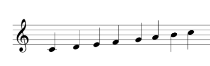

The octave decreases as the value of n decreases and increases as the value of n
increases. The initial value is 04.

The initial value is L4.

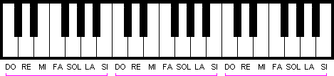

Image result of piano keyboards

For the semitone, \# (0+) and - are used. The length of the sound can be
specified with n. (C4 is the same as L4C). The default length is specified by
Ln.

\~ Image result for semifusa silence

\~ Image result for semifusa silence

\~ Image result for semifusa silence

\~ Image result for semifusa silence

\~ Image result for semifusa silence

\~ Image result for semifusa silence

\~ Image result for semifusa silence

~~~~~~~~~~~~~~~~~~~~~~~~~~~~~~~~~~~~~~~~~~~~~~~~~~~~~~~~~~~~~~~~~~~~~~~~~~~~~~~~
PLAY "T80O3L4CDEFG2.RABO4CDC2."
~~~~~~~~~~~~~~~~~~~~~~~~~~~~~~~~~~~~~~~~~~~~~~~~~~~~~~~~~~~~~~~~~~~~~~~~~~~~~~~~

The above instruction produces a sound composed of the following notes:

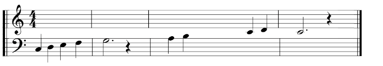

03 04

**Expression of a command with a variable**

~~~~~~~~~~~~~~~~~~~~~~~~~~~~~~~~~~~~~~~~~~~~~~~~~~~~~~~~~~~~~~~~~~~~~~~~~~~~~~~~
M$ = "T80O3L4CDEFG2.RABO4CDC2."
PLAY M$
~~~~~~~~~~~~~~~~~~~~~~~~~~~~~~~~~~~~~~~~~~~~~~~~~~~~~~~~~~~~~~~~~~~~~~~~~~~~~~~~

These instructions assign a command to the string variable M\$, which is then
specified in the PLAY statement as a command.

**Expression of a part of a command with a variable (X variable;)**

~~~~~~~~~~~~~~~~~~~~~~~~~~~~~~~~~~~~~~~~~~~~~~~~~~~~~~~~~~~~~~~~~~~~~~~~~~~~~~~~
10 M$ = "CDEFG2.R"
20 PLAY "O4L4XM$;GAGAG2.R"
30 PLAY "XM$;ABO5CDC2."
~~~~~~~~~~~~~~~~~~~~~~~~~~~~~~~~~~~~~~~~~~~~~~~~~~~~~~~~~~~~~~~~~~~~~~~~~~~~~~~~

When a command assigned to a string variable enclosed in inverted commas (" ")
is used in a PLAY statement, X must be added before and after ;. In the example
above, the command assigned to M\$ is used in two PLAY instructions.

**Expression of a command with a variable (=variable;)**

The value of n specified in a command may be a constant or a variable, included
as such in a PLAY statement. When expressed as a variable, "=" must be added
before and "," after.

~~~~~~~~~~~~~~~~~~~~~~~~~~~~~~~~~~~~~~~~~~~~~~~~~~~~~~~~~~~~~~~~~~~~~~~~~~~~~~~~
10 FOR I = 1 TO 8
20 PLAY "O = I; CEG"
30 NEXT I
~~~~~~~~~~~~~~~~~~~~~~~~~~~~~~~~~~~~~~~~~~~~~~~~~~~~~~~~~~~~~~~~~~~~~~~~~~~~~~~~

This program plays a musical octave, from PLAY "01CEG" to PLAY "08CEG".

**Chord generation**

Up to 3 voices can be played simultaneously, e.g. PLAY A\$, B\$, C\$.

~~~~~~~~~~~~~~~~~~~~~~~~~~~~~~~~~~~~~~~~~~~~~~~~~~~~~~~~~~~~~~~~~~~~~~~~~~~~~~~~
10 A$ = "O4CDO3BO4E2R4".
20 B$ = "O4EFDG2R4
30 C$ = "O4GAGO5C2R4"
40 PLAY A$, B$, C$
~~~~~~~~~~~~~~~~~~~~~~~~~~~~~~~~~~~~~~~~~~~~~~~~~~~~~~~~~~~~~~~~~~~~~~~~~~~~~~~~

This programme plays the following notes:

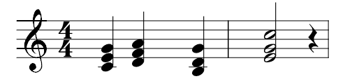

### Version

MSX, MSX2, MSX2+, MSXturboR, MSXVR

### Format

~~~~~~~~~~~~~~~~~~~~~~~~~~~~~~~~~~~~~~~~~~~~~~~~~~~~~~~~~~~~~~~~~~~~~~~~~~~~~~~~
PLAY command [,command][,command][,command]
~~~~~~~~~~~~~~~~~~~~~~~~~~~~~~~~~~~~~~~~~~~~~~~~~~~~~~~~~~~~~~~~~~~~~~~~~~~~~~~~

### Parameters

| Command | **Cond.** Constants and string variables. |
|---------|-------------------------------------------|

## PLAY

Check whether music is running or not.

With a PLAY instruction, three different sounds can be executed simultaneously.

In the specific case of PLAY, A\$, B\$, C\$; the sound of command A\$ is output
on channel 1, the sound of command B\$ is output on channel 2 and the sound of
command C\$ is output on channel 3.

The PLAY function checks if there is data in the buffer for music data on
channel 1 when N = 1, channel 2 when N = 2, and channel 3 when N = 3. When there
is data in the buffer it returns -1 and when there is no data it returns 0. When
N = 0, it returns -1 if any one of the three channels has data in the buffer.

### Version

MSX, MSX2, MSX2+, MSXturboR, MSXVR

### Format

~~~~~~~~~~~~~~~~~~~~~~~~~~~~~~~~~~~~~~~~~~~~~~~~~~~~~~~~~~~~~~~~~~~~~~~~~~~~~~~~
PLAY(N)
~~~~~~~~~~~~~~~~~~~~~~~~~~~~~~~~~~~~~~~~~~~~~~~~~~~~~~~~~~~~~~~~~~~~~~~~~~~~~~~~

### Parameters

| N | **Cond.** Constants, variables, matrix variables, their expressions (integers); 0≤Nz\<4. |
|---|------------------------------------------------------------------------------------------|

### Return

Numerical type.

## POINT

Provides the colour code of a point at a specified position.

### Version

MSX, MSX2, MSX2+, MSXturboR, MSXVR

### Format

~~~~~~~~~~~~~~~~~~~~~~~~~~~~~~~~~~~~~~~~~~~~~~~~~~~~~~~~~~~~~~~~~~~~~~~~~~~~~~~~
POINT(X,Y)
~~~~~~~~~~~~~~~~~~~~~~~~~~~~~~~~~~~~~~~~~~~~~~~~~~~~~~~~~~~~~~~~~~~~~~~~~~~~~~~~

### Parameters

| X,Y | **Cond.** Constants, variables, matrix variables and their (numerical) expressions; -32768≤coordinates\<32768. |
|-----|----------------------------------------------------------------------------------------------------------------|

### Examples

~~~~~~~~~~~~~~~~~~~~~~~~~~~~~~~~~~~~~~~~~~~~~~~~~~~~~~~~~~~~~~~~~~~~~~~~~~~~~~~~
10 SCREEN 3
20 FOR I = 1 TO 250
30 X = INT (RND(1)*255)
40 Y = INT (RND(1)*191)
50 PSET (X, Y), 1
60 NEXT I
70 FOR Y = 0 TO 191 STEP 4
80 FOR X = 0 TO 255 STEP 4
90 C = POINT (X, Y)
100 IF C = 4 THEN PSET (X, Y), 15
110 NEXT X, Y
120 GOTO 120
~~~~~~~~~~~~~~~~~~~~~~~~~~~~~~~~~~~~~~~~~~~~~~~~~~~~~~~~~~~~~~~~~~~~~~~~~~~~~~~~

Line 90 assigns the colour code corresponding to a position (X, Y) to the
variable C, and line 100 changes it to white if C is 4 (dark blue).

## POKE

Writes data to the specified memory address.

### Version

MSX, MSX2, MSX2+, MSXturboR, MSXVR

### Format

~~~~~~~~~~~~~~~~~~~~~~~~~~~~~~~~~~~~~~~~~~~~~~~~~~~~~~~~~~~~~~~~~~~~~~~~~~~~~~~~
POKE address, expression
~~~~~~~~~~~~~~~~~~~~~~~~~~~~~~~~~~~~~~~~~~~~~~~~~~~~~~~~~~~~~~~~~~~~~~~~~~~~~~~~

### Parameters

| Address    | **Cond.** Constants, variables, matrix variables, their (numeric) expressions; -32768≤address\<65536. In case of negative numbers, their value is the result of adding them to 65536. |
|------------|---------------------------------------------------------------------------------------------------------------------------------------------------------------------------------------|
| Expression | **Cond.** Constants, variables, matrix variables, their (numeric) expressions; 0≤expression\<256.                                                                                     |

### Examples

| POKE 5000, 255 |
|----------------|

~~~~~~~~~~~~~~~~~~~~~~~~~~~~~~~~~~~~~~~~~~~~~~~~~~~~~~~~~~~~~~~~~~~~~~~~~~~~~~~~

~~~~~~~~~~~~~~~~~~~~~~~~~~~~~~~~~~~~~~~~~~~~~~~~~~~~~~~~~~~~~~~~~~~~~~~~~~~~~~~~

Writes data 255 to memory address 5000.

| POKE &HD000, &HA8 | Writes data HA8 to memory address HD000. |   |
|-------------------|------------------------------------------|---|

## POS

Returns the X coordinate of the cursor position.

### Version

MSX, MSX2, MSX2+, MSXturboR, MSXVR

### Format

~~~~~~~~~~~~~~~~~~~~~~~~~~~~~~~~~~~~~~~~~~~~~~~~~~~~~~~~~~~~~~~~~~~~~~~~~~~~~~~~
POS(X)
~~~~~~~~~~~~~~~~~~~~~~~~~~~~~~~~~~~~~~~~~~~~~~~~~~~~~~~~~~~~~~~~~~~~~~~~~~~~~~~~

### Parameters

| X | **Cond.** Constant, variable, matrix variable or their (numeric) expressions (dummy argument). |
|---|------------------------------------------------------------------------------------------------|

### Return

Integer type.

### Examples

~~~~~~~~~~~~~~~~~~~~~~~~~~~~~~~~~~~~~~~~~~~~~~~~~~~~~~~~~~~~~~~~~~~~~~~~~~~~~~~~
10 INPUT A$
20 PRINT A$;:X = POS (X)
30 IF X>=5 THEN CLS
40 PRINT: GOTO 10
~~~~~~~~~~~~~~~~~~~~~~~~~~~~~~~~~~~~~~~~~~~~~~~~~~~~~~~~~~~~~~~~~~~~~~~~~~~~~~~~

Line 20 X = POS (X), assigns the X coordinate value of the cursor position to
the X variable. Consequently, the screen is cleared when a string with five or
more characters is assigned for A\$.

## PRESET

Marks or deletes a point on the screen, in graphic mode.

When executed by omitting the colour specification, it marks a point with the
same colour as the background colour. Consequently, if there is something drawn
at the specified position in a colour different from the background colour, it
gives the impression that you have deleted a dot at that position.

When specifying a colour, the function is identical to when specifying a colour
with PSET.

See the PSET sample programme.

When STEP is specified, it passes, X, Y to a new coordinate system that has its
origin at the point last specified in the immediately preceding graphic
instruction.

### Version

MSX, MSX2, MSX2+, MSXturboR, MSXVR

### Format

~~~~~~~~~~~~~~~~~~~~~~~~~~~~~~~~~~~~~~~~~~~~~~~~~~~~~~~~~~~~~~~~~~~~~~~~~~~~~~~~
PRESET [STEP](X-coordinate, Y-coordinate) [,colour] [logical operation].
~~~~~~~~~~~~~~~~~~~~~~~~~~~~~~~~~~~~~~~~~~~~~~~~~~~~~~~~~~~~~~~~~~~~~~~~~~~~~~~~

### Parameters

| X, Y coordinate   | **Cond.** Constants, variables, matrix variables, their (numerical) expressions; -32768≤coordinate\<32768.                                        |
|-------------------|---------------------------------------------------------------------------------------------------------------------------------------------------|
| Colour            | **Cond.** SCREEN 2 to 7: Constants, variables, matrix variables, their (numeric) expressions; 0≤colour \<16. **Omit.** Current background colour. |
| Logical operation | **Cond.** SCREEN 5 to 13: PSET, PRESET, XOR, OR, AND. **Omit.** PSET.                                                                             |

## PRINT

Displays numeric or alphanumeric data on the screen in text mode.

**Method of writing expressions (data)**

Numeric constants, numeric variables and string variables are written as they
are. String constants are enclosed in inverted commas (" ").

**Function of the separator**

When data is separated by a comma, the 14-digit TAB function inserts spaces
between the data, and when separated by a semicolon, the data will be displayed
side by side.

If no separator is written at the end of the instruction, it performs a line
feed after the data is displayed. If a separator is placed at the end, the data
of the next PRINT instruction continues on the same line.

**Signs and numerical data**

With respect to plus (+) and minus (-) signs, omit the plus (+) sign and present
the minus (-) sign where it is (if the semicolon separator is used with numeric
data, insert two spaces between the data to make room for the sign).

**Omission of the format**

The same result is obtained by typing the question mark (?) instead of PRINT.

### Version

MSX, MSX2, MSX2+, MSXturboR, MSXVR

### Format

~~~~~~~~~~~~~~~~~~~~~~~~~~~~~~~~~~~~~~~~~~~~~~~~~~~~~~~~~~~~~~~~~~~~~~~~~~~~~~~~
PRINT [expression][separator][expression][separator]...
~~~~~~~~~~~~~~~~~~~~~~~~~~~~~~~~~~~~~~~~~~~~~~~~~~~~~~~~~~~~~~~~~~~~~~~~~~~~~~~~

~~~~~~~~~~~~~~~~~~~~~~~~~~~~~~~~~~~~~~~~~~~~~~~~~~~~~~~~~~~~~~~~~~~~~~~~~~~~~~~~
? [expression][separator][expression][separator]...
~~~~~~~~~~~~~~~~~~~~~~~~~~~~~~~~~~~~~~~~~~~~~~~~~~~~~~~~~~~~~~~~~~~~~~~~~~~~~~~~

### Parameters

| Expression | **Cond**. Constants, variables, array variables, their expressions (numeric or string). |
|------------|-----------------------------------------------------------------------------------------|
| Separator  | **Cond.** Comma (,) or semicolon(;).                                                    |

### Examples

~~~~~~~~~~~~~~~~~~~~~~~~~~~~~~~~~~~~~~~~~~~~~~~~~~~~~~~~~~~~~~~~~~~~~~~~~~~~~~~~
10 A$ = "ABC" :B$ = "DEFF" :B$ = "DEFF" :B$ = "DEFF" :B$ = "DEFF
20 PRINT A$;B$
30 PRINT A$, B$
40 PRINT
50 PRINT "MSX"
60 PRINT +50, -50
70 ? "PERSONAL COMPUTER" ?
RUN
~~~~~~~~~~~~~~~~~~~~~~~~~~~~~~~~~~~~~~~~~~~~~~~~~~~~~~~~~~~~~~~~~~~~~~~~~~~~~~~~

~~~~~~~~~~~~~~~~~~~~~~~~~~~~~~~~~~~~~~~~~~~~~~~~~~~~~~~~~~~~~~~~~~~~~~~~~~~~~~~~
ABCDEF					Result of line 20
~~~~~~~~~~~~~~~~~~~~~~~~~~~~~~~~~~~~~~~~~~~~~~~~~~~~~~~~~~~~~~~~~~~~~~~~~~~~~~~~

ABC DEF *Result of line 30*

Result of line 40

MSX *Result of line 50*

50 -50 *Result of line 60*

PERSONAL COMPUTER *Result of line 70*

## PRINT USING

Displays data to the screen using a specified format.

Displays the value of an expression in a format specified by a format symbol.

**Formatting symbols for alphanumeric data**

| Symbol  | Expression format and example of implementation                                                        |
|---------|--------------------------------------------------------------------------------------------------------|
| "!"     | Prints the first character:                                                                            |
| "spaces | Prints n + 2 characters. When data is less than n+2 characters, insert spaces for residual characters. |
| "&"     | Prints all character strings.                                                                          |

~~~~~~~~~~~~~~~~~~~~~~~~~~~~~~~~~~~~~~~~~~~~~~~~~~~~~~~~~~~~~~~~~~~~~~~~~~~~~~~~
PRINT USING "!"; "BASIC", "MSX"; "BASIC", "MSX"; "BASIC", "MSX"
BM
~~~~~~~~~~~~~~~~~~~~~~~~~~~~~~~~~~~~~~~~~~~~~~~~~~~~~~~~~~~~~~~~~~~~~~~~~~~~~~~~

~~~~~~~~~~~~~~~~~~~~~~~~~~~~~~~~~~~~~~~~~~~~~~~~~~~~~~~~~~~~~~~~~~~~~~~~~~~~~~~~
PRINT USING "\"; "ABCDEF", "GHI", "JKLMN" ABCDGHI JKLM
~~~~~~~~~~~~~~~~~~~~~~~~~~~~~~~~~~~~~~~~~~~~~~~~~~~~~~~~~~~~~~~~~~~~~~~~~~~~~~~~

~~~~~~~~~~~~~~~~~~~~~~~~~~~~~~~~~~~~~~~~~~~~~~~~~~~~~~~~~~~~~~~~~~~~~~~~~~~~~~~~
10 A$ = "North": B$ = "South": B$ = "South".
20 PRINT USING "Pole & ";A$, B$
RUN
North Pole South Pole
~~~~~~~~~~~~~~~~~~~~~~~~~~~~~~~~~~~~~~~~~~~~~~~~~~~~~~~~~~~~~~~~~~~~~~~~~~~~~~~~

**Formatting symbols for numeric type data**

| Symbol             | Format of the expression and example of execution.                                                                                              |
|--------------------|-------------------------------------------------------------------------------------------------------------------------------------------------|
| "\#"               | Write as many digits as the number of \# symbols. The decimal point is "."                                                                      |
| "+"                | Before or after the numeric data, it shows a "+" sign if it is a positive number and a "-" sign if it is a negative number.                     |
| "-"                | Displays the minus sign "-" after a negative numeric data.                                                                                      |
| "\*\*"             | Fill in the spaces before the numeric data with asterisks. Each asterisk used in the format also expresses a digit.                             |
| "££" o "\$\$"      | Add the "£" sign just before the numeric data. Each £ used in the format also expresses a digit.                                                |
| "\*\*£" o "\*\*\$" | Add the sign "£" just before the numeric data, and fill in the spaces above with asterisks "\*".                                                |
| ","                | When the comma is specified somewhere before the decimal point (the dot), insert commas every three digits, before the decimal point (the dot). |
| "\^\^\^\^"         | Displays numerical data in floating point format. "\^\^\^\^" corresponds to the digits of the exponent part.                                    |

~~~~~~~~~~~~~~~~~~~~~~~~~~~~~~~~~~~~~~~~~~~~~~~~~~~~~~~~~~~~~~~~~~~~~~~~~~~~~~~~
PRINT USING "POINT: ###.#"; 123.4
POINT: 123.4
~~~~~~~~~~~~~~~~~~~~~~~~~~~~~~~~~~~~~~~~~~~~~~~~~~~~~~~~~~~~~~~~~~~~~~~~~~~~~~~~

When the number of integer digits is less than the specified number of \#
symbols, it presents the data with right justification, and if it is greater, it
adds the symbol % before the data.

~~~~~~~~~~~~~~~~~~~~~~~~~~~~~~~~~~~~~~~~~~~~~~~~~~~~~~~~~~~~~~~~~~~~~~~~~~~~~~~~
10 PRINT USING "####"; 12
20 PRINT USING "####"; 12345
RUN
12
%12345
~~~~~~~~~~~~~~~~~~~~~~~~~~~~~~~~~~~~~~~~~~~~~~~~~~~~~~~~~~~~~~~~~~~~~~~~~~~~~~~~

When the number of digits following the decimal point in a numeric data is less
than the number of \# symbols specified, it adds a zero, and when it is greater,
it rounds the number to the nearest integer.

~~~~~~~~~~~~~~~~~~~~~~~~~~~~~~~~~~~~~~~~~~~~~~~~~~~~~~~~~~~~~~~~~~~~~~~~~~~~~~~~
10 PRINT USING "##.##"; 25.3
20 PRINT USING "##.##"; 25.345
RUN
25.30
25.35
~~~~~~~~~~~~~~~~~~~~~~~~~~~~~~~~~~~~~~~~~~~~~~~~~~~~~~~~~~~~~~~~~~~~~~~~~~~~~~~~

Ignores the "+" sign in numeric data and counts the "-" sign as a digit.

~~~~~~~~~~~~~~~~~~~~~~~~~~~~~~~~~~~~~~~~~~~~~~~~~~~~~~~~~~~~~~~~~~~~~~~~~~~~~~~~
10 PRINT USING "###"; +123
20 PRINT USING "###"; -123
RUN
123
%-123
~~~~~~~~~~~~~~~~~~~~~~~~~~~~~~~~~~~~~~~~~~~~~~~~~~~~~~~~~~~~~~~~~~~~~~~~~~~~~~~~

~~~~~~~~~~~~~~~~~~~~~~~~~~~~~~~~~~~~~~~~~~~~~~~~~~~~~~~~~~~~~~~~~~~~~~~~~~~~~~~~
PRINT USING "###+"; 123, -123
+123 -123
123+ 123-
~~~~~~~~~~~~~~~~~~~~~~~~~~~~~~~~~~~~~~~~~~~~~~~~~~~~~~~~~~~~~~~~~~~~~~~~~~~~~~~~

~~~~~~~~~~~~~~~~~~~~~~~~~~~~~~~~~~~~~~~~~~~~~~~~~~~~~~~~~~~~~~~~~~~~~~~~~~~~~~~~
PRINT USING "###-"; 123, -123
123  123-
~~~~~~~~~~~~~~~~~~~~~~~~~~~~~~~~~~~~~~~~~~~~~~~~~~~~~~~~~~~~~~~~~~~~~~~~~~~~~~~~

~~~~~~~~~~~~~~~~~~~~~~~~~~~~~~~~~~~~~~~~~~~~~~~~~~~~~~~~~~~~~~~~~~~~~~~~~~~~~~~~
10 PRINT USING "**######"; 123
20 PRINT USING "**######";-234
RUN
*****123
****-234
~~~~~~~~~~~~~~~~~~~~~~~~~~~~~~~~~~~~~~~~~~~~~~~~~~~~~~~~~~~~~~~~~~~~~~~~~~~~~~~~

~~~~~~~~~~~~~~~~~~~~~~~~~~~~~~~~~~~~~~~~~~~~~~~~~~~~~~~~~~~~~~~~~~~~~~~~~~~~~~~~
10 PRINT USING "££###"; 1234
20 PRINT USING "+££###"; -1234
RUN
£ 1234
-£ 1234
~~~~~~~~~~~~~~~~~~~~~~~~~~~~~~~~~~~~~~~~~~~~~~~~~~~~~~~~~~~~~~~~~~~~~~~~~~~~~~~~

~~~~~~~~~~~~~~~~~~~~~~~~~~~~~~~~~~~~~~~~~~~~~~~~~~~~~~~~~~~~~~~~~~~~~~~~~~~~~~~~
PRINT USING "**£###.##"; 12.34
***£ 12.34
~~~~~~~~~~~~~~~~~~~~~~~~~~~~~~~~~~~~~~~~~~~~~~~~~~~~~~~~~~~~~~~~~~~~~~~~~~~~~~~~

~~~~~~~~~~~~~~~~~~~~~~~~~~~~~~~~~~~~~~~~~~~~~~~~~~~~~~~~~~~~~~~~~~~~~~~~~~~~~~~~

~~~~~~~~~~~~~~~~~~~~~~~~~~~~~~~~~~~~~~~~~~~~~~~~~~~~~~~~~~~~~~~~~~~~~~~~~~~~~~~~

~~~~~~~~~~~~~~~~~~~~~~~~~~~~~~~~~~~~~~~~~~~~~~~~~~~~~~~~~~~~~~~~~~~~~~~~~~~~~~~~

~~~~~~~~~~~~~~~~~~~~~~~~~~~~~~~~~~~~~~~~~~~~~~~~~~~~~~~~~~~~~~~~~~~~~~~~~~~~~~~~

~~~~~~~~~~~~~~~~~~~~~~~~~~~~~~~~~~~~~~~~~~~~~~~~~~~~~~~~~~~~~~~~~~~~~~~~~~~~~~~~
PRINT USING "#,######.##"; 12345.67
~~~~~~~~~~~~~~~~~~~~~~~~~~~~~~~~~~~~~~~~~~~~~~~~~~~~~~~~~~~~~~~~~~~~~~~~~~~~~~~~

~~~~~~~~~~~~~~~~~~~~~~~~~~~~~~~~~~~~~~~~~~~~~~~~~~~~~~~~~~~~~~~~~~~~~~~~~~~~~~~~
12,345.67
~~~~~~~~~~~~~~~~~~~~~~~~~~~~~~~~~~~~~~~~~~~~~~~~~~~~~~~~~~~~~~~~~~~~~~~~~~~~~~~~

~~~~~~~~~~~~~~~~~~~~~~~~~~~~~~~~~~~~~~~~~~~~~~~~~~~~~~~~~~~~~~~~~~~~~~~~~~~~~~~~
PRINT USING "##.##^^^^"; 234.56
235E+02
~~~~~~~~~~~~~~~~~~~~~~~~~~~~~~~~~~~~~~~~~~~~~~~~~~~~~~~~~~~~~~~~~~~~~~~~~~~~~~~~

### Version

MSX, MSX2, MSX2+, MSXturboR, MSXVR

### Format

~~~~~~~~~~~~~~~~~~~~~~~~~~~~~~~~~~~~~~~~~~~~~~~~~~~~~~~~~~~~~~~~~~~~~~~~~~~~~~~~
PRINT USING format symbol;expression[,expression]
~~~~~~~~~~~~~~~~~~~~~~~~~~~~~~~~~~~~~~~~~~~~~~~~~~~~~~~~~~~~~~~~~~~~~~~~~~~~~~~~

### Parameters

| Expression | **Cond.** Constants, variables, matrix variables, their expressions (numeric and string). |
|------------|-------------------------------------------------------------------------------------------|

## PRINT \#

Enters data into a file opened by an OPEN instruction.

### Version

MSX, MSX2, MSX2+, MSXturboR, MSXVR

### Format

~~~~~~~~~~~~~~~~~~~~~~~~~~~~~~~~~~~~~~~~~~~~~~~~~~~~~~~~~~~~~~~~~~~~~~~~~~~~~~~~
PRINT # file number, [expression][separator][expression][separator]....
~~~~~~~~~~~~~~~~~~~~~~~~~~~~~~~~~~~~~~~~~~~~~~~~~~~~~~~~~~~~~~~~~~~~~~~~~~~~~~~~

### Parameters

| File number | **Cond.** Constants, variables, array variables, their expressions (of type integer); 1≤file number≤number specified in the MAXFILES statement. |
|-------------|-------------------------------------------------------------------------------------------------------------------------------------------------|
| Expression  | **Cond**. Constants, variables, matrix variables, their expressions (numeric and string).                                                       |
| Separator   | **Cond.** Comma (,) or semicolon (;).                                                                                                           |

### Examples

| 10 OPEN "CAS:DATA" FOR OUTPUT AS \#1                           | *Open a file for writing* |
|----------------------------------------------------------------|---------------------------|
| 20 FOR I = 0 TO 4                                              |                           |
| 30 READ A\$                                                    |                           |
| 40 PRINT \#1, A\$;",";                                         | *Write data to the file*  |
| 50 NEXT I                                                      |                           |
| 60 CLOSE \#1                                                   |                           |
| 70 DATA TOKYO, LONDON, PARIS, PEKING, NEW YORK, NEW YORK, ETC. |                           |

This program writes sequentially to a cassette tape the data written on line 70,
in a file named "DATA".

## PRINT \#USING

Writes data in a specified format to a file opened by an OPEN statement.

You can specify this format to send data to a file. For information on format
symbols, see PRINT USING.

### Version

MSX, MSX2, MSX2+, MSXturboR, MSXVR

### Format

~~~~~~~~~~~~~~~~~~~~~~~~~~~~~~~~~~~~~~~~~~~~~~~~~~~~~~~~~~~~~~~~~~~~~~~~~~~~~~~~
PRINT # file number USING format symbol; expression[,expression]...
~~~~~~~~~~~~~~~~~~~~~~~~~~~~~~~~~~~~~~~~~~~~~~~~~~~~~~~~~~~~~~~~~~~~~~~~~~~~~~~~

### Parameters

| File number | **Cond.** Constants, variables, array variables, their expressions (integers); 1≤number of file≤number specified by MAXFILES instruction. |
|-------------|-------------------------------------------------------------------------------------------------------------------------------------------|
| Expression  | **Cond.** Constants, variables, matrix variables, their expressions (numeric and string).                                                 |

## PSET

Marks a point on the screen, in graphics mode.

When STEP is specified, the X, Y coordinates are passed to a new coordinate
system that has its origin at the point last specified in the immediately
preceding graphic instruction.

### Version

MSX, MSX2, MSX2+, MSXturboR, MSXVR

### Format

~~~~~~~~~~~~~~~~~~~~~~~~~~~~~~~~~~~~~~~~~~~~~~~~~~~~~~~~~~~~~~~~~~~~~~~~~~~~~~~~
PSET [STEP](X-coordinate, X-coordinate) [,colour],[logical operation].	
~~~~~~~~~~~~~~~~~~~~~~~~~~~~~~~~~~~~~~~~~~~~~~~~~~~~~~~~~~~~~~~~~~~~~~~~~~~~~~~~

### Parameters

\| X, Y coordinates \| **Cond.** Constants, variables, matrix variables, their
expressions (numerical); \| \| \| \| -32768≤coordinates\<32768. \| \|
\|------------------\|----------------------------------------------------------------------------------------------------------------------------------------------------------------------------------------------------------------------------------------------------------------\|
\| Colour \| \| **Cond.** SCREEN 2 to 7: Constants, variables, matrix variables,
their (numerical) expressions; 0≤colour\<16. SCREEN 8 to 13: Constants,
variables, matrix variables, their expressions (numeric); 0≤colour\<256.
**Omit.** Current foreground colour. \| \| Logical operation \| **Cond.** SCREEN
5 to 13: PSET, PRESET, XOR, OR, AND. **Omit.** PSET. \|

### Example1

~~~~~~~~~~~~~~~~~~~~~~~~~~~~~~~~~~~~~~~~~~~~~~~~~~~~~~~~~~~~~~~~~~~~~~~~~~~~~~~~
10 SCREEN 2
20 FOR X = 0 TO 255
30 PSET (X+1, 100)	Draw point
40 PRESET (X, 100)	Deletes the point drawn by the line 30
50 NEXT X
~~~~~~~~~~~~~~~~~~~~~~~~~~~~~~~~~~~~~~~~~~~~~~~~~~~~~~~~~~~~~~~~~~~~~~~~~~~~~~~~

### Example 2

~~~~~~~~~~~~~~~~~~~~~~~~~~~~~~~~~~~~~~~~~~~~~~~~~~~~~~~~~~~~~~~~~~~~~~~~~~~~~~~~
10 EMN Points
~~~~~~~~~~~~~~~~~~~~~~~~~~~~~~~~~~~~~~~~~~~~~~~~~~~~~~~~~~~~~~~~~~~~~~~~~~~~~~~~

~~~~~~~~~~~~~~~~~~~~~~~~~~~~~~~~~~~~~~~~~~~~~~~~~~~~~~~~~~~~~~~~~~~~~~~~~~~~~~~~
20 R=TIME
~~~~~~~~~~~~~~~~~~~~~~~~~~~~~~~~~~~~~~~~~~~~~~~~~~~~~~~~~~~~~~~~~~~~~~~~~~~~~~~~

~~~~~~~~~~~~~~~~~~~~~~~~~~~~~~~~~~~~~~~~~~~~~~~~~~~~~~~~~~~~~~~~~~~~~~~~~~~~~~~~
30 RDRST=RND(-R)
~~~~~~~~~~~~~~~~~~~~~~~~~~~~~~~~~~~~~~~~~~~~~~~~~~~~~~~~~~~~~~~~~~~~~~~~~~~~~~~~

~~~~~~~~~~~~~~~~~~~~~~~~~~~~~~~~~~~~~~~~~~~~~~~~~~~~~~~~~~~~~~~~~~~~~~~~~~~~~~~~
40 SCREEN 3
~~~~~~~~~~~~~~~~~~~~~~~~~~~~~~~~~~~~~~~~~~~~~~~~~~~~~~~~~~~~~~~~~~~~~~~~~~~~~~~~

~~~~~~~~~~~~~~~~~~~~~~~~~~~~~~~~~~~~~~~~~~~~~~~~~~~~~~~~~~~~~~~~~~~~~~~~~~~~~~~~
50 REM Randomly coloured dots
~~~~~~~~~~~~~~~~~~~~~~~~~~~~~~~~~~~~~~~~~~~~~~~~~~~~~~~~~~~~~~~~~~~~~~~~~~~~~~~~

~~~~~~~~~~~~~~~~~~~~~~~~~~~~~~~~~~~~~~~~~~~~~~~~~~~~~~~~~~~~~~~~~~~~~~~~~~~~~~~~
60 FOR I%=1 TO 300
~~~~~~~~~~~~~~~~~~~~~~~~~~~~~~~~~~~~~~~~~~~~~~~~~~~~~~~~~~~~~~~~~~~~~~~~~~~~~~~~

~~~~~~~~~~~~~~~~~~~~~~~~~~~~~~~~~~~~~~~~~~~~~~~~~~~~~~~~~~~~~~~~~~~~~~~~~~~~~~~~
70 GOSUB 1000
~~~~~~~~~~~~~~~~~~~~~~~~~~~~~~~~~~~~~~~~~~~~~~~~~~~~~~~~~~~~~~~~~~~~~~~~~~~~~~~~

~~~~~~~~~~~~~~~~~~~~~~~~~~~~~~~~~~~~~~~~~~~~~~~~~~~~~~~~~~~~~~~~~~~~~~~~~~~~~~~~
80 PSET(X%,Y%),Z%),Z%)
~~~~~~~~~~~~~~~~~~~~~~~~~~~~~~~~~~~~~~~~~~~~~~~~~~~~~~~~~~~~~~~~~~~~~~~~~~~~~~~~

~~~~~~~~~~~~~~~~~~~~~~~~~~~~~~~~~~~~~~~~~~~~~~~~~~~~~~~~~~~~~~~~~~~~~~~~~~~~~~~~
90 NEXT I% 90 NEXT I% 90 NEXT I% 90 NEXT I% 90 NEXT I% 90 NEXT I
~~~~~~~~~~~~~~~~~~~~~~~~~~~~~~~~~~~~~~~~~~~~~~~~~~~~~~~~~~~~~~~~~~~~~~~~~~~~~~~~

~~~~~~~~~~~~~~~~~~~~~~~~~~~~~~~~~~~~~~~~~~~~~~~~~~~~~~~~~~~~~~~~~~~~~~~~~~~~~~~~
100 REM Delete points
~~~~~~~~~~~~~~~~~~~~~~~~~~~~~~~~~~~~~~~~~~~~~~~~~~~~~~~~~~~~~~~~~~~~~~~~~~~~~~~~

~~~~~~~~~~~~~~~~~~~~~~~~~~~~~~~~~~~~~~~~~~~~~~~~~~~~~~~~~~~~~~~~~~~~~~~~~~~~~~~~
110 RDRST=RND(-R)
~~~~~~~~~~~~~~~~~~~~~~~~~~~~~~~~~~~~~~~~~~~~~~~~~~~~~~~~~~~~~~~~~~~~~~~~~~~~~~~~

~~~~~~~~~~~~~~~~~~~~~~~~~~~~~~~~~~~~~~~~~~~~~~~~~~~~~~~~~~~~~~~~~~~~~~~~~~~~~~~~
120 FOR J%=1 TO 300
~~~~~~~~~~~~~~~~~~~~~~~~~~~~~~~~~~~~~~~~~~~~~~~~~~~~~~~~~~~~~~~~~~~~~~~~~~~~~~~~

~~~~~~~~~~~~~~~~~~~~~~~~~~~~~~~~~~~~~~~~~~~~~~~~~~~~~~~~~~~~~~~~~~~~~~~~~~~~~~~~
130 GOSUB 1000
~~~~~~~~~~~~~~~~~~~~~~~~~~~~~~~~~~~~~~~~~~~~~~~~~~~~~~~~~~~~~~~~~~~~~~~~~~~~~~~~

~~~~~~~~~~~~~~~~~~~~~~~~~~~~~~~~~~~~~~~~~~~~~~~~~~~~~~~~~~~~~~~~~~~~~~~~~~~~~~~~
140 PRESET(X%,Y%)
~~~~~~~~~~~~~~~~~~~~~~~~~~~~~~~~~~~~~~~~~~~~~~~~~~~~~~~~~~~~~~~~~~~~~~~~~~~~~~~~

~~~~~~~~~~~~~~~~~~~~~~~~~~~~~~~~~~~~~~~~~~~~~~~~~~~~~~~~~~~~~~~~~~~~~~~~~~~~~~~~
150 NEXT J% J
~~~~~~~~~~~~~~~~~~~~~~~~~~~~~~~~~~~~~~~~~~~~~~~~~~~~~~~~~~~~~~~~~~~~~~~~~~~~~~~~

~~~~~~~~~~~~~~~~~~~~~~~~~~~~~~~~~~~~~~~~~~~~~~~~~~~~~~~~~~~~~~~~~~~~~~~~~~~~~~~~
160 END
~~~~~~~~~~~~~~~~~~~~~~~~~~~~~~~~~~~~~~~~~~~~~~~~~~~~~~~~~~~~~~~~~~~~~~~~~~~~~~~~

~~~~~~~~~~~~~~~~~~~~~~~~~~~~~~~~~~~~~~~~~~~~~~~~~~~~~~~~~~~~~~~~~~~~~~~~~~~~~~~~
999 REM Random subroutine
~~~~~~~~~~~~~~~~~~~~~~~~~~~~~~~~~~~~~~~~~~~~~~~~~~~~~~~~~~~~~~~~~~~~~~~~~~~~~~~~

~~~~~~~~~~~~~~~~~~~~~~~~~~~~~~~~~~~~~~~~~~~~~~~~~~~~~~~~~~~~~~~~~~~~~~~~~~~~~~~~
1000 X%=RND(1)*256
~~~~~~~~~~~~~~~~~~~~~~~~~~~~~~~~~~~~~~~~~~~~~~~~~~~~~~~~~~~~~~~~~~~~~~~~~~~~~~~~

~~~~~~~~~~~~~~~~~~~~~~~~~~~~~~~~~~~~~~~~~~~~~~~~~~~~~~~~~~~~~~~~~~~~~~~~~~~~~~~~
1010 Y%=RND(1)*192
~~~~~~~~~~~~~~~~~~~~~~~~~~~~~~~~~~~~~~~~~~~~~~~~~~~~~~~~~~~~~~~~~~~~~~~~~~~~~~~~

~~~~~~~~~~~~~~~~~~~~~~~~~~~~~~~~~~~~~~~~~~~~~~~~~~~~~~~~~~~~~~~~~~~~~~~~~~~~~~~~
1020 Z%=RND(1)*16
~~~~~~~~~~~~~~~~~~~~~~~~~~~~~~~~~~~~~~~~~~~~~~~~~~~~~~~~~~~~~~~~~~~~~~~~~~~~~~~~

~~~~~~~~~~~~~~~~~~~~~~~~~~~~~~~~~~~~~~~~~~~~~~~~~~~~~~~~~~~~~~~~~~~~~~~~~~~~~~~~
1030 RETURN
~~~~~~~~~~~~~~~~~~~~~~~~~~~~~~~~~~~~~~~~~~~~~~~~~~~~~~~~~~~~~~~~~~~~~~~~~~~~~~~~

~~~~~~~~~~~~~~~~~~~~~~~~~~~~~~~~~~~~~~~~~~~~~~~~~~~~~~~~~~~~~~~~~~~~~~~~~~~~~~~~

~~~~~~~~~~~~~~~~~~~~~~~~~~~~~~~~~~~~~~~~~~~~~~~~~~~~~~~~~~~~~~~~~~~~~~~~~~~~~~~~

This example draws and erases dots on the screen, but this time, the dots are
randomly coloured and we also make use of the SCREEN graphic mode.

### Example 3

~~~~~~~~~~~~~~~~~~~~~~~~~~~~~~~~~~~~~~~~~~~~~~~~~~~~~~~~~~~~~~~~~~~~~~~~~~~~~~~~

~~~~~~~~~~~~~~~~~~~~~~~~~~~~~~~~~~~~~~~~~~~~~~~~~~~~~~~~~~~~~~~~~~~~~~~~~~~~~~~~

~~~~~~~~~~~~~~~~~~~~~~~~~~~~~~~~~~~~~~~~~~~~~~~~~~~~~~~~~~~~~~~~~~~~~~~~~~~~~~~~
80 SCREEN 2
~~~~~~~~~~~~~~~~~~~~~~~~~~~~~~~~~~~~~~~~~~~~~~~~~~~~~~~~~~~~~~~~~~~~~~~~~~~~~~~~

~~~~~~~~~~~~~~~~~~~~~~~~~~~~~~~~~~~~~~~~~~~~~~~~~~~~~~~~~~~~~~~~~~~~~~~~~~~~~~~~
90 COLOUR 1,7,7
~~~~~~~~~~~~~~~~~~~~~~~~~~~~~~~~~~~~~~~~~~~~~~~~~~~~~~~~~~~~~~~~~~~~~~~~~~~~~~~~

~~~~~~~~~~~~~~~~~~~~~~~~~~~~~~~~~~~~~~~~~~~~~~~~~~~~~~~~~~~~~~~~~~~~~~~~~~~~~~~~
100 CLS
~~~~~~~~~~~~~~~~~~~~~~~~~~~~~~~~~~~~~~~~~~~~~~~~~~~~~~~~~~~~~~~~~~~~~~~~~~~~~~~~

~~~~~~~~~~~~~~~~~~~~~~~~~~~~~~~~~~~~~~~~~~~~~~~~~~~~~~~~~~~~~~~~~~~~~~~~~~~~~~~~
120 DIM A(12),B(12)
~~~~~~~~~~~~~~~~~~~~~~~~~~~~~~~~~~~~~~~~~~~~~~~~~~~~~~~~~~~~~~~~~~~~~~~~~~~~~~~~

~~~~~~~~~~~~~~~~~~~~~~~~~~~~~~~~~~~~~~~~~~~~~~~~~~~~~~~~~~~~~~~~~~~~~~~~~~~~~~~~
130 FOR N=1 TO 12
~~~~~~~~~~~~~~~~~~~~~~~~~~~~~~~~~~~~~~~~~~~~~~~~~~~~~~~~~~~~~~~~~~~~~~~~~~~~~~~~

~~~~~~~~~~~~~~~~~~~~~~~~~~~~~~~~~~~~~~~~~~~~~~~~~~~~~~~~~~~~~~~~~~~~~~~~~~~~~~~~
135 K=N/6*3.1415927#
~~~~~~~~~~~~~~~~~~~~~~~~~~~~~~~~~~~~~~~~~~~~~~~~~~~~~~~~~~~~~~~~~~~~~~~~~~~~~~~~

~~~~~~~~~~~~~~~~~~~~~~~~~~~~~~~~~~~~~~~~~~~~~~~~~~~~~~~~~~~~~~~~~~~~~~~~~~~~~~~~
140 A(N)=128+80*SIN(K):B(N)=88+80*COS(K)
~~~~~~~~~~~~~~~~~~~~~~~~~~~~~~~~~~~~~~~~~~~~~~~~~~~~~~~~~~~~~~~~~~~~~~~~~~~~~~~~

~~~~~~~~~~~~~~~~~~~~~~~~~~~~~~~~~~~~~~~~~~~~~~~~~~~~~~~~~~~~~~~~~~~~~~~~~~~~~~~~
150 PSET(A(N),B(N))
~~~~~~~~~~~~~~~~~~~~~~~~~~~~~~~~~~~~~~~~~~~~~~~~~~~~~~~~~~~~~~~~~~~~~~~~~~~~~~~~

~~~~~~~~~~~~~~~~~~~~~~~~~~~~~~~~~~~~~~~~~~~~~~~~~~~~~~~~~~~~~~~~~~~~~~~~~~~~~~~~
160 NEXT N
~~~~~~~~~~~~~~~~~~~~~~~~~~~~~~~~~~~~~~~~~~~~~~~~~~~~~~~~~~~~~~~~~~~~~~~~~~~~~~~~

~~~~~~~~~~~~~~~~~~~~~~~~~~~~~~~~~~~~~~~~~~~~~~~~~~~~~~~~~~~~~~~~~~~~~~~~~~~~~~~~
170 FOR N=1 TO 12
~~~~~~~~~~~~~~~~~~~~~~~~~~~~~~~~~~~~~~~~~~~~~~~~~~~~~~~~~~~~~~~~~~~~~~~~~~~~~~~~

~~~~~~~~~~~~~~~~~~~~~~~~~~~~~~~~~~~~~~~~~~~~~~~~~~~~~~~~~~~~~~~~~~~~~~~~~~~~~~~~
180 FOR M=1 TO 12
~~~~~~~~~~~~~~~~~~~~~~~~~~~~~~~~~~~~~~~~~~~~~~~~~~~~~~~~~~~~~~~~~~~~~~~~~~~~~~~~

~~~~~~~~~~~~~~~~~~~~~~~~~~~~~~~~~~~~~~~~~~~~~~~~~~~~~~~~~~~~~~~~~~~~~~~~~~~~~~~~
190 LINE(A(N),B(N))-(A(M),B(M))
~~~~~~~~~~~~~~~~~~~~~~~~~~~~~~~~~~~~~~~~~~~~~~~~~~~~~~~~~~~~~~~~~~~~~~~~~~~~~~~~

~~~~~~~~~~~~~~~~~~~~~~~~~~~~~~~~~~~~~~~~~~~~~~~~~~~~~~~~~~~~~~~~~~~~~~~~~~~~~~~~
200 NEXT M
~~~~~~~~~~~~~~~~~~~~~~~~~~~~~~~~~~~~~~~~~~~~~~~~~~~~~~~~~~~~~~~~~~~~~~~~~~~~~~~~

~~~~~~~~~~~~~~~~~~~~~~~~~~~~~~~~~~~~~~~~~~~~~~~~~~~~~~~~~~~~~~~~~~~~~~~~~~~~~~~~
210 NEXT N
~~~~~~~~~~~~~~~~~~~~~~~~~~~~~~~~~~~~~~~~~~~~~~~~~~~~~~~~~~~~~~~~~~~~~~~~~~~~~~~~

~~~~~~~~~~~~~~~~~~~~~~~~~~~~~~~~~~~~~~~~~~~~~~~~~~~~~~~~~~~~~~~~~~~~~~~~~~~~~~~~
220 GOTO 220
~~~~~~~~~~~~~~~~~~~~~~~~~~~~~~~~~~~~~~~~~~~~~~~~~~~~~~~~~~~~~~~~~~~~~~~~~~~~~~~~

~~~~~~~~~~~~~~~~~~~~~~~~~~~~~~~~~~~~~~~~~~~~~~~~~~~~~~~~~~~~~~~~~~~~~~~~~~~~~~~~

~~~~~~~~~~~~~~~~~~~~~~~~~~~~~~~~~~~~~~~~~~~~~~~~~~~~~~~~~~~~~~~~~~~~~~~~~~~~~~~~

~~~~~~~~~~~~~~~~~~~~~~~~~~~~~~~~~~~~~~~~~~~~~~~~~~~~~~~~~~~~~~~~~~~~~~~~~~~~~~~~
An example of drawing a geometric figure.
~~~~~~~~~~~~~~~~~~~~~~~~~~~~~~~~~~~~~~~~~~~~~~~~~~~~~~~~~~~~~~~~~~~~~~~~~~~~~~~~

~~~~~~~~~~~~~~~~~~~~~~~~~~~~~~~~~~~~~~~~~~~~~~~~~~~~~~~~~~~~~~~~~~~~~~~~~~~~~~~~

~~~~~~~~~~~~~~~~~~~~~~~~~~~~~~~~~~~~~~~~~~~~~~~~~~~~~~~~~~~~~~~~~~~~~~~~~~~~~~~~

~~~~~~~~~~~~~~~~~~~~~~~~~~~~~~~~~~~~~~~~~~~~~~~~~~~~~~~~~~~~~~~~~~~~~~~~~~~~~~~~

~~~~~~~~~~~~~~~~~~~~~~~~~~~~~~~~~~~~~~~~~~~~~~~~~~~~~~~~~~~~~~~~~~~~~~~~~~~~~~~~

~~~~~~~~~~~~~~~~~~~~~~~~~~~~~~~~~~~~~~~~~~~~~~~~~~~~~~~~~~~~~~~~~~~~~~~~~~~~~~~~

~~~~~~~~~~~~~~~~~~~~~~~~~~~~~~~~~~~~~~~~~~~~~~~~~~~~~~~~~~~~~~~~~~~~~~~~~~~~~~~~

## PUT

Writes the record defined by the FIELD instruction to a random access file.

### Version

MSX, MSX2, MSX2+, MSXturboR, MSXVR

### Format

~~~~~~~~~~~~~~~~~~~~~~~~~~~~~~~~~~~~~~~~~~~~~~~~~~~~~~~~~~~~~~~~~~~~~~~~~~~~~~~~
PUT [#] file number [,record number].
~~~~~~~~~~~~~~~~~~~~~~~~~~~~~~~~~~~~~~~~~~~~~~~~~~~~~~~~~~~~~~~~~~~~~~~~~~~~~~~~

### Parameters

| File number         | **Cond.** Constants, variables, array variables, their expressions (numeric); 1≤file number≤number specified in the MAXFILES statement.                                               |
|---------------------|---------------------------------------------------------------------------------------------------------------------------------------------------------------------------------------|
| Registration number | **Cond.** Constants, variables, matrix variables, their (numeric) expressions; 1≤number \<65536. **Omit.** The record number used in the GET or PUT statement last executed plus one. |

### Examples

~~~~~~~~~~~~~~~~~~~~~~~~~~~~~~~~~~~~~~~~~~~~~~~~~~~~~~~~~~~~~~~~~~~~~~~~~~~~~~~~
10 OPEN "A: TEST.DAT" AS #1
20 FIELD #1, 2 AS CODE$, 15 AS NAM$, 10 AS TEL$
30 READ A%, B$, C$
40 LSET CODE$ = MKI$ (A%)
50 LSET NAM$ = B$
60 LSET TEL$ = C$
70 PUT #1, 1
80 CLOSE #1
90 DATA 100, JORGE, 211-71-71
100 END
~~~~~~~~~~~~~~~~~~~~~~~~~~~~~~~~~~~~~~~~~~~~~~~~~~~~~~~~~~~~~~~~~~~~~~~~~~~~~~~~

Execution of the instruction on line 70 saves to the random access file,
prepared by the LSET/RSET instructions, register number 1.

## PUT SPRITE

Displays a sprite at an arbitrary position in the specified sprite plane.

When STEP is specified, the X, Y coordinates are passed to a new coordinate
system that has its origin at the point last specified in the immediately
preceding graphic instruction.

### Version

MSX, MSX2, MSX2+, MSXturboR, MSXVR

### Format

~~~~~~~~~~~~~~~~~~~~~~~~~~~~~~~~~~~~~~~~~~~~~~~~~~~~~~~~~~~~~~~~~~~~~~~~~~~~~~~~
PUT SPRITE sprite plane number, [[STEP](X coordinate, Y coordinate)][,colour][,sprite number]]
~~~~~~~~~~~~~~~~~~~~~~~~~~~~~~~~~~~~~~~~~~~~~~~~~~~~~~~~~~~~~~~~~~~~~~~~~~~~~~~~

### Parameters

| Sprite plane number | **Cond.** Constants, variables, matrix variables, their (numerical) expressions; 0≤number\<32.                                                                                                                                                                  |
|---------------------|-----------------------------------------------------------------------------------------------------------------------------------------------------------------------------------------------------------------------------------------------------------------|
| X-coordinate        | **Cond.** Constants, variables, matrix variables, their (numerical) expressions; -32≤X \<256.                                                                                                                                                                   |
| Y-coordinate        | **Cond.** Constants, variables, matrix variables, their (numerical) expressions; -32≤Y\<212.                                                                                                                                                                    |
| Colour              | **Cond.** Constants, variables, matrix variables, their (numeric) expressions; 0≤colour\<16. **Omit.** Current foreground colour.                                                                                                                               |
| Sprite number       | **Cond.** For 8x8 points: Constants, variables, matrix variables, their (numerical) expressions; 0≤number \<256. For 16x16 points: Constants, variables, matrix variables, their expressions (numerical); 0≤number \<64. **Omit.** Same as sprite plane number. |

### Example 1

~~~~~~~~~~~~~~~~~~~~~~~~~~~~~~~~~~~~~~~~~~~~~~~~~~~~~~~~~~~~~~~~~~~~~~~~~~~~~~~~
10 SCREEN 2
20 SPRITE$ (1) = CHR$(&H18)+CHR$(&H3C)+CHR$(&H66)+CHR$(&HDB)+CHR$(&HE7)+CHR$(&H7E)+CHR$(&H24)+CHR$(&H42)
30 X = 0: Y = 0: DX = 1: DY = 1
40 PUT SPRITE 0, (X, Y),,, 1
50 X = X+DX: Y= Y+DY
60 IF X>250 OR X<0 THEN DX = -DX
70 IF Y>190 OR Y<0 THEN DY = -DY
80 GOTO 40
~~~~~~~~~~~~~~~~~~~~~~~~~~~~~~~~~~~~~~~~~~~~~~~~~~~~~~~~~~~~~~~~~~~~~~~~~~~~~~~~

Line 20 defines a sprite in the shape of a UFO, assigned to sprite number 1.
Instruction 40, PUT SPRITE, presents this sprite on screen; the sprite plane
number is 0. As the colour has been omitted, it is the same as the foreground
colour previously selected. The UFO gives the impression of flying across the
screen due to the change of the values of the X, Y coordinates, which specify
its position.

### Example 2

~~~~~~~~~~~~~~~~~~~~~~~~~~~~~~~~~~~~~~~~~~~~~~~~~~~~~~~~~~~~~~~~~~~~~~~~~~~~~~~~
10 SCREEN 2,2
~~~~~~~~~~~~~~~~~~~~~~~~~~~~~~~~~~~~~~~~~~~~~~~~~~~~~~~~~~~~~~~~~~~~~~~~~~~~~~~~

~~~~~~~~~~~~~~~~~~~~~~~~~~~~~~~~~~~~~~~~~~~~~~~~~~~~~~~~~~~~~~~~~~~~~~~~~~~~~~~~
20 FOR I=1 TO 32
~~~~~~~~~~~~~~~~~~~~~~~~~~~~~~~~~~~~~~~~~~~~~~~~~~~~~~~~~~~~~~~~~~~~~~~~~~~~~~~~

~~~~~~~~~~~~~~~~~~~~~~~~~~~~~~~~~~~~~~~~~~~~~~~~~~~~~~~~~~~~~~~~~~~~~~~~~~~~~~~~
30 READ B% B
~~~~~~~~~~~~~~~~~~~~~~~~~~~~~~~~~~~~~~~~~~~~~~~~~~~~~~~~~~~~~~~~~~~~~~~~~~~~~~~~

~~~~~~~~~~~~~~~~~~~~~~~~~~~~~~~~~~~~~~~~~~~~~~~~~~~~~~~~~~~~~~~~~~~~~~~~~~~~~~~~
40 S$=S$=S$+CHR$(B%)
~~~~~~~~~~~~~~~~~~~~~~~~~~~~~~~~~~~~~~~~~~~~~~~~~~~~~~~~~~~~~~~~~~~~~~~~~~~~~~~~

~~~~~~~~~~~~~~~~~~~~~~~~~~~~~~~~~~~~~~~~~~~~~~~~~~~~~~~~~~~~~~~~~~~~~~~~~~~~~~~~
50 NEXT I
~~~~~~~~~~~~~~~~~~~~~~~~~~~~~~~~~~~~~~~~~~~~~~~~~~~~~~~~~~~~~~~~~~~~~~~~~~~~~~~~

~~~~~~~~~~~~~~~~~~~~~~~~~~~~~~~~~~~~~~~~~~~~~~~~~~~~~~~~~~~~~~~~~~~~~~~~~~~~~~~~
60 SPRITE$(0)=S$
~~~~~~~~~~~~~~~~~~~~~~~~~~~~~~~~~~~~~~~~~~~~~~~~~~~~~~~~~~~~~~~~~~~~~~~~~~~~~~~~

~~~~~~~~~~~~~~~~~~~~~~~~~~~~~~~~~~~~~~~~~~~~~~~~~~~~~~~~~~~~~~~~~~~~~~~~~~~~~~~~
70 PUT SPRITE 0,(100,100),15,0
~~~~~~~~~~~~~~~~~~~~~~~~~~~~~~~~~~~~~~~~~~~~~~~~~~~~~~~~~~~~~~~~~~~~~~~~~~~~~~~~

~~~~~~~~~~~~~~~~~~~~~~~~~~~~~~~~~~~~~~~~~~~~~~~~~~~~~~~~~~~~~~~~~~~~~~~~~~~~~~~~
80 GOTO 80
~~~~~~~~~~~~~~~~~~~~~~~~~~~~~~~~~~~~~~~~~~~~~~~~~~~~~~~~~~~~~~~~~~~~~~~~~~~~~~~~

~~~~~~~~~~~~~~~~~~~~~~~~~~~~~~~~~~~~~~~~~~~~~~~~~~~~~~~~~~~~~~~~~~~~~~~~~~~~~~~~
90 DATA 31,63,96,96,199,200,200,104,100,51
~~~~~~~~~~~~~~~~~~~~~~~~~~~~~~~~~~~~~~~~~~~~~~~~~~~~~~~~~~~~~~~~~~~~~~~~~~~~~~~~

~~~~~~~~~~~~~~~~~~~~~~~~~~~~~~~~~~~~~~~~~~~~~~~~~~~~~~~~~~~~~~~~~~~~~~~~~~~~~~~~
100 DATA 52,27,24,12,12,12,6,3,1
~~~~~~~~~~~~~~~~~~~~~~~~~~~~~~~~~~~~~~~~~~~~~~~~~~~~~~~~~~~~~~~~~~~~~~~~~~~~~~~~

~~~~~~~~~~~~~~~~~~~~~~~~~~~~~~~~~~~~~~~~~~~~~~~~~~~~~~~~~~~~~~~~~~~~~~~~~~~~~~~~
110 DATES 248,252,6,227,19,22,38,204
~~~~~~~~~~~~~~~~~~~~~~~~~~~~~~~~~~~~~~~~~~~~~~~~~~~~~~~~~~~~~~~~~~~~~~~~~~~~~~~~

~~~~~~~~~~~~~~~~~~~~~~~~~~~~~~~~~~~~~~~~~~~~~~~~~~~~~~~~~~~~~~~~~~~~~~~~~~~~~~~~
120 DATA 44,216,24,48,48,96,192,128
~~~~~~~~~~~~~~~~~~~~~~~~~~~~~~~~~~~~~~~~~~~~~~~~~~~~~~~~~~~~~~~~~~~~~~~~~~~~~~~~

~~~~~~~~~~~~~~~~~~~~~~~~~~~~~~~~~~~~~~~~~~~~~~~~~~~~~~~~~~~~~~~~~~~~~~~~~~~~~~~~

~~~~~~~~~~~~~~~~~~~~~~~~~~~~~~~~~~~~~~~~~~~~~~~~~~~~~~~~~~~~~~~~~~~~~~~~~~~~~~~~

~~~~~~~~~~~~~~~~~~~~~~~~~~~~~~~~~~~~~~~~~~~~~~~~~~~~~~~~~~~~~~~~~~~~~~~~~~~~~~~~
We draw a sprite on the screen and display it.
~~~~~~~~~~~~~~~~~~~~~~~~~~~~~~~~~~~~~~~~~~~~~~~~~~~~~~~~~~~~~~~~~~~~~~~~~~~~~~~~

~~~~~~~~~~~~~~~~~~~~~~~~~~~~~~~~~~~~~~~~~~~~~~~~~~~~~~~~~~~~~~~~~~~~~~~~~~~~~~~~

~~~~~~~~~~~~~~~~~~~~~~~~~~~~~~~~~~~~~~~~~~~~~~~~~~~~~~~~~~~~~~~~~~~~~~~~~~~~~~~~

### Example 3

~~~~~~~~~~~~~~~~~~~~~~~~~~~~~~~~~~~~~~~~~~~~~~~~~~~~~~~~~~~~~~~~~~~~~~~~~~~~~~~~

~~~~~~~~~~~~~~~~~~~~~~~~~~~~~~~~~~~~~~~~~~~~~~~~~~~~~~~~~~~~~~~~~~~~~~~~~~~~~~~~

~~~~~~~~~~~~~~~~~~~~~~~~~~~~~~~~~~~~~~~~~~~~~~~~~~~~~~~~~~~~~~~~~~~~~~~~~~~~~~~~
10 SCREEN 2,0
~~~~~~~~~~~~~~~~~~~~~~~~~~~~~~~~~~~~~~~~~~~~~~~~~~~~~~~~~~~~~~~~~~~~~~~~~~~~~~~~

~~~~~~~~~~~~~~~~~~~~~~~~~~~~~~~~~~~~~~~~~~~~~~~~~~~~~~~~~~~~~~~~~~~~~~~~~~~~~~~~
20 SPRITE$(0)=STRING$(8,CHR$(255))
~~~~~~~~~~~~~~~~~~~~~~~~~~~~~~~~~~~~~~~~~~~~~~~~~~~~~~~~~~~~~~~~~~~~~~~~~~~~~~~~

~~~~~~~~~~~~~~~~~~~~~~~~~~~~~~~~~~~~~~~~~~~~~~~~~~~~~~~~~~~~~~~~~~~~~~~~~~~~~~~~
30 FOR X=200 TO -200 STEP -1
~~~~~~~~~~~~~~~~~~~~~~~~~~~~~~~~~~~~~~~~~~~~~~~~~~~~~~~~~~~~~~~~~~~~~~~~~~~~~~~~

~~~~~~~~~~~~~~~~~~~~~~~~~~~~~~~~~~~~~~~~~~~~~~~~~~~~~~~~~~~~~~~~~~~~~~~~~~~~~~~~
40 PUT SPRITE 0,(X,100),1,0
~~~~~~~~~~~~~~~~~~~~~~~~~~~~~~~~~~~~~~~~~~~~~~~~~~~~~~~~~~~~~~~~~~~~~~~~~~~~~~~~

~~~~~~~~~~~~~~~~~~~~~~~~~~~~~~~~~~~~~~~~~~~~~~~~~~~~~~~~~~~~~~~~~~~~~~~~~~~~~~~~
50 FOR D=1 TO 50:NEXT
~~~~~~~~~~~~~~~~~~~~~~~~~~~~~~~~~~~~~~~~~~~~~~~~~~~~~~~~~~~~~~~~~~~~~~~~~~~~~~~~

~~~~~~~~~~~~~~~~~~~~~~~~~~~~~~~~~~~~~~~~~~~~~~~~~~~~~~~~~~~~~~~~~~~~~~~~~~~~~~~~
60 NEXT
~~~~~~~~~~~~~~~~~~~~~~~~~~~~~~~~~~~~~~~~~~~~~~~~~~~~~~~~~~~~~~~~~~~~~~~~~~~~~~~~

~~~~~~~~~~~~~~~~~~~~~~~~~~~~~~~~~~~~~~~~~~~~~~~~~~~~~~~~~~~~~~~~~~~~~~~~~~~~~~~~
70 END
~~~~~~~~~~~~~~~~~~~~~~~~~~~~~~~~~~~~~~~~~~~~~~~~~~~~~~~~~~~~~~~~~~~~~~~~~~~~~~~~

~~~~~~~~~~~~~~~~~~~~~~~~~~~~~~~~~~~~~~~~~~~~~~~~~~~~~~~~~~~~~~~~~~~~~~~~~~~~~~~~

~~~~~~~~~~~~~~~~~~~~~~~~~~~~~~~~~~~~~~~~~~~~~~~~~~~~~~~~~~~~~~~~~~~~~~~~~~~~~~~~

~~~~~~~~~~~~~~~~~~~~~~~~~~~~~~~~~~~~~~~~~~~~~~~~~~~~~~~~~~~~~~~~~~~~~~~~~~~~~~~~
We use character 255 (cursor) as a sprite and move it from right to left.
~~~~~~~~~~~~~~~~~~~~~~~~~~~~~~~~~~~~~~~~~~~~~~~~~~~~~~~~~~~~~~~~~~~~~~~~~~~~~~~~

### Example 4

~~~~~~~~~~~~~~~~~~~~~~~~~~~~~~~~~~~~~~~~~~~~~~~~~~~~~~~~~~~~~~~~~~~~~~~~~~~~~~~~
10 SCREEN 2
~~~~~~~~~~~~~~~~~~~~~~~~~~~~~~~~~~~~~~~~~~~~~~~~~~~~~~~~~~~~~~~~~~~~~~~~~~~~~~~~

~~~~~~~~~~~~~~~~~~~~~~~~~~~~~~~~~~~~~~~~~~~~~~~~~~~~~~~~~~~~~~~~~~~~~~~~~~~~~~~~
20 FOR I=1 TO 8
~~~~~~~~~~~~~~~~~~~~~~~~~~~~~~~~~~~~~~~~~~~~~~~~~~~~~~~~~~~~~~~~~~~~~~~~~~~~~~~~

~~~~~~~~~~~~~~~~~~~~~~~~~~~~~~~~~~~~~~~~~~~~~~~~~~~~~~~~~~~~~~~~~~~~~~~~~~~~~~~~
30 READ A$
~~~~~~~~~~~~~~~~~~~~~~~~~~~~~~~~~~~~~~~~~~~~~~~~~~~~~~~~~~~~~~~~~~~~~~~~~~~~~~~~

~~~~~~~~~~~~~~~~~~~~~~~~~~~~~~~~~~~~~~~~~~~~~~~~~~~~~~~~~~~~~~~~~~~~~~~~~~~~~~~~
40 S$=S$+CHR$(VAL("&B "+A$))
~~~~~~~~~~~~~~~~~~~~~~~~~~~~~~~~~~~~~~~~~~~~~~~~~~~~~~~~~~~~~~~~~~~~~~~~~~~~~~~~

~~~~~~~~~~~~~~~~~~~~~~~~~~~~~~~~~~~~~~~~~~~~~~~~~~~~~~~~~~~~~~~~~~~~~~~~~~~~~~~~
50 NEXT I
~~~~~~~~~~~~~~~~~~~~~~~~~~~~~~~~~~~~~~~~~~~~~~~~~~~~~~~~~~~~~~~~~~~~~~~~~~~~~~~~

~~~~~~~~~~~~~~~~~~~~~~~~~~~~~~~~~~~~~~~~~~~~~~~~~~~~~~~~~~~~~~~~~~~~~~~~~~~~~~~~
60 SPRITE$(0)=S$
~~~~~~~~~~~~~~~~~~~~~~~~~~~~~~~~~~~~~~~~~~~~~~~~~~~~~~~~~~~~~~~~~~~~~~~~~~~~~~~~

~~~~~~~~~~~~~~~~~~~~~~~~~~~~~~~~~~~~~~~~~~~~~~~~~~~~~~~~~~~~~~~~~~~~~~~~~~~~~~~~
70 PUT SPRITE 0,(100,100),15,0
~~~~~~~~~~~~~~~~~~~~~~~~~~~~~~~~~~~~~~~~~~~~~~~~~~~~~~~~~~~~~~~~~~~~~~~~~~~~~~~~

~~~~~~~~~~~~~~~~~~~~~~~~~~~~~~~~~~~~~~~~~~~~~~~~~~~~~~~~~~~~~~~~~~~~~~~~~~~~~~~~
80 GOTO 80
~~~~~~~~~~~~~~~~~~~~~~~~~~~~~~~~~~~~~~~~~~~~~~~~~~~~~~~~~~~~~~~~~~~~~~~~~~~~~~~~

~~~~~~~~~~~~~~~~~~~~~~~~~~~~~~~~~~~~~~~~~~~~~~~~~~~~~~~~~~~~~~~~~~~~~~~~~~~~~~~~
90 REM BINARY DATA
~~~~~~~~~~~~~~~~~~~~~~~~~~~~~~~~~~~~~~~~~~~~~~~~~~~~~~~~~~~~~~~~~~~~~~~~~~~~~~~~

~~~~~~~~~~~~~~~~~~~~~~~~~~~~~~~~~~~~~~~~~~~~~~~~~~~~~~~~~~~~~~~~~~~~~~~~~~~~~~~~
100 DATA 00010000
~~~~~~~~~~~~~~~~~~~~~~~~~~~~~~~~~~~~~~~~~~~~~~~~~~~~~~~~~~~~~~~~~~~~~~~~~~~~~~~~

~~~~~~~~~~~~~~~~~~~~~~~~~~~~~~~~~~~~~~~~~~~~~~~~~~~~~~~~~~~~~~~~~~~~~~~~~~~~~~~~
110 DATA 00110000
~~~~~~~~~~~~~~~~~~~~~~~~~~~~~~~~~~~~~~~~~~~~~~~~~~~~~~~~~~~~~~~~~~~~~~~~~~~~~~~~

~~~~~~~~~~~~~~~~~~~~~~~~~~~~~~~~~~~~~~~~~~~~~~~~~~~~~~~~~~~~~~~~~~~~~~~~~~~~~~~~
120 DATA 01110000
~~~~~~~~~~~~~~~~~~~~~~~~~~~~~~~~~~~~~~~~~~~~~~~~~~~~~~~~~~~~~~~~~~~~~~~~~~~~~~~~

~~~~~~~~~~~~~~~~~~~~~~~~~~~~~~~~~~~~~~~~~~~~~~~~~~~~~~~~~~~~~~~~~~~~~~~~~~~~~~~~
130 DATA 11111111
~~~~~~~~~~~~~~~~~~~~~~~~~~~~~~~~~~~~~~~~~~~~~~~~~~~~~~~~~~~~~~~~~~~~~~~~~~~~~~~~

~~~~~~~~~~~~~~~~~~~~~~~~~~~~~~~~~~~~~~~~~~~~~~~~~~~~~~~~~~~~~~~~~~~~~~~~~~~~~~~~
140 DATA 11111111
~~~~~~~~~~~~~~~~~~~~~~~~~~~~~~~~~~~~~~~~~~~~~~~~~~~~~~~~~~~~~~~~~~~~~~~~~~~~~~~~

~~~~~~~~~~~~~~~~~~~~~~~~~~~~~~~~~~~~~~~~~~~~~~~~~~~~~~~~~~~~~~~~~~~~~~~~~~~~~~~~
150 DATA 01110000
~~~~~~~~~~~~~~~~~~~~~~~~~~~~~~~~~~~~~~~~~~~~~~~~~~~~~~~~~~~~~~~~~~~~~~~~~~~~~~~~

~~~~~~~~~~~~~~~~~~~~~~~~~~~~~~~~~~~~~~~~~~~~~~~~~~~~~~~~~~~~~~~~~~~~~~~~~~~~~~~~
160 DATA 00110000
~~~~~~~~~~~~~~~~~~~~~~~~~~~~~~~~~~~~~~~~~~~~~~~~~~~~~~~~~~~~~~~~~~~~~~~~~~~~~~~~

~~~~~~~~~~~~~~~~~~~~~~~~~~~~~~~~~~~~~~~~~~~~~~~~~~~~~~~~~~~~~~~~~~~~~~~~~~~~~~~~
170 DATA 00010000
~~~~~~~~~~~~~~~~~~~~~~~~~~~~~~~~~~~~~~~~~~~~~~~~~~~~~~~~~~~~~~~~~~~~~~~~~~~~~~~~

Another way to create a sprite using DATA with binary values.

### Example 5

~~~~~~~~~~~~~~~~~~~~~~~~~~~~~~~~~~~~~~~~~~~~~~~~~~~~~~~~~~~~~~~~~~~~~~~~~~~~~~~~
10 SCREEN 2,0
~~~~~~~~~~~~~~~~~~~~~~~~~~~~~~~~~~~~~~~~~~~~~~~~~~~~~~~~~~~~~~~~~~~~~~~~~~~~~~~~

~~~~~~~~~~~~~~~~~~~~~~~~~~~~~~~~~~~~~~~~~~~~~~~~~~~~~~~~~~~~~~~~~~~~~~~~~~~~~~~~
20 SPRITE$(0)=CHR$(16)+CHR$(48)+CHR$(112)+CHR$(255)+CHR$(255)+CHR$(112)+CHR$(48)+CHR$(16)
~~~~~~~~~~~~~~~~~~~~~~~~~~~~~~~~~~~~~~~~~~~~~~~~~~~~~~~~~~~~~~~~~~~~~~~~~~~~~~~~

~~~~~~~~~~~~~~~~~~~~~~~~~~~~~~~~~~~~~~~~~~~~~~~~~~~~~~~~~~~~~~~~~~~~~~~~~~~~~~~~
30 SPRITE$(1)=CHR$(224)+CHR$(192)+CHR$(128)+CHR$(0)+CHR$(0)+CHR$(128)+CHR$(192)+CHR$(224)
~~~~~~~~~~~~~~~~~~~~~~~~~~~~~~~~~~~~~~~~~~~~~~~~~~~~~~~~~~~~~~~~~~~~~~~~~~~~~~~~

~~~~~~~~~~~~~~~~~~~~~~~~~~~~~~~~~~~~~~~~~~~~~~~~~~~~~~~~~~~~~~~~~~~~~~~~~~~~~~~~
40 PUT SPRITE 0,(20,20),15,0
~~~~~~~~~~~~~~~~~~~~~~~~~~~~~~~~~~~~~~~~~~~~~~~~~~~~~~~~~~~~~~~~~~~~~~~~~~~~~~~~

~~~~~~~~~~~~~~~~~~~~~~~~~~~~~~~~~~~~~~~~~~~~~~~~~~~~~~~~~~~~~~~~~~~~~~~~~~~~~~~~
50 PUT SPRITE 1,(40,40),10,1
~~~~~~~~~~~~~~~~~~~~~~~~~~~~~~~~~~~~~~~~~~~~~~~~~~~~~~~~~~~~~~~~~~~~~~~~~~~~~~~~

~~~~~~~~~~~~~~~~~~~~~~~~~~~~~~~~~~~~~~~~~~~~~~~~~~~~~~~~~~~~~~~~~~~~~~~~~~~~~~~~
60 PUT SPRITE 2,(60,60),15,0
~~~~~~~~~~~~~~~~~~~~~~~~~~~~~~~~~~~~~~~~~~~~~~~~~~~~~~~~~~~~~~~~~~~~~~~~~~~~~~~~

~~~~~~~~~~~~~~~~~~~~~~~~~~~~~~~~~~~~~~~~~~~~~~~~~~~~~~~~~~~~~~~~~~~~~~~~~~~~~~~~
70 PUT SPRITE 3,(60,60),10,1
~~~~~~~~~~~~~~~~~~~~~~~~~~~~~~~~~~~~~~~~~~~~~~~~~~~~~~~~~~~~~~~~~~~~~~~~~~~~~~~~

~~~~~~~~~~~~~~~~~~~~~~~~~~~~~~~~~~~~~~~~~~~~~~~~~~~~~~~~~~~~~~~~~~~~~~~~~~~~~~~~
80 GOTO 80
~~~~~~~~~~~~~~~~~~~~~~~~~~~~~~~~~~~~~~~~~~~~~~~~~~~~~~~~~~~~~~~~~~~~~~~~~~~~~~~~

~~~~~~~~~~~~~~~~~~~~~~~~~~~~~~~~~~~~~~~~~~~~~~~~~~~~~~~~~~~~~~~~~~~~~~~~~~~~~~~~

~~~~~~~~~~~~~~~~~~~~~~~~~~~~~~~~~~~~~~~~~~~~~~~~~~~~~~~~~~~~~~~~~~~~~~~~~~~~~~~~

~~~~~~~~~~~~~~~~~~~~~~~~~~~~~~~~~~~~~~~~~~~~~~~~~~~~~~~~~~~~~~~~~~~~~~~~~~~~~~~~
Mixing sprites.
~~~~~~~~~~~~~~~~~~~~~~~~~~~~~~~~~~~~~~~~~~~~~~~~~~~~~~~~~~~~~~~~~~~~~~~~~~~~~~~~

~~~~~~~~~~~~~~~~~~~~~~~~~~~~~~~~~~~~~~~~~~~~~~~~~~~~~~~~~~~~~~~~~~~~~~~~~~~~~~~~

~~~~~~~~~~~~~~~~~~~~~~~~~~~~~~~~~~~~~~~~~~~~~~~~~~~~~~~~~~~~~~~~~~~~~~~~~~~~~~~~

### Example 6

~~~~~~~~~~~~~~~~~~~~~~~~~~~~~~~~~~~~~~~~~~~~~~~~~~~~~~~~~~~~~~~~~~~~~~~~~~~~~~~~

~~~~~~~~~~~~~~~~~~~~~~~~~~~~~~~~~~~~~~~~~~~~~~~~~~~~~~~~~~~~~~~~~~~~~~~~~~~~~~~~

~~~~~~~~~~~~~~~~~~~~~~~~~~~~~~~~~~~~~~~~~~~~~~~~~~~~~~~~~~~~~~~~~~~~~~~~~~~~~~~~
05 REM The Fifth Sprite Rule
~~~~~~~~~~~~~~~~~~~~~~~~~~~~~~~~~~~~~~~~~~~~~~~~~~~~~~~~~~~~~~~~~~~~~~~~~~~~~~~~

~~~~~~~~~~~~~~~~~~~~~~~~~~~~~~~~~~~~~~~~~~~~~~~~~~~~~~~~~~~~~~~~~~~~~~~~~~~~~~~~
10 SCREEN 2,0
~~~~~~~~~~~~~~~~~~~~~~~~~~~~~~~~~~~~~~~~~~~~~~~~~~~~~~~~~~~~~~~~~~~~~~~~~~~~~~~~

~~~~~~~~~~~~~~~~~~~~~~~~~~~~~~~~~~~~~~~~~~~~~~~~~~~~~~~~~~~~~~~~~~~~~~~~~~~~~~~~
20 SPRITE$(0)=STRING$(8,CHR$(255))
~~~~~~~~~~~~~~~~~~~~~~~~~~~~~~~~~~~~~~~~~~~~~~~~~~~~~~~~~~~~~~~~~~~~~~~~~~~~~~~~

~~~~~~~~~~~~~~~~~~~~~~~~~~~~~~~~~~~~~~~~~~~~~~~~~~~~~~~~~~~~~~~~~~~~~~~~~~~~~~~~
30 PUT SPRITE 0,(20,100),15,0
~~~~~~~~~~~~~~~~~~~~~~~~~~~~~~~~~~~~~~~~~~~~~~~~~~~~~~~~~~~~~~~~~~~~~~~~~~~~~~~~

~~~~~~~~~~~~~~~~~~~~~~~~~~~~~~~~~~~~~~~~~~~~~~~~~~~~~~~~~~~~~~~~~~~~~~~~~~~~~~~~
40 PUT SPRITE 1,(40,100),15,0
~~~~~~~~~~~~~~~~~~~~~~~~~~~~~~~~~~~~~~~~~~~~~~~~~~~~~~~~~~~~~~~~~~~~~~~~~~~~~~~~

~~~~~~~~~~~~~~~~~~~~~~~~~~~~~~~~~~~~~~~~~~~~~~~~~~~~~~~~~~~~~~~~~~~~~~~~~~~~~~~~
50 PUT SPRITE 2,(60,100),15,0
~~~~~~~~~~~~~~~~~~~~~~~~~~~~~~~~~~~~~~~~~~~~~~~~~~~~~~~~~~~~~~~~~~~~~~~~~~~~~~~~

~~~~~~~~~~~~~~~~~~~~~~~~~~~~~~~~~~~~~~~~~~~~~~~~~~~~~~~~~~~~~~~~~~~~~~~~~~~~~~~~
60 PUT SPRITE 3,(80,100),15,0
~~~~~~~~~~~~~~~~~~~~~~~~~~~~~~~~~~~~~~~~~~~~~~~~~~~~~~~~~~~~~~~~~~~~~~~~~~~~~~~~

~~~~~~~~~~~~~~~~~~~~~~~~~~~~~~~~~~~~~~~~~~~~~~~~~~~~~~~~~~~~~~~~~~~~~~~~~~~~~~~~
70 PUT SPRITE 4,(100,100),15,0
~~~~~~~~~~~~~~~~~~~~~~~~~~~~~~~~~~~~~~~~~~~~~~~~~~~~~~~~~~~~~~~~~~~~~~~~~~~~~~~~

~~~~~~~~~~~~~~~~~~~~~~~~~~~~~~~~~~~~~~~~~~~~~~~~~~~~~~~~~~~~~~~~~~~~~~~~~~~~~~~~
80 GOTO 80
~~~~~~~~~~~~~~~~~~~~~~~~~~~~~~~~~~~~~~~~~~~~~~~~~~~~~~~~~~~~~~~~~~~~~~~~~~~~~~~~

~~~~~~~~~~~~~~~~~~~~~~~~~~~~~~~~~~~~~~~~~~~~~~~~~~~~~~~~~~~~~~~~~~~~~~~~~~~~~~~~

~~~~~~~~~~~~~~~~~~~~~~~~~~~~~~~~~~~~~~~~~~~~~~~~~~~~~~~~~~~~~~~~~~~~~~~~~~~~~~~~

~~~~~~~~~~~~~~~~~~~~~~~~~~~~~~~~~~~~~~~~~~~~~~~~~~~~~~~~~~~~~~~~~~~~~~~~~~~~~~~~
The rule of the fifth sprite. That it is painted, but not seen.
~~~~~~~~~~~~~~~~~~~~~~~~~~~~~~~~~~~~~~~~~~~~~~~~~~~~~~~~~~~~~~~~~~~~~~~~~~~~~~~~

~~~~~~~~~~~~~~~~~~~~~~~~~~~~~~~~~~~~~~~~~~~~~~~~~~~~~~~~~~~~~~~~~~~~~~~~~~~~~~~~

~~~~~~~~~~~~~~~~~~~~~~~~~~~~~~~~~~~~~~~~~~~~~~~~~~~~~~~~~~~~~~~~~~~~~~~~~~~~~~~~

~~~~~~~~~~~~~~~~~~~~~~~~~~~~~~~~~~~~~~~~~~~~~~~~~~~~~~~~~~~~~~~~~~~~~~~~~~~~~~~~

~~~~~~~~~~~~~~~~~~~~~~~~~~~~~~~~~~~~~~~~~~~~~~~~~~~~~~~~~~~~~~~~~~~~~~~~~~~~~~~~

~~~~~~~~~~~~~~~~~~~~~~~~~~~~~~~~~~~~~~~~~~~~~~~~~~~~~~~~~~~~~~~~~~~~~~~~~~~~~~~~

~~~~~~~~~~~~~~~~~~~~~~~~~~~~~~~~~~~~~~~~~~~~~~~~~~~~~~~~~~~~~~~~~~~~~~~~~~~~~~~~

### Example 7

~~~~~~~~~~~~~~~~~~~~~~~~~~~~~~~~~~~~~~~~~~~~~~~~~~~~~~~~~~~~~~~~~~~~~~~~~~~~~~~~

~~~~~~~~~~~~~~~~~~~~~~~~~~~~~~~~~~~~~~~~~~~~~~~~~~~~~~~~~~~~~~~~~~~~~~~~~~~~~~~~

~~~~~~~~~~~~~~~~~~~~~~~~~~~~~~~~~~~~~~~~~~~~~~~~~~~~~~~~~~~~~~~~~~~~~~~~~~~~~~~~
05 REM How To Animate your Sprites
~~~~~~~~~~~~~~~~~~~~~~~~~~~~~~~~~~~~~~~~~~~~~~~~~~~~~~~~~~~~~~~~~~~~~~~~~~~~~~~~

~~~~~~~~~~~~~~~~~~~~~~~~~~~~~~~~~~~~~~~~~~~~~~~~~~~~~~~~~~~~~~~~~~~~~~~~~~~~~~~~
10 SCREEN 2,1
~~~~~~~~~~~~~~~~~~~~~~~~~~~~~~~~~~~~~~~~~~~~~~~~~~~~~~~~~~~~~~~~~~~~~~~~~~~~~~~~

~~~~~~~~~~~~~~~~~~~~~~~~~~~~~~~~~~~~~~~~~~~~~~~~~~~~~~~~~~~~~~~~~~~~~~~~~~~~~~~~
20 SPRITE$(0)=CHR$(60)+CHR$(126)+CHR$(129)+CHR$(219)+CHR$(126)+CHR$(36)+CHR$(36)+CHR$(36)
~~~~~~~~~~~~~~~~~~~~~~~~~~~~~~~~~~~~~~~~~~~~~~~~~~~~~~~~~~~~~~~~~~~~~~~~~~~~~~~~

~~~~~~~~~~~~~~~~~~~~~~~~~~~~~~~~~~~~~~~~~~~~~~~~~~~~~~~~~~~~~~~~~~~~~~~~~~~~~~~~
30 SPRITE$(1)=CHR$(60)+CHR$(126)+CHR$(129)+CHR$(219)+CHR$(126)+CHR$(36)+CHR$(60)+CHR$(129) 
~~~~~~~~~~~~~~~~~~~~~~~~~~~~~~~~~~~~~~~~~~~~~~~~~~~~~~~~~~~~~~~~~~~~~~~~~~~~~~~~

~~~~~~~~~~~~~~~~~~~~~~~~~~~~~~~~~~~~~~~~~~~~~~~~~~~~~~~~~~~~~~~~~~~~~~~~~~~~~~~~
40 PUT SPRITE 0,(100,100),11,0
~~~~~~~~~~~~~~~~~~~~~~~~~~~~~~~~~~~~~~~~~~~~~~~~~~~~~~~~~~~~~~~~~~~~~~~~~~~~~~~~

~~~~~~~~~~~~~~~~~~~~~~~~~~~~~~~~~~~~~~~~~~~~~~~~~~~~~~~~~~~~~~~~~~~~~~~~~~~~~~~~
50 FOR I=1 TO 500:NEXT
~~~~~~~~~~~~~~~~~~~~~~~~~~~~~~~~~~~~~~~~~~~~~~~~~~~~~~~~~~~~~~~~~~~~~~~~~~~~~~~~

~~~~~~~~~~~~~~~~~~~~~~~~~~~~~~~~~~~~~~~~~~~~~~~~~~~~~~~~~~~~~~~~~~~~~~~~~~~~~~~~
60 PUT SPRITE 0,(100,100),11,1
~~~~~~~~~~~~~~~~~~~~~~~~~~~~~~~~~~~~~~~~~~~~~~~~~~~~~~~~~~~~~~~~~~~~~~~~~~~~~~~~

~~~~~~~~~~~~~~~~~~~~~~~~~~~~~~~~~~~~~~~~~~~~~~~~~~~~~~~~~~~~~~~~~~~~~~~~~~~~~~~~
70 FOR I=1 TO 500:NEXT
~~~~~~~~~~~~~~~~~~~~~~~~~~~~~~~~~~~~~~~~~~~~~~~~~~~~~~~~~~~~~~~~~~~~~~~~~~~~~~~~

~~~~~~~~~~~~~~~~~~~~~~~~~~~~~~~~~~~~~~~~~~~~~~~~~~~~~~~~~~~~~~~~~~~~~~~~~~~~~~~~
80 GOTO 40
~~~~~~~~~~~~~~~~~~~~~~~~~~~~~~~~~~~~~~~~~~~~~~~~~~~~~~~~~~~~~~~~~~~~~~~~~~~~~~~~

~~~~~~~~~~~~~~~~~~~~~~~~~~~~~~~~~~~~~~~~~~~~~~~~~~~~~~~~~~~~~~~~~~~~~~~~~~~~~~~~

~~~~~~~~~~~~~~~~~~~~~~~~~~~~~~~~~~~~~~~~~~~~~~~~~~~~~~~~~~~~~~~~~~~~~~~~~~~~~~~~

~~~~~~~~~~~~~~~~~~~~~~~~~~~~~~~~~~~~~~~~~~~~~~~~~~~~~~~~~~~~~~~~~~~~~~~~~~~~~~~~
An example of a sprite animation with two frames.
~~~~~~~~~~~~~~~~~~~~~~~~~~~~~~~~~~~~~~~~~~~~~~~~~~~~~~~~~~~~~~~~~~~~~~~~~~~~~~~~

~~~~~~~~~~~~~~~~~~~~~~~~~~~~~~~~~~~~~~~~~~~~~~~~~~~~~~~~~~~~~~~~~~~~~~~~~~~~~~~~

~~~~~~~~~~~~~~~~~~~~~~~~~~~~~~~~~~~~~~~~~~~~~~~~~~~~~~~~~~~~~~~~~~~~~~~~~~~~~~~~

### Example 8

~~~~~~~~~~~~~~~~~~~~~~~~~~~~~~~~~~~~~~~~~~~~~~~~~~~~~~~~~~~~~~~~~~~~~~~~~~~~~~~~

~~~~~~~~~~~~~~~~~~~~~~~~~~~~~~~~~~~~~~~~~~~~~~~~~~~~~~~~~~~~~~~~~~~~~~~~~~~~~~~~

~~~~~~~~~~~~~~~~~~~~~~~~~~~~~~~~~~~~~~~~~~~~~~~~~~~~~~~~~~~~~~~~~~~~~~~~~~~~~~~~
05 REM Two planets orbiting a Sun
~~~~~~~~~~~~~~~~~~~~~~~~~~~~~~~~~~~~~~~~~~~~~~~~~~~~~~~~~~~~~~~~~~~~~~~~~~~~~~~~

~~~~~~~~~~~~~~~~~~~~~~~~~~~~~~~~~~~~~~~~~~~~~~~~~~~~~~~~~~~~~~~~~~~~~~~~~~~~~~~~
10 SCREEN 2,0
~~~~~~~~~~~~~~~~~~~~~~~~~~~~~~~~~~~~~~~~~~~~~~~~~~~~~~~~~~~~~~~~~~~~~~~~~~~~~~~~

~~~~~~~~~~~~~~~~~~~~~~~~~~~~~~~~~~~~~~~~~~~~~~~~~~~~~~~~~~~~~~~~~~~~~~~~~~~~~~~~
20 COLOUR 15,1,1
~~~~~~~~~~~~~~~~~~~~~~~~~~~~~~~~~~~~~~~~~~~~~~~~~~~~~~~~~~~~~~~~~~~~~~~~~~~~~~~~

~~~~~~~~~~~~~~~~~~~~~~~~~~~~~~~~~~~~~~~~~~~~~~~~~~~~~~~~~~~~~~~~~~~~~~~~~~~~~~~~
30 CLS
~~~~~~~~~~~~~~~~~~~~~~~~~~~~~~~~~~~~~~~~~~~~~~~~~~~~~~~~~~~~~~~~~~~~~~~~~~~~~~~~

~~~~~~~~~~~~~~~~~~~~~~~~~~~~~~~~~~~~~~~~~~~~~~~~~~~~~~~~~~~~~~~~~~~~~~~~~~~~~~~~
40 SPRITE$(0)=CHR$(126)+STRING$(6,CHR$(255))+CHR$(126)
~~~~~~~~~~~~~~~~~~~~~~~~~~~~~~~~~~~~~~~~~~~~~~~~~~~~~~~~~~~~~~~~~~~~~~~~~~~~~~~~

~~~~~~~~~~~~~~~~~~~~~~~~~~~~~~~~~~~~~~~~~~~~~~~~~~~~~~~~~~~~~~~~~~~~~~~~~~~~~~~~
50 SPRITE$(1)=STRING$(3,CHR$(0))+CHR$(24)+CHR$(24)+STRING$(3,CHR$(0))
~~~~~~~~~~~~~~~~~~~~~~~~~~~~~~~~~~~~~~~~~~~~~~~~~~~~~~~~~~~~~~~~~~~~~~~~~~~~~~~~

~~~~~~~~~~~~~~~~~~~~~~~~~~~~~~~~~~~~~~~~~~~~~~~~~~~~~~~~~~~~~~~~~~~~~~~~~~~~~~~~
60 FOR I=0 TO 6.28 STEP 0.2
~~~~~~~~~~~~~~~~~~~~~~~~~~~~~~~~~~~~~~~~~~~~~~~~~~~~~~~~~~~~~~~~~~~~~~~~~~~~~~~~

~~~~~~~~~~~~~~~~~~~~~~~~~~~~~~~~~~~~~~~~~~~~~~~~~~~~~~~~~~~~~~~~~~~~~~~~~~~~~~~~
70 X=X+1.5
~~~~~~~~~~~~~~~~~~~~~~~~~~~~~~~~~~~~~~~~~~~~~~~~~~~~~~~~~~~~~~~~~~~~~~~~~~~~~~~~

~~~~~~~~~~~~~~~~~~~~~~~~~~~~~~~~~~~~~~~~~~~~~~~~~~~~~~~~~~~~~~~~~~~~~~~~~~~~~~~~
80 Y=Y+1
~~~~~~~~~~~~~~~~~~~~~~~~~~~~~~~~~~~~~~~~~~~~~~~~~~~~~~~~~~~~~~~~~~~~~~~~~~~~~~~~

~~~~~~~~~~~~~~~~~~~~~~~~~~~~~~~~~~~~~~~~~~~~~~~~~~~~~~~~~~~~~~~~~~~~~~~~~~~~~~~~
90 X1=30*COS(I)
~~~~~~~~~~~~~~~~~~~~~~~~~~~~~~~~~~~~~~~~~~~~~~~~~~~~~~~~~~~~~~~~~~~~~~~~~~~~~~~~

~~~~~~~~~~~~~~~~~~~~~~~~~~~~~~~~~~~~~~~~~~~~~~~~~~~~~~~~~~~~~~~~~~~~~~~~~~~~~~~~
100 Y1=30*SIN(I)
~~~~~~~~~~~~~~~~~~~~~~~~~~~~~~~~~~~~~~~~~~~~~~~~~~~~~~~~~~~~~~~~~~~~~~~~~~~~~~~~

~~~~~~~~~~~~~~~~~~~~~~~~~~~~~~~~~~~~~~~~~~~~~~~~~~~~~~~~~~~~~~~~~~~~~~~~~~~~~~~~
110 X2=15*COS(I)
~~~~~~~~~~~~~~~~~~~~~~~~~~~~~~~~~~~~~~~~~~~~~~~~~~~~~~~~~~~~~~~~~~~~~~~~~~~~~~~~

~~~~~~~~~~~~~~~~~~~~~~~~~~~~~~~~~~~~~~~~~~~~~~~~~~~~~~~~~~~~~~~~~~~~~~~~~~~~~~~~
120 Y2=15*SIN(I)
~~~~~~~~~~~~~~~~~~~~~~~~~~~~~~~~~~~~~~~~~~~~~~~~~~~~~~~~~~~~~~~~~~~~~~~~~~~~~~~~

~~~~~~~~~~~~~~~~~~~~~~~~~~~~~~~~~~~~~~~~~~~~~~~~~~~~~~~~~~~~~~~~~~~~~~~~~~~~~~~~
130 PUT SPRITE 0,(X,Y),11,0
~~~~~~~~~~~~~~~~~~~~~~~~~~~~~~~~~~~~~~~~~~~~~~~~~~~~~~~~~~~~~~~~~~~~~~~~~~~~~~~~

~~~~~~~~~~~~~~~~~~~~~~~~~~~~~~~~~~~~~~~~~~~~~~~~~~~~~~~~~~~~~~~~~~~~~~~~~~~~~~~~
140 PUT SPRITE 1,(X1+X,Y1+Y),9,1
~~~~~~~~~~~~~~~~~~~~~~~~~~~~~~~~~~~~~~~~~~~~~~~~~~~~~~~~~~~~~~~~~~~~~~~~~~~~~~~~

~~~~~~~~~~~~~~~~~~~~~~~~~~~~~~~~~~~~~~~~~~~~~~~~~~~~~~~~~~~~~~~~~~~~~~~~~~~~~~~~
150 PUT SPRITE 2,(X2+X,Y2+Y),15,1
~~~~~~~~~~~~~~~~~~~~~~~~~~~~~~~~~~~~~~~~~~~~~~~~~~~~~~~~~~~~~~~~~~~~~~~~~~~~~~~~

~~~~~~~~~~~~~~~~~~~~~~~~~~~~~~~~~~~~~~~~~~~~~~~~~~~~~~~~~~~~~~~~~~~~~~~~~~~~~~~~
160 NEXT
~~~~~~~~~~~~~~~~~~~~~~~~~~~~~~~~~~~~~~~~~~~~~~~~~~~~~~~~~~~~~~~~~~~~~~~~~~~~~~~~

~~~~~~~~~~~~~~~~~~~~~~~~~~~~~~~~~~~~~~~~~~~~~~~~~~~~~~~~~~~~~~~~~~~~~~~~~~~~~~~~
170 GOTO 60
~~~~~~~~~~~~~~~~~~~~~~~~~~~~~~~~~~~~~~~~~~~~~~~~~~~~~~~~~~~~~~~~~~~~~~~~~~~~~~~~

~~~~~~~~~~~~~~~~~~~~~~~~~~~~~~~~~~~~~~~~~~~~~~~~~~~~~~~~~~~~~~~~~~~~~~~~~~~~~~~~

~~~~~~~~~~~~~~~~~~~~~~~~~~~~~~~~~~~~~~~~~~~~~~~~~~~~~~~~~~~~~~~~~~~~~~~~~~~~~~~~

~~~~~~~~~~~~~~~~~~~~~~~~~~~~~~~~~~~~~~~~~~~~~~~~~~~~~~~~~~~~~~~~~~~~~~~~~~~~~~~~
A small animation of three sprites simulating a sun and two orbiting planets.
~~~~~~~~~~~~~~~~~~~~~~~~~~~~~~~~~~~~~~~~~~~~~~~~~~~~~~~~~~~~~~~~~~~~~~~~~~~~~~~~

~~~~~~~~~~~~~~~~~~~~~~~~~~~~~~~~~~~~~~~~~~~~~~~~~~~~~~~~~~~~~~~~~~~~~~~~~~~~~~~~

~~~~~~~~~~~~~~~~~~~~~~~~~~~~~~~~~~~~~~~~~~~~~~~~~~~~~~~~~~~~~~~~~~~~~~~~~~~~~~~~

### Example 9

~~~~~~~~~~~~~~~~~~~~~~~~~~~~~~~~~~~~~~~~~~~~~~~~~~~~~~~~~~~~~~~~~~~~~~~~~~~~~~~~

~~~~~~~~~~~~~~~~~~~~~~~~~~~~~~~~~~~~~~~~~~~~~~~~~~~~~~~~~~~~~~~~~~~~~~~~~~~~~~~~

~~~~~~~~~~~~~~~~~~~~~~~~~~~~~~~~~~~~~~~~~~~~~~~~~~~~~~~~~~~~~~~~~~~~~~~~~~~~~~~~
10 COLOUR 15,4,7
~~~~~~~~~~~~~~~~~~~~~~~~~~~~~~~~~~~~~~~~~~~~~~~~~~~~~~~~~~~~~~~~~~~~~~~~~~~~~~~~

~~~~~~~~~~~~~~~~~~~~~~~~~~~~~~~~~~~~~~~~~~~~~~~~~~~~~~~~~~~~~~~~~~~~~~~~~~~~~~~~
20 SCREEN 1,0
~~~~~~~~~~~~~~~~~~~~~~~~~~~~~~~~~~~~~~~~~~~~~~~~~~~~~~~~~~~~~~~~~~~~~~~~~~~~~~~~

~~~~~~~~~~~~~~~~~~~~~~~~~~~~~~~~~~~~~~~~~~~~~~~~~~~~~~~~~~~~~~~~~~~~~~~~~~~~~~~~
30 CLS:KEY OFF
~~~~~~~~~~~~~~~~~~~~~~~~~~~~~~~~~~~~~~~~~~~~~~~~~~~~~~~~~~~~~~~~~~~~~~~~~~~~~~~~

~~~~~~~~~~~~~~~~~~~~~~~~~~~~~~~~~~~~~~~~~~~~~~~~~~~~~~~~~~~~~~~~~~~~~~~~~~~~~~~~
40 FOR L=0 TO 4
~~~~~~~~~~~~~~~~~~~~~~~~~~~~~~~~~~~~~~~~~~~~~~~~~~~~~~~~~~~~~~~~~~~~~~~~~~~~~~~~

~~~~~~~~~~~~~~~~~~~~~~~~~~~~~~~~~~~~~~~~~~~~~~~~~~~~~~~~~~~~~~~~~~~~~~~~~~~~~~~~
50 FOR I=1 TO 8
~~~~~~~~~~~~~~~~~~~~~~~~~~~~~~~~~~~~~~~~~~~~~~~~~~~~~~~~~~~~~~~~~~~~~~~~~~~~~~~~

~~~~~~~~~~~~~~~~~~~~~~~~~~~~~~~~~~~~~~~~~~~~~~~~~~~~~~~~~~~~~~~~~~~~~~~~~~~~~~~~
60 READ D$(L)
~~~~~~~~~~~~~~~~~~~~~~~~~~~~~~~~~~~~~~~~~~~~~~~~~~~~~~~~~~~~~~~~~~~~~~~~~~~~~~~~

~~~~~~~~~~~~~~~~~~~~~~~~~~~~~~~~~~~~~~~~~~~~~~~~~~~~~~~~~~~~~~~~~~~~~~~~~~~~~~~~
70 S$(L)=S$(L)+CHR$(VAL("&B "+D$(L))))
~~~~~~~~~~~~~~~~~~~~~~~~~~~~~~~~~~~~~~~~~~~~~~~~~~~~~~~~~~~~~~~~~~~~~~~~~~~~~~~~

~~~~~~~~~~~~~~~~~~~~~~~~~~~~~~~~~~~~~~~~~~~~~~~~~~~~~~~~~~~~~~~~~~~~~~~~~~~~~~~~
80 NEXT I
~~~~~~~~~~~~~~~~~~~~~~~~~~~~~~~~~~~~~~~~~~~~~~~~~~~~~~~~~~~~~~~~~~~~~~~~~~~~~~~~

~~~~~~~~~~~~~~~~~~~~~~~~~~~~~~~~~~~~~~~~~~~~~~~~~~~~~~~~~~~~~~~~~~~~~~~~~~~~~~~~
90 SPRITE$(L)=S$(L)
~~~~~~~~~~~~~~~~~~~~~~~~~~~~~~~~~~~~~~~~~~~~~~~~~~~~~~~~~~~~~~~~~~~~~~~~~~~~~~~~

~~~~~~~~~~~~~~~~~~~~~~~~~~~~~~~~~~~~~~~~~~~~~~~~~~~~~~~~~~~~~~~~~~~~~~~~~~~~~~~~
100 NEXT L
~~~~~~~~~~~~~~~~~~~~~~~~~~~~~~~~~~~~~~~~~~~~~~~~~~~~~~~~~~~~~~~~~~~~~~~~~~~~~~~~

~~~~~~~~~~~~~~~~~~~~~~~~~~~~~~~~~~~~~~~~~~~~~~~~~~~~~~~~~~~~~~~~~~~~~~~~~~~~~~~~
110 PUT SPRITE 0,(120,90),15,0
~~~~~~~~~~~~~~~~~~~~~~~~~~~~~~~~~~~~~~~~~~~~~~~~~~~~~~~~~~~~~~~~~~~~~~~~~~~~~~~~

~~~~~~~~~~~~~~~~~~~~~~~~~~~~~~~~~~~~~~~~~~~~~~~~~~~~~~~~~~~~~~~~~~~~~~~~~~~~~~~~
120 FOR I=0 TO L-1
~~~~~~~~~~~~~~~~~~~~~~~~~~~~~~~~~~~~~~~~~~~~~~~~~~~~~~~~~~~~~~~~~~~~~~~~~~~~~~~~

~~~~~~~~~~~~~~~~~~~~~~~~~~~~~~~~~~~~~~~~~~~~~~~~~~~~~~~~~~~~~~~~~~~~~~~~~~~~~~~~
130 PUT SPRITE 0,STEP(2,0),15,I
~~~~~~~~~~~~~~~~~~~~~~~~~~~~~~~~~~~~~~~~~~~~~~~~~~~~~~~~~~~~~~~~~~~~~~~~~~~~~~~~

~~~~~~~~~~~~~~~~~~~~~~~~~~~~~~~~~~~~~~~~~~~~~~~~~~~~~~~~~~~~~~~~~~~~~~~~~~~~~~~~
140 FOR T=1 TO 20:NEXT
~~~~~~~~~~~~~~~~~~~~~~~~~~~~~~~~~~~~~~~~~~~~~~~~~~~~~~~~~~~~~~~~~~~~~~~~~~~~~~~~

~~~~~~~~~~~~~~~~~~~~~~~~~~~~~~~~~~~~~~~~~~~~~~~~~~~~~~~~~~~~~~~~~~~~~~~~~~~~~~~~
150 NEXT I:GOTO 120
~~~~~~~~~~~~~~~~~~~~~~~~~~~~~~~~~~~~~~~~~~~~~~~~~~~~~~~~~~~~~~~~~~~~~~~~~~~~~~~~

~~~~~~~~~~~~~~~~~~~~~~~~~~~~~~~~~~~~~~~~~~~~~~~~~~~~~~~~~~~~~~~~~~~~~~~~~~~~~~~~
160 DATA 00001000
~~~~~~~~~~~~~~~~~~~~~~~~~~~~~~~~~~~~~~~~~~~~~~~~~~~~~~~~~~~~~~~~~~~~~~~~~~~~~~~~

~~~~~~~~~~~~~~~~~~~~~~~~~~~~~~~~~~~~~~~~~~~~~~~~~~~~~~~~~~~~~~~~~~~~~~~~~~~~~~~~
170 DATA 00001000
~~~~~~~~~~~~~~~~~~~~~~~~~~~~~~~~~~~~~~~~~~~~~~~~~~~~~~~~~~~~~~~~~~~~~~~~~~~~~~~~

~~~~~~~~~~~~~~~~~~~~~~~~~~~~~~~~~~~~~~~~~~~~~~~~~~~~~~~~~~~~~~~~~~~~~~~~~~~~~~~~
180 DATA 00011100
~~~~~~~~~~~~~~~~~~~~~~~~~~~~~~~~~~~~~~~~~~~~~~~~~~~~~~~~~~~~~~~~~~~~~~~~~~~~~~~~

~~~~~~~~~~~~~~~~~~~~~~~~~~~~~~~~~~~~~~~~~~~~~~~~~~~~~~~~~~~~~~~~~~~~~~~~~~~~~~~~
190 DATA 00101000
~~~~~~~~~~~~~~~~~~~~~~~~~~~~~~~~~~~~~~~~~~~~~~~~~~~~~~~~~~~~~~~~~~~~~~~~~~~~~~~~

~~~~~~~~~~~~~~~~~~~~~~~~~~~~~~~~~~~~~~~~~~~~~~~~~~~~~~~~~~~~~~~~~~~~~~~~~~~~~~~~
200 DATA 00001100
~~~~~~~~~~~~~~~~~~~~~~~~~~~~~~~~~~~~~~~~~~~~~~~~~~~~~~~~~~~~~~~~~~~~~~~~~~~~~~~~

~~~~~~~~~~~~~~~~~~~~~~~~~~~~~~~~~~~~~~~~~~~~~~~~~~~~~~~~~~~~~~~~~~~~~~~~~~~~~~~~
210 DATA 00001010
~~~~~~~~~~~~~~~~~~~~~~~~~~~~~~~~~~~~~~~~~~~~~~~~~~~~~~~~~~~~~~~~~~~~~~~~~~~~~~~~

~~~~~~~~~~~~~~~~~~~~~~~~~~~~~~~~~~~~~~~~~~~~~~~~~~~~~~~~~~~~~~~~~~~~~~~~~~~~~~~~
220 DATA 00010010
~~~~~~~~~~~~~~~~~~~~~~~~~~~~~~~~~~~~~~~~~~~~~~~~~~~~~~~~~~~~~~~~~~~~~~~~~~~~~~~~

~~~~~~~~~~~~~~~~~~~~~~~~~~~~~~~~~~~~~~~~~~~~~~~~~~~~~~~~~~~~~~~~~~~~~~~~~~~~~~~~
230 DATA 00010000
~~~~~~~~~~~~~~~~~~~~~~~~~~~~~~~~~~~~~~~~~~~~~~~~~~~~~~~~~~~~~~~~~~~~~~~~~~~~~~~~

~~~~~~~~~~~~~~~~~~~~~~~~~~~~~~~~~~~~~~~~~~~~~~~~~~~~~~~~~~~~~~~~~~~~~~~~~~~~~~~~
240 EMN
~~~~~~~~~~~~~~~~~~~~~~~~~~~~~~~~~~~~~~~~~~~~~~~~~~~~~~~~~~~~~~~~~~~~~~~~~~~~~~~~

~~~~~~~~~~~~~~~~~~~~~~~~~~~~~~~~~~~~~~~~~~~~~~~~~~~~~~~~~~~~~~~~~~~~~~~~~~~~~~~~
250 EMN
~~~~~~~~~~~~~~~~~~~~~~~~~~~~~~~~~~~~~~~~~~~~~~~~~~~~~~~~~~~~~~~~~~~~~~~~~~~~~~~~

~~~~~~~~~~~~~~~~~~~~~~~~~~~~~~~~~~~~~~~~~~~~~~~~~~~~~~~~~~~~~~~~~~~~~~~~~~~~~~~~
260 DATA 00001000
~~~~~~~~~~~~~~~~~~~~~~~~~~~~~~~~~~~~~~~~~~~~~~~~~~~~~~~~~~~~~~~~~~~~~~~~~~~~~~~~

~~~~~~~~~~~~~~~~~~~~~~~~~~~~~~~~~~~~~~~~~~~~~~~~~~~~~~~~~~~~~~~~~~~~~~~~~~~~~~~~
270 DATA 00001000
~~~~~~~~~~~~~~~~~~~~~~~~~~~~~~~~~~~~~~~~~~~~~~~~~~~~~~~~~~~~~~~~~~~~~~~~~~~~~~~~

~~~~~~~~~~~~~~~~~~~~~~~~~~~~~~~~~~~~~~~~~~~~~~~~~~~~~~~~~~~~~~~~~~~~~~~~~~~~~~~~
280 DATA 00011100
~~~~~~~~~~~~~~~~~~~~~~~~~~~~~~~~~~~~~~~~~~~~~~~~~~~~~~~~~~~~~~~~~~~~~~~~~~~~~~~~

~~~~~~~~~~~~~~~~~~~~~~~~~~~~~~~~~~~~~~~~~~~~~~~~~~~~~~~~~~~~~~~~~~~~~~~~~~~~~~~~
290 DATA 00001010
~~~~~~~~~~~~~~~~~~~~~~~~~~~~~~~~~~~~~~~~~~~~~~~~~~~~~~~~~~~~~~~~~~~~~~~~~~~~~~~~

~~~~~~~~~~~~~~~~~~~~~~~~~~~~~~~~~~~~~~~~~~~~~~~~~~~~~~~~~~~~~~~~~~~~~~~~~~~~~~~~
300 DATA 00001000
~~~~~~~~~~~~~~~~~~~~~~~~~~~~~~~~~~~~~~~~~~~~~~~~~~~~~~~~~~~~~~~~~~~~~~~~~~~~~~~~

~~~~~~~~~~~~~~~~~~~~~~~~~~~~~~~~~~~~~~~~~~~~~~~~~~~~~~~~~~~~~~~~~~~~~~~~~~~~~~~~
310 DATA 00010100
~~~~~~~~~~~~~~~~~~~~~~~~~~~~~~~~~~~~~~~~~~~~~~~~~~~~~~~~~~~~~~~~~~~~~~~~~~~~~~~~

~~~~~~~~~~~~~~~~~~~~~~~~~~~~~~~~~~~~~~~~~~~~~~~~~~~~~~~~~~~~~~~~~~~~~~~~~~~~~~~~
320 DATA 00010010
~~~~~~~~~~~~~~~~~~~~~~~~~~~~~~~~~~~~~~~~~~~~~~~~~~~~~~~~~~~~~~~~~~~~~~~~~~~~~~~~

~~~~~~~~~~~~~~~~~~~~~~~~~~~~~~~~~~~~~~~~~~~~~~~~~~~~~~~~~~~~~~~~~~~~~~~~~~~~~~~~
330 DATA 00000010
~~~~~~~~~~~~~~~~~~~~~~~~~~~~~~~~~~~~~~~~~~~~~~~~~~~~~~~~~~~~~~~~~~~~~~~~~~~~~~~~

~~~~~~~~~~~~~~~~~~~~~~~~~~~~~~~~~~~~~~~~~~~~~~~~~~~~~~~~~~~~~~~~~~~~~~~~~~~~~~~~
340 EMN
~~~~~~~~~~~~~~~~~~~~~~~~~~~~~~~~~~~~~~~~~~~~~~~~~~~~~~~~~~~~~~~~~~~~~~~~~~~~~~~~

~~~~~~~~~~~~~~~~~~~~~~~~~~~~~~~~~~~~~~~~~~~~~~~~~~~~~~~~~~~~~~~~~~~~~~~~~~~~~~~~
350 EMN
~~~~~~~~~~~~~~~~~~~~~~~~~~~~~~~~~~~~~~~~~~~~~~~~~~~~~~~~~~~~~~~~~~~~~~~~~~~~~~~~

~~~~~~~~~~~~~~~~~~~~~~~~~~~~~~~~~~~~~~~~~~~~~~~~~~~~~~~~~~~~~~~~~~~~~~~~~~~~~~~~
360 DATA 00001000
~~~~~~~~~~~~~~~~~~~~~~~~~~~~~~~~~~~~~~~~~~~~~~~~~~~~~~~~~~~~~~~~~~~~~~~~~~~~~~~~

~~~~~~~~~~~~~~~~~~~~~~~~~~~~~~~~~~~~~~~~~~~~~~~~~~~~~~~~~~~~~~~~~~~~~~~~~~~~~~~~
370 DATA 00001000
~~~~~~~~~~~~~~~~~~~~~~~~~~~~~~~~~~~~~~~~~~~~~~~~~~~~~~~~~~~~~~~~~~~~~~~~~~~~~~~~

~~~~~~~~~~~~~~~~~~~~~~~~~~~~~~~~~~~~~~~~~~~~~~~~~~~~~~~~~~~~~~~~~~~~~~~~~~~~~~~~
380 DATA 00011110
~~~~~~~~~~~~~~~~~~~~~~~~~~~~~~~~~~~~~~~~~~~~~~~~~~~~~~~~~~~~~~~~~~~~~~~~~~~~~~~~

~~~~~~~~~~~~~~~~~~~~~~~~~~~~~~~~~~~~~~~~~~~~~~~~~~~~~~~~~~~~~~~~~~~~~~~~~~~~~~~~
390 DATA 00001000
~~~~~~~~~~~~~~~~~~~~~~~~~~~~~~~~~~~~~~~~~~~~~~~~~~~~~~~~~~~~~~~~~~~~~~~~~~~~~~~~

~~~~~~~~~~~~~~~~~~~~~~~~~~~~~~~~~~~~~~~~~~~~~~~~~~~~~~~~~~~~~~~~~~~~~~~~~~~~~~~~
400 DATA 00001000
~~~~~~~~~~~~~~~~~~~~~~~~~~~~~~~~~~~~~~~~~~~~~~~~~~~~~~~~~~~~~~~~~~~~~~~~~~~~~~~~

~~~~~~~~~~~~~~~~~~~~~~~~~~~~~~~~~~~~~~~~~~~~~~~~~~~~~~~~~~~~~~~~~~~~~~~~~~~~~~~~
410 DATA 00110100
~~~~~~~~~~~~~~~~~~~~~~~~~~~~~~~~~~~~~~~~~~~~~~~~~~~~~~~~~~~~~~~~~~~~~~~~~~~~~~~~

~~~~~~~~~~~~~~~~~~~~~~~~~~~~~~~~~~~~~~~~~~~~~~~~~~~~~~~~~~~~~~~~~~~~~~~~~~~~~~~~
420 DATA 00000100
~~~~~~~~~~~~~~~~~~~~~~~~~~~~~~~~~~~~~~~~~~~~~~~~~~~~~~~~~~~~~~~~~~~~~~~~~~~~~~~~

~~~~~~~~~~~~~~~~~~~~~~~~~~~~~~~~~~~~~~~~~~~~~~~~~~~~~~~~~~~~~~~~~~~~~~~~~~~~~~~~
430 DATA 00000100
~~~~~~~~~~~~~~~~~~~~~~~~~~~~~~~~~~~~~~~~~~~~~~~~~~~~~~~~~~~~~~~~~~~~~~~~~~~~~~~~

~~~~~~~~~~~~~~~~~~~~~~~~~~~~~~~~~~~~~~~~~~~~~~~~~~~~~~~~~~~~~~~~~~~~~~~~~~~~~~~~
440 EMN
~~~~~~~~~~~~~~~~~~~~~~~~~~~~~~~~~~~~~~~~~~~~~~~~~~~~~~~~~~~~~~~~~~~~~~~~~~~~~~~~

~~~~~~~~~~~~~~~~~~~~~~~~~~~~~~~~~~~~~~~~~~~~~~~~~~~~~~~~~~~~~~~~~~~~~~~~~~~~~~~~
450 EMN 
~~~~~~~~~~~~~~~~~~~~~~~~~~~~~~~~~~~~~~~~~~~~~~~~~~~~~~~~~~~~~~~~~~~~~~~~~~~~~~~~

~~~~~~~~~~~~~~~~~~~~~~~~~~~~~~~~~~~~~~~~~~~~~~~~~~~~~~~~~~~~~~~~~~~~~~~~~~~~~~~~
460 DATA 00001000
~~~~~~~~~~~~~~~~~~~~~~~~~~~~~~~~~~~~~~~~~~~~~~~~~~~~~~~~~~~~~~~~~~~~~~~~~~~~~~~~

~~~~~~~~~~~~~~~~~~~~~~~~~~~~~~~~~~~~~~~~~~~~~~~~~~~~~~~~~~~~~~~~~~~~~~~~~~~~~~~~
470 DATA 00001000
~~~~~~~~~~~~~~~~~~~~~~~~~~~~~~~~~~~~~~~~~~~~~~~~~~~~~~~~~~~~~~~~~~~~~~~~~~~~~~~~

~~~~~~~~~~~~~~~~~~~~~~~~~~~~~~~~~~~~~~~~~~~~~~~~~~~~~~~~~~~~~~~~~~~~~~~~~~~~~~~~
480 DATA 00001100
~~~~~~~~~~~~~~~~~~~~~~~~~~~~~~~~~~~~~~~~~~~~~~~~~~~~~~~~~~~~~~~~~~~~~~~~~~~~~~~~

~~~~~~~~~~~~~~~~~~~~~~~~~~~~~~~~~~~~~~~~~~~~~~~~~~~~~~~~~~~~~~~~~~~~~~~~~~~~~~~~
490 DATA 00001010
~~~~~~~~~~~~~~~~~~~~~~~~~~~~~~~~~~~~~~~~~~~~~~~~~~~~~~~~~~~~~~~~~~~~~~~~~~~~~~~~

~~~~~~~~~~~~~~~~~~~~~~~~~~~~~~~~~~~~~~~~~~~~~~~~~~~~~~~~~~~~~~~~~~~~~~~~~~~~~~~~
500 DATA 00000100
~~~~~~~~~~~~~~~~~~~~~~~~~~~~~~~~~~~~~~~~~~~~~~~~~~~~~~~~~~~~~~~~~~~~~~~~~~~~~~~~

~~~~~~~~~~~~~~~~~~~~~~~~~~~~~~~~~~~~~~~~~~~~~~~~~~~~~~~~~~~~~~~~~~~~~~~~~~~~~~~~
510 DATA 00000100
~~~~~~~~~~~~~~~~~~~~~~~~~~~~~~~~~~~~~~~~~~~~~~~~~~~~~~~~~~~~~~~~~~~~~~~~~~~~~~~~

~~~~~~~~~~~~~~~~~~~~~~~~~~~~~~~~~~~~~~~~~~~~~~~~~~~~~~~~~~~~~~~~~~~~~~~~~~~~~~~~
520 DATA 00000100
~~~~~~~~~~~~~~~~~~~~~~~~~~~~~~~~~~~~~~~~~~~~~~~~~~~~~~~~~~~~~~~~~~~~~~~~~~~~~~~~

~~~~~~~~~~~~~~~~~~~~~~~~~~~~~~~~~~~~~~~~~~~~~~~~~~~~~~~~~~~~~~~~~~~~~~~~~~~~~~~~
530 DATA 00001000
~~~~~~~~~~~~~~~~~~~~~~~~~~~~~~~~~~~~~~~~~~~~~~~~~~~~~~~~~~~~~~~~~~~~~~~~~~~~~~~~

~~~~~~~~~~~~~~~~~~~~~~~~~~~~~~~~~~~~~~~~~~~~~~~~~~~~~~~~~~~~~~~~~~~~~~~~~~~~~~~~
540 EMN
~~~~~~~~~~~~~~~~~~~~~~~~~~~~~~~~~~~~~~~~~~~~~~~~~~~~~~~~~~~~~~~~~~~~~~~~~~~~~~~~

~~~~~~~~~~~~~~~~~~~~~~~~~~~~~~~~~~~~~~~~~~~~~~~~~~~~~~~~~~~~~~~~~~~~~~~~~~~~~~~~
550 EMN
~~~~~~~~~~~~~~~~~~~~~~~~~~~~~~~~~~~~~~~~~~~~~~~~~~~~~~~~~~~~~~~~~~~~~~~~~~~~~~~~

~~~~~~~~~~~~~~~~~~~~~~~~~~~~~~~~~~~~~~~~~~~~~~~~~~~~~~~~~~~~~~~~~~~~~~~~~~~~~~~~
560 DATA 00001000
~~~~~~~~~~~~~~~~~~~~~~~~~~~~~~~~~~~~~~~~~~~~~~~~~~~~~~~~~~~~~~~~~~~~~~~~~~~~~~~~

~~~~~~~~~~~~~~~~~~~~~~~~~~~~~~~~~~~~~~~~~~~~~~~~~~~~~~~~~~~~~~~~~~~~~~~~~~~~~~~~
570 DATA 00001000
~~~~~~~~~~~~~~~~~~~~~~~~~~~~~~~~~~~~~~~~~~~~~~~~~~~~~~~~~~~~~~~~~~~~~~~~~~~~~~~~

~~~~~~~~~~~~~~~~~~~~~~~~~~~~~~~~~~~~~~~~~~~~~~~~~~~~~~~~~~~~~~~~~~~~~~~~~~~~~~~~
580 DATA 00001100
~~~~~~~~~~~~~~~~~~~~~~~~~~~~~~~~~~~~~~~~~~~~~~~~~~~~~~~~~~~~~~~~~~~~~~~~~~~~~~~~

~~~~~~~~~~~~~~~~~~~~~~~~~~~~~~~~~~~~~~~~~~~~~~~~~~~~~~~~~~~~~~~~~~~~~~~~~~~~~~~~
590 DATA 00001000
~~~~~~~~~~~~~~~~~~~~~~~~~~~~~~~~~~~~~~~~~~~~~~~~~~~~~~~~~~~~~~~~~~~~~~~~~~~~~~~~

~~~~~~~~~~~~~~~~~~~~~~~~~~~~~~~~~~~~~~~~~~~~~~~~~~~~~~~~~~~~~~~~~~~~~~~~~~~~~~~~
600 DATA 00010100
~~~~~~~~~~~~~~~~~~~~~~~~~~~~~~~~~~~~~~~~~~~~~~~~~~~~~~~~~~~~~~~~~~~~~~~~~~~~~~~~

~~~~~~~~~~~~~~~~~~~~~~~~~~~~~~~~~~~~~~~~~~~~~~~~~~~~~~~~~~~~~~~~~~~~~~~~~~~~~~~~
610 DATA 00000100
~~~~~~~~~~~~~~~~~~~~~~~~~~~~~~~~~~~~~~~~~~~~~~~~~~~~~~~~~~~~~~~~~~~~~~~~~~~~~~~~

~~~~~~~~~~~~~~~~~~~~~~~~~~~~~~~~~~~~~~~~~~~~~~~~~~~~~~~~~~~~~~~~~~~~~~~~~~~~~~~~
620 DATA 00001000
~~~~~~~~~~~~~~~~~~~~~~~~~~~~~~~~~~~~~~~~~~~~~~~~~~~~~~~~~~~~~~~~~~~~~~~~~~~~~~~~

~~~~~~~~~~~~~~~~~~~~~~~~~~~~~~~~~~~~~~~~~~~~~~~~~~~~~~~~~~~~~~~~~~~~~~~~~~~~~~~~
630 DATA 00010000
~~~~~~~~~~~~~~~~~~~~~~~~~~~~~~~~~~~~~~~~~~~~~~~~~~~~~~~~~~~~~~~~~~~~~~~~~~~~~~~~

~~~~~~~~~~~~~~~~~~~~~~~~~~~~~~~~~~~~~~~~~~~~~~~~~~~~~~~~~~~~~~~~~~~~~~~~~~~~~~~~

~~~~~~~~~~~~~~~~~~~~~~~~~~~~~~~~~~~~~~~~~~~~~~~~~~~~~~~~~~~~~~~~~~~~~~~~~~~~~~~~

~~~~~~~~~~~~~~~~~~~~~~~~~~~~~~~~~~~~~~~~~~~~~~~~~~~~~~~~~~~~~~~~~~~~~~~~~~~~~~~~
In this example, we have a moving sprite using five frames and in SCREEN 1.
~~~~~~~~~~~~~~~~~~~~~~~~~~~~~~~~~~~~~~~~~~~~~~~~~~~~~~~~~~~~~~~~~~~~~~~~~~~~~~~~

~~~~~~~~~~~~~~~~~~~~~~~~~~~~~~~~~~~~~~~~~~~~~~~~~~~~~~~~~~~~~~~~~~~~~~~~~~~~~~~~

~~~~~~~~~~~~~~~~~~~~~~~~~~~~~~~~~~~~~~~~~~~~~~~~~~~~~~~~~~~~~~~~~~~~~~~~~~~~~~~~

~~~~~~~~~~~~~~~~~~~~~~~~~~~~~~~~~~~~~~~~~~~~~~~~~~~~~~~~~~~~~~~~~~~~~~~~~~~~~~~~
Example
~~~~~~~~~~~~~~~~~~~~~~~~~~~~~~~~~~~~~~~~~~~~~~~~~~~~~~~~~~~~~~~~~~~~~~~~~~~~~~~~

~~~~~~~~~~~~~~~~~~~~~~~~~~~~~~~~~~~~~~~~~~~~~~~~~~~~~~~~~~~~~~~~~~~~~~~~~~~~~~~~

~~~~~~~~~~~~~~~~~~~~~~~~~~~~~~~~~~~~~~~~~~~~~~~~~~~~~~~~~~~~~~~~~~~~~~~~~~~~~~~~

~~~~~~~~~~~~~~~~~~~~~~~~~~~~~~~~~~~~~~~~~~~~~~~~~~~~~~~~~~~~~~~~~~~~~~~~~~~~~~~~
Code
~~~~~~~~~~~~~~~~~~~~~~~~~~~~~~~~~~~~~~~~~~~~~~~~~~~~~~~~~~~~~~~~~~~~~~~~~~~~~~~~

~~~~~~~~~~~~~~~~~~~~~~~~~~~~~~~~~~~~~~~~~~~~~~~~~~~~~~~~~~~~~~~~~~~~~~~~~~~~~~~~

~~~~~~~~~~~~~~~~~~~~~~~~~~~~~~~~~~~~~~~~~~~~~~~~~~~~~~~~~~~~~~~~~~~~~~~~~~~~~~~~

~~~~~~~~~~~~~~~~~~~~~~~~~~~~~~~~~~~~~~~~~~~~~~~~~~~~~~~~~~~~~~~~~~~~~~~~~~~~~~~~
Description
~~~~~~~~~~~~~~~~~~~~~~~~~~~~~~~~~~~~~~~~~~~~~~~~~~~~~~~~~~~~~~~~~~~~~~~~~~~~~~~~

~~~~~~~~~~~~~~~~~~~~~~~~~~~~~~~~~~~~~~~~~~~~~~~~~~~~~~~~~~~~~~~~~~~~~~~~~~~~~~~~

~~~~~~~~~~~~~~~~~~~~~~~~~~~~~~~~~~~~~~~~~~~~~~~~~~~~~~~~~~~~~~~~~~~~~~~~~~~~~~~~

~~~~~~~~~~~~~~~~~~~~~~~~~~~~~~~~~~~~~~~~~~~~~~~~~~~~~~~~~~~~~~~~~~~~~~~~~~~~~~~~

~~~~~~~~~~~~~~~~~~~~~~~~~~~~~~~~~~~~~~~~~~~~~~~~~~~~~~~~~~~~~~~~~~~~~~~~~~~~~~~~

~~~~~~~~~~~~~~~~~~~~~~~~~~~~~~~~~~~~~~~~~~~~~~~~~~~~~~~~~~~~~~~~~~~~~~~~~~~~~~~~

~~~~~~~~~~~~~~~~~~~~~~~~~~~~~~~~~~~~~~~~~~~~~~~~~~~~~~~~~~~~~~~~~~~~~~~~~~~~~~~~

~~~~~~~~~~~~~~~~~~~~~~~~~~~~~~~~~~~~~~~~~~~~~~~~~~~~~~~~~~~~~~~~~~~~~~~~~~~~~~~~

~~~~~~~~~~~~~~~~~~~~~~~~~~~~~~~~~~~~~~~~~~~~~~~~~~~~~~~~~~~~~~~~~~~~~~~~~~~~~~~~

~~~~~~~~~~~~~~~~~~~~~~~~~~~~~~~~~~~~~~~~~~~~~~~~~~~~~~~~~~~~~~~~~~~~~~~~~~~~~~~~

~~~~~~~~~~~~~~~~~~~~~~~~~~~~~~~~~~~~~~~~~~~~~~~~~~~~~~~~~~~~~~~~~~~~~~~~~~~~~~~~

~~~~~~~~~~~~~~~~~~~~~~~~~~~~~~~~~~~~~~~~~~~~~~~~~~~~~~~~~~~~~~~~~~~~~~~~~~~~~~~~

~~~~~~~~~~~~~~~~~~~~~~~~~~~~~~~~~~~~~~~~~~~~~~~~~~~~~~~~~~~~~~~~~~~~~~~~~~~~~~~~

## READ

Reads data specified by a DATA instruction.

Reads data sequentially, starting with the first data item in the lowest line
number DATA statement in the program, and assigns it sequentially to variables
in the READ statement.

When there is more than one numeric or string variable in a READ statement, they
are separated by commas.

The variable type must match the corresponding data.

~~~~~~~~~~~~~~~~~~~~~~~~~~~~~~~~~~~~~~~~~~~~~~~~~~~~~~~~~~~~~~~~~~~~~~~~~~~~~~~~
10 READ A, B, C, D$, E$, E$
20 PRINT A, B, C, D$, E$, E$
100 DATA 5, 10, 20, ABC, XYZ
~~~~~~~~~~~~~~~~~~~~~~~~~~~~~~~~~~~~~~~~~~~~~~~~~~~~~~~~~~~~~~~~~~~~~~~~~~~~~~~~

When there are multiple READ statements in a program, the second READ statement
begins reading the data following the last data read by the previous READ
statement.

Executing a RESTORE instruction causes the READ instruction executed next to go
to the smallest numbered DATA instruction after the line number specified by the
RESTORE instruction.

### Version

MSX, MSX2, MSX2+, MSXturboR, MSXVR

### Format

~~~~~~~~~~~~~~~~~~~~~~~~~~~~~~~~~~~~~~~~~~~~~~~~~~~~~~~~~~~~~~~~~~~~~~~~~~~~~~~~
READ variable[,variable][,variable][,variable]
~~~~~~~~~~~~~~~~~~~~~~~~~~~~~~~~~~~~~~~~~~~~~~~~~~~~~~~~~~~~~~~~~~~~~~~~~~~~~~~~

### Parameters

| Variable | **Cond.** Numeric or string. |
|----------|------------------------------|

### Examples

~~~~~~~~~~~~~~~~~~~~~~~~~~~~~~~~~~~~~~~~~~~~~~~~~~~~~~~~~~~~~~~~~~~~~~~~~~~~~~~~
10 READ A, B, C
20 READ D$, E$
30 PRINT A; B; C; D$; E$
100 DATA 10, 20, 30, ABC, DEF
RUN
 10 20 20 30 ABCDEF
~~~~~~~~~~~~~~~~~~~~~~~~~~~~~~~~~~~~~~~~~~~~~~~~~~~~~~~~~~~~~~~~~~~~~~~~~~~~~~~~

## REM

Inserts a comment in a programme.

The REM instruction is used to insert a comment to facilitate the reading of the
program listing.

### Version

MSX, MSX2, MSX2+, MSXturboR, MSXVR

### Format

~~~~~~~~~~~~~~~~~~~~~~~~~~~~~~~~~~~~~~~~~~~~~~~~~~~~~~~~~~~~~~~~~~~~~~~~~~~~~~~~
REM comment
~~~~~~~~~~~~~~~~~~~~~~~~~~~~~~~~~~~~~~~~~~~~~~~~~~~~~~~~~~~~~~~~~~~~~~~~~~~~~~~~

### Examples

\| \| \| 10 REM MUSIC \| Although the REM instruction appears in the program
listing, this line is ignored when the program is executed. \| \| \| 20 PLAY
"T60CEGEC1" \| \| \| -----------------------------------------------------\|
-------------------------------------------------------------------------------------------------------------\|
\| \| 10 ' MUSIC \| Instead of writing REM, you can use an apostrophe (') \| \|
\| 20 PLAY "T60CEGEC1" \| \| \| 10 PRINT "MSX" : REM Output \| \| \| A colon (:)
is mandatory when using a REM statement in conjunction with another instruction.
\| \| \| 20 PRINT "HI" : ' Output \| \| \| 20 PRINT "HI" : ' Output \| \| 20
PRINT "HI" : ' Output \| \|

~~~~~~~~~~~~~~~~~~~~~~~~~~~~~~~~~~~~~~~~~~~~~~~~~~~~~~~~~~~~~~~~~~~~~~~~~~~~~~~~
RUN
MSX
HI
~~~~~~~~~~~~~~~~~~~~~~~~~~~~~~~~~~~~~~~~~~~~~~~~~~~~~~~~~~~~~~~~~~~~~~~~~~~~~~~~

~~~~~~~~~~~~~~~~~~~~~~~~~~~~~~~~~~~~~~~~~~~~~~~~~~~~~~~~~~~~~~~~~~~~~~~~~~~~~~~~

~~~~~~~~~~~~~~~~~~~~~~~~~~~~~~~~~~~~~~~~~~~~~~~~~~~~~~~~~~~~~~~~~~~~~~~~~~~~~~~~

## RENUM

Renumbers the lines of a programme.

Used to renumber lines after a programme correction.

The RENUM instruction correctly renumbers line numbers that are skipped or
referenced by the RETURN, RESUME, RESTORE, GOTO, and GOSUB instructions.
However, if the specified line number referenced by any of these instructions
does not exist at the time of execution of the RENUM instruction, it does not
change that line number and therefore an error occurs.

### Version

MSX, MSX2, MSX2+, MSXturboR, MSXVR

### Format

~~~~~~~~~~~~~~~~~~~~~~~~~~~~~~~~~~~~~~~~~~~~~~~~~~~~~~~~~~~~~~~~~~~~~~~~~~~~~~~~
RENUM [new starting line number ][,old starting line number][,increment].
~~~~~~~~~~~~~~~~~~~~~~~~~~~~~~~~~~~~~~~~~~~~~~~~~~~~~~~~~~~~~~~~~~~~~~~~~~~~~~~~

### Parameters

| New initial line number | **Cond.** Integer constants, 0≤number≤65539. **Omit.** 10.                                  |
|-------------------------|---------------------------------------------------------------------------------------------|
| Old initial line number | **Cond.** Integer constants, 0≤number≤65529. **Omit.** Lowest line number before execution. |
| Increase                | **Cond.** Integer constants, 0≤number≤65529. **Omit.** 10.                                  |

### Examples

| RENUM             | Renumber all lines starting from 10 with an increment of 10.                                    |
|-------------------|-------------------------------------------------------------------------------------------------|
| RENUM 100,,100    | Renumbers all lines starting from 100 in increments of 100.                                     |
| RENUM 100         | Renumber all lines with numbers starting with 100, in increments of 10.                         |
| RENUM 100, 38, 20 | Renumber line 38 and subsequent lines with line numbers starting with 100, in increments of 20. |

## RESTORE

Specifies the DATA instruction to be read by a READ instruction.

The RESTORE instruction is used to read the same data several times.

Execution of the RESTORE instruction causes the next READ instruction to begin
reading data from the DATA instruction at the lowest line number following the
line number specified in the RESTORE instruction.

### Version

MSX, MSX2, MSX2+, MSXturboR, MSXVR

### Format

~~~~~~~~~~~~~~~~~~~~~~~~~~~~~~~~~~~~~~~~~~~~~~~~~~~~~~~~~~~~~~~~~~~~~~~~~~~~~~~~
RESTORE [line number] RESTORE [line number] RESTORE [line number] RESTORE [line number] RESTORE
~~~~~~~~~~~~~~~~~~~~~~~~~~~~~~~~~~~~~~~~~~~~~~~~~~~~~~~~~~~~~~~~~~~~~~~~~~~~~~~~

### Parameters

| Line number | **Cond.** Integer constants, 0≤number≤65529. **Omit.** DATA instruction with the lowest line number. |
|-------------|------------------------------------------------------------------------------------------------------|

### Examples

~~~~~~~~~~~~~~~~~~~~~~~~~~~~~~~~~~~~~~~~~~~~~~~~~~~~~~~~~~~~~~~~~~~~~~~~~~~~~~~~
10 READ A, B, C
20 READ D, E, F
30 RESTORE 110
40 READ G, H, I
50 PRINT A; B; C; D; E; F; G; H; I;
100 DATA 10, 20, 30
110 DATA 40, 50, 60
RUN
 10   20   30   40   50   60   40   50   60
~~~~~~~~~~~~~~~~~~~~~~~~~~~~~~~~~~~~~~~~~~~~~~~~~~~~~~~~~~~~~~~~~~~~~~~~~~~~~~~~

## RESUME

Returns execution to the main program after the execution of an error processing
routine.

### Version

MSX, MSX2, MSX2+, MSXturboR, MSXVR

### Format

~~~~~~~~~~~~~~~~~~~~~~~~~~~~~~~~~~~~~~~~~~~~~~~~~~~~~~~~~~~~~~~~~~~~~~~~~~~~~~~~
RESUME { 0 | line number | NEXT }
~~~~~~~~~~~~~~~~~~~~~~~~~~~~~~~~~~~~~~~~~~~~~~~~~~~~~~~~~~~~~~~~~~~~~~~~~~~~~~~~

### Parameters

| Line number | **Cond.** Integer constants, 0≤number≤65529. **Omit.** Line where the error occurred. |
|-------------|---------------------------------------------------------------------------------------|

### Examples

| RESUME 0 or RESUME |
|--------------------|

~~~~~~~~~~~~~~~~~~~~~~~~~~~~~~~~~~~~~~~~~~~~~~~~~~~~~~~~~~~~~~~~~~~~~~~~~~~~~~~~

~~~~~~~~~~~~~~~~~~~~~~~~~~~~~~~~~~~~~~~~~~~~~~~~~~~~~~~~~~~~~~~~~~~~~~~~~~~~~~~~

Returns execution to the sentence where the error occurred.

| RESUME 100 | Returns execution to line 100. |   |
|------------|--------------------------------|---|

(See the ON ERROR GOTO example program).

## RIGHT\$ RIGHT\$ RIGHT\$ RIGHT\$ RIGHT\$ RIGHT\$ RIGHT\$ RIGHT\$ RIGHT

It provides a specified number of characters, in the form of alphanumeric data,
taken from the right-hand end of a character string.

### Version

MSX, MSX2, MSX2+, MSXturboR, MSXVR

### Format

~~~~~~~~~~~~~~~~~~~~~~~~~~~~~~~~~~~~~~~~~~~~~~~~~~~~~~~~~~~~~~~~~~~~~~~~~~~~~~~~
RIGHT$ (X$, N)
~~~~~~~~~~~~~~~~~~~~~~~~~~~~~~~~~~~~~~~~~~~~~~~~~~~~~~~~~~~~~~~~~~~~~~~~~~~~~~~~

### Parameters

| X\$ | **Cond.** Constants, variables, array variables, their (string) expressions.               |
|-----|--------------------------------------------------------------------------------------------|
| N   | **Cond.** Constants, variables, matrix variables, their (numerical) expressions; 0≤N\<256. |

### Return

Chain type.

### Examples

\| PRINT RIGHT\$ ("HIT-BIT", 3) \| \| \| BIT \| \|
\|---------------------------------\|

~~~~~~~~~~~~~~~~~~~~~~~~~~~~~~~~~~~~~~~~~~~~~~~~~~~~~~~~~~~~~~~~~~~~~~~~~~~~~~~~

~~~~~~~~~~~~~~~~~~~~~~~~~~~~~~~~~~~~~~~~~~~~~~~~~~~~~~~~~~~~~~~~~~~~~~~~~~~~~~~~

\| \| PRINT RIGHT\$ ("HIT-BIT", 5.3) \| When N is not an integer value, omits
the digits following the decimal point. \| \| \| \| T-BIT \| \| \|
\|-------------------------------------\|--------------------------------------------------------------------------------\|---\|
\| \| PRINT RIGHT\$ ("HIT-BIT", 0) \| \| \| When N is 0 it gives a null string.
\| \| \| Ok \| \| \| \|

~~~~~~~~~~~~~~~~~~~~~~~~~~~~~~~~~~~~~~~~~~~~~~~~~~~~~~~~~~~~~~~~~~~~~~~~~~~~~~~~

~~~~~~~~~~~~~~~~~~~~~~~~~~~~~~~~~~~~~~~~~~~~~~~~~~~~~~~~~~~~~~~~~~~~~~~~~~~~~~~~

## RND

Gives a positive random number less than 1 (including 0).

This command supports an X parameter that will accept integer values. Depending
on this value, we will have the following functionalities:

**When X is negative**

It will use X as the random number generation seed. This means that, from one
seed, the same sequence of random numbers is always generated, and this sequence
will be different for different seeds.

**When X is greater than 0**

Always generate random numbers in the same sequence using the generation seed
you have set.

**When X is 0**

The same value will be obtained as the one generated above.

### Version

MSX, MSX2, MSX2+, MSXturboR, MSXVR

### Format

~~~~~~~~~~~~~~~~~~~~~~~~~~~~~~~~~~~~~~~~~~~~~~~~~~~~~~~~~~~~~~~~~~~~~~~~~~~~~~~~
RND(X)
~~~~~~~~~~~~~~~~~~~~~~~~~~~~~~~~~~~~~~~~~~~~~~~~~~~~~~~~~~~~~~~~~~~~~~~~~~~~~~~~

### Parameters

| X | **Cond.** Constants, variables, matrix variables, their (numerical) expressions. |
|---|----------------------------------------------------------------------------------|

### Return

Numerical type.

### Examples

~~~~~~~~~~~~~~~~~~~~~~~~~~~~~~~~~~~~~~~~~~~~~~~~~~~~~~~~~~~~~~~~~~~~~~~~~~~~~~~~
10 PRINT RND (1)
20 PRINT RND (0)
30 PRINT RND (-1)
40 PRINT RND (0)
RUN
 .59521943994623
 .59521943994623
 .04389820420821
 .04389820420821
~~~~~~~~~~~~~~~~~~~~~~~~~~~~~~~~~~~~~~~~~~~~~~~~~~~~~~~~~~~~~~~~~~~~~~~~~~~~~~~~

## RSET

Writes data to a record in a random access file by right-aligning it.

Puts the data for each variable into the register specified by the FIELD
instruction in preparation for writing data to a random access file via a PUT
instruction. The RSET instruction aligns the data on the right-hand side of the
register; if the data is shorter than the specified variable length, it fills
empty spaces; if the data is longer than the specified space, it ignores the
right-hand side of the string data.

When organising numerical data, it first passes the data to strings using the
MKI\$, MKS\$ and MKD\$ functions.

### Version

MSX, MSX2, MSX2+, MSXturboR, MSXVR

### Format

~~~~~~~~~~~~~~~~~~~~~~~~~~~~~~~~~~~~~~~~~~~~~~~~~~~~~~~~~~~~~~~~~~~~~~~~~~~~~~~~
RSET string variable = string expression
~~~~~~~~~~~~~~~~~~~~~~~~~~~~~~~~~~~~~~~~~~~~~~~~~~~~~~~~~~~~~~~~~~~~~~~~~~~~~~~~

### Parameters

| String variable  | **Cond.** Chain variable.                                                    |
|------------------|------------------------------------------------------------------------------|
| Chain expression | **Cond.** Constants, variables, array variables, their (string) expressions. |

### Examples

| RSET A\$ = X\$ = X\$ | Puts the string data X\$ in the variable A\$ of the record.                              |
|----------------------|------------------------------------------------------------------------------------------|
| RSET B\$ = MKS\$(N)  | Passes the numeric data N to a string by assigning it to the variable B\$ in the record. |

## RUN

1.  Executes a program starting on a specified line. The RUN statement sets all
    numeric values to 0, alphanumeric variables to null string and array
    variables to an undefined condition; then executes the program.

2.  Loads a file from disk or RAM-Disk and executes it. The execution of the RUN
    instruction sets all numeric values to 0, alphanumeric variables to a null
    string, and array variables to an undefined condition, and closes all files.
    It then loads the specified program from the specified disk, and executes
    it.

In both cases, after completing the execution of the program, it enters the
command waiting state.

It is possible to press the STOP key to temporarily stop the execution of the
programme. Execution is resumed by pressing STOP again.

You can also CTRL+STOP to interrupt the program. The program can be resumed by
entering the CONT command.

### Version

MSX, MSX2, MSX2+, MSXturboR, MSXVR

### Format

~~~~~~~~~~~~~~~~~~~~~~~~~~~~~~~~~~~~~~~~~~~~~~~~~~~~~~~~~~~~~~~~~~~~~~~~~~~~~~~~
RUN [line number] 2.
2. RUN "[drive name]filename[.extension]"[,R] RUN "[drive name]filename[.extension]"[,R
~~~~~~~~~~~~~~~~~~~~~~~~~~~~~~~~~~~~~~~~~~~~~~~~~~~~~~~~~~~~~~~~~~~~~~~~~~~~~~~~

### Parameters

| Line number | **Cond.** Constants of type integer, 0≤number≤65529.                                                                                                                             |
|-------------|----------------------------------------------------------------------------------------------------------------------------------------------------------------------------------|
| Unit name   | **Cond.** CRT:, GRP:, LPT: **Cond.** CAS: **Cond.** A:, B:, C:, D:, E:, F:, G:, H:, **Cond.** \<unit\>: on the MSXVR. **Cond.** MEM: **Omit.** Current disk drive.               |
| File name   | **Cond.** A string of 6 characters or less. A string of 8 characters or less. **Omit.** A null string (you cannot omit the filename when working with floppy disks or RAM-Disk). |
| Extension   | **Cond.** A string of 3 characters or less. **Omit.** A null string.                                                                                                             |
| Option R    | **Omit.** Closes all data files.                                                                                                                                                 |

## SAVE

Stores a VR-BASIC program in the specified device.

When CAS: is specified as the device name, stores the VR-BASIC memory program on
the cassette tape in ASCII format.

When a disk drive is specified (e.g. A:, or B:), it stores the program in ASCII
format when option A is specified, and in binary format when option A is
omitted.

The CSAVE instruction is used to store a program on cassette tape in binary
format.

### Version

MSX, MSX2, MSX2+, MSXturboR, MSXVR

### Format

~~~~~~~~~~~~~~~~~~~~~~~~~~~~~~~~~~~~~~~~~~~~~~~~~~~~~~~~~~~~~~~~~~~~~~~~~~~~~~~~
SAVE "[drive name][filename[.extension]]" [,A]
~~~~~~~~~~~~~~~~~~~~~~~~~~~~~~~~~~~~~~~~~~~~~~~~~~~~~~~~~~~~~~~~~~~~~~~~~~~~~~~~

### Parameters

| Unit name | **Cond.** CRT:, GRP:, LPT: **Cond.** CAS: **Cond.** A:, B:, C:, D:, E:, F:, G:, H:, **Cond.** \<unit\>: on the MSXVR. **Cond.** MEM: **Omit.** Current disk drive.               |
|-----------|----------------------------------------------------------------------------------------------------------------------------------------------------------------------------------|
| File name | **Cond.** A string of 6 characters or less. A string of 8 characters or less. **Omit.** A null string (you cannot omit the filename when working with floppy disks or RAM-Disk). |
| Extension | **Cond.** A string of 3 characters or less. **Omit.** A null string.                                                                                                             |
| Option A  | **Omit.** Stores the program in binary format.                                                                                                                                   |

### Examples

~~~~~~~~~~~~~~~~~~~~~~~~~~~~~~~~~~~~~~~~~~~~~~~~~~~~~~~~~~~~~~~~~~~~~~~~~~~~~~~~
SAVE "CAS:PROG2" SAVE "CAS:PROG2", A
 SAVE "PROG2", A
~~~~~~~~~~~~~~~~~~~~~~~~~~~~~~~~~~~~~~~~~~~~~~~~~~~~~~~~~~~~~~~~~~~~~~~~~~~~~~~~

The program to be merged with a program in memory by means of the MERGE
instruction must be stored in ASCII format. The programs are stored in the
RAM-Disk in ASCII format.

## SCREEN

Sets the screen display mode, sprite size, key sound activation or not, cassette
baud rate, interlace mode, and printer type.

**Modes**

| Value | Mode                                                 | Compatible   |
|-------|------------------------------------------------------|--------------|
| 0\*   | Text mode; 40 characters x 24 lines or 80 characters | 1,2,2+,TR,VR |
| 1     | Text mode; 32 characters x 24 lines                  | 1,2,2+,TR,VR |
|       | Pattern mode 256 x 192 - 16 colours                  | 1,2,2+,TR,VR |
|       | Multicolour mode; 64 x 48 - 16 colours               | 1,2,2+,TR,VR |
|       | 256 x 192 pattern mode + colour sprites              | 2,2+,TR,VR   |
| 5     | Bitmap mode 256x212 - 16 of 512 colours              | 2,2+,TR,VR   |
|       | 512x212 bitmap mode - 4 of 512 colours               | 2,2+,TR,VR   |
|       | 512x212 bitmap mode - 16 of 512 colours              | 2,2+,TR,VR   |
| 8     | Bitmap mode 256x212 - 256 colours                    | 2,2+,TR,VR   |
|       | Reserved                                             |              |
|       | Bitmap mode 256x212 - 16 of 512 colours + 12499 YAE  | 2+,TR,VR     |
|       | Bitmap mode 256x212 - 16 of 512 colours + 12499 YAE  | 2+,TR,VR     |
|       | Bitmap mode 256x212 - 19268 YJK                      | 2+,TR,VR     |
|       | 256x212 bitmap mode - 256 of 16.7M colours           | VR           |

If the width specified in the WIDTH instruction is 40 characters or less, the 40
character x 24 line text mode is selected, and if the width is 41 characters or
more, the 80 character x 24 line text mode is selected.

**Sprite size**

| Specified value | Size                  |
|-----------------|-----------------------|
| 0               | 8 x 8 points          |
| 1               | 8 x 8 points enlarged |
|                 | 16 x 16 dots          |
|                 | 16 x 16 dots enlarged |

**Key sound switch**

| Specified value                    | Click |
|------------------------------------|-------|
| 0                                  | NO    |
| Not equal to 0 (between 1 and 255) | YES   |

**Baud rate**

| Specified value | Speed (baud)\* (baud rate)\* (baud) |
|-----------------|-------------------------------------|
| 1               | 1200 baud                           |
|                 | 2400 baud                           |

\* Baud rate of the cassette interface.

**Printer type**

| Specified value                    | Printer             |
|------------------------------------|---------------------|
| 0                                  | MSX\* printer       |
| Not equal to 0 (between 1 and 255) | Non-MSX printer\*\* |

Graphic character printer compatible with MSX computers.

Non-MSX printers convert graphic characters into blank spaces.

**Interlacing mode**

| Specified value | Interlocking          |
|-----------------|-----------------------|
| 0               | Normal                |
| 1               | Interlocking          |
| 2\*             | Odd/even              |
| 3\*             | Odd/even, interlocked |

The display page must be an odd-numbered page. Alternately display the display
page and the number page immediately below the display page.

**Initial values and default specifications**

In case of omission of a specification, the current mode is not changed, but if
all specifications are omitted, the SCREEN instruction shall not be executed.

The initial values (at VR-BASIC start-up) can be changed with a SET SCREEN
command. In any case, the factory-selected initial values are:

Mode: 40 character x 24 line text mode (WIDTH 37).

Sprite size: 8 x 8 dots.

Key sound switch: Yes.

Baud rate: 1200 baud.

Printer type: MSX printer.

Interlacing mode: Normal.

### Version

MSX, MSX2, MSX2+, MSXturboR, MSXVR

### Format

~~~~~~~~~~~~~~~~~~~~~~~~~~~~~~~~~~~~~~~~~~~~~~~~~~~~~~~~~~~~~~~~~~~~~~~~~~~~~~~~
SCREEN [mode][,sprite size][,key click switch][,baud rate][,printer type][,interlace mode][,interlace mode
~~~~~~~~~~~~~~~~~~~~~~~~~~~~~~~~~~~~~~~~~~~~~~~~~~~~~~~~~~~~~~~~~~~~~~~~~~~~~~~~

### Parameters

| Mode             | **Cond.** Constants, variables, matrix variables, their (numeric) expressions; 0≤mode≤13. **Omit.** Current mode.           |
|------------------|-----------------------------------------------------------------------------------------------------------------------------|
| Sprite size      | **Cond.** Constants, variables, matrix variables, their (numeric) expressions; 0≤size\<4. **Omit.** Current size.           |
| Key click switch | **Cond.** Constants, variables, matrix variables, their (numeric) expressions; 0≤switch\<256. **Omit.** Current status.     |
| Baud rate        | **Cond.** Constants, variables, matrix variables, their (numerical) expressions; 0≤velocity\<3. **Omit.** Current velocity. |
| Printer type     | **Cond.** Constants, variables, matrix variables, their (numeric) expressions; 0≤type\<256. **Omit.** Current printer type. |
| Interlacing mode | **Cond.** Constants, variables, matrix variables, their (numeric) expressions; 0≤mode\<4. **Omit.** Current mode.           |

### Examples

| 10 SCREEN 0,,, 1 |
|------------------|

~~~~~~~~~~~~~~~~~~~~~~~~~~~~~~~~~~~~~~~~~~~~~~~~~~~~~~~~~~~~~~~~~~~~~~~~~~~~~~~~

~~~~~~~~~~~~~~~~~~~~~~~~~~~~~~~~~~~~~~~~~~~~~~~~~~~~~~~~~~~~~~~~~~~~~~~~~~~~~~~~

40 characters x 24 lines text mode, keys with sound activated.

| 10 SCREEN ,,,, 2    | 2400 baud rate specification.                            |   |
|---------------------|----------------------------------------------------------|---|
| 10 SCREEN 2, 3      | High resolution mode; the sprite is 16x16 dots enlarged. |   |
| 10 SCREEN 2         |                                                          |   |
| 20 FOR I = 0 TO 255 |                                                          |   |
| 30 PSET (I, 100)    |                                                          |   |
| 40 NEXT I           |                                                          |   |
| 50 GOTO 50          |                                                          |   |

At the end of a program the screen returns to text mode (SCREEN 0 or 1). To
continue in graphic mode, an instruction must be added at the end of the program
to keep the computer in this state, as in the case of line 50 of the previous
program. This line keeps the program running; to stop execution, press
CRTL+STOP.

An example of how to display text in different graphical modes:

~~~~~~~~~~~~~~~~~~~~~~~~~~~~~~~~~~~~~~~~~~~~~~~~~~~~~~~~~~~~~~~~~~~~~~~~~~~~~~~~
10 FOR M=0 TO 3
~~~~~~~~~~~~~~~~~~~~~~~~~~~~~~~~~~~~~~~~~~~~~~~~~~~~~~~~~~~~~~~~~~~~~~~~~~~~~~~~

~~~~~~~~~~~~~~~~~~~~~~~~~~~~~~~~~~~~~~~~~~~~~~~~~~~~~~~~~~~~~~~~~~~~~~~~~~~~~~~~
20 SCREEN M
~~~~~~~~~~~~~~~~~~~~~~~~~~~~~~~~~~~~~~~~~~~~~~~~~~~~~~~~~~~~~~~~~~~~~~~~~~~~~~~~

~~~~~~~~~~~~~~~~~~~~~~~~~~~~~~~~~~~~~~~~~~~~~~~~~~~~~~~~~~~~~~~~~~~~~~~~~~~~~~~~
30 IF M<2 THEN OPEN "CRT:" AS #1 ELSE OPEN "GRP:" AS #1
~~~~~~~~~~~~~~~~~~~~~~~~~~~~~~~~~~~~~~~~~~~~~~~~~~~~~~~~~~~~~~~~~~~~~~~~~~~~~~~~

~~~~~~~~~~~~~~~~~~~~~~~~~~~~~~~~~~~~~~~~~~~~~~~~~~~~~~~~~~~~~~~~~~~~~~~~~~~~~~~~
40 PRINT#1, "THIS IS MODE ";M
~~~~~~~~~~~~~~~~~~~~~~~~~~~~~~~~~~~~~~~~~~~~~~~~~~~~~~~~~~~~~~~~~~~~~~~~~~~~~~~~

~~~~~~~~~~~~~~~~~~~~~~~~~~~~~~~~~~~~~~~~~~~~~~~~~~~~~~~~~~~~~~~~~~~~~~~~~~~~~~~~
50 IF NOT STRIG(0) THEN 50
~~~~~~~~~~~~~~~~~~~~~~~~~~~~~~~~~~~~~~~~~~~~~~~~~~~~~~~~~~~~~~~~~~~~~~~~~~~~~~~~

~~~~~~~~~~~~~~~~~~~~~~~~~~~~~~~~~~~~~~~~~~~~~~~~~~~~~~~~~~~~~~~~~~~~~~~~~~~~~~~~
60 CLOSE#1
~~~~~~~~~~~~~~~~~~~~~~~~~~~~~~~~~~~~~~~~~~~~~~~~~~~~~~~~~~~~~~~~~~~~~~~~~~~~~~~~

~~~~~~~~~~~~~~~~~~~~~~~~~~~~~~~~~~~~~~~~~~~~~~~~~~~~~~~~~~~~~~~~~~~~~~~~~~~~~~~~
70 NEXT M
~~~~~~~~~~~~~~~~~~~~~~~~~~~~~~~~~~~~~~~~~~~~~~~~~~~~~~~~~~~~~~~~~~~~~~~~~~~~~~~~

~~~~~~~~~~~~~~~~~~~~~~~~~~~~~~~~~~~~~~~~~~~~~~~~~~~~~~~~~~~~~~~~~~~~~~~~~~~~~~~~

~~~~~~~~~~~~~~~~~~~~~~~~~~~~~~~~~~~~~~~~~~~~~~~~~~~~~~~~~~~~~~~~~~~~~~~~~~~~~~~~

## SET ADJUST

Adjusts the position of the image on the screen.

Positive values result in a corresponding shift of the X-coordinate to the right
and the Y-coordinate downwards, changing the position of the image on the
screen. The default values are 0 for both coordinates.

### Version

MSX2, MSX2+, MSXturboR, MSXVR

### Format

~~~~~~~~~~~~~~~~~~~~~~~~~~~~~~~~~~~~~~~~~~~~~~~~~~~~~~~~~~~~~~~~~~~~~~~~~~~~~~~~
SET ADJUST (X coordinate, Y coordinate)
~~~~~~~~~~~~~~~~~~~~~~~~~~~~~~~~~~~~~~~~~~~~~~~~~~~~~~~~~~~~~~~~~~~~~~~~~~~~~~~~

### Parameters

| X-coordinate, Y-coordinate | **Cond.** Constants, variables, matrix variables, their (numerical) expressions, -8≤coordinate\<9. |
|----------------------------|----------------------------------------------------------------------------------------------------|

### Examples

~~~~~~~~~~~~~~~~~~~~~~~~~~~~~~~~~~~~~~~~~~~~~~~~~~~~~~~~~~~~~~~~~~~~~~~~~~~~~~~~
SET ADJUST (8, 8)
~~~~~~~~~~~~~~~~~~~~~~~~~~~~~~~~~~~~~~~~~~~~~~~~~~~~~~~~~~~~~~~~~~~~~~~~~~~~~~~~

~~~~~~~~~~~~~~~~~~~~~~~~~~~~~~~~~~~~~~~~~~~~~~~~~~~~~~~~~~~~~~~~~~~~~~~~~~~~~~~~
SET ADJUST (0, 0)
~~~~~~~~~~~~~~~~~~~~~~~~~~~~~~~~~~~~~~~~~~~~~~~~~~~~~~~~~~~~~~~~~~~~~~~~~~~~~~~~

## SET BEEP

Selects the type of beep.

Four different sounds are available.

Specifying volume 1 selects the lowest volume level, and specifying volume 4
selects the highest volume level.

### Version

MSX2, MSX2+, MSXturboR, MSXVR

### Format

~~~~~~~~~~~~~~~~~~~~~~~~~~~~~~~~~~~~~~~~~~~~~~~~~~~~~~~~~~~~~~~~~~~~~~~~~~~~~~~~
SET BEEP [sound],volume
~~~~~~~~~~~~~~~~~~~~~~~~~~~~~~~~~~~~~~~~~~~~~~~~~~~~~~~~~~~~~~~~~~~~~~~~~~~~~~~~

### Parameters

| Sound  | **Cond.** Constants, variables, matrix variables, their (numerical) expressions, 1≤sound\<5. **Omit.** 1. |
|--------|-----------------------------------------------------------------------------------------------------------|
| Volume | **Cond.** Constants, variables, matrix variables, their (numerical) expressions, 1≤volume\<5.             |

## SET DATE

Sets the date on the internal clock.

The format is DD/MM/YYY; DD is the number corresponding to the day, MM the
number corresponding to the month, and YY the number corresponding to the year.

When A is specified, the alarm can be set.

When SET TIME X\$, A is executed, the date selected for the alarm will be
cleared. To set the date and time of the alarm, SET TIME must be executed first
and then SET DATE.

### Version

MSX2, MSX2+, MSXturboR, MSXVR

### Format

~~~~~~~~~~~~~~~~~~~~~~~~~~~~~~~~~~~~~~~~~~~~~~~~~~~~~~~~~~~~~~~~~~~~~~~~~~~~~~~~
SET DATE "T$" [,A]
~~~~~~~~~~~~~~~~~~~~~~~~~~~~~~~~~~~~~~~~~~~~~~~~~~~~~~~~~~~~~~~~~~~~~~~~~~~~~~~~

### Parameters

| T\$ | **Cond.** Constants, variables, array variables, their (string) expressions. |
|-----|------------------------------------------------------------------------------|
| A   | **Omit.** Current date.                                                      |

### Examples

~~~~~~~~~~~~~~~~~~~~~~~~~~~~~~~~~~~~~~~~~~~~~~~~~~~~~~~~~~~~~~~~~~~~~~~~~~~~~~~~
10 T$ = "15/05/17"
20 SET DATE T$
30 PRINT T$
~~~~~~~~~~~~~~~~~~~~~~~~~~~~~~~~~~~~~~~~~~~~~~~~~~~~~~~~~~~~~~~~~~~~~~~~~~~~~~~~

## SET PAGE

Selects the data write page and the on-screen display page when operating with
multiple pages of video RAM.

Valid only for SCREEN 5 to SCREEN 13.

The page where the data is written is called the active page and the page that
is currently displayed on the screen is called the display page.

| Number of pages available depending on display mode and amount of VRAM |               |       |       |
|------------------------------------------------------------------------|---------------|-------|-------|
| SCREEN                                                                 | 64 KB         | 128KB | 512KB |
| 5                                                                      | 0-1           | 0-3   | 0-15  |
|                                                                        | 0-1           | 0-3   | 0-15  |
|                                                                        | Not available | 0-1   | 0-7   |
| 8                                                                      | Not available | 0-1   | 0-7   |
|                                                                        | Not available | 0-1   | 0-7   |
|                                                                        | Not available | 0-1   | 0-7   |
|                                                                        | Not available | 0-1   | 0-7   |
|                                                                        | Not available | 0-1   | 0-7   |

### Version

MSX2, MSX2+, MSXturboR, MSXVR

### Format

~~~~~~~~~~~~~~~~~~~~~~~~~~~~~~~~~~~~~~~~~~~~~~~~~~~~~~~~~~~~~~~~~~~~~~~~~~~~~~~~
SET PAGE [display page], [active page].
~~~~~~~~~~~~~~~~~~~~~~~~~~~~~~~~~~~~~~~~~~~~~~~~~~~~~~~~~~~~~~~~~~~~~~~~~~~~~~~~

### Parameters

| Display page, active page | **Cond**. Constants, variables, matrix variables, their (numeric) expressions; 0≤page\<4 (with \<= 128Kb VRAM). *This number may be higher if more VRAM and an MSXVR are available*. |
|---------------------------|--------------------------------------------------------------------------------------------------------------------------------------------------------------------------------------|

### Examples

~~~~~~~~~~~~~~~~~~~~~~~~~~~~~~~~~~~~~~~~~~~~~~~~~~~~~~~~~~~~~~~~~~~~~~~~~~~~~~~~
100 SCREEN 5
110 SET PAGE 0, 1 :CLS
120 LINE (70, 50)- (170, 150),,, BF
130 SET PAGE 0, 0
140 LINE (60, 60)-(180, 140),,, BF
150 DP = 0 : AP = 1
160 SET PAGE DP, AP: SWAP DP, AP
170 FOR I = 0 TO 100 : NEXT I
180 GOTO 160
~~~~~~~~~~~~~~~~~~~~~~~~~~~~~~~~~~~~~~~~~~~~~~~~~~~~~~~~~~~~~~~~~~~~~~~~~~~~~~~~

## SET PASSWORD

Select the system password.

If a password is selected, the computer will prompt for that password to be
entered when connected. If it is entered correctly, the system will operate
normally, but if it is entered incorrectly, the system will not go beyond that
point and will continue to prompt for the correct password to be entered.
Selecting a password prevents outsiders from starting the system.

If the password is forgotten, the system can be started by holding down the
GRAPH and STOP buttons while pressing the RESET button.

### Version

MSX2, MSX2+, MSXturboR, MSXVR

### Format

~~~~~~~~~~~~~~~~~~~~~~~~~~~~~~~~~~~~~~~~~~~~~~~~~~~~~~~~~~~~~~~~~~~~~~~~~~~~~~~~
SET PASSWORD "password
~~~~~~~~~~~~~~~~~~~~~~~~~~~~~~~~~~~~~~~~~~~~~~~~~~~~~~~~~~~~~~~~~~~~~~~~~~~~~~~~

### Parameters

| Password | **Cond.** A string of up to 255 characters. |
|----------|---------------------------------------------|

## SET PROMPT

Specifies the message (prompt) to be displayed on the screen when the VR-BASIC
enters the command standby state.

### Version

MSX2+, MSXturboR, MSXVR

### Format

~~~~~~~~~~~~~~~~~~~~~~~~~~~~~~~~~~~~~~~~~~~~~~~~~~~~~~~~~~~~~~~~~~~~~~~~~~~~~~~~
SET PROMPT "message" SET PROMPT "message
~~~~~~~~~~~~~~~~~~~~~~~~~~~~~~~~~~~~~~~~~~~~~~~~~~~~~~~~~~~~~~~~~~~~~~~~~~~~~~~~

### Parameters

| Message | **Cond.** A string of 32 characters or less. |
|---------|----------------------------------------------|

## SET SCREEN

Registers the current values selected by the SCREEN, COLOR, WIDTH and KEY ON/OFF
instructions as initial start-up values.

The values that can be selected for initialisation are:

| Screen (text mode)      | 0 / 1          |
|-------------------------|----------------|
| Image width (text mode) | 1 a 80         |
| Foreground colour       | 1 a 15         |
| Background colour       | 1 a 15         |
| Border colour           | 1 a 15         |
| Function key switch     | On / Off       |
| Sound of the keys       | On / Off       |
| Printer                 | MSX or non-MSX |
| Baud rate               | 1200 o 2400    |
| Interlacing mode        | 0 a 3          |

### Version

MSX2, MSX2+, MSXturboR, MSXVR

### Format

~~~~~~~~~~~~~~~~~~~~~~~~~~~~~~~~~~~~~~~~~~~~~~~~~~~~~~~~~~~~~~~~~~~~~~~~~~~~~~~~
SET SCREEN
~~~~~~~~~~~~~~~~~~~~~~~~~~~~~~~~~~~~~~~~~~~~~~~~~~~~~~~~~~~~~~~~~~~~~~~~~~~~~~~~

## SET SCROLL

Apply horizontal and/or vertical scrolling on the screen content in both text
and graphic modes. The update of the scroll registers is not applied until the
screen has been completely refreshed.

The **mask mode** allows you to indicate what happens to the pixels on the left
side of the screen. If this parameter is set to 0, the pixels are shown, and if
it is set to 1, they are hidden. In screen modes 5, 8, 10, 11, 12 and 13 it is 8
pixels, and in modes 6 and 7 it is 16 pixels.

**Page mode** specifies whether you want to use a single page or two pages
sequentially for display modes 5, 6, 7, 8, 10, 11, 12 and 13.

### Version

MSX2+, MSXturboR, MSXVR

### Format

~~~~~~~~~~~~~~~~~~~~~~~~~~~~~~~~~~~~~~~~~~~~~~~~~~~~~~~~~~~~~~~~~~~~~~~~~~~~~~~~
SET SCROLL [X], [Y], [Mask Mode], Page Mode
~~~~~~~~~~~~~~~~~~~~~~~~~~~~~~~~~~~~~~~~~~~~~~~~~~~~~~~~~~~~~~~~~~~~~~~~~~~~~~~~

### Parameters

| X         | **Cond**. Constants, variables, matrix variables, their (numerical) expressions; 0≤X\<511. **Omit.** The last value specified. Initially 0. |
|-----------|---------------------------------------------------------------------------------------------------------------------------------------------|
| Y         | **Cond**. Constants, variables, matrix variables, their (numerical) expressions; 0≤X\<255. **Omit.** The last value specified. Initially 0. |
| Mask Mode | **Cond**. Constants, variables, matrix variables, their (numeric) expressions; 0≤Mode\<1.                                                   |
| Page Mode | **Cond**. Constants, variables, matrix variables, their (numeric) expressions; 0≤Mode\<1.                                                   |

### Examples

~~~~~~~~~~~~~~~~~~~~~~~~~~~~~~~~~~~~~~~~~~~~~~~~~~~~~~~~~~~~~~~~~~~~~~~~~~~~~~~~
10 SCREEN 8:COLOUR 15,1,1
20 CLS
30 Y=0:ANGLE=0:RAD=128
40 LINE (10,10)-(100,100),8,BF
50 SET SCROLL 0,Y,0,0,0
60 Y=RAD+SIN(ANGLE)*RAD
70 ANGLE=ANGLE+0.2
80 IF RAD>0 THEN RAD=RAD-1
90 GOTO 50
~~~~~~~~~~~~~~~~~~~~~~~~~~~~~~~~~~~~~~~~~~~~~~~~~~~~~~~~~~~~~~~~~~~~~~~~~~~~~~~~

## SET TIME

Set the clock.

The format is HH:MM:SS; where HH is the hour, MM the minutes and SS the seconds.

When A is specified, the alarm can be set.

When SET TIME X\$ is executed, the alarm date is deleted. To set the alarm
activation date and time, SET TIME must be executed first and then SET DATE.

### Version

MSX2, MSX2+, MSXturboR, MSXVR

### Format

~~~~~~~~~~~~~~~~~~~~~~~~~~~~~~~~~~~~~~~~~~~~~~~~~~~~~~~~~~~~~~~~~~~~~~~~~~~~~~~~
SET TIME "X$" [,A]
~~~~~~~~~~~~~~~~~~~~~~~~~~~~~~~~~~~~~~~~~~~~~~~~~~~~~~~~~~~~~~~~~~~~~~~~~~~~~~~~

### Parameters

| X\$ | **Cond.** Constants, variables, array variables, their (string) expressions. |
|-----|------------------------------------------------------------------------------|
| A   | **Omit.** Current time.                                                      |

### Examples

~~~~~~~~~~~~~~~~~~~~~~~~~~~~~~~~~~~~~~~~~~~~~~~~~~~~~~~~~~~~~~~~~~~~~~~~~~~~~~~~
10 X$ = "11:00:00"
20 SET TIME X$
30 PRINT X$
~~~~~~~~~~~~~~~~~~~~~~~~~~~~~~~~~~~~~~~~~~~~~~~~~~~~~~~~~~~~~~~~~~~~~~~~~~~~~~~~

## SET TITLE

Selects the title to be displayed on the screen when the computer starts up. We
can also set the colour of the title.

### Version

MSX2, MSX2+, MSXturboR, MSXVR

### Format

~~~~~~~~~~~~~~~~~~~~~~~~~~~~~~~~~~~~~~~~~~~~~~~~~~~~~~~~~~~~~~~~~~~~~~~~~~~~~~~~
SET TITLE ["title"],[colour].
~~~~~~~~~~~~~~~~~~~~~~~~~~~~~~~~~~~~~~~~~~~~~~~~~~~~~~~~~~~~~~~~~~~~~~~~~~~~~~~~

### Parameters

| Title  | **Cond.** A string of 256 characters or less. **Omit.** The current character string.                                       |
|--------|-----------------------------------------------------------------------------------------------------------------------------|
| Colour | **Cond.** Constants, variables, matrix variables, their (numeric) expressions; 0≤colour \<15. **Omit.** The current colour. |

### Examples

~~~~~~~~~~~~~~~~~~~~~~~~~~~~~~~~~~~~~~~~~~~~~~~~~~~~~~~~~~~~~~~~~~~~~~~~~~~~~~~~
SET TITLE "It's John's computer".
~~~~~~~~~~~~~~~~~~~~~~~~~~~~~~~~~~~~~~~~~~~~~~~~~~~~~~~~~~~~~~~~~~~~~~~~~~~~~~~~

## SET VIDEO

Specifies the working modes related to video image overlay, sound mixing, etc.
NOTE: In order to use this command, the system must have an external video and
audio acquisition mechanism.

Mode

| **Mode** | **S1** | **S0** | **TP** | **Sync** | **Function** |
|----------|--------|--------|--------|----------|--------------|
| 0        | 0      | 0      | 0      | Internal | Computer     |
| 1        | 0      | 1      | 1      | External | Computer     |
|          | 0      | 1      | 0      | External | Overprint    |
|          | 1      | 0      | 0      | External | TV           |

External sync cannot be selected in mode 0.

In modes 1-3 the composite output of the VDP cannot be used, but the analogue
RGB output can be used.

YM: 0: Normal brightness

1: Reduction of TV brightness by half.

CB: 0: VDP colour bus in output state.

1: VDP colour bus in input state.

Sync: 0: Internal sync.

1: External sync.

Sound

| **Sound** | **Function**                                     |
|-----------|--------------------------------------------------|
| 0         | Unmixed external sound signal                    |
| 1         | External sound signal of the right channel mixed |
|           | Left channel external sound signal mixed         |
|           | External sound signal from both channels mixed   |

Video input

0: Selects the RGB multi-connector input.

1: Selects the input of the video input connector.

Control/Audio/Video

>   Specifies the control signal output from the AV control terminal of the RGB
>   multi-connector. This signal controls the internal circuitry of the TV
>   connected to the RGB breakout and serves to superimpose the computer image
>   on a video image.

0: Selects the TV signal as background video.

>   1: Selects an external video signal, supplied from the computer, as
>   background video.

### Version

MSX2, MSX2+, MSXturboR, MSXVR

### Format

~~~~~~~~~~~~~~~~~~~~~~~~~~~~~~~~~~~~~~~~~~~~~~~~~~~~~~~~~~~~~~~~~~~~~~~~~~~~~~~~
SET VIDEO [mode], [brightness], [colourbus], [sync], [sound], [video input],AV control
~~~~~~~~~~~~~~~~~~~~~~~~~~~~~~~~~~~~~~~~~~~~~~~~~~~~~~~~~~~~~~~~~~~~~~~~~~~~~~~~

### Parameters

| Mode        | **Cond.** Constants, variables, matrix variables, their (numerical) expressions, 0≤mode\<4. **Omit.** 0.    |
|-------------|-------------------------------------------------------------------------------------------------------------|
| Brightness  | **Cond.** Constants, variables, matrix variables, their (numerical) expressions, 0≤brillo\<2. **Omit.** 0.  |
| Colorbus    | **Cond.** Constants, variables, matrix variables, their (numeric) expressions, 0≤colorbus\<2. **Omit.** 0.  |
| Sync        | **Cond.** Constants, variables, matrix variables, their (numerical) expressions, 0≤sinc\<2. **Omit.** 0.    |
| Sound       | **Cond.** Constants, variables, matrix variables, their (numeric) expressions, 0≤sound\<4. **Omit.** 0.     |
| Video input | **Cond.** Constants, variables, matrix variables, their (numerical) expressions, 0≤input\<2. **Omit.** 0.   |
| AV Control  | **Cond.** Constants, variables, matrix variables, their (numerical) expressions, 0≤control\<2. **Omit.** 1. |

## SGN

Returns a 1 when the numeric data is positive, a 0 when it is 0, and a -1 when
it is negative.

### Version

MSX, MSX2, MSX2+, MSXturboR, MSXVR

### Format

~~~~~~~~~~~~~~~~~~~~~~~~~~~~~~~~~~~~~~~~~~~~~~~~~~~~~~~~~~~~~~~~~~~~~~~~~~~~~~~~
SGN(X)
~~~~~~~~~~~~~~~~~~~~~~~~~~~~~~~~~~~~~~~~~~~~~~~~~~~~~~~~~~~~~~~~~~~~~~~~~~~~~~~~

### Parameters

| X | **Cond.** Constants, variables, matrix variables, their (numerical) expressions. |
|---|----------------------------------------------------------------------------------|

### Return

Integer type.

### Examples

~~~~~~~~~~~~~~~~~~~~~~~~~~~~~~~~~~~~~~~~~~~~~~~~~~~~~~~~~~~~~~~~~~~~~~~~~~~~~~~~
10 INPUT A
20 IF SGN (A) = -1 THEN PRINT "Negative".
30 GOTO 10
~~~~~~~~~~~~~~~~~~~~~~~~~~~~~~~~~~~~~~~~~~~~~~~~~~~~~~~~~~~~~~~~~~~~~~~~~~~~~~~~

Line 20 shall display "Negative" only when the value assigned to A is negative.

## WITHOUT

Returns the sine value of a numeric data. The data must be expressed in radians.

To convert X from degrees to radians, use the formula SIN(X\*3.14159/180).

### Version

MSX, MSX2, MSX2+, MSXturboR, MSXVR

### Format

~~~~~~~~~~~~~~~~~~~~~~~~~~~~~~~~~~~~~~~~~~~~~~~~~~~~~~~~~~~~~~~~~~~~~~~~~~~~~~~~
SIN(X)
~~~~~~~~~~~~~~~~~~~~~~~~~~~~~~~~~~~~~~~~~~~~~~~~~~~~~~~~~~~~~~~~~~~~~~~~~~~~~~~~

### Parameters

| X | **Cond.** Constants, variables, matrix variables, their expressions (numerical, in radians). |
|---|----------------------------------------------------------------------------------------------|

### Return

Floating point constants between -1 and 1.

### Examples

~~~~~~~~~~~~~~~~~~~~~~~~~~~~~~~~~~~~~~~~~~~~~~~~~~~~~~~~~~~~~~~~~~~~~~~~~~~~~~~~
PRINT SIN (3.14/3)
 .86575983949239
~~~~~~~~~~~~~~~~~~~~~~~~~~~~~~~~~~~~~~~~~~~~~~~~~~~~~~~~~~~~~~~~~~~~~~~~~~~~~~~~

~~~~~~~~~~~~~~~~~~~~~~~~~~~~~~~~~~~~~~~~~~~~~~~~~~~~~~~~~~~~~~~~~~~~~~~~~~~~~~~~
PRINT SIN (60*3.14/180)
 .8655983949239
~~~~~~~~~~~~~~~~~~~~~~~~~~~~~~~~~~~~~~~~~~~~~~~~~~~~~~~~~~~~~~~~~~~~~~~~~~~~~~~~

## SOUND

Generates sound effects by writing data directly into the PSG (Programmable
Sound Generator) registers.

**Functions of PSG registers**

| **Register** | **Function**                                                          | **Data range**                               |
|--------------|-----------------------------------------------------------------------|----------------------------------------------|
| 0            | Frequency of channel A                                                | 0-255                                        |
| 1            |                                                                       | 0-15                                         |
|              | Frequency of channel B                                                | 0-255                                        |
|              |                                                                       | 0-15                                         |
|              | Frequency of channel C                                                | 0-255                                        |
| 5            |                                                                       | 0-15                                         |
|              | Noise frequency                                                       | 0-31                                         |
|              | Enables, disables and selects channels for tone and noise generation. | 0-63                                         |
| 8            | Volume channel A                                                      | 0-15 volume and 16 if using volume variation |
|              | Volume channel B                                                      |                                              |
|              | Volume channel C                                                      |                                              |
|              | Frequency of volume variation pattern                                 | 0-255                                        |
|              |                                                                       | 0-255                                        |
|              | Selection of the volume variation pattern                             | 0-14                                         |

**Determination of sound frequency**

The frequencies generated by the three different channels are determined by six
registers, numbered from 0 to 5. The data written in the registers can be
obtained with the following formula:

$$
\frac{1789772.5\ 8\text{Hz})}{16\ x\ \left( \text{frecuencia}\ \text{de}\ \text{salida}\ \left( \text{Hz} \right) \right)} = 256\ x\left( \text{datos}\ \text{de}\ \text{los}\ \text{registros}\ 1,\ 3,\ 5 \right) + \left( \text{datos}\ \text{de}\ \text{los}\ \text{registros}\ 0,\ 2,\ 4 \right)
$$

For example, when you want to generate a 300 Hz sound on channel A, the
following expression is fulfilled:

$$
\frac{1789772,5}{16\ x\ 300} = 373 = 256\ x\ 1 + 117
$$

Therefore, a 117 must be written in register 0 and a 1 in register 1.

**Determination of noise frequency**

In register 6, which determines the frequency of the noise, data can be written
between 0 and 31. The data and the frequency are related by the following
expression:

Data value $$= \frac{1789772,5(Hz)}{16\ x\ frecuencia\ de\ ruido\ (Hz)}$$

For example, when the entry 15 has been written in entry 6

$$
= \frac{1789772,5}{16\ x\ 7457}
$$

Therefore, the noise frequency is approximately 7457 Hz.

**Channel specification**

The channel used is determined by the data written in register 7.

| **Noise** | **Sound** |   |   |   |   |
|-----------|-----------|---|---|---|---|
| Channel C | B         | A | C | B | A |
|           |           | 8 |   |   | 1 |

The numerical data corresponding to the channel used must be added according to
the table above and the result must be subtracted from 63 to obtain the data to
be written. For example, when channels A and B are to generate only sound and
channel C sound and noise, the following expression is fulfilled (24 is the data
to be written):

63 – (32+4+2+1)=24

**Sound generation after volume determination**

The data determining the volume of channels A, B and C must be written to
registers 8, 9 and 10, respectively. Data can be written between 0 and 15 (15
corresponds to the maximum volume).

**Generation of sound effects through volume variation patterns**

Identical functions to those of the S and M commands of a PLAY instruction can
be implemented with a SOUND instruction. The volume variation patterns are
determined by the data written to register 13, which is the same register that
corresponds to the n specification of the S command of a PLAY instruction (Sn).

For information regarding the n values of the corresponding patterns, see the
PLAY command.

The cycle of a volume variation pattern is determined by the data written in
registers 11 and 12, for which the following expression is fulfilled:

$$
\frac{1789772,5\ (Hz)}{256\ x\ ciclo\ (Hz)} = 256\ x\left( dato\ registro\ 12 \right) + (dato\ registro\ 11)
$$

For example, when the cycle is to be 10 Hz, 187 must be written in register 11
and 2 in register 12, as the following expression is fulfilled:

$$
\frac{1789772,5}{256\ x\ 10} = 699 = 256x\ 2 + 187
$$

### Version

MSX, MSX2, MSX2+, MSXturboR, MSXVR

### Format

~~~~~~~~~~~~~~~~~~~~~~~~~~~~~~~~~~~~~~~~~~~~~~~~~~~~~~~~~~~~~~~~~~~~~~~~~~~~~~~~
SOUND registration number, expression
~~~~~~~~~~~~~~~~~~~~~~~~~~~~~~~~~~~~~~~~~~~~~~~~~~~~~~~~~~~~~~~~~~~~~~~~~~~~~~~~

### Parameters

| Registration number | **Cond.** Constants, variables, matrix variables, their (numerical) expressions; 0≤number\<14.                                    |
|---------------------|-----------------------------------------------------------------------------------------------------------------------------------|
| Expression          | **Cond.** Constants, variables, matrix variables, their (numeric) expressions falling within the range specified for each record. |

### Examples

| 10 SOUND 0, 56 |
|----------------|

~~~~~~~~~~~~~~~~~~~~~~~~~~~~~~~~~~~~~~~~~~~~~~~~~~~~~~~~~~~~~~~~~~~~~~~~~~~~~~~~
20 SOUND 1, 1
~~~~~~~~~~~~~~~~~~~~~~~~~~~~~~~~~~~~~~~~~~~~~~~~~~~~~~~~~~~~~~~~~~~~~~~~~~~~~~~~

Selects the frequency of channel A at 400 Hz

| 30 SOUND 7, 62 | Selects a tone from channel A   |   |
|----------------|---------------------------------|---|
| 40 SOUND 8, 8  | Selects the volume of channel A |   |

The execution of this program produces a continuous 400 Hz sound. To stop the
sound, press CTRL+STOP.

## SPACE\$

Returns a given number of spaces as alphanumeric data.

When N is not an integer value, the digits following the decimal point are
ignored.

### Version

MSX, MSX2, MSX2+, MSXturboR, MSXVR

### Format

~~~~~~~~~~~~~~~~~~~~~~~~~~~~~~~~~~~~~~~~~~~~~~~~~~~~~~~~~~~~~~~~~~~~~~~~~~~~~~~~
SPACE$(N)
~~~~~~~~~~~~~~~~~~~~~~~~~~~~~~~~~~~~~~~~~~~~~~~~~~~~~~~~~~~~~~~~~~~~~~~~~~~~~~~~

### Parameters

| N | **Cond.** Constants, variables, matrix variables, their (numerical) expressions; 0≤N\<256. |
|---|--------------------------------------------------------------------------------------------|

### Return

Chain type.

### Examples

~~~~~~~~~~~~~~~~~~~~~~~~~~~~~~~~~~~~~~~~~~~~~~~~~~~~~~~~~~~~~~~~~~~~~~~~~~~~~~~~
PRINT SPACE$ (5); "ABC"; "ABC"; "ABC"; "ABC"; "ABC"; "ABC"
~~~~~~~~~~~~~~~~~~~~~~~~~~~~~~~~~~~~~~~~~~~~~~~~~~~~~~~~~~~~~~~~~~~~~~~~~~~~~~~~

~~~~~~~~~~~~~~~~~~~~~~~~~~~~~~~~~~~~~~~~~~~~~~~~~~~~~~~~~~~~~~~~~~~~~~~~~~~~~~~~
     ABC	
~~~~~~~~~~~~~~~~~~~~~~~~~~~~~~~~~~~~~~~~~~~~~~~~~~~~~~~~~~~~~~~~~~~~~~~~~~~~~~~~

## SPC

Returns a specified number of spaces. This function can only be used in PRINT
and LPRINT instructions.

When N is not an integer value, the digits following the decimal point are
ignored.

### Version

MSX, MSX2, MSX2+, MSXturboR, MSXVR

### Format

~~~~~~~~~~~~~~~~~~~~~~~~~~~~~~~~~~~~~~~~~~~~~~~~~~~~~~~~~~~~~~~~~~~~~~~~~~~~~~~~
SPC(N)
~~~~~~~~~~~~~~~~~~~~~~~~~~~~~~~~~~~~~~~~~~~~~~~~~~~~~~~~~~~~~~~~~~~~~~~~~~~~~~~~

### Parameters

| N | **Cond.** Constants, variables, matrix variables, their (numerical) expressions; 0≤N\<256. |
|---|--------------------------------------------------------------------------------------------|

### Return

Chain type.

### Examples

~~~~~~~~~~~~~~~~~~~~~~~~~~~~~~~~~~~~~~~~~~~~~~~~~~~~~~~~~~~~~~~~~~~~~~~~~~~~~~~~
PRINT "ABC": SPC (10); "DEF": "ABC": SPC (10); "DEF": "ABC": SPC (10)
~~~~~~~~~~~~~~~~~~~~~~~~~~~~~~~~~~~~~~~~~~~~~~~~~~~~~~~~~~~~~~~~~~~~~~~~~~~~~~~~

~~~~~~~~~~~~~~~~~~~~~~~~~~~~~~~~~~~~~~~~~~~~~~~~~~~~~~~~~~~~~~~~~~~~~~~~~~~~~~~~
ABC DEF
~~~~~~~~~~~~~~~~~~~~~~~~~~~~~~~~~~~~~~~~~~~~~~~~~~~~~~~~~~~~~~~~~~~~~~~~~~~~~~~~

10 spaces

## SPRITE ON/SPRITE OFF/SPRITE STOP

Enables, disables or stops an interruption caused by sprite collision.

This instruction is used to enable (SPRITE ON), disable (SPRITE OFF) or stop
(SPRITE STOP) an interrupt following the declaration of a sprite collision
interrupt (ON SPRITE GOSUB).

### Version

MSX, MSX2, MSX2+, MSXturboR, MSXVR

### Format

~~~~~~~~~~~~~~~~~~~~~~~~~~~~~~~~~~~~~~~~~~~~~~~~~~~~~~~~~~~~~~~~~~~~~~~~~~~~~~~~
SPRITE ON
~~~~~~~~~~~~~~~~~~~~~~~~~~~~~~~~~~~~~~~~~~~~~~~~~~~~~~~~~~~~~~~~~~~~~~~~~~~~~~~~

~~~~~~~~~~~~~~~~~~~~~~~~~~~~~~~~~~~~~~~~~~~~~~~~~~~~~~~~~~~~~~~~~~~~~~~~~~~~~~~~
SPRITE OFF
~~~~~~~~~~~~~~~~~~~~~~~~~~~~~~~~~~~~~~~~~~~~~~~~~~~~~~~~~~~~~~~~~~~~~~~~~~~~~~~~

~~~~~~~~~~~~~~~~~~~~~~~~~~~~~~~~~~~~~~~~~~~~~~~~~~~~~~~~~~~~~~~~~~~~~~~~~~~~~~~~
SPRITE STOP
~~~~~~~~~~~~~~~~~~~~~~~~~~~~~~~~~~~~~~~~~~~~~~~~~~~~~~~~~~~~~~~~~~~~~~~~~~~~~~~~

## SPRITE\$.

Defines the data of a sprite.

When a SPRITE\$ variable defines a sprite model, the sprite is maintained with a
specified number. For details regarding the sprite definition, see PUT SPRITE.

### Version

MSX, MSX2, MSX2+, MSXturboR, MSXVR

### Format

~~~~~~~~~~~~~~~~~~~~~~~~~~~~~~~~~~~~~~~~~~~~~~~~~~~~~~~~~~~~~~~~~~~~~~~~~~~~~~~~
SPRITE$(Sprite number) = character string
~~~~~~~~~~~~~~~~~~~~~~~~~~~~~~~~~~~~~~~~~~~~~~~~~~~~~~~~~~~~~~~~~~~~~~~~~~~~~~~~

### Parameters

| Sprite number    | **Cond.** Case of 8 x 8 points: Constants, variables, matrix variables, their (numerical) expressions; 0≤number\<256. Case of 16 x 16 points: Constants, variables, matrix variables, their (numerical) expressions; 0≤number\<64. |
|------------------|------------------------------------------------------------------------------------------------------------------------------------------------------------------------------------------------------------------------------------|
| Character string | Character string where each character represents 8 pixels of the graphic. A character occupies 1 byte, i.e. 8 bits. Each of these bits defines the state of a pixel (1 is colour, 0 is transparency).                              |

### Example

~~~~~~~~~~~~~~~~~~~~~~~~~~~~~~~~~~~~~~~~~~~~~~~~~~~~~~~~~~~~~~~~~~~~~~~~~~~~~~~~
10 SPRITE$(0) = CHR$(&hFF) + CHR$(&h00) + CHR$(&hFF) + CHR$(&h00) + CHR$(&hFF) + CHR$(&h00) + CHR$(&hFF) + CHR$(&h00) + CHR$(&h00)
~~~~~~~~~~~~~~~~~~~~~~~~~~~~~~~~~~~~~~~~~~~~~~~~~~~~~~~~~~~~~~~~~~~~~~~~~~~~~~~~

This defines an 8x8 pixel sprite.

## SQR

Returns the square root of a numeric data.

### Version

MSX, MSX2, MSX2+, MSXturboR, MSXVR

### Format

~~~~~~~~~~~~~~~~~~~~~~~~~~~~~~~~~~~~~~~~~~~~~~~~~~~~~~~~~~~~~~~~~~~~~~~~~~~~~~~~
SQR(X)
~~~~~~~~~~~~~~~~~~~~~~~~~~~~~~~~~~~~~~~~~~~~~~~~~~~~~~~~~~~~~~~~~~~~~~~~~~~~~~~~

### Parameters

| X | **Cond.** Constants, variables, matrix variables, their (numerical) expressions; 0≤X. |
|---|---------------------------------------------------------------------------------------|

### Return

Numerical type.

### Examples

~~~~~~~~~~~~~~~~~~~~~~~~~~~~~~~~~~~~~~~~~~~~~~~~~~~~~~~~~~~~~~~~~~~~~~~~~~~~~~~~
PRINT SQR (100)
 10
~~~~~~~~~~~~~~~~~~~~~~~~~~~~~~~~~~~~~~~~~~~~~~~~~~~~~~~~~~~~~~~~~~~~~~~~~~~~~~~~

## STICK

Provides the direction of the cursor keys and joysticks.

The range of values corresponding to the address is from 0 to 8. When no key is
pressed or no command is activated, it returns 0.

| **Value of N** | **Device**              |
|----------------|-------------------------|
| 0              | Cursor key direction    |
| 1              | Joystick address port A |
|                | Joystick address port B |

### Version

MSX, MSX2, MSX2+, MSXturboR, MSXVR

### Format

~~~~~~~~~~~~~~~~~~~~~~~~~~~~~~~~~~~~~~~~~~~~~~~~~~~~~~~~~~~~~~~~~~~~~~~~~~~~~~~~
STICK(N)
~~~~~~~~~~~~~~~~~~~~~~~~~~~~~~~~~~~~~~~~~~~~~~~~~~~~~~~~~~~~~~~~~~~~~~~~~~~~~~~~

### Parameters

| N | **Cond.** Constants, variables, matrix variables, their (numerical) expressions. |
|---|----------------------------------------------------------------------------------|

### Return

Integer type.

### Examples

~~~~~~~~~~~~~~~~~~~~~~~~~~~~~~~~~~~~~~~~~~~~~~~~~~~~~~~~~~~~~~~~~~~~~~~~~~~~~~~~
10 CLS
20 X = 14
30 LOCATE X, 10 : PRINT " ";
40 D = STICK (0)
50 IF D = 0 THEN LOCATE X, 10: PRINT "*"; 60 IF D = 3 THEN X = X+1: IF X>28 THEN X =28
60 IF D = 3 THEN X = X+1: IF X>28 THEN X =28
70 IF D = 7 THEN X = X-1: IF X<0 THEN X = 0
80 LOCATE X, 10: PRINT "*";
90 GOTO 30
~~~~~~~~~~~~~~~~~~~~~~~~~~~~~~~~~~~~~~~~~~~~~~~~~~~~~~~~~~~~~~~~~~~~~~~~~~~~~~~~

This program moves an asterisk (\*) to the left and right of the screen using
the right and left cursor keys. The value assigned to the variable D on line 40
depends on whether the key is pressed or not. Lines 50, 60, and 70 modify the X
coordinate, where the \* is located, according to a given value.

## STOP

The execution of a STOP instruction results in the interruption of program
execution.

When a CONT instruction is executed in direct mode, execution resumes from the
instruction following the interrupted instruction.

### Version

MSX, MSX2, MSX2+, MSXturboR, MSXVR

### Format

~~~~~~~~~~~~~~~~~~~~~~~~~~~~~~~~~~~~~~~~~~~~~~~~~~~~~~~~~~~~~~~~~~~~~~~~~~~~~~~~
STOP
~~~~~~~~~~~~~~~~~~~~~~~~~~~~~~~~~~~~~~~~~~~~~~~~~~~~~~~~~~~~~~~~~~~~~~~~~~~~~~~~

## STOP ON/STOP OFF/STOP STOP

Activates, deactivates or stops an interruption due to pressing the CTRL+STOP
keys.

Commands that enable (STOP ON), disable (STOP OFF) or stop (STOP STOP) an
interrupt after its declaration with the ON STOP GOSUB instruction (interrupt
triggered by pressing the CTRL+STOP keys).

### Version

MSX, MSX2, MSX2+, MSXturboR, MSXVR

### Format

~~~~~~~~~~~~~~~~~~~~~~~~~~~~~~~~~~~~~~~~~~~~~~~~~~~~~~~~~~~~~~~~~~~~~~~~~~~~~~~~
STOP ON
~~~~~~~~~~~~~~~~~~~~~~~~~~~~~~~~~~~~~~~~~~~~~~~~~~~~~~~~~~~~~~~~~~~~~~~~~~~~~~~~

~~~~~~~~~~~~~~~~~~~~~~~~~~~~~~~~~~~~~~~~~~~~~~~~~~~~~~~~~~~~~~~~~~~~~~~~~~~~~~~~
STOP OFF
~~~~~~~~~~~~~~~~~~~~~~~~~~~~~~~~~~~~~~~~~~~~~~~~~~~~~~~~~~~~~~~~~~~~~~~~~~~~~~~~

~~~~~~~~~~~~~~~~~~~~~~~~~~~~~~~~~~~~~~~~~~~~~~~~~~~~~~~~~~~~~~~~~~~~~~~~~~~~~~~~
STOP STOP
~~~~~~~~~~~~~~~~~~~~~~~~~~~~~~~~~~~~~~~~~~~~~~~~~~~~~~~~~~~~~~~~~~~~~~~~~~~~~~~~

## STRIG

Returns -1 when the space bar or the button of a pointing device (joystick,
mouse, etc.) is pressed, and 0 otherwise.

Returns the state of the space bar when N = 0, the state of the button of the
device connected to port A when N = 1, and the state of the button of the device
connected to port B when N = 2. The resulting value is 0 when they are not
pressed and -1 when they are pressed.

### Version

MSX, MSX2, MSX2+, MSXturboR, MSXVR

### Format

~~~~~~~~~~~~~~~~~~~~~~~~~~~~~~~~~~~~~~~~~~~~~~~~~~~~~~~~~~~~~~~~~~~~~~~~~~~~~~~~
STRIG(N)
~~~~~~~~~~~~~~~~~~~~~~~~~~~~~~~~~~~~~~~~~~~~~~~~~~~~~~~~~~~~~~~~~~~~~~~~~~~~~~~~

### Parameters

| N | **Cond.** Constants, variables, matrix variables, their (numerical) expressions; 0≤N\<5. |
|---|------------------------------------------------------------------------------------------|

### Return

Integer type.

### Examples

~~~~~~~~~~~~~~~~~~~~~~~~~~~~~~~~~~~~~~~~~~~~~~~~~~~~~~~~~~~~~~~~~~~~~~~~~~~~~~~~
10 CLS
20 COLOR ,C, C
30 IF STRIG (0) = 0 THEN GOTO 20
40 C = C+1: IF C>15 THEN C = 0
50 GOTO 20
~~~~~~~~~~~~~~~~~~~~~~~~~~~~~~~~~~~~~~~~~~~~~~~~~~~~~~~~~~~~~~~~~~~~~~~~~~~~~~~~

This programme changes the colour of the screen each time the space bar is
pressed.

## STRIG ON/STRIG OFF/STRIG STOP

Activates, deactivates or stops an interruption caused by pressing the space bar
or the button of a pointing device (joystick, mouse, etc.).

Specifies, depending on the value of N, the space bar or the button of
signalling device A or B used in an interrupt. The line number of the
corresponding subroutine must be specified by an ON STRIG GOSUB instruction.

| **Value of N** | **Specify**          |
|----------------|----------------------|
| 0              | Space bar            |
| 1              | Button 1 of device A |
|                | Button 2 of device A |
|                | Button 1 of device B |
|                | Button 2 of device B |

### Version

MSX, MSX2, MSX2+, MSXturboR, MSXVR

### Format

| STRIG(N) ON   | Activate interruption   |
|---------------|-------------------------|
| STRIG(N) OFF  | Deactivate interruption |
| STRIG(N) STOP | Stops interruption      |

### Parameters

| N | **Cond.** Constants, variables, matrix variables, their (numerical) expressions; 0≤N\<5. |
|---|------------------------------------------------------------------------------------------|

### Examples

| STRIG (0) ON   | Triggers a space bar interruption              |
|----------------|------------------------------------------------|
| STRIG (1) OFF  | Deactivates a button 1 interrupt from device A |
| STRIG (2) STOP | Stops a button 2 interrupt of device A         |

## STR\$

Converts numeric type data to alphanumeric data.

When the numeric data is negative, the first character of the resulting string
is -, and when it is 0 or positive, the first character is a blank space.

### Version

MSX, MSX2, MSX2+, MSXturboR, MSXVR

### Format

~~~~~~~~~~~~~~~~~~~~~~~~~~~~~~~~~~~~~~~~~~~~~~~~~~~~~~~~~~~~~~~~~~~~~~~~~~~~~~~~
STR$(X)
~~~~~~~~~~~~~~~~~~~~~~~~~~~~~~~~~~~~~~~~~~~~~~~~~~~~~~~~~~~~~~~~~~~~~~~~~~~~~~~~

### Parameters

| X | **Cond.** Constants, variables, matrix variables, their expressions. |
|---|----------------------------------------------------------------------|

### Return

Chain type.

### Examples

~~~~~~~~~~~~~~~~~~~~~~~~~~~~~~~~~~~~~~~~~~~~~~~~~~~~~~~~~~~~~~~~~~~~~~~~~~~~~~~~
10 X = 100: Y = 200
20 X$ = STR$ (X):Y$ = STR$ (Y)
30 PRINT X+Y
40 PRINT X$+Y$
RUN
 300
 100 200
~~~~~~~~~~~~~~~~~~~~~~~~~~~~~~~~~~~~~~~~~~~~~~~~~~~~~~~~~~~~~~~~~~~~~~~~~~~~~~~~

## STRING\$

Provides, in the form of alphanumeric (string) data, the character of a given
character code, or the beginning of a string, a specified number of times
consecutively.

### Version

MSX, MSX2, MSX2+, MSXturboR, MSXVR

### Format

~~~~~~~~~~~~~~~~~~~~~~~~~~~~~~~~~~~~~~~~~~~~~~~~~~~~~~~~~~~~~~~~~~~~~~~~~~~~~~~~
STRING$(N, J)
~~~~~~~~~~~~~~~~~~~~~~~~~~~~~~~~~~~~~~~~~~~~~~~~~~~~~~~~~~~~~~~~~~~~~~~~~~~~~~~~

~~~~~~~~~~~~~~~~~~~~~~~~~~~~~~~~~~~~~~~~~~~~~~~~~~~~~~~~~~~~~~~~~~~~~~~~~~~~~~~~
STRING$(N, X$)
~~~~~~~~~~~~~~~~~~~~~~~~~~~~~~~~~~~~~~~~~~~~~~~~~~~~~~~~~~~~~~~~~~~~~~~~~~~~~~~~

### Parameters

| N   | **Cond.** Constants, variables, matrix variables, their (numerical) expressions; 0≤N\<256. |
|-----|--------------------------------------------------------------------------------------------|
| J   | **Cond.** A character code.                                                                |
| X\$ | **Cond.** Constants, variables, array variables, their (string) expressions.               |

### Return

Chain type.

### Examples

~~~~~~~~~~~~~~~~~~~~~~~~~~~~~~~~~~~~~~~~~~~~~~~~~~~~~~~~~~~~~~~~~~~~~~~~~~~~~~~~
PRINT STRING$ (10, 70)
FFFFFFFFFFFFFF
~~~~~~~~~~~~~~~~~~~~~~~~~~~~~~~~~~~~~~~~~~~~~~~~~~~~~~~~~~~~~~~~~~~~~~~~~~~~~~~~

~~~~~~~~~~~~~~~~~~~~~~~~~~~~~~~~~~~~~~~~~~~~~~~~~~~~~~~~~~~~~~~~~~~~~~~~~~~~~~~~
PRINT STRING$ (5, "ABC")
YYYYY
~~~~~~~~~~~~~~~~~~~~~~~~~~~~~~~~~~~~~~~~~~~~~~~~~~~~~~~~~~~~~~~~~~~~~~~~~~~~~~~~

## SWAP

Exchanges the value of two variables.

### Version

MSX, MSX2, MSX2+, MSXturboR, MSXVR

### Format

~~~~~~~~~~~~~~~~~~~~~~~~~~~~~~~~~~~~~~~~~~~~~~~~~~~~~~~~~~~~~~~~~~~~~~~~~~~~~~~~
SWAP variable, variable
~~~~~~~~~~~~~~~~~~~~~~~~~~~~~~~~~~~~~~~~~~~~~~~~~~~~~~~~~~~~~~~~~~~~~~~~~~~~~~~~

### Parameters

| Variable | **Cond.** Variables, numeric or string array variables. Both variables must be of the same type. |
|----------|--------------------------------------------------------------------------------------------------|

### Examples

~~~~~~~~~~~~~~~~~~~~~~~~~~~~~~~~~~~~~~~~~~~~~~~~~~~~~~~~~~~~~~~~~~~~~~~~~~~~~~~~
10 A = 3: B = 5
20 SWAP A, B
30 PRINT "A ="; A
40 PRINT "B ="; B
RUN
A = 5
B = 3
~~~~~~~~~~~~~~~~~~~~~~~~~~~~~~~~~~~~~~~~~~~~~~~~~~~~~~~~~~~~~~~~~~~~~~~~~~~~~~~~

## TAB

Moves the cursor to the right from the beginning of a line by the specified
number of characters.

The TAB function can only be used in PRINT or LPRINT instructions. When N is 0,
it corresponds to the left end and when it is a value that matches the number of
characters on a line minus 1, it corresponds to the right end.

### Version

MSX, MSX2, MSX2+, MSXturboR, MSXVR

### Format

~~~~~~~~~~~~~~~~~~~~~~~~~~~~~~~~~~~~~~~~~~~~~~~~~~~~~~~~~~~~~~~~~~~~~~~~~~~~~~~~
TAB(N)
~~~~~~~~~~~~~~~~~~~~~~~~~~~~~~~~~~~~~~~~~~~~~~~~~~~~~~~~~~~~~~~~~~~~~~~~~~~~~~~~

### Parameters

| N | **Cond.** Constants, variables, matrix variables, their (numerical) expressions; 0≤N\<256. |
|---|--------------------------------------------------------------------------------------------|

### Examples

~~~~~~~~~~~~~~~~~~~~~~~~~~~~~~~~~~~~~~~~~~~~~~~~~~~~~~~~~~~~~~~~~~~~~~~~~~~~~~~~
PRINT TAB (5); "AAA"; "AAA"; "AAA"; "AAA"; "AAA"; "AAA"
     AAA
~~~~~~~~~~~~~~~~~~~~~~~~~~~~~~~~~~~~~~~~~~~~~~~~~~~~~~~~~~~~~~~~~~~~~~~~~~~~~~~~

5 spaces

## TAN

Gives the tangent value of a numeric data.

To obtain X in degrees, use the formula TAN (X\*π/180).

### Version

MSX, MSX2, MSX2+, MSXturboR, MSXVR

### Format

~~~~~~~~~~~~~~~~~~~~~~~~~~~~~~~~~~~~~~~~~~~~~~~~~~~~~~~~~~~~~~~~~~~~~~~~~~~~~~~~
TAN(X)
~~~~~~~~~~~~~~~~~~~~~~~~~~~~~~~~~~~~~~~~~~~~~~~~~~~~~~~~~~~~~~~~~~~~~~~~~~~~~~~~

### Parameters

| X | **Cond.** Constants, variables, matrix variables, their expressions (numerical, in radians). |
|---|----------------------------------------------------------------------------------------------|

### Return

Floating point constants.

### Examples

~~~~~~~~~~~~~~~~~~~~~~~~~~~~~~~~~~~~~~~~~~~~~~~~~~~~~~~~~~~~~~~~~~~~~~~~~~~~~~~~
PRINT TAN (3.14/3)
 1.72992922009
~~~~~~~~~~~~~~~~~~~~~~~~~~~~~~~~~~~~~~~~~~~~~~~~~~~~~~~~~~~~~~~~~~~~~~~~~~~~~~~~

~~~~~~~~~~~~~~~~~~~~~~~~~~~~~~~~~~~~~~~~~~~~~~~~~~~~~~~~~~~~~~~~~~~~~~~~~~~~~~~~
PRINT TAN (60*3.14/180)
 1.72992922009
~~~~~~~~~~~~~~~~~~~~~~~~~~~~~~~~~~~~~~~~~~~~~~~~~~~~~~~~~~~~~~~~~~~~~~~~~~~~~~~~

## TIME

Contains the value of the built-in timer.

This variable contains the value of the built-in timer, activated at the time of
VR-BASIC initialisation, and adds one unit every 1/50 sec, in a range from 0 to
65536. When it reaches 65536, it jumps to 0 again.

The value of the variable can be rewritten by a LET instruction. When the CPU is
in an interrupt forbidden state (e.g. during cassette tape input/output), the
timer is stopped. When the power is off, the timer also does not run.

### Version

MSX, MSX2, MSX2+, MSXturboR, MSXVR

### Format

~~~~~~~~~~~~~~~~~~~~~~~~~~~~~~~~~~~~~~~~~~~~~~~~~~~~~~~~~~~~~~~~~~~~~~~~~~~~~~~~
TIME
~~~~~~~~~~~~~~~~~~~~~~~~~~~~~~~~~~~~~~~~~~~~~~~~~~~~~~~~~~~~~~~~~~~~~~~~~~~~~~~~

~~~~~~~~~~~~~~~~~~~~~~~~~~~~~~~~~~~~~~~~~~~~~~~~~~~~~~~~~~~~~~~~~~~~~~~~~~~~~~~~
TIME = expression
~~~~~~~~~~~~~~~~~~~~~~~~~~~~~~~~~~~~~~~~~~~~~~~~~~~~~~~~~~~~~~~~~~~~~~~~~~~~~~~~

### Parameters

| Expression | **Cond.** Constants, variables, matrix variables, their (numeric) expressions; 0≤expression\<65536. |
|------------|-----------------------------------------------------------------------------------------------------|

### Examples

~~~~~~~~~~~~~~~~~~~~~~~~~~~~~~~~~~~~~~~~~~~~~~~~~~~~~~~~~~~~~~~~~~~~~~~~~~~~~~~~
10 CLS: TIME = 0
20 LOCATE 12, 8: PRINT INT (TIME/50)
30 GOTO 20
~~~~~~~~~~~~~~~~~~~~~~~~~~~~~~~~~~~~~~~~~~~~~~~~~~~~~~~~~~~~~~~~~~~~~~~~~~~~~~~~

This program continuously displays the integer value of TIME/50; the value of
TIME is divided by 50 after initialising the TIME variable to zero. The number
increases by one unit approximately every second.

## TROFF

Disables TRON and thus stops the display of executed line numbers.

Executing a TROFF instruction in direct or indirect mode, while executing a TRON
instruction, overrides the display of line numbers on the screen.

### Version

MSX, MSX2, MSX2+, MSXturboR, MSXVR

### Format

~~~~~~~~~~~~~~~~~~~~~~~~~~~~~~~~~~~~~~~~~~~~~~~~~~~~~~~~~~~~~~~~~~~~~~~~~~~~~~~~
TROFF
~~~~~~~~~~~~~~~~~~~~~~~~~~~~~~~~~~~~~~~~~~~~~~~~~~~~~~~~~~~~~~~~~~~~~~~~~~~~~~~~

## TRON

Displays the executed line numbers.

Execution of the TRON instruction, in direct or indirect mode, results in the
display, in text mode and in square brackets, of the line number executed next.

When the display is in graphic mode, following a SCREEN instruction, the line
number shall not be displayed.

### Version

MSX, MSX2, MSX2+, MSXturboR, MSXVR

### Format

~~~~~~~~~~~~~~~~~~~~~~~~~~~~~~~~~~~~~~~~~~~~~~~~~~~~~~~~~~~~~~~~~~~~~~~~~~~~~~~~
TRON
~~~~~~~~~~~~~~~~~~~~~~~~~~~~~~~~~~~~~~~~~~~~~~~~~~~~~~~~~~~~~~~~~~~~~~~~~~~~~~~~

### Examples

~~~~~~~~~~~~~~~~~~~~~~~~~~~~~~~~~~~~~~~~~~~~~~~~~~~~~~~~~~~~~~~~~~~~~~~~~~~~~~~~
10 TRON
20 FOR I = 0 TO 3
30 A = I+1: PRINT A
40 NEXT I
50 TROFF
RUN
[20] [30] 1
[40] [30] 2
[40] [30] 3
[40] [30] 4
[40] [50] 
~~~~~~~~~~~~~~~~~~~~~~~~~~~~~~~~~~~~~~~~~~~~~~~~~~~~~~~~~~~~~~~~~~~~~~~~~~~~~~~~

## USR

Returns the result obtained after execution of a machine language subroutine
starting at an address defined by a DEFUSR instruction.

X is the number of the user subroutine, namely the number specified by DEFUSR. I
is a constant or a variable indicating the value to be transferred from the
VR-BASIC to the subroutine.

**MACHINE LANGUAGE SUBROUTINE EXECUTION**

**Variable = USR X (I)**

The user-defined machine language subroutine is executed by the above
instruction. When this subroutine has been executed, the value of the result is
assigned to a variable, and the VR-BASIC program continues to execute.

When execution is transferred to a machine language subroutine, the value of I
specified as a parameter to a USR function is passed to that subroutine.

N = USR 1 (I)

The previous instruction calls our routine in machine code and before doing so
it prepares the CPU registers. On the one hand, in register A (and in the RAM
address &HF663) we will find the type of data; and on the other hand, in
register HL, we will find the address from which the data is found. According to
the type of data we observe the following table:

| **Type of I**    | **Data entered into the A record \* \* Data entered into the A record \* \* Data entered into the A record \* \* Data entered into the A record \*** | **Address indication; HL register** | **Addresses where the value of I is stored** |
|------------------|------------------------------------------------------------------------------------------------------------------------------------------------------|-------------------------------------|----------------------------------------------|
| Whole            |                                                                                                                                                      | &HF7F6                              | &HF7F8-&HF7F9                                |
| Simple precision |                                                                                                                                                      |                                     | &HF7F6-&HF7F9                                |
| Double precision | 8                                                                                                                                                    |                                     | &HF7F6-&HF7FD                                |

\*Inputs the same data at memory address &HF663.

In the case where I is a string variable, the process is:

| **Data entered into the A register** | **Data entered in DE register**           | **Chain descriptor**                                                                                                 |
|--------------------------------------|-------------------------------------------|----------------------------------------------------------------------------------------------------------------------|
|                                      | Starting address of the string descriptor | 1st byte: Length of the string. 2nd and 3rd bytes: Initial address of the area where the character string is stored. |

When the execution of the machine language subroutine is complete, the value of
the result is assigned to the variable X and the registers and memory are as
follows:

| **Type of result value** | **Memory address &HF663** | **Registration DE**                       | **HL Registration** | **Storage addresses of the result**                                                             |
|--------------------------|---------------------------|-------------------------------------------|---------------------|-------------------------------------------------------------------------------------------------|
| Whole                    |                           |                                           | &HF7F6              | &HF7F8-&HF7F9                                                                                   |
| Simple precision         |                           |                                           | &HF7F6              | &HF7F6-&HF7F9                                                                                   |
| Double precision         | 8                         |                                           | &HF7F6              | &HF7F6-&HF7FD                                                                                   |
| Chain                    |                           | Starting address of the string descriptor |                     | Starting address of the memory area indicated by the 2nd and 3rd byte of the string descriptor. |

### Version

MSX, MSX2, MSX2+, MSXturboR, MSXVR

### Format

~~~~~~~~~~~~~~~~~~~~~~~~~~~~~~~~~~~~~~~~~~~~~~~~~~~~~~~~~~~~~~~~~~~~~~~~~~~~~~~~
USR [X] (I)
~~~~~~~~~~~~~~~~~~~~~~~~~~~~~~~~~~~~~~~~~~~~~~~~~~~~~~~~~~~~~~~~~~~~~~~~~~~~~~~~

### Parameters

| X | **Cond.** Integer constants; 0≤X\<9. **Omit.** 0.                                       |
|---|-----------------------------------------------------------------------------------------|
| I | **Cond.** Constants, variables, array variables, their expressions (numeric or string). |

### Return

Depends on the user role defined.

### Examples

~~~~~~~~~~~~~~~~~~~~~~~~~~~~~~~~~~~~~~~~~~~~~~~~~~~~~~~~~~~~~~~~~~~~~~~~~~~~~~~~
DEFUSR0 = &HE000
X = USR0 (I)
~~~~~~~~~~~~~~~~~~~~~~~~~~~~~~~~~~~~~~~~~~~~~~~~~~~~~~~~~~~~~~~~~~~~~~~~~~~~~~~~

The above instructions result in the execution of the subroutine starting at
address &HE000 and the assignment of the result to VR-BASIC.

## VAL

Returns an alphanumeric data in the form of numeric data.

In case the text string cannot be converted to a numeric value, the numeric
result returned shall be 0.

### Version

MSX, MSX2, MSX2+, MSXturboR, MSXVR

### Format

~~~~~~~~~~~~~~~~~~~~~~~~~~~~~~~~~~~~~~~~~~~~~~~~~~~~~~~~~~~~~~~~~~~~~~~~~~~~~~~~
VAL(X$)
~~~~~~~~~~~~~~~~~~~~~~~~~~~~~~~~~~~~~~~~~~~~~~~~~~~~~~~~~~~~~~~~~~~~~~~~~~~~~~~~

### Parameters

| X\$ | **Cond.** Constants, variables, array variables, their expressions expressing (string) numbers. |
|-----|-------------------------------------------------------------------------------------------------|

### Return

Numerical type.

### Examples

~~~~~~~~~~~~~~~~~~~~~~~~~~~~~~~~~~~~~~~~~~~~~~~~~~~~~~~~~~~~~~~~~~~~~~~~~~~~~~~~
PRINT VAL("5")
 5
~~~~~~~~~~~~~~~~~~~~~~~~~~~~~~~~~~~~~~~~~~~~~~~~~~~~~~~~~~~~~~~~~~~~~~~~~~~~~~~~

\| \| PRINT VAL(" 5") \| Ignore spaces \| \| \| 5 \| \| \|
\|----------------------\|---------------------\| \| \| PRINT VAL("aa") \| \| \|
\| 0 \| \| \| \| \|

## VARPTR (1)

Returns the initial memory address where the data assigned to a variable is
stored.

Returns the starting (decimal) address of the memory area where a value assigned
to a given variable is stored. If the decimal address is a negative number, the
actual address is the result of adding 65536 to that number. The VARPTR function
is used, for example, in the case of transferring a memory address with data to
a machine language subroutine.

Before using the VARPTR function, a value must be assigned to the variable.

### Version

MSX, MSX2, MSX2+, MSXturboR, MSXVR

### Format

~~~~~~~~~~~~~~~~~~~~~~~~~~~~~~~~~~~~~~~~~~~~~~~~~~~~~~~~~~~~~~~~~~~~~~~~~~~~~~~~
VARPTR(variable)
~~~~~~~~~~~~~~~~~~~~~~~~~~~~~~~~~~~~~~~~~~~~~~~~~~~~~~~~~~~~~~~~~~~~~~~~~~~~~~~~

### Parameters

| Variable | **Cond.** Constants, variables, matrix variables (numeric and alphanumeric) |
|----------|-----------------------------------------------------------------------------|

### Return

Constants of type integer; -32768≤value32767.

### Examples

~~~~~~~~~~~~~~~~~~~~~~~~~~~~~~~~~~~~~~~~~~~~~~~~~~~~~~~~~~~~~~~~~~~~~~~~~~~~~~~~
10 A% = 15
20 X = VARPTR (A%)
30 M$ = HEX$(X): PRINT M$
RUN
802E
~~~~~~~~~~~~~~~~~~~~~~~~~~~~~~~~~~~~~~~~~~~~~~~~~~~~~~~~~~~~~~~~~~~~~~~~~~~~~~~~

This program checks the memory address where the value assigned to a variable
(A%) is stored and displays it on the screen after conversion to the hexadecimal
system.

## VARPTR (2)

Returns the starting address of the file control block allocated to the
specified file. The starting address of the memory area (file buffer) specified
for file entry is stored in the file control block.

### Version

MSX, MSX2, MSX2+, MSXturboR, MSXVR

### Format

~~~~~~~~~~~~~~~~~~~~~~~~~~~~~~~~~~~~~~~~~~~~~~~~~~~~~~~~~~~~~~~~~~~~~~~~~~~~~~~~
VARPTR(# file number)
~~~~~~~~~~~~~~~~~~~~~~~~~~~~~~~~~~~~~~~~~~~~~~~~~~~~~~~~~~~~~~~~~~~~~~~~~~~~~~~~

### Parameters

| File number | **Cond.** Constants, variables, array variables, their expressions (numeric); 1≤file number≤number specified in the MAXFILES statement. |
|-------------|-----------------------------------------------------------------------------------------------------------------------------------------|

### Return

Integer type; -32768≤value≤-1.

## WTP

Reads or writes the contents of the VDP video processor registers.

On MSX1 the VDP is the TMS9929 or compatible. On MSX2 we find the VDP9938, on
MSX2+ and MSXturboR the VDP9958 and finally, on MSXVR, we find the VDP9968.

With this command we can read and/or write to the registers of the video
processor of an MSX computer. The following table shows the numerical code to
access the registers of the different VDP:

| **N**     | **WTP** | **Register**           | **Function** |
|-----------|---------|------------------------|--------------|
| 0 to 7    | All     | 0 to 7                 | Read / Write |
| 8         | All     | Status register 0      | Read only    |
| 9 to 24   | All     | 8 to 23                | Read / Write |
| 33 to 47  | All     | 32 to 46               | Read / Write |
| 48 to 63  | VDP9968 | 48 to 63               | Read / Write |
| \-1 to -9 | All     | Status register 1 to 9 | Read only    |

CAUTION

To perform operations with a VDP variable and rewrite the value of the VDP
registers, it is necessary to know the video processor properly. If the VDP
registers are improperly rewritten, you will not be able to achieve normal
display of the screen.

### Version

MSX, MSX2, MSX2+, MSXturboR, MSXVR

### Format

~~~~~~~~~~~~~~~~~~~~~~~~~~~~~~~~~~~~~~~~~~~~~~~~~~~~~~~~~~~~~~~~~~~~~~~~~~~~~~~~
WTP (N) [= expression].
~~~~~~~~~~~~~~~~~~~~~~~~~~~~~~~~~~~~~~~~~~~~~~~~~~~~~~~~~~~~~~~~~~~~~~~~~~~~~~~~

### Parameters

| N          | **Cond.** Integer type constants; 0≤N≤24, 33≤N≤47, -9≤N≤-1. With VDP9968, 33≤N≤63.                |
|------------|---------------------------------------------------------------------------------------------------|
| Expression | **Cond.** Constants, variables, matrix variables, their (numeric) expressions; 0≤expression\<255. |

### Examples

~~~~~~~~~~~~~~~~~~~~~~~~~~~~~~~~~~~~~~~~~~~~~~~~~~~~~~~~~~~~~~~~~~~~~~~~~~~~~~~~
PRINT VDP(7)	
~~~~~~~~~~~~~~~~~~~~~~~~~~~~~~~~~~~~~~~~~~~~~~~~~~~~~~~~~~~~~~~~~~~~~~~~~~~~~~~~

Displays the active ink colour and background.

## VPEEK

Reads data from VRAM (video memory).

Returns the data written to the specified VRAM address. For SCREEN modes 5 to
13, adds the starting address of the active page to the specified address to
compose the absolute address of the VRAM.

| **SCREEN**      | **Active page** | **Initial address** |
|-----------------|-----------------|---------------------|
| 5,6             | 0               | 0                   |
|                 | 1               | &H08000             |
|                 |                 | &H10000             |
|                 |                 | &H18000             |
| 7,8,10,11,12,13 | 0               | 0                   |
|                 | 1               | &H10000             |

### Version

MSX, MSX2, MSX2+, MSXturboR, MSXVR

### Format

~~~~~~~~~~~~~~~~~~~~~~~~~~~~~~~~~~~~~~~~~~~~~~~~~~~~~~~~~~~~~~~~~~~~~~~~~~~~~~~~
VPEEK (address)
~~~~~~~~~~~~~~~~~~~~~~~~~~~~~~~~~~~~~~~~~~~~~~~~~~~~~~~~~~~~~~~~~~~~~~~~~~~~~~~~

### Parameters

| Address | **Cond.** Constants, variables, matrix variables, their (numeric) expressions; 0≤address\<65536. |
|---------|--------------------------------------------------------------------------------------------------|

### Return

Integer type, 0≤value≤255.

### Examples

The following program shall display the contents of address &H10200 (SCREEN 6).

~~~~~~~~~~~~~~~~~~~~~~~~~~~~~~~~~~~~~~~~~~~~~~~~~~~~~~~~~~~~~~~~~~~~~~~~~~~~~~~~
10 SCREEN 6
20 SET PAGE ,2
30 A = VPEEK(&H200)
40 SCREEN 0
50 PRINT A
~~~~~~~~~~~~~~~~~~~~~~~~~~~~~~~~~~~~~~~~~~~~~~~~~~~~~~~~~~~~~~~~~~~~~~~~~~~~~~~~

Line 20 specifies page 2 as the active page.

Line 30 reads the contents of the VRAM. The absolute address of the VRAM is
&H10200:

&H200 (VPEEK address) + &H10000 (initial address of the active page).

## VPOKE

Writes one byte of data to VRAM (video memory).

Writes the designated data to the specified address of the VRAM. For SCREEN
modes 5 to 13, adds the initial address of the active page to the specified
address to compose the absolute address of the VRAM (see VPEEK command).

For the composition of the VRAM address map, the base address of each table can
be determined with the BASE function. Therefore, when using the VPOKE
instruction, determine the VRAM address with the BASE function.

### Version

MSX, MSX2, MSX2+, MSXturboR, MSXVR

### Format

~~~~~~~~~~~~~~~~~~~~~~~~~~~~~~~~~~~~~~~~~~~~~~~~~~~~~~~~~~~~~~~~~~~~~~~~~~~~~~~~
VPOKE address, expression
~~~~~~~~~~~~~~~~~~~~~~~~~~~~~~~~~~~~~~~~~~~~~~~~~~~~~~~~~~~~~~~~~~~~~~~~~~~~~~~~

### Parameters

| Address    | **Cond.** Constants, variables, matrix variables, their (numeric) expressions; 0≤direction≤65536. |
|------------|---------------------------------------------------------------------------------------------------|
| Expression | **Cond.** Constants, variables, matrix variables, their (numeric) expressions; 0≤expression\<256. |

## WAIT

Wait until the I/O port input reaches a certain value.

When this statement is executed, data shall be input through the specified I/O
port, the XOR (exclusive logical addition) operation shall be performed with the
value of expression 2, and the final result of the AND (logical product)
operation of the previous result and the value of expression 1 shall be
obtained. If the value of the final result is 0, data shall continue to be input
from the I/O port, and if it is any other, the next line of the program shall be
executed. When expression 2 is omitted, its value is considered to be zero.

### Version

MSX, MSX2, MSX2+, MSXturboR, MSXVR

### Format

~~~~~~~~~~~~~~~~~~~~~~~~~~~~~~~~~~~~~~~~~~~~~~~~~~~~~~~~~~~~~~~~~~~~~~~~~~~~~~~~
WAIT port number, expression 1,[,expression 2]....
~~~~~~~~~~~~~~~~~~~~~~~~~~~~~~~~~~~~~~~~~~~~~~~~~~~~~~~~~~~~~~~~~~~~~~~~~~~~~~~~

### Parameters

| Port number, Expression 1, Expression 2 | **Cond.** Constants, variables, matrix variables, their (numeric) expressions; 0≤number/expression\<256. |
|-----------------------------------------|----------------------------------------------------------------------------------------------------------|

## WIDTH

Specifies the number of characters per line in text mode.

In SCREEN 0 mode, when the specified number of characters is 40 or less than 40,
it selects 40 characters x 24 lines text mode. When it is more than 40, it
selects the 80 characters x 24 lines text mode.

### Version

MSX, MSX2, MSX2+, MSXturboR, MSXVR

### Format

~~~~~~~~~~~~~~~~~~~~~~~~~~~~~~~~~~~~~~~~~~~~~~~~~~~~~~~~~~~~~~~~~~~~~~~~~~~~~~~~
WIDTH number of characters
~~~~~~~~~~~~~~~~~~~~~~~~~~~~~~~~~~~~~~~~~~~~~~~~~~~~~~~~~~~~~~~~~~~~~~~~~~~~~~~~

### Parameters

| Number of characters | **Cond.** SCREEN 0: Constants, variables, matrix variables, their expressions; numeric, 1≤number\<81. SCREEN 1: Constants, variables, matrix variables, their expressions; numeric, 1≤number\<32. |
|----------------------|---------------------------------------------------------------------------------------------------------------------------------------------------------------------------------------------------|

### Examples

~~~~~~~~~~~~~~~~~~~~~~~~~~~~~~~~~~~~~~~~~~~~~~~~~~~~~~~~~~~~~~~~~~~~~~~~~~~~~~~~
SCREEN 0
~~~~~~~~~~~~~~~~~~~~~~~~~~~~~~~~~~~~~~~~~~~~~~~~~~~~~~~~~~~~~~~~~~~~~~~~~~~~~~~~

~~~~~~~~~~~~~~~~~~~~~~~~~~~~~~~~~~~~~~~~~~~~~~~~~~~~~~~~~~~~~~~~~~~~~~~~~~~~~~~~
WIDTH 40
~~~~~~~~~~~~~~~~~~~~~~~~~~~~~~~~~~~~~~~~~~~~~~~~~~~~~~~~~~~~~~~~~~~~~~~~~~~~~~~~

These statements initialise the text mode SCREEN 0, with 40 characters per line.

## ERROR MESSAGES

In case of an error, the execution of the program shall be stopped. It shall
enter the command waiting state and an error message shall be displayed on the
screen. The error message explains in a concise way the cause of the error.
Possible error messages and their meaning are listed below (error numbers are
enclosed in brackets).

#### Bad FAT (60)

The disc is not formatted.

#### Bad drive name (62)

A disk drive that is not in use has been specified as a device name.

#### Bad file mode (61)

A PUT statement, a GET statement or a LOF function has been used with a
sequential file.

A LOAD instruction has been executed with a random access file.

An inappropriate mode has been specified in an OPEN instruction.

#### Bad file name (56)

The file name is wrong.

An incorrect device name has been specified by an OPEN, SAVE or LOAD statement.

#### Bad file number (52)

A file number exceeding the range specified in the MAXFILES instruction was
used.

An attempt was made to execute a PRINT\# instruction with an unopened file
number.

#### Bad sector number (63)

The record number specified in a PUT statement or GET statement is 0 or greater
than 32767.

#### Can't CONTINUE (17)

An attempt was made to resume a modified programme after an interruption.

There is no programme in the computer's memory.

A CONT instruction has been used in a program.

#### Device I/O error (19)

Loading not possible due to tape or cassette player/cassette recorder problems.

Inappropriate cassette volume level.

Order interrupted prior to completion of loading.

Input/output device error.

#### Direct statement in file (57)

An instruction in an ASCII program being loaded has no line number.

An attempt was made to load a file that is not written in VR-BASIC, for example
a data file.

#### Disk full (66)

The disc is full.

#### Disk I/O error (69)

A "fatal error" has occurred in the disk input/output process.

#### Disk offline (70)

There is no disc in the drive.

#### Disk write protected (68)

An attempt was made to write to a write-protected disk.

#### Division by zero (11)

An attempt has been made to divide by zero.

An attempt has been made to make a division by an undefined variable.

#### Field overflow (50)

The area specified in the FIELD instruction is greater than the record length.

#### File already exists (65)

The filename specified as the new filename in a NAME statement already exists on
disk.

#### File already open (54)

An attempt was made to open a file that is already open.

An attempt was made to use the KILL command with an open file.

#### File not found (53)

The file specified in a LOAD, KILL or OPEN statement does not exist on that
disk.

#### File not open (59)

An attempt was made to execute a PRINT\#, INPUT\#, etc. instruction with a file
that was not opened by the OPEN instruction.

#### File still open (64)

The file has not been closed.

#### Illegal direct (12)

An attempt was made to execute, in "direct command" mode, an instruction that
can only go inside a program, for example a DEF FN instruction.

#### Illegal function call (5)

A wrong value was used in a command.

The value of a function exceeds the limits of the allowed range.

#### Input past end (55)

An attempt has been made to read a file again when all the data has already been
read.

There is no data in the file.

#### Internal error (51)

There is a defect in the VR-BASIC interpreter.

#### Line buffer overflow (25)

The input buffer is full.

#### Missing operand (24)

There is no parameter following a mandate.

The required parameters are incomplete.

#### NEXT without FOR (1)

There is no FOR instruction corresponding to the executed NEXT instruction.

The execution of the program has been branched inside a FOR-NEXT loop because of
a GOTO instruction.

#### NO RESUME (21)

An error processing routine has no RESUME statement (error processing routines
must end with END, RESUME or ON ERROR GOTO 0).

#### Out of DATA (4)

There are no or insufficient DATA instructions with respect to READ
instructions.

#### Out of memory (7)

Programme too long.

Too many variables.

Matrix too long.

The program contains too many FOR-NEXT or GOSUB instructions.

#### Out of string space (14)

Character area exceeded.

Character area specified by a CLEAR instruction too small.

#### Overflow (6)

A numeric data or an arithmetic result exceeds the allowed range.

An address parameter exceeds the limits of the specified range.

#### Rename across disk (71)

An attempt has been made to execute a NAME command between different disk
drives.

#### RAM disk full (66)

The full capacity of the RAM-Disk has been used (in Disk-BASIC the message will
be "Disk full").

#### RAM offline (70)

RAM-Disk has been used before executing a CALL MEMINI instruction (in Disk-BASIC
the message issued will be "Disk offline").

#### RESUME without error (22)

There is a RESUME instruction that does not have a corresponding ON ERROR
instruction.

Transfer to an error processing routine by a GOTO statement.

As there is no END instruction at the end of a main routine, it continuously
executes an error processing routine.

#### RETURN without GOSUB (3)

There is a RETURN instruction that does not have a corresponding GOSUB
instruction.

Transfer to a subroutine by a GOTO instruction.

As there is no END instruction at the end of a main routine, it continuously
executes a subroutine.

#### Redimensioned array (10)

Attempts have been made to define matrices with the same name.

Matrix variables have been used without being defined by the DIM instruction,
and then defined.

#### Sequential I/O only (58)

A random access file command has been used for a sequential file.

#### String formula too complex (16)

Expression of overly complicated one-line characters.

#### String too long (15)

More than 255 characters have been assigned to an alphanumeric variable.

#### Subscript out of range (9)

A subscript greater than 11 has been used for a matrix variable not declared by
a DIM instruction.

#### Syntax error (2)

There is an instruction that does not comply with the VR-BASIC syntax rules.

#### Too many files (67)

The number of files on the disc is more than 112.

The number of files on the RAM-Disk is greater than 32.

#### Type mismatch (13)

An attempt has been made to assign a numeric value to an alphanumeric variable,
or the other way around.

An attempt has been made to perform a logical operation on string data.

The data type specified by a function is wrong.

#### Undefined line number (8)

A non-existing line number has been specified in a GOTO, GOSUB or RESUME
instruction.

In the execution of a RENUM instruction, a GOTO instruction had been specified
in the program with a non-existent line number, etc...

#### Undefined user function (18)

An attempt was made to use a user function not defined by a DEF FN instruction.

#### Unprintable error (23, 26-49, 60-255)

An error has occurred that has no error number assigned to it.

An error occurred because the number of an undefined error was specified in an
ERROR instruction.

#### Verify error (20)

The programme on cassette tape is different from the programme resident in
memory.

#### Function not implemented yet (255)

The function has not yet been implemented in the current version of VR-BASIC.

# VR-DOS

# What is VR-DOS?

It is the command interpreter that allows the user to interact with the
machine's operating system, tools and services.

~~~~~~~~~~~~~~~~~~~~~~~~~~~~~~~~~~~~~~~~~~~~~~~~~~~~~~~~~~~~~~~~~~~~~~~~~~~~~~~~
VR-DOS version 1.0
MSXVR version 0.0.1
Copyright MSXVR Team 2013-2020
C:/>
~~~~~~~~~~~~~~~~~~~~~~~~~~~~~~~~~~~~~~~~~~~~~~~~~~~~~~~~~~~~~~~~~~~~~~~~~~~~~~~~

This command interpreter is similar to MSX-DOS[^4] (itself based on CP/M[^5] ).
It is based on disk drives from which you can navigate between files and folders
(or directories). We can have several drives, each of them referring to
different physical devices connected to the computer.

[^4]: MSX-DOS is a discontinued disk operating system developed by

[^5]: CP/M (Control Program for Microcomputers) is a computer operating system.

VR-DOS presents a command prompt or identifying text from which we know the
location (drive and directory) we are in. You will see a blinking cursor: this
indicates that the interpreter is ready for you to enter a command.

In this manual you will find the full list of existing commands and how they
work. Also how to create programs in different languages, access the VR-BASIC
and operate with the VR-VIEW (window-based user interface), but first we are
going to review some important concepts and introduce you to this environment.

Concept of drive, directory and file.

A **bit** is the smallest unit of information in a computer. A bit represents
the decimal value 0 or 1.

A **byte** would be a packet of 8 bits. It can represent decimal values from 0
to 255 unsigned or from -128 to 127 signed.

A **File** is a set of bytes. This set of bytes stores any kind of numerically
encoded information. This file (or document) is identified by a name of up to
256 characters in extended format (or 8 in CP/M format) and 256 characters for
the extension in extended format (or 3 in CP/M format).

A **Directory** is a collection of files and other directories. It is also
identified by name in the same format as files.

A **Drive** is a storage device (hard disk, floppy disk, flash disk, SD, etc.)
that contains files and directories.

Programmes and Applications

In VR-DOS we will be able to develop programs and applications with different
characteristics depending on our requirements. These applications are programmed
in **VR-SCRIPT,** which is an object-oriented language with a multitude of
functions and possibilities.

One example:

~~~~~~~~~~~~~~~~~~~~~~~~~~~~~~~~~~~~~~~~~~~~~~~~~~~~~~~~~~~~~~~~~~~~~~~~~~~~~~~~
class MyApp implements DOS_Program
{
   virtual Start ()
   {
      GetDOS().GetConsole().PrintLn("Hello World!");
      End(0);
   }
}
~~~~~~~~~~~~~~~~~~~~~~~~~~~~~~~~~~~~~~~~~~~~~~~~~~~~~~~~~~~~~~~~~~~~~~~~~~~~~~~~

This would be an example of a typical "Hello World". Note how it is referred to
as a VR-DOS program. Actually, there are other types of interfaces that can be
implemented; depending on the type, we can have different functionalities, all
of which we will see later on.

#### How can we edit our "Hello World" programme?

Indeed, we are going to need a text editor that allows us to create this program
and then run it from the command console. To do this, we are going to use the
default text editor that is available. Type the command "edit" and press the
ENTER key.

Related image

~~~~~~~~~~~~~~~~~~~~~~~~~~~~~~~~~~~~~~~~~~~~~~~~~~~~~~~~~~~~~~~~~~~~~~~~~~~~~~~~
C:>edit helloworld.pi
~~~~~~~~~~~~~~~~~~~~~~~~~~~~~~~~~~~~~~~~~~~~~~~~~~~~~~~~~~~~~~~~~~~~~~~~~~~~~~~~

We will see that a text editor is displayed with which we can begin to enter our
programme. Once entered, save it as "helloworld.pi" and exit the editor. Then,
from the VR-DOS console, we write:

~~~~~~~~~~~~~~~~~~~~~~~~~~~~~~~~~~~~~~~~~~~~~~~~~~~~~~~~~~~~~~~~~~~~~~~~~~~~~~~~
C:>helloworld 
Hello World!
~~~~~~~~~~~~~~~~~~~~~~~~~~~~~~~~~~~~~~~~~~~~~~~~~~~~~~~~~~~~~~~~~~~~~~~~~~~~~~~~

And so, indeed, we have successfully implemented our first programme!

# Editing commands

When typing on the VR-DOS command line, we can edit and have facilities to fix
errors or re-enter and edit previous commands.

Typing ordinary characters causes them to appear on the screen as we would
expect. Typing a control character causes it to be represented by a '\^' symbol
followed by the letter of the control. Exceptions are:

| CTRL + C              | This acts like CTRL+STOP and drastically interrupts the execution of a program or command.                                                                       |
|-----------------------|------------------------------------------------------------------------------------------------------------------------------------------------------------------|
| HOME or CTRL + K      | Used to move the cursor to the beginning of the line (HOME).                                                                                                     |
| ENTER or CTRL + M     | Allows a carriage return to be entered. This causes the typed command to proceed to execution.                                                                   |
| BACKSPACE or CTRL + H | Deletes and backspace a character on the line. From any position on the command line we cause the character immediately to the left of the cursor to be deleted. |
| TAB or CTRL + I       | Enter the next available filename that meets the set or default condition of the current directory.                                                              |
| INSERT or CTRL + R    | Activate/deactivate the text insertion mode. You will see the cursor shape change in appearance.                                                                 |
| CTRL + V              | We dump the text we have in the system clipboard.                                                                                                                |
| CTRL + Z              | End data entry.                                                                                                                                                  |
| ESC                   | Deletes all the characters in the line we have entered.                                                                                                          |

With the CURSOR left and right keys, we move the cursor to the left or right one
position. Typing a character at that position will overwrite the character just
below the cursor position.

If we press the INSERT key (or go into insert mode), we will see that the cursor
changes appearance and this will mean that when we type we will not overwrite
the characters we are over, but the new characters will be inserted in that
place, causing all the characters to the right of the cursor to move as many
positions as the number of characters we type.

The DEL key will delete the character just under the cursor and move the rest of
the characters to the end of the line one position to the left.

The HOME key will move the cursor to the beginning of the line.

The END key will move the cursor to the end of the line.

Pressing ESC will delete all the characters on the line and it will be like
starting again to enter a command.

The command editor stores the last 16 commands entered. Pressing CURSOR up/down
will move through this list of commands and display them on the screen. This way
we can re-execute or edit any command entered and save retyping frequently used
commands.

Using the TAB (Tab) key, we can switch between the different files and folders
in the current directory. In this way we can speed up the insertion of commands
that refer to files. If we press SHIFT+TAB we will go through the list in
reverse order.

By pressing CTRL+up/down we can access the screen scroll. In this way we can see
the text that has gone out of our field of vision. If at any time we press ESC
(while scrolling) we will return to the command prompt and go back to command
editing mode.

# Command notation

The syntax of the commands available in VR-DOS is described using the following
notation:

#### Words in capital letters

These words can be entered as shown or by mixing upper and lower case letters.

#### Items in lower case letters

These are the parameters that we must provide to the command right at that point
in the command line.

#### Items in square brackets ('[' and ']')

These are optional items. The same brackets should not be included in the
command line.

#### Items separated by a vertical bar ('\|')

This indicates that only one of the items is required. The vertical bar itself
should not be added to the command line.

ITEMS

The following is a list of items that may appear on a command line:

#### d:

This indicates that the unit name is required (A:, B:, etc.).

If d: is shown as optional and is not specified, then the current drive as shown
at the command prompt will be assumed.

#### path

This indicates that a directory path is required. Each directory in the path is
separated by a backslash '/' or '/'. The backslash at the beginning of the path
indicates that it starts from the root directory; otherwise the path would start
to be taken into account from the current directory as indicated by the command
prompt or also via the CHDIR command. Often a filename follows a path, in which
case the two must be separated by a backslash '/' or '/'.

NOTE: In addition to the backslash, VR-DOS supports the use of the normal slash
'/' to separate directories and files in a path.

Two consecutive dots '...' indicates the parent directory to the one indicated
in the path. A single dot '.' indicates the current directory and its use has no
value in specifying a path.

If a path is shown as optional and is not specified then the current directory,
as indicated at the command prompt or using the CHDIR command, is the one used.

The syntax of the directory names that form the name of a pathname follows that
of the file names below:

#### filename

This indicates that a filename is required, whose syntax is similar to MS-DOS
and MSX-DOS 1. An ambiguous filename is one that contains the characters '\*'
and '?' and can match more than one file on disk, while one that does not
contain these is an unambiguous filename.

A filename has the following syntax:

~~~~~~~~~~~~~~~~~~~~~~~~~~~~~~~~~~~~~~~~~~~~~~~~~~~~~~~~~~~~~~~~~~~~~~~~~~~~~~~~
     mainname[.ext]
~~~~~~~~~~~~~~~~~~~~~~~~~~~~~~~~~~~~~~~~~~~~~~~~~~~~~~~~~~~~~~~~~~~~~~~~~~~~~~~~

Where mainname is a sequence of up to 8 characters (or 256 in its extended
version) and extension is a sequence of up to 3 characters (or 256 in its
extended version). Characters outside these fields are ignored. An '\*' in the
main name or extension is equivalent to filling from that character position to
the end of the field with '?'. The extension, if any, must be separated from the
main part of the filename by a single dot '.'.

The following characters cannot be used in filenames:

Control codes and spacing (in the ranges 0 to 20h and 7Fh and FFh)

~~~~~~~~~~~~~~~~~~~~~~~~~~~~~~~~~~~~~~~~~~~~~~~~~~~~~~~~~~~~~~~~~~~~~~~~~~~~~~~~
     : ; . , = + \ < > ( ) | / " ‘ [ ]
~~~~~~~~~~~~~~~~~~~~~~~~~~~~~~~~~~~~~~~~~~~~~~~~~~~~~~~~~~~~~~~~~~~~~~~~~~~~~~~~

Although upper and lower case characters are allowed, they have the same meaning
for the system. Therefore, the file "FILE.TXT" is the same as "file.txt" and the
same as "ArChiVo.TxT".

If a filename is shown as optional and is not specified, then a \*.\* filename
is assumed by default.

#### filespec

This is used to identify a file or multiple files in the same directory on a
disk. Its syntax is:

~~~~~~~~~~~~~~~~~~~~~~~~~~~~~~~~~~~~~~~~~~~~~~~~~~~~~~~~~~~~~~~~~~~~~~~~~~~~~~~~
     d:][path][filename] [d:][path][filename].
~~~~~~~~~~~~~~~~~~~~~~~~~~~~~~~~~~~~~~~~~~~~~~~~~~~~~~~~~~~~~~~~~~~~~~~~~~~~~~~~

Where at least one of the three optional items must be specified. When used to
specify existing files, /H can be given to allow hidden files to be found.

In general, if d: is not specified, reference will be made to the currently
connected drive; if no path is specified, reference will be made to the current
directory on that drive; and if no filename is specified, the default name
'\*.\*' will be assigned.

#### compound-filespec

This is used in many commands to specify the files or directories to which the
command applies. Its syntax is:

~~~~~~~~~~~~~~~~~~~~~~~~~~~~~~~~~~~~~~~~~~~~~~~~~~~~~~~~~~~~~~~~~~~~~~~~~~~~~~~~
     filespec [+ filespec [+ filespec [+ filespec ...]]]
~~~~~~~~~~~~~~~~~~~~~~~~~~~~~~~~~~~~~~~~~~~~~~~~~~~~~~~~~~~~~~~~~~~~~~~~~~~~~~~~

Thus, several filespecs (see above) can be given, separated by '+' symbols, with
spaces etc. allowed on both sides of the + sign. The effect of this on commands
is exactly the same as if all matching files could have been matched by a single
filespec.

When specifying a multi-file compound, /H may be given after each file (see
above), in which case it will only take effect for files matching that single
file. If /H is used before the compound notation, then it will apply to all
filespecs.

#### volname

This indicates that a volume name is required. A volume name is a sequence of up
to 11 characters, which may include the invalid characters for filenames with
the exception of control codes and '/', although leading spaces will be removed.

#### device

This indicates that one of the five standard devices is required. These and
their meaning are:

     CON - Display / Keyboard I/O

     NUL - device 'nul', does nothing

     AUX - Auxiliary I/O (e.g. serial RS232)

     LST - printer output

     PRN - printeroutput

Unlike other systems, a colon is not required after the device name.

Device names can generally be used wherever file names can be used. For example,
the COPY MYFILE PRN command will read the MYFILE file and write it to the
printer.

When using the CON device as an input file name, lines can be typed and edited
in the same way as command lines. To complete the operation, type CTRL+Z (\^ Z)
at the beginning of a line. For example, a small text file named MYFILE can be
created with the COPY WITH MYFILE command:

~~~~~~~~~~~~~~~~~~~~~~~~~~~~~~~~~~~~~~~~~~~~~~~~~~~~~~~~~~~~~~~~~~~~~~~~~~~~~~~~
        A:/>COPY WITH MYFILE
        All work and no play makes Jack a dull boy.
        Can you hear me?
        ^Z
        A:/>
~~~~~~~~~~~~~~~~~~~~~~~~~~~~~~~~~~~~~~~~~~~~~~~~~~~~~~~~~~~~~~~~~~~~~~~~~~~~~~~~

Lines of text can then be typed, and will be written to the MYFILE file. The
command will be completed when a line containing a single CTRL+Z is entered. If
the write is directed to the NUL device by the COPY WITH NUL command, then the
characters written are simply ignored. If it is read, then an end-of-file
condition is immediately returned (which is equivalent to typing the CTRL+Z in
the example above). For most commands, there is no point in specifying a device
(the device CON cannot be deleted by the ERASE command, for example). The
commands with which devices are likely to be used are those that read and write
data to and from files, such as CONCAT, COPY and TYPE.

#### number

This indicates that a number is required, which can be in the range 0 to 255 or
0 to 65535 depending on the command.

## AS

Tool for preprocessing, compiling and linking PI, ASM and LIB files. The ASM
file format is compatible with that used by the SDCC compiler (SDZ80) and also
with SJASM. In addition, it incorporates other functionalities such as bank
management and preprocessor.

Example

~~~~~~~~~~~~~~~~~~~~~~~~~~~~~~~~~~~~~~~~~~~~~~~~~~~~~~~~~~~~~~~~~~~~~~~~~~~~~~~~
as /CODE 0x4000 /DATA 0xC000 /SIZE 32k /CPU Z80 /OUT game.rom game.asm msxlib.lib
~~~~~~~~~~~~~~~~~~~~~~~~~~~~~~~~~~~~~~~~~~~~~~~~~~~~~~~~~~~~~~~~~~~~~~~~~~~~~~~~

Parameters

| /CODE \<address\> | Sets the base address in which to locate the code zone. Default is 0.                                                                   |
|-------------------|-----------------------------------------------------------------------------------------------------------------------------------------|
| /DATA \<address\> | Sets the base address in which to locate the data zone. Default is 0.                                                                   |
| /ADD \<file\>     | Allows a file to be added to a library (.LIB).                                                                                          |
| /OUT \<file\>     | Sets the output file of the generated binary                                                                                            |
| /SIZE \<size\>    | Sets the limit or size of our output binary file. This size can be set in Bytes, Kbytes or Megabytes. For example: 100, 100K or 100M.   |
| /CPU \<name\>     | Allows you to define for which CPU you want to generate the machine code. The values can be: Z80, R800 and MOS6510. The default is Z80. |
| /?                | Displays the online help for the command.                                                                                               |

Compiling an ASM file

ASM files must comply with the format discussed below. This format is compatible
with the format used in the SDZ80 standard of the SDCC compiler utility suite
and also provides new features. It is also partially compatible with the syntax
of XL2S Entertaiment's SJASM compiler.

Example:

~~~~~~~~~~~~~~~~~~~~~~~~~~~~~~~~~~~~~~~~~~~~~~~~~~~~~~~~~~~~~~~~~~~~~~~~~~~~~~~~
.area _DATA
myWord:
	.ds 2
.area _CODE
_main:
	.romheader
	di
	im1
	ldsp	, 0xF380
	ei
_loop$:
	ld hl, #myWord
	inc (hl)
	jr _loop$.
~~~~~~~~~~~~~~~~~~~~~~~~~~~~~~~~~~~~~~~~~~~~~~~~~~~~~~~~~~~~~~~~~~~~~~~~~~~~~~~~

~~~~~~~~~~~~~~~~~~~~~~~~~~~~~~~~~~~~~~~~~~~~~~~~~~~~~~~~~~~~~~~~~~~~~~~~~~~~~~~~

~~~~~~~~~~~~~~~~~~~~~~~~~~~~~~~~~~~~~~~~~~~~~~~~~~~~~~~~~~~~~~~~~~~~~~~~~~~~~~~~

Suppose we have the above code in a text file "test.asm". We can compile our
example to generate a 16Kb MSX ROM as follows:

~~~~~~~~~~~~~~~~~~~~~~~~~~~~~~~~~~~~~~~~~~~~~~~~~~~~~~~~~~~~~~~~~~~~~~~~~~~~~~~~
as /CODE 0x4000 /DATA 0xC000 /SIZE 16K /OUT my.rom test.asm
~~~~~~~~~~~~~~~~~~~~~~~~~~~~~~~~~~~~~~~~~~~~~~~~~~~~~~~~~~~~~~~~~~~~~~~~~~~~~~~~

NOTE: By default this will be compiled taking into account that the generated
code is for a Z80 type CPU.

After this we will see in the console that our ROM has been compiled and then
linked. Automatically 3 files will be generated: "my.map", "my.sym" and of
course "my.rom".

| **my.map** | We can see the addresses and symbols that have been generated in the compilation of the different modules (in our case, of "test.asm"). |
|------------|-----------------------------------------------------------------------------------------------------------------------------------------|
| **my.sym** | Text file with the relationship between labels and addresses. This file is used by debugging tools.                                     |
| **my.rom** | Our 16Kb MSX compatible ROM.                                                                                                            |

Compiling a PI file

Let's look at the following example:

~~~~~~~~~~~~~~~~~~~~~~~~~~~~~~~~~~~~~~~~~~~~~~~~~~~~~~~~~~~~~~~~~~~~~~~~~~~~~~~~
class MyGame
{
	properties:
		myWord : ubyte;
~~~~~~~~~~~~~~~~~~~~~~~~~~~~~~~~~~~~~~~~~~~~~~~~~~~~~~~~~~~~~~~~~~~~~~~~~~~~~~~~

~~~~~~~~~~~~~~~~~~~~~~~~~~~~~~~~~~~~~~~~~~~~~~~~~~~~~~~~~~~~~~~~~~~~~~~~~~~~~~~~
	//CRT FOR THE ROM!
	function _main() : void
	{
		native
		{
			.romheader
			di
			im1
			ldsp	, 0xF380
			ei
			call Init
		}
	}
~~~~~~~~~~~~~~~~~~~~~~~~~~~~~~~~~~~~~~~~~~~~~~~~~~~~~~~~~~~~~~~~~~~~~~~~~~~~~~~~

~~~~~~~~~~~~~~~~~~~~~~~~~~~~~~~~~~~~~~~~~~~~~~~~~~~~~~~~~~~~~~~~~~~~~~~~~~~~~~~~
	function Init () : void
	{
		while (1)
		{
			myWord++;
		}
	}
}			
~~~~~~~~~~~~~~~~~~~~~~~~~~~~~~~~~~~~~~~~~~~~~~~~~~~~~~~~~~~~~~~~~~~~~~~~~~~~~~~~

~~~~~~~~~~~~~~~~~~~~~~~~~~~~~~~~~~~~~~~~~~~~~~~~~~~~~~~~~~~~~~~~~~~~~~~~~~~~~~~~

~~~~~~~~~~~~~~~~~~~~~~~~~~~~~~~~~~~~~~~~~~~~~~~~~~~~~~~~~~~~~~~~~~~~~~~~~~~~~~~~

Let's assume we have such an example in a "test.pi" file. Let's proceed to
compile it and generate a ROM, as with the previous ASM example.

~~~~~~~~~~~~~~~~~~~~~~~~~~~~~~~~~~~~~~~~~~~~~~~~~~~~~~~~~~~~~~~~~~~~~~~~~~~~~~~~
as /CODE 0x4000 /DATA 0xC000 /SIZE 16K /OUT my.rom test.pi
~~~~~~~~~~~~~~~~~~~~~~~~~~~~~~~~~~~~~~~~~~~~~~~~~~~~~~~~~~~~~~~~~~~~~~~~~~~~~~~~

In this case, we will see that the AS will convert the code of the "test.pi"
file to assembly code and generate the "test.asm" file.

NOTE: Be careful what file names you use because you may overwrite files you
don't want.

In the same way, after finishing the process, we will obtain the files "my.map",
"my.sym", "my.rom", as well as the file "test.asm" with the code generated from
the PI file.

Create a library

A library is a set of pre-compiled modules that are placed behind a single file
(.LIB). Thanks to this, we can manage and distribute code in a more convenient
way, as well as share it without compromising the source code. Example:

~~~~~~~~~~~~~~~~~~~~~~~~~~~~~~~~~~~~~~~~~~~~~~~~~~~~~~~~~~~~~~~~~~~~~~~~~~~~~~~~
as /OUT my.lib
as /OUT my.lib /ADD test1.asm
as /OUT my.lib /ADD test2.asm
as /OUT my.lib /ADD test3.pi
~~~~~~~~~~~~~~~~~~~~~~~~~~~~~~~~~~~~~~~~~~~~~~~~~~~~~~~~~~~~~~~~~~~~~~~~~~~~~~~~

To initialise a library, we only need to create an empty LIB file, to which we
will then add the different modules we want.

The interesting thing about using libraries is that it allows us to bring
together different routines that the linker will use or not, depending on the
case. Therefore, even if a library is very large and contains a large number of
routines, this does not mean that the linker will include all of them in the
final binary: only those used by the compiled code will be taken into account.

ASM text files

\| Comments \| \| ; Line Comment \| \| // Line Comment \| \| \| /\* Block
Comment \*/ \| \|
\|------------------------------------------------\|---------------------------------------------------------------------------------------------------------------------------------------------------------------------------------------------------------------------------------------\|
\| \| .CPU \<mode\> \| Sets the CPU type to be taken into account when compiling
the code. The values Z80, R800, MOS6502, MOS6510 are supported. \| \| .DEFINE
\<label\> \<value\> \| Allows you to create a label and associate a value to it.
Example: \| \| \| .IF .ELIF .ELSE .ENDIF \| Enables conditional compilation.
Example: \| \| .ERROR \<message\> \| Allows an error message to be generated.
Example: \| \| \| .ASSERT \<condition\> \| Stop compilation if a condition is
not met. \| \| .MACRO \<name\> (\<params\>) \<code\> \| Allows you to create
macros that can be used later as code. Example: \| \| \| .ENDMACRO \| \| \|
.INCLUDE \<file\> \| \| Includes the contents of the specified text file,
allowing it to be dynamically compiled. Example: \| \| \| .AREA \<name\> \|
Allows a new address space to be set for the instructions to be compiled.
Internally, \_CODE, \_DATA and \_BANK are used as areas intended for the code
area, data area and multi-bank code location. \| \| .ORG \<address\> \| Resets
the offset of the \_CODE code area. \| \| .MAP \<address\> \| Resets the offset
of the \_DATA data area. \| \| \| .ROMHEADER \| Includes in the binary the
header of an MSX ROM consisting of 16 bytes and whose start address is set to
\_CODE+0x10 Example: \| \| \| .DATA \<data\> .END \| Enables insertion of a data
sequence in UBYTE format. Example: \| \| .FILE \<file\> .FILE(compress) \<file\>
\| Allows a file to be included as data. Also allows the option of specifying a
compression type to be included within the binary. Examples: \| .MODULE \<name\>
\| Specifies the name of the file to be compiled. Its use is not mandatory. \|
\| .OPTSDCC \<p\> \<v\> \| Maintains SDCC compatibility. \| \| .GLOBL \<label\>
\| Allows to indicate which labels are to be considered as visible outside the
module. \| \| .DB \<values\> \| Allows the insertion of one or more bytes. These
values will be separated by commas. Example: \| \| .DW \<values\> \| Allows the
insertion of one or more words (16 bits). These values are separated by commas.
Example: \| \| \| .DQ \<values\> \| Allows insertion of one or more words (32
bits). \| \| \| .DS \<size\>, [\<value\>] \| Allows you to insert a number of
bytes that you specify. The value to be stored will be a zero if no value is
specified in a second parameter. Example: \| \| .ASCII \<string\> \| Inserts a
string. Example: \| \| \| .ASCIIZ \<string\> \| Inserts a string and adds a zero
indicating the end of the string. \| \| .PETSCII \<string\> \| Inserts a string
in PETSCII (Commodore 64) format. \| \| .PETSCIIZ \<string\> \| Inserts a string
in PETSCII format and appends a trailing zero. \| \| Number \| nnnn-\> decimal
0xnnnn -\> hexadecimal 0onnnn -\> octal 0bnnnn -\> binary \| \| String \| "text"
\| \| \| \<text\>\$: \| Local Label \| \| \<text\>: \| \| Global Label \| \|
\_BANK(x) \| \| Gets the bank associated with a label \| \| \| \_WORD(x) \| \|
Gets the address of the label (16 bits) \| \| \| \_BYTE(x) \| \| Gets the low
part of the address of the label (8 bits) \| \| \| \>(x) \| Gets the low part of
the address of the label (8 bits) Example: \| \| \| \<(x) \| Gets the high part
of the label address (8 bits) Example: \| \| \| Expressions \| Combinations of
numbers, with labels and operators (+, -, \*, /, \<\<, \>\>) \| \| can be used.

~~~~~~~~~~~~~~~~~~~~~~~~~~~~~~~~~~~~~~~~~~~~~~~~~~~~~~~~~~~~~~~~~~~~~~~~~~~~~~~~
.DEFINE MYLABEL 5
~~~~~~~~~~~~~~~~~~~~~~~~~~~~~~~~~~~~~~~~~~~~~~~~~~~~~~~~~~~~~~~~~~~~~~~~~~~~~~~~

Note: The value can be a number or a text string.

~~~~~~~~~~~~~~~~~~~~~~~~~~~~~~~~~~~~~~~~~~~~~~~~~~~~~~~~~~~~~~~~~~~~~~~~~~~~~~~~
.IF MYLABEL == 1
    ld a, 5
.ELIF MYLABEL == 5
    ld a, 20
.ELSE
    ld a, 10
.ENDIF
~~~~~~~~~~~~~~~~~~~~~~~~~~~~~~~~~~~~~~~~~~~~~~~~~~~~~~~~~~~~~~~~~~~~~~~~~~~~~~~~

~~~~~~~~~~~~~~~~~~~~~~~~~~~~~~~~~~~~~~~~~~~~~~~~~~~~~~~~~~~~~~~~~~~~~~~~~~~~~~~~
.ERROR "this is an error".
~~~~~~~~~~~~~~~~~~~~~~~~~~~~~~~~~~~~~~~~~~~~~~~~~~~~~~~~~~~~~~~~~~~~~~~~~~~~~~~~

~~~~~~~~~~~~~~~~~~~~~~~~~~~~~~~~~~~~~~~~~~~~~~~~~~~~~~~~~~~~~~~~~~~~~~~~~~~~~~~~
.MACRO MYMACRO (_a, _b)
    ld a, _a
    ld b, _b
.ENDMACRO
~~~~~~~~~~~~~~~~~~~~~~~~~~~~~~~~~~~~~~~~~~~~~~~~~~~~~~~~~~~~~~~~~~~~~~~~~~~~~~~~

~~~~~~~~~~~~~~~~~~~~~~~~~~~~~~~~~~~~~~~~~~~~~~~~~~~~~~~~~~~~~~~~~~~~~~~~~~~~~~~~
…
~~~~~~~~~~~~~~~~~~~~~~~~~~~~~~~~~~~~~~~~~~~~~~~~~~~~~~~~~~~~~~~~~~~~~~~~~~~~~~~~

~~~~~~~~~~~~~~~~~~~~~~~~~~~~~~~~~~~~~~~~~~~~~~~~~~~~~~~~~~~~~~~~~~~~~~~~~~~~~~~~
ld c, 5
MYMACRO(6, 7)
~~~~~~~~~~~~~~~~~~~~~~~~~~~~~~~~~~~~~~~~~~~~~~~~~~~~~~~~~~~~~~~~~~~~~~~~~~~~~~~~

~~~~~~~~~~~~~~~~~~~~~~~~~~~~~~~~~~~~~~~~~~~~~~~~~~~~~~~~~~~~~~~~~~~~~~~~~~~~~~~~
.INCLUDE "myfolder/stdafx.h".
~~~~~~~~~~~~~~~~~~~~~~~~~~~~~~~~~~~~~~~~~~~~~~~~~~~~~~~~~~~~~~~~~~~~~~~~~~~~~~~~

~~~~~~~~~~~~~~~~~~~~~~~~~~~~~~~~~~~~~~~~~~~~~~~~~~~~~~~~~~~~~~~~~~~~~~~~~~~~~~~~
.ROMHEADER
~~~~~~~~~~~~~~~~~~~~~~~~~~~~~~~~~~~~~~~~~~~~~~~~~~~~~~~~~~~~~~~~~~~~~~~~~~~~~~~~

Init:

Here would come all the boot code for our ROM.

~~~~~~~~~~~~~~~~~~~~~~~~~~~~~~~~~~~~~~~~~~~~~~~~~~~~~~~~~~~~~~~~~~~~~~~~~~~~~~~~
.DATA 5 6 7 8 10 20 .END
~~~~~~~~~~~~~~~~~~~~~~~~~~~~~~~~~~~~~~~~~~~~~~~~~~~~~~~~~~~~~~~~~~~~~~~~~~~~~~~~

~~~~~~~~~~~~~~~~~~~~~~~~~~~~~~~~~~~~~~~~~~~~~~~~~~~~~~~~~~~~~~~~~~~~~~~~~~~~~~~~
.FILE "mymusic.wyz" .FILE(PLETTER) "graphics.dat" .FILE(PLETTER) "graphics.dat
.FILE(PLETTER) "graphics.dat"
~~~~~~~~~~~~~~~~~~~~~~~~~~~~~~~~~~~~~~~~~~~~~~~~~~~~~~~~~~~~~~~~~~~~~~~~~~~~~~~~

The compression modes are: PLETTER, BITBUSTER, ZIP

~~~~~~~~~~~~~~~~~~~~~~~~~~~~~~~~~~~~~~~~~~~~~~~~~~~~~~~~~~~~~~~~~~~~~~~~~~~~~~~~
.DB 5
.DB 10, 15, 15, 20, 20, 30
~~~~~~~~~~~~~~~~~~~~~~~~~~~~~~~~~~~~~~~~~~~~~~~~~~~~~~~~~~~~~~~~~~~~~~~~~~~~~~~~

~~~~~~~~~~~~~~~~~~~~~~~~~~~~~~~~~~~~~~~~~~~~~~~~~~~~~~~~~~~~~~~~~~~~~~~~~~~~~~~~
.DW 1056
.DW 5, 3444, 0x33, 0b111333333444555
~~~~~~~~~~~~~~~~~~~~~~~~~~~~~~~~~~~~~~~~~~~~~~~~~~~~~~~~~~~~~~~~~~~~~~~~~~~~~~~~

~~~~~~~~~~~~~~~~~~~~~~~~~~~~~~~~~~~~~~~~~~~~~~~~~~~~~~~~~~~~~~~~~~~~~~~~~~~~~~~~
.DS 123
.DS 1000,0xFF
.DS (0x4000-$),0x00
~~~~~~~~~~~~~~~~~~~~~~~~~~~~~~~~~~~~~~~~~~~~~~~~~~~~~~~~~~~~~~~~~~~~~~~~~~~~~~~~

NOTE: \$ refers to the current offset within the current AREA.

~~~~~~~~~~~~~~~~~~~~~~~~~~~~~~~~~~~~~~~~~~~~~~~~~~~~~~~~~~~~~~~~~~~~~~~~~~~~~~~~
.ASCII "This is a string".
~~~~~~~~~~~~~~~~~~~~~~~~~~~~~~~~~~~~~~~~~~~~~~~~~~~~~~~~~~~~~~~~~~~~~~~~~~~~~~~~

~~~~~~~~~~~~~~~~~~~~~~~~~~~~~~~~~~~~~~~~~~~~~~~~~~~~~~~~~~~~~~~~~~~~~~~~~~~~~~~~
.ASCIIZ "This is another string".
~~~~~~~~~~~~~~~~~~~~~~~~~~~~~~~~~~~~~~~~~~~~~~~~~~~~~~~~~~~~~~~~~~~~~~~~~~~~~~~~

~~~~~~~~~~~~~~~~~~~~~~~~~~~~~~~~~~~~~~~~~~~~~~~~~~~~~~~~~~~~~~~~~~~~~~~~~~~~~~~~
ld hl, >(#myVar)
~~~~~~~~~~~~~~~~~~~~~~~~~~~~~~~~~~~~~~~~~~~~~~~~~~~~~~~~~~~~~~~~~~~~~~~~~~~~~~~~

~~~~~~~~~~~~~~~~~~~~~~~~~~~~~~~~~~~~~~~~~~~~~~~~~~~~~~~~~~~~~~~~~~~~~~~~~~~~~~~~
ld hl, <#(myVar)
~~~~~~~~~~~~~~~~~~~~~~~~~~~~~~~~~~~~~~~~~~~~~~~~~~~~~~~~~~~~~~~~~~~~~~~~~~~~~~~~

NOTE: When the above-mentioned reserved words begin with ".", it is possible to
specify them also without the ".".

One example:

~~~~~~~~~~~~~~~~~~~~~~~~~~~~~~~~~~~~~~~~~~~~~~~~~~~~~~~~~~~~~~~~~~~~~~~~~~~~~~~~
	CPU MOS6510
	ORG 0x0801	
~~~~~~~~~~~~~~~~~~~~~~~~~~~~~~~~~~~~~~~~~~~~~~~~~~~~~~~~~~~~~~~~~~~~~~~~~~~~~~~~

~~~~~~~~~~~~~~~~~~~~~~~~~~~~~~~~~~~~~~~~~~~~~~~~~~~~~~~~~~~~~~~~~~~~~~~~~~~~~~~~
	jsr 0xe544
	lda #0x03
	sta 0xd020
	sta 0xd021
	ldx #0x00
loop:
	lda text,x
	sta 0x0400+40*12,x
	inx
	cpx #40
	bne loop
wait:
	jmp wait
text:
	ascii " hello world "
~~~~~~~~~~~~~~~~~~~~~~~~~~~~~~~~~~~~~~~~~~~~~~~~~~~~~~~~~~~~~~~~~~~~~~~~~~~~~~~~

~~~~~~~~~~~~~~~~~~~~~~~~~~~~~~~~~~~~~~~~~~~~~~~~~~~~~~~~~~~~~~~~~~~~~~~~~~~~~~~~
	
~~~~~~~~~~~~~~~~~~~~~~~~~~~~~~~~~~~~~~~~~~~~~~~~~~~~~~~~~~~~~~~~~~~~~~~~~~~~~~~~

Z80/R800 CPU

| 8-bit registers   | A, B, C, D, E, H, L, R, HX, LX, HY, LY                                                                                                                                                                                                                                                                                                                                            |
|-------------------|-----------------------------------------------------------------------------------------------------------------------------------------------------------------------------------------------------------------------------------------------------------------------------------------------------------------------------------------------------------------------------------|
| 16-bit registers  | AF, AF', BC, DE, HL, IX, IY, SP, PC                                                                                                                                                                                                                                                                                                                                               |
| Flags             | C, NC, Z, NZ, NP, PO, PE, N, P, M                                                                                                                                                                                                                                                                                                                                                 |
| Opcodes           | ADC, ADD, AND, BIT, CALL, CCF, CP, CPD, CPDR, CPI, CPIR, CPL, DAA, DEC, DI, DJNZ, EI, EX, EXX, HALT, IM, IN, INC, IND, INDR, INI, INIR, JP, JR, LD, LDD, LDDR, LDI, LDIR, MULUB, MULUW, NEG, NOP, OR, OTDR, OTIR, OUT, OUTD, OUTI, POP, PUSH, RES, RET, RETI, RETN, RL, RLA, RLC, RLCA, RLD, RR, RRA, RRC, RRCA, RRD, RST, SBC, SCF, SET, SRA, SLA, SRL, SUB, SLIA, SLL, TST, XOR |
| Format of Opcodes | \<opcode\> \<opcode\> \<opcode\> \<opcode\> \<op1\> \<op2\> \<op2\>                                                                                                                                                                                                                                                                                                               |
| Indexation        | For opcodes that have parameters that allow indexing, indexing can be set in two ways: (reg+nn) nn(reg) Example:                                                                                                                                                                                                                                                                  |
| Address of labels |                                                                                                                                                                                                                                                                                                                                                                                   |

~~~~~~~~~~~~~~~~~~~~~~~~~~~~~~~~~~~~~~~~~~~~~~~~~~~~~~~~~~~~~~~~~~~~~~~~~~~~~~~~
ld a, (ix+4)
ld a, 4(ix)
ld a, -4(ix)
ld a, (ix-4)
~~~~~~~~~~~~~~~~~~~~~~~~~~~~~~~~~~~~~~~~~~~~~~~~~~~~~~~~~~~~~~~~~~~~~~~~~~~~~~~~

~~~~~~~~~~~~~~~~~~~~~~~~~~~~~~~~~~~~~~~~~~~~~~~~~~~~~~~~~~~~~~~~~~~~~~~~~~~~~~~~
ld hl, #label 
~~~~~~~~~~~~~~~~~~~~~~~~~~~~~~~~~~~~~~~~~~~~~~~~~~~~~~~~~~~~~~~~~~~~~~~~~~~~~~~~

Refers to the address of the label.

~~~~~~~~~~~~~~~~~~~~~~~~~~~~~~~~~~~~~~~~~~~~~~~~~~~~~~~~~~~~~~~~~~~~~~~~~~~~~~~~
ld hl, (#label)
~~~~~~~~~~~~~~~~~~~~~~~~~~~~~~~~~~~~~~~~~~~~~~~~~~~~~~~~~~~~~~~~~~~~~~~~~~~~~~~~

Refers to the content of the address of the label.

CPU MOS 6502/6510

| 8-bit registers   | A, X, Y                                                                                                                                                                                           |
|-------------------|---------------------------------------------------------------------------------------------------------------------------------------------------------------------------------------------------|
| 16-bit registers  | SP, PC                                                                                                                                                                                            |
| Flags             | N, V, B, D, I, Z, C                                                                                                                                                                               |
| Opcodes           | AND, ASL, ADC, BIT, BEQ, BNE, BRK, BPL, BCS, BMI, BVC, BVS, CLC, CLD, CPX, CPY, CMP, DEC, EOR, INC, INX, INY, JSR, JMP, LDA, LDX, LDY, LSR, ORA, PHP, RTI, RTS, ROL, ROR, SBC, SED, STA, STX, STY |
| Format of Opcodes | \<opcode\> \#\<op\> \<opcode\> \<opcode\> \<opcode\> \<opcode\>, X \<opcode\> \<opcode\> \<op\>, Y \<opcode\> (\<op\>) \<opcode\> (\<op\>, X) \<opcode\> (\<op\>), Y                              |

## ASSIGN

~~~~~~~~~~~~~~~~~~~~~~~~~~~~~~~~~~~~~~~~~~~~~~~~~~~~~~~~~~~~~~~~~~~~~~~~~~~~~~~~
ASSIGN [d: [d:]]]
~~~~~~~~~~~~~~~~~~~~~~~~~~~~~~~~~~~~~~~~~~~~~~~~~~~~~~~~~~~~~~~~~~~~~~~~~~~~~~~~

Allows you to link logical drives to physical drives. Physical drives are those
that have an original I/O device mounted behind them. Logical units are
references to these units.

Use

If no unit is specified, all allocated logical units are cancelled.

If only one unit is indicated, then the display shows which physical unit it
refers to.

If both units are specified, then the second (physical) unit is linked to the
first (logical or physical) unit.

NOTE: When a logical drive is mounted on top of a physical drive, the first
drive can be either logical or physical. If it is logical, it will lose its
previous allocation. If it is physical, it becomes logical and can be restored
to its previous state when it loses its allocation.

Examples

~~~~~~~~~~~~~~~~~~~~~~~~~~~~~~~~~~~~~~~~~~~~~~~~~~~~~~~~~~~~~~~~~~~~~~~~~~~~~~~~
ASSIGN
~~~~~~~~~~~~~~~~~~~~~~~~~~~~~~~~~~~~~~~~~~~~~~~~~~~~~~~~~~~~~~~~~~~~~~~~~~~~~~~~

~~~~~~~~~~~~~~~~~~~~~~~~~~~~~~~~~~~~~~~~~~~~~~~~~~~~~~~~~~~~~~~~~~~~~~~~~~~~~~~~

~~~~~~~~~~~~~~~~~~~~~~~~~~~~~~~~~~~~~~~~~~~~~~~~~~~~~~~~~~~~~~~~~~~~~~~~~~~~~~~~

Deletes all mapped logical drives.

~~~~~~~~~~~~~~~~~~~~~~~~~~~~~~~~~~~~~~~~~~~~~~~~~~~~~~~~~~~~~~~~~~~~~~~~~~~~~~~~
ASSIGN A: B:
~~~~~~~~~~~~~~~~~~~~~~~~~~~~~~~~~~~~~~~~~~~~~~~~~~~~~~~~~~~~~~~~~~~~~~~~~~~~~~~~

It links logical unit A: to physical unit B: so that any operation on unit A:
will be performed on unit B:.

~~~~~~~~~~~~~~~~~~~~~~~~~~~~~~~~~~~~~~~~~~~~~~~~~~~~~~~~~~~~~~~~~~~~~~~~~~~~~~~~
ASSIGN A:
~~~~~~~~~~~~~~~~~~~~~~~~~~~~~~~~~~~~~~~~~~~~~~~~~~~~~~~~~~~~~~~~~~~~~~~~~~~~~~~~

~~~~~~~~~~~~~~~~~~~~~~~~~~~~~~~~~~~~~~~~~~~~~~~~~~~~~~~~~~~~~~~~~~~~~~~~~~~~~~~~

~~~~~~~~~~~~~~~~~~~~~~~~~~~~~~~~~~~~~~~~~~~~~~~~~~~~~~~~~~~~~~~~~~~~~~~~~~~~~~~~

It will show on the screen that A: is the same as B:.

## ATDIR

~~~~~~~~~~~~~~~~~~~~~~~~~~~~~~~~~~~~~~~~~~~~~~~~~~~~~~~~~~~~~~~~~~~~~~~~~~~~~~~~
ATDIR +|-H [/H] [/P] compound-filespec
~~~~~~~~~~~~~~~~~~~~~~~~~~~~~~~~~~~~~~~~~~~~~~~~~~~~~~~~~~~~~~~~~~~~~~~~~~~~~~~~

Change the attribute of directories to make them hidden or visible.

Use

The compound-filespec specifies the directories to be selected and whose
attributes are to be changed.

If +H is used, then the selected directories are marked as hidden and will not
be affected by other directory commands or displayed by the DIR command, unless
the /H option is given with these commands.

The -H option allows you to indicate that the selected directories are visible,
but this will have no effect on those directories that are already hidden unless
you indicate /H.

NOTE: Unlike files, directories cannot be read-only.

When an error occurs, the name of the directory that caused the error is
displayed next to the error message, but the command continues with the
following directories.

If multiple errors occur, the /P option can be used to pause the command once
the text messages reach the end of the screen.

The DIR /H command can be used to indicate the current attributes of
directories.

Examples

~~~~~~~~~~~~~~~~~~~~~~~~~~~~~~~~~~~~~~~~~~~~~~~~~~~~~~~~~~~~~~~~~~~~~~~~~~~~~~~~
ATDIR +H DIR1
~~~~~~~~~~~~~~~~~~~~~~~~~~~~~~~~~~~~~~~~~~~~~~~~~~~~~~~~~~~~~~~~~~~~~~~~~~~~~~~~

Mark the directory named DIR1 as hidden.

~~~~~~~~~~~~~~~~~~~~~~~~~~~~~~~~~~~~~~~~~~~~~~~~~~~~~~~~~~~~~~~~~~~~~~~~~~~~~~~~
ATDIR -H DIR1/H
~~~~~~~~~~~~~~~~~~~~~~~~~~~~~~~~~~~~~~~~~~~~~~~~~~~~~~~~~~~~~~~~~~~~~~~~~~~~~~~~

~~~~~~~~~~~~~~~~~~~~~~~~~~~~~~~~~~~~~~~~~~~~~~~~~~~~~~~~~~~~~~~~~~~~~~~~~~~~~~~~

~~~~~~~~~~~~~~~~~~~~~~~~~~~~~~~~~~~~~~~~~~~~~~~~~~~~~~~~~~~~~~~~~~~~~~~~~~~~~~~~

Mark the hidden directory DIR1 as visible.

~~~~~~~~~~~~~~~~~~~~~~~~~~~~~~~~~~~~~~~~~~~~~~~~~~~~~~~~~~~~~~~~~~~~~~~~~~~~~~~~
ATDIR +H DIR?
~~~~~~~~~~~~~~~~~~~~~~~~~~~~~~~~~~~~~~~~~~~~~~~~~~~~~~~~~~~~~~~~~~~~~~~~~~~~~~~~

~~~~~~~~~~~~~~~~~~~~~~~~~~~~~~~~~~~~~~~~~~~~~~~~~~~~~~~~~~~~~~~~~~~~~~~~~~~~~~~~

~~~~~~~~~~~~~~~~~~~~~~~~~~~~~~~~~~~~~~~~~~~~~~~~~~~~~~~~~~~~~~~~~~~~~~~~~~~~~~~~

Mark as hidden the directories that match DIR? (e.g. DIR1, DIR2 and DIR3).

~~~~~~~~~~~~~~~~~~~~~~~~~~~~~~~~~~~~~~~~~~~~~~~~~~~~~~~~~~~~~~~~~~~~~~~~~~~~~~~~
ATDIR +H °DIR1+H °DIR2
~~~~~~~~~~~~~~~~~~~~~~~~~~~~~~~~~~~~~~~~~~~~~~~~~~~~~~~~~~~~~~~~~~~~~~~~~~~~~~~~

Mark the DIR1 and DIR2 directories as hidden.

## ATTRIB

~~~~~~~~~~~~~~~~~~~~~~~~~~~~~~~~~~~~~~~~~~~~~~~~~~~~~~~~~~~~~~~~~~~~~~~~~~~~~~~~
ATTRIB +|-R|H [/H] [/P] compound-filespec 
~~~~~~~~~~~~~~~~~~~~~~~~~~~~~~~~~~~~~~~~~~~~~~~~~~~~~~~~~~~~~~~~~~~~~~~~~~~~~~~~

Changes the attributes of files and makes them hidden/visible and read/write or
read-only.

Use

The compound-filespec indicates the attributes of which files are to be changed
and the /H allows hidden files to change their attributes as well.

If +H is specified, then the selected files are marked as hidden and will not be
affected by most commands or displayed by the DIR command unless the /H is
specified.

If the -H is specified, the selected files will be marked as visible, but this
will only apply to files that are hidden.

If the +R is specified then the selected files will be marked as read-only.
Read-only files cannot be written to or modified.

If the -R is specified, the selected files will become read/write.

When an error occurs, the name of the file that caused the error is displayed
next to the error, but the command will continue with the next file. If many
errors occur we can use the /P option which will allow the command to pause once
the end of the screen is passed.

We can view the current file attributes using the DIR command.

Examples

~~~~~~~~~~~~~~~~~~~~~~~~~~~~~~~~~~~~~~~~~~~~~~~~~~~~~~~~~~~~~~~~~~~~~~~~~~~~~~~~
ATTRIB +R FILE1
~~~~~~~~~~~~~~~~~~~~~~~~~~~~~~~~~~~~~~~~~~~~~~~~~~~~~~~~~~~~~~~~~~~~~~~~~~~~~~~~

The FILE1 file is marked as read-only, and shall not be subsequently modified or
deleted.

~~~~~~~~~~~~~~~~~~~~~~~~~~~~~~~~~~~~~~~~~~~~~~~~~~~~~~~~~~~~~~~~~~~~~~~~~~~~~~~~
ATTRIB +H B:\DIR1\*.COM
~~~~~~~~~~~~~~~~~~~~~~~~~~~~~~~~~~~~~~~~~~~~~~~~~~~~~~~~~~~~~~~~~~~~~~~~~~~~~~~~

Mark all \*.COM files in the B:DIR1 directory as hidden and they will not be
shown with the DIR command.

~~~~~~~~~~~~~~~~~~~~~~~~~~~~~~~~~~~~~~~~~~~~~~~~~~~~~~~~~~~~~~~~~~~~~~~~~~~~~~~~
ATTRIB -R -H \DIR1/H/P
~~~~~~~~~~~~~~~~~~~~~~~~~~~~~~~~~~~~~~~~~~~~~~~~~~~~~~~~~~~~~~~~~~~~~~~~~~~~~~~~

All DIR1 files will be enabled for read/write and marked as non-hidden. Output,
if any, will stop at the bottom of the screen.

~~~~~~~~~~~~~~~~~~~~~~~~~~~~~~~~~~~~~~~~~~~~~~~~~~~~~~~~~~~~~~~~~~~~~~~~~~~~~~~~
ATTRIB +R \DIR1 + \DIR2 + FILE1
~~~~~~~~~~~~~~~~~~~~~~~~~~~~~~~~~~~~~~~~~~~~~~~~~~~~~~~~~~~~~~~~~~~~~~~~~~~~~~~~

All files in the DIR1 and DIR2 directories and the FILE1 file are marked as
read-only.

## BASIC

~~~~~~~~~~~~~~~~~~~~~~~~~~~~~~~~~~~~~~~~~~~~~~~~~~~~~~~~~~~~~~~~~~~~~~~~~~~~~~~~
BASIC [program][/model name].
~~~~~~~~~~~~~~~~~~~~~~~~~~~~~~~~~~~~~~~~~~~~~~~~~~~~~~~~~~~~~~~~~~~~~~~~~~~~~~~~

Run the VR-BASIC application.

Use

program] is the name of a VR-BASIC program on disk. Control is passed to the
VR-BASIC, which will load and execute the VR-BASIC program if specified.

The VR-BASIC CALL SYSTEM command ("command") can be used to return to DOS, and
the optional command "command", which can be any DOS executable command, will be
executed. If the command is not found, then the process file REBOOT.BAT will be
executed if it exists.

You can indicate which model of virtual machine you want to use. By default, it
will start the machine configured by default for VR-BASIC.

Examples

~~~~~~~~~~~~~~~~~~~~~~~~~~~~~~~~~~~~~~~~~~~~~~~~~~~~~~~~~~~~~~~~~~~~~~~~~~~~~~~~
BASIC
~~~~~~~~~~~~~~~~~~~~~~~~~~~~~~~~~~~~~~~~~~~~~~~~~~~~~~~~~~~~~~~~~~~~~~~~~~~~~~~~

We run MSXVR BASIC.

~~~~~~~~~~~~~~~~~~~~~~~~~~~~~~~~~~~~~~~~~~~~~~~~~~~~~~~~~~~~~~~~~~~~~~~~~~~~~~~~
BASIC MYPROG.BAS
~~~~~~~~~~~~~~~~~~~~~~~~~~~~~~~~~~~~~~~~~~~~~~~~~~~~~~~~~~~~~~~~~~~~~~~~~~~~~~~~

~~~~~~~~~~~~~~~~~~~~~~~~~~~~~~~~~~~~~~~~~~~~~~~~~~~~~~~~~~~~~~~~~~~~~~~~~~~~~~~~

~~~~~~~~~~~~~~~~~~~~~~~~~~~~~~~~~~~~~~~~~~~~~~~~~~~~~~~~~~~~~~~~~~~~~~~~~~~~~~~~

We start the VR-BASIC and it will load the MYPROG.BAS program and run it.

~~~~~~~~~~~~~~~~~~~~~~~~~~~~~~~~~~~~~~~~~~~~~~~~~~~~~~~~~~~~~~~~~~~~~~~~~~~~~~~~
BASIC MYPROG2.BAS /model MSXTR
~~~~~~~~~~~~~~~~~~~~~~~~~~~~~~~~~~~~~~~~~~~~~~~~~~~~~~~~~~~~~~~~~~~~~~~~~~~~~~~~

~~~~~~~~~~~~~~~~~~~~~~~~~~~~~~~~~~~~~~~~~~~~~~~~~~~~~~~~~~~~~~~~~~~~~~~~~~~~~~~~

~~~~~~~~~~~~~~~~~~~~~~~~~~~~~~~~~~~~~~~~~~~~~~~~~~~~~~~~~~~~~~~~~~~~~~~~~~~~~~~~

We start the VR-BASIC with a virtual machine model MSXturboR, and this in turn
will load and run the MYPROG2.BAS program.

## BUFFERS

~~~~~~~~~~~~~~~~~~~~~~~~~~~~~~~~~~~~~~~~~~~~~~~~~~~~~~~~~~~~~~~~~~~~~~~~~~~~~~~~
BUFFERS [number]
~~~~~~~~~~~~~~~~~~~~~~~~~~~~~~~~~~~~~~~~~~~~~~~~~~~~~~~~~~~~~~~~~~~~~~~~~~~~~~~~

Displays or changes the number of disk buffers (memory areas reserved for faster
reads/writes) on the system.

Use

If no number is defined, then the number of disk buffers currently on the system
will be displayed; otherwise the number of buffers will be changed to the
specified number and the now unused memory will be freed for other purposes if
the new number is less than the old one. If there is not enough memory for the
specified number of buffers, as many as possible are created and no error
occurs.

Increasing the number of disk buffers may speed up some applications,
particularly those that perform random file accesses. Setting the number above
10 is unlikely to improve performance, and uses memory unnecessarily.

The memory area used for disk buffers is also used for environment items and for
opening files. Therefore, keeping the buffers set to the maximum possible may
prevent some commands (particularly SET, COPY and CONCAT) from working. If any
of these commands give an out-of-memory error, reducing the number of buffers
may help.

The default number of buffers in the system is 5, which will be adequate for
most cases.

Examples

~~~~~~~~~~~~~~~~~~~~~~~~~~~~~~~~~~~~~~~~~~~~~~~~~~~~~~~~~~~~~~~~~~~~~~~~~~~~~~~~
BUFFERS
 BUFFERS=5
~~~~~~~~~~~~~~~~~~~~~~~~~~~~~~~~~~~~~~~~~~~~~~~~~~~~~~~~~~~~~~~~~~~~~~~~~~~~~~~~

Displays the current number of disk buffers, which in this case is 5.

~~~~~~~~~~~~~~~~~~~~~~~~~~~~~~~~~~~~~~~~~~~~~~~~~~~~~~~~~~~~~~~~~~~~~~~~~~~~~~~~
BUFFERS 10 
~~~~~~~~~~~~~~~~~~~~~~~~~~~~~~~~~~~~~~~~~~~~~~~~~~~~~~~~~~~~~~~~~~~~~~~~~~~~~~~~

The number of buffers is increased to a maximum of 10.

~~~~~~~~~~~~~~~~~~~~~~~~~~~~~~~~~~~~~~~~~~~~~~~~~~~~~~~~~~~~~~~~~~~~~~~~~~~~~~~~
BUFFERS 5
~~~~~~~~~~~~~~~~~~~~~~~~~~~~~~~~~~~~~~~~~~~~~~~~~~~~~~~~~~~~~~~~~~~~~~~~~~~~~~~~

The number of buffers is again reduced to 5.

## CHDIR / CD

~~~~~~~~~~~~~~~~~~~~~~~~~~~~~~~~~~~~~~~~~~~~~~~~~~~~~~~~~~~~~~~~~~~~~~~~~~~~~~~~
CHDIR [d:] [path] or CD [d:] [path]
~~~~~~~~~~~~~~~~~~~~~~~~~~~~~~~~~~~~~~~~~~~~~~~~~~~~~~~~~~~~~~~~~~~~~~~~~~~~~~~~

Displays or changes the current directory.

Use

If no path is specified, the current directory path for the current or specified
drive is printed. This is the directory path from the root directory to the
current directory.

If a path is specified, the current directory of the current or specified drive
is changed to the directory specified by the path.

Each drive has its own current directory. It remains in the directory specified
by the last CHDIR command for that drive (or in the root directory initially)
until another CHDIR command is given or it cannot be found on disk when accessed
(because the disk has been changed, for example). In that case, it is returned
to the root directory.

The CD command is a shortened form of the CHDIR command provided for convenience
and MS-DOS compatibility.

Note that the *command prompt* can be changed to show the current directory with
the SET PROMPT ON command (see Environment Variables).

Examples

~~~~~~~~~~~~~~~~~~~~~~~~~~~~~~~~~~~~~~~~~~~~~~~~~~~~~~~~~~~~~~~~~~~~~~~~~~~~~~~~
CHDIR \DIR1
~~~~~~~~~~~~~~~~~~~~~~~~~~~~~~~~~~~~~~~~~~~~~~~~~~~~~~~~~~~~~~~~~~~~~~~~~~~~~~~~

The current directory of the current unit is changed to DIR1.

~~~~~~~~~~~~~~~~~~~~~~~~~~~~~~~~~~~~~~~~~~~~~~~~~~~~~~~~~~~~~~~~~~~~~~~~~~~~~~~~
CHDIR A:DIR2
~~~~~~~~~~~~~~~~~~~~~~~~~~~~~~~~~~~~~~~~~~~~~~~~~~~~~~~~~~~~~~~~~~~~~~~~~~~~~~~~

The current directory on drive A: is changed to DIR2.

~~~~~~~~~~~~~~~~~~~~~~~~~~~~~~~~~~~~~~~~~~~~~~~~~~~~~~~~~~~~~~~~~~~~~~~~~~~~~~~~
CD
 E:ÆDIR1
~~~~~~~~~~~~~~~~~~~~~~~~~~~~~~~~~~~~~~~~~~~~~~~~~~~~~~~~~~~~~~~~~~~~~~~~~~~~~~~~

The current directory of the current unit is displayed, which in this case is
DIR1.

~~~~~~~~~~~~~~~~~~~~~~~~~~~~~~~~~~~~~~~~~~~~~~~~~~~~~~~~~~~~~~~~~~~~~~~~~~~~~~~~
CHDIR A:
 A:\DIR2
~~~~~~~~~~~~~~~~~~~~~~~~~~~~~~~~~~~~~~~~~~~~~~~~~~~~~~~~~~~~~~~~~~~~~~~~~~~~~~~~

The current directory for drive A:, which is DIR2, is displayed.

## CHKDSK

~~~~~~~~~~~~~~~~~~~~~~~~~~~~~~~~~~~~~~~~~~~~~~~~~~~~~~~~~~~~~~~~~~~~~~~~~~~~~~~~
CHKDSK [d:] [/F]
~~~~~~~~~~~~~~~~~~~~~~~~~~~~~~~~~~~~~~~~~~~~~~~~~~~~~~~~~~~~~~~~~~~~~~~~~~~~~~~~

Checks the integrity of the files on the disk.

Use

The integrity of the data structures on the disk of the specified or current
drive is checked and the loss of disk space is checked. When disk errors are
detected, corrective action is taken. If missing clusters are found, a warning
is issued that allows the lost disk space to be converted to usable disk space
or files.

If the /F option is not given, then CHKDSK will not write any corrections to
disk, but will behave as if it had. This allows CHKDSK to be used to see what
effect /F would have on the disk.

Examples

~~~~~~~~~~~~~~~~~~~~~~~~~~~~~~~~~~~~~~~~~~~~~~~~~~~~~~~~~~~~~~~~~~~~~~~~~~~~~~~~
CHKDSK B:
~~~~~~~~~~~~~~~~~~~~~~~~~~~~~~~~~~~~~~~~~~~~~~~~~~~~~~~~~~~~~~~~~~~~~~~~~~~~~~~~

~~~~~~~~~~~~~~~~~~~~~~~~~~~~~~~~~~~~~~~~~~~~~~~~~~~~~~~~~~~~~~~~~~~~~~~~~~~~~~~~

~~~~~~~~~~~~~~~~~~~~~~~~~~~~~~~~~~~~~~~~~~~~~~~~~~~~~~~~~~~~~~~~~~~~~~~~~~~~~~~~

The disc of the current drive is checked. Errors found will not be recorded on
the disc.

~~~~~~~~~~~~~~~~~~~~~~~~~~~~~~~~~~~~~~~~~~~~~~~~~~~~~~~~~~~~~~~~~~~~~~~~~~~~~~~~
CHKDSK B:
~~~~~~~~~~~~~~~~~~~~~~~~~~~~~~~~~~~~~~~~~~~~~~~~~~~~~~~~~~~~~~~~~~~~~~~~~~~~~~~~

~~~~~~~~~~~~~~~~~~~~~~~~~~~~~~~~~~~~~~~~~~~~~~~~~~~~~~~~~~~~~~~~~~~~~~~~~~~~~~~~

~~~~~~~~~~~~~~~~~~~~~~~~~~~~~~~~~~~~~~~~~~~~~~~~~~~~~~~~~~~~~~~~~~~~~~~~~~~~~~~~

The disc in drive B: is scanned. Errors found will not be written to the disc.
The following is an example with disk check and error correction:

~~~~~~~~~~~~~~~~~~~~~~~~~~~~~~~~~~~~~~~~~~~~~~~~~~~~~~~~~~~~~~~~~~~~~~~~~~~~~~~~
CHKDSK B: /F
Unmount Drive...
Check & Repair Disk...
Mount Drive...
Checked!
~~~~~~~~~~~~~~~~~~~~~~~~~~~~~~~~~~~~~~~~~~~~~~~~~~~~~~~~~~~~~~~~~~~~~~~~~~~~~~~~

## CLS

~~~~~~~~~~~~~~~~~~~~~~~~~~~~~~~~~~~~~~~~~~~~~~~~~~~~~~~~~~~~~~~~~~~~~~~~~~~~~~~~
CLS
~~~~~~~~~~~~~~~~~~~~~~~~~~~~~~~~~~~~~~~~~~~~~~~~~~~~~~~~~~~~~~~~~~~~~~~~~~~~~~~~

Clear the screen.

Use

Simply clear the screen and move the cursor to the top left position of the
screen.

Examples

~~~~~~~~~~~~~~~~~~~~~~~~~~~~~~~~~~~~~~~~~~~~~~~~~~~~~~~~~~~~~~~~~~~~~~~~~~~~~~~~
CLS
~~~~~~~~~~~~~~~~~~~~~~~~~~~~~~~~~~~~~~~~~~~~~~~~~~~~~~~~~~~~~~~~~~~~~~~~~~~~~~~~

~~~~~~~~~~~~~~~~~~~~~~~~~~~~~~~~~~~~~~~~~~~~~~~~~~~~~~~~~~~~~~~~~~~~~~~~~~~~~~~~

~~~~~~~~~~~~~~~~~~~~~~~~~~~~~~~~~~~~~~~~~~~~~~~~~~~~~~~~~~~~~~~~~~~~~~~~~~~~~~~~

The screen is cleared and another command can be typed.

## COMMAND2

~~~~~~~~~~~~~~~~~~~~~~~~~~~~~~~~~~~~~~~~~~~~~~~~~~~~~~~~~~~~~~~~~~~~~~~~~~~~~~~~
COMMAND2 [command] [command]
~~~~~~~~~~~~~~~~~~~~~~~~~~~~~~~~~~~~~~~~~~~~~~~~~~~~~~~~~~~~~~~~~~~~~~~~~~~~~~~~

Invoke the command interpreter.

Use

command] is any command that can normally be typed at the command prompt (such
as the commands in this manual).

COMMAND2 is simply the name of the on-disk command interpreter used by MSX-DOS 2
and which for compatibility can be run as a normal transient program.

COMMAND2 creates a new instance of the VR-DOS application. If you specify a
command, the command will be executed in the new instance and, once finished, it
will be closed and you will return to the old one. If you do not specify a
command, the new instance will be opened and it will be up to you to decide when
to terminate or switch.

To exit and return to the previous instance, you would use the EXIT command for
example.

Examples

~~~~~~~~~~~~~~~~~~~~~~~~~~~~~~~~~~~~~~~~~~~~~~~~~~~~~~~~~~~~~~~~~~~~~~~~~~~~~~~~
COMMAND2
~~~~~~~~~~~~~~~~~~~~~~~~~~~~~~~~~~~~~~~~~~~~~~~~~~~~~~~~~~~~~~~~~~~~~~~~~~~~~~~~

~~~~~~~~~~~~~~~~~~~~~~~~~~~~~~~~~~~~~~~~~~~~~~~~~~~~~~~~~~~~~~~~~~~~~~~~~~~~~~~~
A:/>
~~~~~~~~~~~~~~~~~~~~~~~~~~~~~~~~~~~~~~~~~~~~~~~~~~~~~~~~~~~~~~~~~~~~~~~~~~~~~~~~

~~~~~~~~~~~~~~~~~~~~~~~~~~~~~~~~~~~~~~~~~~~~~~~~~~~~~~~~~~~~~~~~~~~~~~~~~~~~~~~~

~~~~~~~~~~~~~~~~~~~~~~~~~~~~~~~~~~~~~~~~~~~~~~~~~~~~~~~~~~~~~~~~~~~~~~~~~~~~~~~~

Another copy of COMMAND2 is loaded, and prints its normal command prompt. EXIT
will exit back to the original command prompt.

~~~~~~~~~~~~~~~~~~~~~~~~~~~~~~~~~~~~~~~~~~~~~~~~~~~~~~~~~~~~~~~~~~~~~~~~~~~~~~~~
COMMAND2 FILE.BAT
~~~~~~~~~~~~~~~~~~~~~~~~~~~~~~~~~~~~~~~~~~~~~~~~~~~~~~~~~~~~~~~~~~~~~~~~~~~~~~~~

If this statement is executed in a batch file, once the FILE.BAT file is
finished processing, it will return to the previous batch file and execute the
command right after it.

## CONCAT

~~~~~~~~~~~~~~~~~~~~~~~~~~~~~~~~~~~~~~~~~~~~~~~~~~~~~~~~~~~~~~~~~~~~~~~~~~~~~~~~
CONCAT [/H] [/P] [/B] [/A] [/V] compound-filespec filespec
~~~~~~~~~~~~~~~~~~~~~~~~~~~~~~~~~~~~~~~~~~~~~~~~~~~~~~~~~~~~~~~~~~~~~~~~~~~~~~~~

~~~~~~~~~~~~~~~~~~~~~~~~~~~~~~~~~~~~~~~~~~~~~~~~~~~~~~~~~~~~~~~~~~~~~~~~~~~~~~~~

~~~~~~~~~~~~~~~~~~~~~~~~~~~~~~~~~~~~~~~~~~~~~~~~~~~~~~~~~~~~~~~~~~~~~~~~~~~~~~~~

Concatenates the files.

Use

The compound-filespec specifies the files to be joined, and /H allows hidden
files to be joined.

The second filespec parameter must refer to an unambiguous filename, which is
created before the source files are read. Each source file is read, joined to
the end of the previous one and written to the destination.

As each source file is read, its filename is displayed. If for some reason the
file cannot be read (for example, it is the file that has been created as the
destination), then the filename is displayed followed by an error message and
the CONCAT operation continues with the next source file. If many files are
being concatenated, then /P will cause the output to pause at the end of the
screen until a key is pressed.

Normally, concatenation is performed on ASCII files. The source files are read
up to the first end-of-file character (CTRL+Z) and a single end-of-file
character is appended to the destination after all data has been written.
However, if /B (binary mode) is used, then no interpretation is given to the
data read and no additional data is appended.

It is also possible to apply /B to the destination or to any of the filespecs
within the compound-filespec, and then it will refer only to those files. It is
also possible to use /A to reverse the effect of /B.

The /V option can be used to enable write verification during the CONCAT command
(see VERIFY command). This will ensure that data is written correctly to the
disks if the device driver being used has the feature, but will slow down the
operation because of the verification.

If CONCAT gives a 'Not enough memory' error, probably reducing the number of
buffers (see BUFFERS command) or removing some elements of the environment (see
Environment variables) will free enough memory.

Examples

~~~~~~~~~~~~~~~~~~~~~~~~~~~~~~~~~~~~~~~~~~~~~~~~~~~~~~~~~~~~~~~~~~~~~~~~~~~~~~~~
CONCAT *.DOC ALL. PRN
~~~~~~~~~~~~~~~~~~~~~~~~~~~~~~~~~~~~~~~~~~~~~~~~~~~~~~~~~~~~~~~~~~~~~~~~~~~~~~~~

~~~~~~~~~~~~~~~~~~~~~~~~~~~~~~~~~~~~~~~~~~~~~~~~~~~~~~~~~~~~~~~~~~~~~~~~~~~~~~~~

~~~~~~~~~~~~~~~~~~~~~~~~~~~~~~~~~~~~~~~~~~~~~~~~~~~~~~~~~~~~~~~~~~~~~~~~~~~~~~~~

A new file named ALL.PRN is created and all files matching \*.DOC (e.g.
FILE1.DOC, FILE2.DOC and FILE3.DOC) are merged and written to the new file, in
the order they are on disk. Any existing file named ALL.PRN will be overwritten.

~~~~~~~~~~~~~~~~~~~~~~~~~~~~~~~~~~~~~~~~~~~~~~~~~~~~~~~~~~~~~~~~~~~~~~~~~~~~~~~~

~~~~~~~~~~~~~~~~~~~~~~~~~~~~~~~~~~~~~~~~~~~~~~~~~~~~~~~~~~~~~~~~~~~~~~~~~~~~~~~~

~~~~~~~~~~~~~~~~~~~~~~~~~~~~~~~~~~~~~~~~~~~~~~~~~~~~~~~~~~~~~~~~~~~~~~~~~~~~~~~~
CONCAT /H /P *.DOC ALL.DOC
 FILE1.DOC
 FILE2.DOC
 FILE3.DOC
 ALL.DOC -- Destination file cannot be concatenated
~~~~~~~~~~~~~~~~~~~~~~~~~~~~~~~~~~~~~~~~~~~~~~~~~~~~~~~~~~~~~~~~~~~~~~~~~~~~~~~~

A new file named ALL.DOC is created and all files matching \*.DOC are merged and
written to the new file in the order they are on disk. Since the destination
file ALL.DOC also matches the source filename \*.DOC, the message is displayed
and is not included in the concatenation. Having used /H, the hidden files are
also concatenated and, since /P was used, a key press is requested if the number
of lines in the file list is greater than the number of lines on the screen.

~~~~~~~~~~~~~~~~~~~~~~~~~~~~~~~~~~~~~~~~~~~~~~~~~~~~~~~~~~~~~~~~~~~~~~~~~~~~~~~~
CONCAT /B FILE2.DOC + FILE3.DOC + FILE1.DOC ALL.DOC
~~~~~~~~~~~~~~~~~~~~~~~~~~~~~~~~~~~~~~~~~~~~~~~~~~~~~~~~~~~~~~~~~~~~~~~~~~~~~~~~

A new ALL.DOC file is created and the files FILE2.DOC, FILE3.DOC and FILE1.DOC
are merged in that order, and in binary mode, and written to the new file.

## CONFIG

~~~~~~~~~~~~~~~~~~~~~~~~~~~~~~~~~~~~~~~~~~~~~~~~~~~~~~~~~~~~~~~~~~~~~~~~~~~~~~~~
CONFIG [/action] [/module [param][param]]] 
~~~~~~~~~~~~~~~~~~~~~~~~~~~~~~~~~~~~~~~~~~~~~~~~~~~~~~~~~~~~~~~~~~~~~~~~~~~~~~~~

~~~~~~~~~~~~~~~~~~~~~~~~~~~~~~~~~~~~~~~~~~~~~~~~~~~~~~~~~~~~~~~~~~~~~~~~~~~~~~~~

~~~~~~~~~~~~~~~~~~~~~~~~~~~~~~~~~~~~~~~~~~~~~~~~~~~~~~~~~~~~~~~~~~~~~~~~~~~~~~~~

Allows you to change system configuration parameters or apply actions on the
system configuration.

Use

If we invoke the command without any parameters, it will launch the desktop
application where we can configure everything detailed below:

Actions available:

| /SAVE  | Updates and saves the current configuration.                              |
|--------|---------------------------------------------------------------------------|
| /LOAD  | Load the saved configuration.                                             |
| /RESET | Resets the computer. This allows the configuration changes to be applied. |

Configurable modules:

| /BOOT MODE \<mode\>                          | **\<mode\>**                                                                                                                                                                                                                                                                                               | **Functionality:** |   |   |   |   |   |   |   |   |
|----------------------------------------------|------------------------------------------------------------------------------------------------------------------------------------------------------------------------------------------------------------------------------------------------------------------------------------------------------------|--------------------|---|---|---|---|---|---|---|---|
| **TWO**                                      | It will start VR- DOS directly.                                                                                                                                                                                                                                                                            |                    |   |   |   |   |   |   |   |   |
| **VM**                                       | It will boot in virtual machine mode.                                                                                                                                                                                                                                                                      |                    |   |   |   |   |   |   |   |   |
| **BASIC**                                    | It will start VR-BASIC directly.                                                                                                                                                                                                                                                                           |                    |   |   |   |   |   |   |   |   |
| **SYSTEM**                                   | It will start the VR- SYSTEM directly.                                                                                                                                                                                                                                                                     |                    |   |   |   |   |   |   |   |   |
| /BOOT CHECKSLOTS \<bool\>.                   | **\<bool\>**                                                                                                                                                                                                                                                                                               | **Functionality:** |   |   |   |   |   |   |   |   |
| **True**                                     | It will check for inserted cartridges at start-up.                                                                                                                                                                                                                                                         |                    |   |   |   |   |   |   |   |   |
| **False**                                    | It shall not check for inserted cartridges.                                                                                                                                                                                                                                                                |                    |   |   |   |   |   |   |   |   |
| /BOOT LOGOSPEED \<speed\>.                   | Allows you to indicate the speed at which you want to display the start-up logo. By default its value will be 1. The allowed values will be between 0 and 10.                                                                                                                                              |                    |   |   |   |   |   |   |   |   |
| /BOOT LOGO \<id\>                            | Indicates which type of logo to initialise at startup. If 0 is indicated, we will be saying that we do not want to see any logo. If a 1 is specified, the default logo will be used. For values \> 1, the logos inside the system class folder will be used, so boot logos can be created using VR-SCRIPT. |                    |   |   |   |   |   |   |   |   |
| /BOOT VM_PARAMS \<params\>                   | The virtual machine initialisation parameters shall be indicated. See command: *play*                                                                                                                                                                                                                      |                    |   |   |   |   |   |   |   |   |
| /BOOT VM_MODEL \<model\>                     | The virtual machine model we want to start with will be indicated.                                                                                                                                                                                                                                         |                    |   |   |   |   |   |   |   |   |
| /BOOT                                        | The existing values in the start-up parameter settings shall be displayed.                                                                                                                                                                                                                                 |                    |   |   |   |   |   |   |   |   |
| /VIDEO RES \<w\> \<h\> \<bpp\> \<hz\> \<hz\> | Set the screen dimensions, resolution and refresh rate we want to work with. If you set values that are not supported by the system, you will see an error message. If there are any, you will have to restart the system for the changes to be applied.                                                   |                    |   |   |   |   |   |   |   |   |
| /VIDEO FPS \<mode\>.                         | **\<mode\>**                                                                                                                                                                                                                                                                                               | **Functionality:** |   |   |   |   |   |   |   |   |
| **SHOW**                                     | Displays frames per second on screen.                                                                                                                                                                                                                                                                      |                    |   |   |   |   |   |   |   |   |
| **HIDE**                                     | Hides the frames per second on screen.                                                                                                                                                                                                                                                                     |                    |   |   |   |   |   |   |   |   |
| /VIDEO OUTPUT \<mode\>.                      | **\<mode\>**                                                                                                                                                                                                                                                                                               | **Functionality:** |   |   |   |   |   |   |   |   |
| **ANALOG or TV**                             | Activates the composite video output.                                                                                                                                                                                                                                                                      |                    |   |   |   |   |   |   |   |   |
| **DIGITAL or HDMI**                          | Enables HDMI video output.                                                                                                                                                                                                                                                                                 |                    |   |   |   |   |   |   |   |   |
| /VIDEO OVERSCAN \<x\> \<y\>                  | Allows you to adjust the display source on the screen.                                                                                                                                                                                                                                                     |                    |   |   |   |   |   |   |   |   |
| /VIDEO ADJUST                                | Allows you to adjust display configuration parameters interactively.                                                                                                                                                                                                                                       |                    |   |   |   |   |   |   |   |   |
| /VIDEO FX                                    | Interactively adjusts aspects of the post-processing visual effects filter.                                                                                                                                                                                                                                |                    |   |   |   |   |   |   |   |   |
| /VIDEO                                       | Displays information about the current video configuration.                                                                                                                                                                                                                                                |                    |   |   |   |   |   |   |   |   |
| /AUDIO VOLUME \<v\>                          | Allows you to set the system sound volume. The value of \<v\> must be between 0 and 255.                                                                                                                                                                                                                   |                    |   |   |   |   |   |   |   |   |
| /AUDIO PANNING \<v\>                         | Allows you to set the stereo volume balance. The value of \<v\> must be between 0 (left) and 255 (right), where 128 is the value that balances between left and right.                                                                                                                                     |                    |   |   |   |   |   |   |   |   |
| /AUDIO OUTPUT \<mode\>                       | **\<mode\>**                                                                                                                                                                                                                                                                                               | **Functionality:** |   |   |   |   |   |   |   |   |
| **ANALOG or TV**                             | The sound output is redirected via the analogue audio (RCA + Ear).                                                                                                                                                                                                                                         |                    |   |   |   |   |   |   |   |   |
| **DIGITAL or HDMI**                          | The sound output is redirected via the digital output (HDMI).                                                                                                                                                                                                                                              |                    |   |   |   |   |   |   |   |   |
| /AUDIO                                       | Displays the status of the configured audio parameters.                                                                                                                                                                                                                                                    |                    |   |   |   |   |   |   |   |   |
| /AUDIO_SLOTS VOLUME \<v\>                    | Adjusts the volume of the amplified output of the cartridge slots. The value of \<v\> will be between 0 and 255, with 0 being full amplifier mute.                                                                                                                                                         |                    |   |   |   |   |   |   |   |   |
| /AUDIO_SLOTS                                 | Displays information on the status of the amplifier configuration.                                                                                                                                                                                                                                         |                    |   |   |   |   |   |   |   |   |
| /ETH [ ON \| OFF ]                           | Enables and enables functionality to use the Ethernet network connection or disables it.                                                                                                                                                                                                                   |                    |   |   |   |   |   |   |   |   |
| /ETH                                         | Displays the status and characteristics of the ETH network connection.                                                                                                                                                                                                                                     |                    |   |   |   |   |   |   |   |   |
| /WIFI [ ON \| OFF ]                          | Enables and enables functionality to use the WIFI network connection or disables it.                                                                                                                                                                                                                       |                    |   |   |   |   |   |   |   |   |
| /WIFI SCAN                                   | Allows you to scan the WIFI network for available networks.                                                                                                                                                                                                                                                |                    |   |   |   |   |   |   |   |   |
| /WIFI CONNECT \<ssid\> [\<pwd\>]]            | Connects to an \<ssid\> of an available WIFI network and uses the \<pwd\> provided as a parameter. If you do not specify the required network password, you will be prompted to enter it.                                                                                                                  |                    |   |   |   |   |   |   |   |   |
| /WIFI DISCONNECT                             | If you are connected to a WIFI network, the connection will be cancelled.                                                                                                                                                                                                                                  |                    |   |   |   |   |   |   |   |   |
| /WIFI STATUS                                 | Allows you to obtain information on the status of the WIFI network.                                                                                                                                                                                                                                        |                    |   |   |   |   |   |   |   |   |
| /WIFI                                        | Gets information about the properties related to the configuration of the WIFI network module.                                                                                                                                                                                                             |                    |   |   |   |   |   |   |   |   |
| /THEME PRESET [\<theme\>]                    | Allows you to apply a theme that you have configured. We will indicate the name of the theme to apply it.                                                                                                                                                                                                  |                    |   |   |   |   |   |   |   |   |
| /LOCALE [\<locale\>]]                        | Sets the language in which menu, help, documentation and application information is to be displayed. \<locale\> must be provided in two-digit ISO 3166 format.                                                                                                                                             |                    |   |   |   |   |   |   |   |   |
| /KEYBOARD [\<layout\>]]                      | Configures the language template to be used for mapping the computer keyboard. The \<layout\> parameter must be provided in two-digit ISO 3166 format.                                                                                                                                                     |                    |   |   |   |   |   |   |   |   |
| /ALIAS                                       | Displays the alias we have associated with our MSXVR board.                                                                                                                                                                                                                                                |                    |   |   |   |   |   |   |   |   |
| /ALIAS CHANGE \<alias\>.                     | Change the alias associated with the badge.                                                                                                                                                                                                                                                                |                    |   |   |   |   |   |   |   |   |

Examples

| CONFIG /ETH ON | Activate the network connection via the Ethernet cable. |
|----------------|---------------------------------------------------------|

## COPY

~~~~~~~~~~~~~~~~~~~~~~~~~~~~~~~~~~~~~~~~~~~~~~~~~~~~~~~~~~~~~~~~~~~~~~~~~~~~~~~~
COPY [/A] [/H] [/T] [/V] [/P] [/B] [/S] source dest
~~~~~~~~~~~~~~~~~~~~~~~~~~~~~~~~~~~~~~~~~~~~~~~~~~~~~~~~~~~~~~~~~~~~~~~~~~~~~~~~

~~~~~~~~~~~~~~~~~~~~~~~~~~~~~~~~~~~~~~~~~~~~~~~~~~~~~~~~~~~~~~~~~~~~~~~~~~~~~~~~

~~~~~~~~~~~~~~~~~~~~~~~~~~~~~~~~~~~~~~~~~~~~~~~~~~~~~~~~~~~~~~~~~~~~~~~~~~~~~~~~

Copies data from files or devices to other files or devices.

Use

The definition of source is

~~~~~~~~~~~~~~~~~~~~~~~~~~~~~~~~~~~~~~~~~~~~~~~~~~~~~~~~~~~~~~~~~~~~~~~~~~~~~~~~
     compound-filespec | device
~~~~~~~~~~~~~~~~~~~~~~~~~~~~~~~~~~~~~~~~~~~~~~~~~~~~~~~~~~~~~~~~~~~~~~~~~~~~~~~~

~~~~~~~~~~~~~~~~~~~~~~~~~~~~~~~~~~~~~~~~~~~~~~~~~~~~~~~~~~~~~~~~~~~~~~~~~~~~~~~~

~~~~~~~~~~~~~~~~~~~~~~~~~~~~~~~~~~~~~~~~~~~~~~~~~~~~~~~~~~~~~~~~~~~~~~~~~~~~~~~~

The compound-filespec specifies the files to be copied. This can be the device
specification. If /H is used then hidden files can be copied.

The definition of dest is:

~~~~~~~~~~~~~~~~~~~~~~~~~~~~~~~~~~~~~~~~~~~~~~~~~~~~~~~~~~~~~~~~~~~~~~~~~~~~~~~~
     [d:] [path] [filename] | device
~~~~~~~~~~~~~~~~~~~~~~~~~~~~~~~~~~~~~~~~~~~~~~~~~~~~~~~~~~~~~~~~~~~~~~~~~~~~~~~~

~~~~~~~~~~~~~~~~~~~~~~~~~~~~~~~~~~~~~~~~~~~~~~~~~~~~~~~~~~~~~~~~~~~~~~~~~~~~~~~~

~~~~~~~~~~~~~~~~~~~~~~~~~~~~~~~~~~~~~~~~~~~~~~~~~~~~~~~~~~~~~~~~~~~~~~~~~~~~~~~~

By default d: and path refer to the disk drive and directory, respectively. If
any part of the filename is ambiguous, then the appropriate character from the
source filename is substituted, allowing files to be renamed in the process. If
no filename is given, the full source filename is used. If the dest is an
unambiguous directory, the files are copied to that directory with a \*.\*
filename.

COPY will read as many source files as possible into memory before writing any
output. When it cannot read any more into memory (for example, when all
available memory has been used) it will write each file in the order in which it
has read them. When it creates each target file, it displays the source
filename. If it cannot create the destination file, an error message is
displayed and the copy operation continues with the next file. You can use /P to
pause the output at the end of the screen.

There are many reasons why COPY cannot create the destination, such as a
read-only file that already exists with the same name. Sometimes COPY will
refuse to create the destination because the user may have made a mistake. For
example, a file cannot be copied into itself, or multiple files cannot be copied
into one file. A "Cannot create destination" error may be given if the
destination of a file deletes a previous source file or a file that is already
being used for something else (e.g. the running process file).

If /A is specified, an ASCII copy is made. This means that source files will
only be read up to the first end-of-file (EOF) character or character (CTRL+Z)
and then each destination will have an end-of-file character appended to it.

It is also possible to assign an /A to the destination or to any of the source
files, in which case it applies only to that source or to the specified
destination.

The /B option can be used to make the copy in binary mode, i.e. the file being
read will be copied as is and no data will be appended.

The /V option can be used to enable write verification during the COPY command
(see VERIFY command). This will ensure that data is written correctly to the
disks if the device driver being used has the feature, but will slow down the
operation.

The /S option allows you to copy folders recursively.

Normally, the destination files have the same date and time as the source files.
However, the /T option can be used to set the target files to the current date
and time. The target files will not be hidden or read-only, regardless of the
attributes of the source files. The ATTRIB command can be used to change them.

If COPY gives a "Not enough memory" error, probably reducing the number of
buffers (see BUFFERS command) or removing some elements of the environment (see
chapter 7 on Environment elements) will free enough working area.

Note that the COPY command is simpler than in MS-DOS and MSX-DOS 1 because it
cannot concatenate files. For this, a CONCAT command is available (see CONCAT
command).

Examples

~~~~~~~~~~~~~~~~~~~~~~~~~~~~~~~~~~~~~~~~~~~~~~~~~~~~~~~~~~~~~~~~~~~~~~~~~~~~~~~~
COPY FILE1 B:
~~~~~~~~~~~~~~~~~~~~~~~~~~~~~~~~~~~~~~~~~~~~~~~~~~~~~~~~~~~~~~~~~~~~~~~~~~~~~~~~

~~~~~~~~~~~~~~~~~~~~~~~~~~~~~~~~~~~~~~~~~~~~~~~~~~~~~~~~~~~~~~~~~~~~~~~~~~~~~~~~

~~~~~~~~~~~~~~~~~~~~~~~~~~~~~~~~~~~~~~~~~~~~~~~~~~~~~~~~~~~~~~~~~~~~~~~~~~~~~~~~

The FILE1 file is copied from the current directory on the current drive to the
current directory on drive B:.

~~~~~~~~~~~~~~~~~~~~~~~~~~~~~~~~~~~~~~~~~~~~~~~~~~~~~~~~~~~~~~~~~~~~~~~~~~~~~~~~
COPY /H MSXDOS2.SYS + COMMAND2.COM B:
~~~~~~~~~~~~~~~~~~~~~~~~~~~~~~~~~~~~~~~~~~~~~~~~~~~~~~~~~~~~~~~~~~~~~~~~~~~~~~~~

~~~~~~~~~~~~~~~~~~~~~~~~~~~~~~~~~~~~~~~~~~~~~~~~~~~~~~~~~~~~~~~~~~~~~~~~~~~~~~~~

~~~~~~~~~~~~~~~~~~~~~~~~~~~~~~~~~~~~~~~~~~~~~~~~~~~~~~~~~~~~~~~~~~~~~~~~~~~~~~~~

The two hidden files MSXDOS2.SYS and COMMAND2.COM are copied to drive B:, making
it a boot disk.

~~~~~~~~~~~~~~~~~~~~~~~~~~~~~~~~~~~~~~~~~~~~~~~~~~~~~~~~~~~~~~~~~~~~~~~~~~~~~~~~
COPY A:\DIR1 B:\DIR1 /V
~~~~~~~~~~~~~~~~~~~~~~~~~~~~~~~~~~~~~~~~~~~~~~~~~~~~~~~~~~~~~~~~~~~~~~~~~~~~~~~~

~~~~~~~~~~~~~~~~~~~~~~~~~~~~~~~~~~~~~~~~~~~~~~~~~~~~~~~~~~~~~~~~~~~~~~~~~~~~~~~~

~~~~~~~~~~~~~~~~~~~~~~~~~~~~~~~~~~~~~~~~~~~~~~~~~~~~~~~~~~~~~~~~~~~~~~~~~~~~~~~~

All files in the DIR1 directory from the root of drive A: are copied to a
similar directory on drive B: with verification to ensure that the files were
written correctly.

~~~~~~~~~~~~~~~~~~~~~~~~~~~~~~~~~~~~~~~~~~~~~~~~~~~~~~~~~~~~~~~~~~~~~~~~~~~~~~~~
COPY B:
~~~~~~~~~~~~~~~~~~~~~~~~~~~~~~~~~~~~~~~~~~~~~~~~~~~~~~~~~~~~~~~~~~~~~~~~~~~~~~~~

~~~~~~~~~~~~~~~~~~~~~~~~~~~~~~~~~~~~~~~~~~~~~~~~~~~~~~~~~~~~~~~~~~~~~~~~~~~~~~~~

~~~~~~~~~~~~~~~~~~~~~~~~~~~~~~~~~~~~~~~~~~~~~~~~~~~~~~~~~~~~~~~~~~~~~~~~~~~~~~~~

All files in the current directory on drive B: are copied to the current
directory on the current drive.

~~~~~~~~~~~~~~~~~~~~~~~~~~~~~~~~~~~~~~~~~~~~~~~~~~~~~~~~~~~~~~~~~~~~~~~~~~~~~~~~
COPY /A AUX WITH
~~~~~~~~~~~~~~~~~~~~~~~~~~~~~~~~~~~~~~~~~~~~~~~~~~~~~~~~~~~~~~~~~~~~~~~~~~~~~~~~

~~~~~~~~~~~~~~~~~~~~~~~~~~~~~~~~~~~~~~~~~~~~~~~~~~~~~~~~~~~~~~~~~~~~~~~~~~~~~~~~

~~~~~~~~~~~~~~~~~~~~~~~~~~~~~~~~~~~~~~~~~~~~~~~~~~~~~~~~~~~~~~~~~~~~~~~~~~~~~~~~

The characters are read from the AUX device (which can be used for RS232 serial,
for example) to the ON device, which is the display. Copying is performed up to
the first end-of-file character.

~~~~~~~~~~~~~~~~~~~~~~~~~~~~~~~~~~~~~~~~~~~~~~~~~~~~~~~~~~~~~~~~~~~~~~~~~~~~~~~~
COPY A:*.DOC B:/T
~~~~~~~~~~~~~~~~~~~~~~~~~~~~~~~~~~~~~~~~~~~~~~~~~~~~~~~~~~~~~~~~~~~~~~~~~~~~~~~~

~~~~~~~~~~~~~~~~~~~~~~~~~~~~~~~~~~~~~~~~~~~~~~~~~~~~~~~~~~~~~~~~~~~~~~~~~~~~~~~~

~~~~~~~~~~~~~~~~~~~~~~~~~~~~~~~~~~~~~~~~~~~~~~~~~~~~~~~~~~~~~~~~~~~~~~~~~~~~~~~~

All files in the current directory on drive A: that match \*.DOC (e.g.
FILE1.DOC, FILE2.DOC and FILE3.DOC) are copied to the current directory on drive
B: and given the current date and time instead of the dates and times of the
\*.DOC files.

~~~~~~~~~~~~~~~~~~~~~~~~~~~~~~~~~~~~~~~~~~~~~~~~~~~~~~~~~~~~~~~~~~~~~~~~~~~~~~~~
COPY *.BAT
~~~~~~~~~~~~~~~~~~~~~~~~~~~~~~~~~~~~~~~~~~~~~~~~~~~~~~~~~~~~~~~~~~~~~~~~~~~~~~~~

~~~~~~~~~~~~~~~~~~~~~~~~~~~~~~~~~~~~~~~~~~~~~~~~~~~~~~~~~~~~~~~~~~~~~~~~~~~~~~~~
  AUTOEXEC.BAT -- File cannot be copied onto itself
~~~~~~~~~~~~~~~~~~~~~~~~~~~~~~~~~~~~~~~~~~~~~~~~~~~~~~~~~~~~~~~~~~~~~~~~~~~~~~~~

~~~~~~~~~~~~~~~~~~~~~~~~~~~~~~~~~~~~~~~~~~~~~~~~~~~~~~~~~~~~~~~~~~~~~~~~~~~~~~~~
  REBOOT.BAT -- File cannot be copied onto itself
~~~~~~~~~~~~~~~~~~~~~~~~~~~~~~~~~~~~~~~~~~~~~~~~~~~~~~~~~~~~~~~~~~~~~~~~~~~~~~~~

~~~~~~~~~~~~~~~~~~~~~~~~~~~~~~~~~~~~~~~~~~~~~~~~~~~~~~~~~~~~~~~~~~~~~~~~~~~~~~~~

~~~~~~~~~~~~~~~~~~~~~~~~~~~~~~~~~~~~~~~~~~~~~~~~~~~~~~~~~~~~~~~~~~~~~~~~~~~~~~~~

This command told COPY to copy all \*.BAT files (in this case, AUTOEXEC.BAT and
REBOOT.BAT) from the current directory of the current drive to the same
location, and COPY displayed messages to warn of this. No data in this case was
actually copied.

~~~~~~~~~~~~~~~~~~~~~~~~~~~~~~~~~~~~~~~~~~~~~~~~~~~~~~~~~~~~~~~~~~~~~~~~~~~~~~~~
COPY *.BAT DIR2
~~~~~~~~~~~~~~~~~~~~~~~~~~~~~~~~~~~~~~~~~~~~~~~~~~~~~~~~~~~~~~~~~~~~~~~~~~~~~~~~

~~~~~~~~~~~~~~~~~~~~~~~~~~~~~~~~~~~~~~~~~~~~~~~~~~~~~~~~~~~~~~~~~~~~~~~~~~~~~~~~
  AUTOEXEC.BAT
~~~~~~~~~~~~~~~~~~~~~~~~~~~~~~~~~~~~~~~~~~~~~~~~~~~~~~~~~~~~~~~~~~~~~~~~~~~~~~~~

~~~~~~~~~~~~~~~~~~~~~~~~~~~~~~~~~~~~~~~~~~~~~~~~~~~~~~~~~~~~~~~~~~~~~~~~~~~~~~~~
  REBOOT.BAT -- Cannot overwrite previous destination file
~~~~~~~~~~~~~~~~~~~~~~~~~~~~~~~~~~~~~~~~~~~~~~~~~~~~~~~~~~~~~~~~~~~~~~~~~~~~~~~~

This command told COPY to copy all \*.BAT files (in this case, AUTOEXEC.BAT and
REBOOT.BAT) to a directory named DIR2. That directory, however, did not exist,
and so the AUTOEXEC.BAT file was copied to a file named DIR2, and then an
attempt was made to copy REBOOT.BAT also to a file named DIR2. The message was
displayed as a warning that an error was probably made (in this case DIR2 does
not exist). REBOOT.BAT was not actually copied anywhere.

## COLOUR

~~~~~~~~~~~~~~~~~~~~~~~~~~~~~~~~~~~~~~~~~~~~~~~~~~~~~~~~~~~~~~~~~~~~~~~~~~~~~~~~
COLOR [foreground [background [border]]]]
~~~~~~~~~~~~~~~~~~~~~~~~~~~~~~~~~~~~~~~~~~~~~~~~~~~~~~~~~~~~~~~~~~~~~~~~~~~~~~~~

~~~~~~~~~~~~~~~~~~~~~~~~~~~~~~~~~~~~~~~~~~~~~~~~~~~~~~~~~~~~~~~~~~~~~~~~~~~~~~~~

~~~~~~~~~~~~~~~~~~~~~~~~~~~~~~~~~~~~~~~~~~~~~~~~~~~~~~~~~~~~~~~~~~~~~~~~~~~~~~~~

Use

Change the foreground colour (ink), background colour and border colour.

The value of the parameters ranges from 1 to 15. A value of 0 means that the
change is ignored and the current colour setting is left in place.

Examples

| COLOUR 15 4 8 | Change the colour used for fonts, background and border.                              |
|---------------|---------------------------------------------------------------------------------------|
| COLOUR 1      | Change only the colour of the fonts and leave the same for the background and border. |
| COLOUR 0 0 6  | Changes only the border colour.                                                       |

~~~~~~~~~~~~~~~~~~~~~~~~~~~~~~~~~~~~~~~~~~~~~~~~~~~~~~~~~~~~~~~~~~~~~~~~~~~~~~~~

~~~~~~~~~~~~~~~~~~~~~~~~~~~~~~~~~~~~~~~~~~~~~~~~~~~~~~~~~~~~~~~~~~~~~~~~~~~~~~~~

## DATE

~~~~~~~~~~~~~~~~~~~~~~~~~~~~~~~~~~~~~~~~~~~~~~~~~~~~~~~~~~~~~~~~~~~~~~~~~~~~~~~~
DATE [date]
~~~~~~~~~~~~~~~~~~~~~~~~~~~~~~~~~~~~~~~~~~~~~~~~~~~~~~~~~~~~~~~~~~~~~~~~~~~~~~~~

Displays or sets the current date.

Use

If a date is entered after the command, then it is set as such (see possible
formats below). If the date is not entered after the command, then the current
day and date will be printed and the new date will be requested to be entered.
If no input is given (i.e. if only the ENTER key is pressed), the current date
is not altered. Otherwise, the entry is assumed to be a new date and is
interpreted as described below. If the date is invalid, an error message will be
displayed and a new date will be requested.

The date shall consist of up to three numbers, separated by one of the following
characters:

~~~~~~~~~~~~~~~~~~~~~~~~~~~~~~~~~~~~~~~~~~~~~~~~~~~~~~~~~~~~~~~~~~~~~~~~~~~~~~~~
     space tab , - . / :
~~~~~~~~~~~~~~~~~~~~~~~~~~~~~~~~~~~~~~~~~~~~~~~~~~~~~~~~~~~~~~~~~~~~~~~~~~~~~~~~

Spaces are allowed on both sides of each character. Missing numbers will be
defaulted to the current setting. The year can be entered with two or four
digits. If only two are entered, if the year is greater than 80, the 20th
century shall be assumed; otherwise, the 21st century shall be assumed. The date
and year specifications can be replaced by "-" to be omitted.

The format in which the date and entry is displayed is flexible and can be
changed. An environment element called DATE defaults to an appropriate format
based on the locale set in the system. The SET DATE = DD-MM-YYY command will
change the date format to European format. The format also affects the dates
displayed by the DIR command.

If the DATE environment item is defined, it shall be displayed using the DATE
command to indicate the format in which the date is to be entered.

Examples

~~~~~~~~~~~~~~~~~~~~~~~~~~~~~~~~~~~~~~~~~~~~~~~~~~~~~~~~~~~~~~~~~~~~~~~~~~~~~~~~
DATE 86-6-18
~~~~~~~~~~~~~~~~~~~~~~~~~~~~~~~~~~~~~~~~~~~~~~~~~~~~~~~~~~~~~~~~~~~~~~~~~~~~~~~~

The current date is 18 June 1986.

~~~~~~~~~~~~~~~~~~~~~~~~~~~~~~~~~~~~~~~~~~~~~~~~~~~~~~~~~~~~~~~~~~~~~~~~~~~~~~~~
DATE
 Current date is Wed 1986-06-18
 Enter new date (yy-mm-dd): - -19
~~~~~~~~~~~~~~~~~~~~~~~~~~~~~~~~~~~~~~~~~~~~~~~~~~~~~~~~~~~~~~~~~~~~~~~~~~~~~~~~

No parameter was given, so the current date of 18 June 1986 was displayed and a
new date was requested. In the response to the request, the date was updated to
the next day only by specifying the 19th. As the year and month were not
entered, they remained the same.

~~~~~~~~~~~~~~~~~~~~~~~~~~~~~~~~~~~~~~~~~~~~~~~~~~~~~~~~~~~~~~~~~~~~~~~~~~~~~~~~
SET DATE = DD-MM-YY
~~~~~~~~~~~~~~~~~~~~~~~~~~~~~~~~~~~~~~~~~~~~~~~~~~~~~~~~~~~~~~~~~~~~~~~~~~~~~~~~

The date format changes to European format.

~~~~~~~~~~~~~~~~~~~~~~~~~~~~~~~~~~~~~~~~~~~~~~~~~~~~~~~~~~~~~~~~~~~~~~~~~~~~~~~~
DATE
 Current date is Thu 19-06-1986
 Enter new date (DD-MM-YY):
~~~~~~~~~~~~~~~~~~~~~~~~~~~~~~~~~~~~~~~~~~~~~~~~~~~~~~~~~~~~~~~~~~~~~~~~~~~~~~~~

No parameter was entered, so the current date of 19 June 1986 is shown in the
European format. The response is expected in the European format. The formats
are:

ISO YY-MM-DD

American MM-DD-YY

European DD-MM-YY

## DIR

~~~~~~~~~~~~~~~~~~~~~~~~~~~~~~~~~~~~~~~~~~~~~~~~~~~~~~~~~~~~~~~~~~~~~~~~~~~~~~~~
DIR [/H] [/W] [/P] [compound-filespec] [compound-filespec] [compound-filespec] [compound-filespec] [compound-filespec] [compound-filespec
~~~~~~~~~~~~~~~~~~~~~~~~~~~~~~~~~~~~~~~~~~~~~~~~~~~~~~~~~~~~~~~~~~~~~~~~~~~~~~~~

Displays the names of the files on the disk.

Use

The compound-filespec specifies the files to be listed. If the /H option is
included, hidden files will also be shown.

In the DIR command, unlike all other commands, it is allowed not to specify the
file's principal name or the filename extension, and both will default to '\*'.
Thus, a filename of 'FRED' is equivalent to 'FRED.\*' and a filename of '.COM'
is equivalent to '\*.COM'. Note that if '.' is appended to the end of a main
filename, then it is assumed that the extension is also specified, so the
filename 'FRED.' is not equivalent to 'FRED.\*', unlike the example above.

There are two listing formats. If the /W option is used, a "wide" list is
displayed, with several file names per line. Subdirectory names, file attributes
and the date and time each file was created are not displayed.

If the /W option is not used, file names are displayed with one filename per
line, along with attributes, file size and the date and time the file was last
modified. Attributes are shown as an 'r' if the file is read-only and an 'h' if
the file is hidden (and /H was used). If the time of a file is zero (i.e. the
file has no associated modification time), then the time field will not be
displayed. If the date of a file is zero, then neither the date nor the time
fields will be displayed. The formats in which dates and times are displayed can
be changed (see DATE and TIME commands).

The on-screen output when /W is not used is designed to fit within a 40 or 80
column display, so that it shows more characters in the name associated with the
file or directory. The number of files per line displayed when /W is specified
is also adjusted according to the screen width. If the screen width is less than
13 characters, then, in both cases, the file names will wrap to the next line.

At the top of the file list, the disk volume name and the name of the directory
listed are displayed. At the bottom are the number of files listed, the total
number of bytes in the files, and the amount of disk space remaining.

When displaying the contents of a subdirectory, the first two items listed will
always be two special subdirectories named '.' and '...'. These are created
automatically when a new directory is created, and are what allow '.' and '...'
to be used in path names to refer to the current and previous directories
respectively.

If the /P option is used, the output will stop at the bottom of the screen until
a key is pressed.

Examples

~~~~~~~~~~~~~~~~~~~~~~~~~~~~~~~~~~~~~~~~~~~~~~~~~~~~~~~~~~~~~~~~~~~~~~~~~~~~~~~~
DIR
~~~~~~~~~~~~~~~~~~~~~~~~~~~~~~~~~~~~~~~~~~~~~~~~~~~~~~~~~~~~~~~~~~~~~~~~~~~~~~~~

All file and directory names in the current directory of the current drive will
be displayed. For example:

~~~~~~~~~~~~~~~~~~~~~~~~~~~~~~~~~~~~~~~~~~~~~~~~~~~~~~~~~~~~~~~~~~~~~~~~~~~~~~~~
Volume in drive A: is MSX-DOS 2
Directory of A:\ 

MSXDOS2 SYS r 4096 86-06-19 2:45p
COMMAND2 COM r 10496 86-06-19 2:46p
UTILS <dir> 86-06-19 2:50p
HELP <dir> 86-06-19 2:50p
 14K in 2 files 222K free
~~~~~~~~~~~~~~~~~~~~~~~~~~~~~~~~~~~~~~~~~~~~~~~~~~~~~~~~~~~~~~~~~~~~~~~~~~~~~~~~

Therefore, the disk contains the two MSX-DOS system files MSXDOS2.SYS and
COMMAND2.COM, which are read-only, and two directories named UTILS and HELP.

~~~~~~~~~~~~~~~~~~~~~~~~~~~~~~~~~~~~~~~~~~~~~~~~~~~~~~~~~~~~~~~~~~~~~~~~~~~~~~~~
DIR B:\HELP /W
~~~~~~~~~~~~~~~~~~~~~~~~~~~~~~~~~~~~~~~~~~~~~~~~~~~~~~~~~~~~~~~~~~~~~~~~~~~~~~~~

A "wide" directory format has been requested from the HELP directory of unit B
:. The result would be:

~~~~~~~~~~~~~~~~~~~~~~~~~~~~~~~~~~~~~~~~~~~~~~~~~~~~~~~~~~~~~~~~~~~~~~~~~~~~~~~~
Volume in drive B: is MSX-DOS 2
Directory of B:\HELP
~~~~~~~~~~~~~~~~~~~~~~~~~~~~~~~~~~~~~~~~~~~~~~~~~~~~~~~~~~~~~~~~~~~~~~~~~~~~~~~~

~~~~~~~~~~~~~~~~~~~~~~~~~~~~~~~~~~~~~~~~~~~~~~~~~~~~~~~~~~~~~~~~~~~~~~~~~~~~~~~~
BUFFERS .HLP ATTRIB .HLP ASSIGN .HLP
ATDIR .HLP CHDIR .HLP CD .HLP
SYNTAX .HLP ENV .HLP BATCH .HLP
EDITING .HLP
 25K in 10 files 222K free
~~~~~~~~~~~~~~~~~~~~~~~~~~~~~~~~~~~~~~~~~~~~~~~~~~~~~~~~~~~~~~~~~~~~~~~~~~~~~~~~

~~~~~~~~~~~~~~~~~~~~~~~~~~~~~~~~~~~~~~~~~~~~~~~~~~~~~~~~~~~~~~~~~~~~~~~~~~~~~~~~

~~~~~~~~~~~~~~~~~~~~~~~~~~~~~~~~~~~~~~~~~~~~~~~~~~~~~~~~~~~~~~~~~~~~~~~~~~~~~~~~

~~~~~~~~~~~~~~~~~~~~~~~~~~~~~~~~~~~~~~~~~~~~~~~~~~~~~~~~~~~~~~~~~~~~~~~~~~~~~~~~
DIR UTILS\ + HELP\ /P
~~~~~~~~~~~~~~~~~~~~~~~~~~~~~~~~~~~~~~~~~~~~~~~~~~~~~~~~~~~~~~~~~~~~~~~~~~~~~~~~

This will display all files in the UTILS directory and all files in the HELP
directory and stop at the end of each full screen.

~~~~~~~~~~~~~~~~~~~~~~~~~~~~~~~~~~~~~~~~~~~~~~~~~~~~~~~~~~~~~~~~~~~~~~~~~~~~~~~~
DIR .COM
~~~~~~~~~~~~~~~~~~~~~~~~~~~~~~~~~~~~~~~~~~~~~~~~~~~~~~~~~~~~~~~~~~~~~~~~~~~~~~~~

No primary filename was specified, so the default is \*. Thus, this command is
equivalent to the DIR \*.COM command.

~~~~~~~~~~~~~~~~~~~~~~~~~~~~~~~~~~~~~~~~~~~~~~~~~~~~~~~~~~~~~~~~~~~~~~~~~~~~~~~~
DIR COMMAND2
~~~~~~~~~~~~~~~~~~~~~~~~~~~~~~~~~~~~~~~~~~~~~~~~~~~~~~~~~~~~~~~~~~~~~~~~~~~~~~~~

No extension is specified, so the default is .\*. Therefore, this command is
equivalent to the DIR COMMAND2 .\* command.

## DISKCOPY

~~~~~~~~~~~~~~~~~~~~~~~~~~~~~~~~~~~~~~~~~~~~~~~~~~~~~~~~~~~~~~~~~~~~~~~~~~~~~~~~
DISKCOPY source: dest: [/X]
~~~~~~~~~~~~~~~~~~~~~~~~~~~~~~~~~~~~~~~~~~~~~~~~~~~~~~~~~~~~~~~~~~~~~~~~~~~~~~~~

Copy one disc to another.

Use

The first drive is the source drive and the second drive is the destination
drive; both drives must be specified in the command. If no drives are specified,
DISKCOPY will return an error.

Before using DISKCOPY, the destination disk must be formatted with the same
format as the source disk, otherwise an error will occur.

It is important to know that the target disk will be completely erased.

If /X is used, then the messages displayed during the disk copy operation will
be suppressed.

Both the source and destination disk can be either a logical drive (A:, B:,
etc.) or a disk image format file (e.g. .DSK).

Examples

~~~~~~~~~~~~~~~~~~~~~~~~~~~~~~~~~~~~~~~~~~~~~~~~~~~~~~~~~~~~~~~~~~~~~~~~~~~~~~~~
DISKCOPY A: B:
 Content of B: will be deleted. 
 Do you want continue (Y/N)?
~~~~~~~~~~~~~~~~~~~~~~~~~~~~~~~~~~~~~~~~~~~~~~~~~~~~~~~~~~~~~~~~~~~~~~~~~~~~~~~~

~~~~~~~~~~~~~~~~~~~~~~~~~~~~~~~~~~~~~~~~~~~~~~~~~~~~~~~~~~~~~~~~~~~~~~~~~~~~~~~~

~~~~~~~~~~~~~~~~~~~~~~~~~~~~~~~~~~~~~~~~~~~~~~~~~~~~~~~~~~~~~~~~~~~~~~~~~~~~~~~~

The command copies the disk in the A: drive to the disk in the A: drive.

B:, thus destroying all existing data on the disk in drive B:.

## DSKTOOL

~~~~~~~~~~~~~~~~~~~~~~~~~~~~~~~~~~~~~~~~~~~~~~~~~~~~~~~~~~~~~~~~~~~~~~~~~~~~~~~~
DSKTOOL [/C] [/I] [/D] [/A] [/E] [/R] [/Y] [/F fmt] dskPath [files]
~~~~~~~~~~~~~~~~~~~~~~~~~~~~~~~~~~~~~~~~~~~~~~~~~~~~~~~~~~~~~~~~~~~~~~~~~~~~~~~~

Allows manipulation of DSK format files.

Use

| /C   | Create a DSK file with the name set to \<dskPath\>. By default the DSK is created of size 720Kb, FAT 12 and Boot Sector MSX-DOS 2.0. |   |   |   |   |   |   |   |   |
|------|--------------------------------------------------------------------------------------------------------------------------------------|---|---|---|---|---|---|---|---|
| /F   | Specify another format for the creation of the DSK. In the \<fmt\> parameter we can indicate:                                        |   |   |   |   |   |   |   |   |
| SIZE | 360, 720, 1440, 2880                                                                                                                 |   |   |   |   |   |   |   |   |
| FAT  | 12, 16                                                                                                                               |   |   |   |   |   |   |   |   |
| BOOT | NONE, MSXDOS, MSXDOS2                                                                                                                |   |   |   |   |   |   |   |   |
| OEM  | Volume label. An 8-byte identifier                                                                                                   |   |   |   |   |   |   |   |   |
| /D   | Display the contents of files and folders within the DSK.                                                                            |   |   |   |   |   |   |   |   |
| /A   | Add one or more files to the DSK. This option shall affect the files mentioned in the \<files\> parameter.                           |   |   |   |   |   |   |   |   |
| /E   | Extract files from the DSK to local drives. This option will affect the files mentioned in the \<files\> parameter.                  |   |   |   |   |   |   |   |   |
| /R   | Delete files contained within the DSK. This option shall affect the files mentioned in the \<files\> parameter.                      |   |   |   |   |   |   |   |   |
| /I   | Display information about the DSK format.                                                                                            |   |   |   |   |   |   |   |   |
| /Y   | Default affirmative response to any request in the programme.                                                                        |   |   |   |   |   |   |   |   |

Examples

~~~~~~~~~~~~~~~~~~~~~~~~~~~~~~~~~~~~~~~~~~~~~~~~~~~~~~~~~~~~~~~~~~~~~~~~~~~~~~~~
DSKTOOL /C /F SIZE=360,FAT=12,BOOT=MSXDOS,OEM=MYDSK mydsk.dsk
~~~~~~~~~~~~~~~~~~~~~~~~~~~~~~~~~~~~~~~~~~~~~~~~~~~~~~~~~~~~~~~~~~~~~~~~~~~~~~~~

~~~~~~~~~~~~~~~~~~~~~~~~~~~~~~~~~~~~~~~~~~~~~~~~~~~~~~~~~~~~~~~~~~~~~~~~~~~~~~~~
DSKTOOL /A mydsk.dsk text.txt ./images/bmp1.pic
~~~~~~~~~~~~~~~~~~~~~~~~~~~~~~~~~~~~~~~~~~~~~~~~~~~~~~~~~~~~~~~~~~~~~~~~~~~~~~~~

## ECHO

~~~~~~~~~~~~~~~~~~~~~~~~~~~~~~~~~~~~~~~~~~~~~~~~~~~~~~~~~~~~~~~~~~~~~~~~~~~~~~~~
ECHO [text].
~~~~~~~~~~~~~~~~~~~~~~~~~~~~~~~~~~~~~~~~~~~~~~~~~~~~~~~~~~~~~~~~~~~~~~~~~~~~~~~~

~~~~~~~~~~~~~~~~~~~~~~~~~~~~~~~~~~~~~~~~~~~~~~~~~~~~~~~~~~~~~~~~~~~~~~~~~~~~~~~~

~~~~~~~~~~~~~~~~~~~~~~~~~~~~~~~~~~~~~~~~~~~~~~~~~~~~~~~~~~~~~~~~~~~~~~~~~~~~~~~~

Print \<text\>.

Use

The text is simply displayed on the screen. If no text is entered, only a blank
line is output.

This command should not be confused with the "echo" status of batch files, which
is controlled by an environment element called ECHO (see Environment Variables).

Examples

~~~~~~~~~~~~~~~~~~~~~~~~~~~~~~~~~~~~~~~~~~~~~~~~~~~~~~~~~~~~~~~~~~~~~~~~~~~~~~~~
ECHO AUTOEXEC batch file executed
 AUTOEXEC batch file executed
~~~~~~~~~~~~~~~~~~~~~~~~~~~~~~~~~~~~~~~~~~~~~~~~~~~~~~~~~~~~~~~~~~~~~~~~~~~~~~~~

~~~~~~~~~~~~~~~~~~~~~~~~~~~~~~~~~~~~~~~~~~~~~~~~~~~~~~~~~~~~~~~~~~~~~~~~~~~~~~~~

~~~~~~~~~~~~~~~~~~~~~~~~~~~~~~~~~~~~~~~~~~~~~~~~~~~~~~~~~~~~~~~~~~~~~~~~~~~~~~~~

The specified text ('AUTOEXEC batch file executed') is displayed on the screen.

~~~~~~~~~~~~~~~~~~~~~~~~~~~~~~~~~~~~~~~~~~~~~~~~~~~~~~~~~~~~~~~~~~~~~~~~~~~~~~~~
ECHO
~~~~~~~~~~~~~~~~~~~~~~~~~~~~~~~~~~~~~~~~~~~~~~~~~~~~~~~~~~~~~~~~~~~~~~~~~~~~~~~~

~~~~~~~~~~~~~~~~~~~~~~~~~~~~~~~~~~~~~~~~~~~~~~~~~~~~~~~~~~~~~~~~~~~~~~~~~~~~~~~~

~~~~~~~~~~~~~~~~~~~~~~~~~~~~~~~~~~~~~~~~~~~~~~~~~~~~~~~~~~~~~~~~~~~~~~~~~~~~~~~~

No parameters were typed, so only a blank line was displayed.

## EDIT

~~~~~~~~~~~~~~~~~~~~~~~~~~~~~~~~~~~~~~~~~~~~~~~~~~~~~~~~~~~~~~~~~~~~~~~~~~~~~~~~
EDIT [file]
~~~~~~~~~~~~~~~~~~~~~~~~~~~~~~~~~~~~~~~~~~~~~~~~~~~~~~~~~~~~~~~~~~~~~~~~~~~~~~~~

Opens the default application for viewing and editing text.

Use

By using this command, we can edit or create a text file using the default
application configured for this requirement. If no file is specified, the
application will be opened and the relevant actions will be decided from there.

Examples

~~~~~~~~~~~~~~~~~~~~~~~~~~~~~~~~~~~~~~~~~~~~~~~~~~~~~~~~~~~~~~~~~~~~~~~~~~~~~~~~
EDIT 
~~~~~~~~~~~~~~~~~~~~~~~~~~~~~~~~~~~~~~~~~~~~~~~~~~~~~~~~~~~~~~~~~~~~~~~~~~~~~~~~

~~~~~~~~~~~~~~~~~~~~~~~~~~~~~~~~~~~~~~~~~~~~~~~~~~~~~~~~~~~~~~~~~~~~~~~~~~~~~~~~
EDIT myfile.txt
~~~~~~~~~~~~~~~~~~~~~~~~~~~~~~~~~~~~~~~~~~~~~~~~~~~~~~~~~~~~~~~~~~~~~~~~~~~~~~~~

## ERA / ERASE / DEL

~~~~~~~~~~~~~~~~~~~~~~~~~~~~~~~~~~~~~~~~~~~~~~~~~~~~~~~~~~~~~~~~~~~~~~~~~~~~~~~~
ERASE [/U] [/H] [/P] compound-filespec 
ERASE [/U] [/H] [/P] compound-filespec 
DEL [/U] [/H] [/P] compound-filespec
~~~~~~~~~~~~~~~~~~~~~~~~~~~~~~~~~~~~~~~~~~~~~~~~~~~~~~~~~~~~~~~~~~~~~~~~~~~~~~~~

Delete one or more files.

Use

The compound-filespec specifies which files have to be deleted. The /H option
also allows hidden files to be deleted.

During the delete operation, if a file cannot be deleted for some reason (e.g.
because it is set to 'read-only'), the file name will be displayed in an error
message and the delete operation will continue with the next file. If many such
errors occur, the /P option will cause the output to stop at the end of the
screen.

If the filename is \*.\*, the following text:

~~~~~~~~~~~~~~~~~~~~~~~~~~~~~~~~~~~~~~~~~~~~~~~~~~~~~~~~~~~~~~~~~~~~~~~~~~~~~~~~
          Erase all files (Y/N) ?
~~~~~~~~~~~~~~~~~~~~~~~~~~~~~~~~~~~~~~~~~~~~~~~~~~~~~~~~~~~~~~~~~~~~~~~~~~~~~~~~

is displayed and a response is expected. If the response is other than 'Y' or
'y', then file deletion does not occur. This is a security feature designed to
prevent accidental loss of all files in a directory.

If files are inadvertently deleted on a disk, the UNDEL command can be used
immediately afterwards to restore them again, provided that the /U parameter has
been used.

Examples

~~~~~~~~~~~~~~~~~~~~~~~~~~~~~~~~~~~~~~~~~~~~~~~~~~~~~~~~~~~~~~~~~~~~~~~~~~~~~~~~
ERASE FILE1.BAK
~~~~~~~~~~~~~~~~~~~~~~~~~~~~~~~~~~~~~~~~~~~~~~~~~~~~~~~~~~~~~~~~~~~~~~~~~~~~~~~~

~~~~~~~~~~~~~~~~~~~~~~~~~~~~~~~~~~~~~~~~~~~~~~~~~~~~~~~~~~~~~~~~~~~~~~~~~~~~~~~~

~~~~~~~~~~~~~~~~~~~~~~~~~~~~~~~~~~~~~~~~~~~~~~~~~~~~~~~~~~~~~~~~~~~~~~~~~~~~~~~~

The file FILE1.BAK is deleted from the current directory of the current drive.

~~~~~~~~~~~~~~~~~~~~~~~~~~~~~~~~~~~~~~~~~~~~~~~~~~~~~~~~~~~~~~~~~~~~~~~~~~~~~~~~
DEL *.COM/H
~~~~~~~~~~~~~~~~~~~~~~~~~~~~~~~~~~~~~~~~~~~~~~~~~~~~~~~~~~~~~~~~~~~~~~~~~~~~~~~~

All files matching \*.COM, both hidden and non-hidden, are deleted.

~~~~~~~~~~~~~~~~~~~~~~~~~~~~~~~~~~~~~~~~~~~~~~~~~~~~~~~~~~~~~~~~~~~~~~~~~~~~~~~~
FROM B:\UTIL\*.COM + B:\UTIL\*.BAT 
~~~~~~~~~~~~~~~~~~~~~~~~~~~~~~~~~~~~~~~~~~~~~~~~~~~~~~~~~~~~~~~~~~~~~~~~~~~~~~~~

All files matching \*.COM or \*.BAT are deleted from B:UTIL.

~~~~~~~~~~~~~~~~~~~~~~~~~~~~~~~~~~~~~~~~~~~~~~~~~~~~~~~~~~~~~~~~~~~~~~~~~~~~~~~~
DEL B:UTIL
  Erase all files (Y/N) ? 
~~~~~~~~~~~~~~~~~~~~~~~~~~~~~~~~~~~~~~~~~~~~~~~~~~~~~~~~~~~~~~~~~~~~~~~~~~~~~~~~

All files in the directory named UTIL on drive B: are deleted. Since so many
files are being deleted, a message is first displayed to avoid a catastrophe.

~~~~~~~~~~~~~~~~~~~~~~~~~~~~~~~~~~~~~~~~~~~~~~~~~~~~~~~~~~~~~~~~~~~~~~~~~~~~~~~~
DEL *.BAT
 AUTOEXEC.BAT -- Read only file
 REBOOT.BAT -- Read only file
~~~~~~~~~~~~~~~~~~~~~~~~~~~~~~~~~~~~~~~~~~~~~~~~~~~~~~~~~~~~~~~~~~~~~~~~~~~~~~~~

## EXIT

~~~~~~~~~~~~~~~~~~~~~~~~~~~~~~~~~~~~~~~~~~~~~~~~~~~~~~~~~~~~~~~~~~~~~~~~~~~~~~~~
EXIT [number] EXIT [number] EXIT [number] EXIT [number] EXIT [number]
~~~~~~~~~~~~~~~~~~~~~~~~~~~~~~~~~~~~~~~~~~~~~~~~~~~~~~~~~~~~~~~~~~~~~~~~~~~~~~~~

~~~~~~~~~~~~~~~~~~~~~~~~~~~~~~~~~~~~~~~~~~~~~~~~~~~~~~~~~~~~~~~~~~~~~~~~~~~~~~~~

~~~~~~~~~~~~~~~~~~~~~~~~~~~~~~~~~~~~~~~~~~~~~~~~~~~~~~~~~~~~~~~~~~~~~~~~~~~~~~~~

Exits COMMAND2.COM to the invoking program.

Use

The number is an error code and the default value is 0, which in VR-DOS
indicates no error.

EXIT exits the VR-DOS instance executing the command and returns the error code
to the program that originally loaded and started it (see COMMAND2 command).
This may be another VR-DOS or another program. In the latter case, an
appropriate error message will be displayed and VR-DOS will simply continue
execution.

Each VR-DOS instance retains its environment variables.

If the EXIT is performed on the only existing VR-DOS instance, a system shutdown
confirmation dialog will appear.

Examples

~~~~~~~~~~~~~~~~~~~~~~~~~~~~~~~~~~~~~~~~~~~~~~~~~~~~~~~~~~~~~~~~~~~~~~~~~~~~~~~~
EXIT
~~~~~~~~~~~~~~~~~~~~~~~~~~~~~~~~~~~~~~~~~~~~~~~~~~~~~~~~~~~~~~~~~~~~~~~~~~~~~~~~

~~~~~~~~~~~~~~~~~~~~~~~~~~~~~~~~~~~~~~~~~~~~~~~~~~~~~~~~~~~~~~~~~~~~~~~~~~~~~~~~

~~~~~~~~~~~~~~~~~~~~~~~~~~~~~~~~~~~~~~~~~~~~~~~~~~~~~~~~~~~~~~~~~~~~~~~~~~~~~~~~

It exits the shell. What happens next depends on who invoked it.

~~~~~~~~~~~~~~~~~~~~~~~~~~~~~~~~~~~~~~~~~~~~~~~~~~~~~~~~~~~~~~~~~~~~~~~~~~~~~~~~
EXIT 40
 *** User error 40
~~~~~~~~~~~~~~~~~~~~~~~~~~~~~~~~~~~~~~~~~~~~~~~~~~~~~~~~~~~~~~~~~~~~~~~~~~~~~~~~

The shell prompt exits with an error code 40. Since this does not correspond to
an error known to the system, whoever loaded the shell displays the error
message first.

## FIXDISK

~~~~~~~~~~~~~~~~~~~~~~~~~~~~~~~~~~~~~~~~~~~~~~~~~~~~~~~~~~~~~~~~~~~~~~~~~~~~~~~~
FIXDISK [d:] [/S]
~~~~~~~~~~~~~~~~~~~~~~~~~~~~~~~~~~~~~~~~~~~~~~~~~~~~~~~~~~~~~~~~~~~~~~~~~~~~~~~~

~~~~~~~~~~~~~~~~~~~~~~~~~~~~~~~~~~~~~~~~~~~~~~~~~~~~~~~~~~~~~~~~~~~~~~~~~~~~~~~~

~~~~~~~~~~~~~~~~~~~~~~~~~~~~~~~~~~~~~~~~~~~~~~~~~~~~~~~~~~~~~~~~~~~~~~~~~~~~~~~~

Upgrade a disk to full MSX-DOS 2 format on USB floppy drives.

Use

d: specifies the drive on which FIXDISK is to run. If d: is not specified, the
current drive will be assumed, and if it is not a USB floppy drive it will
return an error.

The /S parameter causes the disk to be updated to the full MSX-DOS 2 disk.

The FIXDISK command will upgrade a disk to be fully compatible with MSX-DOS 2,
and its use will allow full use of MSX-DOS 2 disk features. If the /S option is
specified, the boot program will be upgraded for MSX-DOS 2 so that MSX-DOS 2
disk features can be fully functional. However, when a disk has been upgraded in
this way, it may no longer be fully compatible with the original system. For
example, if the /S option is specified on the application disk that uses a
non-standard boot program, such as some games, the application will no longer
start, although it will still be able to start MSX-DOS 1 or MSX-DOS 2.

To avoid accidental updates of boot disks from other systems, a warning is
issued before updating a disk.

Examples

~~~~~~~~~~~~~~~~~~~~~~~~~~~~~~~~~~~~~~~~~~~~~~~~~~~~~~~~~~~~~~~~~~~~~~~~~~~~~~~~
FIXDISK B: /S
 Disk in drive B: will only be able to boot MSX-DOS 2
 Press any key to continue... 
~~~~~~~~~~~~~~~~~~~~~~~~~~~~~~~~~~~~~~~~~~~~~~~~~~~~~~~~~~~~~~~~~~~~~~~~~~~~~~~~

~~~~~~~~~~~~~~~~~~~~~~~~~~~~~~~~~~~~~~~~~~~~~~~~~~~~~~~~~~~~~~~~~~~~~~~~~~~~~~~~

~~~~~~~~~~~~~~~~~~~~~~~~~~~~~~~~~~~~~~~~~~~~~~~~~~~~~~~~~~~~~~~~~~~~~~~~~~~~~~~~

The B: drive will be upgraded to be fully compatible with MSX-DOS 2. Since the
disk may have been a boot disk of another system, a warning is issued before the
disk is upgraded.

## FORMAT

~~~~~~~~~~~~~~~~~~~~~~~~~~~~~~~~~~~~~~~~~~~~~~~~~~~~~~~~~~~~~~~~~~~~~~~~~~~~~~~~
FORMAT [d:] [/FAT12] [/FAT16] [/FAT32] [/NTFS] [/EXT4] [/S640] [/S720] [/S1440] [/S1232] [/S1200].
~~~~~~~~~~~~~~~~~~~~~~~~~~~~~~~~~~~~~~~~~~~~~~~~~~~~~~~~~~~~~~~~~~~~~~~~~~~~~~~~

~~~~~~~~~~~~~~~~~~~~~~~~~~~~~~~~~~~~~~~~~~~~~~~~~~~~~~~~~~~~~~~~~~~~~~~~~~~~~~~~

~~~~~~~~~~~~~~~~~~~~~~~~~~~~~~~~~~~~~~~~~~~~~~~~~~~~~~~~~~~~~~~~~~~~~~~~~~~~~~~~

Format (initialise) a disk.

Use

The specified or current drive is formatted and all data on the disk will be
destroyed.

After formatting, there will be no files or directories on the disk and the
maximum amount of disk space will be free. The disk will not have a volume name,
but can be given one with the VOL command. To make the disk a boot disk so that
MSX-DOS can be booted from it, the MSXDOS2.SYS and COMMAND2.COM files must be
copied to it with the COPY command.

Examples

~~~~~~~~~~~~~~~~~~~~~~~~~~~~~~~~~~~~~~~~~~~~~~~~~~~~~~~~~~~~~~~~~~~~~~~~~~~~~~~~
FORMAT B:
 All data on drive B: will be destroyed
 Press space to continue... 
~~~~~~~~~~~~~~~~~~~~~~~~~~~~~~~~~~~~~~~~~~~~~~~~~~~~~~~~~~~~~~~~~~~~~~~~~~~~~~~~

~~~~~~~~~~~~~~~~~~~~~~~~~~~~~~~~~~~~~~~~~~~~~~~~~~~~~~~~~~~~~~~~~~~~~~~~~~~~~~~~

~~~~~~~~~~~~~~~~~~~~~~~~~~~~~~~~~~~~~~~~~~~~~~~~~~~~~~~~~~~~~~~~~~~~~~~~~~~~~~~~

This command formats the disk in drive B:. The standard warning message is then
displayed. If we want to abort the command, we can cancel the operation with
CTRL+C or CTRL+STOP.

~~~~~~~~~~~~~~~~~~~~~~~~~~~~~~~~~~~~~~~~~~~~~~~~~~~~~~~~~~~~~~~~~~~~~~~~~~~~~~~~
FORMAT
~~~~~~~~~~~~~~~~~~~~~~~~~~~~~~~~~~~~~~~~~~~~~~~~~~~~~~~~~~~~~~~~~~~~~~~~~~~~~~~~

~~~~~~~~~~~~~~~~~~~~~~~~~~~~~~~~~~~~~~~~~~~~~~~~~~~~~~~~~~~~~~~~~~~~~~~~~~~~~~~~

~~~~~~~~~~~~~~~~~~~~~~~~~~~~~~~~~~~~~~~~~~~~~~~~~~~~~~~~~~~~~~~~~~~~~~~~~~~~~~~~

This will format the current drive.

## GR [GeekReader].

GR is the command to operate the MSXVR hardware interface.

Use

| /D                                                                 | Detect if a readable cartridge is connected and if we have information in the database.                                                                                                                                                        |
|--------------------------------------------------------------------|------------------------------------------------------------------------------------------------------------------------------------------------------------------------------------------------------------------------------------------------|
| /DC                                                                | Detect if the inserted cartridge has a flash chip.                                                                                                                                                                                             |
| /CA                                                                | Detect the addresses (if any) of the flash chip that may contain any cartridge.                                                                                                                                                                |
| /DF \<filename\>                                                   | Detect whether the content of a file is registered in the database.                                                                                                                                                                            |
| /R                                                                 | Detect if there is a cartridge connected and run its contents.                                                                                                                                                                                 |
| /Sn                                                                | Specify the slot we want to use, being \<n\> from 1 to 4. If we don't specify it, it will look for the first slot it finds with a cartridge inserted.                                                                                          |
| /M \<name\>                                                        | Determine which machine we want to boot when we use /R.                                                                                                                                                                                        |
| /S \<filename\> \<address\> \<size\> \<size\>                      | Save the contents of a cartridge to a file. If \<size\> is zero or not specified, the system determines the size of the cartridge.                                                                                                             |
| /P \<address\> \<size\>                                            | Display the screen contents of the ROM data stored on a cartridge.                                                                                                                                                                             |
| /PF \<filename\> \<address\> \<size\> \<size\>                     | Display the screen content of the data stored in a file. If \<size\> is zero or not specified, the size of the file is used.                                                                                                                   |
| /L \<filename\> \<address\> \<mapper\> \<mapper\>                  | Load the content of a file to a flash memory chip, if detected. The saving will take into account the save address and the type of mapper needed (default is "GENERIC" but it can also be "ASCII8", "ASCII16", "KONAMI4", "KONAMI5", "MSXVR"). |
| /C \<filename\> \<address\> \<size\> \<fileoffset\> \<fileoffset\> | Compare byte-by-byte the contents of a cartridge with the contents of a file.                                                                                                                                                                  |
| /E                                                                 | Erasing the contents of a flash memory chip (if detected)                                                                                                                                                                                      |
| /OFF                                                               | Disconnect the voltage to the slots to be able to insert or remove cartridges in safe mode. IMPORTANT! It must be confirmed that the LEDs associated with the SLOT VCC go out and that the sound of the relay click is heard.                  |
| /ON                                                                | Connect the voltage of the slots to be able to access the contents of the cartridges. Observe that the LEDs associated with the SLOT VCC light up.                                                                                             |
| /DASM \<address\> \<size\>                                         | Disassemble the ROM content of a cartridge from an address and within the range of bytes indicated in the \<size\> parameter.                                                                                                                  |
| /DASMF \<filename\> \<offset\> \<size\> \<size\>                   | Disassemble the contents of a file from an offset \<offset\> and into a number of bytes specified in \<size\>. In case \<size\> is zero or not specified, the size of the file is considered.                                                  |
| /POKE \<address\> \<value\>                                        | Write a byte to a given memory location.                                                                                                                                                                                                       |
| /PEEK \<address\>                                                  | Display the contents (1 byte) of a given memory location.                                                                                                                                                                                      |
| /OUTP \<port\> \<value\>                                           | Write to a port a certain value.                                                                                                                                                                                                               |
| /INP \<port\>                                                      | Read the value of a port.                                                                                                                                                                                                                      |
| /RESET                                                             | Apply a RESET to the entire GR interface.                                                                                                                                                                                                      |
| /FAST                                                              | Allow fast mode execution of some commands. By default it is disabled.                                                                                                                                                                         |
| /IN \<input\>                                                      | Sets an input file. Used in conversion or patching.                                                                                                                                                                                            |
| /OUT \<output\>                                                    | Sets an output file. Used in conversion or patching application.                                                                                                                                                                               |
| /IPS \<path\>                                                      | Indicates the IPS formatted file to be applied to an input file and which will generate an output file.                                                                                                                                        |
| /?                                                                 | Display the associated help on screen.                                                                                                                                                                                                         |

## HELP

~~~~~~~~~~~~~~~~~~~~~~~~~~~~~~~~~~~~~~~~~~~~~~~~~~~~~~~~~~~~~~~~~~~~~~~~~~~~~~~~
HELP [subject][/rebuild][/expandall]
~~~~~~~~~~~~~~~~~~~~~~~~~~~~~~~~~~~~~~~~~~~~~~~~~~~~~~~~~~~~~~~~~~~~~~~~~~~~~~~~

~~~~~~~~~~~~~~~~~~~~~~~~~~~~~~~~~~~~~~~~~~~~~~~~~~~~~~~~~~~~~~~~~~~~~~~~~~~~~~~~

~~~~~~~~~~~~~~~~~~~~~~~~~~~~~~~~~~~~~~~~~~~~~~~~~~~~~~~~~~~~~~~~~~~~~~~~~~~~~~~~

Provides online help related to the concepts listed in \<subject\>.

Use

If no parameters are entered, it will open the default application used to
provide online help to the computer user.

All documentation on the computer is located in the dedicated system folder. The
documentation is multi-language and it will depend on this how searches are
applied and also the type of information obtained.

The documentation consists mainly of text files in different formats, from
simple to MarkDown format for example.

HELP \<command_two\> would be equivalent to: \<command_two\> /?

Using the /rebuild parameter, all existing text files in the default
documentation folder will be parsed. This scan will allow the database on which
the command relies to be restarted in order to provide the requested
information.

The /expandall parameter displays information in a non-compacted form. In
effect, information that is related to the same topic or chapter is visually
compacted. It is up to the user to expand this information.

Examples

HELP Will open the application

HELP COPY Would be equivalent to COPY /?

HELP Make me win 1000000\$ Try and see what happens

## HISTORY

~~~~~~~~~~~~~~~~~~~~~~~~~~~~~~~~~~~~~~~~~~~~~~~~~~~~~~~~~~~~~~~~~~~~~~~~~~~~~~~~
HISTORY [/P] [/CLEAN] [/CLEAN]
~~~~~~~~~~~~~~~~~~~~~~~~~~~~~~~~~~~~~~~~~~~~~~~~~~~~~~~~~~~~~~~~~~~~~~~~~~~~~~~~

List of most recently used commands.

Use

If invoked without parameters, it will display on the screen and on different
lines, the commands executed in the VR-DOS console.

The /P parameter can be used to pause the on-screen output and /CLEAN will clean
the contents of the list.

Examples

HISTORY

HISTORY /P

## KILL

~~~~~~~~~~~~~~~~~~~~~~~~~~~~~~~~~~~~~~~~~~~~~~~~~~~~~~~~~~~~~~~~~~~~~~~~~~~~~~~~
KILL [/PID id]
~~~~~~~~~~~~~~~~~~~~~~~~~~~~~~~~~~~~~~~~~~~~~~~~~~~~~~~~~~~~~~~~~~~~~~~~~~~~~~~~

~~~~~~~~~~~~~~~~~~~~~~~~~~~~~~~~~~~~~~~~~~~~~~~~~~~~~~~~~~~~~~~~~~~~~~~~~~~~~~~~

~~~~~~~~~~~~~~~~~~~~~~~~~~~~~~~~~~~~~~~~~~~~~~~~~~~~~~~~~~~~~~~~~~~~~~~~~~~~~~~~

Displays the list of running processes and also allows you to kill them.

Use

If we invoke the command without parameters, we will see the list of processes
we have running. In this list we will see the name of the process and also its
identifier.

Using the /PID parameter, we can indicate the identifier of the process we want
to delete. If a process is deleted in this way and it contains unstored data, it
will be lost.

Examples

~~~~~~~~~~~~~~~~~~~~~~~~~~~~~~~~~~~~~~~~~~~~~~~~~~~~~~~~~~~~~~~~~~~~~~~~~~~~~~~~
KILL
~~~~~~~~~~~~~~~~~~~~~~~~~~~~~~~~~~~~~~~~~~~~~~~~~~~~~~~~~~~~~~~~~~~~~~~~~~~~~~~~

~~~~~~~~~~~~~~~~~~~~~~~~~~~~~~~~~~~~~~~~~~~~~~~~~~~~~~~~~~~~~~~~~~~~~~~~~~~~~~~~
KILL /PID 2
~~~~~~~~~~~~~~~~~~~~~~~~~~~~~~~~~~~~~~~~~~~~~~~~~~~~~~~~~~~~~~~~~~~~~~~~~~~~~~~~

## MD / MKDIR

~~~~~~~~~~~~~~~~~~~~~~~~~~~~~~~~~~~~~~~~~~~~~~~~~~~~~~~~~~~~~~~~~~~~~~~~~~~~~~~~
MKDIR [d:] path 
MD [d:] path
~~~~~~~~~~~~~~~~~~~~~~~~~~~~~~~~~~~~~~~~~~~~~~~~~~~~~~~~~~~~~~~~~~~~~~~~~~~~~~~~

Create a new subdirectory.

Use

The last element of the path is the name of the new subdirectory to be created
on the current or specified drive. Therefore, if this is the only element in the
path, the new directory is created in the current directory. If the new
directory is to be hidden, it must be hidden separately with the ATDIR command.

When a new directory is created, it is empty, except for two special
subdirectories called '.' and '..'. . These are automatically created in the
directory and are the ones that allow you to include '.' and '...' in path names
to indicate the current and parent directories respectively (see Chapter 3 on
Notation for a description of paths).

The MD command is a shortened form of the MKDIR command provided for convenience
and MSX-DOS compatibility.

Examples

~~~~~~~~~~~~~~~~~~~~~~~~~~~~~~~~~~~~~~~~~~~~~~~~~~~~~~~~~~~~~~~~~~~~~~~~~~~~~~~~
MKDIR UTIL
~~~~~~~~~~~~~~~~~~~~~~~~~~~~~~~~~~~~~~~~~~~~~~~~~~~~~~~~~~~~~~~~~~~~~~~~~~~~~~~~

A directory called UTIL is created in the current directory of the current unit.

~~~~~~~~~~~~~~~~~~~~~~~~~~~~~~~~~~~~~~~~~~~~~~~~~~~~~~~~~~~~~~~~~~~~~~~~~~~~~~~~
MKDIR A:\UTIL\RAM
~~~~~~~~~~~~~~~~~~~~~~~~~~~~~~~~~~~~~~~~~~~~~~~~~~~~~~~~~~~~~~~~~~~~~~~~~~~~~~~~

A directory called RAM is created in the UTIL directory of the root directory of
drive A:.

## MODE

~~~~~~~~~~~~~~~~~~~~~~~~~~~~~~~~~~~~~~~~~~~~~~~~~~~~~~~~~~~~~~~~~~~~~~~~~~~~~~~~
MODE number [/M]
~~~~~~~~~~~~~~~~~~~~~~~~~~~~~~~~~~~~~~~~~~~~~~~~~~~~~~~~~~~~~~~~~~~~~~~~~~~~~~~~

Changes the number of characters per line on the screen and the text colour
mode.

Use

The number must be in the range of 1 to 80 inclusive, and the number of
characters per line on the display will be adjusted accordingly. The screen will
be cleared and the cursor will move to the upper left corner in the process.

With /M we indicate that we want to use the single-colour mode. By default, the
multicolour text display mode is used.

Examples

~~~~~~~~~~~~~~~~~~~~~~~~~~~~~~~~~~~~~~~~~~~~~~~~~~~~~~~~~~~~~~~~~~~~~~~~~~~~~~~~
MODE 80
~~~~~~~~~~~~~~~~~~~~~~~~~~~~~~~~~~~~~~~~~~~~~~~~~~~~~~~~~~~~~~~~~~~~~~~~~~~~~~~~

The display is set to 80-column multicolour mode and is cleared in the process.

~~~~~~~~~~~~~~~~~~~~~~~~~~~~~~~~~~~~~~~~~~~~~~~~~~~~~~~~~~~~~~~~~~~~~~~~~~~~~~~~
MODE 25
~~~~~~~~~~~~~~~~~~~~~~~~~~~~~~~~~~~~~~~~~~~~~~~~~~~~~~~~~~~~~~~~~~~~~~~~~~~~~~~~

The display is set to 25 single-colour columns.

## MOVE

~~~~~~~~~~~~~~~~~~~~~~~~~~~~~~~~~~~~~~~~~~~~~~~~~~~~~~~~~~~~~~~~~~~~~~~~~~~~~~~~
MOVE [/H] [/P] compound-filespec [path] MOVE [/H] [/P] compound-filespec [path] MOVE [/P] compound-filespec [path]
~~~~~~~~~~~~~~~~~~~~~~~~~~~~~~~~~~~~~~~~~~~~~~~~~~~~~~~~~~~~~~~~~~~~~~~~~~~~~~~~

Moves files from one place to another on the disk.

Use

The compound-filespec specifies which files have to be moved, and /H allows
hidden files to be included in the move.

The path specifies the directory to which the files are to be moved: the current
directory is assumed if not specified. The path must exist on each drive
referenced by the filespecs in the compound-filespec list.

If a particular file cannot be moved to the specified or current directory (e.g.
if a file of the same name already exists), the name of the file in question
will be displayed along with an error message and the move operation will
continue with the next file. If many errors occur, then the /P option will cause
the output to pause at the bottom of the screen.

Examples

~~~~~~~~~~~~~~~~~~~~~~~~~~~~~~~~~~~~~~~~~~~~~~~~~~~~~~~~~~~~~~~~~~~~~~~~~~~~~~~~
MOVE FILE1 \ 
~~~~~~~~~~~~~~~~~~~~~~~~~~~~~~~~~~~~~~~~~~~~~~~~~~~~~~~~~~~~~~~~~~~~~~~~~~~~~~~~

The FILE1 file is moved from the current directory of the current drive to the
root directory of the current drive.

~~~~~~~~~~~~~~~~~~~~~~~~~~~~~~~~~~~~~~~~~~~~~~~~~~~~~~~~~~~~~~~~~~~~~~~~~~~~~~~~
MOVE /H /P E:*.COM 
~~~~~~~~~~~~~~~~~~~~~~~~~~~~~~~~~~~~~~~~~~~~~~~~~~~~~~~~~~~~~~~~~~~~~~~~~~~~~~~~

~~~~~~~~~~~~~~~~~~~~~~~~~~~~~~~~~~~~~~~~~~~~~~~~~~~~~~~~~~~~~~~~~~~~~~~~~~~~~~~~
COMMAND2.COM -- File exists
~~~~~~~~~~~~~~~~~~~~~~~~~~~~~~~~~~~~~~~~~~~~~~~~~~~~~~~~~~~~~~~~~~~~~~~~~~~~~~~~

All files matching \* .COM, both hidden and non-hidden, in the current directory
of the E: drive are moved to the root directory of the current drive. The
COMMAND2.COM file already existed in the root directory, so the error was
printed. None of the COMMAND2.COM files were moved or altered. If many of these
errors had occurred, then a message would be displayed after a full screen.

~~~~~~~~~~~~~~~~~~~~~~~~~~~~~~~~~~~~~~~~~~~~~~~~~~~~~~~~~~~~~~~~~~~~~~~~~~~~~~~~
MOVE \UTIL\*.COM + \UTIL\*.BAT
~~~~~~~~~~~~~~~~~~~~~~~~~~~~~~~~~~~~~~~~~~~~~~~~~~~~~~~~~~~~~~~~~~~~~~~~~~~~~~~~

All files matching \* .COM or \* .BAT in a directory named UTIL on the current
drive are moved to the current directory on that drive.

## MVDIR

~~~~~~~~~~~~~~~~~~~~~~~~~~~~~~~~~~~~~~~~~~~~~~~~~~~~~~~~~~~~~~~~~~~~~~~~~~~~~~~~
MVDIR [/H] [/P] compound-filespec [path] [path].
~~~~~~~~~~~~~~~~~~~~~~~~~~~~~~~~~~~~~~~~~~~~~~~~~~~~~~~~~~~~~~~~~~~~~~~~~~~~~~~~

Moves directories from one place to another on the disk.

Use

The compound-filespec specifies which directories are to be moved, and /H allows
hidden directories to be included in the move.

The second parameter specifies the directory to move directories to, which is
the current directory used if omitted. This directory must exist on each drive
referenced by the paths specified in the compound-filespec.

If a particular directory cannot be moved to the specified or current directory
(for example, if a directory of the same name already exists), then the name of
the directory in question is displayed along with an error message and the move
operation continues to the next directory. If many errors occur, then the /P
option will cause the output to pause at the bottom of the screen.

Note that it is not possible to move a directory into one of its own
subdirectories, as this would produce an invalid subdirectory tree. If applied,
this would result in an error.

Examples

~~~~~~~~~~~~~~~~~~~~~~~~~~~~~~~~~~~~~~~~~~~~~~~~~~~~~~~~~~~~~~~~~~~~~~~~~~~~~~~~
MVDIR COM UTIL
~~~~~~~~~~~~~~~~~~~~~~~~~~~~~~~~~~~~~~~~~~~~~~~~~~~~~~~~~~~~~~~~~~~~~~~~~~~~~~~~

A directory called COM and all its directories and files are moved to a
directory called UTIL, both directories being in the current directory of the
current drive.

~~~~~~~~~~~~~~~~~~~~~~~~~~~~~~~~~~~~~~~~~~~~~~~~~~~~~~~~~~~~~~~~~~~~~~~~~~~~~~~~
MVDIR COM + BAT
~~~~~~~~~~~~~~~~~~~~~~~~~~~~~~~~~~~~~~~~~~~~~~~~~~~~~~~~~~~~~~~~~~~~~~~~~~~~~~~~

A directory named COM and a directory named BAT, and the contents of both, are
moved to a directory named UTIL located in the root directory.

~~~~~~~~~~~~~~~~~~~~~~~~~~~~~~~~~~~~~~~~~~~~~~~~~~~~~~~~~~~~~~~~~~~~~~~~~~~~~~~~
MVDIR E:DIR? /H /P ALL
~~~~~~~~~~~~~~~~~~~~~~~~~~~~~~~~~~~~~~~~~~~~~~~~~~~~~~~~~~~~~~~~~~~~~~~~~~~~~~~~

~~~~~~~~~~~~~~~~~~~~~~~~~~~~~~~~~~~~~~~~~~~~~~~~~~~~~~~~~~~~~~~~~~~~~~~~~~~~~~~~
DIR2 -- Duplicate filename
~~~~~~~~~~~~~~~~~~~~~~~~~~~~~~~~~~~~~~~~~~~~~~~~~~~~~~~~~~~~~~~~~~~~~~~~~~~~~~~~

All directories on the E: drive matching DIR? (e.g. DIR1, DIR2 and DIR3), which
may be hidden, and their contents, are moved to a directory called ALL. A DIR2
directory already existed in ALL, which is why the error was displayed. All
other directories were moved, but DIR2 was not affected at all.

## MOUNT

~~~~~~~~~~~~~~~~~~~~~~~~~~~~~~~~~~~~~~~~~~~~~~~~~~~~~~~~~~~~~~~~~~~~~~~~~~~~~~~~
MOUNT [/U] [/RW] [drive:] [username:password@][source]
~~~~~~~~~~~~~~~~~~~~~~~~~~~~~~~~~~~~~~~~~~~~~~~~~~~~~~~~~~~~~~~~~~~~~~~~~~~~~~~~

Enables the mounting and unmounting of logical drives for directory and file
management.

Use

If no parameter is specified, it will return the number of units mounted so far.
Only units accessible (not hidden) by the system shall be returned.

| /U  | Enables dismounting of the drive. If the \<drive:\> drive does not exist, the command will return an error. |
|-----|-------------------------------------------------------------------------------------------------------------|
| /RW | Allows read/write mounting. By default it is read only.                                                     |

If we want to mount a drive, we invoke the command by specifying the name of the
drive followed by a colon, and in the \<source\> parameter we specify the file
system we want to access. This file system can be:

-   A URL to an FTP server

-   A path to a file with DSK extension

-   A path to a file with ZIP extension

-   RAM memory

-   A path to the native directory system. Note: Use of this mechanism is
    discouraged. It is potentially dangerous.

If we want to mount a drive name that is already mounted, the command will
return an error.

Examples

~~~~~~~~~~~~~~~~~~~~~~~~~~~~~~~~~~~~~~~~~~~~~~~~~~~~~~~~~~~~~~~~~~~~~~~~~~~~~~~~
MOUNT /U A:
~~~~~~~~~~~~~~~~~~~~~~~~~~~~~~~~~~~~~~~~~~~~~~~~~~~~~~~~~~~~~~~~~~~~~~~~~~~~~~~~

Dismantle unit A:

~~~~~~~~~~~~~~~~~~~~~~~~~~~~~~~~~~~~~~~~~~~~~~~~~~~~~~~~~~~~~~~~~~~~~~~~~~~~~~~~
MOUNT /RW E: ftp://google.com/users/nirvana
~~~~~~~~~~~~~~~~~~~~~~~~~~~~~~~~~~~~~~~~~~~~~~~~~~~~~~~~~~~~~~~~~~~~~~~~~~~~~~~~

Mount an E: drive to access the FTP specified as a parameter.

MOUNT /RW B: SAMBA:MSXVR:MSXVR\@192.168.0.198/Datos

Mount a B: drive to access the network share, Data, located at IP 192.168.0.198
for which we have identified ourselves with the user MSXVR and password MSXVR.

MOUNT /RW B: FTP:MSXVR:MSXVR\@msxlibrary.ddns.net

Mount a B: unit to access the indicated ftp, for which we have identified
ourselves with the user MSXVR and password MSXVR.

MOUNT /RW A: C:/TEMP/DISK.DSK

Mount a read-only A: drive using a DSK file.

MOUNT B: MEM:720K

Assembles a B: unit using 720 Kbytes of RAM.

MOUNT /RW Z: /root

Mount a Z: drive with access to the native folder.

## PATH

~~~~~~~~~~~~~~~~~~~~~~~~~~~~~~~~~~~~~~~~~~~~~~~~~~~~~~~~~~~~~~~~~~~~~~~~~~~~~~~~
PATH [ [+|-] [d:]path [ [d:]path [ [d:]path ...]]] ]
~~~~~~~~~~~~~~~~~~~~~~~~~~~~~~~~~~~~~~~~~~~~~~~~~~~~~~~~~~~~~~~~~~~~~~~~~~~~~~~~

Displays or sets default paths where the system looks for COM and BAT commands.

Use

If no parameters are specified, the currently set search paths will be
displayed, separated by semicolons (';').

If neither + nor - are used, then any existing search path will be removed and
the entered search path will be added.

If used - before the list of routes, each route entered will be removed from the
currently set search route, and an error will be given if any of the given
routes no longer exist.

If + is used before the list of routes, then each specified route will first be
deleted from the currently set search route if it exists, and then added to the
end. This allows changing the order of the routes in the search path and allows
adding new routes to the end of the current search path. As many search paths
can be added as desired, up to a limit of 255 characters.

When searching for a COM or BAT file, the paths of the current search path will
be traversed in order from left to right. It is recommended that the paths in
the search path be specified as full paths starting at the root directory and
with the specified drive. If this is not the case, then the meaning of the
search path may change when the current drive or directory is changed.

The search path is stored as an environment element which can also be accessed
with the SET command.

Examples

~~~~~~~~~~~~~~~~~~~~~~~~~~~~~~~~~~~~~~~~~~~~~~~~~~~~~~~~~~~~~~~~~~~~~~~~~~~~~~~~
PATH E:\COM E:\BAT
~~~~~~~~~~~~~~~~~~~~~~~~~~~~~~~~~~~~~~~~~~~~~~~~~~~~~~~~~~~~~~~~~~~~~~~~~~~~~~~~

When searching for a COM or BAT command, the directories searched will be the
current directory on the current drive, the COM directory in the root directory
of the E: drive, and the BAT directory in the root directory of the E: drive, in
that order.

~~~~~~~~~~~~~~~~~~~~~~~~~~~~~~~~~~~~~~~~~~~~~~~~~~~~~~~~~~~~~~~~~~~~~~~~~~~~~~~~
PATH
; E:\COM; E:\BAT
~~~~~~~~~~~~~~~~~~~~~~~~~~~~~~~~~~~~~~~~~~~~~~~~~~~~~~~~~~~~~~~~~~~~~~~~~~~~~~~~

No parameters were assigned; therefore the current route is shown.

~~~~~~~~~~~~~~~~~~~~~~~~~~~~~~~~~~~~~~~~~~~~~~~~~~~~~~~~~~~~~~~~~~~~~~~~~~~~~~~~
PATH + A:\COM A:\BAT
~~~~~~~~~~~~~~~~~~~~~~~~~~~~~~~~~~~~~~~~~~~~~~~~~~~~~~~~~~~~~~~~~~~~~~~~~~~~~~~~

The directories A:COM and A:BAT are added to the end of the existing search
path.

~~~~~~~~~~~~~~~~~~~~~~~~~~~~~~~~~~~~~~~~~~~~~~~~~~~~~~~~~~~~~~~~~~~~~~~~~~~~~~~~
PATH
; E:\COM; E:\BAT; A:\COM; A:\BAT
~~~~~~~~~~~~~~~~~~~~~~~~~~~~~~~~~~~~~~~~~~~~~~~~~~~~~~~~~~~~~~~~~~~~~~~~~~~~~~~~

The new search path is displayed.

~~~~~~~~~~~~~~~~~~~~~~~~~~~~~~~~~~~~~~~~~~~~~~~~~~~~~~~~~~~~~~~~~~~~~~~~~~~~~~~~
PATH - E:\COM E:\BAT
~~~~~~~~~~~~~~~~~~~~~~~~~~~~~~~~~~~~~~~~~~~~~~~~~~~~~~~~~~~~~~~~~~~~~~~~~~~~~~~~

The E:COM and E:BAT directories are removed from the current search path.

~~~~~~~~~~~~~~~~~~~~~~~~~~~~~~~~~~~~~~~~~~~~~~~~~~~~~~~~~~~~~~~~~~~~~~~~~~~~~~~~
PATH
; A:\COM; A:\BAT
~~~~~~~~~~~~~~~~~~~~~~~~~~~~~~~~~~~~~~~~~~~~~~~~~~~~~~~~~~~~~~~~~~~~~~~~~~~~~~~~

The new search path is displayed again.

## NET

~~~~~~~~~~~~~~~~~~~~~~~~~~~~~~~~~~~~~~~~~~~~~~~~~~~~~~~~~~~~~~~~~~~~~~~~~~~~~~~~
NET [/WIFI] [/ETH] [/ETH]
~~~~~~~~~~~~~~~~~~~~~~~~~~~~~~~~~~~~~~~~~~~~~~~~~~~~~~~~~~~~~~~~~~~~~~~~~~~~~~~~

Manages access to networks.

Use

| /WIFI                          | Displays information about the WIFI connection.                                                                                                                    |
|--------------------------------|--------------------------------------------------------------------------------------------------------------------------------------------------------------------|
| /WIFI SCAN                     | Look for wireless networks that can be reached.                                                                                                                    |
| /WIFI CONNECT \<ssid\> \<pwd\> | Connects to a wireless network identified with an SSID and password (if available).                                                                                |
| /WIFI DISCONNECT               | It disconnects from the wireless network we are connected to. If we are not connected, nothing will be done.                                                       |
| /ETH                           | Displays information about the Ethernet connection.                                                                                                                |
| /ETH DHCP \<enable\>           | Indicates whether you want to activate the DHCP protocol for the connection, and therefore obtain an IP address automatically.                                     |
| /ETH IP \<ip\>                 | Allows you to assign an IP address to your Ethernet connection.                                                                                                    |
| /ETH GATEWAY \<ip\>            | Sets the IP address of the gateway from our network to other networks.                                                                                             |
| /ETH NETMASK \<mask\>.         | Sets the netmask.                                                                                                                                                  |
| /ETH BROADCAST \<ip\>          | Sets the IP mask for broadcasting on the network.                                                                                                                  |
| /ETH PRIMARY_DNS \<ip\>        | The IP address of the primary name resolution server is given.                                                                                                     |
| /ETH SECONDARY_DNS \<ip\>      | The IP address of the secondary name resolution server is given.                                                                                                   |
| /ETH UPDATE                    | Updates the connection with any changes previously made. That is, it applies changes made to DHCP, IP, GATEWAY, NETMASK, BROADCAST, PRIMARY_DNS and SECONDARY_DNS. |

Examples

~~~~~~~~~~~~~~~~~~~~~~~~~~~~~~~~~~~~~~~~~~~~~~~~~~~~~~~~~~~~~~~~~~~~~~~~~~~~~~~~
NET /WIFI SCAN			
~~~~~~~~~~~~~~~~~~~~~~~~~~~~~~~~~~~~~~~~~~~~~~~~~~~~~~~~~~~~~~~~~~~~~~~~~~~~~~~~

We are looking for wireless networks.

~~~~~~~~~~~~~~~~~~~~~~~~~~~~~~~~~~~~~~~~~~~~~~~~~~~~~~~~~~~~~~~~~~~~~~~~~~~~~~~~
NET /ETH IP 192.168.0.120
~~~~~~~~~~~~~~~~~~~~~~~~~~~~~~~~~~~~~~~~~~~~~~~~~~~~~~~~~~~~~~~~~~~~~~~~~~~~~~~~

~~~~~~~~~~~~~~~~~~~~~~~~~~~~~~~~~~~~~~~~~~~~~~~~~~~~~~~~~~~~~~~~~~~~~~~~~~~~~~~~
NET /ETH UPDATE
~~~~~~~~~~~~~~~~~~~~~~~~~~~~~~~~~~~~~~~~~~~~~~~~~~~~~~~~~~~~~~~~~~~~~~~~~~~~~~~~

We change the IP that we use in our local network to Ethernet connection.

~~~~~~~~~~~~~~~~~~~~~~~~~~~~~~~~~~~~~~~~~~~~~~~~~~~~~~~~~~~~~~~~~~~~~~~~~~~~~~~~
NET /ETH
 IP: 192.168.0.120
 NETMASK: 255.255.255.0
 BROADCAST: 192.168.0.255
 GATEWAY: 192.168.0.1
 DNS: 8.8.8.8.8 - 8.8.8.8.4
 MAC: 12:2B:43:54:33:22:12:AA
 DHCP: No
~~~~~~~~~~~~~~~~~~~~~~~~~~~~~~~~~~~~~~~~~~~~~~~~~~~~~~~~~~~~~~~~~~~~~~~~~~~~~~~~

We obtain information about our network connection.

## PAUSE

~~~~~~~~~~~~~~~~~~~~~~~~~~~~~~~~~~~~~~~~~~~~~~~~~~~~~~~~~~~~~~~~~~~~~~~~~~~~~~~~
PAUSE [comment]
~~~~~~~~~~~~~~~~~~~~~~~~~~~~~~~~~~~~~~~~~~~~~~~~~~~~~~~~~~~~~~~~~~~~~~~~~~~~~~~~

Requests and waits for a keystroke in a batch file.

Use

The comment consists of an arbitrary sequence of characters.

The comment, if entered, is displayed followed by the message "Press any key to
continue" on the next line. The system will then wait for a key to be pressed
and display the key pressed if it is a printable character. If no comment is
given as a parameter, only the message will be displayed.

The main use of this command is to issue warnings from within a batch file.

Examples

~~~~~~~~~~~~~~~~~~~~~~~~~~~~~~~~~~~~~~~~~~~~~~~~~~~~~~~~~~~~~~~~~~~~~~~~~~~~~~~~
PAUSE
Press any key to continue... 
~~~~~~~~~~~~~~~~~~~~~~~~~~~~~~~~~~~~~~~~~~~~~~~~~~~~~~~~~~~~~~~~~~~~~~~~~~~~~~~~

No comments were entered, so only the message was displayed.

~~~~~~~~~~~~~~~~~~~~~~~~~~~~~~~~~~~~~~~~~~~~~~~~~~~~~~~~~~~~~~~~~~~~~~~~~~~~~~~~
PAUSE Insert document disk in drive B:
Insert document disk in drive B:
Press any key to continue... 
~~~~~~~~~~~~~~~~~~~~~~~~~~~~~~~~~~~~~~~~~~~~~~~~~~~~~~~~~~~~~~~~~~~~~~~~~~~~~~~~

A comment has been entered, so it was displayed, followed by a keystroke
request.

## PLAY

~~~~~~~~~~~~~~~~~~~~~~~~~~~~~~~~~~~~~~~~~~~~~~~~~~~~~~~~~~~~~~~~~~~~~~~~~~~~~~~~
PLAY [source] [/SYSTEM system] [/MODEL model] [/VERSION] [/WIZARD] [/PORTA port] [/PORTB port] [/STI path] [/SPEED speed] [/DEV device] [/CART1 path] [/CART2 path] [/CART3 path] [/CART4 path] [/MAPPER1 mapper] [/MAPPER2 mapper] [/MAPPER3 mapper] [/MAPPER4 mapper] [/MSX1] [/MSX1 [/MSX1] [/MSX2] [/MSX2+] [/MSXTR] [/SCC] [/SCC] [/OBSONET] [/FMPAC] [/PSG] [/MSXMUSIC] [/MSXAUDIO] [/IPS1 path] [/IPS2 path] [/IPS3 path] [/IPS4 path] [/tape path] [/DSK1 path] [/DSK2 path] [/DSK3 path] [/DSK4 path] [/GRSLOT1 params] [/GRSLOT2 params] [/VRT [path]]] [/VRTDRV drv] [/VRISET mapper] [/SAFEMODE] [/VIRTUALIZED]
~~~~~~~~~~~~~~~~~~~~~~~~~~~~~~~~~~~~~~~~~~~~~~~~~~~~~~~~~~~~~~~~~~~~~~~~~~~~~~~~

Runs and plays different types of multimedia formats.

Use

If no parameter is specified, it will launch the default file explorer.

Supported extensions and applications that are launched:

| .ROM                   | Virtual Machine - Binary with cartridge ROM dump. Unless a different model or system is set, it defaults to an MSX machine.                      |
|------------------------|--------------------------------------------------------------------------------------------------------------------------------------------------|
| .BIN                   | Virtual Machine - Binary with cartridge ROM dump. Unless a different model or system is set, it defaults to a ZX machine.                        |
| .COL                   | Virtual Machine - Binary with cartridge ROM dump. Starts a Coleco machine.                                                                       |
| .SG                    | Virtual Machine - Binary with cartridge ROM dump. Starts a Sega SG-1000 machine.                                                                 |
| .DSK                   | Virtual Machine - Binary with a floppy disk content dump. Unless a different model or system is set, by default, it boots an MSX machine.        |
| .CAS                   | Virtual machine - A digitised format of the contents of a cassette tape. Starts an MSX machine.                                                  |
| .TAP                   | Virtual Machine - A digitised format of the contents of a cassette tape. Unless a different model or system is set, it defaults to a ZX machine. |
| .TZX                   | Virtual machine - A digitised format of the contents of a cassette tape. Starts a ZX machine.                                                    |
| .TSX                   | Virtual machine - A digitised format of the contents of a cassette tape. Starts an MSX machine.                                                  |
| .CDT                   | Virtual machine - Digitised format of the contents of a cassette tape. Starts a CPC machine.                                                     |
| .Z80                   | Virtual Machine - Binary with the saved state of a ZX machine. Starts a ZX machine.                                                              |
| .T64                   | Virtual Machine - Image of a C64 cassette. Boot a C64 machine.                                                                                   |
| .CRT                   | Virtual Machine - Binary with cartridge ROM dump. Boot a C64 machine.                                                                            |
| .PRG                   | Virtual Machine - BASIC C64 Program. Start a C64 machine.                                                                                        |
| .D64                   | Virtual Machine - C64 Disk Image. Boot a C64 machine.                                                                                            |
| .G64                   | Virtual Machine - C64 Disk Image. Boot a C64 machine.                                                                                            |
| .NIB                   | Virtual Machine - C64 Disk Image. Boot a C64 machine.                                                                                            |
| .TGA                   | Image - TARGA                                                                                                                                    |
| .JPG                   | Image - JPEG                                                                                                                                     |
| .BMP                   | Image - Windows BITMAP                                                                                                                           |
| .PNG                   | Image - Portable Network Graphics                                                                                                                |
| .SC2, .SR2, .GRP       | Image - BSAVE MSX SCREEN 2                                                                                                                       |
| .SC5, .SR5, .GE5       | Image - BSAVE MSX SCREEN 5                                                                                                                       |
| .SC6, .SR6, .GE6       | Image - BSAVE MSX SCREEN 6                                                                                                                       |
| .SC7, .SR7, .GE7       | Image - BSAVE MSX SCREEN 7                                                                                                                       |
| .SC8, .SR8, .GE8, .PIC | Image - BSAVE MSX SCREEN 8                                                                                                                       |
| .SC10, .SCA, .SRA      | Image - BSAVE MSX SCREEN 10                                                                                                                      |
| .SC11, .SCB, .SRB      | Image - BSAVE MSX SCREEN 11                                                                                                                      |
| .SC12, .SCC, .SRC      | Image - BSAVE MSX SCREEN 12                                                                                                                      |
| .SC13, .SCD, .SRD      | Image - BSAVE MSX SCREEN 13                                                                                                                      |
| .GB9                   | Image - Team Bomba V9990                                                                                                                         |
| .SCR                   | Image - ZX-Spectrum SCREEN\$                                                                                                                     |
| .GIF                   | Image - Graphics Interchange Format                                                                                                              |
| .PCX                   | Image - Run Length Encoded ZSoft Corp.                                                                                                           |
| .MKI                   | Image - Japanese MagView/Makichan Format Graphic                                                                                                 |
| .MAG, .MAX             | Image - Japanese MagView/Makichan Format Graphic                                                                                                 |
| .OGG                   | Audio - OGG Vorbis                                                                                                                               |
| .WAV                   | Audio - WAVE form audio file format                                                                                                              |
| .MP3                   | Audio - MPEG-1 Audio Layer III or MPEG-2 Audio Layer III                                                                                         |
| .KSS                   | Audio - Chiptune                                                                                                                                 |
| .VGM                   | Audio - Video Game Music                                                                                                                         |
| .VGZ                   | Audio - Video Game Music ZIP                                                                                                                     |
| .TMU                   | Audio - Trilotracker                                                                                                                             |
| .PT3                   | Audio - Protracker 3.xx                                                                                                                          |
| .WYZ                   | Audio - WyzTracker                                                                                                                               |
| .EVA                   | Video - EVA                                                                                                                                      |
| .MP4                   | Video - MPEG-4                                                                                                                                   |
| .MKV                   | Video - Matroska Video File                                                                                                                      |
| .OGV                   | Video - OGG Vorbis Video                                                                                                                         |
| .FM                    | Text - MSX-BASIC file with MML music                                                                                                             |
| .BAS                   | Text - MSX-BASIC file                                                                                                                            |
| .LDR                   | Text - MSX-BASIC file                                                                                                                            |
| .PI                    | VR-SCRIPT file                                                                                                                                   |
| .VGS                   | GameSaurus - Project Archive                                                                                                                     |
| .TXT                   | Text editor - Plain text                                                                                                                         |
| .MD                    | Text Editor - MarkDown Formatted Text                                                                                                            |

Parameters:

| /SYSTEM system                                          | Indicates the system we want to work on: MSX, ZX, CPC, C64, SG1000, SC3000, COLECO, ADAM, etc.                                                                                                    |   |   |   |   |   |   |   |   |   |   |
|---------------------------------------------------------|---------------------------------------------------------------------------------------------------------------------------------------------------------------------------------------------------|---|---|---|---|---|---|---|---|---|---|
| /MODEL model                                            | Indicates the model we want to use. The SYSTEM is also extracted from this. The models are the different configurations that we have of virtual machines in the system.                           |   |   |   |   |   |   |   |   |   |   |
| /VERSION                                                | Gets information about the version of the application.                                                                                                                                            |   |   |   |   |   |   |   |   |   |   |
| /WIZARD or /W                                           | Launch the visual wizard to manage all the options of the virtual machine launcher.                                                                                                               |   |   |   |   |   |   |   |   |   |   |
| /PORTA port /PORTB port                                 | Sets a device associated with game port A and/or B. Devices can be:                                                                                                                               |   |   |   |   |   |   |   |   |   |   |
| **\<port\>**                                            | **Device**                                                                                                                                                                                        |   |   |   |   |   |   |   |   |   |   |
| VRI                                                     | VR-Interface. DB9 ports.                                                                                                                                                                          |   |   |   |   |   |   |   |   |   |   |
| Joystick1                                               | A joystick connected to the USB.                                                                                                                                                                  |   |   |   |   |   |   |   |   |   |   |
| Joystick2                                               | A joystick connected to the USB.                                                                                                                                                                  |   |   |   |   |   |   |   |   |   |   |
| Mouse                                                   | A mouse connected to the USB.                                                                                                                                                                     |   |   |   |   |   |   |   |   |   |   |
| /STI path                                               | File with the status of a virtual machine.                                                                                                                                                        |   |   |   |   |   |   |   |   |   |   |
| /SPEED speed                                            | Emulation speed. \<speed\> shall be a value \>= 0, where 0 means the emulation is completely stopped, 1 means normal speed, 2 means twice the normal speed, and so on.                            |   |   |   |   |   |   |   |   |   |   |
| /DEV device                                             | Add an emulated device to the virtual machine configuration. It will depend on the system if the identifiers used are different.                                                                  |   |   |   |   |   |   |   |   |   |   |
| /CART1 path /CART2 path /CART3 path /CART4 path         | Specifies the binary file containing the ROM data that we want to associate with one of the cartridge slots of the emulated virtual machine. It is possible to specify up to 4 cartridge slots.   |   |   |   |   |   |   |   |   |   |   |
| /MAPPER1 name /MAPPER2 name /MAPPER3 name /MAPPER4 name | Specifies the type of mapper to emulate for each associated cartridge. The name \<name\> to use will depend on the emulated system. For example on MSX: ASCII8, ASCII16, KONAMI4, KONAMISCC, etc. |   |   |   |   |   |   |   |   |   |   |
| /IPS1 path /IPS2 path /IPS3 path /IPS4 path             | Specifies the source of the file to be used to apply changes (patches) to the ROM binary used. The format of this file shall be IPS.                                                              |   |   |   |   |   |   |   |   |   |   |
| /DSKA path /DSKB path                                   | Determines the source of the files with the floppy disk image to be used for drive A: and B:.                                                                                                     |   |   |   |   |   |   |   |   |   |   |
| /HDD1 path /HDD2 path                                   | Determines the source of the files with the hard disk image to be used as master and slave on an IDE/SCSI or similar interface.                                                                   |   |   |   |   |   |   |   |   |   |   |
| /GRSLOT1 slot                                           | Redirects the slot used for cartridge 1.                                                                                                                                                          |   |   |   |   |   |   |   |   |   |   |
| /GRSLOT2 slot                                           | Redirects the slot used for cartridge 2.                                                                                                                                                          |   |   |   |   |   |   |   |   |   |   |
| /MSX1                                                   | Use a default MSX1 configuration.                                                                                                                                                                 |   |   |   |   |   |   |   |   |   |   |
| /MSX2                                                   | Use a default MSX2 configuration.                                                                                                                                                                 |   |   |   |   |   |   |   |   |   |   |
| /MSX2+                                                  | Uses a default MSX2+ configuration.                                                                                                                                                               |   |   |   |   |   |   |   |   |   |   |
| /MSXTR                                                  | Use a default MSXturboR configuration.                                                                                                                                                            |   |   |   |   |   |   |   |   |   |   |
| /SCC                                                    | Use emulated SCC.                                                                                                                                                                                 |   |   |   |   |   |   |   |   |   |   |
| /OPL4                                                   | Use OPL4 either emulator or with real cartridge connected.                                                                                                                                        |   |   |   |   |   |   |   |   |   |   |
| /FMPAC                                                  | Use emulated FMPAC. YM2413.                                                                                                                                                                       |   |   |   |   |   |   |   |   |   |   |
| /PSG                                                    | Use external PSG (ports 10h to 12h).                                                                                                                                                              |   |   |   |   |   |   |   |   |   |   |
| /MSXAUDIO                                               | Use Y8950.                                                                                                                                                                                        |   |   |   |   |   |   |   |   |   |   |
| /MSXMUSIC                                               | Use the YM2413.                                                                                                                                                                                   |   |   |   |   |   |   |   |   |   |   |
| /GFX9000                                                | Use V9990 emulation.                                                                                                                                                                              |   |   |   |   |   |   |   |   |   |   |
| /VRT                                                    | Launch VRTunnel in the current drive and folder. The drive will be mounted as C:                                                                                                                  |   |   |   |   |   |   |   |   |   |   |
| /VRT path                                               | Launch VRTunnel using the path you set. The unit will be mounted as C:                                                                                                                            |   |   |   |   |   |   |   |   |   |   |
| /VRTDRV drive                                           | Indicate a mounting unit other than C: for the VRTunnel.                                                                                                                                          |   |   |   |   |   |   |   |   |   |   |
| /VRISET                                                 | In the case of using a VRI type mapper (MSXVR Slots) the type of strategy used to access the slot is enforced.                                                                                    |   |   |   |   |   |   |   |   |   |   |
| /SAFEMODE                                               | Enables time-safe mode for real-time access to cartridges.                                                                                                                                        |   |   |   |   |   |   |   |   |   |   |
| /VIRTUALISED                                            | Disables any cache and forces full real-time access.                                                                                                                                              |   |   |   |   |   |   |   |   |   |   |

Examples

| play game.rom                      | It will start the ROM of the game and will do so with a default MSX machine.                      |
|------------------------------------|---------------------------------------------------------------------------------------------------|
| play D:/roms/game.rom /model MSXTR | It will launch the ROM and will do so using a machine referenced by the model name MSXturboR.     |
| play video.mkv                     | It will launch the video player and display the movie video.mkv.                                  |
| play                               | It will launch the default file explorer.                                                         |
| play /w                            | It will open the wizard.                                                                          |
| play \*.rom /vrt                   | It will open an MSX machine with the VRTunnel system by accessing the folder and drive we are in. |
| play \*.rom /vrtdrv A: /vrt        | Open an MSX machine using VRTunnel and mapping the drive to A: for MSXDOS.                        |

## PKG

~~~~~~~~~~~~~~~~~~~~~~~~~~~~~~~~~~~~~~~~~~~~~~~~~~~~~~~~~~~~~~~~~~~~~~~~~~~~~~~~
PKG [/CLEAN] [/BACKUP] [/UPDATE] [/CHECK] [/FIND] [/INSTALL name] [/REMOVE name] [/Y]
~~~~~~~~~~~~~~~~~~~~~~~~~~~~~~~~~~~~~~~~~~~~~~~~~~~~~~~~~~~~~~~~~~~~~~~~~~~~~~~~

Manages the installation of operating system and application versions.

Use

The parameters are:

| /UPDATE        | Upgrade the system to the latest available version.      |
|----------------|----------------------------------------------------------|
| /CHECK         | Query the status of updates.                             |
| /INSTALL name  | Download the latest version of a package or application. |
| /REMOVE name   | Removes a package or application from the system.        |
| /FIND wildcard | Displays packages or applications available for upgrade. |
| /CLEAN         | Clean the database to perform a zero-based update.       |
| /BACKUP        | Overwrite the backup version with the updated one.       |
| /Y             | Avoid confirmations and accept them by default.          |

Examples

~~~~~~~~~~~~~~~~~~~~~~~~~~~~~~~~~~~~~~~~~~~~~~~~~~~~~~~~~~~~~~~~~~~~~~~~~~~~~~~~
PKG /CLEAN /UPDATE
~~~~~~~~~~~~~~~~~~~~~~~~~~~~~~~~~~~~~~~~~~~~~~~~~~~~~~~~~~~~~~~~~~~~~~~~~~~~~~~~

~~~~~~~~~~~~~~~~~~~~~~~~~~~~~~~~~~~~~~~~~~~~~~~~~~~~~~~~~~~~~~~~~~~~~~~~~~~~~~~~

~~~~~~~~~~~~~~~~~~~~~~~~~~~~~~~~~~~~~~~~~~~~~~~~~~~~~~~~~~~~~~~~~~~~~~~~~~~~~~~~

~~~~~~~~~~~~~~~~~~~~~~~~~~~~~~~~~~~~~~~~~~~~~~~~~~~~~~~~~~~~~~~~~~~~~~~~~~~~~~~~
PKG /FIND *
~~~~~~~~~~~~~~~~~~~~~~~~~~~~~~~~~~~~~~~~~~~~~~~~~~~~~~~~~~~~~~~~~~~~~~~~~~~~~~~~

~~~~~~~~~~~~~~~~~~~~~~~~~~~~~~~~~~~~~~~~~~~~~~~~~~~~~~~~~~~~~~~~~~~~~~~~~~~~~~~~

~~~~~~~~~~~~~~~~~~~~~~~~~~~~~~~~~~~~~~~~~~~~~~~~~~~~~~~~~~~~~~~~~~~~~~~~~~~~~~~~

## RAMDISK

~~~~~~~~~~~~~~~~~~~~~~~~~~~~~~~~~~~~~~~~~~~~~~~~~~~~~~~~~~~~~~~~~~~~~~~~~~~~~~~~
RAMDISK [number[K]] [/D]
~~~~~~~~~~~~~~~~~~~~~~~~~~~~~~~~~~~~~~~~~~~~~~~~~~~~~~~~~~~~~~~~~~~~~~~~~~~~~~~~

Displays or sets the size of the RAM-Disk.

Use

If no parameters are entered, then the size in kilobytes of the current RAM-Disk
is displayed.

The number, if entered, specifies the maximum size of the new RAM disk in
kilobytes. The range is 0 to 4064. If the number is 0 or only /D is specified,
the RAM-Disk will be removed. This number will be rounded to the nearest
multiple of 16Kb since the RAM-Disk is always a multiple of 16Kb. A RAM-Disk
smaller than the specified maximum size can be created if there is not enough
free memory for the full size, although you will receive an "insufficient
memory" error if there is no memory available. Note that the number specified is
the maximum amount of RAM to be used for the RAM-Disk, which is not the same as
the maximum amount of free space available on the newly created RAM-Disk, as the
system needs to use a portion for FAT or directories.

On MSX machines with 128Kb RAM, the maximum amount of disk RAM is 32Kb. On a
MSXVR machine the maximum memory allowed will be 8192Kb.

If a RAM disk already exists, a confirmation message will appear asking for
confirmation of the data destruction. If we use the /D parameter, this
confirmation will not be requested and we will proceed directly to the deletion
of the existing data.

After a RAM disk has been created, the H: drive will be available.

Examples

\| RAMDISK \| No parameters specified, so the current size (in this case 160Kb)
is shown. \| \| \| RAMDISK=160K \| \| \|
\|---------------------------------------------------\|-----------------------------------------------------------------------------------------------------------------------------------------------------------------------------------------------\|
\| \| RAMDISK \| No parameters were specified, but no RAM disk was created, so
the error is displayed. \| \| \| \*\*\* RAM disk does not exist \| \| \| RAMDISK
300K \| A RAM disk already existed, so the message was displayed. In this case,
the response was "y", so the current RAM disk was deleted and the new one set to
a maximum size of 300K. \| \| Destroy all data on RAM disk (Y/N)? y \| \| \|

~~~~~~~~~~~~~~~~~~~~~~~~~~~~~~~~~~~~~~~~~~~~~~~~~~~~~~~~~~~~~~~~~~~~~~~~~~~~~~~~

~~~~~~~~~~~~~~~~~~~~~~~~~~~~~~~~~~~~~~~~~~~~~~~~~~~~~~~~~~~~~~~~~~~~~~~~~~~~~~~~

## REM

~~~~~~~~~~~~~~~~~~~~~~~~~~~~~~~~~~~~~~~~~~~~~~~~~~~~~~~~~~~~~~~~~~~~~~~~~~~~~~~~
EMN [comment]
~~~~~~~~~~~~~~~~~~~~~~~~~~~~~~~~~~~~~~~~~~~~~~~~~~~~~~~~~~~~~~~~~~~~~~~~~~~~~~~~

Enter a comment in a batch file.

Use

The comment is simply ignored and the next command is executed. The comment
consists of a sequence of characters up to a maximum length of one command line
(127 characters).

Examples

~~~~~~~~~~~~~~~~~~~~~~~~~~~~~~~~~~~~~~~~~~~~~~~~~~~~~~~~~~~~~~~~~~~~~~~~~~~~~~~~
REM This is my AUTOEXEC batch file
~~~~~~~~~~~~~~~~~~~~~~~~~~~~~~~~~~~~~~~~~~~~~~~~~~~~~~~~~~~~~~~~~~~~~~~~~~~~~~~~

This command, whether in a batch file or typed, does nothing with its
parameters.

## REN / RENAME

~~~~~~~~~~~~~~~~~~~~~~~~~~~~~~~~~~~~~~~~~~~~~~~~~~~~~~~~~~~~~~~~~~~~~~~~~~~~~~~~
RENAME [/H] [/P] compound-filespec filename
REN [/H] [/P] compound-filespec filename
~~~~~~~~~~~~~~~~~~~~~~~~~~~~~~~~~~~~~~~~~~~~~~~~~~~~~~~~~~~~~~~~~~~~~~~~~~~~~~~~

Rename one or more files.

Use

The compound-filespec specifies the files to be renamed, and /H allows hidden
files to be included in the renaming operation.

The second filename specifies the new name for the files. The use of '?' in the
new name indicates that the corresponding character of the filename being
renamed will be used, thus allowing an ambiguous renaming. Similarly, using '\*'
(which is equivalent to a series of '?') in the second filename indicates that
the entire filename or extension will remain unchanged.

If for some reason a particular file cannot be renamed (e.g. if a file or
directory with the new name already exists or if they are read-only), the name
of the file in question will be displayed along with an error message and the
renaming operation will continue with the next file. If many errors occur, then
/P will cause the output to stop at the end of the screen.

Examples

~~~~~~~~~~~~~~~~~~~~~~~~~~~~~~~~~~~~~~~~~~~~~~~~~~~~~~~~~~~~~~~~~~~~~~~~~~~~~~~~
RENAME FILE1 FILE2
~~~~~~~~~~~~~~~~~~~~~~~~~~~~~~~~~~~~~~~~~~~~~~~~~~~~~~~~~~~~~~~~~~~~~~~~~~~~~~~~

The FILE1 file in the current directory of the current drive is renamed FILE2.

~~~~~~~~~~~~~~~~~~~~~~~~~~~~~~~~~~~~~~~~~~~~~~~~~~~~~~~~~~~~~~~~~~~~~~~~~~~~~~~~
REN B:\DIR1*.DOC /H /P *.OLD
FILE2.DOC -- Duplicate filename
~~~~~~~~~~~~~~~~~~~~~~~~~~~~~~~~~~~~~~~~~~~~~~~~~~~~~~~~~~~~~~~~~~~~~~~~~~~~~~~~

All files matching \*.DOC in the directory named DIR1 in the root directory of
drive B:, including hidden files, are renamed with the same main name but with
an .OLD extension. The file FILE2.DOC could not be renamed because there was
already a file called FILE2.OLD in the directory, so the error was displayed.
Neither FILE2.DOC nor FILE2.OLD were altered at all. If many errors occurred,
then a message would be printed at the bottom of each full screen, as /P was
entered.

~~~~~~~~~~~~~~~~~~~~~~~~~~~~~~~~~~~~~~~~~~~~~~~~~~~~~~~~~~~~~~~~~~~~~~~~~~~~~~~~
REN DOC + FILE1 *.OLD
~~~~~~~~~~~~~~~~~~~~~~~~~~~~~~~~~~~~~~~~~~~~~~~~~~~~~~~~~~~~~~~~~~~~~~~~~~~~~~~~

All files in the DOC directory and the FILE1 file, both in the current directory
of the current drive, are renamed with the extension .OLD.

## RESET

~~~~~~~~~~~~~~~~~~~~~~~~~~~~~~~~~~~~~~~~~~~~~~~~~~~~~~~~~~~~~~~~~~~~~~~~~~~~~~~~
RESET [/HW]
~~~~~~~~~~~~~~~~~~~~~~~~~~~~~~~~~~~~~~~~~~~~~~~~~~~~~~~~~~~~~~~~~~~~~~~~~~~~~~~~

~~~~~~~~~~~~~~~~~~~~~~~~~~~~~~~~~~~~~~~~~~~~~~~~~~~~~~~~~~~~~~~~~~~~~~~~~~~~~~~~

~~~~~~~~~~~~~~~~~~~~~~~~~~~~~~~~~~~~~~~~~~~~~~~~~~~~~~~~~~~~~~~~~~~~~~~~~~~~~~~~

Use

Applies a reset to the system. If the /HW parameter is not specified, the reset
is software reset, whereas, if we do, the reset will restart the whole machine.

A hardware reset is used to initialise devices and configurations when the
computer is switched on. In this sense, a hardware reset restarts the platform's
base operating system.

Examples

~~~~~~~~~~~~~~~~~~~~~~~~~~~~~~~~~~~~~~~~~~~~~~~~~~~~~~~~~~~~~~~~~~~~~~~~~~~~~~~~
RESET
~~~~~~~~~~~~~~~~~~~~~~~~~~~~~~~~~~~~~~~~~~~~~~~~~~~~~~~~~~~~~~~~~~~~~~~~~~~~~~~~

~~~~~~~~~~~~~~~~~~~~~~~~~~~~~~~~~~~~~~~~~~~~~~~~~~~~~~~~~~~~~~~~~~~~~~~~~~~~~~~~
RESET /HW
~~~~~~~~~~~~~~~~~~~~~~~~~~~~~~~~~~~~~~~~~~~~~~~~~~~~~~~~~~~~~~~~~~~~~~~~~~~~~~~~

## RMDIR / RD

~~~~~~~~~~~~~~~~~~~~~~~~~~~~~~~~~~~~~~~~~~~~~~~~~~~~~~~~~~~~~~~~~~~~~~~~~~~~~~~~
RMDIR [/S] [/Y] [/U] [/H] [/P] compound-filespec
RD [/S] [/Y] [/U] [/H] [/P] compound-filespec
~~~~~~~~~~~~~~~~~~~~~~~~~~~~~~~~~~~~~~~~~~~~~~~~~~~~~~~~~~~~~~~~~~~~~~~~~~~~~~~~

Delete one or more subdirectories.

Use

The compound-filespec specifies which directories are to be deleted, and /H
allows hidden directories to be included in the delete operation.

To delete a directory, it must not contain any other files or any other
directories except the special directories '.' and '...', which always exist.
These are automatically created in each new directory and cannot be deleted. It
is these that allow '.' and '...' to be used in path names to specify the
current and previous directories respectively. In the case of specifying /S, we
will allow to delete the files and folders hanging from the directory to be
deleted and also to do it recursively. Using the /Y parameter will apply
affirmative by default on security commits.

If a directory cannot be deleted for some reason (e.g. it is not empty), the
name of the directory in question will be displayed along with an error message
and the delete operation will continue with the next directory. If many errors
occur, then /P will cause the output to stop at the end of the screen.

Examples

~~~~~~~~~~~~~~~~~~~~~~~~~~~~~~~~~~~~~~~~~~~~~~~~~~~~~~~~~~~~~~~~~~~~~~~~~~~~~~~~
RMDIR DIR1
~~~~~~~~~~~~~~~~~~~~~~~~~~~~~~~~~~~~~~~~~~~~~~~~~~~~~~~~~~~~~~~~~~~~~~~~~~~~~~~~

The directory named DIR1 in the current directory of the current drive is
deleted.

~~~~~~~~~~~~~~~~~~~~~~~~~~~~~~~~~~~~~~~~~~~~~~~~~~~~~~~~~~~~~~~~~~~~~~~~~~~~~~~~
RD B:\COM + B:\BAT
~~~~~~~~~~~~~~~~~~~~~~~~~~~~~~~~~~~~~~~~~~~~~~~~~~~~~~~~~~~~~~~~~~~~~~~~~~~~~~~~

The COM and BAT directories are removed from the root directory of drive B:.

~~~~~~~~~~~~~~~~~~~~~~~~~~~~~~~~~~~~~~~~~~~~~~~~~~~~~~~~~~~~~~~~~~~~~~~~~~~~~~~~
RD \*.*.
~~~~~~~~~~~~~~~~~~~~~~~~~~~~~~~~~~~~~~~~~~~~~~~~~~~~~~~~~~~~~~~~~~~~~~~~~~~~~~~~

~~~~~~~~~~~~~~~~~~~~~~~~~~~~~~~~~~~~~~~~~~~~~~~~~~~~~~~~~~~~~~~~~~~~~~~~~~~~~~~~
UTIL -- Directory not empty
~~~~~~~~~~~~~~~~~~~~~~~~~~~~~~~~~~~~~~~~~~~~~~~~~~~~~~~~~~~~~~~~~~~~~~~~~~~~~~~~

An attempt was made to delete all directories in the root directory of the
current drive, but a directory called UTIL was not empty and therefore the error
was displayed. UTIL and its contents are not affected at all.

## RNDIR

~~~~~~~~~~~~~~~~~~~~~~~~~~~~~~~~~~~~~~~~~~~~~~~~~~~~~~~~~~~~~~~~~~~~~~~~~~~~~~~~
RNDIR [/H] [/P] compound-filespec filename
~~~~~~~~~~~~~~~~~~~~~~~~~~~~~~~~~~~~~~~~~~~~~~~~~~~~~~~~~~~~~~~~~~~~~~~~~~~~~~~~

Rename one or more subdirectories.

Use

The compound-filespec specifies the directories to be renamed, and /H allows
hidden directories to be included in the renaming operation. The contents of the
directories remain unchanged.

The second filename specifies the new name for the directories. The use of '?'
in the new name indicates that the corresponding character of the directory name
being renamed will be used, allowing for an ambiguous renaming. Similarly, using
'\*' in the second filename, which is just equivalent to a series of '?',
indicates that the entire filename or directory name extension will remain
unchanged.

If for some reason a particular directory cannot be renamed (for example, if a
file or directory with the new name already exists), the name of the directory
in question will be displayed along with an error message and the renaming
operation will continue with the next directory. If many errors occur, then /P
will cause the output to stop at the end of the screen.

Examples

~~~~~~~~~~~~~~~~~~~~~~~~~~~~~~~~~~~~~~~~~~~~~~~~~~~~~~~~~~~~~~~~~~~~~~~~~~~~~~~~
RNDIR UTIL COM
~~~~~~~~~~~~~~~~~~~~~~~~~~~~~~~~~~~~~~~~~~~~~~~~~~~~~~~~~~~~~~~~~~~~~~~~~~~~~~~~

The directory named UTIL in the current directory of the current unit is renamed
COM.

~~~~~~~~~~~~~~~~~~~~~~~~~~~~~~~~~~~~~~~~~~~~~~~~~~~~~~~~~~~~~~~~~~~~~~~~~~~~~~~~
RNDIR A:*.* /H /P *.OLD
UTIL -- Duplicate filename
~~~~~~~~~~~~~~~~~~~~~~~~~~~~~~~~~~~~~~~~~~~~~~~~~~~~~~~~~~~~~~~~~~~~~~~~~~~~~~~~

All directories, hidden and non-hidden, in the root directory of drive A: are
renamed with an .OLD extension. The UTIL directory could not be renamed because
a directory named UTIL.OLD already existed, so the error was displayed. If many
of these errors were displayed, then /P would cause a message to be displayed at
the end of each screen.

~~~~~~~~~~~~~~~~~~~~~~~~~~~~~~~~~~~~~~~~~~~~~~~~~~~~~~~~~~~~~~~~~~~~~~~~~~~~~~~~
RNDIR COM + BAT *.OLD
~~~~~~~~~~~~~~~~~~~~~~~~~~~~~~~~~~~~~~~~~~~~~~~~~~~~~~~~~~~~~~~~~~~~~~~~~~~~~~~~

The COM and BAT directories are renamed COM.OLD and BAT.OLD, respectively.

## SET

~~~~~~~~~~~~~~~~~~~~~~~~~~~~~~~~~~~~~~~~~~~~~~~~~~~~~~~~~~~~~~~~~~~~~~~~~~~~~~~~
SET [name] [separator] [value] SET [name] [separator] [value] SET [name] [separator] [value] [value
~~~~~~~~~~~~~~~~~~~~~~~~~~~~~~~~~~~~~~~~~~~~~~~~~~~~~~~~~~~~~~~~~~~~~~~~~~~~~~~~

Displays/configures the elements of the environment.

Use

If no parameters are provided, all currently defined environment elements and
their current values are displayed. Initially, there are several elements
configured with default values.

If only one name is specified as a parameter, the current value of the specified
environment element shall be displayed.

If the name is followed by a separator, that variable is assigned the value
specified below. If the value is blank, the environment element is deleted.

The memory area used for environment items is also used for disk buffers.
Therefore, if an "insufficient memory" error occurs when using the SET command,
it may help to reduce the number of disk buffers (see BUFFERS command).

Examples

~~~~~~~~~~~~~~~~~~~~~~~~~~~~~~~~~~~~~~~~~~~~~~~~~~~~~~~~~~~~~~~~~~~~~~~~~~~~~~~~
SET
 ECHO=OFF
 PROMPT=OFF
 PATH=;
 TIME=12
 DATE=yy-mm-dd
 HELP=$SYSTEM:/DOCS/
 SHELL=$SYSTEM:/APPS/DOS.APP
~~~~~~~~~~~~~~~~~~~~~~~~~~~~~~~~~~~~~~~~~~~~~~~~~~~~~~~~~~~~~~~~~~~~~~~~~~~~~~~~

No parameters were given, so all currently configured environment variables, in
this case typical defaults, were displayed.

~~~~~~~~~~~~~~~~~~~~~~~~~~~~~~~~~~~~~~~~~~~~~~~~~~~~~~~~~~~~~~~~~~~~~~~~~~~~~~~~
SET HELP=A:\HELP
~~~~~~~~~~~~~~~~~~~~~~~~~~~~~~~~~~~~~~~~~~~~~~~~~~~~~~~~~~~~~~~~~~~~~~~~~~~~~~~~

The element called HELP is given the value A:HELP.

~~~~~~~~~~~~~~~~~~~~~~~~~~~~~~~~~~~~~~~~~~~~~~~~~~~~~~~~~~~~~~~~~~~~~~~~~~~~~~~~
SET HELP
 A:HELP
~~~~~~~~~~~~~~~~~~~~~~~~~~~~~~~~~~~~~~~~~~~~~~~~~~~~~~~~~~~~~~~~~~~~~~~~~~~~~~~~

Displays the current HELP value.

~~~~~~~~~~~~~~~~~~~~~~~~~~~~~~~~~~~~~~~~~~~~~~~~~~~~~~~~~~~~~~~~~~~~~~~~~~~~~~~~
SET HELP=
~~~~~~~~~~~~~~~~~~~~~~~~~~~~~~~~~~~~~~~~~~~~~~~~~~~~~~~~~~~~~~~~~~~~~~~~~~~~~~~~

The HELP item is removed from the list of items in the environment.

## STOP

~~~~~~~~~~~~~~~~~~~~~~~~~~~~~~~~~~~~~~~~~~~~~~~~~~~~~~~~~~~~~~~~~~~~~~~~~~~~~~~~
STOP
~~~~~~~~~~~~~~~~~~~~~~~~~~~~~~~~~~~~~~~~~~~~~~~~~~~~~~~~~~~~~~~~~~~~~~~~~~~~~~~~

Stops the execution of a program.

Use

Given a batch process, using STOP allows you to stop its execution immediately.

Examples

~~~~~~~~~~~~~~~~~~~~~~~~~~~~~~~~~~~~~~~~~~~~~~~~~~~~~~~~~~~~~~~~~~~~~~~~~~~~~~~~
STOP
~~~~~~~~~~~~~~~~~~~~~~~~~~~~~~~~~~~~~~~~~~~~~~~~~~~~~~~~~~~~~~~~~~~~~~~~~~~~~~~~

## TIME

~~~~~~~~~~~~~~~~~~~~~~~~~~~~~~~~~~~~~~~~~~~~~~~~~~~~~~~~~~~~~~~~~~~~~~~~~~~~~~~~
TIME [/A] [/Z zone] [time] [time]
~~~~~~~~~~~~~~~~~~~~~~~~~~~~~~~~~~~~~~~~~~~~~~~~~~~~~~~~~~~~~~~~~~~~~~~~~~~~~~~~

Displays or sets the current time.

Use

If the time is specified after the command, then the time is set to this value
(see below for more details on the format). If the time is not specified after
the command, then the current time is displayed and the new time is requested.
If no input is given (i.e. if only the ENTER key is pressed), then the current
time is not altered. Otherwise, the entry is assumed to be a new time and is
interpreted as described below. If the time is invalid, an error message will be
displayed and you will be prompted for a new time.

The time must consist of up to four digits, separated by one of the following
characters:

~~~~~~~~~~~~~~~~~~~~~~~~~~~~~~~~~~~~~~~~~~~~~~~~~~~~~~~~~~~~~~~~~~~~~~~~~~~~~~~~
     space tab , - . / :
~~~~~~~~~~~~~~~~~~~~~~~~~~~~~~~~~~~~~~~~~~~~~~~~~~~~~~~~~~~~~~~~~~~~~~~~~~~~~~~~

with spaces allowed on both sides of each character. Missing digits will be
defaulted to the current setting. The first digit represents the hour, the
second is the minutes, the third is the seconds and the fourth is the hundredths
of a second. However, the hundredths of a second are not displayed, as it is not
very useful to know the current value, or even to enter a new one.

The format in which the time is displayed is flexible and can be changed. By
default, an environment item called TIME is set to '12', indicating that the
time will be displayed in 12-hour format with the character 'a' or 'p' following
to indicate 'a.m.' and 'p.m.'. The SET TIME 24 command will cause the time to be
displayed in 24-hour mode. The time can be entered in any format. The time
format also affects the times displayed by the DIR command.

If /A is used, the time obtained by NTP connection (via Internet) will be used
and the time previously set will be cancelled. Use /Z to set the time zone,
indicating the reference city.

Examples

| TIME 16:45                | The current time is set to 4:45 p.m.                                                                                          |
|---------------------------|-------------------------------------------------------------------------------------------------------------------------------|
| TIME                      | No parameters have been entered, so the current time is displayed (in this case in 12-hour mode) and a new time is requested. |
| Current time is 10:45:00a |                                                                                                                               |
| Enter new time:           |                                                                                                                               |
| TIME 10-50-30-23          | The time is set at 10:50 a.m. and 30 seconds and 23 hundredths.                                                               |
| TIME /A /Z Madrid         | Sets automatic time and Madrid time zone.                                                                                     |

~~~~~~~~~~~~~~~~~~~~~~~~~~~~~~~~~~~~~~~~~~~~~~~~~~~~~~~~~~~~~~~~~~~~~~~~~~~~~~~~

~~~~~~~~~~~~~~~~~~~~~~~~~~~~~~~~~~~~~~~~~~~~~~~~~~~~~~~~~~~~~~~~~~~~~~~~~~~~~~~~

## TYPE

~~~~~~~~~~~~~~~~~~~~~~~~~~~~~~~~~~~~~~~~~~~~~~~~~~~~~~~~~~~~~~~~~~~~~~~~~~~~~~~~
TYPE [/H] [/P] [/B] compound-filespec | device
~~~~~~~~~~~~~~~~~~~~~~~~~~~~~~~~~~~~~~~~~~~~~~~~~~~~~~~~~~~~~~~~~~~~~~~~~~~~~~~~

Displays the contents of a file or device.

Use

The compound-filespec specifies the files to be shown, and /H allows the
contents of hidden files to be shown as well. If the compound-filespec is
ambiguous, then the filename is shown before each file.

If /B is specified, the contents of each file are displayed unchanged on the
screen until the end of the file is reached. This may have a strange effect on
the display if the file contains control characters.

If /B is not given, then TYPE will look for the end-of-file character (CTRL+Z)
and stop when it finds it. Control characters except carriage return, line feed
and tab will also be converted to printable characters (A for \^A, W for \^W,
etc).

If /P is used, then the output will stop at the end of the screen until a key is
pressed.

Examples

~~~~~~~~~~~~~~~~~~~~~~~~~~~~~~~~~~~~~~~~~~~~~~~~~~~~~~~~~~~~~~~~~~~~~~~~~~~~~~~~
TYPE FILE1
~~~~~~~~~~~~~~~~~~~~~~~~~~~~~~~~~~~~~~~~~~~~~~~~~~~~~~~~~~~~~~~~~~~~~~~~~~~~~~~~

The content of the file is displayed on the screen, up to the first end-of-file
character.

~~~~~~~~~~~~~~~~~~~~~~~~~~~~~~~~~~~~~~~~~~~~~~~~~~~~~~~~~~~~~~~~~~~~~~~~~~~~~~~~
TYPE *.BAT/H/P
~~~~~~~~~~~~~~~~~~~~~~~~~~~~~~~~~~~~~~~~~~~~~~~~~~~~~~~~~~~~~~~~~~~~~~~~~~~~~~~~

The contents of all batch files, including hidden files, are displayed. A
message is printed at the end of each full screen.

~~~~~~~~~~~~~~~~~~~~~~~~~~~~~~~~~~~~~~~~~~~~~~~~~~~~~~~~~~~~~~~~~~~~~~~~~~~~~~~~
TYPE AUTOEXEC.BAT + REBOOT.BAT
~~~~~~~~~~~~~~~~~~~~~~~~~~~~~~~~~~~~~~~~~~~~~~~~~~~~~~~~~~~~~~~~~~~~~~~~~~~~~~~~

The AUTOEXEC.BAT and REBOOT.BAT files are displayed.

~~~~~~~~~~~~~~~~~~~~~~~~~~~~~~~~~~~~~~~~~~~~~~~~~~~~~~~~~~~~~~~~~~~~~~~~~~~~~~~~
TYPE /B DIR1
~~~~~~~~~~~~~~~~~~~~~~~~~~~~~~~~~~~~~~~~~~~~~~~~~~~~~~~~~~~~~~~~~~~~~~~~~~~~~~~~

The contents of all files in the DIR1 directory are printed on the screen
without interpreting the data in the files.

## UNDEL

~~~~~~~~~~~~~~~~~~~~~~~~~~~~~~~~~~~~~~~~~~~~~~~~~~~~~~~~~~~~~~~~~~~~~~~~~~~~~~~~
UNDEL [filespec] [/Y] [/F] [/F]
~~~~~~~~~~~~~~~~~~~~~~~~~~~~~~~~~~~~~~~~~~~~~~~~~~~~~~~~~~~~~~~~~~~~~~~~~~~~~~~~

Recovers a previously deleted file.

Use

The filespec file specifies which files and/or folders should be recovered if
possible. If not specified, all deleted files and folders will be attempted to
be recovered upon user confirmation (except if the /Y parameter is used).

With /F we eliminate any possibility of recovering the files and/or folders
deleted so far. In that sense, we release any records of deleted files and
folders.

Deleted files and/or folders will try to be recovered keeping the original path
intact at the time they were deleted. If the same file or directory (the same
path) exists on recovery, the system will ask for confirmation to overwrite and
recover the deleted file or directory. In case of using /Y, no confirmation will
be asked.

Examples

~~~~~~~~~~~~~~~~~~~~~~~~~~~~~~~~~~~~~~~~~~~~~~~~~~~~~~~~~~~~~~~~~~~~~~~~~~~~~~~~
UNDEL B:HELP.MAC
~~~~~~~~~~~~~~~~~~~~~~~~~~~~~~~~~~~~~~~~~~~~~~~~~~~~~~~~~~~~~~~~~~~~~~~~~~~~~~~~

Attempts to retrieve the HELP.MAC file from the current directory on drive B:.

~~~~~~~~~~~~~~~~~~~~~~~~~~~~~~~~~~~~~~~~~~~~~~~~~~~~~~~~~~~~~~~~~~~~~~~~~~~~~~~~
UNDEL A:DIR1
~~~~~~~~~~~~~~~~~~~~~~~~~~~~~~~~~~~~~~~~~~~~~~~~~~~~~~~~~~~~~~~~~~~~~~~~~~~~~~~~

All files and directories deleted in DIR1 are recovered.

## SEE

~~~~~~~~~~~~~~~~~~~~~~~~~~~~~~~~~~~~~~~~~~~~~~~~~~~~~~~~~~~~~~~~~~~~~~~~~~~~~~~~
SEE
~~~~~~~~~~~~~~~~~~~~~~~~~~~~~~~~~~~~~~~~~~~~~~~~~~~~~~~~~~~~~~~~~~~~~~~~~~~~~~~~

Displays system version numbers.

Use

The version of the VR-DOS kernel, the version of the operating system and its
build number are displayed. The serial number of the board, the registered ALIAS
and the UDID of the computer are also displayed.

The serial number of the board is unique, as is the UDID of the computer.

Examples

~~~~~~~~~~~~~~~~~~~~~~~~~~~~~~~~~~~~~~~~~~~~~~~~~~~~~~~~~~~~~~~~~~~~~~~~~~~~~~~~
SEE
 VR-DOS version 1.0 build 790
 MSXVR version 0 build 16000
~~~~~~~~~~~~~~~~~~~~~~~~~~~~~~~~~~~~~~~~~~~~~~~~~~~~~~~~~~~~~~~~~~~~~~~~~~~~~~~~

~~~~~~~~~~~~~~~~~~~~~~~~~~~~~~~~~~~~~~~~~~~~~~~~~~~~~~~~~~~~~~~~~~~~~~~~~~~~~~~~
 VR-ENGINE version 6 build 900
 Y/N: 0000-0000-0000-0000-0000
 ALIAS: Zanac
 UDID: 00-00-00-00-00-00-00-00-00-00-00-00-00-00-00
 (c) MSXVRTeam Corp. 2013-2021
~~~~~~~~~~~~~~~~~~~~~~~~~~~~~~~~~~~~~~~~~~~~~~~~~~~~~~~~~~~~~~~~~~~~~~~~~~~~~~~~

~~~~~~~~~~~~~~~~~~~~~~~~~~~~~~~~~~~~~~~~~~~~~~~~~~~~~~~~~~~~~~~~~~~~~~~~~~~~~~~~
 
~~~~~~~~~~~~~~~~~~~~~~~~~~~~~~~~~~~~~~~~~~~~~~~~~~~~~~~~~~~~~~~~~~~~~~~~~~~~~~~~

## VERIFY

~~~~~~~~~~~~~~~~~~~~~~~~~~~~~~~~~~~~~~~~~~~~~~~~~~~~~~~~~~~~~~~~~~~~~~~~~~~~~~~~
VERIFY [ON | OFF].
~~~~~~~~~~~~~~~~~~~~~~~~~~~~~~~~~~~~~~~~~~~~~~~~~~~~~~~~~~~~~~~~~~~~~~~~~~~~~~~~

Displays/sets the write verify status of the current disk.

Use

If no parameters are used, then the current verification status is shown on the
display.

If ON or OFF is entered, then the verification status is changed appropriately.

The check state affects all writes to disk. If OFF, the default state, then the
data is simply written. If it is ON, then after the data is written, it is read
again and compared to the original to make sure it was written correctly. The
additional overhead of this process means that writing is slower when
verification is on.

This feature depends on the device driver, so it will have no effect if the
driver does not have the function.

Examples

~~~~~~~~~~~~~~~~~~~~~~~~~~~~~~~~~~~~~~~~~~~~~~~~~~~~~~~~~~~~~~~~~~~~~~~~~~~~~~~~
VERIFY
 VERIFY=OFF
~~~~~~~~~~~~~~~~~~~~~~~~~~~~~~~~~~~~~~~~~~~~~~~~~~~~~~~~~~~~~~~~~~~~~~~~~~~~~~~~

No parameters have been entered, so the current verification status is shown,
which in this case is deactivated.

~~~~~~~~~~~~~~~~~~~~~~~~~~~~~~~~~~~~~~~~~~~~~~~~~~~~~~~~~~~~~~~~~~~~~~~~~~~~~~~~
VERIFY ON
~~~~~~~~~~~~~~~~~~~~~~~~~~~~~~~~~~~~~~~~~~~~~~~~~~~~~~~~~~~~~~~~~~~~~~~~~~~~~~~~

Disk write verification is enabled.

## VOL

~~~~~~~~~~~~~~~~~~~~~~~~~~~~~~~~~~~~~~~~~~~~~~~~~~~~~~~~~~~~~~~~~~~~~~~~~~~~~~~~
VOL [d:] [volname] [volname]
~~~~~~~~~~~~~~~~~~~~~~~~~~~~~~~~~~~~~~~~~~~~~~~~~~~~~~~~~~~~~~~~~~~~~~~~~~~~~~~~

Displays or renames the name of the volume on a disk.

Use

If no parameters are provided or if only a drive name is specified, the volume
name of the current or specified drive is displayed.

If a volume is entered, then the volume name of the specified or current unit is
changed to the volume name entered.

Examples

~~~~~~~~~~~~~~~~~~~~~~~~~~~~~~~~~~~~~~~~~~~~~~~~~~~~~~~~~~~~~~~~~~~~~~~~~~~~~~~~
VOL B:
     Volume in drive B: has no name
~~~~~~~~~~~~~~~~~~~~~~~~~~~~~~~~~~~~~~~~~~~~~~~~~~~~~~~~~~~~~~~~~~~~~~~~~~~~~~~~

Only one drive was entered, so the volume name for that drive's disk is
displayed. In this case, no volume name has been defined.

~~~~~~~~~~~~~~~~~~~~~~~~~~~~~~~~~~~~~~~~~~~~~~~~~~~~~~~~~~~~~~~~~~~~~~~~~~~~~~~~
VOL B: BACKUP
~~~~~~~~~~~~~~~~~~~~~~~~~~~~~~~~~~~~~~~~~~~~~~~~~~~~~~~~~~~~~~~~~~~~~~~~~~~~~~~~

The volume name of the disk on drive B: is changed to BACKUP.

## WGET

~~~~~~~~~~~~~~~~~~~~~~~~~~~~~~~~~~~~~~~~~~~~~~~~~~~~~~~~~~~~~~~~~~~~~~~~~~~~~~~~
WGET [url]
~~~~~~~~~~~~~~~~~~~~~~~~~~~~~~~~~~~~~~~~~~~~~~~~~~~~~~~~~~~~~~~~~~~~~~~~~~~~~~~~

Download a data packet from a URL on the Internet.

Use

The url indicates the web address from which to download a data package.

Examples:

~~~~~~~~~~~~~~~~~~~~~~~~~~~~~~~~~~~~~~~~~~~~~~~~~~~~~~~~~~~~~~~~~~~~~~~~~~~~~~~~
wget https://github.com/msxvr/code/raw/master/examples/vr-script/pong.zip
~~~~~~~~~~~~~~~~~~~~~~~~~~~~~~~~~~~~~~~~~~~~~~~~~~~~~~~~~~~~~~~~~~~~~~~~~~~~~~~~

~~~~~~~~~~~~~~~~~~~~~~~~~~~~~~~~~~~~~~~~~~~~~~~~~~~~~~~~~~~~~~~~~~~~~~~~~~~~~~~~

~~~~~~~~~~~~~~~~~~~~~~~~~~~~~~~~~~~~~~~~~~~~~~~~~~~~~~~~~~~~~~~~~~~~~~~~~~~~~~~~

~~~~~~~~~~~~~~~~~~~~~~~~~~~~~~~~~~~~~~~~~~~~~~~~~~~~~~~~~~~~~~~~~~~~~~~~~~~~~~~~

~~~~~~~~~~~~~~~~~~~~~~~~~~~~~~~~~~~~~~~~~~~~~~~~~~~~~~~~~~~~~~~~~~~~~~~~~~~~~~~~

## XDIR

~~~~~~~~~~~~~~~~~~~~~~~~~~~~~~~~~~~~~~~~~~~~~~~~~~~~~~~~~~~~~~~~~~~~~~~~~~~~~~~~
XDIR [filespec] [/H] [/P] [/P]
~~~~~~~~~~~~~~~~~~~~~~~~~~~~~~~~~~~~~~~~~~~~~~~~~~~~~~~~~~~~~~~~~~~~~~~~~~~~~~~~

Lists all files within the directories and their possible subdirectories.

Use

Filespec specifies which files are to be listed and /H allows to include hidden
files.

XDIR is similar to the DIR command, but does not print the dates and times of
files.

The /P parameter allows pausing the on-screen output when it is complete.

After all files in the specified directory have been enumerated, then the files
within the descending directories are also enumerated, and shown ident. This
allows a DIR of an entire directory tree or disk to be obtained.

Examples

| XDIR |
|------|

~~~~~~~~~~~~~~~~~~~~~~~~~~~~~~~~~~~~~~~~~~~~~~~~~~~~~~~~~~~~~~~~~~~~~~~~~~~~~~~~

~~~~~~~~~~~~~~~~~~~~~~~~~~~~~~~~~~~~~~~~~~~~~~~~~~~~~~~~~~~~~~~~~~~~~~~~~~~~~~~~

The contents of the directories of the entire disk are displayed from the
current drive and directory:

\| \| \| Volume in drive A: is MSX-DOS 2 \| \| \| \| \| Directory of A:\|
\|------------------\|--------------------------------------------------------------------------------------------------\|---\|
\| XDIR B:\|DIR1 \| All files and directories inside DIR1 are displayed. \| \|
\| \| XDIR B:\|.COM /H \| \| The names of all files, including hidden files,
matching \*.COM are displayed. \| \|

~~~~~~~~~~~~~~~~~~~~~~~~~~~~~~~~~~~~~~~~~~~~~~~~~~~~~~~~~~~~~~~~~~~~~~~~~~~~~~~~
MSXDOS2.SYS r 4480
COMMAND2.COM r 14976
AUTOEXEC.BAT 57
REBOOT.BAT 57
\UTILS
        CHKDSK.COM 7680
        DISKCOPY.COM 7168
        FIXDISK.COM 768
        UNDEL.COM 3968
        XCOPY.COM 10112
        XDIR.COM 7168
        MKSYS.BAT 569
        AUTOEXEC.BAT 47
        REBOOT.BAT 90
\HELP
~~~~~~~~~~~~~~~~~~~~~~~~~~~~~~~~~~~~~~~~~~~~~~~~~~~~~~~~~~~~~~~~~~~~~~~~~~~~~~~~

ASSIGN.HLP 819ATDIR  
.HLP 1527ATTRIB  
.HLP 1828  
..  
.  
292K in 117 files 530K free

~~~~~~~~~~~~~~~~~~~~~~~~~~~~~~~~~~~~~~~~~~~~~~~~~~~~~~~~~~~~~~~~~~~~~~~~~~~~~~~~

~~~~~~~~~~~~~~~~~~~~~~~~~~~~~~~~~~~~~~~~~~~~~~~~~~~~~~~~~~~~~~~~~~~~~~~~~~~~~~~~

~~~~~~~~~~~~~~~~~~~~~~~~~~~~~~~~~~~~~~~~~~~~~~~~~~~~~~~~~~~~~~~~~~~~~~~~~~~~~~~~

~~~~~~~~~~~~~~~~~~~~~~~~~~~~~~~~~~~~~~~~~~~~~~~~~~~~~~~~~~~~~~~~~~~~~~~~~~~~~~~~

## ZIPTOOL

~~~~~~~~~~~~~~~~~~~~~~~~~~~~~~~~~~~~~~~~~~~~~~~~~~~~~~~~~~~~~~~~~~~~~~~~~~~~~~~~
ZIPTOOL [/C] [/I] [/D] [/A] [/A] [/E] [/R] [/Y] zipPath [filespec1]...[filespecN]...
~~~~~~~~~~~~~~~~~~~~~~~~~~~~~~~~~~~~~~~~~~~~~~~~~~~~~~~~~~~~~~~~~~~~~~~~~~~~~~~~

Allows manipulation of ZIP formatted files.

Use

| /C | Create a ZIP file with the name set in zipPath.                            |
|----|----------------------------------------------------------------------------|
| /D | Display the contents of the files and folders inside the ZIP.              |
| /A | Add one or more files to the ZIP.                                          |
| /E | Extract files from the ZIP to local drives.                                |
| /R | Delete files contained within the ZIP.                                     |
| /I | Display information about the ZIP format.                                  |
| /Y | Give an affirmative response by default to any request from the programme. |

Examples

~~~~~~~~~~~~~~~~~~~~~~~~~~~~~~~~~~~~~~~~~~~~~~~~~~~~~~~~~~~~~~~~~~~~~~~~~~~~~~~~
ZIPTOOL /E tutorial.zip *.* tutorial/
~~~~~~~~~~~~~~~~~~~~~~~~~~~~~~~~~~~~~~~~~~~~~~~~~~~~~~~~~~~~~~~~~~~~~~~~~~~~~~~~

Extract all files from the ZIP and copy them into the tutorial folder.

# Redirection

Most commands and programs executed under VR-DOS generate text on the screen,
which would correspond to "standard output", and read from the keyboard, which
would correspond to "standard input". VR-DOS, however, provides facilities to
change the standard input and standard output for the duration of the command to
refer to other devices or to files on disk by including one or more of the
redirection symbols \<,\> and \>\> on the command line, followed by a filename.

For example, the ECHO command normally just sends its parameters to the screen,
writing the characters to standard output. But you can redirect its output to
send it to the printer as follows:

~~~~~~~~~~~~~~~~~~~~~~~~~~~~~~~~~~~~~~~~~~~~~~~~~~~~~~~~~~~~~~~~~~~~~~~~~~~~~~~~
     ECHO text > PRN
~~~~~~~~~~~~~~~~~~~~~~~~~~~~~~~~~~~~~~~~~~~~~~~~~~~~~~~~~~~~~~~~~~~~~~~~~~~~~~~~

which changes the standard output to refer to the PRN device for the duration of
the ECHO command. Similarly, the command:

~~~~~~~~~~~~~~~~~~~~~~~~~~~~~~~~~~~~~~~~~~~~~~~~~~~~~~~~~~~~~~~~~~~~~~~~~~~~~~~~
     ECHO text > file1
~~~~~~~~~~~~~~~~~~~~~~~~~~~~~~~~~~~~~~~~~~~~~~~~~~~~~~~~~~~~~~~~~~~~~~~~~~~~~~~~

will cause the specified file ("file1") to be created and the output of the ECHO
command to be written to the file. To append the output of a command to the end
of an existing file, the \>\> symbol can be used instead of the \> symbol, and
the file will only be created if it does not already exist.

To change the standard input, you can use the \< symbol, similar to the \>
symbol. In this case, the file must already exist and must contain a suitable
entry for the command. If the command tries to read the input beyond the end of
the file, then it will be aborted as it cannot continue.

When redirection information is given on the command line, it is used by VR-DOS
to apply this mechanism, and then all this information is removed from the
command line. Therefore, in the above examples, the ECHO command will not echo
the redirection symbols or filename.

If the input or output of a batch file is redirected, that redirection will be
applied to all commands within the batch file. However, individual commands
within the batch file may still be redirected, which will override the batch
file redirection (see Batch files).

# Pipelines

In addition to redirecting the input and output of one command or program to
another device or a disk file, it is possible to redirect or 'pipe' the standard
output of one command to the standard input of another. Typically, the second
command will be a program that reads from its standard input, modifies the data
and writes it to its standard output. Such a program is called a "filter". For
example, you could produce a filter that reads the data from your standard
input, puts it in alphabetical order, and writes it to your standard output. You
could, for example, alphabetise the output of the DIR command.

The pipe is indicated on the command line by separating the two commands by the
\| symbol. The command to the left of the \| symbol will be performed first and
its output will be redirected to a temporary file created by VR-DOS. Then, the
second command will be performed, with its standard input redirected from the
same temporary file. When the second command is completed, the temporary file
shall be deleted. The standard output of the second command can, of course, be
piped into the standard input of a third command, and so on.

If any input redirection occurs on a command line involving a pipe, the
redirection applies to the first command in the pipe, as all other commands
receive their standard input from the standard output of the previous command in
the pipe. Similarly, if any output redirection occurs on a command line
involving a pipe, the redirection will apply to the last command on the command
line.

As mentioned above, to pipe the output of one command into the input of another,
temporary files will be created and deleted by VR-DOS. The location of these
temporary files is specified in the TEMP environment item and can be changed to
refer to any drive and directory (for example, the pipeline will be greatly
accelerated if TEMP refers to a directory on a RAM disk). By default, TEMP
refers to the root directory of the boot disk. The filename used for the
temporary file is chosen by VR-DOS, so TEMP must specify only the drive and
directory. The filename is of the form:

~~~~~~~~~~~~~~~~~~~~~~~~~~~~~~~~~~~~~~~~~~~~~~~~~~~~~~~~~~~~~~~~~~~~~~~~~~~~~~~~
          %PIPExxx.$$$$
~~~~~~~~~~~~~~~~~~~~~~~~~~~~~~~~~~~~~~~~~~~~~~~~~~~~~~~~~~~~~~~~~~~~~~~~~~~~~~~~

Where xxx is a number chosen by VR-DOS to avoid conflicts with any other files
in the TEMP directory.

# Batch processing files

When a command is entered in VR-DOS and it is not one of the internal commands,
a file of that name with an extension of .COM or .BAT is searched for. If it is
not found in the current directory, it is searched for in the current search
path (see the PATH command). If a .COM file is found, then it is loaded and
executed. If a .BAT file is found, VR-DOS starts the execution of the batch
file.

A batch file is a text file containing a list of commands, which are read from
the file line by line and executed as if typed on the keyboard.

As each command is read, it is normally executed immediately. However, there is
an ECHO environment item that can be set to ON (with the SET ECHO ON command) so
that each command line is displayed on the screen before it is executed. The
command line is displayed on the screen with the % parameters overridden (see
below). The SET ECHO OFF command will restore the normal state.

On the command line that invoked the batch file, the parameters follow the batch
file name like any other command or transient program name. These parameters can
be accessed anywhere in the batch file by %0, %1... through %9, where %1 is the
first parameter specified on the command line, %2 is the second, and so on. %0
is the name of the batch file. To use the % symbol on a command line, a double %
('%%') must be given and will be replaced by a single %.

If execution of any command in a batch file is terminated prematurely for any
reason (usually because the CTRL+STOP or CTRL+C keys have been pressed), the
following message is issued:

~~~~~~~~~~~~~~~~~~~~~~~~~~~~~~~~~~~~~~~~~~~~~~~~~~~~~~~~~~~~~~~~~~~~~~~~~~~~~~~~
          Terminate batch file (Y/N)?
~~~~~~~~~~~~~~~~~~~~~~~~~~~~~~~~~~~~~~~~~~~~~~~~~~~~~~~~~~~~~~~~~~~~~~~~~~~~~~~~

If the answer is 'Y', then the execution of the entire batch file is stopped. If
the answer is 'N', the execution of the batch file continues with the next
command in the batch file.

After VR-DOS has executed a command in the batch file, it may need to read from
the disk the next command in the batch file. If the correct disk is not in the
drive when you try to do this, then a message is issued. For example, the
following warning will be issued if the batch file was originally executed from
drive A:

~~~~~~~~~~~~~~~~~~~~~~~~~~~~~~~~~~~~~~~~~~~~~~~~~~~~~~~~~~~~~~~~~~~~~~~~~~~~~~~~
          Insert disk for batch file in drive A:
          Press any key to continue... 
~~~~~~~~~~~~~~~~~~~~~~~~~~~~~~~~~~~~~~~~~~~~~~~~~~~~~~~~~~~~~~~~~~~~~~~~~~~~~~~~

When the correct disk has been inserted and a key has been pressed, the
execution of the batch file will continue normally. A very simple batch file is
shown below, which merely displays the values of its first four parameters.

~~~~~~~~~~~~~~~~~~~~~~~~~~~~~~~~~~~~~~~~~~~~~~~~~~~~~~~~~~~~~~~~~~~~~~~~~~~~~~~~
          ECHO Parameter 0 = %0
          ECHO Parameter 1 = %1
          ECHO Parameter 2 = %2
          ECHO Parameter 3 = %3
~~~~~~~~~~~~~~~~~~~~~~~~~~~~~~~~~~~~~~~~~~~~~~~~~~~~~~~~~~~~~~~~~~~~~~~~~~~~~~~~

If named MYBAT.BAT, the command MYBAT a b c will return:

~~~~~~~~~~~~~~~~~~~~~~~~~~~~~~~~~~~~~~~~~~~~~~~~~~~~~~~~~~~~~~~~~~~~~~~~~~~~~~~~
          Parameter 0 = MYBAT
          Parameter 1 = a
          Parameter 2 = b
          Parameter 3 = c
~~~~~~~~~~~~~~~~~~~~~~~~~~~~~~~~~~~~~~~~~~~~~~~~~~~~~~~~~~~~~~~~~~~~~~~~~~~~~~~~

When VR-DOS first starts up, it looks for a special process file called
AUTOEXEC.BAT, which is executed if found. This can contain any VR-DOS command,
and usually contains unique initialisation commands, such as a RAMDISK command
to set up a RAM disk.

A parameter is passed to AUTOEXEC.BAT as %1. This is the drive from which VR-DOS
has booted and is in the form of a normal drive letter followed by a colon.

Another special process file is REBOOT.BAT. This is executed when VR-DOS is
rebooted. As with the AUTOEXEC.BAT file, the only parameter %1 passed is the
drive from which VR-DOS was rebooted.

Generally, some commands must be performed each time VR-DOS is started, either
for the first time or some time later, and these are put in the REBOOT batch
file. They can then be run from the AUTOEXEC batch file, ending with the REBOOT
%1 command. An example of a command that can be put in the REBOOT batch file is
the PATH command to set the search path for transient commands.

When a command in a batch file is another batch file, that second batch file is
executed normally.

# Environment variables

VR-DOS maintains a list of "environment items" in its work area. An environment
item is a named item that has a value associated with it.

An environment item can have any name chosen by the user and can consist of the
same characters that are valid in a file name. The maximum length of an
environment item name is 255 characters. VR-DOS provides several environment
items configured by default.

The value of an environment element is simply a string of arbitrary characters
up to a maximum length of 255. Any environment element that does not exist has a
null value (i.e. no characters).

An environment item can be changed or configured using the SET command, which
can also display the currently configured environment items.

The default environment elements and how their value is interpreted are as
follows:

#### ECHO

This controls the echoing of lines read from a batch file. Any value except 'ON'
(lower case also allowed) is interpreted as 'OFF'.

#### PROMPT

This controls how the *command prompt* is displayed. Any value except 'ON' is
interpreted as 'OFF'.

When PROMPT is set to OFF, as it is by default, then the command prompt consists
of the current unit followed by '\>', for example A\>.

When PROMPT is ON, then the command prompt consists of the current drive and the
current directory of that drive followed by '\>', e.g. A:COM\>. This requires
access to the current drive to read the current directory and therefore may take
a little longer to appear.

#### PATH

The current search path where VR-DOS searches for the given command is stored in
the PATH environment element, and can be modified by the PATH command.

#### TIME

TIME specifies the format in which VR-DOS displays the time. If it is not '24',
which indicates that it is displayed as a 24-hour clock, then '12' is assumed,
which indicates that it is displayed as a 12-hour clock followed by the a.m. or
p.m. indicator. The TIME environment element does not apply when entering the
time, as it can be entered in any format without ambiguity.

#### DATE

DATE specifies the format of the date displayed and entered by VR-DOS. The
default is a format appropriate for the home country of the MSX machine. It
takes the form of three groups of one or two digits separated by separators (see
DATE command). To set the American format, for example, the command SET DATE =
MM/DD/YYY can be given.

#### HELP

When the HELP command is used followed by the name of the command for which help
is needed, it then reads the displayed information from a file on disk. This
file is located in the directory specified by the HELP environment element. By
default, this directory is \$SYSTEM:/doc and as subdirectories we can find the
different languages supported on the system.

#### TEMP

When pipes are used, it is necessary for VR-DOS to create one or more temporary
files, and the TEMP environment element indicates the drive and directory in
which these temporary files are to be created. By default, it refers to the
directory that the system uses to store temporary files: \$SYSTEM:/temp.

Although the VR-DOS system only uses TEMP for pipelines, any other programs and
utilities that need to create temporary files can also use the TEMP environment
element.

#### UPPER

UPPER controls whether the command line to be executed is converted to upper
case.

When UPPER is 'OFF' (default), no conversion will be performed and the values
will be passed to the command as written.

When UPPER is set to 'ON', each character on the command line will be converted
to upper case and then passed to the command.

Any value except 'ON' is interpreted as 'OFF'.

#### REDIR

REDIR controls whether redirection or pipe characters on the command line are
processed by VR-DOS.

When REDIR is 'OFF', redirection or pipeline characters shall be passed to the
transient program as they are written, and the transient program can process
them.

When REDIR is 'ON' (default), redirection or pipeline characters will be
interpreted and executed by VR-DOS, so they will not be passed to the transient
program.

Any value except 'ON' is interpreted as 'OFF'.

# Error codes

Disk errors

Disk errors occur when a command or program is attempting to access a disk and
fails for some reason, such as a disk not in the drive. When this happens, a
message and a command prompt appear that allows the user to retry the operation
so that it can work (for example, if a disk has been inserted in the drive),
ignore the operation, or cancel the entire command.

An example of a disk and command prompt error message is as follows, and may
occur if the disk was removed while the A: drive was being accessed.

~~~~~~~~~~~~~~~~~~~~~~~~~~~~~~~~~~~~~~~~~~~~~~~~~~~~~~~~~~~~~~~~~~~~~~~~~~~~~~~~
          Not ready reading drive A:
          Abort, Retry or Ignore (A/R/I)?
~~~~~~~~~~~~~~~~~~~~~~~~~~~~~~~~~~~~~~~~~~~~~~~~~~~~~~~~~~~~~~~~~~~~~~~~~~~~~~~~

The 'Not ready' part of the message indicates why the disk operation failed, and
there are other possibilities. Reading' indicates that the command was
attempting to read the disk, and can be replaced by 'writing' if that is what it
was doing. Drive A:' is the drive on which disk access was attempted.

The 'Abort, Retry or Ignore' part indicates the possible actions the user can
take, which are selected by pressing the 'A', 'R' or 'I' key.

If Abort is selected, then the entire command is aborted and the message 'Disk
operation aborted' is displayed before another command can be typed.

If Retry is selected, the failed disc operation will simply be retried and may
fail again or it may work, particularly if some corrective action has been
taken, such as inserting a missing disc.

Ignore causes the failed disk operation to be ignored by the command. In many
cases, ignoring an error is not recommended and, in these cases, the Ignore
option will not be displayed. Doing so may cause a system malfunction and could
destroy data on the disk. Even if the Ignore option is displayed, it should be
used with extreme caution, and only when all else fails. Normally, Ignore is
only used when the data on a disk has become corrupted and ignoring the disk
error offers the only chance of recovering all or part of the data.

Some serious errors which generally mean that the disk has been damaged beyond
possible use are automatically aborted and only the appropriate error message
(e.g. 'Bad file allocation table') is displayed.

The disk errors that may occur and their meanings are, in alphabetical order, as
follows:

#### Bad file allocation table

The disk contains an invalid file allocation table (FAT). The FAT is an area on
the disk where the system maintains information to tell you where the data for
each file is stored on the disk. Therefore, if the FAT is invalid, it cannot
read any data at all. This message usually means that the disk has become
corrupted and cannot be used.

#### Cannot format this drive

An attempt was made to format a disk in a drive that does not support disk
formatting. This probably means that a FORMAT command has been given specifying
the RAM disk.

#### Data error

The data was read or written without error, but the CRC check (*Cyclic
Redundancy Check*) failed. This usually means that the disk is damaged.

#### Disk error

Data could not be read from or written to the disk.

#### Incompatible disk

An attempt was made to access a disc with an incompatible format.

#### Not a DOS disk

The disk is not a format that VR-DOS can read.

#### Not ready

The disc is not in the drive being accessed. The disc must be inserted into the
drive and select 'Retry'.

#### Sector not found

VR-DOS tried to read or write to a non-existent sector. This may indicate that
the disk is damaged.

#### Seek error

The requested track could not be found on the disc. This could mean a damaged
disc or a defective disc drive.

#### Unformatted disk

The disk has not been formatted. Use the FORMAT command on the disk before
accessing it.

#### Verify error

It only occurs when verification is enabled and means that the data appears to
be written to disk correctly, but when checked there are differences in what is
written.

#### Write error

The data were not written correctly.

#### Write protected disk

The disk is write-protected and an attempt has been made to write data to it.
The disk must be unprotected and select 'Retry'.

#### Wrong disk / Wrong disk for file

VR-DOS accessed a disk once and then needed to access it again, but found that
the drive contained a different disk. The correct disk must be inserted and
'Retry' selected.

Command errors

Command errors occur when a command cannot perform the desired function for some
reason.

If an error occurs in a command and it is unlikely that you can continue, an
appropriate error message is displayed and you return to the command prompt to
wait for the next command.

An example of an error message is:

~~~~~~~~~~~~~~~~~~~~~~~~~~~~~~~~~~~~~~~~~~~~~~~~~~~~~~~~~~~~~~~~~~~~~~~~~~~~~~~~
          *** File not found
~~~~~~~~~~~~~~~~~~~~~~~~~~~~~~~~~~~~~~~~~~~~~~~~~~~~~~~~~~~~~~~~~~~~~~~~~~~~~~~~

The three asterisks \*\*\* are displayed first to indicate that an error has
occurred. The message will then be displayed, followed by the normal command
prompt on the next line.

When a command error occurs in a specific situation, a message with information
about the type of error can also be displayed. For example, generally when a
required file cannot be found on disk, the message 'File not found' is displayed
as in the example above. However, if the required file is a file specified by
the redirection symbol \<, the message displayed will be:

~~~~~~~~~~~~~~~~~~~~~~~~~~~~~~~~~~~~~~~~~~~~~~~~~~~~~~~~~~~~~~~~~~~~~~~~~~~~~~~~
         *** Redirection error: File not found
~~~~~~~~~~~~~~~~~~~~~~~~~~~~~~~~~~~~~~~~~~~~~~~~~~~~~~~~~~~~~~~~~~~~~~~~~~~~~~~~

The possible types of error are:

#### Batch file error:

An error occurred while trying to read a batch file, e.g. a disk error occurred
and 'Abort' was selected.

#### Piping error:

The error occurred during a pipeline operation, probably related to the
temporary files that COMMAND2.COM creates (see Chapter 5 in Redirection and
Piping). For example, the TEMP environment element did not refer to a valid
drive or directory.

#### Redirection error:

The error occurred during a redirection operation. For example, an invalid
filename was specified after a redirection symbol \<,\> or \>\>, or the
specified input file was not found (see chapter 5 in Redirection and Piping).

#### Standard input error:

An error has occurred in the standard input of a command or program after the
redirection or pipeline has been set up, e.g. the standard input has been
redirected from a file and the end of the file has been reached.

#### Standard output error:

An error has occurred in the standard output of a command or program after the
redirection or pipeline has been configured; for example, the standard output
has been redirected to a file and the disk is full.

Many commands operate on files or directories and if an ambiguous filename is
given, the command operates on several files or directories (for example, the
RENAME command or the COPY command). Often an error occurs when you are trying
to perform the command on one of the files, but it may succeed on one of the
other files. In this case, the file name is displayed followed by the error
message and the command continues. For example:

~~~~~~~~~~~~~~~~~~~~~~~~~~~~~~~~~~~~~~~~~~~~~~~~~~~~~~~~~~~~~~~~~~~~~~~~~~~~~~~~
    -- File cannot be copied onto itself
~~~~~~~~~~~~~~~~~~~~~~~~~~~~~~~~~~~~~~~~~~~~~~~~~~~~~~~~~~~~~~~~~~~~~~~~~~~~~~~~

The possible command errors that may occur are, in alphabetical order, the
following:

#### Cannot concatenate destination file

The error is returned by CONCAT and means that one of the filenames matching the
source file specification is the destination file. This is not necessarily bad,
but may indicate an error in the command.

#### Cannot create destination file

This error is returned by COPY, and usually means that the destination file for
the file you are copying, if created, will overwrite a file that was already in
use. This is likely to be a previously copied source file, but may be another
file, such as the running batch file.

#### Cannot overwrite previous destination file

This error is returned by COPY, and means that the destination file for the file
you are copying, if created, will overwrite the destination file of the file
that was previously copied. This usually means that the intended destination was
a directory but its name was misspelled.

#### Cannot transfer above 64K

This error should not normally occur in commands.

#### Command too long

A command that was given is too long. This will not occur when typing commands
from the keyboard, but can occur from a batch file. The maximum length of a
command is 127 characters after substitution of the % parameter.

#### Ctrl-C pressed

The command was interrupted by pressing CTRL+C.

#### Ctrl-STOP pressed

The command was interrupted by pressing CTRL+STOP.

#### Directory exists

A command attempted to create a new file or directory on disk with the same name
as an existing directory.

#### Directory not empty

The RMDIR (RD) command attempted to remove a directory containing files or other
directories. These must first be removed with the ERASE and RMDIR commands, as
the directories must be empty before they can be removed.

#### Directory not found

A directory command (e.g. RNDIR) could not find the specified directory.

#### Disk full

There is no more space on the disk: it will be necessary to delete some files
and enter the command again.

#### Disk operation aborted

A disk error occurred and the 'Abort' option was chosen, aborting the whole
command.

#### Duplicate filename

RENAME (REN) or RNDIR cannot perform the specified rename because the new
filename is the same as a filename that already exists. It also occurs from MOVE
or MVDIR because a filename already exists in the target directory with the same
name as the file or directory being renamed.

#### End of file

End of file reached and operation on the file is not allowed.

#### Environment string too long

An attempt is made to associate a string with an environment variable that
exceeds the maximum allowed number of characters.

#### Error on standard input

An error occurred while a command was trying to read from the keyboard.

#### Error on standard output

An error occurred while a command was trying to write to the screen.

#### File access violation

You are trying to perform an action on a file and you do not have the necessary
permissions.

#### File allocation error

There is no more memory available for the file.

#### File cannot be copied onto itself

The destination file when trying to COPY is the same file as the source file.

#### File exists

MKDIR (MD) tried to create a new directory but a file with the same name already
existed in the specified directory.

#### File for HELP not found

The HELP command searched for a file to get the help text but could not find it.
Help files are usually stored in a directory named \$SYSTEM:/DOCS on the system
drive.

#### File handle not open

An attempt is made to perform a read or write operation on a file that has not
been opened for operation.

#### File is already in use

A command attempted to modify a file that was already being used for some other
purpose, such as the running batch file.

#### File not found

A command could not find the specified file(s).

#### Internal error

An unexpected error has occurred in a command.

#### Invalid VR-DOS call

An unexpected error has occurred in the VR-DOS shell.

#### Invalid attributes

It usually means that an invalid +/- attribute has been specified in ATTRIB or
ATDIR.

#### Invalid date

The date typed in the DATE command is not a valid date or was typed in an
invalid format.

#### Invalid device operation

A command cannot perform its function on one of the system's built-in devices:
e.g. a file cannot be given the name CON.

#### Invalid directory move

MVDIR tried to move a directory to one of its own subdirectories, which cannot
be done.

#### Invalid drive

A unit was specified that does not exist.

#### Invalid environment string

The name of an environment element contains invalid characters. Only valid
characters in file names are valid in environment element names.

#### Invalid file handle

The file handle you are trying to operate on is invalid.

#### Invalid filename

A filename contains invalid characters. This may be an explicitly given
filename, or it may be the result of trying to rename a file with a new
ambiguous name.

#### Invalid number

A number entered in a command contained characters that were not digits.

#### Invalid option

An invalid letter was given after a / on a command line.

#### Invalid . or ... operation

A command cannot perform its function on the special directories '.' and '...'
that are in all subdirectories.

#### Invalid parameter

Somehow the parameter of a command is not valid for that command.

#### Invalid pathname

A path specified on a command line does not exist or is syntactically incorrect.

#### Invalid process id

The process you are trying to access is invalid.

#### Invalid time

The time typed in the TIME command is not a valid time or was typed in an
invalid format.

#### Missing parameter

A command expected a parameter but did not find it.

#### Not enough memory

There is not enough memory available to execute the command.

#### Not enough memory, system halted

This special error message is displayed when VR-DOS tries to start and finds
that there is not enough memory to continue. As the message suggests, the
computer must be restarted.

#### Pathname to long

The path is too long. The length of the given path name exceeds 256 characters
or the total length of a path from the root directory to a file is longer than
256 characters.

#### RAM disk already exists

An attempt is being made to create a RAM-Disk and it already exists.

#### RAM disk does not exist

The RAMDISK command was used to display the current RAM disk size, but no RAM
disk exists.

#### Read only file

An attempt was made to modify or overwrite a file marked as read-only. The DIR
command displays this, and the ATTRIB command can make it non-read-only.

#### System file exists

An attempt was made to create a file that, if created, will overwrite a file
that is marked as a system file. System files are not used in VR-DOS and are not
displayed by the DIR command or accessible from any other command, so this error
should not normally occur with commands.

#### Too many parameters

All the parameters that a command expected were on the command line, but there
were still more parameters at the end of the line.

#### Unrecognized command

A command entered was neither an internal command nor an external COM or BAT
command found along the current search path as set by the PATH command.

# Prompt messages

There are several situations where user interaction is required before the
system can continue what it was doing, usually inserting a disk. In addition,
many potentially dangerous commands require responses to confirmation messages
before they will perform their operation. Several system instructions are given
below.

~~~~~~~~~~~~~~~~~~~~~~~~~~~~~~~~~~~~~~~~~~~~~~~~~~~~~~~~~~~~~~~~~~~~~~~~~~~~~~~~
All data on drive A: will be destroyed
Press any key to continue... 
~~~~~~~~~~~~~~~~~~~~~~~~~~~~~~~~~~~~~~~~~~~~~~~~~~~~~~~~~~~~~~~~~~~~~~~~~~~~~~~~

This flag is displayed by the FORMAT command and is issued to reduce the risk of
incorrectly formatting the disc. To cancel the FORMAT command, CTRL+STOP or
CTRL+C can be pressed.

~~~~~~~~~~~~~~~~~~~~~~~~~~~~~~~~~~~~~~~~~~~~~~~~~~~~~~~~~~~~~~~~~~~~~~~~~~~~~~~~
Destroy all data on RAM disk (Y/N)? 
~~~~~~~~~~~~~~~~~~~~~~~~~~~~~~~~~~~~~~~~~~~~~~~~~~~~~~~~~~~~~~~~~~~~~~~~~~~~~~~~

A RAMDISK command was given to set up a RAM disk, but a RAM disk already
existed. If the response to the message is 'Y', then any files on this existing
RAM disk will be destroyed. A response of 'N' or CTRL+STOP or CTRL+C will abort
the command.

~~~~~~~~~~~~~~~~~~~~~~~~~~~~~~~~~~~~~~~~~~~~~~~~~~~~~~~~~~~~~~~~~~~~~~~~~~~~~~~~
Disk in drive A: will only be able to boot MSX-DOS
Press any key to continue... 
~~~~~~~~~~~~~~~~~~~~~~~~~~~~~~~~~~~~~~~~~~~~~~~~~~~~~~~~~~~~~~~~~~~~~~~~~~~~~~~~

This flag is displayed by the FIXDISK command and is displayed to reduce the
risk of accidentally upgrading a non-MSX-DOS 2 disk. To override the FIXDISK
command, you can press CTRL+STOP or CTRL+C.

~~~~~~~~~~~~~~~~~~~~~~~~~~~~~~~~~~~~~~~~~~~~~~~~~~~~~~~~~~~~~~~~~~~~~~~~~~~~~~~~
Erase all files (Y/N)?
~~~~~~~~~~~~~~~~~~~~~~~~~~~~~~~~~~~~~~~~~~~~~~~~~~~~~~~~~~~~~~~~~~~~~~~~~~~~~~~~

This flag occurs when a DEL (or ERA or ERASE) command is used specifying all
files in a directory, and is displayed to reduce the risk of accidentally
deleting many files.

~~~~~~~~~~~~~~~~~~~~~~~~~~~~~~~~~~~~~~~~~~~~~~~~~~~~~~~~~~~~~~~~~~~~~~~~~~~~~~~~
Press any key to continue... 
~~~~~~~~~~~~~~~~~~~~~~~~~~~~~~~~~~~~~~~~~~~~~~~~~~~~~~~~~~~~~~~~~~~~~~~~~~~~~~~~

This prompt is generally issued when some user interaction is required, and is
usually displayed after some other message describing the required action. It is
also displayed with the PAUSE command. To cancel the command that issued the
message, you can press CTRL+STOP or CTRL+C.

~~~~~~~~~~~~~~~~~~~~~~~~~~~~~~~~~~~~~~~~~~~~~~~~~~~~~~~~~~~~~~~~~~~~~~~~~~~~~~~~
Terminate batch file (Y/N)? 
~~~~~~~~~~~~~~~~~~~~~~~~~~~~~~~~~~~~~~~~~~~~~~~~~~~~~~~~~~~~~~~~~~~~~~~~~~~~~~~~

When VR-DOS aborts a command prematurely (such as when the CTRL+STOP or CTRL+C
key is pressed) and the command is executed in a batch file, this warning is
issued. If the answer is 'Y' then the batch file will also be aborted. If the
response is 'N', the batch file will continue with the command following the
aborted command.

## VR-SCRIPT

# What is VR-SCRIPT?

VR-SCRIPT is the native scripting language of the MSXVR and can be used to
develop all kinds of applications and games. In addition to the versatility of
the script, it allows object-oriented programming among other special features.
This language uses a syntax similar to that of C/C++. Within MSXVR, programs are
launched that execute these scripts. These programs have access to a set of
native functions to perform all kinds of tasks.

In this section of the document we will learn the particularities of the
VR-SCRIPT language, as well as how to develop our own applications in this
language.

# Reserved words

\_change, \_call, \_implements, \_instanceof, \_set, \_unset, \_get, \_state,
\_sizeof, \_eval, \_run, break, case, class, constants, continue, default,
defines, delete, do, else, exit, externals, for, function, false, float,
globals, if, import, implements, int, in, null, new, namespace, native,
properties, pointer, protected, private, public, partial, package, return, rep,
state, switch, string, sizeof, select, true, this, typeof, until, virtual,
while, when

# File structure

VR-SCRIPT operates on individual files, where each file references a class
(although it can include subclasses). By default the system is not
case-sensitive (although it can be configured to be case-sensitive) and allows
the use of preprocessing directives.

The basic structure of a file would be

~~~~~~~~~~~~~~~~~~~~~~~~~~~~~~~~~~~~~~~~~~~~~~~~~~~~~~~~~~~~~~~~~~~~~~~~~~~~~~~~
namespace IDENTIFIER
import [package] STRING

class IDENTIFIER[<INTERFACE>] [partial STRING [, STRING, ...]] [implements STRING [, STRING, ...]]]
{
   globals:
      [IDENTIFIER [: TYPE] = VALUE;
   ...
   externals:
      IDENTIFIER;
   ...
   defines:
      IDENTIFIER [: TYPE] [= VALUE];
   ...
   [private | public | protected] constants:
      IDENTIFIER [: TYPE] [= VALUE];
   ...
   [private | public | protected] properties:
      IDENTIFIER [: TYPE] = VALUE;
   ...
   [private | public | protected] {function | virtual} NAME ([[&]ARG,[&]ARG,...]) [: TYPE] {}
   [private | public | protected] state [virtual] STRING[:] {}
}
~~~~~~~~~~~~~~~~~~~~~~~~~~~~~~~~~~~~~~~~~~~~~~~~~~~~~~~~~~~~~~~~~~~~~~~~~~~~~~~~

# Types

There are different types of data in VR-SCRIPT. They are as follows:

| **Name** | **TYPE**     | **Size (Bytes)** | **Range**                        |
|----------|--------------|------------------|----------------------------------|
| bool     | TYPE_BOOL    | 1                | True \| False                    |
| byte     | TYPE_BYTE    | 1                | \-128 to 127                     |
| ubyte    | TYPE_UBYTE   | 1                | 0 to 255                         |
| short    | TYPE_SHORT   |                  | \-32768 to 32767                 |
| ushort   | TYPE_USHORT  |                  | 0 to 65535                       |
| int      | TYPE_INT     |                  | \-2147483648 to 2147483647       |
| uint     | TYPE_UINT    |                  | 0 to 4294967295                  |
| long     | TYPE_LONG    | 8                | \-263 to 263-1                   |
| ulong    | TYPE_ULONG   | 8                | 0 to 264                         |
| float    | TYPE_FLOAT   |                  | 1.2E-38 to 3.4E+38 (6 dec)       |
| double   | TYPE_DOUBLE  | 8                | 2.3E-308 up to 1.7E+308 (15 dec) |
| list     | TYPE_LIST    | \-               |                                  |
| buffer   | TYPE_BUFFER  | \-               |                                  |
| string   | TYPE_STRING  | \-               |                                  |
| pointer  | TYPE_POINTER | \-               |                                  |
| object   | TYPE_OBJECT  | \-               |                                  |

*Examples of initialisation:*

~~~~~~~~~~~~~~~~~~~~~~~~~~~~~~~~~~~~~~~~~~~~~~~~~~~~~~~~~~~~~~~~~~~~~~~~~~~~~~~~
A = 5;
B = 6.5;
C = "Hello";
D = [A, B, "CD", [1, 2]];
E = null;
~~~~~~~~~~~~~~~~~~~~~~~~~~~~~~~~~~~~~~~~~~~~~~~~~~~~~~~~~~~~~~~~~~~~~~~~~~~~~~~~

~~~~~~~~~~~~~~~~~~~~~~~~~~~~~~~~~~~~~~~~~~~~~~~~~~~~~~~~~~~~~~~~~~~~~~~~~~~~~~~~
// I define a 32-byte Buffer
F = {@32@} 
~~~~~~~~~~~~~~~~~~~~~~~~~~~~~~~~~~~~~~~~~~~~~~~~~~~~~~~~~~~~~~~~~~~~~~~~~~~~~~~~

~~~~~~~~~~~~~~~~~~~~~~~~~~~~~~~~~~~~~~~~~~~~~~~~~~~~~~~~~~~~~~~~~~~~~~~~~~~~~~~~
// I define a 9-byte buffer with 9 values
G = {5,6,4,3,4,5,6,3,2} 
~~~~~~~~~~~~~~~~~~~~~~~~~~~~~~~~~~~~~~~~~~~~~~~~~~~~~~~~~~~~~~~~~~~~~~~~~~~~~~~~

~~~~~~~~~~~~~~~~~~~~~~~~~~~~~~~~~~~~~~~~~~~~~~~~~~~~~~~~~~~~~~~~~~~~~~~~~~~~~~~~
// I define a 128-byte buffer with 4 values
H = {@128@10, 4, 5, 3} 
~~~~~~~~~~~~~~~~~~~~~~~~~~~~~~~~~~~~~~~~~~~~~~~~~~~~~~~~~~~~~~~~~~~~~~~~~~~~~~~~

~~~~~~~~~~~~~~~~~~~~~~~~~~~~~~~~~~~~~~~~~~~~~~~~~~~~~~~~~~~~~~~~~~~~~~~~~~~~~~~~
// I initialise variable I as boolean
I = true;
~~~~~~~~~~~~~~~~~~~~~~~~~~~~~~~~~~~~~~~~~~~~~~~~~~~~~~~~~~~~~~~~~~~~~~~~~~~~~~~~

sizeof / typeof

With *sizeof* we can know the size or number of elements and with *typeof* the
type of the variable or constant.

*Examples:*

| a = sizeof([8,4,5,6]); | a = 4           | List items             |
|------------------------|-----------------|------------------------|
| b = sizeof(5);         | b = 4           | Integer size in bytes  |
| c = sizeof(6.2);       | c = 4           | Float size in bytes    |
| d = sizeof("Hello");   | d = 4           | Number of characters   |
| e = sizeof(null);      | e = 0           | Value of NULL          |
| a = "Hello";           | b = TYPE_STRING | Type of variable \<a\> |
| b = typeof(a);         |                 |                        |

Forcing type specification

It is possible to program by forcing the type specification. To do this we will
use the syntax:

~~~~~~~~~~~~~~~~~~~~~~~~~~~~~~~~~~~~~~~~~~~~~~~~~~~~~~~~~~~~~~~~~~~~~~~~~~~~~~~~
#pragma typejuggling=off
~~~~~~~~~~~~~~~~~~~~~~~~~~~~~~~~~~~~~~~~~~~~~~~~~~~~~~~~~~~~~~~~~~~~~~~~~~~~~~~~

This will force the type to be determined in each declaration of constants,
properties, function parameters and function return values.

It is also possible to define variables with a specific type using:

~~~~~~~~~~~~~~~~~~~~~~~~~~~~~~~~~~~~~~~~~~~~~~~~~~~~~~~~~~~~~~~~~~~~~~~~~~~~~~~~
properties:
	a = int;
	b = byte;
	c = bool;
~~~~~~~~~~~~~~~~~~~~~~~~~~~~~~~~~~~~~~~~~~~~~~~~~~~~~~~~~~~~~~~~~~~~~~~~~~~~~~~~

Numerical representation

Let's look at different ways of expressing the same number:

| **Initialisation** | **Type**                 | **Bytes Size** |
|--------------------|--------------------------|----------------|
| a = 15;            | Integer (int)            |                |
| a = 15L;           | Integer (long)           | 8              |
| a = 15.0f;         | Floating (float)         |                |
| a = 15.0;          | Floating (float)         |                |
| a = 15.0L;         | Floating double (double) | 8              |
| a = 0xF;           | Hexadecimal (int)        |                |
| a = 0b1111;        | Binary (int)             |                |
| a = 0o17;          | Octal (int)              |                |
| a = 0xFL;          | Hexadecimal (long)       | 8              |
| a = 0b1111L;       | Binary (long)            | 8              |
| a = 0o17L;         | Octal (long)             | 8              |

Existing types

| **Statement in the script** | **Constant typeof** |
|-----------------------------|---------------------|
| bool                        | TYPE_BOOL           |
| ubyte                       | TYPE_UBYTE          |
| byte                        | TYPE_BYTE           |
| ushort                      | TYPE_USHORT         |
| short                       | TYPE_SHORT          |
| uint                        | TYPE_UINT           |
| int                         | TYPE_INT            |
| ulong                       | TYPE_ULONG          |
| long                        | TYPE_LONG           |
| float                       | TYPE_FLOAT          |
| double                      | TYPE_DOUBLE         |
| string                      | TYPE_STRING         |
| list                        | TYPE_LIST_VALUES    |
| buffer                      | TYPE_BUFFER         |
| object                      | TYPE_OBJECT         |

# Properties

Properties are variables and constants, which have an identifier (string) and a
scope of access, either global (between classes) or local to the class.

## Global variables and constants

It is possible to define global variables accessible from any running instance.
Global variables exist as soon as a script creates them and as long as the
instance of the script remains active (not deleted). To create them it is
necessary to define them in the GLOBALS section of the class.

Similarly, it is possible to create labels (or read-only global variables)
accessible from any script. To do this we use the DEFINES section within the
script class. Once created, like global variables, they are accessible from any
running script until the creating object is removed from the system.

Global variables and constants can have the same name in different namespaces
(scopes) without collision. See *NameSpaces*.

Within the same scope we can have different scripts creating the same global
variables or constants. This is not an error and the global variable/constant
will not be created two or more times, the same one will always be used.

*Example:*

~~~~~~~~~~~~~~~~~~~~~~~~~~~~~~~~~~~~~~~~~~~~~~~~~~~~~~~~~~~~~~~~~~~~~~~~~~~~~~~~
namespace com.retromaking.swords;
~~~~~~~~~~~~~~~~~~~~~~~~~~~~~~~~~~~~~~~~~~~~~~~~~~~~~~~~~~~~~~~~~~~~~~~~~~~~~~~~

~~~~~~~~~~~~~~~~~~~~~~~~~~~~~~~~~~~~~~~~~~~~~~~~~~~~~~~~~~~~~~~~~~~~~~~~~~~~~~~~
class Slurp implements Enemy
{
   globals:
      DEFAULT_HIT = 3;
   defines:
      DEFAULT_LIFE = 100;
      DEFAULT_ITEM = "Random";
}
~~~~~~~~~~~~~~~~~~~~~~~~~~~~~~~~~~~~~~~~~~~~~~~~~~~~~~~~~~~~~~~~~~~~~~~~~~~~~~~~

## Properties and Constants

Class properties are only accessible from the script that contains them. Even if
we have several instances of the same class running at the same time, each
instance will have its own values.

These properties can be read/write or constant (read only). In the case of being
constants they will be created under the CONSTANTS section, and in the case of
being read/write under the PROPERTIES section. In both cases, we can define
whether their access is:

-   PRIVATE: Only accessible from the class that creates them.

-   PROTECTED: Accessible by the creating class and children.

-   PUBLIC: The default case, allowing access from any class.

For more information, see Class Inheritance.

## Premises

Those that are defined in functions or states and are only accessible from that
function or state.

~~~~~~~~~~~~~~~~~~~~~~~~~~~~~~~~~~~~~~~~~~~~~~~~~~~~~~~~~~~~~~~~~~~~~~~~~~~~~~~~
class A
{
	properties:
	  X = 5;
	function A()
	{
		_p = 6 + X;
	}
	function B()
	{
		Print(_p);
		_c = 8 + X;
	}
}
~~~~~~~~~~~~~~~~~~~~~~~~~~~~~~~~~~~~~~~~~~~~~~~~~~~~~~~~~~~~~~~~~~~~~~~~~~~~~~~~

We see that the \<X\> property is accessible from any function. However, in the
case of \<_p\>, which has been defined in function A, we would get a compilation
error since \<_p\> does not exist in function B.

## Namespaces

The function of the **namespace** is to define scopes of use for global
variables, labels and classes.

If we define a class with a namespace, the global variables and labels created
will be associated under that namespace, so they will not collide with global
variables or labels with the same name defined in other namespaces.

## Access by name to properties

Using the \_get and \_set statements we can read or write values to instance
properties.

~~~~~~~~~~~~~~~~~~~~~~~~~~~~~~~~~~~~~~~~~~~~~~~~~~~~~~~~~~~~~~~~~~~~~~~~~~~~~~~~
_get ("a");
~~~~~~~~~~~~~~~~~~~~~~~~~~~~~~~~~~~~~~~~~~~~~~~~~~~~~~~~~~~~~~~~~~~~~~~~~~~~~~~~

In case "a" does not exist as a property, a property not found warning shall be
given and the \_get function shall return the integer value zero.

~~~~~~~~~~~~~~~~~~~~~~~~~~~~~~~~~~~~~~~~~~~~~~~~~~~~~~~~~~~~~~~~~~~~~~~~~~~~~~~~
_set ("a", 5);
~~~~~~~~~~~~~~~~~~~~~~~~~~~~~~~~~~~~~~~~~~~~~~~~~~~~~~~~~~~~~~~~~~~~~~~~~~~~~~~~

If the property 'a' does not exist, it shall be created and the function shall
return the value 2.

If the property 'a' already exists, the value shall be assigned and the function
shall return the value 1.

If the property 'a' already exists and is a constant, the value shall not be
assigned and the function shall return the value 0.

With the \_unset statement we can delete the created properties.

~~~~~~~~~~~~~~~~~~~~~~~~~~~~~~~~~~~~~~~~~~~~~~~~~~~~~~~~~~~~~~~~~~~~~~~~~~~~~~~~
_unset ("a");
~~~~~~~~~~~~~~~~~~~~~~~~~~~~~~~~~~~~~~~~~~~~~~~~~~~~~~~~~~~~~~~~~~~~~~~~~~~~~~~~

If the property exists, it shall return true and shall be deleted. If the
property does not exist, it shall return false.

# Functions

Functions are how we create the behaviour of classes. It is the mechanism by
which we can write code within classes.

## Polymorphism

A class can create any number of functions. These functions are identified by a
name and it is only possible to use the same name in two or more functions when
the number of parameters used in each of them is different. This mechanism is
called Polymorphism.

## Virtual

If you have inheritance (see Class inheritance), you may want to override an
inherited function. We may want to do this either by completely overwriting the
inherited behaviour with a new one, or by extending or modifying that behaviour.

Suppose we have this example:

~~~~~~~~~~~~~~~~~~~~~~~~~~~~~~~~~~~~~~~~~~~~~~~~~~~~~~~~~~~~~~~~~~~~~~~~~~~~~~~~
class Enemy
{
	properties:
		damage = 1;
	function SetDamage(_damage)
	{
		damage = _damage;
	}
}
~~~~~~~~~~~~~~~~~~~~~~~~~~~~~~~~~~~~~~~~~~~~~~~~~~~~~~~~~~~~~~~~~~~~~~~~~~~~~~~~

~~~~~~~~~~~~~~~~~~~~~~~~~~~~~~~~~~~~~~~~~~~~~~~~~~~~~~~~~~~~~~~~~~~~~~~~~~~~~~~~
class Troll implements Enemy
{
	properties:
		myDamage = 0;
	function SetDamage(_damage)
	{
		damage = _damage;
	}
}
~~~~~~~~~~~~~~~~~~~~~~~~~~~~~~~~~~~~~~~~~~~~~~~~~~~~~~~~~~~~~~~~~~~~~~~~~~~~~~~~

Now we are going to see different ways to apply the inheritance of a function in
the child class *Troll.* To do this we are going to look at different ways of
declaring the SetDamage function within the class:

#### Overwriting behaviour

~~~~~~~~~~~~~~~~~~~~~~~~~~~~~~~~~~~~~~~~~~~~~~~~~~~~~~~~~~~~~~~~~~~~~~~~~~~~~~~~
function SetDamage(_damage)
{
	myDamage = _damage;
}
~~~~~~~~~~~~~~~~~~~~~~~~~~~~~~~~~~~~~~~~~~~~~~~~~~~~~~~~~~~~~~~~~~~~~~~~~~~~~~~~

One example:

~~~~~~~~~~~~~~~~~~~~~~~~~~~~~~~~~~~~~~~~~~~~~~~~~~~~~~~~~~~~~~~~~~~~~~~~~~~~~~~~
_a = new Troll();
_a.SetDamage(5);
~~~~~~~~~~~~~~~~~~~~~~~~~~~~~~~~~~~~~~~~~~~~~~~~~~~~~~~~~~~~~~~~~~~~~~~~~~~~~~~~

What it will do is invoke the existing function in the Troll class. So only the
code of that class will be executed.

#### Inheriting behaviour

~~~~~~~~~~~~~~~~~~~~~~~~~~~~~~~~~~~~~~~~~~~~~~~~~~~~~~~~~~~~~~~~~~~~~~~~~~~~~~~~
virtual SetDamage(_damage)
{
	myDamage += 2;
}
~~~~~~~~~~~~~~~~~~~~~~~~~~~~~~~~~~~~~~~~~~~~~~~~~~~~~~~~~~~~~~~~~~~~~~~~~~~~~~~~

With the same example as before, what will happen is that Enemy's SetDamage
function will be invoked first, followed by Troll's SetDamage.

#### Modifying behaviour

~~~~~~~~~~~~~~~~~~~~~~~~~~~~~~~~~~~~~~~~~~~~~~~~~~~~~~~~~~~~~~~~~~~~~~~~~~~~~~~~
function SetDamage(_damage)
{
	if (_damage > 10)
		_damage = 10;
	::SetDamage(_damage);
}
~~~~~~~~~~~~~~~~~~~~~~~~~~~~~~~~~~~~~~~~~~~~~~~~~~~~~~~~~~~~~~~~~~~~~~~~~~~~~~~~

And, following the same example as the previous ones, in this case we control
when SetDamage is invoked from the parent.

## Calling functions by name

Using the \_call statement (function_name, [arg1, arg2, ...]); we can call class
functions using a string with the function name. For example:

~~~~~~~~~~~~~~~~~~~~~~~~~~~~~~~~~~~~~~~~~~~~~~~~~~~~~~~~~~~~~~~~~~~~~~~~~~~~~~~~
function Initialise (base, name){}

function Exit (){}
…
_call ('Initialize', [5, 'Parameter']);
_call ('Exit');
~~~~~~~~~~~~~~~~~~~~~~~~~~~~~~~~~~~~~~~~~~~~~~~~~~~~~~~~~~~~~~~~~~~~~~~~~~~~~~~~

The first parameter of the call is mandatory and receives a string that
determines the name of the function to be called. The second parameter is
optional and receives a list of arguments to pass in the call. If we invoke
function names that do not exist or that have a different number of parameters,
a warning will be generated but execution will not stop.

## Hidden functions

It is possible to create hidden, unnamed functions that only serve to provide
functionality to a particular call in the form of an argument.

~~~~~~~~~~~~~~~~~~~~~~~~~~~~~~~~~~~~~~~~~~~~~~~~~~~~~~~~~~~~~~~~~~~~~~~~~~~~~~~~
_a = SetOnClick(this, function () (_sender, _event, _params)
{
		Print("Click received!");
});
~~~~~~~~~~~~~~~~~~~~~~~~~~~~~~~~~~~~~~~~~~~~~~~~~~~~~~~~~~~~~~~~~~~~~~~~~~~~~~~~

# The preprocessor

The preprocessor is in charge of preparing the source code for later
compilation. It modifies the source code and creates a temporary source code
that will be compiled. The preprocessor is useful to be able to compile
different areas of code based on state values, add code, define macros, tags and
remove comments or text that is only useful to the programmer.

The available syntax is shown below:

| // Line comment |
|-----------------|

~~~~~~~~~~~~~~~~~~~~~~~~~~~~~~~~~~~~~~~~~~~~~~~~~~~~~~~~~~~~~~~~~~~~~~~~~~~~~~~~

~~~~~~~~~~~~~~~~~~~~~~~~~~~~~~~~~~~~~~~~~~~~~~~~~~~~~~~~~~~~~~~~~~~~~~~~~~~~~~~~

Line comments. They terminate once they reach a carriage return or end of file.

| /\* Block comment \*/              | Block comments. Aggregates a comment on one or several lines.                                                                                                                                                                                                                                                                                                                                                                                                                                   |   |   |   |   |   |   |   |   |
|------------------------------------|-------------------------------------------------------------------------------------------------------------------------------------------------------------------------------------------------------------------------------------------------------------------------------------------------------------------------------------------------------------------------------------------------------------------------------------------------------------------------------------------------|---|---|---|---|---|---|---|---|
| \#include "path"                   | Include a file. At this preprocessor instruction, the file referenced by "path" shall be included, which in turn shall be reprocessed and compiled from that point.                                                                                                                                                                                                                                                                                                                             |   |   |   |   |   |   |   |   |
| \#filetolist "path                 | It includes the contents of a file as a list of bytes. This allows us to do things like: \_a = \#filetolist "image.png"                                                                                                                                                                                                                                                                                                                                                                         |   |   |   |   |   |   |   |   |
| \#define LABEL [VALUE]             | Defines a global constant with name LABEL and a value VALUE. This value may be any of the values supported by the language. If the value is omitted, the integer 1 will be used. If the label was previously defined, the value will be overwritten.                                                                                                                                                                                                                                            |   |   |   |   |   |   |   |   |
| \#undef LABEL                      | Remove the global constant reference with name LABEL.                                                                                                                                                                                                                                                                                                                                                                                                                                           |   |   |   |   |   |   |   |   |
| \#macro NAME CODE \#endmacro       | Sets a macro with name NAME. Any reference to such a MACRO in the code, i.e. whenever a use of NAME is detected in the code, it shall be replaced by the text CODE.                                                                                                                                                                                                                                                                                                                             |   |   |   |   |   |   |   |   |
| \#macro NAME(ARGS) CODE \#endmacro | Sets up a macro with name NAME and arguments ARGS. The arguments are comma-separated identifiers that we can then use in the CODE text. Therefore, any reference to the macro using arguments, if the number of arguments matches that of the macro, will be replaced by CODE and will take the arguments into account to apply the corresponding substitutions. When we use \# in front of an argument name, it is replaced not by the expression passed to the macro, but by the name itself. |   |   |   |   |   |   |   |   |
| \#pragma TYPE                      | Depending on TYPE, allows you to enable or disable different features used at compile time. See section Pragmas.                                                                                                                                                                                                                                                                                                                                                                                |   |   |   |   |   |   |   |   |
| \#metadata TEXT                    | It associates metadata with a section of compiled code.                                                                                                                                                                                                                                                                                                                                                                                                                                         |   |   |   |   |   |   |   |   |
| \#region                           | Establishes a code region. Serves to provide meta-information for use in applications.                                                                                                                                                                                                                                                                                                                                                                                                          |   |   |   |   |   |   |   |   |
| \#ifdebug                          | It allows to decide if we want to compile chunks of code depending on whether we are in DEBUG or not, or also depending on the value of certain tags (defines). The conditions can be:                                                                                                                                                                                                                                                                                                          |   |   |   |   |   |   |   |   |
| LABEL                              |                                                                                                                                                                                                                                                                                                                                                                                                                                                                                                 |   |   |   |   |   |   |   |   |
| CONDITION && CONDITION             |                                                                                                                                                                                                                                                                                                                                                                                                                                                                                                 |   |   |   |   |   |   |   |   |
| CONDITION \|\| CONDITION           |                                                                                                                                                                                                                                                                                                                                                                                                                                                                                                 |   |   |   |   |   |   |   |   |
| LABEL == VALUE                     |                                                                                                                                                                                                                                                                                                                                                                                                                                                                                                 |   |   |   |   |   |   |   |   |
| LABEL \>= VALUE                    |                                                                                                                                                                                                                                                                                                                                                                                                                                                                                                 |   |   |   |   |   |   |   |   |
| LABEL \<= VALUE                    |                                                                                                                                                                                                                                                                                                                                                                                                                                                                                                 |   |   |   |   |   |   |   |   |
| LABEL \> VALUE                     |                                                                                                                                                                                                                                                                                                                                                                                                                                                                                                 |   |   |   |   |   |   |   |   |
| LABEL \< VALUE                     |                                                                                                                                                                                                                                                                                                                                                                                                                                                                                                 |   |   |   |   |   |   |   |   |
| \_DEBUG_.                          | It is replaced by 1 or 0 depending on whether we are compiling in debug mode or not.                                                                                                                                                                                                                                                                                                                                                                                                            |   |   |   |   |   |   |   |   |
| \_LINE\_                           | It is replaced by the line number of the code being compiled.                                                                                                                                                                                                                                                                                                                                                                                                                                   |   |   |   |   |   |   |   |   |
| \_FILE\_                           | It is replaced by the location of the code file being compiled.                                                                                                                                                                                                                                                                                                                                                                                                                                 |   |   |   |   |   |   |   |   |

~~~~~~~~~~~~~~~~~~~~~~~~~~~~~~~~~~~~~~~~~~~~~~~~~~~~~~~~~~~~~~~~~~~~~~~~~~~~~~~~

~~~~~~~~~~~~~~~~~~~~~~~~~~~~~~~~~~~~~~~~~~~~~~~~~~~~~~~~~~~~~~~~~~~~~~~~~~~~~~~~

~~~~~~~~~~~~~~~~~~~~~~~~~~~~~~~~~~~~~~~~~~~~~~~~~~~~~~~~~~~~~~~~~~~~~~~~~~~~~~~~

~~~~~~~~~~~~~~~~~~~~~~~~~~~~~~~~~~~~~~~~~~~~~~~~~~~~~~~~~~~~~~~~~~~~~~~~~~~~~~~~

~~~~~~~~~~~~~~~~~~~~~~~~~~~~~~~~~~~~~~~~~~~~~~~~~~~~~~~~~~~~~~~~~~~~~~~~~~~~~~~~

~~~~~~~~~~~~~~~~~~~~~~~~~~~~~~~~~~~~~~~~~~~~~~~~~~~~~~~~~~~~~~~~~~~~~~~~~~~~~~~~

~~~~~~~~~~~~~~~~~~~~~~~~~~~~~~~~~~~~~~~~~~~~~~~~~~~~~~~~~~~~~~~~~~~~~~~~~~~~~~~~

~~~~~~~~~~~~~~~~~~~~~~~~~~~~~~~~~~~~~~~~~~~~~~~~~~~~~~~~~~~~~~~~~~~~~~~~~~~~~~~~

~~~~~~~~~~~~~~~~~~~~~~~~~~~~~~~~~~~~~~~~~~~~~~~~~~~~~~~~~~~~~~~~~~~~~~~~~~~~~~~~
#macro myMacro(x,y) x##y #endmacro 
~~~~~~~~~~~~~~~~~~~~~~~~~~~~~~~~~~~~~~~~~~~~~~~~~~~~~~~~~~~~~~~~~~~~~~~~~~~~~~~~

Substitute the concatenated x and y expressions.

~~~~~~~~~~~~~~~~~~~~~~~~~~~~~~~~~~~~~~~~~~~~~~~~~~~~~~~~~~~~~~~~~~~~~~~~~~~~~~~~
#macro myMacro(x) x=#x #endmacro 
~~~~~~~~~~~~~~~~~~~~~~~~~~~~~~~~~~~~~~~~~~~~~~~~~~~~~~~~~~~~~~~~~~~~~~~~~~~~~~~~

\#x will replace it with the expression x converted to text.

Looking at the example above:

~~~~~~~~~~~~~~~~~~~~~~~~~~~~~~~~~~~~~~~~~~~~~~~~~~~~~~~~~~~~~~~~~~~~~~~~~~~~~~~~
myMacro(var);
~~~~~~~~~~~~~~~~~~~~~~~~~~~~~~~~~~~~~~~~~~~~~~~~~~~~~~~~~~~~~~~~~~~~~~~~~~~~~~~~

is replaced by:

~~~~~~~~~~~~~~~~~~~~~~~~~~~~~~~~~~~~~~~~~~~~~~~~~~~~~~~~~~~~~~~~~~~~~~~~~~~~~~~~
var = "var";
~~~~~~~~~~~~~~~~~~~~~~~~~~~~~~~~~~~~~~~~~~~~~~~~~~~~~~~~~~~~~~~~~~~~~~~~~~~~~~~~

~~~~~~~~~~~~~~~~~~~~~~~~~~~~~~~~~~~~~~~~~~~~~~~~~~~~~~~~~~~~~~~~~~~~~~~~~~~~~~~~

~~~~~~~~~~~~~~~~~~~~~~~~~~~~~~~~~~~~~~~~~~~~~~~~~~~~~~~~~~~~~~~~~~~~~~~~~~~~~~~~

~~~~~~~~~~~~~~~~~~~~~~~~~~~~~~~~~~~~~~~~~~~~~~~~~~~~~~~~~~~~~~~~~~~~~~~~~~~~~~~~

~~~~~~~~~~~~~~~~~~~~~~~~~~~~~~~~~~~~~~~~~~~~~~~~~~~~~~~~~~~~~~~~~~~~~~~~~~~~~~~~

~~~~~~~~~~~~~~~~~~~~~~~~~~~~~~~~~~~~~~~~~~~~~~~~~~~~~~~~~~~~~~~~~~~~~~~~~~~~~~~~
#endregion
~~~~~~~~~~~~~~~~~~~~~~~~~~~~~~~~~~~~~~~~~~~~~~~~~~~~~~~~~~~~~~~~~~~~~~~~~~~~~~~~

~~~~~~~~~~~~~~~~~~~~~~~~~~~~~~~~~~~~~~~~~~~~~~~~~~~~~~~~~~~~~~~~~~~~~~~~~~~~~~~~
#ifndebug
~~~~~~~~~~~~~~~~~~~~~~~~~~~~~~~~~~~~~~~~~~~~~~~~~~~~~~~~~~~~~~~~~~~~~~~~~~~~~~~~

~~~~~~~~~~~~~~~~~~~~~~~~~~~~~~~~~~~~~~~~~~~~~~~~~~~~~~~~~~~~~~~~~~~~~~~~~~~~~~~~
#if CONDITION 
~~~~~~~~~~~~~~~~~~~~~~~~~~~~~~~~~~~~~~~~~~~~~~~~~~~~~~~~~~~~~~~~~~~~~~~~~~~~~~~~

~~~~~~~~~~~~~~~~~~~~~~~~~~~~~~~~~~~~~~~~~~~~~~~~~~~~~~~~~~~~~~~~~~~~~~~~~~~~~~~~
#elif CONDITION
~~~~~~~~~~~~~~~~~~~~~~~~~~~~~~~~~~~~~~~~~~~~~~~~~~~~~~~~~~~~~~~~~~~~~~~~~~~~~~~~

~~~~~~~~~~~~~~~~~~~~~~~~~~~~~~~~~~~~~~~~~~~~~~~~~~~~~~~~~~~~~~~~~~~~~~~~~~~~~~~~
#else
~~~~~~~~~~~~~~~~~~~~~~~~~~~~~~~~~~~~~~~~~~~~~~~~~~~~~~~~~~~~~~~~~~~~~~~~~~~~~~~~

~~~~~~~~~~~~~~~~~~~~~~~~~~~~~~~~~~~~~~~~~~~~~~~~~~~~~~~~~~~~~~~~~~~~~~~~~~~~~~~~
#endif
~~~~~~~~~~~~~~~~~~~~~~~~~~~~~~~~~~~~~~~~~~~~~~~~~~~~~~~~~~~~~~~~~~~~~~~~~~~~~~~~

~~~~~~~~~~~~~~~~~~~~~~~~~~~~~~~~~~~~~~~~~~~~~~~~~~~~~~~~~~~~~~~~~~~~~~~~~~~~~~~~

~~~~~~~~~~~~~~~~~~~~~~~~~~~~~~~~~~~~~~~~~~~~~~~~~~~~~~~~~~~~~~~~~~~~~~~~~~~~~~~~

~~~~~~~~~~~~~~~~~~~~~~~~~~~~~~~~~~~~~~~~~~~~~~~~~~~~~~~~~~~~~~~~~~~~~~~~~~~~~~~~

~~~~~~~~~~~~~~~~~~~~~~~~~~~~~~~~~~~~~~~~~~~~~~~~~~~~~~~~~~~~~~~~~~~~~~~~~~~~~~~~

~~~~~~~~~~~~~~~~~~~~~~~~~~~~~~~~~~~~~~~~~~~~~~~~~~~~~~~~~~~~~~~~~~~~~~~~~~~~~~~~

~~~~~~~~~~~~~~~~~~~~~~~~~~~~~~~~~~~~~~~~~~~~~~~~~~~~~~~~~~~~~~~~~~~~~~~~~~~~~~~~

# Pragmas

Used by the *\#pragma* preprocessor syntax, it allows different compiler
conditions and functionalities to be set.

| typejuggling        | Whether or not to enforce type specification in all declarations. Default is off (type specification not mandatory).                                                                                                                                                                    |
|---------------------|-----------------------------------------------------------------------------------------------------------------------------------------------------------------------------------------------------------------------------------------------------------------------------------------|
| strcasecmp          | Indicate whether you want to force case sensitivity when setting names of properties, functions, etc. By default it is deactivated.                                                                                                                                                     |
| errorifnoreturn     | In case a function has to return a value, the compiler will give an error if a \<return\> statement is not specified. In case we want to avoid this, we will activate it. By default it is enabled.                                                                                     |
| errorifnoreturntype | In case we have to return a specific type in a function and we don't do it, this pragma prevents the compiler from causing an error. By default it is activated.                                                                                                                        |
| overrridefunctions  | It allows overwriting functions that have been declared more than once within the same module. This means that if we declare a function and then declare the same function again, the first one will be overridden and the compiler will not give any error. By default it is disabled. |
| constantspreserve   | In case of using constants in expressions, the compiler resolves them by their values. With this pragma we can make the compiler not to do this and force the use of the referenced constant property. By default it is disabled.                                                       |

# Operators

| **Op** | **Whole**                 | **Floating**              | **String**                                                    | **List**                                                   |
|--------|---------------------------|---------------------------|---------------------------------------------------------------|------------------------------------------------------------|
| \+     | Add                       | Add                       | Concatenate                                                   | Concatenate                                                |
| \+=    | Add                       | Add                       | Concatenate                                                   | Concatenate                                                |
| \-     | Subtract                  | Subtract                  | Remove                                                        | Remove                                                     |
| \-=    | Subtract                  | Subtract                  | Remove                                                        | Remove                                                     |
| \++    | Increase one              | Increase one              | Add space at the end                                          | Add zero at the end                                        |
| \--    | Decrease one              | Decrease one              | Remove last item                                              | Remove last item                                           |
| \*     | Multiply                  | Multiply                  |                                                               |                                                            |
| \*=    | Multiply                  | Multiply                  | Insert space in index                                         | Insert zero in index                                       |
|        | Divide                    | Divide                    |                                                               |                                                            |
| /=     | Divide                    | Divide                    | Remove item in index                                          | Remove item in index                                       |
| /\\    | Whole Division            | Whole Division            |                                                               |                                                            |
|        | Power                     | Power                     |                                                               |                                                            |
| \*\*=  | Power                     | Power                     |                                                               |                                                            |
|        | Module                    | Module                    |                                                               |                                                            |
| %=     | Module                    | Module                    |                                                               |                                                            |
|        | Shift bits right          |                           |                                                               |                                                            |
| \>\>=  | Shift bits right          |                           | Add spaces at the beginning and remove characters at the end. | Add zeros at the beginning and remove elements at the end. |
| \<\<   | Shift bits left           |                           |                                                               |                                                            |
| \<\<=  | Shift bits left           |                           | Add spaces at the end and remove characters at the beginning. | Adds zeros at the end and removes items at the end         |
| ==     | Is it the same?           | Is it the same?           | Case insensitive comparison                                   | Case insensitive comparison                                |
| ===    | Is it the same?           | Is it the same?           | Case-sensitive comparison                                     | Case-sensitive comparison                                  |
| \>=    | Is it older than?         | Is it older than?         | Is it older than?                                             | Largest number of elements?                                |
| \<=    | Is it less than?          | Is it less than?          | Is it less than?                                              | Smaller number of elements?                                |
| !=     | It's different than what? | It's different than what? | It's different than what?                                     | It's different than what?                                  |
| !      | Denial                    |                           |                                                               |                                                            |
| &&     | AND Inclusive             |                           |                                                               |                                                            |
| \|\|   | Exclusive OR              |                           |                                                               |                                                            |
| \|     | OR bits                   |                           |                                                               |                                                            |
|        | AND bits                  |                           | Filter                                                        | Filter                                                     |
| \^     | XOR bits                  |                           |                                                               |                                                            |
| in     |                           |                           | Existing value?                                               | Existing value?                                            |
| ()     | Priority operation        | Priority operation        | Priority operation                                            | Priority operation                                         |
| \~     | NOT bits                  |                           | Reversing the chain                                           | Reverse the list                                           |

NOTE: The STRINGS comparison is performed character by character. As long as
they are the same, the comparison is resolved as identical; as soon as one
character is different from another, their ASCII codes are looked at to resolve
whether they are greater or lesser.

#### Operators with bits (Flags)

In this manual there are many references to the term "flags". This term requires
an understanding of the concept of enabling, disabling and querying bits (flags)
using integers.

Flags are always integers power of two: 1, 2, 4, 8, 16, 32, etc., so that in
each bit of an integer we can store information about whether a flag is active
or not (it is worth 1 or 0). Therefore, we can store as many flags as bits
represent the integer we are going to use.

The operators for working with flags are OR, AND, XOR and NOT.

Below is a table with examples of basic actions with flags:

| \_flags = 0;                       | We initialise the flags. We will have 32 flags available, since it is initialised as a 32-bit integer. |
|------------------------------------|--------------------------------------------------------------------------------------------------------|
| \_flags \|= 1;                     | Activate flag 0.                                                                                       |
| \_flags \|= 32;                    | We activate flag 5.                                                                                    |
| \_flags &= \~1;                    | We deactivate flag 0.                                                                                  |
| \_check = (_flags & 32);           | Is flag 5 active?                                                                                      |
| \_flags \|= (4 \| 128 \| 1024);    | We activate flags 2, 7 and 10 at the same time.                                                        |
| \_flags &= \~(128 \| 4);           | We deactivate flags 2 and 7.                                                                           |
| \_check = (_flags & (128 \| 512)); | Are flags 7 and 9 active?                                                                              |

# Strings

A String refers to a type of object that is a string of 8-bit or 16-bit
characters, depending on its encoding: 8-bit strings are handled as ASCII and
16-bit strings as UNICODE.

#### Examples of operations with strings

| **Operation**   | **Action**                                              | **Result**                |
|-----------------|---------------------------------------------------------|---------------------------|
| A = "123"       | We initialise with a string in ASCIIZ format            | A = "123"                 |
| A += "4"        | We add the string "4".                                  | A = "1234"                |
| A -= "23"       | We remove the chain "23".                               | A = "14"                  |
| "6" in A        | Find the string "6" in A                                | FALSE                     |
| "4" in A        | Find the string "4" in A                                | TRUE                      |
| "34" in A       | Find the string "34" in A                               | TRUE                      |
| A ++            | Add a space at the end                                  | A = "34 "                 |
| A --            | Remove the last character                               | A = "34"                  |
| A += 5          | Add 5 spaces at the end                                 | A = "34 "                 |
| A -= 5          | Remove 5 spaces at the end                              | A = "34"                  |
| A \*= 1         | Insert a space in position 1                            | A = "3 4"                 |
| A /= 1          | Remove a character in position 1                        | A = "34"                  |
| A \>\>= 1       | Add a space on the left and delete the final character  | A = " 3"                  |
| A \<\<= 1       | Add a space on the right and delete the first character | A = "3 "                  |
| A += ascii('A') | Adds an ASCII character to the string                   | A = "3 A".                |
| A = \~A         | Reverse the chain                                       | A = "A 3".                |
| A = "123"       | Apply a match filter                                    | C = "13"                  |
| C = A - "2      | Removes "2" from the string A                           | C = "13"                  |
| C = A + "2".    | Add "2" to the string A                                 | C = "132"                 |
| "cad" == "ena". | Compare the strings "cad" and "ena".                    | FALSE                     |
| "cad" == "cad"  | Compares strings (not case sensitive)                   | TRUE                      |
| "cad" == "cAd". | Compares strings (not case sensitive)                   | TRUE                      |
| "cad" === "cAd  | Compares strings (case sensitive)                       | FALSE                     |
| A = "cad        | Accesses the character of a string by index             | a' (number with value 97) |
| sizeof("cad")   | cad" size                                               |                           |
| strlen("cad")   | cad" size                                               |                           |
| bool("")        | Converts a string to bool                               | FALSE                     |
| bool("cad")     | Converts a string to bool                               | FALSE                     |
| bool("true")    | Converts a string to bool                               | TRUE                      |
| int("5")        | Converts a string to an integer                         | 5                         |
| int("cad")      | Converts a string to an integer                         | 0                         |
| string(5)       | Converts an integer to a string                         | "5"                       |
| float("5.56")   | Converts a string to float                              | 5.56                      |
| string(7.8)     | Converts a float to a string                            | "7.8"                     |

~~~~~~~~~~~~~~~~~~~~~~~~~~~~~~~~~~~~~~~~~~~~~~~~~~~~~~~~~~~~~~~~~~~~~~~~~~~~~~~~
B = "153"
~~~~~~~~~~~~~~~~~~~~~~~~~~~~~~~~~~~~~~~~~~~~~~~~~~~~~~~~~~~~~~~~~~~~~~~~~~~~~~~~

~~~~~~~~~~~~~~~~~~~~~~~~~~~~~~~~~~~~~~~~~~~~~~~~~~~~~~~~~~~~~~~~~~~~~~~~~~~~~~~~
C = A & B
~~~~~~~~~~~~~~~~~~~~~~~~~~~~~~~~~~~~~~~~~~~~~~~~~~~~~~~~~~~~~~~~~~~~~~~~~~~~~~~~

~~~~~~~~~~~~~~~~~~~~~~~~~~~~~~~~~~~~~~~~~~~~~~~~~~~~~~~~~~~~~~~~~~~~~~~~~~~~~~~~
A[1]
~~~~~~~~~~~~~~~~~~~~~~~~~~~~~~~~~~~~~~~~~~~~~~~~~~~~~~~~~~~~~~~~~~~~~~~~~~~~~~~~

NOTE: As with bool, int and float, all numeric types are capable of being
converted from string to type and vice versa.

# Lists

A "list" object consists of an ordered sequence of values. The values may be of
any of the types supported by VR-SCRIPT, including lists themselves.

#### Examples of list operations

| **Operation** | **Action**                                              | **Result**                          |
|---------------|---------------------------------------------------------|-------------------------------------|
| A = []        | Initialisation                                          | A = []                              |
| A = [10, 8]   | Initialisation                                          | A = [10, 8]                         |
| A += [5]      | Add item                                                | A = [10, 8, 5]                      |
| A -= [5]      | Remove item                                             | A = [10, 8]                         |
| A += ["cad"]  | Add item                                                | A = [10, 8, "cad"]                  |
| A += [10, 12] | Add elements                                            | A = [10, 8, "cad", 10, 12].         |
| A += [[4, 5]] | Add item                                                | A = [10, 8, "cad", 10, 12, [4, 5]]] |
| 6 in A        | Is there a 6 in A?                                      | FALSE                               |
| [10, 12] in A | Is there a [10, 12] in A?                               | TRUE                                |
| 5 in A        | Is there a 5 in A?                                      | FALSE                               |
| A = [5, 4, 3] | Initialisation                                          | A = [5, 4, 3]                       |
| A ++          | Add a zero                                              | A = [5, 4, 3, 0]                    |
| A --          | Remove last item                                        | A = [5, 4, 3]                       |
| A += 5        | Add 5 zeros                                             | A = [5, 4, 3, 0, 0, 0, 0, 0]        |
| A -= 5        | Remove last 5 items                                     | A = [5, 4, 3]                       |
| A \*= 1       | Add a zero in position 1                                | A = [5, 0, 4, 3]                    |
| A /= 2        | Remove element in position 2                            | A = [5, 0, 3]                       |
| A \>\>= 1     | Moves the list by adding a leading zero                 | A = [0, 5, 0, 3]                    |
| A \<\<= 1     | Shifts the list by adding a zero on the right-hand side | A = [5, 0, 3, 0]                    |
| A = \~A       | Reverse the list                                        | A = [0, 3, 0, 5]                    |
| A = [3, 5, 6] | Apply match filter                                      | C = [5]                             |
| C = A - [5]   | Remove matching item                                    | C = [3, 6]                          |
| C = A + [2]   | Add item to end of list                                 | C = [3, 6, 2]                       |
| sizeof(c)     | List size                                               |                                     |
| indexof(c, 6) | Index of the item in the list                           | 1                                   |
| C[1]          | Access to the list by index                             |                                     |

~~~~~~~~~~~~~~~~~~~~~~~~~~~~~~~~~~~~~~~~~~~~~~~~~~~~~~~~~~~~~~~~~~~~~~~~~~~~~~~~
B = [2, 5, 2, 7]
~~~~~~~~~~~~~~~~~~~~~~~~~~~~~~~~~~~~~~~~~~~~~~~~~~~~~~~~~~~~~~~~~~~~~~~~~~~~~~~~

~~~~~~~~~~~~~~~~~~~~~~~~~~~~~~~~~~~~~~~~~~~~~~~~~~~~~~~~~~~~~~~~~~~~~~~~~~~~~~~~
C = A & B
~~~~~~~~~~~~~~~~~~~~~~~~~~~~~~~~~~~~~~~~~~~~~~~~~~~~~~~~~~~~~~~~~~~~~~~~~~~~~~~~

~~~~~~~~~~~~~~~~~~~~~~~~~~~~~~~~~~~~~~~~~~~~~~~~~~~~~~~~~~~~~~~~~~~~~~~~~~~~~~~~

~~~~~~~~~~~~~~~~~~~~~~~~~~~~~~~~~~~~~~~~~~~~~~~~~~~~~~~~~~~~~~~~~~~~~~~~~~~~~~~~

# Dictionaries

A Dictionary is a type of list. In this case, we will call the list that has
components with the binomial KEY/VALUE, where KEY is a character string and
VALUE can be any of the types supported by VR-SCRIPT a Dictionary.

Example of initialisation:

~~~~~~~~~~~~~~~~~~~~~~~~~~~~~~~~~~~~~~~~~~~~~~~~~~~~~~~~~~~~~~~~~~~~~~~~~~~~~~~~
A = [[["barcelona", 1], ["madrid", 2], ["paris", 12], ["luxembourg", 123]]];
~~~~~~~~~~~~~~~~~~~~~~~~~~~~~~~~~~~~~~~~~~~~~~~~~~~~~~~~~~~~~~~~~~~~~~~~~~~~~~~~

| Operation   | Action             | Result                                                       |
|-------------|--------------------|--------------------------------------------------------------|
| A["madrid"] | Access by name     |                                                              |
| sizeof(A)   | Number of elements |                                                              |
| A /= 1      | Delete item 1      | A = [[["barcelona", 1],["paris", 12], ["luxembourg", 123]]]; |

~~~~~~~~~~~~~~~~~~~~~~~~~~~~~~~~~~~~~~~~~~~~~~~~~~~~~~~~~~~~~~~~~~~~~~~~~~~~~~~~

~~~~~~~~~~~~~~~~~~~~~~~~~~~~~~~~~~~~~~~~~~~~~~~~~~~~~~~~~~~~~~~~~~~~~~~~~~~~~~~~

Operations with lists are also possible with dictionaries and follow the same
rules.

# Control structures

By means of control structures we will manage which code to execute and the
number of times it will do so. In the following we will see how these structures
are syntactically composed. It is useful to know what the following terms mean:

| \<CONDITION\> | This is an expression which, when evaluated, may return TRUE or FALSE, i.e. a Boolean type.                                                                                                |
|---------------|--------------------------------------------------------------------------------------------------------------------------------------------------------------------------------------------|
| \<SENTENCE\>  | It refers exclusively to a sentence.                                                                                                                                                       |
| \<SENTENCES\> | It refers to one or more code statements. If it is several sentences, we will have to put them between the symbols { } and also, at the end of each sentence, the semicolon separator ';'. |

In control structures with repetitions we can end up creating infinite or
dead-end loops if at some point we do not make the condition allow us to leave
the iteration.

## IF - ELSE IF - ELSE

This type of structure allows us to control the flow of code execution using
conditionals. In this way, we create branches where we execute code depending on
whether certain conditions are true or false.

#### Format:

~~~~~~~~~~~~~~~~~~~~~~~~~~~~~~~~~~~~~~~~~~~~~~~~~~~~~~~~~~~~~~~~~~~~~~~~~~~~~~~~
if (<CONDITION>) <SENTENCES> [else if (<CONDITION>) <SENTENCES>] [else if (<CONDITION>) <SENTENCES>] ... [else <SENTENCES>]
~~~~~~~~~~~~~~~~~~~~~~~~~~~~~~~~~~~~~~~~~~~~~~~~~~~~~~~~~~~~~~~~~~~~~~~~~~~~~~~~

#### *Example:*

~~~~~~~~~~~~~~~~~~~~~~~~~~~~~~~~~~~~~~~~~~~~~~~~~~~~~~~~~~~~~~~~~~~~~~~~~~~~~~~~
if (a == 5)
{
	print ("a equals 5");
}
~~~~~~~~~~~~~~~~~~~~~~~~~~~~~~~~~~~~~~~~~~~~~~~~~~~~~~~~~~~~~~~~~~~~~~~~~~~~~~~~

## WHILE

Allows us to repeat the execution of code as long as a certain condition is met.
The code may never be executed if the condition is not initially met.

#### Format:

~~~~~~~~~~~~~~~~~~~~~~~~~~~~~~~~~~~~~~~~~~~~~~~~~~~~~~~~~~~~~~~~~~~~~~~~~~~~~~~~
while (<CONDITION>) <SENTENCES>
~~~~~~~~~~~~~~~~~~~~~~~~~~~~~~~~~~~~~~~~~~~~~~~~~~~~~~~~~~~~~~~~~~~~~~~~~~~~~~~~

#### Example:

~~~~~~~~~~~~~~~~~~~~~~~~~~~~~~~~~~~~~~~~~~~~~~~~~~~~~~~~~~~~~~~~~~~~~~~~~~~~~~~~
a = 1;
while (a < 5)
{
	print ("inside loop");
	a = a + 1
}
~~~~~~~~~~~~~~~~~~~~~~~~~~~~~~~~~~~~~~~~~~~~~~~~~~~~~~~~~~~~~~~~~~~~~~~~~~~~~~~~

## DO-WHILE

This version of WHILE allows us to execute the code at least once, and continue
execution as long as the condition is met.

#### Format:

~~~~~~~~~~~~~~~~~~~~~~~~~~~~~~~~~~~~~~~~~~~~~~~~~~~~~~~~~~~~~~~~~~~~~~~~~~~~~~~~
do <SENTENCES> while (<CONDITION>);
~~~~~~~~~~~~~~~~~~~~~~~~~~~~~~~~~~~~~~~~~~~~~~~~~~~~~~~~~~~~~~~~~~~~~~~~~~~~~~~~

#### Example:

~~~~~~~~~~~~~~~~~~~~~~~~~~~~~~~~~~~~~~~~~~~~~~~~~~~~~~~~~~~~~~~~~~~~~~~~~~~~~~~~
a = 5;
do
{
	a = a + 1;
	print ("inside loop");
}
while (a < 5);
~~~~~~~~~~~~~~~~~~~~~~~~~~~~~~~~~~~~~~~~~~~~~~~~~~~~~~~~~~~~~~~~~~~~~~~~~~~~~~~~

## FOR

This type of structure is intended to iterate between different values or repeat
a code a certain number of times. On the one hand, the first statement is
usually used to initialise an index variable. The condition is used to decide
the length of the loop and the last statement defines how the value of the index
varies. In any case, although this is the common use of FOR, it does not mean
that it cannot be used for other purposes.

#### Format:

~~~~~~~~~~~~~~~~~~~~~~~~~~~~~~~~~~~~~~~~~~~~~~~~~~~~~~~~~~~~~~~~~~~~~~~~~~~~~~~~
for (<SENTENCE_S>;<CONDITION>;<SENTENCE_E>) <SENTENCES>
~~~~~~~~~~~~~~~~~~~~~~~~~~~~~~~~~~~~~~~~~~~~~~~~~~~~~~~~~~~~~~~~~~~~~~~~~~~~~~~~

#### Example:

~~~~~~~~~~~~~~~~~~~~~~~~~~~~~~~~~~~~~~~~~~~~~~~~~~~~~~~~~~~~~~~~~~~~~~~~~~~~~~~~
for (i=0; i<10; i++)
{
	print (table[i]);
}
~~~~~~~~~~~~~~~~~~~~~~~~~~~~~~~~~~~~~~~~~~~~~~~~~~~~~~~~~~~~~~~~~~~~~~~~~~~~~~~~

We could convert a FOR into a WHILE as follows:

~~~~~~~~~~~~~~~~~~~~~~~~~~~~~~~~~~~~~~~~~~~~~~~~~~~~~~~~~~~~~~~~~~~~~~~~~~~~~~~~
<SENTENCE_S>;
while (<CONDITION>)
{
	< SENTENCES>
	<SENTENCE_E>;
}
~~~~~~~~~~~~~~~~~~~~~~~~~~~~~~~~~~~~~~~~~~~~~~~~~~~~~~~~~~~~~~~~~~~~~~~~~~~~~~~~

You can interrupt the execution of these loops or ignore an iteration using the
BREAK and CONTINUE instructions.

## SWITCH

This type of structure is intended to execute different parts of code based on
specific values or segments of values. In the SWITCH statement, the existing
conditions (CASE) are checked one by one and the code for all of them is
executed unless we use the BREAK statement, which would cancel this sequence by
exiting the scope of the SWITCH statement.

#### Format:

~~~~~~~~~~~~~~~~~~~~~~~~~~~~~~~~~~~~~~~~~~~~~~~~~~~~~~~~~~~~~~~~~~~~~~~~~~~~~~~~
switch (<EXPRESSION>) { case [==,<,<=,<=,>,>,>=,in] <EXPRESSION>: <SENTENCES> [break;] case [==,<,<=,>,>,>=,in] <EXPRESSION>: <SENTENCES> [break;] ... [default: <SENTENCES> [break;]]] }
~~~~~~~~~~~~~~~~~~~~~~~~~~~~~~~~~~~~~~~~~~~~~~~~~~~~~~~~~~~~~~~~~~~~~~~~~~~~~~~~

#### Example:

~~~~~~~~~~~~~~~~~~~~~~~~~~~~~~~~~~~~~~~~~~~~~~~~~~~~~~~~~~~~~~~~~~~~~~~~~~~~~~~~
switch (a)
{
	case 5: print ("this is an error"); break;
	case < 12: 
	{
		print ("it's an animal");
		v = animal_list[a];
	}
	break;
~~~~~~~~~~~~~~~~~~~~~~~~~~~~~~~~~~~~~~~~~~~~~~~~~~~~~~~~~~~~~~~~~~~~~~~~~~~~~~~~

~~~~~~~~~~~~~~~~~~~~~~~~~~~~~~~~~~~~~~~~~~~~~~~~~~~~~~~~~~~~~~~~~~~~~~~~~~~~~~~~
}
~~~~~~~~~~~~~~~~~~~~~~~~~~~~~~~~~~~~~~~~~~~~~~~~~~~~~~~~~~~~~~~~~~~~~~~~~~~~~~~~

## REPEAT

It is a variant of WHILE and FOR. It allows us to repeat code based on a
condition, or to execute code a specific number of times.

#### Format:

~~~~~~~~~~~~~~~~~~~~~~~~~~~~~~~~~~~~~~~~~~~~~~~~~~~~~~~~~~~~~~~~~~~~~~~~~~~~~~~~
repeat [while <CONDITION>] <SENTENCES>
repeat (<EXPRESSION>) <SENTENCES>
~~~~~~~~~~~~~~~~~~~~~~~~~~~~~~~~~~~~~~~~~~~~~~~~~~~~~~~~~~~~~~~~~~~~~~~~~~~~~~~~

#### Example:

~~~~~~~~~~~~~~~~~~~~~~~~~~~~~~~~~~~~~~~~~~~~~~~~~~~~~~~~~~~~~~~~~~~~~~~~~~~~~~~~
repeat (5) { print ("this will run 5 times"); }
i = 0;
repeat (i<5) { print ("this too"); i++; }
~~~~~~~~~~~~~~~~~~~~~~~~~~~~~~~~~~~~~~~~~~~~~~~~~~~~~~~~~~~~~~~~~~~~~~~~~~~~~~~~

~~~~~~~~~~~~~~~~~~~~~~~~~~~~~~~~~~~~~~~~~~~~~~~~~~~~~~~~~~~~~~~~~~~~~~~~~~~~~~~~

~~~~~~~~~~~~~~~~~~~~~~~~~~~~~~~~~~~~~~~~~~~~~~~~~~~~~~~~~~~~~~~~~~~~~~~~~~~~~~~~

## BREAK, CONTINUE

For the **break**:

| DO/WHILE | Cancels the loop execution and exits the loop. It would go to the next statement after the WHILE.                |
|----------|------------------------------------------------------------------------------------------------------------------|
| WHILE    | Cancels the loop execution and exits the loop. It would go to the next statement after the WHILE.                |
| FOR      | Cancels the loop execution and exits the loop. It would go to the next instruction outside the scope of the FOR. |
| SWITCH   | Cancel the execution of further code and exit the scope of the SWITCH.                                           |

To **continue**:

| DO/WHILE | Allows you to cancel the iteration by returning to the first line of code after the DO.            |
|----------|----------------------------------------------------------------------------------------------------|
| WHILE    | Allows you to cancel the iteration by returning to the first line of code after the WHILE.         |
| FOR      | Executes the code defining the next iteration and returns to the first line of code after the FOR. |

Both BREAK and CONTINUE are only of use in the statements listed in the tables
above. Using these instructions in other statements will result in a compilation
error.

# Creating and deleting instances

To create instances of objects with VR-SCRIPT, the reserved words **new** (for
creation) and **delete** (to release resources) are used.

We can use **new** in the following ways:

~~~~~~~~~~~~~~~~~~~~~~~~~~~~~~~~~~~~~~~~~~~~~~~~~~~~~~~~~~~~~~~~~~~~~~~~~~~~~~~~
_instance = new class_name ();
~~~~~~~~~~~~~~~~~~~~~~~~~~~~~~~~~~~~~~~~~~~~~~~~~~~~~~~~~~~~~~~~~~~~~~~~~~~~~~~~

~~~~~~~~~~~~~~~~~~~~~~~~~~~~~~~~~~~~~~~~~~~~~~~~~~~~~~~~~~~~~~~~~~~~~~~~~~~~~~~~
instance = new class_name (parameters);
~~~~~~~~~~~~~~~~~~~~~~~~~~~~~~~~~~~~~~~~~~~~~~~~~~~~~~~~~~~~~~~~~~~~~~~~~~~~~~~~

class_name refers to the name of a class accessible by the script. It must be
taken into account if the class we make reference to is a child of the class
from which the call to **new** is made. Also if the class belongs to the same
namespace or if it is accessible through the imported directories.

The class can have different \_operator_new constructors implemented. Depending
on how we use the **new**, the one that meets the number of parameters used will
be invoked.

For example:

~~~~~~~~~~~~~~~~~~~~~~~~~~~~~~~~~~~~~~~~~~~~~~~~~~~~~~~~~~~~~~~~~~~~~~~~~~~~~~~~
_enemy = new Enemy ("troll", 10);
~~~~~~~~~~~~~~~~~~~~~~~~~~~~~~~~~~~~~~~~~~~~~~~~~~~~~~~~~~~~~~~~~~~~~~~~~~~~~~~~

To delete an instance of a created class, we will use:

~~~~~~~~~~~~~~~~~~~~~~~~~~~~~~~~~~~~~~~~~~~~~~~~~~~~~~~~~~~~~~~~~~~~~~~~~~~~~~~~
delete _instance;
~~~~~~~~~~~~~~~~~~~~~~~~~~~~~~~~~~~~~~~~~~~~~~~~~~~~~~~~~~~~~~~~~~~~~~~~~~~~~~~~

This will cause the \_operator_delete to be executed if it is implemented in the
class of the instance to be deleted. This operator never uses parameters, and
therefore we can only define one per class.

# Class inheritance

Class inheritance allows us to create hierarchy and encapsulate behaviour.
Through this mechanism, we can associate, extend and/or redefine code as well as
properties.

Example:

We have two files, Enemy.pi and Slurp.pi. Both are scripts.

~~~~~~~~~~~~~~~~~~~~~~~~~~~~~~~~~~~~~~~~~~~~~~~~~~~~~~~~~~~~~~~~~~~~~~~~~~~~~~~~
File: Enemy.pi

class ACTOR
{
   properties:
      life = 100;
      damage = 5;

   function Init ()
   {
   }
   function Move ()
   {
   }
}

File: Slurp.pi 

class ACTOR implements Enemy
{
   properties:
      life = 80; // Redefines the value of the parent.
      damage = 8; // Redefines the parent's value
      jump_h = 12.0f; // Creates a new property

      function Init ()
      {
         ::Init (); // Call the parent Init
      }
      virtual Move () 
      {
      }
}
~~~~~~~~~~~~~~~~~~~~~~~~~~~~~~~~~~~~~~~~~~~~~~~~~~~~~~~~~~~~~~~~~~~~~~~~~~~~~~~~

When declaring as virtual, the Move function of the parent (Enemy::Move) will
always be called first. Basically the virtual is equivalent to:

~~~~~~~~~~~~~~~~~~~~~~~~~~~~~~~~~~~~~~~~~~~~~~~~~~~~~~~~~~~~~~~~~~~~~~~~~~~~~~~~
function Move () { ::Move(); }
~~~~~~~~~~~~~~~~~~~~~~~~~~~~~~~~~~~~~~~~~~~~~~~~~~~~~~~~~~~~~~~~~~~~~~~~~~~~~~~~

# Partials

Using this mechanism we can embed code from script files into another script.
This is not the same as implements, where the methods and properties are part of
a class. In a "partial", you include the code of another script as if it were
your own code. A similarity to this would be the \#include preprocessor
directive.

Example:

~~~~~~~~~~~~~~~~~~~~~~~~~~~~~~~~~~~~~~~~~~~~~~~~~~~~~~~~~~~~~~~~~~~~~~~~~~~~~~~~
class Base
{
	properties:
		id = 0;
		name = "";

	function GetID()
	{
		return id;
	}	
}

class Book partial Base
{
	properties:
		ref = "";
		content = "";

	function GetContent()
	{
	return content;
	}
~~~~~~~~~~~~~~~~~~~~~~~~~~~~~~~~~~~~~~~~~~~~~~~~~~~~~~~~~~~~~~~~~~~~~~~~~~~~~~~~

~~~~~~~~~~~~~~~~~~~~~~~~~~~~~~~~~~~~~~~~~~~~~~~~~~~~~~~~~~~~~~~~~~~~~~~~~~~~~~~~
	function GetID()
	{
		return ref;
	}
}

_a = new Book();
~~~~~~~~~~~~~~~~~~~~~~~~~~~~~~~~~~~~~~~~~~~~~~~~~~~~~~~~~~~~~~~~~~~~~~~~~~~~~~~~

Now the instance created will have both functions and properties from Base as if
they were its own, in the sense that if we were to create any property with the
same name in Book as in Base, we would have a compilation error. As for the
functions, if in the Book class we create functions that already exist in Base,
these are ignored and the ones included in Base are always used. Note that there
is no way to invoke the Book function and the Base function in any way: to have
inheritance you have to use **implements**.

# State machine

VR-SCRIPT also allows you to work with a state machine. These are declared in
the body of the class as:

~~~~~~~~~~~~~~~~~~~~~~~~~~~~~~~~~~~~~~~~~~~~~~~~~~~~~~~~~~~~~~~~~~~~~~~~~~~~~~~~
state <NAME>
{
}
~~~~~~~~~~~~~~~~~~~~~~~~~~~~~~~~~~~~~~~~~~~~~~~~~~~~~~~~~~~~~~~~~~~~~~~~~~~~~~~~

By means of the statement: **\_change**(\<NAME\>); we change from one state to
another.

States are executed atomically, i.e. all statements of a state are executed one
after the other within the system logic update (see Accessing the system
engine).

Example:

~~~~~~~~~~~~~~~~~~~~~~~~~~~~~~~~~~~~~~~~~~~~~~~~~~~~~~~~~~~~~~~~~~~~~~~~~~~~~~~~
class Enemy
{
	state "Quiet":
	{
		if (EnemyDistance (this, player) < 100.0f)
		{
			_change ("FindPlayer");
		}
	}
	state "FindPlayer":
	{
	}
}
~~~~~~~~~~~~~~~~~~~~~~~~~~~~~~~~~~~~~~~~~~~~~~~~~~~~~~~~~~~~~~~~~~~~~~~~~~~~~~~~

# On-the-fly evaluation of expressions

Using **\_eval** we can evaluate expressions in text format on the fly.

~~~~~~~~~~~~~~~~~~~~~~~~~~~~~~~~~~~~~~~~~~~~~~~~~~~~~~~~~~~~~~~~~~~~~~~~~~~~~~~~
a = 10;
b = _eval ("a + 10"); // this makes b worth 20.
~~~~~~~~~~~~~~~~~~~~~~~~~~~~~~~~~~~~~~~~~~~~~~~~~~~~~~~~~~~~~~~~~~~~~~~~~~~~~~~~

# Code execution on the fly

Using **\_run** we can execute text blocks of code on the fly.

~~~~~~~~~~~~~~~~~~~~~~~~~~~~~~~~~~~~~~~~~~~~~~~~~~~~~~~~~~~~~~~~~~~~~~~~~~~~~~~~
_block = @@ if (a==5) print ("That's right!") else a=10; @@
_run (_block); 
~~~~~~~~~~~~~~~~~~~~~~~~~~~~~~~~~~~~~~~~~~~~~~~~~~~~~~~~~~~~~~~~~~~~~~~~~~~~~~~~

# Operator overload

These are functions that can be implemented and their use is strictly related to
the Pointer type. The \<arg\> parameter would be a data type (int, float,
pointer, etc.). The function should in theory return the type required in the
overload.

By using new and delete it is possible to create new objects and delete them.

~~~~~~~~~~~~~~~~~~~~~~~~~~~~~~~~~~~~~~~~~~~~~~~~~~~~~~~~~~~~~~~~~~~~~~~~~~~~~~~~
function _operator_new ()
function _operator_delete ()
function _operator_sizeof ()
function _operator_get (index)
function _operator_set (index, value)
function _operator_mod (v1, v2)
function _operator_mul (v1, v2)
function _operator_pow (v1, v2)
function _operator_div (v1, v2)
function _operator_add (v1, v2)
function _operator_sub (v1, v2)
function _operator_equal (v1, v2)
function _operator_notequal (v1, v2)
function _operator_great (v1, v2)
function _operator_less (v1, v2)
function _operator_greatequal (v1, v2)
function _operator_lessequal (v1, v2)
function _operator_logand (v1, v2)
function _operator_logor (v1, v2)
function _operator_lognot (v)
function _operator_not (v)
function _operator_and (v1, v2)
function _operator_xor (v1, v2)
function _operator_or (v1, v2)
function _operator_lshift (v)
function _operator_rshift (v)
~~~~~~~~~~~~~~~~~~~~~~~~~~~~~~~~~~~~~~~~~~~~~~~~~~~~~~~~~~~~~~~~~~~~~~~~~~~~~~~~

# Optimisations

An access to a property or global variable is 25% faster than a function call.

Accessing the elements of a string is slower than accessing the elements of a
list.

~~~~~~~~~~~~~~~~~~~~~~~~~~~~~~~~~~~~~~~~~~~~~~~~~~~~~~~~~~~~~~~~~~~~~~~~~~~~~~~~
string = "ABCDEF";
list = [65, 66, 67, 68, 69, 70];
//... inside a loop
a = string[1]; // returns 66
b = list[1]; // returns 66, and it's faster
//... end of loop
~~~~~~~~~~~~~~~~~~~~~~~~~~~~~~~~~~~~~~~~~~~~~~~~~~~~~~~~~~~~~~~~~~~~~~~~~~~~~~~~

The condition of a loop is evaluated at each step of the loop, and every
calculation we do inside, such as sizeof(value), is recalculated each time, so
it's best to move it outside the loop.

The preprocessor is slow. When defining a macro the processor has to analyse the
whole file, do text conversions, etc., which can slow down the execution before
the Init. It is advisable to put macros/defines in a small file.

# Definition of functions with indefinite number of parameters

We can declare a function that can contain any number of parameters:

~~~~~~~~~~~~~~~~~~~~~~~~~~~~~~~~~~~~~~~~~~~~~~~~~~~~~~~~~~~~~~~~~~~~~~~~~~~~~~~~
function Test (...)
{
}
~~~~~~~~~~~~~~~~~~~~~~~~~~~~~~~~~~~~~~~~~~~~~~~~~~~~~~~~~~~~~~~~~~~~~~~~~~~~~~~~

This function can be called with any number of parameters:

~~~~~~~~~~~~~~~~~~~~~~~~~~~~~~~~~~~~~~~~~~~~~~~~~~~~~~~~~~~~~~~~~~~~~~~~~~~~~~~~
Test();
Test(5);
Test("hello", 6, "goodbye");
~~~~~~~~~~~~~~~~~~~~~~~~~~~~~~~~~~~~~~~~~~~~~~~~~~~~~~~~~~~~~~~~~~~~~~~~~~~~~~~~

In order to access the parameters from the function we will use \_get indicating
the index of the parameter:

~~~~~~~~~~~~~~~~~~~~~~~~~~~~~~~~~~~~~~~~~~~~~~~~~~~~~~~~~~~~~~~~~~~~~~~~~~~~~~~~
function Test (...)
{
	Print(_get(0));
}
~~~~~~~~~~~~~~~~~~~~~~~~~~~~~~~~~~~~~~~~~~~~~~~~~~~~~~~~~~~~~~~~~~~~~~~~~~~~~~~~

With \_get("\@") we get the number of variable parameters passed to the
function. In the following example, we have a mandatory fixed parameter \<_a\>
and the rest would be optional:

~~~~~~~~~~~~~~~~~~~~~~~~~~~~~~~~~~~~~~~~~~~~~~~~~~~~~~~~~~~~~~~~~~~~~~~~~~~~~~~~
function Test2 (_a, ...)
{
}
~~~~~~~~~~~~~~~~~~~~~~~~~~~~~~~~~~~~~~~~~~~~~~~~~~~~~~~~~~~~~~~~~~~~~~~~~~~~~~~~

If the function is invoked as:

~~~~~~~~~~~~~~~~~~~~~~~~~~~~~~~~~~~~~~~~~~~~~~~~~~~~~~~~~~~~~~~~~~~~~~~~~~~~~~~~
Test2(5, 6, "hello"); 
_get("@") 
~~~~~~~~~~~~~~~~~~~~~~~~~~~~~~~~~~~~~~~~~~~~~~~~~~~~~~~~~~~~~~~~~~~~~~~~~~~~~~~~

The \_get("\@") function will return 2.

# Instanceof

With **\_instanceof** we can know if an object is an instance of a class, and to
what degree or level. For example, with the following class structure:

~~~~~~~~~~~~~~~~~~~~~~~~~~~~~~~~~~~~~~~~~~~~~~~~~~~~~~~~~~~~~~~~~~~~~~~~~~~~~~~~
File: Animal.pi 

class Animal
{
	properties:
		A = 5;
}
~~~~~~~~~~~~~~~~~~~~~~~~~~~~~~~~~~~~~~~~~~~~~~~~~~~~~~~~~~~~~~~~~~~~~~~~~~~~~~~~

~~~~~~~~~~~~~~~~~~~~~~~~~~~~~~~~~~~~~~~~~~~~~~~~~~~~~~~~~~~~~~~~~~~~~~~~~~~~~~~~
File: Mamifero.pi 

class Mammal implements Animal
{
properties:
		B = "dolphin";
}

File: Perro.pi 

class Dog implements Mammal
{
	properties:
		C = "german shepherd";
		function Bark()
		{	
			// ...
		}
}
~~~~~~~~~~~~~~~~~~~~~~~~~~~~~~~~~~~~~~~~~~~~~~~~~~~~~~~~~~~~~~~~~~~~~~~~~~~~~~~~

We can do the following:

~~~~~~~~~~~~~~~~~~~~~~~~~~~~~~~~~~~~~~~~~~~~~~~~~~~~~~~~~~~~~~~~~~~~~~~~~~~~~~~~
A = new Animal();
M = new Mammal();
P = new Dog();

_res = A._instanceof("Animal"); // _res will be worth 1
_res = M._instanceof("Animal"); // _res will be worth 2
_res = P._instanceof("Animal"); // _res will be worth 3
_res = A._instanceof("Dog"); // _res will be worth 0
~~~~~~~~~~~~~~~~~~~~~~~~~~~~~~~~~~~~~~~~~~~~~~~~~~~~~~~~~~~~~~~~~~~~~~~~~~~~~~~~

# Implements

With the **\_implements** function, we can find out if an object implements a
function or if it has some property/constant that we want to find out. Using the
previous example:

~~~~~~~~~~~~~~~~~~~~~~~~~~~~~~~~~~~~~~~~~~~~~~~~~~~~~~~~~~~~~~~~~~~~~~~~~~~~~~~~
_res = P._implements("Bark"); // _res = 1
_res = A._implements("Bark"); // _res = 0
_res = P._implements("C"); // _res = 1
_res = P._implements("A"); // _res = 1
_res = M._implements("C");; // _res = 0
~~~~~~~~~~~~~~~~~~~~~~~~~~~~~~~~~~~~~~~~~~~~~~~~~~~~~~~~~~~~~~~~~~~~~~~~~~~~~~~~

# Access to the Engine of the system

The System Engine or VR-ENGINE comprises the backbone of all areas at the
operating system level. Here you will find everything you need to control the
machine and its components.

Concepts:

| FRAME    | Each FRAME represents the execution of the MOVEs of the active programs. The logic of the programs is applied in the MOVEs. Every 50/60 frames per second (depending on what is configured) a DRAW sequence is also executed. |
|----------|-------------------------------------------------------------------------------------------------------------------------------------------------------------------------------------------------------------------------------|
| MOVE     | We refer to code that runs constantly and does not use any Graph API calls: it is all at the logic and management level.                                                                                                      |
| DRAW     | We refer to code that executes every 50/60 frames per second and that does use Graph API calls.                                                                                                                               |
| ROM BIOS | Concerning binary files obtained from ROM dumps in the different virtual machines.                                                                                                                                            |
| DLL      | Dynamic Link Library. It is a binary file with a library of native functions, which allows extending the capabilities of the system by loading it at runtime.                                                                 |

## Directories

The system uses commonly used directories. From these functions we can obtain
the access (path) to the corresponding folders according to the desired
functionality:

| **Name of the function**                     | **Folder**                                                               |
|----------------------------------------------|--------------------------------------------------------------------------|
| **GetDatabasesFolder** ()                    | System databases                                                         |
| **GetAppsFolder** ()                         | Installed applications                                                   |
| **GetROMBIOSFolder** ()                      | ROM BIOS of virtual machines                                             |
| **GetVirtualMachinesFolder** ()              | Data associated with virtual machines                                    |
| **GetVirtualMachineConfigurationsFolder** () | Virtual machine configurations                                           |
| **GetVirtualMachineKbdLayoutsFolder** ()     | Keyboard configurations of virtual machines                              |
| **GetDocsFolder** ()                         | Documentation                                                            |
| **GetUserFolder** ()                         | User data                                                                |
| **GetDownloadsFolder** ()                    | Internet downloads                                                       |
| **GetTempFolder** ()                         | Temporary files                                                          |
| **GetClassesFolder** ()                      | VR-SCRIPT files                                                          |
| **GetDLLFolder** ()                          | Dynamic load libraries                                                   |
| **GetLibsFolder** ()                         | Libraries for development                                                |
| **GetViewFolder** ()                         | Data associated with VR-VIEW                                             |
| **GetViewThemesFolder** ()                   | Data associated with the VR-VIEW themes                                  |
| **GetViewPresetsFolder** ()                  | Templates with the different configurations of the graphical environment |
| **GetViewSoundsFolder()**                    | Associated sounds                                                        |
| **GetViewFontsFolder()**                     | Associated sources                                                       |
| **GetViewRscFolder** ()                      | Resources used by VR-VIEW                                                |
| **GetBinFolder** ()                          | Generic binary data                                                      |

## Ethernet

Provides access to the Ethernet network communications module.

\_ethernet = GetEngine().GetEthernet();

| **Method**                | **Functionality**                                                               |
|---------------------------|---------------------------------------------------------------------------------|
| **LoadParams** ()         | Load the configuration parameters.                                              |
| **SaveParams** ()         | Save the configuration parameters.                                              |
| **ApplyParams** ()        | Applies parameter changes.                                                      |
| **On** ()                 | Enables the network connection.                                                 |
| **Off** ()                | Disable the network connection.                                                 |
| **IsOn** ()               | Returns true if the network is up and running.                                  |
| **GetIP** ()              | Returns the existing IP in the configuration.                                   |
| **SetIP** (ip)            | Sets the IP to be used.                                                         |
| **GetNetmask** ()         | Gets the IP of netmask in the configuration.                                    |
| **SetNetmask** (_ip)      | Sets the netmask IP to use.                                                     |
| **GetBroadcast** ()       | Gets the configured broadcasting IP.                                            |
| **SetBroadcast** (_ip)    | Sets the broadcasting IP to use.                                                |
| **GetPrimaryDNS** ()      | Gets the IP of the primary DNS server.                                          |
| **SetPrimaryDNS** (_ip)   | Sets the IP of the primary DNS server.                                          |
| **GetSecondaryDNS** ()    | Gets the IP of the secondary DNS server.                                        |
| **SetSecondaryDNS** (_ip) | Sets the IP of the secondary DSN server.                                        |
| **GetGateway** ()         | Gets the IP of the configured gateway.                                          |
| **SetGateway** (_ip)      | Sets the gateway IP.                                                            |
| **GetDHCP** ()            | Indicates whether we use the DHCP protocol for IP allocation within a network.  |
| **SetDHCP** (_v)          | It is indicated with a true or false value if we want to use the DHCP protocol. |
| **CheckIP** (_ip)         | Given an IP in text format, it will return true if the IP is well-formed.       |

When new values are set in the configuration, they are not applied until the
ApplyParams method is called.

## WIFI

Enables access to the wireless network communications module.

\_wifi = GetEngine().GetWifi();

| **Method**                                | **Functionality**                                                                                                                                                      |
|-------------------------------------------|------------------------------------------------------------------------------------------------------------------------------------------------------------------------|
| **LoadParams** ()                         | Load the configuration parameters.                                                                                                                                     |
| **SaveParams** ()                         | Save the configuration parameters.                                                                                                                                     |
| **ApplyParams** ()                        | Applies parameter changes.                                                                                                                                             |
| **On** ()                                 | Enables the network connection.                                                                                                                                        |
| **Off** ()                                | Disable the network connection.                                                                                                                                        |
| **IsOn** ()                               | Returns true if the network is up and running.                                                                                                                         |
| **GetHiddenSSID** ()                      | Obtains the SSID of a hidden network that we want to consider.                                                                                                         |
| **SetHiddenSSID** (ssid)                  | Sets the SSID of a hidden network that we want to consider in the Scan.                                                                                                |
| **Scan** ()                               | Searches for networks, including the hidden one, within the range accessible by the computer.                                                                          |
| **Connect** (ssid, pwd, mode = "WPA-PSK") | Attempts to connect to a device with an SSID and password. The function shall return true or false depending on whether the connection negotiation could be initiated. |
| **Disconnect** ()                         | If we are connected, close the connection.                                                                                                                             |
| **GetStatus** ()                          | Gets a text with the status. This may be: ASSOCIATING, COMPLETED, DISCONNECTED, DISABLED, SCANNING.                                                                    |
| **IsConnected** ()                        | Indicates whether a connection is established.                                                                                                                         |
| **GetIP** ()                              | Returns the IP being used in the connection.                                                                                                                           |

When new values are set in the configuration, they are not applied until the
ApplyParams method is called.

## HTTPManager

Module to communicate with the HTTP protocol. To make use of it, it is necessary
to create an instance:

~~~~~~~~~~~~~~~~~~~~~~~~~~~~~~~~~~~~~~~~~~~~~~~~~~~~~~~~~~~~~~~~~~~~~~~~~~~~~~~~
_http = GetEngine().CreateHTTPManager();
~~~~~~~~~~~~~~~~~~~~~~~~~~~~~~~~~~~~~~~~~~~~~~~~~~~~~~~~~~~~~~~~~~~~~~~~~~~~~~~~

Once we have finished using it, it should be destroyed in order to free up
resources. This can be done:

~~~~~~~~~~~~~~~~~~~~~~~~~~~~~~~~~~~~~~~~~~~~~~~~~~~~~~~~~~~~~~~~~~~~~~~~~~~~~~~~
delete _http;
~~~~~~~~~~~~~~~~~~~~~~~~~~~~~~~~~~~~~~~~~~~~~~~~~~~~~~~~~~~~~~~~~~~~~~~~~~~~~~~~

Or:

~~~~~~~~~~~~~~~~~~~~~~~~~~~~~~~~~~~~~~~~~~~~~~~~~~~~~~~~~~~~~~~~~~~~~~~~~~~~~~~~
GetEngine().DestroyHTTPManager(_http);
~~~~~~~~~~~~~~~~~~~~~~~~~~~~~~~~~~~~~~~~~~~~~~~~~~~~~~~~~~~~~~~~~~~~~~~~~~~~~~~~

Through the HTTPManager instance we have access to the following methods:

| **Method**                                                                                                               | **Functionality**                                                 |
|--------------------------------------------------------------------------------------------------------------------------|-------------------------------------------------------------------|
| **IsProcessing** ()                                                                                                      | Are there any ongoing petitions?                                  |
| **IsDownloading** ()                                                                                                     | Are there any ongoing downloads?                                  |
| **Get** (php, args = [], asyncClass = null, asyncEvent = "OnHTTPGet", asyncUD = null, headers = "", postData = "")       | Applies a GET or POST call on a URL and gets the returned data.   |
| **GetDownloadedBytes** (handle)                                                                                          | Gets the bytes downloaded after a Download operation.             |
| **GetSHA1** (handle)                                                                                                     | Once the data has been downloaded, it obtains the SHA1 signature. |
| **Download** (file, php, args = [], asyncClass = null, asyncEvent = "OnHTTPGet", asyncUD = null)                         | Initiates a data download to a local file from a URL.             |
| **GetInt** (php, args = [], asyncClass = null, asyncEvent = "OnHTTPGet", \_asyncUD = null, headers = "", postData = "")  | It is a GET and converts the returned data to an integer.         |
| **GetString** (php, args = [], asyncClass = null, asyncEvent = "OnHTTPGet", asyncUD = null, headers = "", postData = "") | It is a GET and converts the returned data into a string.         |
| **GetXML** (php, args = [], asyncClass = null, asyncEvent = "OnHTTPGet", asyncUD = null, headers = "", postData = "")    | It is a GET and fetches an XML object with the returned data.     |
| **GetJSON** (php, args = [], asyncClass = null, asyncEvent = "OnHTTPGet", asyncUD = null, headers = "", postData = "")   | It is a GET and gets a JSON object with the returned data.        |

## Config

Changes in system configuration parameters.

function **SetConfigProperty** (section, pName, value)

Assigns a value to a given field within a section of the configuration. If the
section does not exist, it will be created. \<section\> is a text string,
\<pName\> is the name of the property and \<value\> can be a boolean, number,
text string or list.

function **GetConfigPropertyBool** (section, pName, def = false) : bool

Given the name of a section \<section\> and the name of a property \<pName\>,
return the associated value in boolean format. If the property or section does
not exist, it shall return the default parameter \<def\>.

function **GetConfigPropertyInt** (section, pName, def = 0) : int

Given a section name \<section\> and a property name \<pName\>, return the
associated value in integer format. If the property or section does not exist,
it shall return the default parameter \<def\>.

function **GetConfigPropertyFloat** (section, pName, def = 0) : int

Given the name of a section \<section\> and the name of a property \<pName\>,
return the associated value in float format. If the property or section does not
exist, it shall return the default parameter \<def\>.

function **GetConfigPropertyString** (section, pName, def = "") : string

Given the name of a section \<section\> and the name of a property \<pName\>,
return the associated value in string format. If the property or section does
not exist, it shall return the default parameter \<def\>.

function **GetConfigPropertyList** (section, pName, def = []) : list

Given the name of a section \<section\> and the name of a property \<pName\>,
return the associated value in list format. If the property or section does not
exist, it will return the default parameter \<def\>.

## Register

The registry is a dictionary of keys and values that is perpetually maintained
in the system. Keys can be globally accessible, for all applications, or only
for a specific application.

function **SetRegistry** (name, value)

Assigns a \<value\> value to the global registry key \<name\>. These keys are
accessible by any application.

function **GetRegistry** (name, def = "")

Gets a value from a global registry key named \<name\>. If the key does not
exist, it will return the default value \<def\>.

function **DelRegistry** (name)

Removes the \<name\> key from the global registry.

function **SetBundleRegistry** (bundle, name, value)

Assigns a \<value\> value to the registry key with name \<name\> for the
application with identifier \<bundle\>. This identifier can be obtained from the
program driver (see in the Programs section) with the GetBundleName() function.
From the driver itself there are the SetRegistry and GetRegistry functions,
which work directly on the keys of the application and not the global ones.

function **GetBundleRegistry** (bundle, name, def = "")

Gets the value of a registry key with name \<name\> for the application with
identifier \<bundle\>. If the key does not exist, it will return the default
value \<def\>.

function **DelBundleRegistry** (bundle, name)

Removes a registry key with name \<name\> from the application with identifier
\<bundle\>.

## Folders

Folder management. A folder or directory refers to a section within a storage
unit. Within a folder we can create other folders and/or files. There are two
types of paths: LOGICAL, used by the MSXVR system to refer to files within its
logical storage units, and NATIVE, used by the native API to be used by the host
operating system.

function **GetDriveNames** () : list

Gets a list where each element is the name of a system accessible unit. Only
non-hidden unit names are returned.

function **GetPath** (path) : string

At the VR-ENGINE level, you work with folders and files located on logical
drives. These logical drives are mounted on other systems, such as remote drives
or local drives of the host operating system. If you are going to use native API
functions, they work with paths located on the host operating system, so you
will need to convert the logical path to a native path.

function **GetAbsoluteLogicPath** (path) : string

Given a relative logical path, it will return the full logical path. This will
include logical drive, full directory, filename and extension.

function **GetCWDriveVolume** () : string

It will return the name of the drive volume in the current working directory.

function **GetCWD** () : string

Will return the full path to the current working directory. Includes the logical
drive in the path.

function **GetCWDriveName** () : string

Will return the name of the drive in the current working directory. The name
does not include the ':' symbol at the end.

function **GetCWPath** () : string

Will return the full path to the current working directory. Does not include the
logical drive in the path.

function **ChangeFolder** (path) : bool

Given a logical path \<path\>, it will change the working directory to that new
path. The path must point to a directory. If the operation is unsuccessful, the
function shall return false. If the working directory could be changed, true
will be returned.

function **CreateFolder** (path) : bool

Create a directory at the logical path specified in \<path\>. If the path is
correct, points to a directory, is a reachable directory and is not already
created, the function will create the directory and return true. In case of
error, it will return false. It is necessary to consider that to create the
directory, it is necessary that all the path to the directory is created, in
case it is not the case and we want to create the whole sequence of directories,
it would be necessary to use the function *CreateRecursiveFolder*.

function **DestroyFolder** (path) : bool

Deletes a directory accessible via the logical path \<path\>. If it could be
deleted, the function shall return true. Otherwise, it will return false.

function **CreateRecursiveFolder** (path) : bool

Allows to create the whole sequence of folders necessary to reach the logical
path specified in \<path\>. If the operation was successful, it will return
true. Otherwise, false will be returned.

function **FolderIsEmpty** (path) : bool

Indicates whether the logical path to a directory \<path\> is empty, i.e. does
not contain any other files or subdirectories. If so, the function will return
true.

function **FindFiles** (path, ext = false) : list

This function returns a list of files contained in the directory of the logical
path \<path\>. As part of the \<path\>, the wildcard or search criteria must be
specified. If \<ext\> is false, only filenames will be returned; if true,
extended information will be returned, and therefore each item in the list will
contain:

| FILENAME                | File name next to the extension.                     |   |   |   |   |   |   |   |   |   |   |
|-------------------------|------------------------------------------------------|---|---|---|---|---|---|---|---|---|---|
| ATTRIBUTES              | File attributes. These are one or more flags:        |   |   |   |   |   |   |   |   |   |   |
| FFI_ATTRIBUTE_DIRECTORY | It is a directory.                                   |   |   |   |   |   |   |   |   |   |   |
| FFI_ATTRIBUTE_ARCHIVE   | It is an archive.                                    |   |   |   |   |   |   |   |   |   |   |
| FFI_ATTRIBUTE_SYSTEM    | It is systemic.                                      |   |   |   |   |   |   |   |   |   |   |
| FFI_ATTRIBUTE_HIDDEN    | It is hidden.                                        |   |   |   |   |   |   |   |   |   |   |
| FFI_ATTRIBUTE_READONLY  | It is read-only.                                     |   |   |   |   |   |   |   |   |   |   |
| SIZE                    | Size of the uncompressed file. Data in bytes.        |   |   |   |   |   |   |   |   |   |   |
| SIZE_COMPRESSED         | Size of the compressed file, if any. Data in bytes.  |   |   |   |   |   |   |   |   |   |   |
| TIME_CREATED            | Date and time of creation. Data in milliseconds.     |   |   |   |   |   |   |   |   |   |   |
| TIME_MODIFIED           | Date and time of modification. Data in milliseconds. |   |   |   |   |   |   |   |   |   |   |

Example:

~~~~~~~~~~~~~~~~~~~~~~~~~~~~~~~~~~~~~~~~~~~~~~~~~~~~~~~~~~~~~~~~~~~~~~~~~~~~~~~~
_list = GetEngine().FindFiles("C:/graphics/*.tga");
~~~~~~~~~~~~~~~~~~~~~~~~~~~~~~~~~~~~~~~~~~~~~~~~~~~~~~~~~~~~~~~~~~~~~~~~~~~~~~~~

function **FindFolders** (path, ext = false) : list

This function returns a list of directories contained in the logical path
specified by \<path\>. As part of the \<path\>, the wildcard or search criteria
must be specified. If \<ext\> is false, only directory names are returned; if
true, extended information is returned (see FindFiles*).*

function **FolderCopy** (from, to) : bool

Given a logical path to a source \<from\> directory and a destination \<to\>,
all files and directories hanging from \<from\> shall be copied to the
destination \<to\>. If the operation was successful, true shall be returned.

function **FolderMove** (from, to) : bool

The FolderMove function works in a very similar way to FolderCopy. The
difference is that it moves files and directories. Therefore, it removes them
from the source directory.

function **FolderRename** (from, to) : bool

Rename the folder name accessible through the logical path \<from\> to the new
name specified in \<to\>. In case the operation could be completed, the function
will return true.

function **GetFolderInfo** (path) : list

Given a logical path to a directory, the function shall return a list where each
element indicates, in this order: [FREE BYTES, TOTAL BYTES].

Example:

~~~~~~~~~~~~~~~~~~~~~~~~~~~~~~~~~~~~~~~~~~~~~~~~~~~~~~~~~~~~~~~~~~~~~~~~~~~~~~~~
_list = GetFolderInfo("C:/");
~~~~~~~~~~~~~~~~~~~~~~~~~~~~~~~~~~~~~~~~~~~~~~~~~~~~~~~~~~~~~~~~~~~~~~~~~~~~~~~~

This will return the free bytes we have in C:/ and the total available.

## Archives

function **FileOpenMem** (buffer) : pointer

Returns a file handle to manipulate a memory buffer. The \<buffer\> instance
corresponds to a Native API data buffer (see Buffer functions).

function **FileOpen** (path, mode = FILE_MODE_READ) : pointer

Opens a file located in the logical path \<path\>. The file shall be opened
using the mode set to \<mode\>. For all modes see the *File_Open* function of
the Native API. In case the operation was successful, a file handle will be
returned (see section *File handle* in this section).

function **FileClose** (handle)

Given a file controller, release the resources used.

function **FileExists** (path) : bool

Given a logical path to a file \<path\>, the function determines whether that
file exists (true) or not (false).

function **FolderExists** (path) : bool

Given a logical path to a directory \<path\>, the function determines whether
that directory exists (true) or not (false).

function **FileIsOpened** (path) : bool

Given a logical path to a file \<path\>, the function determines whether the
file is open by an application or by the system. If it is, it shall return true.

function **FileSetAttributes** (path, attrib)

Given a logical path to a file or directory \<path\>, we can change certain
attributes, which are:

| FFI_ATTRIBUTE_HIDDEN   | It is hidden.    |
|------------------------|------------------|
| FFI_ATTRIBUTE_READONLY | It is read-only. |

function **FileGetAttributes** (path) : int

Given a logical path to a file or directory \<path\>, we obtain the flags
associated with its attributes (see FindFiles*).*

function **FileDelete** (path) : bool

Given a logical path to a file \<path\>, this function shall delete the file. If
the operation was successful, the function shall return true.

function **FileCopy** (from, to, ctx = null, function = "") : bool

Given a logical path to a source file \<from\> and a destination \<to\> the
source file shall be copied to the destination. If the operation succeeds, the
function shall return true. The destination can be a path to a file or a path to
a directory. This function allows you to specify a callback to indicate the
progress of the copy. The callback function must have the following prototype:

~~~~~~~~~~~~~~~~~~~~~~~~~~~~~~~~~~~~~~~~~~~~~~~~~~~~~~~~~~~~~~~~~~~~~~~~~~~~~~~~
function OnFileCopyCB (progress, from, to);
~~~~~~~~~~~~~~~~~~~~~~~~~~~~~~~~~~~~~~~~~~~~~~~~~~~~~~~~~~~~~~~~~~~~~~~~~~~~~~~~

The \<progress\> parameter is a real value ranging from 0 to 1, where 0 is the
start of copying and 1 is the end.

function **FileMove** (from, to) : bool

Function analogous to FileCopy. In this case, the function deletes the source
\<from\> file.

function **FileRename** (from, to) : bool

Given a logical path to a source file \<from\>, the filename shall be changed to
the one specified in \<to\>. On successful completion, the function shall return
true.

#### File Controller

A file controller is an object type that allows us to make use of the following
methods:

| **GetLogicalPath** ()                    | Gets the logical path to the file.                                                                             |
|------------------------------------------|----------------------------------------------------------------------------------------------------------------|
| **GetPath** ()                           | Gets the native path to the file.                                                                              |
| **Size** ()                              | Returns the size of the file.                                                                                  |
| **SetPos** (pos)                         | Places the file cursor at a \<pos\> position.                                                                  |
| **GetPos** ()                            | Gets the cursor position of the file.                                                                          |
| **Flush** ()                             | Dumps data that may be pending to be written to the file.                                                      |
| **ReadByte** ()                          | Reads a signed byte (-128, 127).                                                                               |
| **ReadUByte** ()                         | Reads an unsigned byte (0, 255).                                                                               |
| **ReadShort** ()                         | Reads two signed bytes.                                                                                        |
| **ReadUShort** ()                        | Reads two unsigned bytes.                                                                                      |
| **ReadInt** ()                           | Reads four signed bytes.                                                                                       |
| **ReadUInt** ()                          | Reads four unsigned bytes.                                                                                     |
| **ReadLong** ()                          | Reads eight signed bytes.                                                                                      |
| **ReadULong** ()                         | Reads eight unsigned bytes.                                                                                    |
| **ReadFloat** ()                         | Reads four bytes as a floating number.                                                                         |
| **Read** (buffer, off = 0, len = -1)     | Read \<len\> data into a buffer.                                                                               |
| **ReadText** (len = 256, killRet = true) | Reads a line of text up to \<len\> bytes long and removes the trailing line break, if any, if killRet is true. |
| **ReadString** ()                        | Reads a string (previously saved as WriteString).                                                              |
| **WriteByte** (v)                        | Write one byte.                                                                                                |
| **WriteShort** (v)                       | Write two bytes.                                                                                               |
| **WriteInt** (v)                         | Write four bytes.                                                                                              |
| **WriteLong** (v)                        | Write eight bytes.                                                                                             |
| **WriteFloat** (v)                       | Write four bytes.                                                                                              |
| **Write** (buffer, off = 0, len = -1)    | Writes \<len\> bytes from a buffer.                                                                            |
| **WriteFile** (file)                     | Writes the contents of the file handle specified in \<file\>.                                                  |
| **WriteText** (text)                     | Type the string \<text\> and add the appropriate line break.                                                   |
| **WriteChars** (text)                    | Write only the existing characters in \<text\>.                                                                |
| **WriteString** (string)                 | Type the character string \<string\>.                                                                          |
| **IsEOF** ()                             | Determines whether the end of file has been reached.                                                           |
| **CopyTo** (file)                        | Copies the contents of the file to another \<file\> file handle.                                               |

## Programmes

VR-SCRIPT applications launched and managed by the system.

function **GetActiveProgram** () : pointer

Returns the program that is currently active. Although multiple programs can be
running at the same time, only one program can be active and have exclusive GUI
access privileges.

function **GetNumPrograms** () : int

Returns the number of programs loaded in memory and therefore occupying
resources.

function **KillProgram** (program) : bool

Given the controller of a program, remove the resources it occupies. If the
program is deleted, the function shall return true. In case the program has
already been deleted or has an invalid pointer, the function shall return false.

function **KillProgramWithPID** (pid) : bool

Given the "Program ID" \<pid\> removes the associated program controller. If the
PID does not exist, the function shall return false. If the program has been
deleted, it shall return true.

function **GetProgram** (ix) : pointer

Get the program controller from an index \<ix\>. This index shall range from 0
to *GetNumPrograms()* - 1.

function **GetProgramWithPID** (pid) : pointer

Given the "Program ID" \<pid\> get the associated program controller. In case
the PID does not exist, it will return NULL.

function **GetProgramList** () : list

Returns the list of all active program controllers.

function **FindProgram** (name) : pointer

Given the name associated with a program \<name\>, return its controller if it
exists. If it does not exist, the function shall return NULL.

function **FindProgramByBundleName**(name) : pointer

Programs have an associated package name. In this case, the function shall
return the program driver that corresponds to the package name \<name\>. If not
found, it will return NULL.

function **CountProgram** (name) : int

It will return the number of loaded programs with the same name. This allows to
know the number of instances of the same program running on the system.

function **GetDOS** (forceCreation = false) : pointer

Gets an active VR-DOS program driver. If it does not exist, the function will
return NULL. However, if we want to force it to always return a VR-DOS program
driver, we will use \<forceCreation\> with a value of true.

function **RunSystem** (params = [], dos = null)

Run the associated VR-SYSTEM application. It will be passed the parameters
indicated in a list \<params\> and a DOS program driver \<dos\> can be
associated with it.

function **RunBasic** (params = [], dos = null)

Run the associated VR-BASIC application. It will be passed the parameters
indicated in a list \<params\> and a DOS program driver \<dos\> can be
associated with it.

function **RunTextEditor** (params = [])

Runs the default text editing application on the system. It will be passed the
parameters indicated in a list \<params\>.

function **RunTextViewer** (params = [])

Runs the default text display application on the system. It will be passed the
parameters indicated in a \<params\> list.

function **RunFileExplorer** (params = [])

Runs the default file scanning application on the system. It will be passed the
parameters indicated in a \<params\> list.

function **RunImageViewer** (params = [])

Runs the default image display application on the system. It will be passed the
parameters indicated in a \<params\> list.

function **RunProgramWithParams** (name, params)

Execute a program within the accessible path. This program may have a .BAT, .PI
or .APP extension.

| .BAT      | It will search the current working directory and, if not found, it will search the directories set in the PATH environment variable. |
|-----------|--------------------------------------------------------------------------------------------------------------------------------------|
| .PI, .APP | It will search in the current working directory and if not found, it will search in the applications folder.                         |

The \<params\> parameters shall be passed to the program in list format. These
parameters shall subsequently be accessible by the program using the
*GetNumParams* and *GetParam* methods of the *Engine_Program* interface.

function **RunProgram** (name, params = [], parent = null)

It works similarly to *RunProgramWithParams*, but in this case the parameters
are passed directly as an element of the list [[["params", params]]].

This is the low-level call to be able to execute programs under special
conditions. It also allows to associate a program as a child of another
\<parent\>.

#### Programme Controller

The accessible methods are:

| **EnableDraw** ()                                 | Enables the Draw function for drawing.                                                                                                                                                                                        |
|---------------------------------------------------|-------------------------------------------------------------------------------------------------------------------------------------------------------------------------------------------------------------------------------|
| **DisableDraw** ()                                | Disables the Draw function of drawing.                                                                                                                                                                                        |
| **Hide** ()                                       | Stop displaying the graphics generated by the Draw function and/or the associated window.                                                                                                                                     |
| **Show** ()                                       | Redisplays the graphs generated by the Draw function and/or the associated window.                                                                                                                                            |
| **End** (ret)                                     | Terminates program execution and returns an error code.                                                                                                                                                                       |
| **IsDeleted** ()                                  | Allows to know if the programme is in the process of being deleted.                                                                                                                                                           |
| **LoadLibrary** (name, params = [])               | Loads a library to make use of new functionalities.                                                                                                                                                                           |
| **RunProgramWithParams** (name, params = [])      | Runs a program with parameters (see Engine::RunProgramWithParams).                                                                                                                                                            |
| **RunChildProgramWithParams** (name, params = []) | Same as RunProgramWithParams, but it is linked as a child program. So it hangs from the parent program and inherits behaviours. If the parent becomes invisible, so do the children. If the parent stops, so do the children. |
| **PauseProgram** ()                               | Pause a programme.                                                                                                                                                                                                            |
| **ResumeProgram** ()                              | Resume a programme.                                                                                                                                                                                                           |
| **IsPausedProgram** ()                            | Indicates whether a programme is paused.                                                                                                                                                                                      |
| **CreateWindow** ()                               | Creates a window and associates it with the program. Returns a window controller.                                                                                                                                             |
| **Activate** ()                                   | Activate the programme and its associated window, if it has one.                                                                                                                                                              |
| **GetNumParams** ()                               | Gets the number of parameters passed to it.                                                                                                                                                                                   |
| **GetParam** (ix)                                 | Returns the parameter with index \<ix\> (this index will go from 0 to GetNumParams-1).                                                                                                                                        |
| **GetDOS** ()                                     | Returns the VR-DOS driver that created it, if it exists.                                                                                                                                                                      |
| **GetView** ()                                    | Returns the VR-VIEW driver from which the entire graphical user interface is controlled.                                                                                                                                      |
| **GetEngine** ()                                  | Returns the VR-ENGINE driver.                                                                                                                                                                                                 |
| **GetWindow** ()                                  | Returns the controller of the associated window, if any.                                                                                                                                                                      |
| **GetTopWindow** ()                               | Returns the parent window driver. In case the program window does not have one it will return NULL.                                                                                                                           |
| **GetActiveWindow** ()                            | Returns the active window.                                                                                                                                                                                                    |
| **GetMenu** ()                                    | Returns the menu associated with the window.                                                                                                                                                                                  |
| **GetDesktop** ()                                 | Returns the VR-Desktop driver.                                                                                                                                                                                                |
| **GetRootPath** ()                                | Gets the path to the programme.                                                                                                                                                                                               |
| **GetBundleName** ()                              | Gets the package name of the program.                                                                                                                                                                                         |
| **CountChildrenPrograms** ()                      | Count the number of child programmes.                                                                                                                                                                                         |
| **GetChildrenPrograms** ()                        | Gets a list of all child program drivers.                                                                                                                                                                                     |
| **SetRegistry** (key, value)                      | Sets a unique registration key associated with the programme package.                                                                                                                                                         |
| **GetRegistry** (key, def = "")                   | Obtains a unique registration key associated with the programme package.                                                                                                                                                      |
| **DelRegistry** (key)                             | Deletes a unique registry key associated with the program package.                                                                                                                                                            |
| **Sleep** (ms)                                    | Sleeps the program for a number of milliseconds \<ms\>.                                                                                                                                                                       |

## GeekReader

Interface to the computer hardware. To access the instance, we must do:

~~~~~~~~~~~~~~~~~~~~~~~~~~~~~~~~~~~~~~~~~~~~~~~~~~~~~~~~~~~~~~~~~~~~~~~~~~~~~~~~
_gr = GetEngine().GetGeekReader();
~~~~~~~~~~~~~~~~~~~~~~~~~~~~~~~~~~~~~~~~~~~~~~~~~~~~~~~~~~~~~~~~~~~~~~~~~~~~~~~~

Once we have the instance, we can access the following methods, classified
according to the hardware on which they operate:

#### Slots

function **VCCOff** ()

Turns off the voltage to all cartridge slots. This allows cartridges to be
removed or inserted without damaging the computer or the cartridges themselves.

function **VCCOn** ()

Turns on the voltage to all cartridge slots. This allows the cartridges to be
used.

function **IsSlotEnabled** (slot) : bool

It allows to know if the cartridge slot is visible by the Z80 in any of its 16Kb
pages. The \<slot\> parameter is an integer that can be 0, 1, 2 or 3.

function **EnableSlot** (page, slot)

It makes the cartridge slot visible in a 16Kb page of the 64Kb visible by the
Z80. In \<page\> it is indicated in which page of 16Kb it will be visible, and
it can be 0, 1, 2 or 3. In \<slot\> we indicate 0 if we don't want any cartridge
visible, or the values 1, 2, 3, 4 if we want to make visible any of the
cartridge slots.

function **IsCartridgePlugged** (slot) : bool

Allows to know if there is a valid cartridge in any of the cartridge slots. To
find out if there is a cartridge, the function looks to see if the 0x41 0x42
header is at the beginning of any of the 16Kb pages visible within the 64Kb. The
\<slot\> parameter is an integer that can be 0, 1, 2 or 3.

function **Poke** (addr, v)

Writes to a 16-bit \<addr\> memory address (0000-FFFF) the value \<v\>, which
shall be an integer between 0 and 255 inclusive. If one of the cartridge slots
is present at this address, the write shall be applied to the cartridge.

function **Peek** (addr) : ubyte

Reads from a 16-bit \<addr\> memory address (0000-FFFF). The return value shall
be an integer between 0 and 255. If one of the cartridge slots is present at
this address, the read shall be from the cartridge.

function **Inp** (port) : ubyte

It reads from a port \<port\>, which on MSX is an 8-bit integer (0-255) but on
other systems can be 16bits (0-65535). The ports attack all cartridge slots at
the same time: if several cartridges respond to the port, a data conflict will
occur on the bus.

function **Outp** (port, value)

Write to a port \<port\>, which on MSX is an 8-bit integer (0-255) but on other
systems can be 16 bits (0-65535). The data to be written is \<value\> and will
be an 8-bit integer (0-255). This data will be written to all cartridge slots.
If a cartridge does not use this port, it will ignore the write.

function **ReadMemory** (slot, addr, buffer, off, len) : uint

Performs a read of data in range. It would be like doing several Peek operations
in a row. It also allows you to directly specify the cartridge slot you want to
read from using the \<slot\> parameter. This function ignores the internal
configuration of slots that do use the Peek/Poke functions. To read the data,
you will need a 16-bit address, a buffer to store the data read, an offset
\<off\> to indicate where in the buffer you want to write and the number of
bytes to read \<len\>.

function **WriteMemory** (slot, addr, buffer, off, len) : uint

Performs a write of data in range. It would be like doing several Poke
operations in a row. It also allows you to directly specify the cartridge slot
you want to write from using the \<slot\> parameter. This function ignores the
internal configuration of slots that do use the Peek/Poke functions. To write
the data, you will need a 16-bit address, a buffer containing the data to write,
an offset \<off\> to indicate from which part of the buffer to get the data and
the number of bytes to write \<len\>.

function **SetCartridgeSlot** (cart, pslot, sslot)

Configure the primary slot \<pslot\> and secondary slot \<sslot\> in which we
want to map or find our cartridge slot. In this case \<cart\> can be set to 0,
1, 2 or 3. The primary and secondary slots are integer values between 0 and 3.

function **DumpROM** (slot, detectMappers = true) : list

Dumps the contents of a cartridge into a slot (0 to 3). The function returns a
list of three values. The first is the type of mapper detected (ASCII8, ASCII16,
KONAMI4, etc.): this value is a string representing the type of mapper. The next
value would be a buffer object with the content of the ROM. Finally the address
where the cartridge header has been found (0x41, 0x42).

#### Ports of play

All pins are configured as input except pin 8 (STROBE/COM). It is also possible
to configure pins 6 and 7, corresponding to trigger button I and trigger button
II, as input or output.

function **ReadPort** (port) : ubyte

Reads data from the game port \<port\>. Ports can be A (value 0) or B (value 1).
The data read contains the button press status. If the corresponding bit is 0,
the button is pressed:

| **Bit** | **Button** |
|---------|------------|
| 0       | UP         |
| 1       | DOWN       |
|         | LEFT       |
|         | RIGHT      |
|         | TRIGGER I  |
| 5       | TRIGGER II |

function **WritePort** (port, value)

Writes a data \<value\> to the game port \<port\>. Ports can be A (value 0) or B
(value 1). Depending on the bit value, we will configure pins 6/7 as input or
output:

| **Bit** | **Functionality**                                                     |
|---------|-----------------------------------------------------------------------|
| 0       | Value for output bit per Port A / Pin 6. Set to 1 if we want to read. |
| 1       | Value for output bit per Port A / Pin 7. Set to 1 if we want to read. |
|         | Value for output bit per Port B / Pin 6. Set to 1 if we want to read. |
|         | Value for output bit on Port B / Pin 7. Set to 1 if we want to read.  |
|         | Value for output bit per Port A / pin 8 (STROBE/COM).                 |
| 5       | Value for output bit per Port B / pin 8 (STROBE/COM).                 |

#### [./media/image24.png](media/image24.png)

Leds

The 8 user LEDs correspond to the green ones. The red one is the power LED and
the 3 yellow ones correspond to the voltage control (5V, +12V, -12V) in all
cartridge slots.

function **SetLed** (led, v)

Turns the state of an LED on or off. Using \<v\> with a true value will turn the
LED on, and with a false value it will turn the LED off. The \<led\> parameter
is an integer ranging from 0 to 7. There are 8 user LEDs available.

function **GetLed** (led) : bool

Query the status of an LED. It will return true if it is on or false if it is
off.

#### [./media/image25.jpeg](media/image25.jpeg)

Buttons

There are four buttons on an MSXVR computer.

All programmes receive the following notifications once the keystroke is
detected for a few milliseconds and then released:

| OnSystemReset  | When the system restarts (reset).                   |
|----------------|-----------------------------------------------------|
| OnSystemPause  | When the system is paused.                          |
| OnSystemExit   | When the system is to be shut down.                 |
| OnSystemVCCOff | When the system turns off the voltage at the slots. |
| OnSystemVCCOn  | When the system turns on the voltage at the slots.  |

Example:

~~~~~~~~~~~~~~~~~~~~~~~~~~~~~~~~~~~~~~~~~~~~~~~~~~~~~~~~~~~~~~~~~~~~~~~~~~~~~~~~
function OnSystemExit()
{
    GetEngine().StopPowerOff();

    if (GetEngine().AlertDialogModal("Warning", "Are you sure you want to PowerOFF?", View.AD_YESNO) == 1)
    {
        GetEngine().PowerOff();
    }
    else
    {
        GetEngine().CancelPowerOff();
    }
}
~~~~~~~~~~~~~~~~~~~~~~~~~~~~~~~~~~~~~~~~~~~~~~~~~~~~~~~~~~~~~~~~~~~~~~~~~~~~~~~~

#### DB-37 extended I/O port

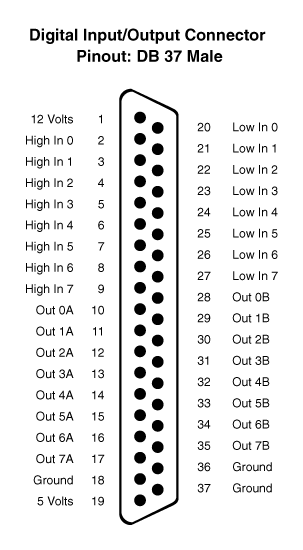

function **WriteIOExt** (value)

Writes to the extended I/O port the 32-bit value \<value\>.

function **ReadIOExt** () : uint

Reads from the extended I/O port a 32-bit value.

function **SetIOExtDir** (flags)

Allows you to specify which of the 32 pins is output or input. The \<flags\>
parameter is a 32-bit value. Each bit represents a pin. If the bit is 0, it
indicates that the pin is configured as an output, while if the bit is 1, it
indicates that the pin is configured as an input.

function **SetIOExtPu** (flags)

In the case of input bits, it is possible to determine if we want to use the
"pull ups" method to query the state of the pins. That is, when the pin value is
0 we will read a 0, if the pin value is 1 or indeterminate, we will read a 1.

#### I2C

function **OpenI2C** (address, hz = 100000) : pointer

Returns an I2C device driver if it was able to connect to the SLAVE ADDRESS of
the device. In case of error, it shall return NUL.

The methods available from the controller are

| **WriteByte** (byte)                  | Writes one byte to the device.            |
|---------------------------------------|-------------------------------------------|
| **ReadByte** ()                       | Reads a byte from the device.             |
| **WriteReg** (reg, byte)              | Writes to a record on the device.         |
| **ReadReg** (reg)                     | Reads from a device log.                  |
| **Write** (buffer, off = 0, len = -1) | Writes a data buffer to the device.       |
| **Read** (buffer, off = 0, len = -1)  | Reads data from the device into a buffer. |

function **CloseI2C** (i2c)

Shut down and release the resources used by the I2C device driver.

#### USB

function **GetUSBDevices** () : list

Gets a list of USB devices we can access.

function **OpenUSBDevice** (device) : pointer

Get the driver to a USB device. By using the driver, the following methods are
accessible:

| **Reset** ()                                                        | Reboot the device.                                                                                                      |
|---------------------------------------------------------------------|-------------------------------------------------------------------------------------------------------------------------|
| **GetDescriptor** ()                                                | Gets a list of description IDs.                                                                                         |
| **GetStringDescriptor** (id)                                        | Gets the text associated with a description ID.                                                                         |
| **IsKernelDriver** (iface)                                          | Check if the interface has the kernel driver active. If so, the interface cannot be reclaimed. \<iface\> is an integer. |
| **AttachKernelDriver** (iface)                                      | Associate driver kernel to device interface.                                                                            |
| **DetachKernelDriver** (iface)                                      | Release driver core to the device interface.                                                                            |
| **ClaimInterface** (iface)                                          | It reclaims the interface to access its I/O functions.                                                                  |
| **ReleaseInterface** (iface)                                        | It frees the user interface.                                                                                            |
| **BulkTransfer** (endpoint, buffer, timeout)                        | Performs a Bulk Transfer operation on an \<endpoint\>.                                                                  |
| **InterruptTransfer** (endpoint, buffer, timeout)                   | Performs an Interrupt Transfer operation on an \<endpoint\>.                                                            |
| ControlTransfer (bmReqType, bmReq, wValue, wIndex, buffer, timeout) | Performs a Control Transfer operation.                                                                                  |

function **CloseUSBDevice** (usb)

Shut down and free the resources used by the USB device driver.

#### EEPROM

function **WriteEEPROM** (addr, buffer, off, len)

Writes data to EEPROM. *This function is locked and is only available in an
Administrator/Manufacturer type environment.*

function **ReadEEPROM** (addr, buffer, off, len)

Reads data from the EEPROM. With \<addr\> you specify the address from which to
read data. The range is from 0 to 255. We can also specify the destination
within a buffer and the amount of data to read \<len\>.

#### Audio slot amplifier

function **SetSlotAudioVolume** (v)

Sets the output power at the amplifier that filters the audio coming out of the
cartridges. The value of \<v\> may be an integer between 0 and 255.

function **GetSlotAudioVolume** () : int

Gets the value associated with the audio volume for the amplifier that filters
the audio coming out of the cartridges. This value is an integer in the range 0
to 255.

#### Microphone

function **AudioCaptureStart** (ms = 5000, wavPath = "")

Initialises the audio capture in real time. We can indicate the capture time we
want to capture using the \<ms\> parameter, measured in milliseconds. If this
time value is 0, we will indicate that we will be capturing audio indefinitely
until we use the *AudioCaptureStop* function. We can also indicate if we want to
save the capture data in a WAV file. We will be able to consult the captured
data in real time using the *AudioCaptureRead* function.

function **AudioCaptureStop** ()

We stop the audio capture.

function **AudioCaptureRead** (buffer, off, size)

We obtain data from the capture in real time. This data will be stored in a
buffer and we will indicate the number of data to store in \<size\>.

#### Remote Control

function **SetRemote** (_on)

Activates/Deactivates the remote control or also the REM cassette port.

function **GetRemote** () : bool

Gets the status of the remote control. If the returned value is true, the REM is
on, and if it is false, the REM is off.

#### Drivers

function **AddDriver** (_name) : pointer

Add a driver to manage some kind of device that uses the machine's hardware. The
available drivers are:

| MSXMOUSEA          | Mouse management using an MSX mouse on port A.                                 |
|--------------------|--------------------------------------------------------------------------------|
| MSXMOUSEB          | Mouse management using an MSX mouse on port B.                                 |
| MSXJOYSTICKA       | Mouse management using an MSX joystick on port A.                              |
| MSXJOYSTICKB       | Mouse management using an MSX joystick on port B.                              |
| MSXPHILIPSKEYBOARD | Keyboard management using a Philips NMS8250/NMS8280 keyboard on the DB37 port. |

function **RemoveDriver** (_name)

Removes the device driver previously added with the *AddDriver* function.

function **FindDriver** (_name) : pointer

Search among the added controllers for one with the same name as the one
specified in the \<name\> parameter.

function **SetDriverProperty** (_driver, \_name, \_value)

Given a controller allows to set in its \<name\> property a \<value\> value.

function **GetDriverProperty** (_driver, \_name) : value

Given a controller allows to obtain the value of its \<name\> property.

## Virtual Machines

Management of the different virtual machines in the system.

function **CreateVirtualMachine** (model, parent = null) : pointer

Given a model name \<model\>, create a virtual machine driver. This driver can
be linked as a child of a \<parent\> program.

function **DestroyVirtualMachine** (machine)

Given a virtual machine driver, it releases all used resources.

function **GetAvailableVirtualMachineSystems** () : list

Returns a list of available systems. The items in the list are of type string.
Each system has one or more models.

function **GetAvailableVirtualMachineConfigurations** (system = "", model = "")
: list

Given the name of a system \<system\> and/or the name of a model \<model\>,
return a list of all virtual machine configurations matching that system and
model. If nothing (empty string) is specified in the \<model\> parameter, it
will search for all models belonging to the \<system\>. If we do not specify
anything in \<system\> either, it will return all available models of all
systems.

function **CheckVirtualMachineConfiguration** (model) : bool

Indicates whether a configuration exists for that model. The configurations are
located in the *GetEngine().GetVirtualMachineConfigurationsFolder()*. These
configurations have the model name followed by the XML extension.

function **CreateVirtualMachineConfiguration** (model, system, desc) : pointer

Given a model name \<model\>, it creates the corresponding XML file and
associates a system \<system\> and a description \<desc\> to it. The function
shall return the virtual machine configuration instance.

function **DestroyVirtualMachineConfiguration** (model)

Given a model name \<model\>, the XML file is deleted and the loaded
configuration resources are freed.

function **UnloadVirtualMachineConfiguration** (mc)

Given a virtual machine configuration instance \<mc\>, it is freed from memory.

function **CloneVirtualMachineConfiguration** (modelSrc, modelDst) : bool

Given a source model name \<modelSrc\>, the configuration (the XML file) named
\<modelDst\> is cloned.

function **RenameVirtualMachineConfiguration** (modelOld, modelNew) : bool

Given a model name \<modelOld\>, the configuration file is renamed to the new
name \<modelNew\>.

function **LoadVirtualMachineConfiguration** (model) : pointer

Given a model name \<model\>, the virtual machine configuration instance is
loaded and returned. If no such model configuration exists, NULL shall be
returned.

function **SaveVirtualMachineConfiguration** (mc, model = "")

Given a virtual machine configuration instance \<mc\>, we will save the
associated configuration file. If we want to use another model name for that
configuration, we will use the \<model\> parameter.

#### VirtualMachine Controller

| **AddCPUBreakpoint** (type, addr, addrCount = 1, data = 0)   | Adds a breakpoint for the CPU. A type \<type\>, an address \<addr\> and other parameters are set depending on the type.                                   |
|--------------------------------------------------------------|-----------------------------------------------------------------------------------------------------------------------------------------------------------|
| **AddDevice** (name, ports = "", params = "")                | Add a device with name \<name\> using ports \<port\> and additional parameters \<params\>.                                                                |
| **AddEvent** (event, ctx, function)                          | Adds an event and associates a context to it.                                                                                                             |
| **AddMapper** (name, slot, sslot, page, path, size, patch)   | Associate a mapper to a slot/subslot/page.                                                                                                                |
| **ApplyIPSFile** (ipsFile, buffer)                           | Applies an IPS file over a buffer.                                                                                                                        |
| **CPUCall** (addr)                                           | Applies a call to a routine at memory address \<addr\>.                                                                                                   |
| **EnumDevices** ()                                           | Returns a list of available devices.                                                                                                                      |
| **FindDevice** (name)                                        | Search for a device with name \<name\>.                                                                                                                   |
| **FindMapper** (name, slot, sslot, page)                     | Search for a mapper with name \<name\> and/or in a slot/subslot/page.                                                                                     |
| **GetCPUDASM** (pc, symbols = null, buffer = null)           | Gets a list of two components: on the one hand a text string with the opcode and on the other hand the size in bytes of the opcode.                       |
| **GetCPUDebug** ()                                           | Indicates whether the CPU is in debug mode.                                                                                                               |
| **GetCPUReg** (reg)                                          | Returns the value of a record.                                                                                                                            |
| **GetDeviceProp** (dev, prop)                                | Returns the value of a device property.                                                                                                                   |
| **GetDeviceReg** (dev, reg)                                  | Returns the value of a device register.                                                                                                                   |
| **GetEmulationSpeed** ()                                     | Gets the emulation speed factor.                                                                                                                          |
| **GetMapperInfo** (mapper)                                   | Returns a list with information about the mapper (name, slot, subslot, page and number of bytes associated).                                              |
| **GetProperty** (name)                                       | Returns the value of a property of the machine.                                                                                                           |
| **GetTapeCounter** ()                                        | Returns the value of the cassette counter.                                                                                                                |
| **GetVideoAdjust** ()                                        | Indicates the video setting.                                                                                                                              |
| **GetVideoAlign** ()                                         | Indicates video alignment.                                                                                                                                |
| **GetVideoDevice** (dev)                                     | Gets the video device with index \<dev\>.                                                                                                                 |
| **GetVideoDeviceNumber** ()                                  | Gets the number of existing video devices.                                                                                                                |
| **GetVideoFrameRateMode** ()                                 | Gets the frame rate mode.                                                                                                                                 |
| **GetVideoHeight** (ix = -1)                                 | Gets the vertical resolution of the video device with index \<ix\>. If -1, returns the current one.                                                       |
| **GetVideoImageTex** (ix = -1)                               | Gets the texture of the video device with index \<ix\>. If -1, returns the texture of the current video device.                                           |
| **GetVideoShowAllDevices** ()                                | Indicates whether all video devices are being displayed at the same time.                                                                                 |
| **GetVideoWidth** (ix = -1)                                  | Gets the horizontal resolution of the video device with index \<ix\>. If -1, returns the current one.                                                     |
| **Inp** (port)                                               | Performs an I/O port read.                                                                                                                                |
| **InsertCartridge** (slot, file, mapper, ipsFile = "")       | Simulates the insertion of a cartridge into a \<slot\> slot using a \<file\> file, a mapper and an optional IPS patch.                                    |
| **InsertDisk** (id, file, rdOnly = false)                    | Simulates the insertion of a disk image into one of the \<id\> drives. The disk image shall have a \<file\> path and may optionally be used as read-only. |
| **IsPlayingTape** ()                                         | Indicates whether a cassette tape is playing.                                                                                                             |
| **LoadState** (path)                                         | Loads the state of a machine from a route.                                                                                                                |
| **LoadTape** (file, rdOnly = false)                          | Simulates the use of a cassette tape with path in \<file\>. By default it shall be writable to it.                                                        |
| **NextVideoDevice** ()                                       | Allows you to switch from the current video device to the next one.                                                                                       |
| **Outp** (port, v)                                           | Performs a write to the I/O port.                                                                                                                         |
| **PatchMapper** (mapper, patch)                              | Given a mapper object, apply a patch in text format.                                                                                                      |
| **Peek** (addr)                                              | Returns the byte read at the memory address visible to the CPU.                                                                                           |
| **PlayTape** ()                                              | Starts playback of a cassette tape.                                                                                                                       |
| **PlugPortDevice** (port, name)                              | Simulates the connection of a device to one of the gaming ports.                                                                                          |
| **Poke** (addr, v)                                           | Writes a value to CPU-visible memory.                                                                                                                     |
| **PressKey** (key)                                           | Simulates a keystroke.                                                                                                                                    |
| **PrevVideoDevice** ()                                       | Switches from the current video device to the previous one.                                                                                               |
| **ReadFromPortDevice** (port)                                | Reads a value from the game port.                                                                                                                         |
| **ReleaseKey** (key)                                         | Simulates the release of a keystroke.                                                                                                                     |
| **RemoveCartridge** (slot)                                   | Removes a cartridge inserted in a slot.                                                                                                                   |
| **RemoveCPUBreakpoint** (type, addr)                         | Removes an aggregate breakpoint.                                                                                                                          |
| **RemoveDevice** (dev)                                       | Given a device object, removes it from the machine.                                                                                                       |
| **RemoveDisk** (id)                                          | Simulates the removal of a disc.                                                                                                                          |
| **RemoveMapper** (mapper)                                    | Given a mapper object, removes it.                                                                                                                        |
| **RewindTape** ()                                            | Rewind a cassette tape.                                                                                                                                   |
| **SaveState** (path)                                         | Saves the status of the machine.                                                                                                                          |
| **SetCPUBreakpointCallback** (ctx, function)                 | Allows to set which script function to call when a breakpoint is met.                                                                                     |
| **SetCPUDebug** (v)                                          | Sets the CPU debugging mode.                                                                                                                              |
| **SetCPUReg** (reg, v)                                       | Gives value to a record.                                                                                                                                  |
| **SetDeviceProp** (dev, prop, value)                         | Assigns a value to a property of a device.                                                                                                                |
| **SetDeviceReg** (dev, reg, value)                           | Assigns a value to a register of a device.                                                                                                                |
| **SetEmulationSpeed** (speed)                                | Sets the emulation speed factor.                                                                                                                          |
| **SetLed** (led, v)                                          | Turns an LED on or off.                                                                                                                                   |
| **SetProperty** (name, v)                                    | Sets a machine property.                                                                                                                                  |
| **SetRenderSettings** (w, h, ox = 0, oy = 0, xf = 1, yf = 1) | Indicates the rendering settings.                                                                                                                         |
| **SetROMSFolder** (path)                                     | Sets the default folder for the system BIOS.                                                                                                              |
| **SetSaveStatesFolder** (path)                               | Sets the default folder in which to save and read machine states.                                                                                         |
| **SetSRAMFolder** (path)                                     | Sets the folder where the static memories are located.                                                                                                    |
| **SetVideoAdjust** (adjust)                                  | Indicates the new video setting.                                                                                                                          |
| **SetVideoAlign** (align)                                    | Indicates the new video alignment.                                                                                                                        |
| **SetVideoDevice** (dev)                                     | Sets the video device with index \<dev\>.                                                                                                                 |
| **SetVideoFrameRateMode** (mode)                             | Indicates the frame rate to be used.                                                                                                                      |
| **SetVideoShowAllDevices** (show)                            | Sets whether or not to show all video devices at the same time.                                                                                           |
| **StopTape** ()                                              | Stops cassette playback.                                                                                                                                  |
| **UnloadTape** ()                                            | Remove the cassette from the player.                                                                                                                      |
| **UnPlugPortDevice** (port)                                  | Remove the device from the game port.                                                                                                                     |
| **WriteToPortDevice** (port, value)                          | Write a value to the game port.                                                                                                                           |
| **SetCPUNativeCallback** (ctx, function)                     | Sets the script function to call when a TRAP 0x0003 instruction is given                                                                                  |

**Types of breakpoints**

| 0 | PC_EQUAL. When the PC register is equal to an address.                                          |
|---|-------------------------------------------------------------------------------------------------|
| 1 | MEM_BYTE_EQUAL. When the value of the contents of a memory address is equal to one byte.        |
|   | MEM_BYTE_CHANGES. When a range of 8-bit values from an address changes.                         |
|   | MEM_WORD_EQUAL. When the value of the contents of a memory address is equal to a 2-byte number. |
|   | MEM_WORD_CHANGES. When a range of 16-bit values from an address changes.                        |
| 5 | PORT_WRITE. When a write occurs on a port.                                                      |
|   | PORT_READ. When a read occurs on a port.                                                        |

**Z80 CPU registers**

| 0  | A       |    | A1      |
|----|---------|----|---------|
| 1  | F       | 25 | F1      |
|    | AF      | 26 | AF1     |
|    | B       |    | B1      |
|    | C       |    | C1      |
| 5  | BC      | 29 | BC1     |
|    | D       | 30 | D1      |
|    | E       | 31 | E1      |
| 8  | DE      |    | DE1     |
|    | H       |    | H1      |
|    | L       |    | L1      |
|    | HL      | 35 | HL1     |
|    | IX High |    | SH High |
|    | IX Low  |    | SH Low  |
|    | IX      |    | SH      |
|    | IY High |    | I       |
|    | IY Low  |    | R       |
|    | IX      |    | R2      |
|    | PC High | 42 | IFF1    |
|    | PC Low  |    | IFF2    |
|    | PC      |    |         |
| 21 | SP High |    |         |
|    | SP Low  |    |         |
|    | SP      |    |         |

**CPU MOS registers**

| 0 | A |   | SP    |
|---|---|---|-------|
| 1 | X |   | PC    |
|   | Y | 5 | FLAGS |

## Images

Loading and manipulation of textures (bitmaps).

function **LoadTexture** (path) : pointer

Loads a texture found in the \<path\> file path. The Native Texture API
functions are used to manipulate this type of object.

function **DeleteTexture** (tex)

It frees up resources used by a texture.

function **LoadImage** (path) : pointer

Loads a texture found in a \<path\> file path and associates it with an image
controller. The methods of an image controller are:

| GetTexture () | Gets the associated texture.                     |
|---------------|--------------------------------------------------|
| GetWidth ()   | Returns an integer with the width of the image.  |
| GetHeight ()  | Returns an integer with the height of the image. |

function **DeleteImage** (img)

Frees up resources used by the image controller.

## Location / Languages

function **SetLocaleLanguage** (iso)

Sets the language to be used for the texts presented by the applications and the
system. The language code \<iso\> must be a two-digit code based on ISO-3166.
Some examples:

| GB | UK - English |
|----|--------------|
| EN | English      |
| IT | Italian      |
| FR | French       |

function **GetLocaleLanguage** () : string

Gets the ISO-3166 code set as the language to be used.

function **SetKeyboardLayout** (iso)

Specifies the keyboard layout to be used in the system. Each key on our keyboard
is mapped to a code type, and we can have different mappings depending on the
chosen configuration. In this case, the \<iso\> parameter consists of a
two-digit code based on the ISO-3166 standard.

function **GetKeyboardLayout** () : string

Gets the current keyboard layout.

## Logger

The system and applications can use the Logger to log messages to help users
detect errors, potential problems or events of any kind.

There are these categories of messages:

| NO CATEGORY | These are text messages without any formatting and without any category. These messages are always logged.                                 |
|-------------|--------------------------------------------------------------------------------------------------------------------------------------------|
| VERBOSE     | These messages are associated with a level, which allows us to filter which messages will be logged. This message also logs the date/time. |
| WARNING     | Messages associated with minor errors. They record the date/time when they occur.                                                          |
| ERROR       | Messages associated with serious or critical errors. They record the date/time when they occur.                                            |

function **LogPrint** (msg)

Dump a message into the logging system. This would be a message with no category
set.

function **LogVerbose** (msg, level = 0)

Dumps a message into the logging system with VERBOSE category. These are
informational messages that can be logged depending on whether the *SetVerbose*
function is enabled.

function **LogError** (msg)

Dumps a message in the logging system with category ERROR.

function **LogWarning** (msg)

Dump a message into the logging system with category WARNING.

function **SetVerboseLevel** (level)

Sets the level of VERBOSE category messages we want to log. If \<level\> is -1,
no messages will be displayed. If \<level\> is a number greater than or equal to
zero, only messages with a level greater than or equal to zero will be
displayed.

function **GetVerboseLevel** () : int

Gets the level of VERBOSE category messages currently configured.

## Notifications

In the graphical environment, a type of Notifications are managed to inform the
user, in a visual way, of the occurrence of events in the system.

function **CreateNotification** (title, msg, id = -1)

Creates a notification with a title \<title\>, a message body \<msg\> and a
notification identifier \<id\>. Using the identifier we can change the texts of
the same notification on the screen, without the need for a new one to be
created.

## Video

The video options allow you to change the screen resolution, among other
options. You can also configure the image post-processing FX filter to simulate
monochrome screens, scanlines, etc.

function **SetVideoFX** (name, v)

Sets the value of a post-processing FX filter property. The accessible property
names are:

| **Name**        | **Functionality**                  | **Values**    |
|-----------------|------------------------------------|---------------|
| enabled         | Turns the filter on/off.           | True or false |
| R_blur          | Blur in the red component.         | \-0.1 a 0.1   |
| G_blur          | Blur in the green component.       | \-0.1 a 0.1   |
| B_blur          | Blur in the blue component.        | \-0.1 a 0.1   |
| Contrast_add    | It adds to the contrast.           | 0 a 1         |
| Contrast_factor | Contrast multiplier.               | 0 a 1         |
| Vignette_add    | Adds to the vignette effect.       | 0 a 1         |
| Vignette_factor | Multiplier to the vignette effect. | 0 a 10        |
| Tint_r          | Adds to the red component.         | 0 a 1         |
| Tint_g          | Adds to the green component.       | 0 a 1         |
| Tint_b          | Adds to the blue component.        | 0 a 1         |
| Scanline_add    | Sum in the scanline effect.        | 0 a 1         |
| Scanline_factor | Multiplier in the scanline effect. | 0 a 1         |
| Scanline_crawl  | Noise vertical retraction effect.  | 0 a 10        |
| Scanline_size   | Size of the scanline effect.       | 1 a 16        |
| Flickering      | Flickering of the screen.          | 0 a 1         |
| Smooth_min      | Minimal overall blurring.          | 0 a 1         |
| Smooth_max      | Maximum overall blur.              | 0 a 1         |

function **GetVideoFX** (name, def = "") : value

Gets the value of the post-process FX filter property with name \<name\>. In
case the property does not exist, it would return the default value \<def\>.

function **GetVideoFXParams** () : list

Gets a list where to obtain information about all the accessible parameters to
configure the active post-processing FX filter. The list will be composed by
items with the following information:

| NAME          | Name of the parameter.              |
|---------------|-------------------------------------|
| VALUE_MIN     | Minimum value that can be assigned. |
| VALUE_MAX     | Maximum value that can be assigned. |
| VALUE_STEP    | Passing between values.             |
| VALUE_DEFAULT | Default value.                      |

function **SetVideoOverscan** (x, y, w = 1, h = 1)

Sets the origin (x, y) screen position setting. On some CRT televisions, it is
necessary to adjust this in order to properly view the screen content.
Similarly, it is also possible to adjust the width and height of what we are
viewing: (w, h) are used as scaling factors.

function **GetVideoOverscan** () : list

Returns a list where the elements are [x, y, w, h], where (x, y) is the origin
position on the screen where we visualise the graphics and (w, h) are the
scaling factors to be used.

function **SetVideoOutput** (ch, dm = -1, da = -1)

The video output is set to the following channels:

| **\<ch\>**                     | **Exit**                  |
|--------------------------------|---------------------------|
| CONFIG_VIDEO_OUTPUT_DIGITAL    | HDMI/DVI digital          |
| CONFIG_VIDEO_OUTPUT_ANALOG     | Composite video           |
| **\<dm\>**                     | **Digital Mode**          |
| CONFIG_VIDEO_DIGITAL_HDMI      | HDMI mode                 |
| CONFIG_VIDEO_DIGITAL_DVI       | DVI mode                  |
| **\<da\>**                     | **Analogue Mode**         |
| CONFIG_VIDEO_ANALOG_NTSC       | NTSC                      |
| CONFIG_VIDEO_ANALOG_JP_NTSC    | Japan NTSC                |
| CONFIG_VIDEO_ANALOG_PAL        | PAL                       |
| CONFIG_VIDEO_ANALOG_BR_PAL     | Brazilian PAL             |
| CONFIG_VIDEO_ANALOG_PRS_NTSC   | NTSC Progressive          |
| CONFIG_VIDEO_ANALOG_PRS_PAL    | PAL Progressive           |
| CONFIG_VIDEO_ANALOG_4_3        | Flag format 4:3           |
| CONFIG_VIDEO_ANALOG_14_9       | Flag format 14:9          |
| CONFIG_VIDEO_ANALOG_16_9       | Flag 16:9 format          |
| CONFIG_VIDEO_ANALOG_MONOCHROME | Flag output in monochrome |

In case of using \<dm\> as -1 or \<da\> as -1, the values already set will be
used.

function **GetVideoOutput** () : int

Returns CONFIG_VIDEO_OUTPUT_ANALOG or CONFIG_VIDEO_OUTPUT_DIGITAL depending on
the configuration set.

function **GetVideoOutputEx** () : list

Returns a list with: [VIDEO OUTPUT, DIGITAL VIDEO, VIDEO ANALOG]. Provides
complete information about the video output configuration (see
*SetVideoOutput*).

function **SetVideoAdjust** (m)

Sets the default video adjustment mode used in different applications. The
values can be:

| CONFIG_VIDEO_ASPECT_1X          | 1X - Original size.                                                                 |
|---------------------------------|-------------------------------------------------------------------------------------|
| CONFIG_VIDEO_ASPECT_2X          | 2X - Double the original size.                                                      |
| CONFIG_VIDEO_ASPECT_3X          | 3X - Triple the original size.                                                      |
| CONFIG_VIDEO_ASPECT_ORIGINAL    | The maximum size that can be seen on screen respecting the proportion.              |
| CONFIG_VIDEO_ASPECT_ORIGINAL_EX | The original, but trying to maximise the size horizontally.                         |
| CONFIG_VIDEO_ASPECT_EXPANDED    | Adjusts the size to the maximum allowed by the screen. Does not respect proportion. |

function **GetVideoAdjust** ()

Gets the default video setting mode used in different applications.

function **SetVideoFramerate** (hz)

Sets the refresh rate used to render the graphics on screen. When drawing a full
frame, a refresh time is taken into account that depends on the desired screen
refresh rate. This refresh rate does not depend on the capacity of the monitor
or the video hardware.

function **GetVideoFramerate** ()

Gets the refresh rate that is being used to render the frames on screen.

function **GetAvailableVideoFormats** () : list

Returns a list with information about the different display modes. Each item in
the list has: [Horizontal resolution in pixels, Vertical resolution in pixels,
Colour depth (bits per pixel), Refresh in Hz].

function **SetVideoFormat** (w, h, bpp, hz)

Sets a format for the screen. We will indicate the horizontal resolution in
pixels \<w\>, the vertical resolution in pixels \<h\>, the number of bits per
pixel \<bpp\> and the screen refresh rate \<hz\>. Valid formats are all those
available using the *GetAvailableVideoFormats* function.

function **GetVideoFormat** () : list

Returns the current screen format in a list with the items: [Horizontal
resolution in pixels, Vertical resolution in pixels, Bits per pixel, Refresh in
Hz].

## Audio

On the MSXVR we have two channels for audio output:

| Channel 0 | System audio, virtual machines, sound generated via PCM sound chip. |
|-----------|---------------------------------------------------------------------|
| Channel 1 | System audio from the cartridge slots.                              |

function **SetAudioOutput** (mode)

Sets the audio output for channel 0 according to the set \<mode\> mode:

| CONFIG_AUDIO_OUTPUT_DIGITAL | Output via digital port (HDMI)                |
|-----------------------------|-----------------------------------------------|
| CONFIG_AUDIO_OUTPUT_ANALOG  | Output via the analogue port (RCA/Jack 3.5mm) |

function **GetAudioOutput** () : int

Gets the mode set for the audio output of channel 0.

function **SetAudioVolume** (vol, id = 0)

Allows configuration of the volume of the audio output for any of the \<id\>
channels. The \<vol\> parameter shall be an integer value between 0 and 255.

function **GetAudioVolume** (id = 0) : int

Gets the output audio volume configured for channel \<id\>.

function **SetAudioPanning** (pan, id = 0)

Sets the volume adjustment between left and right speaker (balance) for the
audio outputs of the channel set \<id\>. The value of \<pan\> shall be an
integer between 0 and 255, with 0 for full volume on the left side, 255 for full
volume on the right side, and 127 for centre volume.

function **GetAudioPanning** (id = 0) : int

It will return the volume setting associated with the left/right balance setting
according to the audio channel indicated in \<id\>.

## Topics

function **SetThemePreset** (name)

Sets a theme profile with name \<name\>. Profiles can be created/modified via
the theme configurator.

function **GetThemePreset** () : string

Gets the topic profile currently in use.

function **SetThemeColorIndices** (fg, bg, br)

Sets the ink, background and border colours for the current theme. These colours
are indexes to a palette of 16 entries.

function **SetThemeConsoleWidth** (w)

Sets the width of text columns in the console. The maximum is 80.

function **SetThemeConsoleMode** (mode)

Sets the console mode (monochrome if \<mode\> is 1 or multicolour if \<mode\> is
0).

## Switching on and off

function **PowerOff** ()

Sends a shutdown request to the computer.

function **Reset** (hw = false)

Sends a reset request to the computer. This reset can either reset the entire
system, including hardware, with \<hw\> true, or simply reset the system
software, with \<hw\> to false.

function **SystemPause** ()

Sends a Pause request to all system applications.

function **StopPowerOff** ()

Allows you to stop the shutdown process of the computer. This does not mean that
it is cancelled, but simply that it is paused until you decide whether to
continue or terminate it.

function **CancelPowerOff** ()

Completely cancels the shutdown process of the computer. When the computer
starts a shutdown process, the *OnSystemExit* function is invoked in all running
programs. From this function, we can decide how to handle this notification,
either by pausing it with *StopPowerOff*, cancelling it with *CancelPowerOff,*
or resuming the process with *PowerOff* again.

~~~~~~~~~~~~~~~~~~~~~~~~~~~~~~~~~~~~~~~~~~~~~~~~~~~~~~~~~~~~~~~~~~~~~~~~~~~~~~~~

~~~~~~~~~~~~~~~~~~~~~~~~~~~~~~~~~~~~~~~~~~~~~~~~~~~~~~~~~~~~~~~~~~~~~~~~~~~~~~~~

## User

function **GetSerialNumber** () : string

Gets the serial number of the computer board.

function **GetAlias** () : string

Returns the name of the alias associated with the computer.

function **SetAlias** (alias) : string

Sets the name of the alias associated with the computer.

function **GetUserName**() : string

Gets the name of the active user.

function **SetUser** (name, pwd) : bool

Sets the user who is using the computer (active user). This allows the system to
set configurations associated with different users. If the operation is
successful, it will return true.

## Time

function **GetTimeString** (format) : string

Given a date and time format, return the string with the current date and time
in that format. For the different formats see the Native API function
*SysTime_ToString*.

function **SetTime** (year, month, day, hour, minute, second, ms)

Given a date and time in the parameters of the function, it shall be applied in
the system, so that from then on it shall be the new date and time.

# Programming a VR-DOS application

A VR-DOS application is one that is intended to make use of the DOS console or
to be displayed as an integrated part of the DOS utility itself.

The application will inherit from the template with name *DOS_Program*

The entry point to be used is as follows:

~~~~~~~~~~~~~~~~~~~~~~~~~~~~~~~~~~~~~~~~~~~~~~~~~~~~~~~~~~~~~~~~~~~~~~~~~~~~~~~~
virtual Start()
{
}
~~~~~~~~~~~~~~~~~~~~~~~~~~~~~~~~~~~~~~~~~~~~~~~~~~~~~~~~~~~~~~~~~~~~~~~~~~~~~~~~

For our program to terminate and return to DOS again, we would have to use the
End(0) instruction;

To access the DOS console, use the GetConsole() function.

To access the DOS window, use the GetWindow() function.

Some of the methods accessible via the console are:

function **Print** (text)

Sends text to the console from the cursor position. The position of this cursor
is updated according to the number of characters and whether the horizontal
maximum has been exceeded.

function **PrintLn** (text)

It works in the same way as the *Print* function, but also adds a line break.

function **PrintError** (code, extra = "")

Prints an error message. The \<code\> parameter may be either a number with the
error code or a text string. The message shall be displayed on the screen in the
configured error style.

function **PrintOk** (text)

Prints a message with the style set to display affirmative messages.

function **Input** (prompt, ctx = null, cb = "", password = false)

Puts the console in data entry mode by the user. We will specify a \<prompt\>
text to be displayed on the console, and from this the user will be able to
enter data. This function is blocking, if you do not specify an \<ctx\> and
\<cb\> context to invoke. The \<password\> parameter allows to hide the inserted
data.

If Input is called in blocking form, the data entered is returned in string
format at the output of the function. If non-blocking, an empty string will be
returned, the rest of the code statements will continue and until the user stops
entering data, the function will not be invoked in the context \<ctx\> and named
\<cb\>.

function **Width** (x)

Sets the number of characters that can be represented per horizontal line.

function **Locate** (x, y, cursor = -1)

Modifies the cursor position from which characters are printed on the console.

function **GetTextModeCols** ()

Gets the number of characters that fit per horizontal line of the console.

function **GetTextModeRows** ()

Gets the number of characters that fit per vertical line of the console.

function **SetTextColorMode** (v)

Allows you to change the display mode used by the console, in this case to
multicolour text mode. When working in multicolour, we can set a different ink
colour for each character on the console. Using the *Print* command, it is
possible to indicate the colour to be used by means of a series of reserved
words:

~~~~~~~~~~~~~~~~~~~~~~~~~~~~~~~~~~~~~~~~~~~~~~~~~~~~~~~~~~~~~~~~~~~~~~~~~~~~~~~~
_console.PrintLn("This [/yellow] is yellow [/def] and this [/red] is red [/def]");
~~~~~~~~~~~~~~~~~~~~~~~~~~~~~~~~~~~~~~~~~~~~~~~~~~~~~~~~~~~~~~~~~~~~~~~~~~~~~~~~

We can also encode a colour change with the values from \\0 to \\F, which are
the indices of the 16 colours of the available palette.

~~~~~~~~~~~~~~~~~~~~~~~~~~~~~~~~~~~~~~~~~~~~~~~~~~~~~~~~~~~~~~~~~~~~~~~~~~~~~~~~
_console.PrintLn("This one is yellow and this one is red");
~~~~~~~~~~~~~~~~~~~~~~~~~~~~~~~~~~~~~~~~~~~~~~~~~~~~~~~~~~~~~~~~~~~~~~~~~~~~~~~~

The following reserved words exist:

| def         | Activates the default colour.                           |
|-------------|---------------------------------------------------------|
| prev        | Sets the previous colour prior to a colour change.      |
| black       | Colour black.                                           |
| green       | Green colour.                                           |
| midgreen    | Light green colour.                                     |
| lightgreen  | Bright green colour.                                    |
| blue        | Blue colour.                                            |
| midBlue     | Light blue colour.                                      |
| lightblue   | Bright blue colour.                                     |
| network     | Red colour.                                             |
| midred      | Light red colour.                                       |
| lightred    | Bright red colour.                                      |
| cyan        | Colour cyan.                                            |
| yellow      | Yellow colour.                                          |
| lightyellow | Bright yellow colour.                                   |
| magenta     | Purple colour.                                          |
| gray        | Grey colour.                                            |
| white       | White.                                                  |
| error       | Colour associated with the error (default Red).         |
| bold        | Colour associated with the highlight (Cyan by default). |
| title       | Colour associated with a title (default Yellow).        |
| hline       | Draw a line of dashes to the end of the line.           |
| hFill       | Fill in with spaces until the end of the line.          |
| tab         | Add a tabulator.                                        |
| dosname     | Displays the DOS version name.                          |
| osname      | Displays the name of the Operating System.              |

function **GetTextColorMode** ()

Gets the current text display mode being used. Will return true if multi-colour
text mode is being used.

function **SetPal** (index, colour)

Assigns an RGB colour \<color\> (see Native RGB/ARGB API functions*) to* an
entry in the \<index\> colour palette used by the console. The palette has a
total of 16 possible entries (colours).

function **GetPal** (index)

Returns the RGB value of the colour associated with the \<index\> palette entry.

function **SetColor** (fg, bg, br)

Sets the ink colour \<fg\>, background \<bg\> and border \<br\> represented by
the on-screen console. These colours are indices to the colour palette, i.e.
only integers from 0 to 15 are valid.

function **GetFGColor** ()

Gets the index of the colour palette representing the colour for the ink. See
*SetColor*.

function **GetBGColor** ()

Gets the index of the colour palette representing the colour for the background.
See *SetColor*.

function **GetBRColor** ()

Gets the index of the colour palette representing the border colour. See
*SetColor*.

function **Cls** (ch = EMPTY_CHAR)

Allows you to clear all characters from the console. If no character is
specified, the default character will be used. The cursor will return to the
(0,0) position on the screen.

#### MDI

So far we have seen how to use the DOS console to create our own applications.
However, we can create an MDI window to provide another type of user interface.

To create an application that is a floating MDI window above our VR-DOS
application, we use GetWindow().CreateMDI.

*GetWindow* allows us to get the VR-DOS window on which the console is being
represented as well. Therefore, we can create one or several MDI on this window
and have the advantages of VR-VIEW to create an application.

#### Example

~~~~~~~~~~~~~~~~~~~~~~~~~~~~~~~~~~~~~~~~~~~~~~~~~~~~~~~~~~~~~~~~~~~~~~~~~~~~~~~~
class MyHelloWord implements DOS_Program
{
	virtual Start()
	{
		_console = GetConsole();
		_console.PrintLn("Example of:");
		_console.PrintOk("Hello World!");
		End(0);
	}
}
~~~~~~~~~~~~~~~~~~~~~~~~~~~~~~~~~~~~~~~~~~~~~~~~~~~~~~~~~~~~~~~~~~~~~~~~~~~~~~~~

# Programming a VR-VIEW application

VR-VIEW refers to the graphical environment of the MSXVR operating system.

The template to work on for our application to use these features is called:
*View_Program.*

## The Desktop

The VR-VIEW graphical environment is managed from an object called DESKTOP. This
object is in charge of managing windows, distributing input device events and
basically everything related to the user interface. It is also in charge of
representing all the controls and graphics on the screen.

We can access the desktop from a VR-VIEW application using the GetDesktop()
function.

The Desktop does not allow more than one application window to be displayed at
the same time.

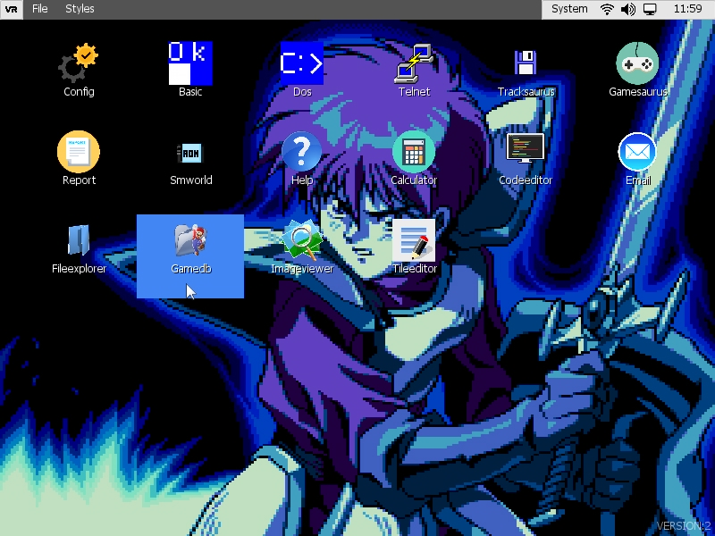

In the upper part associated with an application window we will find its title
and the menu, if it has one. However, we will also find other desktop elements,
such as the active applications button and the Widgets button panel.

## Application Windows

A window refers to a full screen. Windows are associated with applications. On a
window we can associate a menu and we can also create controls.

When a window created in full screen mode gains focus (becomes active), there
will be no menu bar: the client area of the window will occupy the entire
screen.

Available functions:

function **SetBgColor** (colour)

Applies a background colour to the window.

function **CenterPos** ()

Centres the position of the window both horizontally and vertically with respect
to its parent, i.e. another window or the desktop.

function **IsCursorOver** () : bool

Indicates whether the cursor is positioned over the window.

function **Show** ()

Displays the window.

function **Hide** ()

Hide the window.

function **GetClientControl** () : pointer

In a full screen window, the client area is the orange rectangle, i.e. the
entire screen except for the desktop menu, title and widgets:

In an MDI window, it would be similar but without including the window borders
and the header with the title and buttons:

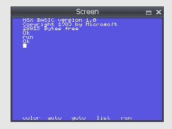

The client control is a frame where we can create other controls or change their
appearance, etc. Through the control we can change its appearance.

function **GetClientRect** () : list

Returns a list with the components [x, y, w, h], where (x, y) is the position of
the client area within the window and (w, h) its size. This size takes into
account whether or not the window displays a menu.

function **GetClientArea** () : list

Returns exactly the size of the client area, including the space occupied by the
menu. The returned list has these components [x, y, w, h].

function **ClientToScreen** (x, y) : list

Converts a point (x, y) located within the client zone coordinates to another
point located on the screen. The function shall return a list [xs, ys] with the
point in screen coordinates.

function **ScreenToClient** (x, y) : list

Given a point (x, y) in screen coordinates, the function shall return another
point [xc, yc] with the transformation to local coordinates of the client area.

function **SetStyle** (style)

Modifies the window style flags. These can be:

| STYLE_CAPTION           | Show the application bar where the title and buttons are located. |
|-------------------------|-------------------------------------------------------------------|
| STYLE_MAXIMIZE_BOX      | Show maximise window button.                                      |
| STYLE_CLOSE_BOX         | Show close window button.                                         |
| STYLE_RESIZE            | Allow the window to be resizable.                                 |
| STYLE_SHOW_MAXIMIZE     | Create the maximised window initially.                            |
| STYLE_SIZE_BOX          | Show window borders.                                              |
| STYLE_HIDE_MENU         | Hide the menu when the window gains focus.                        |
| STYLE_HIDE_MOUSE_CURSOR | Hide the cursor when the window gains focus.                      |
| STYLE_HIDE_BACKGROUND   | Hide the background when the window gains focus.                  |
| STYLE_SHOW_FULLSCREEN   | Define a window in full screen mode.                              |

function **GetStyle** ()

Gets the window style flags. See *SetSytle*.

function **AddStyle** (flags)

Adds one or more styles to the existing styles of the window.

function **RemoveStyle** (flags)

Remove one or more styles from the existing window.

function **HasStyle**(flag) : bool

Check for the existence of a style or styles among those that the window already
has.

function **SetBounds** (x, y, w,_h)

Modifies the position (x, y) and size (w, h) of the window.

function **SetTitle** (title)

Assigns a string \<title\> as the window title.

function **GetTitle** () : string

Returns the title assigned to the window.

function **IsMaximized** () : bool

Indicates whether the window is currently maximised.

function **IsForeground** () : bool

Indicates whether the window has the focus and is selected.

function **Activate** ()

Allows you to activate a window, and therefore the programme associated with it.

function **Maximize** ()

Maximises a window.

function **Restore** ()

Restores the original position and size of a window before it was maximised.

function **GetTopWindow** () : pointer

Returns the parent window that controls it, if it exists. If NULL is returned,
it is a window created by the desktop.

function **GetProgram** () : pointer

Gets the driver of the program associated with the window.

function **AddHotKey** (list, ctx, function, level = 0) : pointer

Adds a keyboard shortcut associated with the window. The key combination that
forms the shortcut is defined in the \<list\> parameter. If the combination is
given and valid, a call to the \<function\> function of the \<ctx\> context
shall be triggered. A \<level\> of access can be associated with the shortcut.
The function returns a keyboard shortcut handler.

The access level is mainly useful in MDI windows where we may want to
differentiate shortcuts exclusive to the MDI with others shared with the parent
window. To decide the associated level in an MDI you have to use the
*SetHotkeysLevel* function.

Shortcuts created in MDI windows are actually added as shortcuts in the parent
window. Therefore, if we create a shortcut equal to the one used in the parent
window with the same level, we will modify it and lose the original one. In such
a case, it is advisable to use a level other than zero, which is the default
level.

If what we want is that the shortcuts of the parent do not affect the MDI, we
will simply raise the shortcut level to the MDI with the *SetHotkeysLevel*
function and only shortcuts with a level higher or equal to the indicated one
will be taken into account.

function **RemoveHotKey** (handle)

Deletes a \<handle\> keyboard shortcut controller.

function **RemoveHotKey** (list, ctx)

Removes any shortcut that sets the key combination defined in \<list\> and has
\<ctx\> as its associated context.

function **RemoveHotKeysWithContext** (ctx)

Remove any keyboard shortcut associated with the window that has \<ctx\> as its
context.

function **FindHotKeyByContext** (ctx, function, level = 0) : pointer

Find a keyboard shortcut in the window that has an associated \<ctx\> context
and \<function\> function and is \<level\>.

function **CenterToDesktop** ()

Allows you to centre the position of the window relative to the desktop.

function **SetModal** (v)

Causes the window to gain exclusive access, so that all other controls outside
that window are blocked.

function **GetControlByName** (name, inClientArea = true) : pointer

Gets a child control of the window with name \<name\>. In case \<inClientArea\>
is true, only children or controls associated to the client area will be taken
into account.

function **AddSideControl** (sideControl, position = UI_TOP)

Allows you to assign behaviours to the sides (borders) of windows, mainly for
the purpose of resizing if the corresponding style has been specified.

function **CreateDefaultFont** () : pointer

Creates an instance of the default font and associates it with the window, so
that once the window is destroyed, so are the associated font instances.

## MDI windows

An MDI is a type of window that can be created by an application window.
Therefore, MDI windows hang from an application window. Within these windows we
can create controls.

Example of creation:

~~~~~~~~~~~~~~~~~~~~~~~~~~~~~~~~~~~~~~~~~~~~~~~~~~~~~~~~~~~~~~~~~~~~~~~~~~~~~~~~
_window = GetWindow();
~~~~~~~~~~~~~~~~~~~~~~~~~~~~~~~~~~~~~~~~~~~~~~~~~~~~~~~~~~~~~~~~~~~~~~~~~~~~~~~~

~~~~~~~~~~~~~~~~~~~~~~~~~~~~~~~~~~~~~~~~~~~~~~~~~~~~~~~~~~~~~~~~~~~~~~~~~~~~~~~~
_mdi = _window.CreateMDI(10, 10, 200, 350);
~~~~~~~~~~~~~~~~~~~~~~~~~~~~~~~~~~~~~~~~~~~~~~~~~~~~~~~~~~~~~~~~~~~~~~~~~~~~~~~~

To destroy an MDI, simply delete the object:

~~~~~~~~~~~~~~~~~~~~~~~~~~~~~~~~~~~~~~~~~~~~~~~~~~~~~~~~~~~~~~~~~~~~~~~~~~~~~~~~
delete _mdi;
~~~~~~~~~~~~~~~~~~~~~~~~~~~~~~~~~~~~~~~~~~~~~~~~~~~~~~~~~~~~~~~~~~~~~~~~~~~~~~~~

MDI windows are located above the application window. By default, they have a
visual style and behaviour that we can modify.

These windows have a title bar with small buttons, as well as frames that allow,
if desired, the possibility of resizing the window. It is also possible to move
these windows dynamically by, for example, clicking with the mouse on the title
bar.

The buttons available in the title bar of an MDI are: MAXIMISE and CLOSE.

The style with which we can create an MDI window is associated with the
following flags. By default these flags are: STYLE_CLOSE_BOX \| STYLE_CAPTION \|
STYLE_SIZE_BOX \| STYLE_RESIZE \| STYLE_MAXIMIZE_BOX \| STYLE_HIDE_MENU

| STYLE_CLOSE_BOX    | Displays the close button                                                                                                               |
|--------------------|-----------------------------------------------------------------------------------------------------------------------------------------|
| STYLE_CAPTION      | Displays a title bar and button panel                                                                                                   |
| STYLE_SIZE_BOX     | Displays the outline of the window allowing to resize the window area                                                                   |
| STYLE_RESIZE       | Allows you to resize the window. It is possible to do this vertically and/or horizontally.                                              |
| STYLE_MAXIMIZE_BOX | Displays the maximise button. Maximisation extends the size occupied by an MDI across the entire client area of the application window. |
| STYLE_HIDE_MENU    | Allows to hide the menu associated to the application window in case the MDI gains focus.                                               |

To modify the style of the MDI, *SetStyle*, *AddStyle*, *RemoveStyle* must be
used (see section Application Windows).

## Menus

We can create a menu for any application window. This menu appears at the top of
the screen. A menu has Sections and within each section we can create new
sections or items.

To create a menu:

~~~~~~~~~~~~~~~~~~~~~~~~~~~~~~~~~~~~~~~~~~~~~~~~~~~~~~~~~~~~~~~~~~~~~~~~~~~~~~~~
_menu = _window.CreateMenu();
_section = _menu.AddSection("File");
_section.AddItem("Add link...", this, "OnAddLink");
_section.AddItem("Create link...", this, "OnCreateLink");
_section.AddItem("Edit link...", this, "OnEditLink");
~~~~~~~~~~~~~~~~~~~~~~~~~~~~~~~~~~~~~~~~~~~~~~~~~~~~~~~~~~~~~~~~~~~~~~~~~~~~~~~~

We can create a separator between options by

~~~~~~~~~~~~~~~~~~~~~~~~~~~~~~~~~~~~~~~~~~~~~~~~~~~~~~~~~~~~~~~~~~~~~~~~~~~~~~~~
_section.AddItem("", null, "");
~~~~~~~~~~~~~~~~~~~~~~~~~~~~~~~~~~~~~~~~~~~~~~~~~~~~~~~~~~~~~~~~~~~~~~~~~~~~~~~~

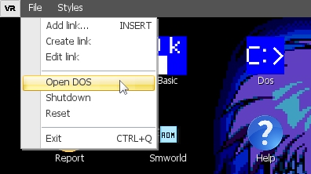

When the menu is created, the Hotkeys associated with the window are looked at
to determine if they match the options and if so, the key combination is
displayed next to each menu entry. You can see, in the example above, that the
menu item "Add link..." already had a Hotkey associated with the INSERT key, and
so it is shown next to it.

## Events

The user interface communicates with applications through events. Events are
triggered, for example, when a button is clicked, a control is dragged to
another control, an item is added to a list, etc. The interface allows
applications to be alerted by calling a function with the following prototype:

~~~~~~~~~~~~~~~~~~~~~~~~~~~~~~~~~~~~~~~~~~~~~~~~~~~~~~~~~~~~~~~~~~~~~~~~~~~~~~~~
function OnEvent (sender, event, params)
{
}
~~~~~~~~~~~~~~~~~~~~~~~~~~~~~~~~~~~~~~~~~~~~~~~~~~~~~~~~~~~~~~~~~~~~~~~~~~~~~~~~

The parameters are:

| sender | The control that sends the event. A pointer.                        |
|--------|---------------------------------------------------------------------|
| event  | The event ID. An integer.                                           |
| params | A list with 0 or several parameters depending on the type of event. |

Events

| **Label**                       | **List of parameters**                                                                         |
|---------------------------------|------------------------------------------------------------------------------------------------|
| UI_EVENT_INIT                   | []                                                                                             |
| UI_EVENT_DESTROY                | []                                                                                             |
| UI_EVENT_ENTER                  | []                                                                                             |
| UI_EVENT_LEAVE                  | []                                                                                             |
| UI_EVENT_MOUSE_MOVE             | [btnId, mx, my].                                                                               |
| UI_EVENT_MOUSE_DOWN             | [btnId, mx, my].                                                                               |
| UI_EVENT_MOUSE_UP               | [btnId, mx, my].                                                                               |
| UI_EVENT_MOUSE_WHEEL            | [offset] [offset                                                                               |
| UI_EVENT_CLICK                  | [btnId, mx, my].                                                                               |
| UI_EVENT_DOUBLE_CLICK           | [btnId, mx, my].                                                                               |
| UI_EVENT_VALIDATING             | ValidateArgs]                                                                                  |
| UI_EVENT_VALIDATED              | []                                                                                             |
| UI_EVENT_FOCUS_LEAVE            | [controlLost, controlWin] [controlLost, controlWin                                             |
| UI_EVENT_FOCUS_ENTER            | [controlLost, controlWin] [controlLost, controlWin                                             |
| UI_EVENT_POSITION_CHANGED       | []                                                                                             |
| UI_EVENT_SIZE_CHANGED           | []                                                                                             |
| UI_EVENT_BOUNDS_CHANGED         | []                                                                                             |
| UI_EVENT_ENABLE_CHANGED         | []                                                                                             |
| UI_EVENT_DRAG_START             | []                                                                                             |
| UI_EVENT_DRAG_END               | [frame, cancel] [frame, cancel] [frame, cancel] [frame, cancel] [frame, cancel] [frame, cancel |
| UI_EVENT_DRAG_RECEIVED          | [frame, x, y] [frame, x, y] [frame, x, y] [frame, x, y                                         |
| UI_EVENT_KEYDOWN                | [key] [key                                                                                     |
| UI_EVENT_KEYUP                  | [key] [key                                                                                     |
| UI_EVENT_CHAR                   | [char] [char                                                                                   |
| UI_EVENT_CHECKED_CHANGED        | []                                                                                             |
| UI_EVENT_PRESSED_CHANGED        | []                                                                                             |
| UI_EVENT_SHOW                   | []                                                                                             |
| UI_EVENT_HIDE                   | []                                                                                             |
| UI_EVENT_VALUE_CHANGED          | []                                                                                             |
| UI_EVENT_MINVALUE_CHANGED       | []                                                                                             |
| UI_EVENT_MAX_VALUE_CHANGED      | []                                                                                             |
| UI_EVENT_ANIMATION_PLAY         | []                                                                                             |
| UI_EVENT_ANIMATION_PAUSED       | [factor] [factor                                                                               |
| UI_EVENT_ANIMATION_STOP         | [userStop] [userStop                                                                           |
| UI_EVENT_ANIMATION_LOOP         | []                                                                                             |
| UI_EVENT_FONT_CHANGED           | [key, font] [key, font] [key, font] [key, font] [key, font] [key, font                         |
| UI_EVENT_FONT_ADDED             | [key, font] [key, font] [key, font] [key, font] [key, font] [key, font                         |
| UI_EVENT_TEXT_CHANGED           | []                                                                                             |
| UI_EVENT_TEXTDOC_CURSOR_CHANGED | [x, y, sy]                                                                                     |
| UI_EVENT_TEXTDOC_TEXT_DELETED   | []                                                                                             |
| UI_EVENT_TEXTDOC_TEXT_ADDED     | []                                                                                             |
| UI_EVENT_SCROLL_HORIZONTAL      | []                                                                                             |
| UI_EVENT_SCROLL_VERTICAL        | []                                                                                             |
| UI_EVENT_RADIO_CHECKED_CHANGED  | [lostChecked, gainChecked].                                                                    |
| UI_EVENT_MOTION_CONTROLLER_AXIS | [axisId, value, id]                                                                            |

## Controls

Controls can be created in any window. Controls are the visual objects that make
up the window (frames, buttons, lists, etc.). In general, they are defined areas
with position and size, which have a specific behaviour and representation. Both
the origin and the size of a control are measured in pixels.

Controls have a hierarchy. Some controls can be children of others. In this
inheritance there are properties that can be affected, such as position, size,
visibility or colour.

All controls have a number of common methods:

function **SetName** (name)

Assigns a name \<name\> to the control, which allows to identify it. This is not
mandatory, but is needed if you want to use the *GetControlByName* function.

function **GetName** () : string

Returns the name associated with the control.

function **Show** ()

Makes the control visible.

function **Hide** ()

It makes control invisible.

function **EnableClipping** (v)

Enables clipping of children within the parent's visible area. In case \<v\> is
true, no children will be displayed outside the parent's visible area.

function **GetVisible** () : bool

Indicates whether the control is visible. It takes into account parental
inheritance. That is, a control is invisible if it is invisible itself or if one
of its parents is invisible.

function **GetVisibleInternal** () : bool

Gets the visibility associated with the control. It does not take into account
the visibility inheritance of its parents.

function **IsHidden** () : bool

Indicates whether the control is visible. This function not only takes into
account the visible property of the control, but also detects if it is
off-screen or hidden behind another control.

function **IsDragging** () : bool

Indicates whether the control is in a pending drag & drop order.

function **ClampToScreen** ()

Ensure that the position and size of the control does not exceed the dimensions
of the desk. If so, adjust them.

function **SetClampedToScreen** (enable)

Forces the position and size of the control to never exceed the dimensions of
the desktop. When \<enable\> is true, whenever the control changes position or
size, this condition will be checked and automatically adjusted.

function **GetLeft** () : int

It will return the horizontal origin position (x).

function **GetTop** () : int

It shall return the vertical home position (y).

function **GetWidth** () : int

Returns the width of the control, i.e. its horizontal size.

function **GetHeight** () : int

Returns the height of the control, i.e. its vertical size.

function **GetRight** () : int

Returns the position of the right end of the control.

Equivalent to: GetLeft() + GetWidth() -1.

function **GetBottom** () : int

Returns the position of the lower end of the control.

Equivalent: GetTop() + GetHeight() - 1.

function **GetBounds** () : list

Returns a list with the elements: [GetLeft(), GetTop(), GetWidth(),
GetHeight()].

function **GetPosition** () : list

Returns a list with the elements: [GetLeft(), GetRight()].

function **GetSize** () : list

Returns a list of the elements: [GetWidth(), GetHeight()].

function **GetCenter** () : list

Returns a list with the elements: [GetLeft() + GetWidth()/2, GetTop() +
GetHeight()/2].

function **GetHCenter** () : float

Returns the value GetLeft() + GetWidth() / 2.

function **GetVCenter** () : float

Returns the value GetTop() + GetHeight() / 2.

function **SetLeft** (left)

Assigns the horizontal home position value \<left\>.

function **IncLeft** (value, cutWidth = false)

Increases the value of the horizontal origin position in \<value\>. Setting
\<cutWidth\> to true will also reduce the horizontal size of the control by
\<value\>.

function **SetTop** (top)

Assigns the vertical home position value \<top\>.

function **IncTop** (value, cutHeight = false)

Increases the value of the vertical origin position in \<value\>. Setting
\<cutHeight\> to true will also reduce the vertical size of the control by
\<value\>.

function **IncPosition** (offx, offy, cutSize = false)

It is equivalent to doing an *IncLeft* and an *IncTop* in the same call.

function **IncSize** (offx, offy, cutPosition = false)

Increments the size of the control by (offx, offy). If we set \<cutPosition\> to
true, we will reduce that increment in the source position as well. This allows
for both top/left and bottom/right enlargement.

function **IncWidth** (value, cutLeft = false)

Increases the width of the control. In case \<cutLeft\> is true, we will reduce
that increment by the horizontal origin position.

function **IncHeight** (value, cutTop = false)

Increases the height of the control. In case \<cutTop\> is true, we will reduce
that increment in the vertical origin position.

function **IncBounds** (offx, offy, offw, offh)

Increases the source position by (offx, offy) and at the same time increases the
size of the control by (offw, offh).

function **SetWidth** (width)

Sets the horizontal size (width) of the control.

function **SetHeight** (height)

Assigns the vertical size (height) of the control.

function **SetPosition** (left, top)

Assigns the origin of the control to its new position (left, top).

function **SetSize** (width, height)

Determines the size of a control and sets it to (width, height).

function **CenterToParent** ()

Centres the position of a control to its parent. If it has no parent, it will do
so with respect to the desk.

function **SetMinimumSize** (w, h)

Sets the minimum size that the control can reach.

function **SetMaximumSize** (w, h)

Sets the maximum size the control can reach.

function **GetMinimumSize** () : list

Gets the minimum size in a list [wMin, hMin].

function **GetMinimumWidth** () : int

Gets the minimum horizontal size.

function **GetMinimumHeight** () : int

Gets the minimum vertical size.

function **GetMaximumWidth** () : int

Gets the maximum horizontal size.

function **GetMaximumHeight** () : int

Gets the maximum vertical size.

function **SetBounds** (left, top, width, height)

Sets both control origin (left, top) and control size (width, height).

function **PointToClient** (x, y)

Given a point in absolute coordinates (i.e., relative to the desk), determine
its position relative to the control.

function **PointToScreen** (x, y)

Given a point in local coordinates (relative to the control), determines its
absolute position.

function **GetFBounds** () : list

Returns the absolute characteristics (X and Y coordinates, width and height) of
a control on the desktop: [x, y, w, h]. These values determine exactly the
position and size of the control after all required dependencies and
transformations have been applied.

function **CursorInRect** (x, y, w, h) : bool

Indicates whether the desktop cursor is in the rectangle defined by (x, y) and
size (w, h). The coordinates (x, y) are local to the control, where (0, 0) is
the origin of the control.

function **GetCursorPoint** () : list

Gets the position of the desktop cursor taking into account the scaling
transformations applied to the control.

function **AlignToParent** (flags, offset = 0)

Allows a control to be aligned with respect to its parent using \<flags\>:

| UI_HCENTER | Centres it horizontally and subtracts \<offset\>.   |
|------------|-----------------------------------------------------|
| UI_VCENTER | Centres it vertically and subtracts \<offset\>.     |
| UI_LEFT    | Adds \<offset\> to the horizontal position.         |
| UI_RIGHT   | Places it to the right and separates it \<offset\>. |
| UI_BOTTOM  | Places it below and separates it \<offset\>.        |
| UI_TOP     | Adds \<offset\> to the vertical position.           |

function **SetPin** (flags)

Allows you to set the anchor flags. These flags allow you to set how a control
is affected with respect to the change of position and size of its parent. The
flags can be one or more of the following:

| UI_PIN_LEFT   | Anchor left.                       |
|---------------|------------------------------------|
| UI_PIN_RIGHT  | Anchor to the right.               |
| UI_PIN_TOP    | Anchor at the top.                 |
| UI_PIN_BOTTOM | Anchor below.                      |
| UI_PIN_ALL    | A combination of all of the above. |

Example:

~~~~~~~~~~~~~~~~~~~~~~~~~~~~~~~~~~~~~~~~~~~~~~~~~~~~~~~~~~~~~~~~~~~~~~~~~~~~~~~~
_button.SetPin(UI_PIN_LEFT | UI_PIN_BOTTOM);
~~~~~~~~~~~~~~~~~~~~~~~~~~~~~~~~~~~~~~~~~~~~~~~~~~~~~~~~~~~~~~~~~~~~~~~~~~~~~~~~

function **AddPin** (flags)

Adds an anchor flag to the existing ones.

function **RemovePin** (flags)

Removes one anchor flag from the existing ones.

function **HasPin** (flags) : bool

Asks for an anchor flag. If active, it will return true.

function **PinToBounds** ()

Adjusts the position and size of the control to that of the parent. At the same
time, it applies a UI_PIN_ALL, so that it will grow or shrink in proportion to
the parent.

function **ClearPin** ()

Removes all assigned pinning flags. Equivalent to a *SetPin*(0).

function **SetAlpha** (value)

Determines the level of transparency/opacity of the control. If \<value\> is 0,
the control is fully transparent. If \<value\> is 255, the control will be fully
opaque. By default all controls are created with 255 (fully opaque).

function **GetAlpha** () : float

It obtains the transparency associated with control.

function **GetEffectiveAlpha** () : float

Gets the effective transparency, taking into account the hierarchy of control.
If a parent has an alpha of 127, and the child has an alpha of 255, the
effective alpha will be 127 ((255\*127)/255).

function **EnableExternalMove** (context, func)

Enables the external update of the control. This allows to associate an external
context and functions to manage or control the control logic.

function **EnableExternalDraw** (context, func, flags = 1)

Enables external updating of the graphical representation of the control. This
allows us to associate an external context and functions where we can apply
changes to the visualisation of the control. By using \<flags\> we control when
we want the function to be invoked:

| 1 | Before the graphs associated with the control are drawn. |
|---|----------------------------------------------------------|
|   | Before the children of control are drawn.                |
|   | After drawing the children of the control.               |

function **SetScale** (value)

Assigns a scale that directly affects the size and position of the object (if
*EnableScalePosition is* enabled). The scale value \<value\> is a number with
decimal places. If \<value\> is 1, the control will be drawn with the dimensions
set. If \<value\> is 0.5, the control will be drawn at half its size. If
\<value\> is 2, the control will be drawn at twice its size.

function **GetScale** () : float

Gets the scale associated with the control.

function **GetEffectiveScale** () : float

Gets the effective scale after applying the scale in hierarchy.

function **EnableScalePosition** ()

Makes the scale also affect the position of the control.

function **DisableScalePosition** ()

Makes the scale only affect the dimensions of the control (width and height).

function **GetScalePosition** () : list

Returns a list of two components with the position of the control, taking into
account the applied scale.

function **SetScalePivot** (x, y)

Sets the relative position of the pivot for scaling. By default this position is
the origin of the object (top, left). In this case, it would be like doing
*SetScalePivot* (0, 0).

function **SetScalePivotX** (x)

Assigns the relative position of the pivot for scaling in the horizontal
component only.

function **SetScalePivotY** (y)

Assigns the relative position of the pivot for scaling in the vertical component
only.

function **GetScalePivot** () : list

Gets a list of two components with the scaling pivot. Default [0, 0].

function **GetScalePivotX** () : float

Returns the horizontal component of the scaling pivot. Default is 0.

function **GetScalePivotY** () : float

Returns the vertical component of the scaling pivot. Default is 0.

function **SetUserData** (data)

Associates user data to the control. \<data\> can be any type of data accepted
in the script.

function **GetUserData** () : value

Gets the user data associated with the control.

function **SetMask** (texture)

Assigns a mask texture to the control. The mask texture is a black and white
texture that defines which area of the control is visible or not. The black area
of the mask texture masks the control and makes that part of the control graphic
not visible.

function **EnableMask** (value, broadcastChildren = false)

Allows to activate the use of the mask texture in the control. Allows also to
apply in hierarchy, from parent to children, the use of the mask by setting
\<broadcastChildren\> to true.

function **AreAllTexturesLoaded** (askToChildren = true) : bool

Texture loading can be done in the background. This function allows to query the
loading status and to know if the process is complete or not. It also allows
querying the hierarchy from parent to children by setting \<askToChildren\> to
true.

function **SetParent** (parent)

Sets the parent of the control. If the control was already a child of another
control, applying this function will change it from being a child of that
control to being a child of \<parent\>.

function **SetOwner** (owner)

Determines proprietary control.

function **GetOwner** () : pointer

Gains proprietary control.

function **GetChildren** () : list

Returns a list of all child controls. Each item in the list is a pointer to each
child control.

function **GetControlByName** (name) : pointer

Returns a child object with name \<name\>. In case no control with that name
exists, it will return NULL.

function **GetChildrenCount** ()

Determines the number of existing child controls.

function **GetParent** () : pointer

Returns the parent of the control. In case it has none, it will return NULL.

## Frame

This control in turn allows other controls to be created within it. A frame
defines a work area.

Available methods:

function **GetDesktop** () : pointer

Gets access to the desktop driver.

function **GetView** () : pointer

Gets access to the UI controller.

function **GetEngine** ()

Gets access to the main controller.

function **ClearFonts** ()

Removes all existing fonts.

function **DestroyFont** (font)

Deletes a previously created font. The parameter is a pointer to a font handler.

function **Activate** ()

Activate the frame.

function **SetMouseCursor** (cursor)

Allows you to set a graphic type for the cursor. These types are available
through the Desktop driver and are as follows:

| CURSOR_NORMAL            |
|--------------------------|
| CURSOR_MOVE              |
| CURSOR_SELECTION         |
| CURSOR_HAND              |
| CURSOR_PROHIBITED        |
| CURSOR_RESIZE_HORIZONTAL |
| CURSOR_RESIZE_VERTICAL   |
| CURSOR_RESIZE_DIAG_LR    |
| CURSOR_RESIZE_DIAG_RL    |
| CURSOR_WAITING           |
| CURSOR_DRAGGING_MOVE     |

function **SetBgColor** (colour)

Determines a background colour for the area occupied by the frame. The
\<colour\> parameter is an integer with packed ARGB components A8R8G8B8 (see RGB
and *ARGB*).

function **CreateFont** (name, size) : font

Creates a font driver from a font name \<name\> and a size \<size\>. The font
file must be accessible by the system, otherwise NULL will be returned.

function **CreateDefaultFont** (size) : font

Create a default font, using the default font in the set UI theme and size
\<size\>.

function **GetClientControl** () : pointer

Returns the frame representing the client area where the user can add new
controls.

function **CreateControl** (class, name = null, params = []) : pointer

Creates a control from the class name \<class\>. You can name the control with a
text string in \<name\>. You can also pass parameters to the constructor of the
control in \<params\> if necessary. This function, in addition to allowing us to
create existing controls in the UI, allows us to create ad hoc controls, either
inherited or from scratch.

function **CreateControl** (class, x, y, w, h, name = null, params = []) :
pointer

Creates a control (see *CreateControl*) and also applies a position and size to
it.

function **CreateRect** (x, y, w, h, colour) : pointer

Creates a control of type Rect. This control is a coloured rectangle with
position relative to the client area (x, y) and size (w, h).

Example:

~~~~~~~~~~~~~~~~~~~~~~~~~~~~~~~~~~~~~~~~~~~~~~~~~~~~~~~~~~~~~~~~~~~~~~~~~~~~~~~~
_rect = GetTopWindow().CreateRect(10, 10, 10, 100, 100, RGB(255,0,0));
~~~~~~~~~~~~~~~~~~~~~~~~~~~~~~~~~~~~~~~~~~~~~~~~~~~~~~~~~~~~~~~~~~~~~~~~~~~~~~~~

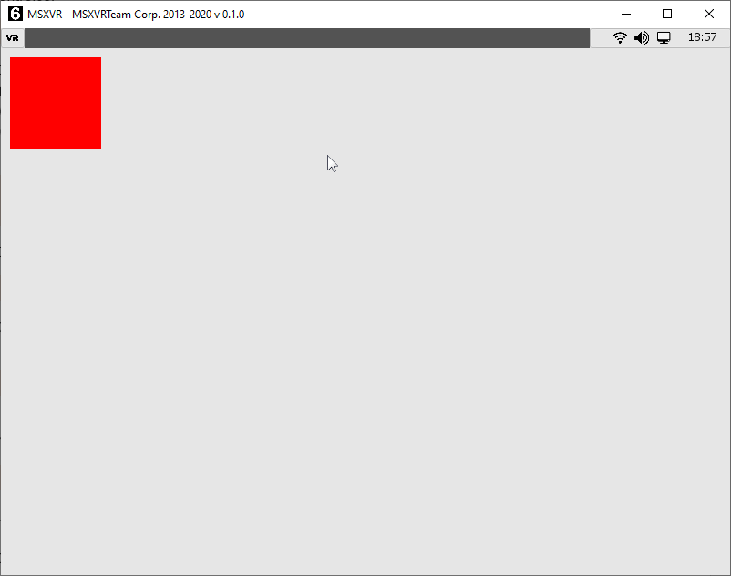

function **CreateLabel** (x, y, w, h = -1, text = "", fontH = -1) : pointer

Creates a text label at position (x, y) and size (w, h). In case \<h\> is -1, it
will use the size determined by the default font. Similarly \<fontH\> equal to
-1 indicates to use the default size for the font.

Example:

~~~~~~~~~~~~~~~~~~~~~~~~~~~~~~~~~~~~~~~~~~~~~~~~~~~~~~~~~~~~~~~~~~~~~~~~~~~~~~~~
_label = GetTopWindow().CreateLabel(10, 10, 100, -1, "Label");
~~~~~~~~~~~~~~~~~~~~~~~~~~~~~~~~~~~~~~~~~~~~~~~~~~~~~~~~~~~~~~~~~~~~~~~~~~~~~~~~

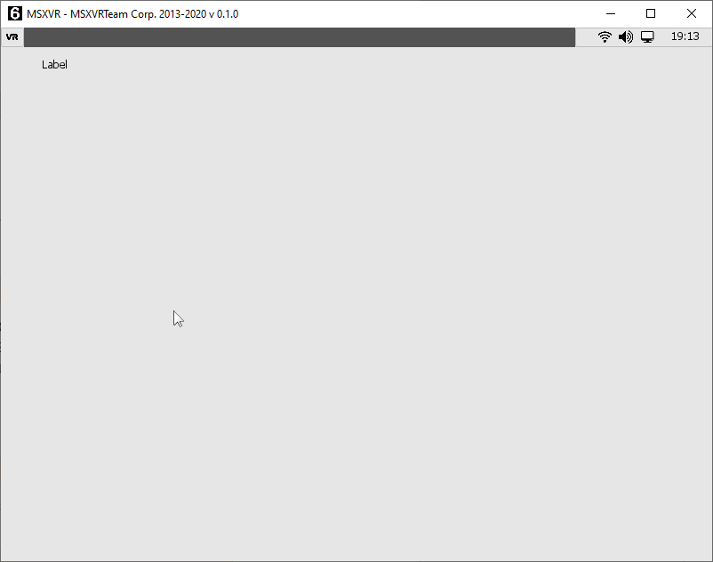

function **CreateImage** (x, y, w, h, texName = "") : pointer

Creates an image from the native path to the file passed as a parameter in
\<texName\>. The texture/image shall be placed at (x, y) relative to the client
area and sized (w, h).

Example:

~~~~~~~~~~~~~~~~~~~~~~~~~~~~~~~~~~~~~~~~~~~~~~~~~~~~~~~~~~~~~~~~~~~~~~~~~~~~~~~~
_img = GetTopWindow().CreateImage(10, 10, 200, 200, 200, GetEngine().GetPath("logo.png"));
~~~~~~~~~~~~~~~~~~~~~~~~~~~~~~~~~~~~~~~~~~~~~~~~~~~~~~~~~~~~~~~~~~~~~~~~~~~~~~~~

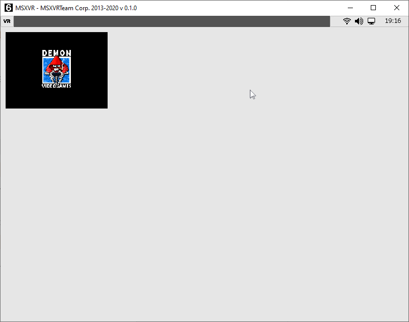

function **CreateColorPicker** (x, y, w, h = -1)

Creates an ARGB colour selection control at position (x, y) relative to the
client area with size (w, h). If \<h\> is -1, the most appropriate size will be
used by default. This control is composed of a Rect indicating the selected
colour and a button to open a colour selector.

Example:

~~~~~~~~~~~~~~~~~~~~~~~~~~~~~~~~~~~~~~~~~~~~~~~~~~~~~~~~~~~~~~~~~~~~~~~~~~~~~~~~
_img = GetTopWindow().CreateColorPicker(10, 10, 100, -1);
~~~~~~~~~~~~~~~~~~~~~~~~~~~~~~~~~~~~~~~~~~~~~~~~~~~~~~~~~~~~~~~~~~~~~~~~~~~~~~~~

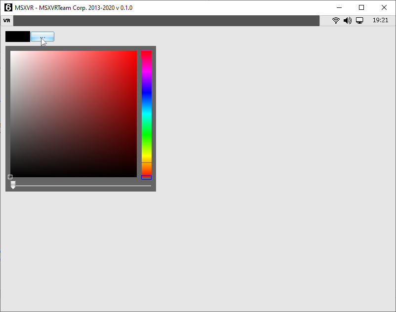

function **CreateTextBox** (x, y, w, h = -1, fontH = 0) : pointer

Creates a text box control at position (x, y) relative to the client area and
with size (w, h). In the case of \<h\> equal to -1, we choose the default height
for this type of control. If no font size is specified in \<fontH\>, the default
font size will be used.

Example:

~~~~~~~~~~~~~~~~~~~~~~~~~~~~~~~~~~~~~~~~~~~~~~~~~~~~~~~~~~~~~~~~~~~~~~~~~~~~~~~~
_tb = GetTopWindow().CreateTextBox(10, 10, 100);
_tb.SetText("Text");
~~~~~~~~~~~~~~~~~~~~~~~~~~~~~~~~~~~~~~~~~~~~~~~~~~~~~~~~~~~~~~~~~~~~~~~~~~~~~~~~

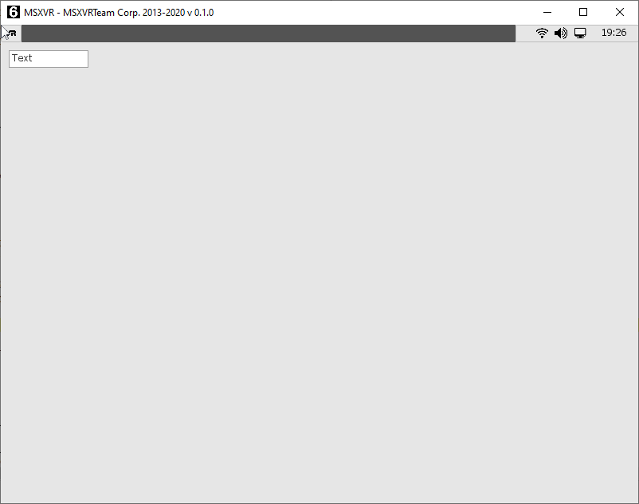

function **CreateListBox** (x, y, w, h) : pointer

Creates a text list control at position (x, y) relative to the client area and
with size (w, h).

Example:

~~~~~~~~~~~~~~~~~~~~~~~~~~~~~~~~~~~~~~~~~~~~~~~~~~~~~~~~~~~~~~~~~~~~~~~~~~~~~~~~
_lb = GetTopWindow().CreateListBox(10, 10, 100, 200);
_lb.AddItem("Item1");
_lb.AddItem("Item2");
~~~~~~~~~~~~~~~~~~~~~~~~~~~~~~~~~~~~~~~~~~~~~~~~~~~~~~~~~~~~~~~~~~~~~~~~~~~~~~~~

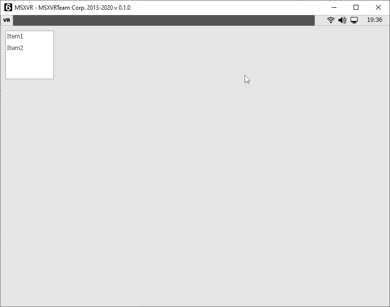

function **CreateComboBox** (x, y, w, h = -1) : pointer

Creates a selectable box control at position (x, y) relative to the client area
and with size (w, h).

Example:

~~~~~~~~~~~~~~~~~~~~~~~~~~~~~~~~~~~~~~~~~~~~~~~~~~~~~~~~~~~~~~~~~~~~~~~~~~~~~~~~
_lb = GetTopWindow().CreateComboBox(10, 10, 100);
_lb.AddItem("Item1");
_lb.AddItem("Item2");
~~~~~~~~~~~~~~~~~~~~~~~~~~~~~~~~~~~~~~~~~~~~~~~~~~~~~~~~~~~~~~~~~~~~~~~~~~~~~~~~

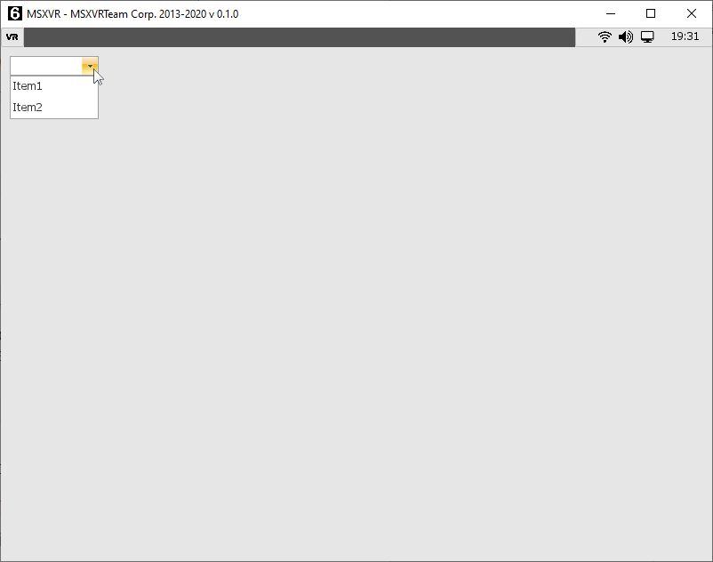

function **CreateTrackbar** (x, y, size, layout = UI_HORIZONTAL) : pointer

Creates a tracking bar control at position (x, y) relative to the client area.
The width or height of the control depends on \<size\> and the \<layout\>
parameter, which can be either UI_HORIZONTAL or UI_VERTICAL.

Example:

~~~~~~~~~~~~~~~~~~~~~~~~~~~~~~~~~~~~~~~~~~~~~~~~~~~~~~~~~~~~~~~~~~~~~~~~~~~~~~~~
_tb = GetTopWindow().CreateTrackbar(10, 10, 100, UI_HORIZONTAL);
~~~~~~~~~~~~~~~~~~~~~~~~~~~~~~~~~~~~~~~~~~~~~~~~~~~~~~~~~~~~~~~~~~~~~~~~~~~~~~~~

function **CreateScrollBar** (x, y, size, layout = UI_VERTICAL) : pointer

Creates a scrollbar control at position (x, y) relative to the client area. The
width or height of the control depends on \<size\> and the \<layout\> parameter,
which can be either UI_HORIZONTAL or UI_VERTICAL.

Example:

~~~~~~~~~~~~~~~~~~~~~~~~~~~~~~~~~~~~~~~~~~~~~~~~~~~~~~~~~~~~~~~~~~~~~~~~~~~~~~~~
_ctrl = GetTopWindow().CreateScrollbar(10, 10, 100, UI_HORIZONTAL);
~~~~~~~~~~~~~~~~~~~~~~~~~~~~~~~~~~~~~~~~~~~~~~~~~~~~~~~~~~~~~~~~~~~~~~~~~~~~~~~~

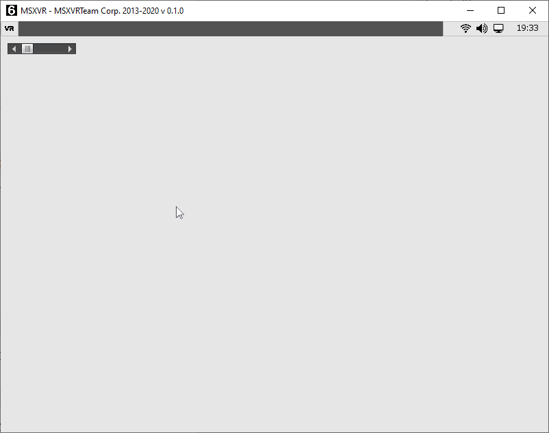

function **CreateFrame** (x, y, w, h) : pointer

Creates a frame control at position (x, y) relative to the client area and with
size (w, h). In a frame we can in turn create other frames and/or controls.

function **CreateScrollFrame** (x, y, w, h) : pointer

Creates a scroll frame control. This frame allows scrollable content to be
associated with it.

function **CreateButton** (x, y, w, h = -1, text = "") : pointer

Create a button control at position (x, y) relative to the client area and with
size (w, h). We can create the button with a text \<text\>. If \<h\> is -1 the
default size for this type of control will be used.

Example:

~~~~~~~~~~~~~~~~~~~~~~~~~~~~~~~~~~~~~~~~~~~~~~~~~~~~~~~~~~~~~~~~~~~~~~~~~~~~~~~~
_button = GetTopWindow().CreateButton(10, 10, 100, -1, "Button");
~~~~~~~~~~~~~~~~~~~~~~~~~~~~~~~~~~~~~~~~~~~~~~~~~~~~~~~~~~~~~~~~~~~~~~~~~~~~~~~~

function **CreateCheckBox** (x, y, w, h = -1, text = "") : pointer

Creates a selectable box at position (x, y) relative to the client area and with
size (w, h). We can create the box with a text \<text\>. If \<h\> is -1 the
default size for this type of control will be used.

Example:

~~~~~~~~~~~~~~~~~~~~~~~~~~~~~~~~~~~~~~~~~~~~~~~~~~~~~~~~~~~~~~~~~~~~~~~~~~~~~~~~
_cb = GetTopWindow().CreateCheckBox(10, 10, 100, -1, "CheckBox");
~~~~~~~~~~~~~~~~~~~~~~~~~~~~~~~~~~~~~~~~~~~~~~~~~~~~~~~~~~~~~~~~~~~~~~~~~~~~~~~~

function **CreateRadioButton** (x, y, w, h = -1, text = "") : pointer

Creates a single selectable box. If we have several such sibling boxes, only one
of them can be selected. We can create the checkbox with a text \<text\>. If
\<h\> is -1 the default size for this type of control will be used.

Example:

~~~~~~~~~~~~~~~~~~~~~~~~~~~~~~~~~~~~~~~~~~~~~~~~~~~~~~~~~~~~~~~~~~~~~~~~~~~~~~~~
_rb = GetTopWindow().CreateRadioButton(10, 10, 100, -1, "Radio Button");
~~~~~~~~~~~~~~~~~~~~~~~~~~~~~~~~~~~~~~~~~~~~~~~~~~~~~~~~~~~~~~~~~~~~~~~~~~~~~~~~

function **CreateImageButton** (x, y, w, h, imageNormal = "", imagePressed = "",
imageOver = "", cbCtx = null, callback = "") : pointer

Create an aspect button from images. We will set the position (x, y) and size
(w, h) to use, together with the native paths to the different images that will
represent the aspects or states of the button. In case of not using path (empty
string), the change of aspect will be ignored when there is a change of state.
The states are:

| NORMAL  | When the button is neither selected nor operated.      |
|---------|--------------------------------------------------------|
| PRESSED | When the button is always pressed with a cursor click. |
| OVER    | When the cursor is over the control.                   |

The SetOnClick of the button can be set directly if we pass as parameter the
context \<cbCtx\> and the function to invoke \<callback\>.

Example:

~~~~~~~~~~~~~~~~~~~~~~~~~~~~~~~~~~~~~~~~~~~~~~~~~~~~~~~~~~~~~~~~~~~~~~~~~~~~~~~~
_ib = GetTopWindow().CreateImageButton(10, 10, 10, 32, 32, GetEngine().GetPath("icon_os.png"));
~~~~~~~~~~~~~~~~~~~~~~~~~~~~~~~~~~~~~~~~~~~~~~~~~~~~~~~~~~~~~~~~~~~~~~~~~~~~~~~~

function **CreateRichTextEditor** (x, y, w, h) : pointer

Creates an advanced text editing box at position (x, y) and size (w, h) within
the client area. This type of control allows editing text with various fonts,
images, colours and styles. It is intended to include a more advanced text
editing control.

function **CreateSplitter** (x, y, w, h, direction = UI_VERTICAL) : pointer

Creates a particular type of frame, making it possible to host other controls
within it. This control allows the creation of dividing zones that can be moved
and resized dynamically.

Example:

~~~~~~~~~~~~~~~~~~~~~~~~~~~~~~~~~~~~~~~~~~~~~~~~~~~~~~~~~~~~~~~~~~~~~~~~~~~~~~~~
_splitter = GetTopWindow().CreateSplitter(10, 10, 100, 100, 100, UI_VERTICAL);
~~~~~~~~~~~~~~~~~~~~~~~~~~~~~~~~~~~~~~~~~~~~~~~~~~~~~~~~~~~~~~~~~~~~~~~~~~~~~~~~

function **CreateProgressBar** (x, y, size, direction = UI_HORIZONTAL,
overrideThemeSize = -1) : pointer

Creates a progress bar at position (x, y) and with size \<size\> depending on
the direction \<direction\> to use: UI_HORIZONTAL or UI_VERTICAL. If
\<overrideThemeSize\> is -1, the default size for that control in the active UI
theme will be used. If it is a value \>= 0, the specified size will be used.

Example:

~~~~~~~~~~~~~~~~~~~~~~~~~~~~~~~~~~~~~~~~~~~~~~~~~~~~~~~~~~~~~~~~~~~~~~~~~~~~~~~~
_pb = GetTopWindow().CreateProgressbar(10, 10, 100, UI_HORIZONTAL);
~~~~~~~~~~~~~~~~~~~~~~~~~~~~~~~~~~~~~~~~~~~~~~~~~~~~~~~~~~~~~~~~~~~~~~~~~~~~~~~~

~~~~~~~~~~~~~~~~~~~~~~~~~~~~~~~~~~~~~~~~~~~~~~~~~~~~~~~~~~~~~~~~~~~~~~~~~~~~~~~~
_pb.SetMinValue(0);
_pb.SetMaxValue(100);
_pb.SetValue(50);
~~~~~~~~~~~~~~~~~~~~~~~~~~~~~~~~~~~~~~~~~~~~~~~~~~~~~~~~~~~~~~~~~~~~~~~~~~~~~~~~

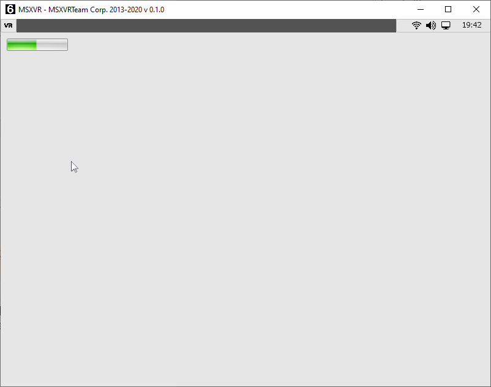

function **CreateSpin** (x, y, w, h = -1, fontH = -1) : pointer

Creates a Spin object at position (x, y) and size (w, h). If \<h\> is -1 the
default size for this type of controls with active UI theme will be used.

Example:

~~~~~~~~~~~~~~~~~~~~~~~~~~~~~~~~~~~~~~~~~~~~~~~~~~~~~~~~~~~~~~~~~~~~~~~~~~~~~~~~
_spin = GetTopWindow().CreateSpin(10, 10, 100);
~~~~~~~~~~~~~~~~~~~~~~~~~~~~~~~~~~~~~~~~~~~~~~~~~~~~~~~~~~~~~~~~~~~~~~~~~~~~~~~~

function **CreateGroupBox** (x, y, w, h, text = "", textAlign = UI_LEFT) :
pointer

Creates a group to contain other types of controls. The groups visually
represent different areas with a border and a text \<text\> as the group title.

Example:

~~~~~~~~~~~~~~~~~~~~~~~~~~~~~~~~~~~~~~~~~~~~~~~~~~~~~~~~~~~~~~~~~~~~~~~~~~~~~~~~
_gb = GetTopWindow().CreateGroupBox(10, 10, 100, 100, 100, "GroupBox");
~~~~~~~~~~~~~~~~~~~~~~~~~~~~~~~~~~~~~~~~~~~~~~~~~~~~~~~~~~~~~~~~~~~~~~~~~~~~~~~~

## ScrollFrame

It is a type of frame designed to be able to move the controls it contains. It
is a specialisation (inheritance) of the Frame control.

Frame methods are available, and in addition:

function **SetScrollChild** (frame)

Allows you to associate the frame that will act as a container for the controls
and, at the same time, you can manage its displacement.

function **GetScrollChild** () : pointer

Gets the container frame.

function **GetHorizontalScroll** () : float

Gets the current horizontal offset based on the range.

function **GetHorizontalScrollRange** () : float

Gets the possible offset based on the width of the container frame.

function **GetVerticalScroll** () : float

Gets the current vertical offset based on the range.

function **GetVerticalScrollRange** () : float

Gets the possible offset based on the height of the container frame.

function **SetHorizontalScroll** (scroll)

Sets the horizontal scroll. \<scroll\> is a range-based value.

function **SetVerticalScroll** (scroll)

Sets the vertical scroll. \<scroll\> is a range-based value.

function **GetHorizontalScrollPctg** () : float

Gets the normalised horizontal displacement (values between 0 and 1).

function **SetHorizontalScrollPctg** (scroll)

Sets the horizontal scroll. \<scroll\> is a value between 0 and 1.

function **GetVerticalScrollPctg** () : float

Gets the normalised vertical displacement (values between 0 and 1).

function **SetVerticalScrollPctg** (scroll)

Sets the normalised vertical scroll position. \<scroll\> shall be a value
between 0 and 1.

## Button

function **SetOnClick** (ctx, function)

Sets the context \<ctx\> and function name \<function\> to be called when a
button is clicked. The click is a press and subsequent release of the cursor on
the button.

function **SetOnPress** (ctx, function, ms = 100)

Sets the context \<ctx\> and function name \<function\> to be called when a
continuous button press is detected. The event will be called every \<ms\>
milliseconds that you specify.

function **SetTextColor** (colour)

Sets the colour of the text displayed on the button.

function **SetTextAlign** (align)

Sets the alignment of the text on the button. The values of \<align\> may be:

| DT_LEFT    | Adjustment left                |
|------------|--------------------------------|
| DT_TOP     | Adjustment up                  |
| DT_RIGHT   | Adjustment right               |
| DT_BOTTOM  | Adjustment below               |
| DT_CENTER  | Horizontal centring adjustment |
| DT_VCENTER | Vertical centring adjustment   |

function **GetText** () : string

Gets the text displayed by a button.

function **SetFont** (name, size)

Sets the font used for the text displayed by the button. An available font name
\<name\> and size \<size\> will be indicated.

function **SetFontSize** (size)

Sets the size \<size\> we want to give to the actual font used to represent the
text displayed by the button.

function **SetIcon** (imagePath, w = -1, h = -1)

Sets the image that we want to represent as the icon of the button. The path to
the image file \<imagePath\> must be indicated and we can indicate the size of
the image inside the button (w, h). In case of using -1 for the width and/or
height, we will be indicating that the original size obtained from the image
file will be used.

function **SetIconColor** (colour)

Sets the tint colour of the icon represented on the button. If the \<colour\> is
white, i.e. RGB(255,255,255), the icon will be rendered in its original colour.

function **SetDefaultFont** ()

Sets the default font used by the current UI theme in the text represented by
the button.

function **SetColouredButton** (normalColor, highlightColor = 0, pressedColor =
0, disabledColor = 0, chechedColor = 0)

Allows to indicate plain colours instead of textures for the different states of
the button. If the colour of the states is zero (completely transparent), you
are indicating that no colour change is applied for that state.

function **SetNormalColor** (colour)

Sets a flat colour for the "normal" state of a button.

function **SetHighlightColor** (colour)

Sets a flat colour for the highlight state of a button.

function **SetPressedColor** (colour)

Sets a flat colour for the pressed state of a button.

function **SetDisabledColor** (colour)

Sets a flat colour for the "disabled" state of a button.

function **SetCheckedColor** (colour)

Sets a flat colour for the checked state of a button.

function **SetTintColor** (colour)

Applies an ink colour for the different graphic states associated with a button.
In case \<colour\> is white, i.e. RGB(255,255,255), the default colour of the
different states will be used. If the colour, for example, were red, i.e.
RGB(255,0,0), the graphics of the button states would be tinted red.

function **SetTextPadding** (x, y)

Sets a top and bottom margin for the text displayed on the button.

function **SetPressedTextOffset** (x, y)

In case you click on a button, it sets how much scrolling the displayed text
will undergo. This allows you to create a stronger visual effect.

function **GetPressedTextOffset** () : list

Gets the offset [x, y] associated with the offset of the text in the "pressed"
state.

## CheckBox

It is a type of button that can accommodate two states, on and off.

In addition to the one-button methods, these other methods are available:

function **SetOnChange** (ctx, function)

When the status of a checkbox changes, this function is invoked.

function **SetChecked** (v)

Sets the status of a checkbox. The \<v\> parameter is a boolean.

function **GetChecked** () : bool

Gets the current status of a checkbox.

## ColorPicker

function **SetColor** (c)

Sets the selected colour \<c\> as ARGB within the control.

function **GetColor** () : int

Gets the currently selected colour within the control.

function **SetOnColorChanged** (ctx, function)

When the selected colour within the control changes, this function is invoked.

## ComboBox

This is a combined list control. It has a text box, a list display button and a
list.

function **GetSelectedIndex** () : int

Returns the index of the selected list item, starting from zero. If none is
selected, -1 is returned.

function **SelectIndex** (index)

Marks as selected the item with position \<index\> in the list. In case the
index used is out of range, the operation will be ignored.

function **SelectItemByUserData** (userData)

Select the element that has the associated user data value equal to the one
provided as parameter \<userData\>.

function **SelectItemByText** (text)

Select the element that has the same text as the \<text\> parameter.

function **SetText** (text)

Sets the text that appears in the control's text box.

function **AddItem** (text, userData = null)

Add an element to the list. In the list we will see the text \<text\> and we
will be able to associate user data \<userData\> to that element.

function **SetItemText** (ix, text)

Sets the text \<text\> associated with an element with index \<ix\> within the
list.

function **SetItemUserData** (ix, userData)

Sets the user data \<userData\> associated to the element with index \<ix\>
within the list.

function **GetItemUserData** (ix = -1) : pointer

Gets the user data associated with the element with index \<ix\> within the
list.

function **ClearItems** ()

Deletes all items from the list.

function **RemoveItem** (ix)

Deletes the element with index \<ix\> within the list.

function **FindItemByText** (text) : int

Gets the index of the element within the list, whose text matches the text given
as parameter \<text\>. If that element is not found, -1 is returned.

function **FindItemByUserData** (userData) : int

Gets the index of the element within the list, where the user data matches the
data provided as parameter \<userData\>. If that element is not found, -1 will
be returned.

function **GetSelectedText** () : string

Returns the text associated with the selected element. If no item is selected it
will return an empty string.

function **GetSelectedUserData** () : pointer

Returns the user data associated with the selected item. If no item is selected
it will return NULL.

function **RemoveSelectedItem** ()

Removes the selected item from the list.

function **GetNumItems** () : int

Returns the number of items in the list.

function **SetOnButtonClick** (ctx, function)

In the event that the drop-down list button is clicked, this function will be
invoked.

function **SetOnChange** (ctx, function)

In case the selection of the list changes, this function shall be invoked.

function **Apply** (ctx, function, userData = null)

The \<function\> function shall be executed in the \<ctx\> context with the
following prototype:

~~~~~~~~~~~~~~~~~~~~~~~~~~~~~~~~~~~~~~~~~~~~~~~~~~~~~~~~~~~~~~~~~~~~~~~~~~~~~~~~
function <event> (comboBox, itemIndex, userData);
~~~~~~~~~~~~~~~~~~~~~~~~~~~~~~~~~~~~~~~~~~~~~~~~~~~~~~~~~~~~~~~~~~~~~~~~~~~~~~~~

Therefore, for each item in the combined list, a function call will be made.

## Image

This type of control allows a texture (image) to be represented in a set
position, size and colour.

function **SetAutoReleaseTextures** (value)

This indicates whether we want the associated texture references to be removed
together with the control. By default this is always enabled.

function **GetAutoReleaseTextures** () : bool

Indicates whether or not automatic removal of associated texture references is
enabled.

function **SetTextureLoadWithCache** (value)

We indicate whether we want to load the textures as unique instances or as
references. By default they are loaded as references. When a texture is
attempted to be loaded a second time, if caching is enabled, it is not reloaded,
but a reference is used.

function **SetTexture** (path, ox = 0, oy = 0)

Set the texture we want to represent the control. The texture will be located in
the path indicated in \<path\>. We can give it an offset relative to the
position of the control using the coordinates (ox, oy).

function **SetTexturePtr** (ptr, ox = 0, oy = 0)

Set the texture we want the control to represent. The texture will be a
previously loaded or created \<ptr\> pointer. We can give it an offset relative
to the position of the control using the coordinates (ox, oy).

function **SetUrlTexture** (url)

Set the texture we want to represent the control. This texture will be a valid
url and will be loaded in the background. While the texture is downloading, the
image you have previously set will be displayed. Once downloaded, it will be
replaced.

function **SetIFLTexture** (path, textureFolder = "", createAnimationsForFrames
= true, speedForAnimation = 1)

Sets a sequence of textures (animation) obtained from the IFL file loaded from
the path \<path\>. We can set a source folder where the textures are stored
\<textureFolder\>; if nothing is specified, they will be obtained from the
accessible folders. We will indicate if instead of loading a texture in IFL we
want to load each frame of the IFL as an independent frame, this will be done
with \<createAnimationsForFrames\> set to true. Finally we will set the
animation speed \<speedForAnimation\>, which by default is 1.

function **SetTexture** (a, r, g, b)

Sets as image texture a flat colour formed by the ARGB(a, r, g, b) components.

function **SetTextureColor** (colour)

Sets as image texture, a flat colour formed by the ARGB passed as parameter
\<colour\>.

function **GetTextureColor** () : int

Returns the ARGB colour associated with the texture.

function **GetTexture** (frame = 0) : pointer

Returns the texture associated with the frame with index \<frame\>.

function **ClearFrames** ()

Delete all frames.

function **SetFrameTexture** (frame, texture)

Sets a texture at frame index \<frame\>.

function **GetFramesCount** () : int

Returns the number of frames associated with the image control.

function **SetFrame** (index)

Assigns the frame with index \<index\> as the visible frame. If an animation
exists, it will not be played and only the visible frame will be displayed.

function **SetAnimationForFrames** (speed = 0)

Sets the animation speed for the frames. If the speed is zero, the animation
will remain static and only the visible frame will be visible.

function **SetAnimation** (start, end, loop = -1)

Sets an animation consisting of the frames we have associated with the control.
The animation will go from the frame with index \<start\> to the frame with
index \<end\>. In case \<loop\> is -1, it will return to the initial frame
automatically every time \<end\> is reached. In case \<loop\> is -2, the last
frame \<end\> shall remain static. In case \<loop\> is another value, the last
frame \<end\> shall be returned to the frame index indicated by \<loop\> when
the last frame \<end\> is reached.

function **SetAnimationSpeed** (speed)

Sets the speed \<speed\> for the current animation.

function **SetRadians** (rad)

Gives an angle (rotation) to the image control. This angle is set in radians.

function **SetDegrees** (deg)

Gives an angle (rotation) to the Picture Control. This angle is set in degrees.

function **GetDegrees** () : float

Returns the number of degrees the image is rotated.

function **GetRadians** () : float

Returns the number of radians the image is rotated.

function **GetTexCoord** (frame) : list

Returns a list of texture coordinates associated with the \<frame\> frame index.
This list shall have the elements: [x, y, w, h].

function **SetTexCoord** (frame, x, y, w, h)

In the same way as *SetTextCoord*, but in this case we indicate on which frame
index \<frame\> we want to assign the coordinates.

function **SetTexCoordAll** (x, y, w, h)

Sets the texture coordinates for all frames. The coordinates are in normalised
format (values between 0 and 1). The coordinates indicate the area to be
represented within the associated texture. If these coordinates are (0, 0, 0, 1,
1) we are indicating the whole texture.

function **FlipHorizontal** (enable)

Applies or removes the horizontal flip effect on the image.

function **HasHorizontalFlip** () : bool

Indicates whether a horizontal flip effect is applied to the image.

function **FlipVertical** (enable)

Applies or removes the vertical flip effect on the image.

function **HasVerticalFlip** ()

Indicates whether a vertical flip effect is applied to the image.

## ListBox

A control to which a series of lines of text can be added and which represents a
list.

function **SetBgColor** (colour)

Assigns a background colour for the list background.

function **SetFont** (font)

Sets the font to use for the texts in the list. In this case the \<font\>
parameter is a pointer to a previously created or loaded font.

function **SetHideScrollbarIfDisabled** (value)

Indicates if we want to hide the scrollbar when the control is disabled. By
default it is disabled.

function **SetAutoScrollOnListChange** (value)

Indicates whether we want the list scrolling to be adjusted automatically each
time the selection changes. By default it is deactivated.

function **SetFixTopItemOnInsert** (value)

Used to keep the scroll in the current index when inserting. By default it is
disabled.

function **SetOwnerDrawRow** (ctx, function)

It allows to redirect by means of a call, how we want to represent each element
of our list. For each element to be represented, a function with the following
prototype is invoked:

~~~~~~~~~~~~~~~~~~~~~~~~~~~~~~~~~~~~~~~~~~~~~~~~~~~~~~~~~~~~~~~~~~~~~~~~~~~~~~~~
function <event> (list, row, text, selected, ishover, x, y, w, h);
~~~~~~~~~~~~~~~~~~~~~~~~~~~~~~~~~~~~~~~~~~~~~~~~~~~~~~~~~~~~~~~~~~~~~~~~~~~~~~~~

function **EnableHover** (value)

Used to enable or disable mouse events when the cursor is positioned over the
control. By default it is enabled.

function **GetRowHeight** () : int

Returns the vertical size required by each list item when rendering.

function **SetRowHeight** (value)

Sets the vertical size required for the representation of each item in the list.

function **SetTextAlign** (ta)

Sets the alignment to use for the text of each item in the list. The \<ta\>
parameter may be one or more of the following combinations: DT_LEFT, DT_TOP,
DT_RIGHT, DT_BOTTOM, DT_CENTER, DT_VCENTER.

Example:

~~~~~~~~~~~~~~~~~~~~~~~~~~~~~~~~~~~~~~~~~~~~~~~~~~~~~~~~~~~~~~~~~~~~~~~~~~~~~~~~
_lb.SetTextAlign(DT_CENTER | DT_VCENTER);
~~~~~~~~~~~~~~~~~~~~~~~~~~~~~~~~~~~~~~~~~~~~~~~~~~~~~~~~~~~~~~~~~~~~~~~~~~~~~~~~

That allows the text of the list items to be centred both vertically and
horizontally.

function **GetHoverIndex** () : int

Returns the index of the list item over which the mouse cursor is located.

function **GetListHeight** () : int

Gets the vertical size occupied by all items in the list.

function **SetMultiSelect** (value)

Set whether you want multiple selection, where multiple items in the list can be
selected at once, or single selection, where only one item at a time can be
selected. For simple selection, \<value\> must be false. The default is single
selection.

function **ClearItems** ()

Removes all items from the list.

function **SetStringList** (list)

Sets the list of elements we want to use. This list is composed by sublists
where each of them represents: [text, userData, colour, icon]. That is, each
sublist represents the text of each element, associated user data, colour for
the text and icon to be displayed. In case we don't want to represent any icon,
we can pass a sublist with 3 elements or indicate NULL.

function **GetListSize** () : int

Returns the number of items in the list.

function **ClearSelection** ()

Remove any selection of items in the list.

function **SelectIndex** (index, value = true, addToSelection = true)

Sets (\<value\> true) or removes (\<value\> false) the selection of the element
with index \<index\>. In case of multiple selection, with \<addToSelection\> we
will add or remove elements from the multiple selection.

function **SelectRange** (from, to, mode = 0)

Sets the selection from index \<from\> to index \<to\>. It can be set according
to the value of \<mode\>:

| 0 | Add to the selection.  |
|---|------------------------|
| 1 | Remove from selection. |
|   | Reverse selection.     |

function **SelectNext** (step = 1)

Moves the selection to the next index according to a number of \<step\> steps.
Once the end is reached, it stays at that last index.

function **SelectPrevious** (step = 1)

Moves the selection to the previous index according to a number of \<step\>
steps. Once the beginning is reached, it stays at that first index.

function **SetMatchPattern** (mp)

Sets a filter to display items in the list. Items with text matching the \<mp\>
pattern will be the only ones to appear in the list.

function **GetSelectedIndex** () : int

Gets the selected index in case of simple selection. If no item is selected, it
will return -1.

function **GetSelectedIndexRange** () : list

Returns a list of all indexes that are selected. If no indexes are selected the
returned list will be empty.

function **IsSelectedIndex** (index) : bool

Query whether an index in the list is selected or not.

function **ScrollAtEnd** ()

Position the scroll at the end of the list.

function **GetText** (index) : string

Gets the text associated with a list item with index \<index\>.

function **SetText** (index, text)

Sets the text \<text\> associated with a list item with index \<index\>.

function **SetTextColor** (index, colour)

Sets the colour of the text associated with a list item with index \<index\>.

function **GetTextColor** (index) : int

Gets the text colour associated with a list item with index \<index\>.

function **SetIcon** (index, icon)

Sets an icon \<icon\> to the list item with index \<index\>. The icon shall be a
pointer to a texture.

function **GetIcon** (index) : pointer

Gets the texture of the icon associated with a list item with index \<index\>.

function **SetUserData** (index, userdata)

Sets user data \<userdata\> of the list item with index \<index\>.

function **GetUserData** (index) : value

Gets the user data associated with the list item with index \<index\>.

function **FindUserData** (userdata) : int

Given user data \<userdata\>, the index of the first element of the list that
has it associated will be obtained. If no element is found, -1 will be returned.

function **FindText** (text) : int

Given a text, the index of the first element of the list that has the same text
associated with it will be obtained. If no element is found, -1 will be
returned.

function **AddItem** (text, userdata = null, colour = 0, icon = null)

Adds an item to the end of the list with text \<text\>, user data \<userdata\>,
colour for the text and an icon texture \<icon\>. The user data, colour and icon
can be omitted. In case the colour has the value zero, we are assuming that the
default colour value for the text in the list will be used.

function **InsertItem** (index, text, userdata = null, colour = 0, icon = null)

This function is the same as *AddItem*, except that instead of inserting at the
end, it inserts in front of the position indicated in \<index\>.

function **DeleteItem** (index)

Removes the list item with index \<index\>.

function **SetOnChangeSelection** (ctx, function)

Sets the call to the function that is invoked when the list changes its
selection. The \<ctx\> parameter is the context and the \<function\> is the name
of the function within the context.

function **SetOnItemDoubleClick** (ctx, function)

Sets the call to the function that is invoked when an item in the list is
double-clicked. The \<ctx\> parameter is the context and the \<function\> is the
name of the function within the context.

function **GetSelectedUserData** () : pointer

Returns the user data associated with the currently selected item. If there is
no selection, returns NULL. Works only for single selection.

function **GetSelectedText** () : string

Gets the text associated with the currently selected item. If there is no
selection, returns NULL. Works only for single selection.

function **GetNumItems** () : int

Gets the number of items in the list.

function **SetDefaultTextColor** ()

Determines the default colour for the text in the list.

function **GetDefaultTextColor** () : int

Gets the default colour for the text in the list.

function **SetSelectionColor** (colourfg, colourbg)

Sets the text colour \<colorfg\> and background colour \<colorbg\> for the
selection of an element.

function **GetSelectionColor** () : list

Returns a list with two values, [colorfg, colorbg], corresponding to the text
colour and background colour used in the selection of an element.

## ProgressBar

It allows to visually represent, both vertically and horizontally, the progress
of a value within a range.

function **SetMinValue** (value)

Determines the minimum value to be considered in the range of values within a
progress bar.

function **SetMaxValue** (value)

Determines the maximum value to be considered in the range of values within a
progress bar.

function **SetValue** (value)

Sets a value within the set range. If \<value\> is out of range, the range will
be set to the minimum and maximum set.

function **GetValue** () : float

Returns the value set in the progress control.

function **SetInvertChunkDirection** (value)

Reverses the way the progress bar is filled. Default from left to right.

function **SetDirectionLayout** (direction)

Indicates whether the progress bar is vertical or horizontal. The direction
parameter may be UI_VERTICAL or UI_HORIZONTAL.

## RichTextEditor

Rich text editing box. Allows editing of text with different styles, colours,
adding images, etc. It not only supports plain text, but also hypertext in order
to make use of all these functionalities.

function **GetDefaultFont** () : pointer

Returns the pointer to the default source.

function **GetBGColor** () : int

Returns the colour used as background in the editor.

function **GetFGColor** () : int

Returns the colour used for the text in the editor.

function **SetReadOnly** (v)

It allows the editor to be set as read-only; therefore, no text modification
action will be possible. Likewise, the cursor of the editor will be visible and
navigable and we will be able to move around the editor in a normal way.

function **GetReadOnly** () : bool

Indicates whether the editor is running in read-only mode.

function **SetWordWrap** (v)

Allows word trimming to be applied once the text reaches the horizontal limit.
Words outside the control size are moved to the next line of text.

function **SetEditable** (v)

Allows the editor to be set in edit mode or in view mode. In edit mode, the
cursor is visible and we can navigate through the editor as normal.

function **SetModified** (v)

Enables or disables the modified text flag.

function **IsModified** () : bool

Indicates whether the modified text flag is active.

function **ShowLineNumber** ()

Displays the line numbers in the editor.

function **HideLineNumber** ()

Hide line numbers in the editor.

function **IsLineNumber** () : bool

Indicates whether line numbers are being displayed in the editor.

function **InsertText** (text, pos = -1)

Inserts a text \<text\> at the \<pos\> position we specify. When \<pos\> is -1,
we specify it to do so at the current text cursor position. This action does not
move the text cursor position.

function **SetText** (text, htmlMode = false)

Assigns a text \<text\> to the editor control. The text may be in extended or
plain text format depending on the value of \<htmlMode\>. In the extended format
text, reserved words within the text itself that come in HTML format will be
considered, for example: \<p\>This is a paragraph\</p\> \<p\>This is a
paragraph\</p\> \<p\>This is a paragraph\</p\> \<p\>This is a paragraph\</p\>
\<p\>This is a paragraph.

function **SetCursorPos** (pos)

Move the text cursor to the new position \<pos\>.

function **GetCursorPos** () : int

Gets the current position of the text cursor.

function **SetCursorLine** (line)

Move the cursor to the first position of the text in the \<line\> line.

function **GetCursorLine** () : int

Gets the line number where the text cursor is located.

function **GetCursorLinePos** ()

Gets the position of the first character on the line where the text cursor is
located.

function **GetCurrentLineText** () : string

Gets the text of the line where the cursor is located.

function **GetText** (htmlMode = false) : string

Gets the full text existing in the editor. It will return the text in extended
or plain text format depending on the \<htmlMode\> parameter.

function **SetOnTextChanged** (ctx, function)

Allows to associate a function call when the text changes value.

function **SetOnChar** (ctx, function)

Allows to associate a function call when the text receives a character.

function **SetOnCursorMoved** (ctx, function)

Allows to associate a function call when the cursor changes position in the
editor.

function **Undo** ()

Applies an undo operation in the editor.

function **Redo** ()

Applies a redo operation in the editor.

function **HasUndo** () : bool

Indicates whether there are any pending undo operations.

function **DeleteSelection** ()

Deletes existing text in a selection.

function **DeleteText** (start, count)

Deletes a number of \<count\> characters from the editor from the \<start\>
position.

function **DeleteLine** (line = -1)

Deletes an entire line from the editor. If \<line\> is -1, it will delete the
line where the text cursor is located.

function **Copy** ()

Applies a copy operation of the selected items.

function **Paste** ()

Applies a paste operation. If there is copied data, it will be pasted from the
position of the text cursor.

function **Cut** ()

Applies a cut operation. That is, a copy and subsequent deletion of the
selection.

function **SelectWord** ()

Select the next complete word from the cursor position.

function **ShowSpecialChars** (v)

Displays the special carriage return, tab and space characters with a symbol
next to the other elements of the text editor.

function **IsSpecialChars** () : bool

Indicates whether the special character display activation is active or not.

function **FindText** (textFind, begin = 0, end = -1, cs = false, whole = false,
regExp = false, replace = false, replaceText = "") : int

Allows to find the position of a text to find \<textFind\> from a starting
position \<begin\> to a final position \<end\>. We can indicate if we want to
make the search case sensitive by setting \<cs\> to true. We can also indicate
with \<whole\> whether we want to find the text in isolation (set to true) or
any reference to a substring that includes it (set to false). In case \<regExp\>
is true, \<textFind\> will not be considered as a regular expression. We can
also indicate whether we want to replace the evidence found with other text by
setting \<replace\> to true and the text to be replaced in \<replaceText\>.

function **SetOnEnterLink** (ctx, function)

The function named \<function\> in context \< ctx\> shall be called each time
the cursor passes over an object of type "link". The function shall have the
prototype function OnEnterLink(_edit, \_url);

function **SetOnLeaveLink** (ctx, function)

The function with name \<function\> of context \<ctx\> shall be called every
time the cursor leaves the visual area occupied by an object of type "link". The
function shall have the prototype: function OnLeaveLink(_edit, \_url);

function **GetVerticalScroll** () : float

Gets the vertical scroll value in normalised format (values from 0 to 1).

function **SetVerticalScroll** (ny)

Assigns the position of the vertical scroll in normalised format, therefore
\<ny\> may have a numeric value between 0 and 1.

## ScrollBar

It represents a scroll bar that can be vertical or horizontal, with a button at
each end to move forward or backward. Moving along the bar, a third button
allows you to scroll more directly between the possible values.

function **SetDirectionLayout** (direction)

Sets the orientation to use for the scrollbar. \<direction\> may be set to
UI_VERTICAL or UI_HORIZONTAL.

function **GetValue** () : float

Returns the value of the current state of the scrollbar. The value shall be
between the set minimum and maximum. See *SetMinValue* and *SetMaxValue*.

function **SetValue** (value)

Sets the value at which to place the scrollbar. \<value\> must be a number
between the set minimum and maximum value. See *SetMinValue* and *SetMaxValue*.

function **GetValuePctg** () : float

Returns the normalised value (between 0 and 1) of the current state of the
scroll bar. In this case 0 represents the minimum value and 1 the maximum value.

function **SetValuePctg** (value)

Sets the value of the scroll bar status to \<value\>, which shall be a number
between 0 and 1, where 0 represents the minimum value and 1 represents the
maximum value.

function **SetMinValue** (value)

Sets the minimum value for the set of values between which the scroll bar
position can be moved.

function **GetMinValue** () : float

Returns the minimum value set for the scroll bar.

function **SetMaxValue** (value)

Sets the maximum value for the set of values between which the position of the
scroll bar can be moved.

function **GetMaxValue** () : float

Returns the maximum value set for the scroll bar.

function **SetStepValue** (value)

Defines the step with which to move forward or backward in the scrollbar state.
The step is applied when any of the buttons associated with the control are
pressed to go forward or backward.

function **DoStepDown** ()

Applies a step forward, i.e. adds the step to the current value of the scroll
bar.

function **DoStepUp** ()

Applies a backward step, i.e. subtracts the step from the current value of the
scroll bar.

function **SetOnChange** (ctx, function)

Call the function with name \<function\> from context \<ctx\> each time the
value of the scroll bar changes. The prototype of the function shall be:

~~~~~~~~~~~~~~~~~~~~~~~~~~~~~~~~~~~~~~~~~~~~~~~~~~~~~~~~~~~~~~~~~~~~~~~~~~~~~~~~
function OnChange (_sender, _event, _params);
~~~~~~~~~~~~~~~~~~~~~~~~~~~~~~~~~~~~~~~~~~~~~~~~~~~~~~~~~~~~~~~~~~~~~~~~~~~~~~~~

## Spin

It is a text box representing a numerical value and two buttons that increment
or decrement this value.

function **SetValue** (v)

Sets the current value of the control. This value will always be set to the set
maximum and minimum. By default, there is no maximum or minimum.

function **SetStepValue** (v)

Sets the step (increment/decrement) by which the value of the control will vary
each time it is applied.

function **SetRange** (min, max)

Sets both the minimum and maximum values accepted by the control.

function **SetMinValue** (min)

Allows to set the minimum possible value in the control. This way, even if we
make a *SetValue* with a lower value, it will be set to the minimum.

function **SetMaxValue** (max)

Allows you to set the maximum possible value in the control. This way, even if
we make a *SetValue* with a higher value, it will be set to the maximum.

function **GetMinValue** (min) : int

It obtains the minimum set value.

function **GetMaxValue** (min) : int

Gets the maximum set value.

## TextBox

Box in which to enter and manipulate plain text. Both single-line and multi-line
editing is allowed.

function **SetFontHeight** (h)

Sets the font size to be used in the control.

function **SetBgColor** (c)

Indicates which colour to use for the background occupied by the control.

function **RestoreBgColor** ()

Restore the background colour to the colour corresponding to the theme used.

function **SetOnTextChanged** (ctx, function)

Invoke the \<function\> function of the \<ctx\> context each time the text of
the control modifies its content. The prototype of the function is:

~~~~~~~~~~~~~~~~~~~~~~~~~~~~~~~~~~~~~~~~~~~~~~~~~~~~~~~~~~~~~~~~~~~~~~~~~~~~~~~~
function OnTextChanged (_sender, _event, _params);
~~~~~~~~~~~~~~~~~~~~~~~~~~~~~~~~~~~~~~~~~~~~~~~~~~~~~~~~~~~~~~~~~~~~~~~~~~~~~~~~

function **SetOnChar** (ctx, function)

Call the \<function\> function of the \<ctx\> context each time a character is
added to the content of the control. The prototype of the function is:

~~~~~~~~~~~~~~~~~~~~~~~~~~~~~~~~~~~~~~~~~~~~~~~~~~~~~~~~~~~~~~~~~~~~~~~~~~~~~~~~
function OnChar(_sender, _event, _params);
~~~~~~~~~~~~~~~~~~~~~~~~~~~~~~~~~~~~~~~~~~~~~~~~~~~~~~~~~~~~~~~~~~~~~~~~~~~~~~~~

function **GetValue** () : value

It shall return the value of the content in integer, float or string format
depending on whether the mode is set. The default mode is string.

function **SetValue** (value)

It shall set the value of the content of the text box according to whether it is
set to be integer, float or string.

function **SetIntegerMode** (allowNegative = false)

Sets the control to store a value of type integer. You can indicate whether you
want to operate with negative integers or not.

function **SetFloatMode** (allowNegative = false, decimals = 2)

Sets the control to store a floating type value. You may indicate whether you
want negatives and the number of decimal places allowed.

function **SetTextMode** ()

Sets the control to store a text string.

function **SetEmptyText** (text)

Sets the default text that will appear when the control value has nothing
assigned to it.

function **SetEmptyTextColor** (colour)

Sets the colour of the text that will appear by default when the control value
has nothing assigned to it.

function **EnablePassword** (value)

Sets the password mode on the control. If active, all characters entered will be
displayed with an asterisk symbol.

function **SetMultiLine** (value)

Sets the multi-line mode for the control. By default text boxes are created in
single line. In multiline, there are line breaks and text is displayed on
multiple lines.

function **GetMultiLine** () : bool

Indicates whether the control is in multiline or single line mode.

function **SetWordWrap** (value)

Activates the word wrap mode in case the control is multi-line. In this mode,
when a word does not fit in the visible width of the control, it is
automatically represented on a new line.

function **GetWordWrap** () : bool

Indicates whether the word setting is active or not.

function **SetTextAlign** (value)

Allows to set the alignment mode of the text in the control. This may be a
combination of the following values: DT_LEFT, DT_TOP, DT_CENTER, DT_VCENTER,
DT_RIGHT, DT_BOTTOM.

function **SetReadOnly** (value)

Sets the control to read-only mode. This means that the user will not be able to
modify the content of the control interactively as no modifications will be
allowed. It will be possible to navigate through the text, but not to change it.

function **SetTextColor** (colour)

Sets the colour of the text in the control.

function **GetTextColor** () : int

Gets the colour being used by the text in the control.

## ToolBar

It distributes a series of buttons (but also other controls) as a menu at the
top of the window and below the menu area.

function **Clear** ()

Removes any objects added to the toolbar.

function **SetAutoSize** (value)

Specifies a size at which the toolbar auto-adjusts the positions of added
objects.

function **GetContentSize** () : int

Depending on the orientation of the toolbar (vertical or horizontal) it will
return the size reserved for the content.

function **SetLeftAlign** ()

Sets the toolbar horizontally and with the objects set to the left.

function **SetRightAlign** ()

Sets the toolbar horizontally and with the objects set to the right.

function **SetTopAlign** ()

Sets a vertical toolbar and with the objects set at the top.

function **AddItem** (itemName) : pointer

Adds an object to the toolbar. The object shall be of class \<itemName\>. The
class shall inherit from View_UI_Toolbar_Item_Base.

function **AddItemButton** () : pointer

Adds a Button object to the toolbar.

function **AddItemLabel** () : pointer

Adds an object of type Label to the toolbar.

function **AddSeparator** () : pointer

Adds an object of type Separator to the toolbar.

## TrackBar

This control represents a positioner with which we can select different values
within a range.

function **SetValue** (v)

Sets the value between a set minimum and maximum.

function **SetThumbType** (type)

Used to indicate the type of positioner to be used. The value of \<type\> may be
an integer with the values THUMB_TYPE_POINTER (0) or THUMB_TYPE_BOTH (1).

function **SetOnChange** (ctx, function)

Invoke the \<function\> function in the \<ctx\> context each time the value of
the control changes.

function **SetOnMove** (ctx, function)

Invoke the \<function\> function in the \<ctx\> context each time the positioner
is moved.

function **SetRange** (min, max)

Sets the minimum and maximum possible values in the control in a single
function.

function **SetMinValue** (min)

Allows to set the minimum possible value in the control. This way, even if we
make a SetValue with a lower value, it will be set to the minimum.

function **SetMaxValue** (max)

Allows you to set the maximum possible value in the control. This way, even if
we make a SetValue with a higher value, it will be set to the maximum.

function **GetMinValue** (min) : int

It obtains the minimum set value.

function **GetMaxValue** (min) : int

Gets the maximum set value.

## Generic dialogues

Generic dialogues are those provided by the *GetEngine()* interface*,* and are
accessible by all applications. They are a simple tool to perform generic
actions.

FileDialog

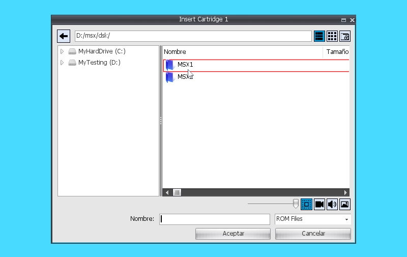

These types of dialogues make it easier to select files to open or save them
from an application. There are therefore the *OpenFileDialog/SaveFileDialog* and
the *OpenFolderDialog/SaveFolderDialog*, depending on whether we want to read,
write or create files and/or folders.

All four functions use the same parameters:

| title               | MDI window title. Default empty string.                                                                                                                                                                                            |                                  |   |   |   |   |   |   |
|---------------------|------------------------------------------------------------------------------------------------------------------------------------------------------------------------------------------------------------------------------------|----------------------------------|---|---|---|---|---|---|
| filename            | Initial value of the filename text field. Default empty string.                                                                                                                                                                    |                                  |   |   |   |   |   |   |
| folder              | Default folder to save the file to. Default empty string.                                                                                                                                                                          |                                  |   |   |   |   |   |   |
| filters             | File filters. Default empty string. Filters are a sequence of strings separated by the '\|' character and formed by the Title \| wildcard. Examples: "PNG Files\|\*.png"; "Graphic Files\|\*.png;\*.jpg;\*.tga\|All Files\|\*.\*". |                                  |   |   |   |   |   |   |
| flags               | SFD_ALLOWMULTISELECT                                                                                                                                                                                                               | Allows multi-selection of files. |   |   |   |   |   |   |
| SFD_OVERWRITEPROMPT | Permission is not requested to overwrite a file. Only for write dialogue.                                                                                                                                                          |                                  |   |   |   |   |   |   |
| SFD_FILEMUSTEXIST   | Forces the selected files to exist.                                                                                                                                                                                                |                                  |   |   |   |   |   |   |
| SFD_HIDEREADONLY    | Does not show hidden files.                                                                                                                                                                                                        |                                  |   |   |   |   |   |   |
| ctx                 | Context where the function to be invoked once the save is accepted.                                                                                                                                                                |                                  |   |   |   |   |   |   |
| function            | Function to be invoked to manage the save. The prototype of this function shall be the following:                                                                                                                                  |                                  |   |   |   |   |   |   |
| userdata            | User data that we can associate to be sent to the function as a parameter.                                                                                                                                                         |                                  |   |   |   |   |   |   |
| ismodal             | Defaults to true. It blocks the use of other dialogs and menus and you will need to close FileDialog to regain access to the rest of the desktop.                                                                                  |                                  |   |   |   |   |   |   |

~~~~~~~~~~~~~~~~~~~~~~~~~~~~~~~~~~~~~~~~~~~~~~~~~~~~~~~~~~~~~~~~~~~~~~~~~~~~~~~~
function () (fd, files, userdata) { }
~~~~~~~~~~~~~~~~~~~~~~~~~~~~~~~~~~~~~~~~~~~~~~~~~~~~~~~~~~~~~~~~~~~~~~~~~~~~~~~~

Here, \<fd\> refers to the FileDialog driver. The file selected for saving will
come as the first item in the \<files\> list. If we provide user data in the
call, it will be sent to \<userdata\>.

##### Example of use:

~~~~~~~~~~~~~~~~~~~~~~~~~~~~~~~~~~~~~~~~~~~~~~~~~~~~~~~~~~~~~~~~~~~~~~~~~~~~~~~~
GetEngine().OpenFileDialog("Open PNG Files", "", "", "PNG Files|*. png|All Files|*.*", this "OnOpenFile");

...

function OnOpenFile(_fd, _files, _userData)
{
	_image = GetEngine().LoadImage(_files[0]);
~~~~~~~~~~~~~~~~~~~~~~~~~~~~~~~~~~~~~~~~~~~~~~~~~~~~~~~~~~~~~~~~~~~~~~~~~~~~~~~~

~~~~~~~~~~~~~~~~~~~~~~~~~~~~~~~~~~~~~~~~~~~~~~~~~~~~~~~~~~~~~~~~~~~~~~~~~~~~~~~~
}
~~~~~~~~~~~~~~~~~~~~~~~~~~~~~~~~~~~~~~~~~~~~~~~~~~~~~~~~~~~~~~~~~~~~~~~~~~~~~~~~

AlertDialog

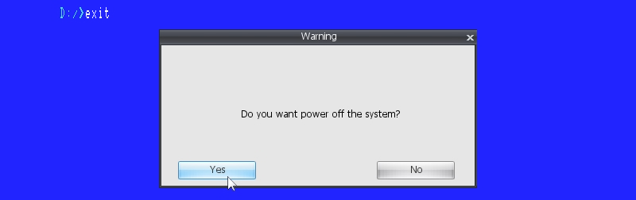

function **AlertDialog** (title, text, mode = 0, ctx = null, f1 =
"OnAlertDialogOK", f2 = "OnAlertDialogCancel", f3 = "")

It opens an alert dialog in a non-modal way, i.e. it does not block the
execution of the program. An AlertDialog consists of a title \<title\> that is
displayed in the MDI window and a text \<text\> that would occupy the central
area of the window, and additionally different button operation modes can be
configured via \<mode\>:

| View.AD_OK          | An OK button. \<f1\> is used.                                                             |
|---------------------|-------------------------------------------------------------------------------------------|
| View.AD_CANCEL      | A CANCEL button. \<f1\> is used.                                                          |
| View.AD_YES         | A YES button. \<f1\> is used.                                                             |
| View.AD_NO          | A NO button. \<f1\> is used.                                                              |
| View.AD_OKCANCEL    | Two buttons OK and CANCEL use \<f1\> for OK and \<f2\> for CANCEL.                        |
| View.AD_YESNO       | Two buttons YES and NO use \<f1\> for YES and \<f2\> for NO.                              |
| View.AD_YESNOCANCEL | Three buttons YES, NO and CANCEL use \<f1\> for YES, \<f2\> for NO and \<f3\> for CANCEL. |

Depending on the number of buttons, we can use different callbacks that we will
receive when clicking on the buttons. These calls use a prototype like the
following:

~~~~~~~~~~~~~~~~~~~~~~~~~~~~~~~~~~~~~~~~~~~~~~~~~~~~~~~~~~~~~~~~~~~~~~~~~~~~~~~~
function OnClick () { }
~~~~~~~~~~~~~~~~~~~~~~~~~~~~~~~~~~~~~~~~~~~~~~~~~~~~~~~~~~~~~~~~~~~~~~~~~~~~~~~~

function **AlertDialogModal** (title, text, mode = 0) : int

It works in exactly the same way as AlertDialog, except that in this case, the
execution of the program does not continue until the dialogue is closed. As
return value, we will get the ID of the button that has been pressed or 0 in
case of closing the window.

InputDialog

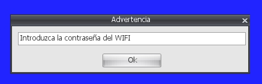

function **InputDialogModal** (title, text = "", mode = 0) : string

It allows obtaining data entered by the user. This data will be obtained as the
return value of the function since, in this case, the call is modal and
therefore blocking: until the dialogue is closed, the execution of the program
does not continue.

The parameters are a title for the MDI window \<title\> and an optional
descriptive text to give more information about the text to be entered. This
text is deleted once the user types a character. And then the mode \<mode\>,
which can be:

| View.AD_OK       | An OK button.              |
|------------------|----------------------------|
| View.AD_CANCEL   | A CANCEL button.           |
| View.AD_OKCANCEL | Two buttons OK and CANCEL. |

The data entered will only be returned by the function if the OK button is
clicked. In case of CANCEL or closing the MDI window, an empty string will be
returned.

# Programming a VR-BASIC application

To create an application made in VR-SCRIPT where the known VR-BASIC / MSX-BASIC
commands are used, the *BASIC_Program* template is available.

This type of application creates a graphical context alongside the VR-BASIC
interpreter and gives you control to make exclusive use of it.

The point of entry will be:

~~~~~~~~~~~~~~~~~~~~~~~~~~~~~~~~~~~~~~~~~~~~~~~~~~~~~~~~~~~~~~~~~~~~~~~~~~~~~~~~
virtual Start(){}
~~~~~~~~~~~~~~~~~~~~~~~~~~~~~~~~~~~~~~~~~~~~~~~~~~~~~~~~~~~~~~~~~~~~~~~~~~~~~~~~

The available methods inherited by the *Basic_Program* template are equivalent
in functionality to those seen in the VR-BASIC section, and would be the
following:

| **Asc** (str)                                                                       |
|-------------------------------------------------------------------------------------|
| **Atn** (v)                                                                         |
| **Beep** ()                                                                         |
| **Base** (n)                                                                        |
| **BaseSet** (n, expr)                                                               |
| **Bin\$** (expr)                                                                    |
| **Bload** (path, brun, off = 0)                                                     |
| **Bsave** (path, init, end, start = 0)                                              |
| **Call** (name, params = []);                                                       |
| **Cdbl** (expr)                                                                     |
| **Chr\$** (expr)                                                                    |
| **Cint** (expr)                                                                     |
| **Cls** ()                                                                          |
| **CSng** (expr)                                                                     |
| **Csrlin** ()                                                                       |
| **Circle** (x, y, rad, colour, start_angle = "", end_angle = "", aspect_ratio = "") |
| **Cload** (path, verify)                                                            |
| **Close** (list)                                                                    |
| **Colour** (fg = "", bg = "", bc = "")                                              |
| **ColorNew** ()                                                                     |
| **ColorRestore** ()                                                                 |
| **ColorSet** (index, r, g, b)                                                       |
| **ColorSprite** (index, colour)                                                     |
| **ColorSprite\$** (index, colour)                                                   |
| **Cont** ()                                                                         |
| **CopyVRAMToVRAM** (x1, y1, bStep, x2, y2, pageS, x3, y3, pageD, logOp)             |
| **CopyFileToArray** (src, var)                                                      |
| **CopyArrayToFile** (var, dst)                                                      |
| **CopyFileToFile** (src, dst)                                                       |
| **Clear** (size = 0, high = 0)                                                      |
| **Draw** (expr)                                                                     |
| **Dim** (var, dims)                                                                 |
| **DefFn** (fName, paramList, expr)                                                  |
| **DefInt** (varList)                                                                |
| **DefSng** (varList)                                                                |
| **DefDbl** (varList)                                                                |
| **DefStr** (varList)                                                                |
| **DefUsr** (num, expr)                                                              |
| **Erl** ()                                                                          |
| **Err** ()                                                                          |
| **Error** (num)                                                                     |
| **Let** (var, dimExpr, expr, type = "")                                             |
| **Engine** (_mode)                                                                  |
| **Mid\$** (str, start, len = -1)                                                    |
| **Len** (str)                                                                       |
| **Fix** (num)                                                                       |
| **Files** (wildcard)                                                                |
| **Fn** (name, params)                                                               |
| **Kill** (wildcard)                                                                 |
| **KeyOn** ()                                                                        |
| **KeyOff** ()                                                                       |
| **KeyList** ()                                                                      |
| **KeySet** (num, str)                                                               |
| **KeyMode** (num, mode)                                                             |
| **MaxFiles** (num)                                                                  |
| **Fre** (num)                                                                       |
| **GetDate** (var, alarm)                                                            |
| **GetTime** (var, alarm)                                                            |
| **Hex\$** (expr)                                                                    |
| **InStr** (ix, str1, str2)                                                          |
| **InStr** (str1, str2)                                                              |
| **End** ()                                                                          |
| **Inkey\$** ()                                                                      |
| **Inp** (port)                                                                      |
| **Input** (file, prompt, list)                                                      |
| **Input\$** (num, file = 0)                                                         |
| **IntervalMode** (mode)                                                             |
| **Left\$** (x, n)                                                                   |
| **Locate** (x, y, cursor = false)                                                   |
| **Line** (x1, y1, x2, y2, colour, logOp = 0)                                        |
| **Line** (bStep1, x1, y1, bStep2, x2, y2, colour, bFlag, logOp = 0)                 |
| **LineInput** (file, prompt, var)                                                   |
| **Oct\$** (expr)                                                                    |
| **Open** (path, mode, fileNum, len)                                                 |
| **Out** (port, value)                                                               |
| **Rnd** (x)                                                                         |
| **Right\$** (x, n)                                                                  |
| **Pad** (n)                                                                         |
| **Pdl** (n)                                                                         |
| **Pos** (x)                                                                         |
| **Paint** (x, y, colour, border_color = "")                                         |
| **Paint** (bStep, x, y, colour, border_color)                                       |
| **IsPlaying** (channel)                                                             |
| **Play** (mode, chList)                                                             |
| **PrintUsing** (file, expr)                                                         |
| **Print** (file, expr)                                                              |
| **Print** (str)                                                                     |
| **Point** (x, y)                                                                    |
| **PSet** (x, y, colour)                                                             |
| **PSet** (bStep, x, y, colour)                                                      |
| **Preset** (x, y, colour)                                                           |
| **Preset** (bStep, x, y, colour)                                                    |
| **Poke** (addr, v)                                                                  |
| **Peek** (addr)                                                                     |
| **PutSprite** (plane, x, y, colour, num = "")                                       |
| **PutSprite** (plane, bStep, x, y, colour, num)                                     |
| **Screen** (m = "", spr = "", click = "", baud = "", printer = "", interlace = "")  |
| **SetAdjust** (x, y)                                                                |
| **SetPrompt** (prompt)                                                              |
| **SetPage** (display, active)                                                       |
| **SetScroll** (x, y, m, s)                                                          |
| **Sgn** (x)                                                                         |
| **Space\$** (x)                                                                     |
| **Spc** (x)                                                                         |
| **Sqr** (x)                                                                         |
| **Str\$** (x)                                                                       |
| **String\$** (n, expr)                                                              |
| **Stop** ()                                                                         |
| **StopMode** (mode)                                                                 |
| **Sound** (reg, value)                                                              |
| **Sprite\$** (num, expr)                                                            |
| **SpriteMode** (mode)                                                               |
| **Strig** (n)                                                                       |
| **StrigMode** (n, mode)                                                             |
| **Stick** (n)                                                                       |
| **Tron** ()                                                                         |
| **Troff** ()                                                                        |
| **Tab** (x)                                                                         |
| **Time** ()                                                                         |
| **Time** (expr)                                                                     |
| **Usr** (n, param)                                                                  |
| **Val** (expr)                                                                      |
| **VPoke** (addr, value)                                                             |
| **VPeek** (addr)                                                                    |
| **VDP** (reg) : ubyte                                                               |
| **VDP** (reg, value)                                                                |
| **Width** (x)                                                                       |

# Programming a VR-GL application

VR-GL is a VR-SCRIPT library that allows working with graphics within the MSXVR
environment. The concept of this library is to work with different types of
objects that allow us to develop multimedia projects such as videogames,
although there is room for any possibility where graphics and music interact.

Concepts:

| CLONING          | Refers to the creation and subsequent exact copying of the properties of an original object.                                                                                                                |
|------------------|-------------------------------------------------------------------------------------------------------------------------------------------------------------------------------------------------------------|
| INSTANCIATION    | Refers to the creation and subsequent exact copying of some properties of an original object. In this case, there will be other properties that will be a reference to those of the original object.        |
| STATE PROPERTIES | Those properties that define the state of the object. These properties are unique for all objects.                                                                                                          |
| CLASSES          | The object class types of the library are: GL_Collider, GL_Controller, GL_Mapper, GL_Music, GL_Pad, GL_Route, GL_Script, GL_Sound, GL_Sprite, GL_Stage, GL_Text, GL_Timer. They all inherit from GL_Object. |

## GL_Program

Interface for the creation of programs that require the use of the VR-GL
library.

The methods available are:

function **SetBgColor** (colour)

Sets a solid colour for the stage background (see GL_Stage).

function **SetBackColor** (colour)

Sets a solid colour for the background of the screen.

function **SetBgImage** (path)

Sets as a background an image (texture) that is loaded from a given \<path\> as
an argument.

function **Play** ()

Starts up VR-GL objects.

function **Stop** ()

Stops the execution of VR-GL objects.

function **GetActiveStage** () : pointer

Returns the active stage (object of type GL_Stage).

function **GetOffX** () : int

Returns the X position from which VR-GL objects are rendered. Default is zero.

function **GetOffY** () : int

Returns the Y position from which VR-GL objects are rendered. Default is zero.

function **GetResX** () : int

Returns the horizontal resolution used to render VR-GL objects. Default is the
horizontal desktop size.

function **GetResY** () : int

Returns the vertical resolution used to render VR-GL objects. Default is the
vertical desktop size.

function **CloneObject** (name, obj) : pointer

Allows you to create an exact copy of another VR-GL object \<obj\> with instance
name \<name\>.

function **NewObject** (name, className, stage = null) : pointer

Creates a new VR-GL object with name \<name\> and of the type specified in
\<className\>. If NULL is passed in the \<stage\>, this object will be created
in the active scene; otherwise, it will be created in the stage instance we pass
in. The class name may be GL_Stage, GL_Sprite, GL_Music, GL_Sound, GL_Pad, etc.
or a user class that inherits from GL_Object.

function **NewStage** (name) : pointer

Create a new Stage object (GL_Stage) with name \<name\>.

function **NewSprite** (name, stage = null) : pointer

Creates a new Sprite object (GL_Sprite) in the scene we pass as parameter in
\<stage\>. In case it is NULL, it will be created in the active scene.

function **NewText** (name, stage = null) : pointer

Creates a new Text object (GL_Text) in the scene passed as parameter in
\<stage\>. In case it is NULL, it will be created in the active scene.

function **NewMapper** (name, stage = null) : pointer

Creates a new Mapper object (GL_Mapper) in the scene we pass as parameter in
\<stage\>. In case it is NULL, it will be created in the active scene.

function **NewRoute** (name, stage = null) : pointer

Creates a new Route object (GL_Route) in the scene we pass as parameter in
\<stage\>. In case it is NULL, it will be created in the active scene.

function **NewController** (name, stage = null) : pointer

Creates a new Controller object (GL_Controller) in the scene we pass as
parameter in \<stage\>. In case it is NULL, it will be created in the active
scene.

function **NewSound** (name, stage = null) : pointer

Creates a new Sound object (GL_Sound) in the scene passed as parameter in
\<stage\>. In case it is NULL, it will be created in the active scene.

function **NewMusic** (name, stage = null) : pointer

Creates a new Music object (GL_Music) in the scene passed as parameter in
\<stage\>. In case it is NULL, it will be created in the active scene.

function **NewTimer** (name, stage = null) : pointer

Creates a new Timer object (GL_Timer) in the scene we pass as parameter in
\<stage\>. In case it is NULL, it will be created in the active scene.

function **NewCollider** (name, stage = null) : pointer

Creates a new Collider object (GL_Collider) in the scene we pass as parameter in
\<stage\>. In case it is NULL, it will be created in the active scene.

function **NewPad** (name, stage = null) : pointer

Creates a new Command object (GL_Pad) in the scene we pass as parameter in
\<stage\>. In case it is NULL, it will be created in the active scene.

function **FindObject** (name, stage = null) : pointer

Searches for the object instance with name \<name\> in the scene \<stage\> that
we pass as an argument. If \<stage\> is NULL it will search the active scene.

function **SetResolution** (w, h)

Sets the resolution to use for the GL objects created. By default the desktop
size is used, but another resolution can be used to create applications based on
other screen formats.

function **SetViewScale** (scale)

It applies a scale to the view, so that we can scale up or down the format of
the graphics displayed on the screen.

function **Trace** (msg)

It generates a trace message that allows us to debug easily and quickly.

function **LoadVGS** (name) : pointer

Loads a file of type GameSaurus in the GL instance associated to our program.
From the GameSaurus file it will get all the information to initialise itself.
In this way, it is possible to set up a scheme where the designer works with VGS
and models everything necessary for the project, while the programmer creates
everything necessary outside the VGS to give behaviour to the objects that are
used at design level and/or outside it.

GameSaurus is an application that allows you to develop games and multimedia
applications using VR-GL in a visual way on the MSXVR.

## GL_Object

It represents the main interface to all the object types that the VR-GL library
can work with.

function **GetGL** () : pointer

Gets the associated VR-GL object instance.

function **GetEngine** () : pointer

Gets access to the system engine.

function **SetName** (name)

Assigns a name \<name\> to the object instance. Same names are not allowed
between objects of the same type. In case of assigning an existing name, it will
automatically be renamed with the prefix "_1".

function **GetName** () : string

Gets the assigned name.

function **SetUserData** (data)

Associates user data to the object instance.

function **GetUserData** () : pointer

Gets the associated user data.

function **SetStop** (v)

Sets the stopped or not status of the instance. \<v\> will be a boolean value.
If true it will be stopped, and if false it will not.

function **GetStop** () : bool

Returns the stopped state of the instance.

function **SetVisible** (v)

Sets the visibility status of the instance. \<v\> shall be a boolean value. If
true it shall be visible, and if false it shall be invisible.

function **GetVisible** () : bool

Gets the visibility status of the instance.

function **SetPriority** (p)

Sets the priority of the object instance. The \<p\> priority value shall be a
float value and each object shall implement this method accordingly.

function **GetPriority** () : float

Gets the priority associated with the instance.

function **ClearObjects** ()

Deletes all created child objects.

function **SetParent** (obj)

Allows us to set a hierarchy level. With this function we indicate that the new
parent will be \<obj\>. When performing this action, if we already had a parent,
we will remove that relationship to be part of the new one.

function **GetParent** () : pointer

Returns the parent object, if it exists. If it does not exist it will return
NULL.

function **AddObject** (obj)

Adds an \<obj\> object as a child.

function **RemoveObject** (obj)

Removes an \<obj\> object from the list of children.

function **GetObjectOrder** (obj) : int

Returns the position of an \<obj\> object within the list of children. The
returned value shall be between 0 and *GetNumObjects-1*.

function **ChangeObjectOrder** (obj, ix)

Allows you to swap the order within the list of children. The parameter \<obj\>
refers to the child we want to move in the list and with \<ix\> we indicate the
new position. This new position will be between 0 and *GetNumObjects-1*.

function **FindObjects** (match, classType = "") : list

Allows you to search for objects within the hierarchy, i.e. between children and
within children. The \<match\> parameter allows the search pattern to be set.
This string may be:

| \<match\>\*   | Names beginning with \<match\>     |
|---------------|------------------------------------|
| \*\<match\>   | Names ending with \<match\>.       |
| \*\<match\>\* | Names containing \<match\>         |
| \<match\>     | Name exactly the same as \<match\> |

For example:

~~~~~~~~~~~~~~~~~~~~~~~~~~~~~~~~~~~~~~~~~~~~~~~~~~~~~~~~~~~~~~~~~~~~~~~~~~~~~~~~
_list = _obj.FindObjects("*control*");
~~~~~~~~~~~~~~~~~~~~~~~~~~~~~~~~~~~~~~~~~~~~~~~~~~~~~~~~~~~~~~~~~~~~~~~~~~~~~~~~

In the \<classtype\> parameter we can indicate on which class of objects we want
to apply the search, for example: "GL_Sprite" or "GL_Sound".

function **DeleteObjects** (match, classType = "")

Applying the same search criteria as *FindObjects, it* deletes all objects
matching that pattern.

function **FindObject** (name, classType = "") : pointer

Searches for a child object, or within children, that has name \<name\> and is
of the class \<classType\> to search for. If the class type is not specified,
all existing classes are searched for.

function **GetObjectNameList** () : list

Returns a list of the names of all top-level child objects.

function **NewObject** (name, classType) : pointer

Creates a child object with name \<name\> and type \<classType\>. Classes must
always inherit from GL_Object. They can be those provided by the library
(GL_Sprite, GL_Sound, GL_Route, etc.) or created by the user as long as they are
accessible.

function **NewXRefObject** (name, xref) : pointer

Allows to create a child object with name \<name\> and referencing an external
script (XREF). The \<xref\> parameter will be the full path to the script and
the script must inherit its behaviour from GL_Object.

function **GetXRef** () : pointer

Returns the full path of an XREF object. If the object is not XREF it will
return an empty string.

function **IsXRef** () : bool

Indicates whether the object is XREF or not.

function **CloneChilds** (name, obj) : bool

Allows to create cloned children of the children of the \<obj\> object. These
new children shall be named with the prefix \<name\> plus the name of the cloned
object. In case the cloning was successful, the function shall return true.

function **CloneObject** (name, obj) : pointer

Given an object \<obj\>, it shall be cloned as a child and assigned the name
\<name\>. The cloning is an exact copy of the original.

function **InstancedObject** (name, obj) : pointer

Allows to create an instantiation of the object \<obj\> and named \<name\>. In
this case, the new child object will be instantiated from \<obj\> and therefore
\<obj\> will be its original object, with which it will share some properties.

function **GetInstancedObject** () : pointer

In case we are an instantiated object, it will return the original object.
Otherwise, NULL will be returned.

function **RemoveInstancedObject** ()

Allows it to cease to be an instantiated object, if it is an instantiated
object.

function **CopyObject** (obj)

Applies a copy of properties of the \<obj\> object. The name shall be preserved.

function **DeleteObject** (obj)

Deletes the object \<obj\>. In this case \<obj\> may or may not be a child.

function **OrderToFront** ()

Positions the object ahead of its siblings. All objects have a list of child
objects; in this case, it is the parent's list of objects that is reordered.

function **OrderToBack** ()

Positions the object behind its siblings. All objects have a list of child
objects; in this case, it is the parent's list of objects that is reordered.

function **GetNumObjects** (classType = "")

Returns the number of child objects. If we specify a class name in
\<classType\>, we will count only those of that class.

function **GetObject** (ix, classType = "") : pointer

Returns the child object at position \<ix\>. This index shall depend on the
\<classType\> set. The index \<ix\> shall always be an integer ranging from 0 to
GetNumObjects*(classType)-1.*

function **GetObjects** (classType = "", recursive = false) : list

Returns all child objects in a list. This can be considered to be only the first
level children or also the children of the children if we set \<recursive\> to
true. We can also filter by class type \<classType\>.

function **BroadcastToObjects** (callName, params = [], classType = "")

Allows a \<callName\> call to be applied to all child objects. Parameters can be
passed to this call and also filter by \<classType\>.

For example:

~~~~~~~~~~~~~~~~~~~~~~~~~~~~~~~~~~~~~~~~~~~~~~~~~~~~~~~~~~~~~~~~~~~~~~~~~~~~~~~~
_obj.BroadcastToObjects("DoExplossion", [-20], "Enemy");
~~~~~~~~~~~~~~~~~~~~~~~~~~~~~~~~~~~~~~~~~~~~~~~~~~~~~~~~~~~~~~~~~~~~~~~~~~~~~~~~

function **IsRunning** () : bool

Allows to know if an object is running. That is, if a start has been made.

function **Start** ()

Allows you to activate an object and start it up. Before it is activated, it
saves its state so that it can be restored after a Stop.

function **Stop** ()

Disables a running object and restores it to its pre-Start state.

function **Pause** ()

Stops the execution of a running object and its children.

function **PauseObjects** ()

Stops the execution of the children.

function **Resume** ()

Re-enables the execution of an object and its children.

function **ResumeObjects** ()

Activate the execution of the children.

function **SaveState** () : list

Returns a list with name/value pairs of all properties of the object. This list
contains the current state of the object.

function **LoadState** (st)

Allows to load the state stored in \<st\> into the object.

function **GetBehaviourClassScript** () : string

Returns a string containing the complete script associated with the object's
behaviour. This includes the interface and the code.

function **SetScriptInterface** (name)

Sets the name of the script interface to use.

function **GetScriptInterface** () : string

Returns the name of the associated script interface.

function **SetScript** (code)

Defines the scripted string \<code\> to be used as code.

function **GetScript** () : string

Returns the string referencing the code script.

function **GetClass** () : pointer

Returns the object that references the script associated with the behaviour.

## GL_Stage

A scene is a type of GL object that represents a set of objects that may or may
not be represented visually. The scene has the ability to manage the display of
all its child objects, as well as coordinate their activation and deactivation,
among other functionalities.

A scene has a VIEWPORT or representation area. This is how we establish the
shape and appearance with which we want to represent the objects visible on the
screen. The representation area shows what the camera is seeing at that moment.
The camera can be modified to be able to manage where and how much to display.

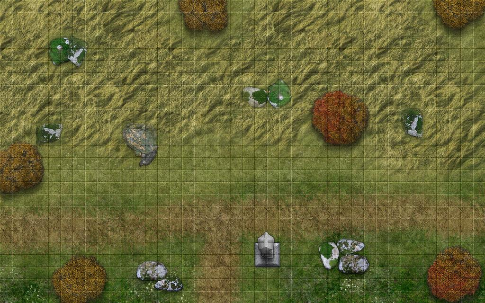

The CLIPPING area of the camera (yellow area) is the area in which objects are
activated or deactivated.

The VIEWPORT area (green area) is what we see on the screen.

There is another area called SCISSOR that allows you to display only the
sub-rectangle you want from the VIEWPORT area. By default, this area is equal to
the VIEWPORT.

Only one scene can be active at a time. In order to have multiple active scenes,
they must be GLOBAL. A global scene is always active.

The objects visible in a scene may be all objects that inherit from GL_Sprite.
In this case: GL_Sprite, GL_Mapper and GL_Text.

A scene can also be a MAIN STAGE. That means that when VR-GL starts
(GL_Program::Start), the scene that is launched first is this one.

The methods available are:

function **LoadTexture** (path) : pointer

Loads and returns a texture from a route.

function **DeleteTexture** (tex)

Erases a previously loaded texture.

function **SetActive** ()

Activate the scene.

function **GetActive** () : bool

Indicates whether the scene is active.

function **SetViewport** (x, y, w, h)

Sets the viewing area for the scene. The default will be the size of the screen,
but you can set a different source offset (x, y) and size (w, h).

function **GetViewport** () : list

Returns a list with four components: [x, y, w, h].

function **SetViewportX** (x)

Sets the horizontal origin of the scene viewing area.

function **GetViewportX** () : int

Gets the horizontal origin of the scene view area. Default is zero.

function **SetViewportY** (y)

Sets the vertical origin of the scene viewing area.

function **GetViewportY** () : int

Gets the vertical origin of the scene view area. Default is zero.

function **SetViewportW** (w)

Sets the width of the scene viewing area.

function **GetViewportW** () : int

Gets the width of the viewing area of the scene. Default is the width of the
desktop.

function **SetViewportH** (h)

Sets the height of the viewing area of the scene.

function **GetViewportH** () : int

Gets the height of the viewing area of the scene. Default is the height of the
desktop.

function **SetViewScale** (scale)

Sets a scale factor on the view. By default this value is 1, which represents
that the view is displayed at its original scale.

function **GetViewScale** () : float

Gets the scale factor associated with the view.

function **SetCameraClipX** (x)

Sets the offset relative to the camera position in which to consider the
CLIPPING zone from the left.

function **GetCameraClipX** () : int

Gets the offset relative to the camera position of the CLIPPING area from the
left.

function **SetCameraClipY** (y)

Sets the offset relative to the camera position at which to consider the
CLIPPING area above.

function **GetCameraClipY** () : int

Gets the offset relative to the camera position from the CLIPPING area above.

function **SetCameraClipW** (w)

Sets the zone width of the CLIPPING area.

function **GetCameraClipW** () : int

Gets the zone width of the CLIPPING area.

function **SetCameraClipH** (h)

Sets the zone height of the CLIPPING area.

function **GetCameraClipH** () : int

Gets the zone height of the CLIPPING area.

function **SetCameraX** (x)

Assigns the horizontal position of the camera.

function **GetCameraX** () : float

Gets the horizontal position of the camera.

function **SetCameraY** (y)

Assigns the vertical position of the camera.

function **GetCameraY** () : float

Gets the vertical position of the camera.

function **SetCameraPos** (x, y)

Assigns the vertical and horizontal position of the camera.

function **IncCameraPos** (x, y)

Increases the vertical and horizontal position of the camera.

function **SetCameraZoom** (z)

Sets the scaling of the camera area. The default \<z\> parameter is 1.

function **GetCameraZoom** () : float

Gets the scaling of the camera area.

function **SetScissorEnabled** (v)

Enables drawing clipping to be activated in the VIEWPORT area.

function **GetScissorEnabled** () : bool

Indicates whether drawing clipping is active or not.

function **SetScissorX** (x)

Assigns the top horizontal position of the clipping rectangle.

function **GetScissorX** () : int

Gets the horizontal top position of the clipping rectangle.

function **SetScissorY** (y)

Assigns the top vertical position of the clipping rectangle.

function **GetScissorY** () : int

Gets the top vertical position of the trimming rectangle.

function **SetScissorW** (w)

Sets the width of the trimming rectangle.

function **GetScissorW** () : int

Gets the width of the trimming rectangle.

function **SetScissorH** (h)

Sets the height of the trimming rectangle.

function **GetScissorH** () : int

Gets the height of the trimming rectangle.

function **SetGlobal** (v)

Set the scene as global. In that case, it will always be active.

function **GetGlobal** () : bool

Indicates whether the scene is global.

function **SetPhysicsScale** (scale)

Allows you to set the scale for physics simulation. Depending on the scale,
physics are more or less heavy in terms of fluidity and speed of movement, not
in terms of performance. The scale determines the size of the units used in the
physics parameters, allowing you to work in metres, centimetres, etc.

function **GetPhysicsScale** () : float

Gets the scaling used for physics simulation.

function **SetPhysicsGravityX** (gx)

Sets the acceleration of gravity for physics in the X component.

function **GetPhysicsGravityX** () : float

Gets the acceleration of gravity for physics in the X component.

function **SetPhysicsGravityY** (gy)

Sets the acceleration of gravity for physics in the Y component. This unit is
given in m/s2, e.g. 9.8.

function **GetPhysicsGravityY** () : float

Gets the acceleration of gravity for physics in the Y component.

function **CheckCollision** (x, y, w, h) : list

Returns a list of objects that have collision with the area with position (x, y)
and size (w, h). For an object to collide it must inherit from GL_Sprite and
have collision detection enabled.

function **GetMain** () : bool

Indicates whether this scene is a main scene.

function **EnableDraw** (v)

Allows you to indicate whether you want the scene to be displayed or not. If
deactivated, even a visible scene will not be displayed.

function **LinkCamera** (obj, offx = 0, offy = 0)

Allows the scene camera to follow an object \<obj\> and do so based on its
position with an offset (offx, offy).

## GL_Sprite

A sprite is one or more textures (images) that can be combined in the form of
animation and that allows visibility, physics and collision properties to be
managed.

Concepts:

| Frame     | Texture associated with the Sprite. A Sprite can have none, one or several.                                                                |
|-----------|--------------------------------------------------------------------------------------------------------------------------------------------|
| Animation | A continuous set of frames which, represented at one speed, makes it possible to establish an animated sequence.                           |
| Collision | Sprites can manage collisions between them, i.e. define contact zones that the system can then detect.                                     |
| Position  | Sprites are positioned at coordinates (x, y) within a stage. These coordinates refer to the top/upper corner of the rectangle they occupy. |

The methods available are:

function **AddFrame** (path, w = -1, h = -1, x = 0, y = 0, uvx = 0, uvy = 0, uvw
= 1, uvh = 1)

Add a texture as a frame to the Sprite. We indicate the path to the texture with
\<path\>. The rest of the parameters are optional and have the following
functionality:

| w                               | Width with which we will represent the frame. If we indicate -1 we will use the existing width of the image.                                                               |
|---------------------------------|----------------------------------------------------------------------------------------------------------------------------------------------------------------------------|
| h                               | Height with which we will represent the frame. If we indicate -1 we will use the existing height of the image.                                                             |
| x                               | Horizontal offset with respect to the position of the Sprite when rendering this frame.                                                                                    |
| y                               | Vertical offset with respect to the position of the Sprite when rendering this frame.                                                                                      |
| uvx,uvy,uvw,uvh,uvx,uvy,uvw,uvh | Normalised texture coordinates. It is possible to indicate if the frame to be considered is a sub-rectangle within the texture. Default is the whole texture (0, 0, 1, 1). |

function **AddEmptyFrame** (_w = -1, \_h = -1)

Adds an untextured frame to the Sprite. This frame will use the colour
associated with the default Sprite (see *SetColor*). The optional \<w\> and
\<h\> parameters will define the size of the frame in pixels. If neither is
defined, *GetWidth* or *GetHeight* will be used in each case.

function **GetFrameTexture** (ix) : pointer

Returns the texture associated with a frame. If \<ix\> is specified out of
range, the function will return NULL.

function **GetNumFrames** () : int

Returns the number of frames the Sprite has.

function **GetFrameInfo** (ix) : list

Given a frame index between 0 and \*GetNumFrames-\*1, it allows us to obtain the
information associated to it. The returned list will contain: [tex, uvx, uvy,
uvw, uvh, addru, addrv, filter, x, y, w, h, cx, cy, cw, ch].

| tex                | Associated texture.                                                                                                                                         |
|--------------------|-------------------------------------------------------------------------------------------------------------------------------------------------------------|
| uvx, uvy, uvw, uvh | Texture coordinates.                                                                                                                                        |
| addru, addrv       | Texture mapping. The default is CLAMP, but WRAP can be used to simulate repeats. This can be done for both horizontal and vertical direction independently. |
| filter             | Indicates whether bilinear or approximation filter is used.                                                                                                 |
| cx, cy, cw, ch     | Indicates the collision zone within the texture.                                                                                                            |

function **RemoveAnimations** ()

It removes all associated animations. This will involve deleting all associated
frames.

function **RemoveAnimation** (ani)

Deletes an \<ani\> animation passed as a parameter. This involves deleting the
frames associated with that animation.

function **RemoveFrames** ()

Removes all associated frames and therefore all animations.

function **AddAnimation** (name, start, end, loop, speed) : pointer

Creates and adds an animation with name \<name\>, with start frame \<start\> to
end frame \<end\>. The frame number will be an integer from 0 to GetNumFrames-1
and the start frame must be less than or equal to the end frame. We will also
indicate the index to the frame to jump to in order to loop \<loop\> or we can
use -1 to indicate that it is an infinite loop \<start\>.

-   \<end\> or use -2 to indicate that we want to stop at the end. Finally,
    indicate the transition speed between frames \<speed\>.

function **AddAnimationWithSheet** (name, path, start, end, ox, oy, sheetW,
sheetH, w = -1, h = -1, loop = -1, speed = 0.25f, framestep = 1)

Add an animation with name \<name\> in the Sprite. The source of the animation
will be a texture accessible on the \<path\> path and from this texture the
frames from \<start\> start to \<end\> end will be extracted. The way to extract
the frames is to subdivide the texture in fragments of size (sheetW, sheetH)
from the offset in pixels (ox, oy). Applying this grid, from top to bottom and
from left to right we have the frames from 0 to (TEXW/SHEETW \* TEXH/SHEETH)-1.

The other parameters are the size (height and width) to be used visually in
those frames, the initial frame of the cycle, the animation speed and if we want
to avoid frames.

function **AddAnimationWithGrid** (name, path, gw, gh, list = [], w = -1, h =
-1, loop = -1, speed = 0.25f, framestep = 1)

Add an animation with name \<name\> to the Sprite. The source of the animation
will be a texture accessible on the \<path\>. From this texture will be
extracted the frames that we are going to take into account in the animation.
This way of creating the animation is similar to *AddAnimationWithSheet* except
that here, instead of being homogeneous sub-rectangles, we will use the ones
provided inside the \<list\> list.

function **AddAnimationWithList** (name, list, w = -1, h = -1, loop = -1, speed
= 0.25f, frameStep = 1)

Adds an animation with name \<name\> to the Sprite. The different frames will be
taken from a list of file paths to textures. The rest of the parameters work the
same as in *AddAnimationWithSheet*.

function **AddAnimationWithPrefix** (name, prefix, start, end, w = -1, h = -1,
loop = -1, speed = 0.25f, frameStep = 1)

Adds an animation with name \<name\> to the Sprite. The different frames are
obtained by applying a substitution using the \<prefix\> string for the values
from \<start\> to \<end\>. The rest of the parameters work the same as in
*AddAnimationWithSheet*.

function **AddAnimationWithPrefixList** (name, prefix, list, w = -1, h = -1,
loop = -1, speed = 0.25f, frameStep = 1)

Adds an animation with name \<name\> to the Sprite. The different frames are
obtained by applying a substitution using the \<prefix\> string for the integer
values found in the \<list\> list. The rest of the parameters work the same as
in *AddAnimationWithSheet*.

function **SetAnimation** (ani, reset = false)

Allows you to set the current animation of the sprite. In this case we can
indicate in \<ani\> either an animation name or a pointer to an animation
object. If the current animation is the one we want to assign, its execution
will not be interrupted and its state will not be restarted; however, if we want
this to happen, we will have to use \<reset\> to true.

function **GetNumAnimations** () : int

Returns the number of animations created and available in the Sprite.

function **FindAnimation** (name) : pointer

Find and return an animation in the Sprite with name \<name\>.

function **GetAnimation** (ix = -1) : pointer

Returns the animation with index \<ix\>. This index shall range from 0 to
*GetNumAnimations-1*. In case of -1, the current animation will be returned.

function **GetCurAnimation** () : string

It will return the name of the current animation.

function **SetCurAnimation** (name)

Sets the current animation of a Sprite by specifying the name in \<name\>.

function **ResetAnimation** ()

Restart the animation in progress.

function **EndFixAnimation** ()

Leaves the current animation in its last frame.

function **SetAnimationSpeedFactor** (f)

Allows a speed factor to be applied to the current animation. If \<f\> is zero,
the animation will stop; if \<f\> is 1, it will go at the normal speed of the
animation; and if \<f\> is 2, everything will go at twice the speed.

function **SetType** (flags)

Sets the type flags. This allows Sprites to be identified and categorised.

function **GetType** () : int

Gets the type flags associated with the Sprite.

function **SetScalePivot** (x, y)

Sets the pivot for Sprite scaling. The default is (0, 0), and this means that
scaling is applied starting from the top left corner.

function **SetPivot** (x, y)

Sets the pivot used for the rotation of the Sprite. The default is (0, 0),
meaning that the Sprite always rotates from its centre.

function **SetPivotX** (x)

Allows the rotation pivot to be set to X.

function **GetPivotX** () : float

Gets the rotation pivot in X.

function **SetPivotY** (y)

Allows the Y-rotation pivot to be set.

function **GetPivotY** () : float

Gets the Y-rotation pivot.

function **IncPos** (x, y, updateCamera = false, checkMapper = null)

Shifts the position of the Sprite by one increment (x, y). You can indicate if
you want to update the camera of the scene where the Sprite is by
\<updateCamera\> and validate collisions with an existing Mapper object
\<checkMapper\>.

function **IncScale** (x, y)

Increments the scale in x and y. Equivalent to *SetScale(GetScaleX()+x,
GetScaleY()+y).*

function **AlignToParent** (flags, offset = 0)

Aligns the position of the Sprite with its parent. If it has no parent Sprite,
the set screen resolution will be taken into account. Flags may be a combination
of these:

| GL_Sprite.ALIGN_LEFT    | Alignment to the left.          |
|-------------------------|---------------------------------|
| GL_Sprite.ALIGN_RIGHT   | Alignment to the right.         |
| GL_Sprite.ALIGN_CENTER  | Alignment centred horizontally. |
| GL_Sprite.ALIGN_VCENTER | Alignment centred vertically.   |
| GL_Sprite.ALIGN_BOTTOM  | Alignment at the bottom.        |
| GL_Sprite.ALIGN_TOP     | Alignment at the top.           |

function **SetPos** (x, y)

Sets the origin position of the Sprite.

function **SetSize** (w, h, resize = false)

Sets the size of the sprite. Note that by default \<resize\> is set to false and
does not modify the sizes assigned to the frames. If you want the size passed as
a parameter to affect the entire sprite, set \<resize\> to true.

function **SetRect** (x, y, w, h, resize = false)

Establishes with a single call both position and size.

function **SetX** (x)

Assigns the home position in X.

function **SetY** (y)

Assigns the home position in Y.

function **GetX** () : float

Gets the X origin position of the Sprite.

function **GetY** () : float

Gets the origin Y position of the Sprite.

function **GetXF** () : float

Gets the source X end position of the Sprite. The final position refers to the
position that results from applying all parent-to-child transformations.

function **GetYF** () : float

Gets the source AND end position of the Sprite. The final position refers to the
position that results from applying all parent-to-child transformations.

function **GetWF** () : float

Gets the final width of the Sprite. The final position refers to the position
resulting from applying all parent-to-child transformations.

function **GetHF** () : float

Gets the final height of the Sprite. The final position refers to the position
resulting from applying all parent-to-child transformations.

function **GetRF** () : float

Returns the right-hand side coordinate of the Sprite. Value *GetXF() + GetWF() -
1.*

function **GetBF** () : float

Returns the coordinate of the bottom side of the Sprite. Value *GetYF + GetHF()
- 1.*

function **GetWidth** () : int

Returns the width of the Sprite.

function **SetWidth** (w, resize=0)

Sets the width of the Sprite and allows to indicate if we want to resize the
content associated with \<resize\> to 1 (to do it proportionally in frames,
physics and collisions) or to 2 (if we want to set the new size to frames only).

function **GetHeight** () : int

Returns the height of the Sprite.

function **SetHeight** (h, resize=0)

Sets the height of the Sprite and allows to indicate if we want to resize the
content associated with \<resize\> to 1 (to do it proportionally in frames,
physics and collisions) or to 2 (if we want to set the new size to frames only).

function **SetUVX** (x)

Applies a new normalised X coordinate origin to all frames.

function **GetUVX** () : float

Gets the normalised X coordinate origin of the first frame. If it has no frames
it will return 0.

function **SetUVY** (y)

Applies a new normalised Y-coordinate origin to all frames.

function **GetUVY** () : float

Gets the normalised Y-coordinate origin of the first frame. If it has no frames
it will return 0.

function **SetUVW** (w)

Sets a new normalised width to all frames.

function **GetUVW** () : float

Gets the normalised width of the first frame. If it has no frames it will return
0.

function **SetUVH** (h)

Sets a new normalised stop to all frames.

function **GetUVH** () : float

Gets the normalised height of the first frame. If it has no frames it will
return 0.

function **SetUV** (u, v, uw, vh)

Sets all normalised texture coordinates with a single function.

function **SetHFlip** (v)

Applies the horizontal flip effect on the Sprite frames.

function **GetHFlip** () : bool

Indicates whether the horizontal flip effect is activated.

function **SetVFlip** (v)

Applies the vertical flip effect on the Sprite frames.

function **GetVFlip** () : bool

Indicates whether the vertical flip effect is activated.

function **SetScale** (s)

Applies a scale factor both vertically and horizontally to the Sprite. By
default the scale factor is 1.

function **GetScale** () : float

Gets the scale factor of the Sprite.

function **SetScaleX** (s)

Sets a horizontal scale factor for the Sprite.

function **GetScaleX** () : float

Gets the horizontal scale factor applied to the Sprite.

function **SetScaleY** (s)

Sets a vertical scale factor for the Sprite.

function **GetScaleY** () : float

Gets the vertical scale factor applied to the Sprite.

function **SetCollision** (v)

Allows to indicate if we want the Sprite to be part of the collision detection
system.

function **GetCollision** () : bool

Gets true if the Sprite checks for collisions.

function **RemoveColliders** ()

Removes all collider objects associated with the Sprite.

function **AddColliderRect** (x, y, w, h) : pointer

Adds a collision rectangle (collider) to the Sprite. Using these colliders we
can define collision areas relative to the position of the Sprite.

function **RemoveColliderByIndex** (ix)

Removes the collider with index \<ix\>, which shall be an integer in the range 0
to GetNumColliders-1*.*

function **GetNumColliders** () : int

Gets the total number of colliders that have been created in the Sprite.

function **GetCX** () : int

Gets the horizontal coordinate relative to the defined collision rectangle.

function **GetCY** () : int

Gets the vertical coordinate relative to the defined collision rectangle.

function **GetCW** () : int

Gets the width of the rectangle defined for collision.

function **GetCH** () : int

Gets the height of the rectangle defined for collision.

function **GetCXF** () : int

Gets the final horizontal coordinate (with parent-to-child transformations
applied) relative to the defined collision rectangle.

function **GetCYF** () : int

Gets the final vertical coordinate (with parent-to-child transformations
applied) relative to the defined collision rectangle.

function **GetCWF** () : int

Gets the final width (with parent-to-child transformations applied) of the
rectangle defined for collision.

function **GetCHF** () : int

Gets the final height (with parent-to-child transformations applied) of the
rectangle defined for collision.

function **SetFrame** (f)

Sets a fixed frame to the Sprite if there is no animation in progress. If there
is animation in progress, the frame relative to that animation will be applied.
In either case, there will be no frame animation and the set frame will be
static.

function **GetFrame** () : int

Gets the index of the assigned frame: this shall be an integer ranging from 0 to
*GetNumFrames-1*. If an animation is in progress, it shall return the index
relative to the starting frame of the animation.

function **SetFlags** (f)

Set new user flags.

function **GetFlags** () : int

Gets the user flags.

function **AddFlags** (f)

Add user flags to existing ones.

function **RemoveFlags** (f)

Remove user flags from existing ones.

function **CheckFlags** (f) : bool

Check if any of the \<f\> flags exist.

function **SetColor** (c)

Sets a blend or colour sum with the visible frame of the Sprite. By default it
is a blend, but if we use the colour sum effect, it will be a direct sum between
the texture colour and the colour set in \<c\>.

function **GetColor** () : int

Gets the colour that is mixed or summed. Default is RGB(255,255,255), white.

function **SetColorAdd** (v)

Enables or disables the colour summation mode.

function **GetColorAdd** (v) : bool

Indicates whether the colour summation mode is active.

function **SetAlpha** (alpha)

Sets the transparency of the sprite. If \<alpha\> is 0, it will be fully
transparent, while if 255 it will be fully opaque.

function **GetAlpha** () : int

Determines the transparency of the Sprite.

function **IncAlpha** (speed)

Progressively increases the transparency of the Sprite with the \<speed\>
parameter. Equivalent to *SetAlpha(GetAlpha() + speed).*

function **SetUserMove** (ctx = null, function = "Move")

Allows to hook a callback to be invoked on each update of the Sprite logic.

function **SetUserDraw** (ctx = null, function = "Draw")

Allows us to hook a callback that will be invoked when the Sprite is rendered on
screen. This will allow us to be able to edit the way we render the Sprite.

function **SetAngle** (ang)

Sets the angle of rotation at which the frames are rendered. The \<ang\>
parameter is passed in radians. Note the *SetPivot* function.

function **GetAngle** () : float

Gets the angle of rotation in radians.

function **GetClassName** () : string

Gets a string with the name of the Sprite class. Unless it is a user class, this
string will be "GL_Sprite".

function **GetParent** () : pointer

Gets the parent associated with a Sprite. If there is none, it will return NULL.

function **SetPriority** (p)

Sets the priority of the Sprite. At lower priority they are painted first, and
at higher priority they are painted over.

function **GetPriority** () : int

Returns the priority of the Sprite.

function **AddChild** (spr)

Add a Sprite as a child.

function **RemoveChild** (spr)

Deletes a Sprite as a child. This does not delete the Sprite \<spr\> object, it
simply ceases to be a child.

function **SetTextureMask** (mask)

Sets a mask texture that is applied over the frames. When drawing a Sprite
frame, if the mask is enabled, the frame will be drawn using the mask and this
will cause the black areas of the mask not to be visible while the white areas
will be visible. The \<mask\> parameter can be either a path to the texture to
be loaded or a texture object directly.

function **GetTextureMask** () : pointer

If it has an associated mask texture it will return the texture object,
otherwise it will return NULL.

function **GetAnimationLoops**() : int

Indicates the number of times the current animation has been replayed.

function **IsClipped** () : bool

Indicates whether the Sprite is visible or not on screen.

function **SetClipping** (v)

Enables or disables the visibility detection of a Sprite when it enters or
leaves the camera CLIPPING area. If \<v\> is false, this will be ignored and the
Sprite will always be active even if it is off-camera.

function **GetClipping** () : bool

Indicates whether the camera CLIPPING area is taken into account for this
Sprite.

function **InViewport** () : bool

Indicates whether the Sprite is visible in the VIEWPORT area of the camera.

function **CheckCollisionWithSprite** (spr) : bool

Indicates whether the collision area of the Sprite collides with that of another
Sprite \<spr\>. This function also takes into account applied rotation and
scaling.

function **SetPhysics** (v)

Enables or disables realistic physics management for the Sprite.

function **GetPhysics** () : bool

Indicates whether realistic physics are active.

function **SetPhysicsBody** (type)

Set the type of physical body you want to associate with the Sprite. This can
be:

| SPRITE_PHYSICS_BODY_STATIC    | Static. It does not move. Collisions are taken into account, but it does not react to them. |
|-------------------------------|---------------------------------------------------------------------------------------------|
| SPRITE_PHYSICS_BODY_DYNAMIC   | Dynamic. It moves and reacts to collisions with other objects.                              |
| SPRITE_PHYSICS_BODY_KINEMATIC | It is a mix between static and dynamic. It can move but is not affected by collisions.      |

function **GetPhysicsBody**() : int

Returns the associated physical body type.

function **ClearPhysicsShapes** ()

Removes all physical figures associated with the Sprite.

function **AddPhysicsShapeRect** (x, y, w, h) : pointer

Adds a physical figure of rectangular type with relative position (x, y) and
size (w, h).

function **AddPhysicsShapeCircle** (x, y, r) : pointer

Add a physical figure of circular type with relative position (x, y) and radius
\<r\>.

function **GetNumPhysicsShapes** () : int

Returns the number of physical figures associated with the Sprite.

function **RemovePhysicsShapeByIndex** (ix)

Removes the physics figure associated with index \<ix\>. This index shall range
from 0 to *GetNumPhysicsShapes-1*.

function **SetPhysicsFixedRotation** (v)

Allows us to indicate whether we want the rotation of the physical figure to be
affected or whether we want it to remain static. For the rotation to be
affected, the parameter \<v\> must be true.

function **GetPhysicsFixedRotation** () : bool

Indicates whether the rotation of the physical figure is affected or remains
static.

function **SetPhysicsMass** (v)

Sets a mass value to the physical body. Only suitable for physical bodies of a
dynamic type.

function **GetPhysicsMass** () : float

Gets the mass value of the physical body.

function **SetPhysicsDensity** (v)

Sets a density to the physical body. Also used to simulate the mass of the body
and is measured in kg/m2. The higher the density, the heavier the body. This
value cannot be negative.

function **GetPhysicsDensity** () : float

Gets the density established to the physical body.

function **SetPhysicsRestitution** (v)

It establishes the restitution factor of the physical body. It is mainly used to
indicate how the body reacts to collision with other bodies (the rebound
factor). The value of \<v\> should generally be a value between 0 and 1.

function **GetPhysicsRestitution** () : float

Obtains the restitution factor of the physical body.

function **SetPhysicsFriction** (v)

It establishes the friction factor of the physical body. It is mainly used to
indicate how a body slips in collision with other bodies. The value of \<v\>
should generally be a value between 0 and 1.

function **GetPhysicsFriction** () : float

Gets the friction factor of the physical body.

function **SetPhysicsGravityScale** (v)

It establishes the gravitational compensation factor of the physical body. It
serves to truncate how general gravity affects with respect to this body.
Default is 1.

function **GetPhysicsGravityScale** () : float

Gets the gravitational compensation factor of the physical body.

function **SetPhysicsAngularDamping** (v)

Sets the factor by which the angular velocity of the physical body is reduced.
The value of \<v\> will generally be between 0 and 1.

function **GetPhysicsAngularDamping** () : float

Gets the angular velocity reduction factor.

function **SetPhysicsLinearDamping** (v)

Sets the linear velocity reduction factor. The value of \<v\> will generally be
between 0 and 1.

function **GetPhysicsLinearDamping** () : float

Gets the linear speed reduction factor.

function **ApplyTorque** (x)

Applies a turning effect / torque force. The value of \<x\> is expressed in
Newtons Metres (Nm). This force affects the angular velocity without affecting
the linear centre-of-mass velocity. The function wakes up the body if it is
asleep.

function **ApplyForce** (x, y, px, py)

Applies a force to a point on the globe. If the force is not applied to the
centre of mass, it will generate a spin effect and affect the angular velocity.
This function wakes up the body if it is asleep. The force vector (x, y) is
measured in Newtons and the position of the point in the world will be (px, py).

function **ApplyForceToCenter** (x, y)

It applies a force directly to the body's centre of mass. This function wakes up
the body if it is asleep. The force vector (x, y) is measured in Newtons.

function **ApplyLinearImpulse** (sx, sy, x, y)

Apply an impulse (sx, sy) to a point (x, y). This will immediately change the
velocity. It will also change the angular velocity if the point to which it is
applied is not the centre of mass. This function wakes up the body if it is
asleep. The impulse is measured in Newton-Seconds.

function **GetPhysicsVelocity** () : list

Returns a list of two components representing the linear velocity of the object
in metres/second.

function **BuildPhysics** ()

Once the physical figures and properties of the physical body have been
initialised, this function prepares and creates all the necessary structures for
the simulation.

function **CreateController** () : pointer

Creates a GL_Controller object and associates it with the Sprite. The controller
object allows to manage the movement of a Sprite in different ways.

function **DestroyController** ()

Removes the controller object associated with the Sprite.

function **GetController** () : pointer

Gets the pointer to the associated controller object. If none has been created,
returns NULL.

function **CreateFX** (name) : pointer

Allows to create a visual effect on the Sprite. The type of effect is determined
by the \<name\> parameter, which is a text string. To activate the effect it is
necessary to initialise it by means of the Start call.

| **Name** | **Functionality**                            | **Start parameters**                                   |
|----------|----------------------------------------------|--------------------------------------------------------|
| BLINK    | Flashing effect for a number of times.       | Milliseconds of each blink, number of times it blinks. |
| TINT     | Colour addition effect for a period of time. | Duration of effect, colour to tint with.               |

Example:

~~~~~~~~~~~~~~~~~~~~~~~~~~~~~~~~~~~~~~~~~~~~~~~~~~~~~~~~~~~~~~~~~~~~~~~~~~~~~~~~
_fx = _sprite.CreateFX("blink");
_fx.Start(100, 15);
~~~~~~~~~~~~~~~~~~~~~~~~~~~~~~~~~~~~~~~~~~~~~~~~~~~~~~~~~~~~~~~~~~~~~~~~~~~~~~~~

function **DestroyAllFX** ()

Removes all visual effects created in the Sprite.

function **CreateCollider** () : pointer

Creates and associates to the Sprite an object of type GL_Collider. This type of
object allows collision control.

function **DestroyCollider** ()

Removes the Collider object associated with the Sprite, if any.

function **GetCollider** () : pointer

Gets the Collider object associated with the Sprite. If not created, returns
NULL.

function **MoveTo** (x, y, speed = 0.01f)

Moves a sprite to an absolute position (x, y) at a speed of \<speed\>. This
function already takes into account the *GetFTime* in the increments.

function **SetChroma** (v)

Enables or disables the ability to filter a chroma colour when loading textures.
If chroma is enabled, when a texture is loaded, the set colour will become fully
transparent. To set the chroma colour, *SetChromaColor* must be used.

function **SetChromaColor** (colour)

Sets the chroma colour to use. See *SetChroma*.

## GL_Mapper

A Mapper is one or several grids of cells (layers) where we can assign to each
of them a graphic from a TILESET, as well as indicate additional information.

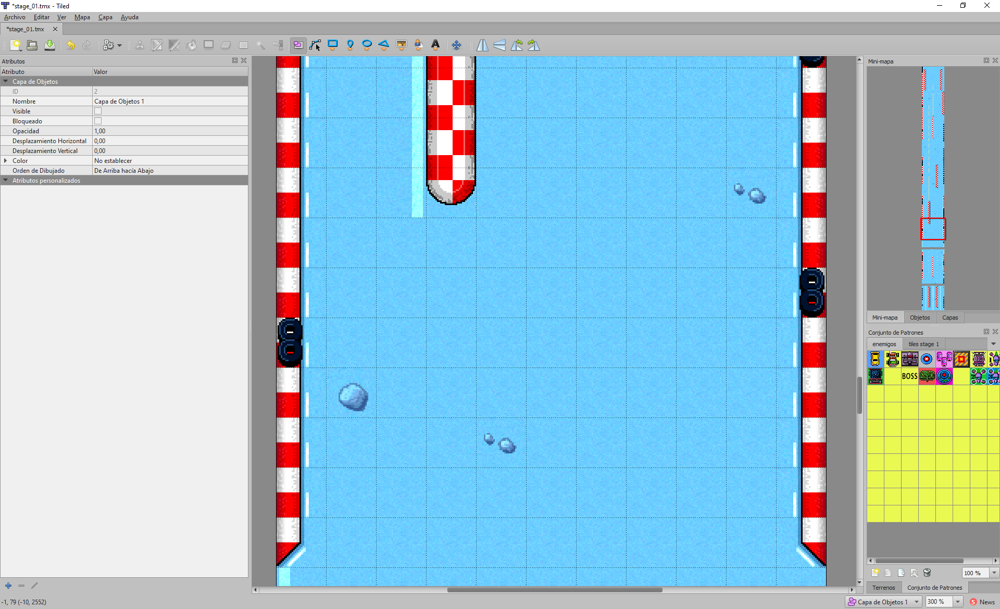

The TILESET is an image where we have small portions of graphs that measure the
same horizontally and vertically.

The methods available are:

function **AddLayer** (w, h) : pointer

Adds a layer with \<w\> cells horizontally and \<h\> cells vertically. The
function returns a Layer object.

function **GetNumLayers** () : int

Returns the number of layers created.

function **GetLayer** (ix) : pointer

Gets the layer with index \<ix\>. The parameter is an integer between 0 and
\*GetNumLayers-\*1.

function **RemoveLayer** (layer)

Removes a layer from the list. The \<layer\> parameter is a pointer to the
object.

function **ClearLayers** ()

Removes all existing layers.

function **AddTileSet** (path, tw, th, sw = 0, sh = 0, texw = 0, texh = 0) :
pointer

Create and add a TILESET. The \<path\> parameter is the path to the texture with
the graphics, \<tw\> is the horizontal size of each TILE or graphic portion,
\<th\> is the vertical size of each TILE, \<sw\> and \<sh\> indicate the
separation between tiles within the texture in horizontal and vertical. \<texw\>
and \<texh\> refer to the vertical and horizontal size of the texture to be
considered; if 0, the original size of the texture will be used.

function **GetNumTilesets** () : int

Gets the number of existing TILESETs.

function **GetTileset** (ix) : pointer

Gets the TILESET with index \<ix\>. Parameter \<ix\> an integer between 0 and
\*GetNumTilesets-\*1.

function **FindTileset** (path) : pointer

Searches for a TILESET by pathname. If it exists it will return a pointer to the
object, if it does not exist it will return NULL.

function **RemoveTileSet** (ts)

Remove the TILESET from the \<ts\> parameter which will be the pointer to the
object.

function **ClearTilesets** ()

Delete all created TILESETs.

function **SetTileW** (w)

Sets the default horizontal tile size.

function **GetTileW** () : int

Gets the default horizontal tile size.

function **SetTileH** (h)

Sets the default vertical tile size.

function **GetTileH** () : int

Gets the default vertical tile size.

function **SetWidth** (w)

Changes the number of grids horizontally for all layers.

function **GetWidth** () : int

Returns the number of horizontal grids for all layers.

function **SetHeight** (h)

Changes the number of vertical grids for all layers.

function **GetHeight** () : int

Returns the number of vertical grids for all layers.

function **GetCellFromPos** (x, y) : list

Given a position (x, y), return the cell at that position. The returned value
will be a list of two components: [cellX, cellY]. In case the position is
outside the range of the mapping, an empty list will be returned.

function **GetInfoFromPos** (x, y) : list

Data a position (x, y), it will return the information of the cell at that
position. The returned value shall be a list of three components:
[tilesetObject, tilesetIndex, flags].

The \<tilesetObject\> is the pointer to the TILESET object referenced by that
cell. The \<tilesetIndex\> refers to the TILE within that TILESET, it is an
integer. The \<flags\> indicate user information.

function **SetOffset** (x, y)

In the mapping display, the offset indicates from which pixel the mapping starts
to be displayed.

function **SetOffsetX** (x)

Sets the horizontal pixel from which to represent the cell mapping.

function **SetOffsetY** (y)

Sets the vertical pixel from which to represent the cell mapping.

function **GetOffsetX** () : int

Gets the horizontal pixel from which to represent the cell mapping.

function **GetOffsetY** () : int

Gets the vertical pixel from which to represent the cell mapping.

function **DrawTile** (ts, index, x, y, scale, colour)

Draws a TILE \<index\> from a TILESET \<ts\> at a screen position (x, y) with a
scale \<scale\> and a colour mix \<colour\>. This function is to be used from a
callback within the frame drawing.

**Interface for Layers**

| **Set** (i, j, ts, index, flags = 0) | Assign in cell (i, j) the tileset object \<ts\> using the index to the tile \<index\> and with user data \<flags\>. |
|--------------------------------------|---------------------------------------------------------------------------------------------------------------------|
| **Get** (i, j) : list                | Gets a list with [tileset, tileindex, flags].                                                                       |
| **FillTS** (ts, i, j, w, h)          | Fill an area from (i, j) with size (w, h) with a pointer to the tileset \<ts\>.                                     |
| **Fill** (index, i, j, w, h)         | Fills an area from (i, j) with size (w, h) with the tile value with index \<index\>.                                |
| **GetWidth** () : int                | Number of cells horizontally.                                                                                       |
| **GetHeight** () : int               | Number of cells in vertical.                                                                                        |
| **SetWidth** (w)                     | Sets the number of cells horizontally.                                                                              |
| **SetHeight** (h)                    | Sets the number of cells vertically.                                                                                |
| **SetSize** (w, h)                   | Set a new size (w, h).                                                                                              |
| **Clear** ()                         | Resets all cell contents to zero.                                                                                   |
| **AddSprite** (spr)                  | Add a Sprite to the layer.                                                                                          |
| **RemoveSprite** (spr)               | Removes a Sprite from the layer.                                                                                    |

**Interface for Tilesets**

| **GetTexture** () : pointer | Gets the pointer to the texture.                     |
|-----------------------------|------------------------------------------------------|
| **GetName** () : string     | Gets the path to the texture.                        |
| **GetTileW** () : int       | Indicates the size of the tile horizontally.         |
| **GetTileH** () : int       | Indicates the size of the tile in vertical.          |
| **GetNumTilesW** () : int   | Indicates the number of tiles horizontally.          |
| **GetNumTilesH** () : int   | Indicates the number of tiles vertically.            |
| **GetTexW** () : int        | Gets the texture size horizontally.                  |
| **GetTexH** () : int        | Gets the texture size vertically.                    |
| **SetTileW** (w)            | Sets the tile size to horizontal.                    |
| **SetTileH** (h)            | Sets the tile size to vertical.                      |
| **SetSepW** (w)             | Sets the horizontal tile spacing within the texture. |
| **SetSepH** (h)             | Sets the vertical tile spacing within the texture.   |
| **GetSepW** () : int        | Gets the horizontal tile spacing.                    |
| **GetSepH** () : int        | Gets the vertical tile spacing.                      |

## GL_Music and GL_Sound

These two types of objects allow you to work with audio files. Although the
interface is common to both, the difference lies in the way each one manages
audio playback. In the case of GL_Music, the audio is played in streaming, i.e.
the file is not loaded into memory in its entirety, it is read little by little.
This makes it possible to work with very large audio files and is often used for
playing music. In contrast, GL_Sound loads the entire audio file into memory.
The idea is to be able to launch the audio as fast as possible.

The methods available are:

function **Load** (path)

Loads an audio file and prepares it for playback. The file will be accessible
via the absolute or relative path \<path\>.

File types: WAV, OGG, MP3.

function **Play** ()

Starts with the playback of the audio file.

function **Stop** ()

Stops playback of the audio file.

function **SetLoop** (loop)

Sets whether to infinitely play the audio file or not. The \<loop\> parameter is
a value that may be true or false.

function **GetLoop** () : bool

Indicates whether infinite playback is active or not.

function **SetVolume** (vol)

Sets the volume level for the audio. The \<vol\> parameter shall be an integer
in the range 0 to 255.

function **GetVolume** () : int

Gets the volume level for the audio.

function **SetPitch** (pitch)

Sets a modification on the frequency/pitch of the associated audio. Default is
zero. The \<pitch\> parameter may see a positive or negative integer.

function **GetPitch** () : int

Gets the modification on the base frequency/tone of the audio.

function **SetPanning** (pan)

Sets the left/right balance level of the audio. The \<pan\> parameter will be an
integer in the range 0 to 255. The default is 127 which would be equivalent to
left/right balance.

function **GetPanning** () : int

Gets the balance level set for the audio.

function **SetOnStop** (ctx, function)

Allows you to hook a call that alerts you when the audio has finished playing or
has stopped playing.

function **IsPlaying** () : bool

Indicates whether the music is playing or not.

## GL_Route

A route is a type of object that has a series of nodes representing 2D or 3D
positions. Routes are mainly used to create cyclic or non-cyclic paths.

The methods available are:

function **AddNode** (x, y, z = 0) : pointer

Add a node with position (x, y, z).

function **InsertNode** (x, y, node) : pointer

Inserts a node (x, y) in front of another \<node\>. If \<node\> is NULL or does
not exist, the new node will be inserted at the end of the list.

function **InsertNode** (x, y, z, node) : pointer

Inserts a node (x, y, z) in front of another \<node\>. If \<node\> is NULL or
does not exist, the new node will be inserted at the end of the list.

function **FindNode** (x, y, z, eps = 0.0f) : pointer

Search the node list for the point (x, y, z) closest to the search radius
\<eps\>.

function **RemoveNode** (x, y, z, eps = 0.0f)

Deletes the first node in the list that is closest to (x, y, z) in the search
radius \<eps\>.

function **RemoveNode** (ix)

Deletes the list node with index \<ix\>.

function **ClearNodes** ()

Delete all nodes.

function **GetNumNodes** () : int

Returns the total number of nodes in the list.

function **FindSegment** (x, y, z, eps = 0.0f) : list

Searches for the nearest segment (two nodes) in the search radius \<eps\> to the
point (x, y, z). The returned list will have two pointers to node objects.

function **FindStart** (speed, mode) : pointer

Starts a route through the list of nodes. Progress along the route shall be at
\<speed\> and may be performed in the following \<mode\> modes:

| GL_Route.MODE_ENDFIX             | The route, once it reaches the last point, stays there.                                                                               |
|----------------------------------|---------------------------------------------------------------------------------------------------------------------------------------|
| GL_Route.MODE_LOOP               | The route once it reaches the last point starts again from the first.                                                                 |
| GL_Route.MODE_PINGPONG           | The route, once it reaches the last point, goes backwards to the first point and goes back to the last point, and so on indefinitely. |
| GL_Route.MODE_ENDFIX_AND_DESTROY | Once the route reaches the last point, it destroys it and ends.                                                                       |

function **FindNext** (pf) : bool

Go one step further along the route. In \<pf\> we will indicate the path
previously created with FindStart*.* As long as the path has not reached its
end, the function will return true. Once it reaches its end, the function will
return false.

function **FindEnd** (pf)

Ends a route and frees memory resources.

function **IncPos** (x, y, z = 0)

Increments by (x, y, z) the value of the coordinates of all inserted nodes.

function **AddCircle** (cx, cy, rad, step = 0.1f)

Add as many nodes as necessary to create a circle of centre (cx, cy) and radius
\<rad\>. The node density will be measured with the \<step\> parameter.

function **AddRect** (x, y, w, h, loop = true)

Add as many nodes as necessary to create a rectangle of position (x, y) and size
(w, h). By default the rectangle is created to be closed and get an infinite
path, however we can leave it open if we set \<loop\> to false.

## GL_Text

This control allows the representation of text within a delimited area. The
control inherits from GL_Sprite, so it implements or re-implements its
functionality.

The methods available are:

function **GetTextWidth** () : int

Indicates the width in pixels that the text occupies on the screen.

function **GetTextHeight** () : int

Indicates the height in pixels that the text occupies on the screen.

function **GetText** () : string

Gets the text string associated with the control.

function **SetText** (text)

Sets the text string associated with the control and displayed on the screen.

function **SetColor** (colour)

Sets the colour of the text.

function **SetFontName** (path)

Indicates the name of the font we want to use. The font name can be an absolute
or relative path. Supported file formats are: PNG, TTF, OTF.

function **GetFontName** () : string

Gets the name of the font.

function **SetFontSize** (size)

Sets the size of the font once it is displayed on the screen.

function **GetFontSize** () : int

Returns the font size used.

function **SetFont** (path, size)

Equivalent to applying a *SetFontName* and a *SetFontSize* at the same time.

function **SetAlign** (align)

Sets the type of alignment we want for the text within the drawing area. The
alignment can be a combination of the flags: DT_LEFT, DT_RIGHT, DT_TOP,
DT_BOTTOM, DT_CENTER, DT_VCENTER.

function **GetAlign** () : int

Gets the alignment used for the text.

function **SetFontSpacing** (hSpace, vSpace)

Sets additional letter spacing horizontally and vertically. With this function
we can adjust the default letter spacing style used by the font used.

function **SetFontBitmapProperties** (numX, numY, charStart)

In the case of using a bitmap font (PNG), after loading the texture, the number
of characters in horizontal \<numX\> and the number in vertical \<numY\> must be
indicated. The initial character \<charStart\> must also be specified.

## GL_Timer

A timer allows script code to be executed every so often.

The methods available are:

function **SetFrequency** (ms)

Sets the frequency in milliseconds \<ms\> at which the user call is invoked.

function **GetFrequency** () : int

Gets the number of milliseconds set to invoke the user call.

function **SetUserCallback** (ctx, function)

Sets the user call in context \<ctx\> and the function with name \<function\>.

## GL_Collider

A collider handles collisions between sprites.

The methods available are:

function **GetCollisionSides** (spr) : int

Checks for collisions of the Sprite \<spr\> with the collider. If there is a
collision, it will return a series of flags indicating which sides of the
rectangle have been affected:

function **SetCheckerObj** (spr)

Allows you to specify a Sprite as a check area.

function **GetCheckerObj** () : pointer

Gets the Sprite that serves as the check area. If none is assigned it will
return NULL.

function **SetCheckerRect** (x, y, w, h)

Allows you to specify a fixed rectangular area as a check area at position (x,
y) and size (w, h).

function **GetCheckerRect** () : list

Gets the static check area. If it exists, it will return a list with four
components: [x, y, w, h]. Otherwise, an empty list.

function **SetCheckType** (type)

Allows you to set the type of Sprite on which you want to detect collisions. See
function *GL_Sprite::SetType.*

function **SetMaxCollisions** (num)

Indicates the maximum number of collisions allowed at one time. When a collision
occurs, the user function is called. If we limit the number, only this number of
calls will be handled.

function **SetOnCollision** (ctx, function)

Sets the user callback triggered every time a collision occurs. In the function
we indicate the context \<ctx\> and the function name \<function\>.

## GL_Controller

A controller allows Sprites to be given movement in different modes.

The methods available are:

function **SetTarget** (target)

Sets the Sprite in which the controller will manage its movement.

function **GetTarget** () : pointer

Gets the Sprite being controlled.

function **SetSpeed** (speedX, speedY)

Sets the horizontal and vertical velocity, separately, to be applied to the
sprite's movement.

function **SetSpeed** (speed)

Sets the horizontal and vertical velocity, at the same time, to be applied to
the Sprite's movement.

function **SetSpeedX** (speed)

Sets the horizontal velocity to apply to the sprite's movement.

function **SetSpeedY** (speed)

Sets the vertical speed to apply to the sprite's movement.

function **GetSpeedX** () : float

Gets the horizontal velocity.

function **GetSpeedY** () : float

Gets the vertical speed.

function **GetDirX** () : float

Gets the current direction and speed of horizontal movement. This value can be
positive or negative, so we will know if it indicates left or right direction.

function **GetDirY** () : float

Gets the current direction and speed of vertical movement. This value can be
positive or negative, so we know whether it indicates up or down direction.

function **SetRoute** (route, mode)

Sets a route object \<route\> and a mode \<mode\> (see GL_Route::*FindStart) as
the* motion system to apply to the target Sprite. This call disables SetPad and
SetCustom.

function **SetOnEndRoute** (ctx, function)

Hooks a call to the function named \<function\> from the \<ctx\> context when
the path is finished.

function **SetPad** (pad)

Sets a virtual knob (GL_Pad) as the motion management mechanism for the Sprite.
This call disables SetRoute and SetCustom.

function **SetCustom** (ctx, function)

It establishes a user function as a motion management mechanism. This will be
invoked on a frame-by-frame basis, and from it the Sprite can be accessed to
apply the corresponding movement. This call disables SetRoute and SetPad.

function **GetX** () : float

Gets the X position of the motion controller.

function **GetY** () : float

Gets the Y position of the motion controller.

function **SetUpdateCallback** (ctx, function)

Establishes a subsequent call to the motion management that we have configured.
The function must have the prototype:

~~~~~~~~~~~~~~~~~~~~~~~~~~~~~~~~~~~~~~~~~~~~~~~~~~~~~~~~~~~~~~~~~~~~~~~~~~~~~~~~
function OnUpdateCallback (_controller);
~~~~~~~~~~~~~~~~~~~~~~~~~~~~~~~~~~~~~~~~~~~~~~~~~~~~~~~~~~~~~~~~~~~~~~~~~~~~~~~~

function **Undo** ()

Undoes the last movement update we have performed.

function **EnableLimits** (x, y, w, h)

Set the limits of movement. This will force that you can never leave the
rectangle created with position (x, y) and size (w, h).

function **DisableLimits** ()

Deactivate the movement limitation area.

## GL_Pad

A pad represents a virtual knob with which to capture the actions of input
devices and process them in our application through a common interface.

The methods available are:

function **SetButton** (butID, channel, mode, value)

Set the \<butID\> button to its channel \<channel\>. There is a maximum of 3
channels.

The available button IDs are:

| PAD_BUTTON_LEFT               | Left button     |
|-------------------------------|-----------------|
| PAD_BUTTON_RIGHT              | Right button    |
| PAD_BUTTON_UP                 | Button up       |
| PAD_BUTTON_DOWN               | Button down     |
| PAD_BUTTON_INSIDE             | Button inside   |
| PAD_BUTTON_OUTSIDE            | Button out      |
| PAD_BUTTON_1 to PAD_BUTTON_16 | Generic buttons |

The modes available are:

| PAD_BUTTON_KEYBOARD                          | Keyboard mapping   |
|----------------------------------------------|--------------------|
| PAD_BUTTON_MOUSE                             | Mouse mapping      |
| PAD_BUTTON_JOYSTICK1 to PAD_BUTTON_JOYSTICK4 | Mapping a joystick |

The \<value\> parameter depends on the mode used. In the case of the keyboard,
you can indicate the key you want to map, for example: KEY_A (see appendix
Keyboard Constants).

For the mouse, you can specify: MOUSE_LEFT, MOUSE_RIGHT, MOUSE_MIDDLE,
MOUSE_DBL_LEFT, MOUSE_DBL_RIGHT.

In the case of the joystick, an integer number shall be indicated which
identifies the button according to the manufacturer. The number generally starts
at zero.

function **GetButtonMode** (butID, channel) : int

Given the button ID \<butID\> and the channel \<channel\> we will get the
assigned mode.

function **GetButtonValue** (butID, channel) : int

Given the button ID \<butID\> and the channel \<channel\> we will get the
assigned value.

function **IsButton** (butID) : bool

Allows to know if a button is pressed or not.

# Using VR-SCRIPT to generate ASM code

To convert VR-SCRIPT to native code of a CPU, e.g. a Z80/R800 or a MOS, the "AS"
tool is used. Information on the use of this tool can be found in the VR-DOS
commands.

The way to write VR-SCRIPT code to use this tool is somewhat more restrictive
than what we have seen so far. It is necessary to establish the types of
variables, constants, functions and parameters, as well as having to give access
to the prototypes of the external functions (other modules) that you want to
use. In that sense, it would be a matter of working in the same way as we would
do with a conventional C/C++ compiler.

Concepts:

| ENVIRONMENT     | It refers to whether the program to be created is for MSX or SPECTRUM or COMMODORE or for an MSX ROM with KonamiSCC mapper or an MSX-DOS program for MSX, etc. An environment refers not only to a system with its CPU and dedicated hardware, but also to the different operating systems or applications where it will run. |
|-----------------|-------------------------------------------------------------------------------------------------------------------------------------------------------------------------------------------------------------------------------------------------------------------------------------------------------------------------------|
| CRT             | This is the code used to start our application. It is the entry point (depending on the type of environment) and from here everything necessary to be able to execute what would be our "main" (the entry point of the programme) is initialised.                                                                             |
| LIBRARY         | A set of functions, generic or not, that serve to assist in the creation and management of our programme.                                                                                                                                                                                                                     |
| DESTINATION CPU | Refers to the CPU for which we want to convert the script code. In the conversion of the script code, native ASM code will be generated, which will require compiling and finally linking to generate a final binary that can be understood by this CPU.                                                                      |
| BANKS           | The concept of a bank refers to a block of code, usually 8192 bytes (8 Kb), although it may be other sizes, which allows the distribution of code and/or data outside the addressing area of the target CPU.                                                                                                                  |

The process of generating the final binary would be:

| 0 | SOURCE FILES  | These would be .ASM, .PI, .LIB files. All of them make up the code that we will use to create our programme. Among them we will have one that will be the CRT. |
|---|---------------|----------------------------------------------------------------------------------------------------------------------------------------------------------------|
| 1 | PREPROCESSING | In the case of script (.PI) files, it will be necessary to convert them to .ASM files of the target CPU.                                                       |
|   | COMPILED      | Once we have all the source files generated (they will all be .ASM files), they will be compiled to generate an object (.O) file.                              |
|   | LINKED        | The object files will be linked, resolving addresses and labels, to generate a final resulting binary.                                                         |

Example of CRT:

~~~~~~~~~~~~~~~~~~~~~~~~~~~~~~~~~~~~~~~~~~~~~~~~~~~~~~~~~~~~~~~~~~~~~~~~~~~~~~~~
class MSX_CRT_ROM_ASCII8
{
	externals:
		function Init() : void;

	function _main() : void
	{
		native
		{
			.romheader

			// ASCII 8 MAPPER
			ld a, 0
			ld (0x6000), a 	
			ld a, 1
			ld (0x6800), a			
			ld a, 2
			ld (0x7000), a			
			ld a, 3
			ld (0x7800), a			
			//clear RAM (first 4kb only)    
			ldbc	, 1024*4
			ldhl	, 0xc000
			ldde	, 0xc001
			ld	(hl),0
			ldir
			di
			im1
			ldsp	, 0xF380
			ei
			call Init
		}
	}
}
~~~~~~~~~~~~~~~~~~~~~~~~~~~~~~~~~~~~~~~~~~~~~~~~~~~~~~~~~~~~~~~~~~~~~~~~~~~~~~~~

In the example above, we specified that the Init function has a specific
prototype and that it is outside that script. In our case, **Init** would be the
entry point of our program.

If we want to use another name instead of Init, there would be no problem to do
so.

In this case, in this CRT, 16 bytes are created that make up the header of an
MSX ROM. This is done with the reserved word **.romheader**. Therefore, the
first 16 bytes of our binary will be the header containing the values:

~~~~~~~~~~~~~~~~~~~~~~~~~~~~~~~~~~~~~~~~~~~~~~~~~~~~~~~~~~~~~~~~~~~~~~~~~~~~~~~~
41 42 10 40 00 00 00 00 00 00 00 00 00 00 00 00
~~~~~~~~~~~~~~~~~~~~~~~~~~~~~~~~~~~~~~~~~~~~~~~~~~~~~~~~~~~~~~~~~~~~~~~~~~~~~~~~

The 0x41 and 0x42 is a flag for the MSX BIOS to recognise that there is a
cartridge in there. The next 16 bits are the start address, in this case 0x4010.
Here we say, that in this case it is 0x4010 (hexadecimal) because we are going
to tell the linker to use 0x4000 as the starting address for the code and 0xC000
for RAM (variables). If we tell the linker that we want to place the code in
another address, **.romheader** will take this into account.

Each CRT has to initialise what is necessary to create and fit the required
environment.

Once we have the necessary CRT, we will need the functions for our program to do
the relevant things. It is normal to have functions that are common between
different programs: we can have these functions in a library. The good thing
about a library is that you don't have to recompile it every time. However, it
is not compulsory to have a library: we can have all the necessary sources and
compile them every time we want to generate the final binary.

An example of a tool call to generate a binary would be:

~~~~~~~~~~~~~~~~~~~~~~~~~~~~~~~~~~~~~~~~~~~~~~~~~~~~~~~~~~~~~~~~~~~~~~~~~~~~~~~~
as /CODE 0x4000 /DATA 0xC000 /SIZE 256K /OUT game.rom msx_crt.pi msxlib.pi wyz_psg_version_2.asm game.pi
~~~~~~~~~~~~~~~~~~~~~~~~~~~~~~~~~~~~~~~~~~~~~~~~~~~~~~~~~~~~~~~~~~~~~~~~~~~~~~~~

We can add as many PIs as ASMs as LIBs we require. The important thing is to
take into account the order, as this is how they will be distributed in the
addressing space: that is why it is important that the first one in that order
is the CRT.

In fact, we could have everything in a single file. Let's look at this example:

~~~~~~~~~~~~~~~~~~~~~~~~~~~~~~~~~~~~~~~~~~~~~~~~~~~~~~~~~~~~~~~~~~~~~~~~~~~~~~~~
.CPU MOS6510
.ORG 0x0801
.db 0x0C
.db 0x0C, 0x08, 0x0A, 0x00, 0x9E, 0x20
.db 0x34, 0x30, 0x39, 0x36, 0x00, 0x00, 0x00
.db 0x00
Start in 0x1000
.ds (0x1000 - $), 0xFF
start:
	lda #17				
	sta 53272; POKE 53272,23 :REM LOWER/UPPER CASE MODE
	ldx #0x00					
loop: 
	lda message,x					
	jsr 0xFFD2
	inx						
	cpx #0x0c						bne loop							rts
message:
	.petsciiz "Hello World!"
~~~~~~~~~~~~~~~~~~~~~~~~~~~~~~~~~~~~~~~~~~~~~~~~~~~~~~~~~~~~~~~~~~~~~~~~~~~~~~~~

This ASM program is for the Commodore 64 CPU, the MOS6510. The program is a
simple "Hello World" and the environment is a C64 BASIC program. C64 BASIC
programs are located at address 0x801. They also require a header.

In this case, from the VR-DOS console we would do:

~~~~~~~~~~~~~~~~~~~~~~~~~~~~~~~~~~~~~~~~~~~~~~~~~~~~~~~~~~~~~~~~~~~~~~~~~~~~~~~~
as /OUT hello.prg hello.asm
~~~~~~~~~~~~~~~~~~~~~~~~~~~~~~~~~~~~~~~~~~~~~~~~~~~~~~~~~~~~~~~~~~~~~~~~~~~~~~~~

Include external module headers

We can make use of or reference functions found in other script files. Let's
look at an example:

~~~~~~~~~~~~~~~~~~~~~~~~~~~~~~~~~~~~~~~~~~~~~~~~~~~~~~~~~~~~~~~~~~~~~~~~~~~~~~~~
class Game partial Game_H, Player_H, Title_H, Outro_H
{
}
~~~~~~~~~~~~~~~~~~~~~~~~~~~~~~~~~~~~~~~~~~~~~~~~~~~~~~~~~~~~~~~~~~~~~~~~~~~~~~~~

In the Game.pi script, we make use of existing functions in other scripts such
as Player.pi, Title.pi and Outro.pi.

Using partial, what we do is to include the existing code in the files
Game_H.pi, Player_H.pi, Title_H.pi and Outro_H.pi. Let's see what's in
Player_H.pi for example:

~~~~~~~~~~~~~~~~~~~~~~~~~~~~~~~~~~~~~~~~~~~~~~~~~~~~~~~~~~~~~~~~~~~~~~~~~~~~~~~~
class Player_H
{
	defines:
		MAX_PLAYER_SPEED : int = 2;
		DEF_PLAYER_SPEED : int = 4;
		MAX_PLAYER_LIVES : int = 3;
		DEF_PLAYER_LIVES : int = 3;
		MAX_STAGE : int = 5;
	externals:
		g_playerSpeed : ubyte;
		g_playerPower : ubyte;
		g_playerScore : uint;
		g_playerHiScore : uint;
		g_playerNextLife : uint;
		g_playerStage : ubyte;
		g_playerLives : ubyte;
	#metadata _BANK_CODE
	function Player_Init (_mai : pointer(MapActorInfo)) : pointer(GameActor);
	function Player_AddScore(_sc : uint) : void;
	function Player_NextStage() : void;
	#metadata
}
~~~~~~~~~~~~~~~~~~~~~~~~~~~~~~~~~~~~~~~~~~~~~~~~~~~~~~~~~~~~~~~~~~~~~~~~~~~~~~~~

In this case, Player_H.pi includes the public prototypes we defined in
Player.pi, plus constants and references to variables.

The **\#metadata** directive in this case allows you to provide information to
the transcompiler that converts script to assembler. In this case, by doing
\_BANK_CODE you are indicating that the prototypes declared in that section are
stored in a special area to be accessed by a bank switching mechanism.

Mandatory mathematical libraries

The transcompiler that converts the script code to assembler assumes that a
number of such functions will exist for the linker:

~~~~~~~~~~~~~~~~~~~~~~~~~~~~~~~~~~~~~~~~~~~~~~~~~~~~~~~~~~~~~~~~~~~~~~~~~~~~~~~~
function _mul_u8_u8 () : ushort
function _mul_s8_s8 () : short
function _mul_u16_u8 () : ushort
function _mul_s16_s8 () : short
function _mul_u16_u16 () : ulong
function _mul_s16_s16 () : long
function _div_u8_u8 () : ubyte
function _div_s8_s8 () : ushort
function _div_u16_u8 () : ushort
function _div_s16_s8_s8 () : ushort
function _div_u16_u16 () : ushort
function _div_s16_s16_s16 () : ushort
function _div_u32_u8 () : ulong
function _div_s32_s8 () : ulong
function _div_u32_u16 () : ushort
function _add_u32_u32 (_a : long, _b : long) : long
~~~~~~~~~~~~~~~~~~~~~~~~~~~~~~~~~~~~~~~~~~~~~~~~~~~~~~~~~~~~~~~~~~~~~~~~~~~~~~~~

In addition to these, there will be others related to floating numbers and bit
and sign combinations to address complex operations not directly supported by
the target CPU.

These functions will generally be found next to the library of each programming
environment.

Specify types

It is absolutely necessary to specify types in:

-   Constants

-   Variables

-   Return values in function

-   Parameters of the functions

It must also be specified in any reference to a data type.

Reference to external data files

We can directly include embedded data from external files as follows:

~~~~~~~~~~~~~~~~~~~~~~~~~~~~~~~~~~~~~~~~~~~~~~~~~~~~~~~~~~~~~~~~~~~~~~~~~~~~~~~~
class Resources
{
  #metadata _BANK_DATA
  constants:
    [rsc_bmp_stage_1 : list(ubyte) = @"dat/rsc_bmp_stage_1.dat"@];
    rsc_bmp_stage_2 : list(n) = @"dat/rsc_bmp_stage_2.dat"@]; 
  #metadata
}
~~~~~~~~~~~~~~~~~~~~~~~~~~~~~~~~~~~~~~~~~~~~~~~~~~~~~~~~~~~~~~~~~~~~~~~~~~~~~~~~

In this way, we can access this data at a later date. For example:

~~~~~~~~~~~~~~~~~~~~~~~~~~~~~~~~~~~~~~~~~~~~~~~~~~~~~~~~~~~~~~~~~~~~~~~~~~~~~~~~
Bitmap_Load (_bank(rsc_bmp_stage_2), rsc_bmp_stage2, 0, VDP_LOAD_ALLBANKS); 
~~~~~~~~~~~~~~~~~~~~~~~~~~~~~~~~~~~~~~~~~~~~~~~~~~~~~~~~~~~~~~~~~~~~~~~~~~~~~~~~

The reserved word **\_bank** allows to know the bank where a certain variable is
stored.

The variable label shall indicate the address where it is accessed with
instructions from the target CPU.

Inline assembler

We can integrate assembler directly into the script code by using the **native**
reserved word. Examples:

~~~~~~~~~~~~~~~~~~~~~~~~~~~~~~~~~~~~~~~~~~~~~~~~~~~~~~~~~~~~~~~~~~~~~~~~~~~~~~~~
function BIOS_SetVBlankHook (_f : pointer) : void
{
	native
	{
		LDA	, 0xC3
		LDL	, 4(ix)
		LD H, 5(ix)
		DI
		LD	(0xFD9F), A
		LD	(0xFDA0), HL
		EI
	}
}
~~~~~~~~~~~~~~~~~~~~~~~~~~~~~~~~~~~~~~~~~~~~~~~~~~~~~~~~~~~~~~~~~~~~~~~~~~~~~~~~

~~~~~~~~~~~~~~~~~~~~~~~~~~~~~~~~~~~~~~~~~~~~~~~~~~~~~~~~~~~~~~~~~~~~~~~~~~~~~~~~
function BIOS_GetCharSet() : ubyte
{
	native
	{
		ld hl, 0x002B
		ld a, (hl)
		and a, 0x0F
		ld l, a
	}
	#pragma errorifnoreturntype=off
	return;
	#pragma errorifnoreturntype=on
} 
~~~~~~~~~~~~~~~~~~~~~~~~~~~~~~~~~~~~~~~~~~~~~~~~~~~~~~~~~~~~~~~~~~~~~~~~~~~~~~~~

By using the \#pragma above we avoid errors by exiting the function without
returning a value; it is actually returned in the L register, but the
transcompiler does not detect this and so this exception has to be flagged.

Access to parameters from native language with Z80/R800

The parameters are accessed using indexing register IX. From offset 4 onwards,
the various parameters are accessed. The stack is thus found when entering a
function with parameters:

| …       | …                                                               |
|---------|-----------------------------------------------------------------|
| 4(ix)   | From here, we access the parameters of the function (if any)    |
| 3(ix)   | IX High                                                         |
| 2(ix)   | IX Low (backup of IX, to recover it after exiting the function) |
| 1(ix)   | PC high                                                         |
| 0(ix)   | PC low (return address after exiting the function)              |
| \-1(ix) | From here, reserved for local variables (if any)                |
| …       | …                                                               |

Return of values in function from native language with Z80/R800

| **Data size** | **Register** |
|---------------|--------------|
| 8             | L            |
|               | HL           |
|               | DE:HL        |

# Programming the V9968

The V9968 refers to a hypothetical chip, which does not exist as real hardware,
but has been synthesised by software to allow a "reasonable" evolution of the
version of the video chip used in the more advanced models of the MSX family.
The V9968 is compatible with the V9958 and adds the following improvements:

-   Up to 16Mb of VRAM (24-bit addressing).

-   Up to 256 pages SCREEN 8/10/12/13.

-   Registers \#35, \#39, \#43 have been extended to support 16 bits.

-   VDP Chip ID = 3 (Status Register \#1 - Bits 1-5).

-   24-bit colour palette, RGB888.

-   New register \#48 to complete the PNT address with 24 bits.

-   New 80x24 multicolour text display mode.

-   New 256x212 bitmap display mode 256 colour palette of 16M.

# Programming the R8000

The R8000 refers to a hypothetical chip, not existing as real hardware, which
has been synthesised in software to offer Z80/R800 compatibility as well as new
features:

-   New TRAP instruction. Encoding: ED FD nn nn. Size: 4 bytes.

The TRAP function allows calls to be made inside and outside the virtual machine
environment with the intention of accessing special features of the MSXVR
system. Depending on the 16-bit value specified in the instruction and the value
of certain Z80/R800 registers, the following functionalities are available:

| 0000 | Apply a Breakpoint.                                               |
|------|-------------------------------------------------------------------|
| 0001 | Detect whether it is an MSXVR or not.                             |
| 0002 | Change the behaviour of the MSX Slot to MSXVR mode or vice versa. |
| 0003 | Invoke a native VR-SCRIPT function.                               |
| 0004 | DB37 port handling.                                               |
| 0005 | On/Off LEDS.                                                      |
| 0006 | Activate/Deactivate Remote Control.                               |

**0000** - Apply a breakpoint

Stops the execution of the virtual machine and launches the debugger.

Example:

~~~~~~~~~~~~~~~~~~~~~~~~~~~~~~~~~~~~~~~~~~~~~~~~~~~~~~~~~~~~~~~~~~~~~~~~~~~~~~~~
trap 0x0000
~~~~~~~~~~~~~~~~~~~~~~~~~~~~~~~~~~~~~~~~~~~~~~~~~~~~~~~~~~~~~~~~~~~~~~~~~~~~~~~~

**0001** - Detect whether it is an MSXVR or not.

It allows us to know if we are in an MSXVR or not by looking at the Z flag. Once
the instruction is finished, if Z is active, we are in a MSXVR.

Example:

~~~~~~~~~~~~~~~~~~~~~~~~~~~~~~~~~~~~~~~~~~~~~~~~~~~~~~~~~~~~~~~~~~~~~~~~~~~~~~~~
trap 0x0001
call z, OnMSXVRMode 			
~~~~~~~~~~~~~~~~~~~~~~~~~~~~~~~~~~~~~~~~~~~~~~~~~~~~~~~~~~~~~~~~~~~~~~~~~~~~~~~~

**0002** - Change the behaviour of the MSX Slot to MSXVR mode or vice-versa

Assign the **mode of SLOT**, MSX or MSXVR. We will use the low four bits of
register A to determine this. If register A=0, we will use MSX mode, and if
A\<\>0, MSXVR mode. At the end of the instruction, if Z is active, the MSXVR
slot mode has been set.

Example where we configure the slot in MSXVR mode:

~~~~~~~~~~~~~~~~~~~~~~~~~~~~~~~~~~~~~~~~~~~~~~~~~~~~~~~~~~~~~~~~~~~~~~~~~~~~~~~~
ld a, 1
trap 0x0002	
~~~~~~~~~~~~~~~~~~~~~~~~~~~~~~~~~~~~~~~~~~~~~~~~~~~~~~~~~~~~~~~~~~~~~~~~~~~~~~~~

**0003** - Invoke a native VR-SCRIPT function

Calling a function from a VR-SCRIPT context. In our virtual machine, we must
have established both the context and the function to invoke. After the return
of this function, any flag or register could have been modified.

See *VirtualMachineController::SetCPUNativeCallback.*

Example of the use of the Native function:

~~~~~~~~~~~~~~~~~~~~~~~~~~~~~~~~~~~~~~~~~~~~~~~~~~~~~~~~~~~~~~~~~~~~~~~~~~~~~~~~
class Example implements DOS_Program
{
	virtual Start()
	{
		_msx = GetEngine().CreateVirtualMachine("msx1");
		_msx.InsertCartridge(0, "skyjaguar2/game.rom", "dvg1");
		_msx.SetCPUNativeCallback(this, "OnNativeCB");
	}
	function OnNativeCB()
	{
		GetEngine(). LogVerbose("NATIVE CALL!!");
	}
}
~~~~~~~~~~~~~~~~~~~~~~~~~~~~~~~~~~~~~~~~~~~~~~~~~~~~~~~~~~~~~~~~~~~~~~~~~~~~~~~~

When in the game.rom code we invoke "trap 0x0003" the OnNativeCB function will
be called.

**0004** - DB37 port tampering

It covers all operations related to this port.

A = function code

A = 0, 32-bit address (0=output, 1=input)

A = 1, Pull-ups of the 32 bits (0=no, 1=yes)

A = 2, 32-bit read

A = 3, 32-bit write

HL = low 16 bits

DE = 16 bits high

**0005** - On/Off LEDS

Allows the user LEDs to be switched on and off. To do this we will use each bit
of register A. If the bit is 0 it will be turned off and if the bit is 1 it will
be turned on. The order of the bits corresponds to the order from left to right
of the LEDs.

Example where we turn on all the LEDs:

~~~~~~~~~~~~~~~~~~~~~~~~~~~~~~~~~~~~~~~~~~~~~~~~~~~~~~~~~~~~~~~~~~~~~~~~~~~~~~~~
ld a, 255
trap 0x0005
~~~~~~~~~~~~~~~~~~~~~~~~~~~~~~~~~~~~~~~~~~~~~~~~~~~~~~~~~~~~~~~~~~~~~~~~~~~~~~~~

**0006** - Enable/Disable Remote Control

Enables or disables the remote control (REM) by looking at the value of register
A. If the register is 0, it will turn the remote control off, and if it is other
than 0, it will turn it on.

Example where we turn off the remote control:

~~~~~~~~~~~~~~~~~~~~~~~~~~~~~~~~~~~~~~~~~~~~~~~~~~~~~~~~~~~~~~~~~~~~~~~~~~~~~~~~
ld a, 0
trap 0x0006
~~~~~~~~~~~~~~~~~~~~~~~~~~~~~~~~~~~~~~~~~~~~~~~~~~~~~~~~~~~~~~~~~~~~~~~~~~~~~~~~

**0007** - Get the language

Allows to obtain the code of the language selected in the system. The value is
obtained from the HL register. The language codes are:

| 0 | English EN |
|---|------------|
| 1 | English GB |

# Native API functions

VR-SCRIPT makes use of functions created to perform all kinds of actions. These
cover a wide range of possibilities and allow different types of data,
structures and objects to be handled.

These functions may or may not return a value. The way to invoke them is:

value = \<function_name\>(arguments);

Or:

\<function_name\>(arguments)

Arguments are a series of expressions or values separated by commas. It is also
possible that the function does not require arguments; in that case, none would
be passed:

\<function_name\>()

Examples:

~~~~~~~~~~~~~~~~~~~~~~~~~~~~~~~~~~~~~~~~~~~~~~~~~~~~~~~~~~~~~~~~~~~~~~~~~~~~~~~~
_a = "5";
_a = int(_a);
_str = "The dinosaur is a prehistoric being";
_ix = String_Find(_str, "being");
~~~~~~~~~~~~~~~~~~~~~~~~~~~~~~~~~~~~~~~~~~~~~~~~~~~~~~~~~~~~~~~~~~~~~~~~~~~~~~~~

The following will list and detail the different functions that exist in the
Native API. Unless strictly necessary, it is always recommended to use VR-ENGINE
level objects and classes to work with textures, files, databases, etc. instead
of their native API functions. The interface that is created at the VR-ENGINE
level is always the most appropriate and uses the Native API in an optimal and
safe way. The equivalent could be the MSX BIOS. On MSX it is recommended to use
the BIOS to access the VDP, PSG, etc. as bypassing the BIOS and directly
accessing the hardware (in our case the Native API), could incur
incompatibilities with other machines.

## Casting

Functions related to data type conversion.

function **bool** (x) : bool

Converts the type of the value passed in \<x\> to bool.

| TYPE of \<x\>              | RESULT                                                                                                                                                                                                                                                  |
|----------------------------|---------------------------------------------------------------------------------------------------------------------------------------------------------------------------------------------------------------------------------------------------------|
| String                     | When \<x\> is "true" the result shall be true, and when \<x\> is "false" the result shall be false. In any other case, the string shall be converted to an integer, and if the value is non-zero it shall be considered true, and if it is zero, false. |
| Numeric, Pointer or Object | When \<x\> is non-zero, the result is true, otherwise the result is false.                                                                                                                                                                              |
| List                       | The result will always be false.                                                                                                                                                                                                                        |

function **byte** (x) : byte

Converts the type of the value passed in \<x\> to byte.

| TYPE of \<x\>              | RESULT                                                                                                                                                                                                                                                   |
|----------------------------|----------------------------------------------------------------------------------------------------------------------------------------------------------------------------------------------------------------------------------------------------------|
| String                     | Whenever the value of \<x\> contains a string representing a number, that value is returned in byte format. This involves converting the string to a number and keeping the least significant 8 bits. If the string is not a number, 0 will be returned. |
| Numeric, Pointer or Object | The value of \<x\> shall be set to the byte type by keeping always the least significant 8 bits.                                                                                                                                                         |
| List                       | The result will always be 0.                                                                                                                                                                                                                             |

function **ubyte** (x) : ubyte

Converts the type of the value passed in \<x\> to unsigned byte.

The operation is identical to that of the *byte* function*,* but results in the
type "unsigned byte".

function **short** (x) : short

Converts the type of the value passed in \<x\> to short.

The operation is identical to that of the *byte* function*,* but results in the
"short" type, which allows 16-bit signed numbers to be represented.

function **ushort** (x) : ushort

Converts the type of the value passed in \<x\> to unsigned short.

The operation is identical to that of the *byte* function, but results in the
"unsigned short" type, which allows 16-bit unsigned numbers to be represented.

function **int** (x) : int

Converts the type of the value passed in \<x\> to int.

The operation is identical to that of the *byte* function*,* but results in the
type "int", which allows the representation of 32-bit signed numbers.

function **uint** (x) : uint

Converts the type of the value passed in \<x\> to unsigned int.

The operation is identical to that of the *byte* function*,* but results in the
"unsigned int" type, which allows 32-bit unsigned numbers to be represented.

function **long** (x) : long

Converts the type of the value passed in \<x\> to long.

The operation is identical to that of the *byte* function*,* but results in the
"long" type, which allows 64-bit signed numbers to be represented.

function **ulong** (x) : ulong

Converts the type of the value passed in \<x\> to unsigned long.

The operation is identical to that of the *byte* function*,* but results in the
type "unsigned long", which allows 64-bit unsigned numbers to be represented.

function **float** (x) : float

Converts the type of the value passed in \<x\> to float (simple decimal number).

The operation is identical to that of the *byte* function*,* but results in the
"float" type, which allows 32-bit floating point numbers to be represented.

function **double** (x) : double

Converts the type of the value passed in \<x\> to double (double decimal
number).

The operation is identical to that of the *byte* function*,* but results in the
type "double", which allows 64-bit floating point numbers to be represented.

function **string** (x) : string

Converts the value passed in \<x\> to the string type.

| TYPE of \<x\>              | RESULT                                                                  |
|----------------------------|-------------------------------------------------------------------------|
| Numeric, Pointer or Object | Converts the value into its digit-by-digit ASCII string representation. |
| List                       | Converts the list into an ASCII version of its entire contents.         |
| Bool                       | If true it will return "true" and if false it will return "false".      |

Examples:

~~~~~~~~~~~~~~~~~~~~~~~~~~~~~~~~~~~~~~~~~~~~~~~~~~~~~~~~~~~~~~~~~~~~~~~~~~~~~~~~
_str = string(5);
~~~~~~~~~~~~~~~~~~~~~~~~~~~~~~~~~~~~~~~~~~~~~~~~~~~~~~~~~~~~~~~~~~~~~~~~~~~~~~~~

\_str shall be worth "5".

~~~~~~~~~~~~~~~~~~~~~~~~~~~~~~~~~~~~~~~~~~~~~~~~~~~~~~~~~~~~~~~~~~~~~~~~~~~~~~~~
_str = string([5, 6, "hello", -5.5]);
~~~~~~~~~~~~~~~~~~~~~~~~~~~~~~~~~~~~~~~~~~~~~~~~~~~~~~~~~~~~~~~~~~~~~~~~~~~~~~~~

\_str will be "[5, 6, "hello", -5.5]".

~~~~~~~~~~~~~~~~~~~~~~~~~~~~~~~~~~~~~~~~~~~~~~~~~~~~~~~~~~~~~~~~~~~~~~~~~~~~~~~~
_str = string(true);
~~~~~~~~~~~~~~~~~~~~~~~~~~~~~~~~~~~~~~~~~~~~~~~~~~~~~~~~~~~~~~~~~~~~~~~~~~~~~~~~

\_str shall be true.

## Mathematics

Functions related to the mathematical field.

function **abs** (x) : float

Absolute value of \<x\>.

function **acos** (x) : float

Arccosine of \<x\> in radians.

function **asin** (x) : float

Arcsine of \<x\> in radians.

function **atan** (x) : float

Arcotangent of \<x\> in radians.

function **atan2** (y, x) : float

Two-parameter arctangent. It returns, expressed in radians, the angle formed
between the positive X axis and the line connecting the origin with a point of
coordinates (x,y) ≠ (0,0) in the Euclidean plane.

function **ceil** (x) : float

Round up the number \<x\> to the nearest integer.

function **floor** (x) : float

Round down the number \<x\> to the nearest integer.

function **clamp** (x, min, max) : float

Adjusts the value of \<x\>, if necessary, to ensure that its value is always
between the minimum \<min\> and the maximum \<max\>. If the value of \<x\> is
less than \<min\>, \<min\> shall be returned, and if the value of \<x\> is
greater than \<max\>, \<max\> shall be returned.

function **cos** (x) : float

Cosine of \<x\> in radians.

function **degtorad** (x) : float

Converts the value expressed in degrees from \<x\> to radians.

function **radtodeg** (x) : float

Converts the radian value of \<x\> to degrees.

function **dim** (x, y = 0) : list

Resizes a list. Allows you to create lists of lists according to the dimensions
set in the \<x\> argument. This list is initialised with the value specified in
\<y\>. If no value is specified, it is considered to be zero.

Example:

~~~~~~~~~~~~~~~~~~~~~~~~~~~~~~~~~~~~~~~~~~~~~~~~~~~~~~~~~~~~~~~~~~~~~~~~~~~~~~~~
_ret = dim([5, 3], 8);
~~~~~~~~~~~~~~~~~~~~~~~~~~~~~~~~~~~~~~~~~~~~~~~~~~~~~~~~~~~~~~~~~~~~~~~~~~~~~~~~

That would make \<_ret\> a two-dimensional list. It would be similar to doing in
C something like: int \_ret[5][3] = {8};

function **exp** (x) : float

Exponential of the number \<x\>.

function **frand** (x, y) : float

Random number generated between \<x\> and \<y\>. The type of the returned value
is \<float\>.

function **rand** (arg0, arg1) : int

Random number generated between \<x\> and \<y\>. The type of the returned value
is \<int\>.

function **isnan** (x) : bool

Indicates whether the number is valid or mathematically undefined.

function **log** (x) : float

Natural logarithm (in base e) of the number \<x\>.

function **log10** (x) : float

Logarithm in base 10 of the number \<x\>.

function **range** (x, y, step = 1) : list

Gets a list containing the numbers between \<x\> and \<y\> with step specified
in the \<step\> argument.

Example:

~~~~~~~~~~~~~~~~~~~~~~~~~~~~~~~~~~~~~~~~~~~~~~~~~~~~~~~~~~~~~~~~~~~~~~~~~~~~~~~~
_ret = range(3, 8, 2);
~~~~~~~~~~~~~~~~~~~~~~~~~~~~~~~~~~~~~~~~~~~~~~~~~~~~~~~~~~~~~~~~~~~~~~~~~~~~~~~~

It would make \<_ret\> worth: [3, 5, 7]

function **pow** (x, y) : float

Calculate the power of the base \<x\> raised to the exponent \<y\>.

function **round** (x) : int

Round up an integer \<x\>. Equivalent to the *ceil* function.

function **sign** (x) : float

Returns the sign of a number \<x\>. If positive it will return 1 and if negative
it will return -1. If \<x\> is 0, it will also return 0.

function **sin** (x) : float

Sine of \<x\> in radians.

function **slerp** (min, max, t) : float

Returns a value between \<min\> and \<max\> depending on the factor \<t\>. The
factor \<t\> shall be a value between 0 and 1. Therefore, if \<t\> = 0, it shall
return \<min\>, and if \<t\> = 1, it shall return \<max\>.

function **sqrt** (x) : float

Square root of \<x\>.

function **srand** (x)

Seed for random number generation. Depending on this \<x\> value, calls to rand
and *frand will be* affected.

function **tan** (x) : float

Tangent of \<x\> in radians.

## Advanced Mathematics 2D and 3D

A set of mathematical functions, with a more advanced character, which serve as
an aid in both two-dimensional and three-dimensional computer graphics.

function **AngleSlerp** (from, to, delta) : float

Gets the angle in radians, interpolated between \<from\> and \<to\> according to
\<delta\>, which may be a value between 0 and 1. If \<delta\> is zero, it
returns the value of \<from\> and if \<delta\> is one, it returns the value of
\<to\>. If \<delta\> is 0.5, it returns (\<to\>-\<from\>)/2.

function **AngleXBetweenLines** (x1, y1, z1, x2, y2, z2) : float

Determine the X component of the angle between two vectors (x1,y1,z1) and
(x2,y2,z2).

function **AngleYBetweenLines** (x1, y1, z1, x2, y2, z2) : float

Determine the Y component of the angle between two vectors (x1,y1,z1) and
(x2,y2,z2).

function **AngleZBetweenLines** (x1, y1, z1, x2, y2, z2) : float

Determine the Z component of the angle between two vectors (x1,y1,z1) and
(x2,y2,z2).

function **GetNearestPointOnCircle** (x1, y1, x2, y2, cx, cy, cr) : list

Given a segment (x1,y1)-(x2,y2) and a circle (cx, cy) with radius \<cr\>, the
point of the segment closest to the circle shall be returned, indicating also
whether the segment cuts the circle. The returned list shall have the following
components: [is there collision, px, py].

function **GetNearestPointOnCurve** (ax, ay, bx, by, cx, cy, dx, dy, px, py) :
list

Given a cubic Bezier curve defined with control points (ax, ay), (bx, by), (cx,
cy) and (dx, dy), determine the point on that curve closest to the one given in
(px, py). The list returned by the function is: [x, y].

function **GetNearestPointOnLine** (x1, y1, z1, x2, y2, z2, px, py, pz) : list

Given a segment defined by (x1,y1,z1) - (x2,y2,z2), find the point on that
segment closest to the given point in (px,py,pz). The value returned by the
function is a list: [in range?, x, y]. The value in range? is a boolean
indicating whether the nearest point is beyond the ends of the segment. Note
that (x, y) can never be a point outside the segment.

function **GetNearestPointOnTriangle** (x1, y1, z1, x2, y2, z2, x3, y3, z3, px,
py, pz) : list

Given a triangle with its three vertices (x1,y1,z1)-(x2,y2,z2)-(x3,y3,z3), it
allows us to find the point of this triangle closest to a given point
(px,py,pz). The value returned by the function is the list: [in range?, x, y,
z]. The value in range? refers to whether the point found is within the area
bounded by the sides of the triangle. (x,y,z) will be the closest point found
and will always be a point contained in one of the three segments of the
triangle.

function **GetPerpendicularVector** (x, y, z) : list

From a vector defined as (x,y,z), returns the perpendicular vector in list
format: [x, y, z].

function **GetPlaneFromTriangle** (x1, y1, z1, x2, y2, z2, x3, y3, z3) : list

Given a triangle formed by three vertices (x1,y1,z1) - (x2,y2,z2) - (x3,y3,z3),
return the equation of the plane Ax + By + Cz + D in list format: [A, B, C, D].

function **GetRayVector** (x1, y1, z1, x2, y2, z2) : list

Given two points (x1,y1,z1) and (x2,y2,z2), return the vector with origin
(x1,y1,z1) and direction (x2,y2,z2). The result will come in the list:
[vx,vy,vz].

function **IncreaseAngle** (now, to, step) : float

Given an angle \<now\> expressed in radians, advance the step \<step\> until the
value \<to\> is reached. See also *IncreaseAngleWithInertia*. The step \<step\>
must always be a positive value.

Example:

~~~~~~~~~~~~~~~~~~~~~~~~~~~~~~~~~~~~~~~~~~~~~~~~~~~~~~~~~~~~~~~~~~~~~~~~~~~~~~~~
cur = IncreaseAngle (cur, NUM_PI / 2, GetFTime() * 0.1f);
~~~~~~~~~~~~~~~~~~~~~~~~~~~~~~~~~~~~~~~~~~~~~~~~~~~~~~~~~~~~~~~~~~~~~~~~~~~~~~~~

function **IncreaseAngleWithInertia** (now, to, step) : float

Given an angle \<now\> expressed in radians, the step \<step\> will advance
until it reaches the value \<to\>. The difference with the *IncreaseAngle*
function is that an inertia is applied, i.e. the greater the distance between
\<now\> and \<to\>, the faster it will move forward, while the closer you get to
the destination, the slower it will slow down.

function **IncreaseValue** (now, to, step) : float

Given a value \<now\>, it allows us to advance one step \<step\> until it
reaches the value \<to\>. The function takes into account whether to add or
subtract the step; therefore \<step\> must always be a positive value. See also
*IncreaseValueWithInertia*.

function **IncreaseValueWithInertia** (now, to, step) : float

Given a value \<now\>, it allows us to advance one step \<step\> until it
reaches the value \<to\>. The function takes into account whether to add or
subtract the step; therefore \<step\> must always be a positive value. The
difference with the *IncreaseAngle* function is that an inertia is applied, i.e.
the more distance there is between \<now\> and \<to\>, the faster you move
forward, while as you get closer to the destination, this speed will decrease.

function **IntersectBoxWithBox** (x1, y1, z1, sx1, sy1, sz1, qx1, qy1, qz1, qw1,
x2, y2, z2, sx2, sy2, sz2, qx2, qy2, qz2, qw2) : list

Obtains the intersection between two boxes B1 and B2. Each box is represented by
the position of its centre (x,y,z), a size (sx,sy,sz) and an orientation
determined by the quaternion (qx,qy,qz,qw). The result is a list, where the
first and only component indicates whether the boxes are touching or not.

function **IntersectLine2DWithCircle** (x1, y1, x2, y2, cx, cy, rad) : list

Given a segment (x1,y1)-(x2,y2), it allows to find out if it intersects/touches
a circle with centre (cx,cy) and radius \<rad\>. The result is a list [is there
an intersection, px, py], indicating whether there has been an intersection and,
if so, the intersection point (px,py).

function **IntersectLine2DWithLine2D** (ax1, ay1, ax2, ay2, bx1, by1, bx2, by2)
: list

Given two segments (ax1,ay1)-(ax2,ay2) and (bx1,by1)-(bx2,by2) the function
determines whether they intersect at any point. The result is a list [is there
intersection, px, py] indicating whether there has been an intersection and, if
so, the point of intersection (px, py).

function **IntersectLineWithLine** (ax1, ay1, az1, ax2, ay2, az2, bx1, by1, bz1,
bx2, by2, bz2) : list

Given two segments (ax1,ay1,az1)-(ax2,ay2,az2) and (bx1,by1,bz1)-(bx2,by2,bz2),
return whether there has been an intersection between them, as well as the
shortest segment between them. The result is a list: [is there an intersection,
ax, ay, az, bx, by, bz].

function **IntersectORectWithORect** (x1, y1, w1, h1, h1, a1, px1, py1, x2, y2,
w2, h2, a2, px2, py2) : list

This function receives two oriented rectangles R1 and R2 and returns information
about the existence or not of intersection between them. An oriented rectangle
consists of (x,y), which is the origin point and refers to the top corner, its
size (w,h), the angle of rotation in radians \<a\> and the pivot with respect to
which it is rotated (px,py), which when (0,0) refers to the centre of the
rectangle. The result is a list where the first and only component indicates
whether there has been an intersection or the rectangles have touched.

function **IntersectPointWithBox** (x, y, z, bx, by, bz, bsx, bsy, bsz, bqx,
bqy, bqz, bqw) : list

Given a point (x,y,z), it allows us to find out if it is inside a box with
centre at (bx,by,bz), size (bsx,bsy,bsz) and oriented with the quaternion
(qx,qy,qz,qw). The result is a list where the first component indicates whether
or not the point is inside the box.

function **IntersectRayWithPlane** (x, y, z, dx, dy, dz, px, py, pz, pvx, pvy,
pvz) : list

Given a ray with origin (x,y,z) and direction (dx,dy,dz), it allows us to find
out if it intersects the plane defined by the point (px,py,pz) and its normal
(pvx,pvy,pvz). The function returns a list with the values [is there
intersection, D, cx, cy, cz], indicating whether there was intersection, the D
component of the plane and the cut point (cx,cy,cz).

function **IntersectRayWithSphere** (x, y, z, dx, dy, dz, sx, sy, sz, srad) :
list

It allows to find out if there is an intersection between a ray with origin
(x,y,z) and direction (dx,dy,dz) and a sphere with centre (sx,sy,sz) and radius
\<srad\>. The function will return a list with the elements [is there
intersection, distance from the sphere to the intersection point, px, py, pz],
where (px, py, pz) is the intersection point.

function **IntersectRectWithRect** (x1, y1, w1, h1, x2, y2, w2, h2)

: list

Given two rectangles R1(x1,y1,w1,h1) and R2(x2,y2,w2,h2), it allows us to know
the result of the intersection of both. The result will come in a list [is there
intersection, rx, ry, rw, rh], where it is indicated if there is intersection
and the resulting rectangle.

function **UnionRectWithRect** (x1, y1, w1, h1, x2, y2, w2, h2) : list

Given two rectangles R1(x1,y1,w1,h1) and R2(x2,y2,w2,h2), it allows us to know
the result of the union of both. This result will come in a list [rx, ry, rw,
rh], where the rectangle containing R1 and R2 is defined.

function **IntersectSphereWithSphere** (sx1, sy1, sz1, srad1, sx2, sy2, sz2,
srad2) : list

Given two spheres S1 and S2, where for each sphere its centre and radius are
given, the function allows to find out if the two spheres touch. The result is a
list [do they touch, distance] indicating whether the two spheres touch and the
distance between the centres of the two spheres.

function **PointAdd** (x1, y1, z1, x2, y2, z2, z2) : list

Given two points (x1,y1,z1) and (x2,y2,z2), return a list with the result of
adding their components: [x1+x2, y1+y2, z2+z2].

function **PointCross** (x1, y1, z1, x2, y2, z2, z2) : list

Given two vectors (x1,y1,z1) and (x2,y2,z2), return a list with the dot result
of performing the vector product: [(y1 \* z2) - (z1 \* p2), (z1 \* p2) - (x1 \*
p2), (x1 \* p2) - (y1 \* p2)].

function **PointDistance** (x1, y1, z1, x2, y2, z2, z2) : float

From two points (x1,y1,z1) and (x2,y2,z2) we obtain the distance between the two
points, also called the length of the vector (x2-x1,y2-y1,z2-z1).

function **PointDistance2D** (x1, y1, x2, y2) : float

From two 2D points (x1,y1) and (x2,y2) we obtain the distance between the two
points, also called the length of the vector (x2-x1,y2-1).

function **PointDiv** (x1, y1, z1, x2, y2, z2, z2) : list

Given two points (x1,y1,z1) and (x2,y2,z2), we obtain as a result a list where
each element corresponds to the division between components:
[x1/x2,y1/y2,z1/z2].

function **PointDot** (x1, y1, z1, x2, y2, z2) : float

Calculate the scalar product between two vectors (x1,y1,z1) and (x2,y2,z2). The
scalar product is the cosine of the angle formed by these two vectors.

function **PointInORect** (x, y, rx, ry, rw, rh, ra, rpx, rpy) : bool

Determines whether a point (x,y) is contained within a rectangle (rx,ry,rw,rh)
with orientation defined by angle \<ra\> and pivot (rpx,pry).

function **PointInRect** (x, y, rx, ry, rw, rh) : bool

Determines whether a point (x,y) lies inside a rectangle (rx,ry,rw,rh).

function **PointInTriangle** (x, y, z, x1, y1, z1, x2, y2, z2, x3, y3, z3) :
bool

Indicates whether a point (x,y,z) is contained within a triangle with vertices
(x1,y1,z1)-(x2,y2,z2)-(x3,y3,z3). In this check, if the point is on one of the
segments defining the triangle it will also return true.

function **PointInTriangle2D** (x, y, x1, y1, x2, y2, x3, y3) : bool

Indicates whether a point (x,y) is contained within a triangle with vertices
(x1,y1)-(x2,y2)-(x3,y3). In this check, if the point is on one of the segments
defining the triangle it will also return true.

function **PointLength** (x, y, z) : float

Given a vector (x,y,z), return the length of the vector. See also
*Point_Distance* and *Point_Distance2D*.

function **PointMul** (x1, y1, z1, x2, y2, z2, z2) : list

Given two points (x1,y1,z1) and (x2,y2,z2), obtain as a result the
multiplication between components of both points: [x1\*x2, y1\*y2, z1\*z2].

function **PointNormalize** (x, y, z) : list

Given a vector (x,y,z) we obtain the normalised vector, i.e. a vector where its
components are defined between the values (-1, 1).

function **PointRotate2D** (x, y, angle) : list

Applies the rotation of a point (x,y) an angle in radians \<angle\> considering
(0,0) as the pivot. The returned value is a list of two elements [rx, ry] with
the resulting point.

function **PointScale** (x, y, z, scale) : list

Applies a \<scale\> scale to the point (x,y,z). The returned value is a list
with the resulting point: [x\*scale, y\*scale, z\*scale].

function **PointSub** (x1, y1, z1, x2, y2, z2, z2) : list

Subtract two points (x1,y1,z1) and (x2,y2,z2). The result is a list with the
component-by-component subtraction of both points: [x1-x2,y1-y2,z1-z2].

function **ProjectPointOnToPlane** (x, y, z, a, b, c, d) : list

Given a point (x,y,z), it is possible to project this point onto a plane
(a,b,c,d). The components of the plane refer to the equation of the plane:
a\*x+b\*y+c\*z+d. The value returned is the projected point: [px,py,pz].

function **AngleAxisToQRotation** (x, y, z, angle) : list

Given an axis defined by a vector (x,y,z) and a rotation \<angle\> in radians,
obtain the quaternion that defines this orientation. The result is a list with
the quaternion [qx,qy,qz,qw]. See also *QRotationToAngleAxis*.

function **QRotationDiff** (qx1, qy1, qz1, qw1, qx2, qy2, qz2, qw2) : list

Given two quaternions Q1(qx1,qy1,qz1,qw1) and Q2(qx2,qy2,qz2,qw2) we would apply
the difference between the two. The result will be the quaternion [qx,qy,qz,qw].
The difference is the inverse of Q1 multiplied by Q2.

function **QRotationToAngleAxis** (x, y, z, w) : list

Given a quaternion (x,y,z,w) a list will be returned with [ax,ay,az,angle] where
(ax,ay,az) refers to the vector/axis and \<angle\> refers to the angle of
rotation in radians of that axis. See also *AngleAxisToQRotation*.

function **QRotationToYawPitchRoll** (x, y, z, w) : list

Given a quaternion (x,y,z,w) a list with [yaw, pitch, roll] will be returned.
See also *YawPitchRollToQRotation*.

function **RotatePointWithQRotation** (x, y, z, qx, qy, qz, qw) : list

This function allows to rotate a point (x,y,z) around the oriented axis defined
by the quaternion (qx,qy,qz,qw). The result is the rotated point: [rx, ry, rz].

function **RotateVectorAxis** (x, y, z, u, v, w, ang) : list

Allows to rotate a point (x,y,z) around an axis defined by the vector (u,v,w) by
an angle \<ang\> expressed in radians. The result is a list with the rotated
point: [rx, ry, rz].

function **RotateVectorX** (x, y, z, ang) : list

Gets the rotation around the X-axis of the point (x,y,z) an angle \<ang\>
expressed in radians. The result is a list with the rotated point: [rx, ry, rz].

function **RotateVectorY** (x, y, z, ang) : list

Gets the rotation around the Y-axis of the point (x,y,z) an angle \<ang\>
expressed in radians. The result is a list with the rotated point: [rx, ry, rz].

function **RotateVectorZ** (x, y, z, ang) : list

Gets the rotation around the Z axis of the point (x,y,z) an angle \<ang\>
expressed in radians. The result is a list with the rotated point: [rx, ry, rz].

function **TangentPlaneNormalOfEllipsoid** (x, y, z, ex, ey, ez, erx, ery, erz)
: list

Given a point (x,y,z) and an ellipsoid with centre (ex,ey,ez) and radii
(erx,ery,erz) we will obtain as a result a list with the unit vector, normal to
the tangent plane of the ellipsoid at the defined point (x,y,z).

function **YawPitchRollToMatrix** (yaw, pitch, roll) : list

Obtains the 4x4 rotation matrix from the orientation defined by the radian
angles \<yaw\>, \<pitch\> and \<roll\>. The result is a list representing a
16-element matrix (4x4): [m00, m01, m02, m03, m10, m11, m12, m13, m20, m21, m22,
m23, m30, m31, m32, m33].

function **YawPitchRollToQRotation** (yaw, pitch, roll) : list

Gets the quaternion from the orientation defined by the angles in radians
\<yaw\>, \<pitch\>, \<roll\>. The value returned by the function is a list [qx,
qy, qz, qw] where the elements are the different components of the quaternion.

## Buffer

Functions that allow the creation, destruction and manipulation of data buffers.
A buffer is an area of memory with a size of bytes that may contain any type of
information.

function **Buffer_New** (len = 0) : pointer

Creates a buffer object of size specified in \<len\>. If not specified, it
creates a buffer of size 0 bytes. The \<len\> parameter may also be a list, in
which case the buffer shall be initialised with the size of all elements in that
list and shall also copy the values of these elements into the buffer. The list
must contain equal or combined elements of type BYTE, UBYTE, SHORT, USHORT, INT,
UINT, LONG, ULONG, FLOAT, DOUBLE, BOOL and/or STRING. The \<len\> parameter may
also be of type string, in which case the buffer shall be created with the size
of the string and shall also initialise it with the contents of the string.

function **Buffer_ReSize** (buffer, len)

Given a \<buffer\> object, resizes it to the new size \<len\> without losing its
data content, provided \<len\> is larger than the current size. In case \<len\>
is smaller than the current size of the \<buffer\>, data will be lost.

function **Buffer_Delete** (buffer)

Removes a buffer object from memory. This may have been created with
*Buffer_New* or other functions that create objects of the same type.

function **Buffer_Len** (buffer) : int

Gets the size in bytes of a \<buffer\> object.

function **Buffer_Compare** (buff1, off1, buff2, off2, len) : int

Allows the contents of two buffers to be compared. The two buffers are specified
in \<buff1\> and \<buff2\> also indicating from which starting position for each
\<off1\> and \<off2\>. Using the \<len\> argument you will indicate the number
of bytes to compare. The result will be:

| 0    | If both contents are the same.                                                                                           |
|------|--------------------------------------------------------------------------------------------------------------------------|
| \< 0 | The first unmatched byte has a smaller value in \<buff1\> than in \<buff2\>. Values compared as unsigned bytes.          |
| \> 0 | The first byte that does not match has a larger value in \<buff1\> than in \<buff2\>. Values compared as unsigned bytes. |
|      |                                                                                                                          |

function **Buffer_Compress** (buffer, method) : pointer

Returns a buffer object containing the compressed contents of \<buffer\>, as
specified in \<method\>. These values may be:

| COMPRESS_METHOD_ZIP       | Use ZIP compression       |
|---------------------------|---------------------------|
| COMPRESS_METHOD_PLETTER   | Use Pletter compression   |
| COMPRESS_METHOD_BITBUSTER | Use BitBuster compression |

If we use COMPRESS_METHOD_ZIP, we can also use the modifiers:

| COMPRESS_NONE      | No compression                  |
|--------------------|---------------------------------|
| COMPRESS_BESTSPEED | Compression that benefits speed |
| COMPRESS_BESTSIZE  | Space-friendly compression      |
| COMPRESS_DEFAULT   | Default compression             |
|                    |                                 |

function **Buffer_Copy** (buff1, off1, buff2, off2, len)

Copies the contents of \<buff2\> into \<buff1\>. It shall start copying from the
\<off2\> position of \<buff2\> and copy from the \<off1\> position of \<buff1\>.
The number of bytes to copy shall be specified in the \<len\> argument.

function **Buffer_Fill** (buffer, off, value, len)

Fills a buffer with the value specified in \<value\>. It shall start writing
from the \<off\> position inside \<buffer\>. The write shall be done for the
number of bytes specified in \<len\>.

function **Buffer_Find** (buffer, off, value) : int

Allows us to locate the position within a \<buffer\> with offset \<off\> of the
value indicated in \<value\>. The types of \<value\> that can be searched are:
BYTE, UBYTE, SHORT, USHORT, INT, UINT, LONG, ULONG, FLOAT, DOUBLE and STRING.
Depending on the type, it will be searched taking into account the number of
bytes required and the format of the byte.

function **Buffer_FromBase64String** (buffer, str)

The \<buffer\> object is filled with the BASE64-encoded string \<str\>.

function **Buffer_FromHEXString** (buffer, str)

The \<buffer\> object is filled with the hex-encoded string \<str\>.

function **Buffer_FromURLString** (buffer, str)

The \<buffer\> object is filled with the URL-encoded string \<str\>.

function **Buffer_GetByte** (buffer, off) : byte

Gets the byte (1 signed integer byte) from the \<off\> position of the
\<buffer\> object.

function **Buffer_GetDouble** (buffer, off) : double

Gets the double (8-byte double float) from the \<off\> position of the
\<buffer\> object.

function **Buffer_GetFloat** (buffer, off) : float

Gets the float (4 byte float) from the \<off\> position of the \<buffer\>
object.

function **Buffer_GetInt** (buffer, off) : int

Gets the int (4 signed integer bytes) from the \<off\> position of the
\<buffer\> object.

function **Buffer_GetLong** (buffer, off) : long

Gets the long (8 signed integer bytes) from the \<off\> position of the
\<buffer\> object.

function **Buffer_GetShort** (buffer, off) : short

Gets the short (2 signed integer bytes) from the \<off\> position of the
\<buffer\> object.

function **Buffer_GetString** (buffer, off = 0, len = -1) : string

Gets the ASCII character string from the \<off\> position of the \<buffer\>
object. It shall return the string with \<len\> number of characters. If \<len\>
is not specified or has a negative value, the string shall be fetched until a
character with value 0 is found in the \<buffer\>. If it is not found and the
end of the \<buffer\> size is reached, the operation is terminated.

function **Buffer_GetUByte** (buffer, off) : ubyte

Gets the unsigned byte (1 unsigned integer byte) from the \<off\> position of
the \<buffer\> object.

function **Buffer_GetUCString** (buffer, off = 0) : string

Gets the UNICODE string from the \<off\> position of the \<buffer\> object.

function **Buffer_GetUInt** (buffer, off) : int

Gets the unsigned int (4 unsigned integer bytes) from the \<off\> position of
the \<buffer\> object.

function **Buffer_GetULong** (buffer, off) : long

Gets the unsigned long (8 unsigned integer bytes) from the \<off\> position of
the \<buffer\> object.

function **Buffer_GetURLString** (buffer, off = 0) : string

Gets the URL-encoded string from the \<off\> position of the \<buffer\> object.

function **Buffer_GetUShort** (buffer, off) : short

Gets the unsigned short (2 unsigned integer bytes) from the \<off\> position of
the \<buffer\> object.

function **Buffer_GetUTF8String** (buffer, off = 0, len = -1) : string

Get the UTF8-encoded string from the \<off\> position of the \<buffer\> object.

function **Buffer_SetByte** (buffer, off, value)

If \<value\> is a byte (1 signed integer byte), it shall write it to the \<off\>
position of the \<buffer\>. If the type of \<value\> is other than byte, it
shall be converted.

function **Buffer_SetDouble** (buffer, off, value)

If \<value\> is a double (8-byte double float), it will write it to the \<off\>
position of the \<buffer\>. If the type of \<value\> is other than double, it
shall be converted.

function **Buffer_SetFloat** (buffer, off, value)

If \<value\> is a float (4 byte float), it will write it to the \<off\> position
of the \<buffer\>. If the type of \<value\> is other than float, it will be
converted.

function **Buffer_SetInt** (buffer, off, value)

If \<value\> is an int (4-byte signed integer), it will write it to the \<off\>
position of the \<buffer\>. If the type of \<value\> is other than int, it shall
be converted.

function **Buffer_SetLong** (buffer, off, value)

If \<value\> is a long (8 signed integer bytes), it will write it to the \<off\>
position of the \<buffer\>. If the type of \<value\> is other than long, it
shall be converted.

function **Buffer_SetShort** (buffer, off, value)

If \<value\> is a short (2 signed integer bytes), it will write it to the
\<off\> position of the \<buffer\>. If the type of \<value\> is other than
short, it shall be converted.

function **Buffer_SetString** (buffer, off, str, asciiZ = true)

Writes a string \<str\> from the \<off\> position of the specified \<buffer\>
object. Depending on whether \<asciiz\> is true or false, the trailing NULL
(zero) character is copied or not.

function **Buffer_SetUByte** (buffer, off, value)

If \<value\> is a byte (1 unsigned integer byte), it shall write it to the
\<off\> position of the \<buffer\>. If the type of \<value\> is other than byte,
it shall be converted.

function **Buffer_SetUInt** (buffer, off, value)

If \<value\> is an unsigned int (4 byte unsigned integer), it will write it to
the \<off\> position of the \<buffer\>. If the type of \<value\> is other than
unsigned int, it shall be converted.

function **Buffer_SetULong** (buffer, off, value)

If \<value\> is an unsigned long (8 byte unsigned integer), it will write it to
the \<off\> position of the \<buffer\>. If the type of \<value\> is other than
unsigned long, it shall be converted.

function **Buffer_SetUShort** (buffer, off, value)

If \<value\> is an unsigned short (2 byte unsigned integer), it will write it to
the \<off\> position of the \<buffer\>. If the type of \<value\> is other than
unsigned short, it shall be converted.

function **Buffer_ToBase64String** (buffer, off = 0) : string

Returns the BASE64 character string obtained from the \<off\> position of the
\<buffer\> object given as argument.

function **Buffer_ToHEXString** (buffer, off = 0) : string

Returns the hexadecimal string obtained from the \<off\> position of the
\<buffer\> object given as argument.

function **Buffer_ToURLString** (buffer, off = 0) : string

Returns the URL-encoded string obtained from the \<off\> position of the
\<buffer\> object given as argument.

function **Buffer_UnCompress** (buffer, len, method) : pointer

Given a \<buffer\> object compressed according to the method specified in
\<method\>, we will get another uncompressed buffer object with size \<len\>.
Therefore, in \<len\> we have to specify at least the size of the original
(uncompressed) buffer. For available methods, see the *Buffer_Compress*
function.

## String

A set of functions for manipulating character strings.

function **String_Compare** (str1, str2) : int

Compares the contents of two strings character by character. It is case
sensitive. Returns 1 if \<str1\> is greater than \<str2\>. Returns -1 if
\<str1\> is less than \<str2\>. Returns 0 if \<str1\> is equal to \<str2\>.

function **String_CompareIgnoreCase** (str1, str2) : int

Compares character by character the content of two strings. Case insensitive, it
considers them to be the same. Returns 1 if \<str1\> is greater than \<str2\>.
Returns -1 if \<str1\> is less than \<str2\>. It will return 0 if \<str1\> is
equal to \<str2\>.

function **String_Copy** (str, len) : string

Creates a copy of the first \<len\> characters of the string \<str\>. If \<len\>
is -1, the copy will contain the entire string \<str\>.

function **String_Count** (str, pattern) : int

Counts the number of times \<pattern\> appears in the string \<str\>. The
\<pattern\> argument can be a character or a string.

function **String_Fill** (str, num) : string

Creates a string containing a string \<str\>repeated \<num\> times.

function **String_FindStr** (str, pattern, cs = false, off = 0, whole = false) :
int

Search for a \<pattern\> string inside a \<str\> string. Consider whether the
search should be case-sensitive or case-sensitive. You can also specify the
index \<off\> of the character at which to start searching, as well as whether
to search for the full word \<whole\> or not. Searching for a complete word
means that the word is isolated, separated by spaces, tabs or anything other
than letters.

function **String_FromHEX** (str) : string

Given a hexadecimal encoded string of characters (pairs of characters
representing one byte), return a string with the length of \<str\> DIV 2, where
each character corresponds to the hexadecimal values converted to the
corresponding byte of the ASCII table.

Example:

~~~~~~~~~~~~~~~~~~~~~~~~~~~~~~~~~~~~~~~~~~~~~~~~~~~~~~~~~~~~~~~~~~~~~~~~~~~~~~~~
_ret = String_FromHEX("304123");
~~~~~~~~~~~~~~~~~~~~~~~~~~~~~~~~~~~~~~~~~~~~~~~~~~~~~~~~~~~~~~~~~~~~~~~~~~~~~~~~

It shall return in \<_ret\> the value "0A\#".

function **String_FromBase64** (str) : string

Given a character string encoded in base 64, it shall return its decoding into
an ASCIIZ string at its output.

function **String_FromHTML** (str) : string

Given a string encoded in HTML format, returns another string in ASCII or
UNICODE format where the HTML symbols and formats have been replaced.

function **String_FromUNICODE** (str) : string

From a character string in UNICODE format (16 bits per character), it returns
another string in ASCII format. In case there are characters outside the ASCII
range, they will lose their precision and go from 16 bits to 8 bits.

function **String_FromURL** (str) : string

Given a URL-encoded string, it will return a URL-encoded string in ASCII or
UNICODE format, depending on whether or not it contains characters outside the
8-bit range.

function **String_FromUTF8** (str) : string

From a string in UTF8 format, it will return another string in ASCII or UNICODE
format, depending on whether or not there are characters outside the 8-bit
range.

function **String_Format** (...) : string

Creates a formatted string from binomials passed as arguments to the function.
These binomials are composed of a string \<fmt\> and a value \<x\>. Depending on
the format set in \<fmt\> the output string will be generated.

The format of \<fmt\> will consist of text and the specification of the type of
data we want to represent. The format is the same as in the C/C++ functions
*printf*, *sprintf:*

%[flags][width][.precision][length]specifier

Example:

~~~~~~~~~~~~~~~~~~~~~~~~~~~~~~~~~~~~~~~~~~~~~~~~~~~~~~~~~~~~~~~~~~~~~~~~~~~~~~~~
_ret = String_Format("%03d", 5);
~~~~~~~~~~~~~~~~~~~~~~~~~~~~~~~~~~~~~~~~~~~~~~~~~~~~~~~~~~~~~~~~~~~~~~~~~~~~~~~~

This will return in \<_ret\> the value "005".

We can add text and other binomials if we wish:

~~~~~~~~~~~~~~~~~~~~~~~~~~~~~~~~~~~~~~~~~~~~~~~~~~~~~~~~~~~~~~~~~~~~~~~~~~~~~~~~
_ret = String_Format("Test %s", "hello", "de print %02d value", 10);
~~~~~~~~~~~~~~~~~~~~~~~~~~~~~~~~~~~~~~~~~~~~~~~~~~~~~~~~~~~~~~~~~~~~~~~~~~~~~~~~

At its output \<_ret\> will be worth "Test hello from print 10 value".

function **String_FuzzyMatch** (pat, patlen, str, strlen) : list

Indicates whether the pattern string \<pat\> is in the string specified in
\<str\>. The function returns the number of matches and determines a score. It
also provides the indexes where the various matches are found.

The return is a list with three elements: [bool, int, list].

The first indicates if there are matches, the second is a score and the third is
a list with indices to the matches found in \<str\>.

function **String_GetToken** (str, pos, sep) : list

From the position \<pos\> within the string \<str\>, the substring will be
fetched until a character is found within the string determined by \<sep\>. The
new position where the search has stopped shall also be returned.

For example:

~~~~~~~~~~~~~~~~~~~~~~~~~~~~~~~~~~~~~~~~~~~~~~~~~~~~~~~~~~~~~~~~~~~~~~~~~~~~~~~~
_ret = String_GetToken("This is a house", 0, "u");
~~~~~~~~~~~~~~~~~~~~~~~~~~~~~~~~~~~~~~~~~~~~~~~~~~~~~~~~~~~~~~~~~~~~~~~~~~~~~~~~

In \<_ret\> we will find ["This is ", 9].

function **String_IsUnicode** (str) : bool

Indicates whether the string is in UNICODE format, where each character uses 16
bits of information.

function **String_Left** (str, len) : string

Gets the string from the beginning of \<str\> to \<len\>, i.e. it gets the first
\<len\> characters of \<str\>.

function **String_Load** (path, line = 0) : string

Given the path to a file \<path\>, the corresponding text line \<line\> will be
returned. If not specified, the first one will be returned. In case \<line\> is
outside the range of the file, an empty string will be returned as a result. An
empty string will also be returned if the file does not exist.

function **String_LowerCase** (str) : string

Results in a string of characters equal to \<str\> but where the uppercase
letters have been converted to lowercase.

function **String_LTrim** (str) : string

Returns \<str\> but removes spaces from the left, i.e. from the starting
position of \<str\>.

function **String_New** (len, unicode = false) : string

Allows you to create a string object with a preset memory reservation. You can
indicate whether you want it to use 8 or 16 bits for each character. The size
set does not indicate the number of characters in the string, but the initial
space we want to reserve for storing characters. In certain large or abundant
text processing processes, it is interesting to reserve a character size to
achieve higher processing speeds (lower CPU cost). To delete the object created,
and therefore free memory, *String_Delete* must be used.

function **String_Replace** (str, fstr, rstr, off = 0, whole = false) : string

It locates within the string \<str\> all occurrences of \<fstr\> and replaces
them with the string \<rstr\>. This starts at the \<off\> position within
\<str\>. The search can be done by simply locating any text equal to \<fstr\> or
only when the text is isolated (separated by non-alphanumeric or numeric
characters): for this, we set \<whole\> to true.

Example:

~~~~~~~~~~~~~~~~~~~~~~~~~~~~~~~~~~~~~~~~~~~~~~~~~~~~~~~~~~~~~~~~~~~~~~~~~~~~~~~~
_ret = String_Replace("Life is like this", "is", "is not", 0, false);
~~~~~~~~~~~~~~~~~~~~~~~~~~~~~~~~~~~~~~~~~~~~~~~~~~~~~~~~~~~~~~~~~~~~~~~~~~~~~~~~

In \<_ret\> we will find a string with the value "Life is not like that".

function **String_Right** (str, len) : string

Gets the string of the last \<len\> characters in \<str\>, i.e. the \<len\>
characters on the right-hand side of \<str\>.

function **String_RTrim** (str) : string

Returns \<str\> but removes spaces from the right, i.e. from the end of \<str\>.

function **String_SubStr** (str, off, len) : string

Returns the existing substring within \<str\> from the starting position \<off\>
with a size of \<len\> characters.

function **String_ToArray** (str, delim = "\|,", esc = "") : Array

Given a string of characters, returns an Array object where each of the elements
is a substring. These elements are obtained by extracting from \<str\> based on
the delimiters set \<delim\>. We can avoid those delimiters that are between the
characters we pass inside the \<esc\> string. To use Array objects you must use
the functions starting with this prefix, and to delete the object from memory
you must use *Array_Delete*.

function **String_ToBase64** (str) : string

Converts a string into BASE64 format.

function **String_ToBuffer** (str, asciiz = true) : buffer

Converts a string to a Buffer object initialised with the \<str\> characters and
taking into account whether the final data is zero or not depending on whether
ASCII or ASCIIZ conversion is desired. Buffer objects are deleted with
*Buffer_Delete*.

function **String_ToHEX** (str) : string

Transforms a string \<str\>into a hexadecimal format string, i.e. each byte of
the string is converted into two bytes representing its hexadecimal conversion.

function **String_ToHTML** (str) : string

Encodes the string \<str\> in HTML format.

function **String_ToList** (str, delim = "\|,", esc = "") : list

This function is the same as *String_ToArray*, except that the result is
returned in string list format.

function **String_ToUNICODE** (str) : string

Convert a string to UNICODE format (16 bits per character). If the string is
already in 16-bit format, no conversion is applied.

function **String_ToURL** (str) : string

Encodes \<str\> in URL format.

function **String_ToUTF8** (str) : string

Convert \<str\> to UTF8 format.

function **String_Trim** (str) : string

Returns a string equal to \<str\> but removing any existing whitespace.

function **String_UpperCase** (str) : string

Returns a string equal to \<str\> where lowercase characters have been replaced
by their corresponding uppercase characters.

function **strlen** (str) : int

Returns the number of characters in \<str\>.

function **ascii** (ch) : string

If \<ch\> is a number, return the string representing the corresponding ASCII
character. If \<ch\> is a string in UNICODE format, it will return the ASCII
version.

function **unicode** (ch) : string

If \<ch\> is a number, it shall return the string representing the corresponding
UNICODE character. If \<ch\> is a string in ASCII format, it will return the
UNICODE version.

function **bin** (num) : string

Given a number \<num\> we will return the string representing its value in
binary. Numbers will always be interpreted as integers.

function **bin2int** (str) : int

Given a string \<str\> representing a number in binary, the corresponding
integer value shall be returned.

function **hex** (num) : string

Given a number \<num\> we will return the string representing its value in
hexadecimal. Numbers will always be interpreted as integers.

function **hex2int** (str) : int

Given a string \<str\> representing a number in hexadecimal, the corresponding
integer will be returned.

function **isalpha** (ch) : bool

Given an integer \<ch\> representing a character, indicates whether that
character is alphanumeric. If \<ch\> is a string, the string is looked at
character by character. If \<ch\> is a Buffer, it shall be looked at byte by
byte. If \<ch\> is a List, it shall also be looked at element by element. All of
them will have to be alphanumeric for true to be returned.

function **isdigit** (ch) : bool

Given an integer \<ch\> representing a character, indicates whether that
character is a numeric character. If \<ch\> is a string, the string is looked at
character by character. If \<ch\> is a Buffer, it shall be looked at byte by
byte. If \<ch\> is a List, it shall also be looked at element by element. All of
them will have to be numeric for true to be returned.

function **oct** (num) : string

Given a number \<num\> we will return the string representing the value in
octal. Numbers will always be interpreted as integers.

function **oct2int** (str) : int

Given a string \<str\> representing an octal number, the corresponding integer
value shall be returned.

## Colour

Set of functions for colour code manipulation in different formats.

function **ARGB** (a, r, g, b) : int

Returns a colour in 32-bit integer format representing an ARGB, where \<a\> is
alpha (transparency or opacity), \<r\> is red, \<g\> is green and \<b\> is blue.
The values passed to it for the various colour components range from 0 to 255.
In the case of Alpha \<a\>, a zero represents full transparency and a 255
represents full opacity.

function **Color_Bright** (colour, level) : int

Given a colour in integer format \<colour\>, the same colour is obtained but
increasing its brightness by the level indicated by \<level\>. This level will
be a value from 0 to 255. The higher the value, the brighter the colour.

function **Color_Dark** (colour, level) : int

Given a colour in integer format \<colour\>, the same colour is obtained but
made darker according to the level indicated by \<level\>. This level will be a
value from 0 to 255. The higher the value, the darker the colour.

function **Color_Distance** (color1, color2) : int

Gets the distance between two colours. That is, the number that indicates how
similar or different two colours \<colour1\> and \<colour2\> are according to
their RGB components.

function **Color_DistanceAlpha** (color1, color2) : int

Gets the distance between two colours. That is, the number that indicates how
similar or different two colours \<colour1\> and \<colour2\> are according to
their ARGB components. In this case, this function is the same as
*Color_Distance,* but taking into account the Alpha as well.

function **Color_FindPaletteIndex** (colour, palette) : int

Given a colour and a palette of colours in list format, the closest colour to
\<colour\> in the palette shall be searched for. If so, it shall return the
index to the corresponding colour in that palette \<palette\>. The palette shall
be a list of colours in numeric format. In case of an empty palette, the index
returned will be -1,

function **Color_GetA** (colour) : int

Given a colour in numeric format, returns its Alpha component in the range 0 to
255.

function **Color_GetB** (colour) : int

Given a colour in numeric format, returns its Blue component in the range 0 to
255.

function **Color_GetG** (colour) : int

Given a colour in numeric format, returns its Green component in the range 0 to
255.

function **Color_GetR** (colour) : int

Given a colour in numeric format, returns its Red component in the range 0 to
255.

function **Color_SetA** (colour, a) : int

Given a colour, it allows us to obtain the same colour with its Alpha component
updated with the value indicated in the \<a\> argument. This value will be in
the range 0 to 255.

function **Color_SetB** (colour, b) : int

Given a colour, it allows us to obtain the same colour with its Blue component
updated with the value indicated in the \<a\> argument. This value will be in
the range 0 to 255.

function **Color_SetG** (colour, g) : int

Given a colour, it allows us to obtain the same colour with its Green component
updated with the value indicated in the \<a\> argument. This value will be in
the range 0 to 255.

function **Color_SetR** (colour, r) : int

Given a colour, it allows us to obtain the same colour with its Red component
updated with the value indicated in the \<a\> argument. This value will be in
the range from 0 to 255.

function **Color_Slerp** (colour1, colour2, delta) : int

Given a factor \<delta\> in the range 0 to 1, return the corresponding colour to
interpolate between \<color1\> and \<color2\> as a function of \<delta\>. If
\<delta\> is 0, the value returned is \<color1\>, and if \<delta\> is 1, the
value returned is \<color2\>.

function **RGB** (r, g, b) : int

Returns the colour in 32-bit integer format, representing an ARGB. In this case,
the default Alpha component will be 255, i.e. fully opaque.

function **RGBToHSL** (r, g, b) : list

Returns the H (Hue), S (Saturation), L (Lightness) components corresponding to
the RGB values given as arguments. The RGB components shall be given in the
range 0 to 255. The HSL values returned are in the range 0 to 1.

function **HSLToRGB** (h, s, l) : int

It shall return the ARGB colour in 32-bit integer format obtained from the
indicated HSL components. These components shall be in the range 0 to 1.

## Container

Functions related to the creation and manipulation of abstract data containers.

function **Container_New** (path = "") : pointer

Allows to create an instance of a container object from a script file or without
any property.

function **Container_Delete** (cont)

Removes the \<cont\> container from memory.

function **Container_AddProperty** (cont, name, v = 0) : bool

Allows to create a new property on the container object \<cont\>. The name of
the property is indicated by the string \<name\> and an initial value can be set
via the \<v\> argument. The function shall return true if the property could be
added or false otherwise.

function **Container_Clone** (cont) : pointer

Clones the container object \<cont\>. This new container will be identical to
the original and will occupy its independent memory area; therefore, to delete
it, we will also have to call *Container_Delete*. Changes to \<cont\> will not
affect its copy, nor vice versa.

function **Container_Copy** (dst, src)

Make an exact copy of the \<src\> container to the \<dst\> container. Existing
properties in \<dst\> that do not exist in \<src\> will be removed.

function **Container_DelProperty** (cont, name) : bool

Allows to delete a property with name \<name\> from the container object
\<cont\>. If the property exists and has been successfully deleted, the function
shall return true, otherwise false.

function **Container_FromBuffer** (cont, buffer)

Given a serialisation of the container object within a \<buffer\> object, we can
initialise the container \<cont\> with the data stored in the buffer. This
function is used in combination with *Container_ToBuffer*.

function **Container_FromString** (str) : pointer

Given a serialisation of the container object within a string \<str\>, we can
initialise the container \<cont\> with the data stored in this string. This
function is used in combination with *Container_ToString*.

function **Container_FromXMLString** (xmlStr) : pointer

Given a serialisation of the container object within an XML string \<xmlStr\>,
we can initialise the container \<cont\> with the data stored in this string.
This function is used in combination with *Container_ToString*.

function **Container_GetNumProperties** (cont) : uint

Gets the number of properties existing in a container object.

function **Container_GetProperty** (cont, name) : value

Returns the value of a property with name \<name\> inside the container object
\<cont\>.

function **Container_GetPropertyByIndex** (cont, ix) : value

Returns the value of a property with index \<ix\> inside the container object
\<cont\>. The index shall range from 0 to *Container_GetNumProperties* - 1.

function **Container_GetPropertyNameByIndex** (cont, ix) : string

Gets the name of the property with index \<ix\> of the container object
\<cont\>.

function **Container_HasProperty** (cont, name) : bool

Returns true if the container object \<cont\> has a property with name \<name\>.
Otherwise, it will return false.

function **Container_Load** (path) : pointer

Allows to load a container script and return its instance in memory. To
subsequently free this memory, *Container_Delete* must be used.

function **Container_Merge** (dst, src)

Copies and adds properties to the \<dst\> container object from another \<src\>
container object. Properties with the same name will have their value updated,
and those properties of \<src\> that do not exist in \<dst\> will be created.

function **Container_Save** (cont, path) : bool

Stores to disk the container script obtained from the \<cont\> object. If the
contents could not be saved, false is returned. If everything went correctly,
true.

function **Container_SizeOf** (cont) : int

Given a container object \<cont\>, we will get the size in bytes we would need
to store the serialisation of all its contents.

function **Container_ToBuffer** (cont, buffer) : uint

Serialise the container object \<cont\> into a \<buffer\> object. The function
shall return the size in bytes that the \<buffer\> will occupy after
serialisation is complete.

function **Container_ToString** (cont) : string

Serialises a container object \<cont\> directly to a string. This string will be
in container script format.

function **Container_ToXMLString** (cont) : string

Serialises a container object \<cont\> directly to an XML-formatted string.

## XML

Functions to operate with XML (Extensible Markup Language) format files.

Example of XML:

~~~~~~~~~~~~~~~~~~~~~~~~~~~~~~~~~~~~~~~~~~~~~~~~~~~~~~~~~~~~~~~~~~~~~~~~~~~~~~~~
<menu id="file" value="File">
    <popup>
      <menuitem value="New" onclick="CreateNewDoc()" />
      <menuitem value="Open" onclick="OpenDoc()" />
      <menuitem value="Close" onclick="CloseDoc()" />
      Popup text value
    </popup>
</menu>
~~~~~~~~~~~~~~~~~~~~~~~~~~~~~~~~~~~~~~~~~~~~~~~~~~~~~~~~~~~~~~~~~~~~~~~~~~~~~~~~

function **XML_Open** (path) : pointer

Gets an XML object from the file referenced by \<path\>. In case the file is
incorrect or does not exist, NULL will be returned.

function **XML_Close** (xml)

Given an XML object, it is freed from memory.

function **XML_GetRootElement** (xml) : pointer

Gets the root element of an XML. Elements or entities are those formed by the
syntax: \<element\> \</element\>.

function **XML_FirstElement** (elem) : pointer

Gets the first element inside another \<elem\> element.

function **XML_NextElement** (elem) : pointer

Returns the element following an \<elem\> element.

function **XML_GetElementValue** (elem) : string

Gets the text associated with an \<elem\> element. This text is what we would
find between the fields: \<elem\> Text \</elem\>.

function **XML_GetElementName** (elem) : string

Allows to know the name associated with a given \<elem\> element.

function **XML_FirstAttribute** (elem) : pointer

Gets the first attribute within an \<elem\> element. Attributes are key-value
pairs that are defined in XML as:

~~~~~~~~~~~~~~~~~~~~~~~~~~~~~~~~~~~~~~~~~~~~~~~~~~~~~~~~~~~~~~~~~~~~~~~~~~~~~~~~
<element attribute1="value" attribute2="value" ... >
~~~~~~~~~~~~~~~~~~~~~~~~~~~~~~~~~~~~~~~~~~~~~~~~~~~~~~~~~~~~~~~~~~~~~~~~~~~~~~~~

function **XML_GetAttributeName** (attr) : string

Given an attribute \<attr\> , get the associated name.

function **XML_GetAttributeValue** (attr) : string

Given an attribute \<attr\>, get the associated value.

function **XML_NextAttribute** (attr) : pointer

From an \<attr\> attribute, get the next attribute that we can find inside the
element.

function **XML_GetKey** (xml, elemName, attrName) : string

Given an XML object, we will directly look for an element with name \<elemName\>
and an attribute with name \<attrName\> to get the value of this attribute.

## JSON

Functions for manipulating JSON format files. This format was created with the
intention of allowing the exchange of data via text files in a simple way.

Example of JSON:

~~~~~~~~~~~~~~~~~~~~~~~~~~~~~~~~~~~~~~~~~~~~~~~~~~~~~~~~~~~~~~~~~~~~~~~~~~~~~~~~
{
  { "menu": 
  {
    "id": "file",
    "value": "file",
    { "popup": 
    {
      { "menuitem": 
      [
        { "value": "New", "onclick": "CreateNewDoc()"},
        { "value": "Open", "onclick": "OpenDoc()"},
        {"value": "Close", "onclick": "CloseDoc()"}
      ]
    }
  }
}
~~~~~~~~~~~~~~~~~~~~~~~~~~~~~~~~~~~~~~~~~~~~~~~~~~~~~~~~~~~~~~~~~~~~~~~~~~~~~~~~

function **JSON_Open** (path) : pointer

Opens the JSON formatted text file at the path set in \<path\>. The function
shall return a JSON object instance.

function **JSON_Close** (json)

Frees the resources used by the instance of the JSON object.

function **JSON_GetRootObject** (json) : pointer

Given a \<json\> instance, it allows to obtain the root object from which to
extract information from the stored data.

function **JSON_CountObjectItems** (obj) : int

Returns the number of sub-objects contained in a JSON object.

function **JSON_FindObjectItem** (obj, name) : pointer

Given a JSON object \<obj\> allows us to find the sub-object contained in it and
named \<name\>.

function **JSON_GetObjectItem** (obj, ix) : pointer

Given a JSON object \<obj\> returns a sub-object referenced by index \<ix\>. The
index value will range from 0 to *JSON_CountObjectsItems().*

function **JSON_GetObjectKey** (obj, ix) : string

Get the name associated with the sub-object with index \<ix\> contained in the
JSON object \<obj\>.

function **JSON_InsertObjectItem** (obj, name, value) : bool

Inserts a sub-object with name \<name\> and value \<value\> into the list of
objects determined by the JSON object \<obj\>.

function **JSON_IsObjectItem** (obj, name) : bool

Find out if a given sub-object with name \<name\> exists within the list of the
JSON object \<obj\>.

function **JSON_NewObject** (obj) : pointer

Creates a new sub-object within the JSON object \<obj\>.

function **JSON_ToString** (json) : string

Gets the JSON formatted string generated from the JSON object instance passed as
argument \<json\>.

## Database

Functions for database management. Currently the supported database is SQLITE3.

function **Database_Open** (path) : pointer

Given a string containing the path \<path\> to a database file, if it could be
opened successfully, return an object to control access to that database.
Otherwise, NULL shall be returned.

function **Database_Close** (db)

Frees the resources used by the \<db\> database driver.

function **Database_StartQuery** (db, sql) : pointer

It will return a query handler associated with the string \<sql\> with the
desired SQL syntax to be performed on the database driver \<db\>. If the query
was successful, the query handler will be returned. Otherwise, NULL will be
returned and we can query for more information using the *Database_GetLastError*
function.

function **Database_NextQuery** (query) : bool

Given a query controller \<query\>, it allows us to advance the query cursor,
i.e. to get information about the next row that meets the requirements set in
*Database_StartQuery.*

function **Database_EndQuery** (query)

Terminates and releases the resources associated with the \<query\> query
handler.

function **Database_ResetQuery** (query)

Resets the \<query\> query cursor to the beginning again.

function **Database_GetColName** (query, col) : string

Given a query controller \<query\> and an index to a column, we get the name
associated with that column.

The index shall range from 0 to *Database_GetNumCols()* -1.

function **Database_GetColValue** (query, col) : value

Given a query controller \<query\> and an index to a column, we get the value
associated with that column for the row pointed to by the cursor.

function **Database_GetNumCols** (query) : int

Returns the number of accessible columns in the query controller \<query\>.

function **Database_GetRow** (query) : list

Given a query controller \<query\>, get all columns of the row pointed to by the
cursor in a list. The list shall have *Database_GetNumCols* elements.

function **Database_Query** (db, sql) : list

Using this function, we apply the SQL query completely on a \<db\> database. It
would be the same as doing a Start, Next, End through all available rows. The
result will be in the form of a list, where each element in turn will be a
sublist with all columns and for all rows.

function **Database_GetLastError** (query) : string

Gives more information in case the call to a previous database function failed.

## Crypto

Cryptography-related functions.

function **Crypto_CRC32** (data) : uint

Gets the CRC32 code from the data set in \<data\>, which can be a string or a
Buffer object.

function **Crypto_HMAC_SHA1** (key, data) : string

Given a \<key\> in a string and a \<data\> which can also be a string or a
Buffer object, we obtain the string representing the HMAC SHA1 code.

function **Crypto_SHA1** (data) : string

Being \<data\> a string or a buffer object, we obtain the string representing
the SHA1 code of all this data.

function **Crypto_SHA1_New** () : pointer

It allows us to create an SHA1 object to operate on. This function is intended
to work with large files or objects that may require iterative updates. To
delete the object and free memory we will use *SHA1_Delete*.

function **Crypto_SHA1_Delete** (sha1)

We delete and free memory of an object previously created with *SHA1_New*.

function **Crypto_SHA1_Get** (sha1) : string

Gets the string with the SHA1 code obtained from the data processed so far in
the object.

function **Crypto_SHA1_Update** (sha1, data, len = -1)

Given an SHA1 object, it updates its information using the \<data\> data stored
in a Buffer or string. We can update the number of bytes we want: if we do not
set its value, -1 will be used, which indicates that we are going to update all
the content. Subsequently, we can obtain the string with the SHA1 code using the
*Crypto_SHA1_Get* function.

## Dictionary

A set of functions for handling Dictionary objects. A Dictionary object is a
list of items that can be accessed by name, the name being a character string.

function **Dictionary_New** () : pointer

Creates an instance of object type Dictionary.

function **Dictionary_Delete** (dict)

Removes and frees the resources used by the \<dict\> object instance.

function **Dictionary_Clear** (dict)

Removes all existing entries in the dictionary indicated by \<dict\>.

function **Dictionary_DeleteItem** (dict, key) : value

Given a dictionary \<dict\> and a key \<key\>, if any element with that key
exists, its reference shall be removed. The value associated with the key shall
be returned by the function. If the value is the instance of any object, it
shall not be deleted or its resources released. It should be noted that if the
\<key\> key does not exist in the dictionary, the value returned will be NULL.

function **Dictionary_FindItemKey** (dict, value) : string

Given a dictionary \<dict\> and a value \<value\>, the key within the dictionary
that refers to that value shall be looked up. If found, the name of that key
will be returned, otherwise an empty string will be returned.

function **Dictionary_Get** (dict, key) : value

Get the value associated with an existing \<key\> key within a dictionary. If
the key does not exist, it will return NULL.

function **Dictionary_GetItemCount** (dict) : int

Given a dictionary \<dict\>, it returns the total number of entries it has.

function **Dictionary_GetItem** (dict, index) : value

Starting at the index (counting from 0) of a dictionary entry \<dict\>, return
the associated value. In case the index is invalid, the returned value will be
NULL.

function **Dictionary_GetItemIndex** (dict, key) : int

Given a dictionary \<dict\> and a key \<key\>, we get the index (starting from
0) associated with the key. In case the key does not exist, it will return -1.

function **Dictionary_GetItemKey** (dict, index) : string

Get the key associated with an index \<index\> within the dictionary \<dict\>.
If the index is outside the dictionary range, an empty string will be returned.

function **Dictionary_InsertItem** (dict, key, value)

Given a dictionary \<dict\>, you can add or modify a value \<value\> associated
with the key \<key\>. If the key already exists in the dictionary, we will
replace the associated value with the new one. If the key does not exist, it
will be added to the dictionary.

function **Dictionary_IsKey** (dict, key) : bool

Finds whether the \<key\> key exists within the \<dict\> dictionary. If it
exists, it will return true. Otherwise, it will return false.

function **Dictionary_Set** (dict, index, value)

Modifies the \<value\> value associated with the index (starting from 0)
\<index\> in the \<dict\> dictionary. If the index is out of range, the value
will not be modified.

function **Dictionary_SetCaseSensitive** (dict, cs)

The keys of a dictionary can be case-sensitive or case-insensitive when it comes
to accessing them. By default, a dictionary, after its creation, has this
possibility deactivated. If we want to activate it, we will have to indicate
\<cs\> as true.

function **Dictionary_SetItem** (dict, key, value)

Allows the value associated with the \<key\> key to be modified by replacing it
with the value indicated in \<value\> within the \<dict\> dictionary.

## NetSocket

Functions for socket creation and UDP/TCP/Bluetooth communication.

function **NetSocket_New** (context, type) : pointer

Allows to create a NetSocket object instance. The \<context\> parameter shall
indicate where to invoke events occurring during communication.

The type \<type\> can be:

| SOCKET_TYPE_TCP       | TCP IPv4 communication  |
|-----------------------|-------------------------|
| SOCKET_TYPE_UDP       | IPv4 UDP communication  |
| SOCKET_TYPE_TCP_IPV6  | TCP IPv6 communication  |
| SOCKET_UDP_TYPE_IPV6  | IPv6 UDP communication  |
| SOCKET_TYPE_BLUETOOTH | Bluetooth communication |

function **NetSocket_Delete** (socket) : bool

Removes and releases resources associated by the NetSocket \<socket\> object
instance.

function **NetSocket_Connect** (socket, host, port, sync = false) : int

Establishes connection to a destination \<host\> through port \<port\>. The
\<host\> parameter is a text string that will represent an IP or domain name to
resolve. With the \<sync\> parameter we indicate whether we want the function to
be blocking (synchronous) or not. If it is synchronous, the function will not
exit until the connection is resolved, while if it is asynchronous, the function
will exit immediately and once the connection is resolved, the
*NET_Event_Connect* event will be invoked.

function **NetSocket_Listen** (socket, host, port, times) : int

Establishes a listen on a socket, indicating from which host and port you want
to listen. The \<times\> parameter allows you to indicate the number of
connections you are allowed to accept, with -1 being an undefined number of
connections.

function **NetSocket_Recv** (socket, len, id = 0) : int

Reads from a socket a number of bytes \<len\>. The \<id\> parameter is used to
identify that read with the NET_Event_Recv event received. This function is
asynchronous.

function **NetSocket_Send** (socket, buffer, off = 0, len = -1) : int

Writes to a socket a number of bytes \<len\> specified via the \<buffer\>
object. An offset can be specified over the offset \<off\> and when \<len\> is
-1 the buffer size will be used. This function is synchronous.

function **NetSocket_SetNoDelay** (socket, v)

Enables or disables the Nagle algorithm in communications. This algorithm
attempts to avoid small packet congestion in TCP communications.

function **NetSocket_SetNonBlocking** (socket, v)

Enables or disables blocking on certain blocking operations such as connecting,
sending and receiving data.

function **NetSocket_SetRecvID** (socket, id)

Allows to assign an ID to all packets sent through this socket. In this way, all
packets sent will be received with the \<id\> indicated on the remote.

function **NetSocket_SetRecvMode** (socket, mode)

Sets the packet reception mode. There are these modes:

| RECVMODE_NORMAL  | As soon as the bytes specified in a Recv are received, a Net_Event_Recv event is triggered.                                                                               |
|------------------|---------------------------------------------------------------------------------------------------------------------------------------------------------------------------|
| RECVMODE_DYNAMIC | All packets sent are composed of 4 bytes (an integer) with the data size and then the data. Once all this information is received, the Net_Event_Recv event is triggered. |

function **NetSocket_SyncRecv** (socket, buffer, offset = 0, len = -1, timeout =
0) : int

Reads data from a socket synchronously. This data is read and stored in a
\<buffer\> object to which we can specify its initial write byte \<offset\>. We
can specify the bytes to read, and if \<len\> is -1, we will read as many bytes
as the buffer is large. We can set a time \<timeout\> in which if we have not
read the bytes we indicate, the operation ends (if we put a zero, we indicate
that we do not want to consider this time).

function **NetSocket_SyncSend** (socket, buffer, offset = 0, len = -1) : int

Writes data to a socket synchronously. This function is similar to
*NetSocket_SyncRecv*, only in this case it is used to write.

function **NetSocket_GetErrorMessage** (socket) : string

Returns an error message in case an error occurred in a previous operation. This
function allows to obtain more information about the error occurred.

function **NetSocket_GetIPs** (host, ipV6 = false) : list

Given a hostname, you will get the associated IPv4 or IPv6 addresses, depending
on the value of the \<ipV6\> parameter.

**Events:**

function **Net_Event_Connect** (error)

function **Net_Event_Listen** (socket, host, port)

function **Net_Event_Recv** (id, buffer, error)

## RegEx

Functions for manipulating complex regular expressions. Regular expressions are
character strings that establish a search and/or substitution pattern within
other strings.

function **Regex_New** (pattern, flags = 0) : pointer

Creates a Regex object that will represent the search pattern passed as an
argument in \<pattern\>.

We can set the following flags:

| REGEX_ICASE      | Regular expressions match regardless of case.                               |
|------------------|-----------------------------------------------------------------------------|
| REGEX_NOSUBS     | Do not report match positions.                                              |
| REGEX_OPTIMIZE   | Matching efficiency is preferred over regex object construction efficiency. |
| REGEX_COLLATE    | Character ranges, such as "[a-b]", are affected by the locale.              |
| REGEX_BASIC      | Basic POSIX grammar.                                                        |
| REGEX_EXTENDED   | Extended POSIX grammar.                                                     |
| REGEX_AWK        | POSIX Awk.                                                                  |
| REGEX_GREP       | POSIX Grep.                                                                 |
| REGEX_EGREP      | POSIX grammar Egrep.                                                        |
| REGEX_ECMASCRIPT | Default.                                                                    |

function **Regex_Delete** (regex)

Deletes and frees from memory an object of type RegEx previously created using
the *Regex_New* function.

function **Regex_Match** (regex, str, flags) : list

Locates all matches of the regular expression within the string \<str\> and
returns them in a list. The matches must be exact. This list will consist of
binomials where one element will be the matched string and the other will be the
position/index of the matched string within \<str\>.

Flags may be:

| REGEX_MATCH_DEFAULT    | Default.                                                                                                                          |
|------------------------|-----------------------------------------------------------------------------------------------------------------------------------|
| REGEX_MATCH_NOTBOL     | The first character is not considered a start of line ("\^" does not match).                                                      |
| REGEX_MATCH_NOTEOL     | The last character is not considered an end of line ("\$" does not match).                                                        |
| REGEX_MATCH_NOTBOW     | The escape sequence "\\b" does not match as the beginning of a word.                                                              |
| REGEX_MATCH_NOTEOW     | The escape sequence "\\b" does not match as a word ending.                                                                        |
| REGEX_MATCH_ANY        | Any match is acceptable if more than one match is possible.                                                                       |
| REGEX_MATCH_NOTNULL    | Empty sequences do not match.                                                                                                     |
| REGEX_MATCH_CONTINUOUS | The expression must match a subsequence starting at the first character. Subsequences must start at the first matching character. |
| REGEX_MATCH_PREVAVAIL  | One or more characters exist before the first one (REGEX_MATCH_NOTBOL and REGEX_MATCH_NOTBOW are ignored)                         |

function **Regex_Replace** (regex, fstr, rstr, flags) : string

Locate the patterns within the \<fstr\> string and replace them with those
indicated in the \<rstr\> string.

Flags may be the same as *Regex_Match* (see).

Combinations with these are also permitted:

| REGEX_FORMAT_DEF       | Default. Uses the standard formatting rules for replacing matches (those used by the ECMAScript replacement method). |
|------------------------|----------------------------------------------------------------------------------------------------------------------|
| REGEX_FORMAT_SED       | It uses the same rules as the sed utility in POSIX to replace matches.                                               |
| REGEX_FORMAT_NOCOPY    | Sections in the target stream that do not match the regular expression are not copied when replacing matches.        |
| REGEX_FORMAT_FIRSTONLY | Only the first occurrence of a regular expression is replaced.                                                       |

function **Regex_Search** (regex, str, flags) : list

Locates all those matches of the regular expression within the string \<str\>
and returns them in a list. This list will consist of binomials where one
element will be the matched string and the other will be the position/index of
the matched string within \<str\>.

Flags may be the same as *in Regex_Match* (see).

## Timer

Functions for the creation, destruction and management of timers. These can
operate with millisecond or nanosecond precision.

function **Timer_New** (name, ctx, function, freq, hiRes = false) : pointer

Creates an instance of the timer object with name \<name\>. This instance shall
call in context \<ctx\> the function with name \<function\>. This call will be
made every \<freq\> milliseconds or nanoseconds. To indicate if we want it to be
nanoseconds we pass true to the \<hiRes\> argument.

Timers are created stopped. To activate them you must use *Timer_Start*.

function **Timer_Delete** (timer)

Frees from memory and removes from the system the instance of the \<timer\>
timer object.

function **Timer_Get** (name) : pointer

Gets access to the instance of the created timer object with name \<name\>.

function **Timer_GetFrequency** (timer) : double

Returns the repetition rate of the \<timer\> timer in milliseconds or
nanoseconds, depending on whether normal or high-resolution is created.

function **Timer_GetUserData** (timer) : pointer

Returns the user data associated with the \<timer\> timer object instance.

function **Timer_IsStopped** (timer) : bool

Indicates whether the \<timer\> timer is stopped or running. See also
*Timer_Start* and *Timer_Stop*.

function **Timer_Reset** (timer)

Resets the internal counter that invokes the function in the context associated
with the \<timer\> timer.

function **Timer_SetCallback** (timer, ctx, function)

Allows to assign the name of the \<function\> function to be invoked in the
\<ctx\> context according to the frequency set in the \<timer\> timer. See
*Timer_SetFrequency*.

function **Timer_SetFrequency** (timer, freq)

Sets the frequency \<freq\> in the timer \<timer\> at which the function will be
invoked within the set context. See *Timer_SetCallback*.

function **Timer_SetUserData** (timer, data, checkCtx = true)

Allows user data to be associated with a \<timer\> timer. This data \<data\> can
be an instance of a class or another type of data (string, buffer, numbers,
etc.). If the data we pass is not an instance of a class, we will indicate it
with \<checkCtx\> with a false value.

function **Timer_Start** (timer)

Resumes a \<timer\> timer if it is stopped. See *Timer_Stop*.

function **Timer_Stop** (timer)

Stops a \<timer\> timer if it is running. See *Timer_Start*.

## SysTime

Set of functions for DATE and TIME manipulation.

function **SysTime_New** () : pointer

Creates an instance of a SysTime object.

function **SysTime_Delete** (st)

Removes and frees resources used by the SysTime \<st\> object instance.

function **SysTime_Compare** (st1, st2) : int

Compares two instances of SysTime object. Based on the value returned by the
function we can know:

| 1 | \<st1\> is a date/time later than \<st2\>. |
|---|--------------------------------------------|
|   | \<st1\> is a date/time before \<st2\>.     |
| 0 | \<st1\>and \<st2\>are the same date/time.  |
|   |                                            |

function **SysTime_Format** (st, fmt, values)

Allows setting the date/time of an instance of a SysTime \<st\> object using a
format given in a string \<fmt\> and requiring \<values\> values also given in a
string.

The format may indicate:

| DD    | Day of the month, from 1 to 31                                         |
|-------|------------------------------------------------------------------------|
| MM    | Number of the month, from 1 to 12                                      |
| YYYYY | Year number in 4 digits                                                |
| YY    | Number of the year in 2 digits. This number shall be increased by 1900 |
| hh    | Time, from 0 to 23                                                     |
| mm    | Minutes, from 0 to 59                                                  |
| ss    | Seconds, from 0 to 59                                                  |
| ms    | Milliseconds, from 0 to 999                                            |

Example:

~~~~~~~~~~~~~~~~~~~~~~~~~~~~~~~~~~~~~~~~~~~~~~~~~~~~~~~~~~~~~~~~~~~~~~~~~~~~~~~~
SysTime_Format(_st, "YYYYY/MM/DD hh:mm:ss", "1999/10/23 08:35:12");
~~~~~~~~~~~~~~~~~~~~~~~~~~~~~~~~~~~~~~~~~~~~~~~~~~~~~~~~~~~~~~~~~~~~~~~~~~~~~~~~

function **SysTime_Get** (st) : list

Given an instance of the SysTime \<st\> object, return a list of components, in
this order:

| Year            | Year (from 1900 onwards)       |
|-----------------|--------------------------------|
| Month           | Month in format 1 to 12        |
| Day             | Day in format 1 to 31          |
| Time            | Time in format 0 to 23         |
| Minute          | Minute in format 0 to 59       |
| Second          | Second in format 0 to 59       |
| Millisecond     | Millisecond in format 0 to 999 |
| Day of the week | Number 1 to 7                  |

function **SysTime_Set** (st, year, month, day, hour, minute, second, ms)

Allows initialisation of the date and time in the \<st\> instance using the
values of year \<year\>, month \<month\>, day \<day\>, hour \<hour\>, minute
\<minute\>, second \<second\> and millisecond \<ms\>.

function **SysTime_SetMilliseconds** (st, ms)

Given an absolute number of milliseconds \<ms\> the instance of the SysTime
object \<st\> shall be updated. This number of milliseconds takes as reference
the initial date: 1 January 1900.

function **SysTime_ToMilliseconds** (st) : long

Returns the number of absolute milliseconds for a given date and time. The
number of milliseconds is calculated from the starting date: 1 January 1900.

If \<st\> is NULL, it shall return the absolute time in milliseconds of the
current date and time.

function **SysTime_ToString** (st, fmt) : string

Returns the string representing the date and time of the SysTime object instance
specified in \<st\>. The \<ftm\> format is a character string where any text and
modifiers can be specified. These modifiers can be:

| ddd   | First three letters of the name of the day of the week in English. |
|-------|--------------------------------------------------------------------|
| DD    | Day of the week from 1 to 31.                                      |
| mmm   | First three letters of the name of the month in English.           |
| MM    | Month number from 1 to 12.                                         |
| YYYYY | Year in 4 digits.                                                  |
| YY    | Last two digits of the year.                                       |
| hh    | Time in 00 to 24 format.                                           |
| mm    | Minutes in format 00 to 59.                                        |
| ss    | Seconds in format 00 to 59.                                        |
| ms    | Milliseconds in 000 to 999 format.                                 |

Example:

SysTime_Update(_st);  
\_str = SysTime_ToString(_st, "Date: YYYYY/MM/DD Time: hh:mm:ss");

function **SysTime_Update** (st)

It is updated with the date and time of the system clock.

## ZIP

Functions for operating with ZIP archives. ZIP archives contain files and
folders inside them in a compressed format.

function **ZIP_Open** (path, pwd = 0) : pointer

Opens a ZIP archive located in the path \<path\> and returns a driver. A
password \<pwd\> may be specified in case it is encrypted. If \<pwd\> is 0
(default value) the ZIP is considered unencrypted.

function **ZIP_Close** (zip)

Given a handle to a \<zip\> file, closes it.

function **ZIP_FindFirstFile** (zip, folder, pattern) : list

Gets the different files inside a folder located in a ZIP. With this function we
will start a search using the \<zip\> driver, the folder where we want to search
\<folder\> and the search pattern \<pattern\>. The function will return a list
with the following items:

| FHANDLE         | Driver to keep finding new entries. Used in *ZIP_FindNextFile* and *ZIP_FindCloseFIle.* |
|-----------------|-----------------------------------------------------------------------------------------|
| FILENAME        | Name of the entry.                                                                      |
| SIZE            | Input size in bytes.                                                                    |
| SIZE COMPRESSED | Compressed input size in bytes.                                                         |
| TIME CREATED    | Date of creation in milliseconds.                                                       |
| TIME MODIFIED   | Date of modification in milliseconds.                                                   |

If FHANDLE is NULL, no entry was found.

function **ZIP_FindNextFile** (fhandle) : list

Given a \<fhandle\> handler to search for entries in a ZIP, we will get the next
entry matching the search pattern set in ZIP_FindFirstFile*.* The return value
will be the same as *ZIP_FindFirstFile*, except that the first component of the
list is a boolean indicating whether it is the last entry found.

function **ZIP_FindCloseFile** (fhandle)

Terminates and releases resources associated with the entry search started with
the *ZIP_FindFirstFile* function.

function **ZIP_GetFile** (zip, path, mode) : pointer

Allows to open a file inside a ZIP. We will use the \<zip\> driver to get the
File object associated to the destination set in \<path\>. This file will be
opened as read or write depending on the mode set in \<mode\>. See *File_Open*.

## File

Functions for low-level file manipulation.

function **File_Open** (path, mode) : pointer

Gets the controller to the file with path specified in the \<path\> string.
However, it is possible to indicate in the \<path\> parameter either an instance
to a Buffer or to a String. In this case, only the modes FILE_MODE_READMEM and
FILE_MODE_WRITEMEMEM shall be available. The modes that can be specified in the
\<mode\> parameter are:

| FILE_MODE_READMEM            |
|------------------------------|
| FILE_MODE_WRITEMEM           |
| FILE_MODE_READ               |
| FILE_MODE_WRITE              |
| FILE_MODE_APPEND             |
| FILE_MODE_READTEXT           |
| FILE_MODE_WRITETEXT          |
| FILE_MODE_APPENDTEXT         |
| FILE_MODE_READTEXT_UTF8      |
| FILE_MODE_WRITETEXT_UTF8     |
| FILE_MODE_APPENDTEXT_UTF8    |
| FILE_MODE_READTEXT_UNICODE   |
| FILE_MODE_WRITETEX_UNICODE   |
| FILE_MODE_APPENDTEXT_UNICODE |
| FILE_MODE_READTEXT_UTF16LE   |
| FILE_MODE_WRITETEXT_UTF16LE  |
| FILE_MODE_APPENDTEXT_UTF16LE |

function **File_Close** (handle)

Closes the \<handle\> file driver.

function **File_Flush** (handle)

Forces a data dump on an open file in write mode. Write operations do not have
to update the file every time they are used. With this function, we force all
data to be saved to be dumped into the file.

function **File_GetPos** (handle) : ulong

Gets the position where the file referenced by the \<handle\> handler is being
read from and/or written to. This position is measured in bytes and is within
the range of the file size.

function **File_IsEOF** (handle) : bool

Indicates whether the file referenced by \<handle\> has reached the end of the
file.

function **File_Read** (handle, buffer, offset = 0, len = -1) : int

Reading \<len\> bytes from the file referenced by \<handle\>. The read data
shall be stored in the Buffer object instance \<buffer\> from its \<offset\>
position. If \<offset\> is not specified, the beginning of the buffer shall be
assumed. Similarly, if the number of bytes to read \<len\> is not specified, as
many bytes as the buffer size shall be read. In case the file size is smaller
than the buffer size, only the corresponding part of the buffer shall be filled.
The function shall return the number of bytes read.

function **File_ReadByte** (handle) : byte

Reads a one-byte (8-bit) integer from the file referenced by the \<handle\>
handler.

function **File_ReadShort** (handle) : short

Reads a two-byte (16-bit) integer from the file referenced by the \<handle\>
handler.

function **File_ReadInt** (handle) : int

Reads a four-byte (32-bit) integer from the file referenced by the \<handle\>
handler.

function **File_ReadLong** (handle) : int

Reads an eight-byte (64-bit) integer from the file referenced by the \< handle\>
handler.

function **File_ReadFloat** (handle) : float

Reads a four-byte floating number from the file referenced by the \<handle\>
handler.

function **File_ReadDouble** (handle) : double

Reads an eight-byte floating number from the file referenced by the \<handle\>
handler.

function **File_ReadString** (handle) : string

Reads a character string from the file referenced by the \<handle\> handler. It
is important to note that the string is expected to be ASCIIIZ, i.e. end with a
NULL character (zero value).

function **File_ReadText** (handle, maxLen = 256, delRet = true) : string

Reads a text string from the file referenced by the \<handle\> handler. It shall
read until the string is \<maxLen\> bytes long or until it encounters a carriage
return. If a carriage return is encountered, if \<delRet\> is true, it shall not
be appended to the string returned by the function.

function **File_Seek** (handle, offset, mode) : ulong

Allows to move the read and/or write position within the file referenced by
\<handle\>. The new position will be determined by the \<offset\> parameter,
which, depending on the \<mode\> mode, will locate this position:

| FILE_SEEK_SET | From the beginning                 |
|---------------|------------------------------------|
| FILE_SEEK_CUR | From the position in which you are |
| FILE_SEEK_END | From the end backwards             |

function **File_SetPos** (handle, pos)

Given a file handle \<handle\>, we will assign the read and/or write position
\<pos\> based on the beginning of the file. It would be like doing a
*File_Seek(handle, pos, FILE_SEEK_SET).*

function **File_Size** (handle) : ulong

Returns the size in bytes of a file from the \<handle\> handler.

function **File_Write** (handle, buffer, offset = 0, len = -1) : int

Writes \<len\> bytes to the file referenced by \<handle\>. The written data is
fetched from the Buffer object instance \<buffer\> from its \<offset\> position.
If \<offset\> is not specified, the beginning of the buffer shall be assumed.
Similarly, if the number of bytes \<len\> is not specified, as many bytes as the
buffer size shall be written. The function shall return the number of bytes
written.

function **File_WriteByte** (handle, value) : int

Writes a one-byte (8-bit) integer to the file referenced by the \<handle\>
handler.

function **File_WriteShort** (handle, value) : int

Writes a two-byte (16-bit) integer to the file referenced by the \<handle\>
handler.

function **File_WriteInt** (handle, value) : int

Writes a four-byte (32-bit) integer to the file referenced by the \<handle\>
handler.

function **File_WriteLong** (handle, value) : int

Writes an eight-byte (64-bit) integer to the file referenced by the \<handle\>
handler.

function **File_WriteFloat** (handle, value) : int

Writes a four-byte float number to the file referenced by the \<handle\>
handler.

function **File_WriteChars** (handle, str) : int

Writes all existing characters in the string \<str\>, except for the final NULL
character (zero value), to the file referenced by the \<handle\> handler.

function **File_WriteString** (handle, str) : int

The string \<str\> is saved in the file referenced by \<handle\>. The stored
bytes are returned by the function and shall match the number of characters in
the string plus the final NULL character (zero value).

function **File_WriteText** (handle, str) : int

This is the way of saving text taking into account that the file where we write
has been opened in text mode. This way of saving character strings takes into
account the way line breaks are encoded. In addition to saving the character
string, an additional line break is added.

function **File_IsOpened** (path) : bool

Given a path to a file \<path\>, we can tell if the file is open for
reading/writing, i.e. already in use.

function **File_Exists** (path) : bool

Finds whether a file in a path \<path\> exists. If it does, the function will
return true.

function **File_GetAttributes** (path) : uint

Gets the flags indicating certain attributes of the file referenced by the
\<path\> path. These flags are as follows:

| FFI_ATTRIBUTE_DIRECTORY | The file refers to a directory. |
|-------------------------|---------------------------------|
| FFI_ATTRIBUTE_ARCHIVE   | The archive is not a directory. |
| FFI_ATTRIBUTE_SYSTEM    | The file is a system file.      |
| FFI_ATTRIBUTE_HIDDEN    | The file is hidden.             |
| FFI_ATTRIBUTE_READONLY  | The file is read-only.          |

function **File_SetAttributes** (path, flags) : bool

Set the attributes associated with a file with path \<path\>. For allowed
attributes \<flags\>. See *File_GetAttributes.*

function **File_GetDate** (path) : pointer

Gets the date/time of a file placed in the path \<path\> in SysTime format.
Therefore an object instance is returned that when we stop using it we have to
destroy it with the *SysTime_Delete* function (see).

## Texture

Textures are memory areas that define an image. These memory areas have a format
that defines each and every texel (the pixels of the texture).

For example, a format could be A8R8G8B8, i.e. each texel would use 4 bytes:

| ALPHA | RED | GREEN | BLUE |
|-------|-----|-------|------|

If our texture were to occupy an area of 100 x 100 texels, its size would be
40,000 bytes.

There are different texel formats, although the most common are those using RGB
or ARGB components.

Some functions for working with textures refer to their area, which refers to a
position (x, y) and a size (w, h):

The different functions available in the API are listed below:

function **Texture_Load** (path, useCache = true) : pointer

Loads a texture from the graphics file located in the path \<path\>. This file
may have one of the following extensions: BMP, TGA, PCX, IFL, JPG, PNG, TIF,
GIF, MKI, MAG. Depending on the extension the file shall be processed in one way
or another. The function will return a texture handler; in case of an out of
memory or corrupt file error, NULL will be returned. By default, if a texture
with path \<path\> has already been loaded previously, it will not be reloaded
in order not to use more memory. In that sense, textures are cached and, if we
want to have different instances of the same texture in memory, we will have to
use \<useCache\> to false.

function **Texture_LoadFromFile** (name, format, file) : pointer

It allows us to load textures directly from a file driver (see *File_Open*). We
will indicate a name \<name\> to identify that texture within the system and we
will indicate the file format \<format\> to know what kind of loader to use:
TF_PNG, TF_JPG, TF_TGA, TF_PCX, TF_GIF, TF_BMP, TF_MKI, TF_MAG.

Example:

~~~~~~~~~~~~~~~~~~~~~~~~~~~~~~~~~~~~~~~~~~~~~~~~~~~~~~~~~~~~~~~~~~~~~~~~~~~~~~~~
_tex = Texture_LoadFromFile("mytexture", TF_PCX, _file); 
~~~~~~~~~~~~~~~~~~~~~~~~~~~~~~~~~~~~~~~~~~~~~~~~~~~~~~~~~~~~~~~~~~~~~~~~~~~~~~~~

~~~~~~~~~~~~~~~~~~~~~~~~~~~~~~~~~~~~~~~~~~~~~~~~~~~~~~~~~~~~~~~~~~~~~~~~~~~~~~~~

~~~~~~~~~~~~~~~~~~~~~~~~~~~~~~~~~~~~~~~~~~~~~~~~~~~~~~~~~~~~~~~~~~~~~~~~~~~~~~~~

function **Texture_CreateFromBuffer** (ref, w, h, format, buffer) : pointer

If \<ref\> is a texture handle, it will rewrite its contents based on the format
of the buffer. If \<ref\> is a string, a new texture with that name shall be
created. The buffer shall contain the data according to the \<format\> format
and a size with width \<w\> and height \<h\>. The available formats will be:
TF_RGBA_8888, TF_ARGB_8888, TF_RGBA_888888, TF_BGRA_4444, TF_ARGB_4444,
TF_RGBA_4444, TF_JPG_DHT, TF_JPG, TF_PNG, TF_TGA, TF_BMP, TF_GIF, TF_PCX,
TF_MKI, TF_MAG, TF_SC2, TF_PAL_44, TF_PAL_2222, TF_GRB_232, TF_PAL_8, TF_PAL_16,
TF_YJK, TF_YJE, TF_ZX_SCR.

function **Texture_Delete** (tex)

Removes a texture from the system. If the texture is cached, it may have been
loaded more than once, and therefore resources will actually be freed when the
last existing reference is removed.

Example:

~~~~~~~~~~~~~~~~~~~~~~~~~~~~~~~~~~~~~~~~~~~~~~~~~~~~~~~~~~~~~~~~~~~~~~~~~~~~~~~~
_tex = Texture_Load("image.png");
_tex = Texture_Load("image.png");
// the texture will not be deleted here yet
Texture_Delete(_tex); 
// all resources used by the texture will be released here
Texture_Delete(_tex); 
~~~~~~~~~~~~~~~~~~~~~~~~~~~~~~~~~~~~~~~~~~~~~~~~~~~~~~~~~~~~~~~~~~~~~~~~~~~~~~~~

function **Texture_Copy** (tex1, x1, y1, w1, h1, tex2, x2, y2, w2, h2) : bool

Copies an area of texture \<tex1\> with position (x1,y1) and size (w1,h1) to
texture \<tex2\> in the area with position (x2,y2) and size (w2,h2). This
function takes care of rescaling at the destination if necessary, applying a
standard interpolation. The copy operation will require that the format of both
textures is compatible with each other, i.e. that both textures have the same
format and are not compressed.

function **Texture_FillColor** (tex, x, y, w, h, colour)

Fills the area of a \<tex\> texture with position (x,y) and size (w,h) with the
ARGB colour specified as argument.

Example:

~~~~~~~~~~~~~~~~~~~~~~~~~~~~~~~~~~~~~~~~~~~~~~~~~~~~~~~~~~~~~~~~~~~~~~~~~~~~~~~~
Texture_FillColor(_tex, 15, 20, 200, 200, ARGB(255,255,0,0);
~~~~~~~~~~~~~~~~~~~~~~~~~~~~~~~~~~~~~~~~~~~~~~~~~~~~~~~~~~~~~~~~~~~~~~~~~~~~~~~~

function **Texture_FSDither** (tex, palette)

Apply the Floyd-Steinberg algorithm to the \<tex\> texture using the \<palette\>
colour palette in colour list format as a heuristic.

function **Texture_GetAniLoops** (tex) : int

Gets the number of times the full animation cycle has been done on a multi-frame
texture. This function only applies to animated textures, such as those loaded
via files with an IFL extension.

function **Texture_GetColor** (tex, x, y) : uint

Returns the colour code of the texel at position (x,y) of the \<tex\> texture.
The position may not be less than (0,0) or greater than (*Texture_GetW*(tex)-1,
*Texture_GetH*(tex)-1).

If the texture is in RGB or ARGB format, the colour code is supported by the
*Colour* functions.

In order to use this function, it is necessary to previously make a
*Texture_Lock* and give access permissions to the texture. Once the accesses
have been completed, we will update the changes and release the access with the
*Texture_Unlock* function. See also the *Texture_SetColor* function.

function **Texture_GetFormat** (tex) : int

Gets the format of the texture referenced by \<tex\>.

function **Texture_GetW** (tex) : int

Gets the width in video memory of the texture referenced by \<tex\>.

function **Texture_GetWidth** (tex) : int

Gets the width of the texture referenced by \<tex\>. This does not have to be
the same as the one used in the video memory: it could happen that, for
optimisation reasons or due to size restrictions, the texture was created with a
different size than the one set.

function **Texture_GetH** (tex) : int

Gets the height in video memory of the texture referenced by \<tex\>.

function **Texture_GetHeight** (tex) : int

Gets the height of the texture referenced by \<tex\>. This does not have to be
the same as the one used in video memory. It could happen that, for optimisation
reasons or due to size restrictions, the texture was created with a different
size than the one set.

function **Texture_GetName** (tex) : string

Returns the identifying name associated with a texture. In the case of a texture
loaded from a file, the name will refer to the path to that file.

function **Texture_GetPalette** (tex, maxColors) : list

Applies an analysis on the texture and counts the number of distinct colours.
The function allows to obtain a palette of colours with a maximum of
\<maxColors\> entries. This palette will contain the maximum number of colours
with the closest matches to the total number of colours found.

function **Texture_HSLColor** (tex, x, y, w, h, fh, fs, fl)

Applies to each of the texels in the area of a texture \<tex\> with position
(x,y) and size (w, h) the Hue \<fh\>, Saturation \<fs\> and Lightness \<fl\>
factors given as arguments. For each texel, the HSL of each RGB is obtained, the
factors are multiplied, converted back to RGB and updated. This way of modifying
the texture colours allows for easy application of gradients to greys and
lightness corrections, among other effects.

function **Texture_Lock** (tex, mode = RLF_READWRITE) : bool

Allows to indicate to the \<tex\> texture that we are going to perform Get/Set
operations on it. See *Texture_GetColor/Texture_SetColor/Texture_Unlock*.

The modes available are:

| RLF_READ      | We want to log in only to read. By doing an Unlock, there will be no need for the cost of updating texture changes. |
|---------------|---------------------------------------------------------------------------------------------------------------------|
| RLF_WRITE     | We want access only for writing.                                                                                    |
| RLF_READWRITE | We want access to read and write.                                                                                   |
| RLF_SAFE      | It is a modifier to check if we are accessing out-of-range positions in the texture.                                |

function **Texture_ReplaceColor** (tex, x, y, w, h, c1, c2)

Replaces all found evidence of colour \<c1\> with colour \<c2\> within the area
with position (x,y) and size (w,h\> of texture \<tex\>.

function **Texture_Save** (tex, path) : bool

Given a texture, save its contents to a file with path \<path\>. The save format
will depend on the extension used in \<path\>. It will return true or false if
the operation has completed successfully.

function **Texture_SetColor** (tex, x, y, colour)

Given a position within a texture \<tex\>, allows you to assign or replace its
colour with the new colour given as an argument. In order to use this function,
it is necessary to lock access to the texture (see *Texture_Lock*). The opposite
operation is *Texture_GetColor*.

function **Texture_SetColorPattern** (tex, x, y, data, numBits, fgColor,
bgColor)

Writes several texels from the (x,y) position of the texture. This will be done
according to \<numBits\>, which can be 8, 16 or 32. In that sense \<data\> will
be a value where each bit represents if we want to modify the texel with the
colour \<fgColor\> (if the bit is 1) or with the colour \<bgColor\> (if the bit
is 0). The first bit shall be the MSB (most significant byte) of \<data\>.

function **Texture_Transform** (tex, op) : pointer

Allows you to apply a transformation to the entire content of the \<tex\>
texture. We will indicate the operation to be performed \<op\> among the
available ones, which are: TT_ROTATE_LEFT, TT_ROTATE_RIGHT, TT_HFLIP, TT_VFLIP.

function **Texture_Unlock** (tex)

Terminates access to a texture previously initiated by *Texture_Lock*.

## Serial

Transmission of serial information between devices.

function **Serial_Open** (dev, baudRate, byteSize, stopBits, parity) : pointer

Opens a serial communication path to/from a device in the system named \<dev\>.
A speed \<baudRate\>, a bit size for the byte (usually 8), a number of stop bits
\<stopBits\> and parity bits \<parity\> shall be set. In case communication
could not be established, the function shall return NULL.

For example:

~~~~~~~~~~~~~~~~~~~~~~~~~~~~~~~~~~~~~~~~~~~~~~~~~~~~~~~~~~~~~~~~~~~~~~~~~~~~~~~~
_serial = Serial_Open("/dev/tty1", 9600, 8, 1, 0)
~~~~~~~~~~~~~~~~~~~~~~~~~~~~~~~~~~~~~~~~~~~~~~~~~~~~~~~~~~~~~~~~~~~~~~~~~~~~~~~~

function **Serial_Close** (com) : pointer

Closes and releases resources from an open serial connection with *Serial_Open*.

function **Serial_Flush** (com)

Forces pending data that may be stored in a write buffer to be sent to the
device. The \<com\> parameter is a pointer to an open serial connection object.

function **Serial_IsAvailable** (com) : bool

Indicates whether there is data to read on the connection.

function **Serial_Print** (com, text) : uint

Writes through the \<com\> connection, byte by byte, the characters extracted
from the text string \<text\>.

function **Serial_Send** (com, buffer, offset = 0, len = -1) : uint

Writes through the \<com\> connection a buffer object with data using an offset
into the buffer and a number of bytes to send. By default the \<offset\> is zero
(beginning of the buffer), and the \<len\> size of bytes to send, if negative,
will indicate that you want to write the full size of the buffer.

function **Serial_Recv** (com, buffer, offset = 0, len = -1) : uint

Reads, and stores in a buffer object, the data received through the \<com\>
connection. If an attempt is made to read and no data is available, the function
will block until more data is available or the timer is triggered. This function
is the same as *Serial_Send*, but for reading.

function **Serial_RecvUntil** (com, buffer, offset = 0, len = -1, byte = 0) :
uint

Reads, and stores in a buffer object, data until it receives the value of a
\<byte\> that we specify or until the number of bytes set in \<len\> is read. In
case \<len\> is a negative value, the amount of data to be read is the full size
of the buffer.

## Miscellaneous

Different types of functions.

function **Path_Split** (path) : list

Given a string \<path\> indicating a path to a file or folder, return a list
with four components:

| UNIT      | Refers to the disk drive where the path is located. This may be an empty string if the drive has not been specified, or the name of the drive followed by ':' if it has. |
|-----------|--------------------------------------------------------------------------------------------------------------------------------------------------------------------------|
| DIRECTORY | If a directory has been specified, here you will find the substring that refers to it, including all existing '/' or '/' characters.                                     |
| FILE NAME | Contains the string that refers to the filename only, not including the file extension. May be an empty string if not set to \<path\>.                                   |
| EXTENSION | Contains the string referring to the file extension. This string shall include the '.' character if extension is specified in \<path\>.                                  |

function **List_ApplyFunction** (list, function)

Given a list with contexts \<list\>, it shall be traversed element by element
from beginning to end to invoke the function named \<function\>. If the context
does not have such a function, the call shall be ignored.

function **Revert** (value) : value

If \<value\> is a string, it will return a string with the order of the
characters reversed. That is, the first will be the last, the second will be the
second to last, etc. If \<value\> is a list, it will return the list in reversed
order.

Example:

~~~~~~~~~~~~~~~~~~~~~~~~~~~~~~~~~~~~~~~~~~~~~~~~~~~~~~~~~~~~~~~~~~~~~~~~~~~~~~~~
_ret = revert([4, 5, 11]);
~~~~~~~~~~~~~~~~~~~~~~~~~~~~~~~~~~~~~~~~~~~~~~~~~~~~~~~~~~~~~~~~~~~~~~~~~~~~~~~~

After the call, \<_ret\> will be worth [11, 5, 4].

~~~~~~~~~~~~~~~~~~~~~~~~~~~~~~~~~~~~~~~~~~~~~~~~~~~~~~~~~~~~~~~~~~~~~~~~~~~~~~~~
_ret = revert("example");
~~~~~~~~~~~~~~~~~~~~~~~~~~~~~~~~~~~~~~~~~~~~~~~~~~~~~~~~~~~~~~~~~~~~~~~~~~~~~~~~

After the call, \<_ret\> shall be "olpmeje".

function **QSort** (list, ctx, function) : list

Allows a list to be sorted using the QSORT sorting algorithm. A call to a
user-defined function shall be used to compare the elements of the list. This
function shall have the following prototype:

~~~~~~~~~~~~~~~~~~~~~~~~~~~~~~~~~~~~~~~~~~~~~~~~~~~~~~~~~~~~~~~~~~~~~~~~~~~~~~~~
function Name (item1, item2);
~~~~~~~~~~~~~~~~~~~~~~~~~~~~~~~~~~~~~~~~~~~~~~~~~~~~~~~~~~~~~~~~~~~~~~~~~~~~~~~~

Example:

~~~~~~~~~~~~~~~~~~~~~~~~~~~~~~~~~~~~~~~~~~~~~~~~~~~~~~~~~~~~~~~~~~~~~~~~~~~~~~~~
_ret = qsort([5, 7, 1, 3], this, "SortNumbers");

…

function SortNumbers (_num1, _num2)
{
	if (_num1 < _num2) return -1;
	else if (_num1 > _num2) return 1;
	return 0;
}
~~~~~~~~~~~~~~~~~~~~~~~~~~~~~~~~~~~~~~~~~~~~~~~~~~~~~~~~~~~~~~~~~~~~~~~~~~~~~~~~

In this case, the list would be sorted from smallest to largest. Therefore
\<_ret\> after the call would be [1, 3, 5, 7].

function **IndexOf** (value, obj) : int

It will look for \<obj\> in \<value\> and return the index where it is located.
In this case, \<value\> may be a string or a list. If \<obj\> is not found, the
function shall return -1.

function **IndexValid** (value, ix) : bool

Determines whether the index \<ix\> is accessible in \<value\>, which may be
either a list or a string. In both cases, it is expected that \<ix\> will be a
number between 0 and the size of the list or string - 1.

function **GetFPS** (state = 1) : int

Gets the number of frames per second depending on the state we want to query. To
do this we use the \<state\> argument which may be valid:

| 0 | DRAW - State in which graphics are processed.         |
|---|-------------------------------------------------------|
| 1 | MOVE - State in which the logic is updated.           |
|   | IDLE - Refers to the computation of the entire frame. |
|   |                                                       |

function **GetFTime** () : float

Gets the temporal adjustment factor. With this factor, we can calculate
computational cost-dependent increments to process a frame. Therefore, if we use
this factor, we can run the same code on different machines (with different
processing power) and get the increments to work the same way in the same amount
of time.

function **GetTime** () : uint

Gets the number of milliseconds accumulated since the computer was started.

function **GetHiResTime** () : float

Gets the cumulative number of nanoseconds since the computer was started.

function **GetLocalTime** () : long

Returns the current time expressed in milliseconds.

function **GetTimeInfo** (ms) : list

Given the time in milliseconds \<ms\> allows to obtain a list where the
components are: [HOURS, MINUTES, SECONDS, MILLISECONDS].

# Keyboard constants

| KEY_BACK        | KEY_ESCAPE       | KEY_1           | KEY_2            |
|-----------------|------------------|-----------------|------------------|
| KEY_3           | KEY_4            | KEY_5           | KEY_6            |
| KEY_7           | KEY_8            | KEY_9           | KEY_0            |
| KEY_MINUS       | KEY_EQUALS       | KEY_BACKSPACE   | KEY_TAB          |
| KEY_Q           | KEY_W            | KEY_E           | KEY_R            |
| KEY_T           | KEY_Y            | KEY_U           | KEY_I            |
| KEY_O           | KEY_P            | KEY_LBRACKET    | KEY_RBRACKET     |
| KEY_RETURN      | KEY_ENTER        | KEY_LCONTROL    | KEY_A            |
| KEY_S           | KEY_D            | KEY_F           | KEY_G            |
| KEY_H           | KEY_J            | KEY_K           | KEY_L            |
| KEY_SEMICOLON   | KEY_APOSTROPHE   | KEY_GRAVE       | KEY_LSHIFT       |
| KEY_BACKSLASH   | KEY_Z            | KEY_X           | KEY_C            |
| KEY_V           | KEY_B            | KEY_N           | KEY_M            |
| KEY_COMMA       | KEY_PERIOD       | KEY_SLASH       | KEY_RSHIFT       |
| KEY_MULTIPLY    | KEY_LMENU        | KEY_SPACE       | KEY_CAPITAL      |
| KEY_F1          | KEY_F2           | KEY_F3          | KEY_F4           |
| KEY_F5          | KEY_F6           | KEY_F7          | KEY_F8           |
| KEY_F9          | KEY_F10          | KEY_NUMLOCK     | KEY_SCROLL       |
| KEY_NUMPAD7     | KEY_NUMPAD8      | KEY_NUMPAD9     | KEY_SUBTRACT     |
| KEY_NUMPAD4     | KEY_NUMPAD5      | KEY_NUMPAD6     | KEY_ADD          |
| KEY_NUMPAD1     | KEY_NUMPAD2      | KEY_NUMPAD3     | KEY_NUMPAD0      |
| KEY_DECIMAL     | KEY_OEM_102      | KEY_F11         | KEY_F12          |
| KEY_F13         | KEY_F14          | KEY_F15         | KEY_KANA         |
| KEY_ABNT_C1     | KEY_CONVERT      | KEY_NOCONVERT   | KEY_YEN          |
| KEY_ABNT_C2     | KEY_NUMPADEQUALS | KEY_PREVTRACK   | KEY_AT           |
| KEY_COLON       | KEY_UNDERLINE    | KEY_KANJI       | KEY_STOP         |
| KEY_AX          | KEY_UNLABELED    | KEY_NEXTTRACK   | KEY_NUMPADENTER  |
| KEY_RCONTROL    | KEY_MUTE         | KEY_CALCULATOR  | KEY_PLAYPAUSE    |
| KEY_MEDIASTOP   | KEY_VOLUMEDOWN   | KEY_VOLUMEUP    | KEY_WEBHOME      |
| KEY_NUMPADCOMMA | KEY_DIVIDE       | KEY_PAUSE       | KEY_HOME         |
| KEY_UP          | KEY_PRIOR        | KEY_LEFT        | KEY_RIGHT        |
| KEY_END         | KEY_DOWN         | KEY_NEXT        | KEY_INSERT       |
| KEY_DELETE      | KEY_LWIN         | KEY_RWIN        | KEY_APPS         |
| KEY_RMENU       | KEY_POWER        | KEY_SLEEP       | KEY_WAKE         |
| KEY_PRINT       | KEY_SYSRQ        | KEY_WEBSEARCH   | KEY_WEBFAVORITES |
| KEY_WEBREFRESH  | KEY_WEBSTOP      | KEY_WEBFORWARD  | KEY_WEBBACK      |
| KEY_MYCOMPUTER  | KEY_MAIL         | KEY_MEDIASELECT | KEY_LALT         |
| KEY_RALT        | KEY_CAPSLOCK     | KEY_NUMPADSTAR  | KEY_NUMPADMINUS  |
| KEY_NUMPADPLUS  | KEY_NUMPADPERIOD | KEY_NUMPADSLASH |                  |

# Examples

To edit the examples we recommend using the default text editor on MSXVRs:

C:\>edit example1.pi

To run the examples, either from the editor by pressing CTRL+R or from VR-DOS by
running the script:

C:\>example1

## Hello world in VR-DOS

~~~~~~~~~~~~~~~~~~~~~~~~~~~~~~~~~~~~~~~~~~~~~~~~~~~~~~~~~~~~~~~~~~~~~~~~~~~~~~~~
class Example1 implements DOS_Program
{
	virtual Start()
	{
		_console = GetDOS().GetConsole();
		_console.PrintLn("Hello world!!!");
		_console.Input("", null, 1);
		End(0);
	}
}
~~~~~~~~~~~~~~~~~~~~~~~~~~~~~~~~~~~~~~~~~~~~~~~~~~~~~~~~~~~~~~~~~~~~~~~~~~~~~~~~

In this simple example, we will display a text on the VR-DOS console and wait
for the user to press a key to end the program.

## Hello world in VR-VIEW

~~~~~~~~~~~~~~~~~~~~~~~~~~~~~~~~~~~~~~~~~~~~~~~~~~~~~~~~~~~~~~~~~~~~~~~~~~~~~~~~
class Example2 implements VIEW_Program
{
	virtual Start()
	{
		_wnd = CreateWindow();
		_menu = _wnd.CreateMenu();
		_section = _menu.AddSection("File");
		_section.AddItem("Exit", this, "End");
		_label = _wnd.CreateLabel(10, 10, 10, 200, 200);
		_label.SetText("Hello world!!");
~~~~~~~~~~~~~~~~~~~~~~~~~~~~~~~~~~~~~~~~~~~~~~~~~~~~~~~~~~~~~~~~~~~~~~~~~~~~~~~~

~~~~~~~~~~~~~~~~~~~~~~~~~~~~~~~~~~~~~~~~~~~~~~~~~~~~~~~~~~~~~~~~~~~~~~~~~~~~~~~~
	}	
~~~~~~~~~~~~~~~~~~~~~~~~~~~~~~~~~~~~~~~~~~~~~~~~~~~~~~~~~~~~~~~~~~~~~~~~~~~~~~~~

~~~~~~~~~~~~~~~~~~~~~~~~~~~~~~~~~~~~~~~~~~~~~~~~~~~~~~~~~~~~~~~~~~~~~~~~~~~~~~~~
	function End()
	{
		End(0);
	}
}
~~~~~~~~~~~~~~~~~~~~~~~~~~~~~~~~~~~~~~~~~~~~~~~~~~~~~~~~~~~~~~~~~~~~~~~~~~~~~~~~

This example is similar to the previous one, but in this case we will create a
label in the window. To have the option to exit the programme, we will create a
menu with a single exit option.

## Hello world in VR-BASIC

~~~~~~~~~~~~~~~~~~~~~~~~~~~~~~~~~~~~~~~~~~~~~~~~~~~~~~~~~~~~~~~~~~~~~~~~~~~~~~~~
class Example3 implements BASIC_Program
{
	virtual Start()
	{
		Screen (0);
		Colour (15, 1, 1);
		Cls ();
		KeyOff ();
		Print("Hello world!");
	}
}
~~~~~~~~~~~~~~~~~~~~~~~~~~~~~~~~~~~~~~~~~~~~~~~~~~~~~~~~~~~~~~~~~~~~~~~~~~~~~~~~

This example shows how to create a version of "Hello World!" but using the
BASIC_Program interface. First it initialises to Screen 0 display mode (40x24
characters), then sets the text colour to white, background and border to black.
Then it disables the display of the function keys and finally prints the text.

If you want to close the example, press CTRL+C or CTRL+STOP.

## Detecting an OPL4 cartridge in one of the slots

~~~~~~~~~~~~~~~~~~~~~~~~~~~~~~~~~~~~~~~~~~~~~~~~~~~~~~~~~~~~~~~~~~~~~~~~~~~~~~~~
class Example4 implements DOS_Program
{
	virtual Start()
	{
		_console = GetDOS().GetConsole();
		_gr = GetEngine().GetGeekReader();
		_data = _gr.Inp(0xC4);
		if (_data != 0xFF)
		{
			_console.PrintOK("OPL4 found");
		}
		else
		{
			_console.PrintError("OPL4 does not exist");
		}
		End(0);
	}
}
~~~~~~~~~~~~~~~~~~~~~~~~~~~~~~~~~~~~~~~~~~~~~~~~~~~~~~~~~~~~~~~~~~~~~~~~~~~~~~~~

In this example we detect if there is an OPL4 cartridge inserted in any of the
slots of the computer. By default INP reads from any of the slots. If the value
read is other than 255 (0xFF in hexadecimal notation), the cartridge is
responding.

## Detect a FMPAC/MSX-MUSIC cartridge in one of the slots

~~~~~~~~~~~~~~~~~~~~~~~~~~~~~~~~~~~~~~~~~~~~~~~~~~~~~~~~~~~~~~~~~~~~~~~~~~~~~~~~
class Example5 implements DOS_Program
{
	 virtual Start()
	{
		_found = false;
		_console = GetDOS().GetConsole();
		_gr = GetEngine().GetGeekReader();
		_buffer = Buffer_New(8);
		for (i=0; i<4; i++)
		{
			_gr.ReadMemory(i, 0x4018, _buffer, 0, 8);
			_idStr = Buffer_GetString(_buffer);
			if (String_FindStr(_idStr, "OPLL"))
			{
				_console.PrintOk("ID:" + _idStr + " Found in slot:" + string(i+1));
				_found = true;
				break;
			}
		}
		Buffer_Delete(_buffer);
		if (!_found)
		{
			_console.PrintError("FMPAC not found!");
		}
	}
}
~~~~~~~~~~~~~~~~~~~~~~~~~~~~~~~~~~~~~~~~~~~~~~~~~~~~~~~~~~~~~~~~~~~~~~~~~~~~~~~~

In this example we are going to check if there is a FMPAC cartridge inserted in
any of the slots. This is achieved by reading data from each slot, specifically
from the hexadecimal address 0x4018. Generally this mark will be either
APRLOPLLL or PAC2OPLLL. The former is found in the internal FMPACs, so in
principle we will never see this identifier. In the case of the external
cartridge, we will find the second one. To always get it right, we will check
that there is always the string "OPLL" in the identifier.

In case there is no cartridge in a slot, any byte we read will always be 255
(0xFF in hexadecimal notation).

## Bouncy Balls in VR-GL

~~~~~~~~~~~~~~~~~~~~~~~~~~~~~~~~~~~~~~~~~~~~~~~~~~~~~~~~~~~~~~~~~~~~~~~~~~~~~~~~
class Example6 implements GL_Program
{
	virtual Start()
	{
		SetBgColor(RGB(0,0,0));
		for (i=0; i<5; i++)
		{
			_ball = NewSprite("spr" + string(i));
			_size = rand(5, 10);
			_ball.AddEmptyFrame(_size, _size);
			_ball.SetColor(RGB(255,255,255));
			_ball.SetPos(rand(10, 100), rand(10, 100));
			_controller = _ball.CreateController();
			_controller.SetSpeed(rand(-4, 4), rand(-4, 4));
			_controller.SetCustom(this, "OnBallMove");
		}
	}

	function OnBallMove(_controller)
	{
		_ball = _controller.GetTarget();		
~~~~~~~~~~~~~~~~~~~~~~~~~~~~~~~~~~~~~~~~~~~~~~~~~~~~~~~~~~~~~~~~~~~~~~~~~~~~~~~~

~~~~~~~~~~~~~~~~~~~~~~~~~~~~~~~~~~~~~~~~~~~~~~~~~~~~~~~~~~~~~~~~~~~~~~~~~~~~~~~~
		_ball.IncPos(_controller.GetSpeedX(), _controller.GetSpeedY());	

		if (_ball.GetX() < 0 || _ball.GetX() >= GetResX())
			_controller.SetSpeedX(-_controller.GetSpeedX());
		if (_ball.GetY() < 0 || _ball.GetY() >= GetResY())
			_controller.SetSpeedY(-_controller.GetSpeedY());
	}
} 
~~~~~~~~~~~~~~~~~~~~~~~~~~~~~~~~~~~~~~~~~~~~~~~~~~~~~~~~~~~~~~~~~~~~~~~~~~~~~~~~

In this example, we will create 5 sprites with random sizes and positions. As we
will not use textures, we will add an empty frame and use white as the default
colour. To each sprite we will associate a controller with which we can apply
the logic of each ball. This logic consists of moving the ball in one direction
and detecting if we touch the limits of the screen. If we touch any of the
limits, we will change the direction (sign) of the direction.
